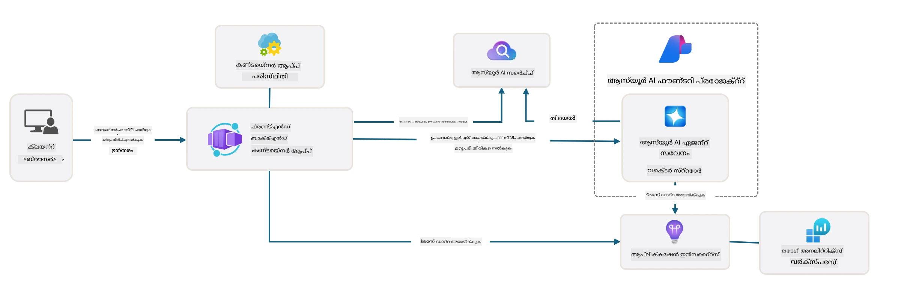

# 3. ഒരു ടെംപ്ലേറ്റ് പിളർത്തി പരിശോധിക്കുക

!!! tip "ഈ മോഡ്യൂൾ അവസാനിക്കുമ്പോൾ നിങ്ങൾക്ക് കഴിയും"

    - [ ] Azure സഹായത്തിന് MCP സർവറുകളുമായുള്ള GitHub Copilot പ്രവർത്തിപ്പിക്കുക
    - [ ] AZD ടെംപ്ലേറ്റ് ഫോൾഡർ സ്റ്റെ്രക്ചർയും ഘടകങ്ങളും മനസ്സിലാക്കുക
    - [ ] ബൈസപ് (Bicep) അടിസ്ഥാനത്തിലുള്ള ഇൻഫ്രാസ്‌ട്രക്ചർ കോഡ് സംഘാടന മാതൃകകൾ പരിശോധിക്കുക
    - [ ] **ലാബ് 3:** GitHub Copilot ഉപയോഗിച്ച് റീപ്പോസിറ്ററി ആർക്കിടെക്ചർ അന്വേഷിക്കാനും മനസ്സിലാക്കാനും 

---


AZD ടെംപ്ലേറ്റുകളും Azure Developer CLI (`azd`) ഉം ഉപയോഗിച്ച് ഞങ്ങൾ സാധാരണവേർപ്പുള്ള റീപ്പോസിറ്ററികളിലൂടെ എളുപ്പത്തിൽ AI ഡെവലപ്പ്മെന്റ് ആരംഭിക്കാം; ഇവയുടെ രൂപത്തിൽ ആയിരിക്കും ഉദാഹരണകോഡ്, ഇൻഫ്രാസ്ട്രക്ചറും കോൺഫിഗറേഷൻ ഫയലുകളും ഉൾപ്പെടുന്ന തയ്യാറായ _സ്റ്റാർട്ടർ_ പ്രോജക്റ്റ്.

**പക്ഷേ, ഇപ്പോൾ, പ്രോജക്റ്റിന്റെ ഘടനയും കോഡ്ബേസും മനസ്സിലാക്കുകയും AZD ടെംപ്ലേറ്റ് മുൻ പരിചയമോ AZD മനസ്സിലാക്കലോ ഇല്ലാതെ തന്നെ കസ്റ്റമൈസ് ചെയ്യാനാകുകയും വേണം!**

---

## 1. GitHub Copilot പ്രവർത്തിപ്പിക്കുക

### 1.1 GitHub Copilot Chat ഇൻസ്റ്റാൾ ചെയ്യുക

[GitHub Copilot with Agent Mode](https://code.visualstudio.com/docs/copilot/chat/chat-agent-mode) ആണിത് അന്വേഷിക്കാനുള്ള സമയമായിരിക്കുന്നു. ഇനി നാചുറൽ ലാംഗ്വേജ് ഉപയോഗിച്ച് ടാസ്‌ക് ഉയർന്ന തലത്തിൽ വിവരിച്ച് പ്രവർത്തനത്തിന് സഹായം ലഭ്യമാകും. ഈ ലാബിന് ഞങ്ങൾ [Copilot Free plan](https://github.com/github-copilot/signup) ഉപയോഗിക്കും, ഇതിന് പൂർത്തീകരണങ്ങൾക്കും ചാറ്റ് ഇടപെടലുകൾക്കും മാസാന്തപരിധി ഉണ്ട്.

ഈ എക്സ്റ്റൻഷൻ മാർക്കറ്റ്പ്ൾസ് എന്നിവയിൽ നിന്നു ഇൻസ്റ്റാൾ ചെയ്യാം, കൂടാതെ ഇത് Codespaces അല്ലെങ്കിൽ ഡെവ് കണ്ടെയ്‌നർ പരിസ്ഥിതികളിൽ ഇതിനകം ലഭ്യമായിരിക്കാം. _Copilot ഐക്കൺ ഡ്രോപ്ഡൗൺയിൽ നിന്ന് `Open Chat` ക്ലിക്ക് ചെയ്ത് `What can you do?` പോലുള്ള പ്രോമ്പ്റ്റ് ടൈപ്പ് ചെയ്യുക_ — ലോഗിൻ ചെയ്യാൻ ആവശ്യപ്പെടാം. **GitHub Copilot Chat സജ്ജമാണ്**.

### 1.2 MCP സർവറുകൾ ഇൻസ്റ്റാൾ ചെയ്യുക

എജന്റ് മോഡ് ഫലപ്രദമാക്കാൻ, ശരിയായ ടൂളുകളിൽ പ്രവേശനം ആവശ്യമാണ്, അവ അറിവ് തിരയാനും പ്രവർത്തനങ്ങൾ ചെയ്യാനും സഹായിക്കും. അതിനായി MCP സർവറുകൾ സഹായിക്കും. ചുവടെയുള്ള സർവറുകൾ കോൺഫിഗർ ചെയ്യാം:

1. [Azure MCP Server](../../../../../workshop/docs/instructions)
1. [Microsoft Docs MCP Server](../../../../../workshop/docs/instructions)

സക്രിയമാക്കാൻ:

1. `.vscode/mcp.json` എന്ന ഫയൽ ഉണ്ടെങ്കിൽ അത് സൃഷ്ടിക്കുക
1. അതിൽ താഴെ കാണിച്ച सञ्चിക പകർത്തി സർവറുകൾ ആരംഭിക്കുക!
   ```json title=".vscode/mcp.json"
   {
      "servers": {
         "Azure MCP Server": {
            "command": "npx",
            "args": [
            "-y",
            "@azure/mcp@latest",
            "server",
            "start"
            ]
         },
         "microsoft.docs.mcp": {
            "type": "http",
            "url": "https://learn.microsoft.com/api/mcp"
         }
      }
   }
   ```

??? warning "നിങ്ങൾക്ക് `npx` ഇൻസ്റ്റാൾ ചെയ്തിട്ടില്ലെന്ന് ഒരു പിഴവ് കാണാം (പരിഹാരത്തിന് ക്ലിക്ക് ചെയ്യുക)"

      പരിഹാരത്തിനായി `.devcontainer/devcontainer.json` ഫയൽ തുറന്ന് features വിഭാഗത്തിൽ താഴെ കാണുന്ന ലൈൻ ചേർക്കുക. പിന്നെ കണ്ടെയ്‌നർ പുനഃസംഘടിപ്പിക്കുക. ആനന്തരം `npx` ഇൻസ്റ്റാൾ ചെയ്തുവെന്നു ഉറപ്പാക്കാം.

      ```title="" linenums="0"
         "features": {
            "ghcr.io/devcontainers/features/node:1": {},
            ...
         },
      ```

---

### 1.3 GitHub Copilot Chat പരീക്ഷിക്കുക

**ആദ്യമായി VS Code കമാൻഡ് ലൈൻ വഴി Azure-യിൽ പ്രവേശിക്കാൻ `azd auth login` ഉപയോഗിക്കുക. നേരിട്ട് Azure CLI കമാൻഡുകൾ പ്രവർത്തിപ്പിക്കാൻ `az login` ഉപയോഗിക്കാം.**

ഇപ്പോൾ നിങ്ങൾക്ക് നിങ്ങളുടെ Azure സബ്‌സ്‌ക്രിപ്ഷൻ നില ചോദിച്ച് അറിയാം, വിനിയോഗിച്ച റിസോഴ്‌സുകളോ കോൺഫിഗറേഷനോ സംബന്ധിച്ച് ചോദിക്കാം. ഈ പ്രോമ്പ്റ്റുകൾ പരീക്ഷിക്കുക:

1. `List my Azure resource groups`
1. `#foundry list my current deployments`

കൂടുതൽ, Microsoft Docs MCP സർവറിന്റെ അടിസ്ഥാനത്തിൽ Azure ഡോക്യുമെന്റേഷൻ സംബന്ധിച്ച ചോദ്യങ്ങൾ ചോദിക്കാം, പ്രതികരണങ്ങൾ ലഭിക്കും. ഈ പ്രോമ്പ്റ്റുകൾ പരിശോധിക്കുക:

1. `#microsoft_docs_search What is Azure Developer CLI?`
1. `#microsoft_docs_search Show me a Python tutorial to chat with deployed model`

അല്ലെങ്കിൽ ഒരു ചുമതലയെ പൂർത്തിയാക്കാനായി കോഡ് സ്നിപ്പെറ്റുകൾ ആവശ്യപ്പെടാം. ഈ പ്രോമ്പ്റ്റ് ഉപയോഗിക്കുക:

1. `Give me a Python code example that uses AAD for an interactive chat client`

`Ask` മോഡിൽ, ഇത് നിങ്ങൾക്ക് കോഡ് കോപ്പി ചെയ്ത് പരീക്ഷിക്കാൻ സഹായിക്കും. `Agent` മോഡിൽ, ഇത് ചുവടുബാധിച്ച റിസോഴ്‌സുകളും സെറ്റപ്പ് സ്ക്രിപറ്റുകളും ഡോക്യുമെന്റേഷനും സൃഷ്ടിച്ച് പ്രവർത്തനം നടത്താനായി ഒരു ഘട്ടം മുന്നേറാം.

**നിങ്ങൾ ഇപ്പോൾ ടെംപ്ലേറ്റ് റീപ്പോസിറ്ററി അന്വേഷിക്കാൻ സജ്ജരാണ്**

---

## 2. ആർക്കിടെക്ചർ പിളർത്തി നോക്കുക

??? prompt "ചോദ്യം: docs/images/architecture.png ലെ ആപ്ലിക്കേഷൻ ആർക്കിടെക്ചർ 1 പാരഗ്രാഫിൽ വിശദീകരിക്കുക"

      ഈ ആപ്ലിക്കേഷൻ ഒരു Azure-ൽ അടിസ്ഥിതമായ AI-ചാലിതമായ ചാറ്റ് ആപ്ലിക്കേഷൻ ആണ്, ആധുനിക ഏജന്റ്-അടിസ്ഥിത ആർക്കിടെക്ചർ കാണിക്കുന്നു. സൊല്യൂഷൻ Azure Container App-ഉമ്മാണ് കേന്ദ്രീകരിക്കുന്നത്, അതാണ് മെൈനുള്ള അപ്ലിക്കേഷൻ കോഡ് ഹോസ്റ്റ് ചെയ്യുന്നത്, ഇത് ഉപയോക്തൃ ഇൻപുട്ട് പ്രോസസ് ചെയ്ത് AI ഏജന്റിലൂടെ ബുദ്ധിമുട്ടുള്ള പ്രതികരണങ്ങൾ ഉളവാക്കുന്നു.
      
      ആർക്കിടെക്ചർ Microsoft Foundry Project-നെയാണ് AI ശേഷികളുടെ അടിസ്ഥാനം ആയി ഉപയോഗിക്കുന്നത്, ഇത് Azure AI Services-നുമായി ബന്ധിപ്പിച്ച് അടിസ്ഥാന ലാംഗ്വേജ് മോഡലുകളും (ഉദാഹരണത്തിന് gpt-4.1-mini) ഏജന്റ് പ്രവർത്തനങ്ങളും നൽകുന്നു. ഉപയോക്തൃ ഇടപെടലുകൾ React അടിസ്ഥാനമുള്ള ഫ്രണ്ടെന്റിൽ നിന്നും FastAPI ബാക്ക്എൻഡിലേക്കും ഒഴുകി, AI ഏജന്റ് സേവനവുമായി ബന്ധപ്പെടുന്നു, പരിസ്ഥിതി സന്ദർഭപ്രദമായ പ്രതികരണങ്ങൾ നിർമ്മിക്കാൻ.
      
      സിസ്റ്റം ഫയൽ തിരയലോ Azure AI Search സേവനത്തിലൂടെയോ അറിവ് പുനരുല്ലേഖനം സാധ്യമാക്കുന്നു, ചുമത്തിയ രേഖകളിൽ നിന്നുള്ള വിവരങ്ങൾ ഏജന്റ് അന്വേഷിച്ച് ഉദ്ധരിക്കാം. പ്രവർത്തന മികവിനായി ആർക്കിടെക്ചറിനുള്ളിൽ Application Insights, Log Analytics Workspace തുടങ്ങിയ സമഗ്രമായ നിരീക്ഷണ സംവിധാനം ഉൾപ്പെടുത്തിയാണ് ട്രേസിംഗ്, ലോഗിംഗ്, പ്രകടന മെച്ചപ്പെടുത്തൽ സൗകര്യമാക്കുന്നത്.
      
      Azure Storage അപ്ലിക്കേഷൻ ഡേറ്റ്, ഫയൽ അപ്‌ലോഡ് എന്നിവയ്ക്കായി ബ്ലോബ് സ്‌റ്റോറെജ് നൽകുന്നു, Managed Identity ക്രെഡൻഷ്യലുകൾ സംഭരിക്കാതെ Azure റിസോഴ്‌സുകൾക്ക് സുരക്ഷിതമായ ആക്‌സസ് ഉറപ്പാക്കുന്നു. മുഴുവൻ സൊല്യൂഷൻ സ്കെയിലബിലിറ്റിയും പരിപാലനക്ഷമതയും കണക്കിലെടുത്തുള്ളതാണ്, ആവശ്യക്കുറവുകൾക്കനുസരിച്ച് കൺടെയ്നറിലായ അപ്ലിക്കേഷൻ ഓട്ടോമാറ്റിക്കായി സ്കെയിൽ ചെയ്യും, കൂടാതെ ആസ്യൂറിന്റെ മാനേജുചെയ്യുന്ന സേവനപരിസരത്തിലൂടെ ബിൽറ്റ്-ഇൻ സുരക്ഷ, നിരീക്ഷണം, CI/CD സവിശേഷതകൾ നൽകുന്നു.



---

## 3. റീപ്പോസിറ്ററി ഘടന

!!! prompt "ചോദ്യം: ടെംപ്ലേറ്റ് ഫോൾഡർ ഘടന വിശദീകരിക്കുക. ഒരു കാഴ്ചയിലുള്ള ഹയർആർക്കിക്കൽ ബൃഹത്തളത്തിൽ തുടങ്ങി."

??? info "ഉത്തരവും: കാഴ്ചയിലുള്ള ഹയർആർക്കിക്കൽ ബൃഹത്തളം"

      ```bash title="" 
      get-started-with-ai-agents/
      ├── 📋 Configuration & Setup
      │   ├── azure.yaml                    # Azure Developer CLI കോൺഫിഗറേഷൻ
      │   ├── docker-compose.yaml           # ലോക്കൽ ഡെവലപ്പ്മെന്റ് കണ്ടെയ്‌നറുകൾ
      │   ├── pyproject.toml                # Python പ്രോജക്റ്റ് കോൺഫിഗറേഷൻ
      │   ├── requirements-dev.txt          # ഡെവലപ്പ്മെന്റ് ആശ്രിതങ്ങൾ
      │   └── .devcontainer/                # VS Code ഡെവ് കണ്ടെയ്‌നർ സെറ്റപ്പ്
      │
      ├── 🏗️ Infrastructure (infra/)
      │   ├── main.bicep                    # പ്രധാന ഇൻഫ്രാസ്ട്രക്ചർ ടെംപ്ലേറ്റ്
      │   ├── api.bicep                     # API-നുവേണ്ടി പ്രത്യേക റിസോഴ്‌സുകൾ
      │   ├── main.parameters.json          # ഇൻഫ്രാസ്ട്രക്ചർ പാരാമീറ്ററുകൾ
      │   └── core/                         # മോടുലാർ ഇൻഫ്രാസ്ട്രക്ചർ ഘടകങ്ങൾ
      │       ├── ai/                       # AI സേവന കോൺഫിഗറേഷനുകൾ
      │       ├── host/                     # ഹോസ്റ്റിംഗ് ഇൻഫ്രാസ്ട്രക്ചർ
      │       ├── monitor/                  # നിരീക്ഷണവും ലോഗിംഗും
      │       ├── search/                   # Azure AI Search സെറ്റപ്പ്
      │       ├── security/                 # സുരക്ഷയും ഐഡന്റിറ്റി
      │       └── storage/                  # സ്റ്റോറിജ് അക്കൗണ്ട് കോൺഫിഗുകൾ
      │
      ├── 💻 Application Source (src/)
      │   ├── api/                          # ബാക്ക്എൻഡ് API
      │   │   ├── main.py                   # FastAPI അപ്ലിക്കേഷൻ എൻട്രി
      │   │   ├── routes.py                 # API റൂട്ട് നിർവചനങ്ങൾ
      │   │   ├── search_index_manager.py   # തിരയൽ സവിശേഷതകൾ
      │   │   ├── data/                     # API ഡേറ്റ കൈകാര്യം ചെയ്യൽ
      │   │   ├── static/                   # സ്റ്റാറ്റിക് വെബ് ആസ്തികൾ
      │   │   └── templates/                # HTML ടെംപ്ലേറ്റുകൾ
      │   ├── frontend/                     # React/TypeScript ഫ്രന്റ്എൻഡ്
      │   │   ├── package.json              # Node.js ആശ്രിതങ്ങൾ
      │   │   ├── vite.config.ts            # Vite ബിൽഡ് കോൺഫിഗറേഷൻ
      │   │   └── src/                      # ഫ്രന്റ്എൻഡ് സോഴ്സ് കോഡ്
      │   ├── data/                         # സാമ്പിൾ ഡേറ്റ ഫയലുകൾ
      │   │   └── embeddings.csv            # മുൻകൂട്ടി കണക്കാക്കിയ എംബെഡിങ്ങുകൾ
      │   ├── files/                        # അറിവ് ഗ്രന്ഥശാല ഫയലുകൾ
      │   │   ├── customer_info_*.json      # ഉപഭോക്തൃ ഡേറ്റ സാമ്പിളുകൾ
      │   │   └── product_info_*.md         # ഉൽപ്പന്ന ഡോക്യുമെന്റേഷൻ
      │   ├── Dockerfile                    # കണ്ടെയ്‌നർ കോൺഫിഗറേഷൻ
      │   └── requirements.txt              # Python ആശ്രിതങ്ങൾ
      │
      ├── 🔧 Automation & Scripts (scripts/)
      │   ├── postdeploy.sh/.ps1           # പോസ്റ്റ്-ഡിപ്ലോയ്മെന്റ് സെറ്റപ്പ്
      │   ├── setup_credential.sh/.ps1     # ക്രെഡൻഷ്യൽ കോൺഫിഗറേഷൻ
      │   ├── validate_env_vars.sh/.ps1    # പരിസ്ഥിതി ഓവർവ്യൂ (വാലിഡേഷൻ)
      │   └── resolve_model_quota.sh/.ps1  # മോഡൽ ക്വോട്ട മാനേജ്‌മെന്റ്
      │
      ├── 🧪 Testing & Evaluation
      │   ├── tests/                        # യൂണിറ്റ് & ഇന്റഗ്രേഷൻ ടെസ്റ്റുകൾ
      │   │   └── test_search_index_manager.py
      │   ├── evals/                        # ഏജന്റ് നിർണായക ഫ്‌്രെയിംവർക്ക്
      │   │   ├── evaluate.py               # വിലയിരുത്തൽ റണ്ണർ
      │   │   ├── eval-queries.json         # ടെസ്റ്റ് ക്വറികൾ
      │   │   └── eval-action-data-path.json
      │   ├── sandbox/                      # ഡെവലപ്‌മെന്റ് പ്ലേഗ്രൗണ്ട്
      │   │   ├── 1-quickstart.py           # ആരംഭിക്കാൻ ഉദാഹരണങ്ങൾ
      │   │   └── aad-interactive-chat.py   # प्रमाणीकरण ഉദാഹരണങ്ങൾ
      │   └── airedteaming/                 # AI സുരക്ഷാ വിലയിരുത്തൽ
      │       └── ai_redteaming.py          # റെഡ് ടീം ടെസ്റ്റിംഗ്
      │
      ├── 📚 Documentation (docs/)
      │   ├── deployment.md                 # ഡിപ്ലോയ്മെന്റ് ഗൈഡ്
      │   ├── local_development.md          # ലോക്കൽ സെറ്റപ്പ് നിർദ്ദേശങ്ങൾ
      │   ├── troubleshooting.md            # സാധാരണ പ്രശ്‌നങ്ങൾ & പരിഹാരങ്ങൾ
      │   ├── azure_account_setup.md        # Azure ആവശ്യകതകൾ
      │   └── images/                       # ഡോക്യുമെന്റേഷൻ ആസ്തികൾ
      │
      └── 📄 Project Metadata
         ├── README.md                     # പ്രോജക്റ്റ് അവലോകനം
         ├── CODE_OF_CONDUCT.md           # കമ്മ്യൂണിറ്റി നയങ്ങൾ
         ├── CONTRIBUTING.md              # സംഭാവന മാർഗ്ഗനിർദേശം
         ├── LICENSE                      # ലൈസൻസ് നിലപാട്
         └── next-steps.md                # ഡിപ്ലോയ്മെന്റ് ശേഷമുള്ള മാർഗ്ഗനിർദ്ദേശം
      ```

### 3.1 കോർ ആപ്പ് ആർക്കിടെക്ചർ

ഈ ടെംപ്ലേറ്റ് ഒരു **ഫുൾ-സ്റ്റാക്ക് വെബ് അപ്ലിക്കേഷൻ** മാതൃക പിന്തുടരുന്നു:

- **ബാക്ക്എൻഡ്**: Python FastAPI Azure AI ഇന്റഗ്രേഷനോടെ
- **ഫ്രണ്ട്എൻഡ്**: TypeScript/React Vite ബിൽഡ് സിസ്റ്റത്തോടുകൂടെ
- **ഇൻഫ്രാസ്ട്രക്ചർ**: ക്ലൗഡ് റിസോഴ്‌സുകൾക്കായി Azure Bicep ടെംപ്ലേറ്റുകൾ
- **കണ്ടെയ്‌നറൈസേഷൻ**: ഏകീകൃത ഡിപ്ലോയ്മെന്റിനായി Docker

### 3.2 ഇൻഫ്രാസ്ട്രക്ചർ കോഡ് ആയി (bicep)

ഇൻഫ്രാസ്ട്രക്ചർ തലത്തിൽ **Azure Bicep** ടെംപ്ലേറ്റുകൾ modular ആയി ക്രമീകരിച്ചിരിക്കുന്നു:

   - **`main.bicep`**: എല്ലാ Azure റിസോഴ്‌സുകളും കോർഡിനേറ്റ് ചെയ്യുന്നു
   - **`core/` മോഡ്യൂളുകൾ**: വ്യത്യസ്ത സേവനങ്ങൾക്കായി പുനരുപയോഗിക്കാവുന്ന ഘടകങ്ങൾ
      - AI സേവനങ്ങൾ (Microsoft Foundry മോഡലുകൾ, AI Search)
      - കണ്ടെയ്‌നർ ഹോസ്റ്റിംഗ് (Azure Container Apps)
      - നിരീക്ഷണം (Application Insights, Log Analytics)
      - സുരക്ഷ (Key Vault, Managed Identity)

### 3.3 അപ്ലിക്കേഷൻ സോഴ്‌സ് (`src/`)

**ബാക്ക്എൻഡ് API (`src/api/`)**:

- FastAPI അടിസ്ഥാനമാക്കിയ REST API
- Foundry ഏജന്റുകൾ ഇന്റഗ്രേഷൻ
- അറിവ് പുനരുദ്ധാരണത്തിനായി തിരയൽ ഇൻഡക്സ് മാനേജ്‌മെന്റ്
- ഫയൽ അപ്‌ലോഡ്, പ്രോസസ്സിംഗ് സൗകര്യങ്ങൾ

**ഫ്രണ്ട്എൻഡ് (`src/frontend/`)**:

- ആധുനിക React/TypeScript SPA
- ദ്രുത ഡെവലപ്പ്മെന്റിനും മെച്ചപ്പെടുത്തിയ ബിൽഡിനും Vite
- ഏജന്റ് ഇടപെടലുകൾക്കായി ചാറ്റ് ഇന്റർഫേസ്

**അറിവ് ഗ്രന്ഥശാല (`src/files/`)**:

- ഉദാഹരണ ഉപഭോക്തൃ & ഉൽപ്പന്ന ഡേറ്റ
- ഫയൽ അടിസ്ഥാന അന്വേക്ഷണത്തിന്റെ പ്രദർശനം
- JSON & Markdown ഫോർമാറ്റ് ഉദാഹരണങ്ങൾ


### 3.4 ഡെവ്ഒപ്സ് & ഓട്ടോമേഷൻ

**സ്ക്രിപ്റ്റുകൾ (`scripts/`)**:

- ക്രോസ്-പ്ലാറ്റ്‌ഫോർം പവർഷെൽ, Bash സ്ക്രിപ്റ്റുകൾ
- പരിസ്ഥിതി പരിശോധനം, സെറ്റപ്പ്
- പോസ്റ്റ്-ഡിപ്ലോയ്മെന്റ് കോൺഫിഗറേഷൻ
- മോഡൽ ക്വോട്ട മാനേജ്‌മെന്റ്

**Azure Developer CLI ഇന്റഗ്രേഷൻ**:

- `azure.yaml` azd പ്രവൃത്തിസൂത്രങ്ങൾക്കായി
- ഓട്ടോമാറ്റഡ് പ്രൊവിഷനിംഗ്, ഡിപ്ലോയ്മെന്റ്
- പരിസ്ഥിതി വേരി‌ബിൾ മാനേജ്‌മെന്റ്

### 3.5 ടെസ്റ്റിംഗും ഗുണനിലവാര ഉറപ്പും

**വിലയിരുത്തൽ ഫ്രെയിംവർക്ക് (`evals/`)**:

- ഏജന്റ് പ്രകടന വിലയിരുത്തൽ
- ക്വറി-റസ്പോൺസ് ഗുണനിലവാര പരിശോധന
- സ്വയം പ്രവർത്തിക്കുന്ന മേൽനോട്ട പൈപ്പ്‌ലൈൻ

**AI സുരക്ഷ (`airedteaming/`)**:

- AI സുരക്ഷിതത്വത്തിനായുള്ള റെഡ് ടീം പരിശോധന
- സുരക്ഷാ അപായങ്ങൾ സ്കാനിംഗ്
- ഉത്തരവാദിത്തമുള്ള AI പ്രവർത്തനങ്ങൾ

---

## 4. അഭിനന്ദനങ്ങൾ 🏆

GitHub Copilot Chat MCP സർവറുകളുമായി ഉപയോഗിച്ച് നിങ്ങൾ സഫലമായി റീപ്പോസിറ്ററി പരിശോധിച്ചു.

- [X] Azure-ക്ക് GitHub Copilot പ്രവർത്തിപ്പിച്ചു
- [X] ആപ്ലിക്കേഷൻ ആർക്കിടെക്ചർ മനസ്സിലാക്കി
- [X] AZD ടെംപ്ലേറ്റ് ഘടന പരിശോധിച്ചു

ഇത് ഈ ടെംപ്ലേറ്റിനുള്ള _ഇൻഫ്രാസ്ട്രക്ചർ ആസ് കോഡ്_ ആസ്തികൾക്കുള്ള ഒരു ധാരണ നൽകുന്നു. അടുത്തതായി AZD-നുള്ള കോൺഫിഗറേഷൻ ഫയൽ പരിശോധിക്കും.

---

<!-- CO-OP TRANSLATOR DISCLAIMER START -->
**അസംബന്ധമായ അറിയിപ്പ്**:  
ഈ ഡോക്യുമെന്റ് [Co-op Translator](https://github.com/Azure/co-op-translator) എന്ന AI വിവര്‍ത്തന സേവനം ഉപയോഗിച്ച് വിവര്‍ത്തനം ചെയ്യപ്പെട്ടതാണ്. ഞങ്ങൾ കൃത്യതയ്ക്ക് ശ്രമിക്കുമ്പോഴും, സ്വയമേധയാ വിവർത്തനങ്ങളിൽ പിശകുകൾ അല്ലെങ്കിൽ不ശുദ്ധതകൾ ഉണ്ടാകാമെന്ന് കരുതുക. അവിഭക്ത ഭാഷയിൽ ഉള്ള ആദിമ ഡോക്യുമെന്റ് അംഗീകൃത ഉറവിടമായി കണക്കാക്കണം. ഗുരുതരമായ വിവരങ്ങൾക്ക്, പ്രൊഫഷണൽ മാനുഷിക വിവര്‍ത്തനം ശുപാര്‍ശ ചെയ്യപ്പെടുന്നു. ഈ വിവർത്തനത്തിന്റെ ഉപയോഗത്തിൽ നിന്നുണ്ടാകുന്ന തെറ്റായ ധാരണകൾക്കും വ്യാഖ്യാനങ്ങൾക്കും ഞങ്ങൾ ഉത്തരവാദിയല്ല.
<!-- CO-OP TRANSLATOR DISCLAIMER END -->