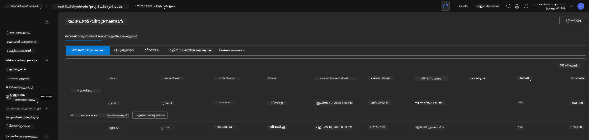

<!--
CO_OP_TRANSLATOR_METADATA:
{
  "original_hash": "6539a34c770f3ceff282370d72ee74dc",
  "translation_date": "2025-11-24T22:30:06+00:00",
  "source_file": "workshop/docs/instructions/6-Teardown-Infrastructure.md",
  "language_code": "ml"
}
-->
# 6. ഇൻഫ്രാസ്ട്രക്ചർ നീക്കംചെയ്യുക

!!! tip "ഈ മോഡ്യൂൾ പൂർത്തിയാക്കുമ്പോൾ നിങ്ങൾക്ക് കഴിയും"

    - [ ] ഇനം
    - [ ] ഇനം
    - [ ] ഇനം

---

## ബോണസ് വ്യായാമങ്ങൾ

പദ്ധതി നീക്കംചെയ്യുന്നതിന് മുമ്പ്, കുറച്ച് സമയം ചിലവഴിച്ച് തുറന്ന സ്വഭാവമുള്ള ചില പരീക്ഷണങ്ങൾ നടത്തുക.

!!! danger "NITYA-TODO: പരീക്ഷിക്കാൻ ചില നിർദ്ദേശങ്ങൾ രൂപപ്പെടുത്തുക"

---

## ഇൻഫ്രാസ്ട്രക്ചർ നീക്കംചെയ്യുക

1. ഇൻഫ്രാസ്ട്രക്ചർ നീക്കംചെയ്യുന്നത് എളുപ്പമാണ്:
      
      ```bash title="" linenums="0"
      azd down --purge
      ```
1. `--purge` ഫ്ലാഗ് ഉപയോഗിക്കുന്നത് സോഫ്റ്റ്-ഡിലീറ്റ് ചെയ്ത Cognitive Service വിഭവങ്ങളും നീക്കംചെയ്യുകയും, ഈ വിഭവങ്ങൾ പിടിച്ചിരിക്കുന്ന ക്വോട്ടാ മോചിപ്പിക്കുകയും ചെയ്യുന്നു. പൂർത്തിയാകുമ്പോൾ നിങ്ങൾക്ക് ഇതുപോലുള്ള ഒരു ഫലമുണ്ടാകും:
      
      ```bash title="" linenums="0"
      ? Total resources to delete: 11, are you sure you want to continue? Yes
      Deleting your resources can take some time.
      (✓) Done: Deleted resource group rg-nitya-mshack-azd
      (✓) Done: Purging Cognitive Account: aoai-3cz3zkynhvpbc

      SUCCESS: Your application was removed from Azure in 11 minutes 4 seconds.
      ```

1. (ഓപ്ഷണൽ) നിങ്ങൾ ഇപ്പോൾ വീണ്ടും `azd up` പ്രവർത്തിപ്പിച്ചാൽ, പരിസ്ഥിതി വ്യത്യാസം `.azure` ഫോൾഡറിൽ മാറ്റി (സംരക്ഷിച്ച്) സൂക്ഷിച്ചതിനാൽ gpt-4.1 മോഡൽ വീണ്ടും ഡിപ്ലോയ് ചെയ്യുന്നതായി നിങ്ങൾ ശ്രദ്ധിക്കും.

      മോഡൽ ഡിപ്ലോയ്‌മെന്റുകൾ **മുമ്പ്** ഇങ്ങനെയായിരുന്നു:

      

      **ശേഷം** ഇത് ഇങ്ങനെയായി:
      

---

<!-- CO-OP TRANSLATOR DISCLAIMER START -->
**അറിയിപ്പ്**:  
ഈ പ്രമാണം AI വിവർത്തന സേവനം [Co-op Translator](https://github.com/Azure/co-op-translator) ഉപയോഗിച്ച് വിവർത്തനം ചെയ്തതാണ്. ഞങ്ങൾ കൃത്യതയ്ക്കായി ശ്രമിക്കുന്നുവെങ്കിലും, സ്വയം പ്രവർത്തിക്കുന്ന വിവർത്തനങ്ങളിൽ പിഴവുകൾ അല്ലെങ്കിൽ തെറ്റായ വിവരങ്ങൾ ഉണ്ടാകാൻ സാധ്യതയുണ്ട്. പ്രമാണത്തിന്റെ മാതൃഭാഷയിലുള്ള യഥാർത്ഥ പതിപ്പ് പ്രാമാണികമായ ഉറവിടമായി പരിഗണിക്കണം. നിർണായകമായ വിവരങ്ങൾക്ക്, പ്രൊഫഷണൽ മനുഷ്യ വിവർത്തനം ശുപാർശ ചെയ്യുന്നു. ഈ വിവർത്തനം ഉപയോഗിച്ച് ഉണ്ടാകുന്ന തെറ്റിദ്ധാരണകൾ അല്ലെങ്കിൽ തെറ്റായ വ്യാഖ്യാനങ്ങൾക്കായി ഞങ്ങൾ ഉത്തരവാദികളല്ല.
<!-- CO-OP TRANSLATOR DISCLAIMER END -->