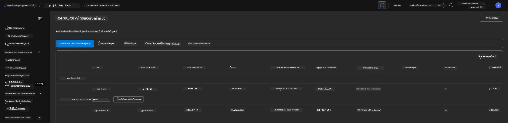
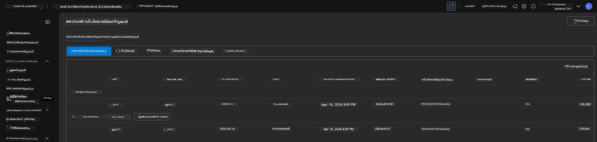

# 6. അടച്ചിടൽ അടിസ്ഥാനസൗകര്യം

!!! tip "ഈ MODULE അവസാനിക്കുമ്പോൾ നിങ്ങൾക്ക് കഴിയും"

    - [ ] റിസോഴ്‌സ് ക്ലീനപ്പ്‌പ്പും ചെലവ് നിയന്ത്രണത്തിന്റെ പ്രാധാന്യം മനസ്സിലാക്കുക
    - [ ] `azd down` ഉപയോഗിച്ച് അടിസ്ഥാനസൗകര്യം സുരക്ഷിതമായി ഡിപ്രൊവിഷൻ ചെയ്യുക
    - [ ] ആവശ്യമെങ്കിൽ സോഫ്റ്റ്-ഡിലീറ്റ് ചെയ്ത കോഗ്നിറ്റീവ് സേവനങ്ങൾ പുനഃസ്ഥാപിക്കുക
    - [ ] **ലാബ് 6:** ആസ്യൂർ റിസോഴ്‌സുകൾ ക്ലീൻ ചെയ്ത് നീക്കം സ്ഥിരീകരിക്കുക

---

## ബോണസ് അഭ്യാസങ്ങൾ

പദ്ധതി അടച്ചിടുന്നതിന് മുമ്പായി, തുറന്ന മാനസികതയോടെ കുറച്ച് മിനിറ്റുകൾ സമർപ്പിച്ച് ചില പരീക്ഷണങ്ങൾ നടത്തുക.

!!! info "ഈ പരീക്ഷണ ചോദ്യങ്ങൾ ശ്രമിക്കുക"

    **GitHub Copilot ഉപയോഗിച്ച് പരീക്ഷിക്കുക:**
    
    1. ചോദിക്കുക: `മൾട്ടി-ഏജന്റ് സീനാറിയോകൾക്ക് മറ്റേതെല്ലാം AZD ടെംപ്ലറ്റുകൾ ശ്രമിക്കാമോ?`
    2. ചോദിക്കുക: `ഹെൽത്ത്‌കെയർ ഉപയോഗക്കേസിനായി ഏജന്റ് നിർദ്ദേശങ്ങൾ എങ്ങനെ പെരുമാറാം?`
    3. ചോദിക്കുക: `ചെലവ് അ оптимൈസേഷൻ നിയന്ത്രിക്കുന്ന പരിസ്ഥിതി വേരിയബിളുകൾ എന്തൊക്കെയാണ്?`
    
    **ആസ്യൂർ പോർട്ടൽ പരിശോധിക്കുക:**
    
    1. നിങ്ങളുടെ ഡിപ്ലോയ്മെന്റിനുള്ള ആപ്ലിക്കേഷൻ ഇൻസൈറ്റ്സ് മെട്ട്രിക്സ് വിലയിരുത്തുക
    2. പ്രൊവിഷൻ ചെയ്ത റിസോഴ്‌സുകൾക്കുള്ള ചെലവ് വിശകലനം പരിശോധിക്കുക
    3. മൈക്രോസോഫ്റ്റ് ഫൗണ്ട്രി പോർട്ടൽ ഏജന്റ് പ്ലേഗ്രൗണ്ട് ഒന്നിക്കൽ കൂടി ആലോചിക്കുക

---

## ഇൻഫ്ര നിർമാർജനം

1. അടിസ്ഥാനസൗകര്യം അടച്ചിടൽ ഇത്ര എളുപ്പമാണ്:
      
      ```bash title="" linenums="0"
      azd down --purge
      ```
1. `--purge` പതാക ഉപയോഗിക്കുന്നത് സോഫ്റ്റ്-ഡിലീറ്റ് ചെയ്ത കോഗ്നിറ്റീവ് സർവീസ് റിസോഴ്‌സുകൾ പോലും പരിസമയം വിട്ടു നീക്കം ചെയ്യുന്നതിന് ആണ്. പൂർത്തിയാകുമ്പോൾ നിങ്ങൾക്ക് ഇതുപോലെ ഒരു സന്ദേശം കാണും:
      
      ```bash title="" linenums="0"
      ? Total resources to delete: 11, are you sure you want to continue? Yes
      Deleting your resources can take some time.
      (✓) Done: Deleted resource group rg-nitya-mshack-azd
      (✓) Done: Purging Cognitive Account: aoai-3cz3zkynhvpbc

      SUCCESS: Your application was removed from Azure in 11 minutes 4 seconds.
      ```

1. (ഐച്ഛികം) ഇപ്പോൾ നിങ്ങൾ വീണ്ടും `azd up` റണ്ണ് ചെയ്‌താൽ, ഗ്പ്റ്റ്-4.1 മോഡൽ ഡിപ്ലോയ്മെന്റ് ആകുന്നത് ശ്രദ്ധിക്കും, കാരണം പരിസ്ഥിതി വേരിയബിൾ ലൊക്കൽ `.azure` ഫോൾഡറിൽ മാറ്റപ്പെട്ട് സേവ് ചെയ്തു.

      ഇത് മോഡൽ ഡിപ്ലോയ്മെന്റുകൾ **മുൻപ്**:

      

      ഇനി ഇത് **പിന്നീട്**:
      

---

<!-- CO-OP TRANSLATOR DISCLAIMER START -->
**നിരാകരണം**:  
ഈ ഡോക്യുമെന്റ് എഐ വിവർത്തന സേവനം [Co-op Translator](https://github.com/Azure/co-op-translator) ഉപയോഗിച്ച് വിവർത്തനം ചെയ്തതാണ്. 정확തക്കായി നാം ശ്രമിക്കുന്നതിനിടയിലാണ്, എന്നാൽ സ്വയമേവ നടത്തിയ വിവർത്തനങ്ങളിൽ പിശക് կամ അജീവതകൾ ഉണ്ടാകാനുള്ള സാധ്യതയുണ്ടെന്ന് ദയവായി ശ്രദ്ധിക്കുക. ആത്മഭാഷയിൽ ഉള്ള സർവസ്വമായ ഡോക്യുമെന്റാണ് പ്രാമാണികമായ ഉറവിടം ആയി കണക്കാക്കേണ്ടത്. നിർണായക വിവരങ്ങൾക്ക്, പ്രൊഫഷണൽ മനുഷ്യ വിവർത്തനം നിർദ്ദേശിക്കുന്നു. ഈ വിവർത്തനം ഉപയോഗിച്ചതിൽ നിന്ന് ഉണ്ടാകുന്ന ഏതെങ്കിലും തെറ്റിദ്ധാരണകൾ അല്ലെങ്കിൽ വ്യാഖ്യാനഭ്രാന്തികൾക്കായി ഞങ്ങൾ ഉത്തരവാദപ്പെട്ടവരല്ല.
<!-- CO-OP TRANSLATOR DISCLAIMER END -->