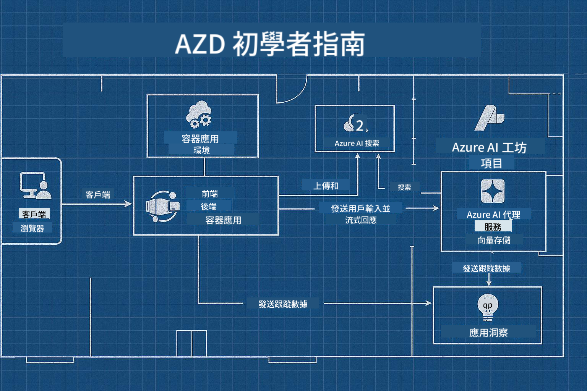

<!--
CO_OP_TRANSLATOR_METADATA:
{
  "original_hash": "245d24997bbcf2bae93bb2a503845d37",
  "translation_date": "2025-09-23T11:44:33+00:00",
  "source_file": "workshop/README.md",
  "language_code": "mo"
}
-->
# AZD for AI Developers 工作坊

## AZD 範本

為您的特定場景構建企業級 AI 應用解決方案，就像建造自己的家一樣。您可以自己設計，逐步建造，並負責確保其符合所有治理和開發指南。

**或者 ....**

您可以與建築師合作，他可以為您提供一個 _藍圖_ 作為起點，然後與您一起 _定制_，以滿足您的需求。這樣，您可以專注於讓**您的家**變得特別，而基礎的布線、管道和其他依賴項則由專家為您處理。

**這就是 [AI App Templates](https://ai.azure.com/templates) 背後的理念** - 根據您的核心需求和依賴項，提供一系列構建不同類型 AI 應用“家”的藍圖。

## 範本定制

這些範本設計用於與 [Azure AI Foundry](https://ai.azure.com) 一起工作。可以將這個平台視為您的“建築承包商”，它擁有完成工作所需的所有資源、工具和專業知識！

您只需選擇 [您的起始範本](https://learn.microsoft.com/en-us/azure/ai-foundry/how-to/develop/ai-template-get-started)。例如，我們將專注於 _Get Started with AI Agents_ 範本，為您構建一個“代理型 AI 家”，該範本預設了 AI 搜索、紅隊測試、評估、追蹤、監控等功能！



您只需預約時間與建築師一起，指導您完成定制過程。[GitHub Copilot for Azure](https://learn.microsoft.com/en-us/azure/developer/github-copilot-azure/get-started) 可以成為您的指導者。只需“與它聊天”即可：

- 瞭解範本中的 Azure 功能
- 部署 Azure 資源
- 獲取有關部署的信息
- 診斷和排除問題！

在這個工作坊中，我們將學習如何 _解構_ 現有範本（以瞭解其提供的功能），然後逐步 _定制_ 它（以滿足我們的需求）。

AI 範本**讓一切運行** - 通過完成工作坊，您將學會如何**讓它屬於您自己**。

----

**工作坊導航**
- **📚 課程首頁**: [AZD For Beginners](../README.md)
- **📖 相關章節**: 涵蓋 [第 1 章](../README.md#-chapter-1-foundation--quick-start)、[第 2 章](../README.md#-chapter-2-ai-first-development-recommended-for-ai-developers) 和 [第 5 章](../README.md#-chapter-5-multi-agent-ai-solutions-advanced)
- **🛠️ 實作實驗**: [AI Workshop Lab](../docs/ai-foundry/ai-workshop-lab.md)
- **🚀 下一步**: [工作坊模組](../../../workshop)

歡迎參加專注於 AI 應用部署的 Azure Developer CLI (AZD) 學習工作坊。本工作坊旨在帶您從 AZD 基礎知識到部署生產就緒的 AI 解決方案。

## 工作坊概覽

**時長**: 2-3 小時  
**難度**: 初學者到中級  
**先決條件**: 基本的 Azure、命令行工具和 AI 概念知識

### 您將學到什麼

- **AZD 基礎**: 瞭解基於代碼的基礎設施 (Infrastructure as Code) 與 AZD
- 🤖 **AI 服務整合**: 部署 Azure OpenAI、AI 搜索和其他 AI 服務
- **容器部署**: 使用 Azure Container Apps 部署 AI 應用
- **安全最佳實踐**: 實現受管身份和安全配置
- **監控與可觀測性**: 為 AI 工作負載設置 Application Insights
- **生產模式**: 企業級部署策略

## 工作坊結構

### 模組 1: AZD 基礎 (30 分鐘)
- 安裝和配置 AZD
- 瞭解 AZD 項目結構
- 您的第一次 AZD 部署
- **實驗**: 部署一個簡單的 Web 應用

### 模組 2: Azure OpenAI 整合 (45 分鐘)
- 設置 Azure OpenAI 資源
- 模型部署策略
- 配置 API 訪問和身份驗證
- **實驗**: 使用 GPT-4 部署聊天應用

### 模組 3: RAG 應用 (45 分鐘)
- Azure AI 搜索整合
- 使用 Azure Document Intelligence 處理文檔
- 向量嵌入和語義搜索
- **實驗**: 構建文檔問答系統

### 模組 4: 生產部署 (30 分鐘)
- 容器應用配置
- 擴展和性能優化
- 監控和日誌記錄
- **實驗**: 部署到生產環境並實現可觀測性

### 模組 5: 高級模式 (15 分鐘)
- 多環境部署
- CI/CD 整合
- 成本優化策略
- **總結**: 生產就緒檢查清單

## 先決條件

### 必需工具

請在工作坊開始前安裝以下工具：

```bash
# Azure Developer CLI
curl -fsSL https://aka.ms/install-azd.sh | bash

# Azure CLI
curl -sL https://aka.ms/InstallAzureCLIDeb | sudo bash

# Git
sudo apt-get install git

# Docker
curl -fsSL https://get.docker.com -o get-docker.sh
sudo sh get-docker.sh

# Python 3.10+
sudo apt-get install python3.10 python3.10-venv python3-pip
```

### Azure 帳戶設置

1. **Azure 訂閱**: [免費註冊](https://azure.microsoft.com/free/)  
2. **Azure OpenAI 訪問**: [申請訪問](https://aka.ms/oai/access)  
3. **所需權限**:
   - 訂閱或資源組的 Contributor 角色
   - User Access Administrator（用於 RBAC 分配）

### 驗證先決條件

運行以下腳本以驗證您的設置：

```bash
#!/bin/bash
echo "Verifying workshop prerequisites..."

# Check AZD installation
if command -v azd &> /dev/null; then
    echo "✅ Azure Developer CLI: $(azd --version)"
else
    echo "❌ Azure Developer CLI not found"
fi

# Check Azure CLI
if command -v az &> /dev/null; then
    echo "✅ Azure CLI: $(az --version | head -n1)"
else
    echo "❌ Azure CLI not found"
fi

# Check Docker
if command -v docker &> /dev/null; then
    echo "✅ Docker: $(docker --version)"
else
    echo "❌ Docker not found"
fi

# Check Python
if command -v python3 &> /dev/null; then
    echo "✅ Python: $(python3 --version)"
else
    echo "❌ Python 3 not found"
fi

# Check Azure login
if az account show &> /dev/null; then
    echo "✅ Azure: Logged in as $(az account show --query user.name -o tsv)"
else
    echo "❌ Azure: Not logged in (run 'az login')"
fi

echo "Setup verification complete!"
```

## 工作坊材料

### 實驗練習

每個模組都包含帶有起始代碼和逐步指導的實作實驗：

- **[lab-1-azd-basics/](../../../workshop/lab-1-azd-basics)** - 您的第一次 AZD 部署
- **[lab-2-openai-chat/](../../../workshop/lab-2-openai-chat)** - 使用 Azure OpenAI 的聊天應用
- **[lab-3-rag-search/](../../../workshop/lab-3-rag-search)** - 使用 AI 搜索的 RAG 應用
- **[lab-4-production/](../../../workshop/lab-4-production)** - 生產部署模式
- **[lab-5-advanced/](../../../workshop/lab-5-advanced)** - 高級部署場景

### 參考材料

- **[AI Foundry 整合指南](../docs/ai-foundry/azure-ai-foundry-integration.md)** - 全面的整合模式
- **[AI 模型部署指南](../docs/ai-foundry/ai-model-deployment.md)** - 模型部署最佳實踐
- **[生產 AI 實踐](../docs/ai-foundry/production-ai-practices.md)** - 企業部署模式
- **[AI 故障排除指南](../docs/troubleshooting/ai-troubleshooting.md)** - 常見問題和解決方案

### 範例範本

常見 AI 場景的快速啟動範本：

```
workshop/templates/
├── minimal-chat/          # Basic OpenAI chat app
├── rag-application/       # RAG with AI Search
├── multi-model/          # Multiple AI services
└── production-ready/     # Enterprise template
```

## 開始使用

### 選項 1: GitHub Codespaces (推薦)

最快的工作坊啟動方式：

[](https://github.com/codespaces/new?hide_repo_select=true&ref=main&repo=YOUR_REPO_ID)

### 選項 2: 本地開發

1. **克隆工作坊倉庫:**
```bash
git clone https://github.com/YOUR_ORG/AZD-for-beginners.git
cd AZD-for-beginners/workshop
```

2. **登錄 Azure:**
```bash
az login
azd auth login
```

3. **從實驗 1 開始:**
```bash
cd lab-1-azd-basics
cat README.md  # Follow the instructions
```

### 選項 3: 講師指導的工作坊

如果您參加的是講師指導的課程：

- 🎥 **工作坊錄像**: [隨時觀看](https://aka.ms/azd-ai-workshop)
- 💬 **Discord 社群**: [加入以獲得即時支持](https://aka.ms/foundry/discord)
- **工作坊反饋**: [分享您的體驗](https://aka.ms/azd-workshop-feedback)

## 工作坊時間表

### 自學 (3 小時)

```
⏰ 00:00 - 00:30  Module 1: AZD Foundations
⏰ 00:30 - 01:15  Module 2: Azure OpenAI Integration
⏰ 01:15 - 02:00  Module 3: RAG Applications
⏰ 02:00 - 02:30  Module 4: Production Deployment
⏰ 02:30 - 02:45  Module 5: Advanced Patterns
⏰ 02:45 - 03:00  Q&A and Next Steps
```

### 講師指導課程 (2.5 小時)

```
⏰ 00:00 - 00:15  Welcome & Prerequisites Check
⏰ 00:15 - 00:40  Module 1: Live Demo + Lab
⏰ 00:40 - 01:20  Module 2: OpenAI Integration
⏰ 01:20 - 01:30  Break
⏰ 01:30 - 02:10  Module 3: RAG Applications
⏰ 02:10 - 02:30  Module 4: Production Patterns
⏰ 02:30 - 02:45  Module 5: Advanced Topics
⏰ 02:45 - 03:00  Q&A and Resources
```

## 成功標準

在工作坊結束時，您將能夠：

✅ **使用 AZD 範本部署 AI 應用**  
✅ **配置 Azure OpenAI** 服務並確保安全性  
✅ **構建 RAG 應用**，整合 Azure AI 搜索  
✅ **實現生產模式**，適用於企業 AI 工作負載  
✅ **監控和排除故障** AI 應用部署  
✅ **應用成本優化** 策略於 AI 工作負載  

## 社群與支持

### 工作坊期間

- 🙋 **問題**: 使用工作坊聊天或舉手提問
- 🐛 **問題**: 查看 [故障排除指南](../docs/troubleshooting/ai-troubleshooting.md)
- **提示**: 與其他參與者分享發現

### 工作坊之後

- 💬 **Discord**: [Azure AI Foundry 社群](https://aka.ms/foundry/discord)
- **GitHub 問題**: [報告範本問題](https://github.com/YOUR_ORG/AZD-for-beginners/issues)
- 📧 **反饋**: [工作坊評估表](https://aka.ms/azd-workshop-feedback)

## 下一步

### 繼續學習

1. **高級場景**: 探索 [多區域部署](../docs/ai-foundry/production-ai-practices.md#multi-region-deployment)
2. **CI/CD 整合**: 設置 [GitHub Actions 工作流](../docs/deployment/github-actions.md)
3. **自定義範本**: 創建您自己的 [AZD 範本](../docs/getting-started/custom-templates.md)

### 應用於您的項目

1. **評估**: 使用我們的 [就緒檢查清單](./production-readiness-checklist.md)
2. **範本**: 從我們的 [AI 專用範本](../../../workshop/templates) 開始
3. **支持**: 加入 [Azure AI Foundry Discord](https://aka.ms/foundry/discord)

### 分享您的成功

- ⭐ **為倉庫加星** 如果這個工作坊對您有幫助
- 🐦 **在社交媒體上分享** 使用 #AzureDeveloperCLI #AzureAI
- 📝 **撰寫博客文章** 分享您的 AI 部署旅程

---

## 工作坊反饋

您的反饋有助於我們改進工作坊體驗：

| 方面 | 評分 (1-5) | 評論 |
|------|------------|------|
| 內容質量 | ⭐⭐⭐⭐⭐ | |
| 實作實驗 | ⭐⭐⭐⭐⭐ | |
| 文件資料 | ⭐⭐⭐⭐⭐ | |
| 難度級別 | ⭐⭐⭐⭐⭐ | |
| 整體體驗 | ⭐⭐⭐⭐⭐ | |

**提交反饋**: [工作坊評估表](https://aka.ms/azd-workshop-feedback)

---

**上一頁:** [AI 故障排除指南](../docs/troubleshooting/ai-troubleshooting.md) | **下一頁:** 開始 [實驗 1: AZD 基礎](../../../workshop/lab-1-azd-basics)

**準備好開始使用 AZD 構建 AI 應用了嗎？**

[開始實驗 1: AZD 基礎 →](./lab-1-azd-basics/README.md)

---

