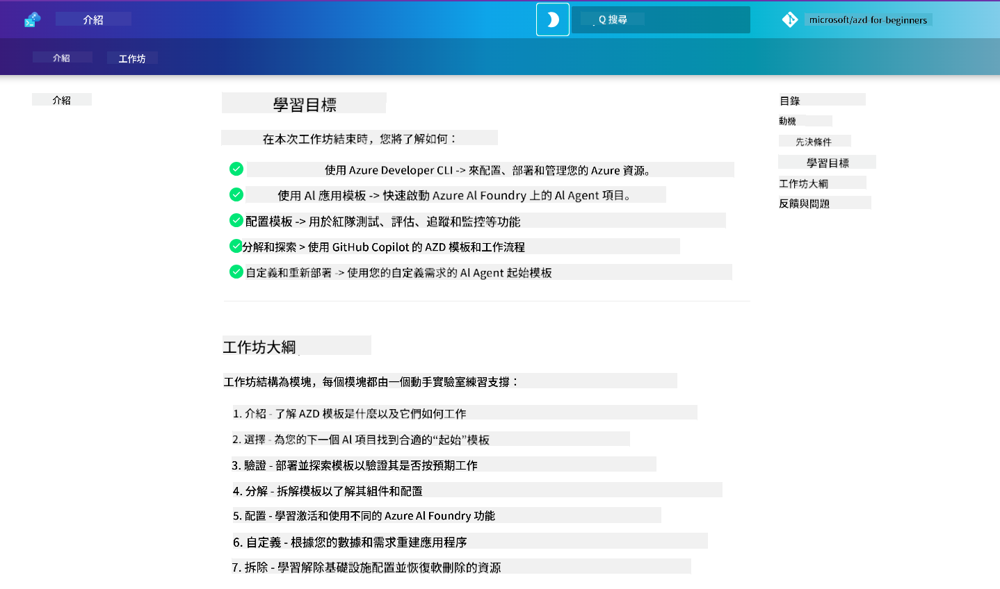

<!--
CO_OP_TRANSLATOR_METADATA:
{
  "original_hash": "9cc966416ab431c38b2ab863884b196c",
  "translation_date": "2025-09-24T12:01:24+00:00",
  "source_file": "workshop/README.md",
  "language_code": "mo"
}
-->
# AZD for AI Developers Workshop

歡迎參加 Azure Developer CLI (AZD) 的實作工作坊，專注於 AI 應用程式的部署。本工作坊將幫助您透過以下三個步驟深入了解 AZD 模板的應用：

1. **探索** - 找到適合您的模板。
1. **部署** - 部署並驗證其功能。
1. **自訂** - 修改並迭代，使其符合您的需求！

在工作坊過程中，您還將接觸到核心開發工具和工作流程，幫助您簡化端到端的開發旅程。

<br/>

## 基於瀏覽器的指南

工作坊的課程內容以 Markdown 格式編寫。您可以直接在 GitHub 中瀏覽，或者如以下截圖所示，啟動基於瀏覽器的預覽。



使用此選項時，請將此存儲庫 fork 到您的個人檔案，並啟動 GitHub Codespaces。一旦 VS Code 終端啟動，輸入以下指令：

```bash title="" linenums="0"
mkdocs serve > /dev/null 2>&1 &
```

幾秒鐘後，您將看到一個彈出對話框。選擇 `Open in browser` 選項，基於網頁的指南將在新的瀏覽器標籤中打開。此預覽的部分優勢包括：

1. **內建搜尋** - 快速找到關鍵字或課程。
1. **複製圖示** - 滑鼠懸停在程式碼區塊上即可看到此選項。
1. **主題切換** - 在深色和淺色主題之間切換。
1. **獲取幫助** - 點擊頁腳中的 Discord 圖示加入社群！

<br/>

## 工作坊概述

**時長：** 3-4 小時  
**等級：** 初學者至中級  
**先決條件：** 熟悉 Azure、AI 概念、VS Code 和命令列工具。

這是一個實作型工作坊，您將透過實際操作進行學習。完成練習後，我們建議您回顧 AZD For Beginners 課程，繼續學習安全性和生產力的最佳實踐。

| 時間 | 模組  | 目標 |
|:---|:---|:---|
| 15 分鐘 | [簡介](docs/instructions/0-Introduction.md) | 設定背景，了解目標 |
| 30 分鐘 | [選擇 AI 模板](docs/instructions/1-Select-AI-Template.md) | 探索選項並選擇入門模板 | 
| 30 分鐘 | [驗證 AI 模板](docs/instructions/2-Validate-AI-Template.md) | 部署預設解決方案到 Azure |
| 30 分鐘 | [解構 AI 模板](docs/instructions/3-Deconstruct-AI-Template.md) | 探索結構和配置 |
| 30 分鐘 | [配置 AI 模板](docs/instructions/4-Configure-AI-Template.md) | 啟用並嘗試可用功能 |
| 30 分鐘 | [自訂 AI 模板](docs/instructions/5-Customize-AI-Template.md) | 根據需求調整模板 |
| 30 分鐘 | [拆除基礎設施](docs/instructions/6-Teardown-Infrastructure.md) | 清理並釋放資源 |
| 15 分鐘 | [總結與後續步驟](docs/instructions/7-Wrap-up.md) | 學習資源，工作坊挑戰 |

<br/>

## 您將學到什麼

將 AZD 模板視為一個學習沙盒，用於探索 Azure AI Foundry 上端到端開發的各種功能和工具。完成工作坊後，您應該能直觀地理解相關工具和概念。

| 概念  | 目標 |
|:---|:---|
| **Azure Developer CLI** | 了解工具指令和工作流程 |
| **AZD 模板**| 了解專案結構和配置 |
| **Azure AI Agent**| 配置並部署 Azure AI Foundry 專案 |
| **Azure AI Search**| 使用代理啟用上下文工程 |
| **可觀測性**| 探索追蹤、監控和評估 |
| **紅隊測試**| 探索對抗性測試和緩解措施 |

<br/>

## 工作坊結構

工作坊的結構旨在引導您從模板探索到部署、解構和自訂，並以官方 [Getting Started with AI Agents](https://github.com/Azure-Samples/get-started-with-ai-agents) 入門模板為基礎。

### [模組 1: 選擇 AI 模板](docs/instructions/1-Select-AI-Template.md) (30 分鐘)

- 什麼是 AI 模板？
- 我可以在哪裡找到 AI 模板？
- 我如何開始建立 AI Agents？
- **實驗室**：使用 GitHub Codespaces 快速入門

### [模組 2: 驗證 AI 模板](docs/instructions/2-Validate-AI-Template.md) (30 分鐘)

- AI 模板架構是什麼？
- AZD 開發工作流程是什麼？
- 我如何獲得 AZD 開發的幫助？
- **實驗室**：部署並驗證 AI Agents 模板

### [模組 3: 解構 AI 模板](docs/instructions/3-Deconstruct-AI-Template.md) (30 分鐘)

- 探索 `.azure/` 中的環境
- 探索 `infra/` 中的資源設置
- 探索 `azure.yaml` 中的 AZD 配置
- **實驗室**：修改環境變數並重新部署

### [模組 4: 配置 AI 模板](docs/instructions/4-Configure-AI-Template.md) (30 分鐘)
- 探索：檢索增強生成
- 探索：代理評估與紅隊測試
- 探索：追蹤與監控
- **實驗室**：探索 AI Agent + 可觀測性

### [模組 5: 自訂 AI 模板](docs/instructions/5-Customize-AI-Template.md) (30 分鐘)
- 定義：場景需求的 PRD
- 配置：AZD 的環境變數
- 實現：新增任務的生命周期掛鉤
- **實驗室**：根據我的場景自訂模板

### [模組 6: 拆除基礎設施](docs/instructions/6-Teardown-Infrastructure.md) (30 分鐘)
- 回顧：什麼是 AZD 模板？
- 回顧：為什麼使用 Azure Developer CLI？
- 後續步驟：嘗試不同的模板！
- **實驗室**：解除基礎設施配置並清理

<br/>

## 工作坊挑戰

想挑戰自己做得更多嗎？以下是一些專案建議，或者分享您的想法給我們！

| 專案 | 描述 |
|:---|:---|
|1. **解構一個複雜的 AI 模板** | 使用我們概述的工作流程和工具，看看您是否能部署、驗證並自訂另一個 AI 解決方案模板。_您學到了什麼？_|
|2. **根據您的場景進行自訂**  | 嘗試為不同的場景撰寫 PRD（產品需求文件）。然後在您的模板存儲庫中使用 GitHub Copilot 的代理模型，並請它為您生成自訂工作流程。_您學到了什麼？如何改進這些建議？_|
| | |

## 有意見嗎？

1. 在此存儲庫中發表問題 - 標記為 `Workshop` 以方便識別。
1. 加入 Azure AI Foundry Discord - 與同行交流！

| | | 
|:---|:---|
| **📚 課程首頁**| [AZD For Beginners](../README.md)|
| **📖 文件** | [開始使用 AI 模板](https://learn.microsoft.com/en-us/azure/ai-foundry/how-to/develop/ai-template-get-started)|
| **🛠️AI 模板** | [Azure AI Foundry Templates](https://ai.azure.com/templates) |
|**🚀 後續步驟** | [接受挑戰](../../../workshop) |
| | |

<br/>

---

**上一頁：** [AI 疑難排解指南](../docs/troubleshooting/ai-troubleshooting.md) | **下一頁：** 開始 [實驗室 1: AZD 基礎](../../../workshop/lab-1-azd-basics)

**準備好開始使用 AZD 建立 AI 應用程式了嗎？**

[開始實驗室 1: AZD 基礎 →](./lab-1-azd-basics/README.md)

---

