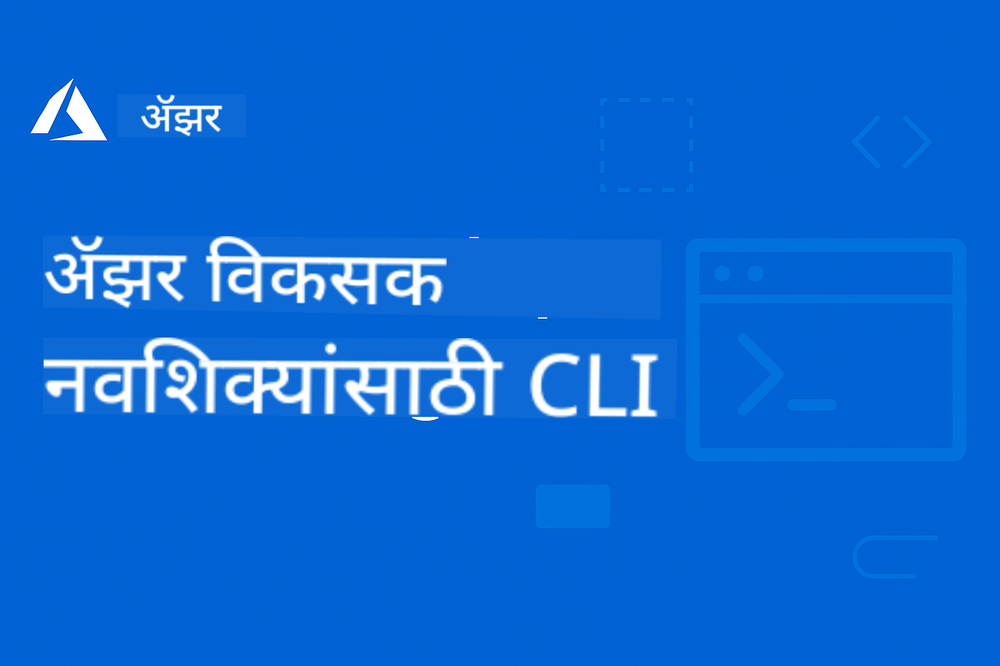

<!--
CO_OP_TRANSLATOR_METADATA:
{
  "original_hash": "068c87cc2641a81ca353ad7064ff326a",
  "translation_date": "2026-01-01T13:35:45+00:00",
  "source_file": "README.md",
  "language_code": "mr"
}
-->
# AZD नवशिक्यांसाठी: एक संरचित शिक्षण प्रवास

 

[](https://GitHub.com/microsoft/azd-for-beginners/watchers/)
[](https://GitHub.com/microsoft/azd-for-beginners/network/)
[](https://GitHub.com/microsoft/azd-for-beginners/stargazers/)

[](https://discord.gg/microsoft-azure)
[](https://discord.gg/nTYy5BXMWG)

## या कोर्सची सुरुवात कशी करावी

AZD शिकण्याचा हा प्रवास सुरू करण्यासाठी खालील टप्पे पाळा:

1. **रिपॉझिटरी फोर्क करा**: क्लिक करा [](https://GitHub.com/microsoft/azd-for-beginners/fork)
2. **रिपॉझिटरी क्लोन करा**: `git clone https://github.com/microsoft/azd-for-beginners.git`
3. **समुदायात सामील व्हा**: तज्ञ मदतीसाठी [Azure Discord Communities](https://discord.com/invite/ByRwuEEgH4)
4. **तुमचा शिक्षण मार्ग निवडा**: खालील अध्यायांपैकी तुमच्या अनुभवाशी आणि उद्दिष्टांशी सुसंगत अध्याय निवडा

### बहुभाषिक समर्थन

#### स्वयंचलित अनुवाद (नेहमी अद्ययावत)

<!-- CO-OP TRANSLATOR LANGUAGES TABLE START -->
[अरबी](../ar/README.md) | [बंगाली](../bn/README.md) | [बल्गेरियन](../bg/README.md) | [बर्मीज (म्यानमार)](../my/README.md) | [चिनी (सरलीकृत)](../zh/README.md) | [चिनी (परंपरागत, हाँगकाँग)](../hk/README.md) | [चिनी (परंपरागत, मकाऊ)](../mo/README.md) | [चिनी (परंपरागत, तैवान)](../tw/README.md) | [क्रोएशियन](../hr/README.md) | [झेक](../cs/README.md) | [डॅनिश](../da/README.md) | [डच](../nl/README.md) | [एस्टोनियन](../et/README.md) | [फिनिश](../fi/README.md) | [फ्रेंच](../fr/README.md) | [जर्मन](../de/README.md) | [ग्रीक](../el/README.md) | [हिब्रू](../he/README.md) | [हिंदी](../hi/README.md) | [हंगेरीयन](../hu/README.md) | [इंडोनेशियन](../id/README.md) | [इटालियन](../it/README.md) | [जपानी](../ja/README.md) | [कन्नड](../kn/README.md) | [कोरियन](../ko/README.md) | [लिथुआनियन](../lt/README.md) | [मलय](../ms/README.md) | [मलयाळम](../ml/README.md) | [मराठी](./README.md) | [नेपाली](../ne/README.md) | [नायजीरियन पिजिन](../pcm/README.md) | [नॉर्वेजियन](../no/README.md) | [फारसी (फार्सी)](../fa/README.md) | [पोलिश](../pl/README.md) | [पोर्तुगीज (ब्राझील)](../br/README.md) | [पोर्तुगीज (पोर्तुगाल)](../pt/README.md) | [पंजाबी (गुरमुखी)](../pa/README.md) | [रोमनियन](../ro/README.md) | [रशियन](../ru/README.md) | [सर्बियन (सिरिलिक)](../sr/README.md) | [स्लोव्हाक](../sk/README.md) | [स्लोव्हेनियन](../sl/README.md) | [स्पॅनिश](../es/README.md) | [स्वाहिली](../sw/README.md) | [स्वीडिश](../sv/README.md) | [टॅगॅलोग (फिलिपिनो)](../tl/README.md) | [तमिळ](../ta/README.md) | [तेलुगु](../te/README.md) | [थाई](../th/README.md) | [तुर्किश](../tr/README.md) | [युक्रेनियन](../uk/README.md) | [उर्दू](../ur/README.md) | [व्हिएतनामी](../vi/README.md)
<!-- CO-OP TRANSLATOR LANGUAGES TABLE END -->

## कोर्सचे सारांश

क्रमिक शिक्षणासाठी डिझाइन केलेल्या अध्यायांद्वारे Azure Developer CLI (azd) मध्ये निपुण व्हा. **Microsoft Foundry समाकलनासह AI अनुप्रयोग तैनात करण्यावर विशेष भर.**

### आधुनिक विकासकांसाठी हा कोर्स का आवश्यक आहे

Microsoft Foundry Discord समुदायाच्या अभिप्रायावरून, **45% विकासक AI वर्कलोडसाठी AZD वापरू इच्छितात** परंतु खालील अडचणी येतात:
- क्लिष्ट बहु-सेवा AI आर्किटेक्चर
- उत्पादन AI तैनातीसाठी सर्वोत्तम पद्धती  
- Azure AI सेवा समाकलन आणि कॉन्फिगरेशन
- AI वर्कलोडसाठी खर्च अनुकूलन
- AI-विशिष्ट तैनाती समस्यांचे निराकरण

### शिकण्याचे उद्दिष्टे

हा संरचित कोर्स पूर्ण केल्यावर, आपण:
- **AZD मूलभूत गोष्टी मास्टर करा**: मुख्य संकल्पना, स्थापना आणि कॉन्फिगरेशन
- **AI अनुप्रयोग तैनात करा**: Microsoft Foundry सेवा वापरून AZD सह
- **Infrastructure as Code लागू करा**: Bicep टेम्पलेट्सद्वारे Azure संसाधने व्यवस्थापित करा
- **तैनातीमध्ये त्रुटी शोधा**: सामान्य समस्यांचे निराकरण आणि डिबग करणे
- **उत्पादनासाठी अनुकूल करा**: सुरक्षा, स्केलिंग, मॉनिटरिंग, आणि खर्च व्यवस्थापन
- **मल्टी-एजंट सोल्यूशन्स तयार करा**: क्लिष्ट AI आर्किटेक्चर तैनात करा

## 📚 शिक्षण अध्याय

*अनुभव पातळी आणि उद्दिष्टांनुसार तुमचा शिक्षण मार्ग निवडा*

### 🚀 अध्याय 1: पाया आणि गतीने सुरुवात
**पूर्वअट**: Azure सदस्यत्व, बेसिक कमांड लाइन ज्ञान  
**कालावधी**: 30-45 मिनिटे  
**कठीणपणा**: ⭐

#### आपण काय शिकणार आहात
- Azure Developer CLI ची मूलभूत समज
- आपल्या प्लॅटफॉर्मवर AZD ची स्थापना
- आपली पहिली यशस्वी तैनाती

#### शिक्षण संसाधने
- **🎯 येथे सुरू करा**: [What is Azure Developer CLI?](../..)
- **📖 सिद्धांत**: [AZD Basics](docs/getting-started/azd-basics.md) - मुख्य संकल्पना आणि शब्दावली
- **⚙️ सेटअप**: [Installation & Setup](docs/getting-started/installation.md) - प्लॅटफॉर्म-विशिष्ट मार्गदर्शक
- **🛠️ प्रत्यक्ष काम**: [Your First Project](docs/getting-started/first-project.md) - चरण-दर-चरण ट्यूटोरियल
- **📋 त्वरित संदर्भ**: [Command Cheat Sheet](resources/cheat-sheet.md)

#### व्यावहारिक उपक्रम
```bash
# स्थापनेची त्वरीत तपासणी
azd version

# आपले पहिले अॅप्लिकेशन तैनात करा
azd init --template todo-nodejs-mongo
azd up
```

**💡 अध्यायाचा निकाल**: AZD वापरून Azure वर एक सोपे वेब अनुप्रयोग यशस्वीरीत्या तैनात करा

**✅ यशाची पडताळणी:**
```bash
# अध्याय 1 पूर्ण केल्यानंतर, तुम्ही खालील गोष्टी करू शकाल:
azd version              # स्थापित आवृत्ती दाखवते
azd init --template todo-nodejs-mongo  # प्रकल्प प्रारंभ करते
azd up                  # Azure वर तैनात करते
azd show                # चालू असलेल्या अॅपचा URL दाखवते
# अॅप ब्राउझरमध्ये उघडते आणि कार्य करते
azd down --force --purge  # संसाधने साफ करते
```

**📊 वेळ गुंतवणूक:** 30-45 मिनिटे  
**📈 या नंतर कौशल्य पातळी:** प्राथमिक अनुप्रयोग स्वतंत्रपणे तैनात करू शकता

**✅ यशाची पडताळणी:**
```bash
# प्रकरण 1 पूर्ण केल्यावर, तुम्ही सक्षम असले पाहिजे:
azd version              # स्थापित केलेली आवृत्ती दर्शवते
azd init --template todo-nodejs-mongo  # प्रकल्प प्रारंभ करते
azd up                  # Azure वर तैनात करते
azd show                # धावणाऱ्या अॅपचा URL दाखवते
# अॅप ब्राउझरमध्ये उघडते आणि व्यवस्थित काम करते
azd down --force --purge  # संसाधने स्वच्छ करते
```

**📊 वेळ गुंतवणूक:** 30-45 मिनिटे  
**📈 या नंतर कौशल्य पातळी:** प्राथमिक अनुप्रयोग स्वतंत्रपणे तैनात करू शकता

---

### 🤖 अध्याय 2: AI-प्रथम विकास (AI विकासकांसाठी शिफारस)
**पूर्वअट**: अध्याय 1 पूर्ण झालेले असणे  
**कालावधी**: 1-2 तास  
**कठीणपणा**: ⭐⭐

#### आपण काय शिकणार आहात
- AZD सह Microsoft Foundry चे समाकलन
- AI-सक्षम अनुप्रयोग तैनात करणे
- AI सेवा कॉन्फिगरेशन समजून घेणे

#### शिक्षण संसाधने
- **🎯 येथे सुरू करा**: [Microsoft Foundry Integration](docs/microsoft-foundry/microsoft-foundry-integration.md)
- **📖 पॅटर्न्स**: [AI Model Deployment](docs/microsoft-foundry/ai-model-deployment.md) - AI मॉडेल तैनात करा आणि व्यवस्थापित करा
- **🛠️ वर्कशॉप**: [AI Workshop Lab](docs/microsoft-foundry/ai-workshop-lab.md) - तुमचे AI सोल्यूशन्स AZD-सुसज्ज करा
- **🎥 इंटरएक्टिव मार्गदर्शक**: [Workshop Materials](workshop/README.md) - ब्राउझर-आधारित शिक्षण MkDocs * DevContainer वातावरणासह
- **📋 टेम्पलेट्स**: [Microsoft Foundry Templates](../..)
- **📝 उदाहरणे**: [AZD Deployment Examples](examples/README.md)

#### व्यावहारिक उपक्रम
```bash
# आपले पहिले AI अनुप्रयोग तैनात करा
azd init --template azure-search-openai-demo
azd up

# अतिरिक्त AI टेम्पलेट्स वापरून पहा
azd init --template openai-chat-app-quickstart
azd init --template agent-openai-python-prompty
```

**💡 अध्यायाचा निकाल**: RAG क्षमतांसह AI-सक्षम चॅट अनुप्रयोग तैनात आणि कॉन्फिगर करा

**✅ यशाची पडताळणी:**
```bash
# प्रकरण 2 नंतर, तुम्ही हे करू शकता:
azd init --template azure-search-openai-demo
azd up
# एआय चॅट इंटरफेसची चाचणी करा
# प्रश्न विचारा आणि स्रोतांसहित एआय-चालित उत्तरे मिळवा
# शोध समाकलन कार्य करते याची पडताळणी करा
azd monitor  # Application Insights मध्ये टेलिमेट्री दिसते का ते तपासा
azd down --force --purge
```

**📊 वेळ गुंतवणूक:** 1-2 तास  
**📈 या नंतर कौशल्य पातळी:** उत्पादन-तयार AI अनुप्रयोग तैनात आणि कॉन्फिगर करू शकता  
**💰 खर्च जाणीव:** समजून घ्या $80-150/month विकास खर्च, $300-3500/month उत्पादन खर्च

#### 💰 AI तैनातींसाठी खर्च विचार

**विकास वातावरण (अंदाजे $80-150/म्हाही):**
- Azure OpenAI (Pay-as-you-go): $0-50/म्हाही (टोकन वापरावर आधारित)
- AI Search (Base टियर): $75/म्हाही
- Container Apps (उपभोगानुसार): $0-20/म्हाही
- स्टोरेज (स्टॅंडर्ड): $1-5/म्हाही

**उत्पादन वातावरण (अंदाजे $300-3,500+/म्हाही):**
- Azure OpenAI (सातत्यपूर्ण कामगिरीसाठी PTU): $3,000+/म्हाही किंवा मोठ्या प्रमाणावर वापर असल्यास Pay-as-you-go
- AI Search (स्टँडर्ड टियर): $250/म्हाही
- Container Apps (डेडिकेटेड): $50-100/म्हाही
- Application Insights: $5-50/म्हाही
- स्टोरेज (प्रीमियम): $10-50/म्हाही

**💡 खर्च अनुकूलन टिप्स:**
- शिकण्यासाठी **Free Tier** Azure OpenAI वापरा (50,000 टोकन्स/म्हाही समाविष्ट)
- सक्रियपणे विकसित करत नसल्यास संसाधने मुक्त करण्यासाठी `azd down` चालवा
- सुरुवातीला उपभोग-आधारित बिलिंग वापरा, उत्पादनासाठी केव्हाही PTU कडे अपग्रेड करा
- तैनातीपूर्वी अंदाज बांधण्यासाठी `azd provision --preview` वापरा
- ऑटो-स्केलिंग सक्रिय करा: केवळ वास्तविक वापरासाठी पैसे द्या

**खर्च मॉनिटरिंग:**
```bash
# अंदाजे मासिक खर्च तपासा
azd provision --preview

# Azure पोर्टलमध्ये वास्तविक खर्चांवर लक्ष ठेवा
az consumption budget list --resource-group <your-rg>
```

---

### ⚙️ अध्याय 3: कॉन्फिगरेशन आणि प्रमाणीकरण
**पूर्वअट**: अध्याय 1 पूर्ण झालेले असणे  
**कालावधी**: 45-60 मिनिटे  
**कठीणपणा**: ⭐⭐

#### आपण काय शिकणार आहात
- वातावरण कॉन्फिगरेशन आणि व्यवस्थापन
- प्रमाणीकरण आणि सुरक्षा सर्वोत्तम पद्धती
- संसाधनांचे नामकरण आणि संघटन

#### शिक्षण संसाधने
- **📖 कॉन्फिगरेशन**: [Configuration Guide](docs/getting-started/configuration.md) - वातावरण सेटअप
- **🔐 सुरक्षा**: [Authentication patterns and managed identity](docs/getting-started/authsecurity.md) - प्रमाणीकरण पॅटर्न्स
- **📝 उदाहरणे**: [Database App Example](examples/database-app/README.md) - AZD डेटाबेस उदाहरणे

#### व्यावहारिक उपक्रम
- एकाधिक वातावरण कॉन्फिगर करा (dev, staging, prod)
- मॅनेज्ड आयडेंटिटी प्रमाणीकरण सेटअप करा
- वातावरण-विशिष्ट कॉन्फिगरेशन लागू करा

**💡 अध्यायाचा निकाल**: योग्य प्रमाणीकरण आणि सुरक्षा असलेल्या एकाधिक वातावरणांचे व्यवस्थापन करा

---

### 🏗️ अध्याय 4: Infrastructure as Code & तैनाती
**पूर्वअट**: अध्याय 1-3 पूर्ण केलेले असणे  
**कालावधी**: 1-1.5 तास  
**कठीणपणा**: ⭐⭐⭐

#### आपण काय शिकणार आहात
- प्रगत तैनाती पॅटर्न्स
- Bicep सह Infrastructure as Code
- संसाधन provisioning धोरणे

#### शिक्षण संसाधने
- **📖 तैनाती**: [Deployment Guide](docs/deployment/deployment-guide.md) - पूर्ण वर्कफ्लोज
- **🏗️ Provisioning**: [Provisioning Resources](docs/deployment/provisioning.md) - Azure संसाधन व्यवस्थापन
- **📝 उदाहरणे**: [Container App Example](../../examples/container-app) - कंटेनराइझ्ड तैनाती

#### व्यावहारिक उपक्रम
- कस्टम Bicep टेम्पलेट्स तयार करा
- बहु-सेवा अनुप्रयोग तैनात करा
- ब्लू-ग्रीन तैनाती धोरणे लागू करा

**💡 अध्यायाचा निकाल**: कस्टम इन्फ्रास्ट्रक्चर टेम्पलेट्स वापरून क्लिष्ट बहु-सेवा अनुप्रयोग तैनात करा

---

### 🎯 अध्याय 5: मल्टी-एजंट AI सोल्यूशन्स (प्रगत)
**पूर्वअट**: अध्याय 1-2 पूर्ण केलेले असणे  
**कालावधी**: 2-3 तास  
**कठीणपणा**: ⭐⭐⭐⭐

#### आपण काय शिकणार आहात
- मल्टी-एजंट आर्किटेक्चर पॅटर्न्स
- एजंट ऑर्केस्ट्रेशन आणि समन्वय
- उत्पादन-तयार AI तैनाती

#### शिक्षण संसाधने
- **🤖 वैशिष्ट्यीकृत प्रोजेक्ट**: [Retail Multi-Agent Solution](examples/retail-scenario.md) - संपूर्ण अंमलबजावणी
- **🛠️ ARM Templates**: [ARM Template Package](../../examples/retail-multiagent-arm-template) - एक-क्लिक तैनाती
- **📖 Architecture**: [मल्टी-एजंट समन्वय पॅटर्न्स](/docs/pre-deployment/coordination-patterns.md) - नमुने

#### Practical Exercises
```bash
# पूर्ण किरकोळ बहु-एजंट समाधान तैनात करा
cd examples/retail-multiagent-arm-template
./deploy.sh

# एजंट कॉन्फिगरेशन तपासा
az deployment group show --resource-group <rg-name> --name <deployment-name>
```

**💡 Chapter Outcome**: Customer आणि Inventory एजंटसह उत्पादन-तयार मल्टी-एजंट AI सोल्यूशन डिप्लॉय आणि व्यवस्थापित करा

---

### 🔍 Chapter 6: Pre-Deployment Validation & Planning
**पूर्वआवश्यकता**: अध्याय 4 पूर्ण  
**कालावधी**: 1 तास  
**कठीणपणा**: ⭐⭐

#### तुम्ही काय शिकणार आहात
- क्षमतेचे नियोजन आणि संसाधन पडताळणी
- SKU निवड धोरणे
- प्री-फ्लाइट चेक आणि ऑटोमेशन

#### शिकण्याची साधने
- **📊 नियोजन**: [Capacity Planning](docs/pre-deployment/capacity-planning.md) - संसाधन पडताळणी
- **💰 निवड**: [SKU Selection](docs/pre-deployment/sku-selection.md) - खर्च-प्रभावी निवडी
- **✅ पडताळणी**: [Pre-flight Checks](docs/pre-deployment/preflight-checks.md) - ऑटोमेटेड स्क्रिप्ट्स

#### Practical Exercises
- क्षमता पडताळणी स्क्रिप्ट चालवा
- खर्चासाठी SKU निवडी अनुकूल करा
- प्री-डिप्लॉयमेंट च्या ऑटोमेटेड चेकची अंमलबजावणी करा

**💡 Chapter Outcome**: राबवण्यापूर्वी तैनाती पडताळणी आणि ऑप्टिमाइझ करा

---

### 🚨 Chapter 7: Troubleshooting & Debugging
**पूर्वआवश्यकता**: कोणताही डिप्लॉयमेंट अध्याय पूर्ण  
**कालावधी**: 1-1.5 तास  
**कठीणपणा**: ⭐⭐

#### तुम्ही काय शिकणार आहात
- पद्धतशीर डीबगिंग पध्दती
- सामान्य समस्या आणि उपाय
- AI-विशिष्ट ट्रबलशूटिंग

#### शिकण्याची साधने
- **🔧 सामान्य समस्या**: [Common Issues](docs/troubleshooting/common-issues.md) - FAQ आणि उपाय
- **🕵️ डीबगिंग**: [Debugging Guide](docs/troubleshooting/debugging.md) - टप्प्यावर टप्प्यावर रणनीती
- **🤖 AI समस्या**: [AI-Specific Troubleshooting](docs/troubleshooting/ai-troubleshooting.md) - AI सेवा समस्या

#### Practical Exercises
- डिप्लॉयमेंट अपयशांचे निदान करा
- प्रमाणीकरण समस्या सोडवा
- AI सेवा कनेक्टिव्हिटी डीबग करा

**💡 Chapter Outcome**: सामान्य डिप्लॉयमेंट समस्या स्वतंत्रपणे निदान आणि निराकरण करा

---

### 🏢 Chapter 8: Production & Enterprise Patterns
**पूर्वआवश्यकता**: अध्याय 1-4 पूर्ण  
**कालावधी**: 2-3 तास  
**कठीणपणा**: ⭐⭐⭐⭐

#### तुम्ही काय शिकणार आहात
- प्रोडक्शन तैनाती धोरणे
- एंटरप्राइझ सुरक्षा पॅटर्न्स
- मॉनिटरिंग आणि खर्च ऑप्टिमायझेशन

#### शिकण्याची साधने
- **🏭 प्रोडक्शन**: [Production AI Best Practices](docs/microsoft-foundry/production-ai-practices.md) - एंटरप्राइझ पॅटर्न्स
- **📝 उदाहरणे**: [Microservices Example](../../examples/microservices) - जटिल आर्किटेक्चर्स
- **📊 मॉनिटरिंग**: [Application Insights integration](docs/pre-deployment/application-insights.md) - मॉनिटरिंग

#### Practical Exercises
- एंटरप्राइझ सुरक्षा पॅटर्न्स अंमलात आणा
- सर्वसमावेशक मॉनिटरिंग सेटअप करा
- योग्य गव्हर्नन्ससह प्रोडक्शनमध्ये तैनाती करा

**💡 Chapter Outcome**: पूर्ण प्रोडक्शन क्षमतांसह एंटरप्राइझ-रेडी अनुप्रयोग तैनात करा

---

## 🎓 कार्यशाळा अवलोकन: हातावर शिकण्याचा अनुभव

> **⚠️ WORKSHOP STATUS: Active Development**  
> कार्यशाळेची सामग्री सध्या विकसित आणि परिष्कृत केली जात आहे. मुख्य मॉड्यूल कार्यरत आहेत, परंतु काही प्रगत विभाग अपूर्ण आहेत. आम्ही सर्व सामग्री पूर्ण करण्यासाठी सक्रियपणे काम करत आहोत. [प्रगती ट्रॅक करा →](workshop/README.md)

### Interactive Workshop Materials
**ब्राउझर-आधारित साधने आणि मार्गदर्शित व्यायामांसह सर्वसमावेशक हातावर शिकण्याचा अनुभव**

आमची कार्यशाळेची सामग्री अध्याय-आधारित अभ्यासक्रमाला पूरक असलेला संरचित, इंटरॅक्टिव्ह शिकण्याचा अनुभव प्रदान करते. कार्यशाळा स्व-गतीने शिकण्यासाठी तसेच प्रशिक्षक-नेतृत्वाखालील सत्रांसाठी डिझाइन केलेली आहे.

#### 🛠️ कार्यशाळेच्या वैशिष्ट्ये
- **ब्राउझर-आधारित इंटरफेस**: शोध, कॉपी, आणि थीम वैशिष्ट्यांसह पूर्ण MkDocs-शक्तीसह कार्यशाळा
- **GitHub Codespaces एकत्रीकरण**: एक-क्लिक विकास वातावरण सेटअप
- **संरचित शिकण्याचा मार्ग**: 7-टप्प्यांचे मार्गदर्शित व्यायाम (एकूण 3.5 तास)
- **खोज → तैनाती → सानुकूलन**: प्रगत पद्धती
- **इंटरॅक्टिव्ह DevContainer वातावरण**: पूर्व-संरचीत साधने आणि अवलंबन

#### 📚 कार्यशाळेची संरचना
कार्यशाळा **खोज → तैनाती → सानुकूलन** पद्धतीचे अनुसरण करते:

1. **खोज टप्पा** (45 मिनिटे)
   - Microsoft Foundry टेम्पलेट्स आणि सेवा एक्सप्लोर करा
   - मल्टी-एजंट आर्किटेक्चर पॅटर्न समजून घ्या
   - डिप्लॉयमेंट आवश्यकता आणि पूर्वआवश्यकता पुनरावलोकन करा

2. **तैनाती टप्पा** (2 तास)
   - AZD सह AI अनुप्रयोगांची हाताळणी तैनाती
   - Azure AI सेवा आणि एंडपॉइंट कॉन्फिगर करा
   - सुरक्षा आणि प्रमाणीकरण पॅटर्न अंमलात आणा

3. **सानुकूलन टप्पा** (45 मिनिटे)
   - विशिष्ट वापरप्रकरणांसाठी अनुप्रयोग बदल करा
   - प्रोडक्शन तैनातीसाठी ऑप्टिमाइझ करा
   - मॉनिटरिंग आणि खर्च व्यवस्थापन अंमलात आणा

#### 🚀 कार्यशाळा सुरु करण्यासाठी
```bash
# पर्याय 1: GitHub Codespaces (शिफारस केलेले)
# रिपॉझिटरीमध्ये "Code" → "Create codespace on main" वर क्लिक करा

# पर्याय 2: स्थानिक विकास
git clone https://github.com/microsoft/azd-for-beginners.git
cd azd-for-beginners/workshop
# workshop/README.md मधील सेटअप सूचना पालन करा
```

#### 🎯 कार्यशाळेच्या शिकण्याच्या उद्दिष्टे
कार्यशाळा पूर्ण केल्यावर, सहभागी खालील गोष्टी करू शकतील:
- **प्रोडक्शन AI अनुप्रयोग तैनात करा**: Microsoft Foundry सेवांसह AZD वापरा
- **मल्टी-एजंट आर्किटेक्चर्समध्ये निपुणता मिळवा**: समन्वित AI एजंट सोल्युशन्स अंमलात आणा
- **सुरक्षा सर्वोत्तम पद्धती अंमलात आणा**: प्रमाणीकरण आणि प्रवेश नियंत्रण कॉन्फिगर करा
- **स्केलसाठी ऑप्टिमाइझ करा**: खर्च-प्रभावी, कार्यक्षम तैनाती डिझाइन करा
- **डिप्लॉयमेंट्स ट्रबलशूट करा**: सामान्य समस्या स्वतंत्रपणे सोडवा

#### 📖 कार्यशाळा साधने
- **🎥 इंटरॅक्टिव्ह गाईड**: [Workshop Materials](workshop/README.md) - ब्राउझर-आधारित शिकण्याचे वातावरण
- **📋 टप्प्याटप्प्याने सूचना**: [Guided Exercises](../../workshop/docs/instructions) - सविस्तर मार्गदर्शन
- **🛠️ AI कार्यशाळा लॅब**: [AI Workshop Lab](docs/microsoft-foundry/ai-workshop-lab.md) - AI-केंद्रित व्यायाम
- **💡 क्विक स्टार्ट**: [Workshop Setup Guide](workshop/README.md#quick-start) - वातावरण कॉन्फिगरेशन

**योग्य आहे**: कॉर्पोरेट प्रशिक्षण, विद्यापीठ अभ्यासक्रम, स्व-गतीने शिकणे, आणि विकासक बूटकॅम्पसाठी.

---

## 📖 Azure Developer CLI म्हणजे काय?

Azure Developer CLI (azd) हा विकासक-केंद्रित कमांड-लाइन इंटरफेस आहे जो Azure वर अनुप्रयोग तयार आणि तैनात करण्याच्या प्रक्रियेला वेग देतो. हे प्रदान करते:

- **टेम्पलेट-आधारित तैनात्या** - सामान्य अनुप्रयोग पॅटर्नसाठी पूर्व-निर्मित टेम्पलेट वापरा
- **इन्फ्रास्ट्रक्चर अस कोड** - Bicep किंवा Terraform वापरून Azure संसाधने व्यवस्थापित करा  
- **एकत्रित वर्कफलो** - अनुप्रयोगांची सहजप्रमाणे प्रोविशनिंग, तैनाती, आणि मॉनिटरिंग
- **विकासक-अनुकूल** - विकासक उत्पादकता आणि अनुभवासाठी ऑप्टिमाइझ केलेले

### **AZD + Microsoft Foundry: AI तैनातींसाठी परफेक्ट**

**AI सोल्यूशन्ससाठी AZD का?** AZD AI विकासकांना निर्माण होणाऱ्या प्रमुख आव्हानांना पोकडते:

- **AI-तयार टेम्पलेट्स** - Azure OpenAI, Cognitive Services, आणि ML वर्कलोडसाठी पूर्व-संचालित टेम्पलेट्स
- **सुरक्षित AI तैनाती** - AI सेवा, API कीज, आणि मॉडेल एंडपॉइंटसाठी अंगभूत सुरक्षा पॅटर्न  
- **प्रोडक्शन AI पॅटर्न्स** - स्केलेबल, खर्च-प्रभावी AI अनुप्रयोग तैनातीसाठी सर्वोत्तम पद्धती
- **एंड-टू-एंड AI वर्कफलो** - मॉडेल विकासापासून प्रोडक्शन तैनातीसह योग्य मॉनिटरिंगपर्यंत
- **खर्च ऑप्टिमायझेशन** - AI वर्कलोडसाठी स्मार्ट संसाधन वाटप आणि स्केलिंग धोरणे
- **Microsoft Foundry एकत्रीकरण** - Microsoft Foundry मॉडेल कॅटलॉग आणि एंडपॉइंटशी अखंड कनेक्शन

---

## 🎯 साच्यांचे आणि उदाहरणे लायब्ररी

### वैशिष्ट्यीकृत: Microsoft Foundry टेम्पलेट्स
**AI अनुप्रयोग तैनात करत असाल तर इथून सुरुवात करा!**

> **सूचना:** हे टेम्पलेट्स विविध AI पॅटर्न्स दाखवतात. काही बाह्य Azure Samples आहेत, तर काही स्थानिक अंमलबजावण्या आहेत.

| Template | अध्याय | जटिलता | Services | प्रकार |
|----------|---------|------------|----------|------|
| [**Get started with AI chat**](https://github.com/Azure-Samples/get-started-with-ai-chat) | अध्याय 2 | ⭐⭐ | AzureOpenAI + Azure AI Model Inference API + Azure AI Search + Azure Container Apps + Application Insights | बाह्य |
| [**Get started with AI agents**](https://github.com/Azure-Samples/get-started-with-ai-agents) | अध्याय 2 | ⭐⭐ | Azure AI Agent Service + AzureOpenAI + Azure AI Search + Azure Container Apps + Application Insights| बाह्य |
| [**Azure Search + OpenAI Demo**](https://github.com/Azure-Samples/azure-search-openai-demo) | अध्याय 2 | ⭐⭐ | AzureOpenAI + Azure AI Search + App Service + Storage | बाह्य |
| [**OpenAI Chat App Quickstart**](https://github.com/Azure-Samples/openai-chat-app-quickstart) | अध्याय 2 | ⭐ | AzureOpenAI + Container Apps + Application Insights | बाह्य |
| [**Agent OpenAI Python Prompty**](https://github.com/Azure-Samples/agent-openai-python-prompty) | अध्याय 5 | ⭐⭐⭐ | AzureOpenAI + Azure Functions + Prompty | बाह्य |
| [**Contoso Chat RAG**](https://github.com/Azure-Samples/contoso-chat) | अध्याय 8 | ⭐⭐⭐⭐ | AzureOpenAI + AI Search + Cosmos DB + Container Apps | बाह्य |
| [**Retail Multi-Agent Solution**](examples/retail-scenario.md) | अध्याय 5 | ⭐⭐⭐⭐ | AzureOpenAI + AI Search + Storage + Container Apps + Cosmos DB | **स्थानिक** |

### वैशिष्ट्यीकृत: पूर्ण शिकण्याच्या परिस्थिती
**शिकण्याच्या अध्यायांशी नकाशाबद्ध प्रोडक्शन-तयार अनुप्रयोग टेम्पलेट्स**

| Template | शिकण्याचा अध्याय | जटिलता | मुख्य शिक्षण |
|----------|------------------|------------|--------------|
| [**openai-chat-app-quickstart**](https://github.com/Azure-Samples/openai-chat-app-quickstart) | अध्याय 2 | ⭐ | मूलभूत AI तैनाती पॅटर्न्स |
| [**azure-search-openai-demo**](https://github.com/Azure-Samples/azure-search-openai-demo) | अध्याय 2 | ⭐⭐ | Azure AI Search सह RAG अंमलबजावणी |
| [**ai-document-processing**](https://github.com/Azure-Samples/ai-document-processing) | अध्याय 4 | ⭐⭐ | Document Intelligence एकत्रीकरण |
| [**agent-openai-python-prompty**](https://github.com/Azure-Samples/agent-openai-python-prompty) | अध्याय 5 | ⭐⭐⭐ | एजंट फ्रेमवर्क आणि फंक्शन कॉलिंग |
| [**contoso-chat**](https://github.com/Azure-Samples/contoso-chat) | अध्याय 8 | ⭐⭐⭐ | एंटरप्राइझ AI ऑर्केस्ट्रेशन |
| [**retail-multi-agent-solution**](examples/retail-scenario.md) | अध्याय 5 | ⭐⭐⭐⭐ | Customer आणि Inventory एजंटसह मल्टी-एजंट आर्किटेक्चर |

### उदाहरण प्रकारानुसार शिक्षण

> **📌 स्थानिक vs. बाह्य उदाहरणे:**  
> **स्थानिक उदाहरणे** (या रेपोमध्ये) = त्वरित वापरण्यास तयार  
> **बाह्य उदाहरणे** (Azure Samples) = लिंक केलेल्या रेपॉजिटरीजमधून क्लोन करा

#### स्थानिक उदाहरणे (तुरंत वापरण्यायोग्य)
- [**Retail Multi-Agent Solution**](examples/retail-scenario.md) - ARM टेम्पलेट्ससह पूर्ण प्रोडक्शन-तयार अंमलबजावणी
  - मल्टी-एजंट आर्किटेक्चर (Customer + Inventory एजंट)
  - सर्वसमावेशक मॉनिटरिंग आणि मूल्यांकन
  - ARM टेम्पलेटद्वारे एक-क्लिक तैनाती

#### स्थानिक उदाहरणे - कंटेनर अनुप्रयोग (अध्याय 2-5)
**या रेपोमध्ये सर्वसमावेशक कंटेनर तैनाती उदाहरणे:**
- [**Container App Examples**](examples/container-app/README.md) - कंटेनराइझ्ड तैनातींसाठी पूर्ण मार्गदर्शक
  - [Simple Flask API](../../examples/container-app/simple-flask-api) - scale-to-zero सह मूलभूत REST API
  - [Microservices Architecture](../../examples/container-app/microservices) - प्रोडक्शन-तयार बहु-सर्व्हिस तैनाती
  - क्विक स्टार्ट, प्रोडक्शन, आणि प्रगत तैनाती पॅटर्न्स
  - मॉनिटरिंग, सुरक्षा, आणि खर्च ऑप्टिमायझेशन मार्गदर्शन

#### बाह्य उदाहरणे - साधी अनुप्रयोगे (अध्याय 1-2)
**प्रारंभ करण्यासाठी हे Azure Samples रेपॉजिटरीज क्लोन करा:**
- [Simple Web App - Node.js + MongoDB](https://github.com/Azure-Samples/todo-nodejs-mongo) - मूलभूत तैनाती पॅटर्न्स
- [Static Website - React SPA](https://github.com/Azure-Samples/todo-csharp-sql-swa-func) - स्थिर सामग्री तैनाती
- [Container App - Python Flask](https://github.com/Azure-Samples/container-apps-store-api-microservice) - REST API तैनाती

#### बाह्य उदाहरणे - डेटाबेस एकत्रीकरण (अध्याय 3-4)  
- [Database App - C# + SQL](https://github.com/Azure-Samples/todo-csharp-sql) - डेटाबेस कनेक्टिव्हिटी पॅटर्न्स
- [Functions + Cosmos DB](https://github.com/Azure-Samples/todo-python-mongo-swa-func) - सर्वरलेस डेटा वर्कफ्लो

#### बाह्य उदाहरणे - प्रगत पॅटर्न्स (अध्याय 4-8)
- [Java Microservices](https://github.com/Azure-Samples/java-microservices-aca-lab) - बहु-सर्व्हिस आर्किटेक्चर्स
- [Container Apps Jobs](https://github.com/Azure-Samples/container-apps-jobs) - बॅकग्राऊंड प्रोसेसिंग  
- [Enterprise ML Pipeline](https://github.com/Azure-Samples/mlops-v2) - प्रोडक्शन-तयार ML पॅटर्न्स

### बाह्य टेम्पलेट संग्रह
- [**Official AZD Template Gallery**](https://azure.github.io/awesome-azd/) - अधिकृत आणि समुदाय टेम्पलेट्सचा क्यूरेट केलेला संग्रह
- [**Azure Developer CLI Templates**](https://learn.microsoft.com/en-us/azure/developer/azure-developer-cli/azd-templates) - Microsoft Learn टेम्पलेट डॉक्युमेंटेशन
- [**Examples Directory**](examples/README.md) - स्थानिक शिकण्याची उदाहरणे सविस्तर स्पष्टीकरणांसह

---

## 📚 शिकण्याची साधने आणि संदर्भ

### त्वरित संदर्भ
- [**कमांड चीट शीट**](resources/cheat-sheet.md) - अध्यायानुसार आयोजित आवश्यक azd कमांड
- [**शब्दकोश**](resources/glossary.md) - Azure आणि azd संज्ञा  
- [**वारंवार विचारले जाणारे प्रश्न (FAQ)**](resources/faq.md) - शिकण्याच्या प्रत्येक अध्यायानुसार सामान्य प्रश्न
- [**अभ्यास मार्गदर्शक**](resources/study-guide.md) - सर्वसमावेशक सराव व्यायाम

### हस्तकला-आधारित कार्यशाळा
- [**AI वर्कशॉप लॅब**](docs/microsoft-foundry/ai-workshop-lab.md) - आपले AI सोल्यूशन्स AZD-डिप्लॉय करण्यायोग्य बनवा (2-3 तास)
- [**इंटरएक्टिव्ह वर्कशॉप मार्गदर्शक**](workshop/README.md) - MkDocs आणि DevContainer वातावरणासह ब्राउझर-आधारित वर्कशॉप
- [**रचित शिक्षण मार्ग**](../../workshop/docs/instructions) -7-टप्प्यांचा मार्गदर्शित सराव (Discovery → Deployment → Customization)
- [**AZD फॉर बिगिनर्स वर्कशॉप**](workshop/README.md) - GitHub Codespaces समाकलनासह संपूर्ण हस्तकला-आधारित वर्कशॉप सामग्री

### बाह्य शिक्षण स्रोत
- [Azure Developer CLI Documentation](https://learn.microsoft.com/en-us/azure/developer/azure-developer-cli/)
- [Azure Architecture Center](https://learn.microsoft.com/en-us/azure/architecture/)
- [Azure Pricing Calculator](https://azure.microsoft.com/pricing/calculator/)
- [Azure Status](https://status.azure.com/)

---

## 🔧 जलद समस्या निवारण मार्गदर्शक

**नवीन सुरुवातीस आलेल्या सामान्य समस्या आणि तात्काळ उपाय:**

### ❌ "azd: command not found"

```bash
# प्रथम AZD स्थापित करा
# Windows (PowerShell):
winget install microsoft.azd

# macOS:
brew tap azure/azd && brew install azd

# Linux:
curl -fsSL https://aka.ms/install-azd.sh | bash

# स्थापना सत्यापित करा
azd version
```

### ❌ "No subscription found" or "Subscription not set"

```bash
# उपलब्ध सदस्यतांची यादी करा
az account list --output table

# डिफॉल्ट सदस्यता सेट करा
az account set --subscription "<subscription-id-or-name>"

# AZD वातावरणासाठी सेट करा
azd env set AZURE_SUBSCRIPTION_ID "<subscription-id>"

# सत्यापित करा
az account show
```

### ❌ "InsufficientQuota" or "Quota exceeded"

```bash
# भिन्न Azure प्रदेश वापरून पाहा
azd env set AZURE_LOCATION "westus2"
azd up

# किंवा विकासात लहान SKUs वापरा
# infra/main.parameters.json संपादित करा:
{
  "sku": "B1"  // Instead of "P1V2"
}
```

### ❌ "azd up" fails halfway through

```bash
# पर्याय 1: साफ करा आणि पुन्हा प्रयत्न करा
azd down --force --purge
azd up

# पर्याय 2: फक्त पायाभूत सुविधा दुरुस्त करा
azd provision

# पर्याय 3: सविस्तर लॉग तपासा
azd show
azd logs
```

### ❌ "Authentication failed" or "Token expired"

```bash
# पुन्हा प्रमाणीकरण करा
az logout
az login

azd auth logout
azd auth login

# प्रमाणीकरण सत्यापित करा
az account show
```

### ❌ "Resource already exists" or naming conflicts

```bash
# AZD अद्वितीय नावे तयार करते, परंतु टकराव झाल्यास:
azd down --force --purge

# मग नवीन वातावरणासह पुन्हा प्रयत्न करा
azd env new dev-v2
azd up
```

### ❌ Template deployment taking too long

**सामान्य प्रतीक्षा वेळा:**
- साधी वेब अॅप: 5-10 मिनिटे
- डेटाबेस असलेली अॅप: 10-15 मिनिटे
- AI अनुप्रयोगे: 15-25 मिनिटे (OpenAI प्रोव्हिजनिंग हळू असते)

```bash
# प्रगती तपासा
azd show

# जर 30 मिनिटांपेक्षा जास्त वेळ अडकले असाल, Azure पोर्टल तपासा:
azd monitor
# अपयशी तैनाती शोधा
```

### ❌ "Permission denied" or "Forbidden"

```bash
# आपली Azure भूमिका तपासा
az role assignment list --assignee $(az account show --query user.name -o tsv)

# आपल्याला किमान "Contributor" भूमिका आवश्यक आहे
# आपल्या Azure प्रशासकाला देण्यास विनंती करा:
# - Contributor (संसाधनांसाठी)
# - User Access Administrator (भूमिका नियुक्तीसाठी)
```

### ❌ Can't find deployed application URL

```bash
# सर्व सेवा एंडपॉइंट दाखवा
azd show

# किंवा Azure पोर्टल उघडा
azd monitor

# विशिष्ट सेवा तपासा
azd env get-values
# *_URL व्हेरिएबल्स शोधा
```

### 📚 पूर्ण समस्या निवारण संसाधने

- **सामान्य समस्या मार्गदर्शक:** [सविस्तर उपाय](docs/troubleshooting/common-issues.md)
- **AI-विशिष्ट समस्या:** [AI समस्या निवारण](docs/troubleshooting/ai-troubleshooting.md)
- **डीबगिंग मार्गदर्शक:** [टप्प्यानुसार डीबगिंग](docs/troubleshooting/debugging.md)
- **मदत मिळवा:** [Azure Discord](https://discord.gg/microsoft-azure) #azure-developer-cli

---

## 🔧 जलद समस्या निवारण मार्गदर्शक

**नवीन सुरुवातीस आलेल्या सामान्य समस्या आणि तात्काळ उपाय:**

<details>
<summary><strong>❌ "azd: command not found"</strong></summary>

```bash
# प्रथम AZD स्थापित करा
# विंडोज (PowerShell):
winget install microsoft.azd

# मॅकओएस:
brew tap azure/azd && brew install azd

# लिनक्स:
curl -fsSL https://aka.ms/install-azd.sh | bash

# स्थापना तपासा
azd version
```
</details>

<details>
<summary><strong>❌ "No subscription found" or "Subscription not set"</strong></summary>

```bash
# उपलब्ध सदस्यता यादी करा
az account list --output table

# डिफॉल्ट सदस्यता सेट करा
az account set --subscription "<subscription-id-or-name>"

# AZD पर्यावरणासाठी सेट करा
azd env set AZURE_SUBSCRIPTION_ID "<subscription-id>"

# सत्यापित करा
az account show
```
</details>

<details>
<summary><strong>❌ "InsufficientQuota" or "Quota exceeded"</strong></summary>

```bash
# वेगवेगळे Azure क्षेत्र वापरून पहा
azd env set AZURE_LOCATION "westus2"
azd up

# किंवा विकासात लहान SKU वापरा
# infra/main.parameters.json संपादित करा:
{
  "sku": "B1"  // Instead of "P1V2"
}
```
</details>

<details>
<summary><strong>❌ "azd up" fails halfway through</strong></summary>

```bash
# पर्याय 1: स्वच्छ करा आणि पुन्हा प्रयत्न करा
azd down --force --purge
azd up

# पर्याय 2: फक्त पायाभूत सुविधा दुरुस्त करा
azd provision

# पर्याय 3: सविस्तर नोंदी तपासा
azd show
azd logs
```
</details>

<details>
<summary><strong>❌ "Authentication failed" or "Token expired"</strong></summary>

```bash
# पुन्हा प्रमाणीकरण करा
az logout
az login

azd auth logout
azd auth login

# प्रमाणीकरण सत्यापित करा
az account show
```
</details>

<details>
<summary><strong>❌ "Resource already exists" or naming conflicts</strong></summary>

```bash
# AZD अद्वितीय नावे तयार करते, परंतु संघर्ष झाल्यास:
azd down --force --purge

# मग नवीन वातावरणासह पुन्हा प्रयत्न करा
azd env new dev-v2
azd up
```
</details>

<details>
<summary><strong>❌ Template deployment taking too long</strong></summary>

**सामान्य प्रतीक्षा वेळा:**
- साधी वेब अॅप: 5-10 मिनिटे
- डेटाबेस असलेली अॅप: 10-15 मिनिटे
- AI अनुप्रयोगे: 15-25 मिनिटे (OpenAI प्रोव्हिजनिंग हळू असते)

```bash
# प्रगती तपासा
azd show

# जर 30 मिनिटांपेक्षा जास्त काळ अडकले तर Azure पोर्टल तपासा:
azd monitor
# अयशस्वी तैनाती शोधा
```
</details>

<details>
<summary><strong>❌ "Permission denied" or "Forbidden"</strong></summary>

```bash
# आपली Azure भूमिका तपासा
az role assignment list --assignee $(az account show --query user.name -o tsv)

# आपल्याला किमान "Contributor" भूमिका आवश्यक आहे
# आपल्या Azure प्रशासकाला खालील भूमिका देण्यास विचारा:
# - Contributor (संसाधनांसाठी)
# - User Access Administrator (भूमिका नियुक्तीसाठी)
```
</details>

<details>
<summary><strong>❌ Can't find deployed application URL</strong></summary>

```bash
# सर्व सेवा एंडपॉइंट दाखवा
azd show

# किंवा Azure पोर्टल उघडा
azd monitor

# विशिष्ट सेवा तपासा
azd env get-values
# *_URL व्हेरिएबल शोधा
```
</details>

### 📚 पूर्ण समस्या निवारण संसाधने

- **सामान्य समस्या मार्गदर्शक:** [सविस्तर उपाय](docs/troubleshooting/common-issues.md)
- **AI-विशिष्ट समस्या:** [AI समस्या निवारण](docs/troubleshooting/ai-troubleshooting.md)
- **डीबगिंग मार्गदर्शक:** [टप्प्यानुसार डीबगिंग](docs/troubleshooting/debugging.md)
- **मदत मिळवा:** [Azure Discord](https://discord.gg/microsoft-azure) #azure-developer-cli

---

## 🎓 कोर्स पूर्णता आणि प्रमाणपत्र

### प्रगती ट्रॅकिंग
प्रत्येक अध्यायाद्वारे आपले शिक्षण प्रगती ट्रॅक करा:

- [ ] **अध्याय 1**: पाया व त्वरित प्रारंभ ✅
- [ ] **अध्याय 2**: AI-प्रथम विकास ✅  
- [ ] **अध्याय 3**: कॉन्फिगरेशन व प्रमाणीकरण ✅
- [ ] **अध्याय 4**: इन्फ्रास्ट्रक्चर अ‍ॅज कोड व डिप्लॉयमेंट ✅
- [ ] **अध्याय 5**: मल्टी-एजंट AI सोल्यूशन्स ✅
- [ ] **अध्याय 6**: प्री-डिप्लॉयमेंट पडताळणी व नियोजन ✅
- [ ] **अध्याय 7**: समस्या निवारण व डीबगिंग ✅
- [ ] **अध्याय 8**: उत्पादन व एंटरप्राइज़ पॅटर्न्स ✅

### शिक्षण पडताळणी
प्रत्येक अध्याय पूर्ण केल्यावर आपले ज्ञान पडताळण्यासाठी:
1. **व्यावहारिक व्यायाम**: अध्यायातील हस्तकला-आधारित डिप्लॉयमेंट पूर्ण करा
2. **ज्ञान तपासणी**: आपल्या अध्यायासाठी FAQ विभागाची समीक्षा करा
3. **समुदाय चर्चा**: Azure Discord मध्ये आपला अनुभव शेअर करा
4. **पुढील अध्याय**: पुढील जटिलतेच्या स्तराकडे जा

### कोर्स पूर्ण केल्याचे फायदे
सर्व अध्याय पूर्ण केल्यानंतर, आपल्याला मिळेल:
- **उत्पादन अनुभव**: खऱ्या AI अनुप्रयोगांचे Azure वर डिप्लॉयमेंट
- **व्यावसायिक कौशल्ये**: एंटरप्राइज़-तैयार डिप्लॉयमेंट क्षमता  
- **समुदाय ओळख**: Azure डेव्हलपर समुदायाचा सक्रिय सदस्य
- **कॅरिअर प्रगती**: मागणीत असलेली AZD आणि AI डिप्लॉयमेंट कौशल्ये

---

## 🤝 समुदाय आणि समर्थन

### मदत व समर्थन मिळवा
- **तांत्रिक समस्या**: [बग नोंदवा आणि फिचर विनंत्या](https://github.com/microsoft/azd-for-beginners/issues)
- **शिकलो प्रश्न**: [Microsoft Azure Discord Community](https://discord.gg/microsoft-azure) आणि [](https://discord.gg/nTYy5BXMWG)
- **AI-विशिष्ट मदत**: सामील व्हा [](https://discord.gg/nTYy5BXMWG)
- **प्रलेखन**: [अधिकृत Azure Developer CLI दस्तऐवज](https://learn.microsoft.com/en-us/azure/developer/azure-developer-cli/)

### Microsoft Foundry Discord मधून समुदायाचे निरीक्षण

**#Azure चॅनेलमधील अलीकडील सर्वे निकाल:**
- **45%** डेव्हलपर AZD ला AI वर्कलोडसाठी वापरू इच्छितात
- **मुख्य आव्हाने**: मल्टी-सर्व्हिस डिप्लॉयमेंट्स, क्रेडेन्शियल मॅनेजमेंट, उत्पादन तयारी  
- **सर्वाधिक मागणी**: AI-विशिष्ट टेम्पलेट्स, समस्या निवारण मार्गदर्शका, सर्वोत्तम सराव

**आमच्या समुदायात सामील व्हा आणि:**
- आपले AZD + AI अनुभव शेअर करा आणि मदत मिळवा
- नवीन AI टेम्पलेट्सचे लवकर प्रीव्ह्यूज मिळवा
- AI डिप्लॉयमेंट सर्वोत्तम पद्धतींमध्ये योगदान द्या
- भविष्यातील AI + AZD वैशिष्ट्य विकासावर प्रभाव टाका

### कोर्समध्ये योगदान देणे
आम्ही योगदानाचे स्वागत करतो! तपशीलांसाठी कृपया आमचे [Contributing Guide](CONTRIBUTING.md) वाचा:
- **सामग्री सुधारणा**: विद्यमान अध्याय व उदाहरणे सुधारित करा
- **नवीन उदाहरणे**: खऱ्या जगातील परिस्थिती आणि टेम्पलेट जोडा  
- **अनुवाद**: बहुभाषिक समर्थन राखण्यात मदत करा
- **बग अहवाल**: अचूकता व स्पष्टता सुधारित करा
- **समुदाय मानके**: आमच्या समावेशक समुदाय मार्गदर्शकांचे पालन करा

---

## 📄 कोर्स माहिती

### परवाना
हा प्रकल्प MIT License अंतर्गत परवानाधारित आहे - तपशीलांसाठी [LICENSE](../../LICENSE) फाइल पहा.

### संबंधित Microsoft शिक्षण संसाधने

आमची टीम इतर सर्वसमावेशक शिक्षण कोर्सेस तयार करते:

<!-- CO-OP TRANSLATOR OTHER COURSES START -->
### LangChain
[](https://aka.ms/langchain4j-for-beginners)
[](https://aka.ms/langchainjs-for-beginners?WT.mc_id=m365-94501-dwahlin)

---

### Azure / Edge / MCP / Agents
[](https://github.com/microsoft/AZD-for-beginners?WT.mc_id=academic-105485-koreyst)
[](https://github.com/microsoft/edgeai-for-beginners?WT.mc_id=academic-105485-koreyst)
[](https://github.com/microsoft/mcp-for-beginners?WT.mc_id=academic-105485-koreyst)
[](https://github.com/microsoft/ai-agents-for-beginners?WT.mc_id=academic-105485-koreyst)

---
 
### जनरेटिव्ह AI सिरीज
[](https://github.com/microsoft/generative-ai-for-beginners?WT.mc_id=academic-105485-koreyst)
[-9333EA?style=for-the-badge&labelColor=E5E7EB&color=9333EA)](https://github.com/microsoft/Generative-AI-for-beginners-dotnet?WT.mc_id=academic-105485-koreyst)
[-C084FC?style=for-the-badge&labelColor=E5E7EB&color=C084FC)](https://github.com/microsoft/generative-ai-for-beginners-java?WT.mc_id=academic-105485-koreyst)
[-E879F9?style=for-the-badge&labelColor=E5E7EB&color=E879F9)](https://github.com/microsoft/generative-ai-with-javascript?WT.mc_id=academic-105485-koreyst)

---
 
### मूलभूत शिक्षण
[](https://aka.ms/ml-beginners?WT.mc_id=academic-105485-koreyst)
[](https://aka.ms/datascience-beginners?WT.mc_id=academic-105485-koreyst)
[](https://aka.ms/ai-beginners?WT.mc_id=academic-105485-koreyst)
[](https://github.com/microsoft/Security-101?WT.mc_id=academic-96948-sayoung)
[](https://aka.ms/webdev-beginners?WT.mc_id=academic-105485-koreyst)
[](https://aka.ms/iot-beginners?WT.mc_id=academic-105485-koreyst)
[](https://github.com/microsoft/xr-development-for-beginners?WT.mc_id=academic-105485-koreyst)

---
 
### Copilot मालिका
[](https://aka.ms/GitHubCopilotAI?WT.mc_id=academic-105485-koreyst)
[](https://github.com/microsoft/mastering-github-copilot-for-dotnet-csharp-developers?WT.mc_id=academic-105485-koreyst)
[](https://github.com/microsoft/CopilotAdventures?WT.mc_id=academic-105485-koreyst)
<!-- CO-OP TRANSLATOR OTHER COURSES END -->

---

## 🗺️ कोर्स नेव्हिगेशन

**🚀 शिकण्यास सुरुवात करण्यास तयार आहात?**

**नवशिक्यांसाठी**: यापासून सुरू करा [प्रकरण 1: पाया आणि जलद प्रारंभ](../..)  
**AI विकासक**: येथे जा [प्रकरण 2: AI-प्रथम विकास](../..)  
**अनुभवी विकासक**: यापासून सुरू करा [प्रकरण 3: कॉन्फिगरेशन आणि प्रमाणीकरण](../..)

**पुढील पावले**: [प्रकरण 1 सुरू करा - AZD मूलभूत](docs/getting-started/azd-basics.md) →

---

<!-- CO-OP TRANSLATOR DISCLAIMER START -->
अस्वीकरण:
हे दस्तऐवज AI अनुवाद सेवा Co-op Translator (https://github.com/Azure/co-op-translator) वापरून अनुवादित केले गेले आहे. आम्ही अचूकतेसाठी प्रयत्न करतो, परंतु कृपया लक्षात घ्या की स्वयंचलित अनुवादांमध्ये त्रुटी किंवा असमर्थता असू शकते. मूळ भाषेतील दस्तऐवज अधिकृत स्रोत म्हणून समजला जावा. अत्यंत महत्त्वाच्या माहितीसाठी व्यावसायिक मानवी अनुवादाची शिफारस केली जाते. या अनुवादाच्या वापरामुळे उद्भवणाऱ्या कोणत्याही गैरसमजांसाठी किंवा चुकीच्या अर्थलावांसाठी आम्ही जबाबदार नाही.
<!-- CO-OP TRANSLATOR DISCLAIMER END -->