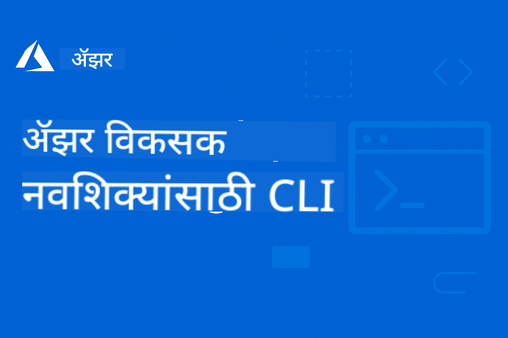

<!--
CO_OP_TRANSLATOR_METADATA:
{
  "original_hash": "c0984265b7a9357388f864c19606c80d",
  "translation_date": "2025-09-11T09:55:50+00:00",
  "source_file": "README.md",
  "language_code": "mr"
}
-->
# AZD सुरुवातीसाठी

 

[](https://GitHub.com/microsoft/azd-for-beginners/watchers/?WT.mc_id=academic-105485-koreyst)
[](https://GitHub.com/microsoft/azd-for-beginners/network/?WT.mc_id=academic-105485-koreyst)
[](https://GitHub.com/microsoft/azd-for-beginners/stargazers/?WT.mc_id=academic-105485-koreyst)

[](https://discord.gg/microsoft-azure)

[](https://discord.gg/kzRShWzttr)

या संसाधनांचा वापर सुरू करण्यासाठी खालील चरणांचे अनुसरण करा:
1. **रेपॉझिटरी फोर्क करा**: क्लिक करा [](https://GitHub.com/microsoft/azd-for-beginners/fork)
2. **रेपॉझिटरी क्लोन करा**:   `git clone https://github.com/microsoft/azd-for-beginners.git`
3. [**Azure Discord समुदायामध्ये सामील व्हा आणि तज्ञ व इतर विकसकांशी भेटा**](https://discord.com/invite/ByRwuEEgH4)

### 🌐 बहुभाषिक समर्थन

#### GitHub Action द्वारे समर्थित (स्वयंचलित आणि नेहमी अद्ययावत)

[French](../fr/README.md) | [Spanish](../es/README.md) | [German](../de/README.md) | [Russian](../ru/README.md) | [Arabic](../ar/README.md) | [Persian (Farsi)](../fa/README.md) | [Urdu](../ur/README.md) | [Chinese (Simplified)](../zh/README.md) | [Chinese (Traditional, Macau)](../mo/README.md) | [Chinese (Traditional, Hong Kong)](../hk/README.md) | [Chinese (Traditional, Taiwan)](../tw/README.md) | [Japanese](../ja/README.md) | [Korean](../ko/README.md) | [Hindi](../hi/README.md) | [Bengali](../bn/README.md) | [Marathi](./README.md) | [Nepali](../ne/README.md) | [Punjabi (Gurmukhi)](../pa/README.md) | [Portuguese (Portugal)](../pt/README.md) | [Portuguese (Brazil)](../br/README.md) | [Italian](../it/README.md) | [Polish](../pl/README.md) | [Turkish](../tr/README.md) | [Greek](../el/README.md) | [Thai](../th/README.md) | [Swedish](../sv/README.md) | [Danish](../da/README.md) | [Norwegian](../no/README.md) | [Finnish](../fi/README.md) | [Dutch](../nl/README.md) | [Hebrew](../he/README.md) | [Vietnamese](../vi/README.md) | [Indonesian](../id/README.md) | [Malay](../ms/README.md) | [Tagalog (Filipino)](../tl/README.md) | [Swahili](../sw/README.md) | [Hungarian](../hu/README.md) | [Czech](../cs/README.md) | [Slovak](../sk/README.md) | [Romanian](../ro/README.md) | [Bulgarian](../bg/README.md) | [Serbian (Cyrillic)](../sr/README.md) | [Croatian](../hr/README.md) | [Slovenian](../sl/README.md) | [Ukrainian](../uk/README.md) | [Burmese (Myanmar)](../my/README.md)

**जर तुम्हाला अतिरिक्त भाषांमध्ये भाषांतर हवे असेल तर समर्थित भाषांची यादी [येथे](https://github.com/Azure/co-op-translator/blob/main/getting_started/supported-languages.md) आहे**

## परिचय

Azure Developer CLI (azd) साठी व्यापक मार्गदर्शकात आपले स्वागत आहे. हे रेपॉझिटरी विद्यार्थ्यांपासून व्यावसायिक विकसकांपर्यंत सर्व स्तरांवरील विकसकांना Azure Developer CLI शिकण्यासाठी आणि क्लाउड डिप्लॉयमेंटसाठी कार्यक्षमतेने मास्टर करण्यासाठी डिझाइन केले आहे. ही संरचित शिक्षण संसाधने Azure क्लाउड डिप्लॉयमेंटसह हाताळण्याचा अनुभव, सामान्य समस्यांचे निराकरण, आणि यशस्वी AZD टेम्पलेट डिप्लॉयमेंटसाठी सर्वोत्तम पद्धती लागू करण्यासाठी प्रदान करतात.

## शिक्षण उद्दिष्टे

या रेपॉझिटरीद्वारे काम करून, तुम्ही:
- Azure Developer CLI मूलभूत गोष्टी आणि मुख्य संकल्पना मास्टर करा
- Infrastructure as Code वापरून Azure संसाधने डिप्लॉय आणि प्रोव्हिजन करणे शिका
- सामान्य AZD डिप्लॉयमेंट समस्यांसाठी निराकरण कौशल्य विकसित करा
- पूर्व-डिप्लॉयमेंट सत्यापन आणि क्षमता नियोजन समजून घ्या
- सुरक्षा सर्वोत्तम पद्धती आणि खर्च ऑप्टिमायझेशन धोरणे लागू करा
- Azure वर उत्पादन-तयार अनुप्रयोग डिप्लॉय करण्याचा आत्मविश्वास निर्माण करा

## शिक्षण परिणाम

हा कोर्स पूर्ण केल्यानंतर, तुम्ही:
- Azure Developer CLI यशस्वीरित्या स्थापित, कॉन्फिगर आणि वापरू शकता
- AZD टेम्पलेट्स वापरून अनुप्रयोग तयार आणि डिप्लॉय करू शकता
- प्रमाणीकरण, पायाभूत सुविधा आणि डिप्लॉयमेंट समस्यांचे निराकरण करू शकता
- क्षमता नियोजन आणि SKU निवडीसह पूर्व-डिप्लॉयमेंट तपासणी करू शकता
- मॉनिटरिंग, सुरक्षा आणि खर्च व्यवस्थापन सर्वोत्तम पद्धती लागू करू शकता
- AZD वर्कफ्लो CI/CD पाइपलाइन्समध्ये समाकलित करू शकता

## विषय सूची

- [Azure Developer CLI म्हणजे काय?](../..)
- [जलद सुरुवात](../..)
- [दस्तऐवजीकरण](../..)
- [उदाहरणे आणि टेम्पलेट्स](../..)
- [संसाधने](../..)
- [योगदान](../..)

## Azure Developer CLI म्हणजे काय?

Azure Developer CLI (azd) हे एक विकसक-केंद्रित कमांड-लाइन इंटरफेस आहे जे Azure वर अनुप्रयोग तयार आणि डिप्लॉय करण्याची प्रक्रिया गतीमान करते. हे प्रदान करते:

- **टेम्पलेट-आधारित डिप्लॉयमेंट्स** - सामान्य अनुप्रयोग पॅटर्नसाठी पूर्व-निर्मित टेम्पलेट्स वापरा
- **Infrastructure as Code** - Bicep किंवा Terraform वापरून Azure संसाधने व्यवस्थापित करा
- **समाकलित वर्कफ्लो** - अनुप्रयोग सहजपणे प्रोव्हिजन, डिप्लॉय आणि मॉनिटर करा
- **विकसक-अनुकूल** - विकसक उत्पादकता आणि अनुभवासाठी अनुकूलित

## जलद सुरुवात

### पूर्वापेक्षा
- Azure सदस्यता
- Azure CLI स्थापित
- Git (टेम्पलेट्स क्लोन करण्यासाठी)

### स्थापना
```bash
# Windows (PowerShell)
powershell -ex AllSigned -c "Invoke-RestMethod 'https://aka.ms/install-azd.ps1' | Invoke-Expression"

# macOS/Linux
curl -fsSL https://aka.ms/install-azd.sh | bash
```

### तुमचा पहिला डिप्लॉयमेंट
```bash
# Initialize a new project
azd init --template todo-nodejs-mongo

# Provision Azure resources and deploy
azd up
```

## दस्तऐवजीकरण

### सुरुवात करणे
- [**AZD मूलभूत गोष्टी**](docs/getting-started/azd-basics.md) - मुख्य संकल्पना आणि शब्दावली
- [**स्थापना आणि सेटअप**](docs/getting-started/installation.md) - प्लॅटफॉर्म-विशिष्ट स्थापना मार्गदर्शक
- [**कॉन्फिगरेशन**](docs/getting-started/configuration.md) - वातावरण सेटअप आणि प्रमाणीकरण
- [**तुमचा पहिला प्रकल्प**](docs/getting-started/first-project.md) - चरण-दर-चरण ट्यूटोरियल

### डिप्लॉयमेंट आणि प्रोव्हिजनिंग
- [**डिप्लॉयमेंट मार्गदर्शक**](docs/deployment/deployment-guide.md) - संपूर्ण डिप्लॉयमेंट वर्कफ्लो
- [**संसाधने प्रोव्हिजन करणे**](docs/deployment/provisioning.md) - Azure संसाधन व्यवस्थापन

### पूर्व-डिप्लॉयमेंट तपासणी
- [**क्षमता नियोजन**](docs/pre-deployment/capacity-planning.md) - Azure संसाधन क्षमता सत्यापन
- [**SKU निवड**](docs/pre-deployment/sku-selection.md) - योग्य Azure SKUs निवडणे
- [**पूर्व-उड्डाण तपासणी**](docs/pre-deployment/preflight-checks.md) - स्वयंचलित सत्यापन स्क्रिप्ट्स

### समस्यांचे निराकरण
- [**सामान्य समस्या**](docs/troubleshooting/common-issues.md) - वारंवार येणाऱ्या समस्या आणि उपाय
- [**डिबगिंग मार्गदर्शक**](docs/troubleshooting/debugging.md) - चरण-दर-चरण डिबगिंग धोरणे

## उदाहरणे आणि टेम्पलेट्स
- [**उदाहरणे**]([examples/README.md) - व्यावहारिक उदाहरणे, टेम्पलेट्स, आणि वास्तविक-जगातील परिस्थिती जे तुम्हाला Azure Developer CLI शिकण्यासाठी हाताळण्याचा सराव देतात. प्रत्येक उदाहरण पूर्ण कार्यरत कोड, पायाभूत सुविधा टेम्पलेट्स, आणि विविध अनुप्रयोग आर्किटेक्चर आणि डिप्लॉयमेंट पॅटर्नसाठी तपशीलवार सूचना प्रदान करते.

### हाताळणी प्रयोगशाळा/कार्यशाळा
- [**AZD सुरुवातीसाठी**](workshop/README.md) - ही कार्यशाळा AI एजंट्स AZD टेम्पलेटसह सुरुवात करण्यावर लक्ष केंद्रित करेल आणि AZD वापरून Azure AI सेवांच्या डिप्लॉयमेंटसाठी सर्वोत्तम पद्धती प्रदान करेल.

## संसाधने

### जलद संदर्भ
- [**कमांड चीट शीट**](resources/cheat-sheet.md) - आवश्यक azd कमांड्स
- [**शब्दकोश**](resources/glossary.md) - Azure आणि azd शब्दावली
- [**FAQ**](resources/faq.md) - वारंवार विचारले जाणारे प्रश्न
- [**अभ्यास मार्गदर्शक**](resources/study-guide.md) - व्यापक शिक्षण उद्दिष्टे आणि सराव व्यायाम

### बाह्य संसाधने
- [Azure Developer CLI दस्तऐवजीकरण](https://learn.microsoft.com/en-us/azure/developer/azure-developer-cli/)
- [Azure आर्किटेक्चर केंद्र](https://learn.microsoft.com/en-us/azure/architecture/)
- [Azure किंमत कॅल्क्युलेटर](https://azure.microsoft.com/pricing/calculator/)
- [Azure स्थिती](https://status.azure.com/)

## शिक्षण मार्ग

### विद्यार्थ्यांसाठी आणि सुरुवातीसाठी
1. [AZD मूलभूत गोष्टी](docs/getting-started/azd-basics.md) पासून सुरुवात करा
2. [स्थापना मार्गदर्शक](docs/getting-started/installation.md) अनुसरण करा
3. [तुमचा पहिला प्रकल्प](docs/getting-started/first-project.md) पूर्ण करा
4. [साधा वेब अॅप उदाहरण](../../examples/simple-web-app) सराव करा

### विकसकांसाठी
1. [कॉन्फिगरेशन मार्गदर्शक](docs/getting-started/configuration.md) पुनरावलोकन करा
2. [डिप्लॉयमेंट मार्गदर्शक](docs/deployment/deployment-guide.md) अभ्यास करा
3. [डेटाबेस अॅप उदाहरण](../../examples/database-app) पूर्ण करा
4. [कंटेनर अॅप उदाहरण](../../examples/container-app) एक्सप्लोर करा

### DevOps अभियंत्यांसाठी
1. [संसाधने प्रोव्हिजन करणे](docs/deployment/provisioning.md) मास्टर करा
2. [पूर्व-उड्डाण तपासणी](docs/pre-deployment/preflight-checks.md) लागू करा
3. [क्षमता नियोजन](docs/pre-deployment/capacity-planning.md) सराव करा
4. प्रगत [मायक्रोसर्व्हिसेस उदाहरण](../../examples/microservices) एक्सप्लोर करा

## योगदान

आम्ही योगदानांचे स्वागत करतो! कृपया आमचे [योगदान मार्गदर्शक](CONTRIBUTING.md) वाचा:
- समस्या आणि वैशिष्ट्य विनंत्या कशा सादर करायच्या
- कोड योगदान मार्गदर्शक तत्त्वे
- दस्तऐवजीकरण सुधारणा
- समुदाय मानके

## समर्थन

- **समस्या**: [बग्स रिपोर्ट करा आणि वैशिष्ट्य विनंत्या करा](https://github.com/microsoft/azd-for-beginners/issues)
- **चर्चा**: [Microsoft Azure Discord समुदाय Q&A आणि चर्चा](https://discord.gg/microsoft-azure)
- **ईमेल**: खाजगी चौकशीसाठी
- **Microsoft Learn**: [अधिकृत Azure Developer CLI दस्तऐवजीकरण](https://learn.microsoft.com/en-us/azure/developer/azure-developer-cli/)

## परवाना

हा प्रकल्प MIT परवान्याअंतर्गत परवाना आहे - तपशीलांसाठी [LICENSE](../../LICENSE) फाइल पहा.

## 🎒 इतर अभ्यासक्रम

आमची टीम इतर अभ्यासक्रम तयार करते! तपासा:

- [**नवीन** मॉडेल कॉन्टेक्स्ट प्रोटोकॉल (MCP) सुरुवातीसाठी](https://github.com/microsoft/mcp-for-beginners?WT.mc_id=academic-105485-koreyst)
- [AI एजंट्स सुरुवातीसाठी](https://github.com/microsoft/ai-agents-for-beginners?WT.mc_id=academic-105485-koreyst)
- [Generative AI सुरुवातीसाठी .NET वापरून](https://github.com/microsoft/Generative-AI-for-beginners-dotnet?WT.mc_id=academic-105485-koreyst)
- [Generative AI सुरुवातीसाठी](https://github.com/microsoft/generative-ai-for-beginners?WT.mc_id=academic-105485-koreyst)
- [Generative AI सुरुवातीसाठी Java वापरून](https://github.com/microsoft/generative-ai-for-beginners-java?WT.mc_id=academic-105485-koreyst)
- [ML सुरुवातीसाठी](https://aka.ms/ml-beginners?WT.mc_id=academic-105485-koreyst)
- [डेटा विज्ञान सुरुवातीसाठी](https://aka.ms/datascience-beginners?WT.mc_id=academic-105485-koreyst)
- [AI सुरुवातीसाठी](https://aka.ms/ai-beginners?WT.mc_id=academic-105485-koreyst)
- [सायबर सुरक्षा सुरुवातीसाठी](https://github.com/microsoft/Security-101??WT.mc_id=academic-96948-sayoung)
- [वेब डेव्ह सुरुवातीसाठी](https://aka.ms/webdev-beginners?WT.mc_id=academic-105485-koreyst)
- [IoT for Beginners](https://aka.ms/iot-beginners?WT.mc_id=academic-105485-koreyst)
- [XR Development for Beginners](https://github.com/microsoft/xr-development-for-beginners?WT.mc_id=academic-105485-koreyst)
- [Mastering GitHub Copilot for AI Paired Programming](https://aka.ms/GitHubCopilotAI?WT.mc_id=academic-105485-koreyst)
- [Mastering GitHub Copilot for C#/.NET Developers](https://github.com/microsoft/mastering-github-copilot-for-dotnet-csharp-developers?WT.mc_id=academic-105485-koreyst)
- [Choose Your Own Copilot Adventure](https://github.com/microsoft/CopilotAdventures?WT.mc_id=academic-105485-koreyst)

---

**नेव्हिगेशन**
- **पुढचा धडा**: [AZD मूलभूत गोष्टी](docs/getting-started/azd-basics.md)

---

**अस्वीकरण**:  
हा दस्तऐवज AI भाषांतर सेवा [Co-op Translator](https://github.com/Azure/co-op-translator) वापरून भाषांतरित करण्यात आला आहे. आम्ही अचूकतेसाठी प्रयत्नशील असलो तरी कृपया लक्षात ठेवा की स्वयंचलित भाषांतरांमध्ये त्रुटी किंवा अचूकतेचा अभाव असू शकतो. मूळ भाषेतील दस्तऐवज हा अधिकृत स्रोत मानला जावा. महत्त्वाच्या माहितीसाठी व्यावसायिक मानवी भाषांतराची शिफारस केली जाते. या भाषांतराचा वापर करून निर्माण होणाऱ्या कोणत्याही गैरसमज किंवा चुकीच्या अर्थासाठी आम्ही जबाबदार राहणार नाही.