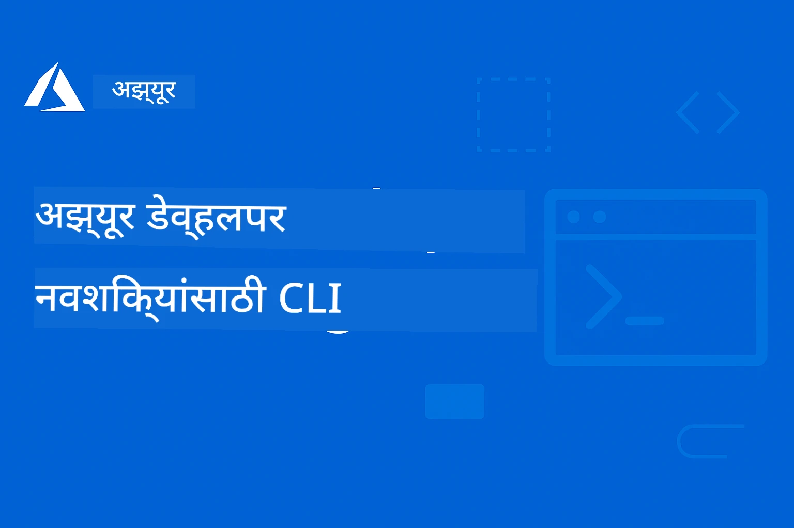

# AZD नवशिक्यांसाठी: एक रचनाबद्ध शिक्षण प्रवास

 

[](https://GitHub.com/microsoft/azd-for-beginners/watchers/)
[](https://GitHub.com/microsoft/azd-for-beginners/network/)
[](https://GitHub.com/microsoft/azd-for-beginners/stargazers/)

[](https://discord.gg/microsoft-azure)
[](https://discord.gg/nTYy5BXMWG)

## या कोर्ससह सुरूवात कशी करावी

तुमचा AZD शिक्षण प्रवास सुरू करण्यासाठी खालील पायऱ्या अनुसरा:

1. **रेकॉजिटरी फॉर्क करा**: क्लिक करा [](https://GitHub.com/microsoft/azd-for-beginners/fork)
2. **रेकॉजिटरी क्लोन करा**: `git clone https://github.com/microsoft/azd-for-beginners.git`
3. **समुदायात सामील व्हा**: तज्ञांच्या मदतीसाठी [Azure Discord Communities](https://discord.com/invite/ByRwuEEgH4)
4. **तुमचा शिक्षण मार्ग निवडा**: तुमच्या अनुभवाच्या पातळीशी जुळणारा खालील प्रकरण निवडा

### बहुभाषिक समर्थन

#### स्वयंचलित अनुवाद (नेहमी अद्ययावत)

<!-- CO-OP TRANSLATOR LANGUAGES TABLE START -->
[Arabic](../ar/README.md) | [Bengali](../bn/README.md) | [Bulgarian](../bg/README.md) | [Burmese (Myanmar)](../my/README.md) | [Chinese (Simplified)](../zh-CN/README.md) | [Chinese (Traditional, Hong Kong)](../zh-HK/README.md) | [Chinese (Traditional, Macau)](../zh-MO/README.md) | [Chinese (Traditional, Taiwan)](../zh-TW/README.md) | [Croatian](../hr/README.md) | [Czech](../cs/README.md) | [Danish](../da/README.md) | [Dutch](../nl/README.md) | [Estonian](../et/README.md) | [Finnish](../fi/README.md) | [French](../fr/README.md) | [German](../de/README.md) | [Greek](../el/README.md) | [Hebrew](../he/README.md) | [Hindi](../hi/README.md) | [Hungarian](../hu/README.md) | [Indonesian](../id/README.md) | [Italian](../it/README.md) | [Japanese](../ja/README.md) | [Kannada](../kn/README.md) | [Korean](../ko/README.md) | [Lithuanian](../lt/README.md) | [Malay](../ms/README.md) | [Malayalam](../ml/README.md) | [Marathi](./README.md) | [Nepali](../ne/README.md) | [Nigerian Pidgin](../pcm/README.md) | [Norwegian](../no/README.md) | [Persian (Farsi)](../fa/README.md) | [Polish](../pl/README.md) | [Portuguese (Brazil)](../pt-BR/README.md) | [Portuguese (Portugal)](../pt-PT/README.md) | [Punjabi (Gurmukhi)](../pa/README.md) | [Romanian](../ro/README.md) | [Russian](../ru/README.md) | [Serbian (Cyrillic)](../sr/README.md) | [Slovak](../sk/README.md) | [Slovenian](../sl/README.md) | [Spanish](../es/README.md) | [Swahili](../sw/README.md) | [Swedish](../sv/README.md) | [Tagalog (Filipino)](../tl/README.md) | [Tamil](../ta/README.md) | [Telugu](../te/README.md) | [Thai](../th/README.md) | [Turkish](../tr/README.md) | [Ukrainian](../uk/README.md) | [Urdu](../ur/README.md) | [Vietnamese](../vi/README.md)

> **स्थानिकरित्या क्लोन करायचे असल्यास?**

> हा रेकॉजिटरी 50+ भाषांमध्ये भाषांतरांसह येतो ज्यामुळे डाउनलोड आकार मोठा होतो. भाषांतरांशिवाय क्लोन करण्यासाठी sparse checkout वापरा:
> ```bash
> git clone --filter=blob:none --sparse https://github.com/microsoft/AZD-for-beginners.git
> cd AZD-for-beginners
> git sparse-checkout set --no-cone '/*' '!translations' '!translated_images'
> ```
> हे तुम्हाला कोर्स पूर्ण करण्यासाठी आवश्यक सर्व काही देते आणि डाउनलोड जलद होते.
<!-- CO-OP TRANSLATOR LANGUAGES TABLE END -->

## कोर्सचा आढावा

Azure Developer CLI (azd) मध्ये प्रगतीशील शिकण्यासाठी रचनाबद्ध प्रकरणांद्वारे प्राविण्य मिळवा. **Microsoft Foundry एकत्रीकरणासह AI अनुप्रयोग परिनियोजनावर विशेष भर.**

### आधुनिक विकसकांसाठी हा कोर्स का आवश्यक आहे

Microsoft Foundry Discord समुदायाच्या अंतर्दृष्टीवर आधारित, **45% विकसक AI कामांसाठी AZD वापरू इच्छितात** परंतु खालील अडचणी येतात:
- जटिल मल्टी-सर्व्हिस AI आर्किटेक्चर
- उत्पादन AI परिनियोजन सर्वोत्तम पद्धती  
- Azure AI सेवा एकत्रीकरण आणि कॉन्फिगरेशन
- AI कामांसाठी खर्च ऑप्टिमायझेशन
- AI-विशिष्ट परिनियोजन त्रुटी शोधणे आणि निराकरण करणे

### शिकण्याचे उद्दिष्टे

हा रचनाबद्ध कोर्स पूर्ण करून, तुम्ही:
- **AZD मूलभूत गोष्टी मास्टर करा**: मुख्य संकल्पना, स्थापना, आणि कॉन्फिगरेशन
- **AI अनुप्रयोग परिनियोजित करा**: Microsoft Foundry सेवांसह AZD वापरा
- **इन्फ्रास्ट्रक्चर as Code लागू करा**: Bicep टेम्पलेट्ससह Azure संसाधने व्यवस्थापित करा
- **परिनियोजन त्रुटी शोधा**: सामान्य समस्या सोडवा आणि डीबग करा
- **उत्पादनासाठी ऑप्टिमाइझ करा**: सुरक्षा, स्केलिंग, निरीक्षण, आणि खर्च व्यवस्थापन
- **मल्टी-एजंट सोल्युशन्स तयार करा**: जटिल AI आर्किटेक्चर परिनियोजित करा

## 📚 शिकण्याची प्रकरणे

*अनुभव पातळी आणि उद्दिष्टांनुसार तुमचा शिकण्याचा मार्ग निवडा*

### 🚀 प्रकरण 1: पाया आणि त्वरित सुरुवात
**प्राथमिकता:** Azure सबस्क्रिप्शन, कमांड लाइनचा प्राथमिक ज्ञान  
**कालावधी:** 30-45 मिनिटे  
**संकुलता:** ⭐

#### तुम्ही काय शिकाल
- Azure Developer CLI मूलभूत गोष्टी समजून घ्या
- तुमच्या प्लॅटफॉर्मवर AZD स्थापित करा
- तुमचे पहिले यशस्वी परिनियोजन

#### शिकण्याचे स्रोत
- **🎯 येथे सुरू करा**: [Azure Developer CLI म्हणजे काय?](../..)
- **📖 सिद्धांत**: [AZD मूलभूत](docs/getting-started/azd-basics.md) - मुख्य संकल्पना आणि शब्दावली
- **⚙️ सेटअप**: [स्थापना आणि सेटअप](docs/getting-started/installation.md) - प्लॅटफॉर्म-विशिष्ट मार्गदर्शक
- **🛠️ प्रायोगिक**: [तुमचा पहिला प्रकल्प](docs/getting-started/first-project.md) - टप्प्याटप्प्याने ट्युटोरियल
- **📋 जलद संदर्भ**: [कमांड चीट शीट](resources/cheat-sheet.md)

#### व्यावहारिक व्यायाम
```bash
# जलद स्थापना तपासणी
azd version

# आपला पहिला अनुप्रयोग तैनात करा
azd init --template todo-nodejs-mongo
azd up
```

**💡 प्रकरणाचा परिणाम**: AZD वापरून Azure वर एक सोपा वेब अनुप्रयोग यशस्वीपणे परिनियोजित करा

**✅ यशाची पडताळणी:**
```bash
# पहिले प्रकरण पूर्ण केल्यानंतर, आपण सक्षम असावे:
azd version              # स्थापित केलेली आवृत्ती दाखवते
azd init --template todo-nodejs-mongo  # प्रकल्प प्रारंभ करते
azd up                  # Azure वर तैनात करते
azd show                # चालू असलेला अॅप URL दाखवते
# अॅप्लिकेशन ब्राउझरमध्ये उघडते आणि कार्य करते
azd down --force --purge  # संसाधने स्वच्छ करते
```

**📊 वेळ गुंतवणूक:** 30-45 मिनिटे  
**📈 कौशल्य पातळी नंतर:** मूलभूत अनुप्रयोग स्वतंत्रपणे परिनियोजित करू शकतो

**✅ यशाची पडताळणी:**
```bash
# अध्याय 1 पूर्ण केल्यावर, तुम्ही सक्षम असाल:
azd version              # स्थापित आवृत्ती दर्शवते
azd init --template todo-nodejs-mongo  # प्रकल्प सुरू करतो
azd up                  # Azure वर तैनात करतो
azd show                # चालू असलेल्या अॅपचा URL दर्शवितो
# अॅप्लिकेशन ब्राउझरमध्ये उघडते आणि कार्य करते
azd down --force --purge  # स्रोतांची स्वच्छता करतो
```

**📊 वेळ गुंतवणूक:** 30-45 मिनिटे  
**📈 कौशल्य पातळी नंतर:** मूलभूत अनुप्रयोग स्वतंत्रपणे परिनियोजित करू शकतो

---

### 🤖 प्रकरण 2: AI-प्रथम विकास (AI विकसकांसाठी शिफारस केलेले)
**प्राथमिकता:** प्रकरण 1 पूर्ण केले  
**कालावधी:** 1-2 तास  
**संकुलता:** ⭐⭐

#### तुम्ही काय शिकाल
- Microsoft Foundry सह AZD चे एकत्रीकरण
- AI-चालित अनुप्रयोग परिनियोजन
- AI सेवा कॉन्फिगरेशन समजून घ्या

#### शिकण्याचे स्रोत
- **🎯 येथे सुरू करा**: [Microsoft Foundry एकत्रीकरण](docs/microsoft-foundry/microsoft-foundry-integration.md)
- **📖 नमुने**: [AI मॉडेल परिनियोजन](docs/microsoft-foundry/ai-model-deployment.md) - AI मॉडेल परिनियोजित आणि व्यवस्थापित करा
- **🛠️ कार्यशाळा**: [AI कार्यशाळा लॅब](docs/microsoft-foundry/ai-workshop-lab.md) - तुमचे AI सोल्युशन्स AZD-योग्य करा
- **🎥 संवादात्मक मार्गदर्शक**: [कार्यशाळा साहित्य](workshop/README.md) - MkDocs * DevContainer वातावरणासह ब्राउझर आधारित शिक्षण
- **📋 टेम्पलेट्स**: [Microsoft Foundry टेम्पलेट्स](../..)
- **📝 उदाहरणे**: [AZD परिनियोजन उदाहरणे](examples/README.md)

#### व्यावहारिक व्यायाम
```bash
# तुमचे पहिले AI अनुप्रयोग तैनात करा
azd init --template azure-search-openai-demo
azd up

# अतिरिक्त AI टेम्पलेट्स वापरून पहा
azd init --template openai-chat-app-quickstart
azd init --template agent-openai-python-prompty
```

**💡 प्रकरणाचा परिणाम**: RAG क्षमतेसह AI-चालित चॅट अनुप्रयोग परिनियोजित करा आणि कॉन्फिगर करा

**✅ यशाची पडताळणी:**
```bash
# अध्याय २ नंतर, तुम्ही सक्षम असायला हवे:
azd init --template azure-search-openai-demo
azd up
# AI चॅट इंटरफेसची चाचणी करा
# प्रश्न विचारा आणि स्रोतांसह AI-चालित प्रतिसाद मिळवा
# शोध समाकलन कार्यरत आहे का तपासा
azd monitor  # Application Insights टेलीमेट्री दाखवते का ते तपासा
azd down --force --purge
```

**📊 वेळ गुंतवणूक:** 1-2 तास  
**📈 कौशल्य पातळी नंतर:** उत्पादन-तयार AI अनुप्रयोग परिनियोजित आणि कॉन्फिगर करू शकतो  
**💰 खर्चाची जाणीव:** $80-150/महिना विकास खर्च, $300-3500/महिना उत्पादन खर्च समजून घ्या

#### 💰 AI परिनियोजनांसाठी खर्च विचार

**विकास वातावरण (अंदाजे $80-150/महिना):**
- Azure OpenAI (Pay-as-you-go): $0-50/महिना (टोकन वापरावर आधारित)
- AI Search (मुलभूत स्तर): $75/महिना
- कंटेनर अ‍ॅप्स (सपाप उपयोग): $0-20/महिना
- संग्रहण (साधारण): $1-5/महिना

**उत्पादन वातावरण (अंदाजे $300-3,500+/महिना):**
- Azure OpenAI (सातत्यासाठी PTU): $3,000+/महिना किंवा उच्च प्रमाणात Pay-as-go
- AI Search (मानक स्तर): $250/महिना
- कंटेनर अ‍ॅप्स (समर्पित): $50-100/महिना
- Application Insights: $5-50/महिना
- संग्रहण (प्रिमियम): $10-50/महिना

**💡 खर्च कमी करण्याचे टिप्स:**
- शिकण्यासाठी **फ्री टियर** Azure OpenAI वापरा (50,000 टोकन/महिना समाविष्ट)
- सक्रियपणे विकास करत नसल्यास `azd down` चालवा जेणेकरून संसाधने डिअलोकेट होतील
- उत्पादनासाठी फक्त PTU वापरा, सुरुवातीला सपाप वापर बिलिंग वापरा
- परिनियोजनापूर्वी `azd provision --preview` वापरून खर्चाचा अंदाज घ्या
- ऑटो-स्केलिंग सक्षम करा: फक्त वापरल्या प्रमाणे पैसे द्या

**खर्च निरीक्षण:**
```bash
# अंदाजे मासिक खर्च तपासा
azd provision --preview

# Azure पोर्टलमधील वास्तविक खर्च देखरेख करा
az consumption budget list --resource-group <your-rg>
```

---

### ⚙️ प्रकरण 3: कॉन्फिगरेशन आणि प्रमाणीकरण
**प्राथमिकता:** प्रकरण 1 पूर्ण केले  
**कालावधी:** 45-60 मिनिटे  
**संकुलता:** ⭐⭐

#### तुम्ही काय शिकाल
- पर्यावरण कॉन्फिगरेशन आणि व्यवस्थापन
- प्रमाणीकरण आणि सुरक्षा सर्वोत्तम पद्धती
- संसाधन नावे आणि आयोजन

#### शिकण्याचे स्रोत
- **📖 कॉन्फिगरेशन**: [कॉन्फिगरेशन मार्गदर्शक](docs/getting-started/configuration.md) - पर्यावरण सेटअप
- **🔐 सुरक्षा**: [प्रमाणीकरण नमुने आणि व्यवस्थापित ओळख](docs/getting-started/authsecurity.md) - प्रमाणीकरण नमुने
- **📝 उदाहरणे**: [डेटाबेस अ‍ॅप उदाहरण](examples/database-app/README.md) - AZD डेटाबेस उदाहरणे

#### व्यावहारिक व्यायाम
- एकाधिक पर्यावरणे कॉन्फिगर करा (विकास, स्टेजिंग, उत्पादन)
- व्यवस्थापित ओळख प्रमाणीकरण सेट अप करा
- पर्यावरण-विशिष्ट कॉन्फिगरेशन लागू करा

**💡 प्रकरणाचा परिणाम**: योग्य प्रमाणीकरण आणि सुरक्षेसह एकाधिक पर्यावरणे व्यवस्थापित करा

---

### 🏗️ प्रकरण 4: इन्फ्रास्ट्रक्चर अस कोड आणि परिनियोजन
**प्राथमिकता:** प्रकरण 1-3 पूर्ण केले  
**कालावधी:** 1-1.5 तास  
**संकुलता:** ⭐⭐⭐

#### तुम्ही काय शिकाल
- प्रगत परिनियोजन नमुने
- Bicep सह इन्फ्रास्ट्रक्चर अस कोड
- संसाधन पुरवठा धोरणे

#### शिकण्याचे स्रोत
- **📖 परिनियोजन**: [परिनियोजन मार्गदर्शक](docs/deployment/deployment-guide.md) - पूर्ण कार्यप्रवाह
- **🏗️ पुरवठा**: [संसाधन पुरवठा](docs/deployment/provisioning.md) - Azure संसाधन व्यवस्थापन
- **📝 उदाहरणे**: [कंटेनर अ‍ॅप उदाहरण](../../examples/container-app) - कंटेनराइज्ड परिनियोजन

#### व्यावहारिक व्यायाम
- कस्टम Bicep टेम्पलेट तयार करा
- मल्टी-सर्व्हिस अनुप्रयोग परिनियोजित करा
- ब्लू-ग्रीन परिनियोजन धोरणे राबवा

**💡 प्रकरणाचा परिणाम**: कस्टम इन्फ्रास्ट्रक्चर टेम्पलेट्स वापरून जटिल मल्टी-सर्व्हिस अनुप्रयोग परिनियोजित करा

---

### 🎯 प्रकरण 5: मल्टी-एजंट AI सोल्युशन्स (अधुनिक)
**प्राथमिकता:** प्रकरण 1-2 पूर्ण केले  
**कालावधी:** 2-3 तास  
**संकुलता:** ⭐⭐⭐⭐
#### तुम्हाला काय शिकायला मिळेल
- मल्टी-एजंट आर्किटेक्चर पॅटर्न्स
- एजंट ऑर्केस्ट्रेशन आणि समन्वय
- प्रॉडक्शन-तयार AI डिप्लॉयमेंट्स

#### शिक्षण संसाधने
- **🤖 वैशिष्ट्यीकृत प्रोजेक्ट**: [Retail Multi-Agent Solution](examples/retail-scenario.md) - संपूर्ण अंमलबजावणी
- **🛠️ ARM टेम्पलेट्स**: [ARM Template Package](../../examples/retail-multiagent-arm-template) - एक-क्लिक डिप्लॉयमेंट
- **📖 आर्किटेक्चर**: [मल्टी-एजंट समन्वय पॅटर्न्स](/docs/pre-deployment/coordination-patterns.md) - पॅटर्न्स

#### व्यावहारिक सराव
```bash
# संपूर्ण किरकोळ मल्टी-एजंट समाधान तैनात करा
cd examples/retail-multiagent-arm-template
./deploy.sh

# एजंट संरचना अन्वेषण करा
az deployment group show --resource-group <rg-name> --name <deployment-name>
```

**💡 अध्याय परिणाम**: ग्राहक आणि इन्व्हेंटरी एजंटसह प्रॉडक्शन-तयार मल्टी-एजंट AI सोल्यूशन डिप्लॉय आणि व्यवस्थापित करा

---

### 🔍 अध्याय 6: प्री-डिप्लॉयमेंट पुष्टि आणि नियोजन
**पूर्वशर्ती**: अध्याय 4 पूर्ण  
**कालावधी**: 1 तास  
**संकुलता**: ⭐⭐

#### तुम्हाला काय शिकायला मिळेल
- क्षमता नियोजन आणि संसाधनांची पुष्टी
- SKU निवड धोरणे
- प्री-फ्लाइट तपासणी आणि ऑटोमेशन

#### शिक्षण संसाधने
- **📊 नियोजन**: [क्षमता नियोजन](docs/pre-deployment/capacity-planning.md) - संसाधन पुष्टी
- **💰 निवड**: [SKU निवड](docs/pre-deployment/sku-selection.md) - खर्च प्रभावी पर्याय
- **✅ पुष्टी**: [प्री-फ्लाइट तपासणी](docs/pre-deployment/preflight-checks.md) - स्वयंचलित स्क्रिप्ट्स

#### व्यावहारिक सराव
- क्षमता पुष्टी स्क्रिप्ट्स चालवा
- खर्चासाठी SKU निवडीची ऑप्टिमायझेशन करा
- स्वयंचलित प्री-डिप्लॉयमेंट तपासणी अंमलात आणा

**💡 अध्याय परिणाम**: अंमलबजावणीपूर्वी डिप्लॉयमेंटची पुष्टी आणि ऑप्टिमायझेशन करा

---

### 🚨 अध्याय 7: त्रुटी शोधणी आणि डीबगिंग
**पूर्वशर्ती**: कोणताही डिप्लॉयमेंट अध्याय पूर्ण  
**कालावधी**: 1-1.5 तास  
**संकुलता**: ⭐⭐

#### तुम्हाला काय शिकायला मिळेल
- प्रणालीगत डीबगिंग पद्धती
- सामान्य समस्या आणि उपाय
- AI-विशिष्ट त्रुटी शोधणी

#### शिक्षण संसाधने
- **🔧 सामान्य समस्या**: [सामान्य समस्या](docs/troubleshooting/common-issues.md) - FAQ आणि उपाय
- **🕵️ डीबगिंग**: [डीबगिंग मार्गदर्शक](docs/troubleshooting/debugging.md) - टप्प्यानुसार धोरणे
- **🤖 AI समस्या**: [AI-विशिष्ट त्रुटी शोधणी](docs/troubleshooting/ai-troubleshooting.md) - AI सेवा समस्या

#### व्यावहारिक सराव
- डिप्लॉयमेंट अयशस्वी होण्याचे निदान करा
- प्रमाणीकरण समस्या सोडवा
- AI सेवा कनेक्टिव्हिटी डीबग करा

**💡 अध्याय परिणाम**: सामान्य डिप्लॉयमेंट समस्या स्वतंत्रपणे निदान आणि निराकरण करा

---

### 🏢 अध्याय 8: प्रॉडक्शन आणि एंटरप्राइझ पॅटर्न्स
**पूर्वशर्ती**: अध्याय 1-4 पूर्ण  
**कालावधी**: 2-3 तास  
**संकुलता**: ⭐⭐⭐⭐

#### तुम्हाला काय शिकायला मिळेल
- प्रॉडक्शन डिप्लॉयमेंट धोरणे
- एंटरप्राइझ सुरक्षा पॅटर्न्स
- मॉनिटरिंग आणि खर्च ऑप्टिमायझेशन

#### शिक्षण संसाधने
- **🏭 प्रॉडक्शन**: [Production AI उत्कृष्ट प्रथा](docs/microsoft-foundry/production-ai-practices.md) - एंटरप्राइझ पॅटर्न्स
- **📝 उदाहरणे**: [Microservices उदाहरण](../../examples/microservices) - गुंतागुंतीची आर्किटेक्चर
- **📊 मॉनिटरिंग**: [Application Insights एकत्रीकरण](docs/pre-deployment/application-insights.md) - मॉनिटरिंग

#### व्यावहारिक सराव
- एंटरप्राइझ सुरक्षा पॅटर्नची अंमलबजावणी करा
- संपूर्ण मॉनिटरिंग सेटअप करा
- योग्य शासकीय तत्वांबरोबर प्रॉडक्शनमध्ये डिप्लॉय करा

**💡 अध्याय परिणाम**: पूर्ण प्रॉडक्शन क्षमता असलेल्या एंटरप्राइझ-तयार अनुप्रयोगांची डिप्लॉयमेंट करा

---

## 🎓 वर्कशॉपचा अवलोकन: हाताळणी-आधारित शिक्षण अनुभव

> **⚠️ वर्कशॉप स्थिती: सक्रिय विकास**  
> वर्कशॉप सामग्री सध्या विकसित आणि सुधारित केली जात आहे. मुख्य मोड्यूल कार्यान्वित आहेत, परंतु काही प्रगत विभाग अपूर्ण आहेत. आम्ही सर्व कंटेंट पूर्ण करण्यासाठी सक्रियपणे काम करत आहोत. [प्रगती ट्रॅक करा →](workshop/README.md)

### संवादात्मक वर्कशॉप सामग्री
**ब्राउझर-आधारित साधने आणि मार्गदर्शित सरावांसह व्यापक हाताळणी-आधारित शिक्षण**

आमच्या वर्कशॉप सामग्रीमुळे वर दिलेल्या अध्याय-आधारित अभ्यासक्रमाशी पूरक असणारा रचनात्मक, संवादात्मक शिक्षण अनुभव मिळतो. वर्कशॉप स्व-संचालित आणि शिक्षक-आघाडीच्या सत्रांसाठी डिझाइन केलेले आहे.

#### 🛠️ वर्कशॉप वैशिष्ट्ये
- **ब्राउझर-आधारित इंटरफेस**: संघटित MkDocs-शक्तीने चालणारा वर्कशॉप, शोध, कॉपी आणि थीम वैशिष्ट्यांसह
- **GitHub Codespaces एकत्रीकरण**: एक-क्लिक विकास पर्यावरण सेटअप
- **सुसंगत शिक्षण मार्ग**: 7 टप्प्यांचे मार्गदर्शित सराव (एकूण 3.5 तास)
- **शोध → डिप्लॉयमेंट → सानुकूलन**: प्रगत कार्यपद्धती
- **संवादात्मक DevContainer पर्यावरण**: पूर्व-संचीत साधने आणि अवलंबित्वे

#### 📚 वर्कशॉप रचना
वर्कशॉप खालीलप्रमाणे कार्य करते: **शोध → डिप्लॉयमेंट → सानुकूलन**

1. **शोध टप्पा** (45 मिनिटे)
   - Microsoft Foundry टेम्पलेट्स आणि सेवा यांचा अन्वेषण
   - मल्टी-एजंट आर्किटेक्चर पॅटर्न समजून घ्या
   - डिप्लॉयमेंट आवश्यकता आणि पूर्वशर्ती पहा

2. **डिप्लॉयमेंट टप्पा** (2 तास)
   - AZD सोबत AI अनुप्रयोगांचे हाताळणी डिप्लॉयमेंट
   - Azure AI सेवा आणि एंडपॉइंट कॉन्फिगर करा
   - सुरक्षा आणि प्रमाणीकरण पॅटर्नची अंमलबजावणी करा

3. **सानुकूलन टप्पा** (45 मिनिटे)
   - विशिष्ट वापर प्रकरणांसाठी अनुप्रयोग सानुकूलित करा
   - प्रॉडक्शन डिप्लॉयमेंटसाठी ऑप्टिमायझेशन करा
   - मॉनिटरिंग आणि खर्च व्यवस्थापन अंमलात आणा

#### 🚀 वर्कशॉप कसे सुरू करावे
```bash
# पर्याय 1: GitHub Codespaces (शिफारसीय)
# रेपॉजिटरीमध्ये "Code" → "Create codespace on main" क्लिक करा

# पर्याय 2: स्थानिक विकास
git clone https://github.com/microsoft/azd-for-beginners.git
cd azd-for-beginners/workshop
# workshop/README.md मधील सेटअप सूचना अनुसरा
```

#### 🎯 वर्कशॉप शिक्षण परिणाम
वर्कशॉप पूर्ण करून सहभागी याप्रकारे यशस्वी होतील:
- **प्रॉडक्शन AI अनुप्रयोग डिप्लॉय करा**: Microsoft Foundry सेवांसह AZD वापरा
- **मल्टी-एजंट आर्किटेक्चरमध्ये पारंगत व्हा**: समन्वित AI एजंट सोल्यूशन्स अंमलात आणा
- **सुरक्षा सर्वोत्तम प्रथा अंमलात आणा**: प्रमाणीकरण आणि प्रवेश नियंत्रण कॉन्फिगर करा
- **स्केलसाठी ऑप्टिमायझेशन करा**: खर्च-प्रभावी आणि कार्यक्षम डिप्लॉयमेंट डिझाईन करा
- **डिप्लॉयमेंट त्रुटी शोधा आणि निराकरण करा**: सामान्य समस्या स्वतंत्रपणे सोडवा

#### 📖 वर्कशॉप संसाधन
- **🎥 संवादात्मक मार्गदर्शक**: [वर्कशॉप सामग्री](workshop/README.md) - ब्राउझर-आधारित शिक्षण पर्यावरण
- **📋 टप्प्यानुसार सूचना**: [मार्गदर्शित सराव](../../workshop/docs/instructions) - सविस्तर मार्गदर्शन
- **🛠️ AI वर्कशॉप लॅब**: [AI वर्कशॉप लॅब](docs/microsoft-foundry/ai-workshop-lab.md) - AI-केंद्रित सराव
- **💡 त्वरित प्रारंभ**: [वर्कशॉप सेटअप मार्गदर्शक](workshop/README.md#quick-start) - पर्यावरण कॉन्फिगरेशन

**आच्छादित:** कॉरपोरेट प्रशिक्षण, विद्यापीठ अभ्यासक्रम, स्व-संचालित शिक्षण आणि डेव्हलपर बूटकॅम्पसाठी परिपूर्ण.

---

## 📖 Azure Developer CLI म्हणजे काय?

Azure Developer CLI (azd) हा डेव्हलपर-केंद्रित कमांड-लाइन इंटरफेस आहे जो Azure वर अनुप्रयोग तयार करणे आणि डिप्लॉय करणे वेगवान करतो. तो पुरवतो:

- **टेम्पलेट-आधारित डिप्लॉयमेंट्स** - कॉमन अनुप्रयोग पॅटर्नसाठी पूर्व-निर्मित टेम्पलेट वापरा
- **इन्फ्रास्ट्रक्चर एज कोड** - Bicep किंवा Terraform वापरून Azure संसाधने व्यवस्थापित करा  
- **संपूर्ण वर्कफ्लोज** - अनुप्रयोग सहजपणे प्राव्हिजन, डिप्लॉय आणि मॉनिटर करा
- **डेव्हलपर-मैत्रीपूर्ण** - डेव्हलपर उत्पादकता आणि अनुभवासाठी ऑप्टिमायझेशन

### **AZD + Microsoft Foundry: AI डिप्लॉयमेंटसाठी परिपूर्ण**

**AI सोल्यूशन्ससाठी AZD का?** AZD AI डेव्हलपर्सना भेडसावणाऱ्या मुख्य आव्हानांवर मात करते:

- **AI-तयार टेम्पलेट्स** - Azure OpenAI, Cognitive Services, आणि ML वर्कलोडसाठी पूर्व-कॉन्फिगर टेम्पलेट्स
- **सुरक्षित AI डिप्लॉयमेंट्स** - AI सेवा, API कीज, आणि मॉडेल एंडपॉइंटसाठी अंगभूत सुरक्षा पॅटर्न  
- **प्रॉडक्शन AI पॅटर्न्स** - स्केलेबल, खर्च-प्रभावी AI अनुप्रयोग डिप्लॉयमेंटसाठी सर्वोत्तम प्रथा
- **शेवटपर्यंत AI वर्कफ्लोज** - मॉडेल विकासापासून प्रॉडक्शन डिप्लॉयमेंटपर्यंत योग्य मॉनिटरिंगसह
- **खर्च ऑप्टिमायझेशन** - AI वर्कलोडसाठी स्मार्ट संसाधन वाटप आणि स्केलिंग धोरणे
- **Microsoft Foundry एकत्रीकरण** - Microsoft Foundry मॉडेल कॅटलॉग आणि एंडपॉइंटशी सहज कनेक्शन

---

## 🎯 टेम्पलेट्स आणि उदाहरणे ग्रंथालय

### वैशिष्ट्यीकृत: Microsoft Foundry टेम्पलेट्स
**AI अनुप्रयोग डिप्लॉय करत असाल तर येथे सुरू करा!**

> **टीप:** हे टेम्पलेट्स विविध AI पॅटर्न्स दाखवतात. काही बाह्य Azure नमुने आहेत, तर काही स्थानिक अंमलबजावणी आहेत.

| टेम्पलेट | अध्याय | संकुलता | सेवा | प्रकार |
|----------|---------|------------|----------|------|
| [**AI चॅटसह प्रारंभ करा**](https://github.com/Azure-Samples/get-started-with-ai-chat) | अध्याय 2 | ⭐⭐ | AzureOpenAI + Azure AI मॉडेल इन्फरन्स API + Azure AI सर्च + Azure कंटेनर अ‍ॅप्स + Application Insights | बाह्य |
| [**AI एजंटसह प्रारंभ करा**](https://github.com/Azure-Samples/get-started-with-ai-agents) | अध्याय 2 | ⭐⭐ | Azure AI एजंट सेवा + AzureOpenAI + Azure AI सर्च + Azure कंटेनर अ‍ॅप्स + Application Insights| बाह्य |
| [**Azure सर्च + OpenAI डेमो**](https://github.com/Azure-Samples/azure-search-openai-demo) | अध्याय 2 | ⭐⭐ | AzureOpenAI + Azure AI सर्च + App सेवा + स्टोरेज | बाह्य |
| [**OpenAI चॅट अ‍ॅप क्विकस्टार्ट**](https://github.com/Azure-Samples/openai-chat-app-quickstart) | अध्याय 2 | ⭐ | AzureOpenAI + कंटेनर अ‍ॅप्स + Application Insights | बाह्य |
| [**एजंट OpenAI Python Prompty**](https://github.com/Azure-Samples/agent-openai-python-prompty) | अध्याय 5 | ⭐⭐⭐ | AzureOpenAI + Azure Functions + Prompty | बाह्य |
| [**Contoso Chat RAG**](https://github.com/Azure-Samples/contoso-chat) | अध्याय 8 | ⭐⭐⭐⭐ | AzureOpenAI + AI सर्च + Cosmos DB + कंटेनर अ‍ॅप्स | बाह्य |
| [**Retail Multi-Agent Solution**](examples/retail-scenario.md) | अध्याय 5 | ⭐⭐⭐⭐ | AzureOpenAI + AI सर्च + स्टोरेज + कंटेनर अ‍ॅप्स + Cosmos DB | **स्थानिक** |

### वैशिष्ट्यीकृत: संपूर्ण शिक्षण परिस्थिती
**प्रॉडक्शन-तयार अनुप्रयोग टेम्पलेट्स शिक्षण अध्यायांशी नकाशित**

| टेम्पलेट | शिक्षण अध्याय | संकुलता | मुख्य शिक्षण |
|----------|------------------|------------|--------------|
| [**openai-chat-app-quickstart**](https://github.com/Azure-Samples/openai-chat-app-quickstart) | अध्याय 2 | ⭐ | मूलभूत AI डिप्लॉयमेंट पॅटर्न्स |
| [**azure-search-openai-demo**](https://github.com/Azure-Samples/azure-search-openai-demo) | अध्याय 2 | ⭐⭐ | Azure AI सर्चसह RAG अंमलबजावणी |
| [**ai-document-processing**](https://github.com/Azure-Samples/ai-document-processing) | अध्याय 4 | ⭐⭐ | दस्तऐवज बुद्धिमत्ता एकत्रीकरण |
| [**agent-openai-python-prompty**](https://github.com/Azure-Samples/agent-openai-python-prompty) | अध्याय 5 | ⭐⭐⭐ | एजंट फ्रेमवर्क आणि फंक्शन कॉलिंग |
| [**contoso-chat**](https://github.com/Azure-Samples/contoso-chat) | अध्याय 8 | ⭐⭐⭐ | एंटरप्राइझ AI ऑर्केस्ट्रेशन |
| [**retail-multi-agent-solution**](examples/retail-scenario.md) | अध्याय 5 | ⭐⭐⭐⭐ | ग्राहक आणि इन्व्हेंटरी एजंटसह मल्टी-एजंट आर्किटेक्चर |

### उदाहरण तत्त्वांनुसार शिक्षण

> **📌 स्थानिक विरुद्ध बाह्य उदाहरणे:**  
> **स्थानिक उदाहरणे** (या रेपॉमध्ये) = लगेच वापरासाठी तयार  
> **बाह्य उदाहरणे** (Azure नमुने) = लिंक केलेल्या रेपॉजिटरीजमधून क्लोन करा

#### स्थानिक उदाहरणे (तयार वापरासाठी)
- [**Retail Multi-Agent Solution**](examples/retail-scenario.md) - ARM टेम्पलेटसह संपूर्ण प्रॉडक्शन-तयार अंमलबजावणी
  - मल्टी-एजंट आर्किटेक्चर (ग्राहक + इन्व्हेंटरी एजंटस)
  - व्यापक मॉनिटरिंग आणि मूल्यांकन
  - ARM टेम्पलेटद्वारे एक-क्लिक डिप्लॉयमेंट

#### स्थानिक उदाहरणे - कंटेनर अनुप्रयोग (अध्याय 2-5)
**या रेपॉजिटरीतील संपूर्ण कंटेनर डिप्लॉयमेंट उदाहरणे:**
- [**Container App उदाहरणे**](examples/container-app/README.md) - कंटेनरयुक्त डिप्लॉयमेंटची संपूर्ण मार्गदर्शिका
  - [साधा Flask API](../../examples/container-app/simple-flask-api) - स्केल-टू-झीरोसह मूलभूत REST API
  - [मायक्रोसर्व्हिस आर्किटेक्चर](../../examples/container-app/microservices) - प्रॉडक्शन-तयार मल्टी-सर्व्हिस डिप्लॉयमेंट
  - क्विक स्टार्ट, प्रॉडक्शन आणि प्रगत डिप्लॉयमेंट पॅटर्न्स
  - मॉनिटरिंग, सुरक्षा, आणि खर्च ऑप्टिमायझेशन मार्गदर्शन

#### बाह्य उदाहरणे - सोपे अनुप्रयोग (अध्याय 1-2)
**ही Azure नमुना रेपॉजिटरीज क्लोन करा आणि सुरू करा:**
- [साधे वेब अ‍ॅप - Node.js + MongoDB](https://github.com/Azure-Samples/todo-nodejs-mongo) - मूलभूत डिप्लॉयमेंट पॅटर्न्स
- [स्थिर वेबसाइट - React SPA](https://github.com/Azure-Samples/todo-csharp-sql-swa-func) - स्थिर सामग्री डिप्लॉयमेंट
- [कंटेनर अ‍ॅप - Python Flask](https://github.com/Azure-Samples/container-apps-store-api-microservice) - REST API डिप्लॉयमेंट

#### बाह्य उदाहरणे - डेटाबेस एकत्रीकरण (अध्याय 3-4)  
- [डेटाबेस अ‍ॅप - C# + SQL](https://github.com/Azure-Samples/todo-csharp-sql) - डेटाबेस कनेक्टिव्हिटी पॅटर्न्स
- [फंक्शन्स + Cosmos DB](https://github.com/Azure-Samples/todo-python-mongo-swa-func) - सर्व्हरलेस डेटा वर्कफ्लो

#### बाह्य उदाहरणे - प्रगत पॅटर्न्स (अध्याय 4-8)
- [Java मायक्रोसर्व्हिसेस](https://github.com/Azure-Samples/java-microservices-aca-lab) - मल्टी-सर्व्हिस आर्किटेक्चर
- [कंटेनर अ‍ॅप्स जॉब्स](https://github.com/Azure-Samples/container-apps-jobs) - बॅकग्राउंड प्रक्रिया  
- [एंटरप्राइझ ML पाइपलाइन](https://github.com/Azure-Samples/mlops-v2) - प्रॉडक्शन-तयार ML पॅटर्न्स

### बाह्य टेम्पलेट संग्रह
- [**अधिकृत AZD टेम्पलेट गॅलरी**](https://azure.github.io/awesome-azd/) - अधिकृत आणि समुदाय टेम्पलेट्सचा व्यवस्थीत संग्रह
- [**Azure Developer CLI Templates**](https://learn.microsoft.com/en-us/azure/developer/azure-developer-cli/azd-templates) - Microsoft Learn टेम्पलेट डॉक्युमेंटेशन  
- [**Examples Directory**](examples/README.md) - तपशीलवार स्पष्टीकरणांसह स्थानिक शिक्षण उदाहरणे  

---

## 📚 शिक्षण संसाधने आणि संदर्भ

### जलद संदर्भ  
- [**कमान्ड चीट शीट**](resources/cheat-sheet.md) - अध्यायानुसार आयोजित महत्वाच्या azd कमांड्स  
- [**शब्दसंग्रह**](resources/glossary.md) - Azure आणि azd शब्दावली  
- [**वारंवार विचारले जाणारे प्रश्न (FAQ)**](resources/faq.md) - शिक्षण अध्यायानुसार सामान्य प्रश्न  
- [**अभ्यास मार्गदर्शक**](resources/study-guide.md) - सर्वसमावेशक सरावाचे व्यायाम  

### प्रत्यक्ष कार्यशाळा  
- [**AI कार्यशाळा लॅब**](docs/microsoft-foundry/ai-workshop-lab.md) - तुमचे AI सोल्यूशन्स AZD-डिप्लॉय करण्यायोग्य तयार करा (2-3 तास)  
- [**इंटरएक्टिव्ह कार्यशाळा मार्गदर्शक**](workshop/README.md) - MkDocs आणि DevContainer पर्यावरणासह ब्राउझर-आधारित कार्यशाळा  
- [**संरचित शिक्षण मार्ग**](../../workshop/docs/instructions) - 7-टप्प्यांचे मार्गदर्शन व्यायाम (शोध → तैनाती → सानुकूलन)  
- [**सुरुवातीसाठी AZD कार्यशाळा**](workshop/README.md) - GitHub Codespaces एकत्रिकरणासह पूर्ण प्रत्यक्ष कार्यशाळा सामग्री  

### बाह्य शिक्षण संसाधने  
- [Azure Developer CLI Documentation](https://learn.microsoft.com/en-us/azure/developer/azure-developer-cli/)  
- [Azure Architecture Center](https://learn.microsoft.com/en-us/azure/architecture/)  
- [Azure Pricing Calculator](https://azure.microsoft.com/pricing/calculator/)  
- [Azure Status](https://status.azure.com/)  

---

## 🔧 जलद तांत्रिक समस्या निवारण मार्गदर्शक

**सुरुवातीस सामन्या होणाऱ्या समस्या आणि त्वरित उपायः**

### ❌ "azd: command not found"

```bash
# प्रथम AZD इंस्टॉल करा
# Windows (PowerShell):
winget install microsoft.azd

# macOS:
brew tap azure/azd && brew install azd

# Linux:
curl -fsSL https://aka.ms/install-azd.sh | bash

# स्थापना पडताळा
azd version
```

### ❌ "No subscription found" किंवा "Subscription not set"

```bash
# उपलब्ध सदस्यता यादी करा
az account list --output table

# डिफॉल्ट सदस्यता सेट करा
az account set --subscription "<subscription-id-or-name>"

# AZD पर्यावरणासाठी सेट करा
azd env set AZURE_SUBSCRIPTION_ID "<subscription-id>"

# सत्यापित करा
az account show
```

### ❌ "InsufficientQuota" किंवा "Quota exceeded"

```bash
# वेगवेगळ्या Azure प्रदेशाचा प्रयत्न करा
azd env set AZURE_LOCATION "westus2"
azd up

# किंवा विकासात लहान SKUs वापरा
# infra/main.parameters.json संपादित करा:
{
  "sku": "B1"  // Instead of "P1V2"
}
```

### ❌ "azd up" मध्ये अर्ध्या वाटेवर अयशस्वी होणे

```bash
# पर्याय 1: साफ करा आणि पुन्हा प्रयत्न करा
azd down --force --purge
azd up

# पर्याय 2: फक्त पायाभूत सुविधा दुरुस्त करा
azd provision

# पर्याय 3: तपशीलवार नोंदी तपासा
azd show
azd logs
```

### ❌ "Authentication failed" किंवा "Token expired"

```bash
# पुन्हा प्रमाणीकरण करा
az logout
az login

azd auth logout
azd auth login

# प्रमाणीकरण तपासा
az account show
```

### ❌ "Resource already exists" किंवा नावांमध्ये तणाव

```bash
# AZD अनन्य नावे तयार करते, परंतु जर संघर्ष झाला:
azd down --force --purge

# मग नवीन वातावरणासह पुन्हा प्रयत्न करा
azd env new dev-v2
azd up
```

### ❌ टेम्पलेट तैनातीत जास्त वेळ लागू होणे

**साधारण प्रतीक्षा वेळा:**  
- सोपी वेब अॅप: 5-10 मिनिटे  
- डेटाबेससह अॅप: 10-15 मिनिटे  
- AI अनुप्रयोग: 15-25 मिनिटे (OpenAI पुरवठा हळू असतो)  

```bash
# प्रगती तपासा
azd show

# जर ३० मिनिटांपेक्षा जास्त अडकले असेल, तर Azure पोर्टल तपासा:
azd monitor
# अपयशी तैनाती शोधा
```
  
### ❌ "Permission denied" किंवा "Forbidden"

```bash
# आपली Azure भूमिका तपासा
az role assignment list --assignee $(az account show --query user.name -o tsv)

# आपल्याला किमान "Contributor" भूमिका आवश्यक आहे
# आपला Azure प्रशासकाकडून विनंती करा की तो प्रदान करो:
# - Contributor (सामग्रीसाठी)
# - User Access Administrator (भूमिका नियुक्तीसाठी)
```
  
### ❌ तैनात केलेल्या अनुप्रयोगाचा URL सापडत नाही

```bash
# सर्व सेवा एंडपॉइंट्स दाखवा
azd show

# किंवा Azure पोर्टल उघडा
azd monitor

# विशिष्ट सेवा तपासा
azd env get-values
# *_URL व्हेरिएबल्स शोधा
```
  
### 📚 संपूर्ण तांत्रिक समस्या निवारण संसाधने  

- **सामान्य समस्या मार्गदर्शक:** [तपशीलवार उपाय](docs/troubleshooting/common-issues.md)  
- **AI-विशिष्ट समस्या:** [AI तांत्रिक समस्या निवारण](docs/troubleshooting/ai-troubleshooting.md)  
- **डिबगिंग मार्गदर्शक:** [टप्प्याटप्प्याने डिबगिंग](docs/troubleshooting/debugging.md)  
- **मदत घ्या:** [Azure Discord](https://discord.gg/microsoft-azure) #azure-developer-cli  

---

## 🔧 जलद तांत्रिक समस्या निवारण मार्गदर्शक

**सुरुवातीस सामन्या होणाऱ्या समस्या आणि त्वरित उपायः**

<details>
<summary><strong>❌ "azd: command not found"</strong></summary>

```bash
# प्रथम AZD स्थापित करा
# विंडोज (पॉवरशेल):
winget install microsoft.azd

# मॅकओएस:
brew tap azure/azd && brew install azd

# लिनक्स:
curl -fsSL https://aka.ms/install-azd.sh | bash

# प्रतिष्ठापनाची पुष्टी करा
azd version
```
</details>

<details>
<summary><strong>❌ "No subscription found" किंवा "Subscription not set"</strong></summary>

```bash
# उपलब्ध सदस्यता सूचीबद्ध करा
az account list --output table

# डीफॉल्ट सदस्यता सेट करा
az account set --subscription "<subscription-id-or-name>"

# AZD पर्यावरणासाठी सेट करा
azd env set AZURE_SUBSCRIPTION_ID "<subscription-id>"

# सत्यापित करा
az account show
```
</details>

<details>
<summary><strong>❌ "InsufficientQuota" किंवा "Quota exceeded"</strong></summary>

```bash
# वेगवेगळ्या Azure प्रदेशाचा प्रयत्न करा
azd env set AZURE_LOCATION "westus2"
azd up

# किंवा विकासात लहान SKU वापरा
# infra/main.parameters.json संपादित करा:
{
  "sku": "B1"  // Instead of "P1V2"
}
```
</details>

<details>
<summary><strong>❌ "azd up" मध्ये अर्ध्या वाटेवर अयशस्वी होणे</strong></summary>

```bash
# पर्याय १: स्वच्छ करून पुन्हा प्रयत्न करा
azd down --force --purge
azd up

# पर्याय २: केवळ पायाभूत सुविधा दुरुस्त करा
azd provision

# पर्याय ३: सविस्तर लॉग तपासा
azd show
azd logs
```
</details>

<details>
<summary><strong>❌ "Authentication failed" किंवा "Token expired"</strong></summary>

```bash
# पुन्हा प्रमाणीकरण करा
az logout
az login

azd auth logout
azd auth login

# प्रमाणीकरणाची पडताळणी करा
az account show
```
</details>

<details>
<summary><strong>❌ "Resource already exists" किंवा नावांमध्ये तणाव</strong></summary>

```bash
# AZD अद्वितीय नावे तयार करते, पण जर संघर्ष झाला:
azd down --force --purge

# मग ताज्या वातावरणासह पुन्हा प्रयत्न करा
azd env new dev-v2
azd up
```
</details>

<details>
<summary><strong>❌ टेम्पलेट तैनातीत जास्त वेळ लागू होणे</strong></summary>

**साधारण प्रतीक्षा वेळा:**  
- सोपी वेब अॅप: 5-10 मिनिटे  
- डेटाबेससह अॅप: 10-15 मिनिटे  
- AI अनुप्रयोग: 15-25 मिनिटे (OpenAI पुरवठा हळू असतो)  

```bash
# प्रगती तपासा
azd show

# ३० मिनिटांहून जास्त अडकले असल्यास, Azure Portal तपासा:
azd monitor
# अयशस्वी तैनाती शोधा
```
</details>

<details>
<summary><strong>❌ "Permission denied" किंवा "Forbidden"</strong></summary>

```bash
# तुमची Azure भूमिका तपासा
az role assignment list --assignee $(az account show --query user.name -o tsv)

# तुम्हाला किमान "Contributor" भूमिका हवी आहे
# तुमच्या Azure प्रशासकाला विनंती करा की तो प्रदान करेल:
# - Contributor (संसाधनांसाठी)
# - User Access Administrator (भूमिका नेमणुकीसाठी)
```
</details>

<details>
<summary><strong>❌ तैनात केलेल्या अनुप्रयोगाचा URL सापडत नाही</strong></summary>

```bash
# सर्व सेवा एंडपॉईंट दाखवा
azd show

# किंवा Azure पोर्टल उघडा
azd monitor

# विशिष्ट सेवा तपासा
azd env get-values
# *_URL व्हेरिएबल्ससाठी पहा
```
</details>

### 📚 संपूर्ण तांत्रिक समस्या निवारण संसाधने

- **सामान्य समस्या मार्गदर्शक:** [तपशीलवार उपाय](docs/troubleshooting/common-issues.md)  
- **AI-विशिष्ट समस्या:** [AI तांत्रिक समस्या निवारण](docs/troubleshooting/ai-troubleshooting.md)  
- **डिबगिंग मार्गदर्शक:** [टप्प्याटप्प्याने डिबगिंग](docs/troubleshooting/debugging.md)  
- **मदत घ्या:** [Azure Discord](https://discord.gg/microsoft-azure) #azure-developer-cli  

---

## 🎓 कोर्स पूर्णता आणि प्रमाणपत्र

### प्रगती ट्रॅकिंग  
प्रत्येक अध्यायाद्वारे तुमची शिक्षण प्रगती ट्रॅक करा:

- [ ] **अध्याय 1**: मुलाधार आणि जलद प्रारंभ ✅  
- [ ] **अध्याय 2**: AI-प्रथम विकास ✅   
- [ ] **अध्याय 3**: कॉन्फिगरेशन आणि प्रमाणीकरण ✅  
- [ ] **अध्याय 4**: कोड म्हणून इन्फ्रास्ट्रक्चर आणि तैनाती ✅  
- [ ] **अध्याय 5**: बहु-एजंट AI सोल्यूशन्स ✅  
- [ ] **अध्याय 6**: पूर्व-तैनाती पडताळणी आणि योजना ✅  
- [ ] **अध्याय 7**: समस्या निवारण आणि डिबगिंग ✅  
- [ ] **अध्याय 8**: उत्पादन आणि एंटरप्राइझ पॅटर्न्स ✅  

### शिक्षण तपासणी  
प्रत्येक अध्याय पूर्ण केल्यानंतर, तुमचे ज्ञान तपासा:  
1. **प्रायोगिक व्यायाम**: अध्यायातील प्रत्यक्ष तैनात पूर्ण करा  
2. **ज्ञान तपासणी**: तुमच्या अध्यायासाठी FAQ विभाग पहा  
3. **समुदाय चर्चा**: Azure Discord मध्ये आपला अनुभव शेअर करा  
4. **पुढील अध्याय**: पुढील जटिलतेकडे जा  

### कोर्स पूर्णतेचे फायदे  
सर्व अध्याय पूर्ण केल्यानंतर तुम्हाला मिळेल:  
- **उत्पादन अनुभव**: Azure वर वास्तव AI अनुप्रयोग तैनात केलेले  
- **व्यावसायिक कौशल्ये**: एंटरप्राइझ-तयार तैनाती क्षमता  
- **समुदाय ओळख**: Azure विकासक समुदायाचा सक्रीय सदस्य  
- **करिअर प्रगती**: मागणी असलेली AZD आणि AI तैनात कौशल्ये  

---

## 🤝 समुदाय आणि समर्थन

### मदत आणि समर्थन मिळवा 
- **तांत्रिक समस्या:** [बग रिपोर्ट करा आणि वैशिष्ट्ये मागवा](https://github.com/microsoft/azd-for-beginners/issues)  
- **शिकण्याचे प्रश्न:** [Microsoft Azure Discord Community](https://discord.gg/microsoft-azure) आणि [](https://discord.gg/nTYy5BXMWG)  
- **AI-विशिष्ट मदत:** [](https://discord.gg/nTYy5BXMWG) मध्ये सामील व्हा  
- **डॉक्युमेंटेशन:** [अधिकृत Azure Developer CLI दस्तऐवज](https://learn.microsoft.com/en-us/azure/developer/azure-developer-cli/)  

### Microsoft Foundry Discord मधील समुदाय अंतर्दृष्टी

**अलीकडील #Azure चॅनेल सर्वेक्षण निकाल:**  
- **45%** विकसक AI वर्कलोडसाठी AZD वापरू इच्छितात  
- **प्रमुख आव्हाने:** बहु-सेवा तैनाती, क्रेडेन्शियल व्यवस्थापन, उत्पादनाची तयारी  
- **सर्वाधिक मागणी:** AI-विशिष्ट टेम्पलेट्स, समस्या निवारण मार्गदर्शक, सर्वोत्तम पद्धती  

**आमच्या समुदायात सामील व्हा:**  
- AZD + AI अनुभव शेअर करा आणि मदत मिळवा  
- नवीन AI टेम्पलेट्सचे लवकर परीक्षण करा  
- AI तैनाती सर्वोत्तम पद्धतींमध्ये योगदान द्या  
- भविष्यातील AI + AZD वैशिष्ट्यांच्या विकासावर प्रभाव टाका  

### कोर्समध्ये योगदान  
आम्ही योगदानाचे स्वागत करतो! कृपया आमचा [योगदान मार्गदर्शक](CONTRIBUTING.md) वाचा:  
- **सामग्री सुधारणा:** विद्यमान अध्याय आणि उदाहरणे सुधारित करा  
- **नवीन उदाहरणे:** वास्तविक जीवनातील परिस्थिती आणि टेम्पलेट्स जोडा  
- **भाषांतर:** बहुभाषिक समर्थन राखण्यात मदत करा  
- **बग अहवाल:** अचूकता आणि स्पष्टता सुधारित करा  
- **समुदाय मानके:** आमच्या सर्वसमावेशक समुदाय मार्गदर्शकांचे पालन करा  

---

## 📄 कोर्स माहिती

### परवाना  
हा प्रकल्प MIT परवान्याखाली परवान्यप्राप्त आहे - तपशीलासाठी [LICENSE](../../LICENSE) फाइल पहा.  

### संबंधित Microsoft Learning Resources

आमचा संघ इतर सर्वसमावेशक शिक्षण कोर्सेस तयार करतो:

<!-- CO-OP TRANSLATOR OTHER COURSES START -->
### LangChain  
[](https://aka.ms/langchain4j-for-beginners)  
[](https://aka.ms/langchainjs-for-beginners?WT.mc_id=m365-94501-dwahlin)  
[](https://github.com/microsoft/langchain-for-beginners?WT.mc_id=m365-94501-dwahlin)  
---

### Azure / Edge / MCP / Agents  
[](https://github.com/microsoft/AZD-for-beginners?WT.mc_id=academic-105485-koreyst)  
[](https://github.com/microsoft/edgeai-for-beginners?WT.mc_id=academic-105485-koreyst)  
[](https://github.com/microsoft/mcp-for-beginners?WT.mc_id=academic-105485-koreyst)  
[](https://github.com/microsoft/ai-agents-for-beginners?WT.mc_id=academic-105485-koreyst)  

---  
 
### Generative AI Series  
[](https://github.com/microsoft/generative-ai-for-beginners?WT.mc_id=academic-105485-koreyst)  
[-9333EA?style=for-the-badge&labelColor=E5E7EB&color=9333EA)](https://github.com/microsoft/Generative-AI-for-beginners-dotnet?WT.mc_id=academic-105485-koreyst)  
[-C084FC?style=for-the-badge&labelColor=E5E7EB&color=C084FC)](https://github.com/microsoft/generative-ai-for-beginners-java?WT.mc_id=academic-105485-koreyst)  
[-E879F9?style=for-the-badge&labelColor=E5E7EB&color=E879F9)](https://github.com/microsoft/generative-ai-with-javascript?WT.mc_id=academic-105485-koreyst)  

---  
 
### Core Learning
[](https://aka.ms/ml-beginners?WT.mc_id=academic-105485-koreyst)
[](https://aka.ms/datascience-beginners?WT.mc_id=academic-105485-koreyst)
[](https://aka.ms/ai-beginners?WT.mc_id=academic-105485-koreyst)
[](https://github.com/microsoft/Security-101?WT.mc_id=academic-96948-sayoung)
[](https://aka.ms/webdev-beginners?WT.mc_id=academic-105485-koreyst)
[](https://aka.ms/iot-beginners?WT.mc_id=academic-105485-koreyst)
[](https://github.com/microsoft/xr-development-for-beginners?WT.mc_id=academic-105485-koreyst)

---
 
### Copilot Series
[](https://aka.ms/GitHubCopilotAI?WT.mc_id=academic-105485-koreyst)
[](https://github.com/microsoft/mastering-github-copilot-for-dotnet-csharp-developers?WT.mc_id=academic-105485-koreyst)
[](https://github.com/microsoft/CopilotAdventures?WT.mc_id=academic-105485-koreyst)
<!-- CO-OP TRANSLATOR OTHER COURSES END -->

---

## 🗺️ कोर्स नेव्हिगेशन

**🚀 शिकायला सुरू करण्यासाठी तयार आहात?**

**नवशिक्या:** सुरू करा [अध्याय १: पाया & जलद प्रारंभ](../..)  
**AI विकासक:** पुढे चला [अध्याय २: AI-प्रथम विकास](../..)  
**अनुभवी विकासक:** सुरू करा [अध्याय ३: कॉन्फिगरेशन & प्रमाणीकृत करणे](../..)

**पुढील पाऊले:** [अध्याय 1 - AZD मूलतत्त्वे सुरू करा](docs/getting-started/azd-basics.md) →

---

<!-- CO-OP TRANSLATOR DISCLAIMER START -->
**सूचना**:  
हा दस्तऐवज AI भाषांतर सेवा [Co-op Translator](https://github.com/Azure/co-op-translator) वापरून भाषांतरित केला गेलाय. आम्ही अचूकतेसाठी प्रयत्न करतो, परंतु कृपया लक्षात ठेवा की स्वयंचलित भाषांतरांमध्ये चुका किंवा अचूकतेची कमतरता असू शकते. मूळ दस्तऐवज त्याच्या स्थानिक भाषेत अधिकृत स्त्रोत मानला जावा. गंभीर माहिती साठी व्यावसायिक मनुष्यभाषांतराचा सल्ला घेणे आवश्यक आहे. या भाषांतराचा वापर केल्यामुळे होणाऱ्या कोणत्याही गैरसमज किंवा चुकीच्या अर्थलहरीसाठी आम्ही जबाबदार नाही.
<!-- CO-OP TRANSLATOR DISCLAIMER END -->