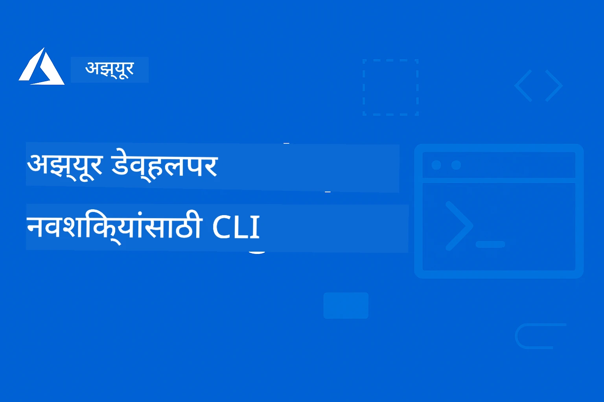

# AZD नवशिक्यांसाठी: एक रचनात्मक शिक्षण प्रवास

 

[](https://GitHub.com/microsoft/azd-for-beginners/watchers/)
[](https://GitHub.com/microsoft/azd-for-beginners/network/)
[](https://GitHub.com/microsoft/azd-for-beginners/stargazers/)

[](https://discord.gg/microsoft-azure)
[](https://discord.gg/nTYy5BXMWG)

---

### स्वयंचलित भाषांतर (सदैव अद्ययावत)

<!-- CO-OP TRANSLATOR LANGUAGES TABLE START -->
[Arabic](../ar/README.md) | [Bengali](../bn/README.md) | [Bulgarian](../bg/README.md) | [Burmese (Myanmar)](../my/README.md) | [Chinese (Simplified)](../zh-CN/README.md) | [Chinese (Traditional, Hong Kong)](../zh-HK/README.md) | [Chinese (Traditional, Macau)](../zh-MO/README.md) | [Chinese (Traditional, Taiwan)](../zh-TW/README.md) | [Croatian](../hr/README.md) | [Czech](../cs/README.md) | [Danish](../da/README.md) | [Dutch](../nl/README.md) | [Estonian](../et/README.md) | [Finnish](../fi/README.md) | [French](../fr/README.md) | [German](../de/README.md) | [Greek](../el/README.md) | [Hebrew](../he/README.md) | [Hindi](../hi/README.md) | [Hungarian](../hu/README.md) | [Indonesian](../id/README.md) | [Italian](../it/README.md) | [Japanese](../ja/README.md) | [Kannada](../kn/README.md) | [Korean](../ko/README.md) | [Lithuanian](../lt/README.md) | [Malay](../ms/README.md) | [Malayalam](../ml/README.md) | [Marathi](./README.md) | [Nepali](../ne/README.md) | [Nigerian Pidgin](../pcm/README.md) | [Norwegian](../no/README.md) | [Persian (Farsi)](../fa/README.md) | [Polish](../pl/README.md) | [Portuguese (Brazil)](../pt-BR/README.md) | [Portuguese (Portugal)](../pt-PT/README.md) | [Punjabi (Gurmukhi)](../pa/README.md) | [Romanian](../ro/README.md) | [Russian](../ru/README.md) | [Serbian (Cyrillic)](../sr/README.md) | [Slovak](../sk/README.md) | [Slovenian](../sl/README.md) | [Spanish](../es/README.md) | [Swahili](../sw/README.md) | [Swedish](../sv/README.md) | [Tagalog (Filipino)](../tl/README.md) | [Tamil](../ta/README.md) | [Telugu](../te/README.md) | [Thai](../th/README.md) | [Turkish](../tr/README.md) | [Ukrainian](../uk/README.md) | [Urdu](../ur/README.md) | [Vietnamese](../vi/README.md)

> **स्थानिक पातळीवर क्लोन करायला प्राधान्य द्यायचं का?**
>
> या रिपॉजिटरीमध्ये ५०+ भाषांतरं आहेत त्यामुळे डाउनलोडचे आकार मोठे असतो. भाषांतरांशिवाय क्लोन करायचे असल्यास स्फुरणक्ष (sparse) चेकआउट वापरा:
>
> **Bash / macOS / Linux:**  
> ```bash
> git clone --filter=blob:none --sparse https://github.com/microsoft/AZD-for-beginners.git
> cd AZD-for-beginners
> git sparse-checkout set --no-cone '/*' '!translations' '!translated_images'
> ```
>
> **CMD (Windows):**  
> ```cmd
> git clone --filter=blob:none --sparse https://github.com/microsoft/AZD-for-beginners.git
> cd AZD-for-beginners
> git sparse-checkout set --no-cone "/*" "!translations" "!translated_images"
> ```
>
> यामुळे कोर्स पूर्ण करण्यासाठी आवश्यक असलेले सगळे मिळेल आणि डाउनलोड जलद होईल.
<!-- CO-OP TRANSLATOR LANGUAGES TABLE END -->

## 🚀 Azure Developer CLI (azd) म्हणजे काय?

**Azure Developer CLI (azd)** हा वापरकर्त्यास सुलभ असलेला कमांड-लाइन टूल आहे जो Azure वर अनुप्रयोग (applications) तैनात करणे सोपे करते. हजारों Azure संसाधने (resources) हाताने तयार करून जोडण्याऐवजी, तुम्ही एका कमांडने संपूर्ण अनुप्रयोग तैनात करू शकता.

### azd up ची जादू

```bash
# हा एकच आदेश सर्व काही करतो:
# ✅ सर्व Azure संसाधने तयार करतो
# ✅ नेटवर्किंग आणि सुरक्षा कॉन्फिगर करतो
# ✅ आपल्या अनुप्रयोगाचा कोड तयार करतो
# ✅ Azure वर तैनात करतो
# ✅ आपल्याला एक कार्यरत URL देतो
azd up
```
  
**इतकंच!** Azure Portal मधे क्लिक करण्याची गरज नाही, ARM टेम्पलेट्सची क्लिष्टता शिकायची नाही, मॅन्युअल कॉन्फिगरेशन नाही — केवळ Azure वर काम करणारे अनुप्रयोग.

---

## ❓ Azure Developer CLI आणि Azure CLI मध्ये काय फरक?

हा नवशिक्यांकडून सर्वात सामान्य विचारलेला प्रश्न आहे. सोपा उत्तर:

| वैशिष्ट्य | **Azure CLI (`az`)** | **Azure Developer CLI (`azd`)** |
|---------|---------------------|--------------------------------|
| **उद्दिष्ट** | स्वतंत्र Azure संसाधने व्यवस्थापित करा | संपूर्ण अनुप्रयोग तैनाती करा |
| **दृष्टीकोन** | इन्फ्रास्ट्रक्चर-केंद्रित | अनुप्रयोग-केंद्रित |
| **उदाहरण** | `az webapp create --name myapp...` | `azd up` |
| **शिकण्याची गरज** | Azure सेवा माहित असणे आवश्यक | तुमचा अनुप्रयोग माहित असणे पुरेसे |
| **सर्वोत्तम वापर** | DevOps, इन्फ्रास्ट्रक्चर | विकासक, प्रोटोटायपिंग |

### सोपा समजावणी

- **Azure CLI** म्हणजे घर बांधण्यासाठी सर्व साधने - हातोडे, आरा, कील्स - आहेत. तुम्ही काहीही बांधू शकता, पण बांधकाम कसे करायचे हे माहित असले पाहिजे.
- **Azure Developer CLI** म्हणजे एक कंत्राटदार भाड्याने घेणे — तुम्ही काय हवे आहे ते सांगा, आणि ते बांधणी सांभाळतील.

### कोणता वापरायचा कधी?

| परिस्थिती | वापरा हे |
|----------|----------|
| "माझा वेब ऍप पटकन तैनात करायचा आहे" | `azd up` |
| "मला फक्त एक संग्रह खातं तयार करायचंय" | `az storage account create` |
| "मी संपूर्ण AI अनुप्रयोग तयार करतोय" | `azd init --template azure-search-openai-demo` |
| "मला एखाद्या विशिष्ट Azure संसाधनाचा डिबग करायचा आहे" | `az resource show` |
| "मला मिनिटांत उत्पादन-तयार तैनात हवंय" | `azd up --environment production` |

### ते एकत्रही वापरू शकता!

AZD मधल्या आत Azure CLI वापरले जाते. तुम्ही दोन्ही वापरू शकता:  
```bash
# AZD वापरून आपले अॅप तैनात करा
azd up

# मग Azure CLI वापरून विशिष्ट संसाधने सूक्ष्मरीत्या समायोजित करा
az webapp config set --name myapp --always-on true
```
  
---

## 🌟 Awesome AZD मध्ये टेम्प्लेट शोधा

शून्यातून सुरुवात करू नका! **Awesome AZD** ही समुदायाने तयार केलेली तयार-तैनाती टेम्प्लेटसची संकलन आहे:

| संसाधन | वर्णन |
|----------|-------------|
| 🔗 [**Awesome AZD Gallery**](https://azure.github.io/awesome-azd/) | २००+ टेम्प्लेट्स एक क्लिकमध्ये तैनात करा |
| 🔗 [**Submit a Template**](https://github.com/Azure/awesome-azd/issues) | तुमचा स्वतःचा टेम्प्लेट समुदायास द्या |
| 🔗 [**GitHub Repository**](https://github.com/Azure/awesome-azd) | स्टार करा आणि स्रोत पाहा |

### Awesome AZD मधील लोकप्रिय AI टेम्प्लेट्स

```bash
# RAG चॅट Azure OpenAI + एआय शोध सह
azd init --template azure-search-openai-demo

# जलद एआय चॅट अनुप्रयोग
azd init --template openai-chat-app-quickstart

# Foundry Agents सह एआय एजंट्स
azd init --template get-started-with-ai-agents
```
  
---

## 🎯 ३ टप्प्यांमध्ये सुरुवात करा

### टप्पा १: AZD इंस्टॉल करा (२ मिनिटे)

**Windows:**  
```powershell
winget install microsoft.azd
```
  
**macOS:**  
```bash
brew tap azure/azd && brew install azd
```
  
**Linux:**  
```bash
curl -fsSL https://aka.ms/install-azd.sh | bash
```
  
### टप्पा २: Azure मध्ये लॉगिन करा

```bash
azd auth login
```
  
### टप्पा ३: आपला पहिला ऍप तैनात करा

```bash
# टेम्पलेटमधून प्रारंभ करा
azd init --template todo-nodejs-mongo

# Azure वर तैनात करा (सर्व काही तयार करते!)
azd up
```
  
**🎉 इतकंच!** तुमचा अप आता Azure वर लाइव्ह आहे.

### साफसफाई (चुकवू नका!)

```bash
# Remove all resources when done experimenting
azd down --force --purge
```
  
---

## 📚 हा कोर्स कसा वापरायचा

हा कोर्स **प्रगतीशील शिक्षणासाठी** डिझाइन केलेला आहे - जिथून सहज वाटेल तिथून सुरुवात करा आणि पुढे जा:

| तुमचा अनुभव | इथून सुरुवात करा |
|-----------------|------------|
| **Azure मध्ये अगदी नवीन** | [अध्याय १: पाया](../..) |
| **Azure माहित आहे, AZD नव्हते** | [अध्याय १: पाया](../..) |
| **AI अनुप्रयोग तैनात करायचे आहेत** | [अध्याय २: AI-प्रथम विकास](../..) |
| **प्रॅक्टिकल अनुभव हवे आहे** | [🎓 इंटरेक्टिव वर्कशॉप](workshop/README.md) - ३-४ तासांचे मार्गदर्शित प्रयोगशाळा |
| **उत्पादनासाठी नमुने हवे आहेत** | [अध्याय ८: उत्पादन आणि एंटरप्राइझ](../..) |

### जलद सेटअप

1. **ही रिपॉजिटरी फोर्क करा**: [](https://GitHub.com/microsoft/azd-for-beginners/fork)  
2. **क्लोन करा**: `git clone https://github.com/YOUR-USERNAME/azd-for-beginners.git`  
3. **मदत घ्या**: [Azure Discord Community](https://discord.com/invite/ByRwuEEgH4)  

> **स्थानिक पातळीवर क्लोन करायला प्राधान्य द्यायचं का?**

> या रिपॉजिटरीमध्ये ५०+ भाषांतरं आहेत त्यामुळे डाउनलोडचे आकार मोठे असतो. भाषांतरांशिवाय क्लोन करायचे असल्यास स्फुरणक्ष (sparse) चेकआउट वापरा:  
> ```bash
> git clone --filter=blob:none --sparse https://github.com/microsoft/AZD-for-beginners.git
> cd AZD-for-beginners
> git sparse-checkout set --no-cone '/*' '!translations' '!translated_images'
> ```
> यामुळे कोर्स पूर्ण करण्यासाठी आवश्यक असलेले सगळे मिळेल आणि डाउनलोड जलद होईल.


## कोर्सचा आढावा

Azure Developer CLI (azd) चे मास्टर होण्याचा मार्ग, प्रगतीशील अध्यायांसह ज्यात AI अनुप्रयोग तैनात करण्यावर विशेष लक्ष आहे Microsoft Foundry इंटीग्रेशनसह.

### आधुनिक विकासकांसाठी हा कोर्स का आवश्यक आहे

Microsoft Foundry Discord समुदायाच्या माहितीवर आधारित, **४५% विकासक AZD वापरून AI वर्कलोडसाठी काम करू इच्छितात** पण खालील आव्हानांना सामोरे जात आहेत:  
- क्लिष्ट बहु-सर्व्हिस AI आर्किटेक्चर  
- उत्पादन AI तैनातीसाठी सर्वोत्तम पद्धती  
- Azure AI सेवा समाकलन व कॉन्फिगरेशन  
- AI वर्कलोडसाठी खर्च ऑप्टिमायझेशन  
- AI-विशिष्ट तैनाती समस्या ओळखणे आणि सोडवणे  

### शिकण्याचे उद्दिष्ट

या रचनात्मक कोर्सला पूर्ण करून, तुम्ही:  
- **AZD मूलतत्त्वे आत्मसात करा**: कोर संकल्पना, इंस्टॉलेशन व कॉन्फिगरेशन  
- **AI अनुप्रयोग तैनात करा**: AZD आणि Microsoft Foundry सेवा वापरून  
- **कोड म्हणून इन्फ्रास्ट्रक्चर लागू करा**: Bicep टेम्प्लेट्सने Azure संसाधने व्यवस्थापित करा  
- **तैनातीतील समस्या निराकरण करा**: सामान्य समस्या शोधा आणि डिबग करा  
- **उत्पादनासाठी ऑप्टिमायझेशन करा**: सुरक्षा, स्केलिंग, मॉनिटरिंग आणि खर्च व्यवस्थापन  
- **बहु-एजंट सोल्यूशन्स बांधा**: क्लिष्ट AI आर्किटेक्चर तैनात करा  

## 🗺️ कोर्स नकाशा: अध्यायांनिहाय जलद नेव्हिगेशन

प्रत्येक अध्यायासाठी समर्पित README आहे ज्यात शिकण्याची उद्दिष्टे, जलद प्रारंभ आणि सराव आहेत:

| अध्याय | विषय | धडे | कालावधी | गुंतागुंत |
|---------|-------|---------|----------|------------|
| **[अध्याय १: पाया](docs/chapter-01-foundation/README.md)** | सुरुवात करा | [AZD बेसिक्स](docs/chapter-01-foundation/azd-basics.md) &#124; [इंस्टॉलेशन](docs/chapter-01-foundation/installation.md) &#124; [पहिला प्रोजेक्ट](docs/chapter-01-foundation/first-project.md) | ३०-४५ मिनिटे | ⭐ |
| **[अध्याय २: AI विकास](docs/chapter-02-ai-development/README.md)** | AI-प्रथम ऍप्स | [Foundry समाकलन](docs/chapter-02-ai-development/microsoft-foundry-integration.md) &#124; [AI एजंट्स](docs/chapter-02-ai-development/agents.md) &#124; [मॉडेल तैनाती](docs/chapter-02-ai-development/ai-model-deployment.md) &#124; [वर्कशॉप](docs/chapter-02-ai-development/ai-workshop-lab.md) | १-२ तास | ⭐⭐ |
| **[अध्याय ३: कॉन्फिगरेशन](docs/chapter-03-configuration/README.md)** | प्रमाणीकरण आणि सुरक्षा | [कॉन्फिगरेशन](docs/chapter-03-configuration/configuration.md) &#124; [प्रमाणीकरण आणि सुरक्षा](docs/chapter-03-configuration/authsecurity.md) | ४५-६० मिनिटे | ⭐⭐ |
| **[अध्याय ४: पायाभूत सुविधा](docs/chapter-04-infrastructure/README.md)** | IaC & वितरण | [वितरण मार्गदर्शक](docs/chapter-04-infrastructure/deployment-guide.md) &#124; [प्राव्हिजनिंग](docs/chapter-04-infrastructure/provisioning.md) | 1-1.5 तास | ⭐⭐⭐ |
| **[अध्याय ५: मल्टी-एजंट](docs/chapter-05-multi-agent/README.md)** | AI एजंट सोल्यूशन्स | [रिटेल सीनारिओ](examples/retail-scenario.md) &#124; [सहकार्य नमुने](docs/chapter-06-pre-deployment/coordination-patterns.md) | 2-3 तास | ⭐⭐⭐⭐ |
| **[अध्याय ६: पूर्व-वितरण](docs/chapter-06-pre-deployment/README.md)** | नियोजन & पुष्टीकरण | [पूर्व-चाचण्या](docs/chapter-06-pre-deployment/preflight-checks.md) &#124; [क्षमता नियोजन](docs/chapter-06-pre-deployment/capacity-planning.md) &#124; [SKU निवड](docs/chapter-06-pre-deployment/sku-selection.md) &#124; [ऍप इन्साइट्स](docs/chapter-06-pre-deployment/application-insights.md) | 1 तास | ⭐⭐ |
| **[अध्याय ७: समस्या निवारण](docs/chapter-07-troubleshooting/README.md)** | डीबग & दुरुस्ती | [सामान्य समस्या](docs/chapter-07-troubleshooting/common-issues.md) &#124; [डीबगिंग](docs/chapter-07-troubleshooting/debugging.md) &#124; [AI समस्या](docs/chapter-07-troubleshooting/ai-troubleshooting.md) | 1-1.5 तास | ⭐⭐ |
| **[अध्याय ८: उत्पादन](docs/chapter-08-production/README.md)** | एंटरप्राइझ नमुने | [उत्पादन सराव](docs/chapter-08-production/production-ai-practices.md) | 2-3 तास | ⭐⭐⭐⭐ |
| **[🎓 कार्यशाळा](workshop/README.md)** | प्रत्यक्ष प्रयोगशाळा | [परिचय](workshop/docs/instructions/0-Introduction.md) &#124; [निवड](workshop/docs/instructions/1-Select-AI-Template.md) &#124; [पुष्टीकरण](workshop/docs/instructions/2-Validate-AI-Template.md) &#124; [विघटन](workshop/docs/instructions/3-Deconstruct-AI-Template.md) &#124; [संपर्कीकरण](workshop/docs/instructions/4-Configure-AI-Template.md) &#124; [सानुकूलन](workshop/docs/instructions/5-Customize-AI-Template.md) &#124; [टिअरडाऊन](workshop/docs/instructions/6-Teardown-Infrastructure.md) &#124; [संक्षेप](workshop/docs/instructions/7-Wrap-up.md) | 3-4 तास | ⭐⭐ |

**एकूण अभ्यासकालावधी:** ~10-14 तास | **कौशल्य प्रगती:** प्रारंभीपासून → उत्पादन-सज्ज

---

## 📚 अध्ययन प्रकरणे

*अनुभव स्तर आणि उद्दिष्टांनुसार आपला अभ्यास मार्ग निवडा*

### 🚀 अध्याय १: पाया आणि जलद प्रारंभ  
**पूर्वअट:** Azure सदस्यता, मूलभूत कमांड लाइन ज्ञान  
**कालावधी:** 30-45 मिनिटे  
**कठीणाई:** ⭐

#### आपण काय शिकणार आहात  
- Azure Developer CLI ची मूलभूत समज  
- आपल्या प्लॅटफॉर्मवर AZD स्थापित करणे  
- आपले पहिले यशस्वी वितरण

#### अभ्यास साधने  
- **🎯 येथे प्रारंभ करा:** [Azure Developer CLI म्हणजे काय?](../..)  
- **📖 सिद्धांत:** [AZD मूलभूत तत्त्वे](docs/chapter-01-foundation/azd-basics.md) - मुख्य संकल्पना आणि शब्दावली  
- **⚙️ सेटअप:** [इंस्टॉलेशन आणि सेटअप](docs/chapter-01-foundation/installation.md) - प्लॅटफॉर्म-विशिष्ट मार्गदर्शिके  
- **🛠️ प्रत्यक्ष:** [आपला पहिला प्रकल्प](docs/chapter-01-foundation/first-project.md) - टप्प्याटप्प्याने मार्गदर्शक  
- **📋 जलद संदर्भ:** [कमांड चीट शीट](resources/cheat-sheet.md)

#### व्यावहारिक सराव  
```bash
# जलद स्थापना तपासणी
azd version

# आपले पहिले अनुप्रयोग तैनात करा
azd init --template todo-nodejs-mongo
azd up
```
  
**💡 अध्यायाचा परिणाम:** AZD वापरून Azure वर साधा वेब ऍप्लिकेशन यशस्वीपणे वितरण करणे

**✅ यशाची पुष्टी:**  
```bash
# प्रकरण १ पूर्ण केल्यानंतर, तुम्ही सक्षम असले पाहिजे:
azd version              # स्थापित आवृत्ती दाखविते
azd init --template todo-nodejs-mongo  # प्रकल्प प्रारंभ करते
azd up                  # Azure वर परिनियोजित करते
azd show                # चालू ॲप URL दर्शविते
# अनुप्रयोग ब्राउझरमध्ये उघडतो आणि कार्य करतो
azd down --force --purge  # संसाधने साफ करते
```
  
**📊 वेळ खर्च:** 30-45 मिनिटे  
**📈 झालेल्या कौशल्याचा स्तर:** मूलभूत ऍप स्वत:हून वितरण करू शकतो

**✅ यशाची पुष्टी:**  
```bash
# प्रकरण 1 पूर्ण केल्यानंतर, तुम्ही सक्षम असायला हवे:
azd version              # स्थापित केलेली आवृत्ती दाखवते
azd init --template todo-nodejs-mongo  # प्रकल्प प्रारंभित करतो
azd up                  # Azure वर तैनात करतो
azd show                # चालू असलेल्या अनुप्रयोगाचा URL दर्शवितो
# अनुप्रयोग ब्राउझरमध्ये उघडतो आणि कार्य करतो
azd down --force --purge  # संसाधने साफ करतो
```
  
**📊 वेळ खर्च:** 30-45 मिनिटे  
**📈 झालेल्या कौशल्याचा स्तर:** मूलभूत ऍप स्वत:हून वितरण करू शकतो

---

### 🤖 अध्याय २: AI-प्रथम विकास (AI विकसकांसाठी शिफारस)  
**पूर्वअट:** अध्याय १ पूर्ण  
**कालावधी:** 1-2 तास  
**कठीणाई:** ⭐⭐

#### आपण काय शिकणार आहात  
- AZD सह Microsoft Foundry चे एकत्रीकरण  
- AI-सक्षम ऍप्लिकेशनचे वितरण  
- AI सेवा कॉन्फिगरेशनची समज

#### अभ्यास साधने  
- **🎯 येथे प्रारंभ करा:** [Microsoft Foundry एकत्रीकरण](docs/chapter-02-ai-development/microsoft-foundry-integration.md)  
- **🤖 AI एजंट्स:** [AI एजंट्स मार्गदर्शक](docs/chapter-02-ai-development/agents.md) - AZD सह बुद्धिमान एजंट वितरित करा  
- **📖 नमुने:** [AI मॉडेल वितरण](docs/chapter-02-ai-development/ai-model-deployment.md) - AI मॉडेलचे व्यवस्थापन आणि वितरण  
- **🛠️ कार्यशाळा:** [AI कार्यशाळा लॅब](docs/chapter-02-ai-development/ai-workshop-lab.md) - आपल्या AI सोल्यूशन्सना AZD-सज्ज करा  
- **🎥 परस्पर मार्गदर्शक:** [कार्यशाळा साहित्य](workshop/README.md) - MkDocs * DevContainer वातावरणासह ब्राउझर-आधारित शिक्षण  
- **📋 टेम्पलेट्स:** [Microsoft Foundry टेम्पलेट्स](../..)  
- **📝 उदाहरणे:** [AZD वितरण उदाहरणे](examples/README.md)

#### व्यावहारिक सराव  
```bash
# तुमचे पहिले AI अनुप्रयोग लागू करा
azd init --template azure-search-openai-demo
azd up

# अतिरिक्त AI साचे वापरून पहा
azd init --template openai-chat-app-quickstart
azd init --template agent-openai-python-prompty
```
  
**💡 अध्यायाचा परिणाम:** RAG क्षमता असलेले AI-सक्षम चॅट ऍप्लिकेशन वितरित आणि कॉन्फिगर करा

**✅ यशाची पुष्टी:**  
```bash
# अध्याय २ नंतर, तुम्हाला हे करता यावे:
azd init --template azure-search-openai-demo
azd up
# AI चॅट इंटरफेसची चाचणी करा
# प्रश्न विचारा आणि स्रोतांसह AI-आधारित प्रतिसाद मिळवा
# सर्च इंटिग्रेशन कार्यरत असल्याची पुष्टी करा
azd monitor  # अॅप्लिकेशन इनसाइट्समध्ये टेलिमेट्री दिसते आहे का ते तपासा
azd down --force --purge
```
  
**📊 वेळ खर्च:** 1-2 तास  
**📈 झालेल्या कौशल्याचा स्तर:** उत्पादन-सज्ज AI ऍप्लिकेशन वितरण आणि कॉन्फिगर करू शकतो  
**💰 खर्चाची जाणीव:** $80-150/महिना विकास खर्च, $300-3500/महिना उत्पादन खर्च समजून घ्या

#### 💰 AI वितरणांसाठी खर्चाचा विचार

**विकास वातावरण (अंदाजे $80-150/महिना):**  
- Azure OpenAI (भुगतानानुसार): $0-50/महिना (टोकन वापरावर आधारित)  
- AI शोध (मूलभूत स्तर): $75/महिना  
- कंटेनर ऍप्स (इस्तेमालावर आधारित): $0-20/महिना  
- संग्रहण (स्टँडर्ड): $1-5/महिना

**उत्पादन वातावरण (अंदाजे $300-3,500+/महिना):**  
- Azure OpenAI (सुसंगत कामगिरीसाठी PTU): $3,000+/महिना किंवा उच्च प्रमाणावर भुगतानानुसार  
- AI शोध (स्टँडर्ड स्तर): $250/महिना  
- कंटेनर ऍप्स (समर्पित): $50-100/महिना  
- ऍप्लिकेशन इन्साइट्स: $5-50/महिना  
- संग्रहण (प्रीमियम): $10-50/महिना

**💡 खर्च ऑप्टिमायझेशन टीपा:**  
- शिकण्यासाठी **मुक्त स्तर** Azure OpenAI वापरा (50,000 टोकन्स/महिना समाविष्ट)  
- सक्रिय विकास न करताना `azd down` वर संसाधने मुक्त करा  
- वापरावर आधारित बिलिंगपासून प्रारंभ करा, उत्पादनासाठी PTU वर अपग्रेड करा  
- वितरणाअगोदर खर्चाचा अंदाज घेण्यासाठी `azd provision --preview` वापरा  
- ऑटो-स्केलिंग सक्षम करा: फक्त प्रत्यक्ष वापरासाठी पैसे द्या

**खर्च निरीक्षण:**  
```bash
# अंदाजित मासिक खर्च तपासा
azd provision --preview

# Azure पोर्टलमध्ये प्रत्यक्ष खर्चांचे निरीक्षण करा
az consumption budget list --resource-group <your-rg>
```
  
---

### ⚙️ अध्याय ३: कॉन्फिगरेशन आणि प्रमाणीकरण  
**पूर्वअट:** अध्याय १ पूर्ण  
**कालावधी:** 45-60 मिनिटे  
**कठीणाई:** ⭐⭐

#### आपण काय शिकणार आहात  
- वातावरण कॉन्फिगरेशन आणि व्यवस्थापन  
- प्रमाणीकरण आणि सुरक्षा सर्वोत्तम प्रथा  
- संसाधनांची नावे आणि संघटन

#### अभ्यास साधने  
- **📖 कॉन्फिगरेशन:** [कॉन्फिगरेशन मार्गदर्शक](docs/chapter-03-configuration/configuration.md) - वातावरण सेटअप  
- **🔐 सुरक्षा:** [प्रमाणीकरण नमुने आणि व्यवस्थापित ओळख](docs/chapter-03-configuration/authsecurity.md) - प्रमाणीकरण नमुने  
- **📝 उदाहरणे:** [डेटाबेस ऍप उदाहरण](examples/database-app/README.md) - AZD डेटाबेस उदाहरणे

#### व्यावहारिक सराव  
- अनेक वातावरण कॉन्फिगर करा (डेव्ह, स्टेजिंग, प्रॉड)  
- व्यवस्थापित ओळख प्रमाणीकरण सेट करा  
- वातावरण-विशिष्ट कॉन्फिगरेशन अंमलात आणा

**💡 अध्यायाचा परिणाम:** योग्य प्रमाणीकरण आणि सुरक्षा सह अनेक वातावरणे व्यवस्थापित करा

---

### 🏗️ अध्याय ४: इन्फ्रास्ट्रक्चर अ‍ॅस कोड आणि वितरण  
**पूर्वअट:** अध्याय १-३ पूर्ण  
**कालावधी:** 1-1.5 तास  
**कठीणाई:** ⭐⭐⭐

#### आपण काय शिकणार आहात  
- प्रगत वितरण नमुने  
- Bicep सह इन्फ्रास्ट्रक्चर अ‍ॅस कोड  
- संसाधन प्राव्हिजनिंग धोरणे

#### अभ्यास साधने  
- **📖 वितरण:** [वितरण मार्गदर्शक](docs/chapter-04-infrastructure/deployment-guide.md) - संपूर्ण वर्कफ्लो  
- **🏗️ प्राव्हिजनिंग:** [संसाधन प्राव्हिजनिंग](docs/chapter-04-infrastructure/provisioning.md) - Azure संसाधन व्यवस्थापन  
- **📝 उदाहरणे:** [कंटेनर ऍप उदाहरण](../../examples/container-app) - कंटेनरयुक्त वितरण

#### व्यावहारिक सराव  
- सानुकूल Bicep टेम्पलेट तयार करा  
- मल्टी-सर्व्हिस ऍप्लिकेशन वितरित करा  
- निळा-हिरवा वितरण धोरणे अंमलात आणा

**💡 अध्यायाचा परिणाम:** सानुकूल इन्फ्रास्ट्रक्चर टेम्पलेट्स वापरून जटिल मल्टी-सर्व्हिस ऍप्लिकेशन वितरित करा

---

### 🎯 अध्याय ५: मल्टी-एजंट AI सोल्यूशन्स (प्रगत)  
**पूर्वअट:** अध्याय १-२ पूर्ण  
**कालावधी:** 2-3 तास  
**कठीणाई:** ⭐⭐⭐⭐

#### आपण काय शिकणार आहात  
- मल्टी-एजंट आर्किटेक्चर नमुने  
- एजंट समन्वय आणि सहकार्य  
- उत्पादन-सज्ज AI वितरण

#### अभ्यास साधने  
- **🤖 वैशिष्ट्यीकृत प्रकल्प:** [रिटेल मल्टी-एजंट सोल्यूशन](examples/retail-scenario.md) - संपूर्ण अंमलबजावणी  
- **🛠️ ARM टेम्पलेट्स:** [ARM टेम्पलेट पॅकेज](../../examples/retail-multiagent-arm-template) - एक-क्लिक वितरण  
- **📖 आर्किटेक्चर:** [मल्टी-एजंट समन्वय नमुने](docs/chapter-06-pre-deployment/coordination-patterns.md) - नमुने

#### व्यावहारिक सराव  
```bash
# संपूर्ण रिटेल मल्टी-एजंट सोल्यूशन तैनात करा
cd examples/retail-multiagent-arm-template
./deploy.sh

# एजंट संरचना अन्वेषण करा
az deployment group show --resource-group <rg-name> --name <deployment-name>
```
  
**💡 अध्यायाचा परिणाम:** ग्राहक आणि साठा एजंटसह उत्पादन-सज्ज मल्टी-एजंट AI सोल्यूशन वितरित आणि व्यवस्थापित करा

---

### 🔍 अध्याय ६: पूर्व-वितरण पुष्टीकरण आणि नियोजन  
**पूर्वअट:** अध्याय ४ पूर्ण  
**कालावधी:** 1 तास  
**कठीणाई:** ⭐⭐

#### आपण काय शिकणार आहात  
- क्षमता नियोजन आणि संसाधन पुष्टीकरण  
- SKU निवड धोरणे  
- पूर्व-चाचणी आणि ऑटोमेशन

#### अभ्यास साधने  
- **📊 नियोजन:** [क्षमता नियोजन](docs/chapter-06-pre-deployment/capacity-planning.md) - संसाधन पुष्टीकरण  
- **💰 निवड:** [SKU निवड](docs/chapter-06-pre-deployment/sku-selection.md) - खर्च-प्रभावी पर्याय  
- **✅ पुष्टीकरण:** [पूर्व-चाचण्या](docs/chapter-06-pre-deployment/preflight-checks.md) - स्वयंचलित स्क्रिप्टस

#### व्यावहारिक सराव  
- क्षमता पुष्टीकरणासाठी स्क्रिप्ट चालवा  
- खर्चासाठी SKU निवड अनुकूल करा  
- वितरणापूर्वी स्वयंचलित पूर्व-चाचण्या अंमलात आणा

**💡 अध्यायाचा परिणाम:** वितरणापूर्वी पुष्टीकरण आणि अनुकूलन करा

---

### 🚨 अध्याय ७: समस्या निवारण आणि डीबगिंग  
**पूर्वअट:** कोणताही वितरण अध्याय पूर्ण  
**कालावधी:** 1-1.5 तास  
**कठीणाई:** ⭐⭐

#### आपण काय शिकणार आहात  
- प्रणालीबद्ध डीबगिंग पद्धती  
- सामान्य समस्या आणि निकाल  
- AI-विशिष्ट समस्या निवारण

#### अभ्यास साधने  
- **🔧 सामान्य समस्या:** [सामान्य समस्या](docs/chapter-07-troubleshooting/common-issues.md) - वारंवार विचारलेल्या प्रश्नांची उत्तरे आणि उपाय  
- **🕵️ डीबगिंग:** [डीबगिंग मार्गदर्शक](docs/chapter-07-troubleshooting/debugging.md) - टप्प्याटप्प्याने रणनीती  
- **🤖 AI समस्या:** [AI-विशिष्ट समस्या निवारण](docs/chapter-07-troubleshooting/ai-troubleshooting.md) - AI सेवा समस्यांचे निराकरण

#### व्यावहारिक सराव  
- वितरण अयशस्वी झालेल्या कारणांचे निदान करा  
- प्रमाणीकरण समस्या सोडवा  
- AI सेवा कनेक्टिव्हिटी डीबग करा

**💡 अध्यायाचा परिणाम:** सामान्य वितरण समस्या स्वतंत्रपणे निदान आणि निराकरण करा

---

### 🏢 अध्याय ८: उत्पादन आणि एंटरप्राइझ नमुने  
**पूर्वअट:** अध्याय १-४ पूर्ण  
**कालावधी:** 2-3 तास  
**कठीणाई:** ⭐⭐⭐⭐

#### आपण काय शिकणार आहात  
- उत्पादन वितरण धोरणे  
- एंटरप्राइझ सुरक्षा नमुने  
- निरीक्षण आणि खर्च अनुकूलन

#### अभ्यास साधने  
- **🏭 उत्पादन:** [उत्पादन AI सर्वोत्तम सराव](docs/chapter-08-production/production-ai-practices.md) - एंटरप्राइझ नमुने  
- **📝 उदाहरणे:** [मायक्रोसर्व्हिसेस उदाहरण](../../examples/microservices) - जटिल वास्तुकला  
- **📊 निरीक्षण:** [ऍप्लिकेशन इन्साइट्स एकत्रीकरण](docs/chapter-06-pre-deployment/application-insights.md) - निरीक्षण

#### व्यावहारिक सराव  
- एंटरप्राइझ सुरक्षा नमुने अंमलात आणा  
- व्यापक निरीक्षण सेट करा  
- योग्य शासकीय नियंत्रणासह उत्पादनासाठी वितरण करा

**💡 अध्यायाचा परिणाम:** पूर्ण उत्पादन क्षमता असलेले एंटरप्राइझ-सज्ज ऍप वितरित करा

---

## 🎓 कार्यशाळा आढावा: प्रत्यक्ष शिक्षणाचा अनुभव

> **⚠️ कार्यशाळा स्थिती: सक्रिय विकास**  

> कार्यशाळा साहित्य सध्या विकसित आणि सुधारित केले जात आहे. मुख्य मॉड्यूल कार्यशील आहेत, परंतु काही प्रगत विभाग अपूर्ण आहेत. आम्ही सर्व सामग्री पूर्ण करण्यासाठी सक्रियपणे काम करत आहोत. [प्रगती ट्रॅक करा →](workshop/README.md)

### संवादात्मक कार्यशाळा साहित्य
**ब्राउझर-आधारित साधने आणि मार्गदर्शित सरावांसह व्यापक हाताळण्याचे शिक्षण**

आमची कार्यशाळा साहित्य Chapter-आधारित अभ्यासक्रमाला पूरक असलेले एक रचनेत, संवादात्मक शिक्षण अनुभव प्रदान करतात. कार्यशाळा स्व-गतीने शिकण्यासाठी तसेच प्रशिक्षक-नेतृत्वातील सत्रांसाठी तयार केलेली आहे.

#### 🛠️ कार्यशाळा वैशिष्ट्ये
- **ब्राउझर-आधारित इंटरफेस**: शोध, कॉपी आणि थीम वैशिष्ट्यांसह पूर्ण MkDocs-संचालित कार्यशाळा
- **GitHub Codespaces समाकलन**: एका क्लिकमध्ये विकास वातावरण सेटअप
- **रचनेत शिक्षण मार्ग**: ८-मॉड्यूल मार्गदर्शित सराव (एकूण ३-४ तास)
- **प्रगत पद्धतशास्त्र**: परिचय → निवड → प्रमाणीकरण → विघटन → संरचना → सानुकूलन → समाप्ती → समारोप
- **संवादात्मक DevContainer वातावरण**: पूर्व-संरचीत साधने आणि अवलंबन

#### 📚 कार्यशाळा मॉड्यूल संरचना
कार्यशाळा एक **८-मॉड्युल प्रगत पद्धतशास्त्र** अनुसरते जी तुम्हाला शोधापासून तैनात कौशल्यांपर्यंत घेऊन जाते:

| मॉड्यूल | विषय | तुम्ही काय कराल | कालावधी |
|--------|-------|----------------|----------|
| **0. परिचय** | कार्यशाळा विहंगावलोकन | अभ्यासाच्या उद्दिष्टे, पूर्वशर्ती, आणि कार्यशाळा रचना समजून घ्या | १५ मिनिटे |
| **1. निवड** | टेम्पलेट शोध | AZD टेम्पलेट्स एक्सप्लोर करा आणि तुमच्या परिस्थितीसाठी योग्य AI टेम्पलेट निवडा | २० मिनिटे |
| **2. प्रमाणीकरण** | तैनात करा आणि तपासा | `azd up` वापरून टेम्पलेट तैनात करा आणि इन्फ्रास्ट्रक्चर काम करत आहे का ते प्रमाणित करा | ३० मिनिटे |
| **3. विघटन** | रचना समजून घ्या | GitHub Copilot वापरून टेम्पलेट आर्किटेक्चर, Bicep फायली, आणि कोड संघटना एक्सप्लोर करा | ३० मिनिटे |
| **4. संरचना** | azure.yaml सखोल तपास | `azure.yaml` संरचना, जीवनचक्र हुक्स, आणि पर्यावरण चल समजून घ्या | ३० मिनिटे |
| **5. सानुकूलन** | तुमच्यासाठी तयार करा | AI शोध, ट्रेसिंग, मूल्यांकन सक्षम करा आणि तुमच्या परिस्थितीसाठी सानुकूल करा | ४५ मिनिटे |
| **6. समाप्ती** | साफसफाई करा | `azd down --purge` वापरून संसाधने सुरक्षितपणे डिप्राव्हिजन करा | १५ मिनिटे |
| **7. समारोप** | पुढील पावले | साधने, मुख्य संकल्पना पुनरावलोकन करा आणि तुमच्या शैक्षणिक प्रवासास पुढे चालू ठेवा | १५ मिनिटे |

**कार्यशाळा प्रवाह:**
```
Introduction → Selection → Validation → Deconstruction → Configuration → Customization → Teardown → Wrap-up
     ↓            ↓           ↓              ↓               ↓              ↓            ↓           ↓
  Overview    Find the     Deploy &      Explore        Master         Customize     Clean up    Review &
             right        verify        code &        azure.yaml      for your      resources   next steps
             template                   structure                     scenario
```

#### 🚀 कार्यशाळा सुरू करणे
```bash
# पर्याय 1: GitHub कोडस्पेसेस (शिफारस केलेले)
# रेपॉझिटरीमध्ये "Code" → "Create codespace on main" क्लिक करा

# पर्याय 2: स्थानिक विकास
git clone https://github.com/microsoft/azd-for-beginners.git
cd azd-for-beginners/workshop
# कार्यशाळेमधील/README.md मध्ये दिलेल्या सेटअप सूचनांचे पालन करा
```

#### 🎯 कार्यशाळा शिक्षण परिणाम
कार्यशाळा पूर्ण केल्याने सहभागी:
- **प्रॉडक्शन AI अनुप्रयोग तैनात करतील**: Microsoft Foundry सेवांसह AZD वापरून
- **मल्टी-एजंट आर्किटेक्चरमध्ये पारंगत होतील**: समन्वित AI एजंट सोल्यूशन्स अमलात आणतील
- **सुरक्षेच्या उत्तम पद्धती लागू करतील**: प्रमाणीकरण आणि प्रवेश नियंत्रण संरचित करतील
- **स्केलसाठी ऑप्टिमायझेशन करतील**: खर्च-असरकारक, कार्यक्षम तैनात डिझाइन करतील
- **तैनातीतील त्रुटी निराकरण करतील**: सामान्य समस्या स्वतंत्रपणे सोडवतील

#### 📖 कार्यशाळा संसाधने
- **🎥 संवादात्मक मार्गदर्शक**: [कार्यशाळा साहित्य](workshop/README.md) - ब्राउझर-आधारित शिक्षण वातावरण
- **📋 मॉड्यूल-दर-मॉड्यूल सूचना**:
  - [0. परिचय](workshop/docs/instructions/0-Introduction.md) - कार्यशाळा विहंगावलोकन आणि उद्दिष्टे
  - [1. निवड](workshop/docs/instructions/1-Select-AI-Template.md) - AI टेम्पलेट शोधा आणि निवडा
  - [2. प्रमाणीकरण](workshop/docs/instructions/2-Validate-AI-Template.md) - टेम्पलेट तैनात करा आणि प्रमाणित करा
  - [3. विघटन](workshop/docs/instructions/3-Deconstruct-AI-Template.md) - टेम्पलेट आर्किटेक्चर एक्सप्लोर करा
  - [4. संरचना](workshop/docs/instructions/4-Configure-AI-Template.md) - azure.yaml मध्ये पारंगत व्हा
  - [5. सानुकूलन](workshop/docs/instructions/5-Customize-AI-Template.md) - तुमच्या परिस्थितीसाठी सानुकूल करा
  - [6. समाप्ती](workshop/docs/instructions/6-Teardown-Infrastructure.md) - संसाधने साफ करा
  - [7. समारोप](workshop/docs/instructions/7-Wrap-up.md) - पुनरावलोकन आणि पुढील पावले
- **🛠️ AI कार्यशाळा प्रयोगशाळा**: [AI कार्यशाळा प्रयोगशाळा](docs/chapter-02-ai-development/ai-workshop-lab.md) - AI-केंद्रित सराव
- **💡 जलद प्रारंभ**: [कार्यशाळा सेटअप मार्गदर्शक](workshop/README.md#quick-start) - वातावरण संरचना

**परिपूर्ण आहे**: कॉर्पोरेट प्रशिक्षणासाठी, विद्यापीठ अभ्यासक्रमांसाठी, स्व-गतीने शिकण्याकरिता, आणि विकासक बूटकॅम्पसाठी.

---

## 📖 सखोल तपासणी: AZD क्षमता

मुलभूत गोष्टींपलीकडे, AZD उत्पादन तैनातींसाठी सामर्थ्यवान वैशिष्ट्ये प्रदान करते:

- **टेम्पलेट-आधारित तैनाती** - सामान्य अनुप्रयोग नमुन्यांसाठी पूर्व-निर्मित टेम्पलेट वापरा
- **कोड म्हणून इन्फ्रास्ट्रक्चर** - Bicep किंवा Terraform वापरून Azure संसाधने व्यवस्थापित करा  
- **संपूर्ण कार्यप्रवाह** - अनुप्रयोग सहजपणे तैनात, प्रोव्हिजन आणि देखरेख करा
- **विकसक-अनुकूल** - विकसक उत्पादकता आणि अनुभवासाठी ऑप्टिमाइज्ड

### **AZD + Microsoft Foundry: AI तैनातींसाठी परिपूर्ण**

**AI सोल्यूशन्ससाठी AZD का?** AZD AI विकासकांना येणाऱ्या मुख्य आव्हानांना उत्तर देते:

- **AI-तयार टेम्पलेट्स** - Azure OpenAI, Cognitive Services आणि ML वर्कलोडसाठी पूर्व-संरचीत टेम्पलेट्स
- **सुरक्षित AI तैनाती** - AI सेवांसाठी बिल्ट-इन सुरक्षा नमुने, API कीज, आणि मॉडेल एन्डपॉइंट्स  
- **उत्पादन AI नमुने** - स्केलेबल, खर्च-कुशल AI अनुप्रयोग तैनात करण्याच्या उत्तम पद्धती
- **एंड-टू-एंड AI कार्यप्रवाह** - मॉडेल विकासापासून प्रॉडक्शन तैनातीपर्यंत योग्य देखरेखीहून
- **खर्च ऑप्टिमायझेशन** - AI वर्कलोडसाठी स्मार्ट संसाधन वाटप आणि स्केलिंग रणनीती
- **Microsoft Foundry समाकलन** - Microsoft Foundry मॉडेल कॅटलॉग आणि एन्डपॉइंट्सशी अखंड कनेक्शन

---

## 🎯 टेम्पलेट्स आणि उदाहरणे लायब्ररी

### वैशिष्ट्यीकृत: Microsoft Foundry टेम्पलेट्स
**AI अनुप्रयोग तैनात करत असल्यास येथे प्रारंभ करा!**

> **टीप:** हे टेम्पलेट्स विविध AI नमुने दर्शवितात. काही बाह्य Azure नमुने आहेत, तर काही स्थानिक अंमलबजावणी आहेत.

| टेम्पलेट | प्रकरण | जटिलता | सेवा | प्रकार |
|----------|---------|------------|----------|------|
| [**AI चॅटसह प्रारंभ करा**](https://github.com/Azure-Samples/get-started-with-ai-chat) | प्रकरण 2 | ⭐⭐ | AzureOpenAI + Azure AI Model Inference API + Azure AI Search + Azure Container Apps + Application Insights | बाह्य |
| [**AI एजंटसह प्रारंभ करा**](https://github.com/Azure-Samples/get-started-with-ai-agents) | प्रकरण 2 | ⭐⭐ | Foundry Agents + AzureOpenAI + Azure AI Search + Azure Container Apps + Application Insights| बाह्य |
| [**Azure शोध + OpenAI डेमो**](https://github.com/Azure-Samples/azure-search-openai-demo) | प्रकरण 2 | ⭐⭐ | AzureOpenAI + Azure AI Search + App Service + Storage | बाह्य |
| [**OpenAI चॅट अ‍ॅप जलद प्रारंभ**](https://github.com/Azure-Samples/openai-chat-app-quickstart) | प्रकरण 2 | ⭐ | AzureOpenAI + Container Apps + Application Insights | बाह्य |
| [**एजंट OpenAI Python Prompty**](https://github.com/Azure-Samples/agent-openai-python-prompty) | प्रकरण 5 | ⭐⭐⭐ | AzureOpenAI + Azure Functions + Prompty | बाह्य |
| [**Contoso Chat RAG**](https://github.com/Azure-Samples/contoso-chat) | प्रकरण 8 | ⭐⭐⭐⭐ | AzureOpenAI + AI Search + Cosmos DB + Container Apps | बाह्य |
| [**Retail Multi-Agent Solution**](examples/retail-scenario.md) | प्रकरण 5 | ⭐⭐⭐⭐ | AzureOpenAI + AI Search + Storage + Container Apps + Cosmos DB | **स्थानिक** |

### वैशिष्ट्यीकृत: संपूर्ण शिकण्याचे दृष्यकोन
**उत्पादन-तयार अनुप्रयोग टेम्पलेट्स शिकण्याच्या प्रकरणांशी नकाशा केलेले**

| टेम्पलेट | शिकण्याचे प्रकरण | जटिलता | मुख्य शिकणे |
|----------|------------------|------------|--------------|
| [**openai-chat-app-quickstart**](https://github.com/Azure-Samples/openai-chat-app-quickstart) | प्रकरण 2 | ⭐ | मूलभूत AI तैनाती नमुने |
| [**azure-search-openai-demo**](https://github.com/Azure-Samples/azure-search-openai-demo) | प्रकरण 2 | ⭐⭐ | Azure AI Search वापरून RAG अमलबजावणी |
| [**ai-document-processing**](https://github.com/Azure-Samples/ai-document-processing) | प्रकरण 4 | ⭐⭐ | दस्तऐवज बुद्धिमत्ता समाकलन |
| [**agent-openai-python-prompty**](https://github.com/Azure-Samples/agent-openai-python-prompty) | प्रकरण 5 | ⭐⭐⭐ | एजंट फ्रेमवर्क आणि फंक्शन कॉलिंग |
| [**contoso-chat**](https://github.com/Azure-Samples/contoso-chat) | प्रकरण 8 | ⭐⭐⭐ | एंटरप्राइझ AI ऑर्केस्ट्रेशन |
| [**retail-multi-agent-solution**](examples/retail-scenario.md) | प्रकरण 5 | ⭐⭐⭐⭐ | ग्राहक आणि इन्व्हेंटरी एजंटसह मल्टी-एजंट आर्किटेक्चर |

### उदाहरण प्रकारानुसार शिकणे

> **📌 स्थानिक विरुद्ध बाह्य उदाहरणे:**  
> **स्थानिक उदाहरणे** (या रेपॉमध्ये) = तत्काळ वापरासाठी तयार  
> **बाह्य उदाहरणे** (Azure नमुने) = लिंक केलेल्या रेपॉजिटरीजमधून क्लोन करा

#### स्थानिक उदाहरणे (तत्काळ वापरासाठी तयार)
- [**Retail Multi-Agent Solution**](examples/retail-scenario.md) - ARM टेम्पलेट्ससह पूर्ण उत्पादन-तयार अंमलबजावणी
  - मल्टी-एजंट आर्किटेक्चर (ग्राहक + इन्व्हेंटरी एजंट्स)
  - सर्वसमावेशक देखरेख आणि मूल्यांकन
  - ARM टेम्पलेटद्वारे एक क्लिक तैनाती

#### स्थानिक उदाहरणे - कंटेनर अनुप्रयोग (प्रकरणे 2-5)
**या रेपॉमध्ये व्यापक कंटेनर तैनाती उदाहरणं:**
- [**कंटेनर अ‍ॅप उदाहरणे**](examples/container-app/README.md) - कंटेनरयुक्त तैनातींसाठी पूर्ण मार्गदर्शक
  - [सोपा Flask API](../../examples/container-app/simple-flask-api) - स्केल-टू-झिरोसह मूलभूत REST API
  - [मायक्रोसर्व्हिसेस आर्किटेक्चर](../../examples/container-app/microservices) - उत्पादन-तयार मल्टी-सर्व्हिस तैनात
  - जलद प्रारंभ, उत्पादन, आणि प्रगत तैनात नमुने
  - देखरेख, सुरक्षा, आणि खर्च ऑप्टिमायझेशन मार्गदर्शन

#### बाह्य उदाहरणे - सोपी अनुप्रयोग (प्रकरणे 1-2)
**हे Azure नमुने रेपॉजिटरीज क्लोन करा आणि प्रारंभ करा:**
- [सोपे वेब अ‍ॅप - Node.js + MongoDB](https://github.com/Azure-Samples/todo-nodejs-mongo) - मूलभूत तैनाती नमुने
- [स्थिर वेबसाइट - React SPA](https://github.com/Azure-Samples/todo-csharp-sql-swa-func) - स्थिर सामग्री तैनाती
- [कंटेनर अ‍ॅप - Python Flask](https://github.com/Azure-Samples/container-apps-store-api-microservice) - REST API तैनाती

#### बाह्य उदाहरणे - डेटाबेस समाकलन (प्रकरणे 3-4)  
- [डेटाबेस अ‍ॅप - C# + SQL](https://github.com/Azure-Samples/todo-csharp-sql) - डेटाबेस कनेक्टिव्हिटी नमुने
- [फंक्शन्स + Cosmos DB](https://github.com/Azure-Samples/todo-python-mongo-swa-func) - सर्व्हरलेस डेटा कार्यप्रवाह

#### बाह्य उदाहरणे - प्रगत नमुने (प्रकरणे 4-8)
- [Java मायक्रोसर्व्हिसेस](https://github.com/Azure-Samples/java-microservices-aca-lab) - मल्टी-सर्व्हिस आर्किटेक्चर
- [कंटेनर अ‍ॅप्स जॉब्स](https://github.com/Azure-Samples/container-apps-jobs) - बॅकग्राउंड प्रक्रिया  
- [एंटरप्राइझ ML पाईपलाईन](https://github.com/Azure-Samples/mlops-v2) - उत्पादन-तयार ML नमुने

### बाह्य टेम्पलेट संग्रह
- [**अधिकृत AZD टेम्पलेट गॅलरी**](https://azure.github.io/awesome-azd/) - अधिकृत आणि समुदाय टेम्पलेट्सचे क्युरेटेड संग्रह
- [**Azure Developer CLI टेम्पलेट्स**](https://learn.microsoft.com/en-us/azure/developer/azure-developer-cli/azd-templates) - Microsoft Learn टेम्पलेट दस्तऐवज
- [**उदाहरणे निर्देशिका**](examples/README.md) - स्थानिक शिकण्याची उदाहरणे सविस्तर स्पष्टीकरणांसह

---

## 📚 शिकण्याचे संसाधने आणि संदर्भ

### जलद संदर्भ
- [**कमांड चीट शीट**](resources/cheat-sheet.md) - अध्यायानुसार आवश्यक azd कमांड्सचे आयोजन
- [**शब्दकोष**](resources/glossary.md) - Azure आणि azd संज्ञा  
- [**सामान्य प्रश्न**](resources/faq.md) - शिकणाऱ्या प्रकरणानुसार सामान्य प्रश्न
- [**अभ्यास मार्गदर्शक**](resources/study-guide.md) - सर्वसमावेशक सराव

### हाताळणी कार्यशाळा
- [**AI कार्यशाळा प्रयोगशाळा**](docs/chapter-02-ai-development/ai-workshop-lab.md) - तुमच्या AI सोल्यूशन्सना AZD-तैनात करण्यायोग्य करा (२-३ तास)
- [**संवादात्मक कार्यशाळा**](workshop/README.md) - ८-मॉड्युल मार्गदर्शित सराव MkDocs आणि GitHub Codespaces सह
  - अनुक्रमे: परिचय → निवड → प्रमाणीकरण → विघटन → संरचना → सानुकूलन → समाप्ती → समारोप

### बाह्य शिकण्याचे संसाधने
- [Azure Developer CLI दस्तऐवज](https://learn.microsoft.com/en-us/azure/developer/azure-developer-cli/)
- [Azure आर्किटेक्चर सेंटर](https://learn.microsoft.com/en-us/azure/architecture/)
- [Azure किंमती कॅल्क्युलेटर](https://azure.microsoft.com/pricing/calculator/)
- [Azure स्टेटस](https://status.azure.com/)

---

## 🔧 जलद त्रुटी निराकरण मार्गदर्शक

**सोप्या सुरुवातीसाठी सामान्य समस्या आणि त्वरित उपाय:**

<details>
<summary><strong>❌ "azd: command not found"</strong></summary>

```bash
# प्रथम AZD इन्स्टॉल करा
# Windows (PowerShell):
winget install microsoft.azd

# macOS:
brew tap azure/azd && brew install azd

# Linux:
curl -fsSL https://aka.ms/install-azd.sh | bash

# इन्स्टॉलेशन तपासा
azd version
```
</details>

<details>
<summary><strong>❌ "No subscription found" or "Subscription not set"</strong></summary>

```bash
# उपलब्ध सदस्यता यादी करा
az account list --output table

# डीफॉल्ट सदस्यता सेट करा
az account set --subscription "<subscription-id-or-name>"

# AZD वातावरणासाठी सेट करा
azd env set AZURE_SUBSCRIPTION_ID "<subscription-id>"

# तपासा
az account show
```
</details>
<details>
<summary><strong>❌ "अपुरे कोटा" किंवा "कोटा ओलांडला"</strong></summary>

```bash
# वेगवेगळ्या Azure प्रदेशाचा प्रयत्न करा
azd env set AZURE_LOCATION "westus2"
azd up

# किंवा विकासात लहान SKU वापरा
# infra/main.parameters.json संपादित करा:
{
  "sku": "B1"  // Instead of "P1V2"
}
```
</details>

<details>
<summary><strong>❌ "azd up" मधले अर्धे अयशस्वी झाले</strong></summary>

```bash
# पर्याय 1: स्वच्छ करा आणि पुन्हा प्रयत्न करा
azd down --force --purge
azd up

# पर्याय 2: फक्त इन्फ्रास्ट्रक्चर दुरुस्त करा
azd provision

# पर्याय 3: सविस्तर स्थिती तपासा
azd show

# पर्याय 4: Azure Monitor मध्ये लॉग तपासा
azd monitor --logs
```
</details>

<details>
<summary><strong>❌ "प्रमाणीकरण अयशस्वी" किंवा "टोकन कालबाह्य"</strong></summary>

```bash
# पुन्हा प्रमाणित करा
az logout
az login

azd auth logout
azd auth login

# प्रमाणिकरणाची पडताळणी करा
az account show
```
</details>

<details>
<summary><strong>❌ "संसाधन आधीच अस्तित्वात आहे" किंवा नावात विरोध</strong></summary>

```bash
# AZD अनन्य नावे तयार करते, परंतु जर संघर्ष झाला:
azd down --force --purge

# नंतर नवीन वातावरणासह पुन्हा प्रयत्न करा
azd env new dev-v2
azd up
```
</details>

<details>
<summary><strong>❌ टेम्प्लेट तैनाती खूप वेळ घेत आहे</strong></summary>

**सामान्य प्रतीक्षा वेळा:**
- साधी वेब अ‍ॅप: ५-१० मिनिटे
- डेटाबेससह अ‍ॅप: १०-१५ मिनिटे
- एआय अनुप्रयोग: १५-२५ मिनिटे (OpenAI पुरवठा मंद आहे)

```bash
# प्रगती तपासा
azd show

# जर ३० मिनिटांहून जास्त अडकल्यास, Azure पोर्टल तपासा:
azd monitor
# अपयशी तैनाती शोधा
```
</details>

<details>
<summary><strong>❌ "परवानगी नाकारली" किंवा "निषिद्ध"</strong></summary>

```bash
# आपली Azure भूमिका तपासा
az role assignment list --assignee $(az account show --query user.name -o tsv)

# तुम्हाला किमान "Contributor" भूमिका आवश्यक आहे
# तुमच्या Azure् व्यवस्थापकाला विनंती करा की ते प्रदान करावे:
# - Contributor (स्रोतांसाठी)
# - User Access Administrator (भूमिका नियुक्तीसाठी)
```
</details>

<details>
<summary><strong>❌ तैनात केलेले अनुप्रयोग URL सापडत नाही</strong></summary>

```bash
# सर्व सेवा शेवट बिंदू दाखवा
azd show

# किंवा Azure Portal उघडा
azd monitor

# विशिष्ट सेवा तपासा
azd env get-values
# *_URL चलांची शोधा
```
</details>

### 📚 पूर्ण समस्या निवारण संसाधने

- **सामान्य समस्या मार्गदर्शक:** [सविस्तर उपाय](docs/chapter-07-troubleshooting/common-issues.md)
- **एआय-विशिष्ट समस्या:** [एआय समस्या निवारण](docs/chapter-07-troubleshooting/ai-troubleshooting.md)
- **डीबगिंग मार्गदर्शक:** [स्टेप-बाय-स्टेप डीबगिंग](docs/chapter-07-troubleshooting/debugging.md)
- **मदत घ्या:** [Azure Discord](https://discord.gg/microsoft-azure) #azure-developer-cli

---

## 🎓 कोर्स पूर्णता आणि प्रमाणपत्र

### प्रगती ट्रॅकिंग
प्रत्येक प्रकरणाद्वारे आपल्या शिकण्याची प्रगती ट्रॅक करा:

- [ ] **प्रकरण 1**: पाया आणि जलद प्रारंभ ✅
- [ ] **प्रकरण 2**: एआय-प्रथम विकास ✅  
- [ ] **प्रकरण 3**: कॉन्फिगरेशन आणि प्रमाणीकरण ✅
- [ ] **प्रकरण 4**: इन्फ्रास्ट्रक्चर कोड म्हणून & तैनाती ✅
- [ ] **प्रकरण 5**: बहु-एजंट एआय सोल्यूशन्स ✅
- [ ] **प्रकरण 6**: आधीची तैनाती सत्यापन आणि नियोजन ✅
- [ ] **प्रकरण 7**: समस्या निवारण आणि डीबगिंग ✅
- [ ] **प्रकरण 8**: उत्पादन आणि एंटरप्राइझ नमुने ✅

### शिक्षणाची पुष्टी
प्रत्येक प्रकरण पूर्ण केल्यावर, आपले ज्ञान पुष्टी करा:
1. **प्रायोगिक सराव**: प्रकरणातील व्यवहारिक तैनाती पूर्ण करा
2. **ज्ञान तपासणी**: आपल्या प्रकरणासाठी FAQ विभाग पाहा
3. **समुदाय चर्चा**: Azure Discord मध्ये आपला अनुभव शेअर करा
4. **पुढील प्रकरण**: पुढील गुंतागुंतीच्या स्तरावर जा

### कोर्स पूर्णतेचे फायदे
सर्व प्रकरणे पूर्ण केल्यावर, आपल्याकडे असेल:
- **उत्पादन अनुभव**: Azure वर खरे एआय अनुप्रयोग तैनात केलेले
- **व्यावसायिक कौशल्ये**: एंटरप्राइझ-तयार तैनाती क्षमता  
- **समुदाय ओळख**: Azure विकासक समुदायाचा सक्रिय सदस्य
- **करिअर प्रगती**: मागणी असलेली AZD आणि एआय तैनाती कौशल्ये

---

## 🤝 समुदाय आणि समर्थन

### मदत आणि समर्थन घ्या
- **तांत्रिक समस्या:** [बग रिपोर्ट करा आणि वैशिष्ट्ये मागवा](https://github.com/microsoft/azd-for-beginners/issues)
- **शिकण्याचे प्रश्न:** [Microsoft Azure Discord Community](https://discord.gg/microsoft-azure) आणि [](https://discord.gg/nTYy5BXMWG)
- **AI-विशिष्ट मदत:** [](https://discord.gg/nTYy5BXMWG) येथे सामील व्हा
- **दस्तऐवज:** [औपचारिक Azure Developer CLI दस्तऐवज](https://learn.microsoft.com/en-us/azure/developer/azure-developer-cli/)

### Microsoft Foundry Discord मधील समुदाय अंतर्दृष्टी

**#Azure चॅनेलमधील अलीकडील मतदान निकाल:**
- **४५%** विकसकांना AI कामांसाठी AZD वापरायचे आहे
- **मुख्य आव्हाने:** बहु-सेवा तैनाती, क्रेडेन्शियल व्यवस्थापन, उत्पादनासाठी तयार होणे  
- **सर्वात मागणीत:** एआय-विशिष्ट टेम्प्लेट, समस्या निवारण मार्गदर्शक, सर्वोत्तम सराव

**आमच्या समुदायात सामील व्हा:**
- आपले AZD + AI अनुभव शेअर करा आणि मदत घ्या
- नवीन AI टेम्प्लेटचे लवकर प्रीव्ह्यू वापरा
- AI तैनाती सर्वोत्तम सरावात योगदान द्या
- भविष्यातील AI + AZD वैशिष्ट्य विकासावर प्रभाव टाका

### कोर्समध्ये योगदान देणे
आम्ही योगदानांचे स्वागत करतो! कृपया आमचे [योगदान मार्गदर्शक](CONTRIBUTING.md) वाचा:
- **सामग्री सुधारणा:** विद्यमान प्रकरणे आणि उदाहरणे सुधारित करा
- **नवे उदाहरणे:** प्रत्यक्ष परिस्थिती आणि टेम्प्लेट जोडा  
- **भाषांतर:** बहुभाषिक समर्थन राखण्यास मदत करा
- **बग रिपोर्ट्स:** अचूकता आणि स्पष्टता सुधारित करा
- **समुदाय मानके:** आमच्या समावेशक समुदाय मार्गदर्शकांचे पालन करा

---

## 📄 कोर्स माहिती

### परवाना
हा प्रकल्प MIT परवानेखाली लायसेंस आहे - माहितीसाठी [LICENSE](../../LICENSE) फाइल पहा.

### संबंधित Microsoft शिक्षण संसाधने

आमची टीम इतर सर्वसमावेशक शिक्षण कोर्सेस तयार करते:

<!-- CO-OP TRANSLATOR OTHER COURSES START -->
### LangChain
[](https://aka.ms/langchain4j-for-beginners)
[](https://aka.ms/langchainjs-for-beginners?WT.mc_id=m365-94501-dwahlin)
[](https://github.com/microsoft/langchain-for-beginners?WT.mc_id=m365-94501-dwahlin)
---

### Azure / Edge / MCP / एजंट्स
[](https://github.com/microsoft/AZD-for-beginners?WT.mc_id=academic-105485-koreyst)
[](https://github.com/microsoft/edgeai-for-beginners?WT.mc_id=academic-105485-koreyst)
[](https://github.com/microsoft/mcp-for-beginners?WT.mc_id=academic-105485-koreyst)
[](https://github.com/microsoft/ai-agents-for-beginners?WT.mc_id=academic-105485-koreyst)

---
 
### जनरेटिव एआय सिरीज
[](https://github.com/microsoft/generative-ai-for-beginners?WT.mc_id=academic-105485-koreyst)
[-9333EA?style=for-the-badge&labelColor=E5E7EB&color=9333EA)](https://github.com/microsoft/Generative-AI-for-beginners-dotnet?WT.mc_id=academic-105485-koreyst)
[-C084FC?style=for-the-badge&labelColor=E5E7EB&color=C084FC)](https://github.com/microsoft/generative-ai-for-beginners-java?WT.mc_id=academic-105485-koreyst)
[-E879F9?style=for-the-badge&labelColor=E5E7EB&color=E879F9)](https://github.com/microsoft/generative-ai-with-javascript?WT.mc_id=academic-105485-koreyst)

---
 
### कोर शिक्षण
[](https://aka.ms/ml-beginners?WT.mc_id=academic-105485-koreyst)
[](https://aka.ms/datascience-beginners?WT.mc_id=academic-105485-koreyst)
[](https://aka.ms/ai-beginners?WT.mc_id=academic-105485-koreyst)
[](https://github.com/microsoft/Security-101?WT.mc_id=academic-96948-sayoung)
[](https://aka.ms/webdev-beginners?WT.mc_id=academic-105485-koreyst)
[](https://aka.ms/iot-beginners?WT.mc_id=academic-105485-koreyst)
[](https://github.com/microsoft/xr-development-for-beginners?WT.mc_id=academic-105485-koreyst)

---
 
### Copilot सिरीज
[](https://aka.ms/GitHubCopilotAI?WT.mc_id=academic-105485-koreyst)
[](https://github.com/microsoft/mastering-github-copilot-for-dotnet-csharp-developers?WT.mc_id=academic-105485-koreyst)
[](https://github.com/microsoft/CopilotAdventures?WT.mc_id=academic-105485-koreyst)
<!-- CO-OP TRANSLATOR OTHER COURSES END -->

---
## 🗺️ कोर्स नेव्हिगेशन

**🚀 शिकायला सुरुवात करू इच्छिता?**

**नवशिक्या**: [प्रकरण 1: पाया आणि जलद सुरुवात](../..) पासून सुरू करा  
**एआय विकसक**: [प्रकरण 2: एआय-प्रथम विकास](../..) कडे उडी मारा  
**अनुभवी विकसक**: [प्रकरण 3: कॉन्फिगरेशन आणि प्रमाणपत्रे](../..) पासून सुरू करा

**पुढील पावले**: [प्रकरण 1 - AZD मूलतत्त्वे सुरू करा](docs/chapter-01-foundation/azd-basics.md) →

---

<!-- CO-OP TRANSLATOR DISCLAIMER START -->
**अस्वीकरण**:
हा दस्तऐवज AI भाषांतर सेवेमध्ये [Co-op Translator](https://github.com/Azure/co-op-translator) वापरून भाषांतरित करण्यात आला आहे. आम्ही अचूकतेसाठी प्रयत्नशील असलो तरी, कृपया लक्षात घ्या की स्वयंचलित भाषांतरांमध्ये त्रुटी अथवा अनिश्चितता असू शकतात. मूळ दस्तऐवज त्याच्या मूळ भाषेत अधिकृत स्रोत मानले जावे. महत्त्वाच्या माहितीसाठी व्यावसायिक मानवी भाषांतर शिफारस केले जाते. या भाषांतराचा वापर केल्याने उद्भवणाऱ्या कोणत्याही गैरसमजुती किंवा चुकीच्या अर्थसंग्रहांसाठी आम्ही जबाबदार नाही.
<!-- CO-OP TRANSLATOR DISCLAIMER END -->