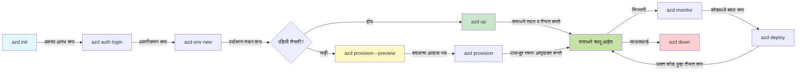
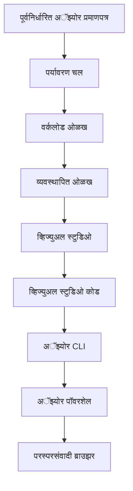

# AZD मूलभूत - Azure Developer CLI समजून घेणे

# AZD मूलभूत - मुख्य संकल्पना आणि मूलतत्त्वे

**अध्याय नेव्हिगेशन:**
- **📚 कोर्स होम**: [AZD नवशिक्यांसाठी](../../README.md)
- **📖 चालू प्रकरण**: प्रकरण 1 - पाया व जलद प्रारंभ
- **⬅️ मागील**: [कोर्स आढावा](../../README.md#-chapter-1-foundation--quick-start)
- **➡️ पुढे**: [इंस्टॉलेशन व सेटअप](installation.md)
- **🚀 पुढील प्रकरण**: [प्रकरण 2: AI-प्रथम विकास](../chapter-02-ai-development/microsoft-foundry-integration.md)

## परिचय

या धड्यात Azure Developer CLI (azd) ची ओळख करून दिली आहे, एक शक्तिशाली कमांड-लाइन टूल जे स्थानिक विकासापासून Azure तैनातीपर्यंतचा तुमचा प्रवास वेगवान करते. तुम्ही मूलभूत संकल्पना, मुख्य वैशिष्ट्ये शिकाल आणि azd कसा क्लाउड-नेटिव्ह अनुप्रयोग तैनात करणे सोपे करतो हे समजून घ्याल.

## अभ्यासाचे उद्दिष्टे

या धड्याच्या शेवटी, आपण:
- Azure Developer CLI म्हणजे काय आणि त्याचा मुख्य उद्देश समजून घेणार
- टेम्पलेट्स, एन्व्हायर्नमेंट्स, आणि सेवांच्या मुख्य संकल्पना शिकणार
- टेम्पलेट-चालित विकास व Infrastructure as Code यांसारखी मुख्य वैशिष्ट्ये अन्वेषण करणार
- azd प्रकल्प रचना आणि वर्कफ्लो समजून घेणार
- तुमच्या विकास वातावरणासाठी azd इन्स्टॉल व कॉन्फिगर करण्यास तयार असणार

## शिकल्यावर काय करणार आहात

या धडा पूर्ण केल्यावर, आपण सक्षम असाल:
- आधुनिक क्लाउड विकास वर्कफ्लो मध्ये azd ची भूमिका स्पष्टपणे समजावून सांगू शकणे
- azd प्रकल्प संरचनेचे घटक ओळखणे
- टेम्पलेट्स, एन्व्हायर्नमेंट्स, आणि सेवा कशाप्रकारे एकत्र काम करतात ते वर्णन करणे
- azd सह Infrastructure as Code च्या फायद्यांना समजून घेणे
- विविध azd कमांड आणि त्यांचे उद्दिष्ट ओळखणे

## Azure Developer CLI (azd) म्हणजे काय?

Azure Developer CLI (azd) हा एक कमांड-लाइन टूल आहे जो स्थानिक विकासापासून Azure वर तैनात करण्यापर्यंतचा प्रवास वेगवान करण्यासाठी तयार केलेला आहे. तो Azure वर क्लाउड-नेटिव्ह अनुप्रयोग तयार करणे, तैनात करणे आणि व्यवस्थापित करणे सुलभ करतो.

### 🎯 का AZD वापरावे? प्रत्यक्ष जीवनातील तुलना

आपण डेटाबेससह एक सोपे वेब अॅप तैनात करण्याची तुलना करू या:

#### ❌ AZD शिवाय: मॅन्युअल Azure तैनाती (30+ मिनिटे)

```bash
# पायरी 1: रिसोर्स ग्रुप तयार करा
az group create --name myapp-rg --location eastus

# पायरी 2: अॅप सर्व्हिस प्लॅन तयार करा
az appservice plan create --name myapp-plan \
  --resource-group myapp-rg \
  --sku B1 --is-linux

# पायरी 3: वेब अॅप तयार करा
az webapp create --name myapp-web-unique123 \
  --resource-group myapp-rg \
  --plan myapp-plan \
  --runtime "NODE:18-lts"

# पायरी 4: Cosmos DB खाते तयार करा (10-15 मिनिटे)
az cosmosdb create --name myapp-cosmos-unique123 \
  --resource-group myapp-rg \
  --kind MongoDB

# पायरी 5: डेटाबेस तयार करा
az cosmosdb mongodb database create \
  --account-name myapp-cosmos-unique123 \
  --resource-group myapp-rg \
  --name tododb

# पायरी 6: कलेक्शन तयार करा
az cosmosdb mongodb collection create \
  --account-name myapp-cosmos-unique123 \
  --resource-group myapp-rg \
  --database-name tododb \
  --name todos

# पायरी 7: कनेक्शन स्ट्रिंग मिळवा
CONN_STR=$(az cosmosdb keys list \
  --name myapp-cosmos-unique123 \
  --resource-group myapp-rg \
  --type connection-strings \
  --query "connectionStrings[0].connectionString" -o tsv)

# पायरी 8: अॅप सेटिंग्ज कॉन्फिगर करा
az webapp config appsettings set \
  --name myapp-web-unique123 \
  --resource-group myapp-rg \
  --settings MONGODB_URI="$CONN_STR"

# पायरी 9: लॉगिंग सक्षम करा
az webapp log config --name myapp-web-unique123 \
  --resource-group myapp-rg \
  --application-logging filesystem \
  --detailed-error-messages true

# पायरी 10: Application Insights सेट अप करा
az monitor app-insights component create \
  --app myapp-insights \
  --location eastus \
  --resource-group myapp-rg

# पायरी 11: App Insights ला वेब अॅपशी लिंक करा
INSTRUMENTATION_KEY=$(az monitor app-insights component show \
  --app myapp-insights \
  --resource-group myapp-rg \
  --query "instrumentationKey" -o tsv)

az webapp config appsettings set \
  --name myapp-web-unique123 \
  --resource-group myapp-rg \
  --settings APPINSIGHTS_INSTRUMENTATIONKEY="$INSTRUMENTATION_KEY"

# पायरी 12: अनुप्रयोग स्थानिकपणे बिल्ड करा
npm install
npm run build

# पायरी 13: डिप्लॉयमेंट पॅकेज तयार करा
zip -r app.zip . -x "*.git*" "node_modules/*"

# पायरी 14: अनुप्रयोग तैनात करा
az webapp deployment source config-zip \
  --resource-group myapp-rg \
  --name myapp-web-unique123 \
  --src app.zip

# पायरी 15: थांबा आणि प्रार्थना करा की ते काम करेल 🙏
# (स्वयंचलित पडताळणी नाही, मॅन्युअल चाचणी आवश्यक आहे)
```

**समस्या:**
- ❌ आठवणीसाठी आणि अनुक्रमे अंमलात आणण्यासाठी 15+ कमांड्स
- ❌ 30-45 मिनिटे मॅन्युअल काम
- ❌ चुका करणे सोपे (टायपो, चुकीचे पॅरामीटर्स)
- ❌ कनेक्शन स्ट्रिंग्स टर्मिनलच्या इतिहासात दिसून येतात
- ❌ काही चुकले तर स्वयंचलित रोलबॅक नाही
- ❌ टीम सदस्यांसाठी पुनरुत्पादित करणे कठीण
- ❌ दरवेळी वेगळे (पुनरुत्पादनयोग्य नाही)

#### ✅ AZD सह: स्वयंचलित तैनाती (5 कमांड, 10-15 मिनिटे)

```bash
# चरण 1: साच्यातून प्रारंभ करा
azd init --template todo-nodejs-mongo

# चरण 2: प्रमाणीकृत करा
azd auth login

# चरण 3: पर्यावरण तयार करा
azd env new dev

# चरण 4: बदलांचे पूर्वावलोकन (पर्यायी परंतु शिफारसीय)
azd provision --preview

# चरण 5: सर्वकाही तैनात करा
azd up

# ✨ पूर्ण! सर्वकाही तैनात, कॉन्फिगर आणि देखरेख केले गेले आहे
```

**फायदे:**
- ✅ **5 कमांड्स** विरुद्ध 15+ मॅन्युअल स्टेप्स
- ✅ **10-15 मिनिटे** एकूण वेळ (अधिकांश वेळ Azure साठी प्रतीक्षा)
- ✅ **शून्य त्रुटी** - स्वयंचलित आणि चाचणी केलेले
- ✅ **सिक्रेट्स सुरक्षितरित्या व्यवस्थापित** केले जातात (Key Vault द्वारे)
- ✅ **अपयशांवर स्वयंचलित रोलबॅक**
- ✅ **पूर्णपणे पुनरुत्पादनयोग्य** - दरवेळी समान परिणाम
- ✅ **टीम-तयार** - कोणताही सदस्य समान कमांड्सने तैनात करू शकतो
- ✅ **Infrastructure as Code** - आवृत्ती नियंत्रित Bicep टेम्पलेट्स
- ✅ **बिल्ट-इन मॉनिटरिंग** - Application Insights स्वयंचलितरित्या कॉन्फिगर केलेले

### 📊 वेळ आणि त्रुटी कमीकरण

| Metric | Manual Deployment | AZD Deployment | Improvement |
|:-------|:------------------|:---------------|:------------|
| **Commands** | 15+ | 5 | 67% fewer |
| **Time** | 30-45 min | 10-15 min | 60% faster |
| **Error Rate** | ~40% | <5% | 88% reduction |
| **Consistency** | Low (manual) | 100% (automated) | Perfect |
| **Team Onboarding** | 2-4 hours | 30 minutes | 75% faster |
| **Rollback Time** | 30+ min (manual) | 2 min (automated) | 93% faster |

## मुख्य संकल्पना

### टेम्पलेट्स
टेम्पलेट्स azd चे पाया आहेत. त्यात समाविष्ट आहे:
- **अॅप्लिकेशन कोड** - तुमचा स्रोत कोड आणि अवलंबित्वे
- **इन्फ्रास्ट्रक्चर व्याख्या** - Bicep किंवा Terraform मध्ये परिभाषित Azure संसाधने
- **कॉन्फिगरेशन फाईल्स** - सेटिंग्ज आणि पर्यावरण व्हेरिएबल्स
- **डिप्लॉयमेंट स्क्रिप्ट्स** - स्वयंचलित डिप्लॉयमेंट वर्कफ्लो

### एन्व्हायर्नमेंट्स
एन्व्हायर्नमेंट्स विविध तैनाती लक्ष्ये दर्शवितात:
- **Development** - चाचणी व विकासासाठी
- **Staging** - प्री-प्रोडक्शन वातावरण
- **Production** - लाईव्ह प्रोडक्शन वातावरण

प्रत्येक एन्व्हायर्नमेंटमध्ये स्वतःचे असते:
- Azure resource group
- कॉन्फिगरेशन सेटिंग्ज
- डिप्लॉयमेंट स्थिती

### सेवा
सेवा आपल्या अनुप्रयोगाच्या घटक आहेत:
- **Frontend** - वेब अनुप्रयोग, SPAs
- **Backend** - APIs, मायक्रोसेवा
- **Database** - डेटा संग्रहण उपाय
- **Storage** - फाइल आणि ब्लॉब स्टोरेज

## मुख्य वैशिष्ट्ये

### 1. टेम्पलेट-चालित विकास
```bash
# उपलब्ध टेम्पलेट्स ब्राउझ करा
azd template list

# टेम्पलेटमधून प्रारंभ करा
azd init --template <template-name>
```

### 2. इन्फ्रास्ट्रक्चर अ‍ॅज कोड
- **Bicep** - Azure ची डोमेन-विशिष्ट भाषा
- **Terraform** - मल्टी-क्लाउड इन्फ्रास्ट्रक्चर टूल
- **ARM Templates** - Azure Resource Manager टेम्पलेट्स

### 3. समाकलित वर्कफ्लो
```bash
# पूर्ण तैनाती कार्यप्रवाह
azd up            # प्राव्हिजन + तैनात, प्रथम सेटअपसाठी हे हात न लागणारे आहे

# 🧪 NEW: तैनातीपूर्वी इन्फ्रास्ट्रक्चर बदलांचे पूर्वावलोकन (सुरक्षित)
azd provision --preview    # बदल न करता पायाभूत संरचनेची तैनाती अनुकरण करा

azd provision     # पायाभूत संरचना अद्यतनित केल्यास Azure संसाधने तयार करण्यासाठी हे वापरा
azd deploy        # अॅप्लिकेशन कोड तैनात करा किंवा अद्यतनानंतर कोड पुन्हा तैनात करा
azd down          # संसाधने साफ करा
```

#### 🛡️ प्रीव्ह्यूसह सुरक्षित इन्फ्रास्ट्रक्चर नियोजन
`azd provision --preview` हा आदेश सुरक्षित तैनात्यांसाठी गेम-चेंजर आहे:
- **ड्राय-रन विश्लेषण** - काय तयार केले जाईल, बदलले जाईल, किंवा हटवले जाईल हे दाखवते
- **शून्य जोखीम** - तुमच्या Azure वातावरणात प्रत्यक्ष बदल केले जात नाहीत
- **टीम सहयोग** - तैनातीपूर्वी प्रीव्ह्यू निकाल शेअर करा
- **खर्च अंदाज** - बांधिलकीपूर्वी संसाधनांचा खर्च समजून घ्या

```bash
# उदाहरण पूर्वावलोकन कार्यप्रवाह
azd provision --preview           # काय बदलेल ते पहा
# आउटपुटचे पुनरावलोकन करा, टीमशी चर्चा करा
azd provision                     # विश्वासाने बदल लागू करा
```

### 📊 दृष्य: AZD विकास वर्कफ्लो


**वर्कफ्लो स्पष्टीकरण:**
1. **Init** - टेम्पलेट किंवा नवीन प्रकल्पाने प्रारंभ करा
2. **Auth** - Azure सोबत प्रमाणीकरण करा
3. **Environment** - वेगळे तैनाती एन्व्हायर्नमेंट तयार करा
4. **Preview** - 🆕 नेहमी प्रथम इन्फ्रास्ट्रक्चर बदलांचे प्रीव्ह्यू करा (सुरक्षित पद्धत)
5. **Provision** - Azure संसाधने तयार/अपडेट करा
6. **Deploy** - तुमचा अॅप्लिकेशन कोड पुश करा
7. **Monitor** - अॅप्लिकेशन कामगिरी निरीक्षण करा
8. **Iterate** - बदल करा आणि कोड पुन्हा तैनात करा
9. **Cleanup** - काम संपल्यानंतर संसाधने काढून टाका

### 4. एन्व्हायर्नमेंट व्यवस्थापन
```bash
# पर्यावरणे तयार करा आणि व्यवस्थापित करा
azd env new <environment-name>
azd env select <environment-name>
azd env list
```

## 📁 प्रकल्प संरचना

एक सामान्य azd प्रकल्प संरचना:
```
my-app/
├── .azd/                    # azd configuration
│   └── config.json
├── .azure/                  # Azure deployment artifacts
├── .devcontainer/          # Development container config
├── .github/workflows/      # GitHub Actions
├── .vscode/               # VS Code settings
├── infra/                 # Infrastructure code
│   ├── main.bicep        # Main infrastructure template
│   ├── main.parameters.json
│   └── modules/          # Reusable modules
├── src/                  # Application source code
│   ├── api/             # Backend services
│   └── web/             # Frontend application
├── azure.yaml           # azd project configuration
└── README.md
```

## 🔧 कॉन्फिगरेशन फाईल्स

### azure.yaml
मुख्य प्रोजेक्ट कॉन्फिगरेशन फाईल:
```yaml
name: my-awesome-app
metadata:
  template: my-template@1.0.0

services:
  web:
    project: ./src/web
    language: js
    host: appservice
  api:
    project: ./src/api
    language: js
    host: appservice

hooks:
  preprovision:
    shell: pwsh
    run: echo "Preparing to provision..."
```

### .azure/config.json
एन्व्हायर्नमेंट-विशिष्ट कॉन्फिगरेशन:
```json
{
  "version": 1,
  "defaultEnvironment": "dev",
  "environments": {
    "dev": {
      "subscriptionId": "your-subscription-id",
      "location": "eastus"
    }
  }
}
```

## 🎪 सामान्य वर्कफ्लो आणि व्यावहारिक सराव

> **💡 शिकण्याचा सल्ला:** तुमचे AZD कौशल्य क्रमिकपणे वाढवण्यासाठी या सरावांना दिलेल्या क्रमाने पाळा.

### 🎯 सराव 1: आपला पहिला प्रकल्प प्रारंभ करा

**लक्ष्य:** एक AZD प्रकल्प तयार करा आणि त्याची रचना शोधा

**पायऱ्या:**
```bash
# सिद्ध टेम्पलेट वापरा
azd init --template todo-nodejs-mongo

# निर्मित फाइल्स तपासा
ls -la  # लपवलेल्या फाइल्ससह सर्व फाइल्स पहा

# निर्मित प्रमुख फाइल्स:
# - azure.yaml (मुख्य कॉन्फिग)
# - infra/ (पायाभूत संरचना कोड)
# - src/ (अर्जाचा कोड)
```

**✅ यश:** तुमच्याकडे azure.yaml, infra/, आणि src/ निर्देशिका आहेत

---

### 🎯 सराव 2: Azure वर तैनात करा

**लक्ष्य:** पूर्ण एंड-टू-एंड तैनाती पूर्ण करा

**पायऱ्या:**
```bash
# 1. प्रमाणीकरण करा
az login && azd auth login

# 2. वातावरण तयार करा
azd env new dev
azd env set AZURE_LOCATION eastus

# 3. बदलांचे पूर्वावलोकन (शिफारस केलेले)
azd provision --preview

# 4. सर्व काही तैनात करा
azd up

# 5. तैनातीची पडताळणी करा
azd show    # आपल्या अॅपचा URL पहा
```

**अपेक्षित वेळ:** 10-15 मिनिटे  
**✅ यश:** अॅप्लिकेशन URL ब्राउझरमध्ये उघडते

---

### 🎯 सराव 3: एकाधिक एन्व्हायर्नमेंट्स

**लक्ष्य:** dev आणि staging वर तैनात करा

**पायऱ्या:**
```bash
# आधीच dev आहे, staging तयार करा
azd env new staging
azd env set AZURE_LOCATION westus2
azd up

# त्यांच्यात स्विच करा
azd env list
azd env select dev
```

**✅ यश:** Azure पोर्टलमध्ये दोन स्वतंत्र रिसोर्स ग्रुप्स

---

### 🛡️ स्वच्छ सुरुवात: `azd down --force --purge`

जेव्हा तुम्हाला पूर्णपणे रीसेट करायचे असते:

```bash
azd down --force --purge
```

**हे काय करते:**
- `--force`: पुष्टीकरण प्रवाह नाही
- `--purge`: सर्व स्थानिक स्थिती आणि Azure संसाधने हटवते

**कधी वापरावे:**
- तैनाती मध्यवर्ती अयशस्वी झाल्यास
- प्रकल्प बदलत असताना
- नवीन सुरुवात हवी असल्यास

---

## 🎪 मूळ वर्कफ्लो संदर्भ

### नवीन प्रकल्प सुरू करणे
```bash
# पद्धत 1: विद्यमान टेम्पलेट वापरा
azd init --template todo-nodejs-mongo

# पद्धत 2: शून्यापासून सुरू करा
azd init

# पद्धत 3: सध्याच्या निर्देशिकेचा वापर करा
azd init .
```

### विकास चक्र
```bash
# विकास वातावरण सेट करा
azd auth login
azd env new dev
azd env select dev

# सर्वकाही तैनात करा
azd up

# बदल करा आणि पुन्हा तैनात करा
azd deploy

# काम पूर्ण झाल्यावर साफ करा
azd down --force --purge # Azure Developer CLI मधील कमांड तुमच्या वातावरणासाठी एक **कठोर रीसेट** आहे—विशेषतः जेव्हा तुम्ही अपयशी तैनातीतील समस्या सोडवत असता, अनाथ संसाधने साफ करत असता, किंवा नवीन पुनःतैनातीसाठी तयारी करत असता.
```

## `azd down --force --purge` समजून घेणे
`azd down --force --purge` हा आदेश तुमचे azd एन्व्हायर्नमेंट आणि सर्व संबंधित संसाधने पूर्णपणे हटविण्याचा शक्तिशाली मार्ग आहे. खाली प्रत्येक फ्लॅग काय करतो याचे वर्णन आहे:
```
--force
```
- पुष्टीकरण संकेत वगळते.
- ऑटोमेशन किंवा स्क्रिप्टिंगसाठी उपयुक्त जिथे मॅन्युअल इनपुट शक्य नाही.
- CLI असमानता शोधत असली तरीही teardown मध्ये व्यत्यय येऊ नये याची खात्री करतो.

```
--purge
```
सर्व संबंधित मेटाडेटा हटवते, ज्यात समाविष्ट आहे:
- एन्व्हायर्नमेंट स्थिती
- स्थानिक `.azure` फोल्डर
- कॅश केलेली डिप्लॉयमेंट माहिती
- azd ला पूर्वीच्या डिप्लॉयमेंट्स "स्मरण" करणे रोखते, ज्यामुळे मिसमैच झालेली रिसोर्स ग्रुप्स किंवा जुनाट रेजिस्ट्री संदर्भांसारख्या समस्या होऊ शकतात.

### दोन्ही का वापरावे?
जेव्हा `azd up` मध्ये अवशिष्ट स्थिती किंवा आंशिक डिप्लॉयमेंटमुळे अडथळा येतो, तेव्हा या संयोजनाने एक **स्वच्छ सुरुवात** सुनिश्चित होते.

हे विशेषतः हाताने Azure पोर्टलमध्ये संसाधने हटवल्यानंतर किंवा टेम्पलेट्स, एन्व्हायर्नमेंट्स, किंवा रिसोर्स ग्रुप नामकरण बदलताना उपयुक्त आहे.

### एकाधिक एन्व्हायर्नमेंट्सचे व्यवस्थापन
```bash
# स्टेजिंग वातावरण तयार करा
azd env new staging
azd env select staging
azd up

# dev वर परत स्विच करा
azd env select dev

# वातावरणांची तुलना करा
azd env list
```

## 🔐 प्रमाणीकरण आणि क्रेडेन्शियल्स

प्रमाणीकरण समजणे यशस्वी azd तैनातीसाठी अत्यंत महत्त्वाचे आहे. Azure अनेक प्रमाणीकरण पद्धती वापरते, आणि azd इतर Azure टूल्सने वापरल्या जाणाऱ्या त्याच क्रेडेन्शियल चेनचा लाभ घेतो.

### Azure CLI प्रमाणीकरण (`az login`)

azd वापरण्यापूर्वी, तुम्हाला Azure सह प्रमाणीकरण करणे आवश्यक आहे. सर्वात सामान्य पद्धत म्हणजे Azure CLI वापरणे:

```bash
# इंटरॅक्टिव्ह लॉगिन (ब्राउझर उघडते)
az login

# विशिष्ट टेनंट सह लॉगिन
az login --tenant <tenant-id>

# सर्व्हिस प्रिन्सिपल सह लॉगिन
az login --service-principal -u <app-id> -p <password> --tenant <tenant-id>

# सध्याच्या लॉगिनची स्थिती तपासा
az account show

# उपलब्ध सदस्यता यादी करा
az account list --output table

# पूर्वनिर्धारित सदस्यता सेट करा
az account set --subscription <subscription-id>
```

### प्रमाणीकरण प्रवाह
1. **Interactive Login**: प्रमाणीकरणासाठी तुमचा डिफॉल्ट ब्राउझर उघडतो
2. **Device Code Flow**: ब्राउझर प्रवेश नसलेल्या वातावरणांसाठी
3. **Service Principal**: ऑटोमेशन आणि CI/CD परिस्थितीसाठी
4. **Managed Identity**: Azure-हॉस्ट केलेल्या अनुप्रयोगांसाठी

### DefaultAzureCredential चेन

`DefaultAzureCredential` हा एक क्रेडेन्शियल प्रकार आहे जो विशिष्ट क्रमाने अनेक क्रेडेन्शियल स्रोत स्वयंचलितपणे तपासून सुलभ प्रमाणीकरण अनुभव प्रदान करतो:

#### क्रेडेन्शियल चेनची क्रमवारी

#### 1. एन्व्हायर्नमेंट व्हेरिएबल्स
```bash
# सर्व्हिस प्रिन्सिपलसाठी पर्यावरण चल सेट करा
export AZURE_CLIENT_ID="<app-id>"
export AZURE_CLIENT_SECRET="<password>"
export AZURE_TENANT_ID="<tenant-id>"
```

#### 2. Workload Identity (Kubernetes/GitHub Actions)
स्वयंचलितपणे वापरले जाते:
- Azure Kubernetes Service (AKS) मध्ये Workload Identity सह
- GitHub Actions मध्ये OIDC फेडरेशन सह
- इतर फेडरेटेड आयडेंटिटी परिस्थितींमध्ये

#### 3. Managed Identity
खालील Azure संसाधनांसाठी:
- व्हर्च्युअल मशीन
- App Service
- Azure Functions
- कंटेनर इंस्टन्सेस

```bash
# Azure संसाधनावर मॅनेज्ड आयडेंटिटीसह चालत आहे का ते तपासा
az account show --query "user.type" --output tsv
# परत करते: जर मॅनेज्ड आयडेंटिटी वापरत असल्यास "servicePrincipal"
```

#### 4. डेव्हलपर टूल्स इंटिग्रेशन
- **Visual Studio**: स्वयंचलितपणे साईन-इन केलेले खाते वापरते
- **VS Code**: Azure Account एक्स्टेंशनचे क्रेडेन्शियल्स वापरते
- **Azure CLI**: `az login` क्रेडेन्शियल्स वापरते (स्थानिक विकासासाठी सर्वाधिक सामान्य)

### AZD प्रमाणीकरण सेटअप

```bash
# पद्धत 1: Azure CLI वापरा (विकासासाठी शिफारस केलेले)
az login
azd auth login  # मौजूदा Azure CLI प्रमाणपत्रांचा वापर करते

# पद्धत 2: थेट azd प्रमाणीकरण
azd auth login --use-device-code  # हेडलेस वातावरणांसाठी

# पद्धत 3: प्रमाणीकरण स्थिती तपासा
azd auth login --check-status

# पद्धत 4: लॉगआउट करा आणि पुन्हा प्रमाणीकरण करा
azd auth logout
azd auth login
```

### प्रमाणीकरण उत्तम पद्धती

#### लोकल विकासासाठी
```bash
# 1. Azure CLI वापरून लॉगिन करा
az login

# 2. योग्य सबस्क्रिप्शन तपासा
az account show
az account set --subscription "Your Subscription Name"

# 3. azd विद्यमान क्रेडेन्शियल्ससह वापरा
azd auth login
```

#### CI/CD पाइपलाइन्ससाठी
```yaml
# GitHub Actions example
- name: Azure Login
  uses: azure/login@v1
  with:
    creds: ${{ secrets.AZURE_CREDENTIALS }}

- name: Deploy with azd
  run: |
    azd auth login --client-id ${{ secrets.AZURE_CLIENT_ID }} \
                    --client-secret ${{ secrets.AZURE_CLIENT_SECRET }} \
                    --tenant-id ${{ secrets.AZURE_TENANT_ID }}
    azd up --no-prompt
```

#### प्रोडक्शन एन्व्हायर्नमेंटसाठी
- Azure संसाधनांवर चालवल्यास **Managed Identity** वापरा
- ऑटोमेशन परिस्थितीसाठी **Service Principal** वापरा
- कोड किंवा कॉन्फिगरेशन फाइलमध्ये क्रेडेन्शियल्स ठेवणे टाळा
- संवेदनशील कॉन्फिगरेशनसाठी **Azure Key Vault** वापरा

### सामान्य प्रमाणीकरण समस्या आणि उपाय

#### समस्या: "No subscription found"
```bash
# समाधान: डीफॉल्ट सदस्यता सेट करा
az account list --output table
az account set --subscription "<subscription-id>"
azd env set AZURE_SUBSCRIPTION_ID "<subscription-id>"
```

#### समस्या: "Insufficient permissions"
```bash
# उपाय: आवश्यक भूमिका तपासा आणि नियुक्त करा
az role assignment list --assignee $(az account show --query user.name --output tsv)

# सामान्य आवश्यक भूमिका:
# - Contributor (स्रोत व्यवस्थापनासाठी)
# - User Access Administrator (भूमिका नियुक्तीसाठी)
```

#### समस्या: "Token expired"
```bash
# उपाय: पुनः प्रमाणीकरण करा
az logout
az login
azd auth logout
azd auth login
```

### विविध परिस्थितींमधील प्रमाणीकरण

#### स्थानिक विकास
```bash
# व्यक्तिगत विकास खाते
az login
azd auth login
```

#### टीम विकास
```bash
# संस्थेसाठी विशिष्ट टेनंट वापरा
az login --tenant contoso.onmicrosoft.com
azd auth login
```

#### मल्टि-टेनेन्ट परिस्थिती
```bash
# किरायेदारांदरम्यान स्विच करा
az login --tenant tenant1.onmicrosoft.com
# किरायेदार 1 वर तैनात करा
azd up

az login --tenant tenant2.onmicrosoft.com  
# किरायेदार 2 वर तैनात करा
azd up
```

### सुरक्षा विचार

1. **क्रेडेन्शियल स्टोरेज**: क्रेडेन्शियल्स कधीही स्रोत कोडमध्ये साठवू नका
2. **स्कोप मर्यादित करा**: सर्वात कमी-परवानगी तत्त्व वापरा (least-privilege) सेवा प्रिन्सिपलसाठी
3. **टोकन रोटेशन**: नियमितपणे सेवा प्रिन्सिपलचे सीक्रेट्स बदला
4. **ऑडिट ट्रेल**: प्रमाणीकरण आणि डिप्लॉयमेंट क्रियाकलापांचे मॉनिटरिंग करा
5. **नेटवर्क सुरक्षा**: शक्य असल्यास प्रायव्हेट एंडपॉइंट्स वापरा

### प्रमाणीकरण त्रुटी निराकरण

```bash
# प्रमाणीकरण समस्या डीबग करा
azd auth login --check-status
az account show
az account get-access-token

# सामान्य निदान आदेश
whoami                          # सध्याचा वापरकर्ता संदर्भ
az ad signed-in-user show      # Azure AD वापरकर्त्याचे तपशील
az group list                  # संसाधन प्रवेशाची चाचणी करा
```

## `azd down --force --purge` समजून घेणे

### शोध
```bash
azd template list              # टेम्पलेट ब्राउझ करा
azd template show <template>   # टेम्पलेट तपशील
azd init --help               # प्रारंभिक पर्याय
```

### प्रकल्प व्यवस्थापन
```bash
azd show                     # प्रकल्पाचा आढावा
azd env show                 # सध्याचे वातावरण
azd config list             # कॉन्फिगरेशन सेटिंग्ज
```

### मॉनिटरिंग
```bash
azd monitor                  # Azure पोर्टलवरील मॉनिटरिंग उघडा
azd monitor --logs           # अॅप्लिकेशन लॉग्स पहा
azd monitor --live           # थेट मेट्रिक्स पहा
azd pipeline config          # CI/CD सेटअप करा
```

## उत्तम पद्धती

### 1. अर्थपूर्ण नावे वापरा
```bash
# चांगले
azd env new production-east
azd init --template web-app-secure

# टाळा
azd env new env1
azd init --template template1
```

### 2. टेम्पलेट्सचा उपयोग करा
- विद्यमान टेम्पलेट्सपासून प्रारंभ करा
- तुमच्या गरजा नुसार सानुकूल करा
- आपल्या संस्थेसाठी पुनर्वापरयोग्य टेम्पलेट्स तयार करा

### 3. एन्व्हायर्नमेंट वेगळे ठेवा
- dev/staging/prod साठी वेगळे एन्व्हायर्नमेंट वापरा
- स्थानिक मशीन वरून थेट प्रोडक्शन मध्ये तैनात करू नका
- प्रोडक्शन तैनातीसाठी CI/CD पाइपलाइन्स वापरा

### 4. कॉन्फिगरेशन व्यवस्थापन
- संवेदनशील डेटासाठी एन्व्हायर्नमेंट व्हेरिएबल्स वापरा
- कॉन्फिगरेशन आवृत्ती नियंत्रणात ठेवा
- एन्व्हायर्नमेंट-विशिष्ट सेटिंग्ज दस्तऐवजीकृत करा

## शिकण्याची प्रगती

### नवशिक्या (सप्ताह 1-2)
1. azd इन्स्टॉल करा आणि प्रमाणीकरण करा
2. एक सोपा टेम्पलेट तैनात करा
3. प्रकल्प रचना समजून घ्या
4. मूलभूत कमांड शिकाः (up, down, deploy)

### मध्यम (सप्ताह 3-4)
1. टेम्पलेट सानुकूल करा
2. एकाधिक एन्व्हायर्नमेंट्स व्यवस्थापित करा
3. इन्फ्रास्ट्रक्चर कोड समजून घ्या
4. CI/CD पाइपलाइन्स सेट करा

### प्रगत (सप्ताह 5+)
1. कस्टम टेम्पलेट तयार करा
2. प्रगत इन्फ्रास्ट्रक्चर पॅटर्न
3. मल्टी-रीजन तैनाती
4. एंटरप्राइझ-ग्रेड कॉन्फिगरेशन

## पुढील टप्पे

**📖 प्रकरण 1 चे शिक्षण सुरू ठेवा:**
- [स्थापना आणि सेटअप](installation.md) - azd स्थापित आणि कॉन्फिगर करा
- [तुमचा पहिला प्रकल्प](first-project.md) - पूर्ण हाताने शिकण्याचे ट्यूटोरियल
- [कॉन्फिगरेशन मार्गदर्शिका](configuration.md) - उन्नत कॉन्फिगरेशन पर्याय

**🎯 पुढच्या अध्यायासाठी तयार?**
- [अध्याय 2: AI-प्रथम विकास](../chapter-02-ai-development/microsoft-foundry-integration.md) - AI अनुप्रयोग बांधणे सुरू करा

## Additional Resources

- [Azure Developer CLI विहंगावलोकन](https://learn.microsoft.com/en-us/azure/developer/azure-developer-cli/)
- [टेम्पलेट गॅलरी](https://azure.github.io/awesome-azd/)
- [समुदाय नमुने](https://github.com/Azure-Samples)

---

## 🙋 वारंवार विचारले जाणारे प्रश्न

### सामान्य प्रश्न

**प्र: AZD आणि Azure CLI यांमध्ये काय फरक आहे?**

उ: Azure CLI (`az`) हे वैयक्तिक Azure संसाधने व्यवस्थापित करण्यासाठी आहे. AZD (`azd`) संपूर्ण अनुप्रयोग व्यवस्थापित करण्यासाठी आहे:

```bash
# Azure CLI - निम्न-स्तरीय संसाधन व्यवस्थापन
az webapp create --name myapp --resource-group rg
az sql server create --name myserver --resource-group rg
# ...अजून अनेक आज्ञा आवश्यक आहेत

# AZD - अनुप्रयोग-स्तरीय व्यवस्थापन
azd up  # सर्व संसाधनांसह संपूर्ण अनुप्रयोग तैनात करते
```

**या प्रकारे विचार करा:**
- `az` = एकेक लेगो ब्रिकवर ऑपरेट करणे
- `azd` = संपूर्ण लेगो सेट्ससह काम करणे

---

**प्र: AZD वापरण्यासाठी मला Bicep किंवा Terraform माहित असणे आवश्यक आहे का?**

उ: नाही! टेम्पलेट्सपासून सुरू करा:
```bash
# विद्यमान टेम्पलेट वापरा - IaC ज्ञान आवश्यक नाही
azd init --template todo-nodejs-mongo
azd up
```

आपण नंतर इन्फ्रास्ट्रक्चर सानुकूल करण्यासाठी Bicep शिकू शकता. टेम्पलेट्स कार्यशील उदाहरणे प्रदान करतात ज्यातून शिकता येते.

---

**प्र: AZD टेम्पलेट्स चालवण्यास किती खर्च येतो?**

उ: खर्च टेम्पलेटनुसार बदलतात. बहुतेक विकास टेम्पलेट्सचे खर्च $50-150/महिना असतात:

```bash
# तैनात करण्यापूर्वी खर्च पाहा
azd provision --preview

# वापरत नसल्यास नेहमी साफ करा
azd down --force --purge  # सर्व संसाधने हटवते
```

**प्रो टिप:** जिथे उपलब्ध आहे तिथे फ्री टियर्स वापरा:
- App Service: F1 (Free) टियर
- Azure OpenAI: 50,000 tokens/महिना मोफत
- Cosmos DB: 1000 RU/s मोफत टियर

---

**प्र: मी अस्तित्वात असलेल्या Azure संसाधनांसह AZD वापरू शकतो का?**

उ: हो, पण नव्याने सुरू करणे सोपे आहे. AZD सर्वच जीवनचक्राचे व्यवस्थापन करीत असता उत्तम कार्य करते. अस्तित्वात असलेल्या संसाधनांसाठी:

```bash
# पर्याय 1: विद्यमान संसाधने आयात करा (प्रगत)
azd init
# नंतर infra/ बदलून विद्यमान संसाधनांकडे संदर्भ करा

# पर्याय 2: नवीन सुरुवात करा (शिफारस केली जाते)
azd init --template matching-your-stack
azd up  # नवीन वातावरण तयार करते
```

---

**प्र: माझा प्रकल्प टीममेट्सशी कसा शेअर करायचा?**

उ: AZD प्रकल्प Git मध्ये कमिट करा (पण .azure फोल्डर कमिट करू नका):

```bash
# आधीपासून .gitignore मध्ये डिफॉल्टनुसार आहे
.azure/        # गुप्त माहिती आणि पर्यावरण डेटा समाविष्ट आहे
*.env          # पर्यावरणीय चल

# मग टीम सदस्य:
git clone <your-repo>
azd auth login
azd env new <their-name>-dev
azd up
```

सर्वांना एकाच टेम्पलेटमधून एकसारखे इन्फ्रास्ट्रक्चर मिळते.

---

### समस्यानिवारण प्रश्न

**प्र: "azd up" मधले अर्धवट अयशस्वी झाले. आता काय करावे?**

उ: त्रुटी तपासा, दुरुस्त करा, नंतर पुन्हा प्रयत्न करा:

```bash
# तपशीलवार नोंदी पहा
azd show

# सामान्य उपाय:

# 1. जर कोटा ओलांडला असेल:
azd env set AZURE_LOCATION "westus2"  # इतर प्रदेश वापरून पहा

# 2. जर संसाधन नावाचा संघर्ष असेल:
azd down --force --purge  # नवीन सुरुवात
azd up  # पुन्हा प्रयत्न करा

# 3. जर प्रमाणीकरण कालबाह्य झाले असेल:
az login
azd auth login
azd up
```

**सर्वात सामान्य समस्या:** चुकीची Azure subscription निवडलेली आहे
```bash
az account list --output table
az account set --subscription "<correct-subscription>"
```

---

**प्र: मी पुन्हा प्रोव्हिजन न करता फक्त कोड बदल कसे deploy करु शकतो?**

उ: `azd up` ऐवजी `azd deploy` वापरा:

```bash
azd up          # पहिल्यांदा: प्राविजन + तैनात (हळू)

# कोडमध्ये बदल करा...

azd deploy      # पुढील वेळा: केवळ तैनात (जलद)
```

वेग तुलना:
- `azd up`: 10-15 मिनिटे (इन्फ्रास्ट्रक्चर प्रोविजन करते)
- `azd deploy`: 2-5 मिनिटे (फक्त कोड)

---

**प्र: मी इन्फ्रास्ट्रक्चर टेम्पलेट्स सानुकूल करू शकतो का?**

उ: हो! `infra/` मधील Bicep फाइल्स संपादित करा:

```bash
# azd init नंतर
cd infra/
code main.bicep  # VS Code मध्ये संपादित करा

# बदलांचे पूर्वावलोकन
azd provision --preview

# बदल लागू करा
azd provision
```

**टीप:** लहानपासून सुरू करा - प्रथम SKUs बदला:
```bicep
// infra/main.bicep
sku: {
  name: 'B1'  // Change to 'P1V2' for production
}
```

---

**प्र: AZD ने तयार केलेल्या सर्व काही कसे हटवायचे?**

उ: एक कमांड सर्व संसाधने काढून टाकते:

```bash
azd down --force --purge

# हे खालील गोष्टी हटवते:
# - सर्व Azure संसाधने
# - संसाधन समूह
# - स्थानिक पर्यावरण स्थिती
# - कॅश केलेली तैनाती माहिती
```

**हे नेहमी चालवा जेव्हा:**
- टेम्पलेटची चाचणी पूर्ण झाली असेल
- वेगळ्या प्रकल्पात स्विच करत असाल
- नव्याने सुरू करायचे असेल

**खर्च बचत:** न वापरलेली संसाधने हटविल्यास = $0 शुल्क

---

**प्र: जर मी चुकीने Azure Portal मध्ये संसाधने हटवली तर काय?**

उ: AZD ची स्थिती सिंकपासून बाहेर जाऊ शकते. स्वच्छ आरंभीची पद्धत:

```bash
# 1. स्थानिक स्थिती काढा
azd down --force --purge

# 2. नवीन सुरुवात करा
azd up

# Alternative: AZD ला शोधून दुरुस्त करू द्या
azd provision  # गहाळ संसाधने तयार करेल
```

---

### प्रगत प्रश्न

**प्र: मी CI/CD पाइपलाइनमध्ये AZD वापरू शकतो का?**

उ: हो! GitHub Actions चे उदाहरण:

```yaml
# .github/workflows/deploy.yml
name: Deploy with AZD

on:
  push:
    branches: [main]

jobs:
  deploy:
    runs-on: ubuntu-latest
    steps:
      - uses: actions/checkout@v2
      
      - name: Install azd
        run: curl -fsSL https://aka.ms/install-azd.sh | bash
      
      - name: Azure Login
        run: |
          azd auth login \
            --client-id ${{ secrets.AZURE_CLIENT_ID }} \
            --client-secret ${{ secrets.AZURE_CLIENT_SECRET }} \
            --tenant-id ${{ secrets.AZURE_TENANT_ID }}
      
      - name: Deploy
        run: azd up --no-prompt
```

---

**प्र: गुप्त व संवेदनशील डेटा कसा हाताळायचे?**

उ: AZD आपोआप Azure Key Vault बरोबर समाकलित होते:

```bash
# गुप्त माहिती कोडमध्ये नाही, तर Key Vault मध्ये साठवली जाते
azd env set DATABASE_PASSWORD "$(openssl rand -base64 32)"

# AZD आपोआप:
# 1. Key Vault तयार करते
# 2. गुप्त माहिती साठवते
# 3. Managed Identity च्या माध्यमातून अॅपला प्रवेश देते
# 4. रनटाइममध्ये इंजेक्ट करते
```

**कधीही कमिट करू नका:**
- `.azure/` फोल्डर (यामध्ये environment डेटा असतो)
- `.env` फाइल्स (स्थानिक गुप्त माहिती)
- Connection strings

---

**प्र: मी अनेक प्रदेशांमध्ये deploy करू शकतो का?**

उ: हो, प्रत्येक प्रदेशासाठी environment तयार करा:

```bash
# पूर्व यूएस पर्यावरण
azd env new prod-eastus
azd env set AZURE_LOCATION eastus
azd up

# पश्चिम युरोप पर्यावरण
azd env new prod-westeurope
azd env set AZURE_LOCATION westeurope
azd up

# प्रत्येक पर्यावरण स्वतंत्र आहे
azd env list
```

खऱ्या मल्टी-रीजन अॅप्ससाठी, एकाच वेळी अनेक प्रदेशांमध्ये deploy करण्यासाठी Bicep टेम्पलेट्स सानुकूल करा.

---

**प्र: मला अडकलो तर मदत कुठून मिळेल?**

1. **AZD दस्तऐवजीकरण:** https://learn.microsoft.com/azure/developer/azure-developer-cli/
2. **GitHub Issues:** https://github.com/Azure/azure-dev/issues
3. **Discord:** [Azure डिस्कॉर्ड](https://discord.gg/microsoft-azure) - #azure-developer-cli चॅनेल
4. **Stack Overflow:** टॅग `azure-developer-cli`
5. **हा कोर्स:** [त्रुटी निवारण मार्गदर्शिका](../chapter-07-troubleshooting/common-issues.md)

**प्रो टिप:** विचारण्यापूर्वी, चालवा:
```bash
azd show       # सध्याची स्थिती दाखवते
azd version    # तुमची आवृत्ती दाखवते
```
लवकर मदतीसाठी आपल्या प्रश्नात ही माहिती समाविष्ट करा.

---

## 🎓 पुढे काय?

आता तुम्हाला AZD ची मूलतत्त्वे समजली आहेत. आपला मार्ग निवडा:

### 🎯 नवशिक्यांसाठी:
1. **पुढे:** [स्थापना आणि सेटअप](installation.md) - आपल्या मशीनवर AZD स्थापित करा
2. **नंतर:** [तुमचा पहिला प्रकल्प](first-project.md) - आपले पहिले अॅप तैनात करा
3. **सराव:** या धड्यातील सर्व 3 व्यायाम पूर्ण करा

### 🚀 AI विकासकांसाठी:
1. **थेट जा:** [अध्याय 2: AI-प्रथम विकास](../chapter-02-ai-development/microsoft-foundry-integration.md)
2. **तैनात करा:** `azd init --template get-started-with-ai-chat` पासून सुरू करा
3. **शिका:** तैनात करताना बांधा

### 🏗️ अनुभवी विकासकांसाठी:
1. **पुनरावलोकन:** [कॉन्फिगरेशन मार्गदर्शिका](configuration.md) - उन्नत सेटिंग्ज
2. **एक्सप्लोर:** [Infrastructure as Code](../chapter-04-infrastructure/provisioning.md) - Bicep सखोल अभ्यास
3. **बनवा:** आपल्या स्टॅकसाठी सानुकूल टेम्पलेट तयार करा

---

**अध्याय नेव्हिगेशन:**
- **📚 कोर्स मुख्यपृष्ठ**: [AZD नवशिक्यांसाठी](../../README.md)
- **📖 सध्याचा अध्याय**: अध्याय 1 - पाया आणि जलद प्रारंभ  
- **⬅️ मागील**: [कोर्स आढावा](../../README.md#-chapter-1-foundation--quick-start)
- **➡️ पुढे**: [स्थापना आणि सेटअप](installation.md)
- **🚀 पुढील अध्याय**: [अध्याय 2: AI-प्रथम विकास](../chapter-02-ai-development/microsoft-foundry-integration.md)

---

<!-- CO-OP TRANSLATOR DISCLAIMER START -->
अस्वीकरण:
हा दस्तऐवज AI अनुवाद सेवा [Co-op Translator](https://github.com/Azure/co-op-translator) वापरून अनुवादित केला गेला आहे. आम्ही अचूकतेसाठी प्रयत्न करतो, परंतु कृपया लक्षात घ्या की स्वयंचलित अनुवादांमध्ये चुका किंवा अचूकतेच्या त्रुटी असू शकतात. मूळ दस्तऐवज त्याच्या मूळ भाषेत अधिकृत स्रोत म्हणून मानला जावा. महत्वाच्या माहितीसाठी व्यावसायिक मानवी अनुवादाची शिफारस केली जाते. या अनुवादाच्या वापरामुळे उद्भवणाऱ्या कोणत्याही गैरसमजुती किंवा चुकीच्या अर्थनिर्वचनाबद्दल आम्ही जबाबदार नाही.
<!-- CO-OP TRANSLATOR DISCLAIMER END -->