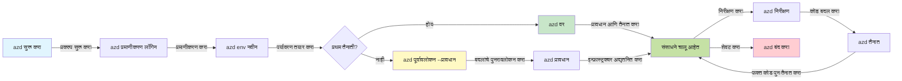
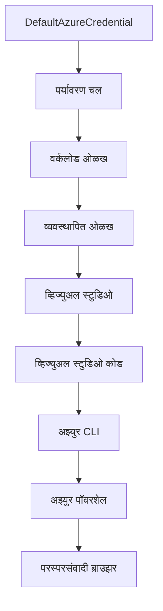

# AZD मूलभूत गोष्टी - Azure Developer CLI समजून घेणे

# AZD मूलभूत गोष्टी - मुख्य संकल्पना आणि मूलतत्त्वे

**अध्याय नेव्हिगेशन:**
- **📚 कोर्स होम**: [AZD For Beginners](../../README.md)
- **📖 चालू अध्याय**: अध्याय 1 - पाया आणि जलद प्रारंभ
- **⬅️ मागील**: [कोर्स वाचनिका](../../README.md#-chapter-1-foundation--quick-start)
- **➡️ पुढील**: [इंस्टॉलेशन आणि सेटअप](installation.md)
- **🚀 पुढील अध्याय**: [अध्याय 2: AI-फर्स्ट विकास](../chapter-02-ai-development/microsoft-foundry-integration.md)

## परिचय

हा धडा तुम्हाला Azure Developer CLI (azd) या शक्तिशाली कमांड-लाइन टूलची ओळख करून देतो, जे स्थानिक विकासापासून Azure तैनात करण्यापर्यंत तुमचा प्रवास वेगवान करते. तुम्हाला मूलभूत संकल्पना, मुख्य वैशिष्ट्ये शिकवली जातील आणि समजून दिले जाईल की azd कसे क्लाऊड-नेटिव्ह अनुप्रयोगांच्या तैनातीला सोपे बनवतो.

## शिकण्याची उद्दिष्टे

या धड्याच्या शेवटी तुम्ही:
- Azure Developer CLI म्हणजे काय आणि त्याचा प्राथमिक उद्देश काय आहे हे समजून घेणार
- साच्यांच्या, वातावरणांच्या आणि सेवांच्या मुख्य संकल्पना शिकणार
- साचा-आधारित विकास आणि Infrastructure as Code यांसह की प्रमुख वैशिष्ट्ये शोधणार
- azd प्रकल्प संरचना आणि कार्यप्रवाह समजून घेणार
- तुमच्या विकास वातावरणासाठी azd कसे इंस्टॉल आणि कॉन्फिगर करायचे ते तयार राहणार

## शिकण्याचे परिणाम

हा धडा पूर्ण केल्यावर, तुम्ही सक्षम असाल:
- आधुनिक क्लाउड विकास कार्यप्रवाहांमध्ये azd ची भूमिका स्पष्ट करण्यासाठी
- azd प्रकल्प संरचनेतील घटक ओळखण्यासाठी
- साचे, वातावरणे, आणि सेवा एकत्र कशा काम करतात ते वर्णन करण्यासाठी
- azd सह Infrastructure as Code चे फायदे समजण्यासाठी
- विविध azd आदेश आणि त्यांचे उद्दिष्टे ओळखण्यासाठी

## Azure Developer CLI (azd) म्हणजे काय?

Azure Developer CLI (azd) हा एक कमांड-लाइन टूल आहे ज्याचा उद्देश तुमचा प्रवास स्थानिक विकासापासून Azure तैनातीपर्यंत वेगवान करणे आहे. तो Azure वर क्लाऊड-नेटिव्ह अनुप्रयोग तयार करण्याचे, तैनात करण्याचे आणि व्यवस्थापित करण्याचे काम सोपे करतो.

### azd सह काय तैनात करू शकता?

azd अनेक प्रकारच्या वर्कलोडना समर्थन देतो — आणि त्याची यादी वाढतच आहे. आज, तुम्ही azd वापरून खालील गोष्टी तैनात करू शकता:

| वर्कलोड प्रकार | उदाहरणे | समान कार्यप्रवाह? |
|----------------|------------|-------------------|
| **पारंपरिक अनुप्रयोग** | वेब अ‍ॅप्स, REST API, स्थिर साइट्स | ✅ `azd up` |
| **सेवा आणि सूक्ष्मसेवा** | कंटेनर अ‍ॅप्स, फंक्शन अ‍ॅप्स, बहु-सेवा बॅकएंड | ✅ `azd up` |
| **AI-सक्षम अनुप्रयोग** | Microsoft Foundry मॉडेल्ससह चॅट अ‍ॅप्स, AI सर्चसह RAG सोल्यूशन्स | ✅ `azd up` |
| **बुद्धिमान ऍजंट्स** | Foundry होस्टेड एजंट्स, बहु-एजंट ऑर्केस्ट्रेशन | ✅ `azd up` |

महत्वाची बाब म्हणजे, **तुम्ही जे काही तैनात करत आहात त्यानुसार azd चा जीवनचक्र सारखा राहतो**. तुम्ही प्रकल्प सुरू करता, इन्फ्रास्ट्रक्चर प्राव्हिजन करता, तुमचा कोड तैनात करता, तुमचा अ‍ॅप मॉनिटर करता, आणि नंतर साफसफाई करता — मग तो सोपा वेबसाइट असो किंवा प्रगत AI एजंट.

हा सातत्यपूर्ण प्रवाह डिझाइननुसार आहे. azd AI क्षमता तुमच्या अनुप्रयोगात वापरल्या जाणाऱ्या दुसऱ्या प्रकारच्या सेवेसारख्या समजतो, काही वेगळ्या प्रकारच्या गोष्टीसारखे नाही. Microsoft Foundry मॉडेल्सद्वारे समर्थित चॅट एंडपॉइंट हे azd च्या दृष्टीने, फक्त आणखी एक सेवा आहे ज्याचे कॉन्फिगरेशन आणि तैनात करणे गरजेचे आहे.

### 🎯 का वापरावे AZD? वास्तविक जीवनातील तुलना

चल आपण डेटाबेससह सोपे वेब अ‍ॅप कसे तैनात करायचे ते तुलना करूया:

#### ❌ AZD शिवाय: मॅन्युअल Azure तैनाती (३०+ मिनिटे)

```bash
# Step 1: साधन गट तयार करा
az group create --name myapp-rg --location eastus

# Step 2: अ‍ॅप सेवा योजना तयार करा
az appservice plan create --name myapp-plan \
  --resource-group myapp-rg \
  --sku B1 --is-linux

# Step 3: वेब अ‍ॅप तयार करा
az webapp create --name myapp-web-unique123 \
  --resource-group myapp-rg \
  --plan myapp-plan \
  --runtime "NODE:18-lts"

# Step 4: कॉस्मोस DB खाते तयार करा (10-15 मिनिटे)
az cosmosdb create --name myapp-cosmos-unique123 \
  --resource-group myapp-rg \
  --kind MongoDB

# Step 5: डेटाबेस तयार करा
az cosmosdb mongodb database create \
  --account-name myapp-cosmos-unique123 \
  --resource-group myapp-rg \
  --name tododb

# Step 6: संग्रह तयार करा
az cosmosdb mongodb collection create \
  --account-name myapp-cosmos-unique123 \
  --resource-group myapp-rg \
  --database-name tododb \
  --name todos

# Step 7: कनेक्शन स्ट्रिंग मिळवा
CONN_STR=$(az cosmosdb keys list \
  --name myapp-cosmos-unique123 \
  --resource-group myapp-rg \
  --type connection-strings \
  --query "connectionStrings[0].connectionString" -o tsv)

# Step 8: अ‍ॅप सेटिंग्ज कॉन्फिगर करा
az webapp config appsettings set \
  --name myapp-web-unique123 \
  --resource-group myapp-rg \
  --settings MONGODB_URI="$CONN_STR"

# Step 9: लॉगिंग सक्षम करा
az webapp log config --name myapp-web-unique123 \
  --resource-group myapp-rg \
  --application-logging filesystem \
  --detailed-error-messages true

# Step 10: अ‍ॅप्लिकेशन इनसाइट्स सेट अप करा
az monitor app-insights component create \
  --app myapp-insights \
  --location eastus \
  --resource-group myapp-rg

# Step 11: अ‍ॅप इनसाइट्स वेब अ‍ॅपशी लिंक करा
INSTRUMENTATION_KEY=$(az monitor app-insights component show \
  --app myapp-insights \
  --resource-group myapp-rg \
  --query "instrumentationKey" -o tsv)

az webapp config appsettings set \
  --name myapp-web-unique123 \
  --resource-group myapp-rg \
  --settings APPINSIGHTS_INSTRUMENTATIONKEY="$INSTRUMENTATION_KEY"

# Step 12: अ‍ॅप्लिकेशन स्थानिकरित्या तयार करा
npm install
npm run build

# Step 13: वितरण पॅकेज तयार करा
zip -r app.zip . -x "*.git*" "node_modules/*"

# Step 14: अ‍ॅप्लिकेशन परिनियोजित करा
az webapp deployment source config-zip \
  --resource-group myapp-rg \
  --name myapp-web-unique123 \
  --src app.zip

# Step 15: थांबा आणि शुभेच्छा द्या की ते कार्य करते 🙏
# (कोणतीही स्वयंचलित पडताळणी नाही, मॅन्युअल चाचणी आवश्यक)
```

**समस्या:**
- ❌ १५+ आदेश स्मरणात ठेवणे आणि क्रमाने चालवणे आवश्यक
- ❌ ३०-४५ मिनिटांचा मॅन्युअल कार्य
- ❌ चुक होण्याची शक्यता (टायपो, चुकीचे पॅरामीटर्स)
- ❌ टर्मिनल इतिहासात कनेक्शन स्ट्रिंग्स दिसतात
- ❌ काही चुकल्यास ऑटोमेटिक रोलबॅक नाही
- ❌ टीम सदस्यांसाठी कॉपी करणे कठीण
- ❌ प्रत्येक वेळी वेगळे (रिप्रोड्यूसिबल नाही)

#### ✅ AZD सह: ऑटोमेटेड तैनाती (५ आदेश, १०-१५ मिनिटे)

```bash
# टप्पा 1: टेम्पलेटमधून प्रारंभ करा
azd init --template todo-nodejs-mongo

# टप्पा 2: प्रमाणीकरण करा
azd auth login

# टप्पा 3: वातावरण तयार करा
azd env new dev

# टप्पा 4: बदल पाहा (ऐच्छिक पण शिफारस केलेले)
azd provision --preview

# टप्पा 5: सर्व काही तैनात करा
azd up

# ✨ तयार! सर्व काही तैनात, संरचीत आणि निरीक्षणात आहे
```

**फायदे:**
- ✅ **५ आदेश** विरुद्ध १५+ मॅन्युअल स्टेप्स
- ✅ **१०-१५ मिनिटे** एकूण वेळ (बहुधा Azure ची प्रतीक्षा)
- ✅ **जीरो त्रुटी** - ऑटोमेटेड आणि चाचणी केलेले
- ✅ **की व्हॉल्टमार्फत गुप्त माहिती सुरक्षित व्यवस्थापन**
- ✅ **अपयशी झाल्यास ऑटोमॅटिक रोलबॅक**
- ✅ **पूर्णपणे पुनरुत्पादनीय** - प्रत्येक वेळी सारखे निकाल
- ✅ **टीमसाठी तयार** - कोणीही समान आदेशाने तैनात करू शकतो
- ✅ **Infrastructure as Code** - आवृत्ती नियंत्रित Bicep साचे
- ✅ **बिल्ट-इन मॉनिटरिंग** - Application Insights आपोआप कॉन्फिगर केलेले

### 📊 वेळ आणि त्रुटी कमी करणे

| मेट्रिक | मॅन्युअल तैनाती | AZD तैनाती | सुधारणा |
|:--------|:-----------------|:-----------|:---------|
| **आदेशांची संख्या** | १५+ | ५ | ६७% कमी |
| **वेळ** | ३०-४५ मिनिटे | १०-१५ मिनिटे | ६०% जलद |
| **त्रुटी दर** | ~४०% | <५% | ८८% कमी |
| **सुसंगतता** | कमी (मॅन्युअल) | १००% (ऑटोमेटेड) | परिपूर्ण |
| **टीम ऑनबोर्डिंग** | २-४ तास | ३० मिनिटे | ७५% जलद |
| **रोलबॅक वेळ** | ३०+ मिनिटे (मॅन्युअल) | २ मिनिटे (ऑटोमेटेड) | ९३% जलद |

## मुख्य संकल्पना

### साचे
साचे azd चा पाया आहेत. त्यात असते:
- **अ‍ॅप्लिकेशन कोड** - तुमचा स्रोत कोड आणि अवलंबित्वे
- **इन्फ्रास्ट्रक्चर व्याख्या** - Bicep किंवा Terraform मध्ये Azure संसाधने
- **कॉन्फिगरेशन फाईल्स** - सेटिंग्ज आणि वातावरणीय चल
- **तैनात करण्याच्या पटकथा** - ऑटोमेटेड तैनात कार्यप्रवाह

### वातावरण
वातावरण म्हणजे वेगवेगळ्या तैनातीचे लक्ष्य:
- **विकास** - चाचणी आणि विकासासाठी
- **स्टेजिंग** - उत्पादनपूर्व वातावरण
- **उत्पादन** - थेट उत्पादन वातावरण

प्रत्येक वातावरण स्वतःचे राखते:
- Azure रिसोर्स ग्रुप
- कॉन्फिगरेशन सेटिंग्ज
- तैनाती स्थिती

### सेवा
सेवा तुमच्या अनुप्रयोगाला तयार करणाऱ्या ब्लॉक्स आहेत:
- **फ्रंटेंड** - वेब अनुप्रयोग, SPA
- **बॅकेंड** - API, सूक्ष्मसेवा
- **डेटाबेस** - डेटा संचयन उपाय
- **स्टोरेज** - फाईल आणि ब्लॉब स्टोरेज

## मुख्य वैशिष्ट्ये

### 1. साचा-आधारित विकास
```bash
# उपलब्ध टेम्प्लेट ब्राउझ करा
azd template list

# टेम्प्लेटमधून प्रारंभ करा
azd init --template <template-name>
```

### 2. Infrastructure as Code
- **Bicep** - Azure ची डोमेन-विशिष्ट भाषा
- **Terraform** - मल्टी-क्लाउड इन्फ्रास्ट्रक्चर टूल
- **ARM Templates** - Azure Resource Manager साचे

### 3. एकात्मिक कार्यप्रवाह
```bash
# पूर्ण वितरण कार्यप्रवाह
azd up            # प्रोव्हिजन + वितरण हे प्रथम प्रकारच्या सेटअपसाठी स्वयंचलित आहे

# 🧪 नवीन: वितरणापूर्वी पायाभूत सुविधांमधील बदलांचे पूर्वावलोकन करा (सुरक्षित)
azd provision --preview    # पायाभूत सुविधा वितरण बदल न करता अनुकरण करा

azd provision     # पायाभूत सुविधा अद्यतनित केल्यास Azure संसाधने तयार करा हे वापरा
azd deploy        # अनुप्रयोग कोड वितरीत करा किंवा अद्यतनित केल्यानंतर पुनःवितरित करा
azd down          # संसाधने स्वच्छ करा
```

#### 🛡️ पूर्वावलोकनासह सुरक्षित इन्फ्रास्ट्रक्चर नियोजन
`azd provision --preview` कमांड सुरक्षित तैनातीसाठी क्रांतिकारक आहे:
- **ड्राय-रन विश्लेषण** - काय तयार होईल, बदलले जाईल किंवा हटवले जाईल ते दर्शविते
- **शून्य जोखीम** - तुमच्या Azure वातावरणात प्रत्यक्ष बदल होत नाहीत
- **टीम सहकार्य** - तैनातीपूर्वी पूर्वावलोकन निकाल शेअर करा
- **खर्च अंदाजे** - वचनबद्धतेपूर्वी संसाधन खर्च समजून घ्या

```bash
# उदाहरण पूर्वावलोकन कार्यप्रवाह
azd provision --preview           # काय बदल होईल ते पहा
# आउटपुट पुनरावलोकन करा, संघाबरोबर चर्चा करा
azd provision                     # आत्मविश्वासाने बदल लागू करा
```

### 📊 दृश्य: AZD विकास कार्यप्रवाह


**कार्यप्रवाह स्पष्टीकरण:**
1. **Init** - साचा किंवा नवीन प्रकल्पाने सुरू करा
2. **Auth** - Azure सह प्रमाणीकरण करा
3. **Environment** - वेगळे तैनात वातावरण तयार करा
4. **Preview** - 🆕 नेहमी प्रथम इन्फ्रास्ट्रक्चर बदलांचे पूर्वावलोकन करा (सुरक्षित पद्धत)
5. **Provision** - Azure संसाधने तयार / अद्यतनित करा
6. **Deploy** - तुमचा अनुप्रयोग कोड पुश करा
7. **Monitor** - अनुप्रयोग कार्यक्षमता निरीक्षण करा
8. **Iterate** - बदल करा आणि पुन्हा तैनात करा
9. **Cleanup** - पूर्ण झाल्यावर संसाधने काढून टाका

### 4. वातावरण व्यवस्थापन
```bash
# पर्यावरण तयार करा आणि व्यवस्थापित करा
azd env new <environment-name>
azd env select <environment-name>
azd env list
```

### 5. एक्सटेन्शन्स आणि AI कमांड्स

azd मध्ये एक्सटेन्शन सिस्टम आहे जे मुख्य CLI पेक्षा पुढील क्षमता जोडतो. हे खासकरून AI वर्कलोडसाठी उपयुक्त आहे:

```bash
# उपलब्ध विस्तारांची यादी करा
azd extension list

# Foundry एजंट्स विस्तार स्थापित करा
azd extension install azure.ai.agents

# मॅनिफेस्टवरून AI एजंट प्रकल्प प्रारंभ करा
azd ai agent init -m agent-manifest.yaml

# AI सहाय्यक विकासासाठी MCP सर्व्हर सुरू करा (अल्फा)
azd mcp start
```

> एक्सटेन्शन्सचा तपशील [अध्याय 2: AI-फर्स्ट विकास](../chapter-02-ai-development/agents.md) आणि [AZD AI CLI Commands](../chapter-08-production/production-ai-practices.md#azd-ai-cli-commands-and-extensions) संदर्भात दिला आहे.

## 📁 प्रकल्प संरचना

एक सामान्य azd प्रकल्प संरचना:
```
my-app/
├── .azd/                    # azd configuration
│   └── config.json
├── .azure/                  # Azure deployment artifacts
├── .devcontainer/          # Development container config
├── .github/workflows/      # GitHub Actions
├── .vscode/               # VS Code settings
├── infra/                 # Infrastructure code
│   ├── main.bicep        # Main infrastructure template
│   ├── main.parameters.json
│   └── modules/          # Reusable modules
├── src/                  # Application source code
│   ├── api/             # Backend services
│   └── web/             # Frontend application
├── azure.yaml           # azd project configuration
└── README.md
```

## 🔧 कॉन्फिगरेशन फाईल्स

### azure.yaml
मुख्य प्रकल्प कॉन्फिगरेशन फाईल:
```yaml
name: my-awesome-app
metadata:
  template: my-template@1.0.0

services:
  web:
    project: ./src/web
    language: js
    host: appservice
  api:
    project: ./src/api
    language: js
    host: appservice

hooks:
  preprovision:
    shell: pwsh
    run: echo "Preparing to provision..."
```

### .azure/config.json
वातावरण-विशिष्ट कॉन्फिगरेशन:
```json
{
  "version": 1,
  "defaultEnvironment": "dev",
  "environments": {
    "dev": {
      "subscriptionId": "your-subscription-id",
      "location": "eastus"
    }
  }
}
```

## 🎪 सामान्य कार्यप्रवाह हाताळणीसह व्यावहारिक सराव

> **💡 शिक्षण टीप:** या सरावांचा वापर करून तुमचे AZD कौशल्य क्रमाने विकसित करा.

### 🎯 सराव 1: तुमचा पहिला प्रकल्प प्रारंभ करा

**उद्दिष्ट:** एक AZD प्रकल्प तयार करा आणि त्याची रचना तपासा

**टप्पे:**
```bash
# एक प्रामाणिक साच्याचा वापर करा
azd init --template todo-nodejs-mongo

# तयार केलेली फायली तपासा
ls -la  # सर्व फायली पहा ज्यात लपविल्या गेलेल्या फायली देखील आहेत

# तयार झालेले मुख्य फायली:
# - azure.yaml (मुख्य सेटिंग्ज)
# - infra/ (पायाभूत सुविधा कोड)
# - src/ (अॅप्लिकेशन कोड)
```

**✅ यश:** तुमच्याकडे azure.yaml, infra/, आणि src/ फोल्डर आहेत

---

### 🎯 सराव 2: Azure वर तैनाती करा

**उद्दिष्ट:** पूर्ण एंड-टू-एंड तैनाती

**टप्पे:**
```bash
# 1. प्रमाणीकरण करा
az login && azd auth login

# 2. वातावरण तयार करा
azd env new dev
azd env set AZURE_LOCATION eastus

# 3. बदल पहा (शिफारस केली आहे)
azd provision --preview

# 4. सर्वकाही वितरण करा
azd up

# 5. वितरण सत्यापित करा
azd show    # तुमचा अ‍ॅप URL पहा
```

**अपेक्षित वेळ:** १०-१५ मिनिटे  
**✅ यश:** अनुप्रयोग URL ब्राउझरमध्ये उघडते

---

### 🎯 सराव 3: बहु-पर्यावरणे

**उद्दिष्ट:** dev आणि staging मध्ये तैनात करा

**टप्पे:**
```bash
# आधीच dev आहे, staging तयार करा
azd env new staging
azd env set AZURE_LOCATION westus2
azd up

# त्यांच्यात स्विच करा
azd env list
azd env select dev
```

**✅ यश:** Azure पोर्टलमध्ये दोन निराळे रिसोर्स ग्रुप्स

---

### 🛡️ साफसफाईची कमांड: `azd down --force --purge`

जेव्हा तुम्हाला पूर्णपणे रीसेट करायचे असेल:

```bash
azd down --force --purge
```

**ते काय करते:**
- `--force`: कोणतेही पुष्टीकरण विचारले जात नाही
- `--purge`: सर्व स्थानिक स्थिती आणि Azure संसाधने हटवते

**कधी वापरावे:**
- तैनाती अर्धवट अपयशी झाली
- प्रकल्प बदलताना
- नवीन सुरुवात करायची असल्यास

---

## 🎪 मूळ कार्यप्रवाह संदर्भ

### नवीन प्रकल्प सुरू करणे
```bash
# पद्धत 1: विद्यमान साचा वापरा
azd init --template todo-nodejs-mongo

# पद्धत 2: सुरुवात नवीने करा
azd init

# पद्धत 3: विद्यमान फोल्डर वापरा
azd init .
```

### विकास चक्र
```bash
# विकास वातावरण सेट करा
azd auth login
azd env new dev
azd env select dev

# सर्व काही तैनात करा
azd up

# बदल करा आणि पुन्हा तैनात करा
azd deploy

# पूर्ण झाल्यावर साफसफाई करा
azd down --force --purge # Azure Developer CLI मधील कमांड ही तुमच्या वातावरणासाठी **हार्ड रिसेट** आहे—विशेषतः तेव्हा उपयुक्त जेव्हा तुम्ही अपयशी तैनातींची तपासणी करत असता, अनाथ संसाधने साफ करत असता, किंवा नवीन तैनातीसाठी तयारी करत असता.
```

## `azd down --force --purge` समजून घेणे
`azd down --force --purge` कमांड तुम्ही azd वातावरण आणि सर्व संबंधित संसाधने पूर्णपणे हटवण्यासाठी वापरता. खाली प्रत्येक फ्लॅग काय करतो याचा तपशील आहे:
```
--force
```
- पुष्टीकरणाच्या विचारणा टाळतो.
- ऑटोमेशन किंवा स्क्रिप्टिंगसाठी उपयुक्त जिथे मॅन्युअल इनपुट शक्य नाही.
- CLI मधील विसंगती असल्यासही तुटवणे थांबवत नाही.

```
--purge
```
सर्व संबंधित मेटाडेटा हटवते, ज्यात समाविष्ट आहेत:
वातावरण स्थिती  
स्थानिक `.azure` फोल्डर  
कॅश केलेली तैनात माहिती  
हे azd ला पुर्वीच्या तैनातीची "स्मरणशक्ति" ठेवण्यापासून प्रतिबंधित करते, ज्यामुळे रिसोर्स ग्रुप्सचा विसंगत किंवा जुना रजिस्ट्रि संदर्भ येऊ शकतो.

### दोन्ही कशासाठी वापरावे?
`azd up` करताना जर तुम्हाला तैनातीची अडचण येत असेल, जसे की अवशिष्ट स्थिती किंवा अर्धवट तैनातीमुळे, तर हा संयोजन पूर्ण **साफसफाई** सुनिश्चित करतो.

हे विशेषतः Azure पोर्टलमधील मॅन्युअल रिसोर्स काढण्यांनंतर किंवा साचे, वातावरण किंवा रिसोर्स ग्रुप नावांमध्ये बदल करताना उपयुक्त आहे.

### बहु-वातावरणांचा व्यवस्थापन
```bash
# स्टेजिंग वातावरण तयार करा
azd env new staging
azd env select staging
azd up

# पुन्हा डेव्हलपमेंटमध्ये बदला
azd env select dev

# वातावरणांची तुलना करा
azd env list
```

## 🔐 प्रमाणीकरण आणि क्रेडेन्शियल्स

प्रमाणीकरण समजून घेणे यशस्वी azd तैनातीसाठी महत्वाचे आहे. Azure अनेक प्रमाणीकरण पद्धती वापरतो, आणि azd इतर Azure टूल्स वापरत असलेल्या क्रेडेन्शियल चेनचा वापर करतो.

### Azure CLI प्रमाणीकरण (`az login`)

azd वापरण्यापूर्वी तुम्हाला Azure सोबत प्रमाणीकरण करणे आवश्यक आहे. सर्वात सामान्य पद्धत Azure CLI वापरणे आहे:

```bash
# परस्परसंवादी लॉगिन (ब्राउझर उघडतो)
az login

# विशिष्ट भाडेकरूने लॉगिन करा
az login --tenant <tenant-id>

# सेवा प्रिंसिपलसह लॉगिन करा
az login --service-principal -u <app-id> -p <password> --tenant <tenant-id>

# वर्तमान लॉगिन स्थिती तपासा
az account show

# उपलब्ध सदस्यता यादी करा
az account list --output table

# डीफॉल्ट सदस्यता सेट करा
az account set --subscription <subscription-id>
```

### प्रमाणीकरण प्रवाह
1. **इंटरएक्टिव लॉगिन**: प्रमाणीकरणासाठी तुमचा डीफॉल्ट ब्राउझर उघडतो
2. **डिव्हाइस कोड फ्लो**: ब्राउझर नसलेल्या वातावरणासाठी
3. **सर्व्हिस प्रिन्सिपल**: ऑटोमेशन आणि CI/CD प्रकरणांसाठी
4. **मॅनेज्ड आयडेंटिटी**: Azure होस्टेड अनुप्रयोगांसाठी

### DefaultAzureCredential चेन

`DefaultAzureCredential` हे एक क्रेडेन्शियल प्रकार आहे जे सोप्या प्रमाणीकरणाचा अनुभव प्रदान करते ज्यात मागील अनेक स्रोत एका विशिष्ट क्रमात तपासले जातात:

#### क्रेडेन्शियल चेन क्रम

#### 1. वातावरणीय चल
```bash
# सेवा प्रमुखासाठी पर्यावरण चल सेट करा
export AZURE_CLIENT_ID="<app-id>"
export AZURE_CLIENT_SECRET="<password>"
export AZURE_TENANT_ID="<tenant-id>"
```

#### 2. वर्कलोड आयडेंटिटी (Kubernetes/GitHub Actions)
आपोआप वापरले जाते:
- Azure Kubernetes Service (AKS) मध्ये Workload Identity सह
- GitHub Actions मध्ये OIDC फेडरेशन सह
- इतर फेडरेटेड आयडेंटिटी प्रकरणे

#### 3. मॅनेज्ड आयडेंटिटी
Azure संसाधनांसाठी जसे की:
- व्हर्च्युअल मशीन्स
- App Service
- Azure Functions
- कंटेनर इंस्टन्सेस

```bash
# व्यवस्थापित ओळखीने Azure संसाधनावर चालू आहे का ते तपासा
az account show --query "user.type" --output tsv
# परतावा: व्यवस्थापित ओळखीचा वापर केल्यास "servicePrincipal"
```

#### 4. विकासक टूल्स एकत्रीकरण
- **Visual Studio**: स्वयंचलितपणे साइन-इन केलेला खाते वापरते
- **VS Code**: Azure Account विस्तार क्रेडेन्शियल वापरतो
- **Azure CLI**: `az login` क्रेडेन्शियल वापरतो (स्थानिक विकासासाठी सर्वात सामान्य)

### AZD प्रमाणीकरण सेटअप

```bash
# पद्धत 1: Azure CLI वापरा (विकासासाठी शिफारस केलेले)
az login
azd auth login  # अस्तित्वात असलेले Azure CLI प्रमाणपत्र वापरते

# पद्धत 2: थेट azd प्रमाणीकरण
azd auth login --use-device-code  # हेडलेस वातावरणासाठी

# पद्धत 3: प्रमाणीकरण स्थिती तपासा
azd auth login --check-status

# पद्धत 4: लॉगआऊट करा आणि पुन्हा प्रमाणीकरण करा
azd auth logout
azd auth login
```

### प्रमाणीकरण सर्वोत्तम पद्धती

#### स्थानिक विकासासाठी
```bash
# 1. Azure CLI सह लॉगिन करा
az login

# 2. योग्य सदस्यता तपासा
az account show
az account set --subscription "Your Subscription Name"

# 3. विद्यमान प्रमाणपत्रांसह azd वापरा
azd auth login
```

#### CI/CD पाइपलाइन्ससाठी
```yaml
# GitHub Actions example
- name: Azure Login
  uses: azure/login@v1
  with:
    creds: ${{ secrets.AZURE_CREDENTIALS }}

- name: Deploy with azd
  run: |
    azd auth login --client-id ${{ secrets.AZURE_CLIENT_ID }} \
                    --client-secret ${{ secrets.AZURE_CLIENT_SECRET }} \
                    --tenant-id ${{ secrets.AZURE_TENANT_ID }}
    azd up --no-prompt
```

#### उत्पादन वातावरणासाठी
- Azure रिसोर्सवर चालताना **Managed Identity** वापरा
- ऑटोमेशन प्रकरणांसाठी **Service Principal** वापरा
- कोड किंवा कॉन्फिगरेशन फाईल्समध्ये क्रेडेन्शियल्स साठवू नका
- संवेदनशील कॉन्फिगरेशनसाठी **Azure Key Vault** वापरा

### सामान्य प्रमाणीकरण समस्या आणि उपाययोजना

#### समस्या: "No subscription found"
```bash
# उपाय: डिफॉल्ट सदस्यता सेट करा
az account list --output table
az account set --subscription "<subscription-id>"
azd env set AZURE_SUBSCRIPTION_ID "<subscription-id>"
```

#### समस्या: "Insufficient permissions"
```bash
# उपाय: आवश्यक भूमिका तपासा आणि नियुक्त करा
az role assignment list --assignee $(az account show --query user.name --output tsv)

# सामान्य आवश्यक भूमिका:
# - योगदानकर्ता (संसाधन व्यवस्थापनासाठी)
# - वापरकर्ता प्रवेश प्रशासक (भूमिका नियुक्तीसाठी)
```

#### समस्या: "Token expired"
```bash
# उपाय: पुन्हा प्रमाणीकरण करा
az logout
az login
azd auth logout
azd auth login
```

### विविध परिस्थितीत प्रमाणीकरण

#### स्थानिक विकास
```bash
# वैयक्तिक विकास खाते
az login
azd auth login
```

#### टीम विकास
```bash
# संघटनेसाठी विशिष्ट भाडेकरू वापरा
az login --tenant contoso.onmicrosoft.com
azd auth login
```

#### मल्टी-टेनेट प्रकरणे
```bash
# भाडेतत्वांमध्ये स्विच करा
az login --tenant tenant1.onmicrosoft.com
# भाडेतत्व 1 वर तैनात करा
azd up

az login --tenant tenant2.onmicrosoft.com  
# भाडेतत्व 2 वर तैनात करा
azd up
```

### सुरक्षा विचार करण्यासाठी बाबी
1. **प्रमाणपत्र संचयन**: कधीही स्त्रोत कोडमध्ये प्रमाणपत्रे संग्रहित करू नका
2. **परिमाण मर्यादन**: सेवा प्रमुखांसाठी किमान अधिकार या तत्त्वाचा वापर करा
3. **टोकन पुनर्निर्मिती**: सेवा प्रमुखांच्या रहस्यांची नियमित पुनर्निर्मिती करा
4. **ऑडिट ट्रेल**: प्रमाणीकरण आणि तैनाती क्रियाकलापांचे निरीक्षण करा
5. **नेटवर्क सुरक्षितता**: शक्य असल्यास खासगी एंडपॉईंट वापरा

### प्रमाणिकरण समस्या निवारण

```bash
# प्रमाणीकरण समस्या डिबग करा
azd auth login --check-status
az account show
az account get-access-token

# सामान्य निदान कमांड
whoami                          # वर्तमान वापरकर्ता संदर्भ
az ad signed-in-user show      # Azure AD वापरकर्ता तपशील
az group list                  # संसाधन प्रवेशाचा चाचणी करा
```

## `azd down --force --purge` समजून घेणे

### शोध
```bash
azd template list              # टेम्प्लेट ब्राउझ करा
azd template show <template>   # टेम्प्लेट तपशील
azd init --help               # आरंभिक पर्याय
```

### प्रकल्प व्यवस्थापन
```bash
azd show                     # प्रकल्पाचा आढावा
azd env show                 # सध्याचे वातावरण
azd config list             # संरचना सेटिंग्ज
```

### निरीक्षण
```bash
azd monitor                  # Azure पोर्टल मॉनिटरिंग उघडा
azd monitor --logs           # अर्ज लॉग पहा
azd monitor --live           # थेट मेट्रिक्स पहा
azd pipeline config          # CI/CD सेट करा
```

## उत्तम सराव

### 1. अर्थपूर्ण नावे वापरा
```bash
# चांगले
azd env new production-east
azd init --template web-app-secure

# टाळा
azd env new env1
azd init --template template1
```

### 2. टेम्प्लेटचा लाभ घ्या
- विद्यमान टेम्प्लेटसह सुरू करा
- आपल्या गरजेनुसार सानुकूलित करा
- आपल्या संस्थेसाठी पुनर्वापर करण्यायोग्य टेम्प्लेट तयार करा

### 3. वातावरण वेगळे ठेवा
- विकसन/चाचणी/उत्पादन यासाठी वेगळे वातावरण वापरा
- स्थानिक संगणकावरून थेट उत्पादनात कधीही तैनात करू नका
- उत्पादन तैनातीसाठी CI/CD पाइपलाइन वापरा

### 4. कॉन्फिगरेशन व्यवस्थापन
- संवेदनशील डेटासाठी वातावरण चल वापरा
- आवृत्ती नियंत्रणात कॉन्फिगरेशन ठेवा
- पर्यावरण-विशिष्ट सेटिंग्ज दस्तऐवजीकरण करा

## शिक्षण प्रगती

### प्रारंभिक (सप्ता 1-2)
1. azd स्थापित करा आणि प्रमाणीकरण करा
2. सोपा टेम्प्लेट तैनात करा
3. प्रकल्प रचना समजून घ्या
4. मूलभूत आज्ञा शिका (up, down, deploy)

### मध्यम (सप्ता 3-4)
1. टेम्प्लेट सानुकूलित करा
2. एकाधिक वातावरण व्यवस्थापन करा
3. पायाभूत योजना समजून घ्या
4. CI/CD पाइपलाइन सेटअप करा

### प्रगत (सप्ता 5+)
1. सानुकूल टेम्प्लेट तयार करा
2. प्रगत पायाभूत रचना नमुने
3. बहू-क्षेत्र तैनाती
4. एंटरप्राइझ दर्जेदार कॉन्फिगरेशन

## पुढील पावले

**📖 अध्याय 1 शिक्षण सुरू ठेवा:**
- [इंस्टॉलेशन आणि सेटअप](installation.md) - azd स्थापित करा व कॉन्फिगर करा
- [तुमचा पहिला प्रकल्प](first-project.md) - हाताळण्यासाठी ट्यूटोरियल पूर्ण करा
- [कॉन्फिगरेशन मार्गदर्शक](configuration.md) - प्रगत कॉन्फिगरेशन पर्याय

**🎯 पुढील अध्याय तयार आहे का?**
- [अध्याय 2: AI-प्रथम विकास](../chapter-02-ai-development/microsoft-foundry-integration.md) - AI अनुप्रयोग तयार करा

## अतिरिक्त संसाधने

- [Azure Developer CLI अवलोकन](https://learn.microsoft.com/en-us/azure/developer/azure-developer-cli/)
- [टेम्प्लेट गॅलरी](https://azure.github.io/awesome-azd/)
- [समुदाय नमुने](https://github.com/Azure-Samples)

---

## 🙋 वारंवार विचारले जाणारे प्रश्न

### सामान्य प्रश्न

**प्र: AZD आणि Azure CLI मध्ये काय फरक आहे?**

उ: Azure CLI (`az`) हे वैयक्तिक Azure संसाधने व्यवस्थापित करण्यासाठी आहे. AZD (`azd`) पूर्ण अनुप्रयोग व्यवस्थापनासाठी आहे:

```bash
# Azure CLI - कमी-स्तरीय संसाधन व्यवस्थापन
az webapp create --name myapp --resource-group rg
az sql server create --name myserver --resource-group rg
# ...अनेक अधिक कमांड्स आवश्यक आहेत

# AZD - अनुप्रयोग-स्तरीय व्यवस्थापन
azd up  # सर्व संसाधनांसह संपूर्ण अनुप्रयोग तैनात करतो
```

**असे समजा:**
- `az` = वैयक्तिक लेगो विटांवर काम करणे
- `azd` = संपूर्ण लेगो संचासोबत काम करणे

---

**प्र: AZD वापरण्यासाठी मला Bicep किंवा Terraform माहित असणे आवश्यक आहे का?**

उ: नाही! टेम्प्लेटसह सुरू करा:
```bash
# विद्यमान साचा वापरा - IaC ज्ञान आवश्यक नाही
azd init --template todo-nodejs-mongo
azd up
```

Bicep नंतर सानुकूलनासाठी शिकू शकता. टेम्प्लेट कार्यरत उदाहरणे प्रदान करतात ज्यापासून शिकता येईल.

---

**प्र: AZD टेम्प्लेट चालविण्याचा खर्च किती आहे?**

उ: टेम्प्लेट नुसार खर्च वेगळा असतो. बहुतेक विकास टेम्प्लेट सुमारे $50-150/महिना खर्च करतात:

```bash
# तैनात करण्यापूर्वी खर्च पूर्वावलोकन करा
azd provision --preview

# वापरत नसल्यास नेहमी स्वच्छ करा
azd down --force --purge  # सर्व संसाधने काढून टाकते
```

**प्रो टिप:** जिथे शक्य आहे तेथे मोफत स्तर वापरा:
- अॅप सेवा: F1 (मुक्त) स्तर
- Microsoft Foundry मॉडेल्स: Azure OpenAI 50,000 टोकन/महिना मुक्त
- Cosmos DB: 1000 RU/s मुक्त स्तर

---

**प्र: AZD विद्यमान Azure संसाधनांसह वापरू शकतो का?**

उ: हो, पण फ्रेश सुरू करणे सोपे आहे. AZD सर्वोत्तम उत्पादन जीवनचक्र पूर्ण नियंत्रणासाठी कार्य करते. विद्यमान संसाधनांसाठी:

```bash
# पर्याय 1: विद्यमान संसाधने आयात करा (प्रगत)
azd init
# नंतर infra/ मध्ये बदल करा जेणेकरून ते विद्यमान संसाधनांकडे निर्देश करते

# पर्याय 2: नवीन प्रारंभ करा (शिफारस केली जाते)
azd init --template matching-your-stack
azd up  # नवीन पर्यावरण तयार करते
```

---

**प्र: माझा प्रकल्प सहकाऱ्यांसोबत कसा शेअर करू?**

उ: AZD प्रकल्प Git मध्ये कमिट करा (पण .azure फोल्डर नाही):

```bash
# आधीच डीफॉल्टने .gitignore मध्ये आहे
.azure/        # गुपिते आणि वातावरण डेटा समाविष्ट आहे
*.env          # पर्यावरण चल

# नंतर संघ सदस्य:
git clone <your-repo>
azd auth login
azd env new <their-name>-dev
azd up
```

सर्वांना समान टेम्प्लेटमधून ओळखीची पायाभूत योजना मिळते.

---

### समस्या निवारण प्रश्न

**प्र: "azd up" अर्धवट अयशस्वी झाले. काय करावे?**

उ: त्रुटी तपासा, दुरुस्त करा, नंतर पुनःप्रयत्न करा:

```bash
# सविस्तर लॉग पहा
azd show

# सामान्य दुरुस्त्या:

# 1. जर कोटा ओलांडला असेल:
azd env set AZURE_LOCATION "westus2"  # वेगळ्या प्रदेशाचा प्रयत्न करा

# 2. जर संसाधन नावाचा संघर्ष असेल:
azd down --force --purge  # स्वच्छ सुरुवात करा
azd up  # पुन्हा प्रयत्न करा

# 3. जर प्रमाणीकरणाची मुदत संपली असेल:
az login
azd auth login
azd up
```

**सामान्य समस्या:** चुकीचा Azure सदस्यता निवडलेली आहे
```bash
az account list --output table
az account set --subscription "<correct-subscription>"
```

---

**प्र: मी केवळ कोड बदलण्याची तैनात करू इच्छितो, पुनर्प्रावासन न करता कसे?**

उ: `azd up` ऐवजी `azd deploy` वापरा:

```bash
azd up          # प्रथम वेळ: पुरवठा + तैनात करणे (मंदगती)

# कोडमधील बदल करा...

azd deploy      # पुढील वेळा: फक्त तैनात करणे (जलद)
```

गती तुलना:
- `azd up`: 10-15 मिनिटे (पायाभूत सुविधा तयार करतो)
- `azd deploy`: 2-5 मिनिटे (फक्त कोड)

---

**प्र: मी पायाभूत योजना टेम्प्लेट कस्टमायझ करू शकतो का?**

उ: हो! `infra/` मधील Bicep फाइल संपादित करा:

```bash
# azd init नंतर
cd infra/
code main.bicep  # VS Code मध्ये संपादित करा

# बदल पहा
azd provision --preview

# बदल लागू करा
azd provision
```

**टीप:** लहानपासून प्रारंभ करा - प्रथम SKU बदला:
```bicep
// infra/main.bicep
sku: {
  name: 'B1'  // Change to 'P1V2' for production
}
```

---

**प्र: AZD ने तयार केलेले सर्व काही कसे हटवावे?**

उ: एक आदेश सर्व संसाधने काढून टाकतो:

```bash
azd down --force --purge

# हे हटवते:
# - सर्व Azure संसाधने
# - संसाधन गट
# - स्थानिक पर्यावरण स्थिती
# - संचयित तैनाती डेटा
```

**नेहमी चालवा जेव्हा:**
- टेम्प्लेटचे चाचणी संपली असेल
- वेगळ्या प्रकल्पावर स्विच करताना
- ताजी सुरुवात करायची आहे

**खर्च बचत:** अनवापरलेले संसाधने हटवल्यामुळे $0 शुल्क

---

**प्र: मी चुकीने Azure पोर्टलमध्ये संसाधने हटविली तर काय?**

उ: AZD स्थिती समक्रमणापासून बाहेर जाऊ शकते. नवीन सुरुवातीलाच करा:

```bash
# 1. स्थानिक स्थिती काढा
azd down --force --purge

# 2. नवीन सुरुवात करा
azd up

# पर्याय: AZD ला विस्तार शोधण्याची आणि दुरुस्त करण्याची परवानगी द्या
azd provision  # हरवलेली संसाधने तयार करेल
```

---

### प्रगत प्रश्न

**प्र: CI/CD पाइपलाइनमध्ये AZD वापरू शकतो का?**

उ: हो! GitHub Actions चे उदाहरण:

```yaml
# .github/workflows/deploy.yml
name: Deploy with AZD

on:
  push:
    branches: [main]

jobs:
  deploy:
    runs-on: ubuntu-latest
    steps:
      - uses: actions/checkout@v2
      
      - name: Install azd
        run: curl -fsSL https://aka.ms/install-azd.sh | bash
      
      - name: Azure Login
        run: |
          azd auth login \
            --client-id ${{ secrets.AZURE_CLIENT_ID }} \
            --client-secret ${{ secrets.AZURE_CLIENT_SECRET }} \
            --tenant-id ${{ secrets.AZURE_TENANT_ID }}
      
      - name: Deploy
        run: azd up --no-prompt
```

---

**प्र: गुपिते आणि संवेदनशील डेटा कसे हाताळायचे?**

उ: AZD स्वयंचलीतपणे Azure Key Vault सह समाकलित होते:

```bash
# गुपिते कोडमध्ये नाहीत तर Key Vault मध्ये साठवले जातात
azd env set DATABASE_PASSWORD "$(openssl rand -base64 32)"

# AZD आपोआप:
# 1. Key Vault तयार करतो
# 2. गुपित साठवतो
# 3. व्यवस्थापित ओळखीमार्फत अ‍ॅपला प्रवेश देतो
# 4. रनटाइमवर इंजेक्ट करतो
```

**कधीही कमिट करू नका:**
- `.azure/` फोल्डर (पर्यावरण डेटा असतो)
- `.env` फाइल्स (स्थानिक गुपिते)
- कनेक्शन स्ट्रिंग्ज

---

**प्र: मी एकाधिक प्रदेशांमध्ये तैनात करू शकतो का?**

उ: हो, प्रत्येक प्रदेशासाठी वेगळे वातावरण तयार करा:

```bash
# ईस्ट यूएस पर्यावरण
azd env new prod-eastus
azd env set AZURE_LOCATION eastus
azd up

# वेस्ट युरोप पर्यावरण
azd env new prod-westeurope
azd env set AZURE_LOCATION westeurope
azd up

# प्रत्येक पर्यावरण स्वतंत्र आहे
azd env list
```

खऱ्या बहू-प्रदेश अनुप्रयोगांसाठी Bicep टेम्प्लेट सानुकूलित करा अनेक प्रदेशांत एकाच वेळी तैनात करण्यासाठी.

---

**प्र: मला अडचण आल्यास मदत कुठे मिळेल?**

1. **AZD दस्तऐवज:** https://learn.microsoft.com/azure/developer/azure-developer-cli/
2. **GitHub इश्यू:** https://github.com/Azure/azure-dev/issues
3. **Discord:** [Azure Discord](https://discord.gg/microsoft-azure) - #azure-developer-cli चॅनेल
4. **Stack Overflow:** टॅग `azure-developer-cli`
5. **हा कोर्स:** [समस्या निवारण मार्गदर्शक](../chapter-07-troubleshooting/common-issues.md)

**प्रो टिप:** प्रश्न विचारण्यापूर्वी चालवा:
```bash
azd show       # सध्याचा स्थिती दाखवते
azd version    # आपली आवृत्ती दाखवते
```
आपल्या प्रश्नात ही माहिती समाविष्ट करा जलद मदतीसाठी.

---

## 🎓 पुढे काय?

आता तुम्हाला AZD चे मूलतत्त्वे कळली आहेत. आपला मार्ग निवडा:

### 🎯 प्रारंभिकांसाठी:
1. **पुढे:** [इंस्टॉलेशन आणि सेटअप](installation.md) - तुमच्या संगणकावर AZD स्थापित करा
2. **त्यानंतर:** [तुमचा पहिला प्रकल्प](first-project.md) - तुमचे पहिले अॅप तैनात करा
3. **सराव:** या धड्यातील सर्व 3 सराव पूर्ण करा

### 🚀 AI विकासकांसाठी:
1. **थेट जा:** [अध्याय 2: AI-प्रथम विकास](../chapter-02-ai-development/microsoft-foundry-integration.md)
2. **तैनात करा:** `azd init --template get-started-with-ai-chat` पासून सुरू करा
3. **शिका:** तैनाती करताना तयार करा

### 🏗️ अनुभवी विकासकांसाठी:
1. **पुनरावलोकन:** [कॉन्फिगरेशन मार्गदर्शक](configuration.md) - प्रगत सेटिंग्ज
2. **शोधा:** [पायाभूत योजना कोड स्वरूपात](../chapter-04-infrastructure/provisioning.md) - Bicep सविस्तर
3. **तयार करा:** तुमच्या स्टॅकसाठी सानुकूल टेम्प्लेट

---

**अध्याय नेव्हिगेशन:**
- **📚 कोर्स होम:** [AZD for Beginners](../../README.md)
- **📖 चालू अध्याय:** अध्याय 1 - पाया व जलद सुरूवात  
- **⬅️ मागील:** [कोर्स परिचय](../../README.md#-chapter-1-foundation--quick-start)
- **➡️ पुढील:** [इंस्टॉलेशन आणि सेटअप](installation.md)
- **🚀 पुढील अध्याय:** [अध्याय 2: AI-प्रथम विकास](../chapter-02-ai-development/microsoft-foundry-integration.md)

---

<!-- CO-OP TRANSLATOR DISCLAIMER START -->
**सूचना**:
हा दस्तऐवज AI भाषांतर सेवा [Co-op Translator](https://github.com/Azure/co-op-translator) वापरून भाषांतरित केला आहे. आम्ही अचूकतेसाठी प्रयत्न करतो, तरी कृपया लक्षात घ्या की स्वयंचलित भाषांतरांमध्ये चुका किंवा अचूकतेत त्रुटी असू शकतात. मूळ दस्तऐवज त्याच्या स्थानिक भाषेत अधिकृत स्रोत मानला जावा. महत्त्वाच्या माहितीसाठी व्यावसायिक मानवी भाषांतर करण्याचा सल्ला दिला जातो. या भाषांतराच्या वापरातून उद्भवलेल्या कोणत्याही गैरसमज किंवा चुकीच्या अर्थलागी आम्ही जबाबदार नाही.
<!-- CO-OP TRANSLATOR DISCLAIMER END -->