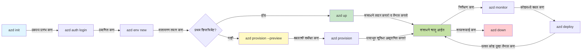
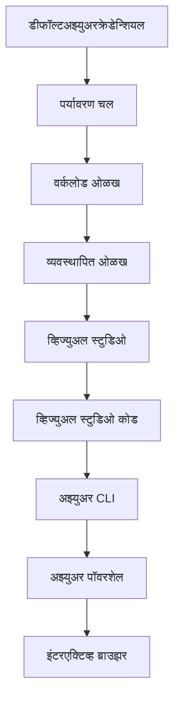

# AZD मूलतत्त्वे - Azure Developer CLI समजून घेणे

# AZD मूलतत्त्वे - मुख्य संकल्पना आणि मूलभूत तत्त्वे

**अध्याय नेव्हिगेशन:**
- **📚 कोर्स होम**: [AZD नवशिक्यांसाठी](../../README.md)
- **📖 चालू अध्याय**: अध्याय 1 - पाया आणि त्वरित सुरुवात
- **⬅️ मागील**: [कोर्स अवलोकन](../../README.md#-chapter-1-foundation--quick-start)
- **➡️ पुढील**: [इंस्टॉलेशन आणि सेटअप](installation.md)
- **🚀 पुढील अध्याय**: [अध्याय 2: AI-फर्स्ट डेव्हलपमेंट](../chapter-02-ai-development/microsoft-foundry-integration.md)

## परिचय

हा धडा तुम्हाला Azure Developer CLI (azd) शी ओळख करुन देतो, एक शक्तिशाली कमांड-लाइन साधन जे स्थानिक विकासातून Azure डिप्लॉयमेंटपर्यंतचा तुमचा प्रवास वेगवान करते. तुम्हाला मूलभूत संकल्पना, मुख्य वैशिष्ट्ये शिकायला मिळतील आणि azd कसे क्लाउड-नेटिव्ह ऍप्लिकेशन डिप्लॉयमेंट सुलभ करते हे समजेल.

## शिकण्याचे उद्दिष्टे

या धड्याच्या शेवटी, तुम्ही:
- Azure Developer CLI म्हणजे काय आणि त्याचा मुख्य उद्देश काय आहे हे समजाल
- टेम्प्लेट्स, एन्व्हायर्नमेंट्स आणि सर्व्हिसेस या मुख्य संकल्पना शिकाल
- टेम्प्लेट-चालित विकास आणि इन्फ्रास्ट्रक्चर एज कोडसह मुख्य वैशिष्ट्ये शोधाल
- azd प्रोजेक्ट रचना आणि वर्कफ्लो समजाल
- तुमच्या विकास एन्व्हायर्नमेंटसाठी azd स्थापित आणि कॉन्फिगर करण्यासाठी तयार व्हाल

## शिकण्याचे परिणाम

हा धडा पूर्ण केल्यानंतर, तुम्ही जे करू शकता:
- आधुनिक क्लाउड विकास वर्कफ्लोमध्ये azd ची भूमिका स्पष्ट करा
- azd प्रोजेक्ट रचनेतील घटक ओळखा
- टेम्प्लेट्स, एन्व्हायर्नमेंट्स आणि सर्व्हिसेस कसे एकत्र काम करतात हे वर्णन करा
- azd सह इन्फ्रास्ट्रक्चर एज कोडचे फायदे समजून घ्या
- वेगवेगळ्या azd कमांड्स आणि त्यांचे उद्देश ओळखा

## Azure Developer CLI (azd) काय आहे?

Azure Developer CLI (azd) हे एक कमांड-लाइन उपकरण आहे जे स्थानिक विकासापासून Azure डिप्लॉयमेंटपर्यंतचा तुमचा प्रवास वेगवान करण्यासाठी डिझाइन केले गेले आहे. हे Azure वर क्लाउड-नेटिव्ह ऍप्लिकेशन्स तयार करणे, डिप्लॉय करणे आणि व्यवस्थापित करणे सोपे करते.

### azd सह तुम्ही काय डिप्लॉय करू शकता?

azd विविध प्रकारच्या वर्कलोडसाठी समर्थन करते—आणि यादी वाढत चालली आहे. आज, azd चा वापर करून तुम्ही डिप्लॉय करू शकता:

| वर्कलोड प्रकार | उदाहरणे | एकसारखा वर्कफ्लो? |
|---------------|----------|----------------|
| **परंपरागत ऍप्लिकेशन्स** | वेब ऍप्स, REST APIs, स्टॅटिक साइट्स | ✅ `azd up` |
| **सर्व्हिसेस आणि मायक्रोसर्व्हिसेस** | कंटेनर ऍप्स, फंक्शन ऍप्स, मल्टी-सर्व्हिस बॅकएंड्स | ✅ `azd up` |
| **AI-सक्षम ऍप्लिकेशन्स** | Microsoft Foundry मॉडेल्ससह चॅट ऍप्स, AI शोधसह RAG सोल्यूशन्स | ✅ `azd up` |
| **बुद्धिमान एजंट** | Foundry-होस्टेड एजंट्स, मल्टी-एजंट ऑर्केस्ट्रेशन्स | ✅ `azd up` |

मुख्य मुद्दा असा की **azd चा लाइफसायकल तुम्ही जे काही डिप्लॉय करत आहात त्यानुसार एकसारखा राहतो**. तुम्ही प्रोजेक्ट इनिशियलाइझ करता, इन्फ्रास्ट्रक्चर पुरवठा करता, तुमचा कोड डिप्लॉय करता, अप्पचे मॉनिटरिंग करता आणि संसाधने साफ करता—ते सोपी वेबसाइट असो किंवा प्रगत AI एजंट.

ही सातत्यपूर्णता डिझाइनद्वारे आहे. azd AI क्षमता तुमच्या ऍप्लिकेशनने वापरू शकणाऱ्या दुसऱ्या प्रकारच्या सर्व्हिस प्रमाणेच वागतं, काही वेगळं नाही. Microsoft Foundry मॉडेल्सने समर्थित चॅट एन्डपोईंट, azd च्या दृष्टीने, फक्त दुसरी सर्व्हिस आहे जी कॉन्फिगर आणि डिप्लॉय करायची आहे.

### 🎯 का वापरावे AZD? एक वास्तविक-जगातील तुलना

आपण एक सोपी वेब ऍप्लिकेशन डेटाबेससह कशी डिप्लॉय करायची याची तुलना करूया:

#### ❌ AZD शिवाय: मॅन्युअल Azure डिप्लॉयमेंट (30+ मिनिटे)

```bash
# पायरी 1: रिसोर्स ग्रुप तयार करा
az group create --name myapp-rg --location eastus

# पायरी 2: अप सेवा योजना तयार करा
az appservice plan create --name myapp-plan \
  --resource-group myapp-rg \
  --sku B1 --is-linux

# पायरी 3: वेब अॅप तयार करा
az webapp create --name myapp-web-unique123 \
  --resource-group myapp-rg \
  --plan myapp-plan \
  --runtime "NODE:18-lts"

# पायरी 4: कॉस्मोस DB खाते तयार करा (10-15 मिनिटे)
az cosmosdb create --name myapp-cosmos-unique123 \
  --resource-group myapp-rg \
  --kind MongoDB

# पायरी 5: डेटाबेस तयार करा
az cosmosdb mongodb database create \
  --account-name myapp-cosmos-unique123 \
  --resource-group myapp-rg \
  --name tododb

# पायरी 6: कलेक्शन तयार करा
az cosmosdb mongodb collection create \
  --account-name myapp-cosmos-unique123 \
  --resource-group myapp-rg \
  --database-name tododb \
  --name todos

# पायरी 7: कनेक्शन स्ट्रिंग मिळवा
CONN_STR=$(az cosmosdb keys list \
  --name myapp-cosmos-unique123 \
  --resource-group myapp-rg \
  --type connection-strings \
  --query "connectionStrings[0].connectionString" -o tsv)

# पायरी 8: अॅप सेटिंग्ज कॉन्फिगर करा
az webapp config appsettings set \
  --name myapp-web-unique123 \
  --resource-group myapp-rg \
  --settings MONGODB_URI="$CONN_STR"

# पायरी 9: लॉगिंग सक्षम करा
az webapp log config --name myapp-web-unique123 \
  --resource-group myapp-rg \
  --application-logging filesystem \
  --detailed-error-messages true

# पायरी 10: अॅप्लिकेशन इन्साइट्स सेट करा
az monitor app-insights component create \
  --app myapp-insights \
  --location eastus \
  --resource-group myapp-rg

# पायरी 11: अॅप इन्साइट्स वेब अॅपशी लिंक करा
INSTRUMENTATION_KEY=$(az monitor app-insights component show \
  --app myapp-insights \
  --resource-group myapp-rg \
  --query "instrumentationKey" -o tsv)

az webapp config appsettings set \
  --name myapp-web-unique123 \
  --resource-group myapp-rg \
  --settings APPINSIGHTS_INSTRUMENTATIONKEY="$INSTRUMENTATION_KEY"

# पायरी 12: स्थानिकपणे अॅप्लिकेशन तयार करा
npm install
npm run build

# पायरी 13: डिप्लॉयमेंट पॅकेज तयार करा
zip -r app.zip . -x "*.git*" "node_modules/*"

# पायरी 14: अॅप्लिकेशन डिप्लॉय करा
az webapp deployment source config-zip \
  --resource-group myapp-rg \
  --name myapp-web-unique123 \
  --src app.zip

# पायरी 15: प्रतीक्षा करा आणि काम होईल अशी प्रार्थना करा 🙏
# (स्वयंचलित पुष्टीकरण नाही, मॅन्युअल चाचणी आवश्यक)
```

**समस्या:**
- ❌ 15+ कमांड्स लक्षात ठेवाव्या आणि क्रमाने चालवाव्या लागतात
- ❌ 30-45 मिनिटे मॅन्युअल काम
- ❌ चुका होणे सोपे (टायपो, चुकीचे पॅरामीटर्स)
- ❌ कनेक्शन स्ट्रिंग्ज टर्मिनल इतिहासात उघडकीस येतात
- ❌ काही अयशस्वी झाल्यास स्वयंचलित रोलबॅक नाही
- ❌ टीम सदस्यांसाठी पुनरुत्पादन करणे कठीण
- ❌ प्रत्येक वेळी वेगळे (पुनरुत्पादनीय नाही)

#### ✅ AZD सह: स्वयंचलित डिप्लॉयमेंट (5 कमांड्स, 10-15 मिनिटे)

```bash
# पायरी 1: टेम्पलेट पासून आरंभी करा
azd init --template todo-nodejs-mongo

# पायरी 2: प्रमाणीकरण करा
azd auth login

# पायरी 3: वातावरण तयार करा
azd env new dev

# पायरी 4: बदल पूर्वावलोकन करा (ऐच्छिक पण शिफारसीय)
azd provision --preview

# पायरी 5: सर्व काही तैनात करा
azd up

# ✨ पूर्ण झाले! सर्व काही तैनात, संरचीत आणि निरीक्षित आहे
```

**फायदे:**
- ✅ **5 कमांड्स** विरुद्ध 15+ मॅन्युअल टप्पे
- ✅ **10-15 मिनिटे** एकूण वेळ (अधिकतर Azure साठी प्रतीक्षा)
- ✅ **कमी मॅन्युअल चुका** - सुसंगत, टेम्प्लेट-चालित वर्कफ्लो
- ✅ **सुरक्षित गुप्त हँडलिंग** - अनेक टेम्प्लेट्स Azure-व्यवस्थित गुप्त संग्रह वापरतात
- ✅ **पुन्हा डिप्लॉय करण्याजोग्या** - प्रत्येक वेळी एकसारखा वर्कफ्लो
- ✅ **पूर्ण पुनरुत्पादनीय** - प्रत्येक वेळी एकसारखा निकाल
- ✅ **टीम-तयार** - कोणालाही एकाच कमांड्सने डिप्लॉय करता येते
- ✅ **इन्फ्रास्ट्रक्चर एज कोड** - व्हर्शन कंट्रोल केलेले Bicep टेम्प्लेट्स
- ✅ **इन-बिल्ट मॉनिटरिंग** - Application Insights आपोआप कॉन्फिगर केले जाते

### 📊 वेळ आणि चूका कमी करणे

| मेट्रिक | मॅन्युअल डिप्लॉयमेंट | AZD डिप्लॉयमेंट | सुधारणा |
|:-------|:------------------|:---------------|:------------|
| **कमांड्स** | 15+ | 5 | 67% कमी |
| **वेळ** | 30-45 मिनिटे | 10-15 मिनिटे | 60% वेगवान |
| **चुका दर** | ~40% | <5% | 88% कपात |
| **सुसंगती** | कमी (मॅन्युअल) | 100% (स्वयंचलित) | परिपूर्ण |
| **टीम ऑनबोर्डिंग** | 2-4 तास | 30 मिनिटे | 75% वेगवान |
| **रोलबॅक वेळ** | 30+ मिनिटे (मॅन्युअल) | 2 मिनिटे (स्वयंचलित) | 93% वेगवान |

## मुख्य संकल्पना

### टेम्प्लेट्स
टेम्प्लेट्स हे azd चे मूलाधार आहेत. यात असते:
- **ऍप्लिकेशन कोड** - तुमचा स्रोत कोड आणि अवलंबित्वे
- **इन्फ्रास्ट्रक्चर परिभाषा** - Bicep किंवा Terraform मध्ये Azure संसाधने परिभाषित
- **कॉन्फिगरेशन फाइल्स** - सेटिंग्ज आणि एन्व्हायर्नमेंट व्हेरिएबल्स
- **डिप्लॉयमेंट स्क्रिप्ट्स** - स्वयंचलित डिप्लॉयमेंट वर्कफ्लोज

### एन्व्हायर्नमेंट्स
एन्व्हायर्नमेंट्स वेगवेगळ्या डिप्लॉयमेंट लक्ष्यांचे प्रतिक आहेत:
- **विकास** - चाचणी आणि विकासासाठी
- **स्टेजिंग** - उत्पादन पूर्व एन्व्हायर्नमेंट
- **उत्पादन** - थेट उत्पादन एन्व्हायर्नमेंट

प्रत्येक एन्व्हायर्नमेंट त्याचं स्वतःचं सांभाळतं:
- Azure रिसोर्स ग्रुप
- कॉन्फिगरेशन सेटिंग्ज
- डिप्लॉयमेंट स्थिती

### सर्व्हिसेस
सर्व्हिसेस तुमच्या ऍप्लिकेशनचे बांधकाम घटक आहेत:
- **फ्रंटेंड** - वेब ऍप्लिकेशन्स, SPAs
- **बॅकेंड** - APIs, मायक्रोसर्व्हिसेस
- **डेटाबेस** - डेटा संग्रह सोल्यूशन्स
- **स्टोरेज** - फाइल आणि ब्लॉब स्टोरेज

## मुख्य वैशिष्ट्ये

### 1. टेम्प्लेट-चालित विकास
```bash
# उपलब्ध साचे ब्राउझ करा
azd template list

# एका साच्यापासून प्रारंभ करा
azd init --template <template-name>
```

### 2. इन्फ्रास्ट्रक्चर एज कोड
- **Bicep** - Azure चे डोमेन-विशिष्ट भाषा
- **Terraform** - मल्टी-क्लाउड इन्फ्रास्ट्रक्चर टूल
- **ARM Templates** - Azure Resource Manager टेम्प्लेट्स

### 3. एकत्रित वर्कफ्लोज
```bash
# पूर्ण वितरण कार्यप्रवाह
azd up            # प्रदान + वितरण हे प्रथम सेटअपसाठी हातमोकळे आहे

# 🧪 नवीन: वितरणापूर्वी इन्फ्रास्ट्रक्चर बदलांची पूर्वावलोकन करा (सुरक्षित)
azd provision --preview    # बदल न करता इन्फ्रास्ट्रक्चर वितरणाचे अनुकरण करा

azd provision     # आपण इन्फ्रास्ट्रक्चर अद्ययावत केल्यास Azure संसाधने तयार करा यासाठी वापरा
azd deploy        # ऍप्लिकेशन कोड वितरीत करा किंवा एकदा अद्ययावत केल्यावर पुन्हा वितरीत करा
azd down          # संसाधने स्वच्छ करा
```

#### 🛡️ पूर्वावलोकनासह सुरक्षित इन्फ्रास्ट्रक्चर नियोजन
`azd provision --preview` कमांड सुरक्षित डिप्लॉयमेंटसाठी क्रांतिकारी आहे:
- **ड्राय-रन विश्लेषण** - काय तयार होईल, सुधारित होईल किंवा मिटवले जाईल हे दाखवते
- **झीरो धोका** - तुमच्या Azure एन्व्हायर्नमेंटमध्ये कोणतेही प्रत्यक्ष बदल होत नाहीत
- **टीम सहकार्य** - डिप्लॉयमेंटपूर्वी पूर्वावलोकन परिणाम शेअर करा
- **खर्च अंदाज** - प्रतिबद्धतेपूर्वी संसाधन खर्च समजून घ्या

```bash
# उदाहरण पूर्वावलोकन कार्यप्रवाह
azd provision --preview           # काय बदल होईल ते पहा
# आऊटपुटचे पुनरावलोकन करा, टीमशी चर्चा करा
azd provision                     # आत्मविश्वासाने बदल लागू करा
```

### 📊 दृश्य: AZD विकास वर्कफ्लो



**वर्कफ्लो स्पष्टीकरण:**
1. **इनिट** - टेम्प्लेट किंवा नवीन प्रोजेक्टसह सुरू करा
2. **ऑथ** - Azure सह प्रमाणीकरण करा
3. **एन्व्हायर्नमेंट** - वेगळा डिप्लॉयमेंट एन्व्हायर्नमेंट तयार करा
4. **पूर्वावलोकन** - 🆕 नेहमी प्रथम इन्फ्रास्ट्रक्चर बदलांची पूर्वावलोकन करा (सुरक्षित पद्धत)
5. **प्रोव्हिजन** - Azure संसाधने तयार/अपडेट करा
6. **डिप्लॉय** - तुमचा ऍप्लिकेशन कोड पुश करा
7. **मॉनिटर** - ऍप्लिकेशन कामगिरी निरीक्षण करा
8. **आयटेरेट** - बदल करा आणि कोड पुन्हा डिप्लॉय करा
9. **स्वच्छता** - काम संपल्यावर संसाधने काढून टाका

### 4. एन्व्हायर्नमेंट व्यवस्थापन
```bash
# वातावरण तयार करा आणि व्यवस्थापित करा
azd env new <environment-name>
azd env select <environment-name>
azd env list
```

### 5. विस्तार व AI कमांड्स

azd मुख्य CLI पेक्षा अधिक क्षमतांसाठी विस्तार प्रणाली वापरते. हे विशेषत: AI वर्कलोडसाठी उपयुक्त आहे:

```bash
# उपलब्ध एक्सटेंशन्सची यादी करा
azd extension list

# फाउंड्री एजंट्स एक्सटेंशन इन्स्टॉल करा
azd extension install azure.ai.agents

# मॅनिफेस्टमधून AI एजंट प्रकल्प प्रारंभ करा
azd ai agent init -m agent-manifest.yaml

# तैनात एजंटची चाचणी करा (लेटन्सी आणि टाइम-टू-फर्स्ट-बाइट दर्शवितो)
azd ai agent invoke

# AI-समर्थित विकासासाठी MCP सर्व्हर सुरू करा (अल्पा)
azd mcp start
```

**एजंटचा लाइफसायकल, सुरूवातीपासून शेवटपर्यंत.** एकदा तुम्ही `azure.ai.agents` स्थापित केल्यावर, एकच वर्कफ्लो तुमच्याला कल्पनेपासून चालू, मॉनिटर केलेल्या एजंटपर्यंत घेऊन जातो. या सर्व गोष्टी पहिल्याच दिवशी आवश्यक नाहीत—फक्त त्यांची माहिती ठेवा:

| टप्पा | कमांड | काय करते |
|-------|---------|--------------|
| **स्कॅफोल्ड** | `azd ai agent init -m <manifest>` | मॅनिफेस्टमधून एजंट प्रोजेक्ट तयार करा |
| **चाचणी** | `azd ai agent invoke` | एजंटला कॉल करा आणि प्रतिसाद काळ पहा |
| **मोजणी** | `azd ai agent eval generate` | एजंटसाठी मूल्यांकन डेटासेट तयार करा |
| **सुधारणा** | `azd ai agent optimize` | तुमच्या डेटावर एजंट सूचना अनुकूलित करा |
| **तपासणी** | `azd ai agent endpoint show` | लाइव्ह एण्डपोईंट कॉन्फिगरेशन पहा |
| **स्वच्छता** | `azd ai agent delete` | होस्टेड एजंट आणि त्याच्या सर्व आवृत्त्या हटवा |

> विस्तारांचा तपशील [अध्याय 2: AI-फर्स्ट डेव्हलपमेंट](../chapter-02-ai-development/agents.md) आणि [AZD AI CLI कमांड्स](../chapter-08-production/production-ai-practices.md#azd-ai-cli-commands-and-extensions) संदर्भ मध्ये दिला आहे.

## 📁 प्रोजेक्ट रचना

एक सामान्य azd प्रोजेक्ट रचना:
```
my-app/
├── .azd/                    # azd configuration
│   └── config.json
├── .azure/                  # Azure deployment artifacts
├── .devcontainer/          # Development container config
├── .github/workflows/      # GitHub Actions
├── .vscode/               # VS Code settings
├── infra/                 # Infrastructure code
│   ├── main.bicep        # Main infrastructure template
│   ├── main.parameters.json
│   └── modules/          # Reusable modules
├── src/                  # Application source code
│   ├── api/             # Backend services
│   └── web/             # Frontend application
├── azure.yaml           # azd project configuration
└── README.md
```

## 🔧 कॉन्फिगरेशन फाइल्स

### azure.yaml
मुख्य प्रोजेक्ट कॉन्फिगरेशन फाइल:
```yaml
name: my-awesome-app
metadata:
  template: my-template@1.0.0

services:
  web:
    project: ./src/web
    language: js
    host: appservice
  api:
    project: ./src/api
    language: js
    host: appservice

hooks:
  preprovision:
    shell: pwsh
    run: echo "Preparing to provision..."
```

### .azure/config.json
एन्व्हायर्नमेंट-विशिष्ट कॉन्फिगरेशन:
```json
{
  "version": 1,
  "defaultEnvironment": "dev",
  "environments": {
    "dev": {
      "subscriptionId": "your-subscription-id",
      "location": "eastus"
    }
  }
}
```

## 🎪 सामान्य वर्कफ्लोज हाताळणीसाठी व्यावहारिक सराव

> **💡 शिकण्याचा टिप:** या सराव क्रमाने करा जेणेकरून तुम्ही तुमच्या AZD कौशल्यांचा क्रमाक्रमाने विकास करू शकाल.

### 🎯 सराव 1: तुमचा पहिला प्रोजेक्ट प्रारंभ करा

**उद्दिष्ट:** एक AZD प्रोजेक्ट तयार करा आणि त्याची रचना पाहा

**पावले:**
```bash
# सिद्ध झालेले टेम्प्लेट वापरा
azd init --template todo-nodejs-mongo

# तयार केलेली फाईल्स तपासा
ls -la  # सर्व फाईल्स पहा, लपवलेल्या फाईल्ससह

# तयार केल्या गेलेल्या मुख्य फाईल्स:
# - azure.yaml (मुख्य कॉन्फिग)
# - infra/ (इन्फ्रास्ट्रक्चर कोड)
# - src/ (अ‍ॅप्लिकेशन कोड)
```

**✅ यश:** तुमच्याकडे azure.yaml, infra/, आणि src/ डिरेक्टरीज आहेत

---

### 🎯 सराव 2: Azure वर डिप्लॉय करा

**उद्दिष्ट:** संपूर्ण एंड-टू-एंड डिप्लॉयमेंट पूर्ण करा

**पावले:**
```bash
# 1. प्रमाणीकरण करा
az login && azd auth login

# 2. वातावरण तयार करा
azd env new dev
azd env set AZURE_LOCATION eastus

# 3. बदलांचे पूर्वावलोकन करा (शिफारस केली आहे)
azd provision --preview

# 4. सर्व काही तैनात करा
azd up

# 5. तैनातीची पडताळणी करा
azd show    # आपल्या अॅपचा URL पहा
```

**अपेक्षित वेळ:** 10-15 मिनिटे  
**✅ यश:** ऍप्लिकेशन URL ब्राउझरमध्ये उघडते

---

### 🎯 सराव 3: अनेक एन्व्हायर्नमेंट्स

**उद्दिष्ट:** विकास आणि स्टेजिंगमध्ये डिप्लॉय करा

**पावले:**
```bash
# आधीपासून dev आहे, staging तयार करा
azd env new staging
azd env set AZURE_LOCATION westus2
azd up

# त्यांच्यात स्विच करा
azd env list
azd env select dev
```

**✅ यश:** Azure पोर्टलमध्ये दोन वेगळ्या रिसोर्स ग्रुप्स

---

### 🛡️ पूर्ण रीसेट: `azd down --force --purge`

जेव्हा तुम्हाला पूर्ण रीसेट करायचा असेल:

```bash
azd down --force --purge
```

**हे काय करते:**
- `--force`: कोणतेही पुष्टीकरण विचारत नाही
- `--purge`: सर्व स्थानिक स्थिती आणि Azure संसाधने हटवते

**कोठें वापरायचे:**
- डिप्लॉयमेंट मधल्या टप्प्यावर अयशस्वी झाले
- प्रोजेक्ट बदलताना
- नवीन सुरुवातीसाठी

---

## 🎪 मूळ वर्कफ्लो संदर्भ

### नवीन प्रोजेक्ट सुरू करणे
```bash
# पद्धत 1: विद्यमान टेम्पलेट वापरा
azd init --template todo-nodejs-mongo

# पद्धत 2: सुरुवातीपासून सुरू करा
azd init

# पद्धत 3: चालू डिरेक्टरी वापरा
azd init .
```

### विकास चक्र
```bash
# विकास वातावरण सेट करा
azd auth login
azd env new dev
azd env select dev

# सर्व काही डिप्लॉय करा
azd up

# बदल करा आणि पुन्हा डिप्लॉय करा
azd deploy

# पूर्ण झाल्यानंतर साफ करा
azd down --force --purge # Azure Developer CLI मधील कमांड तुमच्या वातावरणासाठी **हार्ड रिसेट** आहे - विशेषतः जेव्हा तुम्ही अपयशी डिप्लॉयमेंट्सचे त्रुटी निराकरण करत असता, अनाथ संसाधने साफ करत असता किंवा नवीन डिप्लॉयमेंटसाठी तयारी करत असता तेव्हा उपयुक्त आहे.
```

## `azd down --force --purge` समजून घेणे
`azd down --force --purge` कमांड तुमचे azd एन्व्हायर्नमेंट आणि संबंधित सर्व संसाधने पूर्णपणे काढून टाकण्यासाठी एक शक्तिशाली मार्ग आहे. प्रत्येक फ्लॅग काय करतो याचा आढावा:
```
--force
```
- पुष्टीकरणांच्या विचारणा टाळते.
- ऑटोमेशन किंवा स्क्रिप्टिंगसाठी उपयुक्त जिथे मॅन्युअल इनपुट शक्य नाही.
- CLI मध्ये विसंगती सापडल्या तरीही अडथळा न आणता हटविणे सुनिश्चित करते.

```
--purge
```
सर्व संबंधित मेटाडेटा हटवते, ज्यात समाविष्ट आहे:
एन्व्हायर्नमेंट स्थिती
स्थानिक `.azure` फोल्डर
कॅश्ड डिप्लॉयमेंट माहिती
azd ला पूर्वीच्या डिप्लॉयमेंटस "स्मरायला" परवानगी देत नाही, ज्यामुळे रिसोर्स ग्रुप्स जुळत नाहीत किंवा जुने रेजिस्ट्री संदर्भ यांसारख्या समस्या होऊ शकतात.


### दोन्ही का वापरावे?
जेव्हा तुम्हाला `azd up` सह काही अडचणी येतात, जी अवशेष स्थिती किंवा अर्धवट डिप्लॉयमेंटमुळे होतात, तेव्हा हा कंबो एक **स्वच्छ प्रारंभ** सुनिश्चित करतो.

हा विशेषतः Azure पोर्टलमध्ये मॅन्युअल संसाधन वळविल्यानंतर किंवा टेम्प्लेट्स, एन्व्हायर्नमेंट्स, किंवा रिसोर्स ग्रुप नावे बदलताना उपयुक्त आहे.


### अनेक एन्व्हायर्नमेंट्सचे व्यवस्थापन
```bash
# स्टेजिंग वातावरण तयार करा
azd env new staging
azd env select staging
azd up

# पुन्हा डेव्हलपमेंटकडे स्विच करा
azd env select dev

# वातावरणांची तुलना करा
azd env list
```

## 🔐 प्रमाणीकरण आणि क्रेडेन्शियल्स

यशस्वी azd डिप्लॉयमेंटसाठी प्रमाणीकरण समजणे अत्यंत महत्त्वाचे आहे. Azure विविध प्रमाणीकरण पद्धती वापरतो, आणि azd इतर Azure साधनांनी वापरलेली एकसारखी क्रेडेन्शियल चेन वापरतो.

### Azure CLI प्रमाणीकरण (`az login`)

azd वापरण्यापूर्वी, तुम्हाला Azure सह प्रमाणीकरण करणे आवश्यक आहे. सर्वात सामान्य पद्धत Azure CLI वापरणे आहे:

```bash
# इंटरॅक्टिव लॉगिन (ब्राउझर उघडतो)
az login

# विशिष्ट टेनंटसह लॉगिन करा
az login --tenant <tenant-id>

# सर्व्हिस प्रिन्सिपलसह लॉगिन करा
az login --service-principal -u <app-id> -p <password> --tenant <tenant-id>

# सध्याच्या लॉगिन स्थितीची तपासणी करा
az account show

# उपलब्ध सदस्यता यादी करा
az account list --output table

# डीफॉल्ट सदस्यता सेट करा
az account set --subscription <subscription-id>
```

### प्रमाणीकरण प्रवाह
1. **इंटरॅक्टिव्ह लॉगिन**: प्रमाणीकरणासाठी तुमचा डिफॉल्ट ब्राउझर उघडतो
2. **डिव्हाइस कोड फ्लो**: ब्राउझर प्रवेश नसलेल्या एन्व्हायर्नमेंटसाठी
3. **सर्व्हिस प्रिन्सिपल**: ऑटोमेशन आणि CI/CD परिस्थितीसाठी
4. **मॅनेज्ड आयडेंटिटी**: Azure-होस्टेड ऍप्लिकेशन्ससाठी

### DefaultAzureCredential चेन

`DefaultAzureCredential` ही एक क्रेडेन्शियल टाइप आहे जी सुलभ प्रमाणीकरण अनुभव देते, विशिष्ट क्रमाने अनेक क्रेडेन्शियल स्रोत आपोआप वापरून तपासणी करते:

#### क्रेडेन्शियल चेन क्रम


#### 1. एन्व्हायर्नमेंट व्हेरिएबल्स
```bash
# सेवा प्राचार्यासाठी पर्यावरणीय चल सेट करा
export AZURE_CLIENT_ID="<app-id>"
export AZURE_CLIENT_SECRET="<password>"
export AZURE_TENANT_ID="<tenant-id>"
```

#### 2. वर्कलोड आयडेंटिटी (Kubernetes/GitHub Actions)
स्वयंचलित वापर:
- Azure Kubernetes Service (AKS) सह वर्कलोड आयडेंटिटी
- GitHub Actions सह OIDC फेडरेशन
- इतर फेडरेटेड आयडेंटिटी परिस्थिती

#### 3. मॅनेज्ड आयडेंटिटी
Azure संसाधनांसाठी जसे की:
- व्हर्च्युअल मशीन
- ऍप सर्व्हिस
- Azure फंक्शन्स
- कंटेनर इंसटन्सेस

```bash
# व्यवस्थापित ओळखीने Azure संसाधनावर चालत असल्याची तपासणी करा
az account show --query "user.type" --output tsv
# परत देते: त्याचा वापर केल्यास "सेवा प्रिंसिपल"
```

#### 4. डेव्हलपर टूल्स इंटिग्रेशन
- **Visual Studio**: स्वयंचलितपणे साइन-इन केलेले खाते वापरते
- **VS Code**: Azure Account एक्सटेंशन क्रेडेन्शियल वापरते
- **Azure CLI**: `az login` क्रेडेन्शियल वापरते (स्थानिक विकासासाठी सर्वात सामान्य)

### AZD प्रमाणीकरण सेटअप

```bash
# पद्धत 1: Azure CLI वापरा (विकासासाठी शिफारस केलेले)
az login
azd auth login  # विद्यमान Azure CLI प्रमाणपत्रे वापरते

# पद्धत 2: थेट azd प्रमाणीकरण
azd auth login --use-device-code  # हेडलेस वातावरणासाठी

# पद्धत 3: प्रमाणीकरण स्थिती तपासा
azd auth login --check-status

# पद्धत 4: लॉगआऊट करा आणि पुन्हा प्रमाणीकरण करा
azd auth logout
azd auth login
```

### प्रमाणीकरण सर्वोत्तम पद्धती

#### स्थानिक विकासासाठी

```bash
# 1. Azure CLI सह लॉगिन करा
az login

# 2. योग्य सबस्क्रिप्शन तपासा
az account show
az account set --subscription "Your Subscription Name"

# 3. विद्यमान प्रमाणीकरणांसह azd वापरा
azd auth login
```

#### CI/CD पाइपलाइन्ससाठी
```yaml
# GitHub Actions example
- name: Azure Login
  uses: azure/login@v1
  with:
    creds: ${{ secrets.AZURE_CREDENTIALS }}

- name: Deploy with azd
  run: |
    azd auth login --client-id ${{ secrets.AZURE_CLIENT_ID }} \
                    --client-secret ${{ secrets.AZURE_CLIENT_SECRET }} \
                    --tenant-id ${{ secrets.AZURE_TENANT_ID }}
    azd up --no-prompt
```

#### प्रॉडक्शन वातावरणासाठी
- Azure संसाधनांवर चालवताना **Managed Identity** वापरा
- ऑटोमेशन परिस्थितीसाठी **Service Principal** वापरा
- कोड किंवा कॉन्फिगरेशन फाइल्समध्ये क्रेडेन्शियल्स साठवणे टाळा
- संवेदनशील कॉन्फिगरेशनसाठी **Azure Key Vault** वापरा

### सामान्य प्रमाणीकरण समस्या आणि उपाय

#### समस्या: "No subscription found"
```bash
# उपाय: डीफॉल्ट सदस्यता सेट करा
az account list --output table
az account set --subscription "<subscription-id>"
azd env set AZURE_SUBSCRIPTION_ID "<subscription-id>"
```

#### समस्या: "Insufficient permissions"
```bash
# समाधान: आवश्यक भूमिका तपासा आणि नियुक्त करा
az role assignment list --assignee $(az account show --query user.name --output tsv)

# सामान्य आवश्यक भूमिका:
# - योगदानकर्ता (संसाधन व्यवस्थापनासाठी)
# - वापरकर्ता प्रवेश प्रशासक (भूमिका नियुक्तीसाठी)
```

#### समस्या: "Token expired"
```bash
# उपाय: पुन्हा प्रमाणीकरण करा
az logout
az login
azd auth logout
azd auth login
```

### विविध परिस्थितींमध्ये प्रमाणीकरण

#### स्थानिक विकास
```bash
# वैयक्तिक विकास खातं
az login
azd auth login
```

#### टीम विकास
```bash
# संस्थेसाठी विशिष्ट भाडेकरू वापरा
az login --tenant contoso.onmicrosoft.com
azd auth login
```

#### मल्टी-टेनेन्ट परिस्थिती
```bash
# भाडेकरू यांच्यात स्विच करा
az login --tenant tenant1.onmicrosoft.com
# भाडेकरू १ ला तैनात करा
azd up

az login --tenant tenant2.onmicrosoft.com  
# भाडेकरू २ ला तैनात करा
azd up
```

### सुरक्षा विचार

1. **क्रेडेन्शियल स्टोरेज**: क्रेडेन्शियल्स कधीही स्रोत कोडमध्ये साठवू नका
2. **स्कोप मर्यादा**: सर्व्हिस प्रिन्सिपलसाठी किमान अधिकार सिद्धांत वापरा
3. **टोकन फिरवणूक**: नियमितपणे सर्व्हिस प्रिन्सिपल सीक्रेट्स फिरवा
4. **ऑडिट ट्रेल**: प्रमाणीकरण आणि तैनाती क्रियाकलापांचे नियंत्रण करा
5. **नेटवर्क सुरक्षा**: शक्य असेल तेव्हा खाजगी एंडपॉइंट वापरा

### प्रमाणीकरणातील समस्या सोडवणे

```bash
# प्रमाणीकरण समस्या डीबग करा
azd auth login --check-status
az account show
az account get-access-token

# सामान्य निदान आदेश
whoami                          # वर्तमान वापरकर्ता संदर्भ
az ad signed-in-user show      # मायक्रोसॉफ्ट एंत्रा आयडी वापरकर्ता तपशील
az group list                  # संसाधन प्रवेश चाचणी करा
```

## `azd down --force --purge` चे समजणे

### शोध
```bash
azd template list              # टेम्पलेट ब्राउझ करा
azd template show <template>   # टेम्पलेट तपशील
azd init --help               # प्रारंभिक पर्याय
```

### प्रोजेक्ट व्यवस्थापन
```bash
azd show                     # प्रकल्प आढावा
azd env list                # उपलब्ध पर्याय आणि निवडलेले डीफॉल्ट
azd config show            # संरचना सेटिंग्ज
```

### मॉनिटरिंग
```bash
azd monitor                  # Azure पोर्टल मॉनिटरिंग उघडा
azd monitor --logs           # अनुप्रयोग लॉग पहा
azd monitor --live           # थेट मेट्रिक्स पहा
azd pipeline config          # CI/CD सेट करा
```

## सर्वोत्तम पद्धती

### 1. अर्थपूर्ण नावे वापरा
```bash
# चांगले
azd env new production-east
azd init --template web-app-secure

# टाळा
azd env new env1
azd init --template template1
```

### 2. टेम्पलेट्सचा लाभ घ्या
- विद्यमान टेम्पलेट्सपासून सुरुवात करा
- तुमच्या गरजेनुसार सानुकूल करा
- तुमच्या संस्थेसाठी पुनर्निर्माणयोग्य टेम्पलेट्स तयार करा

### 3. वातावरण अलग करा
- dev/staging/prod साठी स्वतंत्र वातावरण वापरा
- स्थानिक मशीनवरून थेट प्रॉडक्शनमध्ये कधीही तैनात करू नका
- प्रॉडक्शन तैनातीसाठी CI/CD पाइपलाइन वापरा

### 4. कॉन्फिगरेशन व्यवस्थापन
- संवेदनशील डेटासाठी पर्यावरण चल (environment variables) वापरा
- कॉन्फिगरेशन व्हर्जन नियंत्रणात ठेवा
- वातावरण-विशिष्ट सेटिंग्ज दस्तऐवजीकरण करा

## शिकण्याची प्रगती

### प्रारंभिक (सप्ताह १-२)
1. azd इन्स्टॉल करा आणि प्रमाणीकरण करा
2. साधा टेम्पलेट तैनात करा
3. प्रोजेक्ट रचना समजून घ्या
4. मूलभूत आदेश शिका (up, down, deploy)

### मध्यम (सप्ताह ३-४)
1. टेम्पलेट सानुकूल करा
2. अनेक वातावरण व्यवस्थापित करा
3. इन्फ्रास्ट्रक्चर कोड समजून घ्या
4. CI/CD पाइपलाइन सेट करा

### प्रगत (सप्ताह ५+)
1. सानुकूल टेम्पलेट तयार करा
2. प्रगत इन्फ्रास्ट्रक्चर पॅटर्न
3. मल्टी-रीजन तैनाती
4. एंटरप्राइज-ग्रेड कॉन्फिगरेशन

## पुढील टप्पे

**📖 पुढे चालू ठेवा अध्याय 1 शिकण्यास:**
- [Installation & Setup](installation.md) - azd इन्स्टॉल करा आणि कॉन्फिगर करा
- [Your First Project](first-project.md) - हँड्स-ऑन ट्यूटोरियल पूर्ण करा
- [Configuration Guide](configuration.md) - प्रगत कॉन्फिगरेशन पर्याय

**🎯 पुढील अध्यायासाठी तयार आहात?**
- [Chapter 2: AI-First Development](../chapter-02-ai-development/microsoft-foundry-integration.md) - AI अनुप्रेक्षा बनवायला सुरूवात करा

## अतिरिक्त संसाधने

- [Azure Developer CLI Overview](https://learn.microsoft.com/en-us/azure/developer/azure-developer-cli/)
- [Template Gallery](https://azure.github.io/awesome-azd/)
- [Community Samples](https://github.com/Azure-Samples)

---

## 🙋 वारंवार विचारले जाणारे प्रश्न

### सामान्य प्रश्न

**प्रश्न: AZD आणि Azure CLI मध्ये काय फरक आहे?**

उत्तर: Azure CLI (`az`) हे स्वतंत्र Azure संसाधने व्यवस्थापित करण्यासाठी आहे. AZD (`azd`) हे संपूर्ण अनुप्रयोग व्यवस्थापित करण्यासाठी आहे:

```bash
# Azure CLI - खालच्या स्तरावरील संसाधन व्यवस्थापन
az webapp create --name myapp --resource-group rg
az sql server create --name myserver --resource-group rg
# ...अधिक अनेक आदेश आवश्यक आहेत

# AZD - अनुप्रयोग-स्तरीय व्यवस्थापन
azd up  # सर्व संसाधनांसह संपूर्ण अॅप तैनात करतो
```

**याप्रमाणे समजा:**
- `az` = वेगवेगळ्या लेगो विटा हाताळणे
- `azd` = पूर्ण लेगो सेट्ससह काम करणे

---

**प्रश्न: AZD वापरण्यासाठी मला Bicep किंवा Terraform जाणून घ्यावा लागेल का?**

उत्तर: नाही! टेम्पलेट्स वापरून सुरुवात करा:
```bash
# विद्यमान टेम्प्लेट वापरा - IaC ज्ञान आवश्यक नाही
azd init --template todo-nodejs-mongo
azd up
```

नंतर तुम्ही Bicep शिकून इन्फ्रास्ट्रक्चर सानुकूल करू शकता. टेम्पलेट्स शिकण्यास मदत करणारे काम करणारे उदाहरणे देतात.

---

**प्रश्न: AZD टेम्पलेट्स चालवण्यासाठी किती खर्च येतो?**

उत्तर: टेम्पलेटनुसार खर्च बदलतो. बहुतेक विकास टेम्पलेट्सची किंमत $50-150/महिना आहे:

```bash
# तैनात करण्यापूर्वी खर्चाचा आढावा घ्या
azd provision --preview

# वापरात नसताना नेहमी स्वच्छता करा
azd down --force --purge  # सर्व संसाधने हटवते
```

**प्रो टिप:** जिथे फ्री टियर उपलब्ध, तिकडे वापरा:
- App Service: F1 (फ्री) टियर
- Microsoft Foundry Models: Azure OpenAI 50,000 टोकन/महिना फ्री
- Cosmos DB: 1000 RU/s फ्री टियर

---

**प्रश्न: मी AZD विद्यमान Azure संसाधनांबरोबर वापरू शकतो का?**

उत्तर: होय, पण सुरुवात नवीन करून करणे सोपे आहे. AZD सर्व आयुष्यचक्र व्यवस्थापित करताना उत्तम कार्य करते. विद्यमान संसाधनेसाठी:

```bash
# पर्याय 1: विद्यमान संसाधने आयात करा (अत्याधुनिक)
azd init
# मग infra/ मधील सुधारणा करा जेणेकरून विद्यमान संसाधनांचे संदर्भ असतील

# पर्याय 2: नवीन प्रारंभ करा (शिफारस केलेले)
azd init --template matching-your-stack
azd up  # नवीन वातावरण तयार करते
```

---

**प्रश्न: माझा प्रोजेक्ट टीममेट्ससोबत कसा शेअर करावा?**

उत्तर: AZD प्रोजेक्ट Git मध्ये कमिट करा (पण .azure फोल्डर नाही):

```bash
# आधीच .gitignore मध्ये आहे
.azure/        # रहस्ये आणि पर्यावरण डेटा समाविष्ट करतो
*.env          # पर्यावरण चल

# टीम सदस्य नंतर:
git clone <your-repo>
azd auth login
azd env new <their-name>-dev
azd up
```

सर्वांना समान टेम्पलेट्समधून सारखे इन्फ्रास्ट्रक्चर मिळते.

---

### समस्या सोडवण्याचे प्रश्न

**प्रश्न: "azd up" मधल्या मार्गदर्शनाने अयशस्वी झाला. मी काय करावे?**

उत्तर: त्रुटी तपासा, दुरुस्त करा, मग पुन्हा प्रयत्न करा:

```bash
# तपशीलवार लॉग पहा
azd show

# सामान्य दुरुस्त्या:

# 1. जर कोटा ओलांडला असेल:
azd env set AZURE_LOCATION "westus2"  # वेगळ्या प्रदेशाचा प्रयत्न करा

# 2. जर संसाधन नावात संघर्ष असेल:
azd down --force --purge  # साफ सुरुवात करा
azd up  # पुन्हा प्रयत्न करा

# 3. जर प्रमाणीकरण कालबाह्य झाले असेल:
az login
azd auth login
azd up
```

**सर्वसामान्य समस्या:** चुकीचा Azure सबस्क्रिप्शन निवडलेला
```bash
az account list --output table
az account set --subscription "<correct-subscription>"
```

---

**प्रश्न: केवळ कोड बदल तैनात करू कसा शकतो, रि-प्रोव्हिजन न करता?**

उत्तर: `azd up` च्या ऐवजी `azd deploy` वापरा:

```bash
azd up          # प्रथम वेळ: पुरवठा + तैनात करणे (मंद)

# कोड बदल करा...

azd deploy      # पुढील वेळा: केवळ तैनात करणे (जलद)
```

वेग तुलना:
- `azd up`: १०-१५ मिनिटे (इन्फ्रास्ट्रक्चर तयार करतो)
- `azd deploy`: २-५ मिनिटे (केवळ कोड)

---

**प्रश्न: मी इन्फ्रास्ट्रक्चर टेम्पलेट्स सानुकूल करू शकतो का?**

उत्तर: होय! `infra/` मधील Bicep फाइल्स संपादित करा:

```bash
# azd init नंतर
cd infra/
code main.bicep  # VS कोड मध्ये संपादित करा

# बदल पूर्वावलोकन करा
azd provision --preview

# बदल लागू करा
azd provision
```

**टिप:** छोट्या प्रमाणावर सुरुवात करा - आधी SKU बदला:
```bicep
// infra/main.bicep
sku: {
  name: 'B1'  // Change to 'P1V2' for production
}
```

---

**प्रश्न: मी AZD ने तयार केलेले सर्वकाही कसे हटवू?**

उत्तर: एकच कमांड सर्व संसाधने काढून टाकते:

```bash
azd down --force --purge

# हे delete करते:
# - सर्व Azure संसाधने
# - संसाधन गट
# - स्थानिक पर्यावरण स्थिती
# - कॅश केलेला deployment डेटा
```

**हा आदेश वापरा जेव्हा:**
- एखादा टेम्पलेट तपासणी पूर्ण झाली असेल
- वेगळ्या प्रोजेक्टवर स्विच करत असाल
- नवीन सुरुवात करायची असेल

**खर्च बचत:** वापरात नसलेली संसाधने हटविल्यास $0 शुल्क

---

**प्रश्न: जर मी चुकून Azure पोर्टलमधील संसाधने हटविली तर काय?**

उत्तर: AZD स्थिती विसंगत होऊ शकते. स्वच्छ सुरुवात करण्यासाठी:

```bash
# 1. स्थानिक स्थिती काढा
azd down --force --purge

# 2. नवीन सुरुवात करा
azd up

# पर्यायी: AZD ला शोधून दुरुस्त करू द्या
azd provision  # उरलेले साधने तयार करेल
```

---

### प्रगत प्रश्न

**प्रश्न: मी CI/CD पाइपलाइन्समध्ये AZD वापरू शकतो का?**

उत्तर: होय! GitHub क्रियाकलापांचे उदाहरण:

```yaml
# .github/workflows/deploy.yml
name: Deploy with AZD

on:
  push:
    branches: [main]

jobs:
  deploy:
    runs-on: ubuntu-latest
    steps:
      - uses: actions/checkout@v2
      
      - name: Install azd
        run: curl -fsSL https://aka.ms/install-azd.sh | bash
      
      - name: Azure Login
        run: |
          azd auth login \
            --client-id ${{ secrets.AZURE_CLIENT_ID }} \
            --client-secret ${{ secrets.AZURE_CLIENT_SECRET }} \
            --tenant-id ${{ secrets.AZURE_TENANT_ID }}
      
      - name: Deploy
        run: azd up --no-prompt
```

---

**प्रश्न: मी रहस्ये आणि संवेदनशील डेटा कसा हाताळू?**

उत्तर: AZD आपोआप Azure Key Vault शी समाकलित होते:

```bash
# रहस्य कोडमध्ये नाही तर की वॉल्टमध्ये साठवले जातात
azd env set DATABASE_PASSWORD "$(openssl rand -base64 32)"

# AZD स्वयंचलितपणे:
# 1. की वॉल्ट तयार करते
# 2. रहस्य साठवते
# 3. मॅनेज्ड आयडेंटिटीद्वारे अ‍ॅप प्रवेश देते
# 4. रनटाइममध्ये समाविष्ट करते
```

**कधीही कमिट करू नका:**
- `.azure/` फोल्डर (पर्यावरण डेटा आहे)
- `.env` फायली (स्थानिक रहस्ये)
- कनेक्शन स्ट्रिंग्ज

---

**प्रश्न: मी अनेक प्रदेशांमध्ये तैनात करू शकतो का?**

उत्तर: होय, प्रदेशानुसार स्वतंत्र वातावरण तयार करा:

```bash
# पूर्व अमेरिका वातावरण
azd env new prod-eastus
azd env set AZURE_LOCATION eastus
azd up

# पश्चिम युरोप वातावरण
azd env new prod-westeurope
azd env set AZURE_LOCATION westeurope
azd up

# प्रत्येक वातावरण स्वतंत्र आहे
azd env list
```

खऱ्या मल्टी-रीजन अॅप्ससाठी Bicep टेम्पलेट्स सानुकूल करून एकाच वेळी अनेक प्रदेशात तैनात करा.

---

**प्रश्न: मला मदत कुठे मिळू शकते जर मी अडकलेलो असलो?**

1. **AZD दस्तऐवज:** https://learn.microsoft.com/azure/developer/azure-developer-cli/
2. **GitHub Issues:** https://github.com/Azure/azure-dev/issues
3. **Discord:** [Azure Discord](https://discord.gg/microsoft-azure) - #azure-developer-cli चॅनेल
4. **Stack Overflow:** टॅग `azure-developer-cli`
5. **हा कोर्स:** [Troubleshooting Guide](../chapter-07-troubleshooting/common-issues.md)

**प्रो टिप:** प्रश्न विचारण्यापूर्वी चालवा:
```bash
azd show       # वर्तमान स्थिती दाखविते
azd version    # आपला आवृत्ती दाखविते
```
जलद मदतीसाठी तुमच्या प्रश्नात ही माहिती समाविष्ट करा.

---

## 🎓 पुढे काय?

तुम्हाला आता AZD ची मूलतत्त्वे समजली आहेत. तुमचा मार्ग निवडा:

### 🎯 नवशिक्यांसाठी:
1. **पुढे:** [Installation & Setup](installation.md) - AZD तुमच्या संगणकावर इन्स्टॉल करा
2. **मग:** [Your First Project](first-project.md) - तुमचा पहिला अॅप तैनात करा
3. **सराव:** या धड्यातील सर्व ३ व्यायाम पूर्ण करा

### 🚀 AI डेव्हलपर्ससाठी:
1. **थेट जा:** [Chapter 2: AI-First Development](../chapter-02-ai-development/microsoft-foundry-integration.md)
2. **तैनात करा:** `azd init --template get-started-with-ai-chat` पासून सुरुवात करा
3. **शिका:** तैनाती दरम्यान बांधकाम करा

### 🏗️ अनुभवी डेव्हलपर्ससाठी:
1. **पुनरावलोकन:** [Configuration Guide](configuration.md) - प्रगत सेटिंग्ज
2. **शोध:** [Infrastructure as Code](../chapter-04-infrastructure/provisioning.md) - Bicep सखोल अभ्यास
3. **बांधा:** तुमच्या स्टॅकसाठी सानुकूल टेम्पलेट तयार करा

---

**अध्याय नेव्हिगेशन:**
- **📚 कोर्स होम**: [AZD नवशिक्यांसाठी](../../README.md)
- **📖 चालू अध्याय**: अध्याय 1 - मूलतत्त्वे आणि वेगवान सुरुवात  
- **⬅️ मागील**: [कोर्स आढावा](../../README.md#-chapter-1-foundation--quick-start)
- **➡️ पुढील**: [Installation & Setup](installation.md)
- **🚀 पुढील अध्याय**: [Chapter 2: AI-First Development](../chapter-02-ai-development/microsoft-foundry-integration.md)

---

<!-- CO-OP TRANSLATOR DISCLAIMER START -->
**अस्वीकरण**:
हा दस्तऐवज AI भाषांतर सेवा [Co-op Translator](https://github.com/Azure/co-op-translator) चा वापर करून अनुवादित केला आहे. जरी आम्ही अचूकतेसाठी प्रयत्न करतो, तरी कृपया लक्षात घ्या की स्वयंचलित भाषांतरांमध्ये त्रुटी किंवा अचूकतेची कमतरता असू शकते. मूळ दस्तऐवज त्याच्या मूळ भाषेत अधिकृत स्रोत मानला पाहिजे. महत्त्वाची माहिती असल्यास, व्यावसायिक मानवी भाषांतराची शिफारस केली जाते. या भाषांतराच्या वापरामुळे उद्भवणाऱ्या कोणत्याही गैरसमज किंवा चुकीच्या अर्थलावणीसाठी आम्ही जबाबदार नाही.
<!-- CO-OP TRANSLATOR DISCLAIMER END -->