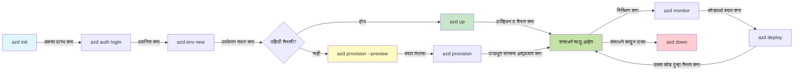
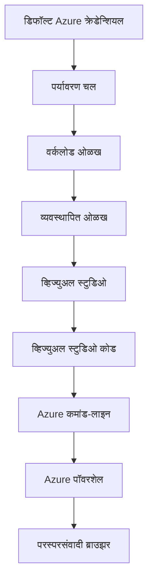

# AZD मूलभूत गोष्टी - Azure Developer CLI समजून घेणे

# AZD मूलभूत गोष्टी - मुख्य संकल्पना आणि प्राथमिकतत्त्वे

**Chapter Navigation:**
- **📚 Course Home**: [AZD For Beginners](../../README.md)
- **📖 Current Chapter**: Chapter 1 - Foundation & Quick Start
- **⬅️ Previous**: [Course Overview](../../README.md#-chapter-1-foundation--quick-start)
- **➡️ Next**: [Installation & Setup](installation.md)
- **🚀 Next Chapter**: [Chapter 2: AI-First Development](../chapter-02-ai-development/microsoft-foundry-integration.md)

## परिचय

हा धडा तुम्हाला Azure Developer CLI (azd) शी ओळख करून देतो, एक शक्तिशाली कमांड-लाइन साधन जे स्थानिक विकासापासून Azure वर तैनात करण्यापर्यंतचा प्रवास वेगवान करते. तुम्ही मूलभूत संकल्पना, मुख्य वैशिष्ट्ये शिकलात आणि azd क्लाउड-नेटिव्ह अनुप्रयोग तैनात करण्यास कसे सुलभ करते हे समजू शकाल.

## शिकण्याची उद्दिष्टे

या धड्याच्या शेवटी, तुम्ही:
- Azure Developer CLI काय आहे आणि त्याचा प्राथमिक उद्देश काय आहे हे समजाल
- टेम्पलेट्स, वातावरणे, आणि सेवा या मुख्य संकल्पना शिकलात
- टेम्पलेट-चालित विकास आणि Infrastructure as Code यांसह प्रमुख वैशिष्ट्ये एक्सप्लोर कराल
- azd प्रोजेक्ट संरचना आणि कार्यप्रवाह समजून घ्याल
- विकासासाठी azd कसे इंस्टॉल आणि कॉन्फिगर करायचे यासाठी तयार असाल

## शिकल्यावर काय मिळेल

या धडा पूर्ण केल्यानंतर, तुम्ही सक्षम असाल:
- आधुनिक क्लाउड विकास कार्यप्रवाहांमध्ये azd ची भूमिका स्पष्ट करणे
- azd प्रोजेक्ट संरचनेचे घटक ओळखणे
- टेम्पलेट्स, वातावरणे आणि सेवा कसे एकत्र काम करतात हे वर्णन करणे
- azd सह Infrastructure as Code चे फायदे समजणे
- विविध azd कमांड्स आणि त्यांचे उद्देश ओळखणे

## Azure Developer CLI (azd) म्हणजे काय?

Azure Developer CLI (azd) हे एक कमांड-लाइन साधन आहे जे स्थानिक विकासापासून Azure तैनात करण्यापर्यंतचा प्रवास गतीमान करण्यासाठी डिझाइन केले आहे. हे Azure वर क्लाउड-नेटिव्ह अनुप्रयोग तयार करणे, तैनात करणे आणि व्यवस्थापित करणे सुलभ करते.

### azd द्वारे तुम्ही काय तैनात करू शकता?

azd अनेक प्रकारच्या वर्कलोडसना समर्थन करते — आणि यादी सतत वाढत आहे. आज, तुम्ही azd वापरून तैनात करू शकता:

| Workload Type | Examples | Same Workflow? |
|---------------|----------|----------------|
| **Traditional applications** | Web apps, REST APIs, static sites | ✅ `azd up` |
| **Services and microservices** | Container Apps, Function Apps, multi-service backends | ✅ `azd up` |
| **AI-powered applications** | Chat apps with Microsoft Foundry Models, RAG solutions with AI Search | ✅ `azd up` |
| **Intelligent agents** | Foundry-hosted agents, multi-agent orchestrations | ✅ `azd up` |

महत्त्वाचं निरीक्षण म्हणजे की **तुम्ही जे काही तैनात करत आहात त्यापासून स्वतंत्रपणे azd जीवनचक्र एकसारखा राहतो**. तुम्ही प्रोजेक्ट इनिशियलाइझ करता, इन्फ्रास्ट्रक्चर प्रोव्हिजन करता, तुमचा कोड तैनात करता, तुमचे अॅप मॉनिटर करता आणि क्लीनअप करता — ते संकेतस्थळ असो किंवा जटिल AI एजंट असो.

ही सातत्य डिझाइननुसार intentional आहे. azd AI क्षमता हा तुमच्या अनुप्रयोगाने वापरू शकणाऱ्या दुसऱ्या प्रकारच्या सेवेसारखा वागवते, काहीतरी मूलभूत वेगळं नसून. Microsoft Foundry Models द्वारा समर्थित चॅट एंडपॉइंट azd च्या दृष्टीने फक्त एक अतिरिक्त सेवा आहे ज्याचे कॉन्फिगर आणि तैनात करायचे असते.

### 🎯 का वापरावे AZD? वास्तविक जगातील तुलना

चलो एक साधे वेब अॅप आणि डेटाबेस तैनात करण्याची तुलना करूया:

#### ❌ AZD शिवाय: मॅन्युअल Azure तैनात (30+ मिनिटे)

```bash
# चरण 1: संसाधन गट तयार करा
az group create --name myapp-rg --location eastus

# चरण 2: अॅप सर्व्हिस प्लॅन तयार करा
az appservice plan create --name myapp-plan \
  --resource-group myapp-rg \
  --sku B1 --is-linux

# चरण 3: वेब अॅप तयार करा
az webapp create --name myapp-web-unique123 \
  --resource-group myapp-rg \
  --plan myapp-plan \
  --runtime "NODE:18-lts"

# चरण 4: Cosmos DB खाते तयार करा (10-15 मिनिटे)
az cosmosdb create --name myapp-cosmos-unique123 \
  --resource-group myapp-rg \
  --kind MongoDB

# चरण 5: डेटाबेस तयार करा
az cosmosdb mongodb database create \
  --account-name myapp-cosmos-unique123 \
  --resource-group myapp-rg \
  --name tododb

# चरण 6: कलेक्शन तयार करा
az cosmosdb mongodb collection create \
  --account-name myapp-cosmos-unique123 \
  --resource-group myapp-rg \
  --database-name tododb \
  --name todos

# चरण 7: कनेक्शन स्ट्रिंग मिळवा
CONN_STR=$(az cosmosdb keys list \
  --name myapp-cosmos-unique123 \
  --resource-group myapp-rg \
  --type connection-strings \
  --query "connectionStrings[0].connectionString" -o tsv)

# चरण 8: अॅप सेटिंग्ज कॉन्फिगर करा
az webapp config appsettings set \
  --name myapp-web-unique123 \
  --resource-group myapp-rg \
  --settings MONGODB_URI="$CONN_STR"

# चरण 9: लॉगिंग सक्षम करा
az webapp log config --name myapp-web-unique123 \
  --resource-group myapp-rg \
  --application-logging filesystem \
  --detailed-error-messages true

# चरण 10: Application Insights सेटअप करा
az monitor app-insights component create \
  --app myapp-insights \
  --location eastus \
  --resource-group myapp-rg

# चरण 11: App Insights ला वेब अॅपशी जोडा
INSTRUMENTATION_KEY=$(az monitor app-insights component show \
  --app myapp-insights \
  --resource-group myapp-rg \
  --query "instrumentationKey" -o tsv)

az webapp config appsettings set \
  --name myapp-web-unique123 \
  --resource-group myapp-rg \
  --settings APPINSIGHTS_INSTRUMENTATIONKEY="$INSTRUMENTATION_KEY"

# चरण 12: अनुप्रयोग स्थानिकपणे बिल्ड करा
npm install
npm run build

# चरण 13: डिप्लॉयमेंट पॅकेज तयार करा
zip -r app.zip . -x "*.git*" "node_modules/*"

# चरण 14: अनुप्रयोग तैनात करा
az webapp deployment source config-zip \
  --resource-group myapp-rg \
  --name myapp-web-unique123 \
  --src app.zip

# चरण 15: वाट पहा आणि प्रार्थना करा की ते काम करेल 🙏
# (कोणतीही स्वयंचलित पडताळणी नाही, मॅन्युअल चाचणी आवश्यक आहे)
```

**समस्याः**
- ❌ 15+ कमांड लक्षात ठेवायच्या आणि योग्य क्रमाने चालवायच्या
- ❌ 30-45 मिनिटे मॅन्युअल काम
- ❌ चुका करणे सोपे (टायपो, चुकीचे पॅरामीटर्स)
- ❌ कनेक्शन स्ट्रिंग्ज टर्मिनल हिस्टरीमध्ये उघडे पडू शकतात
- ❌ काही अयशस्वी झाले तर स्वयंचलित रोलबॅक नाही
- ❌ टीम सदस्यांसाठी पुनरुत्पादन करणे कठिण
- ❌ प्रत्येक वेळी भिन्न (न पुनरुत्पादनक्षम)

#### ✅ AZD सह: ऑटोमेटेड तैनात (5 कमांड, 10-15 मिनिटे)

```bash
# पायरी 1: टेम्पलेटमधून प्रारंभ करा
azd init --template todo-nodejs-mongo

# पायरी 2: प्रमाणीकरण करा
azd auth login

# पायरी 3: पर्यावरण तयार करा
azd env new dev

# पायरी 4: बदलांचे पूर्वावलोकन (ऐच्छिक परंतु शिफारसीय)
azd provision --preview

# पायरी 5: सर्वकाही तैनात करा
azd up

# ✨ पूर्ण! सर्वकाही तैनात, कॉन्फिगर आणि निगराणी केले गेले आहेत
```

**फायदे:**
- ✅ **5 कमांड** विरुद्ध 15+ मॅन्युअल स्टेप्स
- ✅ **10-15 मिनिटे** एकूण वेळ (मुख्यतः Azure साठी प्रतीक्षा)
- ✅ **कमी मॅन्युअल चुका** - सुसंगत, टेम्पलेट-चालित कार्यप्रवाह
- ✅ **सुरक्षित सीक्रेट हाताळणी** - अनेक टेम्पलेट्स Azure-managed secret storage वापरतात
- ✅ **पुनरावृत्तीयोग्य तैनाती** - प्रत्येक वेळी एकसारखी प्रक्रिया
- ✅ **पूर्णपणे पुनरुत्पादनक्षम** - प्रत्येक वेळी समान परिणाम
- ✅ **टीम-योग्य** - कोणताही वापरकर्ता तेच कमांड्स वापरून तैनात करू शकतो
- ✅ **Infrastructure as Code** - आवृत्ती नियंत्रित Bicep टेम्पलेट्स
- ✅ **इन-बिल्ट मॉनिटरिंग** - Application Insights स्वयंचलितपणे कॉन्फिगर केले जाते

### 📊 वेळ आणि त्रुटी कमी होणे

| Metric | Manual Deployment | AZD Deployment | Improvement |
|:-------|:------------------|:---------------|:------------|
| **Commands** | 15+ | 5 | 67% कमी |
| **Time** | 30-45 min | 10-15 min | 60% वेगवान |
| **Error Rate** | ~40% | <5% | 88% घट |
| **Consistency** | Low (manual) | 100% (automated) | परफेक्ट |
| **Team Onboarding** | 2-4 hours | 30 minutes | 75% जलद |
| **Rollback Time** | 30+ min (manual) | 2 min (automated) | 93% जलद |

## मुख्य संकल्पना

### टेम्पलेट्स
टेम्पलेट्स हे azd चे आधार आहेत. त्यात समाविष्ट असते:
- **Application code** - तुमचा सोर्स कोड आणि अवलंबित्वे
- **Infrastructure definitions** - Bicep किंवा Terraform मध्ये परिभाषित Azure संसाधने
- **Configuration files** - सेटिंग्ज आणि पर्यावरण चल (environment variables)
- **Deployment scripts** - स्वयंचलित तैनाती कार्यप्रवाह

### वातावरणे
वातावरणे विविध तैनाती लक्ष्ये दर्शवतात:
- **Development** - चाचणी आणि विकासासाठी
- **Staging** - प्री-प्रोडक्शन वातावरण
- **Production** - लाईव्ह उत्पादन वातावरण

प्रत्येक वातावरण स्वतःचे राखते:
- Azure resource group
- कॉन्फिगरेशन सेटिंग्ज
- तैनाती स्थिती

### सेवा
सेवा तुमच्या अनुप्रयोगाचे बांधकाम ब्लॉक्स आहेत:
- **Frontend** - वेब अॅप्स, SPA
- **Backend** - APIs, माइक्रोसर्व्हिसेस
- **Database** - डेटा स्टोरेज सोल्यूशन्स
- **Storage** - फाईल आणि ब्लॉब स्टोरेज

## प्रमुख वैशिष्ट्ये

### 1. टेम्पलेट-चालित विकास
```bash
# उपलब्ध साचे पहा
azd template list

# साच्यापासून प्रारंभ करा
azd init --template <template-name>
```

### 2. Infrastructure as Code
- **Bicep** - Azure ची domain-specific भाषा
- **Terraform** - मल्टि-क्लाउड इन्फ्रास्ट्रक्चर टूल
- **ARM Templates** - Azure Resource Manager टेम्पलेट्स

### 3. एकत्रित कार्यप्रवाह
```bash
# पूर्ण तैनाती कार्यप्रवाह
azd up            # प्राव्हिजन + तैतात: हे प्रथम सेटअपसाठी हस्तक्षेपाशिवाय आहे

# 🧪 नवीन: तैनातीपूर्वी इन्फ्रास्ट्रक्चर बदलांचे पूर्वावलोकन (सुरक्षित)
azd provision --preview    # बदल न करता इन्फ्रास्ट्रक्चर तैनातीचे अनुकरण करा

azd provision     # इन्फ्रास्ट्रक्चर अद्ययावत केल्यास Azure संसाधने तयार करण्यासाठी हे वापरा
azd deploy        # अ‍ॅप्लिकेशन कोड तैनात करा किंवा अद्यतनानंतर कोड पुन्हा तैनात करा
azd down          # संसाधने साफ करा
```

#### 🛡️ Preview सह सुरक्षित इन्फ्रास्ट्रक्चर नियोजन
`azd provision --preview` कमांड सुरक्षित तैनातीसाठी गेम-चेंजर आहे:
- **Dry-run analysis** - काय तयार होईल, बदलले जाईल किंवा हटवले जाईल हे दाखवते
- **शून्य जोखीम** - तुमच्या Azure वातावरणात प्रत्यक्ष बदल होत नाहीत
- **टीम सहकार्य** - तैनातीपूर्वी preview परिणाम शेअर करा
- **किंमत अंदाज** - निश्चय करण्यापूर्वी संसाधनांच्या खर्चाची कल्पना करा

```bash
# उदाहरण पूर्वावलोकन कार्यप्रवाह
azd provision --preview           # काय बदलणार आहे ते पहा
# आउटपुटचे पुनरावलोकन करा, टीमसोबत चर्चा करा
azd provision                     # बदल आत्मविश्वासाने लागू करा
```

### 📊 दृश्य: AZD विकास कार्यप्रवाह


**कार्यप्रवाह स्पष्टीकरण:**
1. **Init** - टेम्पलेट किंवा नवीन प्रोजेक्टने प्रारंभ करा
2. **Auth** - Azure शी प्रमाणीकरण करा
3. **Environment** - स्वतंत्र तैनाती वातावरण तयार करा
4. **Preview** - 🆕 नेहमी प्रथम इन्फ्रास्ट्रक्चर बदलांचे पूर्वावलोकन करा (सुरक्षित पद्धत)
5. **Provision** - Azure संसाधने तयार/अपडेट करा
6. **Deploy** - तुमचा अनुप्रयोग कोड पुश करा
7. **Monitor** - अनुप्रयोगाची कार्यक्षमता निरीक्षण करा
8. **Iterate** - बदल करा आणि कोड पुन्हा तैनात करा
9. **Cleanup** - काम संपल्यानंतर संसाधने काढा

### 4. वातावरण व्यवस्थापन
```bash
# पर्यावरण तयार करा आणि व्यवस्थापित करा
azd env new <environment-name>
azd env select <environment-name>
azd env list
```

### 5. एक्स्टेंशन्स आणि AI कमांड्स

azd कोर CLI व्यतिरिक्त क्षमता जोडण्यासाठी एक एक्स्टेंशन सिस्टीम वापरते. हे विशेषतः AI वर्कलोडसाठी उपयुक्त आहे:

```bash
# उपलब्ध विस्तारांची यादी करा
azd extension list

# Foundry एजंट्स विस्तार स्थापित करा
azd extension install azure.ai.agents

# मॅनिफेस्टमधून एआय एजंट प्रकल्प प्रारंभ करा
azd ai agent init -m agent-manifest.yaml

# एआय-सहाय्यित विकासासाठी MCP सर्व्हर प्रारंभ करा (अल्फा)
azd mcp start
```

> एक्स्टेंशन्स विस्तृतपणे [Chapter 2: AI-First Development](../chapter-02-ai-development/agents.md) आणि [AZD AI CLI Commands](../chapter-08-production/production-ai-practices.md#azd-ai-cli-commands-and-extensions) संदर्भामध्ये कव्हर केले आहेत.

## 📁 प्रोजेक्ट संरचना

एक सामान्य azd प्रोजेक्ट संरचना:
```
my-app/
├── .azd/                    # azd configuration
│   └── config.json
├── .azure/                  # Azure deployment artifacts
├── .devcontainer/          # Development container config
├── .github/workflows/      # GitHub Actions
├── .vscode/               # VS Code settings
├── infra/                 # Infrastructure code
│   ├── main.bicep        # Main infrastructure template
│   ├── main.parameters.json
│   └── modules/          # Reusable modules
├── src/                  # Application source code
│   ├── api/             # Backend services
│   └── web/             # Frontend application
├── azure.yaml           # azd project configuration
└── README.md
```

## 🔧 कॉन्फिगरेशन फाइल्स

### azure.yaml
मुख्य प्रोजेक्ट कॉन्फिगरेशन फाइल:
```yaml
name: my-awesome-app
metadata:
  template: my-template@1.0.0

services:
  web:
    project: ./src/web
    language: js
    host: appservice
  api:
    project: ./src/api
    language: js
    host: appservice

hooks:
  preprovision:
    shell: pwsh
    run: echo "Preparing to provision..."
```

### .azure/config.json
वातावरण-विशिष्ट कॉन्फिगरेशन:
```json
{
  "version": 1,
  "defaultEnvironment": "dev",
  "environments": {
    "dev": {
      "subscriptionId": "your-subscription-id",
      "location": "eastus"
    }
  }
}
```

## 🎪 सामान्य कार्यप्रवाह हातोन-ऑन व्यायामांसह

> **💡 शिकण्याचा टीप:** तुमच्या AZD कौशल्यांचा क्रमाने विकास करण्यासाठी हे व्यायाम क्रमाने पाळा.

### 🎯 व्यायाम 1: तुमचा पहिला प्रोजेक्ट इनिशियलाइझ करा

**उद्दिष्ट:** एक AZD प्रोजेक्ट तयार करा आणि त्याची रचना एक्सप्लोर करा

**स्टेप्स:**
```bash
# सिद्ध साचा वापरा
azd init --template todo-nodejs-mongo

# निर्मित फाइल्स तपासा
ls -la  # लपवलेल्या फाइलांसहित सर्व फाइल्स पहा

# तयार झालेली प्रमुख फाइल्स:
# - azure.yaml (मुख्य कॉन्फिग)
# - infra/ (पायाभूत संरचना कोड)
# - src/ (अनुप्रयोग कोड)
```

**✅ यश:** तुमच्याकडे azure.yaml, infra/, आणि src/ डिरेक्टरी आहेत

---

### 🎯 व्यायाम 2: Azure वर तैनात करा

**उद्दिष्ट:** एंड-टू-एंड तैनाती पूर्ण करा

**स्टेप्स:**
```bash
# 1. प्रमाणीकृत करा
az login && azd auth login

# 2. पर्यावरण तयार करा
azd env new dev
azd env set AZURE_LOCATION eastus

# 3. बदल पूर्वावलोकन करा (अनुशंसित)
azd provision --preview

# 4. सर्वकाही तैनात करा
azd up

# 5. तैनाती सत्यापित करा
azd show    # तुमच्या अॅपचा URL पाहा
```

**अपेक्षित वेळ:** 10-15 मिनिटे  
**✅ यश:** अनुप्रयोग URL ब्राउझरमध्ये उघडते

---

### 🎯 व्यायाम 3: अनेक वातावरणे

**उद्दिष्ट:** dev आणि staging मध्ये तैनात करा

**स्टेप्स:**
```bash
# आधीच dev आहे, staging तयार करा
azd env new staging
azd env set AZURE_LOCATION westus2
azd up

# त्यांच्यात स्विच करा
azd env list
azd env select dev
```

**✅ यश:** Azure पोर्टल मध्ये दोन वेगळ्या resource groups

---

### 🛡️ क्लीन स्लेट: `azd down --force --purge`

जेव्हा तुम्हाला पूर्णपणे रीसेट करायचे असेल:

```bash
azd down --force --purge
```

**हे काय करतो:**
- `--force`: कोणतीही पुष्टीकरण विनंत्या नाहीत
- `--purge`: सर्व स्थानिक स्टेट आणि Azure संसाधने हटवते

**कधी वापरावे:**
- तैनात मध्यभागी अयशस्वी झाल्यास
- प्रोजेक्ट बदलत असताना
- ताजी सुरुवात हवी असल्यास

---

## 🎪 मूळ कार्यप्रवाह संदर्भ

### नवीन प्रोजेक्ट सुरू करणे
```bash
# पद्धत 1: विद्यमान साचा वापरा
azd init --template todo-nodejs-mongo

# पद्धत 2: शून्यापासून सुरू करा
azd init

# पद्धत 3: सध्याची निर्देशिका वापरा
azd init .
```

### विकास चक्र
```bash
# विकास वातावरण सेट करा
azd auth login
azd env new dev
azd env select dev

# सर्व काही तैनात करा
azd up

# बदल करा आणि पुन्हा तैनात करा
azd deploy

# काम संपल्यावर साफ करा
azd down --force --purge # Azure Developer CLI मधील हा आदेश तुमच्या वातावरणासाठी एक **कठोर रीसेट** आहे—विशेषतः तेव्हा उपयुक्त जेव्हा तुम्ही अपयशी तैनातींच्या समस्या शोधत असता, अलग पडलेली संसाधने साफ करत असता किंवा नव्याने तैनात करण्यासाठी तयारी करत असता
```

## `azd down --force --purge` समजून घेणे
`azd down --force --purge` कमांड हा तुमचे azd वातावरण आणि सर्व संबंधित संसाधने पूर्णपणे हटवण्यासाठी एक शक्तिशाली मार्ग आहे. येथे प्रत्येक फ्लॅग काय करतो याचे विखंडन आहे:
```
--force
```
- पुष्टीकरण विनंत्या वगळतो.
- स्वयंचलन किंवा स्क्रिप्टिंगसाठी उपयुक्त जिथे मॅन्युअल इनपुट शक्य नाही.
- CLI मध्ये विसंगती आढळली तरीही teardown मध्ये अडथळा येऊ नये याची खात्री करतो.

```
--purge
```
सर्व संबंधित मेटाडेटा हटवते, यामध्ये समाविष्ट आहे:
Environment state
Local `.azure` फोल्डर
Cached deployment माहिती
azd ला मागील तैनाती "स्मरण" करणे प्रतिबंधित करते, जे mismatched resource groups किंवा stale registry संदर्भांसारख्या समस्यांना कारणीभूत ठरू शकते.

### दोन्ही का वापरावे?
जेव्हा तुम्ही `azd up` सह अडचणीत अडकता कारण शिल्लक स्टेट किंवा अर्धवट तैनातीमुळे, हा संयोजन सुनिश्चित करतो की **क्लीन स्लेट** मिळेल.

हे विशेषतः उपयुक्त आहे जेव्हा Azure पोर्टलमध्ये मॅन्युअली संसाधने हटवल्यानंतर किंवा टेम्पलेट्स, वातावरणे किंवा resource group नावकरण कन्वेंशन्स बदलताना.

### एकापेक्षा जास्त वातावरणाचे व्यवस्थापन
```bash
# स्टेजिंग पर्यावरण तयार करा
azd env new staging
azd env select staging
azd up

# dev कडे परत स्विच करा
azd env select dev

# पर्यावरणांची तुलना करा
azd env list
```

## 🔐 प्रमाणीकरण आणि क्रेडेन्शियल्स

प्रमाणीकरण समजून घेणे यशस्वी azd तैनातींसाठी अत्यंत आवश्यक आहे. Azure अनेक प्रमाणीकरण पद्धती वापरते आणि azd इतर Azure टूल्स वापरत असलेल्या त्याच क्रेडेन्शियल चेनचा लाभ घेतो.

### Azure CLI Authentication (`az login`)

azd वापरण्यापूर्वी, तुम्हाला Azure शी प्रमाणीकरण करणे आवश्यक आहे. सर्वात सामान्य पद्धत Azure CLI वापरणे आहे:

```bash
# परस्परसंवादी लॉगिन (ब्राउझर उघडते)
az login

# विशिष्ट टेनंटसह लॉगिन
az login --tenant <tenant-id>

# सर्व्हिस प्रिन्सिपलसह लॉगिन
az login --service-principal -u <app-id> -p <password> --tenant <tenant-id>

# सध्याच्या लॉगिनची स्थिती तपासा
az account show

# उपलब्ध सदस्यता यादी करा
az account list --output table

# पूर्वनिर्धारित सदस्यता सेट करा
az account set --subscription <subscription-id>
```

### प्रमाणीकरण प्रवाह
1. **Interactive Login**: प्रमाणीकरणासाठी तुमचा डिफॉल्ट ब्राउझर उघडतो
2. **Device Code Flow**: ब्राउझर प्रवेश नसलेल्या वातावरणांसाठी
3. **Service Principal**: ऑटोमेशन आणि CI/CD परिस्थितीसाठी
4. **Managed Identity**: Azure-होस्टेड अॅप्ससाठी

### DefaultAzureCredential चेन

`DefaultAzureCredential` हा एक क्रेडेन्शियल प्रकार आहे जो अनेक क्रेडेन्शियल स्रोत स्वयंचलितपणे विशिष्ट क्रमाने प्रयत्न करून सुलभ प्रमाणीकरण अनुभव पुरवतो:

#### क्रेडेन्शियल चेन क्रम

#### 1. Environment Variables
```bash
# सर्व्हिस प्रिन्सिपलसाठी पर्यावरण चल सेट करा
export AZURE_CLIENT_ID="<app-id>"
export AZURE_CLIENT_SECRET="<password>"
export AZURE_TENANT_ID="<tenant-id>"
```

#### 2. Workload Identity (Kubernetes/GitHub Actions)
स्वतःहून वापरले जाते:
- Azure Kubernetes Service (AKS) सह Workload Identity
- GitHub Actions मध्ये OIDC federation सह
- इतर federated identity परिस्थितींमध्ये

#### 3. Managed Identity
निम्न Azure संसाधनांसाठी:
- Virtual Machines
- App Service
- Azure Functions
- Container Instances

```bash
# व्यवस्थापित ओळख असलेल्या Azure संसाधनावर चालू आहे का ते तपासा
az account show --query "user.type" --output tsv
# परत करते: जर व्यवस्थापित ओळख वापरत असाल तर "servicePrincipal"
```

#### 4. Developer Tools Integration
- **Visual Studio**: साइन-इन केलेले खाते आपोआप वापरते
- **VS Code**: Azure Account extension क्रेडेन्शियल्स वापरते
- **Azure CLI**: `az login` क्रेडेन्शियल्स वापरते (स्थानिक विकासासाठी सर्वाधिक सामान्य)

### AZD प्रमाणीकरण सेटअप

```bash
# पद्धत 1: Azure CLI वापरा (विकासासाठी शिफारस केलेले)
az login
azd auth login  # विद्यमान Azure CLI क्रेडेन्शियल्स वापरते

# पद्धत 2: थेट azd प्रमाणीकरण
azd auth login --use-device-code  # हेडलॅस वातावरणांसाठी

# पद्धत 3: प्रमाणीकरण स्थिती तपासा
azd auth login --check-status

# पद्धत 4: लॉगआउट करा आणि पुन्हा प्रमाणीकरण करा
azd auth logout
azd auth login
```

### प्रमाणीकरण सर्वोत्तम पद्धती

#### स्थानिक विकासासाठी
```bash
# 1. Azure CLI सह लॉगिन करा
az login

# 2. योग्य सब्सक्रिप्शन सत्यापित करा
az account show
az account set --subscription "Your Subscription Name"

# 3. विद्यमान क्रेडेन्शियल्ससह azd वापरा
azd auth login
```

#### CI/CD पाइपलाइन्ससाठी
```yaml
# GitHub Actions example
- name: Azure Login
  uses: azure/login@v1
  with:
    creds: ${{ secrets.AZURE_CREDENTIALS }}

- name: Deploy with azd
  run: |
    azd auth login --client-id ${{ secrets.AZURE_CLIENT_ID }} \
                    --client-secret ${{ secrets.AZURE_CLIENT_SECRET }} \
                    --tenant-id ${{ secrets.AZURE_TENANT_ID }}
    azd up --no-prompt
```

#### उत्पादन वातावरणांसाठी
- Azure वर चालणाऱ्या रिसोर्सेसवर रन करताना **Managed Identity** वापरा
- ऑटोमेशन परिस्थितीसाठी **Service Principal** वापरा
- प्रमाणपत्रे कोड किंवा कॉन्फिगरेशन फाइल्समध्ये साठवू नका
- संवेदनशील कॉन्फिगरेशनसाठी **Azure Key Vault** वापरा

### सामान्य प्रमाणीकरण समस्या आणि मार्गउपाय

#### समस्या: "No subscription found"
```bash
# उपाय: डिफॉल्ट सदस्यता सेट करा
az account list --output table
az account set --subscription "<subscription-id>"
azd env set AZURE_SUBSCRIPTION_ID "<subscription-id>"
```

#### समस्या: "Insufficient permissions"
```bash
# उपाय: आवश्यक भूमिका तपासा आणि नियुक्त करा
az role assignment list --assignee $(az account show --query user.name --output tsv)

# सामान्य आवश्यक भूमिका:
# - Contributor (संसाधन व्यवस्थापनासाठी)
# - User Access Administrator (भूमिका नियुक्तीसाठी)
```

#### समस्या: "Token expired"
```bash
# उपाय: पुन्हा प्रमाणीकरण करा
az logout
az login
azd auth logout
azd auth login
```

### वेगवेगळ्या परिस्थितींमधील प्रमाणीकरण

#### स्थानिक विकास
```bash
# वैयक्तिक विकास खाते
az login
azd auth login
```

#### टीम विकास
```bash
# संस्थेसाठी विशिष्ट टेनेन्ट वापरा
az login --tenant contoso.onmicrosoft.com
azd auth login
```

#### मल्टी-टेनेट परिस्थिती
```bash
# टेनंट्स दरम्यान स्विच करा
az login --tenant tenant1.onmicrosoft.com
# टेनंट 1 वर तैनात करा
azd up

az login --tenant tenant2.onmicrosoft.com  
# टेनंट 2 वर तैनात करा
azd up
```

### सुरक्षा विचार
1. **प्रवेश माहिती साठवण**: स्रोत कोडमध्ये कधीही प्रवेश माहिती साठवू नका
2. **क्षेत्र मर्यादा**: सेवा प्रिन्सिपलसाठी किमान-अधिकार तत्त्व वापरा
3. **Token Rotation**: नियमितपणे सेवा प्रिन्सिपलची गुपिते बदला
4. **ऑडिट ट्रेल**: प्रमाणीकरण आणि तैनाती क्रियाकलापांचे निरीक्षण करा
5. **नेटवर्क सुरक्षा**: शक्य असल्यास खासगी endpoints वापरा

### प्रमाणीकरण समस्या निवारण

```bash
# प्रमाणीकरण समस्यांचे डीबग करा
azd auth login --check-status
az account show
az account get-access-token

# सामान्य निदान आदेश
whoami                          # सध्याचा वापरकर्ता संदर्भ
az ad signed-in-user show      # Azure AD वापरकर्ता तपशील
az group list                  # स्रोत प्रवेशाची चाचणी करा
```

## `azd down --force --purge` समजून घेणे

### शोध
```bash
azd template list              # टेम्पलेट्स ब्राउझ करा
azd template show <template>   # टेम्पलेट तपशील
azd init --help               # प्रारंभिक पर्याय
```

### प्रकल्प व्यवस्थापन
```bash
azd show                     # प्रकल्पाचा आढावा
azd env list                # उपलब्ध वातावरणे आणि निवडलेला डीफॉल्ट
azd config show            # कॉन्फिगरेशन सेटिंग्ज
```

### मॉनिटरिंग
```bash
azd monitor                  # Azure पोर्टलवरील मॉनिटरिंग उघडा
azd monitor --logs           # अॅप्लिकेशन लॉग पहा
azd monitor --live           # थेट मेट्रिक्स पहा
azd pipeline config          # CI/CD सेटअप करा
```

## सर्वोत्तम सराव

### 1. अर्थपूर्ण नावे वापरा
```bash
# चांगले
azd env new production-east
azd init --template web-app-secure

# टाळा
azd env new env1
azd init --template template1
```

### 2. टेम्पलेटचा वापर करा
- विद्यमान टेम्पलेट्सपासून सुरू करा
- आपल्या गरजेनुसार सानुकूलित करा
- आपल्या संस्थेसाठी पुन्हा वापरता येणारे टेम्पलेट तयार करा

### 3. पर्यावरण पृथक्करण
- dev/staging/prod साठी स्वतंत्र पर्यावरण वापरा
- स्थानिक मशीनवरून थेट production मध्ये कधीही तैनात करू नका
- उत्पादनाच्या तैनातीसाठी CI/CD पाईपलाइन्स वापरा

### 4. कॉन्फिगरेशन व्यवस्थापन
- संवेदनशील डेटासाठी environment variables वापरा
- कॉन्फिगरेशन आवृत्ती नियंत्रणात ठेवा
- पर्यावरण-विशिष्ट सेटिंग्जचे दस्तऐवजीकरण करा

## शिकण्याची प्रगती

### प्रारंभिक (आठवडे 1-2)
1. azd स्थापित करा आणि प्रमाणीकृत करा
2. एक साधा टेम्पलेट तैनात करा
3. प्रकल्प रचना समजून घ्या
4. मूलभूत कमांड्स शिका (up, down, deploy)

### मध्यम (आठवडे 3-4)
1. टेम्पलेट्स सानुकूलित करा
2. एकाधिक पर्यावरणे व्यवस्थापित करा
3. इन्फ्रास्ट्रक्चर कोड समजून घ्या
4. CI/CD पाईपलाइन्स सेट करा

### प्रगत (आठवडे 5+)
1. सानुकूल टेम्पलेट तयार करा
2. प्रगत इन्फ्रास्ट्रक्चर पॅटर्न
3. बहु-क्षेत्र तैनाती
4. एंटरप्राइझ-ग्रेड कॉन्फिगरेशन

## पुढील पावले

**📖 अध्याय 1 चे शिक्षण सुरू ठेवा:**
- [स्थापना आणि सेटअप](installation.md) - azd स्थापित आणि कॉन्फिगर करा
- [तुमचा पहिला प्रकल्प](first-project.md) - प्रत्यक्ष ट्यूटोरियल पूर्ण करा
- [कॉन्फिगरेशन मार्गदर्शक](configuration.md) - प्रगत कॉन्फिगरेशन पर्याय

**🎯 पुढील अध्यायसाठी तयार आहात का?**
- [अध्याय 2: AI-प्रथम विकास](../chapter-02-ai-development/microsoft-foundry-integration.md) - AI अनुप्रयोग तयार करणे सुरू करा

## अतिरिक्त संसाधने

- [Azure Developer CLI अवलोकन](https://learn.microsoft.com/en-us/azure/developer/azure-developer-cli/)
- [टेम्पलेट गॅलरी](https://azure.github.io/awesome-azd/)
- [समुदाय नमुने](https://github.com/Azure-Samples)

---

## 🙋 वारंवार विचारले जाणारे प्रश्न

### सर्वसाधारण प्रश्न

**Q: AZD आणि Azure CLI मध्ये काय फरक आहे?**

A: Azure CLI (`az`) वैयक्तिक Azure संसाधने व्यवस्थापित करण्यासाठी आहे. AZD (`azd`) संपूर्ण अनुप्रयोगे व्यवस्थापित करण्यासाठी आहे:

```bash
# Azure CLI - कमी-पातळीवरील संसाधन व्यवस्थापन
az webapp create --name myapp --resource-group rg
az sql server create --name myserver --resource-group rg
# ...अजून अनेक कमांड्स आवश्यक आहेत

# AZD - अनुप्रयोग-स्तरीय व्यवस्थापन
azd up  # सर्व संसाधनांसह संपूर्ण अनुप्रयोग तैनात करते
```

**या प्रमाणे विचार करा:**
- `az` = वैयक्तिक Lego तुकड्यांवर ऑपरेट करणे
- `azd` = संपूर्ण Lego सेट्ससह काम करणे

---

**Q: AZD वापरण्यासाठी मला Bicep किंवा Terraform माहित असणे आवश्यक आहे का?**

A: नाही! टेम्पलेटपासून सुरू करा:
```bash
# विद्यमान टेम्पलेट वापरा - IaC चे ज्ञान आवश्यक नाही
azd init --template todo-nodejs-mongo
azd up
```

आपण नंतर इन्फ्रास्ट्रक्चर सानुकूल करण्यासाठी Bicep शिकू शकता. टेम्पलेट्स शिकण्यासाठी कार्यरत उदाहरणे पुरवतात.

---

**Q: AZD टेम्पलेट चालवायला किती खर्च येतो?**

A: खर्च टेम्पलेटनुसार बदलतात. बहुतेक विकास टेम्पलेटचे खर्च $50-150/महिना आहेत:

```bash
# तैनात करण्यापूर्वी खर्च तपासा
azd provision --preview

# वापरात नसताना नेहमी साफ करा
azd down --force --purge  # सर्व संसाधने काढून टाकते
```

**प्रो टिप:** जिथे उपलब्ध असेल तिथे फ्री टियर्स वापरा:
- App Service: F1 (Free) टियर
- Microsoft Foundry Models: Azure OpenAI 50,000 tokens/महिना मोफत
- Cosmos DB: 1000 RU/s मोफत टियर

---

**Q: विद्यमान Azure संसाधनांसह मी AZD वापरू शकतो का?**

A: हो, परंतु नवीन सुरुवात करणे सोपे असते. AZD तेव्हा उत्तम काम करते जेव्हा ते पूर्ण लाईफसायकल व्यवस्थापित करते. विद्यमान संसाधनांसाठी:
```bash
# पर्याय 1: विद्यमान संसाधने आयात करा (प्रगत)
azd init
# नंतर infra/ मध्ये बदल करुन विद्यमान संसाधनांना संदर्भ द्या

# पर्याय 2: नवीन सुरुवात करा (शिफारस केलेले)
azd init --template matching-your-stack
azd up  # नवीन वातावरण तयार करते
```

---

**Q: मी माझा प्रकल्प सहकाऱ्यांबरोबर कसा शेअर करतो?**

A: AZD प्रकल्प Git मध्ये कमिट करा (पण .azure फोल्डर कमिट करू नका):
```bash
# डीफॉल्टप्रमाणे आधीच .gitignore मध्ये आहे
.azure/        # गुप्त माहिती आणि पर्यावरण डेटा समाविष्ट करतो
*.env          # पर्यावरणीय चल

# त्यावेळी टीम सदस्य:
git clone <your-repo>
azd auth login
azd env new <their-name>-dev
azd up
```

प्रत्येकाला त्याच टेम्पलेटमधून समान इन्फ्रास्ट्रक्चर मिळते.

---

### समस्या निवारण प्रश्न

**Q: "azd up" मधोमध अयशस्वी झाले. मला काय करावे?**

A: त्रुटी तपासा, दुरुस्त करा, नंतर पुन्हा प्रयत्न करा:
```bash
# सविस्तर लॉग पहा
azd show

# सामान्य उपाय:

# 1. जर कोटा ओलांडला असेल:
azd env set AZURE_LOCATION "westus2"  # वेगळ्या प्रदेशाचा वापर करून पहा

# 2. जर संसाधनाच्या नावात संघर्ष असेल:
azd down --force --purge  # नवीन सुरुवात
azd up  # पुन्हा प्रयत्न करा

# 3. जर प्रमाणीकरण कालबाह्य झाले असेल:
az login
azd auth login
azd up
```

**सर्वात सामान्य समस्या:** चुकीचे Azure सबस्क्रिप्शन निवडले गेले आहे
```bash
az account list --output table
az account set --subscription "<correct-subscription>"
```

---

**Q: पुनर्प्राव्हिजन न करता फक्त कोड बदल कसे तैनात करावेत?**

A: `azd up` च्या ऐवजी `azd deploy` वापरा:
```bash
azd up          # पहिल्यांदा: प्रोव्हिजन + डिप्लॉय (हळू)

# कोडमध्ये बदल करा...

azd deploy      # पुढील वेळा: फक्त डिप्लॉय (जलद)
```

गती तुलना:
- `azd up`: 10-15 मिनिटे (इन्फ्रास्ट्रक्चर प्रोव्हिजन करतो)
- `azd deploy`: 2-5 मिनिटे (फक्त कोड)

---

**Q: मी इन्फ्रास्ट्रक्चर टेम्पलेट सानुकूलित करू शकतो का?**

A: होय! `infra/` मधील Bicep फाइल संपादित करा:
```bash
# azd init नंतर
cd infra/
code main.bicep  # VS Code मध्ये संपादित करा

# बदलांचे पूर्वावलोकन करा
azd provision --preview

# बदल लागू करा
azd provision
```

**टिप:** लहानपासून सुरुवात करा - प्रथम SKUs बदला:
```bicep
// infra/main.bicep
sku: {
  name: 'B1'  // Change to 'P1V2' for production
}
```

---

**Q: AZD ने तयार केलेले सर्वकाही मी कसे हटवू?**

A: एक कमांड सर्व संसाधने हटवते:
```bash
azd down --force --purge

# हे हटवते:
# - सर्व Azure संसाधने
# - संसाधन समूह
# - स्थानिक पर्यावरणाची स्थिती
# - कॅश केलेली तैनातीची माहिती
```

**हे नेहमी चालवा जेव्हा:**
- एखादे टेम्पलेटचे परीक्षण संपले असेल
- वेगळ्या प्रकल्पाकडे जाताना
- नवीन सुरुवात करायची असल्यास

**खर्च बचत:** न वापरण्यात येणारी संसाधने हटवल्यास शुल्क $0

---

**Q: जर मी चुकीने Azure पोर्टलमध्ये संसाधने हटवली तर काय?**

A: AZD ची स्थिती समक्रमित होऊ शकते. स्वच्छ सुरुवातचा मार्ग:
```bash
# 1. स्थानिक स्थिती हटवा
azd down --force --purge

# 2. नवीन सुरुवात करा
azd up

# पर्यायी: AZD ला शोधून दुरुस्त करू द्या
azd provision  # गहाळ असलेली संसाधने तयार करेल
```

---

### प्रगत प्रश्न

**Q: मी CI/CD पाईपलाइन्समध्ये AZD वापरू शकतो का?**

A: होय! GitHub Actions चे उदाहरण:
```yaml
# .github/workflows/deploy.yml
name: Deploy with AZD

on:
  push:
    branches: [main]

jobs:
  deploy:
    runs-on: ubuntu-latest
    steps:
      - uses: actions/checkout@v2
      
      - name: Install azd
        run: curl -fsSL https://aka.ms/install-azd.sh | bash
      
      - name: Azure Login
        run: |
          azd auth login \
            --client-id ${{ secrets.AZURE_CLIENT_ID }} \
            --client-secret ${{ secrets.AZURE_CLIENT_SECRET }} \
            --tenant-id ${{ secrets.AZURE_TENANT_ID }}
      
      - name: Deploy
        run: azd up --no-prompt
```

---

**Q: गुपिते आणि संवेदनशील डेटा मी कसा हाताळू?**

A: AZD आपोआप Azure Key Vault शी एकत्रित होते:
```bash
# रहस्ये Key Vault मध्ये साठवली जातात, कोडमध्ये नाहीत
azd env set DATABASE_PASSWORD "$(openssl rand -base64 32)"

# AZD आपोआप:
# 1. Key Vault तयार करते
# 2. गुप्त माहिती साठवते
# 3. Managed Identity द्वारे अॅपला प्रवेश देते
# 4. रनटाइममध्ये इंजेक्ट करते
```

**कधीही कमिट करू नका:**
- `.azure/` फोल्डर (पर्यावरण डेटा असतो)
- `.env` फाइल्स (स्थानिक गुपिते)
- कनेक्शन स्ट्रिंग्ज

---

**Q: मी अनेक प्रदेशांमध्ये तैनात करू शकतो का?**

A: होय, प्रत्येक प्रदेशासाठी एक environment तयार करा:
```bash
# पूर्व यूएस वातावरण
azd env new prod-eastus
azd env set AZURE_LOCATION eastus
azd up

# पश्चिम युरोप वातावरण
azd env new prod-westeurope
azd env set AZURE_LOCATION westeurope
azd up

# प्रत्येक वातावरण स्वतंत्र आहे
azd env list
```

खऱ्या बहु-प्रदेश अप्ससाठी, एकाच वेळी अनेक प्रदेशांमध्ये तैनात करण्यासाठी Bicep टेम्पलेट सानुकूलित करा.

---

**Q: अडकलेल्यास मला मदत किथून मिळेल?**

1. **AZD दस्तऐवजीकरण:** https://learn.microsoft.com/azure/developer/azure-developer-cli/
2. **GitHub Issues:** https://github.com/Azure/azure-dev/issues
3. **Discord:** [Azure Discord](https://discord.gg/microsoft-azure) - #azure-developer-cli चॅनेल
4. **Stack Overflow:** टॅग `azure-developer-cli`
5. **हा कोर्स:** [समस्या निवारण मार्गदर्शिका](../chapter-07-troubleshooting/common-issues.md)

**प्रो टिप:** विचारण्यापूर्वी, चालवा:
```bash
azd show       # सध्याची स्थिती दाखवते
azd version    # तुमची आवृत्ती दाखवते
```
जलद मदतीसाठी आपल्या प्रश्नात ही माहिती समाविष्ट करा.

---

## 🎓 पुढे काय?

आपण आता AZD चे मूलभूत तत्त्वे समजले आहेत. आपला मार्ग निवडा:

### 🎯 नवशिक्यांसाठी:
1. **पुढे:** [स्थापना आणि सेटअप](installation.md) - आपल्या मशीनवर AZD स्थापित करा
2. **नंतर:** [तुमचा पहिला प्रकल्प](first-project.md) - आपली पहिली अॅप तैनात करा
3. **सराव:** या धड्यातील सर्व 3 व्यायाम पूर्ण करा

### 🚀 AI विकसकांसाठी:
1. **थेट जा:** [अध्याय 2: AI-प्रथम विकास](../chapter-02-ai-development/microsoft-foundry-integration.md)
2. **तैनात करा:** `azd init --template get-started-with-ai-chat` पासून सुरू करा
3. **शिका:** तैनात करताना तयार करा

### 🏗️ अनुभवी विकसकांसाठी:
1. **पुनरावलोकन:** [कॉन्फिगरेशन मार्गदर्शक](configuration.md) - प्रगत सेटिंग्ज
2. **अन्वेषण:** [इन्फ्रास्ट्रक्चर अॅज कोड](../chapter-04-infrastructure/provisioning.md) - Bicep सखोल अभ्यास
3. **बनवा:** आपल्या स्टॅकसाठी सानुकूल टेम्पलेट तयार करा

---

**अध्याय नेव्हिगेशन:**
- **📚 कोर्स मुख्यपृष्ठ**: [AZD नवशिक्यांसाठी](../../README.md)
- **📖 चालू अध्याय**: अध्याय 1 - पायाभूत आणि जलद प्रारंभ  
- **⬅️ मागील**: [कोर्स अवलोकन](../../README.md#-chapter-1-foundation--quick-start)
- **➡️ पुढे**: [स्थापना आणि सेटअप](installation.md)
- **🚀 पुढील अध्याय**: [अध्याय 2: AI-प्रथम विकास](../chapter-02-ai-development/microsoft-foundry-integration.md)

---

<!-- CO-OP TRANSLATOR DISCLAIMER START -->
**अस्वीकरण**:
हा दस्तऐवज एआय अनुवाद सेवा [Co-op Translator](https://github.com/Azure/co-op-translator) वापरून अनुवादित करण्यात आला आहे. आम्ही अचूकतेसाठी प्रयत्न करतो, परंतु कृपया लक्षात घ्या की स्वयंचलित अनुवादांमध्ये त्रुटी किंवा चुकीची माहिती असू शकते. मूळ दस्तऐवज त्याच्या मूळ भाषेत अधिकृत स्रोत मानला पाहिजे. महत्त्वाच्या माहितीसाठी व्यावसायिक मानवी अनुवाद सुचविला जातो. या अनुवादाच्या वापरामुळे उद्भवलेल्या कोणत्याही गैरसमजुतींसाठी किंवा चुकीच्या अर्थ लावण्यासाठी आम्ही जबाबदार नाही.
<!-- CO-OP TRANSLATOR DISCLAIMER END -->