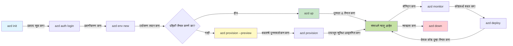

# AZD मूलभूत गोष्टी - Azure Developer CLI समजून घेणे

# AZD मूलभूत गोष्टी - मुख्य संकल्पना आणि तत्त्वे

**अध्याय नेव्हिगेशन:**
- **📚 कोर्स होम**: [AZD For Beginners](../../README.md)
- **📖 सध्याचा अध्याय**: अध्याय 1 - पाया व जलद प्रारंभ
- **⬅️ मागील**: [कोर्स अवलोकन](../../README.md#-chapter-1-foundation--quick-start)
- **➡️ पुढील**: [इंस्टॉलेशन आणि सेटअप](installation.md)
- **🚀 पुढील अध्याय**: [अध्याय 2: AI-प्रथम विकास](../chapter-02-ai-development/microsoft-foundry-integration.md)

## परिचय

हा धडा तुम्हाला Azure Developer CLI (azd) याची ओळख करून देतो, एक शक्तिशाली कमांड-लाइन साधन जे तुमच्या स्थानिक विकासापासून Azure मध्ये वितरण करण्याच्या प्रवासाला वेग देतो. तुम्ही मूलभूत संकल्पना, मुख्य वैशिष्ट्ये शिकाल आणि azd कसे क्लाउड-नेटिव्ह अनुप्रयोग वितरण सुलभ करते हे समजाल.

## शिकण्याचे उद्दिष्टे

या धड्याच्या शेवटी, तुम्ही:
- Azure Developer CLI म्हणजे काय आणि त्याचा प्राथमिक हेतू काय आहे हे समजाल
- साचा, वातावरण आणि सेवा यांचे मुख्य संकल्पना शिकाल
- साचा-आधारित विकास आणि Infrastructure as Code समवेत मुख्य वैशिष्ट्ये एक्सप्लोर कराल
- azd प्रोजेक्टची रचना आणि कार्यप्रवाह समजाल
- तुमच्या विकास वातावरणासाठी azd कसे इन्स्टॉल व कॉन्फिगर करायचे यासाठी तयार राहाल

## शिकण्याचे परिणाम

हा धडा पूर्ण केल्यावर, तुम्ही:
- आधुनिक क्लाउड विकास कार्यप्रवाहांमध्ये azd ची भूमिका स्पष्ट करू शकाल
- azd प्रोजेक्टच्या रचनेतील घटक ओळखू शकाल
- साचा, वातावरण आणि सेवा कसे एकत्र काम करतात हे वर्णन करू शकाल
- azd सह Infrastructure as Code चे फायदे समजून घेऊ शकाल
- वेगवेगळ्या azd कमांड्स आणि त्यांचे हेतू ओळखू शकाल

## Azure Developer CLI (azd) म्हणजे काय?

Azure Developer CLI (azd) हा एक कमांड-लाइन टूल आहे जो तुमच्या स्थानिक विकासापासून Azure मध्ये वितरणाच्या प्रवासाला वेग देण्यासाठी तयार केला आहे. तो Azure वर क्लाउड-नेटिव्ह अनुप्रयोग तयार करणे, तैनात करणे आणि व्यवस्थापित करणे सुलभ करतो.

### azd सह तुम्ही काय वितरित करू शकता?

azd विविध प्रकारच्या वर्कलोड्सना समर्थन देते आणि ही यादी सतत वाढत आहे. आज, तुम्ही azd वापरून वितरित करू शकता:

| वर्कलोड प्रकार | उदाहरणे | समान कार्यप्रवाह? |
|---------------|----------|----------------|
| **पारंपरिक अनुप्रयोग** | वेब अ‍ॅप्स, REST APIs, स्थिर साइट्स | ✅ `azd up` |
| **सेवा आणि मायक्रोसर्व्हिसेस** | कंटेनर अ‍ॅप्स, फंक्शन अ‍ॅप्स, मल्टी-सेवा बॅकएंड्स | ✅ `azd up` |
| **AI-सक्षम अनुप्रयोग** | Microsoft Foundry मॉडेल्स सह चॅट अ‍ॅप्स, AI सर्च सह RAG सोल्यूशन्स | ✅ `azd up` |
| **बुद्धिमान एजंट्स** | Foundry-होस्टेड एजंट्स, मल्टी-एजंट ऑर्केस्ट्रेशन्स | ✅ `azd up` |

महत्वाचा मुद्दा म्हणजे **तुम्ही जे काही वितरित करत आहात ते काहीही असो, azd ची जीवनचक्र तीच राहते**. तुम्ही प्रोजेक्ट आरंभ करता, इन्फ्रास्ट्रक्चर तयार करता, तुमचा कोड तैनात करता, तुमचं अॅप मॉनिटर करता आणि क्लिनअप करता — तो एखादा सोपा वेबसाइट असो की एका प्रगत AI एजंटचा भाग.

ही सातत्य डिझाइननुसार आहे. azd AI क्षमता तुमच्या अनुप्रयोगासाठी वापरता येणाऱ्या आणखी एका प्रकारच्या सेवेसारखी मानते, काही वेगळ्या प्रकारची नाहीत. Microsoft Foundry मॉडेल्सने समर्थित चॅट एंडपॉइंट azd च्या दृष्टीने, फक्त दुसरी एक सेवा आहे जी कॉन्फिगर आणि तैनात करायची आहे.

### 🎯 का वापरावे AZD? प्रत्यक्ष जगातील तुलना

एक सोपा वेब अ‍ॅप डेटाबेससह तैनात करण्याची तुलना करूया:

#### ❌ AZD शिवाय: मॅन्युअल Azure वितरण (30+ मिनिटे)

```bash
# पाऊल 1: रिसोर्स ग्रुप तयार करा
az group create --name myapp-rg --location eastus

# पाऊल 2: अॅप सर्व्हिस प्लॅन तयार करा
az appservice plan create --name myapp-plan \
  --resource-group myapp-rg \
  --sku B1 --is-linux

# पाऊल 3: वेब अॅप तयार करा
az webapp create --name myapp-web-unique123 \
  --resource-group myapp-rg \
  --plan myapp-plan \
  --runtime "NODE:18-lts"

# पाऊल 4: कॉसमॉस DB अकाउंट तयार करा (10-15 मिनिटे)
az cosmosdb create --name myapp-cosmos-unique123 \
  --resource-group myapp-rg \
  --kind MongoDB

# पाऊल 5: डेटाबेस तयार करा
az cosmosdb mongodb database create \
  --account-name myapp-cosmos-unique123 \
  --resource-group myapp-rg \
  --name tododb

# पाऊल 6: कलेक्षन तयार करा
az cosmosdb mongodb collection create \
  --account-name myapp-cosmos-unique123 \
  --resource-group myapp-rg \
  --database-name tododb \
  --name todos

# पाऊल 7: कनेक्शन स्ट्रिंग मिळवा
CONN_STR=$(az cosmosdb keys list \
  --name myapp-cosmos-unique123 \
  --resource-group myapp-rg \
  --type connection-strings \
  --query "connectionStrings[0].connectionString" -o tsv)

# पाऊल 8: अॅप सेटिंग्ज कॉन्फिगर करा
az webapp config appsettings set \
  --name myapp-web-unique123 \
  --resource-group myapp-rg \
  --settings MONGODB_URI="$CONN_STR"

# पाऊल 9: लॉगिंग सक्षम करा
az webapp log config --name myapp-web-unique123 \
  --resource-group myapp-rg \
  --application-logging filesystem \
  --detailed-error-messages true

# पाऊल 10: अॅप्लिकेशन इन्साइट्स सेट अप करा
az monitor app-insights component create \
  --app myapp-insights \
  --location eastus \
  --resource-group myapp-rg

# पाऊल 11: अॅप इन्साइट्स वेब अॅपशी लिंक करा
INSTRUMENTATION_KEY=$(az monitor app-insights component show \
  --app myapp-insights \
  --resource-group myapp-rg \
  --query "instrumentationKey" -o tsv)

az webapp config appsettings set \
  --name myapp-web-unique123 \
  --resource-group myapp-rg \
  --settings APPINSIGHTS_INSTRUMENTATIONKEY="$INSTRUMENTATION_KEY"

# पाऊल 12: अॅप्लिकेशन स्थानिकपणे तयार करा
npm install
npm run build

# पाऊल 13: डिप्लॉयमेंट पॅकेज तयार करा
zip -r app.zip . -x "*.git*" "node_modules/*"

# पाऊल 14: अॅप्लिकेशन डिप्लॉय करा
az webapp deployment source config-zip \
  --resource-group myapp-rg \
  --name myapp-web-unique123 \
  --src app.zip

# पाऊल 15: वाट पाहा आणि प्रार्थना करा की ते काम करते 🙏
# (स्वयंचलित प्रमाणीकरण नाही, मॅन्युअल चाचणी आवश्यक)
```

**समस्या:**
- ❌ 15+ कमांड्स लक्षात ठेवणे आणि क्रमाने चालवणे
- ❌ 30-45 मिनिटे हाताने काम करणे
- ❌ त्रुटी करणे सोपे (टायपो, चुकीचे पॅरामिटर्स)
- ❌ कनेक्शन स्ट्रींग्ज टर्मिनल इतिहासात उघडे पडणे
- ❌ काही चुकल्यास स्वयंचलित रोलबॅक नाही
- ❌ टीम सदस्यांसाठी पुनरुत्पादित करणे कठीण
- ❌ प्रत्येक वेळी वेगळे (पुनरुत्पादित होणारे नाही)

#### ✅ AZD सह: स्वयंचलित वितरण (5 कमांड्स, 10-15 मिनिटे)

```bash
# टप्पा 1: टेम्पलेटमधून प्रारंभ करा
azd init --template todo-nodejs-mongo

# टप्पा 2: प्रमाणीकरण करा
azd auth login

# टप्पा 3: वातावरण तयार करा
azd env new dev

# टप्पा 4: बदल पूर्वावलोकन करा (ऐच्छिक पण शिफारस केलेले)
azd provision --preview

# टप्पा 5: सर्वकाही तैनात करा
azd up

# ✨ पूर्ण! सर्व काही तैनात केले गेले आहे, कॉन्फिगर केले आहे, आणि देखरेख केली जाते
```

**फायदे:**
- ✅ **5 कमांड्स** विरुद्ध 15+ मॅन्युअल स्टेप्स
- ✅ **10-15 मिनिटे** एकूण वेळ (बहुतेक Azure साठी वाट पाहणे)
- ✅ **कमी मॅन्युअल चुका** - सातत्यपूर्ण, साचा-आधारित कार्यप्रवाह
- ✅ **सुरक्षित सिक्रेट हॅण्डलिंग** - अनेक साच्यांमध्ये Azure-व्यवस्थापित सिक्रेट स्टोरेज वापरलेले
- ✅ **पुनरावृत्तीयोग्य वितरण** - प्रत्येक वेळी समान कार्यप्रवाह
- ✅ **पूर्णपणे पुनरुत्पादनीय** - प्रत्येक वेळी समान निकाल
- ✅ **टीम-तयार** - कोणीही समान कमांड्सने वितरण करू शकतो
- ✅ **Infrastructure as Code** - व्हर्जन नियंत्रित बायसेप साचे
- ✅ **इन-बिल्ट मॉनिटरिंग** - Application Insights avtomatically कॉन्फिगर केलेले

### 📊 वेळ व त्रुटी कमी करणे

| मेट्रिक | मॅन्युअल वितरण | AZD वितरण | सुधारणा |
|:--------|:--------------|:----------|:--------|
| **कमांड्स** | 15+ | 5 | 67% कमी |
| **वेळ** | 30-45 मिनिटे | 10-15 मिनिटे | 60% वेगवान |
| **त्रुटी दर** | ~40% | <5% | 88% कपात |
| **सततपणा** | कमी (मॅन्युअल) | 100% (स्वयंचलित) | परिपूर्ण |
| **टीम ऑनबोर्डिंग** | 2-4 तास | 30 मिनिटे | 75% वेगवान |
| **रोलबॅक वेळ** | 30+ मिनिटे (मॅन्युअल) | 2 मिनिटे (स्वयंचलित) | 93% वेगवान |

## मुख्य संकल्पना

### साचे
साचे म्हणजे azd ची मूलभूत तत्त्वे. त्यामध्ये असते:
- **अनुप्रयोग कोड** - तुमचा स्रोत कोड आणि अवलंबित्वे
- **इन्फ्रास्ट्रक्चर व्याख्या** - Azure संसाधने बायसेप किंवा Terraform मध्ये परिभाषित
- **कॉन्फिगरेशन फायली** - सेटिंग्ज आणि वातावरण व्हेरिएबल्स
- **तैनाती स्क्रिप्ट्स** - स्वयंचलित वितरण कार्यप्रवाह

### वातावरण
वातावरणे वेगवेगळ्या वितरण लक्ष्यांचे प्रतिनिधित्व करतात:
- **विकास** - चाचणी आणि विकासासाठी
- **स्टेजिंग** - उत्पादन पूर्व वातावरण
- **उत्पादन** - लाइव्ह उत्पादन वातावरण

प्रत्येक वातावरण स्वतःचे राखते:
- Azure संसाधन समूह
- कॉन्फिगरेशन सेटिंग्ज
- वितरण स्थिती

### सेवा
सेवा तुमच्या अनुप्रयोगाच्या बांधकाम खुणा आहेत:
- **समोरचा भाग** - वेब अनुप्रयोग, एसपीए
- **बॅकएंड** - API, मायक्रोसर्व्हिसेस
- **डेटाबेस** - डेटा संग्रहण उपाय
- **स्टोरेज** - फाईल आणि ब्लॉब स्टोरेज

## मुख्य वैशिष्ट्ये

### 1. साचा-आधारित विकास
```bash
# उपलब्ध साचा ब्राउझ करा
azd template list

# साच्यापासून प्रारंभ करा
azd init --template <template-name>
```

### 2. Infrastructure as Code
- **Bicep** - Azure चे डोमेन-विशिष्ट भाषा
- **Terraform** - मल्टी-क्लाउड इन्फ्रास्ट्रक्चर साधन
- **ARM साचे** - Azure Resource Manager साचे

### 3. एकत्रित कार्यप्रवाह
```bash
# संपूर्ण तैनाती कार्यप्रवाह
azd up            # प्राविजन + तैनात ही प्रथम सेटअपसाठी हँड्स-ऑफ आहे

# 🧪 नवीन: तैनातीपूर्वी इन्फ्रास्ट्रक्चर बदल पूर्वावलोकन करा (सुरक्षित)
azd provision --preview    # बदल न करता इन्फ्रास्ट्रक्चर तैनातीचे अनुकरण करा

azd provision     # इन्फ्रास्ट्रक्चर अद्यतनित केल्यास Azure संसाधने तयार करा
azd deploy        # अनुप्रयोग कोड तैनात करा किंवा अद्यतनानंतर कोड पुन्हा तैनात करा
azd down          # संसाधने स्वच्छ करा
```

#### 🛡️ पूर्वावलोकनसह सुरक्षित इन्फ्रास्ट्रक्चर नियोजन
`azd provision --preview` कमांड सुरक्षित वितरणासाठी गेम-चेंजर आहे:
- **ड्राय-रन विश्लेषण** - काय तयार होईल, बदल होईल किंवा हटवले जाईल हे दाखवते
- **शून्य धोका** - Azure वातावरणात कोणतेही प्रत्यक्ष बदल करत नाही
- **टीम सहकार्य** - वितरणापूर्वी पूर्वावलोकन निकाल सामायिक करा
- **खर्च अंदाज** - बांधणीपूर्वी संसाधन खर्च समजून घ्या

```bash
# उदाहरण पूर्वावलोकन कार्यप्रवाह
azd provision --preview           # काय बदलेल ते पाहा
# आउटपुट पुनरावलोकन करा, टीमबरोबर चर्चा करा
azd provision                     # आत्मविश्वासाने बदल लागू करा
```

### 📊 दृश्य: AZD विकास कार्यप्रवाह



**कार्यप्रवाह स्पष्टीकरण:**
1. **Init** - साचा किंवा नवीन प्रोजेक्टसह प्रारंभ करा
2. **Auth** - Azure सह प्रमाणीकरण करा
3. **Environment** - वेगळे वितरण वातावरण तयार करा
4. **Preview** - 🆕 नेहमी प्रथम इन्फ्रास्ट्रक्चर बदल पाहा (सुरक्षित पद्धत)
5. **Provision** - Azure संसाधने तयार/अपडेट करा
6. **Deploy** - तुमच्या अनुप्रयोगाचा कोड तैनात करा
7. **Monitor** - अनुप्रयोगाचा कार्यप्रदर्शन पहा
8. **Iterate** - बदल करा आणि कोड पुन्हा तैनात करा
9. **Cleanup** - संपल्यावर संसाधने काढा

### 4. वातावरण व्यवस्थापन
```bash
# वातावरण तयार करा आणि व्यवस्थापित करा
azd env new <environment-name>
azd env select <environment-name>
azd env list
```

### 5. विस्तार आणि AI कमांड्स

azd मध्ये मुख्य CLI शिवाय क्षमतांसाठी विस्तार प्रणाली आहे. हे विशेषतः AI वर्कलोड्ससाठी उपयुक्त आहे:

```bash
# उपलब्ध विस्तारांची यादी करा
azd extension list

# Foundry एजंट्स विस्तार स्थापित करा
azd extension install azure.ai.agents

# मॅनिफेस्टमधून AI एजंट प्रकल्प प्रारंभ करा
azd ai agent init -m agent-manifest.yaml

# तैनात एजंट तपासा (विलंब आणि पहिल्या बाइटपर्यंतचा वेळ दर्शवितो)
azd ai agent invoke

# AI सहाय्यक विकासासाठी MCP सर्वर सुरू करा (अल्फा)
azd mcp start
```

**एजंट जीवनचक्र, सुरुवातीपासून शेवटपर्यंत.** एकदा तुम्ही `azure.ai.agents` इन्स्टॉल केल्यावर, एकच कार्यप्रवाह तुम्हाला कल्पनेपासून चालू, मॉनिटर केलेले एजंटपर्यंत घेऊन जातो. तुम्हाला सुरुवातीला ही सर्व गरज नाही — फक्त त्यांची माहिती ठेवा:

| टप्पा | कमांड | काय करते |
|-------|--------|-----------|
| **स्कॅफोल्ड** | `azd ai agent init -m <manifest>` | मॅनिफेस्टमधून एजंट प्रोजेक्ट जनरेट करा |
| **चाचणी** | `azd ai agent invoke` | एजंटला कॉल करा आणि प्रतिसाद वेळ पहा |
| **मोजणी** | `azd ai agent eval generate` | एजंटसाठी मूल्यांकन डेटासेट तयार करा |
| **सुधारणा** | `azd ai agent optimize` | तुमच्या डेटाविरुद्ध एजंट सूचना ऑप्टिमाइझ करा |
| **तपासणी** | `azd ai agent endpoint show` | थेट एंडपॉइंट कॉन्फिगरेशन पहा |
| **साफसफाई** | `azd ai agent delete` | होस्ट केलेले एजंट व त्यावरील सर्व आवृत्त्या डिलीट करा |

> विस्तार [अध्याय 2: AI-प्रथम विकास](../chapter-02-ai-development/agents.md) आणि [AZD AI CLI कमांड्स](../chapter-08-production/production-ai-practices.md#azd-ai-cli-commands-and-extensions) संदर्भात तपशीलवार कव्हर केले आहेत.

## 📁 प्रोजेक्ट रचना

सामान्य azd प्रोजेक्ट संरचना:
```
my-app/
├── .azd/                    # azd configuration
│   └── config.json
├── .azure/                  # Azure deployment artifacts
├── .devcontainer/          # Development container config
├── .github/workflows/      # GitHub Actions
├── .vscode/               # VS Code settings
├── infra/                 # Infrastructure code
│   ├── main.bicep        # Main infrastructure template
│   ├── main.parameters.json
│   └── modules/          # Reusable modules
├── src/                  # Application source code
│   ├── api/             # Backend services
│   └── web/             # Frontend application
├── azure.yaml           # azd project configuration
└── README.md
```

## 🔧 कॉन्फिगरेशन फायली

### azure.yaml
मुख्य प्रोजेक्ट कॉन्फिगरेशन फायली:
```yaml
name: my-awesome-app
metadata:
  template: my-template@1.0.0

services:
  web:
    project: ./src/web
    language: js
    host: appservice
  api:
    project: ./src/api
    language: js
    host: appservice

hooks:
  preprovision:
    shell: pwsh
    run: echo "Preparing to provision..."
```

### .azure/config.json
वातावरण-विशिष्ट कॉन्फिगरेशन:
```json
{
  "version": 1,
  "defaultEnvironment": "dev",
  "environments": {
    "dev": {
      "subscriptionId": "your-subscription-id",
      "location": "eastus"
    }
  }
}
```

## 🎪 सामान्य कार्यप्रवाह हाताळणी सराव

> **💡 शिकण्याचा टिप:** तुमचे AZD कौशल्य प्रगत करण्यासाठी या सरावांना क्रमाने करा.

### 🎯 सराव 1: तुमचा पहिला प्रोजेक्ट थांबवा

**उद्दिष्ट:** AZD प्रोजेक्ट तयार करा आणि त्याची रचना एक्सप्लोर करा

**स्टेप्स:**
```bash
# सिद्ध केलेला टेम्पलेट वापरा
azd init --template todo-nodejs-mongo

# तयार केलेली फायली तपासा
ls -la  # सर्व फायली पहा, लपवलेल्या फायलीही समावेश

# तयार झालेल्या मुख्य फायली:
# - azure.yaml (मुख्य कॉन्फिग)
# - infra/ (पायाभूत सुविधा कोड)
# - src/ (अॅप्लिकेशन कोड)
```

**✅ यश:** तुमच्याकडे azure.yaml, infra/, व src/ डिरेक्टरीज आहेत

---

### 🎯 सराव 2: Azure मध्ये तैनात करा

**उद्दिष्ट:** एंड-टू-एंड वितरण पूर्ण करा

**स्टेप्स:**
```bash
# 1. प्रमाणीकरण करा
az login && azd auth login

# 2. पर्यावरण तयार करा
azd env new dev
azd env set AZURE_LOCATION eastus

# 3. बदलांची पूर्वदृश्ये पाहा (शिफारस केली आहे)
azd provision --preview

# 4. सर्वकाही तैनात करा
azd up

# 5. तैनातीची पडताळणी करा
azd show    # तुमच्या अॅपचा URL पहा
```

**अपेक्षित वेळ:** 10-15 मिनिटे  
**✅ यश:** अ‍ॅप्लिकेशन URL ब्राउझरमध्ये उघडते

---

### 🎯 सराव 3: एकाधिक वातावरणे

**उद्दिष्ट:** dev आणि staging मध्ये तैनात करा

**स्टेप्स:**
```bash
# आधीच dev आहे, staging तयार करा
azd env new staging
azd env set AZURE_LOCATION westus2
azd up

# त्यांच्यामध्ये स्विच करा
azd env list
azd env select dev
```

**✅ यश:** Azure Portal मध्ये दोन स्वतंत्र संसाधन समूह

---

### 🛡️ स्वच्छ प्रारंभ: `azd down --force --purge`

जेव्हा तुम्हाला पूर्णपणे रीसेट करायचे असेल:

```bash
azd down --force --purge
```

**हे काय करते:**
- `--force`: पुष्टीकरण विनंत्या नाहीत
- `--purge`: सर्व स्थानिक स्थिती आणि Azure संसाधने डिलीट करते

**कधी वापरावे:**
- वितरण अर्धवट अपयशी ठरले असेल
- प्रोजेक्ट बदलताना
- नवीन सुरुवात हवी असेल

---

## 🎪 मूळ कार्यप्रवाह संदर्भ

### नवीन प्रोजेक्ट सुरू करणे
```bash
# पद्धत 1: विद्यमान टेम्पलेट वापरा
azd init --template todo-nodejs-mongo

# पद्धत 2: सुरुवात करा सुरवातीपासून
azd init

# पद्धत 3: सध्याचा निर्देशिका वापरा
azd init .
```

### विकास चक्र
```bash
# विकास वातावरण सेट करा
azd auth login
azd env new dev
azd env select dev

# सर्व काही तैनात करा
azd up

# बदल करा आणि पुन्हा तैनात करा
azd deploy

# पूर्ण झाल्यावर साफसफाई करा
azd down --force --purge # Azure Developer CLI मधील कमांड आपल्या वातावरणासाठी एक **हार्ड रिसेट** आहे—विशेषतः जेव्हा आपण अपयशी तैनातींचे त्रुटी निराकरण करत असाल, अनाथ संसाधने साफ करत असाल किंवा नवीन पुनःतैनातीसाठी तयारी करत असाल तेव्हा उपयुक्त.
```

## `azd down --force --purge` समजून घेणे
`azd down --force --purge` कमांड तुमचे azd वातावरण आणि त्यासंबंधित सर्व संसाधने पूर्णपणे काढून टाकण्यासाठी एक शक्तिशाली मार्ग आहे. प्रत्येक फ्लॅग काय करतो हे येथे आहे:
```
--force
```
- पुष्टीकरण विनंत्या टाळतो.
- मॅन्युअल इनपुट शक्य नसलेल्या ऑटोमेशन किंवा स्क्रिप्टिंगसाठी उपयुक्त.
- CLI ने विसंगती आढळल्या तरी थांबवण्याशिवाय निवारण सुनिश्चित करतो.

```
--purge
```
सर्व संबंधित मेटाडेटा डिलीट करतो, यात समावेश आहे:
वातावरण स्थिती
स्थानिक `.azure` फोल्डर
कॅश केलेली वितरण माहिती
azd ला आधीचे वितरण "लक्षात ठेवण्यापासून" थांबवतो, ज्यामुळे चुकीचे संसाधन समूह किंवा जुने रजिस्ट्री संदर्भ निर्माण होण्याचा धोका कमी होतो.

### दोन्ही का वापरावे?
जेव्हा तुम्ही `azd up` वापरताना काही अडथळ्यांना सामोरं जात असता, उदा. अवस्थेचा अडकणं किंवा भागिक वितरण, ही कॉम्बो **स्वच्छ प्रारंभ** सुनिश्चित करते.

हे विशेषतः Azure पोर्टलमधून मॅन्युअली संसाधने काढतानंतर किंवा टेम्पलेट, वातावरण किंवा संसाधन समूहाचं नाव बदलताना उपयुक्त आहे.

### अनेक वातावरणांचे व्यवस्थापन
```bash
# स्टेजिंग वातावरण तयार करा
azd env new staging
azd env select staging
azd up

# परत विकासावर जा
azd env select dev

# वातावरणांची तुलना करा
azd env list
```

## 🔐 प्रमाणीकरण आणि क्रेडेन्शियल्स

यशस्वी azd वितरणासाठी प्रमाणीकरण समजून घेणे महत्त्वाचे आहे. Azure अनेक प्रमाणीकरण पद्धती वापरतो, आणि azd इतर Azure साधनांमध्ये वापरल्या जाणाऱ्याच क्रेडेन्शियल साखळीचा वापर करतो.

### Azure CLI प्रमाणीकरण (`az login`)

azd वापरण्यापूर्वी तुम्हाला Azure सह प्रमाणीकरण करावे लागते. सर्वात सामान्य पद्धत Azure CLI वापरणे आहे:

```bash
# इंटरऐक्टिव लॉगिन (ब्राउझर उघडतो)
az login

# विशिष्ट भाड्यानेदारासह लॉगिन करा
az login --tenant <tenant-id>

# सेवा प्रमुखासह लॉगिन करा
az login --service-principal -u <app-id> -p <password> --tenant <tenant-id>

# चालू लॉगिन स्थिती तपासा
az account show

# उपलब्ध सदस्यता यादी करा
az account list --output table

# डीफॉल्ट सदस्यता सेट करा
az account set --subscription <subscription-id>
```

### प्रमाणीकरण प्रवाह
1. **परस्परसंवादी लॉगिन**: प्रमाणीकरणासाठी तुमचा डीफल्ट ब्राउझर उघडतो
2. **डिव्हाइस कोड फ्लो**: ब्राउझर ऍक्सेस नसेल तर वापरली जाते
3. **सेवा प्रिन्सिपल**: ऑटोमेशन आणि CI/CD सीनारियोसाठी
4. **व्यवस्थापित ओळख**: Azure-होस्टेड अनुप्रयोगांसाठी

### DefaultAzureCredential साखळी

`DefaultAzureCredential` ही एक क्रेडेन्शियल प्रकार आहे जी ऑटोमॅटिकली विविध स्रोत वापरून सोपं प्रमाणीकरण अनुभव प्रदान करते, एका ठरलेल्या क्रमाने:

#### क्रेडेन्शियल साखळी क्रम
```mermaid
graph TD
    A[DefaultAzureCredential] --> B[पर्यावरण चल (Environment Variables)]
    B --> C[कार्यभार ओळख (Workload Identity)]
    C --> D[व्यवस्थापित ओळख (Managed Identity)]
    D --> E[व्हिज्युअल स्टुडिओ (Visual Studio)]
    E --> F[व्हिज्युअल स्टुडिओ कोड (Visual Studio Code)]
    F --> G[अझूर CLI (Azure CLI)]
    G --> H[अझूर पॉवरशेल (Azure PowerShell)]
    H --> I[संवादात्मक ब्राउजर (Interactive Browser)]
```

#### 1. वातावरण व्हेरिएबल्स
```bash
# सेवा प्रमुखासाठी पर्यावरण चल सेट करा
export AZURE_CLIENT_ID="<app-id>"
export AZURE_CLIENT_SECRET="<password>"
export AZURE_TENANT_ID="<tenant-id>"
```

#### 2. वर्कलोड ओळख (Kubernetes/GitHub Actions)
स्वतः ऑटोमॅटिक वापरले जाते:
- Azure Kubernetes Service (AKS) वर्कलोड ओळखी सह
- GitHub Actions OIDC फेडरेशन सह
- इतर फेडरेटेड ओळख परिस्थितींमध्ये

#### 3. व्यवस्थापित ओळख
Azure संसाधनांसाठी जसे की:
- वर्चुअल मशीन
- अ‍ॅप सेवा
- Azure Functions
- कंटेनर इंस्टन्सेस

```bash
# व्यवस्थापित ओळखीने Azure स्रोतावर चालत असल्यास तपासा
az account show --query "user.type" --output tsv
# परत करते: व्यवस्थापित ओळखीचा वापर केल्यास "servicePrincipal"
```

#### 4. डेव्हलपर टूल्स इंटिग्रेशन
- **Visual Studio**: स्वयंचलितपणे साइन-इन केलेले खाते वापरते
- **VS Code**: Azure Account विस्ताराचे क्रेडेन्शियल्स वापरते
- **Azure CLI**: `az login` क्रेडेन्शियल्स वापरते (स्थानिक विकासासाठी सर्वात सामान्य)

### AZD प्रमाणीकरण सेटअप

```bash
# पद्धत 1: Azure CLI वापरा (विकासासाठी शिफारसीय)
az login
azd auth login  # विद्यमान Azure CLI प्रमाणपत्रांचा वापर करते

# पद्धत 2: थेट azd प्रमाणीकरण
azd auth login --use-device-code  # बिना-डिस्प्ले वातावरणासाठी

# पद्धत 3: प्रमाणीकरण स्थिती तपासा
azd auth login --check-status

# पद्धत 4: लॉगआऊट करा आणि पुन्हा प्रमाणीकरण करा
azd auth logout
azd auth login
```

### प्रमाणीकरण सर्वोत्तम सराव

#### स्थानिक विकासासाठी
#### CI/CD पाइपलाइनसाठी
#### उत्पादन वातावरणांसाठी
- Azure संसाधने चालवताना **Managed Identity** वापरा
- स्वयंचलितीकरणाच्या परिस्थितीत **Service Principal** वापरा
- संकेतस्थळे किंवा कॉन्फिगरेशन फाइलमध्ये क्रेडेन्शियल्स साठवू नका
- संवेदनशील कॉन्फिगरेशनसाठी **Azure Key Vault** वापरा

### सामान्य प्रमाणीकरण समस्या आणि उपाय

#### समस्या: "संशोधन सापडले नाही"
#### समस्या: "पुरेशी परवानगी नाही"
#### समस्या: "टोकन कालबाह्य झाले"
### वेगवेगळ्या परिस्थितीत प्रमाणीकरण

#### स्थानिक विकास
#### टीम विकास
#### बहु-टेनंट परिस्थिती
### सुरक्षा विचार

1. **क्रेडेन्शियल संचयन**: कधीही स्रोत कोडमध्ये क्रेडेन्शियल साठवू नका
2. **परिमितीसीमा**: सेवा प्रमुखांसाठी कमीतकमी अधिकार तत्त्व वापरा
3. **टोकन फेरफटका**: सेवा प्रमुख गुपिते नियमितपणे बदला
4. **ऑडिट ट्रेल**: प्रमाणीकरण आणि वितरण क्रियाकलापांचे निरीक्षण करा
5. **नेटवर्क सुरक्षा**: शक्य असल्यास खाजगी अंतिम बिंदू वापरा

### प्रमाणीकरण त्रुटी निवारण

## `azd down --force --purge` समजून घेणे

### शोध
### प्रोजेक्ट व्यवस्थापन
### निरीक्षण
## सर्वोत्तम सराव

### 1. अर्थपूर्ण नावे वापरा
### 2. टेम्प्लेटचा फायदा घ्या
- विद्यमान टेम्प्लेटपासून सुरुवात करा
- तुमच्या गरजेनुसार सानुकूलित करा
- तुमच्या संस्थेसाठी पुनर्निर्मित टेम्प्लेट तयार करा

### 3. वातावरण पृथक्करण
- विकास/स्टेजिंग/उत्पादनासाठी वेगळे वातावरण वापरा
- स्थानिक मशीनवरून थेट उत्पादनात कधीही वितरण करू नका
- उत्पादन वितरणासाठी CI/CD पाइपलाइन वापरा

### 4. कॉन्फिगरेशन व्यवस्थापन
- संवेदनशील डेटासाठी वातावरणीय चल वापरा
- कॉन्फिगरेशन आवृत्ती नियंत्रणात ठेवा
- वातावरण-विशिष्ट सेटिंग्जचे दस्तऐवजीकरण करा

## शिक्षण प्रगती

### नवशिक्या (सप्ताह 1-2)
1. azd स्थापित करा आणि प्रमाणीकरण करा
2. एक सोपा टेम्प्लेट तैनात करा
3. प्रोजेक्ट संरचना समजून घ्या
4. मूलभूत आज्ञा शिकाः (up, down, deploy)

### मध्यम (सप्ताह 3-4)
1. टेम्प्लेट सानुकूलित करा
2. एकाधिक वातावरणे व्यवस्थापित करा
3. पूर्वाधिकार कोड समजून घ्या
4. CI/CD पाइपलाइन सेट करा

### प्रगत (सप्ताह 5+)
1. सानुकूल टेम्प्लेट तयार करा
2. प्रगत पूर्वाधिकार नमुने
3. बहु-प्रदेश तैनाती
4. एंटरप्राइज-ग्रेड कॉन्फिगरेशन

## पुढील टप्पे

**📖 अध्याय 1 शिकत राहा:**
- [स्थापन व सेटअप](installation.md) - azd इंस्टॉल व कॉन्फिगर करा
- [तुमचा पहिला प्रोजेक्ट](first-project.md) - हाताळणी ट्युटोरियल पूर्ण करा
- [कॉन्फिगरेशन मार्गदर्शक](configuration.md) - प्रगत कॉन्फिग विकल्प

**🎯 पुढील अध्यायसाठी तयार आहात?**
- [अध्याय 2: AI-प्रथम विकास](../chapter-02-ai-development/microsoft-foundry-integration.md) - AI अ‍ॅप्स बनवायला सुरू करा

## अतिरिक्त संसाधने

- [Azure Developer CLI परिचय](https://learn.microsoft.com/en-us/azure/developer/azure-developer-cli/)
- [टेम्प्लेट गॅलरी](https://azure.github.io/awesome-azd/)
- [समुदाय नमुने](https://github.com/Azure-Samples)

---

## 🙋 सामान्य प्रश्न

### सामान्य प्रश्न

**प्र: AZD आणि Azure CLI मधील फरक काय आहे?**

उ: Azure CLI (`az`) हे वैयक्तिक Azure संसाधने व्यवस्थापित करण्यासाठी आहे. AZD (`azd`) हे संपूर्ण अ‍ॅप्लिकेशन्स व्यवस्थापित करण्यासाठी आहे:

**हे अशा प्रकारे समजा:**
- `az` = वैयक्तिक लेगो विटा हाताळणे
- `azd` = संपूर्ण लेगो सेट्ससह काम करणे

---

**प्र: AZD वापरण्यासाठी मला Bicep किंवा Terraform समजायला हवे का?**

उ: नाही! टेम्प्लेटपासून सुरू करा:
Bicep नंतर शिकून पूर्वाधिकार सानुकूलित करू शकता. टेम्प्लेट कार्यशील उदाहरणे पुरवतात ज्यातून शिकता येते.

---

**प्र: AZD टेम्प्लेट चालवायला किती खर्च येतो?**

उ: टेम्प्लेटनुसार खर्च भिन्न असतो. बहुतेक विकास टेम्प्लेटच्या खर्चाचा दर $50-150/महिना आहे:

**प्रो टिप:** जिथे शक्य तेथे मोफत स्तर वापरा:
- अ‍ॅप सर्व्हिस: F1 (मोफत) स्तर
- Microsoft Foundry मॉडेल्स: Azure OpenAI 50,000 टोकन/महिना मोफत
- Cosmos DB: 1000 RU/s मोफत स्तर

---

**प्र: AZD विद्यमान Azure संसाधनांसह वापरू शकतो का?**

उ: होय, परंतु नवीन सुरुवात करणे सोपे आहे. AZD संपूर्ण जीवनचक्र व्यवस्थापित करताना सर्वोत्तम काम करते. विद्यमान संसाधनांसाठी:

---

**प्र: माझा प्रोजेक्ट टीममेट्ससोबत कसा शेअर करावा?**

उ: AZD प्रोजेक्ट Git मध्ये कमिट करा (पण .azure फोल्डर नाही):

सर्वांनाच तीव्रपणे समान पूर्वाधिकार मिळतात.

---

### त्रुटी निवारण प्रश्न

**प्र: "azd up" अर्ध्यावरच अयशस्वी झाले. काय करावे?**

उ: त्रुटी तपासा, दुरुस्त करा, नंतर पुन:प्रयत्न करा:

**सर्वसामान्य समस्या:** चुकीचा Azure संशोधन निवडलेला आहे

---

**प्र: फक्त कोड बदल तैनात करायचे आहे रिप्रोव्हिजन न करता?**

उ: `azd deploy` वापरा `azd up` च्या ऐवजी:

वेग तुलना:
- `azd up`: 10-15 मिनिटे (पूर्वाधिकार व्यवस्थापित करतो)
- `azd deploy`: 2-5 मिनिटे (फक्त कोड)

---

**प्र: पूर्वाधिकार टेम्प्लेट सानुकूलित करू शकतो का?**

उ: होय! `infra/` मधील Bicep फाइल संपादित करा:

**टीप:** लहान सुरुवात करा - प्रथम SKU बदला:

---

**प्र: AZD ने तयार केलेले सर्व काही कसे हटवायचे?**

उ: एक आदेश सर्व संसाधने काढून टाकतो:

**नेहमी हे चालवा जेव्हा:**
- टेम्प्लेटचे चाचणी पूर्ण झाली असेल
- वेगळ्या प्रोजेक्टवर स्विच होत असाल
- नवीन सुरुवात करायची असेल

**खर्च बचत:** न वापरल्या जाणार्‍या संसाधनांना हटवल्याने $0 शुल्क

---

**प्र: जर मी Azure पोर्टलमध्ये चुकून संसाधने हटविली तर?**

उ: AZD स्थिती विस्कळीत होऊ शकते. नवी सुरुवात करा:

---

### प्रगत प्रश्न

**प्र: AZD CI/CD पाइपलाइन्समध्ये वापरू शकतो का?**

उ: होय! GitHub Actions उदाहरण:

---

**प्र: रहस्ये आणि संवेदनशील डेटा कसा हाताळायचा?**

उ: AZD आपोआप Azure Key Vault सोबत एकत्रित होते:

**कधीही कमिट करू नका:**
- `.azure/` फोल्डर (पर्यावरण डेटा आहे)
- `.env` फाइल्स (स्थानिक रहस्ये)
- कनेक्शन स्ट्रिंग्ज

---

**प्र: अनेक प्रदेशांमध्ये तैनात करू शकतो का?**

उ: होय, विभागासाठी वेगळे वातावरण तयार करा:

खऱ्या बहु-प्रदेश अनुप्रयोगांसाठी, Bicep टेम्प्लेट एकाच वेळी अनेक प्रदेशांमध्ये तैनात करण्यासाठी सानुकूलित करा.

---

**प्र: अडखळल्यास कुठे मदत मिळेल?**

1. **AZD दस्तऐवज:** https://learn.microsoft.com/azure/developer/azure-developer-cli/
2. **GitHub समस्या:** https://github.com/Azure/azure-dev/issues
3. **Discord:** [Azure Discord](https://discord.gg/microsoft-azure) - #azure-developer-cli चॅनेल
4. **Stack Overflow:** टॅग `azure-developer-cli`
5. **हा कोर्स:** [त्रुटी निवारण मार्गदर्शक](../chapter-07-troubleshooting/common-issues.md)

**प्रो टिप:** विचारण्यापूर्वी चला:
यामध्ये माहिती समाविष्ट करा ज्यामुळे जलद मदत मिळेल.

---

## 🎓 पुढे काय?

आता तुम्हाला AZD मूलभूत समज आहे. तुमचा मार्ग निवडा:

### 🎯 नवशिक्यांसाठी:
1. **पुढील:** [स्थापन व सेटअप](installation.md) - AZD तुमच्या मशीनवर इंस्टॉल करा
2. **मग:** [तुमचा पहिला प्रोजेक्ट](first-project.md) - तुमचे पहिले अ‍ॅप तैनात करा
3. **अभ्यास:** या धड्याचे सर्व 3 उपक्रम पूर्ण करा

### 🚀 AI विकासकांसाठी:
1. **थेट जा:** [अध्याय 2: AI-प्रथम विकास](../chapter-02-ai-development/microsoft-foundry-integration.md)
2. **तैनात करा:** `azd init --template get-started-with-ai-chat` पासून सुरुवात करा
3. **शिका:** तैनात करत असताना तयार करा

### 🏗️ अनुभवी विकासकांसाठी:
1. **पुनरावलोकन करा:** [कॉन्फिगरेशन मार्गदर्शक](configuration.md) - प्रगत सेटिंग्ज
2. **शोधा:** [पूर्वाधिकार कोड](../chapter-04-infrastructure/provisioning.md) - Bicep सखोल अभ्यास
3. **बनवा:** तुमच्या स्टॅकसाठी सानुकूल टेम्प्लेट तयार करा

---

**अध्याय नेव्हिगेशन:**
- **📚 कोर्स होम:** [AZD नवशिक्यांसाठी](../../README.md)
- **📖 चालू अध्याय:** अध्याय 1 - पायाभूत व जलद प्रारंभ  
- **⬅️ मागील:** [कोर्स अवलोकन](../../README.md#-chapter-1-foundation--quick-start)
- **➡️ पुढील:** [स्थापन व सेटअप](installation.md)
- **🚀 पुढील अध्याय:** [अध्याय 2: AI-प्रथम विकास](../chapter-02-ai-development/microsoft-foundry-integration.md)

---

<!-- CO-OP TRANSLATOR DISCLAIMER START -->
**अस्वीकरण**:
हा दस्तऐवज AI भाषांतर सेवा [Co-op Translator](https://github.com/Azure/co-op-translator) चा वापर करून अनुवादित केला आहे. जरी आम्ही अचूकतेसाठी प्रयत्न करतो, तरी कृपया लक्षात घ्या की स्वयंचलित भाषांतरांमध्ये त्रुटी किंवा अचूकतेची कमतरता असू शकते. मूळ दस्तऐवज त्याच्या मूळ भाषेत अधिकृत स्रोत मानला पाहिजे. महत्त्वाची माहिती असल्यास, व्यावसायिक मानवी भाषांतराची शिफारस केली जाते. या भाषांतराच्या वापरामुळे उद्भवणाऱ्या कोणत्याही गैरसमज किंवा चुकीच्या अर्थलावणीसाठी आम्ही जबाबदार नाही.
<!-- CO-OP TRANSLATOR DISCLAIMER END -->