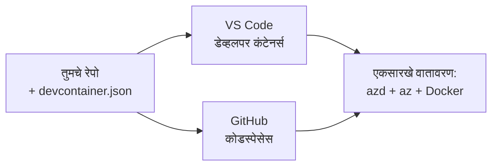

# azd साठी Dev Containers आणि GitHub Codespaces

**अध्याय नेव्हिगेशन:**
- **📚 कोर्स मुख्यपृष्ठ**: [AZD नवशिक्यांसाठी](../../README.md)
- **📖 सध्याचा अध्याय**: अध्याय 1 - पायाभूत व जलद प्रारंभ
- **⬅️ मागील**: [आपले स्वतःचे अॅप आणा](bring-your-own-app.md)
- **🚀 पुढील अध्याय**: [अध्याय 2: AI-प्रथम विकास](../chapter-02-ai-development/README.md)

> `azd 1.25.6` नुसार जून 2026 मध्ये पडताळले.

## परिचय

सर्व संगणकांवर azd, योग्य भाषा रनटाइम, Docker आणि Azure CLI स्थापित करणे क्लिष्ट आहे — आणि हा सर्वात मोठा कारण आहे की एखाद्या ट्युटोरियलने "माझ्या मशीनवर चालते" म्हणून इतरांसाठी अपयशी ठरते. एक **डेव्ह कंटेनर** हे तुमचे संपूर्ण टूलचेन एका फाइलमध्ये वर्णन करून हे सोडवते. जो कोणी प्रोजेक्ट VS Code किंवा GitHub Codespaces मध्ये उघडतो त्याला अगदी समान वातावरण मिळते, ज्यात azd आधीपासूनच स्थापित असतो. हा धडा तुम्हाला ते कसे जोडायचे ते दाखवतो.

## शिकण्याची उद्दिष्टे

या धड्याच्या शेवटी, तुम्ही:
- डेव्ह कंटेनर काय आहे आणि ते azd साठी कसे मदत करते हे समजू शकाल
- प्रोजेक्टमध्ये किमान `.devcontainer/devcontainer.json` जोऊ शकाल
- Dev Container *features* द्वारे azd, Azure CLI, आणि Docker समाविष्ट करू शकाल
- प्रोजेक्ट GitHub Codespaces किंवा VS Code मध्ये उघडू शकाल

## शिकण्याचे परिणाम

हा धडा पूर्ण केल्यानंतर, तुम्ही सक्षम असाल:
- azd प्रोजेक्टसाठी `devcontainer.json` तयार करणे
- मॅन्युअल इंस्टॉलेशन्स न करता azd आणि Azure टूलिंग जोडणे
- कंटेनर किंवा Codespace मधून `azd up` चालवणे

---

## डेव्ह कंटेनर म्हणजे काय?

डेव्ह कंटेनर हा एक Docker-आधारित विकास वातावरण आहे जो तुमच्या रिपॉझिटरीमधील `.devcontainer/devcontainer.json` फाईलद्वारे परिभाषित केला जातो. जेव्हा तुम्ही प्रोजेक्ट उघडता:

- **VS Code** (Dev Containers एक्सटेंशनसह) कंटेनर बनवते आणि त्यात जोडते.
- **GitHub Codespaces** क्लाउडमध्ये तोच कंटेनर तयार करते आणि तुम्हाला ब्राउझर-आधारित संपादक देते.

कुठल्याही पद्धतीने, प्रत्येक योगदानकर्त्याला एकसारखे टूल्स मिळतात — “तुम्ही azd इन्स्टॉल केले का?” अशी त्रासदायक चौकशी नको.



---

## पाऊल 1: devcontainer फाइल तयार करा

प्रोजेक्टच्या रुटमध्ये `.devcontainer/devcontainer.json` तयार करा:

```json
{
  "name": "azd-project",
  "image": "mcr.microsoft.com/devcontainers/base:bookworm",
  "features": {
    "ghcr.io/devcontainers/features/azure-cli:1": {},
    "ghcr.io/azure/azure-dev/azd:latest": {},
    "ghcr.io/devcontainers/features/docker-in-docker:2": {},
    "ghcr.io/devcontainers/features/node:1": {}
  },
  "customizations": {
    "vscode": {
      "extensions": [
        "ms-azuretools.azure-dev",
        "ms-azuretools.vscode-bicep"
      ]
    }
  },
  "forwardPorts": [3000],
  "postCreateCommand": "azd version"
}
```

प्रत्येक भाग काय करतो:

| की | उद्देश |
|-----|---------|
| `image` | कंटेनरसाठी बेस OS |
| `features` | पूर्वनिर्मित इंस्टॉलर—इथे: Azure CLI, **azd**, Docker, आणि Node.js |
| `customizations.vscode.extensions` | azd आणि Bicep VS Code एक्स्टेंशन्स स्वयंचलितरित्या इन्स्टॉल करतो |
| `forwardPorts` | तुमच्या अ‍ॅपचा पोर्ट ब्राउझरपर्यंत उघडतो |
| `postCreateCommand` | कंटेनर तयार झाल्यानंतर एकदा चालवते (इथे, एक तपासणी) |

> `ghcr.io/azure/azure-dev/azd:latest` फीचर कंटेनरमध्ये azd मिळवण्याचा अधिकृत मार्ग आहे. पुन्हा निर्मितीयोग्यतेसाठी विशिष्ट आवृत्ती पिन करा (उदा. `azd:1.25.6`) जर गरज असेल तर.

---

## पाऊल 2: तुमच्या अॅपच्या भाषेशी फीचर जुळवा

तुमच्या अॅपमध्ये जे काही वापरले जाते त्यानुसार `node` फीचर बदला:

```jsonc
// Python project
"ghcr.io/devcontainers/features/python:1": {},

// .NET project
"ghcr.io/devcontainers/features/dotnet:2": {},

// Java project
"ghcr.io/devcontainers/features/java:1": {},

// Go project
"ghcr.io/devcontainers/features/go:1": {}
```

जर तुमचा `host` `containerapp`, `aks`, किंवा एखादे असे असेल जे कंटेनर इमेज तयार करते तर `docker-in-docker` ठेवा—azd ला इमेज बनवण्यासाठी आणि पुश करण्यासाठी Docker ची गरज असते.

---

## पाऊल 3: ते उघडा

**VS Code मध्ये:**
1. **Dev Containers** एक्सटेंशन इन्स्टॉल करा.
2. प्रोजेक्ट फोल्डर उघडा.
3. प्रॉम्प्ट आल्यावर **Reopen in Container** क्लिक करा (किंवा चालवा *Dev Containers: Reopen in Container*).

**GitHub Codespaces मध्ये:**
1. रेपो GitHub वर पुश करा.
2. क्लिक करा **Code → Codespaces → Create codespace on main**.
3. कंटेनर तयार होईपर्यंत थांबा—टर्मिनलमध्ये azd तयार असेल.

---

## पाऊल 4: कंटेनरच्या आतून डिप्लॉय करा

कंटेनरमध्ये azd आधीपासूनच स्थापित आहे, त्यामुळे सामान्य वर्कफ्लो तसेच काम करतो:

```bash
azd auth login --use-device-code   # Codespaces मध्ये डिव्हाइस कोड उपयुक्त आहे
azd up
```

> **का `--use-device-code`?** रिमोट कंटेनर किंवा Codespace मध्ये पुनर्निर्देशित करण्यासाठी स्थानिक ब्राउझर नसतो, त्यामुळे device-code लॉगिन हा विश्वासार्ह मार्ग आहे. तुम्ही साइन-इन पूर्ण करण्यासाठी ब्राउझर टॅबमध्ये एक कोड पेस्ट कराल.

---

## सामान्य अडचणी

| अडचण | निराकरण |
|---------|-----|
| `azd up` इमेज तयार करू शकत नाही | `docker-in-docker` फीचर जोडा |
| Codespaces मध्ये ब्राऊझर लॉगिन अडकते | वापरा `azd auth login --use-device-code` |
| सहकार्यकांमध्ये टूल्स वेगवेगळे असणे | फीचर आवृत्त्या पिन करा (उदा. `azd:1.25.6`) |
| अ‍ॅप ब्राऊझरमध्ये उपलब्ध नाही | पोर्ट `forwardPorts` मध्ये जोडा |

---

## सारांश

- एक डेव्ह कंटेनर तुमचे azd टूलचेन सर्वांसाठी पुनरुत्पादनयोग्य बनवते.
- Dev Container *features* द्वारे azd, Azure CLI, आणि Docker जोडा.
- भाषेचे फीचर तुमच्या अॅपशी जुळवा आणि कंटेनर होस्टसाठी `docker-in-docker` ठेवा.
- Codespaces मध्ये चालवताना device-code लॉगिन वापरा.

---

## 🔗 नेव्हिगेशन

| दिशा | संसाधन |
|-----------|----------|
| **मागील** | [आपले स्वतःचे अॅप आणा](bring-your-own-app.md) |
| **अध्याय मुख्यपृष्ठ** | [अध्याय 1: पायाभूत व जलद प्रारंभ](README.md) |
| **पुढील अध्याय** | [अध्याय 2: AI-प्रथम विकास](../chapter-02-ai-development/README.md) |

## 📖 संबंधित संसाधने

- [इंस्टॉलेशन आणि सेटअप](installation.md)
- [कमांड चीट शीट](../../resources/cheat-sheet.md)
- [अधिकृत Dev Containers स्पेसिफिकेशन](https://containers.dev/)
- [azd Dev Container फीचर](https://github.com/Azure/azure-dev/tree/main/ext/devcontainer)

---

<!-- CO-OP TRANSLATOR DISCLAIMER START -->
**अस्वीकरण**:
हा दस्तऐवज AI भाषांतर सेवा [Co-op Translator](https://github.com/Azure/co-op-translator) चा वापर करून अनुवादित केला आहे. जरी आम्ही अचूकतेसाठी प्रयत्न करतो, तरी कृपया लक्षात घ्या की स्वयंचलित भाषांतरांमध्ये त्रुटी किंवा अचूकतेची कमतरता असू शकते. मूळ दस्तऐवज त्याच्या मूळ भाषेत अधिकृत स्रोत मानला पाहिजे. महत्त्वाची माहिती असल्यास, व्यावसायिक मानवी भाषांतराची शिफारस केली जाते. या भाषांतराच्या वापरामुळे उद्भवणाऱ्या कोणत्याही गैरसमज किंवा चुकीच्या अर्थलावणीसाठी आम्ही जबाबदार नाही.
<!-- CO-OP TRANSLATOR DISCLAIMER END -->