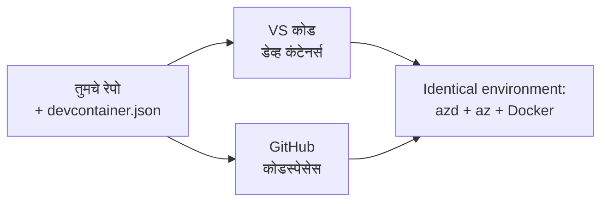

# azd साठी देव कंटेनर & GitHub Codespaces

**अध्याय नेव्हिगेशन:**
- **📚 कोर्स होम**: [AZD For Beginners](../../README.md)
- **📖 चालू अध्याय**: अध्याय 1 - पाया आणि जलद प्रारंभ
- **⬅️ मागील**: [तुमचा स्वतःचा अ‍ॅप आणा](bring-your-own-app.md)
- **🚀 पुढील अध्याय**: [अध्याय 2: AI-प्रथम विकास](../chapter-02-ai-development/README.md)

> `azd 1.27.1` वर जुलै 2026 मध्ये पडताळलेले.

## परिचय

प्रत्येक मशीनवर azd, योग्य भाषा रनटाइम, Docker, आणि Azure CLI स्थापित करणे एक कष्टदायक काम आहे—आणि हा मुख्य कारण आहे की "माझ्या मशीनवर चालते" असे ट्युटोरियल दुसऱ्या कोणासाठी काम करत नाही. एक **देव कंटेनर** ह्याला निराकरण करतो जो तुमच्या संपूर्ण टूलचेनचे वर्णन एका फाईलमध्ये करतो. जो कोणी प्रकल्प VS कोड किंवा GitHub Codespaces मध्ये उघडतो त्याला नक्कलसारखेच वातावरण मिळते, ज्यात आधीच azd इन्स्टॉल केलेले असते. ही पद्धत तुम्हाला एक देव कंटेनर कसा जोडायचा ते दाखवते.

## शिकण्याचे उद्दिष्टे

या धड्याचा शेवटी, तुम्ही:
- देव कंटेनर म्हणजे काय आणि azd साठी त्याचा कसा उपयोग होतो हे समजून घ्या
- प्रकल्पात किमान `.devcontainer/devcontainer.json` जोडा
- देव कंटेनर *विशेषता* मार्फत azd, Azure CLI, आणि Docker समाविष्ट करा
- प्रकल्प GitHub Codespaces किंवा VS कोड मध्ये उघडा

## शिकण्याचे परिणाम

हा धडा पूर्ण केल्यानंतर, तुम्ही सक्षम असाल:
- azd प्रकल्पासाठी `devcontainer.json` लिहिणे
- मॅन्युअल इन्स्टॉलेशन्सशिवाय azd आणि Azure टूल्स जोडणे
- कंटेनर किंवा Codespace मधून `azd up` चालविणे

---

## देव कंटेनर म्हणजे काय?

देव कंटेनर हा डॉकर-आधारित विकास वातावरण आहे जो तुमच्या रिपॉजिटरीमध्ये `.devcontainer/devcontainer.json` फाईलने परिभाषित केला जातो. जेव्हा तुम्ही प्रकल्प उघडता:

- **VS कोड** (Dev Containers विस्तारासह) कंटेनर तयार करतो आणि त्याला जोडतो.
- **GitHub Codespaces** हा समान कंटेनर क्लाउडमध्ये तयार करतो आणि तुम्हाला ब्राउझर-आधारित संपादक देतो.

दोन्ही प्रकारे, प्रत्येक सहयोगीला अगदी सारखी साधने मिळतात—कुठल्याही "तुम्ही azd इन्स्टॉल केले का?" अशा त्रुटी नाहीत.



---

## पाऊल 1: devcontainer फाईल तयार करा

तुमच्या प्रकल्पाच्या मूळ फोल्डरमध्ये `.devcontainer/devcontainer.json` तयार करा:

```json
{
  "name": "azd-project",
  "image": "mcr.microsoft.com/devcontainers/base:bookworm",
  "features": {
    "ghcr.io/devcontainers/features/azure-cli:1": {},
    "ghcr.io/azure/azure-dev/azd:latest": {},
    "ghcr.io/devcontainers/features/docker-in-docker:2": {},
    "ghcr.io/devcontainers/features/node:1": {}
  },
  "customizations": {
    "vscode": {
      "extensions": [
        "ms-azuretools.azure-dev",
        "ms-azuretools.vscode-bicep"
      ]
    }
  },
  "forwardPorts": [3000],
  "postCreateCommand": "azd version"
}
```

प्रत्येक भागाचे कार्य:

| कळी | उद्दिष्ट |
|-----|---------|
| `image` | कंटेनरसाठी बेस ऑपरेटिंग सिस्टम |
| `features` | पूर्व-निर्मित इन्स्टॉलर—येथे: Azure CLI, **azd**, Docker, आणि Node.js |
| `customizations.vscode.extensions` | azd आणि Bicep VS कोड एक्सटेंशन्स आपोआप इन्स्टॉल करते |
| `forwardPorts` | तुमच्या अ‍ॅपचा पोर्ट ब्राउझरपर्यंत पोहोचवतो |
| `postCreateCommand` | कंटेनर तयार केल्यानंतर एकदा चालवणारी आज्ञा (येथे, एक साधी तपासणी) |

> `ghcr.io/azure/azure-dev/azd:latest` वैशिष्ट्य हा कंटेनरमध्ये azd मिळविण्याचा अधिकृत मार्ग आहे. पुनरुत्पादकतेसाठी विशिष्ट आवृत्ती (उदा. `azd:1.27.1`) पिन करा.

---

## पाऊल 2: तुमच्या अ‍ॅपच्या भाषेशी वैशिष्ट्य जुळवा

तुमच्या अ‍ॅपमध्ये जे भाषेचा वापर आहे ते वैशिष्ट्य `node` ऐवजी बदला:

```jsonc
// Python project
"ghcr.io/devcontainers/features/python:1": {},

// .NET project
"ghcr.io/devcontainers/features/dotnet:2": {},

// Java project
"ghcr.io/devcontainers/features/java:1": {},

// Go project
"ghcr.io/devcontainers/features/go:1": {}
```

तुमचा `host` `containerapp`, `aks`, किंवा कंटेनर इमेज तयार करणारा असल्यास `docker-in-docker` ठेवा—azd ला Docker इमेज तयार करणे आणि पुश करण्यासाठी आवश्यक आहे.

---

## पाऊल 3: उघडा

**VS कोडमध्ये:**
1. **Dev Containers** एक्सटेंशन इन्स्टॉल करा.
2. प्रकल्प फोल्डर उघडा.
3. विचारल्यावर **Reopen in Container** क्लिक करा (किंवा *Dev Containers: Reopen in Container* चालवा).

**GitHub Codespaces मध्ये:**
1. रेपो GitHub वर पुश करा.
2. **Code → Codespaces → Create codespace on main** क्लिक करा.
3. कंटेनर तयार होईपर्यंत प्रतीक्षा करा—azd टर्मिनलमध्ये तयार आहे.

---

## पाऊल 4: कंटेनरच्या आतून तैनात करा

कंटेनरमध्ये azd आधीच इन्स्टॉल असतो, त्यामुळे सामान्य कार्यप्रवाह सहज काम करतो:

```bash
azd auth login --use-device-code   # डिव्हाइस कोड Codespaces मध्ये उपयुक्त आहे
azd up
```

> **`--use-device-code` का?** रिमोट कंटेनर किंवा Codespace मध्ये स्थानिक ब्राउझर नसल्यामुळे, डिव्हाइस-कोड लॉगिन हा विश्वसनीय मार्ग आहे. तुम्ही लॉगिन पूर्ण करण्यासाठी ब्राउझर टॅबमध्ये कोड पेस्ट कराल.

---

## सामान्य चुका

| अडचण | उपाय |
|---------|-----|
| `azd up` इमेज तयार करू शकत नाही | `docker-in-docker` वैशिष्ट्य जोडा |
| Codespaces मध्ये ब्राउझर लॉगिन अडकतो | `azd auth login --use-device-code` वापरा |
| साधने टीममधील लोकांमध्ये वेगवेगळी आहेत | वैशिष्ट्य आवृत्त्या पिन करा (उदा. `azd:1.27.1`) |
| अ‍ॅप ब्राउझरमध्ये पोहोचण्याजोगं नाही | `forwardPorts` मध्ये पोर्ट जोडा |

---

## सारांश

- देव कंटेनर तुमचा azd टूलचेन प्रत्येकासाठी पुनरुत्पादनीय बनवतो.
- Dev कंटेनर *विशेषता* वापरून azd, Azure CLI, आणि Docker जोडा.
- तुमच्या अ‍ॅपसाठी भाषा वैशिष्ट्य जुळवा आणि कंटेनर होस्टसाठी `docker-in-docker` ठेवा.
- Codespaces मध्ये चालवताना डिव्हाइस-कोड लॉगिन वापरा.

---

## 🔗 नेव्हिगेशन

| दिशा | संसाधन |
|-----------|----------|
| **मागील** | [तुमचा स्वतःचा अ‍ॅप आणा](bring-your-own-app.md) |
| **अध्याय होम** | [अध्याय 1: पाया आणि जलद प्रारंभ](README.md) |
| **पुढील अध्याय** | [अध्याय 2: AI-प्रथम विकास](../chapter-02-ai-development/README.md) |

## 📖 संबंधित संसाधने

- [इंस्टॉलेशन आणि सेटअप](installation.md)
- [कमान्ड चीट शीट](../../resources/cheat-sheet.md)
- [आधिकारिक देव कंटेनर स्पेसिफिकेशन](https://containers.dev/)
- [azd Dev Container वैशिष्ट्य](https://github.com/Azure/azure-dev/tree/main/ext/devcontainer)

---

<!-- CO-OP TRANSLATOR DISCLAIMER START -->
**अस्वीकरण**:
हा दस्तऐवज AI भाषांतर सेवा [Co-op Translator](https://github.com/Azure/co-op-translator) चा वापर करून अनुवादित केला आहे. जरी आम्ही अचूकतेसाठी प्रयत्न करतो, तरी कृपया लक्षात घ्या की स्वयंचलित भाषांतरांमध्ये त्रुटी किंवा अचूकतेची कमतरता असू शकते. मूळ दस्तऐवज त्याच्या मूळ भाषेत अधिकृत स्रोत मानला पाहिजे. महत्त्वाची माहिती असल्यास, व्यावसायिक मानवी भाषांतराची शिफारस केली जाते. या भाषांतराच्या वापरामुळे उद्भवणाऱ्या कोणत्याही गैरसमज किंवा चुकीच्या अर्थलावणीसाठी आम्ही जबाबदार नाही.
<!-- CO-OP TRANSLATOR DISCLAIMER END -->