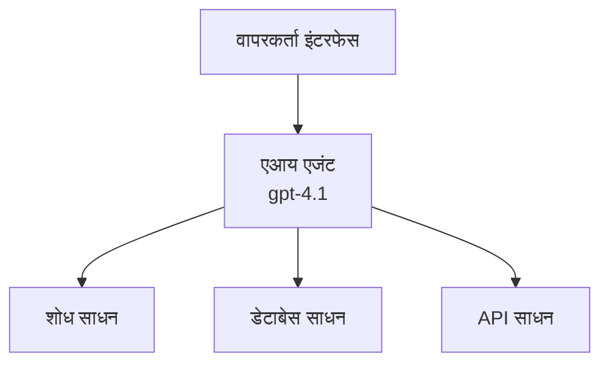
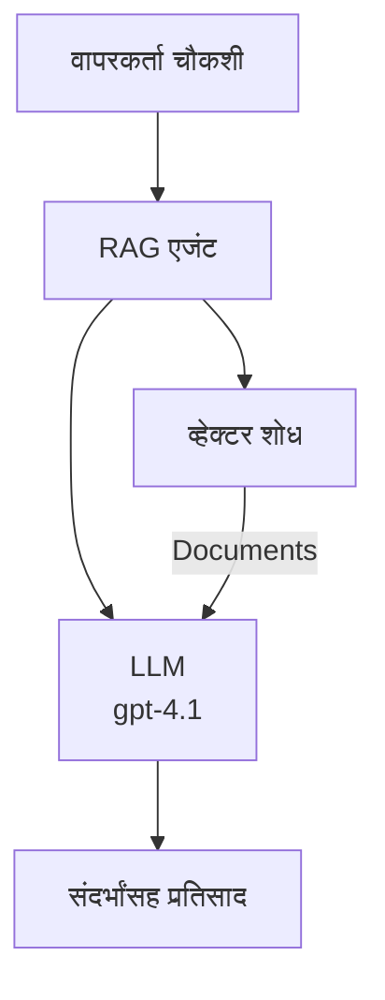
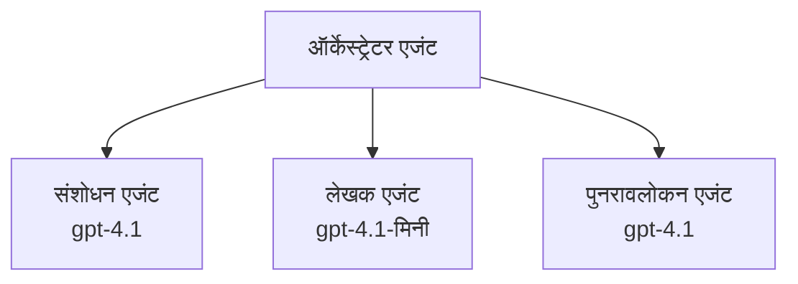

# Azure Developer CLI सह AI एजंट्स

**प्रकरण नेव्हिगेशन:**
- **📚 कोर्स होम**: [AZD For Beginners](../../README.md)
- **📖 चालू प्रकरण**: प्रकरण 2 - AI-फर्स्ट विकास
- **⬅️ मागील**: [Microsoft Foundry Integration](microsoft-foundry-integration.md)
- **➡️ पुढील**: [AI Model Deployment](ai-model-deployment.md)
- **🚀 प्रगत**: [Multi-Agent Solutions](../../examples/retail-scenario.md)

---

## परिचय

AI एजंट्स म्हणजे स्वायत्त प्रोग्राम जे त्यांच्या वातावरणाचे निरीक्षण करू शकतात, निर्णय घेऊ शकतात आणि विशिष्ट उद्दिष्टे साध्य करण्यासाठी क्रिया करू शकतात. साध्या चॅटबॉट्सपेक्षा वेगळे जे फक्त प्रॉम्प्ट्सना प्रतिसाद देतात, एजंट्स:

- **साधने वापरतात** - API कॉल करणे, डेटाबेस शोधणे, कोड चालवणे
- **योजना आखतात आणि तर्क करतात** - गुंतागुंतीच्या कार्यांना टप्प्यांमध्ये विभागतात
- **संदर्भातून शिकतात** - स्मृती राखतात आणि वर्तनास अनुकूल करतात
- **सहकार्य करतात** - इतर एजंट्ससोबत काम करतात (मल्टी-एजंट सिस्टम्स)

हा मार्गदर्शक आपल्याला Azure Developer CLI (azd) वापरून Azure वर AI एजंट्स कसे तैनात करायचे हे दाखवतो.

> **मान्यता सूचना (2026-07-13):** हा मार्गदर्शक `azd` च्या `1.27.1` आणि `azure.ai.agents` च्या `1.0.0-beta.5` विरुद्ध पुनरावलोकन केला आहे. `azd ai` अनुभव अजूनही प्रीव्ह्यू-आधारित आहे, त्यामुळे आपले स्थापित फ्लॅग वेगळे असतील तर एक्सटेंशन मदत तपासा.

## शिकलो काय?

हा मार्गदर्शक पूर्ण केल्यानंतर आपण:
- AI एजंट्स काय आहेत आणि ते चॅटबॉट्सपेक्षा कसे वेगळे आहेत हे समजून घ्याल
- AZD वापरून पूर्वनिर्मित AI एजंट टेम्पलेट्स तैनात कराल
- कस्टम एजंट्ससाठी Foundry Agents कॉन्फिगर कराल
- मूलभूत एजंट नमुने (साधने वापरणे, RAG, मल्टी-एजंट) राबवाल
- तैनात एजंटांचे निरीक्षण आणि डीबगिंग कराल

## शिकण्याचे परिणाम

पूर्ण झाल्यावर, आपण सक्षम असाल:
- एकच आदेश वापरून Azure वर AI एजंट अनुप्रयोग तैनात करणे
- एजंट साधने आणि क्षमता कॉन्फिगर करणे
- एजंटसह retrieval-augmented generation (RAG) अमलात आणणे
- गुंतागुंतीच्या कार्यांसाठी मल्टी-एजंट आर्किटेक्चर्स डिझाइन करणे
- सामान्य एजंट तैनाती समस्या सोडवणे

---

## 🤖 एजंट आणि चॅटबॉटमधील फरक काय आहे?

| वैशिष्ट्य | चॅटबॉट | AI एजंट |
|---------|---------|----------|
| **वर्तन** | प्रॉम्प्ट्सना प्रतिसाद देतो | स्वायत्त क्रिया घेतो |
| **साधने** | नाही | API कॉल करू शकतो, शोध करू शकतो, कोड चालवू शकतो |
| **स्मृती** | सत्र-आधारित फक्त | सत्रांमध्ये टिकणारी स्मृती |
| **योजना आखणे** | एकदाच उत्तर देणे | बहु-टप्प्यांचा तर्क |
| **सहकार्य** | एकक म्हणून | इतर एजंट्ससोबत काम करू शकतो |

### सोपा समानार्थ

- **चॅटबॉट** = माहिती डेस्कवरील प्रश्नांची उत्तर देणारा मदतीचा व्यक्ती
- **AI एजंट** = एक वैयक्तिक सहाय्यक जो कॉल करू शकतो, अपॉइंटमेंट्स बुक करू शकतो आणि कार्य पूर्ण करू शकतो

---

## 🚀 जलद प्रारंभ: आपला पहिला एजंट तैनात करा

### पर्याय 1: Foundry Agents टेम्पलेट (शिफारस केलेले)

```bash
# एआय एजंट टेम्पलेट प्रारंभ करा
azd init --template get-started-with-ai-agents

# Azure वर तैनात करा
azd up
```

**तैनात होणारे:**
- ✅ Foundry Agents
- ✅ Microsoft Foundry मॉडेल्स (gpt-4.1)
- ✅ Azure AI Search (RAG साठी)
- ✅ Azure Container Apps (वेब इंटरफेस)
- ✅ Application Insights (निरीक्षण)

**वेळ:** ~15-20 मिनिटे
**खर्च:** ~$100-150/महिना (विकासासाठी)

### पर्याय 2: OpenAI एजंट Prompty सह

```bash
# Prompty-आधारित एजंट टेम्पलेट प्रारंभ करा
azd init --template agent-openai-python-prompty

# Azure वर तैनात करा
azd up
```

**तैनात होणारे:**
- ✅ Azure Functions (सर्व्हरलेस एजंट अंमलबजावणी)
- ✅ Microsoft Foundry मॉडेल्स
- ✅ Prompty कॉन्फिगरेशन फाइल्स
- ✅ नमुना एजंट अंमलबजावणी

**वेळ:** ~10-15 मिनिटे
**खर्च:** ~$50-100/महिना (विकासासाठी)

### पर्याय 3: RAG चॅट एजंट

```bash
# RAG चॅट टेम्पलेट प्रारंभ करा
azd init --template azure-search-openai-demo

# Azure वर तैनात करा
azd up
```

**तैनात होणारे:**
- ✅ Microsoft Foundry मॉडेल्स
- ✅ नमुना डेटासह Azure AI Search
- ✅ दस्तऐवज प्रक्रिया पाइपलाइन
- ✅ संदर्भांसह चॅट इंटरफेस

**वेळ:** ~15-25 मिनिटे
**खर्च:** ~$80-150/महिना (विकासासाठी)

### पर्याय 4: AZD AI एजंट इनीशियलायझेशन (मॅनिफेस्ट किंवा टेम्पलेट-आधारित प्रीव्ह्यू)

आपल्याकडे एजंट मॅनिफेस्ट फाइल असल्यास, आपण `azd ai` आदेश वापरून थेट Foundry Agent Service प्रकल्प स्कॅफोल्ड करू शकता. अलीकडील प्रीव्ह्यू आवृत्त्यांमध्ये टेम्पलेट-आधारित प्रारंभिक समर्थन देखील जोडले आहे, त्यामुळे आपल्या स्थापित एक्सटेंशन आवृत्तीवर आधारित प्रॉम्प्ट प्रवाह थोडा भिन्न असू शकतो.

```bash
# AI एजंट्स एक्सटेंशन स्थापित करा
azd extension install azure.ai.agents

# ऐच्छिक: स्थापित केलेली पूर्वावलोकन आवृत्ती सत्यापित करा
azd extension show azure.ai.agents

# एजंट मॅनिफेस्टमधून प्रारंभ करा
azd ai agent init -m agent-manifest.yaml

# Azure वर तैनात करा
azd up

# तैनात केलेल्या एजंटची चाचणी करा (लेटन्सी + पहिल्या बाईटपर्यंतचा वेळ दर्शविते)
azd ai agent invoke
```

**कधी `azd ai agent init` वापरावे व `azd init --template`:**

| दृष्टिकोन | सर्वोत्तमासाठी | कसे कार्य करते |
|----------|----------|------|
| `azd init --template` | काम करणाऱ्या नमुना अॅपपासून प्रारंभ | पूर्ण टेम्पलेट रिपॉ क्लोन करतो कोड + इन्फ्रा सह |
| `azd ai agent init -m` | आपला स्वतःचा एजंट मॅनिफेस्ट वापरून बांधत आहे | आपल्या एजंट परिभाषेतून प्रकल्प संरचना स्कॅफोल्ड करतो |

> **टीप:** शिकत असताना `azd init --template` वापरा (वरील पर्याय 1-3). उत्पादन एजंट तयार करताना `azd ai agent init` वापरा ज्यात आपले स्वतःचे मॅनिफेस्ट असतील.

`azd up` नंतर, त्याच एक्सटेंशनमुळे एजंट जीवनचक्र चालू राहते: `azd ai agent invoke` तपासणीसाठी, `azd ai agent eval generate` आणि `azd ai agent optimize` गुणवत्ता मोजण्यासाठी आणि सुधारण्यासाठी, व `azd ai agent delete` साफसफाईसाठी. संपूर्ण संदर्भासाठी [AZD AI CLI Commands](../chapter-08-production/production-ai-practices.md#azd-ai-cli-commands-and-extensions) पाहा.

---

## 🏗️ एजंट आर्किटेक्चर नमुने

### नमुना 1: साधनांसह एकल एजंट

सर्वात सोपा एजंट नमुना - एक एजंट जो एकाधिक साधने वापरू शकतो.



**सर्वोत्तम:**
- ग्राहक समर्थन बॉट्स
- संशोधन सहाय्यक
- डेटा विश्लेषण एजंट्स

**AZD टेम्पलेट:** `azure-search-openai-demo`

### नमुना 2: RAG एजंट (रिट्रीवल-ऑगमेंटेड जनरेशन)

उत्तर तयार करण्यापूर्वी संबंधित दस्तऐवज पुनर्प्राप्त करणारा एजंट.



**सर्वोत्तम:**
- एंटरप्राइझ ज्ञानाधार
- दस्तऐवज Q&A प्रणाली
- अनुपालन आणि कायदेशीर संशोधन

**AZD टेम्पलेट:** `azure-search-openai-demo`

### नमुना 3: मल्टी-एजंट प्रणाली

अनेक विशेष एजंट्स संयुक्तपणे गुंतागुंतीच्या कार्यांवर काम करतात.



**सर्वोत्तम:**
- गुंतागुंतीची सामग्री निर्मिती
- बहु-टप्प्यांचे कार्यप्रवाह
- वेगवेगळ्या तज्ज्ञतेची आवश्यकता असलेली कार्ये

**अधिक जाणून घ्या:** [मल्टी-एजंट समन्वय नमुने](../chapter-06-pre-deployment/coordination-patterns.md)

---

## ⚙️ एजंट साधने कॉन्फिगर करणे

एजंट्स सामर्थ्यवान होतात जेव्हा ते साधने वापरू शकतात. सामान्य साधने याप्रमाणे कॉन्फिगर करा:

### Foundry Agents मध्ये साधन कॉन्फिगरेशन

```python
# agent_config.py
from azure.ai.projects import AIProjectClient
from azure.ai.projects.models import FunctionTool, CodeInterpreterTool

# सानुकूल साधने परिभाषित करा
search_tool = FunctionTool(
    name="search_knowledge_base",
    description="Search the company knowledge base for relevant documents",
    parameters={
        "type": "object",
        "properties": {
            "query": {
                "type": "string",
                "description": "The search query"
            }
        },
        "required": ["query"]
    }
)

# साधने वापरून एजंट तयार करा
agent = project_client.agents.create_agent(
    model="gpt-4.1",
    name="Support Agent",
    instructions="You are a helpful support agent. Use the search tool to find relevant information.",
    tools=[search_tool, CodeInterpreterTool()]
)
```

### पर्यावरण कॉन्फिगरेशन

```bash
# एजंट-विशिष्ट वातावरणीय चल सेट करा
azd env set AZURE_OPENAI_MODEL "gpt-4.1"
azd env set AGENT_INSTRUCTIONS "You are a helpful assistant..."
azd env set ENABLE_CODE_INTERPRETER "true"
azd env set ENABLE_FILE_SEARCH "true"

# अद्यतनित संरचनेसह तैनात करा
azd deploy
```

---

## 📊 एजंट्सचे निरीक्षण

### Application Insights एकत्रीकरण

सर्व AZD एजंट टेम्पलेट्समध्ये निरीक्षणासाठी Application Insights समाविष्ट आहे:

```bash
# ओपन मॉनिटरिंग डॅशबोर्ड
azd monitor --overview

# लाईव्ह लॉग्स पहा
azd monitor --logs

# लाईव्ह मेट्रिक्स पहा
azd monitor --live
```

### लक्ष ठेवा अशी मुख्य मेट्रिक्स

| मेट्रिक | वर्णन | लक्ष्य |
|--------|-------------|--------|
| प्रतिसाद विलंब | प्रतिसाद तयार होण्याचा वेळ | < 5 सेकंद |
| टोकन वापर | विनंतीप्रमाणे टोकन्स | किंमतीसाठी देखरेख |
| साधन कॉल यशस्वी दर | यशस्वी साधन अंमलबजावणी टक्केवारी | > 95% |
| त्रुटी दर | अयशस्वी एजंट विनंत्या | < 1% |
| वापरकर्ता समाधान | अभिप्राय गुण | > 4.0/5.0 |

### एजंटसाठी सानुकूल लॉगिंग

```python
import os
from azure.monitor.opentelemetry import configure_azure_monitor
from opentelemetry import trace

# OpenTelemetry सह Azure Monitor कॉन्फिगर करा
configure_azure_monitor(
    connection_string=os.environ["APPLICATIONINSIGHTS_CONNECTION_STRING"]
)

tracer = trace.get_tracer(__name__)

def log_agent_interaction(user_query, agent_response, tools_used, latency_ms):
    with tracer.start_as_current_span("agent_interaction") as span:
        span.set_attributes({
            "user_query": user_query,
            "response_length": len(agent_response),
            "tools_used": tools_used,
            "latency_ms": latency_ms
        })
```

> **टीप:** आवश्यक पॅकेजेस इन्स्टॉल करा: `pip install azure-monitor-opentelemetry opentelemetry`

---

## 💰 खर्च विचार

### नमुन्यानुसार अंदाजित मासिक खर्च

| नमुना | विकास पर्यावरण | उत्पादन |
|---------|-----------------|------------|
| एकल एजंट | $50-100 | $200-500 |
| RAG एजंट | $80-150 | $300-800 |
| मल्टी-एजंट (2-3 एजंट) | $150-300 | $500-1,500 |
| एंटरप्राइझ मल्टी-एजंट | $300-500 | $1,500-5,000+ |

### खर्च ऑप्टिमायझेशन टिप्स

1. **साध्या कार्यांसाठी gpt-4.1-mini वापरा**
   ```bash
   azd env set AZURE_OPENAI_MODEL "gpt-4.1-mini"
   ```

2. **वारंवार प्रश्नांसाठी कॅशिंग अमलात आणा**
   ```python
   from functools import lru_cache
   
   @lru_cache(maxsize=1000)
   def get_cached_response(query_hash):
       return agent.run(query_hash)
   ```

3. **प्रत्येक चालवण्यावर टोकन मर्यादा ठेवा**
   ```python
   # एजंट चालवताना max_completion_tokens सेट करा, निर्मितीच्या वेळी नाही
   run = project_client.agents.create_run(
       thread_id=thread.id,
       agent_id=agent.id,
       max_completion_tokens=1000  # प्रतिसादाची लांबी मर्यादित करा
   )
   ```

4. **वापरात नसतानाच शून्यावर स्केल करा**
   ```bash
   # कंटेनर अॅप्स आपोआप शून्यापर्यंत वाढतात
   azd env set MIN_REPLICAS "0"
   ```

---

## 🔧 एजंट्स त्रुटी निवारण

### सामान्य समस्या आणि उपाय

<details>
<summary><strong>❌ एजंट साधन कॉल्सना प्रतिसाद देत नाही</strong></summary>

```bash
# साधने योग्यरित्या नोंदणीकृत आहेत का ते तपासा
azd show

# OpenAI वितरणाची पुष्टी करा
az cognitiveservices account deployment list \
  --name $AZURE_OPENAI_NAME \
  --resource-group $RG_NAME

# एजंट लॉग्स तपासा
azd monitor --logs
```

**सामान्य कारणे:**
- साधन फंक्शन सिग्नेचर जुळत नाही
- आवश्यक परवानग्या गहाळ आहेत
- API एंडपॉइंट प्रवेशयोग्य नाही
</details>

<details>
<summary><strong>❌ एजंट प्रतिसादांमध्ये उच्च विलंब</strong></summary>

```bash
# अडथळ्यांसाठी ऍप्लिकेशन इन्साइट्स तपासा
azd monitor --live

# जलद मॉडेल वापरण्याचा विचार करा
azd env set AZURE_OPENAI_MODEL "gpt-4.1-mini"
azd deploy
```

**ऑप्टिमायझेशन टिप्स:**
- स्ट्रीमिंग प्रतिसाद वापरा
- प्रतिसाद कॅशिंग अमलात आणा
- संदर्भ विंडो आकार कमी करा
</details>

<details>
<summary><strong>❌ एजंट चुकीची किंवा भ्रम निर्माण करणारी माहिती देतो</strong></summary>

```python
# चांगल्या सिस्टम प्रॉम्प्टसह सुधारणा करा
instructions = """
You are a helpful assistant. IMPORTANT:
- Only answer based on provided context
- If you don't know, say "I don't know"
- Always cite your sources
- Never make up information
"""

# ग्राउंडिंगसाठी पुनर्प्राप्ती जोडा
agent = project_client.agents.create_agent(
    model="gpt-4.1",
    instructions=instructions,
    tools=[FileSearchTool()]  # प्रतिसादांना दस्तऐवजांमध्ये आधारभूत करा
)
```
</details>

<details>
<summary><strong>❌ टोकन मर्यादा ओलांडल्याचे त्रुटी</strong></summary>

```python
# संदर्भ विंडो व्यवस्थापन अंमलात आणा
def truncate_context(messages, max_tokens=8000, model="gpt-4.1"):
    """Keep only recent messages within token limit."""
    import tiktoken
    encoding = tiktoken.encoding_for_model(model)
    total_tokens = 0
    truncated = []
    
    for msg in reversed(messages):
        msg_tokens = len(encoding.encode(msg.content))
        if total_tokens + msg_tokens > max_tokens:
            break
        truncated.insert(0, msg)
        total_tokens += msg_tokens
    
    return truncated
```
</details>

---

## 🎓 हाताळणी सराव

### सराव 1: मूलभूत एजंट तैनात करा (20 मिनिटे)

**उद्दिष्ट:** AZD वापरून आपला पहिला AI एजंट तैनात करा

```bash
# टप्पा 1: टेम्पलेट प्रारंभ करा
azd init --template get-started-with-ai-agents

# टप्पा 2: Azure मध्ये लॉगिन करा
azd auth login
# जर तुम्ही विविध टेनंट्सवर काम करत असाल तर --tenant-id <tenant-id> जोडा

# टप्पा 3: तैनात करा
azd up

# टप्पा 4: एजंटची चाचणी करा
# तैनाती नंतर अपेक्षित आउटपुट:
#   तैनात पूर्ण झाले!
#   एंडपॉइंट: https://<app-name>.<region>.azurecontainerapps.io
# आउटपुटमध्ये दाखवलेला URL उघडा आणि प्रश्न विचारण्याचा प्रयत्न करा

# टप्पा 5: मॉनिटरिंग पहा
azd monitor --overview

# टप्पा 6: साफसफाई करा
azd down --force --purge
```

**यशस्वी निकष:**
- [ ] एजंट प्रश्नांना प्रतिसाद देतो
- [ ] `azd monitor` वापरून निरीक्षण डॅशबोर्डवर प्रवेश करू शकतो
- [ ] संसाधने यशस्वीपणे साफ केली गेली

### सराव 2: कस्टम साधन जोडा (30 मिनिटे)

**उद्दिष्ट:** एजंटसाठी कस्टम साधन वाढविणे

1. एजंट टेम्पलेट तैनात करा:
   ```bash
   azd init --template get-started-with-ai-agents
   azd up
   ```
2. आपल्या एजंट कोडमध्ये नवीन साधन फंक्शन तयार करा:
   ```python
   def get_weather(location: str) -> str:
       """Get current weather for a location."""
       # हवामान सेवेच्या API कॉल
       return f"Weather in {location}: Sunny, 72°F"
   ```
3. एजंटसह साधन नोंदणी करा:
   ```python
   from azure.ai.projects.models import FunctionTool

   weather_tool = FunctionTool(
       name="get_weather",
       description="Get current weather for a location",
       parameters={
           "type": "object",
           "properties": {
               "location": {"type": "string", "description": "City name"}
           },
           "required": ["location"]
       }
   )

   agent = project_client.agents.create_agent(
       model="gpt-4.1",
       name="Weather Agent",
       tools=[weather_tool]
   )
   ```
4. पुन्हा तैनात करा आणि चाचणी करा:
   ```bash
   azd deploy
   # विचारा: "सिएटलमधील हवामान काय आहे?"
   # अपेक्षित: एजंट get_weather("सिएटल") कॉल करतो आणि हवामान माहिती परत करतो
   ```

**यशस्वी निकष:**
- [ ] एजंट हवामान-संबंधित प्रश्न ओळखतो
- [ ] साधन योग्यरित्या कॉल केले गेले आहे
- [ ] प्रतिसादात हवामान माहिती समाविष्ट आहे

### सराव 3: RAG एजंट तयार करा (45 मिनिटे)

**उद्दिष्ट:** आपल्या दस्तऐवजांमधून प्रश्नांची उत्तरे देणारा एजंट तयार करा

```bash
# टप्पा 1: RAG टेम्पलेट तैनात करा
azd init --template azure-search-openai-demo
azd up

# टप्पा 2: आपली कागदपत्रे अपलोड करा
# PDF/TXT फाइल्स data/ डिरेक्टरीमध्ये ठेवा, नंतर चालवा:
python scripts/prepdocs.py

# टप्पा 3: डोमेन-विशिष्ट प्रश्नांसह चाचणी करा
# azd up आउटपुटमधील वेब ऍप URL उघडा
# आपल्या अपलोड केलेल्या कागदपत्रांबद्दल प्रश्न विचारा
# प्रतिसादांमध्ये [doc.pdf] सारख्या संदर्भांचा समावेश असावा
```

**यशस्वी निकष:**
- [ ] एजंट अपलोड केलेल्या दस्तऐवजांमधून उत्तर देतो
- [ ] प्रतिसादांमध्ये संदर्भ समाविष्ट आहेत
- [ ] चौकटीबाहेरच्या प्रश्नांवर भ्रम नाही

---

## 📚 पुढील पावले

आता जेव्हा आपण AI एजंट्स समजून घेतले आहेत, तर पुढील प्रगत विषय शोधा:

| विषय | वर्णन | दुवा |
|-------|-------------|------|
| **मल्टी-एजंट सिस्टम्स** | एकाधिक सहकार्यातील एजंट्ससह प्रणाली तयार करा | [Retail Multi-Agent Example](../../examples/retail-scenario.md) |
| **समन्वय नमुने** | संयोजन आणि संवाद नमुने शिका | [Coordination Patterns](../chapter-06-pre-deployment/coordination-patterns.md) |
| **उत्पादन तैनाती** | एंटरप्राइझ-तयार एजंट तैनात करा | [Production AI Practices](../chapter-08-production/production-ai-practices.md) |
| **एजंट मूल्यांकन** | एजंट कार्यक्षमता तपासा आणि मूल्यांकन करा | [AI Troubleshooting](../chapter-07-troubleshooting/ai-troubleshooting.md) |
| **AI कार्यशाळा लॅब** | हस्तक्षेप: आपल्या AI सोल्यूशनला AZD-तयार करा | [AI Workshop Lab](ai-workshop-lab.md) |

---

## 📖 अतिरिक्त संसाधने

### अधिकृत दस्तऐवज
- [Microsoft Foundry Agent Service](https://learn.microsoft.com/azure/ai-services/agents/)
- [Microsoft Foundry Agent Service Quickstart](https://learn.microsoft.com/azure/ai-services/agents/quickstart)
- [Semantic Kernel Agent Framework](https://learn.microsoft.com/semantic-kernel/)

### एजंटसाठी AZD टेम्पलेट्स
- [AI Agents सह प्रारंभ करा](https://github.com/Azure-Samples/get-started-with-ai-agents)
- [Agent OpenAI Python Prompty](https://github.com/Azure-Samples/agent-openai-python-prompty)
- [Azure Search OpenAI Demo](https://github.com/Azure-Samples/azure-search-openai-demo)

### समुदाय संसाधने
- [Awesome AZD - Agent Templates](https://azure.github.io/awesome-azd/?tags=ai-agents)
- [Azure AI Discord](https://discord.gg/microsoft-azure)
- [Microsoft Foundry Discord](https://discord.gg/nTYy5BXMWG)

### आपल्या संपादकासाठी एजंट कौशल्ये
- [**Microsoft Azure Agent Skills**](https://skills.sh/microsoft/github-copilot-for-azure) - GitHub Copilot, Cursor किंवा कोणत्याही समर्थित एजंटमध्ये Azure विकासासाठी पुनर्वापरयोग्य AI एजंट कौशल्ये इंस्टॉल करा. यात [Azure AI](https://skills.sh/microsoft/github-copilot-for-azure/azure-ai), [Microsoft Foundry](https://skills.sh/microsoft/github-copilot-for-azure/microsoft-foundry), [तैनाती](https://skills.sh/microsoft/github-copilot-for-azure/azure-deploy), आणि [निदान](https://skills.sh/microsoft/github-copilot-for-azure/azure-diagnostics) यांच्या कौशल्यांचा समावेश आहे:
  ```bash
  npx skills add microsoft/github-copilot-for-azure
  ```

---

**नेव्हिगेशन**
- **मागील धडा**: [Microsoft Foundry Integration](microsoft-foundry-integration.md)
- **पुढील धडा**: [AI Model Deployment](ai-model-deployment.md)

---

<!-- CO-OP TRANSLATOR DISCLAIMER START -->
**अस्वीकरण**:
हा दस्तऐवज AI भाषांतर सेवा [Co-op Translator](https://github.com/Azure/co-op-translator) चा वापर करून अनुवादित केला आहे. जरी आम्ही अचूकतेसाठी प्रयत्न करतो, तरी कृपया लक्षात घ्या की स्वयंचलित भाषांतरांमध्ये त्रुटी किंवा अचूकतेची कमतरता असू शकते. मूळ दस्तऐवज त्याच्या मूळ भाषेत अधिकृत स्रोत मानला पाहिजे. महत्त्वाची माहिती असल्यास, व्यावसायिक मानवी भाषांतराची शिफारस केली जाते. या भाषांतराच्या वापरामुळे उद्भवणाऱ्या कोणत्याही गैरसमज किंवा चुकीच्या अर्थलावणीसाठी आम्ही जबाबदार नाही.
<!-- CO-OP TRANSLATOR DISCLAIMER END -->