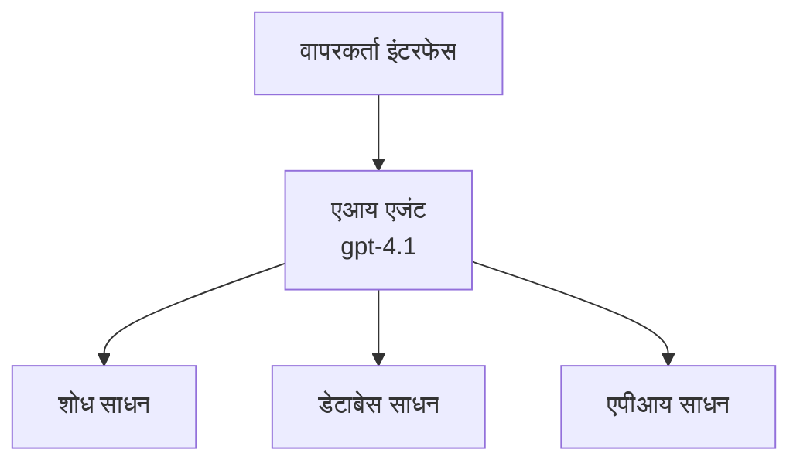
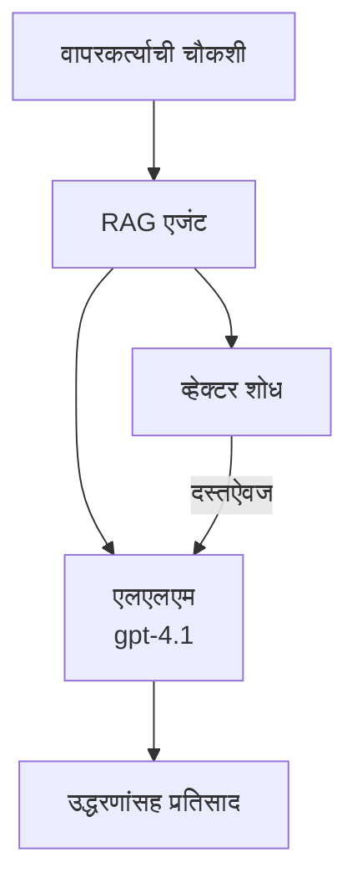
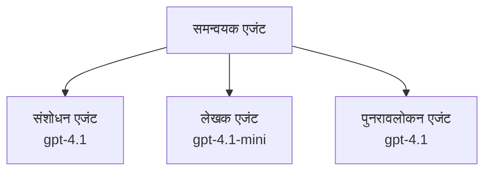

# Azure Developer CLI सह AI एजंट्स

**अध्याय नेव्हिगेशन:**
- **📚 Course Home**: [AZD For Beginners](../../README.md)
- **📖 Current Chapter**: अध्याय 2 - AI-प्रथम विकास
- **⬅️ Previous**: [Microsoft Foundry Integration](microsoft-foundry-integration.md)
- **➡️ Next**: [AI Model Deployment](ai-model-deployment.md)
- **🚀 Advanced**: [एकाधिक एजंट उपाय](../../examples/retail-scenario.md)

---

## परिचय

AI एजंट्स हे स्वायत्त प्रोग्राम आहेत जे त्यांच्या वातावरणाचे निरीक्षण करू शकतात, निर्णय घेऊ शकतात, आणि विशिष्ट उद्दिष्टे साध्य करण्यासाठी क्रिया करू शकतात. साध्या प्रॉम्प्ट-प्रतिसाद देणाऱ्या चॅटबॉट्सपेक्षा, एजंट्स हे करू शकतात:

- **टूल्स वापरा** - API कॉल करा, डेटाबेस शोधा, कोड चालवा
- **योजना आणि तर्क** - क्लिष्ट कार्यांना टप्प्यांमध्ये विभाजित करा
- **संदर्भातून शिका** - मेमरी राखून ठेवा आणि वर्तन अनुकूल करा
- **सहकार्य करा** - इतर एजंट्ससोबत काम करा (बहु-एजंट सिस्टम्स)

हा मार्गदर्शक तुम्हाला Azure वर Azure Developer CLI (azd) वापरून AI एजंट्स कसे डिप्लॉय करायचे ते दाखवतो.

> **प्रमाणीकरण नोंद (2026-03-25):** या मार्गदर्शकाची समीक्षा `azd` `1.23.12` आणि `azure.ai.agents` `0.1.18-preview` यांच्या विरुद्ध करण्यात आली. `azd ai` अनुभव अद्याप प्रीव्यू-आधारित आहे, त्यामुळे तुमचे स्थापित फ्लॅग वेगळे असतील तर एक्स्टेंशन मदत तपासा.

## शिकण्याचे उद्दिष्टे

हा मार्गदर्शक पूर्ण केल्यावर, तुम्ही:
- AI एजंट काय आहेत आणि ते चॅटबॉट्सपेक्षाही कसे वेगळे आहेत हे समजून घेणार
- AZD वापरून पूर्वनिर्मित AI एजंट टेम्पलेट्स डिप्लॉय करणार
- सानुकूल एजंटसाठी Foundry एजंट कॉन्फिगर करण्यास शिकलात
- मूलभूत एजंट पॅटर्न्स (टूल वापर, RAG, बहु-एजंट) अंमलात आणाल
- डिप्लॉय केलेल्या एजंटचे मॉनिटरिंग आणि डीबग करू शकाल

## शिकण्याचे परिणाम

पूर्ण केल्यावर, तुम्ही खालील करू शकाल:
- एकाच कमांडने Azure वर AI एजंट अ‍ॅप्लिकेशन्स डिप्लॉय करा
- एजंट टूल्स आणि क्षमता कॉन्फिगर करा
- एजंटसह retrieval-augmented generation (RAG) अंमलात आणा
- क्लिष्ट वर्कफ्लो साठी बहु-एजंट आर्किटेक्चर्स डिझाइन करा
- सामान्य एजंट डिप्लॉयमेंट समस्या troubleshoot करा

---

## 🤖 एजंट चॅटबॉटपेक्षा वेगळे कसे असतात?

| वैशिष्ट्य | चॅटबॉट | AI एजंट |
|---------|---------|----------|
| **वर्तन** | प्रॉम्प्ट्सना प्रतिसाद देते | स्वायत्तपणे क्रिया करतो |
| **टूल्स** | नाही | API कॉल करू शकतो, शोधू शकतो, कोड चालवू शकतो |
| **स्मृती** | फक्त सत्र-आधारित | सत्रांमध्ये कायमची मेमरी |
| **योजना** | एकच प्रतिसाद | अनेक टप्प्यांचे तर्क |
| **सहकार्य** | एकक घटक | इतर एजंट्ससोबत काम करू शकतो |

### साधे रूपक

- **चॅटबॉट** = माहिती डेस्कवर प्रश्नांची उत्तरे देणारी मदत करणारी व्यक्ती
- **AI एजंट** = एक वैयक्तिक सहाय्यक जो कॉल करू शकतो, अपॉइंटमेंट बुक करू शकतो, आणि तुमच्यासाठी कार्य पूर्ण करू शकतो

---

## 🚀 जलद प्रारंभ: आपला पहिला एजंट डिप्लॉय करा

### पर्याय 1: Foundry Agents टेम्पलेट (शिफारस)

```bash
# AI एजंट्सचे टेम्पलेट प्रारंभ करा
azd init --template get-started-with-ai-agents

# Azure वर तैनात करा
azd up
```

**काय डिप्लॉय केले जाते:**
- ✅ Foundry एजंट्स
- ✅ Microsoft Foundry मॉडेल्स (gpt-4.1)
- ✅ Azure AI Search (RAG साठी)
- ✅ Azure Container Apps (वेब इंटरफेस)
- ✅ Application Insights (मॉनिटरिंग)

**वेळ:** ~15-20 मिनिटे
**खर्च:** ~$100-150/महिना (विकास)

### पर्याय 2: Prompty सह OpenAI एजंट

```bash
# Prompty-आधारित एजंट टेम्पलेट प्रारंभ करा
azd init --template agent-openai-python-prompty

# Azure वर तैनात करा
azd up
```

**काय डिप्लॉय केले जाते:**
- ✅ Azure Functions (सर्व्हरलेस एजंट एक्झिक्युशन)
- ✅ Microsoft Foundry मॉडेल्स
- ✅ Prompty कॉन्फिगरेशन फाइल्स
- ✅ नमुना एजंट अंमलबजावणी

**वेळ:** ~10-15 मिनिटे
**खर्च:** ~$50-100/महिना (विकास)

### पर्याय 3: RAG चॅट एजंट

```bash
# RAG चॅट टेम्पलेट प्रारंभ करा
azd init --template azure-search-openai-demo

# Azure वर तैनात करा
azd up
```

**काय डिप्लॉय केले जाते:**
- ✅ Microsoft Foundry मॉडेल्स
- ✅ Azure AI Search नमुना डेटासह
- ✅ दस्तऐवज प्रक्रिया पाइपलाइन
- ✅ संदर्भांसह चॅट इंटरफेस

**वेळ:** ~15-25 मिनिटे
**खर्च:** ~$80-150/महिना (विकास)

### पर्याय 4: AZD AI Agent Init (मॅनिफेस्ट किंवा टेम्पलेट-आधारित प्रीव्यू)

जर तुमच्याकडे एजंट मॅनिफेस्ट फाइल असेल, तर तुम्ही `azd ai` कमांड वापरून थेट Foundry Agent Service प्रोजेक्ट scaffold करू शकता. अलीकडच्या प्रीव्यू रिलीजमध्ये टेम्पलेट-आधारित इनिशिअलायझेशन समर्थन देखील जोडले गेले आहे, त्यामुळे तुमच्या इंस्टॉल केलेल्या एक्सटेन्शन व्हर्जननुसार अचूक प्रॉम्प्ट फ्लो थोडा वेगळा असू शकतो.

```bash
# AI एजंट्स एक्सटेंशन इंस्टॉल करा
azd extension install azure.ai.agents

# ऐच्छिक: स्थापित केलेली प्रिव्ह्यू आवृत्ती सत्यापित करा
azd extension show azure.ai.agents

# एजंट मॅनिफेस्टपासून प्रारंभ करा
azd ai agent init -m agent-manifest.yaml

# Azure वर तैनात करा
azd up
```

**कधी `azd ai agent init` वापरावे vs `azd init --template`:**

| पध्दत | उत्तम साठी | कसे कार्य करते |
|----------|----------|------|
| `azd init --template` | कार्यरत नमुना अ‍ॅपपासून सुरूवात | कोड + इन्फ्रा असलेला पूर्ण टेम्पलेट रेपो क्लोन करतो |
| `azd ai agent init -m` | तुमच्या स्वतःच्या एजंट मॅनिफेस्टवरून बांधणी | तुमच्या एजंट परिभाषेवरून प्रोजेक्ट संरचना scaffold करतो |

> **Tip:** शोधताना `azd init --template` वापरा (वरील पर्याय 1-3). उत्पादन एजंट तुमच्या स्वतःच्या मॅनिफेस्टसह तयार करत असाल तेव्हा `azd ai agent init` वापरा. पूर्ण संदर्भासाठी [AZD AI CLI Commands](../chapter-08-production/production-ai-practices.md#azd-ai-cli-commands-and-extensions) पहा.

---

## 🏗️ एजंट आर्किटेक्चर पॅटर्न्स

### पॅटर्न 1: उपकरणांसह एकल एजंट

सर्वात साधा एजंट पॅटर्न - एक एजंट जो अनेक टूल्स वापरू शकतो.


**उत्तम साठी:**
- कस्टमर सपोर्ट बॉट्स
- संशोधन सहाय्यक
- डेटा विश्लेषण एजंट्स

**AZD Template:** `azure-search-openai-demo`

### पॅटर्न 2: RAG एजंट (Retrieval-Augmented Generation)

एक असा एजंट जो प्रतिसाद निर्माण करण्यापूर्वी संबंधित दस्तऐवज शोधतो.


**उत्तम साठी:**
- एंटरप्राइझ ज्ञानभांडार
- दस्तऐवज प्रश्नोत्तर प्रणाली
- अनुपालन आणि कायदेशीर संशोधन

**AZD Template:** `azure-search-openai-demo`

### पॅटर्न 3: बहु-एजंट सिस्टम

क्लिष्ट कार्यांवर एकत्र काम करणारे अनेक विशेषज्ञ एजंट्स.


**उत्तम साठी:**
- क्लिष्ट सामग्री निर्मिती
- बहु-टप्प्याचे वर्कफ्लो
- विविध कौशल्यांची आवश्यकता असलेली कामे

**अधिक जाणून घ्या:** [Multi-Agent Coordination Patterns](../chapter-06-pre-deployment/coordination-patterns.md)

---

## ⚙️ एजंट टूल कॉन्फिगर करणे

एजंट्स तेव्हा शक्तिशाली होतात जेव्हा ते टूल्स वापरू शकतात. सामान्य टूल्स कसे कॉन्फिगर करावे ते येथे आहे:

### Foundry एजंटमध्ये टूल कॉन्फिगरेशन

```python
# एजंट_कॉन्फिग.py
from azure.ai.projects import AIProjectClient
from azure.ai.projects.models import FunctionTool, CodeInterpreterTool

# सानुकूल साधने परिभाषित करा
search_tool = FunctionTool(
    name="search_knowledge_base",
    description="Search the company knowledge base for relevant documents",
    parameters={
        "type": "object",
        "properties": {
            "query": {
                "type": "string",
                "description": "The search query"
            }
        },
        "required": ["query"]
    }
)

# साधनांसह एजंट तयार करा
agent = project_client.agents.create_agent(
    model="gpt-4.1",
    name="Support Agent",
    instructions="You are a helpful support agent. Use the search tool to find relevant information.",
    tools=[search_tool, CodeInterpreterTool()]
)
```

### वातावरण कॉन्फिगरेशन

```bash
# एजंट-विशिष्ट पर्यावरणीय चल सेट करा
azd env set AZURE_OPENAI_MODEL "gpt-4.1"
azd env set AGENT_INSTRUCTIONS "You are a helpful assistant..."
azd env set ENABLE_CODE_INTERPRETER "true"
azd env set ENABLE_FILE_SEARCH "true"

# अपडेट केलेल्या कॉन्फिगरेशनसह तैनात करा
azd deploy
```

---

## 📊 एजंट्सचे मॉनिटरिंग

### Application Insights एकत्रीकरण

सर्व AZD एजंट टेम्पलेट्समध्ये मॉनिटरिंगसाठी Application Insights समाविष्ट असते:

```bash
# मॉनिटरिंग डॅशबोर्ड उघडा
azd monitor --overview

# सजीव लॉग पहा
azd monitor --logs

# सजीव मेट्रिक्स पहा
azd monitor --live
```

### ट्रॅक करण्यासाठी मुख्य मेट्रिक्स

| मेट्रिक | वर्णन | लक्ष्य |
|--------|-------------|--------|
| प्रतिक्रिया विलंब | प्रतिसाद निर्माण करण्याचा वेळ | < 5 seconds |
| टोकन वापर | प्रत्येक विनंतीसाठी टोकन | खर्चासाठी मॉनिटर करा |
| टूल कॉल यश दर | यशस्वी टूल अंमलबजावणीचे % | > 95% |
| त्रुटी दर | अपयशी एजंट विनंत्या | < 1% |
| वापरकर्ता समाधान | फीडबॅक स्कोअर | > 4.0/5.0 |

### एजंटसाठी कस्टम लॉगिंग

```python
import os
from azure.monitor.opentelemetry import configure_azure_monitor
from opentelemetry import trace

# OpenTelemetry सह Azure Monitor कॉन्फिगर करा
configure_azure_monitor(
    connection_string=os.environ["APPLICATIONINSIGHTS_CONNECTION_STRING"]
)

tracer = trace.get_tracer(__name__)

def log_agent_interaction(user_query, agent_response, tools_used, latency_ms):
    with tracer.start_as_current_span("agent_interaction") as span:
        span.set_attributes({
            "user_query": user_query,
            "response_length": len(agent_response),
            "tools_used": tools_used,
            "latency_ms": latency_ms
        })
```

> **नोंद:** आवश्यक पॅकेजेस इंस्टॉल करा: `pip install azure-monitor-opentelemetry opentelemetry`

---

## 💰 खर्चाचे विचार

### पॅटर्ननुसार अंदाजे मासिक खर्च

| पॅटर्न | विकास वातावरण | उत्पादन |
|---------|-----------------|------------|
| एकल एजंट | $50-100 | $200-500 |
| RAG एजंट | $80-150 | $300-800 |
| बहु-एजंट (2-3 एजंट्स) | $150-300 | $500-1,500 |
| एंटरप्राइझ बहु-एजंट | $300-500 | $1,500-5,000+ |

### खर्च कमी करण्याच्या टिप्स

1. **सोप्या कार्यांसाठी gpt-4.1-mini वापरा**
   ```bash
   azd env set AZURE_OPENAI_MODEL "gpt-4.1-mini"
   ```

2. **पुनरावृत्ती प्रश्नांसाठी कॅशिंग अंमलात आणा**
   ```python
   from functools import lru_cache
   
   @lru_cache(maxsize=1000)
   def get_cached_response(query_hash):
       return agent.run(query_hash)
   ```

3. **प्रत्येक रनसाठी टोकन मर्यादा सेट करा**
   ```python
   # एजंट चालवताना max_completion_tokens सेट करा, निर्मितीच्या वेळी नाही
   run = project_client.agents.create_run(
       thread_id=thread.id,
       agent_id=agent.id,
       max_completion_tokens=1000  # प्रतिसादाची लांबी मर्यादित करा
   )
   ```

4. **वापरत नसताना शून्यावर स्केल करा**
   ```bash
   # Container Apps आपोआप शून्यावर स्केल करतात
   azd env set MIN_REPLICAS "0"
   ```

---

## 🔧 एजंट्ससाठी समस्या निवारण

### सामान्य समस्या आणि उपाय

<details>
<summary><strong>❌ एजंट टूल कॉल्सना प्रतिसाद देत नाही</strong></summary>

```bash
# टूल्स योग्यरित्या नोंदणीकृत आहेत का ते तपासा
azd show

# OpenAI तैनातीची पडताळणी करा
az cognitiveservices account deployment list \
  --name $AZURE_OPENAI_NAME \
  --resource-group $RG_NAME

# एजंटचे लॉग तपासा
azd monitor --logs
```

**सामान्य कारणे:**
- टूल फंक्शन सिग्नेचर जुळत नाही
- आवश्यक परवानग्या गायब आहेत
- API एंडपॉइंट उपलब्ध नाही
</details>

<details>
<summary><strong>❌ एजंटच्या प्रतिसादांमध्ये जास्त विलंब</strong></summary>

```bash
# बॉटलनेक शोधण्यासाठी Application Insights तपासा
azd monitor --live

# वेगवान मॉडेल वापरण्याचा विचार करा
azd env set AZURE_OPENAI_MODEL "gpt-4.1-mini"
azd deploy
```

**ऑप्टिमायझेशन टिप्स:**
- स्ट्रीमिंग प्रतिसाद वापरा
- प्रतिसाद कॅशिंग अंमलात आणा
- संदर्भ विंडोचा आकार कमी करा
</details>

<details>
<summary><strong>❌ एजंट चुकीची किंवा हॉलुसिनेटेड माहिती परत करत आहे</strong></summary>

```python
# उत्तम सिस्टम प्रॉम्प्ट्स वापरून सुधारणा करा
instructions = """
You are a helpful assistant. IMPORTANT:
- Only answer based on provided context
- If you don't know, say "I don't know"
- Always cite your sources
- Never make up information
"""

# ग्राउंडिंगसाठी पुनर्प्राप्ती जोडा
agent = project_client.agents.create_agent(
    model="gpt-4.1",
    instructions=instructions,
    tools=[FileSearchTool()]  # उत्तरांना दस्तऐवजांमध्ये आधार द्या
)
```
</details>

<details>
<summary><strong>❌ टोकन मर्यादा ओलांडल्याची त्रुटी</strong></summary>

```python
# संदर्भ विंडोचे व्यवस्थापन अमलात आणा
def truncate_context(messages, max_tokens=8000, model="gpt-4.1"):
    """Keep only recent messages within token limit."""
    import tiktoken
    encoding = tiktoken.encoding_for_model(model)
    total_tokens = 0
    truncated = []
    
    for msg in reversed(messages):
        msg_tokens = len(encoding.encode(msg.content))
        if total_tokens + msg_tokens > max_tokens:
            break
        truncated.insert(0, msg)
        total_tokens += msg_tokens
    
    return truncated
```
</details>

---

## 🎓 प्रायोगिक सराव

### व्यायाम 1: मूलभूत एजंट डिप्लॉय करा (20 मिनिटे)

**लक्ष्य:** AZD वापरून तुमचा पहिला AI एजंट डिप्लॉय करा

```bash
# पायरी 1: टेम्पलेट प्रारंभ करा
azd init --template get-started-with-ai-agents

# पायरी 2: Azure मध्ये लॉगिन करा
azd auth login
# जर आपण विविध टेनेन्टवर काम करत असाल, तर --tenant-id <tenant-id> जोडा

# पायरी 3: तैनात करा
azd up

# पायरी 4: एजंटची चाचणी करा
# तैनाती नंतर अपेक्षित आउटपुट:
#   तैनाती पूर्ण!
#   एंडपॉइंट: https://<app-name>.<region>.azurecontainerapps.io
# आउटपुटमध्ये दाखवलेली URL उघडा आणि प्रश्न विचारून पाहा

# पायरी 5: मॉनिटरिंग पहा
azd monitor --overview

# पायरी 6: साफसफाई करा
azd down --force --purge
```

**यश निकष:**
- [ ] एजंट प्रश्नांना प्रतिसाद देतो
- [ ] `azd monitor` द्वारे मॉनिटरिंग डॅशबोर्डमध्ये प्रवेश मिळू शकेल
- [ ] संसाधने यशस्वीरीत्या हटवली गेली

### व्यायाम 2: एक सानुकूल टूल जोडा (30 मिनिटे)

**लक्ष्य:** एजंटमध्ये सानुकूल टूल वाढवा

1. एजंट टेम्पलेट डिप्लॉय करा:
   ```bash
   azd init --template get-started-with-ai-agents
   azd up
   ```
2. तुमच्या एजंट कोडमध्ये नवीन टूल फंक्शन तयार करा:
   ```python
   def get_weather(location: str) -> str:
       """Get current weather for a location."""
       # हवामान सेवेकडे API कॉल
       return f"Weather in {location}: Sunny, 72°F"
   ```
3. टूल एजंटसोबत नोंदणी करा:
   ```python
   from azure.ai.projects.models import FunctionTool

   weather_tool = FunctionTool(
       name="get_weather",
       description="Get current weather for a location",
       parameters={
           "type": "object",
           "properties": {
               "location": {"type": "string", "description": "City name"}
           },
           "required": ["location"]
       }
   )

   agent = project_client.agents.create_agent(
       model="gpt-4.1",
       name="Weather Agent",
       tools=[weather_tool]
   )
   ```
4. पुन्हा डिप्लॉय करा आणि चाचणी करा:
   ```bash
   azd deploy
   # विचारा: "सिएटलमधील हवामान काय आहे?"
   # अपेक्षित: एजंट get_weather("Seattle") कॉल करून हवामानाची माहिती परत करतो
   ```

**यश निकष:**
- [ ] एजंट हवामान-संबंधी प्रश्न ओळखतो
- [ ] टूल योग्यरित्या कॉल केले जाते
- [ ] प्रतिसादामध्ये हवामानाची माहिती असते

### व्यायाम 3: RAG एजंट तयार करा (45 मिनिटे)

**लक्ष्य:** तुमच्या दस्तऐवजांमधील प्रश्नांची उत्तरे देणारा एजंट तयार करा

```bash
# पायरी 1: RAG टेम्पलेट तैनात करा
azd init --template azure-search-openai-demo
azd up

# पायरी 2: आपले दस्तऐवज अपलोड करा
# PDF/TXT फाइल्स data/ निर्देशिकेत ठेवा, नंतर चालवा:
python scripts/prepdocs.py

# पायरी 3: डोमेन-विशिष्ट प्रश्नांसह चाचणी करा
# azd up आउटपुटमधून वेब अॅपचा URL उघडा
# अपलोड केलेल्या दस्तऐवजांबद्दल प्रश्न विचारा
# प्रत्युत्तरांमध्ये [doc.pdf] सारखे हवाला संदर्भ असावेत
```

**यश निकष:**
- [ ] एजंट अपलोड केलेल्या दस्तऐवजांमधून उत्तर देतो
- [ ] प्रतिसादांमध्ये संदर्भ असतात
- [ ] स्कोपबाहेरच्या प्रश्नांवर हॉलुसिनेशन होत नाही

---

## 📚 पुढील पावले

आता तुम्हाला AI एजंट्स समजले आहेत, या प्रगत विषयांचा अभ्यास करा:

| विषय | वर्णन | दुवा |
|-------|-------------|------|
| **बहु-एजंट सिस्टम** | एकाधिक सहकारी एजंट्ससह सिस्टम तयार करा | [रिटेल बहु-एजंट उदाहरण](../../examples/retail-scenario.md) |
| **समन्वय पॅटर्न्स** | ऑर्केस्ट्रेशन आणि संवाद पॅटर्न्स शिका | [समन्वय पॅटर्न्स](../chapter-06-pre-deployment/coordination-patterns.md) |
| **उत्पादनात तैनाती** | एंटरप्राइझ-तयार एजंट तैनात करा | [Production AI Practices](../chapter-08-production/production-ai-practices.md) |
| **एजंट मूल्यांकन** | एजंट कामगिरी चाचणी आणि मूल्यमापन करा | [AI Troubleshooting](../chapter-07-troubleshooting/ai-troubleshooting.md) |
| **AI वर्कशॉप लॅब** | प्रायोगिक: तुमचे AI सोल्यूशन AZD-योग्य करा | [AI Workshop Lab](ai-workshop-lab.md) |

---

## 📖 अतिरिक्त संसाधने

### अधिकृत दस्तऐवज
- [Azure AI Agent Service](https://learn.microsoft.com/azure/ai-services/agents/)
- [Azure AI Foundry Agent Service Quickstart](https://learn.microsoft.com/azure/ai-services/agents/quickstart)
- [Semantic Kernel Agent Framework](https://learn.microsoft.com/semantic-kernel/)

### एजंटसाठी AZD टेम्पलेट्स
- [Get Started with AI Agents](https://github.com/Azure-Samples/get-started-with-ai-agents)
- [Agent OpenAI Python Prompty](https://github.com/Azure-Samples/agent-openai-python-prompty)
- [Azure Search OpenAI Demo](https://github.com/Azure-Samples/azure-search-openai-demo)

### समुदाय स्रोत
- [Awesome AZD - Agent Templates](https://azure.github.io/awesome-azd/?tags=ai-agents)
- [Azure AI Discord](https://discord.gg/microsoft-azure)
- [Microsoft Foundry Discord](https://discord.gg/nTYy5BXMWG)

### तुमच्या एडिटरसाठी एजंट स्किल्स
- [**Microsoft Azure Agent Skills**](https://skills.sh/microsoft/github-copilot-for-azure) - GitHub Copilot, Cursor किंवा कोणत्याही समर्थन केलेल्या एजंटमध्ये Azure विकासासाठी पुनरावृत्ती करण्यायोग्य AI एजंट स्किल्स इंस्टॉल करा. यात [Azure AI](https://skills.sh/microsoft/github-copilot-for-azure/azure-ai), [Microsoft Foundry](https://skills.sh/microsoft/github-copilot-for-azure/microsoft-foundry), [deployment](https://skills.sh/microsoft/github-copilot-for-azure/azure-deploy), आणि [diagnostics](https://skills.sh/microsoft/github-copilot-for-azure/azure-diagnostics) साठी स्किल्स समाविष्ट आहेत:
  ```bash
  npx skills add microsoft/github-copilot-for-azure
  ```

---

**नेव्हिगेशन**
- **Previous Lesson**: [Microsoft Foundry Integration](microsoft-foundry-integration.md)
- **Next Lesson**: [AI Model Deployment](ai-model-deployment.md)

---

<!-- CO-OP TRANSLATOR DISCLAIMER START -->
**अस्वीकरण**:
हा दस्तऐवज AI अनुवाद सेवा [Co-op Translator](https://github.com/Azure/co-op-translator) वापरून अनुवादित केला आहे. आम्ही अचूकतेसाठी प्रयत्नशील असलो तरी, कृपया लक्षात ठेवा की स्वयंचलित अनुवादांमध्ये चुका किंवा अचूकतेच्या त्रुटी असू शकतात. मूळ दस्तऐवज त्याच्या मूळ भाषेत अधिकृत स्रोत मानला पाहिजे. महत्वाच्या माहितीसाठी व्यावसायिक मानवी अनुवादाची शिफारस केली जाते. या अनुवादाच्या वापरामुळे उद्भवलेल्या कोणत्याही गैरसमजुतींसाठी किंवा चुकीच्या अर्थनिर्वचनांसाठी आम्ही उत्तरदायी नाही.
<!-- CO-OP TRANSLATOR DISCLAIMER END -->