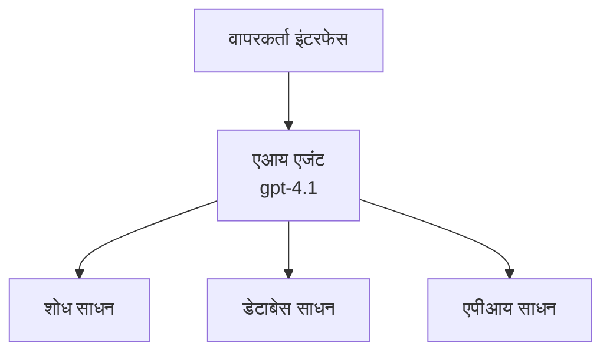
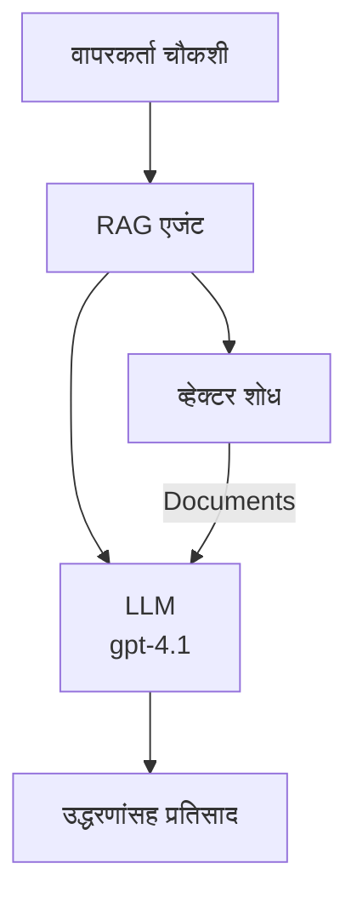
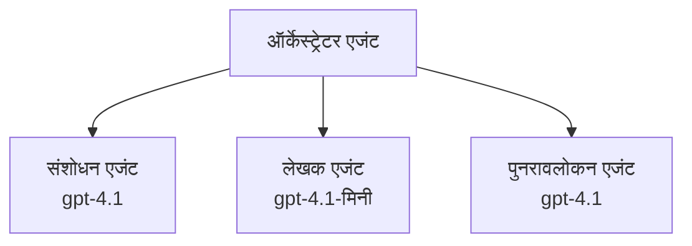

# Azure Developer CLI सह AI एजंट्स

**प्रकरण नेव्हिगेशन:**
- **📚 कोर्स मुख्यपृष्ठ**: [AZD For Beginners](../../README.md)
- **📖 चालू प्रकरण**: प्रकरण 2 - AI-प्रथम विकास
- **⬅️ मागील**: [Microsoft Foundry Integration](microsoft-foundry-integration.md)
- **➡️ पुढील**: [AI Model Deployment](ai-model-deployment.md)
- **🚀 प्रगत**: [Multi-Agent Solutions](../../examples/retail-scenario.md)

---

## परिचय

AI एजंट्स ही स्वायत्त प्रोग्राम्स आहेत ज्यांना त्यांच्या पर्यावरणाची जाणीव असते, निर्णय घेता येतात, आणि विशिष्ट उद्दिष्ट साध्य करण्यासाठी क्रिया करतात. साध्या चॅटबॉट्सपासून भिन्न, जे फक्त प्रॉम्प्टना प्रतिसाद देतात, एजंट्स:

- **साधने वापरतात** - API कॉल करणे, डेटाबेस शोधणे, कोड अंमलात आणणे
- **योजना आखतात आणि विचार करतात** - गुंतागुंतीच्या कामांना टप्प्यात विभागणे
- **संदर्भातून शिकतात** - स्मृती राखणे आणि वर्तन सानुकूल करणे
- **सहकार्य करतात** - इतर एजंट्ससोबत काम करणे (मल्टी-एजंट प्रणाली)

हा मार्गदर्शक तुम्हाला Azure मध्ये Azure Developer CLI (azd) वापरून AI एजंट तैनात करण्याची पद्धत दाखवतो.

> **वॅलिडेशन टिपण्णी (2026-03-25):** हा मार्गदर्शक `azd` `1.23.12` आणि `azure.ai.agents` `0.1.18-preview` विरुद्ध तपासला गेला आहे. `azd ai` अनुभव अजूनही प्रिव्ह्यू आधारित आहे, त्यामुळे तुमचे स्थापित ध्वज वेगळे असतील तर विस्तार सहाय्य तपासा.

## शिकण्याचे उद्दिष्टे

हा मार्गदर्शक पूर्ण केल्यानंतर, तुम्ही:
- AI एजंट्स काय आहेत आणि ते चॅटबॉट्सपेक्षा कसे वेगळे आहेत हे समजून घेणार
- AZD वापरून पूर्वनिर्मित AI एजंट टेम्प्लेट्स तैनात करणार
- कस्टम एजंटसाठी Foundry Agents कॉन्फिगर करणार
- प्राथमिक एजंट नमुने (साधने वापरणे, RAG, मल्टी-एजंट) अंमलात आणणार
- तैनात केलेल्या एजंट्सचे निरीक्षण आणि डिबगिंग करणार

## शिकण्याचा परिणाम

पूर्ण केल्यावर, तुम्हाला पुढील गोष्टी करता येतील:
- AI एजंट अॅप्लिकेशन्स Azure वर एका आदेशाने तैनात करणे
- एजंट साधने आणि क्षमता कॉन्फिगर करणे
- एजंट्ससह रिट्रिव्हल-अगमेंटेड जनरेशन (RAG) अंमलात आणणे
- गुंतागुंतीच्या कार्यप्रवाहांसाठी मल्टी-एजंट आर्किटेक्चर डिझाइन करणे
- सामान्य एजंट तैनाती समस्या निश्चित करणे

---

## 🤖 एजंट आणि चॅटबॉटमधील फरक काय आहे?

| वैशिष्ट्य | चॅटबॉट | AI एजंट |
|---------|---------|----------|
| **वर्तन** | प्रॉम्प्टला प्रतिसाद देतो | स्वायत्त क्रिया करतो |
| **साधने** | नाही | API कॉल करू शकतो, शोधू शकतो, कोड चालवू शकतो |
| **स्मृती** | फक्त सत्रआधारित | सत्रांपलीकडील कायमस्वरूपी स्मृती |
| **योजना** | एकच प्रतिसाद | बहुस्तरीय विचारप्रक्रिया |
| **सहकार्य** | एकच घटक | इतर एजंट्ससोबत काम करू शकतो |

### सोपी उपमा

- **चॅटबॉट** = माहिती डेस्कमधील प्रश्नांची मदत करणारा व्यक्ती
- **AI एजंट** = वैयक्तिक सहाय्यक जो कॉल करू शकतो, अपॉइंटमेंट्स बुक करू शकतो, आणि काम पूर्ण करतो

---

## 🚀 जलद प्रारंभ: तुमचा पहिला एजंट तैनात करा

### पर्याय 1: Foundry Agents टेम्प्लेट (शिफारस केली आहे)

```bash
# AI एजंट्स टेम्पलेट प्रारंभ करा
azd init --template get-started-with-ai-agents

# Azure वर तैनात करा
azd up
```

**तैनात काय होते:**
- ✅ Foundry Agents
- ✅ Microsoft Foundry Models (gpt-4.1)
- ✅ Azure AI Search (RAG साठी)
- ✅ Azure Container Apps (वेब इंटरफेस)
- ✅ Application Insights (निरीक्षण)

**वेळ:** ~15-20 मिनिटे  
**खर्च:** ~$100-150/महिना (विकासासाठी)

### पर्याय 2: OpenAI Agent with Prompty

```bash
# Prompty-आधारित एजंट टेम्पलेट प्रारंभ करा
azd init --template agent-openai-python-prompty

# Azure वर परिनियोजित करा
azd up
```

**तैनात काय होते:**
- ✅ Azure Functions (सर्व्हरलेस एजंट अंमलबजावणी)
- ✅ Microsoft Foundry Models
- ✅ Prompty कॉन्फिगरेशन फाइल्स
- ✅ नमुना एजंट अंमलबजावणी

**वेळ:** ~10-15 मिनिटे  
**खर्च:** ~$50-100/महिना (विकासासाठी)

### पर्याय 3: RAG Chat Agent

```bash
# RAG चॅट टेम्प्लेट प्रारंभ करा
azd init --template azure-search-openai-demo

# Azure वर तैनात करा
azd up
```

**तैनात काय होते:**
- ✅ Microsoft Foundry Models
- ✅ Azure AI Search सॅम्पल डेटासह
- ✅ दस्तऐवज प्रक्रिया पाईपलाईन
- ✅ संदर्भांसह चॅट इंटरफेस

**वेळ:** ~15-25 मिनिटे  
**खर्च:** ~$80-150/महिना (विकासासाठी)

### पर्याय 4: AZD AI Agent Init (मॅनिफेस्ट किंवा टेम्प्लेट आधारित प्रिव्ह्यू)

जर तुम्हाजवळ एजंट मॅनिफेस्ट फाइल असेल तर तुम्ही `azd ai` कमांड वापरून थेट Foundry Agent Service प्रोजेक्ट स्कॅफोल्ड करू शकता. अलीकडील प्रिव्ह्यू रिलीजेसमध्ये टेम्प्लेट आधारित इनिशियलायझेशन सुद्धा जोडले गेले आहे, त्यामुळे तुमच्या स्थापित विस्तार आवृत्तीनुसार प्रॉम्प्ट प्रवाह थोडा वेगळा असू शकतो.

```bash
# AI एजंट्स एक्स्टेंशन इंस्टॉल करा
azd extension install azure.ai.agents

# ऐच्छिक: इंस्टॉल केलेली प्रीव्यू आवृत्ती सत्यापित करा
azd extension show azure.ai.agents

# एजंट मॅनिफेस्ट मधून प्रारंभ करा
azd ai agent init -m agent-manifest.yaml

# Azure वर तैनात करा
azd up

# तैनात एजंटची चाचणी करा (लेटन्सी + टाईम-टू-फर्स्ट-बाइट दर्शवते)
azd ai agent invoke
```

**`azd ai agent init` आणि `azd init --template` यामध्ये कधी काय वापरायचे:**

| पद्धत | कोणासाठी उत्तम | कसे कार्य करते |
|----------|----------|------|
| `azd init --template` | कार्यरत नमुना अॅपसह सुरुवात करताना | पूर्ण टेम्प्लेट रिपो (कोड + इन्फ्रा) क्लोन करते |
| `azd ai agent init -m` | तुमच्या स्वतःच्या एजंट मॅनिफेस्टवरून बनवताना | तुमच्या एजंट डिफिनेशनवरुन प्रोजेक्ट रचना तयार करते |

> **टीप:** शिकताना `azd init --template` वापरा (वरील पर्याय 1-3). उत्पादन एजंट बनवताना तुमच्या स्वतःच्या मॅनिफेस्टसह `azd ai agent init` वापरा.

`azd up` नंतर, तेच विस्तार एजंट सायकलचा बाकी भाग सांभाळतो: `azd ai agent invoke` चाचणीसाठी, `azd ai agent eval generate` आणि `azd ai agent optimize` गुणवत्ता मोजण्यासाठी आणि सुधारण्यासाठी, आणि `azd ai agent delete` साफसफाईसाठी. पूर्ण संदर्भासाठी पाहा [AZD AI CLI Commands](../chapter-08-production/production-ai-practices.md#azd-ai-cli-commands-and-extensions).

---

## 🏗️ एजंट आर्किटेक्चर नमुने

### नमुना 1: साधने वापरणार्‍या एका एजंटची रचना

सर्वात सोपा एजंट नमुना - एक एजंट जो अनेक साधने वापरू शकतो.



**योग्य:**
- ग्राहक समर्थन बॉट्स
- संशोधन सहाय्यक
- डेटा विश्लेषण एजंट्स

**AZD टेम्प्लेट:** `azure-search-openai-demo`

### नमुना 2: RAG एजंट (रिट्रिव्हल-अगमेंटेड जनरेशन)

एक एजंट जो प्रतिसाद तयार करण्यापूर्वी संबंधित दस्तऐवज शोधतो.



**योग्य:**
- एंटरप्राइझ ज्ञान आधार
- दस्तऐवज प्रश्नोत्तरे प्रणाली
- अनुपालन आणि कायदेशीर संशोधन

**AZD टेम्प्लेट:** `azure-search-openai-demo`

### नमुना 3: मल्टी-एजंट प्रणाली

एकाधिक विशिष्ट एजंट्स एकत्र काम करून गुंतागुंतीच्या कामांवर हाताळणी करतात.



**योग्य:**
- गुंतागुंतीची सामग्री निर्मिती
- बहु-टप्पे कार्यप्रवाह
- वेगवेगळ्या कौशल्यांची गरज असलेली कामे

**अधिक जाणून घ्या:** [Multi-Agent Coordination Patterns](../chapter-06-pre-deployment/coordination-patterns.md)

---

## ⚙️ एजंट साधने कॉन्फिगर करणे

एजंट जेव्हा साधने वापरू शकतात तेव्हा ते शक्तिशाली होतात. येथे सामान्य साधने कशी कॉन्फिगर करायची याचे वर्णन आहे:

### Foundry Agents मधील साधन कॉन्फिगरेशन

```python
# agent_config.py
from azure.ai.projects import AIProjectClient
from azure.ai.projects.models import FunctionTool, CodeInterpreterTool

# सानुकूल साधने परिभाषित करा
search_tool = FunctionTool(
    name="search_knowledge_base",
    description="Search the company knowledge base for relevant documents",
    parameters={
        "type": "object",
        "properties": {
            "query": {
                "type": "string",
                "description": "The search query"
            }
        },
        "required": ["query"]
    }
)

# साधने वापरून एजंट तयार करा
agent = project_client.agents.create_agent(
    model="gpt-4.1",
    name="Support Agent",
    instructions="You are a helpful support agent. Use the search tool to find relevant information.",
    tools=[search_tool, CodeInterpreterTool()]
)
```

### पर्यावरण कॉन्फिगरेशन

```bash
# एजंट-विशिष्ट वातावरणीय चल सेट करा
azd env set AZURE_OPENAI_MODEL "gpt-4.1"
azd env set AGENT_INSTRUCTIONS "You are a helpful assistant..."
azd env set ENABLE_CODE_INTERPRETER "true"
azd env set ENABLE_FILE_SEARCH "true"

# अद्यतनित संरचनेसह वितरण करा
azd deploy
```

---

## 📊 एजंट्सचे निरीक्षण

### Application Insights समाकलन

सर्व AZD एजंट टेम्प्लेटमध्ये निरीक्षणासाठी Application Insights समाविष्ट आहे:

```bash
# मॉनिटरिंग डॅशबोर्ड उघडा
azd monitor --overview

# थेट लॉग पाहा
azd monitor --logs

# थेट मेट्रिक्स पाहा
azd monitor --live
```

### ट्रॅक करण्याचे मुख्य मेट्रिक्स

| मेट्रिक | वर्णन | लक्ष्य |
|--------|-------------|--------|
| प्रतिसाद विलंब | प्रतिसाद तयार करण्याचा वेळ | < 5 सेकंद |
| टोकन वापर | प्रति विनंती टोकन्स | खर्चासाठी निरीक्षण |
| साधन कॉल यशस्वी दर | यशस्वी साधन अंमलबजावणीचा टक्केवारी | > 95% |
| त्रुटी दर | अयशस्वी एजंट विनंत्या | < 1% |
| वापरकर्ता समाधान | अभिप्राय गुण | > 4.0/5.0 |

### एजंटसाठी सानुकूल लॉगिंग

```python
import os
from azure.monitor.opentelemetry import configure_azure_monitor
from opentelemetry import trace

# OpenTelemetry सह Azure Monitor कॉन्फिगर करा
configure_azure_monitor(
    connection_string=os.environ["APPLICATIONINSIGHTS_CONNECTION_STRING"]
)

tracer = trace.get_tracer(__name__)

def log_agent_interaction(user_query, agent_response, tools_used, latency_ms):
    with tracer.start_as_current_span("agent_interaction") as span:
        span.set_attributes({
            "user_query": user_query,
            "response_length": len(agent_response),
            "tools_used": tools_used,
            "latency_ms": latency_ms
        })
```

> **टीप:** आवश्यक पॅकेजेस स्थापित करा: `pip install azure-monitor-opentelemetry opentelemetry`

---

## 💰 खर्चाचा विचार

### नमुन्यानुसार अंदाजे मासिक खर्च

| नमुना | dev पर्यावरण | उत्पादन |
|---------|-----------------|------------|
| एकल एजंट | $50-100 | $200-500 |
| RAG एजंट | $80-150 | $300-800 |
| मल्टी-एजंट (2-3 एजंट) | $150-300 | $500-1,500 |
| एंटरप्राइझ मल्टी-एजंट | $300-500 | $1,500-5,000+ |

### खर्च कमी करण्याच्या टिपा

1. **साध्या कामांसाठी gpt-4.1-mini वापरा**
   ```bash
   azd env set AZURE_OPENAI_MODEL "gpt-4.1-mini"
   ```

2. **पुन्हा विचारणा केलेल्या क्वेरींसाठी कॅशिंग लागू करा**
   ```python
   from functools import lru_cache
   
   @lru_cache(maxsize=1000)
   def get_cached_response(query_hash):
       return agent.run(query_hash)
   ```

3. **प्रत्येक चालवण्यास टोकन मर्यादा सेट करा**
   ```python
   # एजंट चालवताना max_completion_tokens सेट करा, निर्मिती वेळी नाही
   run = project_client.agents.create_run(
       thread_id=thread.id,
       agent_id=agent.id,
       max_completion_tokens=1000  # प्रतिसादाची लांबी मर्यादित करा
   )
   ```

4. **बाहेर नसताना शून्यावर स्केल करा**
   ```bash
   # कंटेनर अॅप्स स्वयंचलितपणे शून्यावर स्केल होतात
   azd env set MIN_REPLICAS "0"
   ```

---

## 🔧 एजंट समस्या निराकरण

### सामान्य समस्या आणि उपाय

<details>
<summary><strong>❌ एजंट साधन कॉलला प्रतिसाद देत नाही</strong></summary>

```bash
# उपकरणे योग्यरित्या नोंदणीकृत आहेत का ते तपासा
azd show

# OpenAI वितरणाची पडताळणी करा
az cognitiveservices account deployment list \
  --name $AZURE_OPENAI_NAME \
  --resource-group $RG_NAME

# एजंट लॉग तपासा
azd monitor --logs
```

**सामान्य कारणे:**
- साधन फंक्शन सिग्नेचर जुळत नाही
- आवश्यक परवानगya गायब आहेत
- API एंडपॉइंट उपलब्ध नाही
</details>

<details>
<summary><strong>❌ एजंट प्रतिसादातील जास्त विलंब</strong></summary>

```bash
# बॉटलनेक्ससाठी एप्लिकेशन इनसाइट्स तपासा
azd monitor --live

# जलद मॉडेल वापरण्याचा विचार करा
azd env set AZURE_OPENAI_MODEL "gpt-4.1-mini"
azd deploy
```

**सुधारणेच्या टिपा:**
- स्ट्रीमिंग प्रतिसाद वापरा
- प्रतिसाद कॅशिंग लागू करा
- संदर्भ विंडो आकार कमी करा
</details>

<details>
<summary><strong>❌ एजंट चुकीची किंवा भ्रमित माहिती परत करत आहे</strong></summary>

```python
# चांगल्या सिस्टम प्रॉम्प्टसह सुधारणा करा
instructions = """
You are a helpful assistant. IMPORTANT:
- Only answer based on provided context
- If you don't know, say "I don't know"
- Always cite your sources
- Never make up information
"""

# ग्राउंडिंगसाठी पुनर्प्राप्ती जोडा
agent = project_client.agents.create_agent(
    model="gpt-4.1",
    instructions=instructions,
    tools=[FileSearchTool()]  # दस्तऐवजांमध्ये उत्तरे आधारित करा
)
```
</details>

<details>
<summary><strong>❌ टोकन मर्यादा उल्लंघन त्रुटी</strong></summary>

```python
# संदर्भ विंडो व्यवस्थापन अमलात आणा
def truncate_context(messages, max_tokens=8000, model="gpt-4.1"):
    """Keep only recent messages within token limit."""
    import tiktoken
    encoding = tiktoken.encoding_for_model(model)
    total_tokens = 0
    truncated = []
    
    for msg in reversed(messages):
        msg_tokens = len(encoding.encode(msg.content))
        if total_tokens + msg_tokens > max_tokens:
            break
        truncated.insert(0, msg)
        total_tokens += msg_tokens
    
    return truncated
```
</details>

---

## 🎓 व्यावहारिक सराव

### सराव 1: मूलभूत एजंट तैनात करा (20 मिनिटे)

**उद्दिष्ट:** AZD वापरून तुमचा पहिला AI एजंट तैनात करा

```bash
# पायरी 1: टेम्पलेट प्रारंभ करा
azd init --template get-started-with-ai-agents

# पायरी 2: Azure मध्ये लॉगिन करा
azd auth login
# आपण भांडारांमध्ये काम करत असल्यास, --tenant-id <tenant-id> जोडा

# पायरी 3: तैनात करा
azd up

# पायरी 4: एजंटची चाचणी करा
# तैनाती नंतर अपेक्षित आउटपुट:
#   तैनात पूर्ण!
#   एंडपॉइंट: https://<app-name>.<region>.azurecontainerapps.io
# आउटपुटमध्ये दर्शविलेले URL उघडा आणि प्रश्न विचारून पाहा

# पायरी 5: देखरेखीचे निरीक्षण करा
azd monitor --overview

# पायरी 6: सफाई करा
azd down --force --purge
```

**यश निकष:**
- [ ] एजंट प्रश्नांना प्रतिसाद देते
- [ ] `azd monitor` वापरुन निरीक्षण डॅशबोर्ड ऍक्सेस करता येतो
- [ ] संसाधने यशस्वीरित्या स्वच्छ केली गेली

### सराव 2: कस्टम साधन जोडा (30 मिनिटे)

**उद्दिष्ट:** एजंट मध्ये एक कस्टम साधन वाढवा

1. एजंट टेम्प्लेट तैनात करा:  
   ```bash
   azd init --template get-started-with-ai-agents
   azd up
   ```
  
2. तुमच्या एजंट कोडमध्ये नवीन साधन फंक्शन तयार करा:  
   ```python
   def get_weather(location: str) -> str:
       """Get current weather for a location."""
       # हवामान सेवा कॉल करण्यासाठी API कॉल
       return f"Weather in {location}: Sunny, 72°F"
   ```
  
3. साधन एजंटसोबत नोंदणी करा:  
   ```python
   from azure.ai.projects.models import FunctionTool

   weather_tool = FunctionTool(
       name="get_weather",
       description="Get current weather for a location",
       parameters={
           "type": "object",
           "properties": {
               "location": {"type": "string", "description": "City name"}
           },
           "required": ["location"]
       }
   )

   agent = project_client.agents.create_agent(
       model="gpt-4.1",
       name="Weather Agent",
       tools=[weather_tool]
   )
   ```
  
4. पुन्हा तैनात करा आणि चाचणी करा:  
   ```bash
   azd deploy
   # विचारा: "सिएटलमध्ये हवामान कसे आहे?"
   # अपेक्षित: एजंट get_weather("सिएटल") कॉल करतो आणि हवामानाची माहिती परत करतो
   ```

**यश निकष:**
- [ ] एजंट हवामान संबंधित विचारणा ओळखतो
- [ ] साधन योग्य प्रकारे कॉल केले जाते
- [ ] प्रतिसादात हवामानाची माहिती असते

### सराव 3: RAG एजंट तयार करा (45 मिनिटे)

**उद्दिष्ट:** तुमच्या दस्तऐवजांमधून प्रश्नांना उत्तर देणारा एजंट तयार करा

```bash
# पायरी 1: RAG टेम्प्लेट डिप्लॉय करा
azd init --template azure-search-openai-demo
azd up

# पायरी 2: आपली कागदपत्रे अपलोड करा
# PDF/TXT फाइल्स data/ निर्देशिकेत ठेवा, नंतर चालवा:
python scripts/prepdocs.py

# पायरी 3: शाखा-विशिष्ट प्रश्नांसह चाचणी करा
# azd up आउटपुटमधून वेब अॅप URL उघडा
# आपल्या अपलोड केलेल्या कागदपत्रांबद्दल प्रश्न विचारा
# प्रतिसादांमध्ये [doc.pdf] सारखे उद्धरण संदर्भ असावेत
```

**यश निकष:**
- [ ] एजंट अपलोड केलेल्या दस्तऐवजांमधून उत्तर देतो
- [ ] प्रतिसादांमध्ये संदर्भ असतात
- [ ] मर्यादेबाहेरील प्रश्नांवर भ्रम नाही

---

## 📚 पुढील टप्पे

आता जेव्हा तुम्हाला AI एजंट्स समजले आहेत, खालील प्रगत विषयांचा अभ्यास करा:

| विषय | वर्णन | लिंक |
|-------|-------------|------|
| **मल्टी-एजंट प्रणाली** | अनेक सहकारी एजंट्ससह सिस्टम तयार करा | [Retail Multi-Agent Example](../../examples/retail-scenario.md) |
| **समन्वय नमुने** | ऑर्केस्ट्रेशन आणि संवाद नमुने शिका | [Coordination Patterns](../chapter-06-pre-deployment/coordination-patterns.md) |
| **उत्पादन तैनाती** | एंटरप्राइझ-तयार एजंट तैनाती | [Production AI Practices](../chapter-08-production/production-ai-practices.md) |
| **एजंट मूल्यांकन** | एजंट कार्यक्षमता चाचणी व मूल्यांकन | [AI Troubleshooting](../chapter-07-troubleshooting/ai-troubleshooting.md) |
| **AI कार्यशाळा लॅब** | प्रत्यक्षात: तुमचे AI सोल्यूशन AZD-तयार करा | [AI Workshop Lab](ai-workshop-lab.md) |

---

## 📖 अतिरिक्त स्रोत

### अधिकृत दस्तऐवज
- [Microsoft Foundry Agent Service](https://learn.microsoft.com/azure/ai-services/agents/)
- [Microsoft Foundry Agent Service Quickstart](https://learn.microsoft.com/azure/ai-services/agents/quickstart)
- [Semantic Kernel Agent Framework](https://learn.microsoft.com/semantic-kernel/)

### एजंटसाठी AZD टेम्प्लेट्स
- [AI एजंटसह सुरू करा](https://github.com/Azure-Samples/get-started-with-ai-agents)
- [Agent OpenAI Python Prompty](https://github.com/Azure-Samples/agent-openai-python-prompty)
- [Azure Search OpenAI Demo](https://github.com/Azure-Samples/azure-search-openai-demo)

### समुदाय स्रोत
- [Awesome AZD - एजंट टेम्प्लेट्स](https://azure.github.io/awesome-azd/?tags=ai-agents)
- [Azure AI Discord](https://discord.gg/microsoft-azure)
- [Microsoft Foundry Discord](https://discord.gg/nTYy5BXMWG)

### तुमच्या संपादकासाठी एजंट कौशल्ये
- [**Microsoft Azure Agent Skills**](https://skills.sh/microsoft/github-copilot-for-azure) - GitHub Copilot, Cursor किंवा कोणत्याही समर्थित एजंटमध्ये Azure विकासासाठी पुन्हा वापरण्यायोग्य AI एजंट कौशल्ये इन्स्टॉल करा. यात कौशल्यांचा समावेश आहे [Azure AI](https://skills.sh/microsoft/github-copilot-for-azure/azure-ai), [Microsoft Foundry](https://skills.sh/microsoft/github-copilot-for-azure/microsoft-foundry), [तैनाती](https://skills.sh/microsoft/github-copilot-for-azure/azure-deploy), आणि [निदान](https://skills.sh/microsoft/github-copilot-for-azure/azure-diagnostics):
  ```bash
  npx skills add microsoft/github-copilot-for-azure
  ```

---

**नेव्हिगेशन**
- **मागील धडा**: [Microsoft Foundry Integration](microsoft-foundry-integration.md)
- **पुढील धडा**: [AI Model Deployment](ai-model-deployment.md)

---

<!-- CO-OP TRANSLATOR DISCLAIMER START -->
**अस्वीकरण**:
हा दस्तऐवज AI भाषांतर सेवा [Co-op Translator](https://github.com/Azure/co-op-translator) चा वापर करून अनुवादित केला आहे. जरी आम्ही अचूकतेसाठी प्रयत्न करतो, तरी कृपया लक्षात घ्या की स्वयंचलित भाषांतरांमध्ये त्रुटी किंवा अचूकतेची कमतरता असू शकते. मूळ दस्तऐवज त्याच्या मूळ भाषेत अधिकृत स्रोत मानला पाहिजे. महत्त्वाची माहिती असल्यास, व्यावसायिक मानवी भाषांतराची शिफारस केली जाते. या भाषांतराच्या वापरामुळे उद्भवणाऱ्या कोणत्याही गैरसमज किंवा चुकीच्या अर्थलावणीसाठी आम्ही जबाबदार नाही.
<!-- CO-OP TRANSLATOR DISCLAIMER END -->