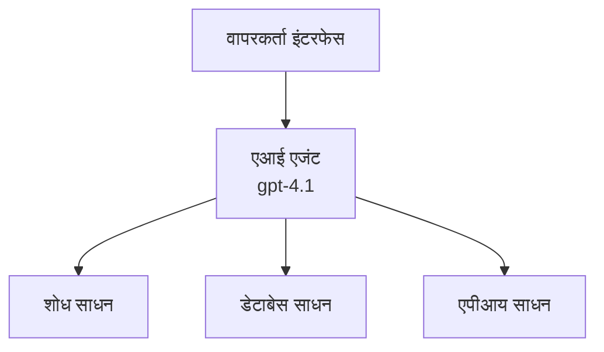
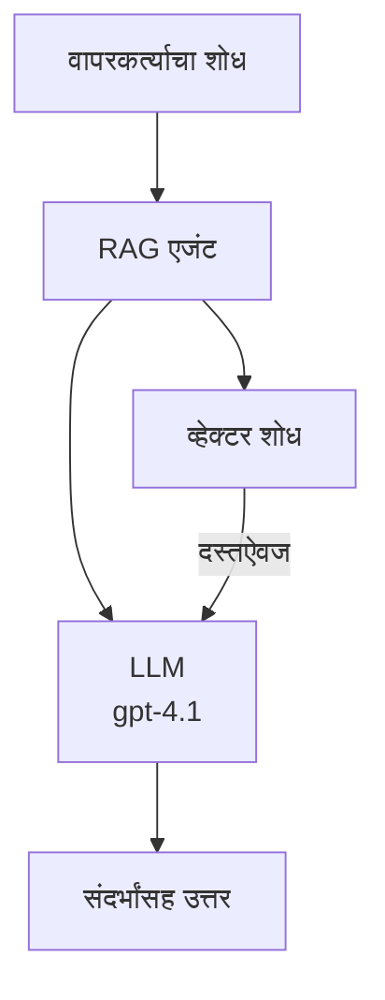
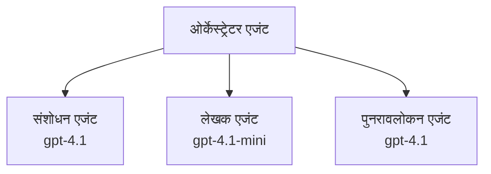

# Azure Developer CLI सह AI एजंट्स

**अध्याय नेव्हिगेशन:**
- **📚 कोर्स मुख्यपृष्ठ**: [AZD For Beginners](../../README.md)
- **📖 चालू अध्याय**: अध्याय 2 - AI-प्रथम विकास
- **⬅️ मागील**: [Microsoft Foundry Integration](microsoft-foundry-integration.md)
- **➡️ पुढील**: [AI Model Deployment](ai-model-deployment.md)
- **🚀 प्रगत**: [Multi-Agent Solutions](../../examples/retail-scenario.md)

---

## परिचय

AI एजंट्स हे स्वायत्त प्रोग्राम आहेत जे त्यांचे पर्यावरण पारखू शकतात, निर्णय घेऊ शकतात, आणि विशिष्ट उद्दिष्टे साध्य करण्यासाठी क्रिया करू शकतात. साध्या चॅटबॉट्सपेक्षा जे फक्त प्रॉम्प्ट्सना प्रतिसाद देतात, एजंट्स हे करू शकतात:

- **उपकरणे वापरा** - API कॉल करा, डेटाबेस शोधा, कोड चालवा
- **योजना करा आणि विचार करा** - गुंतागुंतीच्या कामांना टप्प्यांमध्ये विभागा
- **संदर्भातून शिका** - स्मृती राखा आणि वर्तनात बदल करा
- **सहकार्य करा** - इतर एजंट्ससोबत काम करा (मल्टी-एजंट सिस्टम)

हा मार्गदर्शक तुम्हाला Azure Developer CLI (azd) वापरून Azure वर AI एजंट्स कसे तैनात करायचे ते दाखवतो.

## शिकण्याच्या उद्दिष्टे

हा मार्गदर्शक पूर्ण केल्यावर तुम्ही:
- AI एजंट्स काय आहेत आणि ते चॅटबॉट्सपेक्षा कसे वेगळे आहेत हे समजून घेऊ शकता
- AZD वापरून पूर्व-निर्मित AI एजंट टेम्पलेट तैनात करू शकता
- कस्टम एजंटसाठी Foundry Agents कॉन्फिगर करू शकता
- मूलभूत एजंट प्रतिमान (टूल वापर, RAG, मल्टी-एजंट) अंमलात आणू शकता
- तैनात केलेल्या एजंट्सचे निरीक्षण आणि डिबगिंग करू शकता

## शिकण्याचे परिणाम

पूर्ण केल्यावर तुम्ही सक्षम असाल:
- एका आदेशाने Azure वर AI एजंट अनुप्रयोग तैनात करू शकता
- एजंट उपकरणे आणि क्षमता कॉन्फिगर करू शकता
- एजंट्ससह retrieval-augmented generation (RAG) अंमलात आणू शकता
- गुंतागुंतीच्या कार्यप्रवाहासाठी मल्टी-एजंट आर्किटेक्चर डिझाईन करू शकता
- सामान्य एजंट तैनात समस्या निवारण करू शकता

---

## 🤖 एजंट चॅटबॉटपेक्षा वेगळा कसा असतो?

| वैशिष्ट्य | चॅटबॉट | AI एजंट |
|---------|---------|----------|
| **वर्तन** | प्रॉम्प्ट्सना प्रतिसाद देतो | स्वायत्त क्रिया करतो |
| **उपकरणे** | नाही | API कॉल करू शकतो, शोधू शकतो, कोड चालवू शकतो |
| **स्मृती** | फक्त सत्रावर आधारित | सत्रापलीकडे सततची स्मृती |
| **योजना** | एकल प्रतिसाद | बहु-टप्प्यांचे विचार |
| **सहकार्य** | एकमेव घटक | इतर एजंट्सशी काम करू शकतो |

### साधे उदाहरण

- **चॅटबॉट** = माहिती डेस्कवर प्रश्नांची उत्तरं देणारा सहायक माणूस
- **AI एजंट** = तुमच्यासाठी कॉल करू शकणारा, अपॉइंटमेंट बुक करणारा आणि कामे पूर्ण करणारा वैयक्तिक सहाय्यक

---

## 🚀 जलद प्रारंभ: तुमचा पहिला एजंट तैनात करा

### पर्याय 1: Foundry Agents टेम्पलेट (शिफारस केलेले)

```bash
# एआय एजंट्स टेम्प्लेट प्रारंभ करा
azd init --template get-started-with-ai-agents

# Azure वर तैनात करा
azd up
```

**जे तैनात होते:**
- ✅ Foundry Agents
- ✅ Microsoft Foundry मॉडेल्स (gpt-4.1)
- ✅ Azure AI Search (RAG साठी)
- ✅ Azure Container Apps (वेब इंटरफेस)
- ✅ Application Insights (निरीक्षण)

**वेळ:** ~15-20 मिनिटे  
**खर्च:** ~$100-150/महिना (विकासासाठी)

### पर्याय 2: Prompty सह OpenAI एजंट

```bash
# Prompty-आधारित एजंट टेम्प्लेट प्रारंभ करा
azd init --template agent-openai-python-prompty

# Azure वर तैनात करा
azd up
```

**जे तैनात होते:**
- ✅ Azure Functions (सर्व्हरलेस एजंट अंमलबजावणी)
- ✅ Microsoft Foundry मॉडेल्स
- ✅ Prompty कॉन्फिगरेशन फायली
- ✅ नमुना एजंट अंमलबजावणी

**वेळ:** ~10-15 मिनिटे  
**खर्च:** ~$50-100/महिना (विकासासाठी)

### पर्याय 3: RAG चॅट एजंट

```bash
# RAG चॅट टेम्पलेट प्रारंभ करा
azd init --template azure-search-openai-demo

# Azure वर तैनात करा
azd up
```

**जे तैनात होते:**
- ✅ Microsoft Foundry मॉडेल्स
- ✅ नमुना डेटासह Azure AI Search
- ✅ दस्तऐवज प्रक्रियायांचे पाईपलाइन
- ✅ संदर्भांसह चॅट इंटरफेस

**वेळ:** ~15-25 मिनिटे  
**खर्च:** ~$80-150/महिना (विकासासाठी)

### पर्याय 4: AZD AI Agent Init (मॅनिफेस्ट-आधारित)

जर तुमच्याकडे एजंट मॅनिफेस्ट फाइल असेल तर तुम्ही `azd ai` आदेशाचा वापर करून थेट Foundry Agent Service प्रकल्प स्कॅफोल्ड करू शकता:

```bash
# AI एजंट्स एक्सटेंशन स्थापित करा
azd extension install azure.ai.agents

# एजंट म니फेस्टवरून प्रारंभ करा
azd ai agent init -m agent-manifest.yaml

# Azure वर तैनात करा
azd up
```

**`azd ai agent init` वि. `azd init --template` कधी वापरायचा:**

| पद्धत | सर्वोत्तम | कसे कार्य करते |
|----------|----------|-----------------|
| `azd init --template` | कार्यरत नमुना अॅपवरून सुरूवात | कोड + इन्फ्रासह पूर्ण टेम्पलेट रेपो क्लोन करते |
| `azd ai agent init -m` | तुमच्या स्वतःच्या एजंट मॅनिफेस्टपासून बांधणी | तुमच्या एजंट परिभाषेनुसार प्रकल्प संरचना तयार करते |

> **टीप:** शिकताना `azd init --template` वापरावे (वरील पर्याय 1-3). उत्पादनासाठी स्वतःचे मॅनिफेस्टसह एजंट्स तयार करताना `azd ai agent init` वापरा. पूर्ण संदर्भासाठी पहा [AZD AI CLI Commands](../chapter-08-production/production-ai-practices.md#azd-ai-cli-commands-and-extensions).

---

## 🏗️ एजंट आर्किटेक्चर पॅटर्न्स

### पॅटर्न 1: टूलसह एकल एजंट

सर्वात सोपा एजंट पॅटर्न - एक एजंट जो एकापेक्षा अधिक उपकरणे वापरू शकतो.


**सर्वोत्तम उपयोग:**
- ग्राहक सहायता बॉट्स
- संशोधन सहाय्यक
- डेटा विश्लेषण एजंट्स

**AZD टेम्पलेट:** `azure-search-openai-demo`

### पॅटर्न 2: RAG एजंट (Retrieval-Augmented Generation)

प्रतिक्रिया निर्माण करण्यापूर्वी संबंधित दस्तऐवज शोधणारा एजंट.


**सर्वोत्तम उपयोग:**
- उद्योग ज्ञानभंडार
- दस्तऐवज प्रश्नोत्तर प्रणाली
- नियम व कायदेशीर संशोधन

**AZD टेम्पलेट:** `azure-search-openai-demo`

### पॅटर्न 3: मल्टी-एजंट सिस्टम

गंभीर कामांवर एकत्र काम करणारे अनेक विशेषज्ञ एजंट.


**सर्वोत्तम उपयोग:**
- गुंतागुंतीचा कंटेंट निर्माण
- बहु-टप्प्यांचे कार्यप्रवाह
- विविध तज्ज्ञता आवश्यक असलेली कामे

**अधिक शिका:** [Multi-Agent Coordination Patterns](../chapter-06-pre-deployment/coordination-patterns.md)

---

## ⚙️ एजंट उपकरण कॉन्फिगरेशन

एजंट्स बलवान होतात जेव्हा ते उपकरणे वापरू शकतात. येथे सामान्य उपकरणे कशी कॉन्फिगर करायची ते दिले आहे:

### Foundry Agents मधील उपकरणे कॉन्फिगरेशन

```python
# agent_config.py
from azure.ai.projects import AIProjectClient
from azure.ai.projects.models import FunctionTool, CodeInterpreterTool

# सानुकूल साधने निश्चित करा
search_tool = FunctionTool(
    name="search_knowledge_base",
    description="Search the company knowledge base for relevant documents",
    parameters={
        "type": "object",
        "properties": {
            "query": {
                "type": "string",
                "description": "The search query"
            }
        },
        "required": ["query"]
    }
)

# साधनांसह एजंट तयार करा
agent = project_client.agents.create_agent(
    model="gpt-4.1",
    name="Support Agent",
    instructions="You are a helpful support agent. Use the search tool to find relevant information.",
    tools=[search_tool, CodeInterpreterTool()]
)
```

### पर्यावरण कॉन्फिगरेशन

```bash
# एजंट-विशिष्ट पर्यावरण चल सेट करा
azd env set AZURE_OPENAI_MODEL "gpt-4.1"
azd env set AGENT_INSTRUCTIONS "You are a helpful assistant..."
azd env set ENABLE_CODE_INTERPRETER "true"
azd env set ENABLE_FILE_SEARCH "true"

# अद्यतनित संरचनेसह कार्यरत करा
azd deploy
```

---

## 📊 एजंट्सचे निरीक्षण

### Application Insights एकत्रीकरण

सर्व AZD एजंट टेम्पलेटमध्ये निरीक्षणासाठी Application Insights समाविष्ट केले आहे:

```bash
# खुला देखरेख डॅशबोर्ड
azd monitor --overview

# थेट लॉग पाहा
azd monitor --logs

# थेट मेट्रिक्स पाहा
azd monitor --live
```

### ट्रॅक करण्यासाठी मुख्य मेट्रिक्स

| मेट्रिक | वर्णन | लक्ष्य |
|--------|-------------|--------|
| प्रतिसाद विलंब | प्रतिसाद तयार करण्याचा वेळ | < ५ सेकंद |
| टोकन वापर | विनंतीप्रति टोकन्स | खर्चासाठी निरीक्षण करा |
| साधन कॉल यशस्वी दर | यशस्वी साधन अंमलबजावणी टक्केवारी | > ९५% |
| त्रुटी दर | अयशस्वी एजंट विनंत्या | < १% |
| वापरकर्ता समाधान | अभिप्राय गुण | > ४.०/५.० |

### एजंटसाठी कस्टम लॉगिंग

```python
import os
from azure.monitor.opentelemetry import configure_azure_monitor
from opentelemetry import trace

# OpenTelemetry सह Azure Monitor कॉन्फिगर करा
configure_azure_monitor(
    connection_string=os.environ["APPLICATIONINSIGHTS_CONNECTION_STRING"]
)

tracer = trace.get_tracer(__name__)

def log_agent_interaction(user_query, agent_response, tools_used, latency_ms):
    with tracer.start_as_current_span("agent_interaction") as span:
        span.set_attributes({
            "user_query": user_query,
            "response_length": len(agent_response),
            "tools_used": tools_used,
            "latency_ms": latency_ms
        })
```

> **टीप:** आवश्यक पॅकेजेस स्थापित करा: `pip install azure-monitor-opentelemetry opentelemetry`

---

## 💰 खर्च विचार

### पॅटर्ननुसार अंदाजे मासिक खर्च

| पॅटर्न | विकास पर्यावरण | उत्पादन |
|---------|-----------------|------------|
| एकल एजंट | $50-100 | $200-500 |
| RAG एजंट | $80-150 | $300-800 |
| मल्टी-एजंट (2-3 एजंट) | $150-300 | $500-1,500 |
| एंटरप्राइझ मल्टी-एजंट | $300-500 | $1,500-5,000+ |

### खर्च कमी करण्याचे टीप्स

1. **साध्या कामांसाठी gpt-4.1-mini वापरा**
   ```bash
   azd env set AZURE_OPENAI_MODEL "gpt-4.1-mini"
   ```

2. **पुन्हा प्रश्नांसाठी कॅशिंग अंमलात आणा**
   ```python
   from functools import lru_cache
   
   @lru_cache(maxsize=1000)
   def get_cached_response(query_hash):
       return agent.run(query_hash)
   ```

3. **प्रत्येक कार्यासाठी टोकन मर्यादा ठेवा**
   ```python
   # एजंट चालवताना max_completion_tokens सेट करा, निर्मिती दरम्यान नाही
   run = project_client.agents.create_run(
       thread_id=thread.id,
       agent_id=agent.id,
       max_completion_tokens=1000  # प्रतिसादाचा लांबी मर्यादित करा
   )
   ```

4. **न वापरताना स्केल ते शून्य करा**
   ```bash
   # कंटेनर अॅप्स आपोआप शून्यावर स्केल करतात
   azd env set MIN_REPLICAS "0"
   ```

---

## 🔧 एजंट समस्या निवारण

### सामान्य समस्या आणि उपाय

<details>
<summary><strong>❌ एजंट टूल कॉल्सना प्रतिसाद देत नाही</strong></summary>

```bash
# तपासणी करा की साधने योग्यरित्या नोंदणीकृत आहेत का
azd show

# OpenAI तैनातीची पडताळणी करा
az cognitiveservices account deployment list \
  --name $AZURE_OPENAI_NAME \
  --resource-group $RG_NAME

# एजंटच्या नोंदी तपासा
azd monitor --logs
```

**सामान्य कारणे:**
- टूल फंक्शनची सही जुळत नाही
- आवश्यक परवानग्या नसणे
- API endpoint ऍक्सेसिबल नाही
</details>

<details>
<summary><strong>❌ एजंट प्रतिसादांमध्ये उच्च विलंब</strong></summary>

```bash
# बॉटलनेक्ससाठी ॲप्लिकेशन इनसाइट्स तपासा
azd monitor --live

# जलद मॉडेल वापरण्याचा विचार करा
azd env set AZURE_OPENAI_MODEL "gpt-4.1-mini"
azd deploy
```

**सुधारणा टीप्स:**
- स्ट्रीमिंग प्रतिसाद वापरा
- प्रतिसाद कॅशिंग अंमलात आणा
- संदर्भ विंडो आकार कमी करा
</details>

<details>
<summary><strong>❌ एजंट चुकीची किंवा काल्पनिक माहिती परत करत आहे</strong></summary>

```python
# चांगल्या सिस्टम प्रॉम्प्टसह सुधारणा करा
instructions = """
You are a helpful assistant. IMPORTANT:
- Only answer based on provided context
- If you don't know, say "I don't know"
- Always cite your sources
- Never make up information
"""

# ग्राउंडिंगसाठी रिट्रिव्हल जोडा
agent = project_client.agents.create_agent(
    model="gpt-4.1",
    instructions=instructions,
    tools=[FileSearchTool()]  # उत्तरांना दस्तऐवजांमध्ये आधार द्या
)
```
</details>

<details>
<summary><strong>❌ टोकन मर्यादा उल्लंघन त्रुटी</strong></summary>

```python
# संदर्भ विंडो व्यवस्थापन अंमलात आणा
def truncate_context(messages, max_tokens=8000, model="gpt-4.1"):
    """Keep only recent messages within token limit."""
    import tiktoken
    encoding = tiktoken.encoding_for_model(model)
    total_tokens = 0
    truncated = []
    
    for msg in reversed(messages):
        msg_tokens = len(encoding.encode(msg.content))
        if total_tokens + msg_tokens > max_tokens:
            break
        truncated.insert(0, msg)
        total_tokens += msg_tokens
    
    return truncated
```
</details>

---

## 🎓 व्यावहारिक सराव

### सराव 1: मूलभूत एजंट तैनात करा (20 मिनिटे)

**उद्दिष्ट:** AZD वापरून तुमचा पहिला AI एजंट तैनात करा

```bash
# चरण 1: टेम्पलेट प्रारंभ करा
azd init --template get-started-with-ai-agents

# चरण 2: Azure मध्ये लॉगिन करा
azd auth login

# चरण 3: डिप्लॉय करा
azd up

# चरण 4: एजंटची चाचणी करा
# डिप्लॉयमेंट नंतर अपेक्षित आउटपुट:
#   डिप्लॉयमेंट पूर्ण!
#   एंडपॉइंट: https://<app-name>.<region>.azurecontainerapps.io
# आउटपुटमध्ये दर्शविलेला URL उघडा आणि प्रश्न विचारण्याचा प्रयत्न करा

# चरण 5: मॉनिटरिंग पहा
azd monitor --overview

# चरण 6: साफसफाई करा
azd down --force --purge
```

**यशस्वी निकष:**
- [ ] एजंट प्रश्नांना प्रतिसाद देतो
- [ ] `azd monitor` द्वारे निरीक्षण डॅशबोर्डमध्ये प्रवेश आहे
- [ ] संसाधने यशस्वीरीत्या साफ केली गेली

### सराव 2: एक कस्टम टूल जोडा (30 मिनिटे)

**उद्दिष्ट:** एजंटमध्ये एक नवीन कस्टम टूल वाढवा

1. एजंट टेम्पलेट तैनात करा:  
   ```bash
   azd init --template get-started-with-ai-agents
   azd up
   ```
  
2. तुमच्या एजंट कोडमध्ये नवीन टूल फंक्शन तयार करा:  
   ```python
   def get_weather(location: str) -> str:
       """Get current weather for a location."""
       # हवामान सेवेचा API कॉल
       return f"Weather in {location}: Sunny, 72°F"
   ```
  
3. एजंटसह टूल नोंदणी करा:  
   ```python
   from azure.ai.projects.models import FunctionTool

   weather_tool = FunctionTool(
       name="get_weather",
       description="Get current weather for a location",
       parameters={
           "type": "object",
           "properties": {
               "location": {"type": "string", "description": "City name"}
           },
           "required": ["location"]
       }
   )

   agent = project_client.agents.create_agent(
       model="gpt-4.1",
       name="Weather Agent",
       tools=[weather_tool]
   )
   ```
  
4. पुनःतैनात करा आणि चाचणी करा:  
   ```bash
   azd deploy
   # विचारा: "सिएटलमधील हवामान काय आहे?"
   # अपेक्षित: एजंट get_weather("सिएटल") कॉल करतो आणि हवामान माहिती परत करतो
   ```
  
**यशस्वी निकष:**  
- [ ] एजंट हवामान-संबंधी प्रश्न ओळखतो  
- [ ] टूल योग्यरित्या कॉल केला जातो  
- [ ] प्रतिसादात हवामान माहिती समाविष्ट आहे

### सराव 3: RAG एजंट तयार करा (45 मिनिटे)

**उद्दिष्ट:** तुमच्या दस्तऐवजांमधून प्रश्नांची उत्तरे देणारा एजंट तयार करा

```bash
# पाऊल 1: RAG टेम्पलेट तैनात करा
azd init --template azure-search-openai-demo
azd up

# पाऊल 2: आपली दस्तऐवज अपलोड करा
# PDF/TXT फाइल्स data/ फोल्डरमध्ये ठेवा, नंतर चालवा:
python scripts/prepdocs.py

# पाऊल 3: क्षेत्र-विशिष्ट प्रश्नांसह चाचणी करा
# azd up आउटपुटमधून वेब अॅप URL उघडा
# आपल्या अपलोड केलेल्या दस्तऐवजांबद्दल प्रश्न विचारा
# प्रतिसादांमध्ये संदर्भाने [doc.pdf] सारखे संदर्भ असावेत
```

**यशस्वी निकष:**
- [ ] एजंट अपलोड केलेल्या दस्तऐवजांमधून उत्तरे देतो
- [ ] प्रतिसादांसह संदर्भ आहेत
- [ ] क्षेत्राबाहेरील प्रश्नांवर कल्पनिक माहिती नाही

---

## 📚 पुढील पावले

आता जेव्हा तुम्हाला AI एजंट्स समजले आहेत, तर खालील प्रगत विषयांचा अभ्यास करा:

| विषय | वर्णन | दुवा |
|-------|-------------|------|
| **मल्टी-एजंट सिस्टम्स** | अनेक सहयोगी एजंटसह सिस्टम तयार करा | [Retail Multi-Agent Example](../../examples/retail-scenario.md) |
| **समन्वय पॅटर्न्स** | ऑर्केस्ट्रेशन आणि कम्युनिकेशन पॅटर्न शिका | [Coordination Patterns](../chapter-06-pre-deployment/coordination-patterns.md) |
| **उत्पादन तैनाती** | एंटरप्राइझ-तयार एजंट तैनाती | [Production AI Practices](../chapter-08-production/production-ai-practices.md) |
| **एजंट मूल्यांकन** | एजंट कार्यक्षमता चाचणी आणि मूल्यांकन | [AI Troubleshooting](../chapter-07-troubleshooting/ai-troubleshooting.md) |
| **AI कार्यशाळा लॅब** | प्रयोग करा: तुमचे AI सोल्यूशन AZD-तयार करा | [AI Workshop Lab](ai-workshop-lab.md) |

---

## 📖 अतिरिक्त स्रोत

### अधिकृत दस्तऐवज
- [Azure AI Agent Service](https://learn.microsoft.com/azure/ai-services/agents/)
- [Azure AI Foundry Agent Service Quickstart](https://learn.microsoft.com/azure/ai-services/agents/quickstart)
- [Semantic Kernel Agent Framework](https://learn.microsoft.com/semantic-kernel/)

### AZD टेम्पलेट्स एजंटसाठी
- [AI एजंट्ससह प्रारंभ करा](https://github.com/Azure-Samples/get-started-with-ai-agents)
- [Agent OpenAI Python Prompty](https://github.com/Azure-Samples/agent-openai-python-prompty)
- [Azure Search OpenAI Demo](https://github.com/Azure-Samples/azure-search-openai-demo)

### समुदाय स्रोत
- [Awesome AZD - Agent Templates](https://azure.github.io/awesome-azd/?tags=ai-agents)
- [Azure AI Discord](https://discord.gg/microsoft-azure)
- [Microsoft Foundry Discord](https://discord.gg/nTYy5BXMWG)

### तुमच्या एडिटरसाठी एजंट स्किल्स
- [**Microsoft Azure Agent Skills**](https://skills.sh/microsoft/github-copilot-for-azure) - GitHub Copilot, Cursor किंवा कोणत्याही समर्थित एजंटसाठी Azure विकासासाठी पुनर्वापरास पात्र AI एजंट स्किल्स इन्स्टॉल करा. यात [Azure AI](https://skills.sh/microsoft/github-copilot-for-azure/azure-ai), [Microsoft Foundry](https://skills.sh/microsoft/github-copilot-for-azure/microsoft-foundry), [तैनात करणे](https://skills.sh/microsoft/github-copilot-for-azure/azure-deploy), आणि [डायग्नोस्टिक्स](https://skills.sh/microsoft/github-copilot-for-azure/azure-diagnostics) यासाठी स्किल्स समाविष्ट आहेत:
  ```bash
  npx skills add microsoft/github-copilot-for-azure
  ```

---

**नेव्हिगेशन**
- **मागील धडा**: [Microsoft Foundry Integration](microsoft-foundry-integration.md)
- **पुढील धडा**: [AI Model Deployment](ai-model-deployment.md)

---

<!-- CO-OP TRANSLATOR DISCLAIMER START -->
**सूचना**:  
हा दस्तऐवज AI अनुवाद सेवा [Co-op Translator](https://github.com/Azure/co-op-translator) चा वापर करून अनुवादित केला आहे. आम्ही अचूकतेसाठी प्रयत्न करतो, परंतु कृपया लक्षात ठेवा की ऑटोमेटेड अनुवादांमध्ये चूका किंवा अपूर्णता असू शकते. मूळ दस्तऐवज त्याच्या स्थानिक भाषेत अधिकृत स्रोत समजावा. महत्त्वाच्या माहिती साठी व्यावसायिक मानवी अनुवाद शिफारस केला जातो. या अनुवादाच्या वापरामुळे झालेल्या कोणत्याही गैरसमजुतींविषयी किंवा चुकीच्या अर्थ लावण्याबाबत आम्ही जबाबदार नाही.
<!-- CO-OP TRANSLATOR DISCLAIMER END -->