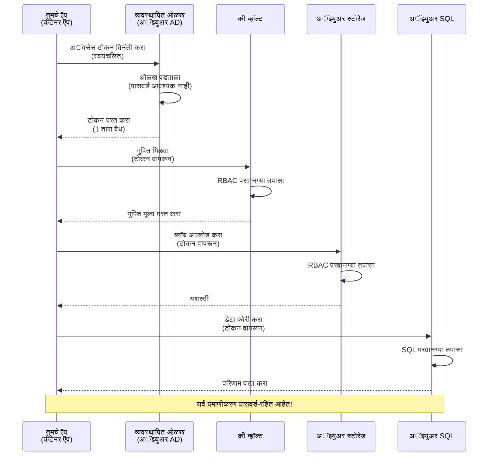
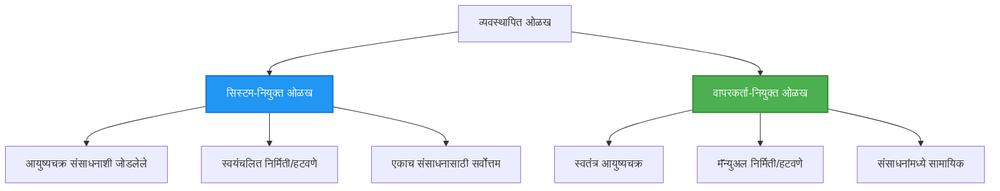

# Authentication Patterns and Managed Identity

⏱️ **Estimated Time**: 45-60 minutes | 💰 **Cost Impact**: Free (no additional charges) | ⭐ **Complexity**: Intermediate

**📚 Learning Path:**
- ← Previous: [Configuration Management](configuration.md) - पर्यावरण चल व रहस्य व्यवस्थापन
- 🎯 **You Are Here**: Authentication & Security (Managed Identity, Key Vault, secure patterns)
- → Next: [First Project](first-project.md) - आपले पहिले AZD अॅप बिल्ड करा
- 🏠 [Course Home](../../README.md)

---

## What You'll Learn

या धड्याला पूर्ण केल्यानंतर, आपण:
- Azure प्रमाणीकरण नमुने समजून घ्याल (keys, connection strings, managed identity)
- पासवर्डशिवाय प्रमाणीकरणसाठी **Managed Identity** कसे राबवायचे ते अंमलात आणाल
- **Azure Key Vault** समाकलनाद्वारे रहस्य सुरक्षित ठेवाल
- AZD डिप्लॉयमेंटसाठी **role-based access control (RBAC)** कॉन्फिगर कराल
- Container Apps आणि Azure सेवांमध्ये सुरक्षा सर्वोत्तम पद्धती लागू कराल
- की-आधारित प्रमाणीकरणापासून ओळख-आधारित प्रमाणीकरणाकडे स्थलांतर कराल

## Why Managed Identity Matters

### The Problem: Traditional Authentication

**Before Managed Identity:**
```javascript
// ❌ सुरक्षा धोका: कोडमध्ये हार्डकोड केलेली गुप्त माहिती
const connectionString = "Server=mydb.database.windows.net;User=admin;Password=P@ssw0rd123";
const storageKey = "xK7mN9pQ2wR5tY8uI0oP3aS6dF1gH4jK...";
const cosmosKey = "C2x7B9n4M1p8Q5w3E6r0T2y5U8i1O4p7...";
```

**Problems:**
- 🔴 **कोडमध्ये, कॉन्फिग फाईलमध्ये, किंवा पर्यावरण चलांमध्ये उघडलेली रहस्ये**
- 🔴 **क्रेडेन्शियल रोटेशन** साठी कोड बदल आणि पुन्हा डिप्लॉय करावे लागते
- 🔴 **ऑडिटच्या दृष्टीने भयानक स्थिती** - कोणाने काय कधी पाहिले हे ट्रॅक करणे कठीण
- 🔴 **विखुरलेली संरचना** - रहस्य अनेक सिस्टममध्ये पसरलेली असतात
- 🔴 **पालनसंबंधी जोखीम** - सुरक्षा ऑडिट फेल होऊ शकतात

### The Solution: Managed Identity

**After Managed Identity:**
```javascript
// ✅ सुरक्षित: कोडमध्ये कोणतीही गुप्त माहिती नाही
const credential = new DefaultAzureCredential();
const client = new BlobServiceClient(
  "https://mystorageaccount.blob.core.windows.net",
  credential  // Azure आपोआप प्रमाणीकरण हाताळते
);
```

**Benefits:**
- ✅ **कोड किंवा कॉन्फिगमध्ये शून्य रहस्ये**
- ✅ **स्वयंचलित रोटेशन** - Azure हे हाताळते
- ✅ **Azure AD लॉगमध्ये पूर्ण ऑडिट ट्रेल**
- ✅ **केंद्रीकृत सुरक्षा** - Azure पोर्टलमध्ये व्यवस्थापित करा
- ✅ **कंप्लायन्स-तयार** - सुरक्षा मानके पूर्ण करते

**Analogy**: पारंपरिक प्रमाणीकरण म्हणजे विविध दरवाजांसाठी अनेक फिजिकल कीज नेणे. Managed Identity म्हणजे सुरक्षा बॅज ज्यामुळे आपल्या ओळखीवर आधारित आपोआप प्रवेश मिळेल — हरवण्याची, कॉपी करण्याची किंवा रोटेट करण्याची गरज नाही.

---

## Architecture Overview

### Authentication Flow with Managed Identity


### Types of Managed Identities


| Feature | System-Assigned | User-Assigned |
|---------|----------------|---------------|
| **Lifecycle** | संसाधनाशी जोडलेले | स्वतंत्र |
| **Creation** | संसाधनासोबत आपोआप | मॅन्युअल निर्मिती |
| **Deletion** | संसाधनासोबत हटवले जाते | संसाधन हटवल्यानंतर टिकून राहते |
| **Sharing** | फक्त एक संसाधन | अनेक संसाधने |
| **Use Case** | सोपी परिस्थितींसाठी | जटिल बहु-संस्थात्मक परिस्थितीसाठी |
| **AZD Default** | ✅ शिफारस केली जाते | ऐच्छिक |

---

## Prerequisites

### Required Tools

आपल्याकडे आधीच्या धड्यांमधून हे आधीच इन्स्टॉल केलेले असले पाहिजे:

```bash
# Azure Developer CLI सत्यापित करा
azd version
# ✅ अपेक्षित: azd आवृत्ती 1.0.0 किंवा त्याहून अधिक

# Azure CLI सत्यापित करा
az --version
# ✅ अपेक्षित: azure-cli 2.50.0 किंवा त्याहून अधिक
```

### Azure Requirements

- सक्रिय Azure सदस्यत्व
- परवानग्या ज्यात समाविष्ट आहेत:
  - Managed identities तयार करण्याची परवानगी
  - RBAC भूमिका नियुक्त करण्याची परवानगी
  - Key Vault संसाधने तयार करण्याची परवानगी
  - Container Apps डिप्लॉय करण्याची परवानगी

### Knowledge Prerequisites

आपण हे पूर्ण केलेले असावे:
- [Installation Guide](installation.md) - AZD सेटअप
- [AZD Basics](azd-basics.md) - मुख्य संकल्पना
- [Configuration Management](configuration.md) - पर्यावरण चल

---

## Lesson 1: Understanding Authentication Patterns

### Pattern 1: Connection Strings (Legacy - Avoid)

**How it works:**
```bash
# कनेक्शन स्ट्रिंगमध्ये प्रवेशप्रमाणपत्रे समाविष्ट आहेत
STORAGE_CONNECTION_STRING="DefaultEndpointsProtocol=https;AccountName=myaccount;AccountKey=xK7mN9pQ2wR5..."
COSMOS_CONNECTION_STRING="AccountEndpoint=https://myaccount.documents.azure.com:443/;AccountKey=C2x7..."
SQL_CONNECTION_STRING="Server=myserver.database.windows.net;User=admin;Password=P@ssw0rd..."
```

**Problems:**
- ❌ पर्यावरण चलांमध्ये रहस्ये दृश्यमान
- ❌ डिप्लॉयमेंट सिस्टममध्ये लॉग होणे
- ❌ रोटेट करणे कठीण
- ❌ प्रवेशाचा ऑडिट ट्रेल नाही

**When to use:** फक्त लोकल विकासासाठी, उत्पादनात कधीही नाही.

---

### Pattern 2: Key Vault References (Better)

**How it works:**
```bicep
// Store secret in Key Vault
resource keyVault 'Microsoft.KeyVault/vaults@2023-02-01' = {
  name: 'mykv'
  properties: {
    enableRbacAuthorization: true
  }
}

// Reference in Container App
env: [
  {
    name: 'STORAGE_KEY'
    secretRef: 'storage-key'  // References Key Vault
  }
]
```

**Benefits:**
- ✅ रहस्ये Key Vault मध्ये सुरक्षितपणे साठवली जातात
- ✅ केंद्रीकृत रहस्य व्यवस्थापन
- ✅ कोड बदल न करता रोटेशन

**Limitations:**
- ⚠️ अद्याप कीज/पासवर्डचा वापर
- ⚠️ Key Vault प्रवेश व्यवस्थापित करावा लागतो

**When to use:** connection strings पासून managed identity कडे जाण्याचा संक्रमण टप्पा.

---

### Pattern 3: Managed Identity (Best Practice)

**How it works:**
```bicep
// Enable managed identity
resource containerApp 'Microsoft.App/containerApps@2023-05-01' = {
  name: 'myapp'
  identity: {
    type: 'SystemAssigned'  // Automatically creates identity
  }
}

// Grant permissions
resource roleAssignment 'Microsoft.Authorization/roleAssignments@2022-04-01' = {
  scope: storageAccount
  properties: {
    roleDefinitionId: storageBlobDataContributorRole
    principalId: containerApp.identity.principalId
  }
}
```

**Application code:**
```javascript
// गुपितांची गरज नाही!
const { DefaultAzureCredential } = require('@azure/identity');
const { BlobServiceClient } = require('@azure/storage-blob');

const credential = new DefaultAzureCredential();
const blobServiceClient = new BlobServiceClient(
  'https://mystorageaccount.blob.core.windows.net',
  credential
);
```

**Benefits:**
- ✅ कोड/कॉन्फिगमध्ये शून्य रहस्ये
- ✅ स्वयंचलित क्रेडेन्शियल रोटेशन
- ✅ पूर्ण ऑडिट ट्रेल
- ✅ RBAC-आधारित परवानग्या
- ✅ कंप्लायन्स-तयार

**When to use:** उत्पादन अॅप्ससाठी नेहमी.

---

## Lesson 2: Implementing Managed Identity with AZD

### Step-by-Step Implementation

चला एक सुरक्षित Container App तयार करू जे Managed Identity वापरून Azure Storage आणि Key Vault मध्ये प्रवेश करेल.

### Project Structure

```
secure-app/
├── azure.yaml                 # AZD configuration
├── infra/
│   ├── main.bicep            # Main infrastructure
│   ├── core/
│   │   ├── identity.bicep    # Managed identity setup
│   │   ├── keyvault.bicep    # Key Vault configuration
│   │   └── storage.bicep     # Storage with RBAC
│   └── app/
│       └── container-app.bicep
└── src/
    ├── app.js                # Application code
    ├── package.json
    └── Dockerfile
```

### 1. Configure AZD (azure.yaml)

```yaml
name: secure-app
metadata:
  template: secure-app@1.0.0

services:
  api:
    project: ./src
    language: js
    host: containerapp

# Enable managed identity (AZD handles this automatically)
```

### 2. Infrastructure: Enable Managed Identity

**File: `infra/main.bicep`**

```bicep
targetScope = 'subscription'

param environmentName string
param location string = 'eastus'

var tags = { 'azd-env-name': environmentName }

// Resource group
resource rg 'Microsoft.Resources/resourceGroups@2021-04-01' = {
  name: 'rg-${environmentName}'
  location: location
  tags: tags
}

// Storage Account
module storage './core/storage.bicep' = {
  name: 'storage'
  scope: rg
  params: {
    name: 'st${uniqueString(rg.id)}'
    location: location
    tags: tags
  }
}

// Key Vault
module keyVault './core/keyvault.bicep' = {
  name: 'keyvault'
  scope: rg
  params: {
    name: 'kv-${uniqueString(rg.id)}'
    location: location
    tags: tags
  }
}

// Container App with Managed Identity
module containerApp './app/container-app.bicep' = {
  name: 'container-app'
  scope: rg
  params: {
    name: 'ca-${environmentName}'
    location: location
    tags: tags
    storageAccountName: storage.outputs.name
    keyVaultName: keyVault.outputs.name
  }
}

// Grant Container App access to Storage
module storageRoleAssignment './core/role-assignment.bicep' = {
  name: 'storage-role'
  scope: rg
  params: {
    principalId: containerApp.outputs.identityPrincipalId
    roleDefinitionId: 'ba92f5b4-2d11-453d-a403-e96b0029c9fe'  // Storage Blob Data Contributor
    targetResourceId: storage.outputs.id
  }
}

// Grant Container App access to Key Vault
module kvRoleAssignment './core/role-assignment.bicep' = {
  name: 'kv-role'
  scope: rg
  params: {
    principalId: containerApp.outputs.identityPrincipalId
    roleDefinitionId: '4633458b-17de-408a-b874-0445c86b69e6'  // Key Vault Secrets User
    targetResourceId: keyVault.outputs.id
  }
}

// Outputs
output AZURE_STORAGE_ACCOUNT_NAME string = storage.outputs.name
output AZURE_KEY_VAULT_NAME string = keyVault.outputs.name
output APP_URL string = containerApp.outputs.url
```

### 3. Container App with System-Assigned Identity

**File: `infra/app/container-app.bicep`**

```bicep
param name string
param location string
param tags object = {}
param storageAccountName string
param keyVaultName string

resource containerApp 'Microsoft.App/containerApps@2023-05-01' = {
  name: name
  location: location
  tags: tags
  identity: {
    type: 'SystemAssigned'  // 🔑 Enable managed identity
  }
  properties: {
    configuration: {
      ingress: {
        external: true
        targetPort: 3000
      }
    }
    template: {
      containers: [
        {
          name: 'api'
          image: 'myregistry.azurecr.io/api:latest'
          resources: {
            cpu: json('0.5')
            memory: '1Gi'
          }
          env: [
            {
              name: 'AZURE_STORAGE_ACCOUNT_NAME'
              value: storageAccountName
            }
            {
              name: 'AZURE_KEY_VAULT_NAME'
              value: keyVaultName
            }
            // 🔑 No secrets - managed identity handles authentication!
          ]
        }
      ]
    }
  }
}

// Output the identity for RBAC assignments
output identityPrincipalId string = containerApp.identity.principalId
output id string = containerApp.id
output url string = 'https://${containerApp.properties.configuration.ingress.fqdn}'
```

### 4. RBAC Role Assignment Module

**File: `infra/core/role-assignment.bicep`**

```bicep
param principalId string
param roleDefinitionId string  // Azure built-in role ID
param targetResourceId string

resource roleAssignment 'Microsoft.Authorization/roleAssignments@2022-04-01' = {
  name: guid(principalId, roleDefinitionId, targetResourceId)
  scope: resourceId('Microsoft.Resources/resourceGroups', resourceGroup().name)
  properties: {
    roleDefinitionId: subscriptionResourceId('Microsoft.Authorization/roleDefinitions', roleDefinitionId)
    principalId: principalId
    principalType: 'ServicePrincipal'
  }
}

output id string = roleAssignment.id
```

### 5. Application Code with Managed Identity

**File: `src/app.js`**

```javascript
const express = require('express');
const { DefaultAzureCredential } = require('@azure/identity');
const { BlobServiceClient } = require('@azure/storage-blob');
const { SecretClient } = require('@azure/keyvault-secrets');

const app = express();
const PORT = process.env.PORT || 3000;

// 🔑 क्रेडेन्शियल प्रारंभ करा (managed identity सह स्वयंचलितपणे कार्य करते)
const credential = new DefaultAzureCredential();

// Azure स्टोरेज सेटअप
const storageAccountName = process.env.AZURE_STORAGE_ACCOUNT_NAME;
const blobServiceClient = new BlobServiceClient(
  `https://${storageAccountName}.blob.core.windows.net`,
  credential  // कुठल्याही कींची गरज नाही!
);

// Key Vault सेटअप
const keyVaultName = process.env.AZURE_KEY_VAULT_NAME;
const secretClient = new SecretClient(
  `https://${keyVaultName}.vault.azure.net`,
  credential  // कुठल्याही कींची गरज नाही!
);

// आरोग्य तपासणी
app.get('/health', (req, res) => {
  res.json({ status: 'healthy', authentication: 'managed-identity' });
});

// ब्लॉब स्टोरेजमध्ये फाइल अपलोड करा
app.post('/upload', async (req, res) => {
  try {
    const containerClient = blobServiceClient.getContainerClient('uploads');
    await containerClient.createIfNotExists();
    
    const blobName = `file-${Date.now()}.txt`;
    const blockBlobClient = containerClient.getBlockBlobClient(blobName);
    
    await blockBlobClient.upload('Hello from managed identity!', 30);
    
    res.json({
      success: true,
      blobName: blobName,
      message: 'File uploaded using managed identity!'
    });
  } catch (error) {
    console.error('Upload error:', error);
    res.status(500).json({ error: error.message });
  }
});

// Key Vault मधून गुप्त माहिती मिळवा
app.get('/secret/:name', async (req, res) => {
  try {
    const secretName = req.params.name;
    const secret = await secretClient.getSecret(secretName);
    
    res.json({
      name: secretName,
      value: secret.value,
      message: 'Secret retrieved using managed identity!'
    });
  } catch (error) {
    console.error('Secret error:', error);
    res.status(500).json({ error: error.message });
  }
});

// ब्लॉब कंटेनर्सची यादी करा (वाचन प्रवेश दाखवते)
app.get('/containers', async (req, res) => {
  try {
    const containers = [];
    for await (const container of blobServiceClient.listContainers()) {
      containers.push(container.name);
    }
    
    res.json({
      containers: containers,
      count: containers.length,
      message: 'Containers listed using managed identity!'
    });
  } catch (error) {
    console.error('List error:', error);
    res.status(500).json({ error: error.message });
  }
});

app.listen(PORT, () => {
  console.log(`Secure API listening on port ${PORT}`);
  console.log('Authentication: Managed Identity (passwordless)');
});
```

**File: `src/package.json`**

```json
{
  "name": "secure-app",
  "version": "1.0.0",
  "dependencies": {
    "express": "^4.18.2",
    "@azure/identity": "^4.0.0",
    "@azure/storage-blob": "^12.17.0",
    "@azure/keyvault-secrets": "^4.7.0"
  },
  "scripts": {
    "start": "node app.js"
  }
}
```

### 6. Deploy and Test

```bash
# AZD पर्यावरण प्रारंभ करा
azd init

# पायाभूत संरचना आणि अनुप्रयोग तैनात करा
azd up

# अॅपचा URL मिळवा
APP_URL=$(azd env get-values | grep APP_URL | cut -d '=' -f2 | tr -d '"')

# हेल्थ चेक तपासा
curl $APP_URL/health
```

**✅ Expected output:**
```json
{
  "status": "healthy",
  "authentication": "managed-identity"
}
```

**Test blob upload:**
```bash
curl -X POST $APP_URL/upload
```

**✅ Expected output:**
```json
{
  "success": true,
  "blobName": "file-1700404800000.txt",
  "message": "File uploaded using managed identity!"
}
```

**Test container listing:**
```bash
curl $APP_URL/containers
```

**✅ Expected output:**
```json
{
  "containers": ["uploads"],
  "count": 1,
  "message": "Containers listed using managed identity!"
}
```

---

## Common Azure RBAC Roles

### Built-in Role IDs for Managed Identity

| Service | Role Name | Role ID | Permissions |
|---------|-----------|---------|-------------|
| **Storage** | Storage Blob Data Reader | `2a2b9908-6b94-4a3d-8e5a-a7d8f8cc8a12` | ब्लॉब आणि कंटेनर वाचण्याची परवानगी |
| **Storage** | Storage Blob Data Contributor | `ba92f5b4-2d11-453d-a403-e96b0029c9fe` | ब्लॉब वाचणे, लिहिणे, हटविणे |
| **Storage** | Storage Queue Data Contributor | `974c5e8b-45b9-4653-ba55-5f855dd0fb88` | 큐 मेसेज वाचणे, लिहिणे, हटविणे |
| **Key Vault** | Key Vault Secrets User | `4633458b-17de-408a-b874-0445c86b69e6` | रहस्ये वाचण्याची परवानगी |
| **Key Vault** | Key Vault Secrets Officer | `b86a8fe4-44ce-4948-aee5-eccb2c155cd7` | रहस्ये वाचणे, लिहिणे, हटविणे |
| **Cosmos DB** | Cosmos DB Built-in Data Reader | `00000000-0000-0000-0000-000000000001` | Cosmos DB डेटा वाचणे |
| **Cosmos DB** | Cosmos DB Built-in Data Contributor | `00000000-0000-0000-0000-000000000002` | Cosmos DB मध्ये वाचन व लेखन |
| **SQL Database** | SQL DB Contributor | `9b7fa17d-e63e-47b0-bb0a-15c516ac86ec` | SQL डेटाबेस व्यवस्थापित करणे |
| **Service Bus** | Azure Service Bus Data Owner | `090c5cfd-751d-490a-894a-3ce6f1109419` | मेसेज पाठवणे, प्राप्त करणे, व्यवस्थापित करणे |

### How to Find Role IDs

```bash
# सर्व अंगभूत भूमिका सूचीबद्ध करा
az role definition list --query "[].{Name:roleName, ID:name}" --output table

# विशिष्ट भूमिका शोधा
az role definition list --query "[?contains(roleName, 'Storage Blob')].{Name:roleName, ID:name}" --output table

# भूमिकेचे तपशील मिळवा
az role definition list --name "Storage Blob Data Contributor"
```

---

## Practical Exercises

### Exercise 1: Enable Managed Identity for Existing App ⭐⭐ (Medium)

**Goal**: अस्तित्वातील Container App डिप्लॉयमेंटसाठी managed identity जोडा

**Scenario**: आपल्याकडे connection strings वापरणारी Container App आहे. ती managed identity मध्ये रूपांतरित करा.

**Starting Point**: खालील कॉन्फिग असलेली Container App:

```bicep
// ❌ Current: Using connection string
env: [
  {
    name: 'STORAGE_CONNECTION_STRING'
    secretRef: 'storage-connection'
  }
]
```

**Steps**:

1. **Bicep मध्ये managed identity सक्षम करा:**

```bicep
resource containerApp 'Microsoft.App/containerApps@2023-05-01' = {
  name: 'myapp'
  identity: {
    type: 'SystemAssigned'  // Add this
  }
  // ... rest of configuration
}
```

2. **Storage प्रवेश द्या:**

```bicep
// Get storage account reference
resource storageAccount 'Microsoft.Storage/storageAccounts@2023-01-01' existing = {
  name: storageAccountName
}

// Assign role
resource roleAssignment 'Microsoft.Authorization/roleAssignments@2022-04-01' = {
  name: guid(containerApp.id, 'ba92f5b4-2d11-453d-a403-e96b0029c9fe', storageAccount.id)
  scope: storageAccount
  properties: {
    roleDefinitionId: subscriptionResourceId('Microsoft.Authorization/roleDefinitions', 'ba92f5b4-2d11-453d-a403-e96b0029c9fe')
    principalId: containerApp.identity.principalId
    principalType: 'ServicePrincipal'
  }
}
```

3. **अॅप्लिकेशन कोड अपडेट करा:**

**Before (connection string):**
```javascript
const { BlobServiceClient } = require('@azure/storage-blob');

const blobServiceClient = BlobServiceClient.fromConnectionString(
  process.env.STORAGE_CONNECTION_STRING
);
```

**After (managed identity):**
```javascript
const { DefaultAzureCredential } = require('@azure/identity');
const { BlobServiceClient } = require('@azure/storage-blob');

const credential = new DefaultAzureCredential();
const blobServiceClient = new BlobServiceClient(
  `https://${process.env.STORAGE_ACCOUNT_NAME}.blob.core.windows.net`,
  credential
);
```

4. **पर्यावरण चल अपडेट करा:**

```bicep
env: [
  {
    name: 'STORAGE_ACCOUNT_NAME'
    value: storageAccountName  // Just the name, no secrets!
  }
  // Remove STORAGE_CONNECTION_STRING
]
```

5. **डिप्लॉय आणि चाचणी करा:**

```bash
# पुन्हा तैनात करा
azd up

# हे अजूनही कार्य करते याची चाचणी करा
curl https://myapp.azurecontainerapps.io/upload
```

**✅ Success Criteria:**
- ✅ अॅप्लिकेशन त्रुटीशिवाय डिप्लॉय होते
- ✅ Storage ऑपरेशन्स कार्य करतात (अपलोड, लिस्ट, डाउनलोड)
- ✅ पर्यावरण चलांमध्ये कोणतीही connection string नाही
- ✅ Azure Portal मध्ये "Identity" ब्लेडखाली ओळख दिसते

**Verification:**

```bash
# व्यवस्थापित ओळख सक्षम आहे का हे तपासा
az containerapp show \
  --name myapp \
  --resource-group rg-myapp \
  --query "identity.type"
# ✅ अपेक्षित: "SystemAssigned"

# भूमिका नियुक्ती तपासा
az role assignment list \
  --assignee $(az containerapp show --name myapp --resource-group rg-myapp --query "identity.principalId" -o tsv) \
  --scope /subscriptions/{sub-id}/resourceGroups/rg-myapp/providers/Microsoft.Storage/storageAccounts/mystorageaccount
# ✅ अपेक्षित: "Storage Blob Data Contributor" भूमिका दाखवते
```

**Time**: 20-30 minutes

---

### Exercise 2: Multi-Service Access with User-Assigned Identity ⭐⭐⭐ (Advanced)

**Goal**: अनेक Container Apps मध्ये सामायिक वापरासाठी user-assigned identity तयार करा

**Scenario**: आपल्याकडे 3 मायक्रोसर्व्हिसेस आहेत ज्यांना सारख्या Storage अकाउंट आणि Key Vault ने प्रवेश हवा आहे.

**Steps**:

1. **user-assigned identity तयार करा:**

**File: `infra/core/identity.bicep`**

```bicep
param name string
param location string
param tags object = {}

resource userAssignedIdentity 'Microsoft.ManagedIdentity/userAssignedIdentities@2023-01-31' = {
  name: name
  location: location
  tags: tags
}

output id string = userAssignedIdentity.id
output principalId string = userAssignedIdentity.properties.principalId
output clientId string = userAssignedIdentity.properties.clientId
```

2. **user-assigned identity ला भूमिका देणे:**

```bicep
// In main.bicep
module userIdentity './core/identity.bicep' = {
  name: 'user-identity'
  scope: rg
  params: {
    name: 'id-${environmentName}'
    location: location
    tags: tags
  }
}

// Grant Storage access
resource storageRoleAssignment 'Microsoft.Authorization/roleAssignments@2022-04-01' = {
  name: guid(userIdentity.outputs.principalId, 'storage-contributor')
  scope: storageAccount
  properties: {
    roleDefinitionId: subscriptionResourceId('Microsoft.Authorization/roleDefinitions', 'ba92f5b4-2d11-453d-a403-e96b0029c9fe')
    principalId: userIdentity.outputs.principalId
    principalType: 'ServicePrincipal'
  }
}

// Grant Key Vault access
resource kvRoleAssignment 'Microsoft.Authorization/roleAssignments@2022-04-01' = {
  name: guid(userIdentity.outputs.principalId, 'kv-secrets-user')
  scope: keyVault
  properties: {
    roleDefinitionId: subscriptionResourceId('Microsoft.Authorization/roleDefinitions', '4633458b-17de-408a-b874-0445c86b69e6')
    principalId: userIdentity.outputs.principalId
    principalType: 'ServicePrincipal'
  }
}
```

3. **ओळख अनेक Container Apps ला नियुक्त करा:**

```bicep
resource apiGateway 'Microsoft.App/containerApps@2023-05-01' = {
  name: 'api-gateway'
  identity: {
    type: 'UserAssigned'
    userAssignedIdentities: {
      '${userIdentity.outputs.id}': {}
    }
  }
  // ... rest of config
}

resource productService 'Microsoft.App/containerApps@2023-05-01' = {
  name: 'product-service'
  identity: {
    type: 'UserAssigned'
    userAssignedIdentities: {
      '${userIdentity.outputs.id}': {}
    }
  }
  // ... rest of config
}

resource orderService 'Microsoft.App/containerApps@2023-05-01' = {
  name: 'order-service'
  identity: {
    type: 'UserAssigned'
    userAssignedIdentities: {
      '${userIdentity.outputs.id}': {}
    }
  }
  // ... rest of config
}
```

4. **अॅप्लिकेशन कोड (सर्व सेवा समान पद्धत वापरतात):**

```javascript
const { DefaultAzureCredential, ManagedIdentityCredential } = require('@azure/identity');

// वापरकर्त्याद्वारे नियुक्त केलेली ओळख वापरत असल्यास, क्लायंट आयडी निर्दिष्ट करा
const credential = new ManagedIdentityCredential(
  process.env.AZURE_CLIENT_ID  // वापरकर्त्याद्वारे नियुक्त केलेल्या ओळखीचा क्लायंट आयडी
);

// किंवा DefaultAzureCredential वापरा (आपोआप शोधते)
const credential = new DefaultAzureCredential();

const blobServiceClient = new BlobServiceClient(
  `https://${process.env.STORAGE_ACCOUNT_NAME}.blob.core.windows.net`,
  credential
);
```

5. **डिप्लॉय आणि सत्यापित करा:**

```bash
azd up

# सर्व सेवा स्टोरेजमध्ये प्रवेश करू शकतात का ते तपासा
curl https://api-gateway.azurecontainerapps.io/upload
curl https://product-service.azurecontainerapps.io/upload
curl https://order-service.azurecontainerapps.io/upload
```

**✅ Success Criteria:**
- ✅ एकच ओळख 3 सेवांमध्ये सामायिक केली आहे
- ✅ सर्व सेवा Storage आणि Key Vault ला प्रवेश करू शकतात
- ✅ एखादी सेवा हटवल्यानंतर ओळख टिकून राहते
- ✅ केंद्रीकृत परवानगी व्यवस्थापन

**Benefits of User-Assigned Identity:**
- व्यवस्थापित करण्यासाठी एक ओळख
- सेवांमध्ये सुसंगत परवानग्या
- सेवा हटवल्यानंतरही टिकून राहते
- जटिल आर्किटेक्चरसाठी चांगले

**Time**: 30-40 minutes

---

### Exercise 3: Implement Key Vault Secret Rotation ⭐⭐⭐ (Advanced)

**Goal**: तृतीय-पक्ष API किज Key Vault मध्ये साठवा आणि Managed Identity वापरून त्यांना प्रवेश द्या

**Scenario**: आपले अॅप बाह्य API (OpenAI, Stripe, SendGrid) कॉल करते ज्यांना API किज लागतात.

**Steps**:

1. **RBAC सह Key Vault तयार करा:**

**File: `infra/core/keyvault.bicep`**

```bicep
param name string
param location string
param tags object = {}

resource keyVault 'Microsoft.KeyVault/vaults@2023-02-01' = {
  name: name
  location: location
  tags: tags
  properties: {
    enableRbacAuthorization: true  // Use RBAC instead of access policies
    sku: {
      family: 'A'
      name: 'standard'
    }
    tenantId: subscription().tenantId
    enableSoftDelete: true
    softDeleteRetentionInDays: 90
  }
}

// Allow Container App to read secrets
output id string = keyVault.id
output name string = keyVault.name
output uri string = keyVault.properties.vaultUri
```

2. **Key Vault मध्ये रहस्ये साठवा:**

```bash
# Key Vault चे नाव मिळवा
KV_NAME=$(azd env get-values | grep AZURE_KEY_VAULT_NAME | cut -d '=' -f2 | tr -d '"')

# तृतीय-पक्षाच्या API की साठवा
az keyvault secret set \
  --vault-name $KV_NAME \
  --name "OpenAI-ApiKey" \
  --value "sk-proj-xxxxxxxxxxxxx"

az keyvault secret set \
  --vault-name $KV_NAME \
  --name "Stripe-ApiKey" \
  --value "sk_live_xxxxxxxxxxxxx"

az keyvault secret set \
  --vault-name $KV_NAME \
  --name "SendGrid-ApiKey" \
  --value "SG.xxxxxxxxxxxxx"
```

3. **रहस्य मिळवण्यासाठी अॅप्लिकेशन कोड:**

**File: `src/config.js`**

```javascript
const { DefaultAzureCredential } = require('@azure/identity');
const { SecretClient } = require('@azure/keyvault-secrets');

class Config {
  constructor() {
    this.credential = new DefaultAzureCredential();
    this.secretClient = new SecretClient(
      `https://${process.env.AZURE_KEY_VAULT_NAME}.vault.azure.net`,
      this.credential
    );
    this.cache = {};
  }

  async getSecret(secretName) {
    // प्रथम कॅश तपासा
    if (this.cache[secretName]) {
      return this.cache[secretName];
    }

    try {
      const secret = await this.secretClient.getSecret(secretName);
      this.cache[secretName] = secret.value;
      console.log(`✅ Retrieved secret: ${secretName}`);
      return secret.value;
    } catch (error) {
      console.error(`❌ Failed to get secret ${secretName}:`, error.message);
      throw error;
    }
  }

  async getOpenAIKey() {
    return this.getSecret('OpenAI-ApiKey');
  }

  async getStripeKey() {
    return this.getSecret('Stripe-ApiKey');
  }

  async getSendGridKey() {
    return this.getSecret('SendGrid-ApiKey');
  }
}

module.exports = new Config();
```

4. **अॅप्लिकेशनमध्ये रहस्य वापरा:**

**File: `src/app.js`**

```javascript
const express = require('express');
const config = require('./config');
const { OpenAI } = require('openai');

const app = express();

// Key Vault मधील कीने OpenAI प्रारंभ करा
let openaiClient;

async function initializeServices() {
  const openaiKey = await config.getOpenAIKey();
  openaiClient = new OpenAI({ apiKey: openaiKey });
  console.log('✅ Services initialized with secrets from Key Vault');
}

// सुरू होताना कॉल करा
initializeServices().catch(console.error);

app.post('/chat', async (req, res) => {
  try {
    const completion = await openaiClient.chat.completions.create({
      model: 'gpt-4',
      messages: [{ role: 'user', content: 'Hello!' }]
    });
    
    res.json({
      response: completion.choices[0].message.content,
      authentication: 'Key from Key Vault via Managed Identity'
    });
  } catch (error) {
    res.status(500).json({ error: error.message });
  }
});

app.listen(3000, () => {
  console.log('Secure API with Key Vault integration running');
});
```

5. **डिप्लॉय आणि चाचणी करा:**

```bash
azd up

# API की काम करतात की नाही हे तपासा
curl -X POST https://myapp.azurecontainerapps.io/chat \
  -H "Content-Type: application/json" \
  -d '{"message":"Hello AI"}'
```

**✅ Success Criteria:**
- ✅ कोड किंवा पर्यावरण चलांमध्ये कोणतीही API की नाही
- ✅ अॅप्लिकेशन Key Vault मधून किज प्राप्त करते
- ✅ तृतीय-पक्ष API योग्यरित्या काम करतात
- ✅ कोड बदल न करता किज रोटेट करता येतात

**Rotate a secret:**

```bash
# Key Vault मधील रहस्य अद्ययावत करा
az keyvault secret set \
  --vault-name $KV_NAME \
  --name "OpenAI-ApiKey" \
  --value "sk-proj-NEW_KEY_HERE"

# नवीन की लागू करण्यासाठी अॅप पुन्हा सुरू करा
az containerapp revision restart \
  --name myapp \
  --resource-group rg-myapp
```

**Time**: 25-35 minutes

---

## Knowledge Checkpoint

### 1. Authentication Patterns ✓

आपले समज तपासा:

- [ ] **Q1**: तीन मुख्य प्रमाणीकरण नमुने कोणते आहेत?
  - **A**: Connection strings (legacy), Key Vault references (transition), Managed Identity (best)

- [ ] **Q2**: Managed identity कशासाठी connection strings पेक्षा चांगले आहे?
  - **A**: कोडमध्ये कोणतीही रहस्ये नसतात, स्वयंचलित रोटेशन, पूर्ण ऑडिट ट्रेल, RBAC परवानग्या

- [ ] **Q3**: जेव्हा आपण system-assigned ऐवजी user-assigned identity वापराल तेव्हा का?
  - **A**: जेव्हा ओळख अनेक संसाधनांमध्ये सामायिक करायची असेल किंवा ओळखचा जीवनचक्र संसाधनापेक्षा स्वतंत्र असावा

**Hands-On Verification:**
```bash
# आपल्या अॅपने कोणत्या प्रकारची ओळख वापरते ते तपासा
az containerapp show \
  --name myapp \
  --resource-group rg-myapp \
  --query "identity.type"

# त्या ओळखीच्या सर्व भूमिका नियुक्त्या सूचीबद्ध करा
az role assignment list \
  --assignee $(az containerapp show --name myapp --resource-group rg-myapp --query "identity.principalId" -o tsv)
```

---

### 2. RBAC and Permissions ✓

आपले समज तपासा:

- [ ] **Q1**: "Storage Blob Data Contributor" साठी रोल ID काय आहे?
  - **A**: `ba92f5b4-2d11-453d-a403-e96b0029c9fe`

- [ ] **Q2**: "Key Vault Secrets User" कोणत्या परवानग्या देते?
  - **A**: रहस्यांवर वाचण्याचा अधिकार (निर्माण, अपडेट किंवा हटविण्याचा अधिकार नाही)

- [ ] **Q3**: Container App ला Azure SQL चा प्रवेश कसा देता?
  - **A**: "SQL DB Contributor" भूमिका नियुक्त करा किंवा SQL साठी Azure AD प्रमाणीकरण कॉन्फिगर करा

**Hands-On Verification:**
```bash
# विशिष्ट भूमिका शोधा
az role definition list --name "Storage Blob Data Contributor"

# तुमच्या ओळखीला कोणत्या भूमिका नियुक्त केल्या आहेत ते तपासा
PRINCIPAL_ID=$(az containerapp show --name myapp --resource-group rg-myapp --query "identity.principalId" -o tsv)
az role assignment list --assignee $PRINCIPAL_ID --output table
```

---

### 3. Key Vault Integration ✓

Test your understanding:
- [ ] **Q1**: Key Vault साठी access policies ऐवजी RBAC कसे सक्षम करावे?
  - **A**: Bicep मध्ये `enableRbacAuthorization: true` सेट करा

- [ ] **Q2**: कोणती Azure SDK लायब्ररी मॅनेज्ड आयडेंटिटी प्रमाणीकरण हाताळते?
  - **A**: `@azure/identity` सह `DefaultAzureCredential` क्लास

- [ ] **Q3**: Key Vault चे secrets कॅशमध्ये किती काळ टिकतात?
  - **A**: अनुप्रयोगावर अवलंबून; आपली स्वतःची कॅशिंग धोरण राबवा

**प्रत्यक्ष तपासणी:**
```bash
# Key Vault प्रवेशाची चाचणी
az keyvault secret show \
  --vault-name $KV_NAME \
  --name "OpenAI-ApiKey" \
  --query "value"

# RBAC सक्षम आहे का ते तपासा
az keyvault show \
  --name $KV_NAME \
  --query "properties.enableRbacAuthorization"
# ✅ अपेक्षित: true
```

---

## सुरक्षा सर्वोत्तम पद्धती

### ✅ करा:

1. **उत्पादनात नेहमी मॅनेज्ड आयडेंटिटी वापरा**
   ```bicep
   identity: {
     type: 'SystemAssigned'
   }
   ```

2. **किमान-अधिकार RBAC भूमिका वापरा**
   - शक्य असल्यास "Reader" भूमिका वापरा
   - आवश्यक नसल्यास "Owner" किंवा "Contributor" टाळा

3. **तृतीय-पक्ष कीज Key Vault मध्ये साठवा**
   ```javascript
   const apiKey = await secretClient.getSecret('ThirdPartyApiKey');
   ```

4. **ऑडिट लॉगिंग सक्षम करा**
   ```bicep
   diagnosticSettings: {
     logs: [{ category: 'AuditEvent', enabled: true }]
   }
   ```

5. **dev/staging/prod साठी वेगळ्या ओळखी वापरा**
   ```bash
   azd env new dev
   azd env new staging
   azd env new prod
   ```

6. **गुपिते नियमितपणे फेरबदल करा**
   - Key Vault मधील secrets वर समाप्तीची तारीख सेट करा
   - Azure Functions सह रोटेशन स्वयंचलित करा

### ❌ करू नका:

1. **कधीही गुपिते हार्डकोड करू नका**
   ```javascript
   // ❌ वाईट
   const apiKey = "sk-proj-xxxxxxxxxxxxx";
   ```

2. **उत्पादनात connection strings वापरू नका**
   ```javascript
   // ❌ वाईट
   BlobServiceClient.fromConnectionString(process.env.STORAGE_CONNECTION_STRING)
   ```

3. **अतिरिक्त परवानग्या देऊ नका**
   ```bicep
   // ❌ BAD - too much access
   roleDefinitionId: 'Owner'
   
   // ✅ GOOD - least privilege
   roleDefinitionId: 'Storage Blob Data Reader'
   ```

4. **गुपिते लॉग करू नका**
   ```javascript
   // ❌ वाईट
   console.log('API Key:', apiKey);
   
   // ✅ चांगले
   console.log('API Key retrieved successfully');
   ```

5. **उत्पादन ओळख्या वातावरणांदरम्यान शेअर करू नका**
   ```bicep
   // ❌ BAD - same identity for dev and prod
   // ✅ GOOD - separate identities per environment
   ```

---

## समस्या निवारण मार्गदर्शक

### समस्या: Azure Storage मध्ये प्रवेश करताना "Unauthorized"

**लक्षणे:**
```
Error: Unauthorized (403)
AuthorizationPermissionMismatch: This request is not authorized to perform this operation
```

**निदान:**

```bash
# व्यवस्थापित ओळख सक्षम आहे का ते तपासा
az containerapp show \
  --name myapp \
  --resource-group rg-myapp \
  --query "identity.type"
# ✅ अपेक्षित: "SystemAssigned" किंवा "UserAssigned"

# भूमिका नियुक्त्या तपासा
PRINCIPAL_ID=$(az containerapp show --name myapp --resource-group rg-myapp --query "identity.principalId" -o tsv)
az role assignment list --assignee $PRINCIPAL_ID

# अपेक्षित: "Storage Blob Data Contributor" किंवा तत्सम भूमिका दिसावी
```

**उपाय:**

1. **योग्य RBAC भूमिका द्या:**
```bash
STORAGE_ID=$(az storage account show --name mystorageaccount --resource-group rg-myapp --query "id" -o tsv)
az role assignment create \
  --assignee $PRINCIPAL_ID \
  --role "Storage Blob Data Contributor" \
  --scope $STORAGE_ID
```

2. **प्रसार होता येईपर्यंत थांबा (5-10 मिनिटे लागू शकतात):**
```bash
# भूमिका नियुक्तीची स्थिती तपासा
az role assignment list --assignee $PRINCIPAL_ID --scope $STORAGE_ID
```

3. **अॅप्लिकेशन कोड योग्य क्रेडेन्शियल वापरत आहे याची पडताळणी करा:**
```javascript
// आपण DefaultAzureCredential वापरत आहात याची खात्री करा
const credential = new DefaultAzureCredential();
```

---

### समस्या: Key Vault प्रवेश नाकारला गेला

**लक्षणे:**
```
Error: Forbidden (403)
The user, group or application does not have secrets get permission
```

**निदान:**

```bash
# Key Vault RBAC सक्षम आहे का ते तपासा
az keyvault show \
  --name $KV_NAME \
  --query "properties.enableRbacAuthorization"
# ✅ अपेक्षित: खरे

# भूमिका वाटप तपासा
az role assignment list \
  --assignee $PRINCIPAL_ID \
  --scope /subscriptions/{sub-id}/resourceGroups/rg-myapp/providers/Microsoft.KeyVault/vaults/$KV_NAME
```

**उपाय:**

1. **Key Vault वर RBAC सक्षम करा:**
```bash
az keyvault update \
  --name $KV_NAME \
  --enable-rbac-authorization true
```

2. **Key Vault Secrets User भूमिका द्या:**
```bash
KV_ID=$(az keyvault show --name $KV_NAME --query "id" -o tsv)
az role assignment create \
  --assignee $PRINCIPAL_ID \
  --role "Key Vault Secrets User" \
  --scope $KV_ID
```

---

### समस्या: स्थानिकपणे DefaultAzureCredential अयशस्वी होते

**लक्षणे:**
```
Error: DefaultAzureCredential failed to retrieve a token
CredentialUnavailableError: No credential available
```

**निदान:**

```bash
# तुम्ही लॉग इन आहात का ते तपासा
az account show

# Azure CLI चे प्रमाणीकरण तपासा
az ad signed-in-user show
```

**उपाय:**

1. **Azure CLI मध्ये लॉगिन करा:**
```bash
az login
```

2. **Azure subscription सेट करा:**
```bash
az account set --subscription "Your Subscription Name"
```

3. **स्थानिक विकासासाठी, पर्यावरण चल (environment variables) वापरा:**
```bash
export AZURE_TENANT_ID="your-tenant-id"
export AZURE_CLIENT_ID="your-client-id"
export AZURE_CLIENT_SECRET="your-client-secret"
```

4. **किंवा स्थानिकपणे वेगळे क्रेडेन्शियल वापरा:**
```javascript
const { DefaultAzureCredential, AzureCliCredential } = require('@azure/identity');

// स्थानिक विकासासाठी AzureCliCredential वापरा
const credential = process.env.NODE_ENV === 'production' 
  ? new DefaultAzureCredential()
  : new AzureCliCredential();
```

---

### समस्या: भूमिका नियुक्तीला प्रसारित होण्यासाठी खूप वेळ लागतो

**लक्षणे:**
- भूमिका यशस्वीरित्या नियुक्त झाली
- तरीही 403 त्रुटी मिळत आहेत
- प्रवेशात मध्ये विच्छेद (कधीकधी कार्य करते, कधीकधी नाही)

**स्पष्टीकरण:**
Azure RBAC बदलांना जागतिक पातळीवर प्रसारित होण्यासाठी 5-10 मिनिटे लागू शकतात.

**उपाय:**

```bash
# थांबा आणि पुन्हा प्रयत्न करा
echo "Waiting for RBAC propagation..."
sleep 300  # 5 मिनिटे थांबा

# प्रवेश तपासा
curl https://myapp.azurecontainerapps.io/upload

# अजूनही अयशस्वी असल्यास, अॅप पुन्हा सुरू करा
az containerapp revision restart \
  --name myapp \
  --resource-group rg-myapp
```

---

## खर्च विचार

### मॅनेज्ड आयडेंटिटीचे खर्च

| Resource | Cost |
|----------|------|
| **Managed Identity** | 🆓 **FREE** - कोणतेही शुल्क नाही |
| **RBAC Role Assignments** | 🆓 **FREE** - कोणतेही शुल्क नाही |
| **Azure AD Token Requests** | 🆓 **FREE** - समाविष्ट |
| **Key Vault Operations** | $0.03 प्रति 10,000 ऑपरेशन्स |
| **Key Vault Storage** | $0.024 प्रति गुपित प्रति महिना |

**मॅनेज्ड आयडेंटिटी पैसे वाचवते:**
- ✅ सर्व्हिस-टू-सर्व्हिस प्रमाणीकरणासाठी Key Vault ऑपरेशन्स काढून टाकणे
- ✅ सुरक्षा घटनांमध्ये घट (कोणतीही क्रेडेन्शियल लीक होत नाहीत)
- ✅ ऑपरेशनल ओव्हरहेड कमी करणे (कोणतीही मॅन्युअल रोटेशन नाही)

**उदाहरण खर्च तुलना (मासिक):**

| परिदृश्य | कनेक्शन स्ट्रिंग्ज | Managed Identity | बचत |
|----------|-------------------|-----------------|---------|
| लहान अॅप (1M विनंत्या) | ~$50 (Key Vault + ऑप्स) | ~$0 | $50/महिना |
| मध्यम अॅप (10M विनंत्या) | ~$200 | ~$0 | $200/महिना |
| मोठे अॅप (100M विनंत्या) | ~$1,500 | ~$0 | $1,500/महिना |

---

## अधिक माहिती

### अधिकृत दस्तऐवजीकरण
- [Azure Managed Identity](https://learn.microsoft.com/entra/identity/managed-identities-azure-resources/overview)
- [Azure RBAC](https://learn.microsoft.com/azure/role-based-access-control/overview)
- [Azure Key Vault](https://learn.microsoft.com/azure/key-vault/general/overview)
- [DefaultAzureCredential](https://learn.microsoft.com/dotnet/api/azure.identity.defaultazurecredential)

### SDK दस्तऐवजीकरण
- [@azure/identity (Node.js)](https://www.npmjs.com/package/@azure/identity)
- [Azure.Identity (C#)](https://www.nuget.org/packages/Azure.Identity/)
- [azure-identity (Python)](https://pypi.org/project/azure-identity/)

### या कोर्समधील पुढील पावले
- ← मागील: [कॉन्फिगरेशन व्यवस्थापन](configuration.md)
- → पुढील: [पहिला प्रकल्प](first-project.md)
- 🏠 [कोर्स मुख्यपृष्ठ](../../README.md)

### संबंधित उदाहरणे
- [Azure OpenAI चॅट उदाहरण](../../../../examples/azure-openai-chat) - Azure OpenAI साठी मॅनेज्ड आयडेंटिटी वापरते
- [Microservices Example](../../../../examples/microservices) - अनेक-सेवा प्रमाणीकरण पद्धती

---

## सारांश

**आपण शिकले:**
- ✅ तीन प्रमाणीकरण पद्धती (कनेक्शन स्ट्रिंग्ज, Key Vault, मॅनेज्ड आयडेंटिटी)
- ✅ AZD मध्ये मॅनेज्ड आयडेंटिटी कशी सक्षम आणि कॉन्फिगर करायची
- ✅ Azure सेवांसाठी RBAC भूमिका नियुक्त्या
- ✅ तृतीय-पक्ष गुपितांसाठी Key Vault एकत्रीकरण
- ✅ वापरकर्ता-नियुक्त विरुद्ध प्रणाली-नियुक्त ओळखी
- ✅ सुरक्षा सर्वोत्तम पद्धती आणि समस्या निवारण

**महत्वाचे मुद्दे:**
1. **उत्पादनात नेहमी मॅनेज्ड आयडेंटिटी वापरा** - गुपिते नाहीत, स्वयंचलित रोटेशन
2. **किमान-अधिकार RBAC भूमिका वापरा** - फक्त आवश्यक परवानग्या द्या
3. **तृतीय-पक्ष कीज Key Vault मध्ये साठवा** - केंद्रीकृत गुपिते व्यवस्थापन
4. **प्रत्येक वातावरणासाठी वेगवेगळ्या ओळखी ठेवा** - Dev, staging, prod यांचे विभाजन
5. **ऑडिट लॉगिंग सक्षम करा** - कोणाने काय प्रवेश केला ते ट्रॅक करा

**पुढील पावले:**
1. वर दिलेले व्यावहारिक व्यायाम पूर्ण करा
2. विद्यमान अॅप कनेक्शन स्ट्रिंग्जवरून मॅनेज्ड आयडेंटिटीकडे स्थलांतर करा
3. दिवसापासूनच सुरक्षेसह आपला पहिला AZD प्रोजेक्ट तयार करा: [पहिला प्रकल्प](first-project.md)

---

<!-- CO-OP TRANSLATOR DISCLAIMER START -->
अस्वीकरण:
हा दस्तऐवज AI अनुवाद सेवा Co-op Translator (https://github.com/Azure/co-op-translator) वापरून अनुवादित केला गेला आहे. जरी आम्ही अचूकतेसाठी प्रयत्न करतो, तरी कृपया लक्षात घ्या की स्वयंचलित अनुवादांमध्ये चुका किंवा विसंगती असू शकतात. मूळ दस्तऐवज त्याच्या मूळ भाषेत अधिकारप्राप्त स्रोत म्हणून मानला जावा. महत्त्वाच्या माहितीसाठी व्यावसायिक मानवी अनुवाद करण्याची शिफारस केली जाते. या अनुवादाच्या वापरामुळे उद्भवणाऱ्या कोणत्याही गैरसमजांसाठी किंवा चुकीच्या अर्थनिर्वाचनासाठी आम्ही जबाबदार नाही.
<!-- CO-OP TRANSLATOR DISCLAIMER END -->