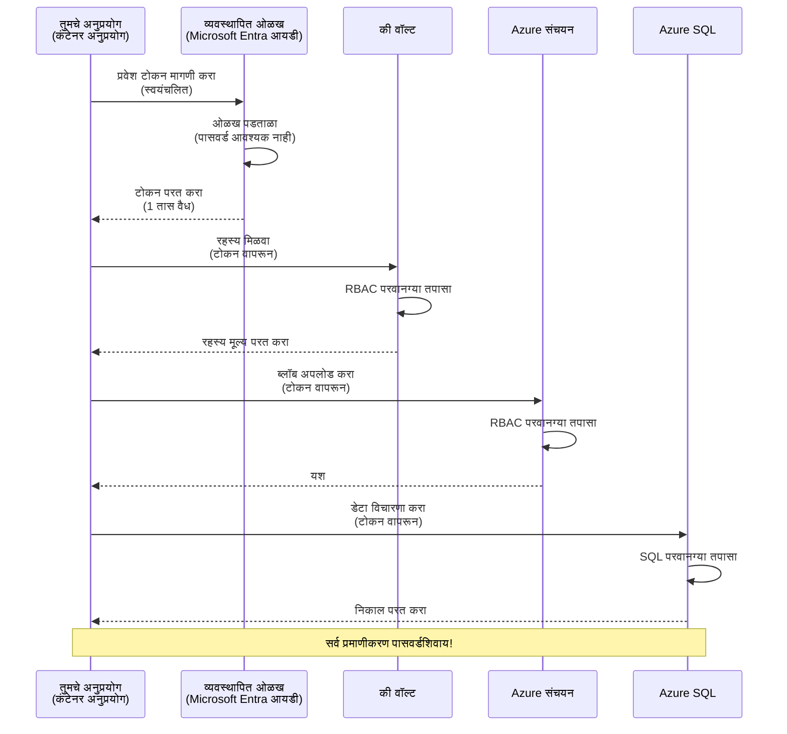
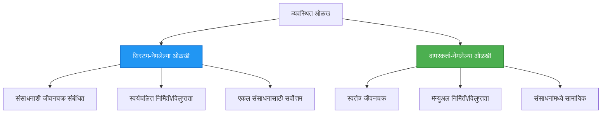

# प्रमाणीकरण नमुने आणि व्यवस्थापित ओळख

⏱️ **अनुमानित वेळ**: ४५-६० मिनिटे | 💰 **खर्चाचा परिणाम**: मोफत (अतिरिक्त शुल्क नाही) | ⭐ **गौणता**: मध्यम

**📚 शिकण्याचा मार्ग:**
- ← मागील: [कॉन्फिगरेशन व्यवस्थापन](configuration.md) - पर्यावरणीय चल आणि गुपिते व्यवस्थापित करणे
- 🎯 **आपण येथे आहात**: प्रमाणीकरण आणि सुरक्षा (व्यवस्थापित ओळख, की वॉल्ट, सुरक्षित नमुने)
- → पुढील: [पहिला प्रकल्प](first-project.md) - आपला पहिला AZD अनुप्रयोग तयार करा
- 🏠 [कोर्स होम](../../README.md)

---

## आपण काय शिकणार आहात

हा धडा पूर्ण केल्यावर, आपण:
- Azure प्रमाणीकरण नमुन्यांची समज (की, कनेक्शन स्ट्रिंग्ज, व्यवस्थापित ओळख)
- पासवर्डशिवाय प्रमाणीकरणासाठी **व्यवस्थापित ओळख** ची अंमलबजावणी करा
- **Azure Key Vault** समाकलनाद्वारे गुपिते सुरक्षित करा
- AZD तैनात करण्यासाठी **भूमिकाभरित प्रवेश नियंत्रण (RBAC)** कॉन्फिगर करा
- कंटेनर अॅप्स आणि Azure सेवांमध्ये सुरक्षा सर्वोत्तम पद्धती लागू करा
- की-आधारित प्रमाणीकरणापासून ओळख-आधारित प्रमाणीकरणाकडे स्थलांतर करा

## व्यवस्थापित ओळख का महत्त्वाची आहे

### समस्या: पारंपरिक प्रमाणीकरण

**व्यवस्थापित ओळख आधी:**
```javascript
// ❌ सुरक्षा धोकाः कोडमध्ये हार्डकोडेड रहस्ये
const connectionString = "Server=mydb.database.windows.net;User=admin;Password=P@ssw0rd123";
const storageKey = "xK7mN9pQ2wR5tY8uI0oP3aS6dF1gH4jK...";
const cosmosKey = "C2x7B9n4M1p8Q5w3E6r0T2y5U8i1O4p7...";
```

**समस्या:**
- 🔴 कोड, कॉन्फिग फाइल्स, पर्यावरणीय चलांमध्ये उघडलेली गुपिते
- 🔴 क्रेडेंशियल फेरफारासाठी कोड बदल आणि पुन्हा तैनात करणे आवश्यक
- 🔴 लेखापरीक्षण दुःस्वप्न - कोण काय, केव्हा प्रवेश केला?
- 🔴 विखुरलेले गुपिते - अनेक सिस्टम्समध्ये गुपिते पसरलेली
- 🔴 अनुपालन धोके - सुरक्षा लेखापरीक्षणात अयशस्वी

### उपाय: व्यवस्थापित ओळख

**व्यवस्थापित ओळख नंतर:**
```javascript
// ✅ सुरक्षित: कोडमध्ये कोणतेही रहस्य नाहीत
const credential = new DefaultAzureCredential();
const client = new BlobServiceClient(
  "https://mystorageaccount.blob.core.windows.net",
  credential  // Azure आपोआप प्रमाणीकरण हाताळते
);
```

**फायदे:**
- ✅ कोड किंवा कॉन्फिगमध्ये शून्य गुपिते
- ✅ स्वयंचलित फेरफार - Azure हाताळतो
- ✅ Microsoft Entra ID नोंदींमध्ये पूर्ण लेखापरीक्षण ट्रेल
- ✅ केंद्रीकृत सुरक्षा - Azure पोर्टलमध्ये व्यवस्थापित करा
- ✅ अनुपालनासाठी तयार - सुरक्षा मानके पूर्ण करतो

**उपमा**: पारंपरिक प्रमाणीकरण म्हणजे विविध दारांसाठी अनेक फिजिकल कीस घेऊन फिरण्यासारखे आहे. व्यवस्थापित ओळख म्हणजे एक सुरक्षा बॅज आहे जो आपले कोण आहात यावर आधारित आपोआप प्रवेश देतो—की हरवायच्या, कॉपी करायच्या किंवा फेरफार करायच्या गरज नाही.

---

## आर्किटेक्चर अवलोकन

### व्यवस्थापित ओळखीच्या प्रमाणीकरण प्रवाह



### व्यवस्थापित ओळखांचे प्रकार



| वैशिष्ट्य | सिस्टीम-नियुक्त | वापरकर्ता-नियुक्त |
|---------|----------------|-----------------|
| **जीवनचक्र** | संसाधनाशी संलग्न | स्वतंत्र |
| **निर्मिती** | संसाधनासोबत आपोआप | मॅन्युअल निर्मिती |
| **विलुप्तता** | संसाधनासह हटवली जाते | संसाधन हटवल्यानंतरही टिकते |
| **सामायिकरण** | फक्त एक संसाधन | अनेक संसाधने |
| **वापर प्रकरण** | सोपे प्रकरणे | क्लिष्ट बहु-संसाधन प्रकरणे |
| **AZD डीफॉल्ट** | ✅ शिफारस केले | पर्यायी |

---

## पूर्वअपेक्षा

### आवश्यक उपकरणे

आपण आधीच या उपकरणांची स्थापना केलेली असावी:

```bash
# Azure Developer CLI तपासा
azd version
# ✅ अपेक्षित: azd आवृत्ती 1.0.0 किंवा त्याहून अधिक

# Azure CLI तपासा
az --version
# ✅ अपेक्षित: azure-cli 2.50.0 किंवा त्याहून अधिक
```

### Azure आवश्यकताः

- सक्रिय Azure सदस्यता
- अनुमती:
  - व्यवस्थापित ओळख तयार करणे
  - RBAC भूमिका असाइन करणे
  - Key Vault संसाधने तयार करणे
  - कंटेनर अॅप्स तैनात करणे

### ज्ञान पूर्वस्थिती

आपल्याला पूर्ण केलेले असावे:
- [स्थापना मार्गदर्शक](installation.md) - AZD सेटअप
- [AZD मूलभूत](azd-basics.md) - मुख्य संकल्पना
- [कॉन्फिगरेशन व्यवस्थापन](configuration.md) - पर्यावरणीय चल

---

## धडा १: प्रमाणीकरण नमुन्यांची समज

### नमुना १: कनेक्शन स्ट्रिंग्ज (पूर्वीचे - टाळा)

**हे कसे कार्य करते:**
```bash
# कनेक्शन स्ट्रिंगमध्ये क्रेडेंशियल्स आहेत
STORAGE_CONNECTION_STRING="DefaultEndpointsProtocol=https;AccountName=myaccount;AccountKey=xK7mN9pQ2wR5..."
COSMOS_CONNECTION_STRING="AccountEndpoint=https://myaccount.documents.azure.com:443/;AccountKey=C2x7..."
SQL_CONNECTION_STRING="Server=myserver.database.windows.net;User=admin;Password=P@ssw0rd..."
```

**समस्या:**
- ❌ पर्यावरणीय चलांमध्ये गुपिते दिसतात
- ❌ तैनाती प्रणालींमध्ये लॉग होतात
- ❌ फेरफार करणे कठीण
- ❌ प्रवेशाचा लेखापरीक्षण ट्रेल नाही

**कधी वापरायचे:** फक्त स्थानिक विकासासाठी, उत्पादनासाठी कधीही नाही.

---

### नमुना २: की वॉल्ट संदर्भ (चांगले)

**हे कसे कार्य करते:**
```bicep
// Store secret in Key Vault
resource keyVault 'Microsoft.KeyVault/vaults@2023-02-01' = {
  name: 'mykv'
  properties: {
    enableRbacAuthorization: true
  }
}

// Reference in Container App
env: [
  {
    name: 'STORAGE_KEY'
    secretRef: 'storage-key'  // References Key Vault
  }
]
```

**फायदे:**
- ✅ गुपिते सुरक्षितपणे Key Vault मध्ये संग्रहित
- ✅ केंद्रीकृत गुपित व्यवस्थापन
- ✅ कोड बदलाविणे न करता फेरफार होऊ शकतो

**मर्यादा:**
- ⚠️ अजूनही की/पासवर्ड वापरले जात आहेत
- ⚠️ Key Vault प्रवेश व्यवस्थापित करणे आवश्यक

**कधी वापरायचे:** कनेक्शन स्ट्रिंग्ज पासून व्यवस्थापित ओळखी कडे संक्रमण टप्पा.

---

### नमुना ३: व्यवस्थापित ओळख (सर्वोत्कृष्ट पद्धत)

**हे कसे कार्य करते:**
```bicep
// Enable managed identity
resource containerApp 'Microsoft.App/containerApps@2023-05-01' = {
  name: 'myapp'
  identity: {
    type: 'SystemAssigned'  // Automatically creates identity
  }
}

// Grant permissions
resource roleAssignment 'Microsoft.Authorization/roleAssignments@2022-04-01' = {
  scope: storageAccount
  properties: {
    roleDefinitionId: storageBlobDataContributorRole
    principalId: containerApp.identity.principalId
  }
}
```

**अप्लिकेशन कोड:**
```javascript
// कोणतीही रहस्ये आवश्यक नाहीत!
const { DefaultAzureCredential } = require('@azure/identity');
const { BlobServiceClient } = require('@azure/storage-blob');

const credential = new DefaultAzureCredential();
const blobServiceClient = new BlobServiceClient(
  'https://mystorageaccount.blob.core.windows.net',
  credential
);
```

**फायदे:**
- ✅ कोड/कॉन्फिगमध्ये शून्य गुपिते
- ✅ स्वयंचलित क्रेडेंशियल फेरफार
- ✅ पूर्ण लेखापरीक्षण ट्रेल
- ✅ RBAC-आधारित परवानग्या
- ✅ अनुपालनासाठी तयार

**कधी वापरायचे:** नेहमी, उत्पादन अनुप्रयोगांसाठी.

---

### नमुना ४: सेवा प्रमुख (CI/CD व ऑटोमेशन)

व्यवस्थापित ओळख ही Azure अंतर्गत चालणाऱ्या संसाधनांसाठी सुवर्ण मानक आहे. पण Azure बाहेर चालणाऱ्या गोष्टींसाठी कशा? जसे की बिल्ड एजेंटवरील CI/CD पाइपलाइन, किंवा तुमच्या लॅपटॉपवरील स्क्रिप्ट ज्याला इंटरअॅक्टिव लॉगिन वापरता येत नाही? त्यासाठी **सेवा प्रमुख** वापरतात: एक मानवी नसलेली ओळख ज्याचे स्वतःचे क्रेडेंशियल्स असतात आणि ज्यात स्वयंचलित प्रक्रिया साइन इन करू शकते.

**हे कसे कार्य करते:**

कमी Privilege सह संसाधन ग्रुपवर सेवा प्रमुख तयार करा:

```bash
az ad sp create-for-rbac \
  --name "myapp-cicd" \
  --role contributor \
  --scopes /subscriptions/<sub-id>/resourceGroups/<rg-name>
```

हे क्लायंट आयडी, क्लायंट सीक्रेट आणि टेनेट आयडी मुद्रित करतो. azd यांना नॉन-इंटरअॅक्टिव्हपणे साइन इन करू शकतो:

```bash
azd auth login \
  --client-id "<appId>" \
  --client-secret "<password>" \
  --tenant-id "<tenant>"
```

**गुपितांच्या ऐवजी फेडरेटेड क्रेडेंशियल (OIDC) प्राधान्य द्या.** दीर्घकालीन क्लायंट सीक्रेटच्या ऐवजी, फेडरेटेड क्रेडेंशियल कॉन्फिगर करा ज्याने पाइपलाइन लघुकालीन टोकन आदान-प्रदान करू शकेल—कोणतेही गुपित लीक होणार नाही किंवा फेरफार करण्याची गरज नाही:

```bash
azd auth login \
  --client-id "<appId>" \
  --federated-credential-provider "github" \
  --tenant-id "<tenant>"
```

> `azd pipeline config` हे आपोआप सेटअप करते. [अध्याय ८](../chapter-08-production/production-ai-practices.md) मधील CI/CD वॉकथ्रू पहा.

**फायदे:**
- ✅ Azure बाहेर (बिल्ड एजंट, ऑन-प्रिम, इतर क्लाउड्स) काम करते
- ✅ एका संसाधन गटाला एका भूमिकेसह स्कोप केले जाऊ शकते
- ✅ फेडरेटेड (OIDC) प्रकार कोणतेही संग्रहित गुपित वापरत नाही

**तोटे:**
- ⚠️ गुपित-आधारित प्रकार काळजीपूर्वक संग्रहण आणि फेरफार आवश्यक आहे
- ⚠️ लीक होणारे गुपित सेवा प्रमुख जे करू शकतो ते सर्व मिळवून देतो—स्कोप अजिबात सडसडीत ठेवा

**कधी वापरायचे:** प्रमाणीकरण व्यवस्थापित ओळख वापरू शकत नसलेल्या CI/CD पाइपलाइन आणि ऑटोमेशनसाठी. नेहमी **फेडरेटेड/OIDC** प्रकार क्लायंट सीक्रेटच्या बदल्यात प्राधान्य द्या, आणि Azure आत कार्यरत असलेल्या वर्कलोडसाठी व्यवस्थापित ओळख प्राधान्य द्या.

**क्रेडेंशियल सुरक्षितपणे संचयित करणे:**
- कधीही गुपिते कमिट करू नका—पाइपलाइनचे गुपित स्टोअर वापरा (GitHub Actions secrets, Azure DevOps variable groups / Key Vault).
- SP ला आवश्यक असलेल्या लहान भूमिके व संसाधन ग्रुपातच स्कोप करा.
- कालबद्धता सेट करा आणि फेरफार करा, किंवा OIDC सह गुपित काढून टाका.

---

## धडा २: AZD सह व्यवस्थापित ओळख राबविणे

### टप्प्यानुसार अंमलबजावणी

चला एक सुरक्षित कंटेनर अॅप तयार करूया ज्यासाठी व्यवस्थापित ओळख Azure Storage आणि Key Vault शी प्रवेश करण्यासाठी वापरली जाईल.

### प्रकल्प रचना

```
secure-app/
├── azure.yaml                 # AZD configuration
├── infra/
│   ├── main.bicep            # Main infrastructure
│   ├── core/
│   │   ├── identity.bicep    # Managed identity setup
│   │   ├── keyvault.bicep    # Key Vault configuration
│   │   └── storage.bicep     # Storage with RBAC
│   └── app/
│       └── container-app.bicep
└── src/
    ├── app.js                # Application code
    ├── package.json
    └── Dockerfile
```

### १. AZD कॉन्फिगर करा (azure.yaml)

```yaml
name: secure-app
metadata:
  template: secure-app@1.0.0

services:
  api:
    project: ./src
    language: js
    host: containerapp

# Enable managed identity (AZD handles this automatically)
```

### २. इन्फ्रास्ट्रक्चर: व्यवस्थापित ओळख सक्षम करा

**फाइल: `infra/main.bicep`**

```bicep
targetScope = 'subscription'

param environmentName string
param location string = 'eastus'

var tags = { 'azd-env-name': environmentName }

// Resource group
resource rg 'Microsoft.Resources/resourceGroups@2021-04-01' = {
  name: 'rg-${environmentName}'
  location: location
  tags: tags
}

// Storage Account
module storage './core/storage.bicep' = {
  name: 'storage'
  scope: rg
  params: {
    name: 'st${uniqueString(rg.id)}'
    location: location
    tags: tags
  }
}

// Key Vault
module keyVault './core/keyvault.bicep' = {
  name: 'keyvault'
  scope: rg
  params: {
    name: 'kv-${uniqueString(rg.id)}'
    location: location
    tags: tags
  }
}

// Container App with Managed Identity
module containerApp './app/container-app.bicep' = {
  name: 'container-app'
  scope: rg
  params: {
    name: 'ca-${environmentName}'
    location: location
    tags: tags
    storageAccountName: storage.outputs.name
    keyVaultName: keyVault.outputs.name
  }
}

// Grant Container App access to Storage
module storageRoleAssignment './core/role-assignment.bicep' = {
  name: 'storage-role'
  scope: rg
  params: {
    principalId: containerApp.outputs.identityPrincipalId
    roleDefinitionId: 'ba92f5b4-2d11-453d-a403-e96b0029c9fe'  // Storage Blob Data Contributor
    targetResourceId: storage.outputs.id
  }
}

// Grant Container App access to Key Vault
module kvRoleAssignment './core/role-assignment.bicep' = {
  name: 'kv-role'
  scope: rg
  params: {
    principalId: containerApp.outputs.identityPrincipalId
    roleDefinitionId: '4633458b-17de-408a-b874-0445c86b69e6'  // Key Vault Secrets User
    targetResourceId: keyVault.outputs.id
  }
}

// Outputs
output AZURE_STORAGE_ACCOUNT_NAME string = storage.outputs.name
output AZURE_KEY_VAULT_NAME string = keyVault.outputs.name
output APP_URL string = containerApp.outputs.url
```

### ३. सिस्टीम-नियुक्त ओळख असलेला कंटेनर अॅप

**फाइल: `infra/app/container-app.bicep`**

```bicep
param name string
param location string
param tags object = {}
param storageAccountName string
param keyVaultName string

resource containerApp 'Microsoft.App/containerApps@2023-05-01' = {
  name: name
  location: location
  tags: tags
  identity: {
    type: 'SystemAssigned'  // 🔑 Enable managed identity
  }
  properties: {
    configuration: {
      ingress: {
        external: true
        targetPort: 3000
      }
    }
    template: {
      containers: [
        {
          name: 'api'
          image: 'myregistry.azurecr.io/api:latest'
          resources: {
            cpu: json('0.5')
            memory: '1Gi'
          }
          env: [
            {
              name: 'AZURE_STORAGE_ACCOUNT_NAME'
              value: storageAccountName
            }
            {
              name: 'AZURE_KEY_VAULT_NAME'
              value: keyVaultName
            }
            // 🔑 No secrets - managed identity handles authentication!
          ]
        }
      ]
    }
  }
}

// Output the identity for RBAC assignments
output identityPrincipalId string = containerApp.identity.principalId
output id string = containerApp.id
output url string = 'https://${containerApp.properties.configuration.ingress.fqdn}'
```

### ४. RBAC भूमिका नियुक्ती मॉड्यूल

**फाइल: `infra/core/role-assignment.bicep`**

```bicep
param principalId string
param roleDefinitionId string  // Azure built-in role ID
param targetResourceId string

resource roleAssignment 'Microsoft.Authorization/roleAssignments@2022-04-01' = {
  name: guid(principalId, roleDefinitionId, targetResourceId)
  scope: resourceId('Microsoft.Resources/resourceGroups', resourceGroup().name)
  properties: {
    roleDefinitionId: subscriptionResourceId('Microsoft.Authorization/roleDefinitions', roleDefinitionId)
    principalId: principalId
    principalType: 'ServicePrincipal'
  }
}

output id string = roleAssignment.id
```

### ५. व्यवस्थापित ओळखीसह अनुप्रयोग कोड

**फाइल: `src/app.js`**

```javascript
const express = require('express');
const { DefaultAzureCredential } = require('@azure/identity');
const { BlobServiceClient } = require('@azure/storage-blob');
const { SecretClient } = require('@azure/keyvault-secrets');

const app = express();
const PORT = process.env.PORT || 3000;

// 🔑 क्रेडेन्शियल प्रारंभ करा (व्यवस्थापित ओळखेसह स्वयंचलित कार्य करते)
const credential = new DefaultAzureCredential();

// Azure Storage सेटअप
const storageAccountName = process.env.AZURE_STORAGE_ACCOUNT_NAME;
const blobServiceClient = new BlobServiceClient(
  `https://${storageAccountName}.blob.core.windows.net`,
  credential  // कोणत्याही कीची गरज नाही!
);

// Key Vault सेटअप
const keyVaultName = process.env.AZURE_KEY_VAULT_NAME;
const secretClient = new SecretClient(
  `https://${keyVaultName}.vault.azure.net`,
  credential  // कोणत्याही कीची गरज नाही!
);

// आरोग्य तपासणी
app.get('/health', (req, res) => {
  res.json({ status: 'healthy', authentication: 'managed-identity' });
});

// ब्लोब स्टोरेजमध्ये फाईल अपलोड करा
app.post('/upload', async (req, res) => {
  try {
    const containerClient = blobServiceClient.getContainerClient('uploads');
    await containerClient.createIfNotExists();
    
    const blobName = `file-${Date.now()}.txt`;
    const blockBlobClient = containerClient.getBlockBlobClient(blobName);
    
    await blockBlobClient.upload('Hello from managed identity!', 30);
    
    res.json({
      success: true,
      blobName: blobName,
      message: 'File uploaded using managed identity!'
    });
  } catch (error) {
    console.error('Upload error:', error);
    res.status(500).json({ error: error.message });
  }
});

// Key Vault मधून रहस्य मिळवा
app.get('/secret/:name', async (req, res) => {
  try {
    const secretName = req.params.name;
    const secret = await secretClient.getSecret(secretName);
    
    res.json({
      name: secretName,
      value: secret.value,
      message: 'Secret retrieved using managed identity!'
    });
  } catch (error) {
    console.error('Secret error:', error);
    res.status(500).json({ error: error.message });
  }
});

// ब्लोब कंटेनरची यादी करा (वाचन प्रवेश दर्शविते)
app.get('/containers', async (req, res) => {
  try {
    const containers = [];
    for await (const container of blobServiceClient.listContainers()) {
      containers.push(container.name);
    }
    
    res.json({
      containers: containers,
      count: containers.length,
      message: 'Containers listed using managed identity!'
    });
  } catch (error) {
    console.error('List error:', error);
    res.status(500).json({ error: error.message });
  }
});

app.listen(PORT, () => {
  console.log(`Secure API listening on port ${PORT}`);
  console.log('Authentication: Managed Identity (passwordless)');
});
```

**फाइल: `src/package.json`**

```json
{
  "name": "secure-app",
  "version": "1.0.0",
  "dependencies": {
    "express": "^4.18.2",
    "@azure/identity": "^4.0.0",
    "@azure/storage-blob": "^12.17.0",
    "@azure/keyvault-secrets": "^4.7.0"
  },
  "scripts": {
    "start": "node app.js"
  }
}
```

### ६. तैनात करा आणि चाचणी करा

```bash
# AZD वातावरण प्रारंभ करा
azd init

# इन्फ्रास्ट्रक्चर आणि अनुप्रयोग तैनात करा
azd up

# अनुप्रयोगाचा URL मिळवा
APP_URL=$(azd env get-values | grep APP_URL | cut -d '=' -f2 | tr -d '"')

# आरोग्य तपासणी तपासा
curl $APP_URL/health
```

**✅ अपेक्षित आउटपुट:**
```json
{
  "status": "healthy",
  "authentication": "managed-identity"
}
```

**ब्लॉब अपलोड चाचणी:**
```bash
curl -X POST $APP_URL/upload
```

**✅ अपेक्षित आउटपुट:**
```json
{
  "success": true,
  "blobName": "file-1700404800000.txt",
  "message": "File uploaded using managed identity!"
}
```

**कंटेनर लिस्टिंग चाचणी:**
```bash
curl $APP_URL/containers
```

**✅ अपेक्षित आउटपुट:**
```json
{
  "containers": ["uploads"],
  "count": 1,
  "message": "Containers listed using managed identity!"
}
```

---

## सामान्य Azure RBAC भूमिका

### व्यवस्थापित ओळखींसाठी अंगभूत भूमिका आयडी

| सेवा | भूमिका नाव | भूमिका आयडी | परवानग्या |
|---------|-----------|-------------|------------|
| **Storage** | Storage Blob Data Reader | `2a2b9908-6b94-4a3d-8e5a-a7d8f8cc8a12` | ब्लॉब्स आणि कंटेनर्स वाचा |
| **Storage** | Storage Blob Data Contributor | `ba92f5b4-2d11-453d-a403-e96b0029c9fe` | ब्लॉब्स वाचा, लिहा, हटवा |
| **Storage** | Storage Queue Data Contributor | `974c5e8b-45b9-4653-ba55-5f855dd0fb88` | क्यू संदेश वाचा, लिहा, हटवा |
| **Key Vault** | Key Vault Secrets User | `4633458b-17de-408a-b874-0445c86b69e6` | गुपिते वाचा |
| **Key Vault** | Key Vault Secrets Officer | `b86a8fe4-44ce-4948-aee5-eccb2c155cd7` | गुपिते वाचा, लिहा, हटवा |
| **Cosmos DB** | Cosmos DB Built-in Data Reader | `00000000-0000-0000-0000-000000000001` | Cosmos DB डेटा वाचा |
| **Cosmos DB** | Cosmos DB Built-in Data Contributor | `00000000-0000-0000-0000-000000000002` | Cosmos DB डेटा वाचा, लिहा |
| **SQL Database** | SQL DB Contributor | `9b7fa17d-e63e-47b0-bb0a-15c516ac86ec` | SQL डेटाबेस व्यवस्थापित करा |
| **Service Bus** | Azure Service Bus Data Owner | `090c5cfd-751d-490a-894a-3ce6f1109419` | संदेश पाठवा, प्राप्त करा, व्यवस्थापित करा |

### भूमिका आयडी कसे शोधायचे

```bash
# सर्व अंगभूत भूमिका यादी करा
az role definition list --query "[].{Name:roleName, ID:name}" --output table

# विशिष्ट भूमिका शोधा
az role definition list --query "[?contains(roleName, 'Storage Blob')].{Name:roleName, ID:name}" --output table

# भूमिका तपशील मिळवा
az role definition list --name "Storage Blob Data Contributor"
```

---

## व्यावहारिक व्यायाम

### व्यायाम १: विद्यमान अॅपसाठी व्यवस्थापित ओळख सक्षम करा ⭐⭐ (मध्यम)

**लक्ष्य:** विद्यमान कंटेनर अॅप तैनातीमध्ये व्यवस्थापित ओळख जोडा

**परिस्थिती:** आपल्याकडे कनेक्शन स्ट्रिंग्ज वापरणारी कंटेनर अॅप आहे. ती व्यवस्थापित ओळखीमध्ये रूपांतर करा.

**प्रारंभिक बिंदू:** कंटेनर अॅप या कॉन्फिगरेशनसह:

```bicep
// ❌ Current: Using connection string
env: [
  {
    name: 'STORAGE_CONNECTION_STRING'
    secretRef: 'storage-connection'
  }
]
```

**टप्पे:**

1. **Bicep मध्ये व्यवस्थापित ओळख सक्षम करा:**

```bicep
resource containerApp 'Microsoft.App/containerApps@2023-05-01' = {
  name: 'myapp'
  identity: {
    type: 'SystemAssigned'  // Add this
  }
  // ... rest of configuration
}
```

2. **Storage प्रवेश द्या:**

```bicep
// Get storage account reference
resource storageAccount 'Microsoft.Storage/storageAccounts@2023-01-01' existing = {
  name: storageAccountName
}

// Assign role
resource roleAssignment 'Microsoft.Authorization/roleAssignments@2022-04-01' = {
  name: guid(containerApp.id, 'ba92f5b4-2d11-453d-a403-e96b0029c9fe', storageAccount.id)
  scope: storageAccount
  properties: {
    roleDefinitionId: subscriptionResourceId('Microsoft.Authorization/roleDefinitions', 'ba92f5b4-2d11-453d-a403-e96b0029c9fe')
    principalId: containerApp.identity.principalId
    principalType: 'ServicePrincipal'
  }
}
```

3. **अनुप्रयोग कोड अपडेट करा:**

**आधी (कनेक्शन स्ट्रिंग):**
```javascript
const { BlobServiceClient } = require('@azure/storage-blob');

const blobServiceClient = BlobServiceClient.fromConnectionString(
  process.env.STORAGE_CONNECTION_STRING
);
```

**नंतर (व्यवस्थापित ओळख):**
```javascript
const { DefaultAzureCredential } = require('@azure/identity');
const { BlobServiceClient } = require('@azure/storage-blob');

const credential = new DefaultAzureCredential();
const blobServiceClient = new BlobServiceClient(
  `https://${process.env.STORAGE_ACCOUNT_NAME}.blob.core.windows.net`,
  credential
);
```

4. **पर्यावरणीय चल अद्ययावत करा:**

```bicep
env: [
  {
    name: 'STORAGE_ACCOUNT_NAME'
    value: storageAccountName  // Just the name, no secrets!
  }
  // Remove STORAGE_CONNECTION_STRING
]
```

5. **तैनात करा आणि चाचणी करा:**

```bash
# पुन्हा तैनात करा
azd up

# तपासा की ते अजूनही कार्य करते आहे का
curl https://myapp.azurecontainerapps.io/upload
```

**✅ यशस्वी निकष:**
- ✅ अनुप्रयोग त्रुटीशिवाय तैनात होतो
- ✅ स्टोरेज ऑपरेशन्स कार्य करतात (अपलोड, सूची, डाउनलोड)
- ✅ पर्यावरणीय चलांमध्ये कोणतेही कनेक्शन स्ट्रिंग्ज नाहीत
- ✅ Azure पोर्टलमध्ये "ओळख" ब्लेड अंतर्गत ओळख दिसते

**चाचणी:**

```bash
# व्यवस्थापित ओळख सक्षम आहे का ते तपासा
az containerapp show \
  --name myapp \
  --resource-group rg-myapp \
  --query "identity.type"
# ✅ अपेक्षित: "SystemAssigned"

# भूमिका नियुक्ती तपासा
az role assignment list \
  --assignee $(az containerapp show --name myapp --resource-group rg-myapp --query "identity.principalId" -o tsv) \
  --scope /subscriptions/{sub-id}/resourceGroups/rg-myapp/providers/Microsoft.Storage/storageAccounts/mystorageaccount
# ✅ अपेक्षित: "Storage Blob Data Contributor" भूमिका दाखवते
```

**वेळ**: २०-३० मिनिटे

---

### व्यायाम २: वापरकर्ता-नियुक्त ओळखीसह बहु-सेवा प्रवेश ⭐⭐⭐ (प्रगत)

**लक्ष्य:** अनेक कंटेनर अॅप्समध्ये सामायिक वापरकर्ता-नियुक्त ओळख तयार करा

**परिस्थिती:** आपल्याकडे ३ मायक्रोसर्व्हिस आहेत ज्यांना एकाच स्टोरेज खाते आणि Key Vault शी प्रवेश हवा आहे.

**टप्पे:**

1. **वापरकर्ता-नियुक्त ओळख तयार करा:**

**फाइल: `infra/core/identity.bicep`**

```bicep
param name string
param location string
param tags object = {}

resource userAssignedIdentity 'Microsoft.ManagedIdentity/userAssignedIdentities@2023-01-31' = {
  name: name
  location: location
  tags: tags
}

output id string = userAssignedIdentity.id
output principalId string = userAssignedIdentity.properties.principalId
output clientId string = userAssignedIdentity.properties.clientId
```

2. **वापरकर्ता-नियुक्त ओळखीला भूमिका द्या:**

```bicep
// In main.bicep
module userIdentity './core/identity.bicep' = {
  name: 'user-identity'
  scope: rg
  params: {
    name: 'id-${environmentName}'
    location: location
    tags: tags
  }
}

// Grant Storage access
resource storageRoleAssignment 'Microsoft.Authorization/roleAssignments@2022-04-01' = {
  name: guid(userIdentity.outputs.principalId, 'storage-contributor')
  scope: storageAccount
  properties: {
    roleDefinitionId: subscriptionResourceId('Microsoft.Authorization/roleDefinitions', 'ba92f5b4-2d11-453d-a403-e96b0029c9fe')
    principalId: userIdentity.outputs.principalId
    principalType: 'ServicePrincipal'
  }
}

// Grant Key Vault access
resource kvRoleAssignment 'Microsoft.Authorization/roleAssignments@2022-04-01' = {
  name: guid(userIdentity.outputs.principalId, 'kv-secrets-user')
  scope: keyVault
  properties: {
    roleDefinitionId: subscriptionResourceId('Microsoft.Authorization/roleDefinitions', '4633458b-17de-408a-b874-0445c86b69e6')
    principalId: userIdentity.outputs.principalId
    principalType: 'ServicePrincipal'
  }
}
```

3. **अनेक कंटेनर अॅप्सना ओळख असाइन करा:**

```bicep
resource apiGateway 'Microsoft.App/containerApps@2023-05-01' = {
  name: 'api-gateway'
  identity: {
    type: 'UserAssigned'
    userAssignedIdentities: {
      '${userIdentity.outputs.id}': {}
    }
  }
  // ... rest of config
}

resource productService 'Microsoft.App/containerApps@2023-05-01' = {
  name: 'product-service'
  identity: {
    type: 'UserAssigned'
    userAssignedIdentities: {
      '${userIdentity.outputs.id}': {}
    }
  }
  // ... rest of config
}

resource orderService 'Microsoft.App/containerApps@2023-05-01' = {
  name: 'order-service'
  identity: {
    type: 'UserAssigned'
    userAssignedIdentities: {
      '${userIdentity.outputs.id}': {}
    }
  }
  // ... rest of config
}
```

4. **अनुप्रयोग कोड (सर्व सेवा समान नमुना वापरतात):**

```javascript
const { DefaultAzureCredential, ManagedIdentityCredential } = require('@azure/identity');

// वापरकर्त्याद्वारे निर्धारित ओळखीसाठी, क्लायंट आयडी निर्दिष्ट करा
const credential = new ManagedIdentityCredential(
  process.env.AZURE_CLIENT_ID  // वापरकर्त्याद्वारे निर्धारित ओळख क्लायंट आयडी
);

// किंवा DefaultAzureCredential वापरा (स्वयं-ओळख करते)
const credential = new DefaultAzureCredential();

const blobServiceClient = new BlobServiceClient(
  `https://${process.env.STORAGE_ACCOUNT_NAME}.blob.core.windows.net`,
  credential
);
```

5. **तैनात करा आणि पडताळणी करा:**

```bash
azd up

# सर्व सेवांना संग्रहणाचा प्रवेश मिळू शकतो का ते तपासा
curl https://api-gateway.azurecontainerapps.io/upload
curl https://product-service.azurecontainerapps.io/upload
curl https://order-service.azurecontainerapps.io/upload
```

**✅ यशस्वी निकष:**
- ✅ ३ सेवांमध्ये एक ओळख सामायिक होते
- ✅ सर्व सेवा स्टोरेज आणि Key Vault मध्ये प्रवेश करू शकतात
- ✅ एखादी सेवा हटवली तरी ओळख टिकून राहते
- ✅ केंद्रीकृत परवानगी व्यवस्थापन

**वापरकर्ता-नियुक्त ओळखीचे फायदे:**
- व्यवस्थापने करण्यासाठी एकच ओळख
- सेवा दरम्यान सुसंगत परवानग्या
- सेवा हटवल्यावरही टिकून राहते
- क्लिष्ट आर्किटेक्चरसाठी चांगले

**वेळ:** ३०-४० मिनिटे

---

### व्यायाम ३: Key Vault गुपित फेरफार राबवा ⭐⭐⭐ (प्रगत)

**लक्ष्य:** तृतीय-पक्ष API की Key Vault मध्ये संग्रहित करा आणि व्यवस्थापित ओळखी वापरून त्यांना प्रवेश करा

**परिस्थिती:** आपल्याला OpenAI, Stripe, SendGrid सारख्या बाहेरील API कॉल करायच्या आहेत ज्यांना API की लागतात.

**टप्पे:**

1. **RBAC सह Key Vault तयार करा:**

**फाइल: `infra/core/keyvault.bicep`**

```bicep
param name string
param location string
param tags object = {}

resource keyVault 'Microsoft.KeyVault/vaults@2023-02-01' = {
  name: name
  location: location
  tags: tags
  properties: {
    enableRbacAuthorization: true  // Use RBAC instead of access policies
    sku: {
      family: 'A'
      name: 'standard'
    }
    tenantId: subscription().tenantId
    enableSoftDelete: true
    softDeleteRetentionInDays: 90
  }
}

// Allow Container App to read secrets
output id string = keyVault.id
output name string = keyVault.name
output uri string = keyVault.properties.vaultUri
```

2. **Key Vault मध्ये गुपिते संग्रहित करा:**

```bash
# की वाल्ट नाव मिळवा
KV_NAME=$(azd env get-values | grep AZURE_KEY_VAULT_NAME | cut -d '=' -f2 | tr -d '"')

# तृतीय पक्ष API की साठवा
az keyvault secret set \
  --vault-name $KV_NAME \
  --name "OpenAI-ApiKey" \
  --value "sk-proj-xxxxxxxxxxxxx"

az keyvault secret set \
  --vault-name $KV_NAME \
  --name "Stripe-ApiKey" \
  --value "sk_live_xxxxxxxxxxxxx"

az keyvault secret set \
  --vault-name $KV_NAME \
  --name "SendGrid-ApiKey" \
  --value "SG.xxxxxxxxxxxxx"
```

3. **गुपिते प्राप्त करण्यासाठी अनुप्रयोग कोड:**

**फाइल: `src/config.js`**

```javascript
const { DefaultAzureCredential } = require('@azure/identity');
const { SecretClient } = require('@azure/keyvault-secrets');

class Config {
  constructor() {
    this.credential = new DefaultAzureCredential();
    this.secretClient = new SecretClient(
      `https://${process.env.AZURE_KEY_VAULT_NAME}.vault.azure.net`,
      this.credential
    );
    this.cache = {};
  }

  async getSecret(secretName) {
    // प्रथम कॅश तपासा
    if (this.cache[secretName]) {
      return this.cache[secretName];
    }

    try {
      const secret = await this.secretClient.getSecret(secretName);
      this.cache[secretName] = secret.value;
      console.log(`✅ Retrieved secret: ${secretName}`);
      return secret.value;
    } catch (error) {
      console.error(`❌ Failed to get secret ${secretName}:`, error.message);
      throw error;
    }
  }

  async getOpenAIKey() {
    return this.getSecret('OpenAI-ApiKey');
  }

  async getStripeKey() {
    return this.getSecret('Stripe-ApiKey');
  }

  async getSendGridKey() {
    return this.getSecret('SendGrid-ApiKey');
  }
}

module.exports = new Config();
```

4. **अनुप्रयोगात गुपिते वापरा:**

**फाइल: `src/app.js`**

```javascript
const express = require('express');
const config = require('./config');
const { OpenAI } = require('openai');

const app = express();

// Key Vault मधून की घेऊन OpenAI प्रारंभ करा
let openaiClient;

async function initializeServices() {
  const openaiKey = await config.getOpenAIKey();
  openaiClient = new OpenAI({ apiKey: openaiKey });
  console.log('✅ Services initialized with secrets from Key Vault');
}

// स्टार्टअप वर कॉल करा
initializeServices().catch(console.error);

app.post('/chat', async (req, res) => {
  try {
    const completion = await openaiClient.chat.completions.create({
      model: 'gpt-4.1',
      messages: [{ role: 'user', content: 'Hello!' }]
    });
    
    res.json({
      response: completion.choices[0].message.content,
      authentication: 'Key from Key Vault via Managed Identity'
    });
  } catch (error) {
    res.status(500).json({ error: error.message });
  }
});

app.listen(3000, () => {
  console.log('Secure API with Key Vault integration running');
});
```

5. **तैनात करा आणि चाचणी करा:**

```bash
azd up

# API की कार्य करत आहेत का ते तपासा
curl -X POST https://myapp.azurecontainerapps.io/chat \
  -H "Content-Type: application/json" \
  -d '{"message":"Hello AI"}'
```

**✅ यशस्वी निकष:**
- ✅ कोड किंवा वातावरणातील चल मध्ये API कीज नाहीत
- ✅ अनुप्रयोग कीज Key Vault मधून मिळवितो
- ✅ तृतीय-पक्ष API योग्यरित्या कार्य करतात
- ✅ कोड बदल न करता कीज फिरवू शकतो

**गुपित फिरवा:**

```bash
# की व्हॉल्टमधील रहस्य अद्यतनित करा
az keyvault secret set \
  --vault-name $KV_NAME \
  --name "OpenAI-ApiKey" \
  --value "sk-proj-NEW_KEY_HERE"

# नवीन की स्वीकारण्यासाठी अॅप पुन्हा चालू करा
az containerapp revision restart \
  --name myapp \
  --resource-group rg-myapp
```

**वेळ:** २५-३५ मिनिटे

---

## ज्ञान तपासणी बिंदू

### १. प्रमाणीकरण नमुने ✓

आपल्या समजुतीची चाचणी करा:

- [ ] **प्र.१**: तीन मुख्य प्रमाणीकरण नमुने कोणते आहेत?  
  - **उ:** कनेक्शन स्ट्रिंग्ज (जुने), की वॉल्ट संदर्भ (स्थानांतरण), व्यवस्थापित ओळख (सर्वोत्तम)

- [ ] **प्र.२**: व्यवस्थापित ओळख कनेक्शन स्ट्रिंग्ज पेक्षा का चांगली आहे?  
  - **उ:** कोडमध्ये गुपित नाही, स्वयंचलित फिरवणे, पूर्ण लेखा नोंद, RBAC परवानग्या

- [ ] **प्र.३**: सिस्टम-निर्धारित ओळखीऐवजी वापरकर्ता-निर्धारित ओळख कधी वापराल?  
  - **उ:** जेव्हा एक ओळख एकाधिक संसाधनांमध्ये सामायिक केली जाते किंवा ओळखीचा जीवनचक्र स्रोताच्या जीवनचक्रापासून स्वतंत्र असतो

**प्रत्यक्ष पडताळणी:**
```bash
# आपल्या अॅपमध्ये कोणत्या प्रकारची ओळख वापरली जाते ते तपासा
az containerapp show \
  --name myapp \
  --resource-group rg-myapp \
  --query "identity.type"

# ओळखीच्या सर्व भूमिका वाटपांची यादी करा
az role assignment list \
  --assignee $(az containerapp show --name myapp --resource-group rg-myapp --query "identity.principalId" -o tsv)
```

---

### २. RBAC आणि परवानग्या ✓

आपल्या समजुतीची चाचणी करा:

- [ ] **प्र.१**: "Storage Blob Data Contributor" साठी रोल आयडी काय आहे?  
  - **उ:** `ba92f5b4-2d11-453d-a403-e96b0029c9fe`

- [ ] **प्र.२**: "Key Vault Secrets User" कोणत्या परवानग्या देतो?  
  - **उ:** गुपितांना फक्त वाचन परवानगी (निर्माण, अद्ययावत किंवा हटवू शकत नाही)

- [ ] **प्र.३**: Container App ला Azure SQL चे प्रवेश कसे द्याल?  
  - **उ:** "SQL DB Contributor" रोल दिला किंवा SQL साठी Microsoft Entra ID प्रमाणीकरण कॉन्फिगर करा

**प्रत्यक्ष पडताळणी:**
```bash
# विशिष्ट भूमिका शोधा
az role definition list --name "Storage Blob Data Contributor"

# आपल्या ओळखीवर कोणत्या भूमिका नेमल्या आहेत ते तपासा
PRINCIPAL_ID=$(az containerapp show --name myapp --resource-group rg-myapp --query "identity.principalId" -o tsv)
az role assignment list --assignee $PRINCIPAL_ID --output table
```

---

### ३. Key Vault एकत्रीकरण ✓

आपल्या समजुतीची चाचणी करा:

- [ ] **प्र.१**: प्रवेश धोरणाऐवजी Key Vault साठी RBAC कसे सक्षम कराल?  
  - **उ:** Bicep मध्ये `enableRbacAuthorization: true` सेट करा

- [ ] **प्र.२**: कोणता Azure SDK लायब्ररी व्यवस्थापित ओळख प्रमाणीकरण हाताळतो?  
  - **उ:** `@azure/identity` सह `DefaultAzureCredential` वर्ग

- [ ] **प्र.३**: Key Vault गुपितेसाठी कॅशमध्ये किती काळ राहतात?  
  - **उ:** अनुप्रयोगावर अवलंबून; स्वतःची कॅशिंग धोरण अमलात आणा

**प्रत्यक्ष पडताळणी:**
```bash
# की व्हॉल्ट प्रवेशाची चाचणी करा
az keyvault secret show \
  --vault-name $KV_NAME \
  --name "OpenAI-ApiKey" \
  --query "value"

# RBAC सक्षम आहे का तपासा
az keyvault show \
  --name $KV_NAME \
  --query "properties.enableRbacAuthorization"
# ✅ अपेक्षित: खरे
```

---

## सुरक्षा सर्वोत्तम पद्धती

### ✅ करावे:

1. **उत्पादनात नेहमी व्यवस्थापित ओळख वापरा**
   ```bicep
   identity: {
     type: 'SystemAssigned'
   }
   ```

2. **किमान अधिकार RBAC रोल वापरा**
   - शक्य असल्यास "Reader" रोल वापरा
   - आवश्यक नसल्यास "Owner" किंवा "Contributor" टाळा

3. **तृतीय-पक्ष कीज Key Vault मध्ये संग्रहित करा**
   ```javascript
   const apiKey = await secretClient.getSecret('ThirdPartyApiKey');
   ```

4. **लेखा नोंदणी सक्षम करा**
   ```bicep
   diagnosticSettings: {
     logs: [{ category: 'AuditEvent', enabled: true }]
   }
   ```

5. **विकास/स्टेजिंग/उत्पादनासाठी वेगवेगळ्या ओळखी वापरा**
   ```bash
   azd env new dev
   azd env new staging
   azd env new prod
   ```

6. **गुपिते नियमितपणे फिरवा**
   - Key Vault गुपितांवर कालबाह्यता तारीख सेट करा
   - Azure Functions सह फिरवण्याचे स्वयंचलन करा

### ❌ करू नये:

1. **कधीही गुपिते हार्डकोड करू नका**
   ```javascript
   // ❌ वाईट
   const apiKey = "sk-proj-xxxxxxxxxxxxx";
   ```

2. **उत्पादनात कनेक्शन स्ट्रिंग्ज वापरू नका**
   ```javascript
   // ❌ वाईट
   BlobServiceClient.fromConnectionString(process.env.STORAGE_CONNECTION_STRING)
   ```

3. **अत्यधिक परवानग्या देऊ नका**
   ```bicep
   // ❌ BAD - too much access
   roleDefinitionId: 'Owner'
   
   // ✅ GOOD - least privilege
   roleDefinitionId: 'Storage Blob Data Reader'
   ```

4. **गुपिते नोंदवू नका**
   ```javascript
   // ❌ वाईट
   console.log('API Key:', apiKey);
   
   // ✅ चांगले
   console.log('API Key retrieved successfully');
   ```

5. **उत्पादन ओळखी वेगवेगळ्या वातावरणांमध्ये सामायिक करू नका**
   ```bicep
   // ❌ BAD - same identity for dev and prod
   // ✅ GOOD - separate identities per environment
   ```

---

## समस्या निवारण मार्गदर्शक

### समस्या: Azure Storage मध्ये प्रवेश करताना "Unauthorized" त्रुटी

**लक्षणे:**
```
Error: Unauthorized (403)
AuthorizationPermissionMismatch: This request is not authorized to perform this operation
```

**निदान:**

```bash
# व्यवस्थापित ओळख सक्षम आहे का ते तपासा
az containerapp show \
  --name myapp \
  --resource-group rg-myapp \
  --query "identity.type"
# ✅ अपेक्षित: "SystemAssigned" किंवा "UserAssigned"

# भूमिका नियुक्त्या तपासा
PRINCIPAL_ID=$(az containerapp show --name myapp --resource-group rg-myapp --query "identity.principalId" -o tsv)
az role assignment list --assignee $PRINCIPAL_ID

# अपेक्षित: "Storage Blob Data Contributor" किंवा तत्सम भूमिका दिसायला हवी
```

**उपाय:**

1. **योग्य RBAC रोल द्या:**
```bash
STORAGE_ID=$(az storage account show --name mystorageaccount --resource-group rg-myapp --query "id" -o tsv)
az role assignment create \
  --assignee $PRINCIPAL_ID \
  --role "Storage Blob Data Contributor" \
  --scope $STORAGE_ID
```

2. **प्रसारासाठी प्रतीक्षा करा (५-१० मिनिटे लागू शकतात):**
```bash
# भूमिका नियुक्ती स्थिती तपासा
az role assignment list --assignee $PRINCIPAL_ID --scope $STORAGE_ID
```

3. **अनुप्रयोग कोड योग्य क्रिडेंशियल वापरत आहे का तपासा:**
```javascript
// यकीन करा की तुम्ही DefaultAzureCredential वापरत आहात
const credential = new DefaultAzureCredential();
```

---

### समस्या: Key Vault प्रवेश नाकारला गेला

**लक्षणे:**
```
Error: Forbidden (403)
The user, group or application does not have secrets get permission
```

**निदान:**

```bash
# की वॉल्ट RBAC सक्षम आहे का ते तपासा
az keyvault show \
  --name $KV_NAME \
  --query "properties.enableRbacAuthorization"
# ✅ अपेक्षित: खरे

# भूमिका नियुक्त्या तपासा
az role assignment list \
  --assignee $PRINCIPAL_ID \
  --scope /subscriptions/{sub-id}/resourceGroups/rg-myapp/providers/Microsoft.KeyVault/vaults/$KV_NAME
```

**उपाय:**

1. **Key Vault वर RBAC सक्षम करा:**
```bash
az keyvault update \
  --name $KV_NAME \
  --enable-rbac-authorization true
```

2. **Key Vault Secrets User रोल द्या:**
```bash
KV_ID=$(az keyvault show --name $KV_NAME --query "id" -o tsv)
az role assignment create \
  --assignee $PRINCIPAL_ID \
  --role "Key Vault Secrets User" \
  --scope $KV_ID
```

---

### समस्या: DefaultAzureCredential स्थानिकपणे अयशस्वी

**लक्षणे:**
```
Error: DefaultAzureCredential failed to retrieve a token
CredentialUnavailableError: No credential available
```

**निदान:**

```bash
# तपासा की आपण लॉग इन आहात का
az account show

# Azure CLI प्रमाणीकृत आहे का ते तपासा
az ad signed-in-user show
```

**उपाय:**

1. **Azure CLI मध्ये लॉगिन करा:**
```bash
az login
```

2. **Azure सदस्यता सेट करा:**
```bash
az account set --subscription "Your Subscription Name"
```

3. **स्थानिक विकासासाठी वातावरणातील चल वापरा:**
```bash
export AZURE_TENANT_ID="your-tenant-id"
export AZURE_CLIENT_ID="your-client-id"
export AZURE_CLIENT_SECRET="your-client-secret"
```

4. **किंवा स्थानिकपणे वेगळे क्रिडेंशियल वापरा:**
```javascript
const { DefaultAzureCredential, AzureCliCredential } = require('@azure/identity');

// स्थानिक विकसनासाठी AzureCliCredential वापरा
const credential = process.env.NODE_ENV === 'production' 
  ? new DefaultAzureCredential()
  : new AzureCliCredential();
```

---

### समस्या: रोल असाइनमेंट प्रसारास वेळ लागतो

**लक्षणे:**
- रोल यशस्वीरित्या दिला गेला
- अजूनही ४०३ त्रुटी येत आहेत
- अधूनमधून प्रवेश (कधी चालते, कधी नाही)

**स्पष्टीकरण:**
Azure RBAC बदलांना जागतिक पातळीवर प्रसारासाठी ५-१० मिनिटे लागू शकतात.

**उपाय:**

```bash
# प्रतीक्षा करा आणि पुनःप्रयत्न करा
echo "Waiting for RBAC propagation..."
sleep 300  # 5 मिनिटे थांबा

# प्रवेशाची चाचणी करा
curl https://myapp.azurecontainerapps.io/upload

# अजूनही अयशस्वी झाल्यास, अॅप पुन्हा सुरू करा
az containerapp revision restart \
  --name myapp \
  --resource-group rg-myapp
```

---

## खर्च विचार

### व्यवस्थापित ओळखीचे खर्च

| संसाधन | खर्च |
|----------|------|
| **व्यवस्थापित ओळख** | 🆓 **मुक्त** - कोणताही शुल्क नाही |
| **RBAC रोल असाइनमेंट्स** | 🆓 **मुक्त** - कोणताही शुल्क नाही |
| **Microsoft Entra ID टोकन विनंत्या** | 🆓 **मुक्त** - समाविष्ट |
| **Key Vault ऑपरेशन्स** | $0.03 प्रति १०,००० ऑपरेशन्स |
| **Key Vault संग्रहण** | $0.024 प्रति गुपित प्रति महिना |

**व्यवस्थापित ओळख पैसे वाचवते का:**
- ✅ सेवा-सेवा प्रमाणीकरणासाठी Key Vault ऑपरेशन्स टाळते
- ✅ सुरक्षा घटना कमी करते (गुपित न उघडल्याने)
- ✅ ऑपरेशनल ओव्हरहेड कमी करते (मॅन्युअल फिरवणे नाही)

**उदाहरण खर्च तुलना (मासिक):**

| संदर्भ | कनेक्शन स्ट्रिंग्ज | व्यवस्थापित ओळख | बचत |
|----------|-------------------|-----------------|---------|
| लहान अनुप्रयोग (१M विनंत्या) | ~$५० (Key Vault + ऑप्स) | ~$० | $५०/मास |
| मध्यम अनुप्रयोग (१०M विनंत्या) | ~$२०० | ~$० | $२००/मास |
| मोठा अनुप्रयोग (१००M विनंत्या) | ~$१,५०० | ~$० | $१,५००/मास |

---

## अधिक जाणून घ्या

### अधिकृत दस्तऐवज
- [Azure व्यवस्थापित ओळख](https://learn.microsoft.com/entra/identity/managed-identities-azure-resources/overview)
- [Azure RBAC](https://learn.microsoft.com/azure/role-based-access-control/overview)
- [Azure Key Vault](https://learn.microsoft.com/azure/key-vault/general/overview)
- [DefaultAzureCredential](https://learn.microsoft.com/dotnet/api/azure.identity.defaultazurecredential)

### SDK दस्तऐवज
- [@azure/identity (Node.js)](https://www.npmjs.com/package/@azure/identity)
- [Azure.Identity (C#)](https://www.nuget.org/packages/Azure.Identity/)
- [azure-identity (Python)](https://pypi.org/project/azure-identity/)

### या कोर्समधील पुढचे टप्पे
- ← मागील: [कॉन्फिगरेशन व्यवस्थापन](configuration.md)
- → पुढील: [पहिला प्रकल्प](first-project.md)
- 🏠 [कोर्स मुखपृष्ठ](../../README.md)

### संबंधित उदाहरणे
- [Microsoft Foundry Models Chat उदाहरण](../../../../examples/azure-openai-chat) - Microsoft Foundry Models साठी व्यवस्थापित ओळख वापरते
- [मायक्रोसर्व्हिसेस उदाहरण](../../../../examples/microservices) - बहुसंकुल सेवा प्रमाणीकरण नमुने

---

## सारांश

**आपण शिकलात:**
- ✅ तीन प्रमाणीकरण नमुने (कनेक्शन स्ट्रिंग्ज, Key Vault, व्यवस्थापित ओळख)
- ✅ कसे AZD मध्ये व्यवस्थापित ओळख सक्षम व कॉन्फिगर करायची
- ✅ Azure सेवांसाठी RBAC रोल असाइनमेंट
- ✅ तृतीय-पक्ष गुपितांसाठी Key Vault एकत्रीकरण
- ✅ वापरकर्ता-निर्धारित व सिस्टम-निर्धारित ओळख यातील फरक
- ✅ सुरक्षा सर्वोत्तम पद्धती व समस्या निवारण

**महत्त्वाच्या गोष्टी:**
1. **उत्पादनात नेहमी व्यवस्थापित ओळख वापरा** - शून्य गुपिते, स्वयंचलित फिरवणे
2. **किमान अधिकार RBAC रोल वापरा** - केवळ आवश्यक परवानग्या द्या
3. **तृतीय-पक्ष कीज Key Vault मध्ये ठेवा** - केंद्रीकृत गुपित व्यवस्थापन
4. **प्रत्येक वातावरणासाठी वेगवेगळ्या ओळख** - विकास, स्टेजिंग, उत्पादन वेगळे करण्यासाठी
5. **लेखा नोंदणी सक्षम करा** - कोण, काय आणि कधी प्रवेश केला याचा मागोवा ठेवा

**पुढील टप्पे:**
1. वरील व्यावहारिक सराव पूर्ण करा
2. अस्तित्वातील अनुप्रयोग कनेक्शन स्ट्रिंग्जमधून व्यवस्थापित ओळखीवर स्थलांतर करा
3. सुरुवातीपासून सुरक्षिततेसह आपला पहिला AZD प्रकल्प तयार करा: [पहिला प्रकल्प](first-project.md)

---

<!-- CO-OP TRANSLATOR DISCLAIMER START -->
**अस्वीकरण**:
हा दस्तऐवज AI भाषांतर सेवा [Co-op Translator](https://github.com/Azure/co-op-translator) चा वापर करून अनुवादित केला आहे. जरी आम्ही अचूकतेसाठी प्रयत्न करतो, तरी कृपया लक्षात घ्या की स्वयंचलित भाषांतरांमध्ये त्रुटी किंवा अचूकतेची कमतरता असू शकते. मूळ दस्तऐवज त्याच्या मूळ भाषेत अधिकृत स्रोत मानला पाहिजे. महत्त्वाची माहिती असल्यास, व्यावसायिक मानवी भाषांतराची शिफारस केली जाते. या भाषांतराच्या वापरामुळे उद्भवणाऱ्या कोणत्याही गैरसमज किंवा चुकीच्या अर्थलावणीसाठी आम्ही जबाबदार नाही.
<!-- CO-OP TRANSLATOR DISCLAIMER END -->