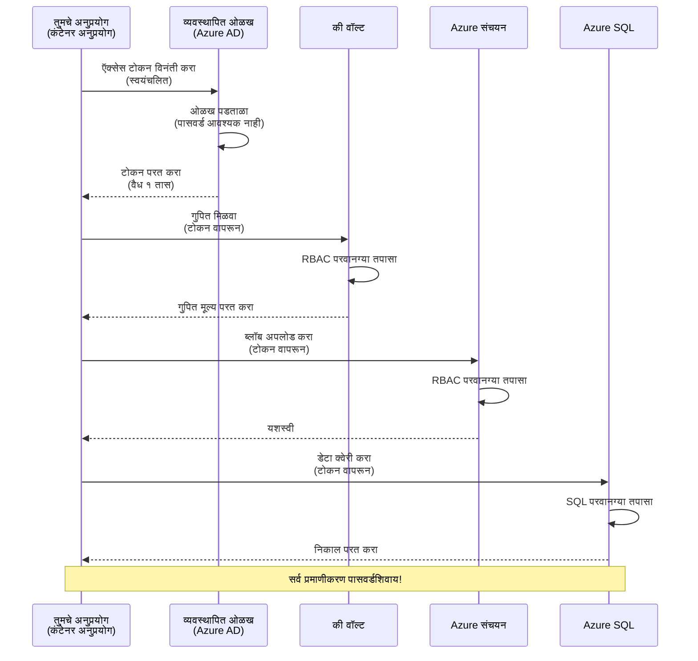
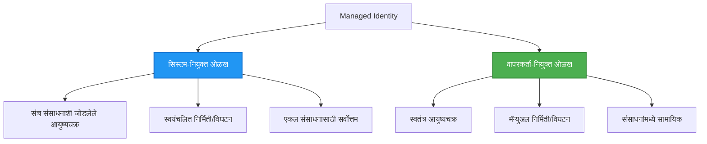

# प्रमाणीकरण नमुने आणि व्यवस्थापित ओळख

⏱️ **अंदाजे वेळ**: ४५-६० मिनिटे | 💰 **खर्च परिणाम**: मोफत (अतिरिक्त शुल्क नाही) | ⭐ **संकुलता**: मध्यम

**📚 शिक्षण मार्ग:**
- ← मागील: [कॉन्फिगरेशन व्यवस्थापन](configuration.md) - पर्यावरण चल व रहस्ये व्यवस्थापित करणे
- 🎯 **तुम्ही येथे आहात**: प्रमाणीकरण आणि सुरक्षा (व्यवस्थापित ओळख, की वॉल्ट, सुरक्षित नमुने)
- → पुढील: [पहिला प्रकल्प](first-project.md) - तुमचे पहिले AZD अनुप्रयोग तयार करा
- 🏠 [कोर्स होम](../../README.md)

---

## तुम्हाला काय शिकायला मिळेल

हा धडा पूर्ण केल्यावर तुम्ही:
- Azure प्रमाणीकरण नमुने समजून घ्या (कीज, कनेक्शन स्ट्रिंग्ज, व्यवस्थापित ओळख)
- **व्यवस्थापित ओळख** वापरून पासवर्डशिवाय प्रमाणीकरण अमलात आणा
- **Azure Key Vault** संयोग वापरून रहस्ये सुरक्षित करा
- AZD वितरणासाठी **भूमिकानिर्धारित प्रवेश नियंत्रण (RBAC)** कॉन्फिगर करा
- कंटेनर अ‍ॅप्स आणि Azure सेवा मध्ये सुरक्षा सर्वोत्तम पद्धती लागू करा
- की-आधारित प्रमाणीकरणापासून ओळख-आधारित प्रमाणीकरणात स्थलांतर करा

## व्यवस्थापित ओळखीचे महत्त्व

### समस्या: पारंपरिक प्रमाणीकरण

**व्यवस्थापित ओळखीपूर्वी:**
```javascript
// ❌ सुरक्षा धोका: कोडमध्ये हार्डकोड केलेले रहस्ये
const connectionString = "Server=mydb.database.windows.net;User=admin;Password=P@ssw0rd123";
const storageKey = "xK7mN9pQ2wR5tY8uI0oP3aS6dF1gH4jK...";
const cosmosKey = "C2x7B9n4M1p8Q5w3E6r0T2y5U8i1O4p7...";
```

**समस्या:**
- 🔴 कोड, कॉन्फिग फाइल्स, पर्यावरण चलांमध्ये **प्रकट झालेले रहस्ये**
- 🔴 **प्रमाणीकरण पुनःपरिवर्तनासाठी** कोड बदल व पुनर्वितरण आवश्यक
- 🔴 **अॅडिट समस्या** - कोणाला कधी प्रवेश मिळाला?
- 🔴 **विस्तार** - रहस्ये वेगवेगळ्या प्रणालींमध्ये विखुरलेली
- 🔴 **अनुपालन धोके** - सुरक्षा अॅडिटमध्ये अपयश

### उपाय: व्यवस्थापित ओळख

**व्यवस्थापित ओळखी नंतर:**
```javascript
// ✅ सुरक्षित: कोडमध्ये कोणतीही रहस्ये नाहीत
const credential = new DefaultAzureCredential();
const client = new BlobServiceClient(
  "https://mystorageaccount.blob.core.windows.net",
  credential  // Azure आपोआप प्रमाणीकरण हाताळतो
);
```

**फायदे:**
- ✅ कोड किंवा कॉन्फिग मध्ये **शून्य रहस्ये**
- ✅ **स्वयंचलित पुनःपरिवर्तन** - Azure हाताळते
- ✅ Azure AD लॉग्स मध्ये **पूर्ण अॅडिट ट्रेल**
- ✅ **केंद्रीकृत सुरक्षा** - Azure पोर्टलमध्ये व्यवस्थापन
- ✅ **अनुपालन तयार** - सुरक्षितता मानके पूर्ण

**सादृश्य:** पारंपरिक प्रमाणीकरण म्हणजे वेगवेगळ्या दरवाजांसाठी अनेक भौतिक कीज घेऊन फिरणे. व्यवस्थापित ओळख म्हणजे तुमच्या व्यक्तिमत्त्वावर आधारित स्वयंचलित प्रवेश देणारा सुरक्षा बॅज - कुठलीही की हरवणार नाही, कॉपी करायची नाही किंवा पुनःपरिवर्तित करायची नाही.

---

## आर्किटेक्चरचा आढावा

### व्यवस्थापित ओळखी द्वारे प्रमाणीकरण प्रवाह


### व्यवस्थापित ओळखीच्या प्रकार


| वैशिष्ट्य | सिस्टम-नियुक्त | वापरकर्तानियुक्त |
|-----------|----------------|------------------|
| **जीवनचक्र** | संसाधनाशी बांधलेले | स्वतंत्र |
| **निर्मिती** | संसाधनासह स्वयंचलित | मॅन्युअल |
| **विलुप्ति** | संसाधनासह हटवले जाते | संसाधन हटवल्यानंतरही टिकून राहते |
| **सामायिकरण** | एकच संसाधन | अनेक संसाधने |
| **वापर प्रकरण** | सोपे प्रकरण | जटिल बहु-संसाधन प्रकरणे |
| **AZD डीफॉल्ट** | ✅ शिफारस केलेले | पर्यायी |

---

## पूर्वपरिस्थिती

### आवश्यक साधने

तुमच्याकडे आधीपासूनच हे असावे, मागील धड्यांमधून स्थापित केलेले:

```bash
# Azure Developer CLI सत्यापित करा
azd version
# ✅ अपेक्षित: azd आवृत्ती 1.0.0 किंवा त्यापुढे

# Azure CLI सत्यापित करा
az --version
# ✅ अपेक्षित: azure-cli 2.50.0 किंवा त्यापुढे
```

### Azure आवश्यकताः

- सक्रिय Azure सदस्यता
- परवाने:
  - व्यवस्थापित ओळखी तयार करण्यासाठी
  - RBAC भूमिका वितरणासाठी
  - Key Vault संसाधने तयार करण्यासाठी
  - कंटेनर अ‍ॅप्स डिप्लॉय करण्यासाठी

### ज्ञान पूर्वानुभव

तुम्ही पूर्ण केले पाहिजे:
- [स्थापना मार्गदर्शक](installation.md) - AZD सेटअप
- [AZD मूलतत्त्वे](azd-basics.md) - मुख्य तत्त्वे
- [कॉन्फिगरेशन व्यवस्थापन](configuration.md) - पर्यावरण चल

---

## धडा १: प्रमाणीकरण नमुने समजून घेणे

### नमुना १: कनेक्शन स्ट्रिंग्ज (जुनाट - टाळा)

**कसे कार्य करते:**
```bash
# कनेक्शन स्ट्रिंगमध्ये प्रमाणीकरण माहिती आहे
STORAGE_CONNECTION_STRING="DefaultEndpointsProtocol=https;AccountName=myaccount;AccountKey=xK7mN9pQ2wR5..."
COSMOS_CONNECTION_STRING="AccountEndpoint=https://myaccount.documents.azure.com:443/;AccountKey=C2x7..."
SQL_CONNECTION_STRING="Server=myserver.database.windows.net;User=admin;Password=P@ssw0rd..."
```

**समस्या:**
- ❌ पर्यावरण चलांमध्ये रहस्ये स्पष्ट दिसणारी
- ❌ वितरण प्रणालींमध्ये नोंदणीकृत
- ❌ पुनःपरिवर्तन कठीण
- ❌ प्रवेशाचा अॅडिट ट्रेल नाही

**कधी वापरायचा:** फक्त स्थानिक विकासासाठी, उत्पादनासाठी कधीही नाही.

---

### नमुना २: Key Vault संदर्भ (चांगले)

**कसे कार्य करते:**
```bicep
// Store secret in Key Vault
resource keyVault 'Microsoft.KeyVault/vaults@2023-02-01' = {
  name: 'mykv'
  properties: {
    enableRbacAuthorization: true
  }
}

// Reference in Container App
env: [
  {
    name: 'STORAGE_KEY'
    secretRef: 'storage-key'  // References Key Vault
  }
]
```

**फायदे:**
- ✅ रहस्ये सुरक्षितपणे Key Vault मध्ये संग्रहित
- ✅ केंद्रीकृत रहस्य व्यवस्थापन
- ✅ कोड बदलांशिवाय पुनःपरिवर्तन

**मर्यादा:**
- ⚠️ अजूनही की/पासवर्ड वापरले जातात
- ⚠️ Key Vault प्रवेश व्यवस्थापित करावा लागतो

**कधी वापरायचा:** कनेक्शन स्ट्रिंग्जवरून व्यवस्थापित ओळखीकडे संक्रमणासाठी चरण.

---

### नमुना ३: व्यवस्थापित ओळख (सर्वोत्तम पद्धत)

**कसे कार्य करते:**
```bicep
// Enable managed identity
resource containerApp 'Microsoft.App/containerApps@2023-05-01' = {
  name: 'myapp'
  identity: {
    type: 'SystemAssigned'  // Automatically creates identity
  }
}

// Grant permissions
resource roleAssignment 'Microsoft.Authorization/roleAssignments@2022-04-01' = {
  scope: storageAccount
  properties: {
    roleDefinitionId: storageBlobDataContributorRole
    principalId: containerApp.identity.principalId
  }
}
```

**अ‍ॅप कोड:**
```javascript
// कोणतेही रहस्य आवश्यक नाही!
const { DefaultAzureCredential } = require('@azure/identity');
const { BlobServiceClient } = require('@azure/storage-blob');

const credential = new DefaultAzureCredential();
const blobServiceClient = new BlobServiceClient(
  'https://mystorageaccount.blob.core.windows.net',
  credential
);
```

**फायदे:**
- ✅ कोड/कॉन्फिग मध्ये शून्य रहस्ये
- ✅ स्वयंचलित प्रमाणीकरण पुनःपरिवर्तन
- ✅ संपूर्ण अॅडिट ट्रेल
- ✅ RBAC-आधारित परवानग्या
- ✅ अनुपालन तयार

**कधी वापरायचा:** नेहमी, उत्पादन अनुप्रयोगांसाठी.

---

## धडा २: AZD सह व्यवस्थापित ओळख लागू करणे

### टप्प्याटप्प्याने अंमलबजावणी

व्यवस्थापित ओळख वापरून Azure Storage आणि Key Vault वापरणारा सुरक्षित कंटेनर अ‍ॅप तयार करूया.

### प्रकल्प संरचना

```
secure-app/
├── azure.yaml                 # AZD configuration
├── infra/
│   ├── main.bicep            # Main infrastructure
│   ├── core/
│   │   ├── identity.bicep    # Managed identity setup
│   │   ├── keyvault.bicep    # Key Vault configuration
│   │   └── storage.bicep     # Storage with RBAC
│   └── app/
│       └── container-app.bicep
└── src/
    ├── app.js                # Application code
    ├── package.json
    └── Dockerfile
```

### १. AZD कॉन्फिगर करा (azure.yaml)

```yaml
name: secure-app
metadata:
  template: secure-app@1.0.0

services:
  api:
    project: ./src
    language: js
    host: containerapp

# Enable managed identity (AZD handles this automatically)
```

### २. इन्फ्रास्ट्रक्चर: व्यवस्थापित ओळख सक्षम करा

**फाईल: `infra/main.bicep`**

```bicep
targetScope = 'subscription'

param environmentName string
param location string = 'eastus'

var tags = { 'azd-env-name': environmentName }

// Resource group
resource rg 'Microsoft.Resources/resourceGroups@2021-04-01' = {
  name: 'rg-${environmentName}'
  location: location
  tags: tags
}

// Storage Account
module storage './core/storage.bicep' = {
  name: 'storage'
  scope: rg
  params: {
    name: 'st${uniqueString(rg.id)}'
    location: location
    tags: tags
  }
}

// Key Vault
module keyVault './core/keyvault.bicep' = {
  name: 'keyvault'
  scope: rg
  params: {
    name: 'kv-${uniqueString(rg.id)}'
    location: location
    tags: tags
  }
}

// Container App with Managed Identity
module containerApp './app/container-app.bicep' = {
  name: 'container-app'
  scope: rg
  params: {
    name: 'ca-${environmentName}'
    location: location
    tags: tags
    storageAccountName: storage.outputs.name
    keyVaultName: keyVault.outputs.name
  }
}

// Grant Container App access to Storage
module storageRoleAssignment './core/role-assignment.bicep' = {
  name: 'storage-role'
  scope: rg
  params: {
    principalId: containerApp.outputs.identityPrincipalId
    roleDefinitionId: 'ba92f5b4-2d11-453d-a403-e96b0029c9fe'  // Storage Blob Data Contributor
    targetResourceId: storage.outputs.id
  }
}

// Grant Container App access to Key Vault
module kvRoleAssignment './core/role-assignment.bicep' = {
  name: 'kv-role'
  scope: rg
  params: {
    principalId: containerApp.outputs.identityPrincipalId
    roleDefinitionId: '4633458b-17de-408a-b874-0445c86b69e6'  // Key Vault Secrets User
    targetResourceId: keyVault.outputs.id
  }
}

// Outputs
output AZURE_STORAGE_ACCOUNT_NAME string = storage.outputs.name
output AZURE_KEY_VAULT_NAME string = keyVault.outputs.name
output APP_URL string = containerApp.outputs.url
```

### ३. सिस्टम-नियुक्त ओळखी असलेला कंटेनर अ‍ॅप

**फाईल: `infra/app/container-app.bicep`**

```bicep
param name string
param location string
param tags object = {}
param storageAccountName string
param keyVaultName string

resource containerApp 'Microsoft.App/containerApps@2023-05-01' = {
  name: name
  location: location
  tags: tags
  identity: {
    type: 'SystemAssigned'  // 🔑 Enable managed identity
  }
  properties: {
    configuration: {
      ingress: {
        external: true
        targetPort: 3000
      }
    }
    template: {
      containers: [
        {
          name: 'api'
          image: 'myregistry.azurecr.io/api:latest'
          resources: {
            cpu: json('0.5')
            memory: '1Gi'
          }
          env: [
            {
              name: 'AZURE_STORAGE_ACCOUNT_NAME'
              value: storageAccountName
            }
            {
              name: 'AZURE_KEY_VAULT_NAME'
              value: keyVaultName
            }
            // 🔑 No secrets - managed identity handles authentication!
          ]
        }
      ]
    }
  }
}

// Output the identity for RBAC assignments
output identityPrincipalId string = containerApp.identity.principalId
output id string = containerApp.id
output url string = 'https://${containerApp.properties.configuration.ingress.fqdn}'
```

### ४. RBAC भूमिका वितरण मॉड्यूल

**फाईल: `infra/core/role-assignment.bicep`**

```bicep
param principalId string
param roleDefinitionId string  // Azure built-in role ID
param targetResourceId string

resource roleAssignment 'Microsoft.Authorization/roleAssignments@2022-04-01' = {
  name: guid(principalId, roleDefinitionId, targetResourceId)
  scope: resourceId('Microsoft.Resources/resourceGroups', resourceGroup().name)
  properties: {
    roleDefinitionId: subscriptionResourceId('Microsoft.Authorization/roleDefinitions', roleDefinitionId)
    principalId: principalId
    principalType: 'ServicePrincipal'
  }
}

output id string = roleAssignment.id
```

### ५. व्यवस्थापित ओळखी सह अनुप्रयोग कोड

**फाईल: `src/app.js`**

```javascript
const express = require('express');
const { DefaultAzureCredential } = require('@azure/identity');
const { BlobServiceClient } = require('@azure/storage-blob');
const { SecretClient } = require('@azure/keyvault-secrets');

const app = express();
const PORT = process.env.PORT || 3000;

// 🔑 क्रेडेन्शियल प्रारंभ करा (व्यवस्थापित ओळखीसह स्वयंचलितपणे कार्य करते)
const credential = new DefaultAzureCredential();

// Azure स्टोरेज सेटअप
const storageAccountName = process.env.AZURE_STORAGE_ACCOUNT_NAME;
const blobServiceClient = new BlobServiceClient(
  `https://${storageAccountName}.blob.core.windows.net`,
  credential  // कोणत्याही कींची गरज नाही!
);

// की व्हॉल्ट सेटअप
const keyVaultName = process.env.AZURE_KEY_VAULT_NAME;
const secretClient = new SecretClient(
  `https://${keyVaultName}.vault.azure.net`,
  credential  // कोणत्याही कींची गरज नाही!
);

// आरोग्य तपासणी
app.get('/health', (req, res) => {
  res.json({ status: 'healthy', authentication: 'managed-identity' });
});

// फाइल ब्लोब स्टोरेजमध्ये अपलोड करा
app.post('/upload', async (req, res) => {
  try {
    const containerClient = blobServiceClient.getContainerClient('uploads');
    await containerClient.createIfNotExists();
    
    const blobName = `file-${Date.now()}.txt`;
    const blockBlobClient = containerClient.getBlockBlobClient(blobName);
    
    await blockBlobClient.upload('Hello from managed identity!', 30);
    
    res.json({
      success: true,
      blobName: blobName,
      message: 'File uploaded using managed identity!'
    });
  } catch (error) {
    console.error('Upload error:', error);
    res.status(500).json({ error: error.message });
  }
});

// की व्हॉल्टमधून गुपित मिळवा
app.get('/secret/:name', async (req, res) => {
  try {
    const secretName = req.params.name;
    const secret = await secretClient.getSecret(secretName);
    
    res.json({
      name: secretName,
      value: secret.value,
      message: 'Secret retrieved using managed identity!'
    });
  } catch (error) {
    console.error('Secret error:', error);
    res.status(500).json({ error: error.message });
  }
});

// ब्लोब कंटेनरची यादी करा (वाचण्याच्या प्रवेशाचा नमुद करत आहे)
app.get('/containers', async (req, res) => {
  try {
    const containers = [];
    for await (const container of blobServiceClient.listContainers()) {
      containers.push(container.name);
    }
    
    res.json({
      containers: containers,
      count: containers.length,
      message: 'Containers listed using managed identity!'
    });
  } catch (error) {
    console.error('List error:', error);
    res.status(500).json({ error: error.message });
  }
});

app.listen(PORT, () => {
  console.log(`Secure API listening on port ${PORT}`);
  console.log('Authentication: Managed Identity (passwordless)');
});
```

**फाईल: `src/package.json`**

```json
{
  "name": "secure-app",
  "version": "1.0.0",
  "dependencies": {
    "express": "^4.18.2",
    "@azure/identity": "^4.0.0",
    "@azure/storage-blob": "^12.17.0",
    "@azure/keyvault-secrets": "^4.7.0"
  },
  "scripts": {
    "start": "node app.js"
  }
}
```

### ६. डिप्लॉय आणि चाचणी करा

```bash
# AZD पर्यावरण प्रारंभ करा
azd init

# पायाभूत सुविधा आणि अनुप्रयोग तैनात करा
azd up

# अनुप्रयोग URL मिळवा
APP_URL=$(azd env get-values | grep APP_URL | cut -d '=' -f2 | tr -d '"')

# आरोग्य तपासणी तपासा
curl $APP_URL/health
```

**✅ अपेक्षित आउटपुट:**
```json
{
  "status": "healthy",
  "authentication": "managed-identity"
}
```

**ब्लॉब अपलोड चाचणी:**
```bash
curl -X POST $APP_URL/upload
```

**✅ अपेक्षित आउटपुट:**
```json
{
  "success": true,
  "blobName": "file-1700404800000.txt",
  "message": "File uploaded using managed identity!"
}
```

**कंटेनर यादी चाचणी:**
```bash
curl $APP_URL/containers
```

**✅ अपेक्षित आउटपुट:**
```json
{
  "containers": ["uploads"],
  "count": 1,
  "message": "Containers listed using managed identity!"
}
```

---

## सामान्य Azure RBAC भूमिका

### व्यवस्थापित ओळखी साठी बिल्ट-इन भूमिका आयडी

| सेवा | भूमिका नाव | भूमिका आयडी | परवानग्या |
|-------|-------------|--------------|-----------|
| **Storage** | Storage Blob Data Reader | `2a2b9908-6b94-4a3d-8e5a-a7d8f8cc8a12` | ब्लॉब आणि कंटेनर वाचा |
| **Storage** | Storage Blob Data Contributor | `ba92f5b4-2d11-453d-a403-e96b0029c9fe` | ब्लॉब वाचा, लिहा, हटवा |
| **Storage** | Storage Queue Data Contributor | `974c5e8b-45b9-4653-ba55-5f855dd0fb88` | क्यू संदेश वाचा, लिहा, हटवा |
| **Key Vault** | Key Vault Secrets User | `4633458b-17de-408a-b874-0445c86b69e6` | रहस्ये वाचा |
| **Key Vault** | Key Vault Secrets Officer | `b86a8fe4-44ce-4948-aee5-eccb2c155cd7` | रहस्ये वाचा, लिहा, हटवा |
| **Cosmos DB** | Cosmos DB Built-in Data Reader | `00000000-0000-0000-0000-000000000001` | Cosmos DB डेटा वाचा |
| **Cosmos DB** | Cosmos DB Built-in Data Contributor | `00000000-0000-0000-0000-000000000002` | Cosmos DB डेटा वाचा, लिहा |
| **SQL Database** | SQL DB Contributor | `9b7fa17d-e63e-47b0-bb0a-15c516ac86ec` | SQL डेटाबेस व्यवस्थापन |
| **Service Bus** | Azure Service Bus Data Owner | `090c5cfd-751d-490a-894a-3ce6f1109419` | संदेश पाठवा, प्राप्त करा, व्यवस्थापित करा |

### भूमिका आयडी कसे शोधायचे

```bash
# सर्व अंगभूत भूमिका यादी करा
az role definition list --query "[].{Name:roleName, ID:name}" --output table

# विशिष्ट भूमिका शोधा
az role definition list --query "[?contains(roleName, 'Storage Blob')].{Name:roleName, ID:name}" --output table

# भूमिका तपशील मिळवा
az role definition list --name "Storage Blob Data Contributor"
```

---

## व्यावहारिक सराव

### सराव १: विद्यमान अ‍ॅपसाठी व्यवस्थापित ओळख सक्षम करा ⭐⭐ (मध्यम)

**ध्येय:** विद्यमान कंटेनर अ‍ॅप वितरणासाठी व्यवस्थापित ओळख जोडा

**स्थिती:** कंटेनर अ‍ॅप कनेक्शन स्ट्रिंग्ज वापरत आहे. ते व्यवस्थापित ओळखीमध्ये रूपांतरित करा.

**सुरुवातीचा बिंदू:** या कॉन्फिगरेशनसह कंटेनर अ‍ॅप:

```bicep
// ❌ Current: Using connection string
env: [
  {
    name: 'STORAGE_CONNECTION_STRING'
    secretRef: 'storage-connection'
  }
]
```

**टप्पे:**

1. **Bicep मध्ये व्यवस्थापित ओळख सक्षम करा:**

```bicep
resource containerApp 'Microsoft.App/containerApps@2023-05-01' = {
  name: 'myapp'
  identity: {
    type: 'SystemAssigned'  // Add this
  }
  // ... rest of configuration
}
```

2. **Storage प्रवेश द्या:**

```bicep
// Get storage account reference
resource storageAccount 'Microsoft.Storage/storageAccounts@2023-01-01' existing = {
  name: storageAccountName
}

// Assign role
resource roleAssignment 'Microsoft.Authorization/roleAssignments@2022-04-01' = {
  name: guid(containerApp.id, 'ba92f5b4-2d11-453d-a403-e96b0029c9fe', storageAccount.id)
  scope: storageAccount
  properties: {
    roleDefinitionId: subscriptionResourceId('Microsoft.Authorization/roleDefinitions', 'ba92f5b4-2d11-453d-a403-e96b0029c9fe')
    principalId: containerApp.identity.principalId
    principalType: 'ServicePrincipal'
  }
}
```

3. **अ‍ॅप्लिकेशन कोड अपडेट करा:**

**आधी (कनेक्शन स्ट्रिंग):**
```javascript
const { BlobServiceClient } = require('@azure/storage-blob');

const blobServiceClient = BlobServiceClient.fromConnectionString(
  process.env.STORAGE_CONNECTION_STRING
);
```

**नंतर (व्यवस्थापित ओळख):**
```javascript
const { DefaultAzureCredential } = require('@azure/identity');
const { BlobServiceClient } = require('@azure/storage-blob');

const credential = new DefaultAzureCredential();
const blobServiceClient = new BlobServiceClient(
  `https://${process.env.STORAGE_ACCOUNT_NAME}.blob.core.windows.net`,
  credential
);
```

4. **पर्यावरण चल अद्यतनित करा:**

```bicep
env: [
  {
    name: 'STORAGE_ACCOUNT_NAME'
    value: storageAccountName  // Just the name, no secrets!
  }
  // Remove STORAGE_CONNECTION_STRING
]
```

5. **डिप्लॉय आणि चाचणी करा:**

```bash
# पुन्हा तैनात करा
azd up

# याची खात्री करा की ते अजूनही कार्य करते
curl https://myapp.azurecontainerapps.io/upload
```

**✅ यशस्वी मानदंड:**
- ✅ अ‍ॅप्लिकेशन त्रुटीशिवाय डिप्लॉय होते
- ✅ Storage ऑपरेशन्स कार्य करतात (अपलोड, सूची, डाउनलोड)
- ✅ पर्यावरण चलांमध्ये कनेक्शन स्ट्रिंग्ज नाहीत
- ✅ Azure पोर्टलमध्ये "ओळख" ब्लेडखाली ओळख दिसते

**चाचणी:**

```bash
# व्यवस्थापित ओळख सक्षम आहे का ते तपासा
az containerapp show \
  --name myapp \
  --resource-group rg-myapp \
  --query "identity.type"
# ✅ अपेक्षित: "SystemAssigned"

# भूमिका नियुक्ती तपासा
az role assignment list \
  --assignee $(az containerapp show --name myapp --resource-group rg-myapp --query "identity.principalId" -o tsv) \
  --scope /subscriptions/{sub-id}/resourceGroups/rg-myapp/providers/Microsoft.Storage/storageAccounts/mystorageaccount
# ✅ अपेक्षित: "Storage Blob Data Contributor" भूमिका दर्शविते
```

**वेळ:** २०-३० मिनिटे

---

### सराव २: वापरकर्तानियुक्त ओळखी सह बहु-सेवा प्रवेश ⭐⭐⭐ (प्रगत)

**ध्येय:** अनेक कंटेनर अ‍ॅप्समध्ये सामायिक वापरकर्तानियुक्त ओळख तयार करा

**स्थिती:** तुमच्याकडे ३ मायक्रोसर्व्हिस आहेत ज्यांना एखाद्या Storage खाते आणि Key Vault मध्ये प्रवेश हवा आहे.

**टप्पे:**

1. **वापरकर्तानियुक्त ओळख तयार करा:**

**फाईल: `infra/core/identity.bicep`**

```bicep
param name string
param location string
param tags object = {}

resource userAssignedIdentity 'Microsoft.ManagedIdentity/userAssignedIdentities@2023-01-31' = {
  name: name
  location: location
  tags: tags
}

output id string = userAssignedIdentity.id
output principalId string = userAssignedIdentity.properties.principalId
output clientId string = userAssignedIdentity.properties.clientId
```

2. **वापरकर्तानियुक्त ओळखीला भूमिका द्या:**

```bicep
// In main.bicep
module userIdentity './core/identity.bicep' = {
  name: 'user-identity'
  scope: rg
  params: {
    name: 'id-${environmentName}'
    location: location
    tags: tags
  }
}

// Grant Storage access
resource storageRoleAssignment 'Microsoft.Authorization/roleAssignments@2022-04-01' = {
  name: guid(userIdentity.outputs.principalId, 'storage-contributor')
  scope: storageAccount
  properties: {
    roleDefinitionId: subscriptionResourceId('Microsoft.Authorization/roleDefinitions', 'ba92f5b4-2d11-453d-a403-e96b0029c9fe')
    principalId: userIdentity.outputs.principalId
    principalType: 'ServicePrincipal'
  }
}

// Grant Key Vault access
resource kvRoleAssignment 'Microsoft.Authorization/roleAssignments@2022-04-01' = {
  name: guid(userIdentity.outputs.principalId, 'kv-secrets-user')
  scope: keyVault
  properties: {
    roleDefinitionId: subscriptionResourceId('Microsoft.Authorization/roleDefinitions', '4633458b-17de-408a-b874-0445c86b69e6')
    principalId: userIdentity.outputs.principalId
    principalType: 'ServicePrincipal'
  }
}
```

3. **एकापेक्षा जास्त कंटेनर अ‍ॅप्सना ओळख द्या:**

```bicep
resource apiGateway 'Microsoft.App/containerApps@2023-05-01' = {
  name: 'api-gateway'
  identity: {
    type: 'UserAssigned'
    userAssignedIdentities: {
      '${userIdentity.outputs.id}': {}
    }
  }
  // ... rest of config
}

resource productService 'Microsoft.App/containerApps@2023-05-01' = {
  name: 'product-service'
  identity: {
    type: 'UserAssigned'
    userAssignedIdentities: {
      '${userIdentity.outputs.id}': {}
    }
  }
  // ... rest of config
}

resource orderService 'Microsoft.App/containerApps@2023-05-01' = {
  name: 'order-service'
  identity: {
    type: 'UserAssigned'
    userAssignedIdentities: {
      '${userIdentity.outputs.id}': {}
    }
  }
  // ... rest of config
}
```

4. **अ‍ॅप्लिकेशन कोड (सर्व सेवा समान नमुना वापरतात):**

```javascript
const { DefaultAzureCredential, ManagedIdentityCredential } = require('@azure/identity');

// वापरकर्ता-निर्धारित ओळखी साठी, क्लायंट आयडी निर्दिष्ट करा
const credential = new ManagedIdentityCredential(
  process.env.AZURE_CLIENT_ID  // वापरकर्ता-निर्धारित ओळखीचा क्लायंट आयडी
);

// किंवा DefaultAzureCredential वापरा (स्वयंचलित शोध)
const credential = new DefaultAzureCredential();

const blobServiceClient = new BlobServiceClient(
  `https://${process.env.STORAGE_ACCOUNT_NAME}.blob.core.windows.net`,
  credential
);
```

5. **डिप्लॉय करा आणि सत्यापित करा:**

```bash
azd up

# सर्व सेवा स्टोरेजमध्ये प्रवेश करू शकतील का हे चाचणी करा
curl https://api-gateway.azurecontainerapps.io/upload
curl https://product-service.azurecontainerapps.io/upload
curl https://order-service.azurecontainerapps.io/upload
```

**✅ यशस्वी मानदंड:**
- ✅ एक ओळख ३ सेवांसाठी सामायिक
- ✅ सर्व सेवा Storage आणि Key Vault पर्यंत पोहोचू शकतात
- ✅ एक सेवेला हटवल्यास ओळख टिकून राहते
- ✅ केंद्रीकृत परवानगी व्यवस्थापन

**वापरकर्तानियुक्त ओळखीचे फायदे:**
- व्यवस्थापित करण्यासाठी एकच ओळख
- सेवांमध्ये सुसंगत परवानग्या
- सेवा हटविल्यानंतर टिकून राहते
- जटिल आर्किटेक्चरसाठी चांगले

**वेळ:** ३०-४० मिनिटे

---

### सराव ३: Key Vault रहस्य पुनःपरिवर्तन लागू करा ⭐⭐⭐ (प्रगत)

**ध्येय:** तृतीय-पक्ष API कीज Key Vault मध्ये संग्रहित करा आणि व्यवस्थापित ओळख वापरून प्रवेश करा

**स्थिती:** तुमच्या अ‍ॅपला बाह्य API (OpenAI, Stripe, SendGrid) कॉल करायचा आहे, ज्याला API कीज आवश्यक आहेत.

**टप्पे:**

1. **RBAC सह Key Vault तयार करा:**

**फाईल: `infra/core/keyvault.bicep`**

```bicep
param name string
param location string
param tags object = {}

resource keyVault 'Microsoft.KeyVault/vaults@2023-02-01' = {
  name: name
  location: location
  tags: tags
  properties: {
    enableRbacAuthorization: true  // Use RBAC instead of access policies
    sku: {
      family: 'A'
      name: 'standard'
    }
    tenantId: subscription().tenantId
    enableSoftDelete: true
    softDeleteRetentionInDays: 90
  }
}

// Allow Container App to read secrets
output id string = keyVault.id
output name string = keyVault.name
output uri string = keyVault.properties.vaultUri
```

2. **Key Vault मध्ये रहस्ये संग्रहित करा:**

```bash
# की वॉल्ट नाव मिळवा
KV_NAME=$(azd env get-values | grep AZURE_KEY_VAULT_NAME | cut -d '=' -f2 | tr -d '"')

# तृतीय-पक्ष API की साठवा
az keyvault secret set \
  --vault-name $KV_NAME \
  --name "OpenAI-ApiKey" \
  --value "sk-proj-xxxxxxxxxxxxx"

az keyvault secret set \
  --vault-name $KV_NAME \
  --name "Stripe-ApiKey" \
  --value "sk_live_xxxxxxxxxxxxx"

az keyvault secret set \
  --vault-name $KV_NAME \
  --name "SendGrid-ApiKey" \
  --value "SG.xxxxxxxxxxxxx"
```

3. **रहस्य मिळवण्यासाठी अ‍ॅप्लिकेशन कोड:**

**फाईल: `src/config.js`**

```javascript
const { DefaultAzureCredential } = require('@azure/identity');
const { SecretClient } = require('@azure/keyvault-secrets');

class Config {
  constructor() {
    this.credential = new DefaultAzureCredential();
    this.secretClient = new SecretClient(
      `https://${process.env.AZURE_KEY_VAULT_NAME}.vault.azure.net`,
      this.credential
    );
    this.cache = {};
  }

  async getSecret(secretName) {
    // कॅशे प्रथम तपासा
    if (this.cache[secretName]) {
      return this.cache[secretName];
    }

    try {
      const secret = await this.secretClient.getSecret(secretName);
      this.cache[secretName] = secret.value;
      console.log(`✅ Retrieved secret: ${secretName}`);
      return secret.value;
    } catch (error) {
      console.error(`❌ Failed to get secret ${secretName}:`, error.message);
      throw error;
    }
  }

  async getOpenAIKey() {
    return this.getSecret('OpenAI-ApiKey');
  }

  async getStripeKey() {
    return this.getSecret('Stripe-ApiKey');
  }

  async getSendGridKey() {
    return this.getSecret('SendGrid-ApiKey');
  }
}

module.exports = new Config();
```

4. **अ‍ॅप्लिकेशनमध्ये रहस्ये वापरा:**

**फाईल: `src/app.js`**

```javascript
const express = require('express');
const config = require('./config');
const { OpenAI } = require('openai');

const app = express();

// की वॉल्टमधून कळा वापरून OpenAI सुरू करा
let openaiClient;

async function initializeServices() {
  const openaiKey = await config.getOpenAIKey();
  openaiClient = new OpenAI({ apiKey: openaiKey });
  console.log('✅ Services initialized with secrets from Key Vault');
}

// स्टार्टअपवर कॉल करा
initializeServices().catch(console.error);

app.post('/chat', async (req, res) => {
  try {
    const completion = await openaiClient.chat.completions.create({
      model: 'gpt-4.1',
      messages: [{ role: 'user', content: 'Hello!' }]
    });
    
    res.json({
      response: completion.choices[0].message.content,
      authentication: 'Key from Key Vault via Managed Identity'
    });
  } catch (error) {
    res.status(500).json({ error: error.message });
  }
});

app.listen(3000, () => {
  console.log('Secure API with Key Vault integration running');
});
```

5. **डिप्लॉय आणि चाचणी करा:**

```bash
azd up

# API की कार्य करतात का ते तपासा
curl -X POST https://myapp.azurecontainerapps.io/chat \
  -H "Content-Type: application/json" \
  -d '{"message":"Hello AI"}'
```

**✅ यशस्वी मानदंड:**
- ✅ कोड किंवा पर्यावरण चलांमध्ये API कीज नाहीत
- ✅ अ‍ॅप्लिकेशन Key Vault मधून कीज मिळवते
- ✅ तृतीय-पक्ष API नीट कार्य करतात
- ✅ कीज कोड बदलांशिवाय पुनःपरिवर्तित करता येतात

**उपग्रह रहस्य पुनऱपरिवर्तन करा:**

```bash
# की वॉल्टमधील रहस्य अद्यतनित करा
az keyvault secret set \
  --vault-name $KV_NAME \
  --name "OpenAI-ApiKey" \
  --value "sk-proj-NEW_KEY_HERE"

# नवीन कळी मिळवण्यासाठी अ‍ॅप पुन्हा सुरू करा
az containerapp revision restart \
  --name myapp \
  --resource-group rg-myapp
```

**वेळ:** २५-३५ मिनिटे

---

## ज्ञान तपासणी

### १. प्रमाणीकरण नमुने ✓

तुमचे समज तपासा:

- [ ] **प्रश्न १:** मुख्य तीन प्रमाणीकरण नमुने कोणते आहेत? 
  - **उत्तर:** कनेक्शन स्ट्रिंग्ज (जुनाट), Key Vault संदर्भ (स्थानांतरण), व्यवस्थापित ओळख (सर्वोत्तम)

- [ ] **प्रश्न २:** व्यवस्थापित ओळख कनेक्शन स्ट्रिंग्जच्या तुलनेत का चांगले आहे?
  - **उत्तर:** कोडमध्ये रहस्ये नाहीत, स्वयंचलित पुनःपरिवर्तन, पूर्ण अॅडिट ट्रेल, RBAC परवानग्या

- [ ] **प्रश्न ३:** तुम्ही कधी वापरकर्तानियुक्त ओळख वापराल, सिस्टम-नियुक्त ऐवजी?
  - **उत्तर:** जेव्हा ओळख अनेक संसाधनांमध्ये सामायिक करायची असेल किंवा ओळखीचे जीवनचक्र संसाधनाच्या जीवनचक्रापासून स्वतंत्र असेल

**हातांनी सत्यापन:**
```bash
# तपासा की तुमचा अनुप्रयोग कोणत्या प्रकारची ओळख वापरतो
az containerapp show \
  --name myapp \
  --resource-group rg-myapp \
  --query "identity.type"

# ओळखीच्या सर्व भूमिका नियुक्त्या यादी करा
az role assignment list \
  --assignee $(az containerapp show --name myapp --resource-group rg-myapp --query "identity.principalId" -o tsv)
```

---

### २. RBAC आणि परवानग्या ✓

तुमचे समज तपासा:

- [ ] **प्रश्न १:** "Storage Blob Data Contributor" ची भूमिका आयडी काय आहे?
  - **उत्तर:** `ba92f5b4-2d11-453d-a403-e96b0029c9fe`

- [ ] **प्रश्न २:** "Key Vault Secrets User" कोणत्या परवानग्या देते?
  - **उत्तर:** रहस्ये वाचण्याचा फक्त अधिकार (निर्माण, सुधारणा, हटवू शकत नाही)

- [ ] **प्रश्न ३:** कंटेनर अ‍ॅपला Azure SQL प्रवेश कसा द्यायचा?
  - **उत्तर:** "SQL DB Contributor" भूमिका द्या किंवा SQL साठी Azure AD प्रमाणीकरण कॉन्फिगर करा

**हातांनी सत्यापन:**
```bash
# विशिष्ट भूमिका शोधा
az role definition list --name "Storage Blob Data Contributor"

# आपल्या ओळखीला कोणत्या भूमिका नियुक्त केल्या आहेत ते तपासा
PRINCIPAL_ID=$(az containerapp show --name myapp --resource-group rg-myapp --query "identity.principalId" -o tsv)
az role assignment list --assignee $PRINCIPAL_ID --output table
```

---

### ३. Key Vault संयोग ✓

तुमचे समज तपासा:
- [ ] **Q1**: आपण Key Vault साठी access policies च्या ऐवजी RBAC कसे सक्षम करता?
  - **A**: Bicep मध्ये `enableRbacAuthorization: true` सेट करा

- [ ] **Q2**: कोणती Azure SDK लायब्ररी managed identity प्रमाणिकरण हाताळते?
  - **A**: `@azure/identity` सह `DefaultAzureCredential` वर्ग

- [ ] **Q3**: Key Vault चे secrets कॅशमध्ये किती काळ राहतात?
  - **A**: अनुप्रयोगावर अवलंबून; आपली स्वतःची कॅशिंग धोरण अंमलात आणा

**प्रत्यक्ष पडताळणी:**
```bash
# की व्हॉल्ट प्रवेशाची चाचणी करा
az keyvault secret show \
  --vault-name $KV_NAME \
  --name "OpenAI-ApiKey" \
  --query "value"

# आरबीएसी सक्षम आहे का ते तपासा
az keyvault show \
  --name $KV_NAME \
  --query "properties.enableRbacAuthorization"
# ✅ अपेक्षित: खरे
```

---

## सुरक्षा सर्वोत्तम पद्धती

### ✅ करा:

1. **निर्मितीत नेहमी managed identity वापरा**
   ```bicep
   identity: {
     type: 'SystemAssigned'
   }
   ```

2. **किमान-प्रिव्हिलेज RBAC भूमिका वापरा**
   - शक्य असल्यास "Reader" भूमिका वापरा
   - आवश्यक नसल्यास "Owner" किंवा "Contributor" टाळा

3. **तृतीय-पक्ष कीज Key Vault मध्ये संग्रहित करा**
   ```javascript
   const apiKey = await secretClient.getSecret('ThirdPartyApiKey');
   ```

4. **Audit लॉगिंग सक्षम करा**
   ```bicep
   diagnosticSettings: {
     logs: [{ category: 'AuditEvent', enabled: true }]
   }
   ```

5. **विकास/स्टेजिंग/निर्मितीसाठी वेगवेगळ्या ओळखी वापरा**
   ```bash
   azd env new dev
   azd env new staging
   azd env new prod
   ```

6. **रेग्युलरली secrets घुमवा**
   - Key Vault secrets वर समाप्तीची तारीख सेट करा
   - Azure Functions सह घुमाव ऑटोमेट करा

### ❌ करू नका:

1. **कधीही secrets हार्डकोड करू नका**
   ```javascript
   // ❌ वाईट
   const apiKey = "sk-proj-xxxxxxxxxxxxx";
   ```

2. **निर्मितीत कनेक्शन स्ट्रिंग्ज वापरू नका**
   ```javascript
   // ❌ वाईट
   BlobServiceClient.fromConnectionString(process.env.STORAGE_CONNECTION_STRING)
   ```

3. **अत्यधिक अधिकार देऊ नका**
   ```bicep
   // ❌ BAD - too much access
   roleDefinitionId: 'Owner'
   
   // ✅ GOOD - least privilege
   roleDefinitionId: 'Storage Blob Data Reader'
   ```

4. **Secrets लॉग करू नका**
   ```javascript
   // ❌ वाईट
   console.log('API Key:', apiKey);
   
   // ✅ चांगले
   console.log('API Key retrieved successfully');
   ```

5. **निर्मितीच्या ओळख्या वेगवेगळ्या वातावरणात शेअर करू नका**
   ```bicep
   // ❌ BAD - same identity for dev and prod
   // ✅ GOOD - separate identities per environment
   ```

---

## समस्या निवारण मार्गदर्शक

### समस्या: Azure Storage मध्ये प्रवेश करताना "Unauthorized"

**लक्षणे:**
```
Error: Unauthorized (403)
AuthorizationPermissionMismatch: This request is not authorized to perform this operation
```

**निदान:**

```bash
# व्यवस्थापित ओळख सक्षम आहे का ते तपासा
az containerapp show \
  --name myapp \
  --resource-group rg-myapp \
  --query "identity.type"
# ✅ अपेक्षित: "SystemAssigned" किंवा "UserAssigned"

# भूमिका नियुक्त्या तपासा
PRINCIPAL_ID=$(az containerapp show --name myapp --resource-group rg-myapp --query "identity.principalId" -o tsv)
az role assignment list --assignee $PRINCIPAL_ID

# अपेक्षित: "Storage Blob Data Contributor" किंवा तत्सम भूमिका पाहायला हवी
```

**उपाय:**

1. **योग्य RBAC भूमिका द्या:**
```bash
STORAGE_ID=$(az storage account show --name mystorageaccount --resource-group rg-myapp --query "id" -o tsv)
az role assignment create \
  --assignee $PRINCIPAL_ID \
  --role "Storage Blob Data Contributor" \
  --scope $STORAGE_ID
```

2. **प्रसारासाठी थोडा वेळ (5-10 मिनिटे लागू शकतात) थांबा:**
```bash
# भूमिका नियुक्ती स्थिती तपासा
az role assignment list --assignee $PRINCIPAL_ID --scope $STORAGE_ID
```

3. **अ‍ॅप्लिकेशन कोड योग्य क्रेडेन्शियल वापरत आहे याची पडताळणी करा:**
```javascript
// सुनिश्चित करा की तुम्ही DefaultAzureCredential वापरत आहात
const credential = new DefaultAzureCredential();
```

---

### समस्या: Key Vault प्रवेश नाकारण्यात आला

**लक्षणे:**
```
Error: Forbidden (403)
The user, group or application does not have secrets get permission
```

**निदान:**

```bash
# की वॉल्ट RBAC सक्षम आहे का तपासा
az keyvault show \
  --name $KV_NAME \
  --query "properties.enableRbacAuthorization"
# ✅ अपेक्षित: खरे

# भूमिका नियुक्त्या तपासा
az role assignment list \
  --assignee $PRINCIPAL_ID \
  --scope /subscriptions/{sub-id}/resourceGroups/rg-myapp/providers/Microsoft.KeyVault/vaults/$KV_NAME
```

**उपाय:**

1. **Key Vault वर RBAC सक्षम करा:**
```bash
az keyvault update \
  --name $KV_NAME \
  --enable-rbac-authorization true
```

2. **Key Vault Secrets User भूमिका द्या:**
```bash
KV_ID=$(az keyvault show --name $KV_NAME --query "id" -o tsv)
az role assignment create \
  --assignee $PRINCIPAL_ID \
  --role "Key Vault Secrets User" \
  --scope $KV_ID
```

---

### समस्या: DefaultAzureCredential स्थानिकरित्या अपयशी

**लक्षणे:**
```
Error: DefaultAzureCredential failed to retrieve a token
CredentialUnavailableError: No credential available
```

**निदान:**

```bash
# तपासा की तुम्ही लॉग इन आहात का
az account show

# Azure CLI प्रमाणीकरण तपासा
az ad signed-in-user show
```

**उपाय:**

1. **Azure CLI मध्ये लॉगिन करा:**
```bash
az login
```

2. **Azure सबस्क्रिप्शन सेट करा:**
```bash
az account set --subscription "Your Subscription Name"
```

3. **स्थानिक विकासासाठी पर्यावरण चल वापरा:**
```bash
export AZURE_TENANT_ID="your-tenant-id"
export AZURE_CLIENT_ID="your-client-id"
export AZURE_CLIENT_SECRET="your-client-secret"
```

4. **किंवा स्थानिकरित्या वेगळे क्रेडेन्शियल वापरा:**
```javascript
const { DefaultAzureCredential, AzureCliCredential } = require('@azure/identity');

// स्थानिक विकासासाठी AzureCliCredential वापरा
const credential = process.env.NODE_ENV === 'production' 
  ? new DefaultAzureCredential()
  : new AzureCliCredential();
```

---

### समस्या: भूमिका नियुक्ती प्रक्षेपणासाठी खूप वेळ घेत आहे

**लक्षणे:**
- भूमिका यशस्वीरित्या दिली
- तरीही 403 errors येत आहेत
- कधी कधी प्रवेश होतो, कधी नाही (असमयिक प्रवेश)

**स्पष्टीकरण:**
Azure RBAC बदल जागतिक स्तरावर प्रसारित होण्यासाठी 5-10 मिनिटे लागू शकतात.

**उपाय:**

```bash
# थांबा आणि पुन्हा प्रयत्न करा
echo "Waiting for RBAC propagation..."
sleep 300  # ५ मिनिटे थांबा

# प्रवेश तपासा
curl https://myapp.azurecontainerapps.io/upload

# अजूनही अयशस्वी झाल्यास, अॅप पुन्हा सुरू करा
az containerapp revision restart \
  --name myapp \
  --resource-group rg-myapp
```

---

## खर्च विचार

### Managed Identity चे खर्च

| संसाधन | खर्च |
|----------|------|
| **Managed Identity** | 🆓 **मोफत** - कोणताही शुल्क नाही |
| **RBAC भूमिका नियुक्ती** | 🆓 **मोफत** - कोणताही शुल्क नाही |
| **Azure AD टोकन विनंत्या** | 🆓 **मोफत** - समाविष्ट |
| **Key Vault ऑपरेशन्स** | $0.03 प्रति 10,000 ऑपरेशन्स |
| **Key Vault साठवण** | $0.024 प्रति secret प्रति महिना |

**Managed identity पैसे वाचवते:**
- ✅ सेवा-सेवा प्रमाणीकरणासाठी Key Vault ऑपरेशन्स कमी करणे
- ✅ सुरक्षा घटना कमी करणे (कोणतेही लीक झालेले क्रेडेन्शियल नाहीत)
- ✅ ऑपरेशनल ओव्हरहेड कमी करणे (स्वयं-घुमाव नाही)

**उदाहरण खर्च तुलना (मासिक):**

| परिस्थिती | कनेक्शन स्ट्रिंग्ज | Managed Identity | बचत |
|----------|-------------------|-----------------|---------|
| लहान अॅप (1M विनंत्या) | ~$50 (Key Vault + ऑप्स) | ~$0 | $50/महिना |
| मध्यम अॅप (10M विनंत्या) | ~$200 | ~$0 | $200/महिना |
| मोठा अॅप (100M विनंत्या) | ~$1,500 | ~$0 | $1,500/महिना |

---

## अधिक जाणून घ्या

### अधिकृत दस्तऐवज
- [Azure Managed Identity](https://learn.microsoft.com/entra/identity/managed-identities-azure-resources/overview)
- [Azure RBAC](https://learn.microsoft.com/azure/role-based-access-control/overview)
- [Azure Key Vault](https://learn.microsoft.com/azure/key-vault/general/overview)
- [DefaultAzureCredential](https://learn.microsoft.com/dotnet/api/azure.identity.defaultazurecredential)

### SDK दस्तऐवज
- [@azure/identity (Node.js)](https://www.npmjs.com/package/@azure/identity)
- [Azure.Identity (C#)](https://www.nuget.org/packages/Azure.Identity/)
- [azure-identity (Python)](https://pypi.org/project/azure-identity/)

### या कोर्समधील पुढील टप्पे
- ← मागील: [Configuration Management](configuration.md)
- → पुढील: [First Project](first-project.md)
- 🏠 [कोर्स होम](../../README.md)

### संबंधित उदाहरणे
- [Microsoft Foundry Models Chat Example](../../../../examples/azure-openai-chat) - Microsoft Foundry Models साठी managed identity वापरते
- [Microservices Example](../../../../examples/microservices) - मल्टि-सर्व्हिस प्रमाणीकरण पद्धती

---

## सारांश

**आपण शिकलात:**
- ✅ तीन प्रमाणीकरण पॅटर्न (कनेक्शन स्ट्रिंग्ज, Key Vault, managed identity)
- ✅ AZD मध्ये managed identity कसे सक्षम व कॉन्फिगर करायचे
- ✅ Azure सेवांसाठी RBAC भूमिका नियुक्ती
- ✅ तृतीय-पक्ष secret साठी Key Vault एकत्रीकरण
- ✅ वापरकर्ता-नियुक्त विरुद्ध प्रणाली-नियुक्त ओळख
- ✅ सुरक्षा सर्वोत्तम पद्धती आणि समस्या निवारण

**महत्त्वाच्या गोष्टी:**
1. **निर्मितीत नेहमी managed identity वापरा** - नळीशिवाय, स्वयंचलित घुमाव
2. **किमान-प्रिव्हिलेज RBAC भूमिका वापरा** - फक्त आवश्यक अधिकारे द्या
3. **तृतीय-पक्ष कीज Key Vault मध्ये संग्रहित करा** - केंद्रीकृत गुपित व्यवस्थापन
4. **वातावरणानुसार वेगवेगळ्या ओळखी ठेवा** - विकास, स्टेजिंग, निर्मिती वेगळे ठेवा
5. **Audit लॉगिंग सक्षम करा** - कोणाला काय प्रवेश आहे हे ट्रॅक करा

**पुढील टप्पे:**
1. वर दिलेली व्यावहारिक व्यायाम पूर्ण करा
2. कनेक्शन स्ट्रिंग्ज पासून managed identity कडे आपले अॅप स्थलांतरित करा
3. सुरुवातपासून सुरक्षा सह आपला पहिला AZD प्रोजेक्ट तयार करा: [First Project](first-project.md)

---

<!-- CO-OP TRANSLATOR DISCLAIMER START -->
**अस्वीकरण**:  
हा दस्तऐवज AI भाषांतर सेवा [Co-op Translator](https://github.com/Azure/co-op-translator) वापरून अनुवादित केला गेला आहे. आम्ही अचूकतेसाठी प्रयत्नशील आहोत, परंतु कृपया लक्षात घ्या की स्वयंचलित भाषांतरांमध्ये चुका किंवा अचूकतेत अभाव असू शकतो. मूळ दस्तऐवज त्याच्या स्थानिक भाषेत अधिकृत स्रोत म्हणून समजला पाहिजे. महत्त्वाची माहिती असलेल्या बाबतीत, व्यावसायिक मानवी भाषांतर करण्याची शिफारस केली जाते. या भाषांतराचा वापर करून निर्माण झालेल्या कोणत्याही गैरसमजुती किंवा चुकीच्या अर्थसंग्रहाबद्दल आम्ही जबाबदार नाही.
<!-- CO-OP TRANSLATOR DISCLAIMER END -->