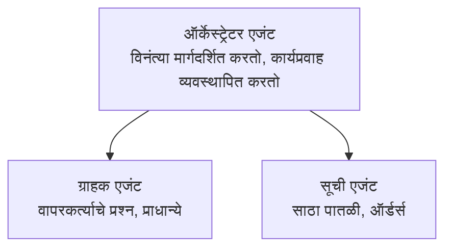

# अध्याय 5: मल्टी-एजंट AI सोल्यूशन्स

**📚 कोर्स**: [AZD For Beginners](../../README.md) | **⏱️ कालावधी**: 2-3 तास | **⭐ जटिलता**: प्रगत

---

## संक्षेप

हा अध्याय प्रगत मल्टी-एजंट आर्किटेक्चर पॅटर्न्स, एजंट समन्वय, आणि क्लिष्ट परिस्थितींसाठी उत्पादन-तयार AI तैनातींचा समावेश करतो.

> `azd 1.27.1` द्वारे जुलै 2026 मध्ये प्रमाणीकरण केलेले.

## शिकण्याच्या उद्दिष्टे

हा अध्याय पूर्ण केल्यावर, तुम्ही:
- मल्टी-एजंट आर्किटेक्चर पॅटर्न्स समजून घ्याल
- समन्वित AI एजंट प्रणाली तैनात कराल
- एजंट-टू-एजंट संवाद अंमलात आणाल
- उत्पादन-तयार मल्टी-एजंट सोल्यूशन्स तयार कराल

---

## 📚 धडा

| # | धडा | वर्णन | वेळ |
|---|--------|-------------|------|
| 1 | [मल्टी-एजंट मूलभूत माहिती](multi-agent-basics.md) | हस्तगत: `azd up` सह कार्यरत मल्टी-एजंट अ‍ॅप तैनात करा | 45 मिनिटे |
| 2 | [समन्वय पॅटर्न्स](../chapter-06-pre-deployment/coordination-patterns.md) | एजंट समन्वय धोरणे (अध्याय 6 मध्ये चालू) | 30 मिनिटे |
| 3 | [ARM टेम्पलेट तैनाती](../../examples/retail-multiagent-arm-template/README.md) | एक-क्लिक तैनातीचे उदाहरण | 30 मिनिटे |

> **धडा 1 पासून सुरू करा.** हा हा अध्यायातील एकमेव पूर्णपणे हस्तगत, तैनात करण्यायोग्य धडा आहे. धडा 2 अध्याय 6 मध्ये आहे (तो प्री-डिप्लॉयमेंट नियोजनासह सामायिक आहे), आणि [रिटेल मल्टी-एजंट सोल्यूशन](../../examples/retail-scenario.md) हा आर्किटेक्चर ब्लूप्रिंट आहे—एक डिझाइन संदर्भ, एक-कमांड टेम्पलेट नाही.

---

## 🚀 जलद प्रारंभ

```bash
# पर्याय 1: टेम्पलेटमधून डिप्लॉय करा
azd init --template agent-openai-python-prompty
azd up

# पर्याय 2: एजंट मॅनिफेस्टमधून डिप्लॉय करा (azure.ai.agents विस्तार आवश्यक)
azd extension install azure.ai.agents
azd ai agent init -m agent-manifest.yaml
azd up
```

> **कोणता दृष्टिकोन?** `azd init --template` वापरून कार्यरत नमुन्यापासून प्रारंभ करा. तुमच्याकडे स्वतःचा एजंट मॅनिफेस्ट असल्यास `azd ai agent init` वापरा. पूर्ण माहितीसाठी [AZD AI CLI संदर्भ](../chapter-08-production/production-ai-practices.md#azd-ai-cli-commands-and-extensions) पहा.

---

## 🤖 मल्टी-एजंट आर्किटेक्चर



---

## 🎯 वैशिष्ट्यीकृत सोल्यूशन: रिटेल मल्टी-एजंट

[रिटेल मल्टी-एजंट सोल्यूशन](../../examples/retail-scenario.md) दर्शविते:

- **ग्राहक एजंट**: वापरकर्ता संवाद आणि प्राधान्ये हाताळतो
- **साठा एजंट**: साठा आणि ऑर्डर प्रक्रिया व्यवस्थापित करतो
- **ऑर्खेस्ट्रेटर**: एजंट्समधील समन्वय करतो
- **शेअर केलेली स्मृती**: एजंट दरम्यान संदर्भ व्यवस्थापन

### वापरलेली सेवा

| सेवा | उद्देश |
|---------|---------|
| Microsoft Foundry Models | भाषा समजामुळे |
| Azure AI Search | उत्पादन सूची |
| Cosmos DB | एजंट स्थिती आणि स्मृती |
| Container Apps | एजंट होस्टिंग |
| Application Insights | देखरेख |

---

## 🔗 मार्गदर्शन

| दिशा | अध्याय |
|-----------|---------|
| **मागील** | [अध्याय 4: इन्फ्रास्ट्रक्चर](../chapter-04-infrastructure/README.md) |
| **पुढील** | [अध्याय 6: प्री-डिप्लॉयमेंट](../chapter-06-pre-deployment/README.md) |

---

## 📖 संबंधित संसाधने

- [AI एजंट मार्गदर्शक](../chapter-02-ai-development/agents.md)
- [उत्पादन AI पद्धती](../chapter-08-production/production-ai-practices.md)
- [AI समस्या सोडवणे](../chapter-07-troubleshooting/ai-troubleshooting.md)

---

<!-- CO-OP TRANSLATOR DISCLAIMER START -->
**अस्वीकरण**:
हा दस्तऐवज AI भाषांतर सेवा [Co-op Translator](https://github.com/Azure/co-op-translator) चा वापर करून अनुवादित केला आहे. जरी आम्ही अचूकतेसाठी प्रयत्न करतो, तरी कृपया लक्षात घ्या की स्वयंचलित भाषांतरांमध्ये त्रुटी किंवा अचूकतेची कमतरता असू शकते. मूळ दस्तऐवज त्याच्या मूळ भाषेत अधिकृत स्रोत मानला पाहिजे. महत्त्वाची माहिती असल्यास, व्यावसायिक मानवी भाषांतराची शिफारस केली जाते. या भाषांतराच्या वापरामुळे उद्भवणाऱ्या कोणत्याही गैरसमज किंवा चुकीच्या अर्थलावणीसाठी आम्ही जबाबदार नाही.
<!-- CO-OP TRANSLATOR DISCLAIMER END -->