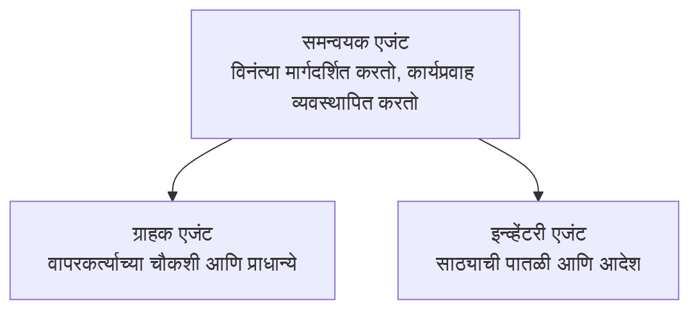

# Chapter 5: मल्टी-एजंट एआय सोल्यूशन्स

**📚 कोर्स**: [AZD For Beginners](../../README.md) | **⏱️ कालावधी**: 2-3 तास | **⭐ कठीणता**: प्रगत

---

## आढावा

हा अध्याय प्रगत मल्टी-एजंट आर्किटेक्चर पॅटर्न, एजंट ऑर्केस्ट्रेशन, आणि जटिल परिस्थितींसाठी उत्पादन-तयार एआय डिप्लॉयमेंटबद्दल मार्गदर्शन करतो.

> `azd 1.23.12` सह मार्च 2026 मध्ये सत्यापित.

## शिक्षण उद्दिष्टे

हा अध्याय पूर्ण केल्यावर, आपण:
- मल्टी-एजंट आर्किटेक्चर पॅटर्न समजून घ्याल
- समन्वित एआय एजंट सिस्टम्स तैनात करू शकाल
- एजंट-टू-एजंट संवाद अंमलात आणाल
- उत्पादन-तयार मल्टी-एजंट सोल्यूशन्स तयार करू शकाल

---

## 📚 धडे

| # | धडा | वर्णन | कालावधी |
|---|--------|-------------|------|
| 1 | [रिटेल मल्टी-एजंट सोल्यूशन](../../examples/retail-scenario.md) | पूर्ण अंमलबजावणी मार्गदर्शन | 90 मिनिटे |
| 2 | [समन्वय पॅटर्न](../chapter-06-pre-deployment/coordination-patterns.md) | एजंट ऑर्केस्ट्रेशन धोरणे | 30 मिनिटे |
| 3 | [ARM टेम्पलेट तैनाती](../../examples/retail-multiagent-arm-template/README.md) | एक-क्लिक तैनाती | 30 मिनिटे |

---

## 🚀 त्वरीत सुरुवात

```bash
# पर्याय 1: साच्यातून तैनात करा
azd init --template agent-openai-python-prompty
azd up

# पर्याय 2: एजंट मॅनिफेस्टमधून तैनात करा (azure.ai.agents विस्तार आवश्यक आहे)
azd extension install azure.ai.agents
azd ai agent init -m agent-manifest.yaml
azd up
```

> **कोणता दृष्टिकोन?** कार्यरत नमुन्यापासून सुरू करण्यासाठी `azd init --template` वापरा. आपला स्वतःचा एजंट मॅनिफेस्ट असल्यास `azd ai agent init` वापरा. संपूर्ण तपशीलांसाठी [AZD AI CLI संदर्भ](../chapter-08-production/production-ai-practices.md#azd-ai-cli-commands-and-extensions) पहा.

---

## 🤖 मल्टी-एजंट आर्किटेक्चर


---

## 🎯 वैशिष्ट्यीकृत सोल्यूशन: रिटेल मल्टी-एजंट

हे [रिटेल मल्टी-एजंट सोल्यूशन](../../examples/retail-scenario.md) दर्शवते:

- **ग्राहक एजंट**: वापरकर्ता संवाद आणि प्राधान्ये हाताळतो
- **इन्व्हेंटरी एजंट**: साठा आणि ऑर्डर प्रक्रिया व्यवस्थापित करतो
- **ऑर्केस्ट्रेटर**: एजंट्स दरम्यान समन्वय करतो
- **शेअर्ड मेमरी**: एजंट्सदरम्यान संदर्भ व्यवस्थापन

### वापरल्या जाणाऱ्या सेवा

| सेवा | उद्देश |
|---------|---------|
| Microsoft Foundry Models | भाषा समज |
| Azure AI Search | उत्पादन कॅटलॉग |
| Cosmos DB | एजंट स्थिती आणि मेमरी |
| Container Apps | एजंट होस्टिंग |
| Application Insights | निरीक्षण |

---

## 🔗 नेव्हिगेशन

| दिशा | अध्याय |
|-----------|---------|
| **मागील** | [अध्याय 4: Infrastructure](../chapter-04-infrastructure/README.md) |
| **पुढील** | [अध्याय 6: पूर्व-तैनाती](../chapter-06-pre-deployment/README.md) |

---

## 📖 संबंधित संसाधने

- [AI एजंट्स मार्गदर्शक](../chapter-02-ai-development/agents.md)
- [उत्पादन एआय पद्धती](../chapter-08-production/production-ai-practices.md)
- [एआय समस्या निवारण](../chapter-07-troubleshooting/ai-troubleshooting.md)

---

<!-- CO-OP TRANSLATOR DISCLAIMER START -->
**अस्वीकरण**:
हा दस्तऐवज कृत्रिम बुद्धिमत्ता अनुवाद सेवा [Co-op Translator](https://github.com/Azure/co-op-translator) वापरून अनुवादित करण्यात आला आहे. आम्ही अचूकतेसाठी प्रयत्न करतो, तरी कृपया लक्षात घ्या की स्वयंचलित अनुवादांमध्ये चुका किंवा अचूकतेच्या त्रुटी असू शकतात. मूळ दस्तऐवज त्याच्या मूळ भाषेत अधिकृत स्रोत मानला पाहिजे. महत्त्वाच्या माहितीसाठी व्यावसायिक मानवी अनुवादाची शिफारस केली जाते. या अनुवादाच्या वापरामुळे उद्भवणाऱ्या कोणत्याही गैरसमजुतींसाठी किंवा चुकीच्या अर्थघटकांसाठी आम्ही जबाबदार नाही.
<!-- CO-OP TRANSLATOR DISCLAIMER END -->