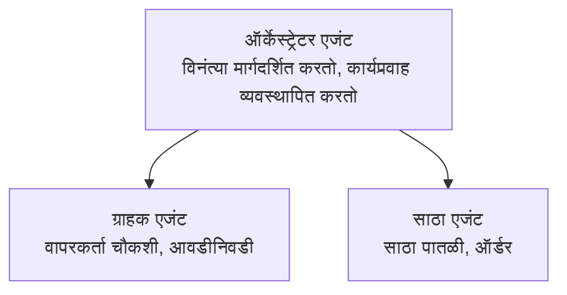

# Chapter 5: मल्टी-एजंट AI सोल्यूशन्स

**📚 कोर्स**: [AZD For Beginners](../../README.md) | **⏱️ कालावधी**: 2-3 तास | **⭐ जटिलता**: प्रगत

---

## आढावा

हा प्रकरण प्रगत मल्टी-एजंट आर्किटेक्चर नमुन्यांसाठी, एजंट ऑर्केस्ट्रेशनसाठी आणि गुंतागुंतीच्या परिस्थितींसाठी उत्पादन-तयार AI तैनातींसाठी आहे.

## शिकण्याची उद्दिष्टे

हे प्रकरण पूर्ण करून आपण खालील गोष्टी शिकाल:
- मल्टी-एजंट आर्किटेक्चर नमुने समजून घेणे
- सुसंवादी AI एजंट प्रणालींची तैनात करणे
- एजंट-टू-एजंट संवादाची अंमलबजावणी करणे
- उत्पादन-तयार मल्टी-एजंट सोल्यूशन्स तयार करणे

---

## 📚 धडे

| # | धडा | वर्णन | वेळ |
|---|--------|-------------|------|
| 1 | [रिटेल मल्टी-एजंट सोल्यूशन](../../examples/retail-scenario.md) | संपूर्ण अंमलबजावणी walkthrough | 90 मिनिटे |
| 2 | [समन्वय नमुने](../chapter-06-pre-deployment/coordination-patterns.md) | एजंट ऑर्केस्ट्रेशन धोरणे | 30 मिनिटे |
| 3 | [ARM टेम्पलेट तैनात करणे](../../examples/retail-multiagent-arm-template/README.md) | एक क्लिक तैनात करणे | 30 मिनिटे |

---

## 🚀 जलद प्रारंभ

```bash
# पर्याय 1: टेम्पलेटमधून तैनात करा
azd init --template agent-openai-python-prompty
azd up

# पर्याय 2: एजंट मॅनिफेस्टमधून तैनात करा (azure.ai.agents विस्तार आवश्यक आहे)
azd extension install azure.ai.agents
azd ai agent init -m agent-manifest.yaml
azd up
```

> **कोणता दृष्टिकोन?** काम करत असलेल्या नमुन्यातून प्रारंभ करण्यासाठी `azd init --template` वापरा. आपला स्वतःचा एजंट मॅनिफेस्ट असताना `azd ai agent init` वापरा. संपूर्ण तपशीलांसाठी [AZD AI CLI संदर्भ](../chapter-08-production/production-ai-practices.md#azd-ai-cli-commands-and-extensions) पहा.

---

## 🤖 मल्टी-एजंट आर्किटेक्चर


---

## 🎯 निवडक सोल्यूशन: रिटेल मल्टी-एजंट

[रिटेल मल्टी-एजंट सोल्यूशन](../../examples/retail-scenario.md) अशी वैशिष्ट्ये दाखवते:

- **ग्राहक एजंट**: वापरकर्त्याशी संवाद आणि पसंती हाताळतो
- **इन्व्हेंटरी एजंट**: स्टॉक आणि ऑर्डर प्रक्रियेचे व्यवस्थापन करतो
- **ऑर्केस्ट्रेटर**: एजंट्समधल्या समन्वयाचे नियमन करतो
- **शेअर केलेली मेमरी**: एजंट्समधील संदर्भ व्यवस्थापन

### वापरलेल्या सेवा

| सेवा | उद्देश |
|---------|---------|
| Microsoft Foundry Models | भाषा समज |
| Azure AI Search | उत्पादन कॅटलॉग |
| Cosmos DB | एजंट स्थिती आणि मेमरी |
| Container Apps | एजंट होस्टिंग |
| Application Insights | निरीक्षण |

---

## 🔗 नेव्हिगेशन

| दिशा | प्रकरण |
|-----------|---------|
| **मागील** | [Chapter 4: Infrastructure](../chapter-04-infrastructure/README.md) |
| **पुढील** | [Chapter 6: Pre-Deployment](../chapter-06-pre-deployment/README.md) |

---

## 📖 संबंधित संसाधने

- [AI Agents मार्गदर्शक](../chapter-02-ai-development/agents.md)
- [उत्पादन AI सराव](../chapter-08-production/production-ai-practices.md)
- [AI ट्रबलशूटिंग](../chapter-07-troubleshooting/ai-troubleshooting.md)

---

<!-- CO-OP TRANSLATOR DISCLAIMER START -->
**विवरणः**  
हा दस्तऐवज AI भाषांतर सेवा [Co-op Translator](https://github.com/Azure/co-op-translator) वापरून भाषांतरित केला आहे. आम्ही अचूकतेसाठी प्रयत्नशील असलो तरी, कृपया लक्षात घ्या की स्वयंचलित भाषांतरांमध्ये चुका किंवा अचूकतेचा अभाव असू शकतो. मूळ दस्तऐवज त्याच्या संस्कृती भाषेत अधिकृत स्रोत मानला जावा. महत्त्वाच्या माहितींसाठी व्यावसायिक मानवी भाषांतर शिफारसीय आहे. या भाषांतराच्या वापरातून उद्भवणाऱ्या कोणत्याही गैरसमजुतींसाठी किंवा वाक्यप्रचारांसाठी आम्ही जबाबदार नाही.
<!-- CO-OP TRANSLATOR DISCLAIMER END -->