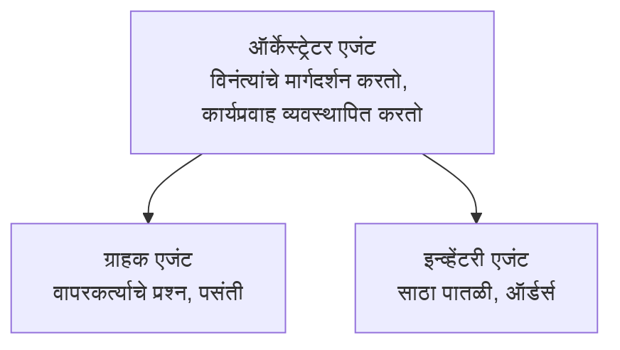

# अध्याय 5: मल्टी-एजंट AI सोल्यूशन्स

**📚 कोर्स**: [AZD फॉर बिगिनर्स](../../README.md) | **⏱️ कालावधी**: 2-3 तास | **⭐ गुंतागुंत**: प्रगत

---

## आढावा

हा अध्याय प्रगत मल्टी-एजंट आर्किटेक्चर पॅटर्न, एजंट ऑर्केस्ट्रेशन, आणि जटिल परिस्थितीसाठी उत्पादन-तयार AI तैनाती यावर लक्ष केंद्रित करतो. 

> `azd 1.25.6` शी जून 2026 मध्ये पडताळणी केली आहे.

## शिकण्याचे उद्दिष्टे

हा अध्याय पूर्ण करून, आपण:
- मल्टी-एजंट आर्किटेक्चर पॅटर्न समजून घेणार
- समन्वित AI एजंट सिस्टम्स तैनात करणार
- एजंट-टू-एजंट संवाद अंमलात आणणार
- उत्पादन-तयार मल्टी-एजंट सोल्यूशन्स तयार करणार

---

## 📚 धडे

| # | धडा | वर्णन | वेळ |
|---|--------|-------------|------|
| 1 | [मल्टी-एजंट मूलभूत](multi-agent-basics.md) | प्रत्यक्ष: `azd up` ने कार्यरत मल्टी-एजंट अ‍ॅप तैनात करा | 45 मिनिटे |
| 2 | [समन्वय पॅटर्न्स](../chapter-06-pre-deployment/coordination-patterns.md) | एजंट ऑर्केस्ट्रेशन स्ट्रॅटेजीज (अध्याय 6 मध्ये सुरू) | 30 मिनिटे |
| 3 | [ARM टेम्प्लेट तैनाती](../../examples/retail-multiagent-arm-template/README.md) | एक-क्लिक तैनातीचे उदाहरण | 30 मिनिटे |

> **धडा 1 पासून सुरू करा.** हाच या अध्यायातील एकमेव पूर्णपणे प्रत्यक्ष, तैनात करता येणारा धडा आहे. धडा 2 अध्याय 6 मध्ये आहे (तो पूर्व-तैनाती नियोजनासह सामायिक आहे), आणि [रिटेल मल्टी-एजंट सोल्यूशन](../../examples/retail-scenario.md) हे आर्किटेक्चर ब्लूप्रिंट—एक डिझाईन संदर्भ आहे, एक-कमान्ड टेम्पलेट नाही.

---

## 🚀 जलद सुरुवात

```bash
# पर्याय 1: टेम्पलेटमधून तैनात करा
azd init --template agent-openai-python-prompty
azd up

# पर्याय 2: एजंट मॅनिफेस्टमधून तैनात करा (azure.ai.agents विस्तार आवश्यक)
azd extension install azure.ai.agents
azd ai agent init -m agent-manifest.yaml
azd up
```

> **कोणता मार्ग?** कार्यरत नमुन्यातून सुरू करण्यासाठी `azd init --template` वापरा. स्वतःचा एजंट मॅनिफेस्ट असल्यास `azd ai agent init` वापरा. पूर्ण तपशीलांसाठी [AZD AI CLI संदर्भ](../chapter-08-production/production-ai-practices.md#azd-ai-cli-commands-and-extensions) पाहा.

---

## 🤖 मल्टी-एजंट आर्किटेक्चर



---

## 🎯 वैशिष्ट्यीकृत सोल्यूशन: रिटेल मल्टी-एजंट

[रिटेल मल्टी-एजंट सोल्यूशन](../../examples/retail-scenario.md) खालील गोष्टी दर्शवते:

- **ग्राहक एजंट**: वापरकर्ता संवाद आणि प्राधान्ये हाताळतो
- **इन्व्हेंटरी एजंट**: साठा आणि ऑर्डर प्रक्रिया व्यवस्थापित करतो
- **ऑर्केस्ट्रेटर**: एजंट्समधील समन्वय करतो
- **शेअर केलेली स्मृती**: एजंट्स दरम्यान संदर्भ व्यवस्थापन

### वापरलेली सेवा

| सेवा | उद्देश |
|---------|---------|
| Microsoft Foundry Models | भाषा समजून घेणे |
| Azure AI Search | उत्पादन कॅटलॉग |
| Cosmos DB | एजंट स्थिती आणि स्मृती |
| कंटेनर अ‍ॅप्स | एजंट होस्टिंग |
| Application Insights | देखरेख |

---

## 🔗 नेव्हिगेशन

| दिशानिर्देश | अध्याय |
|-----------|---------|
| **मागील** | [अध्याय 4: पायाभूत सुविधा](../chapter-04-infrastructure/README.md) |
| **पुढील** | [अध्याय 6: पूर्व-तैनाती](../chapter-06-pre-deployment/README.md) |

---

## 📖 संबंधित साधने

- [AI एजंट गाइड](../chapter-02-ai-development/agents.md)
- [उत्पादन AI प्रॅक्टिसेस](../chapter-08-production/production-ai-practices.md)
- [AI समस्या निवारण](../chapter-07-troubleshooting/ai-troubleshooting.md)

---

<!-- CO-OP TRANSLATOR DISCLAIMER START -->
**अस्वीकरण**:
हा दस्तऐवज AI भाषांतर सेवा [Co-op Translator](https://github.com/Azure/co-op-translator) चा वापर करून अनुवादित केला आहे. जरी आम्ही अचूकतेसाठी प्रयत्न करतो, तरी कृपया लक्षात घ्या की स्वयंचलित भाषांतरांमध्ये त्रुटी किंवा अचूकतेची कमतरता असू शकते. मूळ दस्तऐवज त्याच्या मूळ भाषेत अधिकृत स्रोत मानला पाहिजे. महत्त्वाची माहिती असल्यास, व्यावसायिक मानवी भाषांतराची शिफारस केली जाते. या भाषांतराच्या वापरामुळे उद्भवणाऱ्या कोणत्याही गैरसमज किंवा चुकीच्या अर्थलावणीसाठी आम्ही जबाबदार नाही.
<!-- CO-OP TRANSLATOR DISCLAIMER END -->