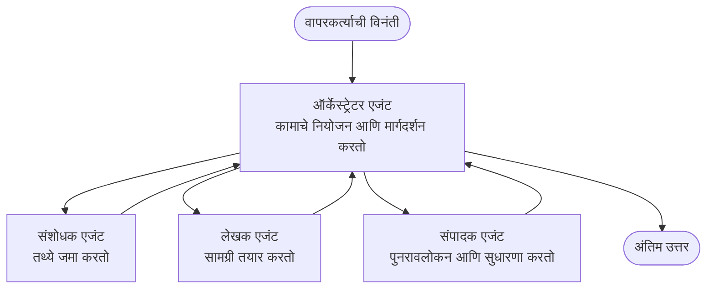

# मल्टी-एजंट बेसिक्स - तुमची पहिली समन्वित AI प्रणाली तैनात करा

**अध्याय नेव्हिगेशन:**
- **📚 कोर्स घर**: [AZD For Beginners](../../README.md)
- **📖 वर्तमान अध्याय**: अध्याय 5 - मल्टी-एजंट AI सोल्यूशन्स
- **⬅️ मागील**: [अध्याय 4: इन्फ्रास्ट्रक्चर](../chapter-04-infrastructure/README.md)
- **➡️ पुढील**: [समन्वय पॅटर्न्स](../chapter-06-pre-deployment/coordination-patterns.md)

> `azd 1.27.1` च्या विरूद्ध जुलै 2026 मध्ये प्रमाणीकरण केलेले.

## प्रस्तावना

आधीच्या अध्यायांमध्ये तुम्ही एकल अनुप्रयोग तैनात केला आणि अध्याय 2 मध्ये तुम्ही एकल AI एजंट तैनात केला. हा धडा पुढील टप्पा घेऊन जातो: **मल्टी-एजंट सिस्टीम** तैनात करणे, जिथे अनेक विशेषीकृत एजंट एकत्र येऊन असा प्रश्न सोडवतात ज्याचे समाधान एकट्या एजंटने स्वतःच्या पद्धतीने नीट करता येणार नाही.

नवशिक्यांसाठी चांगली बातमी: **तुम्हाला नवीन आदेशांची गरज नाही.** मल्टी-एजंट सोल्यूशन अजूनही एक azd प्रोजेक्ट आहे. तुम्ही `azd init`, `azd up`, चाचणी आणि `azd down` कराल—ज्याप्रमाणे तुम्हाला माहीत आहे त्याच workflow प्रमाणे. बदलतो ते तर app चा *आकार*.

## शिकण्याचे उद्दिष्टे

या धड्याच्या शेवटी तुम्ही:
- "मल्टी-एजंट" म्हणजे काय आणि कधी त्याची अतिरिक्त जटिलता योग्य आहे हे समजून घालाल
- मल्टी-एजंट सिस्टीममधील सामान्य भूमिका (ऑर्केस्ट्रेटर + तज्ञ) ओळखाल
- `azd up` ने एक वास्तविक, कार्यरत मल्टी-एजंट टेम्प्लेट तैनात कराल
- मल्टी-एजंट अ‍ॅपला समर्थन देणाऱ्या Azure स्रोतांचे ज्ञान मिळवाल
- सोल्यूशन सुरक्षितपणे तपासण्याचे, सानुकूल करण्याचे आणि समाप्त करण्याचे कसे करायचे ते शिकलाल

## शिकण्याचे निकाल

हा धडा पूर्ण केल्यावर, तुम्ही सक्षम असाल:
- एकल एजंट आणि मल्टी-एजंट सिस्टीममधील फरक स्पष्ट करण्यास
- साधने वापरून एकल एजंट आणि खऱ्या मल्टी-एजंट डिझाइनमधून निवड करण्यास
- azd द्वारे मल्टी-एजंट टेम्प्लेट पूर्णपणे तैनात आणि चाचणी करण्यास
- प्रत्येक एजंट कुठे चालतो आणि ते कसे संवाद साधतात याचा शोध घेण्यासाठी
- सततचे शुल्क टाळण्यासाठी सर्व स्रोत स्वच्छ करण्यासाठी

---

## मल्टी-एजंट सिस्टीम म्हणजे काय?

एकल AI एजंट म्हणजे एक मॉडेल ज्याकडे सूचनांचा संच आणि (ऐच्छिक) काही साधने असतात. ते लक्ष केंद्रित कार्यांसाठी चांगले काम करते. पण जेव्हा कार्य वाढते—संशोधन, नंतर लेखन, नंतर संपादन, नंतर तथ्य तपासणी—तेव्हा सगळं एका प्रॉम्प्टमध्ये टाकल्यास एजंट हळू होतो, अविश्वसनीय होतो आणि डिबग करणे अवघड होते.

एक **मल्टी-एजंट सिस्टीम** काम तज्ञांमध्ये विभागते जे प्रत्येक एक काम नीट करतात, आणि ऑर्केस्ट्रेटरद्वारे समन्वित केलेले असतात:



### दोन भूमिका ज्या तुम्हाला सतत दिसतील

| भूमिका | काम | उदाहरण |
|------|-----|---------|
| **ऑर्केस्ट्रेटर** | *पुढे काय होणार* ते ठरवतो आणि एजंट्समध्ये काम वाटतो | "पहिल्यांदा संशोधन, नंतर लिहिणे, नंतर संपादन" |
| **तज्ज्ञ** | एक लक्ष केंद्रित काम करतो आणि निकाल परत करतो | केवळ तथ्य गोळा करणारा "संशोधक" |

### तुम्हाला खरोखरच अनेक एजंट्सची गरज आहे का?

सोपे सुरू करा. मल्टी-एजंट **फक्त** तेव्हा वापरा जेव्हा खालीलपैकी काही सत्य आहे:

- ✅ कार्यात **वेगवेगळे टप्पे** असतात जे वेगळ्या सूचनांपासून फायदा होतो (संशोधन विरुद्ध लेखन विरुद्ध पुनरावलोकन)
- ✅ तुम्हाला तज्ञांना **संपत वेळ वाचवण्यासाठी समांतर चालवायचे आहेत**
- ✅ वेगवेगळ्या टप्प्यांना **वेगवेगळ्या साधनं किंवा डेटा स्रोतांची गरज आहे**
- ✅ तुम्हाला प्रत्येक टप्पा **स्वतंत्रपणे तपासण्याचा आणि डिबग करण्याचा** अधिकार हवा आहे

जर तुमचे कार्य एक सोपा प्रश्न-उत्तर किंवा साधे टूल कॉल असेल, तर **साधनांसह एकल एजंट** (अध्याय 2) अधिक सोपा, स्वस्त आणि चालवायला सोपा आहे.

> **नवशिक्या टीप:** "अधिक एजंट" म्हणजे "चांगले" नाही. प्रत्येक एजंटमुळे विलंब, खर्च, आणि नवीन गोष्ट लक्ष ठेवावी लागते. एजंट्स फक्त तेव्हा जोडा जेव्हा समस्या स्पष्टपणे भागांमध्ये विभागलेली असेल.

---

## Azure वर मल्टी-एजंट तयार करण्याचे दोन मार्ग

| दृष्टीकोन | ते काय आहे | सर्वोत्तम साठी |
|----------|-----------|----------|
| **एकल एजंट + साधने** | एक Foundry एजंट जो फंक्शन/साधने कॉल करतो | सोपे workflows, सुरुवात करताना |
| **अनेक समन्वित एजंट्स** | अनेक एजंट्स ऑर्केस्ट्रेटर सह | वेगवेगळे टप्पे, समांतर काम, विशेषज्ञता |

हा धडा दुसऱ्या पद्धतीवर लक्ष केंद्रित करतो, **आधी तयार केलेल्या टेम्प्लेटचा** वापर करून, जेणेकरून तुम्हाला स्वतः तयार करण्याआधीच एक प्रत्यक्ष मल्टी-एजंट सिस्टीम चालताना पाहता येईल.

---

## हाताळणी करा: एक कार्यरत मल्टी-एजंट अँप तैनात करा

आपण **Contoso Creative Writer** तैनात करणार आहोत, एक अधिकृत Azure नमुना जो अनेक एजंट्स (संशोधक, लेखक, संपादक) वापरतो जे एक लेख तयार करण्यासाठी समन्वित असतात. हे एक छान पहिला मल्टी-एजंट अ‍ॅप आहे कारण भूमिका समजायला सोप्या आहेत.

### टप्पा 1: टेम्प्लेट वास्तविक करा

```bash
# काम करण्यासाठी फोल्डर तयार करा
mkdir creative-writer && cd creative-writer

# अधिकृत मल्टी-एजंट टेम्पलेटमधून प्रारंभ करा
azd init --template contoso-creative-writer
```

> [Awesome AZD AI gallery](https://azure.github.io/awesome-azd/?tags=ai) मध्ये कधीही अधिक मल्टी-एजंट टेम्प्लेट बघा. इतर नवशिक्यांसाठी पर्यायांत `get-started-with-ai-agents` आणि `azure-ai-travel-agents` आहेत.

### टप्पा 2: प्रमाणीकरण करा

```bash
# azd वर्कफ़्लोजसाठी आवश्यक आहे
azd auth login
```

### टप्पा 3: पर्यावरण तयार करा

```bash
azd env new dev
```

### टप्पा 4: पूर्वावलोकन करा, नंतर तैनात करा

```bash
# काहीही खर्च करण्यापूर्वी काय तयार होईल ते पाहा (शिफारस केली आहे)
azd provision --preview

# एकाच टप्प्यात पायाभूत सुविधा तयार करा आणि सर्व एजंट तैनात करा
azd up
```

`azd up` तुमच्याकडे सदस्यता आणि प्रदेशासाठी विनंती करेल, नंतर Azure स्रोत तयार करतील आणि अनुप्रयोग तैनात करतील. AI तैनाती साध्या वेब अँपपेक्षा जास्त वेळ घेऊ शकतात—जर तुम्ही मोठे मॉडेल तैनात करत असाल तर deploy timeout वाढवू शकता:

```bash
azd deploy --timeout 1800
```

> **खर्च आणि क्षमतेवर लक्ष ठेवा:** मल्टी-एजंट अँप AI मॉडेल्स तैनात करतात जे कोटा वापरतात आणि खर्च करतात. जर `azd up` मॉडेल कोटा कारणाने अयशस्वी झाले, तर [AI Troubleshooting](../chapter-07-troubleshooting/ai-troubleshooting.md) मध्ये प्रदेश आणि कोटा सुधारणा पहा, तसेच अध्याय 6 [क्षमता नियोजन](../chapter-06-pre-deployment/capacity-planning.md).

---

## तुम्ही काय तैनात केले ते समजून घ्या

या प्रकारचा एक सामान्य मल्टी-एजंट अँप पुढील Azure स्रोत प्रदान करतो जे वरच्या आकृतीतील जबाबदाऱ्यांशी थेट जुळतात:

| स्रोत | कारण काय आहे |
|----------|----------------|
| **Microsoft Foundry / मॉडेल्स** | प्रत्येक एजंट वापरणारे भाषा मॉडेल्स होस्ट करते |
| **Azure AI Search** | संशोधक एजंटला शोधता येणारा आधारभूत डेटा देते |
| **Container Apps** (किंवा App Service) | ऑर्केस्ट्रेटर आणि एजंट कोड होस्ट करतो |
| **Cosmos DB** (काही नमुन्यांमध्ये) | एजंट्समध्ये सामायिक केलेले स्थिती/स्मृती संग्रहित करते |
| **Application Insights** | एजंट्समधील विनंत्यांचा मागोवा घेते ज्यामुळे तुम्ही प्रवाह डिबग करू शकता |

### एजंट्स एकमेकांशी कसे बोलतात

बहुतेक azd मल्टी-एजंट नमुन्यांमध्ये, **ऑर्केस्ट्रेटर तुमच्या अनुप्रयोग कोडमध्ये चालतो** (उदा., Semantic Kernel किंवा Microsoft Agent Framework सारख्या फ्रेमवर्कच्या वापराने). ऑर्केस्ट्रेटर प्रत्येक तज्ज्ञ एजंटला क्रमाने कॉल करतो, निकाल पाठवतो आणि अंतिम उत्तर तयार करतो. एजंट्स खालील मार्गांनी संदर्भ शेअर करतात:

- **फंक्शन/साधने कॉल्स** — ऑर्केस्ट्रेटर तज्ज्ञाला कॉल करतो आणि निकाल परत घेतो
- **सामायिक स्मृती** — एक डेटाबेस (सामान्यतः Cosmos DB) स्थिती ठेवतो जी दोन्ही एजंट्स वाचू शकतात
- **संदेश/इव्हेंट्स** — मोकळ्या जोडणीसाठी, एजंट्स एकमेकांशी क्यू किंवा सेवा बसद्वारे संवाद साधतात

> **डिबगिंगसाठी हे महत्त्वाचे का आहे:** प्रत्येक टप्पा स्वतंत्र असल्यामुळे, Application Insights तुम्हाला *कोणता* एजंट हळू किंवा अयशस्वी झाला हे दाखवते. हा मल्टी-एजंट डिझाइन वापरण्याचा मुख्य फायदा आहे.

---

## तैनाती तपासा

पुढे जाण्यापूर्वी प्रणाली प्रत्यक्षात कार्यरत आहे का ते खात्री करा:

```bash
# तैनात केलेले एंडपॉइंट्स दर्शवा
azd show

# अॅपचे निरीक्षण डॅशबोर्ड उघडा
azd monitor

# काहीतरी अयोग्य दिसल्यास लॉग्स टेल करा
azd monitor --logs
```

मग `azd show` मधून अॅप URL उघडा आणि सर्व एजंटची परीक्षा घेणारी विनंती करा (Creative Writer साठी, एखाद्या विषयावर लहान लेख लिहिण्यास विचारा). Application Insights **लेन-देन शोधात**, तुम्हाला विनंती संशोधक, लेखक, आणि संपादक टप्प्यांमध्ये प्रसारित झालेली दिसेल.

**यशस्वी निकष:**
- ✅ `azd show` रीच करू शकणारा endpoint दाखवतो
- ✅ विनंतीने असा निकाल दिला जो स्पष्टपणे अनेक टप्प्यांतून गेला आहे
- ✅ Application Insights मध्ये एकाहून अधिक एजंट टप्प्यांचे मागोवे दिसतात

---

## सानुकूलित करा: एजंट जोडा किंवा समायोजित करा

प्रत्येक एजंट केवळ सूचनांशी निगडीत आणि साधने असतात, त्यामुळे सानुकूल करणे शक्य आहे:

1. टेम्प्लेटमधील एजंट व्याख्या शोधा (साधारणपणे `prompts/`, `agents/`, किंवा `*.prompty` फाइल्स मध्ये).
2. एजंटच्या सूचनांमध्ये सुधारणा करा — उदा., संपादक एजंटला विशिष्ट टोन किंवा शब्दसंख्या काटेकोरपणे पाळण्याचा निर्देश द्या.
3. फक्त कोड पुन्हा तैनात करा (इन्फ्रास्ट्रक्चर अपरिवर्तित राहील):

   ```bash
   azd deploy
   ```

पुढे जाऊन आणि तुमच्या *स्वतःच्या* मॅनिफेस्टमधून एजंट तयार करण्यासाठी, एजंट विस्तार आणि त्याचा पूर्ण जीवनचक्र वापरा:

```bash
azd extension install azure.ai.agents
azd ai agent init -m agent-manifest.yaml
azd up
azd ai agent invoke      # परीक्षेचे, प्रतिसाद वेळेसह
```

पूर्ण एजंट जीवनचक्रासाठी (`invoke`, `eval generate`, `optimize`, `delete`) [अध्याय 2: एजंट्स](../chapter-02-ai-development/agents.md) आणि [AZD AI CLI संदर्भ](../chapter-08-production/production-ai-practices.md#azd-ai-cli-commands-and-extensions) पहा.

---

## साफसफाई करा

मल्टी-एजंट अँप अनेक बिलिंग सेवा चालवतात. काम संपल्यावर सर्व काही विश्लेषित करा:

```bash
azd down --force --purge
```

`--purge` फ्लॅग देखील सॉफ्ट-डिलिटेड AI स्रोत (Foundry/Azure AI Services खात्यांसारखे) काढून टाकते जेणेकरून ते भविष्यातील पुन्हा तैनातीस अडथळा आणणार नाहीत किंवा खर्च वाढवणार नाहीत.

---

## उत्पादन मल्टी-एजंट सिस्टीम्सविषयी सूचना

या रेपोमधील [Retail Multi-Agent Solution](../../examples/retail-scenario.md) म्हणजे **आर्किटेक्चर ब्लूप्रिंट** आहे, एक क्लिक टेम्प्लेट नाही—हे कसे उत्पादन रिटेल सिस्टीम *बांधली जाईल* याचे दस्तऐवजीकरण आहे (आणि स्पष्ट केले आहे की पूर्ण बांधकाम मोठे काम आहे). येथे काम करणारा नमुना तैनात केल्यानंतर त्याचा डिझाइन संदर्भ म्हणून वापरा. उत्पादनासाठी (स्थैर्य, खर्च, निरीक्षण, शासन) पुढे [अध्याय 8: उत्पादन AI पद्धती](../chapter-08-production/production-ai-practices.md) वाचा.

---

## सारांश

- मल्टी-एजंट सिस्टीम ऑर्केस्ट्रेटरद्वारे संलग्न तज्ञांमध्ये काम वाटते.
- कार्यात वेगळे टप्पे, समांतरता किंवा वेगवेगळ्या साधनांचे असले तरच ते वापरा—मगतर एकल एजंट पसंत करा.
- azd workflow अपरिवर्तित राहतो: `azd init` → `azd up` → चाचणी → `azd down`.
- `contoso-creative-writer` सारखा वास्तविक टेम्प्लेट तुम्हाला आजच कार्यरत मल्टी-एजंट अ‍ॅप पहाणे आणि सानुकूलित करणे शक्य करतो.
- Application Insights द्वारे एजंटसह मागोवा घेणे हे मल्टी-एजंट डिझाइनचा एक मोठा व्यावहारिक फायदा आहे.

---

## 🔗 नेव्हिगेशन

| दिशा | धडा |
|-----------|--------|
| **मागील** | [अध्याय 4: इन्फ्रास्ट्रक्चर](../chapter-04-infrastructure/README.md) |
| **पुढील** | [समन्वय पॅटर्न्स](../chapter-06-pre-deployment/coordination-patterns.md) |

## 📖 संबंधित स्रोत

- [AI एजंट मार्गदर्शक](../chapter-02-ai-development/agents.md)
- [समन्वय पॅटर्न्स](../chapter-06-pre-deployment/coordination-patterns.md)
- [उत्पादन AI पद्धती](../chapter-08-production/production-ai-practices.md)
- [AI त्रुटी निराकरण](../chapter-07-troubleshooting/ai-troubleshooting.md)

---

<!-- CO-OP TRANSLATOR DISCLAIMER START -->
**अस्वीकरण**:
हा दस्तऐवज AI भाषांतर सेवा [Co-op Translator](https://github.com/Azure/co-op-translator) चा वापर करून अनुवादित केला आहे. जरी आम्ही अचूकतेसाठी प्रयत्न करतो, तरी कृपया लक्षात घ्या की स्वयंचलित भाषांतरांमध्ये त्रुटी किंवा अचूकतेची कमतरता असू शकते. मूळ दस्तऐवज त्याच्या मूळ भाषेत अधिकृत स्रोत मानला पाहिजे. महत्त्वाची माहिती असल्यास, व्यावसायिक मानवी भाषांतराची शिफारस केली जाते. या भाषांतराच्या वापरामुळे उद्भवणाऱ्या कोणत्याही गैरसमज किंवा चुकीच्या अर्थलावणीसाठी आम्ही जबाबदार नाही.
<!-- CO-OP TRANSLATOR DISCLAIMER END -->