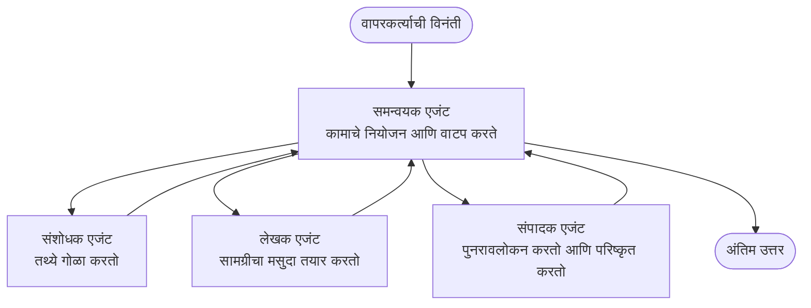

# बहु-एजंट मूलतत्त्वे - आपली पहिली समन्वित AI प्रणाली तैनात करा

**अध्याय नेव्हिगेशन:**
- **📚 अभ्यासक्रम मुख्यपृष्ठ**: [AZD नवशिक्यांसाठी](../../README.md)
- **📖 सध्याचा अध्याय**: अध्याय 5 - बहु-एजंट AI उपाय
- **⬅️ मागील**: [अध्याय 4: इन्फ्रास्ट्रक्चर](../chapter-04-infrastructure/README.md)
- **➡️ पुढे**: [समन्वय नमुने](../chapter-06-pre-deployment/coordination-patterns.md)

> जून 2026 मध्ये `azd 1.25.6` सह पडताळले.

## परिचय

पूर्वीच्या अध्यायांमध्ये आपण एकल अनुप्रयोग तैनात केला—आणि अध्याय 2 मध्ये आपण एकल AI एजंट तैनात केला. हा धडा पुढचा टप्पा घेतो: एक **बहु-एजंट प्रणाली** तैनात करणे, जिथे अनेक विशिष्ट एजंट एकत्र काम करतात कारण एकल एजंट एकट्याने नीट सोडवू शकणारा प्रश्न नसतो.

नवशिक्यांसाठी चांगली बातमी: **आपल्याला नवीन आदेशांची गरज नाही.** बहु-एजंट सोल्यूशन अजूनही azd प्रकल्प असते. आपण `azd init`, `azd up`, चाचणी आणि `azd down` कराल—योग्य तोच वर्कफ्लो ज्याची आपल्याला आधीच ओळख आहे. बदलते ते आहे अॅपच्या आतले रूप.

## शिकण्याचे उद्दिष्टे

या धड्याच्या शेवटी आपण:
- "बहु-एजंट" म्हणजे काय आणि ते केव्हा अतिरिक्त जटिलतेसाठी योग्य आहे ते समजून घेणार
- बहु-एजंट प्रणालीतील सामान्य भूमिका (संयोजक + तज्ञ) ओळखू शकाल
- `azd up` ने एक वास्तविक कार्यरत बहु-एजंट टेम्पलेट तैनात कराल
- बहु-एजंट अॅपला पाठबळ देणारे Azure संसाधने समजून घ्याल
- सोल्यूशन सुरक्षितपणे सत्यापित, सानुकूल आणि काढून टाकणे याची माहिती मिळवाल

## शिकण्याचे परिणाम

हा धडा पूर्ण केल्यावर आपण सक्षम असाल:
- एकल एजंट आणि बहु-एजंट प्रणाली यातील फरक समजावून सांगणे
- साध्या टूल्ससह एकल एजंट आणि खऱ्या बहु-एजंट डिझाइन यापैकी निवड करणे
- azd वापरून एंड-टू-एंड बहु-एजंट टेम्पलेट तैनात आणि तपासणे
- प्रत्येक एजंट कुठे चालतो आणि ते कसे संवाद करतात हे ओळखणे
- चालू बिलिंग टाळण्यासाठी सर्व संसाधने साफ करणे

---

## बहु-एजंट प्रणाली म्हणजे काय?

एकल AI एजंट म्हणजे एक मॉडेल जे काही सूचनांसह आणि (ऐच्छिक) काही टूल्ससह काम करते. हे लक्ष केंद्रित कामांसाठी चांगले कार्य करते. पण जेव्हा काम वाढते—संशोधन, नंतर लेखन, नंतर संपादन, नंतर तथ्य तपासणी—तेंव्हा सर्व काही एका प्रॉम्प्टमध्ये ढकलल्यास एजंट हळूहळू, कमी विश्वासार्ह आणि डीबग करणे कठीण होतो.

एक **बहु-एजंट प्रणाली** काम तज्ञांमध्ये विभाजित करते जे प्रत्येकजण एक काम चांगल्या प्रकारे करतो, आणि सर्वांचे समन्वयन एक संयोजक करतो:



### तुम्हाला नेहमी दिसणाऱ्या दोन भूमिका

| भूमिका | काम | उदाहरण |
|--------|------|---------|
| **ऑर्केस्ट्रेटर** | *पुढे काय होईल* हे ठरवतो आणि एजंट्समधील काम वाटप करतो | "प्रथम संशोधन, नंतर लेखन, नंतर संपादन" |
| **विशेषज्ञ** | एक लक्षित काम करतो आणि निकाल परत करतो | फक्त तथ्ये गोळा करणारा 'संशोधक' |

### तुम्हाला खरंच अनेक एजंटची गरज आहे का?

सोपं सुरु करा. बहु-एजंट **फक्त** तेव्हा वापरा जेव्हा खालीलपैकी एखादे सत्य असेल:

- ✅ कामात **वेगळे टप्पे** असतील ज्यांना वेगवेगळ्या सूचनांचा फायदा होतो (संशोधन विरुद्ध लेखन विरुद्ध पुनरावलोकन)
- ✅ वेळ वाचवण्यासाठी तज्ञांना **पॅरनलली** चालवायचे असेल
- ✅ विविध पावलांना **वेगवेगळ्या टूल्स किंवा डेटाचे स्रोत** आवश्यक असतील
- ✅ प्रत्येक टप्पा स्वतंत्रपणे **टेस्ट आणि डीबग करण्यायोग्य** असावा

जर तुमचे काम एक प्रश्न-उत्तर किंवा साधे टूल कॉल असेल, तर **टूल्ससह एकल एजंट** (अध्याय 2) सोपे, स्वस्त आणि ऑपरेट करण्यास सुलभ आहे.

> **नवशिक्यांसाठी टीप:** "जास्त एजंट" म्हणजे "बरे" असं नाही. प्रत्येक एजंट विलंब, खर्च आणि नवे मॉनिटर करण्याचे घटक वाढवतो. एजंट फक्त तेव्हा जोडा जेव्हा समस्या स्पष्टपणे भागांमध्ये विभागते.

---

## Azure वर बहु-एजंट बनविण्याचे दोन मार्ग

| पध्दत | काय आहे | कोणासाठी उत्तम |
|-------|--------|---------------|
| **एकल एजंट + टूल्स** | एक Foundry एजंट जो फंक्शन्स/टूल्स कॉल करतो | सोपे वर्कफ्लोज, सुरुवात करण्यासाठी |
| **अनेक समन्वित एजंट** | संयोजकासह अनेक एजंट | वेगळे टप्पे, समांतर काम, विशेषज्ञता |

हा धडा दुसऱ्या पध्दतीवर लक्ष केंद्रित करतो, एक **तयार-टेम्पलेट** वापरून, जेणेकरून आपण स्वतः तयार करण्यापूर्वी एक वास्तविक बहु-एजंट प्रणाली चालताना पाहू शकता.

---

## प्रायोगिक: कार्यरत बहु-एजंट अॅप तैनात करा

आपण **Contoso Creative Writer** तैनात करणार आहोत, एक अधिकृत Azure नमुना जो अनेक एजंट्स (संशोधक, लेखक, संपादक) वापरतो आणि लेख तयार करण्यासाठी समन्वय करतो. भूमिका समजणे सोपे असल्याने हा प्रथम बहु-एजंट अॅप म्हणून उत्कृष्ट आहे.

### पाऊल 1: टेम्पलेट प्रारंभ करा

```bash
# कार्य करण्यासाठी फोल्डर तयार करा
mkdir creative-writer && cd creative-writer

# अधिकृत मल्टी-एजंट टेम्पलेटमधून प्रारंभ करा
azd init --template contoso-creative-writer
```

> [Awesome AZD AI gallery](https://azure.github.io/awesome-azd/?tags=ai) मध्ये कधीही अधिक बहु-एजंट टेम्पलेट ब्राउझ करा. इतर नवशिक्यांसाठी अनुकूल पर्यायांमध्ये `get-started-with-ai-agents` आणि `azure-ai-travel-agents` समाविष्ट आहेत.

### पाऊल 2: प्रमाणीकरण

```bash
# azd कार्यप्रवाहांसाठी आवश्यक
azd auth login
```

### पाऊल 3: एक वातावरण तयार करा

```bash
azd env new dev
```

### पाऊल 4: पूर्वावलोकन करा, नंतर तैनात करा

```bash
# काहीही खर्च करण्यापूर्वी काय तयार होईल ते पहा (शिफारस केले आहे)
azd provision --preview

# पायाभूत संरचना तरतूद करा आणि सर्व एजंट एका टप्प्यात तैनात करा
azd up
```

`azd up` आपल्याला एका सदस्यत्व आणि प्रदेशासाठी विचार करेल, नंतर Azure संसाधने प्रोव्हिजन करेल आणि अॅप्लिकेशन तैनात करेल. AI तैनाती साध्या वेब अॅपपेक्षा जास्त वेळ लागू शकते—जर आपण मोठी मॉडेल तैनात करत असाल तर आपण तैनाती टाइमआउट वाढवू शकता:

```bash
azd deploy --timeout 1800
```

> **खर्च व क्षमता बाबत माहिती:** बहु-एजंट अॅप्स AI मॉडेल तैनात करतात जे कोटा वापरतात आणि खर्च करतात. जर `azd up` मॉडेल कोटा कारणाने अयशस्वी झाले, तर प्रदेश आणि कोटा दुरुस्तींसाठी [AI समस्या निवारण](../chapter-07-troubleshooting/ai-troubleshooting.md) पहा, आणि अध्याय 6 मधील [क्षमता नियोजन](../chapter-06-pre-deployment/capacity-planning.md) बघा.

---

## आपण काय तैनात केले ते समजून घ्या

अशा प्रकारचा एक सामान्य बहु-एजंट अॅप खालील Azure संसाधने प्रोव्हिजन करतो जी वरच्या आकृतीतील जबाबदार्‍यांशी थेट जुळतात:

| संसाधन | का ते आहे |
|---------|----------|
| **Microsoft Foundry / Models** | प्रत्येक एजंट वापरत असलेले भाषा मॉडेल्स होस्ट करते |
| **Azure AI Search** | संशोधक एजंटला शोधण्यासाठी आधारभूत डेटा देते |
| **Container Apps** (किंवा App Service) | संयोजक आणि एजंट कोड होस्ट करते |
| **Cosmos DB** (काही नमुन्यांमध्ये) | एजंट्समध्ये passed केलेली सामायिक स्थिती/स्मृती साठवते |
| **Application Insights** | एजंट्समध्ये पार पडणाऱ्या विनंत्यांचे मागोवा घेते जेणेकरून आपण फ्लो डीबग करू शकता |

### एजंट एकमेकांशी कसे बोलतात

बहुतेक azd बहु-एजंट नमुन्यांमध्ये, **संयोजक आपल्या अॅप्लिकेशन कोडमध्ये चालतो** (उदा. Semantic Kernel किंवा Microsoft Agent Framework सारख्या फ्रेमवर्कचा वापर). संयोजक प्रत्येक विशेषज्ञ एजंटाला क्रमाने कॉल करतो, निकाल पुढे पाठवतो, आणि अंतिम उत्तर एकत्र करतो. एजंट्स संदर्भ खालील मार्गांनी सामायिक करतात:

- **Function/tool calls** — संयोजक एका विशेषज्ञाला invoke करतो आणि निकाल परत घेतो
- **Shared memory** — एक डेटाबेस (अक्सर Cosmos DB) स्थिती धरतो ज्याला दोन्ही एजंट वाचू शकतात
- **Messages/events** — सैल कपलिंगसाठी, एजंट्स कॉल किंवा Service Bus द्वारे संवाद करतात

> **डीबगिंगसाठी हे का महत्त्वाचे आहे:** कारण प्रत्येक टप्पा वेगळा असल्याने, Application Insights आपल्याला दाखवते *कोणता* एजंट मंद किंवा अयशस्वी होता. हेच बहु-एजंटमध्ये काम विभागण्यामागचे एक मोठे कारण आहे.

---

## तैनाती पडताळा

सिस्टम प्रत्यक्षात कार्यरत आहे का हे पुढे जाण्यापूर्वी सत्यापित करा:

```bash
# डिप्लॉय केलेले एंडपॉइंट्स दर्शवा
azd show

# अॅपचे मॉनिटरिंग डॅशबोर्ड उघडा
azd monitor

# काहीतरी चुकीचे दिसल्यास लॉग्ज टेल करा
azd monitor --logs
```

नंतर `azd show` मधील अॅप URL उघडा आणि सर्व एजंट्सना व्यस्त करणार्‍या विनंतीचा प्रयत्न करा (Creative Writer साठी, एखाद्या विषयावर छोटा लेख लिहिण्यास विचार करा). Application Insights मधील **transaction search** मध्ये, आपल्याला विनंती संशोधक, लेखक, आणि संपादक टप्प्यांमध्ये फॅन आउट होताना दिसावे.

**यश निकष:**
- ✅ `azd show` मध्ये पोहोचता येणारा endpoint सूचीबद्ध आहे
- ✅ एका विनंतीने असा निकाल निर्माण केला जो स्पष्टपणे अनेक टप्प्यांमधून गेला आहे
- ✅ Application Insights मध्ये एकाहून अधिक एजंट टप्प्यांसाठी ट्रेसेस दिसतात

---

## सानुकूल करा: एक एजंट जोडा किंवा समायोजित करा

कारण प्रत्येक एजंट फक्त सूचनां आणि टूल्सचा संच आहे, सानुकूल करणे सुलभ आहे:

1. टेम्पलेटमधील एजंट परिभाषा शोधा (अक्सर `prompts/`, `agents/`, किंवा `*.prompty` फाईल्स असतात).
2. एजंटच्या सूचनांचे ट्यून करा — उदाहरणार्थ, संपादक एजंटला विशिष्ट टोन किंवा शब्दसंख्या लागू करा.
3. फक्त कोड पुन्हा तैनात करा (इन्फ्रास्ट्रक्चर अपरिवर्तित राहते):

   ```bash
   azd deploy
   ```

पुढे जा आणि तुमच्या *स्वतःच्या* मॅनिफेस्टवरून एजंट तयार करण्यासाठी, एजंट विस्तार आणि त्याच्या पूर्ण लाइफसायकलचा वापर करा:

```bash
azd extension install azure.ai.agents
azd ai agent init -m agent-manifest.yaml
azd up
azd ai agent invoke      # चाचणी, प्रतिसाद वेळेसह
```

पूर्ण एजंट लाइफसायकल (`invoke`, `eval generate`, `optimize`, `delete`) साठी बघा [अध्याय 2: एजंट्स](../chapter-02-ai-development/agents.md) आणि [AZD AI CLI संदर्भ](../chapter-08-production/production-ai-practices.md#azd-ai-cli-commands-and-extensions).

---

## साफ करा

बहु-एजंट अॅप्स अनेक बिलिंगयोग्य सेवांना चालवतात. काम पूर्ण झाल्यावर सर्व काही काढून टाका:

```bash
azd down --force --purge
```

`--purge` फ्लॅग सॉफ्ट-डिलीटेड AI संसाधने (उदा. Foundry/Azure AI Services खाते) देखील काढून टाकतो जेणेकरून ते भविष्यातील पुन्हा-तैनात अडवणार नाहीत किंवा खर्च सुरू ठेवणार नाहीत.

---

## उत्पादन (Production) बहु-एजंट प्रणालीबद्दल एक नोंद

या रेपोमधील [Retail Multi-Agent Solution](../../examples/retail-scenario.md) ही एक **आर्किटेक्चर ब्लूप्रिंट** आहे, एक-आदेश टेम्पलेट नाही—ही लेखनातील चर्चा कशी उत्पादन-स्तरीय रिटेल सिस्टम बांधली जाईल हे दस्तऐवजीकरण करते (आणि स्पष्टपणे सांगते की पूर्ण बांधणी एक मोठे प्रयत्न आहे). हे तैनात केलेला नमुना दिसल्यावर डिझाइन संदर्भ म्हणून वापरा. उत्पादन-संबंधी बाबींसाठी (लवचिकता, खर्च, मॉनिटरिंग, शासकीय नियम), [अध्याय 8: उत्पादन AI सराव](../chapter-08-production/production-ai-practices.md) वाचा.

---

## सारांश

- एक बहु-एजंट प्रणाली कार्य तज्ञांमध्ये विभागते ज्यांचे समन्वयन एक ऑर्केस्ट्रेटर करते.
- ते फक्त तेव्हा वापरा जेव्हा कामात वेगवेगळे टप्पे, समांतरता किंवा प्रत्येक टप्प्यासाठी वेगवेगळे टूल्स असतील—अन्यथा एकल एजंट पसंत करा.
- azd वर्कफ्लो अपरिवर्तित आहे: `azd init` → `azd up` → चाचणी → `azd down`.
- `contoso-creative-writer` सारखा वास्तविक टेम्पलेट आपल्याला आज एक कार्यरत बहु-एजंट अॅप पाहण्याची आणि सानुकूल करण्याची परवानगी देतो.
- एजंट्स दरम्यान Application Insights मध्ये ट्रेसिंग हा बहु-एजंट डिझाइनचा एक मोठा व्यावहारिक फायदाच आहे.

---

## 🔗 नेव्हिगेशन

| दिशा | धडा |
|-------|-----|
| **मागील** | [अध्याय 4: इन्फ्रास्ट्रक्चर](../chapter-04-infrastructure/README.md) |
| **पुढे** | [समन्वय नमुने](../chapter-06-pre-deployment/coordination-patterns.md) |

## 📖 संबंधित स्रोत

- [AI एजंट मार्गदर्शक](../chapter-02-ai-development/agents.md)
- [समन्वय नमुने](../chapter-06-pre-deployment/coordination-patterns.md)
- [उत्पादन AI सराव](../chapter-08-production/production-ai-practices.md)
- [AI समस्या निवारण](../chapter-07-troubleshooting/ai-troubleshooting.md)

---

<!-- CO-OP TRANSLATOR DISCLAIMER START -->
**अस्वीकरण**:
हा दस्तऐवज AI भाषांतर सेवा [Co-op Translator](https://github.com/Azure/co-op-translator) चा वापर करून अनुवादित केला आहे. जरी आम्ही अचूकतेसाठी प्रयत्न करतो, तरी कृपया लक्षात घ्या की स्वयंचलित भाषांतरांमध्ये त्रुटी किंवा अचूकतेची कमतरता असू शकते. मूळ दस्तऐवज त्याच्या मूळ भाषेत अधिकृत स्रोत मानला पाहिजे. महत्त्वाची माहिती असल्यास, व्यावसायिक मानवी भाषांतराची शिफारस केली जाते. या भाषांतराच्या वापरामुळे उद्भवणाऱ्या कोणत्याही गैरसमज किंवा चुकीच्या अर्थलावणीसाठी आम्ही जबाबदार नाही.
<!-- CO-OP TRANSLATOR DISCLAIMER END -->