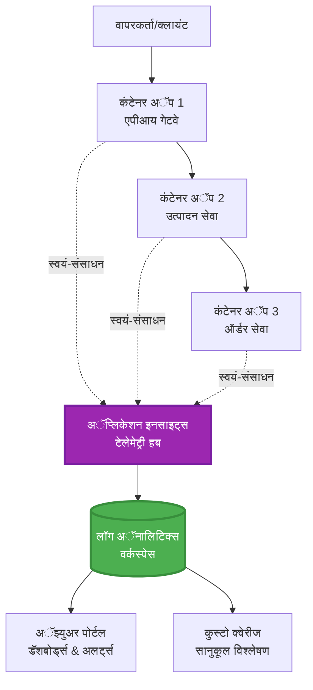
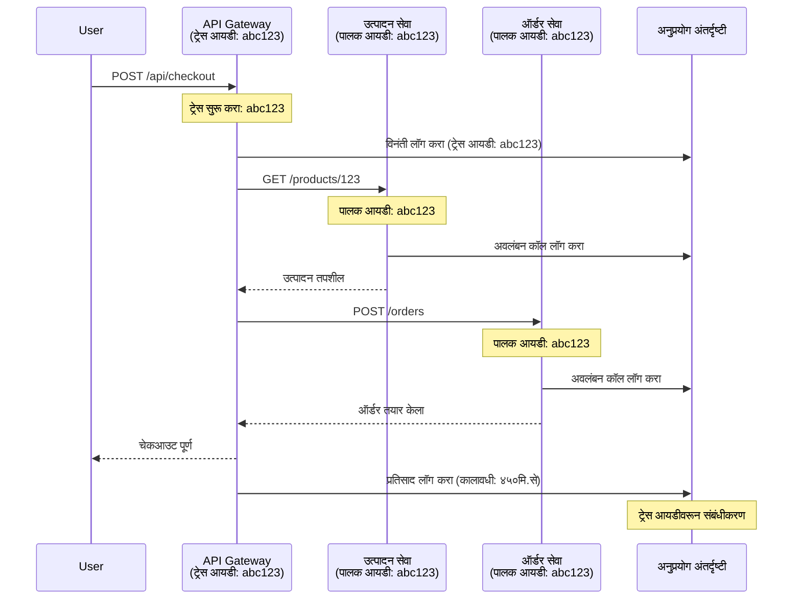

# AZD सह Application Insights एकीकरण

⏱️ **अंदाजे वेळ**: 40-50 मिनिटे | 💰 **खर्चाचा प्रभाव**: ~$5-15/माह | ⭐ **कठीणपणा**: मध्यम

**📚 शिकण्याचा मार्ग:**
- ← मागील: [Preflight Checks](preflight-checks.md) - प्री-डिप्लॉयमेंट व्हॅलिडेशन
- 🎯 **आपण येथे आहात**: Application Insights एकीकरण (मॉनिटरिंग, टेलिमेट्री, डिबगिंग)
- → पुढे: [Deployment Guide](../chapter-04-infrastructure/deployment-guide.md) - Azure वर डिप्लॉय करा
- 🏠 [कोर्स होम](../../README.md)

---

## आपण काय शिकाल

हा धडा पूर्ण केल्यावर, आपण करू शकाल:
- **Application Insights** AZD प्रोजेक्ट्समध्ये आपोआप एकीकरण
- मायक्रोसर्व्हिसेससाठी **वितरित ट्रेसिंग** कॉन्फिगर करा
- **कस्टम टेलिमेट्री** (मेट्रिक्स, इव्हेंट्स, अवलंबित्वे) अंमलात आणा
- रिअल-टाइम मॉनिटरिंगसाठी **लाईव्ह मेट्रिक्स** सेट करा
- AZD डिप्लॉयमेंटमधून **अलर्ट्स आणि डॅशबोर्ड** तयार करा
- **टेलिमेट्री क्वेरीज** सह प्रॉडक्शन समस्या डिबग करा
- **खर्च आणि सॅम्पलिंग** धोरणे ऑप्टिमाइझ करा
- **AI/LLM अनुप्रयोगांची** (टोकन्स, लेटेन्सी, खर्च) मॉनिटरिंग करा

## AZD सह Application Insights महत्त्वाचे का आहे

### आव्हान: प्रॉडक्शन ऑब्झर्वेबिलिटी

**Application Insights शिवाय:**
```
❌ No visibility into production behavior
❌ Manual log aggregation across services
❌ Reactive debugging (wait for customer complaints)
❌ No performance metrics
❌ Cannot trace requests across services
❌ Unknown failure rates and bottlenecks
```

**Application Insights + AZD सह:**
```
✅ Automatic telemetry collection
✅ Centralized logs from all services
✅ Proactive issue detection
✅ End-to-end request tracing
✅ Performance metrics and insights
✅ Real-time dashboards
✅ AZD provisions everything automatically
```

**सादृश्य**: Application Insights म्हणजे तुमच्या अनुप्रयोगासाठी "ब्लॅक बॉक्स" फ्लाइट रेकॉर्डर + कॉकपिट डॅशबोर्डसारखे आहे. तुम्हाला रिअल-टाइममध्ये काय होत आहे ते सगळे दिसते आणि तुम्ही कोणताही अडचणीचा प्रसंग पुन्हा पाहू शकता.

---

## आर्किटेक्चर अवलोकन

### AZD आर्किटेक्चरमध्ये Application Insights


### कोणते घटक आपोआप मॉनिटर होतात

| टेलिमेट्री प्रकार | काय टिपते | वापर प्रकरण |
|----------------|------------------|----------|
| **रिक्वेस्ट्स** | HTTP विनंत्या, स्थिती कोड, कालावधी | API कामगिरी मॉनिटरिंग |
| **अवलंबित्वे** | बाह्य कॉल्स (DB, APIs, स्टोरेज) | अडथळे ओळखणे |
| **अपवाद** | न हाताळलेल्या त्रुटी सह स्टॅक ट्रेसेस | अडचणी शोधणे |
| **कस्टम इव्हेंट्स** | बिझनेस इव्हेंट्स (साइन अप, खरेदी) | अ‍ॅनालिटिक्स आणि फनेल्स |
| **मेट्रिक्स** | कामगिरी काउंटर, कस्टम मेट्रिक्स | क्षमता नियोजन |
| **ट्रेस** | गंभीरतेसह लॉग मेसेजेस | डिबगिंग आणि ऑडिटिंग |
| **उपलब्धता** | अपटाइम आणि प्रतिसाद वेळ चाचण्या | SLA मॉनिटरिंग |

---

## पूर्वअट

### आवश्यक साधने

```bash
# Azure Developer CLI चे सत्यापन करा
azd version
# ✅ अपेक्षित: azd आवृत्ती 1.0.0 किंवा त्याहून अधिक

# Azure CLI चे सत्यापन करा
az --version
# ✅ अपेक्षित: azure-cli 2.50.0 किंवा त्याहून अधिक
```

### Azure आवश्यकता

- सक्रिय Azure सबस्क्रिप्शन
- खालील गोष्टी तयार करण्याची परवानगी:
  - Application Insights संसाधने
  - Log Analytics वर्कस्पेसेस
  - कंटेनर अॅप्स
  - रिसोर्स ग्रुप्स

### ज्ञान पूर्वअट

आपण खालील पूर्ण केलेले असले पाहिजे:
- [AZD बेसिक्स](../chapter-01-foundation/azd-basics.md) - मुख्य AZD संकल्पना
- [कॉन्फिगरेशन](../chapter-03-configuration/configuration.md) - वातावरण सेटअप
- [पहिला प्रोजेक्ट](../chapter-01-foundation/first-project.md) - मूलभूत डिप्लॉयमेंट

---

## धडा 1: AZD सह आपोआप Application Insights

### AZD Application Insights कसे प्रदान करते

AZD आपले डिप्लॉय केल्यावर Application Insights आपोआप तयार व कॉन्फिगर करते. ते कसे कार्य करते ते पाहूया.

### प्रोजेक्ट रचना

```
monitored-app/
├── azure.yaml                     # AZD configuration
├── infra/
│   ├── main.bicep                # Main infrastructure
│   ├── core/
│   │   └── monitoring.bicep      # Application Insights + Log Analytics
│   └── app/
│       └── api.bicep             # Container App with monitoring
└── src/
    ├── app.py                    # Application with telemetry
    ├── requirements.txt
    └── Dockerfile
```

---

### चरण 1: AZD कॉन्फिगर करा (azure.yaml)

**फाईल: `azure.yaml`**

```yaml
name: monitored-app
metadata:
  template: monitored-app@1.0.0

services:
  api:
    project: ./src
    language: python
    host: containerapp

# AZD automatically provisions monitoring!
```

**इतकेच!** AZD आपोआप Application Insights तयार करेल. बेसिक मॉनिटरिंगसाठी अतिरिक्त कॉन्फिगरेशनची गरज नाही.

---

### चरण 2: मॉनिटरिंग इन्फ्रास्ट्रक्चर (Bicep)

**फाईल: `infra/core/monitoring.bicep`**

```bicep
param logAnalyticsName string
param applicationInsightsName string
param location string = resourceGroup().location
param tags object = {}

// Log Analytics Workspace (required for Application Insights)
resource logAnalytics 'Microsoft.OperationalInsights/workspaces@2022-10-01' = {
  name: logAnalyticsName
  location: location
  tags: tags
  properties: {
    sku: {
      name: 'PerGB2018'  // Pay-as-you-go pricing
    }
    retentionInDays: 30  // Keep logs for 30 days
    features: {
      enableLogAccessUsingOnlyResourcePermissions: true
    }
  }
}

// Application Insights
resource applicationInsights 'Microsoft.Insights/components@2020-02-02' = {
  name: applicationInsightsName
  location: location
  tags: tags
  kind: 'web'
  properties: {
    Application_Type: 'web'
    WorkspaceResourceId: logAnalytics.id
    IngestionMode: 'LogAnalytics'
    publicNetworkAccessForIngestion: 'Enabled'
    publicNetworkAccessForQuery: 'Enabled'
  }
}

// Outputs for Container Apps
output logAnalyticsWorkspaceId string = logAnalytics.id
output logAnalyticsWorkspaceName string = logAnalytics.name
output applicationInsightsConnectionString string = applicationInsights.properties.ConnectionString
output applicationInsightsInstrumentationKey string = applicationInsights.properties.InstrumentationKey
output applicationInsightsName string = applicationInsights.name
```

---

### चरण 3: कंटेनर अॅपला Application Insights शी कनेक्ट करा

**फाईल: `infra/app/api.bicep`**

```bicep
param name string
param location string
param tags object = {}
param containerAppsEnvironmentName string
param applicationInsightsConnectionString string

resource containerApp 'Microsoft.App/containerApps@2023-05-01' = {
  name: name
  location: location
  tags: tags
  properties: {
    configuration: {
      ingress: {
        external: true
        targetPort: 8000
      }
      secrets: [
        {
          name: 'appinsights-connection-string'
          value: applicationInsightsConnectionString
        }
      ]
    }
    template: {
      containers: [
        {
          name: 'api'
          image: 'myregistry.azurecr.io/api:latest'
          resources: {
            cpu: json('0.5')
            memory: '1Gi'
          }
          env: [
            {
              name: 'APPLICATIONINSIGHTS_CONNECTION_STRING'
              secretRef: 'appinsights-connection-string'
            }
            {
              name: 'APPLICATIONINSIGHTS_ENABLED'
              value: 'true'
            }
          ]
        }
      ]
    }
  }
}

output uri string = 'https://${containerApp.properties.configuration.ingress.fqdn}'
```

---

### चरण 4: टेलिमेट्री सह अनुप्रयोग कोड

**फाईल: `src/app.py`**

```python
from flask import Flask, request, jsonify
from opencensus.ext.azure.log_exporter import AzureLogHandler
from opencensus.ext.azure.trace_exporter import AzureExporter
from opencensus.ext.flask.flask_middleware import FlaskMiddleware
from opencensus.trace.samplers import ProbabilitySampler
import logging
import os

app = Flask(__name__)

# Application Insights कनेक्शन स्ट्रिंग मिळवा
connection_string = os.environ.get('APPLICATIONINSIGHTS_CONNECTION_STRING')

if connection_string:
    # वितरित ट्रेसिंग कॉन्फिगर करा
    middleware = FlaskMiddleware(
        app,
        exporter=AzureExporter(connection_string=connection_string),
        sampler=ProbabilitySampler(rate=1.0)  # विकासासाठी 100% सॅम्पलिंग
    )
    
    # लॉगिंग कॉन्फिगर करा
    logger = logging.getLogger(__name__)
    logger.addHandler(AzureLogHandler(connection_string=connection_string))
    logger.setLevel(logging.INFO)
    
    print("✅ Application Insights enabled")
else:
    logger = logging.getLogger(__name__)
    logger.setLevel(logging.INFO)
    print("⚠️ Application Insights not configured")

@app.route('/health')
def health():
    logger.info('Health check endpoint called')
    return jsonify({'status': 'healthy', 'monitoring': 'enabled'})

@app.route('/api/products')
def get_products():
    logger.info('Fetching products')
    
    # डेटाबेस कॉलचे अनुकरण करा (स्वतःहून अवलंबित्व म्हणून ट्रॅक केले जाते)
    products = [
        {'id': 1, 'name': 'Laptop', 'price': 999.99},
        {'id': 2, 'name': 'Mouse', 'price': 29.99},
        {'id': 3, 'name': 'Keyboard', 'price': 79.99}
    ]
    
    logger.info(f'Returned {len(products)} products')
    return jsonify(products)

@app.route('/api/error-test')
def error_test():
    """Test error tracking"""
    logger.error('Testing error tracking')
    try:
        raise ValueError('This is a test exception')
    except Exception as e:
        logger.exception('Exception occurred in error-test endpoint')
        return jsonify({'error': str(e)}), 500

@app.route('/api/slow')
def slow_endpoint():
    """Test performance tracking"""
    import time
    logger.info('Slow endpoint called')
    time.sleep(3)  # मंद ऑपरेशनचे अनुकरण करा
    logger.warning('Endpoint took 3 seconds to respond')
    return jsonify({'message': 'Slow operation completed'})

if __name__ == '__main__':
    app.run(host='0.0.0.0', port=8000)
```

**फाईल: `src/requirements.txt`**

```txt
Flask==3.0.0
opencensus-ext-azure==1.1.13
opencensus-ext-flask==0.8.1
gunicorn==21.2.0
```

---

### चरण 5: डिप्लॉय करा आणि तपासा

```bash
# AZD प्रारंभ करा
azd init

# तैनात करा (स्वतःहून Application Insights प्रदान करते)
azd up

# अॅप URL मिळवा
APP_URL=$(azd env get-values | grep API_URL | cut -d '=' -f2 | tr -d '"')

# दूरचित्रण तयार करा
curl $APP_URL/health
curl $APP_URL/api/products
curl $APP_URL/api/error-test
curl $APP_URL/api/slow
```

**✅ अपेक्षित आउटपुट:**
```json
{
  "status": "healthy",
  "monitoring": "enabled"
}
```

---

### चरण 6: Azure पोर्टलमध्ये टेलिमेट्री पहा

```bash
# अ‍ॅप्लिकेशन इनसाइट्स तपशील मिळवा
azd env get-values | grep APPLICATIONINSIGHTS

# Azure पोर्टलमध्ये उघडा
az monitor app-insights component show \
  --app $(azd env get-values | grep APPLICATIONINSIGHTS_NAME | cut -d '=' -f2 | tr -d '"') \
  --resource-group $(azd env get-values | grep AZURE_RESOURCE_GROUP | cut -d '=' -f2 | tr -d '"') \
  --query "appId" -o tsv
```

**Azure पोर्टल → Application Insights → Transaction Search येथे जा**

आपल्याला खालील दिसेल:
- ✅ HTTP विनंत्या आणि स्थिती कोड्ससह
- ✅ `/api/slow` साठी विनंती कालावधी (3+ सेकंद)
- ✅ `/api/error-test` कडील अपवाद तपशील
- ✅ कस्टम लॉग मेसेजेस

---

## धडा 2: कस्टम टेलिमेट्री आणि इव्हेंट्स

### बिझनेस इव्हेंट्स ट्रॅक करा

चला बिझनेस-क्लिष्टिकल इव्हेंट्ससाठी कस्टम टेलिमेट्री जोड़ूया.

**फाईल: `src/telemetry.py`**

```python
from opencensus.ext.azure import metrics_exporter
from opencensus.stats import aggregation as aggregation_module
from opencensus.stats import measure as measure_module
from opencensus.stats import stats as stats_module
from opencensus.stats import view as view_module
from opencensus.tags import tag_map as tag_map_module
from opencensus.ext.azure.log_exporter import AzureLogHandler
from opencensus.ext.azure.trace_exporter import AzureExporter
from opencensus.trace import tracer as tracer_module
import logging
import os

class TelemetryClient:
    """Custom telemetry client for Application Insights"""
    
    def __init__(self, connection_string=None):
        self.connection_string = connection_string or os.environ.get('APPLICATIONINSIGHTS_CONNECTION_STRING')
        
        if not self.connection_string:
            print("⚠️ Application Insights connection string not found")
            return
        
        # लॉगर सेटअप करा
        self.logger = logging.getLogger(__name__)
        self.logger.addHandler(AzureLogHandler(connection_string=self.connection_string))
        self.logger.setLevel(logging.INFO)
        
        # मेट्रिक्स निर्यातक सेटअप करा
        self.stats = stats_module.stats
        self.view_manager = self.stats.view_manager
        self.stats_recorder = self.stats.stats_recorder
        
        exporter = metrics_exporter.new_metrics_exporter(
            connection_string=self.connection_string
        )
        self.view_manager.register_exporter(exporter)
        
        # ट्रेसर सेटअप करा
        self.tracer = tracer_module.Tracer(
            exporter=AzureExporter(connection_string=self.connection_string)
        )
        
        print("✅ Custom telemetry client initialized")
    
    def track_event(self, event_name: str, properties: dict = None):
        """Track custom business event"""
        properties = properties or {}
        self.logger.info(
            f"CustomEvent: {event_name}",
            extra={
                'custom_dimensions': {
                    'event_name': event_name,
                    **properties
                }
            }
        )
    
    def track_metric(self, metric_name: str, value: float, properties: dict = None):
        """Track custom metric"""
        properties = properties or {}
        self.logger.info(
            f"CustomMetric: {metric_name} = {value}",
            extra={
                'custom_dimensions': {
                    'metric_name': metric_name,
                    'value': value,
                    **properties
                }
            }
        )
    
    def track_dependency(self, name: str, dependency_type: str, duration: float, success: bool):
        """Track external dependency call"""
        with self.tracer.span(name=name) as span:
            span.add_attribute('dependency.type', dependency_type)
            span.add_attribute('duration', duration)
            span.add_attribute('success', success)

# जागतिक टेलीमेट्री क्लायंट
telemetry = TelemetryClient()
```

### कस्टम इव्हेंट्ससह अनुप्रयोग अद्यतनित करा

**फाईल: `src/app.py` (सुधारित)**

```python
from flask import Flask, request, jsonify
from telemetry import telemetry
import time
import random

app = Flask(__name__)

@app.route('/api/purchase', methods=['POST'])
def purchase():
    """Track purchase event with custom telemetry"""
    data = request.json
    product_id = data.get('product_id')
    quantity = data.get('quantity', 1)
    price = data.get('price', 0)
    
    # व्यवसाय घटना ट्रॅक करा
    telemetry.track_event('Purchase', {
        'product_id': product_id,
        'quantity': quantity,
        'total_amount': price * quantity,
        'user_id': request.headers.get('X-User-Id', 'anonymous')
    })
    
    # महसूल मेट्रिक ट्रॅक करा
    telemetry.track_metric('Revenue', price * quantity, {
        'product_id': product_id,
        'currency': 'USD'
    })
    
    return jsonify({
        'order_id': f'ORD-{random.randint(1000, 9999)}',
        'status': 'confirmed',
        'total': price * quantity
    })

@app.route('/api/search')
def search():
    """Track search queries"""
    query = request.args.get('q', '')
    
    start_time = time.time()
    
    # शोधाची नक्कल करा (खरा डेटाबेस क्वेरी असेल)
    results = [{'id': 1, 'name': f'Result for {query}'}]
    
    duration = (time.time() - start_time) * 1000  # मिलीसेकंदांमध्ये रुपांतर करा
    
    # शोध घटना ट्रॅक करा
    telemetry.track_event('Search', {
        'query': query,
        'results_count': len(results),
        'duration_ms': duration
    })
    
    # शोध कामगिरी मेट्रिक ट्रॅक करा
    telemetry.track_metric('SearchDuration', duration, {
        'query_length': len(query)
    })
    
    return jsonify({'results': results, 'count': len(results)})

@app.route('/api/external-call')
def external_call():
    """Track external API dependency"""
    import requests
    
    start_time = time.time()
    success = True
    
    try:
        # बाह्य API कॉलची नक्कल करा
        response = requests.get('https://api.example.com/data', timeout=5)
        result = response.json()
    except Exception as e:
        success = False
        result = {'error': str(e)}
    
    duration = (time.time() - start_time) * 1000
    
    # अवलंबित्व ट्रॅक करा
    telemetry.track_dependency(
        name='ExternalAPI',
        dependency_type='HTTP',
        duration=duration,
        success=success
    )
    
    return jsonify(result)

if __name__ == '__main__':
    app.run(host='0.0.0.0', port=8000)
```

### कस्टम टेलिमेट्री चाचणी करा

```bash
# खरेदी कार्यक्रम ट्रॅक करा
curl -X POST $APP_URL/api/purchase \
  -H "Content-Type: application/json" \
  -H "X-User-Id: user123" \
  -d '{"product_id": 1, "quantity": 2, "price": 29.99}'

# शोध कार्यक्रम ट्रॅक करा
curl "$APP_URL/api/search?q=laptop"

# बाह्य अवलंबित्व ट्रॅक करा
curl $APP_URL/api/external-call
```

**Azure पोर्टलमध्ये पहा:**

Application Insights → Logs येथे जा, नंतर चालवा:

```kusto
// View purchase events
traces
| where customDimensions.event_name == "Purchase"
| project 
    timestamp,
    product_id = tostring(customDimensions.product_id),
    total_amount = todouble(customDimensions.total_amount),
    user_id = tostring(customDimensions.user_id)
| order by timestamp desc

// View revenue metrics
traces
| where customDimensions.metric_name == "Revenue"
| summarize TotalRevenue = sum(todouble(customDimensions.value)) by bin(timestamp, 1h)
| render timechart

// View search performance
traces
| where customDimensions.event_name == "Search"
| summarize 
    AvgDuration = avg(todouble(customDimensions.duration_ms)),
    SearchCount = count()
  by bin(timestamp, 5m)
| render timechart
```

---

## धडा 3: मायक्रोसर्व्हिसेससाठी वितरित ट्रेसिंग

### क्रॉस-सर्व्हिस ट्रेसिंग सक्षम करा

मायक्रोसर्व्हिसेससाठी, Application Insights आपोआप सर्व सेवांतील विनंत्यांची संबंधित माहिती जुळवते.

**फाईल: `infra/main.bicep`**

```bicep
targetScope = 'subscription'

param environmentName string
param location string = 'eastus'

var tags = { 'azd-env-name': environmentName }

resource rg 'Microsoft.Resources/resourceGroups@2021-04-01' = {
  name: 'rg-${environmentName}'
  location: location
  tags: tags
}

// Monitoring (shared by all services)
module monitoring './core/monitoring.bicep' = {
  name: 'monitoring'
  scope: rg
  params: {
    logAnalyticsName: 'log-${environmentName}'
    applicationInsightsName: 'appi-${environmentName}'
    location: location
    tags: tags
  }
}

// API Gateway
module apiGateway './app/api-gateway.bicep' = {
  name: 'api-gateway'
  scope: rg
  params: {
    name: 'ca-gateway-${environmentName}'
    location: location
    tags: union(tags, { 'azd-service-name': 'gateway' })
    applicationInsightsConnectionString: monitoring.outputs.applicationInsightsConnectionString
  }
}

// Product Service
module productService './app/product-service.bicep' = {
  name: 'product-service'
  scope: rg
  params: {
    name: 'ca-products-${environmentName}'
    location: location
    tags: union(tags, { 'azd-service-name': 'products' })
    applicationInsightsConnectionString: monitoring.outputs.applicationInsightsConnectionString
  }
}

// Order Service
module orderService './app/order-service.bicep' = {
  name: 'order-service'
  scope: rg
  params: {
    name: 'ca-orders-${environmentName}'
    location: location
    tags: union(tags, { 'azd-service-name': 'orders' })
    applicationInsightsConnectionString: monitoring.outputs.applicationInsightsConnectionString
  }
}

output APPLICATIONINSIGHTS_CONNECTION_STRING string = monitoring.outputs.applicationInsightsConnectionString
output GATEWAY_URL string = apiGateway.outputs.uri
```

### एंड-टू-एंड ट्रॅन्झॅक्शन पहा


**एंड-टू-एंड ट्रेससाठी क्वेरी:**

```kusto
// Find complete request flow
let traceId = "abc123...";  // Get from response header
dependencies
| union requests
| where operation_Id == traceId
| project 
    timestamp,
    type = itemType,
    name,
    duration,
    success,
    cloud_RoleName
| order by timestamp asc
```

---

## धडा 4: लाईव्ह मेट्रिक्स आणि रिअल-टाइम मॉनिटरिंग

### लाईव्ह मेट्रिक्स स्ट्रीम सक्षम करा

लाईव्ह मेट्रिक्स <1 सेकंद उशीरासह रिअल-टाइम टेलिमेट्री पुरवते.

**लाईव्ह मेट्रिक्समध्ये प्रवेश:**

```bash
# अर्ज अंतर्दृष्टी संसाधन मिळवा
APPI_NAME=$(azd env get-values | grep APPLICATIONINSIGHTS_NAME | cut -d '=' -f2 | tr -d '"')

# संसाधन समूह मिळवा
RG_NAME=$(azd env get-values | grep AZURE_RESOURCE_GROUP | cut -d '=' -f2 | tr -d '"')

echo "Navigate to: Azure Portal → Resource Groups → $RG_NAME → $APPI_NAME → Live Metrics"
```

**रिअल-टाइममध्ये तुम्हाला काय दिसेल:**
- ✅ येणाऱ्या विनंत्यांची दर (requests/sec)
- ✅ बाह्य अवलंबित्व कॉल्स
- ✅ अपवादांची संख्या
- ✅ CPU व मेमरी वापर
- ✅ सक्रिय सर्व्हर संख्या
- ✅ नमुना टेलिमेट्री

### चाचणीसाठी लोड तयार करा

```bash
# लाईव्ह मेट्रिक्स पाहण्यासाठी लोड तयार करा
for i in {1..100}; do
  curl $APP_URL/api/products &
  curl $APP_URL/api/search?q=test$i &
done

# Azure पोर्टलमध्ये लाईव्ह मेट्रिक्स पाहा
# तुम्हाला विनंती दर वाढल्याचे दिसेल
```

---

## व्यावहारिक सराव

### सराव 1: अलर्ट सेट करा ⭐⭐ (मध्यम)

**उद्दिष्ट:** उच्च त्रुटी दर आणि मंद प्रतिसादासाठी अलर्ट तयार करा.

**चरण:**

1. **त्रुटी दरासाठी अलर्ट तयार करा:**

```bash
# अनुप्रयोग अंतर्दृष्टी संसाधन आयडी मिळवा
APPI_ID=$(az monitor app-insights component show \
  --app $APPI_NAME \
  --resource-group $RG_NAME \
  --query "id" -o tsv)

# अयशस्वी विनंत्यांसाठी मेट्रिक सूचना तयार करा
az monitor metrics alert create \
  --name "High-Error-Rate" \
  --resource-group $RG_NAME \
  --scopes $APPI_ID \
  --condition "count requests/failed > 10" \
  --window-size 5m \
  --evaluation-frequency 1m \
  --description "Alert when error rate exceeds 10 per 5 minutes"
```

2. **मंद प्रतिसादांसाठी अलर्ट तयार करा:**

```bash
az monitor metrics alert create \
  --name "Slow-Responses" \
  --resource-group $RG_NAME \
  --scopes $APPI_ID \
  --condition "avg requests/duration > 3000" \
  --window-size 5m \
  --evaluation-frequency 1m \
  --description "Alert when average response time exceeds 3 seconds"
```

3. **Bicep द्वारे अलर्ट तयार करा (AZD साठी प्राधान्य):**

**फाईल: `infra/core/alerts.bicep`**

```bicep
param applicationInsightsId string
param actionGroupId string = ''
param location string = resourceGroup().location

// High error rate alert
resource errorRateAlert 'Microsoft.Insights/metricAlerts@2018-03-01' = {
  name: 'high-error-rate'
  location: 'global'
  properties: {
    description: 'Alert when error rate exceeds threshold'
    severity: 2
    enabled: true
    scopes: [
      applicationInsightsId
    ]
    evaluationFrequency: 'PT1M'
    windowSize: 'PT5M'
    criteria: {
      'odata.type': 'Microsoft.Azure.Monitor.SingleResourceMultipleMetricCriteria'
      allOf: [
        {
          name: 'Error rate'
          metricName: 'requests/failed'
          operator: 'GreaterThan'
          threshold: 10
          timeAggregation: 'Count'
        }
      ]
    }
    actions: actionGroupId != '' ? [
      {
        actionGroupId: actionGroupId
      }
    ] : []
  }
}

// Slow response alert
resource slowResponseAlert 'Microsoft.Insights/metricAlerts@2018-03-01' = {
  name: 'slow-responses'
  location: 'global'
  properties: {
    description: 'Alert when response time is too high'
    severity: 3
    enabled: true
    scopes: [
      applicationInsightsId
    ]
    evaluationFrequency: 'PT1M'
    windowSize: 'PT5M'
    criteria: {
      'odata.type': 'Microsoft.Azure.Monitor.SingleResourceMultipleMetricCriteria'
      allOf: [
        {
          name: 'Response duration'
          metricName: 'requests/duration'
          operator: 'GreaterThan'
          threshold: 3000
          timeAggregation: 'Average'
        }
      ]
    }
  }
}

output errorAlertId string = errorRateAlert.id
output slowResponseAlertId string = slowResponseAlert.id
```

4. **अलर्ट्सची चाचणी करा:**

```bash
# त्रुटी निर्माण करा
for i in {1..20}; do
  curl $APP_URL/api/error-test
done

# मंद प्रतिसाद निर्माण करा
for i in {1..10}; do
  curl $APP_URL/api/slow
done

# सतर्कतेची स्थिती तपासा (5-10 मिनिटे थांबा)
az monitor metrics alert list \
  --resource-group $RG_NAME \
  --query "[].{Name:name, Enabled:enabled, State:properties.enabled}" \
  --output table
```

**✅ यशस्वी निकष:**
- ✅ अलर्ट्स यशस्वीपणे तयार झाले
- ✅ थ्रेशोल्ड ओलांडल्यावर अलर्ट्स सक्रिय झाले
- ✅ Azure पोर्टलमध्ये अलर्ट इतिहास पाहता येतो
- ✅ AZD डिप्लॉयमेंटशी एकत्रित

**वेळ:** 20-25 मिनिटे

---

### सराव 2: कस्टम डॅशबोर्ड तयार करा ⭐⭐ (मध्यम)

**उद्दिष्ट:** महत्त्वाच्या अनुप्रयोग मेट्रिक्ससह डॅशबोर्ड तयार करा.

**चरण:**

1. **Azure पोर्टलद्वारे डॅशबोर्ड तयार करा:**

Azure पोर्टल → Dashboards → New Dashboard येथे जा

2. **महत्त्वाच्या मेट्रिक्ससाठी टाइल्स जोडा:**

- मागील 24 तासातील विनंती संख्या
- सरासरी प्रतिसाद वेळ
- त्रुटी दर
- टॉप 5 मंद ऑपरेशन्स
- वापरकर्त्यांची भौगोलिक वितरण

3. **Bicep द्वारे डॅशबोर्ड तयार करा:**

**फाईल: `infra/core/dashboard.bicep`**

```bicep
param dashboardName string
param applicationInsightsId string
param location string = resourceGroup().location

resource dashboard 'Microsoft.Portal/dashboards@2020-09-01-preview' = {
  name: dashboardName
  location: location
  properties: {
    lenses: [
      {
        order: 0
        parts: [
          // Request count
          {
            position: { x: 0, y: 0, rowSpan: 4, colSpan: 6 }
            metadata: {
              type: 'Extension/Microsoft_OperationsManagementSuite_Workspace/PartType/LogsDashboardPart'
              inputs: [
                {
                  name: 'resourceId'
                  value: applicationInsightsId
                }
                {
                  name: 'query'
                  value: '''
                    requests
                    | summarize RequestCount = count() by bin(timestamp, 1h)
                    | render timechart
                  '''
                }
              ]
            }
          }
          // Error rate
          {
            position: { x: 6, y: 0, rowSpan: 4, colSpan: 6 }
            metadata: {
              type: 'Extension/Microsoft_OperationsManagementSuite_Workspace/PartType/LogsDashboardPart'
              inputs: [
                {
                  name: 'resourceId'
                  value: applicationInsightsId
                }
                {
                  name: 'query'
                  value: '''
                    requests
                    | summarize 
                        Total = count(),
                        Failed = countif(success == false)
                    | extend ErrorRate = (Failed * 100.0) / Total
                    | project ErrorRate
                  '''
                }
              ]
            }
          }
        ]
      }
    ]
  }
}

output dashboardId string = dashboard.id
```

4. **डॅशबोर्ड डिप्लॉय करा:**

```bash
# मुख्य.bicep मध्ये जोडा
module dashboard './core/dashboard.bicep' = {
  name: 'dashboard'
  scope: rg
  params: {
    dashboardName: 'dashboard-${environmentName}'
    applicationInsightsId: monitoring.outputs.applicationInsightsId
    location: location
  }
}

# तैनात करा
azd up
```

**✅ यशस्वी निकष:**
- ✅ डॅशबोर्ड महत्त्वाचे मेट्रिक्स दर्शवितो
- ✅ Azure पोर्टल होमवर पिन करू शकता
- ✅ रिअल-टाइम अपडेट्स
- ✅ AZD द्वारे डिप्लॉय करण्यायोग्य

**वेळ:** 25-30 मिनिटे

---

### सराव 3: AI/LLM अनुप्रयोग मॉनिटर करा ⭐⭐⭐ (उन्नत)

**उद्दिष्ट:** Microsoft Foundry Models वापर (टोकन्स, खर्च, लेटेन्सी) ट्रॅक करा.

**चरण:**

1. **AI मॉनिटरिंग रॅपर तयार करा:**

**फाईल: `src/ai_telemetry.py`**

```python
from telemetry import telemetry
from openai import AzureOpenAI
import time

class MonitoredAzureOpenAI:
    """Microsoft Foundry Models client with automatic telemetry"""
    
    def __init__(self, api_key, endpoint, api_version="2024-02-01"):
        self.client = AzureOpenAI(
            api_key=api_key,
            api_version=api_version,
            azure_endpoint=endpoint
        )
    
    def chat_completion(self, model: str, messages: list, **kwargs):
        """Track chat completion with telemetry"""
        start_time = time.time()
        
        try:
            # Microsoft Foundry मॉडेल्स कॉल करा
            response = self.client.chat.completions.create(
                model=model,
                messages=messages,
                **kwargs
            )
            
            duration = (time.time() - start_time) * 1000  # ms
            
            # वापर काढा
            usage = response.usage
            prompt_tokens = usage.prompt_tokens
            completion_tokens = usage.completion_tokens
            total_tokens = usage.total_tokens
            
            # खर्च मोजा (gpt-4.1 किंमत)
            prompt_cost = (prompt_tokens / 1000) * 0.03  # प्रति 1K टोकन $0.03
            completion_cost = (completion_tokens / 1000) * 0.06  # प्रति 1K टोकन $0.06
            total_cost = prompt_cost + completion_cost
            
            # सानुकूल कार्यक्रम ट्रॅक करा
            telemetry.track_event('OpenAI_Request', {
                'model': model,
                'prompt_tokens': prompt_tokens,
                'completion_tokens': completion_tokens,
                'total_tokens': total_tokens,
                'duration_ms': duration,
                'cost_usd': total_cost,
                'success': True
            })
            
            # मेट्रिक्स ट्रॅक करा
            telemetry.track_metric('OpenAI_Tokens', total_tokens, {
                'model': model,
                'type': 'total'
            })
            
            telemetry.track_metric('OpenAI_Cost', total_cost, {
                'model': model,
                'currency': 'USD'
            })
            
            telemetry.track_metric('OpenAI_Duration', duration, {
                'model': model
            })
            
            return response
            
        except Exception as e:
            duration = (time.time() - start_time) * 1000
            
            telemetry.track_event('OpenAI_Request', {
                'model': model,
                'duration_ms': duration,
                'success': False,
                'error': str(e)
            })
            
            raise
```

2. **मॉनिटर केलेला क्लायंट वापरा:**

```python
from flask import Flask, request, jsonify
from ai_telemetry import MonitoredAzureOpenAI
import os

app = Flask(__name__)

# मॉनिटर केलेला OpenAI क्लायंट प्रारंभ करा
openai_client = MonitoredAzureOpenAI(
    api_key=os.environ['AZURE_OPENAI_API_KEY'],
    endpoint=os.environ['AZURE_OPENAI_ENDPOINT']
)

@app.route('/api/chat', methods=['POST'])
def chat():
    data = request.json
    user_message = data.get('message')
    
    # स्वयंचलित मॉनिटरिंगसह कॉल करा
    response = openai_client.chat_completion(
        model='gpt-4.1',
        messages=[
            {'role': 'user', 'content': user_message}
        ]
    )
    
    return jsonify({
        'response': response.choices[0].message.content,
        'tokens': response.usage.total_tokens
    })
```

3. **AI मेट्रिक्ससाठी क्वेरी करा:**

```kusto
// Total AI spend over time
traces
| where customDimensions.event_name == "OpenAI_Request"
| where customDimensions.success == "True"
| summarize TotalCost = sum(todouble(customDimensions.cost_usd)) by bin(timestamp, 1h)
| render timechart

// Token usage by model
traces
| where customDimensions.event_name == "OpenAI_Request"
| summarize 
    TotalTokens = sum(toint(customDimensions.total_tokens)),
    RequestCount = count()
  by Model = tostring(customDimensions.model)

// Average latency
traces
| where customDimensions.event_name == "OpenAI_Request"
| summarize AvgDuration = avg(todouble(customDimensions.duration_ms))
| project AvgDurationSeconds = AvgDuration / 1000

// Cost per request
traces
| where customDimensions.event_name == "OpenAI_Request"
| extend Cost = todouble(customDimensions.cost_usd)
| summarize 
    TotalCost = sum(Cost),
    RequestCount = count(),
    AvgCostPerRequest = avg(Cost)
```

**✅ यशस्वी निकष:**
- ✅ प्रत्येक OpenAI कॉल आपोआप ट्रॅक होतो
- ✅ टोकन वापर व खर्च दिसतात
- ✅ लेटेन्सी मॉनिटर केले जात आहे
- ✅ बजेट अलर्ट सेट करू शकता

**वेळ:** 35-45 मिनिटे

---

## खर्च ऑप्टिमायझेशन

### सॅम्पलिंग धोरणे

टेलिमेट्रीचे सॅम्पलिंग करून खर्च नियंत्रित करा:

```python
from opencensus.trace.samplers import ProbabilitySampler

# विकास: 100% नमुना
sampler = ProbabilitySampler(rate=1.0)

# उत्पादन: 10% नमुना (खर्च 90% ने कमी करा)
sampler = ProbabilitySampler(rate=0.1)

# अनुकूली नमुना (स्वतः समायोजित करतो)
from opencensus.trace.samplers import AdaptiveSampler
sampler = AdaptiveSampler()
```

**Bicep मध्ये:**

```bicep
resource applicationInsights 'Microsoft.Insights/components@2020-02-02' = {
  name: applicationInsightsName
  properties: {
    SamplingPercentage: 10  // 10% sampling
  }
}
```

### डेटा ठेवण्याची कालावधी

```bicep
resource logAnalytics 'Microsoft.OperationalInsights/workspaces@2022-10-01' = {
  name: logAnalyticsName
  properties: {
    retentionInDays: 30  // Minimum (cheapest)
    // Options: 30, 31, 60, 90, 120, 180, 270, 365, 550, 730
  }
}
```

### मासिक खर्च अंदाज

| डेटा प्रमाण | ठेवण्याचा कालावधी | मासिक खर्च |
|-------------|----------------|-------------|
| 1 GB/माह | 30 दिवस | ~$2-5 |
| 5 GB/माह | 30 दिवस | ~$10-15 |
| 10 GB/माह | 90 दिवस | ~$25-40 |
| 50 GB/माह | 90 दिवस | ~$100-150 |

**फ्री टियर**: 5 GB/माह समाविष्ट

---

## ज्ञान तपासणी

### 1. बेसिक एकीकरण ✓

आपले ज्ञान तपासा:

- [ ] **Q1**: AZD Application Insights कसे प्रदान करते?
  - **A**: `infra/core/monitoring.bicep` मधील Bicep टेम्पलेट्सद्वारे आपोआप

- [ ] **Q2**: Application Insights सक्षम करणारा पर्यावरण बदल कोणता आहे?
  - **A**: `APPLICATIONINSIGHTS_CONNECTION_STRING`

- [ ] **Q3**: मुख्य टेलिमेट्री प्रकार कोणते आहेत?
  - **A**: रिक्वेस्ट्स (HTTP कॉल्स), अवलंबित्वे (बाह्य कॉल्स), अपवाद (त्रुटी)

**हाताने तपासणी:**
```bash
# तपासा की Application Insights कॉन्फिगर केले आहे का
azd env get-values | grep APPLICATIONINSIGHTS

# टेलिमेट्री वाहतूक होत आहे का याची पडताळणी करा
az monitor app-insights metrics show \
  --app $APPI_NAME \
  --resource-group $RG_NAME \
  --metric "requests/count"
```

---

### 2. कस्टम टेलिमेट्री ✓

आपले ज्ञान तपासा:

- [ ] **Q1**: कस्टम बिझनेस इव्हेंट्स कसे ट्रॅक करता?
  - **A**: `custom_dimensions` सह लॉगर वापरून किंवा `TelemetryClient.track_event()` वापरून

- [ ] **Q2**: इव्हेंट्स आणि मेट्रिक्स यांचा फरक काय आहे?
  - **A**: इव्हेंट्स ही स्वतंत्र घटना आहेत, मेट्रिक्स ही संख्यात्मक मोजमापे आहेत

- [ ] **Q3**: सेवांमधील टेलिमेट्री कशी संबंधित करते?
  - **A**: Application Insights आपोआप `operation_Id` वापरते संबंधित करण्यासाठी

**हाताने तपासणी:**
```kusto
// Verify custom events
traces
| where customDimensions.event_name != ""
| summarize count() by tostring(customDimensions.event_name)
```

---

### 3. प्रॉडक्शन मॉनिटरिंग ✓

आपले ज्ञान तपासा:

- [ ] **Q1**: सॅम्पलिंग काय आहे व ते का वापरते?
  - **A**: सॅम्पलिंग डेटा प्रमाण कमी करते (आणि खर्चही) जेणेकरून टेलिमेट्रीचा काही प्रमाणावरच समावेश होतो

- [ ] **Q2**: अलर्ट्स कसे सेट करिता येतात?
  - **A**: Bicep किंवा Azure पोर्टलमध्ये Application Insights मेट्रिक्सवर आधारित मेट्रिक अलर्ट्स वापरून

- [ ] **Q3**: Log Analytics आणि Application Insights मध्ये फरक काय आहे?
  - **A**: Application Insights डेटा Log Analytics वर्कस्पेसमध्ये संग्रहित करतो; App Insights अनुप्रयोग-विशिष्ट दृष्टीकोन प्रदान करतो

**हाताने तपासणी:**
```bash
# नमुना घेण्याची संरचना तपासा
az monitor app-insights component show \
  --app $APPI_NAME \
  --resource-group $RG_NAME \
  --query "properties.SamplingPercentage"
```

---

## सर्वोत्तम पद्धती

### ✅ करावे:

1. **संबंधित IDs वापरा**
   ```python
   logger.info('Processing order', extra={
       'custom_dimensions': {
           'order_id': order_id,
           'user_id': user_id
       }
   })
   ```

2. **महत्त्वाच्या मेट्रिक्ससाठी अलर्ट सेट करा**
   ```bicep
   // Error rate, slow responses, availability
   ```

3. **रचनेच्या स्वरूपात लॉगिंग वापरा**
   ```python
   # ✅ चांगले: संरचित
   logger.info('User signup', extra={'custom_dimensions': {'user_id': 123}})
   
   # ❌ वाईट: असंरचित
   logger.info(f'User 123 signed up')
   ```

4. **अवलंबित्वे मॉनिटर करा**
   ```python
   # डेटाबेस कॉल्स, HTTP विनंत्या, इत्यादी स्वयंचलितपणे ट्रॅक करा.
   ```

5. **डिप्लॉयमेंट दरम्यान Live Metrics वापरा**

### ❌ करू नका:

1. **संवेदनशील डेटा लॉग करू नका**
   ```python
   # ❌ वाईट
   logger.info(f'Login: {username}:{password}')
   
   # ✅ चांगले
   logger.info('Login attempt', extra={'custom_dimensions': {'username': username}})
   ```

2. **प्रॉडक्शनमध्ये 100% सॅम्पलिंग वापरू नका**
   ```python
   # ❌ महाग
   sampler = ProbabilitySampler(rate=1.0)
   
   # ✅ खर्चिकदृष्ट्या उपयुक्त
   sampler = ProbabilitySampler(rate=0.1)
   ```

3. **डेड लेटर क्यूज दुर्लक्षित करू नका**

4. **डेटा ठेवण्याच्या मर्यादा विसरू नका**

---

## समस्या निवारण

### समस्या: टेलिमेट्री दिसत नाही

**निदान:**
```bash
# कनेक्शन स्ट्रिंग सेट आहे की नाही ते तपासा
azd env get-values | grep APPLICATIONINSIGHTS

# Azure Monitor द्वारे अनुप्रयोग लॉग्स तपासा
azd monitor --logs

# किंवा कंटेनर अ‍ॅप्ससाठी Azure CLI वापरा:
az containerapp logs show --name $APP_NAME --resource-group $RG_NAME --tail 50
```

**उपाय:**
```bash
# कंटेनर अॅपमधील कनेक्शन स्ट्रिंगची पडताळणी करा
az containerapp show \
  --name $APP_NAME \
  --resource-group $RG_NAME \
  --query "properties.template.containers[0].env" \
  | grep -i applicationinsights
```

---

### समस्या: उच्च खर्च

**निदान:**
```bash
# डेटा इन्सेजेशन तपासा
az monitor app-insights metrics show \
  --app $APPI_NAME \
  --resource-group $RG_NAME \
  --metric "availabilityResults/count"
```

**उपाय:**
- सॅम्पलिंग दर कमी करा
- डेटा ठेवण्याचा कालावधी कमी करा
- जास्त तपशीलवार लॉगिंग काढा

---

## अधिक जाणून घ्या

### अधिकृत दस्तऐवज
- [Application Insights अवलोकन](https://learn.microsoft.com/azure/azure-monitor/app/app-insights-overview)
- [Python साठी Application Insights](https://learn.microsoft.com/azure/azure-monitor/app/opencensus-python)
- [Kusto क्वेरी भाषा](https://learn.microsoft.com/azure/data-explorer/kusto/query/)
- [AZD मॉनिटरिंग](https://learn.microsoft.com/azure/developer/azure-developer-cli/monitor-your-app)

### या कोर्समधील पुढील टप्पे
- ← मागील: [Preflight Checks](preflight-checks.md)
- → पुढे: [Deployment Guide](../chapter-04-infrastructure/deployment-guide.md)
- 🏠 [कोर्स होम](../../README.md)

### संबंधित उदाहरणे
- [Microsoft Foundry Models उदाहरण](../../../../examples/azure-openai-chat) - AI टेलिमेट्री
- [मायक्रोसर्व्हिसेस उदाहरण](../../../../examples/microservices) - वितरित ट्रेसिंग

---

## सारांश

**आपण शिकलात:**
- ✅ AZD सह आपोआप Application Insights प्रदान करणे
- ✅ कस्टम टेलिमेट्री (इव्हेंट्स, मेट्रिक्स, अवलंबित्वे)
- ✅ मायक्रोसर्व्हिसेसमध्ये वितरित ट्रेसिंग
- ✅ लाईव्ह मेट्रिक्स व रिअल-टाइम मॉनिटरिंग
- ✅ अलर्ट्स व डॅशबोर्ड्स
- ✅ AI/LLM अनुप्रयोग मॉनिटरिंग
- ✅ खर्च ऑप्टिमायझेशन धोरणे

**महत्त्वाच्या गोष्टी:**
1. **AZD तरतुदींचे स्वयंचलित निरीक्षण** - कोणतीही हाताळणी आवश्यक नाही
2. **संरचित लॉगिंग वापरा** - क्वेरी करणे सोपे होते
3. **व्यावसायिक घटना ट्रॅक करा** - फक्त तांत्रिक मोजमाप नाही
4. **AI खर्चाचे निरीक्षण करा** - टोकन्स आणि खर्च ट्रॅक करा
5. **अलर्ट्स सेट करा** - प्रतिक्रियात्मक नव्हे, प्रगत रहा
6. **खर्च ऑप्टिमाइझ करा** - सॅम्पलिंग आणि रिटेन्शन मर्यादा वापरा

**पुढील पावले:**
1. व्यावहारिक सराव पूर्ण करा
2. आपल्या AZD प्रकल्पांमध्ये Application Insights जोडा
3. आपल्या टीमसाठी सानुकूल डॅशबोर्ड तयार करा
4. शिका [Deployment Guide](../chapter-04-infrastructure/deployment-guide.md)

---

<!-- CO-OP TRANSLATOR DISCLAIMER START -->
**सूचना**:
हा दस्तऐवज AI भाषांतर सेवा [Co-op Translator](https://github.com/Azure/co-op-translator) चा वापर करून अनुवादित केला आहे. आम्ही अचूकतेचा प्रयत्न करतो, तरी कृपया लक्षात ठेवा की स्वयंचलित भाषांतरांमध्ये चुका किंवा अचूकतेचे अभाव असू शकतात. मूळ दस्तऐवज त्याच्या मूळ भाषेत अधिकृत स्रोत मानला जावा. महत्त्वाची माहिती असल्यास व्यावसायिक मानवी भाषांतर करण्याची शिफारस केली जाते. या भाषांतराच्या वापरामुळे उद्भवणाऱ्या कोणत्याही गैरसमजुतींसाठी किंवा चुकीच्या समजुतींसाठी आम्ही जबाबदार नाही.
<!-- CO-OP TRANSLATOR DISCLAIMER END -->