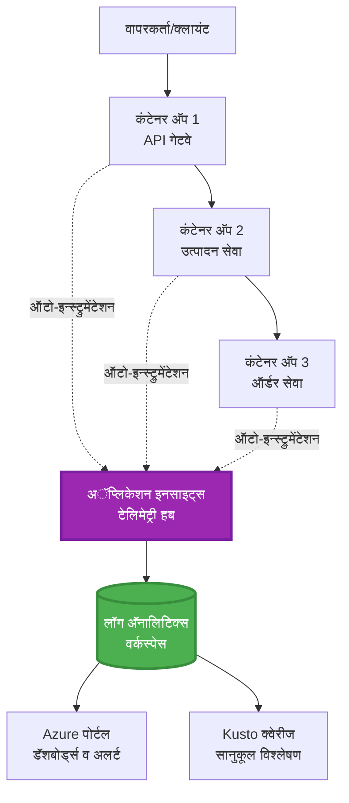
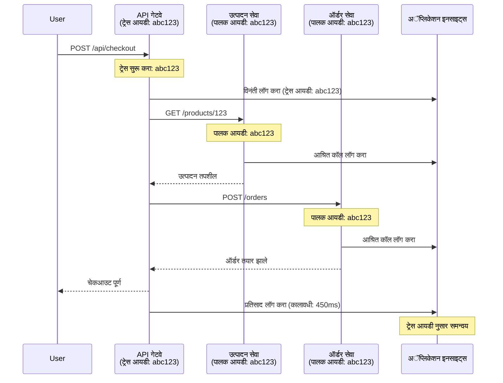

# Application Insights Integration with AZD

⏱️ **अनुमानित वेळ**: 40-50 मिनिटे | 💰 **खर्च प्रभाव**: ~$5-15/महिना | ⭐ **कठीणता**: मध्यम

**📚 शिक्षण मार्ग:**
- ← मागील: [Preflight Checks](preflight-checks.md) - पूर्व-परिनियोजन तपासणी
- 🎯 **आपण येथे आहात**: Application Insights Integration (निगराणी, टेलेमेट्री, डीबगिंग)
- → पुढे: [Deployment Guide](../chapter-04-infrastructure/deployment-guide.md) - Azure वर तैनाती करा
- 🏠 [Course Home](../../README.md)

---

## आपण काय शिकाल

हा धडा पूर्ण केल्यानंतर, आपण:
- AZD प्रकल्पांमध्ये **Application Insights** स्वयंचलितपणे एकत्रित करणे
- मायक्रोसर्व्हिसेससाठी **वितरित ट्रेसिंग** कॉन्फिगर करणे
- **कस्टम टेलेमेट्री** (मेट्रिक्स, इव्हेंट्स, डिपेंडन्सीज) अंमलात आणणे
- रिअल-टाइम संरक्षकांसाठी **लाइव्ह मेट्रिक्स** सेट करणे
- AZD तैनातींपासून **अलर्ट्स आणि डॅशबोर्ड्स** तयार करणे
- **टेलेमेट्री क्वेरीज** वापरून उत्पादन समस्या डीबग करणे
- खर्च आणि सॅम्पलिंग धोरणे ऑप्टिमाइझ करणे
- **AI/LLM अनुप्रयोगांचे** मॉनिटरिंग (टोकन्स, लेटन्सी, खर्च)

## AZD सह Application Insights का महत्त्वाचे आहे

### आव्हान: उत्पादन निरीक्षण

**Application Insights शिवाय:**
```
❌ No visibility into production behavior
❌ Manual log aggregation across services
❌ Reactive debugging (wait for customer complaints)
❌ No performance metrics
❌ Cannot trace requests across services
❌ Unknown failure rates and bottlenecks
```

**Application Insights + AZD सह:**
```
✅ Automatic telemetry collection
✅ Centralized logs from all services
✅ Proactive issue detection
✅ End-to-end request tracing
✅ Performance metrics and insights
✅ Real-time dashboards
✅ AZD provisions everything automatically
```

**उपमा**: Application Insights हे आपल्या अनुप्रयोगासाठी "ब्लॅक बॉक्स" फ्लाइट रेकॉर्डर + कॉकपिट डॅशबोर्ड सारखे आहे. आपण रिअल-टाइममध्ये सर्वकाही पाहू शकता आणि कोणतीही घटना पुन्हा प्ले करू शकता.

---

## आर्किटेक्चर आढावा

### AZD आर्किटेक्चरमधील Application Insights


### आपोआप काय मॉनिटर केले जाते

| टेलिमेट्री प्रकार | काय टिपते | वापर प्रकरण |
|----------------|------------------|----------|
| **Requests** | HTTP विनंत्या, स्टेटस कोड, कालावधी | API कामगिरीचे निरीक्षण |
| **Dependencies** | बाह्य कॉल्स (DB, APIs, स्टोरेज) | बॉटलनेक्स ओळखणे |
| **Exceptions** | अनहँडलेड त्रुटी सह स्टॅक ट्रेसेस | दोषांचे डीबगिंग |
| **Custom Events** | बिझनेस इव्हेंट्स (साइनअप, खरेदी) | अनालिटिक्स आणि फनेल्स |
| **Metrics** | परफॉर्मन्स काउंटर, कस्टम मेट्रिक्स | क्षमतेची नियोजना |
| **Traces** | severity सह लॉग संदेश | डीबगिंग आणि ऑडिटिंग |
| **Availability** | अपटाइम आणि प्रतिसाद वेळेचे चाचणी | SLA मॉनिटरिंग |

---

## पूर्वअटी

### आवश्यक साधने

```bash
# Azure Developer CLI तपासा
azd version
# ✅ अपेक्षित: azd आवृत्ती 1.0.0 किंवा त्याहून अधिक

# Azure CLI तपासा
az --version
# ✅ अपेक्षित: azure-cli 2.50.0 किंवा त्याहून अधिक
```

### Azure आवश्यकता

- सक्रिय Azure सदस्यत्व
- निर्माण करण्याची परवानगी:
  - Application Insights resources
  - Log Analytics workspaces
  - Container Apps
  - Resource groups

### आवश्यक ज्ञान

आपण हे पूर्ण केलेले असावे:
- [AZD Basics](../chapter-01-foundation/azd-basics.md) - AZD ची मूलभूत संकल्पना
- [Configuration](../chapter-03-configuration/configuration.md) - वातावरण सेटअप
- [First Project](../chapter-01-foundation/first-project.md) - मूलभूत तैनाती

---

## धडा 1: AZD सह स्वयंचलित Application Insights

### AZD कसे Application Insights प्रोव्हिजन करते

AZD आपण तैनात केल्यावर आपोआप Application Insights तयार आणि कॉन्फिगर करते. चला पाहूया ते कसे काम करते.

### प्रकल्प रचना

```
monitored-app/
├── azure.yaml                     # AZD configuration
├── infra/
│   ├── main.bicep                # Main infrastructure
│   ├── core/
│   │   └── monitoring.bicep      # Application Insights + Log Analytics
│   └── app/
│       └── api.bicep             # Container App with monitoring
└── src/
    ├── app.py                    # Application with telemetry
    ├── requirements.txt
    └── Dockerfile
```

---

### पाऊल 1: AZD कॉन्फिगर करा (azure.yaml)

**File: `azure.yaml`**

```yaml
name: monitored-app
metadata:
  template: monitored-app@1.0.0

services:
  api:
    project: ./src
    language: python
    host: containerapp

# AZD automatically provisions monitoring!
```

**इतकेच!** मूलभूत मॉनिटरिंगसाठी कोणतीही अतिरिक्त कॉन्फिगरेशन आवश्यक नाही — AZD डीफॉल्टनुसार Application Insights तयार करेल.

---

### पाऊल 2: मॉनिटरिंग इन्फ्रास्ट्रक्चर (Bicep)

**File: `infra/core/monitoring.bicep`**

```bicep
param logAnalyticsName string
param applicationInsightsName string
param location string = resourceGroup().location
param tags object = {}

// Log Analytics Workspace (required for Application Insights)
resource logAnalytics 'Microsoft.OperationalInsights/workspaces@2022-10-01' = {
  name: logAnalyticsName
  location: location
  tags: tags
  properties: {
    sku: {
      name: 'PerGB2018'  // Pay-as-you-go pricing
    }
    retentionInDays: 30  // Keep logs for 30 days
    features: {
      enableLogAccessUsingOnlyResourcePermissions: true
    }
  }
}

// Application Insights
resource applicationInsights 'Microsoft.Insights/components@2020-02-02' = {
  name: applicationInsightsName
  location: location
  tags: tags
  kind: 'web'
  properties: {
    Application_Type: 'web'
    WorkspaceResourceId: logAnalytics.id
    IngestionMode: 'LogAnalytics'
    publicNetworkAccessForIngestion: 'Enabled'
    publicNetworkAccessForQuery: 'Enabled'
  }
}

// Outputs for Container Apps
output logAnalyticsWorkspaceId string = logAnalytics.id
output logAnalyticsWorkspaceName string = logAnalytics.name
output applicationInsightsConnectionString string = applicationInsights.properties.ConnectionString
output applicationInsightsInstrumentationKey string = applicationInsights.properties.InstrumentationKey
output applicationInsightsName string = applicationInsights.name
```

---

### पाऊल 3: Container App ला Application Insights शी कनेक्ट करा

**File: `infra/app/api.bicep`**

```bicep
param name string
param location string
param tags object = {}
param containerAppsEnvironmentName string
param applicationInsightsConnectionString string

resource containerApp 'Microsoft.App/containerApps@2023-05-01' = {
  name: name
  location: location
  tags: tags
  properties: {
    configuration: {
      ingress: {
        external: true
        targetPort: 8000
      }
      secrets: [
        {
          name: 'appinsights-connection-string'
          value: applicationInsightsConnectionString
        }
      ]
    }
    template: {
      containers: [
        {
          name: 'api'
          image: 'myregistry.azurecr.io/api:latest'
          resources: {
            cpu: json('0.5')
            memory: '1Gi'
          }
          env: [
            {
              name: 'APPLICATIONINSIGHTS_CONNECTION_STRING'
              secretRef: 'appinsights-connection-string'
            }
            {
              name: 'APPLICATIONINSIGHTS_ENABLED'
              value: 'true'
            }
          ]
        }
      ]
    }
  }
}

output uri string = 'https://${containerApp.properties.configuration.ingress.fqdn}'
```

---

### पाऊल 4: टेलेमेट्रीसह अनुप्रयोग कोड

**File: `src/app.py`**

```python
from flask import Flask, request, jsonify
from opencensus.ext.azure.log_exporter import AzureLogHandler
from opencensus.ext.azure.trace_exporter import AzureExporter
from opencensus.ext.flask.flask_middleware import FlaskMiddleware
from opencensus.trace.samplers import ProbabilitySampler
import logging
import os

app = Flask(__name__)

# Application Insights कनेक्शन स्ट्रिंग मिळवा
connection_string = os.environ.get('APPLICATIONINSIGHTS_CONNECTION_STRING')

if connection_string:
    # वितरित ट्रेसिंग कॉन्फिगर करा
    middleware = FlaskMiddleware(
        app,
        exporter=AzureExporter(connection_string=connection_string),
        sampler=ProbabilitySampler(rate=1.0)  # विकासासाठी 100% सॅम्पलिंग
    )
    
    # लॉगिंग कॉन्फिगर करा
    logger = logging.getLogger(__name__)
    logger.addHandler(AzureLogHandler(connection_string=connection_string))
    logger.setLevel(logging.INFO)
    
    print("✅ Application Insights enabled")
else:
    logger = logging.getLogger(__name__)
    logger.setLevel(logging.INFO)
    print("⚠️ Application Insights not configured")

@app.route('/health')
def health():
    logger.info('Health check endpoint called')
    return jsonify({'status': 'healthy', 'monitoring': 'enabled'})

@app.route('/api/products')
def get_products():
    logger.info('Fetching products')
    
    # डेटाबेस कॉलचे अनुकरण करा (स्वयंचलितपणे अवलंबित्व म्हणून ट्रॅक केले जाते)
    products = [
        {'id': 1, 'name': 'Laptop', 'price': 999.99},
        {'id': 2, 'name': 'Mouse', 'price': 29.99},
        {'id': 3, 'name': 'Keyboard', 'price': 79.99}
    ]
    
    logger.info(f'Returned {len(products)} products')
    return jsonify(products)

@app.route('/api/error-test')
def error_test():
    """Test error tracking"""
    logger.error('Testing error tracking')
    try:
        raise ValueError('This is a test exception')
    except Exception as e:
        logger.exception('Exception occurred in error-test endpoint')
        return jsonify({'error': str(e)}), 500

@app.route('/api/slow')
def slow_endpoint():
    """Test performance tracking"""
    import time
    logger.info('Slow endpoint called')
    time.sleep(3)  # हळू ऑपरेशनचे अनुकरण करा
    logger.warning('Endpoint took 3 seconds to respond')
    return jsonify({'message': 'Slow operation completed'})

if __name__ == '__main__':
    app.run(host='0.0.0.0', port=8000)
```

**File: `src/requirements.txt`**

```txt
Flask==3.0.0
opencensus-ext-azure==1.1.13
opencensus-ext-flask==0.8.1
gunicorn==21.2.0
```

---

### पाऊल 5: तैनात करा आणि सत्यापित करा

```bash
# AZD प्रारंभ करा
azd init

# तैनात करा (Application Insights आपोआप प्राव्हिजन केले जाते)
azd up

# अॅपचा URL मिळवा
APP_URL=$(azd env get-values | grep API_URL | cut -d '=' -f2 | tr -d '"')

# टेलिमेट्री तयार करा
curl $APP_URL/health
curl $APP_URL/api/products
curl $APP_URL/api/error-test
curl $APP_URL/api/slow
```

**✅ अपेक्षित आउटपुट:**
```json
{
  "status": "healthy",
  "monitoring": "enabled"
}
```

---

### पाऊल 6: Azure पोर्टलमध्ये टेलेमेट्री पहा

```bash
# Application Insights तपशील मिळवा
azd env get-values | grep APPLICATIONINSIGHTS

# Azure पोर्टलमध्ये उघडा
az monitor app-insights component show \
  --app $(azd env get-values | grep APPLICATIONINSIGHTS_NAME | cut -d '=' -f2 | tr -d '"') \
  --resource-group $(azd env get-values | grep AZURE_RESOURCE_GROUP | cut -d '=' -f2 | tr -d '"') \
  --query "appId" -o tsv
```

**Azure पोर्टल → Application Insights → Transaction Search कडे जा**

आपण पाहायला मिळेल:
- ✅ HTTP विनंत्या सह स्टेटस कोड
- ✅ विनंती कालावधी (`/api/slow` साठी 3+ सेकंद)
- ✅ `/api/error-test` मधून अपवाद तपशील
- ✅ कस्टम लॉग संदेश

---

## धडा 2: कस्टम टेलेमेट्री आणि इव्हेंट्स

### बिझनेस इव्हेंट्स ट्रॅक करा

बिझनेस-क्रिटिकल इव्हेंट्ससाठी कस्टम टेलेमेट्री जोडा.

**File: `src/telemetry.py`**

```python
from opencensus.ext.azure import metrics_exporter
from opencensus.stats import aggregation as aggregation_module
from opencensus.stats import measure as measure_module
from opencensus.stats import stats as stats_module
from opencensus.stats import view as view_module
from opencensus.tags import tag_map as tag_map_module
from opencensus.ext.azure.log_exporter import AzureLogHandler
from opencensus.ext.azure.trace_exporter import AzureExporter
from opencensus.trace import tracer as tracer_module
import logging
import os

class TelemetryClient:
    """Custom telemetry client for Application Insights"""
    
    def __init__(self, connection_string=None):
        self.connection_string = connection_string or os.environ.get('APPLICATIONINSIGHTS_CONNECTION_STRING')
        
        if not self.connection_string:
            print("⚠️ Application Insights connection string not found")
            return
        
        # लॉगर सेट करा
        self.logger = logging.getLogger(__name__)
        self.logger.addHandler(AzureLogHandler(connection_string=self.connection_string))
        self.logger.setLevel(logging.INFO)
        
        # मेट्रिक्स निर्यातक सेट करा
        self.stats = stats_module.stats
        self.view_manager = self.stats.view_manager
        self.stats_recorder = self.stats.stats_recorder
        
        exporter = metrics_exporter.new_metrics_exporter(
            connection_string=self.connection_string
        )
        self.view_manager.register_exporter(exporter)
        
        # ट्रेसर सेट करा
        self.tracer = tracer_module.Tracer(
            exporter=AzureExporter(connection_string=self.connection_string)
        )
        
        print("✅ Custom telemetry client initialized")
    
    def track_event(self, event_name: str, properties: dict = None):
        """Track custom business event"""
        properties = properties or {}
        self.logger.info(
            f"CustomEvent: {event_name}",
            extra={
                'custom_dimensions': {
                    'event_name': event_name,
                    **properties
                }
            }
        )
    
    def track_metric(self, metric_name: str, value: float, properties: dict = None):
        """Track custom metric"""
        properties = properties or {}
        self.logger.info(
            f"CustomMetric: {metric_name} = {value}",
            extra={
                'custom_dimensions': {
                    'metric_name': metric_name,
                    'value': value,
                    **properties
                }
            }
        )
    
    def track_dependency(self, name: str, dependency_type: str, duration: float, success: bool):
        """Track external dependency call"""
        with self.tracer.span(name=name) as span:
            span.add_attribute('dependency.type', dependency_type)
            span.add_attribute('duration', duration)
            span.add_attribute('success', success)

# ग्लोबल टेलीमेट्री क्लायंट
telemetry = TelemetryClient()
```

### कस्टम इव्हेंट्ससह अनुप्रयोग अद्ययावत करा

**File: `src/app.py` (enhanced)**

```python
from flask import Flask, request, jsonify
from telemetry import telemetry
import time
import random

app = Flask(__name__)

@app.route('/api/purchase', methods=['POST'])
def purchase():
    """Track purchase event with custom telemetry"""
    data = request.json
    product_id = data.get('product_id')
    quantity = data.get('quantity', 1)
    price = data.get('price', 0)
    
    # व्यवसाय घटना ट्रॅक करा
    telemetry.track_event('Purchase', {
        'product_id': product_id,
        'quantity': quantity,
        'total_amount': price * quantity,
        'user_id': request.headers.get('X-User-Id', 'anonymous')
    })
    
    # उत्पन्न मेट्रिक ट्रॅक करा
    telemetry.track_metric('Revenue', price * quantity, {
        'product_id': product_id,
        'currency': 'USD'
    })
    
    return jsonify({
        'order_id': f'ORD-{random.randint(1000, 9999)}',
        'status': 'confirmed',
        'total': price * quantity
    })

@app.route('/api/search')
def search():
    """Track search queries"""
    query = request.args.get('q', '')
    
    start_time = time.time()
    
    # शोधाचे अनुकरण करा (खऱ्या डेटाबेस क्वेरीप्रमाणे)
    results = [{'id': 1, 'name': f'Result for {query}'}]
    
    duration = (time.time() - start_time) * 1000  # मिलीसेकंदमध्ये रूपांतर करा
    
    # शोध घटना ट्रॅक करा
    telemetry.track_event('Search', {
        'query': query,
        'results_count': len(results),
        'duration_ms': duration
    })
    
    # शोध कामगिरी मेट्रिक ट्रॅक करा
    telemetry.track_metric('SearchDuration', duration, {
        'query_length': len(query)
    })
    
    return jsonify({'results': results, 'count': len(results)})

@app.route('/api/external-call')
def external_call():
    """Track external API dependency"""
    import requests
    
    start_time = time.time()
    success = True
    
    try:
        # बाह्य API कॉलचे अनुकरण करा
        response = requests.get('https://api.example.com/data', timeout=5)
        result = response.json()
    except Exception as e:
        success = False
        result = {'error': str(e)}
    
    duration = (time.time() - start_time) * 1000
    
    # निर्भरता ट्रॅक करा
    telemetry.track_dependency(
        name='ExternalAPI',
        dependency_type='HTTP',
        duration=duration,
        success=success
    )
    
    return jsonify(result)

if __name__ == '__main__':
    app.run(host='0.0.0.0', port=8000)
```

### कस्टम टेलेमेट्री तपासा

```bash
# खरेदी घटना ट्रॅक करा
curl -X POST $APP_URL/api/purchase \
  -H "Content-Type: application/json" \
  -H "X-User-Id: user123" \
  -d '{"product_id": 1, "quantity": 2, "price": 29.99}'

# शोध घटना ट्रॅक करा
curl "$APP_URL/api/search?q=laptop"

# बाह्य अवलंबित्व ट्रॅक करा
curl $APP_URL/api/external-call
```

**Azure पोर्टलमध्ये पहा:**

Application Insights → Logs कडे जा, नंतर चालवा:

```kusto
// View purchase events
traces
| where customDimensions.event_name == "Purchase"
| project 
    timestamp,
    product_id = tostring(customDimensions.product_id),
    total_amount = todouble(customDimensions.total_amount),
    user_id = tostring(customDimensions.user_id)
| order by timestamp desc

// View revenue metrics
traces
| where customDimensions.metric_name == "Revenue"
| summarize TotalRevenue = sum(todouble(customDimensions.value)) by bin(timestamp, 1h)
| render timechart

// View search performance
traces
| where customDimensions.event_name == "Search"
| summarize 
    AvgDuration = avg(todouble(customDimensions.duration_ms)),
    SearchCount = count()
  by bin(timestamp, 5m)
| render timechart
```

---

## धडा 3: मायक्रोसर्व्हिसेससाठी वितरित ट्रेसिंग

### क्रॉस-सर्व्हिस ट्रेसिंग सक्षम करा

मायक्रोसर्व्हिसेससाठी, Application Insights आपोआप सेवांमधील विनंत्यांचे कोरिलेशन करते.

**File: `infra/main.bicep`**

```bicep
targetScope = 'subscription'

param environmentName string
param location string = 'eastus'

var tags = { 'azd-env-name': environmentName }

resource rg 'Microsoft.Resources/resourceGroups@2021-04-01' = {
  name: 'rg-${environmentName}'
  location: location
  tags: tags
}

// Monitoring (shared by all services)
module monitoring './core/monitoring.bicep' = {
  name: 'monitoring'
  scope: rg
  params: {
    logAnalyticsName: 'log-${environmentName}'
    applicationInsightsName: 'appi-${environmentName}'
    location: location
    tags: tags
  }
}

// API Gateway
module apiGateway './app/api-gateway.bicep' = {
  name: 'api-gateway'
  scope: rg
  params: {
    name: 'ca-gateway-${environmentName}'
    location: location
    tags: union(tags, { 'azd-service-name': 'gateway' })
    applicationInsightsConnectionString: monitoring.outputs.applicationInsightsConnectionString
  }
}

// Product Service
module productService './app/product-service.bicep' = {
  name: 'product-service'
  scope: rg
  params: {
    name: 'ca-products-${environmentName}'
    location: location
    tags: union(tags, { 'azd-service-name': 'products' })
    applicationInsightsConnectionString: monitoring.outputs.applicationInsightsConnectionString
  }
}

// Order Service
module orderService './app/order-service.bicep' = {
  name: 'order-service'
  scope: rg
  params: {
    name: 'ca-orders-${environmentName}'
    location: location
    tags: union(tags, { 'azd-service-name': 'orders' })
    applicationInsightsConnectionString: monitoring.outputs.applicationInsightsConnectionString
  }
}

output APPLICATIONINSIGHTS_CONNECTION_STRING string = monitoring.outputs.applicationInsightsConnectionString
output GATEWAY_URL string = apiGateway.outputs.uri
```

### एंड-टू-एंड ट्रांझॅक्शन पहा


**एंड-टू-एंड ट्रेसची क्वेरी:**

```kusto
// Find complete request flow
let traceId = "abc123...";  // Get from response header
dependencies
| union requests
| where operation_Id == traceId
| project 
    timestamp,
    type = itemType,
    name,
    duration,
    success,
    cloud_RoleName
| order by timestamp asc
```

---

## धडा 4: लाइव्ह मेट्रिक्स आणि रिअल-टाइम मॉनिटरिंग

### लाईव्ह मेट्रिक्स स्ट्रीम सक्षम करा

लाइव्ह मेट्रिक्स <1 सेकंद लेटन्सीसह रिअल-टाइम टेलेमेट्री प्रदान करतो.

**लाइव्ह मेट्रिक्स ऍक्सेस करा:**

```bash
# Application Insights संसाधन मिळवा
APPI_NAME=$(azd env get-values | grep APPLICATIONINSIGHTS_NAME | cut -d '=' -f2 | tr -d '"')

# संसाधन गट मिळवा
RG_NAME=$(azd env get-values | grep AZURE_RESOURCE_GROUP | cut -d '=' -f2 | tr -d '"')

echo "Navigate to: Azure Portal → Resource Groups → $RG_NAME → $APPI_NAME → Live Metrics"
```

**रिअल-टाइममध्ये आपण काय पाहता:**
- ✅ इनकमिंग रिक्वेस्ट दर (requests/sec)
- ✅ आउटगोइंग डिपेंडन्सी कॉल्स
- ✅ अपवाद गणना
- ✅ CPU आणि मेमरी वापर
- ✅ सक्रिय सर्व्हर संख्या
- ✅ नमुना टेलेमेट्री

### चाचणीसाठी लोड जनरेट करा

```bash
# लाइव्ह मेट्रिक्स पाहण्यासाठी लोड निर्माण करा
for i in {1..100}; do
  curl $APP_URL/api/products &
  curl $APP_URL/api/search?q=test$i &
done

# Azure पोर्टलमध्ये लाइव्ह मेट्रिक्स पहा
# आपल्याला विनंती दरात तीव्र वाढ दिसेल
```

---

## व्यावहारिक उपक्रम

### उपक्रम 1: अलर्ट्स सेट करा ⭐⭐ (मध्यम)

**लक्ष्य**: उच्च त्रुटी दर आणि मंद प्रतिसादांसाठी अलर्ट तयार करा.

**पावले:**

1. **त्रुटी दरासाठी अलर्ट तयार करा:**

```bash
# Application Insights रिसॉर्स आयडी मिळवा
APPI_ID=$(az monitor app-insights component show \
  --app $APPI_NAME \
  --resource-group $RG_NAME \
  --query "id" -o tsv)

# अपयशी विनंत्यांसाठी मेट्रिक अलर्ट तयार करा
az monitor metrics alert create \
  --name "High-Error-Rate" \
  --resource-group $RG_NAME \
  --scopes $APPI_ID \
  --condition "count requests/failed > 10" \
  --window-size 5m \
  --evaluation-frequency 1m \
  --description "Alert when error rate exceeds 10 per 5 minutes"
```

2. **मंद प्रतिसादांसाठी अलर्ट तयार करा:**

```bash
az monitor metrics alert create \
  --name "Slow-Responses" \
  --resource-group $RG_NAME \
  --scopes $APPI_ID \
  --condition "avg requests/duration > 3000" \
  --window-size 5m \
  --evaluation-frequency 1m \
  --description "Alert when average response time exceeds 3 seconds"
```

3. **Bicep द्वारे अलर्ट तयार करा (AZD साठी प्राधान्य):**

**File: `infra/core/alerts.bicep`**

```bicep
param applicationInsightsId string
param actionGroupId string = ''
param location string = resourceGroup().location

// High error rate alert
resource errorRateAlert 'Microsoft.Insights/metricAlerts@2018-03-01' = {
  name: 'high-error-rate'
  location: 'global'
  properties: {
    description: 'Alert when error rate exceeds threshold'
    severity: 2
    enabled: true
    scopes: [
      applicationInsightsId
    ]
    evaluationFrequency: 'PT1M'
    windowSize: 'PT5M'
    criteria: {
      'odata.type': 'Microsoft.Azure.Monitor.SingleResourceMultipleMetricCriteria'
      allOf: [
        {
          name: 'Error rate'
          metricName: 'requests/failed'
          operator: 'GreaterThan'
          threshold: 10
          timeAggregation: 'Count'
        }
      ]
    }
    actions: actionGroupId != '' ? [
      {
        actionGroupId: actionGroupId
      }
    ] : []
  }
}

// Slow response alert
resource slowResponseAlert 'Microsoft.Insights/metricAlerts@2018-03-01' = {
  name: 'slow-responses'
  location: 'global'
  properties: {
    description: 'Alert when response time is too high'
    severity: 3
    enabled: true
    scopes: [
      applicationInsightsId
    ]
    evaluationFrequency: 'PT1M'
    windowSize: 'PT5M'
    criteria: {
      'odata.type': 'Microsoft.Azure.Monitor.SingleResourceMultipleMetricCriteria'
      allOf: [
        {
          name: 'Response duration'
          metricName: 'requests/duration'
          operator: 'GreaterThan'
          threshold: 3000
          timeAggregation: 'Average'
        }
      ]
    }
  }
}

output errorAlertId string = errorRateAlert.id
output slowResponseAlertId string = slowResponseAlert.id
```

4. **अलर्ट्सची चाचणी करा:**

```bash
# त्रुटी निर्माण करा
for i in {1..20}; do
  curl $APP_URL/api/error-test
done

# मंद प्रतिसाद तयार करा
for i in {1..10}; do
  curl $APP_URL/api/slow
done

# अलर्ट स्थिती तपासा (5-10 मिनिटे प्रतीक्षा करा)
az monitor metrics alert list \
  --resource-group $RG_NAME \
  --query "[].{Name:name, Enabled:enabled, State:properties.enabled}" \
  --output table
```

**✅ यश निकष:**
- ✅ अलर्ट्स यशस्वीरीत्या तयार झाले आहेत
- ✅ थ्रेशहोल्ड ओलांडल्यावर अलर्ट्स फायर होतात
- ✅ Azure पोर्टलमध्ये अलर्ट इतिहास पाहता येतो
- ✅ AZD तैनातीसोबत एकत्रित केलेले आहे

**वेळ**: 20-25 मिनिटे

---

### उपक्रम 2: कस्टम डॅशबोर्ड तयार करा ⭐⭐ (मध्यम)

**लक्ष्य**: मुख्य अनुप्रयोग मेट्रिक्स दर्शवणारा डॅशबोर्ड तयार करा.

**पावले:**

1. **Azure पोर्टलद्वारे डॅशबोर्ड तयार करा:**

जावे: Azure पोर्टल → Dashboards → New Dashboard

2. **मुख्य मेट्रिक्ससाठी टाईल्स जोडा:**

- विनंती संख्या (गेल्या 24 तासात)
- सरासरी प्रतिसाद वेळ
- त्रुटी दर
- टॉप 5 सर्वात धीमे ऑपरेशन्स
- वापरकर्त्यांचा भौगोलिक वितरण

3. **Bicep द्वारे डॅशबोर्ड तयार करा:**

**File: `infra/core/dashboard.bicep`**

```bicep
param dashboardName string
param applicationInsightsId string
param location string = resourceGroup().location

resource dashboard 'Microsoft.Portal/dashboards@2020-09-01-preview' = {
  name: dashboardName
  location: location
  properties: {
    lenses: [
      {
        order: 0
        parts: [
          // Request count
          {
            position: { x: 0, y: 0, rowSpan: 4, colSpan: 6 }
            metadata: {
              type: 'Extension/Microsoft_OperationsManagementSuite_Workspace/PartType/LogsDashboardPart'
              inputs: [
                {
                  name: 'resourceId'
                  value: applicationInsightsId
                }
                {
                  name: 'query'
                  value: '''
                    requests
                    | summarize RequestCount = count() by bin(timestamp, 1h)
                    | render timechart
                  '''
                }
              ]
            }
          }
          // Error rate
          {
            position: { x: 6, y: 0, rowSpan: 4, colSpan: 6 }
            metadata: {
              type: 'Extension/Microsoft_OperationsManagementSuite_Workspace/PartType/LogsDashboardPart'
              inputs: [
                {
                  name: 'resourceId'
                  value: applicationInsightsId
                }
                {
                  name: 'query'
                  value: '''
                    requests
                    | summarize 
                        Total = count(),
                        Failed = countif(success == false)
                    | extend ErrorRate = (Failed * 100.0) / Total
                    | project ErrorRate
                  '''
                }
              ]
            }
          }
        ]
      }
    ]
  }
}

output dashboardId string = dashboard.id
```

4. **डॅशबोर्ड तैनात करा:**

```bash
# main.bicep मध्ये जोडा
module dashboard './core/dashboard.bicep' = {
  name: 'dashboard'
  scope: rg
  params: {
    dashboardName: 'dashboard-${environmentName}'
    applicationInsightsId: monitoring.outputs.applicationInsightsId
    location: location
  }
}

# तैनात करा
azd up
```

**✅ यश निकष:**
- ✅ डॅशबोर्ड मुख्य मेट्रिक्स दर्शवतो
- ✅ Azure पोर्टल होमवर पिन करता येतो
- ✅ रिअल-टाइममध्ये अपडेट होतो
- ✅ AZD द्वारे तैनात करण्यायोग्य

**वेळ**: 25-30 मिनिटे

---

### उपक्रम 3: AI/LLM अनुप्रयोग मॉनिटर करा ⭐⭐⭐ (अॅडव्हान्स)

**लक्ष्य**: Azure OpenAI वापराचा मागोवा घ्या (टोकन्स, खर्च, लेटन्सी).

**पावले:**

1. **AI मॉनिटरिंग wrapper तयार करा:**

**File: `src/ai_telemetry.py`**

```python
from telemetry import telemetry
from openai import AzureOpenAI
import time

class MonitoredAzureOpenAI:
    """Azure OpenAI client with automatic telemetry"""
    
    def __init__(self, api_key, endpoint, api_version="2024-02-01"):
        self.client = AzureOpenAI(
            api_key=api_key,
            api_version=api_version,
            azure_endpoint=endpoint
        )
    
    def chat_completion(self, model: str, messages: list, **kwargs):
        """Track chat completion with telemetry"""
        start_time = time.time()
        
        try:
            # Azure OpenAI ला कॉल करा
            response = self.client.chat.completions.create(
                model=model,
                messages=messages,
                **kwargs
            )
            
            duration = (time.time() - start_time) * 1000  # मिलीसेकंद
            
            # वापर काढा
            usage = response.usage
            prompt_tokens = usage.prompt_tokens
            completion_tokens = usage.completion_tokens
            total_tokens = usage.total_tokens
            
            # किंमत गणना करा (GPT-4 किंमती)
            prompt_cost = (prompt_tokens / 1000) * 0.03  # $0.03 प्रति 1K टोकन्स
            completion_cost = (completion_tokens / 1000) * 0.06  # $0.06 प्रति 1K टोकन्स
            total_cost = prompt_cost + completion_cost
            
            # सानुकूल घटना ट्रॅक करा
            telemetry.track_event('OpenAI_Request', {
                'model': model,
                'prompt_tokens': prompt_tokens,
                'completion_tokens': completion_tokens,
                'total_tokens': total_tokens,
                'duration_ms': duration,
                'cost_usd': total_cost,
                'success': True
            })
            
            # मेट्रिक्स ट्रॅक करा
            telemetry.track_metric('OpenAI_Tokens', total_tokens, {
                'model': model,
                'type': 'total'
            })
            
            telemetry.track_metric('OpenAI_Cost', total_cost, {
                'model': model,
                'currency': 'USD'
            })
            
            telemetry.track_metric('OpenAI_Duration', duration, {
                'model': model
            })
            
            return response
            
        except Exception as e:
            duration = (time.time() - start_time) * 1000
            
            telemetry.track_event('OpenAI_Request', {
                'model': model,
                'duration_ms': duration,
                'success': False,
                'error': str(e)
            })
            
            raise
```

2. **मनिटर केलेला क्लायंट वापरा:**

```python
from flask import Flask, request, jsonify
from ai_telemetry import MonitoredAzureOpenAI
import os

app = Flask(__name__)

# निगराणी असलेला OpenAI क्लायंट प्रारंभ करा
openai_client = MonitoredAzureOpenAI(
    api_key=os.environ['AZURE_OPENAI_API_KEY'],
    endpoint=os.environ['AZURE_OPENAI_ENDPOINT']
)

@app.route('/api/chat', methods=['POST'])
def chat():
    data = request.json
    user_message = data.get('message')
    
    # स्वयंचलित निगराणीसह कॉल करा
    response = openai_client.chat_completion(
        model='gpt-4',
        messages=[
            {'role': 'user', 'content': user_message}
        ]
    )
    
    return jsonify({
        'response': response.choices[0].message.content,
        'tokens': response.usage.total_tokens
    })
```

3. **AI मेट्रिक्सची क्वेरी करा:**

```kusto
// Total AI spend over time
traces
| where customDimensions.event_name == "OpenAI_Request"
| where customDimensions.success == "True"
| summarize TotalCost = sum(todouble(customDimensions.cost_usd)) by bin(timestamp, 1h)
| render timechart

// Token usage by model
traces
| where customDimensions.event_name == "OpenAI_Request"
| summarize 
    TotalTokens = sum(toint(customDimensions.total_tokens)),
    RequestCount = count()
  by Model = tostring(customDimensions.model)

// Average latency
traces
| where customDimensions.event_name == "OpenAI_Request"
| summarize AvgDuration = avg(todouble(customDimensions.duration_ms))
| project AvgDurationSeconds = AvgDuration / 1000

// Cost per request
traces
| where customDimensions.event_name == "OpenAI_Request"
| extend Cost = todouble(customDimensions.cost_usd)
| summarize 
    TotalCost = sum(Cost),
    RequestCount = count(),
    AvgCostPerRequest = avg(Cost)
```

**✅ यश निकष:**
- ✅ प्रत्येक OpenAI कॉल आपोआप ट्रॅक केला जातो
- ✅ टोकन वापर आणि खर्च दृश्यमान
- ✅ लेटन्सी मॉनिटर केली जाते
- ✅ बजेट अलर्ट सेट करता येतात

**वेळ**: 35-45 मिनिटे

---

## खर्च ऑप्टिमायझेशन

### सॅम्पलिंग धोरणे

टेलेमेट्रीने होणारा खर्च नियंत्रित करण्यासाठी सॅम्पलिंग वापरा:

```python
from opencensus.trace.samplers import ProbabilitySampler

# विकास: 100% सॅम्पलिंग
sampler = ProbabilitySampler(rate=1.0)

# उत्पादन: 10% सॅम्पलिंग (खर्च 90% ने कमी होते)
sampler = ProbabilitySampler(rate=0.1)

# अनुकूली सॅम्पलिंग (स्वयंचलितपणे समायोजित होते)
from opencensus.trace.samplers import AdaptiveSampler
sampler = AdaptiveSampler()
```

**Bicep मध्ये:**

```bicep
resource applicationInsights 'Microsoft.Insights/components@2020-02-02' = {
  name: applicationInsightsName
  properties: {
    SamplingPercentage: 10  // 10% sampling
  }
}
```

### डेटा ठेवणूक

```bicep
resource logAnalytics 'Microsoft.OperationalInsights/workspaces@2022-10-01' = {
  name: logAnalyticsName
  properties: {
    retentionInDays: 30  // Minimum (cheapest)
    // Options: 30, 31, 60, 90, 120, 180, 270, 365, 550, 730
  }
}
```

### मासिक खर्च अंदाज

| डेटा व्हॉल्यूम | ठेवणूक | मासिक खर्च |
|-------------|-----------|--------------|
| 1 GB/month | 30 days | ~$2-5 |
| 5 GB/month | 30 days | ~$10-15 |
| 10 GB/month | 90 days | ~$25-40 |
| 50 GB/month | 90 days | ~$100-150 |

**फ्री स्तर**: 5 GB/महिना समाविष्ट

---

## ज्ञान तपासणी

### 1. मूलभूत एकत्रीकरण ✓

आपले समज तपासा:

- [ ] **Q1**: AZD कसे Application Insights प्रोव्हिजन करते?
  - **A**: `infra/core/monitoring.bicep` मधील Bicep टेम्पलेटद्वारे आपोआप

- [ ] **Q2**: कोणते एन्व्हायर्नमेंट वेरियेबल Application Insights सक्षम करते?
  - **A**: `APPLICATIONINSIGHTS_CONNECTION_STRING`

- [ ] **Q3**: तीन मुख्य टेलिमेट्री प्रकार कोणते आहेत?
  - **A**: Requests (HTTP कॉल्स), Dependencies (बाह्य कॉल्स), Exceptions (त्रुटी)

**Hands-On Verification:**
```bash
# तपासा की Application Insights कॉन्फिगर केले आहे का
azd env get-values | grep APPLICATIONINSIGHTS

# तपासा की टेलीमेट्री वाहत आहे का
az monitor app-insights metrics show \
  --app $APPI_NAME \
  --resource-group $RG_NAME \
  --metric "requests/count"
```

---

### 2. कस्टम टेलेमेट्री ✓

आपले समज तपासा:

- [ ] **Q1**: आपण कस्टम बिझनेस इव्हेंट्स कसे ट्रॅक करता?
  - **A**: `custom_dimensions` सह लॉगर वापरून किंवा `TelemetryClient.track_event()` वापरून

- [ ] **Q2**: इव्हेंट आणि मेट्रिक्स मधील फरक काय आहे?
  - **A**: इव्हेंट्स वेगवेगळे वेळेवर घडणारे घटना आहेत, मेट्रिक्स संख्यात्मक मोजमाप आहेत

- [ ] **Q3**: सेवांमध्ये टेलेमेट्री कशी करेलेट करता?
  - **A**: Application Insights आपोआप correlation साठी `operation_Id` वापरते

**Hands-On Verification:**
```kusto
// Verify custom events
traces
| where customDimensions.event_name != ""
| summarize count() by tostring(customDimensions.event_name)
```

---

### 3. उत्पादन मॉनिटरिंग ✓

आपले समज तपासा:

- [ ] **Q1**: सॅम्पलिंग काय आहे आणि ते का वापरावे?
  - **A**: सॅम्पलिंग डेटा व्हॉल्यूम (आणि खर्च) कमी करण्यासाठी केवळ टेलेमेट्रीचा एक टक्का टिपते

- [ ] **Q2**: अलर्ट्स कसे सेट करतात?
  - **A**: Application Insights मेट्रिक्सवर आधारित Bicep किंवा Azure पोर्टलमध्ये मेट्रिक अलर्ट्स वापरा

- [ ] **Q3**: Log Analytics आणि Application Insights मधील फरक काय आहे?
  - **A**: Application Insights डेटा Log Analytics वर्कस्पेसमध्ये साठवते; App Insights अनुप्रयोग-विशिष्ट व्ह्यू प्रदान करते

**Hands-On Verification:**
```bash
# नमुना घेण्याचे कॉन्फिगरेशन तपासा
az monitor app-insights component show \
  --app $APPI_NAME \
  --resource-group $RG_NAME \
  --query "properties.SamplingPercentage"
```

---

## सर्वोत्तम सराव

### ✅ करावे:

1. **कॉरिलेशन IDs वापरा**
   ```python
   logger.info('Processing order', extra={
       'custom_dimensions': {
           'order_id': order_id,
           'user_id': user_id
       }
   })
   ```

2. **महत्त्वाच्या मेट्रिक्ससाठी अलर्ट सेट करा**
   ```bicep
   // Error rate, slow responses, availability
   ```

3. **स्ट्रक्चर्ड लॉगिंग वापरा**
   ```python
   # ✅ चांगले: संरचित
   logger.info('User signup', extra={'custom_dimensions': {'user_id': 123}})
   
   # ❌ वाईट: असंरचित
   logger.info(f'User 123 signed up')
   ```

4. **डिपेंडन्सीजचे मॉनिटरिंग करा**
   ```python
   # डेटाबेस कॉल, HTTP विनंत्या इत्यादी आपोआप ट्रॅक करा.
   ```

5. **तैनाती दरम्यान Live Metrics वापरा**

### ❌ करू नका:

1. **संवेदनशील डेटा लॉग करू नका**
   ```python
   # ❌ वाईट
   logger.info(f'Login: {username}:{password}')
   
   # ✅ चांगले
   logger.info('Login attempt', extra={'custom_dimensions': {'username': username}})
   ```

2. **प्रॉडक्शनमध्ये 100% सॅम्पलिंग वापरू नका**
   ```python
   # ❌ महाग
   sampler = ProbabilitySampler(rate=1.0)
   
   # ✅ किफायतशीर
   sampler = ProbabilitySampler(rate=0.1)
   ```

3. **डेड लेटर क्‍युजकडे दुर्लक्ष करू नका**

4. **डेटा ठेवणुकीची मर्यादा सेट करायला विसरू नका**

---

## त्रुटी निवारण

### समस्या: टेलेमेट्री दिसत नाही

**निदान:**
```bash
# कनेक्शन स्ट्रिंग सेट आहे का तपासा
azd env get-values | grep APPLICATIONINSIGHTS

# Azure Monitor द्वारे अनुप्रयोगाचे लॉग तपासा
azd monitor --logs

# किंवा Container Apps साठी Azure CLI वापरा:
az containerapp logs show --name $APP_NAME --resource-group $RG_NAME --tail 50
```

**उपाय:**
```bash
# कंटेनर अॅपमधील कनेक्शन स्ट्रिंग सत्यापित करा
az containerapp show \
  --name $APP_NAME \
  --resource-group $RG_NAME \
  --query "properties.template.containers[0].env" \
  | grep -i applicationinsights
```

---

### समस्या: उच्च खर्च

**निदान:**
```bash
# डेटा आयात तपासा
az monitor app-insights metrics show \
  --app $APPI_NAME \
  --resource-group $RG_NAME \
  --metric "availabilityResults/count"
```

**उपाय:**
- सॅम्पलिंग दर कमी करा
- ठेवणूक कालावधी कमी करा
- verbose लॉगिंग काढा

---

## अधिक जाणून घ्या

### अधिकृत दस्तऐवजीकरण
- [Application Insights Overview](https://learn.microsoft.com/azure/azure-monitor/app/app-insights-overview)
- [Application Insights for Python](https://learn.microsoft.com/azure/azure-monitor/app/opencensus-python)
- [Kusto Query Language](https://learn.microsoft.com/azure/data-explorer/kusto/query/)
- [AZD Monitoring](https://learn.microsoft.com/azure/developer/azure-developer-cli/monitor-your-app)

### या कोर्समधील पुढची पावले
- ← मागील: [Preflight Checks](preflight-checks.md)
- → पुढे: [Deployment Guide](../chapter-04-infrastructure/deployment-guide.md)
- 🏠 [Course Home](../../README.md)

### संबंधित उदाहरणे
- [Azure OpenAI Example](../../../../examples/azure-openai-chat) - AI टेलेमेट्री
- [Microservices Example](../../../../examples/microservices) - वितरित ट्रेसिंग

---

## सारांश

**आपण शिकलात:**
- ✅ AZD सह Automatic Application Insights provisioning
- ✅ कस्टम टेलेमेट्री (इव्हेंट्स, मेट्रिक्स, डिपेंडन्सीज)
- ✅ मायक्रोसर्व्हिसेसमध्ये वितरित ट्रेसिंग
- ✅ लाइव्ह मेट्रिक्स आणि रिअल-टाइम मॉनिटरिंग
- ✅ अलर्ट्स आणि डॅशबोर्ड
- ✅ AI/LLM अनुप्रयोग मॉनिटरिंग
- ✅ खर्च ऑप्टिमायझेशन धोरणे

**मुख्य निष्कर्ष:**
1. **AZD स्वयंचलितपणे मॉनिटरिंग पुरवते** - कोणतेही मॅन्युअल सेटअप आवश्यक नाही
2. **स्ट्रक्चर्ड लॉगिंग वापरा** - क्वेरी करणे सोपे होते
3. **व्यवसायिक घटनांचा मागोवा घ्या** - केवळ तांत्रिक मेट्रिक्स नाहीत
4. **AI खर्चाचे मॉनिटरिंग करा** - टोकन्स आणि खर्च ट्रॅक करा
5. **अलर्ट सेट करा** - प्रतिक्रियाशील न राहता पुढाकार घ्या
6. **खर्च ऑप्टिमाइझ करा** - सॅम्पलिंग आणि रिटेन्शन मर्यादा वापरा

**पुढील पावले:**
1. व्यावहारिक सराव पूर्ण करा
2. तुमच्या AZD प्रकल्पांमध्ये Application Insights जोडा
3. तुमच्या टीमसाठी कस्टम डॅशबोर्ड तयार करा
4. वाचा [डिप्लॉयमेंट मार्गदर्शक](../chapter-04-infrastructure/deployment-guide.md)

---

<!-- CO-OP TRANSLATOR DISCLAIMER START -->
अस्वीकरण:
हा दस्तऐवज AI अनुवाद सेवा [Co-op Translator](https://github.com/Azure/co-op-translator) वापरून अनुवादित केला गेला आहे. आम्ही अचूकतेसाठी प्रयत्न करतो, परंतु कृपया लक्षात घ्या की स्वयंचलित अनुवादांमध्ये चुका किंवा अचूकतेबाबत त्रुटी असू शकतात. मूळ दस्तऐवज त्याच्या मूळ भाषेत अधिकृत स्रोत म्हणून मानला जावा. महत्वाच्या माहितीच्या बाबतीत व्यावसायिक मानवी अनुवाद करण्या शिफारस केली जाते. या अनुवादाच्या वापरामुळे उद्भवणाऱ्या कोणत्याही गैरसमजात किंवा चुकीच्या अर्थलावांसाठी आम्ही जबाबदार नाही.
<!-- CO-OP TRANSLATOR DISCLAIMER END -->