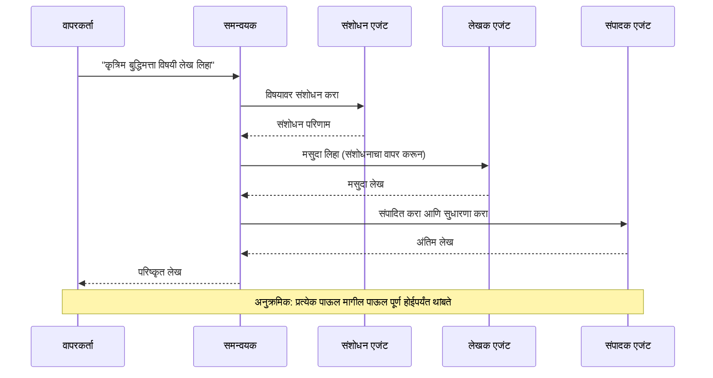
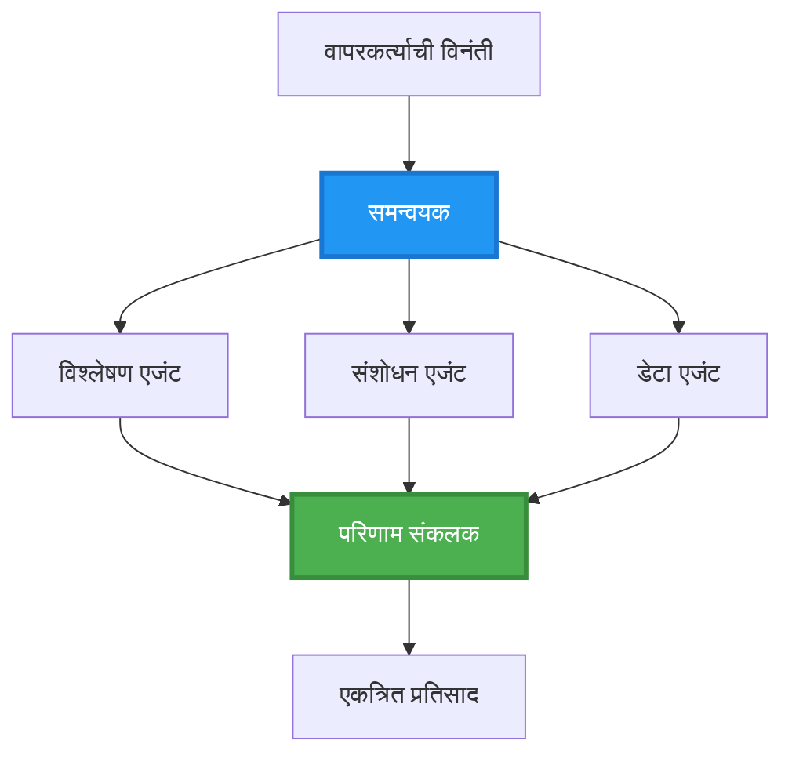
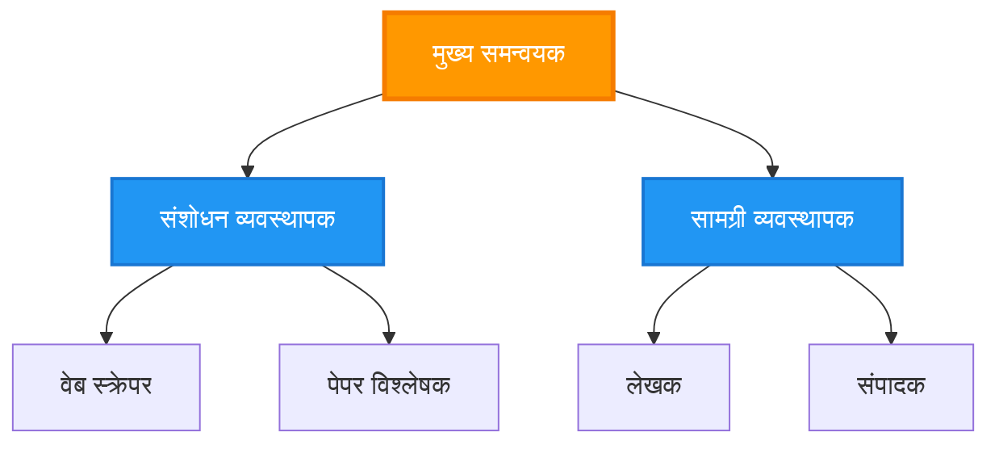
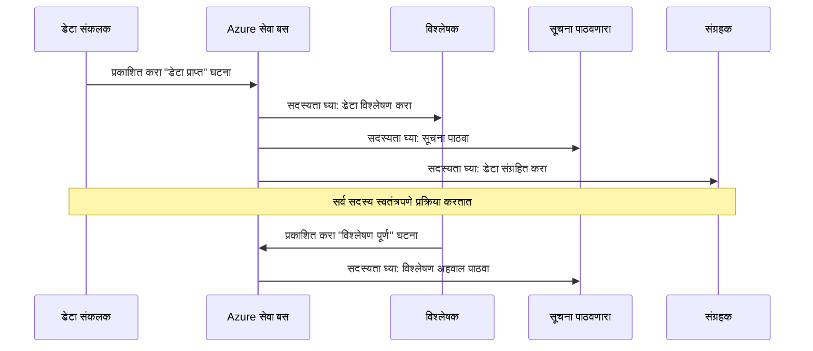
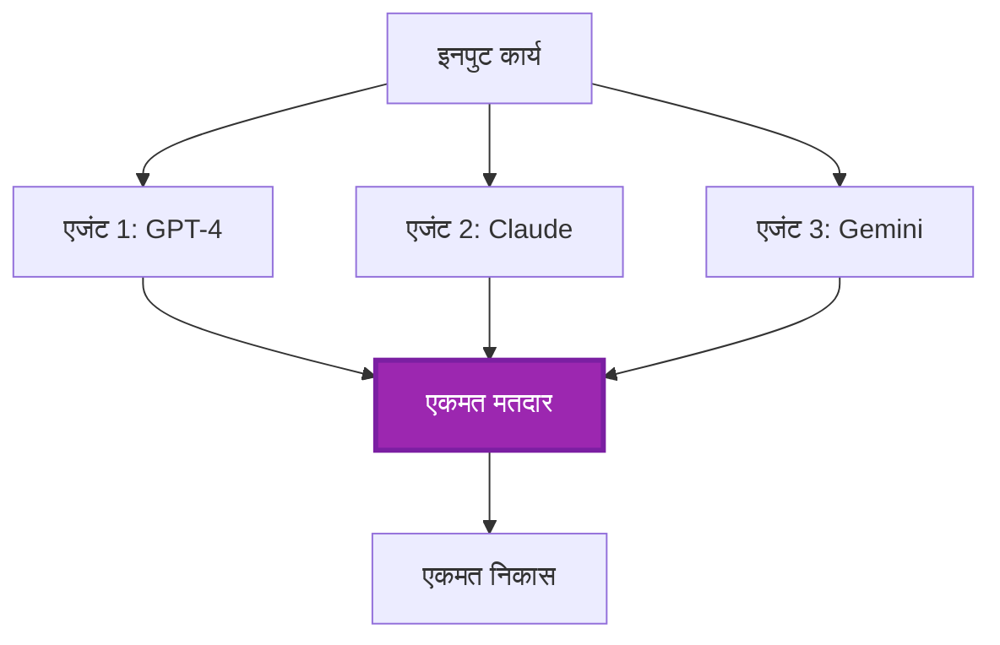
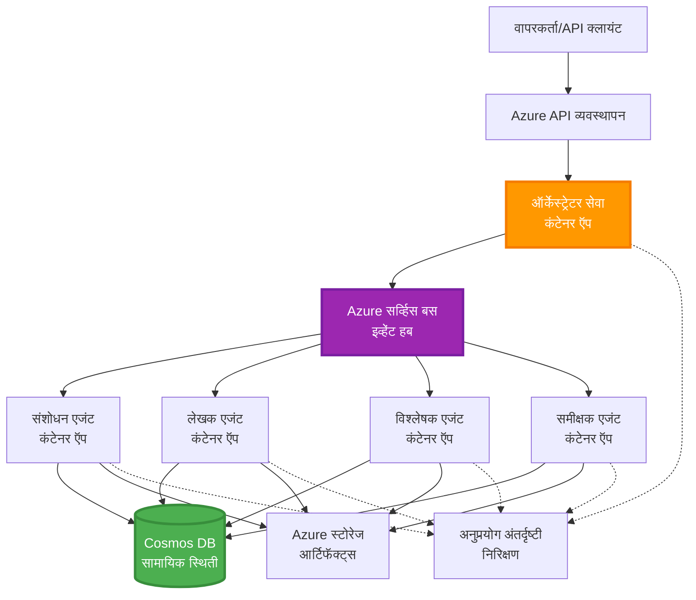

# मल्टी-एजंट समन्वय पॅटर्न्स

⏱️ **अनुमानित वेळ**: 60-75 मिनिटे | 💰 **अनुमानित खर्च**: ~$100-300/महिना | ⭐ **कठीणपणा**: उन्नत

**📚 शिकण्याचा मार्ग:**
- ← मागील: [क्षमता नियोजन](capacity-planning.md) - संसाधन आकार आणि स्केलिंग धोरणे
- 🎯 **आपण इथे आहात**: मल्टी-एजंट समन्वय पॅटर्न्स (ऑर्केस्ट्रेशन, संवाद, स्थिती व्यवस्थापन)
- → पुढे: [SKU निवड](sku-selection.md) - योग्य Azure सेवा निवडणे
- 🏠 [पाठ्यक्रम मुख्यपृष्ठ](../../README.md)

---

## आपण काय शिकाल

या धडा पूर्ण केल्यावर, आपण:
- समजून घ्याल **मल्टी-एजंट आर्किटेक्चर** पॅटर्न आणि त्यांचा वापर कधी करावा
- **ऑर्केस्ट्रेशन पॅटर्न्स** (केंद्रित, विकेंद्रित, श्रेणीबद्ध) अमलात आणाल
- **एजंट संवाद** धोरणे डिझाइन कराल (सामकालिक, असामकालिक, इव्हेंट-चालित)
- वितरित एजंट्समधील **सामायिक स्थिती** व्यवस्थापित कराल
- AZD वापरून Azure वर **मल्टी-एजंट सिस्टम** तैनात कराल
- वास्तविक AI परिस्थितींसाठी **समन्वय पॅटर्न** लागू कराल
- वितरित एजंट प्रणालीचे निरीक्षण आणि डीबग कराल

## मल्टी-एजंट समन्वय का महत्त्वाचा आहे

### उत्क्रांती: एकल एजंटपासून मल्टी-एजंटपर्यंत

**एकल एजंट (साधे):**
```
User → Agent → Response
```
- ✅ समजायला आणि राबवायला सोपे
- ✅ साध्या कामांसाठी जलद
- ❌ एकल मॉडेलच्या क्षमतेने मर्यादित
- ❌ जटिल कामे समांतरित करू शकत नाही
- ❌ विशेषीकरण नाही

**मल्टी-एजंट सिस्टम (उन्नत):**
```
           ┌─────────────┐
           │ Orchestrator│
           └──────┬──────┘
        ┌─────────┼─────────┐
        │         │         │
    ┌───▼──┐  ┌──▼───┐  ┌──▼────┐
    │Agent1│  │Agent2│  │Agent3 │
    │(Plan)│  │(Code)│  │(Review)│
    └──────┘  └──────┘  └───────┘
```
- ✅ विशिष्ट कामांसाठी विशेष एजंट्स
- ✅ गतीसाठी समांतर अंमलबजावणी
- ✅ मॉड्यूलर आणि देखभालयोग्य
- ✅ जटिल वर्कफ्लोमध्ये अधिक सक्षम
- ⚠️ समन्वय तर्क आवश्यक आहे

**उपमा**: एकल एजंट म्हणजे सर्व काम करणारी एक व्यक्तीसारखी आहे. मल्टी-एजंट म्हणजे अशी टीम ज्यात प्रत्येक सदस्याकडे विशिष्ट कौशल्ये असतात (संशोधक, कोडर, पुनरावलोकक, लेखक) आणि ते एकत्र काम करतात.

---

## मुख्य समन्वय पॅटर्न

### पॅटर्न 1: अनुक्रमिक समन्वय (जबाबदारीची साखळी)

**केव्हा वापरावे**: कामे विशिष्ट क्रमाने पूर्ण होणे आवश्यक असते, प्रत्येक एजंट मागील आउटपुटवर आधारित बनवतो.


**फायदे:**
- ✅ स्पष्ट डेटाचा प्रवाह
- ✅ डीबग करणे सोपे
- ✅ अंमलबजावणीचा आदेश निश्चित

**मर्यादा:**
- ❌ हळू (कोणतीही समांतरता नाही)
- ❌ एका अपयशामुळे संपूर्ण साखळी अडथळा येतो
- ❌ परस्पर अवलंबून असलेल्या कामांना हाताळू शकत नाही

**उदाहरण वापर प्रकरणे:**
- सामग्री निर्मिती पाईपलाइन (संशोधन → लेखन → संपादन → प्रकाशित)
- कोड जनरेशन (योजना → अंमलात आणणे → चाचणी → तैनात करणे)
- अहवाल निर्मिती (डेटा संकलन → विश्लेषण → दृश्यात्मकता → सारांश)

---

### पॅटर्न 2: समांतर समन्वय (Fan-Out/Fan-In)

**केव्हा वापरावे**: स्वतंत्र कामे एकाच वेळी चालवू शकतात, परिणाम शेवटी एकत्र केले जातात.


**फायदे:**
- ✅ जलद (समांतर अंमलबजावणी)
- ✅ दोष-प्रतिरोधक (आंशिक निकाल स्वीकार्य)
- ✅ क्षितीज पद्धतीने स्केल होते

**मर्यादा:**
- ⚠️ परिणाम क्रमाबाहेर येऊ शकतात
- ⚠️ एकत्रीकरण लॉजिक आवश्यक आहे
- ⚠️ जटिल स्थिती व्यवस्थापन

**उदाहरण वापर प्रकरणे:**
- बहु-स्रोत डेटा गोळा करणे (APIs + डेटाबेस + वेब स्क्रॅपिंग)
- स्पर्धात्मक विश्लेषण (एकाधिक मॉडेल्स सोल्यूशन्स निर्माण करतात, सर्वोत्तम निवडले जाते)
- भाषांतर सेवा (एकाच वेळी अनेक भाषांमध्ये भाषांतर)

---

### पॅटर्न 3: श्रेणीबद्ध समन्वय (मॅनेजर-वर्कर)

**केव्हा वापरावे**: उप-कार्यांसह जटिल वर्कफ्लो, प्रतिनिधित्व आवश्यक आहे.


**फायदे:**
- ✅ जटिल वर्कफ्लो हाताळते
- ✅ मॉड्यूलर आणि देखभालयोग्य
- ✅ जबाबदारीची स्पष्ट सीमा

**मर्यादा:**
- ⚠️ जास्त क्लिष्ट आर्किटेक्चर
- ⚠️ जास्त लेटेंसी (एकाधिक समन्वय स्तर)
- ⚠️ प्रगत ऑर्केस्ट्रेशन आवश्यक

**उदाहरण वापर प्रकरणे:**
- एंटरप्राइझ दस्तऐवज प्रक्रिया (वर्गीकरण → मार्गदर्शन → प्रक्रिया → अर्काइव्ह)
- मल्टी-स्टेज डेटा पाइपलाइन (इनजेस्ट → क्लीन → ट्रान्सफॉर्म → विश्लेषण → अहवाल)
- जटिल ऑटोमेशन वर्कफ्लो (योजना → संसाधन वाटप → अंमलबजावणी → मॉनिटरिंग)

---

### पॅटर्न 4: इव्हेंट-चालित समन्वय (Publish-Subscribe)

**केव्हा वापरावे**: एजंट्सना इव्हेंट्सवर प्रतिसाद द्यावा लागतो, सैल कपलिंग हवे असते.


**फायदे:**
- ✅ एजंट्समधील सैल कपलिंग
- ✅ नवीन एजंट्स सहज जोडता येतात (फक्त सबस्क्राइब करा)
- ✅ असामकालिक प्रक्रिया
- ✅ रेझिलियंट (मेसेज पर्सिस्टन्स)

**मर्यादा:**
- ⚠️ हळूहळू सुसंगती (eventual consistency)
- ⚠️ डीबगिंग क्लिष्ट
- ⚠️ मेसेज ऑर्डरिंगचे आव्हान

**उदाहरण वापर प्रकरणे:**
- रिअल-टाइम मॉनिटरिंग सिस्टीम (अलर्ट्स, डॅशबोर्ड, लॉग्स)
- मल्टी-चॅनेल नोटिफिकेशन्स (ईमेल, SMS, पुश, Slack)
- डेटा प्रोसेसिंग पाइपलाइन (त्याच डेटाचे अनेक कन्स्यूमर)

---

### पॅटर्न 5: कन्सेन्सस-आधारित समन्वय (मतदान/क्वोरम)

**केव्हा वापरावे**: पुढे जाण्यापूर्वी अनेक एजंट्सकडून करार आवश्यक असतो.


**फायदे:**
- ✅ अधिक अचूकता (एकाधिक मत)
- ✅ दोष-प्रतिरोधक (कमी संख्येचे अपयश स्वीकार्य)
- ✅ गुणवत्ता हमी अंतर्भूत

**मर्यादा:**
- ❌ महाग (एकाधिक मॉडेल कॉलस)
- ❌ हळू (सर्व एजंट्सची प्रतीक्षा)
- ⚠️ संघर्ष निराकरण आवश्यक

**उदाहरण वापर प्रकरणे:**
- सामग्री मॉडरेशन (एकाधिक मॉडेल्स सामग्रीचे पुनरावलोकन)
- कोड रिव्ह्यू (एकाधिक लिन्टर्स/विश्लेषक)
- वैद्यकीय निदान (एकाधिक AI मॉडेल्स, तज्ञ सत्यापन)

---

## आर्किटेक्चर आढावा

### Azure वर संपूर्ण मल्टी-एजंट सिस्टम


**मुख्य घटक:**

| घटक | उद्देश | Azure सेवा |
|-----------|---------|---------------|
| **API गेटवे** | प्रवेश बिंदू, रेट लिमिटिंग, प्रमाणीकरण | API Management |
| **ऑर्केस्ट्रेटर** | एजंट वर्कफ्लो समन्वयित करतो | Container Apps |
| **मेसेज क्व्यू** | असामकालिक संप्रेषण | Service Bus / Event Hubs |
| **एजंट्स** | विशेष AI वर्कर्स | Container Apps / Functions |
| **स्टेट स्टोअर** | सामायिक स्थिती, कार्य ट्रॅकिंग | Cosmos DB |
| **आर्टिफॅक्ट स्टोरेज** | दस्तऐवज, निकाल, लॉग्स | Blob Storage |
| **मॉनिटरिंग** | वितरित ट्रेसिंग, लॉग्स | Application Insights |

---

## पूर्वअट

### आवश्यक साधने

```bash
# Azure Developer CLI तपासा
azd version
# ✅ अपेक्षित: azd आवृत्ती 1.0.0 किंवा त्याहून अधिक

# Azure CLI तपासा
az --version
# ✅ अपेक्षित: azure-cli 2.50.0 किंवा त्याहून अधिक

# Docker तपासा (स्थानिक चाचणीसाठी)
docker --version
# ✅ अपेक्षित: Docker आवृत्ती 20.10 किंवा त्याहून अधिक
```

### Azure आवश्यकता

- सक्रिय Azure सदस्यता
- निर्माण करण्याची परवानगी:
  - Container Apps
  - Service Bus namespaces
  - Cosmos DB accounts
  - Storage accounts
  - Application Insights

### आवश्यक ज्ञान

आपण हे पूर्ण केलेले असावे:
- [कॉन्फिगरेशन व्यवस्थापन](../chapter-03-configuration/configuration.md)
- [प्रमाणीकरण आणि सुरक्षा](../chapter-03-configuration/authsecurity.md)
- [मायक्रोसर्व्हिसेस उदाहरण](../../../../examples/microservices)

---

## अंमलबजावणी मार्गदर्शक

### प्रोजेक्ट संरचना

```
multi-agent-system/
├── azure.yaml                    # AZD configuration
├── infra/
│   ├── main.bicep               # Main infrastructure
│   ├── core/
│   │   ├── servicebus.bicep     # Message queue
│   │   ├── cosmos.bicep         # State store
│   │   ├── storage.bicep        # Artifact storage
│   │   └── monitoring.bicep     # Application Insights
│   └── app/
│       ├── orchestrator.bicep   # Orchestrator service
│       └── agent.bicep          # Agent template
└── src/
    ├── orchestrator/            # Orchestration logic
    │   ├── app.py
    │   ├── workflows.py
    │   └── Dockerfile
    ├── agents/
    │   ├── research/            # Research agent
    │   ├── writer/              # Writer agent
    │   ├── analyst/             # Analyst agent
    │   └── reviewer/            # Reviewer agent
    └── shared/
        ├── state_manager.py     # Shared state logic
        └── message_handler.py   # Message handling
```

---

## धडा 1: अनुक्रमिक समन्वय पॅटर्न

### अंमलबजावणी: सामग्री निर्मिती पाईपलाइन

चला एक अनुक्रमिक पाईपलाइन तयार करूया: संशोधन → लेखन → संपादन → प्रकाशन

### 1. AZD कॉन्फिगरेशन

**फाईल: `azure.yaml`**

```yaml
name: content-pipeline
metadata:
  template: multi-agent-sequential@1.0.0

services:
  orchestrator:
    project: ./src/orchestrator
    language: python
    host: containerapp
  
  research-agent:
    project: ./src/agents/research
    language: python
    host: containerapp
  
  writer-agent:
    project: ./src/agents/writer
    language: python
    host: containerapp
  
  editor-agent:
    project: ./src/agents/editor
    language: python
    host: containerapp
```

### 2. पायाभूत सुविधा: समन्वयासाठी Service Bus

**फाईल: `infra/core/servicebus.bicep`**

```bicep
param name string
param location string
param tags object = {}

resource serviceBusNamespace 'Microsoft.ServiceBus/namespaces@2022-10-01-preview' = {
  name: name
  location: location
  tags: tags
  sku: {
    name: 'Standard'
    tier: 'Standard'
  }
  properties: {
    minimumTlsVersion: '1.2'
  }
}

// Queue for orchestrator → research agent
resource researchQueue 'Microsoft.ServiceBus/namespaces/queues@2022-10-01-preview' = {
  parent: serviceBusNamespace
  name: 'research-tasks'
  properties: {
    maxDeliveryCount: 3
    lockDuration: 'PT5M'
    deadLetteringOnMessageExpiration: true
  }
}

// Queue for research agent → writer agent
resource writerQueue 'Microsoft.ServiceBus/namespaces/queues@2022-10-01-preview' = {
  parent: serviceBusNamespace
  name: 'writer-tasks'
  properties: {
    maxDeliveryCount: 3
    lockDuration: 'PT5M'
  }
}

// Queue for writer agent → editor agent
resource editorQueue 'Microsoft.ServiceBus/namespaces/queues@2022-10-01-preview' = {
  parent: serviceBusNamespace
  name: 'editor-tasks'
  properties: {
    maxDeliveryCount: 3
    lockDuration: 'PT5M'
  }
}

output namespace string = serviceBusNamespace.name
output connectionString string = listKeys('${serviceBusNamespace.id}/AuthorizationRules/RootManageSharedAccessKey', serviceBusNamespace.apiVersion).primaryConnectionString
```

### 3. सामायिक स्टेट मॅनेजर

**फाईल: `src/shared/state_manager.py`**

```python
from azure.cosmos import CosmosClient, PartitionKey
from datetime import datetime
import os

class StateManager:
    """Manages shared state across agents using Cosmos DB"""
    
    def __init__(self):
        endpoint = os.environ['COSMOS_ENDPOINT']
        key = os.environ['COSMOS_KEY']
        
        self.client = CosmosClient(endpoint, key)
        self.database = self.client.get_database_client('agent-state')
        self.container = self.database.get_container_client('tasks')
    
    def create_task(self, task_id: str, task_type: str, input_data: dict):
        """Create a new task"""
        task = {
            'id': task_id,
            'type': task_type,
            'status': 'pending',
            'input': input_data,
            'created_at': datetime.utcnow().isoformat(),
            'steps': []
        }
        self.container.create_item(task)
        return task
    
    def update_task_step(self, task_id: str, step_name: str, result: dict):
        """Update task with completed step"""
        task = self.container.read_item(task_id, partition_key=task_id)
        
        task['steps'].append({
            'name': step_name,
            'completed_at': datetime.utcnow().isoformat(),
            'result': result
        })
        
        self.container.replace_item(task_id, task)
        return task
    
    def complete_task(self, task_id: str, final_result: dict):
        """Mark task as complete"""
        task = self.container.read_item(task_id, partition_key=task_id)
        task['status'] = 'completed'
        task['result'] = final_result
        task['completed_at'] = datetime.utcnow().isoformat()
        self.container.replace_item(task_id, task)
        return task
    
    def get_task(self, task_id: str):
        """Retrieve task state"""
        return self.container.read_item(task_id, partition_key=task_id)
```

### 4. ऑर्केस्ट्रेटर सेवा

**फाईल: `src/orchestrator/app.py`**

```python
from flask import Flask, request, jsonify
from azure.servicebus import ServiceBusClient, ServiceBusMessage
import json
import uuid
import os
from shared.state_manager import StateManager

app = Flask(__name__)
state_manager = StateManager()

# सर्व्हिस बस कनेक्शन
servicebus_connection_str = os.environ['SERVICEBUS_CONNECTION_STRING']
servicebus_client = ServiceBusClient.from_connection_string(servicebus_connection_str)

@app.route('/health', methods=['GET'])
def health():
    return jsonify({'status': 'healthy', 'service': 'orchestrator'})

@app.route('/create-content', methods=['POST'])
def create_content():
    """
    Sequential workflow: Research → Write → Edit → Publish
    """
    data = request.json
    topic = data.get('topic')
    
    if not topic:
        return jsonify({'error': 'Topic required'}), 400
    
    # स्टेट स्टोअरमध्ये कार्य तयार करा
    task_id = str(uuid.uuid4())
    task = state_manager.create_task(
        task_id=task_id,
        task_type='content_creation',
        input_data={'topic': topic}
    )
    
    # संशोधन एजंटला संदेश पाठवा (पहिला टप्पा)
    sender = servicebus_client.get_queue_sender('research-tasks')
    message = ServiceBusMessage(
        body=json.dumps({
            'task_id': task_id,
            'topic': topic,
            'next_queue': 'writer-tasks'  # परिणाम कुठे पाठवायचे
        }),
        content_type='application/json'
    )
    
    with sender:
        sender.send_messages(message)
    
    return jsonify({
        'task_id': task_id,
        'status': 'started',
        'workflow': 'sequential',
        'steps': ['research', 'write', 'edit', 'publish'],
        'message': 'Content creation pipeline initiated'
    }), 202

@app.route('/task/<task_id>', methods=['GET'])
def get_task_status(task_id):
    """Check task status"""
    try:
        task = state_manager.get_task(task_id)
        return jsonify(task)
    except Exception as e:
        return jsonify({'error': str(e)}), 404

if __name__ == '__main__':
    app.run(host='0.0.0.0', port=8080)
```

### 5. संशोधन एजंट

**फाईल: `src/agents/research/app.py`**

```python
from azure.servicebus import ServiceBusClient, ServiceBusMessage
from openai import AzureOpenAI
import json
import os
import time
from shared.state_manager import StateManager

# क्लायंट्स प्रारंभ करा
state_manager = StateManager()
servicebus_client = ServiceBusClient.from_connection_string(
    os.environ['SERVICEBUS_CONNECTION_STRING']
)

openai_client = AzureOpenAI(
    api_key=os.environ['AZURE_OPENAI_API_KEY'],
    api_version="2024-02-01",
    azure_endpoint=os.environ['AZURE_OPENAI_ENDPOINT']
)

def process_research_task(message_data):
    """Process research request and pass to writer"""
    task_id = message_data['task_id']
    topic = message_data['topic']
    next_queue = message_data['next_queue']
    
    print(f"🔬 Researching: {topic}")
    
    # संशोधनासाठी Azure OpenAI ला कॉल करा
    response = openai_client.chat.completions.create(
        model="gpt-4",
        messages=[
            {"role": "system", "content": "You are a research assistant. Provide comprehensive research on the given topic."},
            {"role": "user", "content": f"Research this topic thoroughly: {topic}"}
        ],
        max_tokens=1500
    )
    
    research_results = response.choices[0].message.content
    
    # स्थिती अद्ययावत करा
    state_manager.update_task_step(
        task_id=task_id,
        step_name='research',
        result={'research': research_results}
    )
    
    # पुढील एजंट (लेखक) कडे पाठवा
    sender = servicebus_client.get_queue_sender(next_queue)
    message = ServiceBusMessage(
        body=json.dumps({
            'task_id': task_id,
            'topic': topic,
            'research': research_results,
            'next_queue': 'editor-tasks'
        }),
        content_type='application/json'
    )
    
    with sender:
        sender.send_messages(message)
    
    print(f"✅ Research complete for task {task_id}")

def main():
    """Listen to research queue"""
    receiver = servicebus_client.get_queue_receiver('research-tasks')
    
    print("🔬 Research Agent started, listening for tasks...")
    
    with receiver:
        while True:
            messages = receiver.receive_messages(max_wait_time=5)
            for message in messages:
                try:
                    message_data = json.loads(str(message))
                    process_research_task(message_data)
                    receiver.complete_message(message)
                except Exception as e:
                    print(f"❌ Error processing message: {e}")
                    receiver.abandon_message(message)

if __name__ == '__main__':
    main()
```

### 6. लेखक एजंट

**फाईल: `src/agents/writer/app.py`**

```python
from azure.servicebus import ServiceBusClient, ServiceBusMessage
from openai import AzureOpenAI
import json
import os
from shared.state_manager import StateManager

state_manager = StateManager()
servicebus_client = ServiceBusClient.from_connection_string(
    os.environ['SERVICEBUS_CONNECTION_STRING']
)

openai_client = AzureOpenAI(
    api_key=os.environ['AZURE_OPENAI_API_KEY'],
    api_version="2024-02-01",
    azure_endpoint=os.environ['AZURE_OPENAI_ENDPOINT']
)

def process_writing_task(message_data):
    """Write article based on research"""
    task_id = message_data['task_id']
    topic = message_data['topic']
    research = message_data['research']
    next_queue = message_data['next_queue']
    
    print(f"✍️ Writing article: {topic}")
    
    # लेख लिहिण्यासाठी Azure OpenAI ला कॉल करा
    response = openai_client.chat.completions.create(
        model="gpt-4",
        messages=[
            {"role": "system", "content": "You are a professional writer. Write engaging, well-structured articles."},
            {"role": "user", "content": f"Based on this research:\n\n{research}\n\nWrite a comprehensive article about: {topic}"}
        ],
        max_tokens=2000
    )
    
    article_draft = response.choices[0].message.content
    
    # स्थिती अद्यतनित करा
    state_manager.update_task_step(
        task_id=task_id,
        step_name='writing',
        result={'draft': article_draft}
    )
    
    # संपादकाला पाठवा
    sender = servicebus_client.get_queue_sender(next_queue)
    message = ServiceBusMessage(
        body=json.dumps({
            'task_id': task_id,
            'topic': topic,
            'draft': article_draft
        }),
        content_type='application/json'
    )
    
    with sender:
        sender.send_messages(message)
    
    print(f"✅ Article draft complete for task {task_id}")

def main():
    """Listen to writer queue"""
    receiver = servicebus_client.get_queue_receiver('writer-tasks')
    
    print("✍️ Writer Agent started, listening for tasks...")
    
    with receiver:
        while True:
            messages = receiver.receive_messages(max_wait_time=5)
            for message in messages:
                try:
                    message_data = json.loads(str(message))
                    process_writing_task(message_data)
                    receiver.complete_message(message)
                except Exception as e:
                    print(f"❌ Error: {e}")
                    receiver.abandon_message(message)

if __name__ == '__main__':
    main()
```

### 7. संपादक एजंट

**फाईल: `src/agents/editor/app.py`**

```python
from azure.servicebus import ServiceBusClient
from openai import AzureOpenAI
import json
import os
from shared.state_manager import StateManager

state_manager = StateManager()
servicebus_client = ServiceBusClient.from_connection_string(
    os.environ['SERVICEBUS_CONNECTION_STRING']
)

openai_client = AzureOpenAI(
    api_key=os.environ['AZURE_OPENAI_API_KEY'],
    api_version="2024-02-01",
    azure_endpoint=os.environ['AZURE_OPENAI_ENDPOINT']
)

def process_editing_task(message_data):
    """Edit and finalize article"""
    task_id = message_data['task_id']
    topic = message_data['topic']
    draft = message_data['draft']
    
    print(f"📝 Editing article: {topic}")
    
    # एडिट करण्यासाठी Azure OpenAI ला कॉल करा
    response = openai_client.chat.completions.create(
        model="gpt-4",
        messages=[
            {"role": "system", "content": "You are an expert editor. Improve grammar, clarity, and structure."},
            {"role": "user", "content": f"Edit and improve this article:\n\n{draft}"}
        ],
        max_tokens=2000
    )
    
    final_article = response.choices[0].message.content
    
    # टास्क पूर्ण म्हणून चिन्हांकित करा
    state_manager.complete_task(
        task_id=task_id,
        final_result={
            'topic': topic,
            'final_article': final_article,
            'word_count': len(final_article.split())
        }
    )
    
    print(f"✅ Article finalized for task {task_id}")

def main():
    """Listen to editor queue"""
    receiver = servicebus_client.get_queue_receiver('editor-tasks')
    
    print("📝 Editor Agent started, listening for tasks...")
    
    with receiver:
        while True:
            messages = receiver.receive_messages(max_wait_time=5)
            for message in messages:
                try:
                    message_data = json.loads(str(message))
                    process_editing_task(message_data)
                    receiver.complete_message(message)
                except Exception as e:
                    print(f"❌ Error: {e}")
                    receiver.abandon_message(message)

if __name__ == '__main__':
    main()
```

### 8. तैनात करा आणि चाचणी करा

```bash
# प्रारंभ करा आणि तैनात करा
azd init
azd up

# ऑर्केस्ट्रेटरचा URL मिळवा
ORCHESTRATOR_URL=$(azd env get-values | grep ORCHESTRATOR_URL | cut -d '=' -f2 | tr -d '"')

# सामग्री तयार करा
curl -X POST $ORCHESTRATOR_URL/create-content \
  -H "Content-Type: application/json" \
  -d '{"topic": "The Future of AI in Healthcare"}'
```

**✅ अपेक्षित आउटपुट:**
```json
{
  "task_id": "a1b2c3d4-e5f6-7890-abcd-ef1234567890",
  "status": "started",
  "workflow": "sequential",
  "steps": ["research", "write", "edit", "publish"],
  "message": "Content creation pipeline initiated"
}
```

**कार्य प्रगती तपासा:**
```bash
TASK_ID="a1b2c3d4-e5f6-7890-abcd-ef1234567890"
curl $ORCHESTRATOR_URL/task/$TASK_ID
```

**✅ अपेक्षित आउटपुट (पूर्ण):**
```json
{
  "id": "a1b2c3d4-e5f6-7890-abcd-ef1234567890",
  "type": "content_creation",
  "status": "completed",
  "steps": [
    {
      "name": "research",
      "completed_at": "2025-11-19T10:30:00Z",
      "result": {"research": "..."}
    },
    {
      "name": "writing",
      "completed_at": "2025-11-19T10:32:00Z",
      "result": {"draft": "..."}
    }
  ],
  "result": {
    "topic": "The Future of AI in Healthcare",
    "final_article": "...",
    "word_count": 1500
  }
}
```

---

## धडा 2: समांतर समन्वय पॅटर्न

### अंमलबजावणी: बहु-स्रोत संशोधन संकलक

चला अशी समांतर प्रणाली तयार करूया जी अनेक स्रोतांमधून एकाच वेळी माहिती गोळा करते.

### समांतर ऑर्केस्ट्रेटर

**फाईल: `src/orchestrator/parallel_workflow.py`**

```python
from flask import Flask, request, jsonify
from azure.servicebus import ServiceBusClient, ServiceBusMessage
import json
import uuid
import os
from shared.state_manager import StateManager

app = Flask(__name__)
state_manager = StateManager()

servicebus_client = ServiceBusClient.from_connection_string(
    os.environ['SERVICEBUS_CONNECTION_STRING']
)

@app.route('/research-parallel', methods=['POST'])
def research_parallel():
    """
    Parallel workflow: Multiple agents work simultaneously
    """
    data = request.json
    query = data.get('query')
    
    task_id = str(uuid.uuid4())
    task = state_manager.create_task(
        task_id=task_id,
        task_type='parallel_research',
        input_data={
            'query': query,
            'agents': ['web', 'academic', 'news', 'social']
        }
    )
    
    # फॅन-आऊट: सर्व एजंटांना एकाच वेळी पाठवा
    agents = [
        ('web-research-queue', 'web'),
        ('academic-research-queue', 'academic'),
        ('news-research-queue', 'news'),
        ('social-research-queue', 'social')
    ]
    
    for queue_name, agent_type in agents:
        sender = servicebus_client.get_queue_sender(queue_name)
        message = ServiceBusMessage(
            body=json.dumps({
                'task_id': task_id,
                'query': query,
                'agent_type': agent_type,
                'result_queue': 'aggregation-queue'
            }),
            content_type='application/json'
        )
        
        with sender:
            sender.send_messages(message)
    
    return jsonify({
        'task_id': task_id,
        'status': 'started',
        'workflow': 'parallel',
        'agents_dispatched': 4,
        'message': 'Parallel research initiated'
    }), 202

if __name__ == '__main__':
    app.run(host='0.0.0.0', port=8080)
```

### एकत्रीकरण लॉजिक

**फाईल: `src/agents/aggregator/app.py`**

```python
from azure.servicebus import ServiceBusClient
import json
import os
from collections import defaultdict
from shared.state_manager import StateManager

state_manager = StateManager()
servicebus_client = ServiceBusClient.from_connection_string(
    os.environ['SERVICEBUS_CONNECTION_STRING']
)

# प्रत्येक कार्यासाठी निकाल ट्रॅक करा
task_results = defaultdict(list)
expected_agents = 4  # वेब, शैक्षणिक, बातम्या, सामाजिक

def process_result(message_data):
    """Aggregate results from parallel agents"""
    task_id = message_data['task_id']
    agent_type = message_data['agent_type']
    result = message_data['result']
    
    # निकाल साठवा
    task_results[task_id].append({
        'agent': agent_type,
        'data': result
    })
    
    print(f"📊 Received result from {agent_type} agent ({len(task_results[task_id])}/{expected_agents})")
    
    # सर्व एजंटांनी पूर्ण केले आहेत का ते तपासा (फॅन-इन)
    if len(task_results[task_id]) == expected_agents:
        print(f"✅ All agents completed for task {task_id}. Aggregating...")
        
        # निकाल एकत्र करा
        aggregated = {
            'query': message_data['query'],
            'sources': task_results[task_id],
            'summary': generate_summary(task_results[task_id])
        }
        
        # पूर्ण म्हणून चिन्हांकित करा
        state_manager.complete_task(task_id, aggregated)
        
        # साफ करा
        del task_results[task_id]
        
        print(f"✅ Aggregation complete for task {task_id}")

def generate_summary(results):
    """Generate summary from all sources"""
    summaries = [r['data'].get('summary', '') for r in results]
    return '\n\n'.join(summaries)

def main():
    """Listen to aggregation queue"""
    receiver = servicebus_client.get_queue_receiver('aggregation-queue')
    
    print("📊 Aggregator started, listening for results...")
    
    with receiver:
        while True:
            messages = receiver.receive_messages(max_wait_time=5)
            for message in messages:
                try:
                    message_data = json.loads(str(message))
                    process_result(message_data)
                    receiver.complete_message(message)
                except Exception as e:
                    print(f"❌ Error: {e}")
                    receiver.abandon_message(message)

if __name__ == '__main__':
    main()
```

**समांतर पॅटर्नचे फायदे:**
- ⚡ **4x जलद** (एजंट्स एकाच वेळी चालतात)
- 🔄 **दोष-प्रतिरोधक** (आंशिक निकाल स्वीकार्य)
- 📈 **स्केलेबल** (आवश्यकतेनुसार अधिक एजंट्स सहज जोडता येतात)

---

## व्यावहारिक व्यायाम

### व्यायाम 1: टाइमआउट हँडलिंग जोडा ⭐⭐ (मध्यम)

**लक्ष्य**: टाइमआउट लॉजिक अमलात आणा जेणेकरून संकलक हळू एजंटसाठी अनंतकाळ प्रतीक्षा करणार नाही.

**पायऱ्या**:

1. **संकलकमध्ये टाइमआउट ट्रॅकिंग जोडा:**

```python
from datetime import datetime, timedelta

task_timeouts = {}  # task_id -> समाप्ती_वेळ

def process_result(message_data):
    task_id = message_data['task_id']
    
    # पहिल्या निकालावर वेळमर्यादा सेट करा
    if task_id not in task_timeouts:
        task_timeouts[task_id] = datetime.utcnow() + timedelta(seconds=30)
    
    task_results[task_id].append({
        'agent': message_data['agent_type'],
        'data': message_data['result']
    })
    
    # पूर्ण आहे की वेळ संपली आहे ते तपासा
    if len(task_results[task_id]) == expected_agents or \
       datetime.utcnow() > task_timeouts[task_id]:
        
        print(f"📊 Aggregating with {len(task_results[task_id])}/{expected_agents} results")
        
        aggregated = {
            'query': message_data['query'],
            'sources': task_results[task_id],
            'completed_agents': len(task_results[task_id]),
            'timed_out': len(task_results[task_id]) < expected_agents
        }
        
        state_manager.complete_task(task_id, aggregated)
        
        # साफसफाई
        del task_results[task_id]
        del task_timeouts[task_id]
```

2. **कृत्रिम विलंबांसह चाचणी करा:**

```python
# एका एजंटमध्ये हळू प्रक्रिया अनुकरण करण्यासाठी विलंब जोडा
import time
time.sleep(35)  # 30 सेकंदांच्या टाइमआउटची मर्यादा ओलांडते
```

3. **तैनात करा आणि सत्यापित करा:**

```bash
azd deploy aggregator

# कार्य सादर करा
curl -X POST $ORCHESTRATOR_URL/research-parallel \
  -H "Content-Type: application/json" \
  -d '{"query": "AI safety research"}'

# 30 सेकंदांनी निकाल तपासा
curl $ORCHESTRATOR_URL/task/$TASK_ID
```

**✅ यश निकष:**
- ✅ कार्य 30 सेकंदांनंतर पूर्ण होते जरी एजंट्स अपूर्ण असले तरी
- ✅ प्रतिसाद आंशिक निकाल दर्शवितो (`"timed_out": true`)
- ✅ उपलब्ध निकाल परत केले जातात (4 पैकी 3 एजंट्स)

**वेळ**: 20-25 मिनिटे

---

### व्यायाम 2: रीट्राय लॉजिक अमलात आणा ⭐⭐⭐ (उन्नत)

**लक्ष्य**: अपयशी एजंट कार्ये आपोआप पुन्हा प्रयत्न करावीत, आणि नंतरच त्यांना सोडले जावे.

**पायऱ्या**:

1. **ऑर्केस्ट्रेटरमध्ये रीट्राय ट्रॅकिंग जोडा:**

```python
from dataclasses import dataclass
from typing import Dict

@dataclass
class RetryConfig:
    max_retries: int = 3
    backoff_seconds: int = 5

retry_counts: Dict[str, int] = {}  # संदेश_आयडी -> पुनःप्रयत्न_संख्या

def send_with_retry(queue_name: str, message_data: dict, retry_config: RetryConfig):
    """Send message with retry metadata"""
    message_id = message_data.get('message_id', str(uuid.uuid4()))
    message_data['message_id'] = message_id
    message_data['retry_count'] = retry_counts.get(message_id, 0)
    message_data['max_retries'] = retry_config.max_retries
    
    sender = servicebus_client.get_queue_sender(queue_name)
    message = ServiceBusMessage(
        body=json.dumps(message_data),
        content_type='application/json',
        message_id=message_id
    )
    
    with sender:
        sender.send_messages(message)
```

2. **एजंट्समध्ये रीट्राय हॅन्डलर जोडा:**

```python
def process_with_retry(message, receiver, process_func):
    """Process message with automatic retry on failure"""
    try:
        message_data = json.loads(str(message))
        
        # संदेशावर प्रक्रिया करा
        process_func(message_data)
        
        # यश - पूर्ण
        receiver.complete_message(message)
        
    except Exception as e:
        message_id = message.message_id
        retry_count = message_data.get('retry_count', 0)
        max_retries = message_data.get('max_retries', 3)
        
        if retry_count < max_retries:
            # पुन्हा प्रयत्न करा: प्रक्रिया सोडून द्या आणि वाढलेली प्रयत्न संख्या असलेली रांगेत पुन्हा ठेवा
            print(f"⚠️ Retry {retry_count + 1}/{max_retries} for message {message_id}")
            
            message_data['retry_count'] = retry_count + 1
            
            # विलंबासह त्याच रांगेत परत पाठवा
            time.sleep(5 * (retry_count + 1))  # घातांकात्मक बॅकऑफ
            send_with_retry(queue_name, message_data, RetryConfig())
            
            receiver.complete_message(message)  # मूळ काढून टाका
        else:
            # कमाल प्रयत्न ओलांडले - मृत पत्र रांगेत हलवा
            print(f"❌ Max retries exceeded for message {message_id}")
            receiver.dead_letter_message(
                message,
                reason="MaxRetriesExceeded",
                error_description=str(e)
            )
```

3. **डेड लेटर क्व्यूचे निरीक्षण करा:**

```python
def monitor_dead_letters():
    """Check dead letter queue for failed messages"""
    receiver = servicebus_client.get_queue_receiver(
        'research-queue',
        sub_queue='deadletter'
    )
    
    with receiver:
        messages = receiver.receive_messages(max_wait_time=5)
        for message in messages:
            print(f"☠️ Dead letter: {message.message_id}")
            print(f"Reason: {message.dead_letter_reason}")
            print(f"Description: {message.dead_letter_error_description}")
```

**✅ यश निकष:**
- ✅ अपयशी कामे स्वयंचलितपणे पुन्हा प्रयत्न होतात (कमाल 3 वेळा)
- ✅ रीट्राय दरम्यान घातांकी बॅकऑफ (5s, 10s, 15s)
- ✅ कमाल रीट्रायनंतर संदेश डेड लेटर क्व्यूमध्ये जातात
- ✅ डेड लेटर क्व्यूचे निरीक्षण आणि रीप्ले करू शकता

**वेळ**: 30-40 मिनिटे

---

### व्यायाम 3: सर्किट ब्रेकर अमलात आणा ⭐⭐⭐ (उन्नत)

**लक्ष्य**: अपयशाच्या साखळीस प्रतिबंध करण्यासाठी फेल होत असलेल्या एजंट्सकडे विनंत्या थांबवणे.

**पायऱ्या**:

1. **सर्किट ब्रेकर क्लास तयार करा:**

```python
from enum import Enum
from datetime import datetime, timedelta

class CircuitState(Enum):
    CLOSED = "closed"      # सामान्य कार्यप्रणाली
    OPEN = "open"          # अपयशी, विनंत्या नाकारत आहेत
    HALF_OPEN = "half_open"  # पुन्हा कार्यरत आहे का तपासत आहे

class CircuitBreaker:
    def __init__(self, failure_threshold=5, timeout_seconds=60):
        self.failure_threshold = failure_threshold
        self.timeout_seconds = timeout_seconds
        self.failure_count = 0
        self.last_failure_time = None
        self.state = CircuitState.CLOSED
    
    def call(self, func):
        """Execute function with circuit breaker protection"""
        if self.state == CircuitState.OPEN:
            # टाइमआउट संपला आहे का तपासा
            if datetime.utcnow() - self.last_failure_time > timedelta(seconds=self.timeout_seconds):
                self.state = CircuitState.HALF_OPEN
                print("🔄 Circuit breaker: HALF_OPEN (testing)")
            else:
                raise Exception(f"Circuit breaker OPEN for agent. Try again in {self.timeout_seconds}s")
        
        try:
            result = func()
            
            # यश
            if self.state == CircuitState.HALF_OPEN:
                self.state = CircuitState.CLOSED
                self.failure_count = 0
                print("✅ Circuit breaker: CLOSED (recovered)")
            
            return result
            
        except Exception as e:
            self.failure_count += 1
            self.last_failure_time = datetime.utcnow()
            
            if self.failure_count >= self.failure_threshold:
                self.state = CircuitState.OPEN
                print(f"🔴 Circuit breaker: OPEN (too many failures)")
            
            raise e
```

2. **एजंट कॉल्सवर लागू करा:**

```python
# ऑर्केस्ट्रेटरमध्ये
agent_circuits = {
    'web': CircuitBreaker(failure_threshold=5, timeout_seconds=60),
    'academic': CircuitBreaker(failure_threshold=5, timeout_seconds=60),
    'news': CircuitBreaker(failure_threshold=5, timeout_seconds=60),
    'social': CircuitBreaker(failure_threshold=5, timeout_seconds=60)
}

def send_to_agent(agent_type, message_data):
    """Send with circuit breaker protection"""
    circuit = agent_circuits[agent_type]
    
    try:
        circuit.call(lambda: send_message(agent_type, message_data))
    except Exception as e:
        print(f"⚠️ Skipping {agent_type} agent: {e}")
        # इतर एजंटांसोबत पुढे सुरू ठेवा
```

3. **सर्किट ब्रेकरची चाचणी करा:**

```bash
# पुन्हा पुन्हा अपयशांचे अनुकरण करा (एका एजंटला थांबवा)
az containerapp stop --name web-research-agent --resource-group rg-agents

# एकाधिक विनंत्या पाठवा
for i in {1..10}; do
  curl -X POST $ORCHESTRATOR_URL/research-parallel \
    -H "Content-Type: application/json" \
    -d '{"query": "test query '$i'"}'
  sleep 2
done

# लॉग तपासा - 5 अपयशांनंतर सर्किट उघडलेले दिसायला हवे
# Container App नोंदींसाठी Azure CLI वापरा:
az containerapp logs show --name orchestrator --resource-group $RG_NAME --tail 50
```

**✅ यश निकष:**
- ✅ 5 अपयशांनंतर सर्किट उघडे होते (विनंत्या नाकारल्या जातात)
- ✅ 60 सेकंदांनंतर सर्किट हाफ-ओपन होते (रिकव्हरीची चाचणी)
- ✅ इतर एजंट सामान्यपणे चालू राहतात
- ✅ एजंट पुनर्प्राप्त होताच सर्किट आपोआप बंद होते

**वेळ**: 40-50 मिनिटे

---

## मॉनिटरिंग आणि डीबगिंग

### Application Insights सह वितरित ट्रेसिंग

**फाईल: `src/shared/tracing.py`**

```python
from opencensus.ext.azure.log_exporter import AzureLogHandler
from opencensus.ext.azure.trace_exporter import AzureExporter
from opencensus.trace import config_integration
from opencensus.trace.tracer import Tracer
from opencensus.trace.samplers import AlwaysOnSampler
import logging
import os

# ट्रेसिंग कॉन्फिगर करा
config_integration.trace_integrations(['requests', 'logging'])

connection_string = os.environ.get('APPLICATIONINSIGHTS_CONNECTION_STRING')

# ट्रेसर तयार करा
tracer = Tracer(
    exporter=AzureExporter(connection_string=connection_string),
    sampler=AlwaysOnSampler()
)

# लॉगिंग कॉन्फिगर करा
logger = logging.getLogger(__name__)
logger.addHandler(AzureLogHandler(connection_string=connection_string))
logger.setLevel(logging.INFO)

def trace_agent_call(agent_name, task_id, operation):
    """Trace agent operations"""
    with tracer.span(name=f'{agent_name}.{operation}') as span:
        span.add_attribute('agent', agent_name)
        span.add_attribute('task_id', task_id)
        span.add_attribute('operation', operation)
        
        try:
            result = operation()
            span.add_attribute('status', 'success')
            return result
        except Exception as e:
            span.add_attribute('status', 'error')
            span.add_attribute('error', str(e))
            raise
```

### Application Insights क्वेरी

**मल्टी-एजंट वर्कफ्लो ट्रॅक करा:**

```kusto
// Trace complete workflow for a task
traces
| where customDimensions.task_id == "a1b2c3d4-..."
| project timestamp, message, customDimensions.agent, customDimensions.operation
| order by timestamp asc
```

**एजंट कार्यक्षमता तुलना:**

```kusto
// Compare agent execution times
dependencies
| where name contains "agent"
| summarize 
    avg_duration = avg(duration),
    p95_duration = percentile(duration, 95),
    count = count()
  by agent = tostring(customDimensions.agent)
| order by avg_duration desc
```

**अपयश विश्लेषण:**

```kusto
// Find which agents fail most
exceptions
| where customDimensions.agent != ""
| summarize 
    failure_count = count(),
    unique_errors = dcount(outerMessage)
  by agent = tostring(customDimensions.agent)
| order by failure_count desc
```

---

## खर्च विश्लेषण

### मल्टी-एजंट सिस्टम खर्च (मासिक अनुमान)

| घटक | कॉन्फिगरेशन | खर्च |
|-----------|--------------|------|
| **ऑर्केस्ट्रेटर** | 1 Container App (1 vCPU, 2GB) | $30-50 |
| **4 एजंट्स** | 4 Container Apps (0.5 vCPU, 1GB प्रत्येक) | $60-120 |
| **Service Bus** | Standard tier, 10M messages | $10-20 |
| **Cosmos DB** | Serverless, 5GB storage, 1M RUs | $25-50 |
| **Blob Storage** | 10GB storage, 100K operations | $5-10 |
| **Application Insights** | 5GB ingestion | $10-15 |
| **Azure OpenAI** | GPT-4, 10M tokens | $100-300 |
| **एकूण** | | **$240-565/महिना** |

### खर्च कमी करण्याच्या धोरणे

1. **जिथे शक्य तिथे सर्व्हरलेस वापरा:**
   ```bicep
   // Cosmos DB serverless (no minimum cost)
   properties: {
     databaseAccountOfferType: 'Standard'
     capabilities: [{ name: 'EnableServerless' }]
   }
   ```

2. **निष्क्रिय असताना एजंट्सना शून्यावर स्केल करा:**
   ```bicep
   scale: {
     minReplicas: 0  // Scale to zero when no messages
     maxReplicas: 10
   }
   ```

3. **Service Bus साठी बॅचिंग वापरा:**
   ```python
   # संदेश बॅचमध्ये पाठवा (स्वस्त)
   sender.send_messages([message1, message2, message3])
   ```

4. **वारंवार वापरलेले निकाल कॅश करा:**
   ```python
   # Azure Cache for Redis वापरा
   if cache.exists(query_hash):
       return cache.get(query_hash)
   ```

---

## सर्वोत्तम सराव

### ✅ करावेत:

1. **आयडेम्पोटेंट ऑपरेशन्स वापरा**
   ```python
   # एजंट एकाच संदेशाची अनेक वेळा सुरक्षितपणे प्रक्रिया करू शकतो
   def process_task(task_id):
       if state_manager.task_exists(task_id):
           print(f"Task {task_id} already processed, skipping")
           return
       # कार्य प्रक्रिया...
   ```

2. **व्यापक लॉगिंग अंमलात आणा**
   ```python
   logger.info(f"Agent: {agent_name}, Task: {task_id}, Action: {action}")
   ```

3. **Correlation IDs वापरा**
   ```python
   # task_id संपूर्ण कार्यप्रवाहाद्वारे पारित करा
   message_data = {
       'task_id': task_id,  # संबंधित आयडी
       'timestamp': datetime.utcnow().isoformat()
   }
   ```

4. **मेसेज TTL (time-to-live) सेट करा**
   ```bicep
   properties: {
     defaultMessageTimeToLive: 'PT1H'  // 1 hour max
   }
   ```

5. **डेड लेटर क्व्यूजचे निरीक्षण करा**
   ```python
   # अयशस्वी संदेशांचे नियमित निरीक्षण
   monitor_dead_letters()
   ```

### ❌ करू नका:

1. **सर्क्युलर अवलंबित्व निर्माण करू नका**
   ```python
   # ❌ वाईट: एजंट A → एजंट B → एजंट A (अनंत लूप)
   # ✅ चांगले: स्पष्ट निर्देशित चक्ररहित ग्राफ (DAG) परिभाषित करा
   ```

2. **एजंट थ्रेड्स अडवू नका**
   ```python
   # ❌ वाईट: समकालिक प्रतीक्षा
   while not task_complete:
       time.sleep(1)
   
   # ✅ चांगले: संदेश कतारातील कॉलबॅक्स वापरा
   ```

3. **आंशिक अपयशांकडे दुर्लक्ष करू नका**
   ```python
   # ❌ वाईट: जर एका एजंटाचे अपयश झाले तर संपूर्ण वर्कफ्लो अयशस्वी करणे
   # ✅ चांगले: त्रुटी निर्देशकांसह आंशिक निकाल परत करणे
   ```

4. **अमर्याद पुनर्प्रयत्न वापरू नका**
   ```python
   # ❌ वाईट: सतत पुन्हा प्रयत्न करणे
   # ✅ योग्य: max_retries = 3, नंतर डेड-लेटर
   ```

---
## समस्या निवारण मार्गदर्शक

### समस्या: संदेश रांगेत अडकले आहेत

**लक्षणे:**
- संदेश रांगेत जमा होतात
- एजंट्स प्रक्रिया करत नाहीत
- टास्क स्थिती "pending" वर अडकलेली

**निदान:**
```bash
# क्यूची खोली तपासा
az servicebus queue show \
  --namespace-name mybus \
  --name research-tasks \
  --query "countDetails"

# Azure CLI वापरून एजंट लॉग तपासा
az containerapp logs show --name research-agent --resource-group $RG_NAME --tail 50
```

**उपाय:**

1. **एजंटच्या रेप्लिकांची संख्या वाढवा:**
   ```bash
   az containerapp update \
     --name research-agent \
     --min-replicas 3 \
     --max-replicas 10
   ```

2. **डेड लेटर क्यू तपासा:**
   ```bash
   az servicebus queue show \
     --namespace-name mybus \
     --name research-tasks \
     --query "countDetails.deadLetterMessageCount"
   ```

---

### समस्या: टास्क टाइमआऊट / कधीच पूर्ण होत नाही

**लक्षणे:**
- टास्क स्थिती "in_progress" राहते
- काही एजंट पूर्ण होतात, इतर पूर्ण होत नाहीत
- त्रुटी संदेश नाहीत

**निदान:**
```bash
# टास्कची स्थिती तपासा
curl $ORCHESTRATOR_URL/task/$TASK_ID

# Application Insights तपासा
# क्वेरी चालवा: traces | where customDimensions.task_id == "..."
```

**उपाय:**

1. **अ‍ॅग्रीगेटरमध्ये टाइमआउट अमलात आणा (व्यायाम 1)**

2. **Azure Monitor चा वापर करून एजंट अपयश तपासा:**
   ```bash
   # azd monitor वापरून लॉग पहा
   azd monitor --logs
   
   # किंवा Azure CLI वापरून विशिष्ट कंटेनर अॅपचे लॉग तपासा
   az containerapp logs show --name <agent-name> --resource-group $RG_NAME --follow | grep "ERROR\|FAIL"
   ```

3. **सर्व एजंट चालू आहेत का याची पडताळणी करा:**
   ```bash
   az containerapp list \
     --resource-group rg-agents \
     --query "[].{name:name, status:properties.runningStatus}"
   ```

---

## अधिक जाणून घ्या

### अधिकृत दस्तऐवज
- [Azure Service Bus](https://learn.microsoft.com/azure/service-bus-messaging/service-bus-messaging-overview)
- [Cosmos DB](https://learn.microsoft.com/azure/cosmos-db/introduction)
- [Container Apps DAPR](https://learn.microsoft.com/azure/container-apps/dapr-overview)
- [Multi-Agent Design Patterns](https://learn.microsoft.com/azure/architecture/guide/ai/multi-agent-systems)

### या कोर्समधील पुढील टप्पे
- ← मागील: [क्षमता नियोजन](capacity-planning.md)
- → पुढे: [SKU निवड](sku-selection.md)
- 🏠 [कोर्स मुख्यपृष्ठ](../../README.md)

### संबंधित उदाहरणे
- [Microservices Example](../../../../examples/microservices) - सेवा संवाद पॅटर्न
- [Azure OpenAI Example](../../../../examples/azure-openai-chat) - AI एकत्रीकरण

---

## सारांश

**आपण शिकलात:**
- ✅ पाच समन्वय नमुने (अनुक्रमिक, समांतर, श्रेणीबद्ध, इव्हेंट-चालित, सहमती)
- ✅ Azure वर मल्टी-एजंट आर्किटेक्चर (Service Bus, Cosmos DB, Container Apps)
- ✅ वितरित एजंट्समधील स्थिती व्यवस्थापन
- ✅ टाइमआउट हाताळणी, पुन्हा प्रयत्न, आणि सर्किट ब्रेकर
- ✅ वितरित प्रणालींचे निरीक्षण आणि डीबगिंग
- ✅ खर्च अनुकूलन धोरणे

**मुख्य गोष्टी:**
1. **योग्य नमुना निवडा** - क्रमबद्ध कार्यांसाठी अनुक्रमिक, वेगासाठी समांतर, लवचीकतेसाठी इव्हेंट-चालित
2. **स्थिती काळजीपूर्वक व्यवस्थापित करा** - सामायिक स्थितीसाठी Cosmos DB किंवा तत्सम वापरा
3. **अपयशे सुरळीतपणे हाताळा** - टाइमआउट, पुन्हा प्रयत्न, सर्किट ब्रेकर, डेड लेटर क्यूज
4. **सर्वकाही निरीक्षण करा** - डीबगिंगसाठी वितरित ट्रेसिंग आवश्यक आहे
5. **खर्च अनुकूल करा** - शून्यावर स्केल करा, सर्व्हरलेस वापरा, कॅशिंग लागू करा

**पुढील पावले:**
1. व्यावहारिक सराव पूर्ण करा
2. आपल्या वापर केससाठी मल्टी-एजंट प्रणाली तयार करा
3. प्रदर्शन आणि खर्च अनुकूल करण्यासाठी [SKU निवड](sku-selection.md) अभ्यास करा

---

<!-- CO-OP TRANSLATOR DISCLAIMER START -->
अस्वीकरण:
हा दस्तऐवज AI अनुवाद सेवा Co-op Translator (https://github.com/Azure/co-op-translator) वापरून अनुवादित करण्यात आला आहे. आम्ही अचूकतेसाठी प्रयत्न करतो, तरीही कृपया लक्षात घ्या की स्वयंचलित अनुवादांमध्ये चुका किंवा अचूकतेच्या त्रुटी असू शकतात. मूळ दस्तऐवज त्याच्या मूळ भाषेत अधिकृत स्रोत म्हणून मानला जावा. महत्त्वाच्या माहितीकरिता व्यावसायिक मानवी अनुवादाची शिफारस केली जाते. या अनुवादाच्या वापरामुळे उद्भवलेल्या कोणत्याही गैरसमजुती किंवा चुकीच्या अर्थलागीसाठी आम्ही जबाबदार नाही.
<!-- CO-OP TRANSLATOR DISCLAIMER END -->