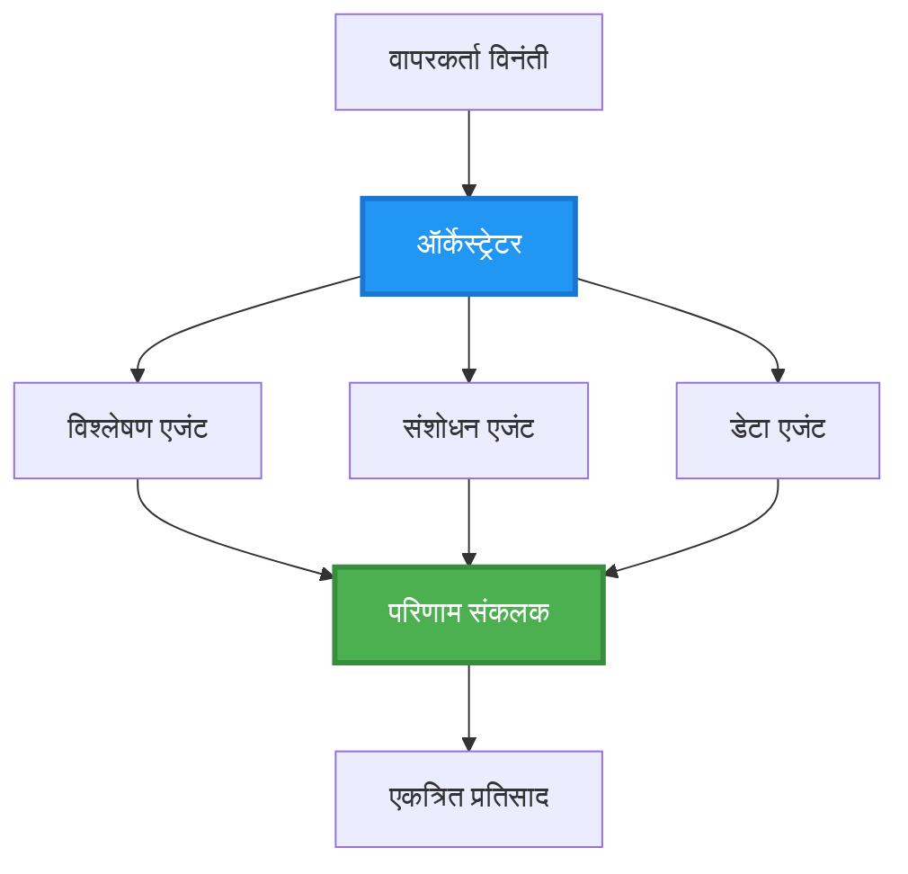
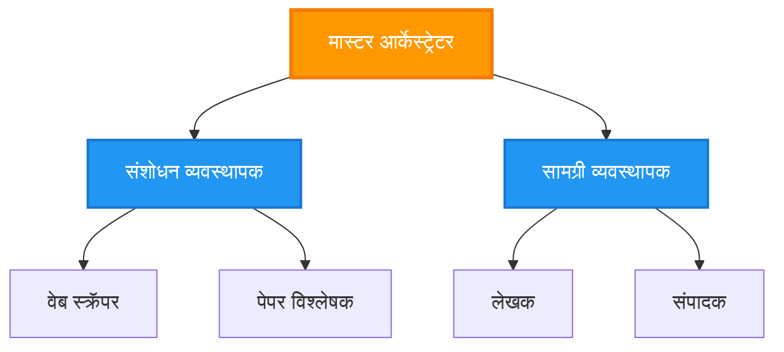
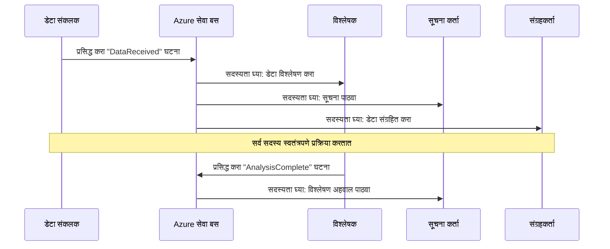
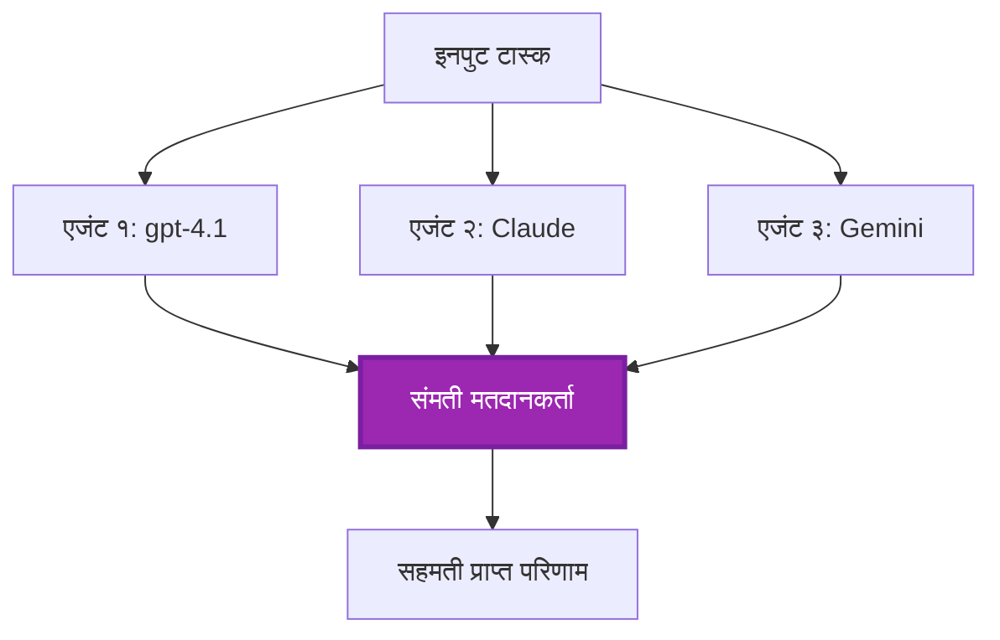
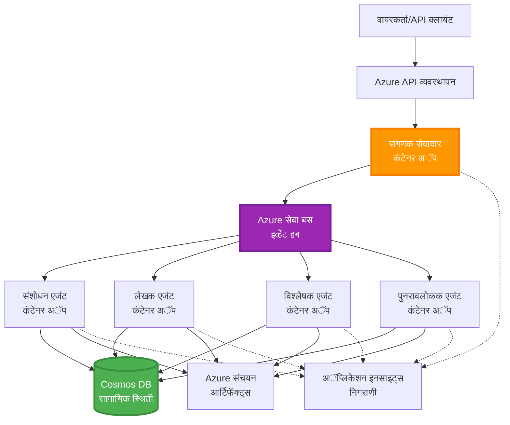

# मल्टी-एजंट समन्वय नमुने

⏱️ **अंदाजे वेळ**: 60-75 मिनिटे | 💰 **अंदाजे किंमत**: ~$100-300/महिना | ⭐ **संकुलता**: प्रगत

**📚 शिक्षण मार्ग:**
- ← मागील: [क्षमता नियोजन](capacity-planning.md) - संसाधन आकारणी आणि स्केलिंग धोरणे
- 🎯 **आपण येथे आहात**: मल्टी-एजंट समन्वय नमुने (ऑर्केस्ट्रेशन, संवाद, स्थिती व्यवस्थापन)
- → पुढील: [SKU निवड](sku-selection.md) - योग्य Azure सेवा निवडणे
- 🏠 [कोर्स गृहपृष्ठ](../../README.md)

---

## आपण काय शिकाल

हा धडा पूर्ण केल्यावर, आपण:
- **मल्टी-एजंट आर्किटेक्चर** नमुने आणि त्यांचा वापर कधी करायचा याची समज मिळवाल
- **ऑर्केस्ट्रेशन नमुने** (केंद्रीकृत, विकेंद्रीकृत, पदानुक्रमित) अंमलात आणाल
- **एजंट संवाद** धोरणे (समकालीन, असमकालीन, घटना-चालित) डिझाइन कराल
- वितरित एजंटमध्ये **सामायिक स्थिती** व्यवस्थापित कराल
- AZD सह Azure वर **मल्टी-एजंट प्रणाली** डिप्लॉय कराल
- वास्तविक AI परिस्थितीसाठी **समन्वय नमुने** लागू कराल
- वितरित एजंट सिस्टीम्सचे निरीक्षण आणि डीबगिंग कराल

## मल्टी-एजंट समन्वय का महत्त्वाचा आहे

### उत्क्रांती: सिंगल एजंटपासून मल्टी-एजंटकडे

**सिंगल एजंट (सोपे):**
```
User → Agent → Response
```
- ✅ समजायला आणि अंमलात आणायला सोपे
- ✅ सोप्या कार्यांसाठी वेगवान
- ❌ एका मॉडेलच्या क्षमतांनी मर्यादित
- ❌ क्लिष्ट कार्यांचे समांतर व्यवस्थापन करू शकत नाही
- ❌ विशेषीकरण नाही

**मल्टी-एजंट प्रणाली (प्रगत):**
```mermaid
graph TD
    Orchestrator[संगठनकर्ता] --> Agent1[एजंट1<br/>योजना]
    Orchestrator --> Agent2[एजंट2<br/>कोड]
    Orchestrator --> Agent3[एजंट3<br/>पुनरावलोकन]
```- ✅ विशिष्ट कार्यांसाठी विशेष एजंट
- ✅ वेगासाठी समांतर अंमलबजावणी
- ✅ माड्यूलर आणि देखभाल करण्यास सोपे
- ✅ क्लिष्ट वर्कफ्लोमध्ये अधिक सक्षम
- ⚠️ समन्वय लॉजिक आवश्यक

**सादृश्य:** एक सिंगल एजंट म्हणजे एक व्यक्ती सर्व कामे करते. मल्टी-एजंट म्हणजे एक संघ जिथे प्रत्येक सदस्याकडे खास कौशल्य (संशोधक, कोडर, पुनरावलोकक, लेखक) आहे ज्यामुळे ते एकत्र काम करतात.

---

## मुख्य समन्वय नमुने

### नमुना 1: अनुक्रमिक समन्वय (जबाबदारीची साखळी)

**कधी वापरायचा**: कार्ये विशिष्ट क्रमाने पूर्ण करणे आवश्यक आहे, प्रत्येक एजंट मागील आउटपुटवर आधारित असतो.

```mermaid
sequenceDiagram
    participant User
    participant Orchestrator
    participant Agent1 as संशोधन एजंट
    participant Agent2 as लेखक एजंट
    participant Agent3 as संपादक एजंट
    
    User->>Orchestrator: "AI बद्दल लेख लिहा"
    Orchestrator->>Agent1: विषयावर संशोधन करा
    Agent1-->>Orchestrator: संशोधन परिणाम
    Orchestrator->>Agent2: मसुदा लिहा (संशोधन वापरून)
    Agent2-->>Orchestrator: मसुदा लेख
    Orchestrator->>Agent3: संपादित करा आणि सुधारणा करा
    Agent3-->>Orchestrator: अंतिम लेख
    Orchestrator-->>User: परिष्कृत लेख
    
    Note over User,Agent3: अनुक्रमिक: प्रत्येक टप्पा मागीलच्या प्रतीक्षा करतो
```
**फायदे:**
- ✅ स्पष्ट डेटा प्रवाह
- ✅ डीबग करणे सोपे
- ✅ अंमलबजावणीचा आदेश निश्चित

**मर्यादा:**
- ❌ मंदगती (कोणतेही समांतर नाही)
- ❌ एक अपयश संपूर्ण साखळी अवरोधित करतो
- ❌ परस्पर अवलंबून असलेल्या कार्यांशी हाताळू शकत नाही

**उदाहरण वापर:**
- कंटेंट निर्मिती पाइपलाइन (संशोधन → लेखन → संपादन → प्रकाशन)
- कोड जनरेशन (योजना → अंमलबजावणी → चाचणी → दिप्लॉयमेंट)
- अहवाल निर्माण (डेटा गोळा करणे → विश्लेषण → दृश्यांकन → सारांश)

---

### नमुना 2: समांतर समन्वय (फॅन-आऊट/फॅन-इन)

**कधी वापरायचा**: स्वतंत्र कार्ये एकाच वेळी चालवू शकतात, परिणाम शेवटी एकत्र केले जातात.


**फायदे:**
- ✅ वेगवान (समांतर अंमलबजावणी)
- ✅ दोष सहिष्णू (आंशिक परिणाम स्वीकार्य)
- ✅ आडवे प्रमाण वाढवता येते

**मर्यादा:**
- ⚠️ परिणाम अनियमित क्रमाने मिळू शकतात
- ⚠️ संकलन लॉजिक आवश्यक
- ⚠️ क्लिष्ट स्थिती व्यवस्थापन

**उदाहरण वापर:**
- मल्टी-स्रोत डेटा गोळा करणे (API + डेटाबेस + वेब स्क्रॅपिंग)
- स्पर्धात्मक विश्लेषण (अनेक मॉडेल सोल्यूशन्स तयार करतात, सर्वोत्तम निवडले जाते)
- भाषांतर सेवा (एकाच वेळी अनेक भाषांमध्ये भाषांतर)

---

### नमुना 3: पदानुक्रमित समन्वय (मॅनेजर-वर्कर)

**कधी वापरायचा**: उपकार्यानुसार क्लिष्ट वर्कफ्लो, प्रतिनिधीत्व आवश्यक.


**फायदे:**
- ✅ क्लिष्ट वर्कफ्लो हाताळतो
- ✅ माड्यूलर आणि देखभाल करण्यास सोपे
- ✅ जबाबदारीची स्पष्ट सीमा

**मर्यादा:**
- ⚠️ अधिक क्लिष्ट आर्किटेक्चर
- ⚠️ जास्त विलंब वेळ (अनेक समन्वय स्तर)
- ⚠️ प्रगत ऑर्केस्ट्रेशन आवश्यक

**उदाहरण वापर:**
- एंटरप्राइझ डॉक्युमेंट प्रक्रिया (वर्गीकरण → राऊटिंग → प्रक्रिया → संग्रहण)
- मल्टी-स्टेज डेटा पाइपलाइन (आयंगेस्ट → स्वच्छता → रूपांतर → विश्लेषण → अहवाल)
- क्लिष्ट ऑटोमेशन वर्कफ्लो (योजना → संसाधन वाटप → अंमलबजावणी → निरीक्षण)

---

### नमुना 4: घटना-चालित समन्वय (प्रकाशन-सभासद)

**कधी वापरायचा**: एजंटांनी घटनांवर प्रतिक्रिया द्यावी, सैल जोडणी अपेक्षित.


**फायदे:**
- ✅ एजंटमधील सैल जोडणी
- ✅ नवीन एजंट सहज जोडा (फक्त सबस्क्राइब करा)
- ✅ असमकालीन प्रक्रिया
- ✅ प्रतिकारक्षम (संदेश टिकवून ठेवणे)

**मर्यादा:**
- ⚠️ शेवटी सुसंगतता
- ⚠️ परिष्कृत डीबगिंग आवश्यक
- ⚠️ संदेश क्रम आव्हाने

**उदाहरण वापर:**
- रिअल-टाइम मॉनिटरिंग सिस्टीम्स (अलर्ट्स, डॅशबोर्ड, लॉग)
- बहु-चॅनेल सूचना (ईमेल, SMS, पुश, स्लॅक)
- डेटा प्रोसेसिंग पाइपलाइन (अनेक ग्राहक एकाच डेटावर)

---

### नमुना 5: संमती-आधारित समन्वय (मतदान/कोरम)

**कधी वापरायचा**: पुढे जाण्यापूर्वी अनेक एजंटांचे मान्यता आवश्यक.


**फायदे:**
- ✅ उच्च अचूकता (अनेक मत)
- ✅ दोष सहिष्णू (कमी संख्येतील अपयश स्वीकार्य)
- ✅ गुणवत्ता सुनिश्चित

**मर्यादा:**
- ❌ महागडे (एकाधिक मॉडेल कॉल)
- ❌ मंद गती (सर्व एजंटची वाट पाहणे)
- ⚠️ संघर्ष निराकरण आवश्यक

**उदाहरण वापर:**
- सामग्री पर्यवेक्षण (अनेक मॉडेल सामग्रीचे पुनरावलोकन करतात)
- कोड पुनरावलोकन (अनेक लिंटर्स/विश्लेषक)
- वैद्यकीय निदान (अनेक AI मॉडेल, तज्ञ पडताळणी)

---

## आर्किटेक्चर आढावा

### Azure वरील संपूर्ण मल्टी-एजंट सिस्टम


**मुख्य घटक:**

| घटक | उद्दिष्ट | Azure सेवा |
|-----------|---------|---------------|
| **API गेटवे** | प्रवेश बिंदू, दर मर्यादिती, प्रमाणन | API व्यवस्थापन |
| **ऑर्केस्ट्रेटर** | एजंट वर्कफ्लो समन्वयित करतो | कंटेनर ऍप्स |
| **मेसेज क्व्यू** | असमकालीन संवाद | सर्व्हिस बस / इव्हेंट हब |
| **एजंट्स** | विशेष AI कामगार | कंटेनर ऍप्स / फंक्शन्स |
| **स्थिती संचय** | सामायिक स्थिती, कार्य ट्रॅकिंग | कॉस्मॉस DB |
| **आर्टिफॅक्ट स्टोरेज** | दस्तऐवज, परिणाम, लॉग | ब्लॉब स्टोरेज |
| **निर्धारण** | वितरित ट्रेसिंग, लॉग | ॲप्लिकेशन इनसाइट्स |

---

## पूर्वअट

### आवश्यक साधने

```bash
# Azure Developer CLI सत्यापित करा
azd version
# ✅ अपेक्षित: azd आवृत्ती 1.0.0 किंवा त्याहून अधिक

# Azure CLI सत्यापित करा
az --version
# ✅ अपेक्षित: azure-cli 2.50.0 किंवा त्याहून अधिक

# Docker सत्यापित करा (स्थानिक चाचणीसाठी)
docker --version
# ✅ अपेक्षित: Docker आवृत्ती 20.10 किंवा त्याहून अधिक
```

### Azure आवश्यकता

- सक्रिय Azure सदस्यता
- तयार करण्याची परवानगी:
  - कंटेनर ऍप्स
  - सर्व्हिस बस नेमस्पेसेस
  - कॉस्मॉस DB खाते
  - स्टोरेज खाते
  - ॲप्लिकेशन इनसाइट्स

### ज्ञान पूर्वअट

आपण पूर्ण केले पाहिजे:
- [कॉन्फिगरेशन व्यवस्थापन](../chapter-03-configuration/configuration.md)
- [प्रमाणीकरण व सुरक्षा](../chapter-03-configuration/authsecurity.md)
- [मायक्रोसर्व्हिसेस उदाहरण](../../../../examples/microservices)

---

## अंमलबजावणी मार्गदर्शक

### प्रोजेक्ट रचना

```
multi-agent-system/
├── azure.yaml                    # AZD configuration
├── infra/
│   ├── main.bicep               # Main infrastructure
│   ├── core/
│   │   ├── servicebus.bicep     # Message queue
│   │   ├── cosmos.bicep         # State store
│   │   ├── storage.bicep        # Artifact storage
│   │   └── monitoring.bicep     # Application Insights
│   └── app/
│       ├── orchestrator.bicep   # Orchestrator service
│       └── agent.bicep          # Agent template
└── src/
    ├── orchestrator/            # Orchestration logic
    │   ├── app.py
    │   ├── workflows.py
    │   └── Dockerfile
    ├── agents/
    │   ├── research/            # Research agent
    │   ├── writer/              # Writer agent
    │   ├── analyst/             # Analyst agent
    │   └── reviewer/            # Reviewer agent
    └── shared/
        ├── state_manager.py     # Shared state logic
        └── message_handler.py   # Message handling
```

---

## धडा 1: अनुक्रमिक समन्वय नमुना

### अंमलबजावणी: कंटेंट निर्मिती पाइपलाइन

चला एक अनुक्रमिक पाइपलाइन बनवूया: संशोधन → लेखन → संपादन → प्रकाशन

### 1. AZD कॉन्फिगरेशन

**फाइल: `azure.yaml`**

```yaml
name: content-pipeline
metadata:
  template: multi-agent-sequential@1.0.0

services:
  orchestrator:
    project: ./src/orchestrator
    language: python
    host: containerapp
  
  research-agent:
    project: ./src/agents/research
    language: python
    host: containerapp
  
  writer-agent:
    project: ./src/agents/writer
    language: python
    host: containerapp
  
  editor-agent:
    project: ./src/agents/editor
    language: python
    host: containerapp
```

### 2. इन्फ्रास्ट्रक्चर: समन्वयासाठी सर्व्हिस बस

**फाइल: `infra/core/servicebus.bicep`**

```bicep
param name string
param location string
param tags object = {}

resource serviceBusNamespace 'Microsoft.ServiceBus/namespaces@2022-10-01-preview' = {
  name: name
  location: location
  tags: tags
  sku: {
    name: 'Standard'
    tier: 'Standard'
  }
  properties: {
    minimumTlsVersion: '1.2'
  }
}

// Queue for orchestrator → research agent
resource researchQueue 'Microsoft.ServiceBus/namespaces/queues@2022-10-01-preview' = {
  parent: serviceBusNamespace
  name: 'research-tasks'
  properties: {
    maxDeliveryCount: 3
    lockDuration: 'PT5M'
    deadLetteringOnMessageExpiration: true
  }
}

// Queue for research agent → writer agent
resource writerQueue 'Microsoft.ServiceBus/namespaces/queues@2022-10-01-preview' = {
  parent: serviceBusNamespace
  name: 'writer-tasks'
  properties: {
    maxDeliveryCount: 3
    lockDuration: 'PT5M'
  }
}

// Queue for writer agent → editor agent
resource editorQueue 'Microsoft.ServiceBus/namespaces/queues@2022-10-01-preview' = {
  parent: serviceBusNamespace
  name: 'editor-tasks'
  properties: {
    maxDeliveryCount: 3
    lockDuration: 'PT5M'
  }
}

output namespace string = serviceBusNamespace.name
output connectionString string = listKeys('${serviceBusNamespace.id}/AuthorizationRules/RootManageSharedAccessKey', serviceBusNamespace.apiVersion).primaryConnectionString
```

### 3. सामायिक स्थिती व्यवस्थापक

**फाइल: `src/shared/state_manager.py`**

```python
from azure.cosmos import CosmosClient, PartitionKey
from datetime import datetime
import os

class StateManager:
    """Manages shared state across agents using Cosmos DB"""
    
    def __init__(self):
        endpoint = os.environ['COSMOS_ENDPOINT']
        key = os.environ['COSMOS_KEY']
        
        self.client = CosmosClient(endpoint, key)
        self.database = self.client.get_database_client('agent-state')
        self.container = self.database.get_container_client('tasks')
    
    def create_task(self, task_id: str, task_type: str, input_data: dict):
        """Create a new task"""
        task = {
            'id': task_id,
            'type': task_type,
            'status': 'pending',
            'input': input_data,
            'created_at': datetime.utcnow().isoformat(),
            'steps': []
        }
        self.container.create_item(task)
        return task
    
    def update_task_step(self, task_id: str, step_name: str, result: dict):
        """Update task with completed step"""
        task = self.container.read_item(task_id, partition_key=task_id)
        
        task['steps'].append({
            'name': step_name,
            'completed_at': datetime.utcnow().isoformat(),
            'result': result
        })
        
        self.container.replace_item(task_id, task)
        return task
    
    def complete_task(self, task_id: str, final_result: dict):
        """Mark task as complete"""
        task = self.container.read_item(task_id, partition_key=task_id)
        task['status'] = 'completed'
        task['result'] = final_result
        task['completed_at'] = datetime.utcnow().isoformat()
        self.container.replace_item(task_id, task)
        return task
    
    def get_task(self, task_id: str):
        """Retrieve task state"""
        return self.container.read_item(task_id, partition_key=task_id)
```

### 4. ऑर्केस्ट्रेटर सेवा

**फाइल: `src/orchestrator/app.py`**

```python
from flask import Flask, request, jsonify
from azure.servicebus import ServiceBusClient, ServiceBusMessage
import json
import uuid
import os
from shared.state_manager import StateManager

app = Flask(__name__)
state_manager = StateManager()

# सेवा बस कनेक्शन
servicebus_connection_str = os.environ['SERVICEBUS_CONNECTION_STRING']
servicebus_client = ServiceBusClient.from_connection_string(servicebus_connection_str)

@app.route('/health', methods=['GET'])
def health():
    return jsonify({'status': 'healthy', 'service': 'orchestrator'})

@app.route('/create-content', methods=['POST'])
def create_content():
    """
    Sequential workflow: Research → Write → Edit → Publish
    """
    data = request.json
    topic = data.get('topic')
    
    if not topic:
        return jsonify({'error': 'Topic required'}), 400
    
    # स्थिती संचयात कार्य तयार करा
    task_id = str(uuid.uuid4())
    task = state_manager.create_task(
        task_id=task_id,
        task_type='content_creation',
        input_data={'topic': topic}
    )
    
    # संशोधन एजंटला संदेश पाठवा (पहिला टप्पा)
    sender = servicebus_client.get_queue_sender('research-tasks')
    message = ServiceBusMessage(
        body=json.dumps({
            'task_id': task_id,
            'topic': topic,
            'next_queue': 'writer-tasks'  # निकाल कुठे पाठवायचे आहे
        }),
        content_type='application/json'
    )
    
    with sender:
        sender.send_messages(message)
    
    return jsonify({
        'task_id': task_id,
        'status': 'started',
        'workflow': 'sequential',
        'steps': ['research', 'write', 'edit', 'publish'],
        'message': 'Content creation pipeline initiated'
    }), 202

@app.route('/task/<task_id>', methods=['GET'])
def get_task_status(task_id):
    """Check task status"""
    try:
        task = state_manager.get_task(task_id)
        return jsonify(task)
    except Exception as e:
        return jsonify({'error': str(e)}), 404

if __name__ == '__main__':
    app.run(host='0.0.0.0', port=8080)
```

### 5. संशोधन एजंट

**फाइल: `src/agents/research/app.py`**

```python
from azure.servicebus import ServiceBusClient, ServiceBusMessage
from openai import AzureOpenAI
import json
import os
import time
from shared.state_manager import StateManager

# क्लायंट्स प्रारंभ करा
state_manager = StateManager()
servicebus_client = ServiceBusClient.from_connection_string(
    os.environ['SERVICEBUS_CONNECTION_STRING']
)

openai_client = AzureOpenAI(
    api_key=os.environ['AZURE_OPENAI_API_KEY'],
    api_version="2024-02-01",
    azure_endpoint=os.environ['AZURE_OPENAI_ENDPOINT']
)

def process_research_task(message_data):
    """Process research request and pass to writer"""
    task_id = message_data['task_id']
    topic = message_data['topic']
    next_queue = message_data['next_queue']
    
    print(f"🔬 Researching: {topic}")
    
    # संशोधनासाठी Microsoft Foundry मॉडेल्स कॉल करा
    response = openai_client.chat.completions.create(
        model="gpt-4.1",
        messages=[
            {"role": "system", "content": "You are a research assistant. Provide comprehensive research on the given topic."},
            {"role": "user", "content": f"Research this topic thoroughly: {topic}"}
        ],
        max_tokens=1500
    )
    
    research_results = response.choices[0].message.content
    
    # स्थिती अद्यतनित करा
    state_manager.update_task_step(
        task_id=task_id,
        step_name='research',
        result={'research': research_results}
    )
    
    # पुढील एजंटकडे (लेखक) पाठवा
    sender = servicebus_client.get_queue_sender(next_queue)
    message = ServiceBusMessage(
        body=json.dumps({
            'task_id': task_id,
            'topic': topic,
            'research': research_results,
            'next_queue': 'editor-tasks'
        }),
        content_type='application/json'
    )
    
    with sender:
        sender.send_messages(message)
    
    print(f"✅ Research complete for task {task_id}")

def main():
    """Listen to research queue"""
    receiver = servicebus_client.get_queue_receiver('research-tasks')
    
    print("🔬 Research Agent started, listening for tasks...")
    
    with receiver:
        while True:
            messages = receiver.receive_messages(max_wait_time=5)
            for message in messages:
                try:
                    message_data = json.loads(str(message))
                    process_research_task(message_data)
                    receiver.complete_message(message)
                except Exception as e:
                    print(f"❌ Error processing message: {e}")
                    receiver.abandon_message(message)

if __name__ == '__main__':
    main()
```

### 6. लेखक एजंट

**फाइल: `src/agents/writer/app.py`**

```python
from azure.servicebus import ServiceBusClient, ServiceBusMessage
from openai import AzureOpenAI
import json
import os
from shared.state_manager import StateManager

state_manager = StateManager()
servicebus_client = ServiceBusClient.from_connection_string(
    os.environ['SERVICEBUS_CONNECTION_STRING']
)

openai_client = AzureOpenAI(
    api_key=os.environ['AZURE_OPENAI_API_KEY'],
    api_version="2024-02-01",
    azure_endpoint=os.environ['AZURE_OPENAI_ENDPOINT']
)

def process_writing_task(message_data):
    """Write article based on research"""
    task_id = message_data['task_id']
    topic = message_data['topic']
    research = message_data['research']
    next_queue = message_data['next_queue']
    
    print(f"✍️ Writing article: {topic}")
    
    # लेख लिहिण्यासाठी मायक्रोसॉफ्ट फाउंड्री मॉडेल्स कॉल करा
    response = openai_client.chat.completions.create(
        model="gpt-4.1",
        messages=[
            {"role": "system", "content": "You are a professional writer. Write engaging, well-structured articles."},
            {"role": "user", "content": f"Based on this research:\n\n{research}\n\nWrite a comprehensive article about: {topic}"}
        ],
        max_tokens=2000
    )
    
    article_draft = response.choices[0].message.content
    
    # स्थिती अद्यतनित करा
    state_manager.update_task_step(
        task_id=task_id,
        step_name='writing',
        result={'draft': article_draft}
    )
    
    # संपादकाला पाठवा
    sender = servicebus_client.get_queue_sender(next_queue)
    message = ServiceBusMessage(
        body=json.dumps({
            'task_id': task_id,
            'topic': topic,
            'draft': article_draft
        }),
        content_type='application/json'
    )
    
    with sender:
        sender.send_messages(message)
    
    print(f"✅ Article draft complete for task {task_id}")

def main():
    """Listen to writer queue"""
    receiver = servicebus_client.get_queue_receiver('writer-tasks')
    
    print("✍️ Writer Agent started, listening for tasks...")
    
    with receiver:
        while True:
            messages = receiver.receive_messages(max_wait_time=5)
            for message in messages:
                try:
                    message_data = json.loads(str(message))
                    process_writing_task(message_data)
                    receiver.complete_message(message)
                except Exception as e:
                    print(f"❌ Error: {e}")
                    receiver.abandon_message(message)

if __name__ == '__main__':
    main()
```

### 7. संपादक एजंट

**फाइल: `src/agents/editor/app.py`**

```python
from azure.servicebus import ServiceBusClient
from openai import AzureOpenAI
import json
import os
from shared.state_manager import StateManager

state_manager = StateManager()
servicebus_client = ServiceBusClient.from_connection_string(
    os.environ['SERVICEBUS_CONNECTION_STRING']
)

openai_client = AzureOpenAI(
    api_key=os.environ['AZURE_OPENAI_API_KEY'],
    api_version="2024-02-01",
    azure_endpoint=os.environ['AZURE_OPENAI_ENDPOINT']
)

def process_editing_task(message_data):
    """Edit and finalize article"""
    task_id = message_data['task_id']
    topic = message_data['topic']
    draft = message_data['draft']
    
    print(f"📝 Editing article: {topic}")
    
    # संपादित करण्यासाठी Microsoft Foundry मॉडेल्स कॉल करा
    response = openai_client.chat.completions.create(
        model="gpt-4.1",
        messages=[
            {"role": "system", "content": "You are an expert editor. Improve grammar, clarity, and structure."},
            {"role": "user", "content": f"Edit and improve this article:\n\n{draft}"}
        ],
        max_tokens=2000
    )
    
    final_article = response.choices[0].message.content
    
    # कार्य पूर्ण म्हणून चिन्हांकित करा
    state_manager.complete_task(
        task_id=task_id,
        final_result={
            'topic': topic,
            'final_article': final_article,
            'word_count': len(final_article.split())
        }
    )
    
    print(f"✅ Article finalized for task {task_id}")

def main():
    """Listen to editor queue"""
    receiver = servicebus_client.get_queue_receiver('editor-tasks')
    
    print("📝 Editor Agent started, listening for tasks...")
    
    with receiver:
        while True:
            messages = receiver.receive_messages(max_wait_time=5)
            for message in messages:
                try:
                    message_data = json.loads(str(message))
                    process_editing_task(message_data)
                    receiver.complete_message(message)
                except Exception as e:
                    print(f"❌ Error: {e}")
                    receiver.abandon_message(message)

if __name__ == '__main__':
    main()
```

### 8. डिप्लॉय आणि चाचणी

```bash
# पर्याय A: टेम्पलेट-आधारित वितरण
azd init
azd up

# पर्याय B: एजंट मॅनिफेस्ट वितरण (एक्स्टेंशन आवश्यक)
azd extension install azure.ai.agents
azd ai agent init -m agent-manifest.yaml
azd up
```

> सर्व `azd ai` फ्लॅग आणि पर्यायांसाठी [AZD AI CLI आदेश](../chapter-08-production/production-ai-practices.md#azd-ai-cli-commands-and-extensions) पहा.

```bash
# ऑर्केस्ट्रेटर URL मिळवा
ORCHESTRATOR_URL=$(azd env get-values | grep ORCHESTRATOR_URL | cut -d '=' -f2 | tr -d '"')

# सामग्री तयार करा
curl -X POST $ORCHESTRATOR_URL/create-content \
  -H "Content-Type: application/json" \
  -d '{"topic": "The Future of AI in Healthcare"}'
```

**✅ अपेक्षित आउटपुट:**
```json
{
  "task_id": "a1b2c3d4-e5f6-7890-abcd-ef1234567890",
  "status": "started",
  "workflow": "sequential",
  "steps": ["research", "write", "edit", "publish"],
  "message": "Content creation pipeline initiated"
}
```

**कार्य प्रगती तपासा:**
```bash
TASK_ID="a1b2c3d4-e5f6-7890-abcd-ef1234567890"
curl $ORCHESTRATOR_URL/task/$TASK_ID
```

**✅ अपेक्षित आउटपुट (पूर्ण झालेले):**
```json
{
  "id": "a1b2c3d4-e5f6-7890-abcd-ef1234567890",
  "type": "content_creation",
  "status": "completed",
  "steps": [
    {
      "name": "research",
      "completed_at": "2025-11-19T10:30:00Z",
      "result": {"research": "..."}
    },
    {
      "name": "writing",
      "completed_at": "2025-11-19T10:32:00Z",
      "result": {"draft": "..."}
    }
  ],
  "result": {
    "topic": "The Future of AI in Healthcare",
    "final_article": "...",
    "word_count": 1500
  }
}
```

---

## धडा 2: समांतर समन्वय नमुना

### अंमलबजावणी: मल्टी-स्रोत संशोधन संकलक

चला एक समांतर प्रणाली तयार करूया जी एकाच वेळी अनेक स्रोतांपासून माहिती गोळा करते.

### समांतर ऑर्केस्ट्रेटर

**फाइल: `src/orchestrator/parallel_workflow.py`**

```python
from flask import Flask, request, jsonify
from azure.servicebus import ServiceBusClient, ServiceBusMessage
import json
import uuid
import os
from shared.state_manager import StateManager

app = Flask(__name__)
state_manager = StateManager()

servicebus_client = ServiceBusClient.from_connection_string(
    os.environ['SERVICEBUS_CONNECTION_STRING']
)

@app.route('/research-parallel', methods=['POST'])
def research_parallel():
    """
    Parallel workflow: Multiple agents work simultaneously
    """
    data = request.json
    query = data.get('query')
    
    task_id = str(uuid.uuid4())
    task = state_manager.create_task(
        task_id=task_id,
        task_type='parallel_research',
        input_data={
            'query': query,
            'agents': ['web', 'academic', 'news', 'social']
        }
    )
    
    # फॅन-आउट: सर्व एजंटना एकाच वेळी पाठवा
    agents = [
        ('web-research-queue', 'web'),
        ('academic-research-queue', 'academic'),
        ('news-research-queue', 'news'),
        ('social-research-queue', 'social')
    ]
    
    for queue_name, agent_type in agents:
        sender = servicebus_client.get_queue_sender(queue_name)
        message = ServiceBusMessage(
            body=json.dumps({
                'task_id': task_id,
                'query': query,
                'agent_type': agent_type,
                'result_queue': 'aggregation-queue'
            }),
            content_type='application/json'
        )
        
        with sender:
            sender.send_messages(message)
    
    return jsonify({
        'task_id': task_id,
        'status': 'started',
        'workflow': 'parallel',
        'agents_dispatched': 4,
        'message': 'Parallel research initiated'
    }), 202

if __name__ == '__main__':
    app.run(host='0.0.0.0', port=8080)
```

### संकलन लॉजिक

**फाइल: `src/agents/aggregator/app.py`**

```python
from azure.servicebus import ServiceBusClient
import json
import os
from collections import defaultdict
from shared.state_manager import StateManager

state_manager = StateManager()
servicebus_client = ServiceBusClient.from_connection_string(
    os.environ['SERVICEBUS_CONNECTION_STRING']
)

# कार्यानुसार निकाल नोंदवा
task_results = defaultdict(list)
expected_agents = 4  # वेब, शैक्षणिक, बातम्या, सामाजिक

def process_result(message_data):
    """Aggregate results from parallel agents"""
    task_id = message_data['task_id']
    agent_type = message_data['agent_type']
    result = message_data['result']
    
    # निकाल साठवा
    task_results[task_id].append({
        'agent': agent_type,
        'data': result
    })
    
    print(f"📊 Received result from {agent_type} agent ({len(task_results[task_id])}/{expected_agents})")
    
    # सर्व एजंट्स पूर्ण झाले का तपासा (फॅन-इन)
    if len(task_results[task_id]) == expected_agents:
        print(f"✅ All agents completed for task {task_id}. Aggregating...")
        
        # निकाल एकत्र करा
        aggregated = {
            'query': message_data['query'],
            'sources': task_results[task_id],
            'summary': generate_summary(task_results[task_id])
        }
        
        # पूर्ण म्हणून चिन्हांकित करा
        state_manager.complete_task(task_id, aggregated)
        
        # स्वच्छ करा
        del task_results[task_id]
        
        print(f"✅ Aggregation complete for task {task_id}")

def generate_summary(results):
    """Generate summary from all sources"""
    summaries = [r['data'].get('summary', '') for r in results]
    return '\n\n'.join(summaries)

def main():
    """Listen to aggregation queue"""
    receiver = servicebus_client.get_queue_receiver('aggregation-queue')
    
    print("📊 Aggregator started, listening for results...")
    
    with receiver:
        while True:
            messages = receiver.receive_messages(max_wait_time=5)
            for message in messages:
                try:
                    message_data = json.loads(str(message))
                    process_result(message_data)
                    receiver.complete_message(message)
                except Exception as e:
                    print(f"❌ Error: {e}")
                    receiver.abandon_message(message)

if __name__ == '__main__':
    main()
```

**समांतर नमुन्याचे फायदे:**
- ⚡ **4 पट वेगवान** (एजंट एकाच वेळी चालतात)
- 🔄 **दोष सहिष्णू** (आंशिक परिणाम स्वीकार्य)
- 📈 **स्केलेबल** (आनंदीपणे एजंट जोडा)

---

## व्यावहारिक सराव

### व्यायाम 1: टाइमआऊट हाताळणी जोडा ⭐⭐ (मध्यम)

**उद्देश:** संकलकासाठी टाइमआऊट लॉजिक लागू करा जेणेकरून हळू एजंटसाठी अनंत काळ थांबावे लागणार नाही.

**पावले**:

1. **संकलकात टाइमआऊट ट्रॅकिंग जोडा:**

```python
from datetime import datetime, timedelta

task_timeouts = {}  # कार्य_आयडी -> समाप्ती_वेळ

def process_result(message_data):
    task_id = message_data['task_id']
    
    # पहिल्या निकालावर टाइमआउट सेट करा
    if task_id not in task_timeouts:
        task_timeouts[task_id] = datetime.utcnow() + timedelta(seconds=30)
    
    task_results[task_id].append({
        'agent': message_data['agent_type'],
        'data': message_data['result']
    })
    
    # पूर्ण झाले आहे का किंवा टाइमआउट झाला आहे का तपासा
    if len(task_results[task_id]) == expected_agents or \
       datetime.utcnow() > task_timeouts[task_id]:
        
        print(f"📊 Aggregating with {len(task_results[task_id])}/{expected_agents} results")
        
        aggregated = {
            'query': message_data['query'],
            'sources': task_results[task_id],
            'completed_agents': len(task_results[task_id]),
            'timed_out': len(task_results[task_id]) < expected_agents
        }
        
        state_manager.complete_task(task_id, aggregated)
        
        # साफसफाई करा
        del task_results[task_id]
        del task_timeouts[task_id]
```

2. **कृत्रिम विलंबांसह चाचणी करा:**

```python
# एका एजंटमध्ये, हळू प्रक्रिया दर्शविण्यासाठी विलंब जोडा
import time
time.sleep(35)  # ३० सेकंदांच्या टाइमआउटपेक्षा जास्त
```

3. **डिप्लॉय करा आणि पडताळणी करा:**

```bash
azd deploy aggregator

# कार्य सादर करा
curl -X POST $ORCHESTRATOR_URL/research-parallel \
  -H "Content-Type: application/json" \
  -d '{"query": "AI safety research"}'

# ३० सेकंदानंतर परिणाम तपासा
curl $ORCHESTRATOR_URL/task/$TASK_ID
```

**✅ यशस्वी निकष:**
- ✅ ३० सेकंदांनंतर कार्य पूर्ण होतच, अगदी एजंट अपूर्ण असले तरी
- ✅ प्रतिसादात आंशिक परिणाम दर्शविले (`"timed_out": true`)
- ✅ उपलब्ध परिणाम परत केले जातात (4 पैकी 3 एजंट)

**वेळ:** 20-25 मिनिटे

---

### व्यायाम 2: पुनर्प्रयत्न लॉजिक अंमलात आणा ⭐⭐⭐ (प्रगत)

**उद्देश:** अयशस्वी एजंट कार्ये स्वयंचलितपणे पुनर्प्रयत्न करा, आधीच्या प्रयत्न नाकारण्याआधी.

**पावले**:

1. **ऑर्केस्ट्रेटरमध्ये पुनर्प्रयत्न ट्रॅकिंग जोडा:**

```python
from dataclasses import dataclass
from typing import Dict

@dataclass
class RetryConfig:
    max_retries: int = 3
    backoff_seconds: int = 5

retry_counts: Dict[str, int] = {}  # message_id -> पुनः प्रयत्न_count

def send_with_retry(queue_name: str, message_data: dict, retry_config: RetryConfig):
    """Send message with retry metadata"""
    message_id = message_data.get('message_id', str(uuid.uuid4()))
    message_data['message_id'] = message_id
    message_data['retry_count'] = retry_counts.get(message_id, 0)
    message_data['max_retries'] = retry_config.max_retries
    
    sender = servicebus_client.get_queue_sender(queue_name)
    message = ServiceBusMessage(
        body=json.dumps(message_data),
        content_type='application/json',
        message_id=message_id
    )
    
    with sender:
        sender.send_messages(message)
```

2. **एजंटसाठी पुनर्प्रयत्न हँडलर जोडा:**

```python
def process_with_retry(message, receiver, process_func):
    """Process message with automatic retry on failure"""
    try:
        message_data = json.loads(str(message))
        
        # संदेश प्रक्रिया करा
        process_func(message_data)
        
        # यशस्वी - पूर्ण
        receiver.complete_message(message)
        
    except Exception as e:
        message_id = message.message_id
        retry_count = message_data.get('retry_count', 0)
        max_retries = message_data.get('max_retries', 3)
        
        if retry_count < max_retries:
            # पुन्हा प्रयत्न करा: सोडून द्या आणि वाढवलेल्या गणनेसह पुन्हा रांगेत टाका
            print(f"⚠️ Retry {retry_count + 1}/{max_retries} for message {message_id}")
            
            message_data['retry_count'] = retry_count + 1
            
            # विलंबासह त्याच रांगेत परत पाठवा
            time.sleep(5 * (retry_count + 1))  # घातांकी परतावा
            send_with_retry(queue_name, message_data, RetryConfig())
            
            receiver.complete_message(message)  # मूळ काढा
        else:
            # जास्तीत जास्त प्रयत्नांची मर्यादा ओलांडली - डेड लेटर रांगेकडे चालवा
            print(f"❌ Max retries exceeded for message {message_id}")
            receiver.dead_letter_message(
                message,
                reason="MaxRetriesExceeded",
                error_description=str(e)
            )
```

3. **डेड लेटर क्व्यूचे निरीक्षण करा:**

```python
def monitor_dead_letters():
    """Check dead letter queue for failed messages"""
    receiver = servicebus_client.get_queue_receiver(
        'research-queue',
        sub_queue='deadletter'
    )
    
    with receiver:
        messages = receiver.receive_messages(max_wait_time=5)
        for message in messages:
            print(f"☠️ Dead letter: {message.message_id}")
            print(f"Reason: {message.dead_letter_reason}")
            print(f"Description: {message.dead_letter_error_description}")
```

**✅ यशस्वी निकष:**
- ✅ अयशस्वी कार्ये स्वयंचलितपणे 3 वेळा पर्यंत पुनर्प्रयत्न होतात
- ✅ पुनर्प्रयत्न दरम्यान घातात्मक बॅकऑफ (5s, 10s, 15s)
- ✅ कमाल पुनर्प्रयत्न नंतर, संदेश डेड लेटर क्व्यूमध्ये जातात
- ✅ डेड लेटर क्व्यू निरीक्षण आणि पुनःवजा शक्य

**वेळ:** 30-40 मिनिटे

---

### व्यायाम 3: सर्किट ब्रेकर अंमलात आणा ⭐⭐⭐ (प्रगत)

**उद्देश:** अपयशी एजंटकडे विनंत्या थांबवून शृंखला-नुकसान टाळा.

**पावले**:

1. **सर्किट ब्रेकर वर्ग तयार करा:**

```python
from enum import Enum
from datetime import datetime, timedelta

class CircuitState(Enum):
    CLOSED = "closed"      # सामान्य ऑपरेशन
    OPEN = "open"          # अयशस्वी, विनंत्या नाकारा
    HALF_OPEN = "half_open"  # पुनर्प्राप्त झाल्यास चाचणी

class CircuitBreaker:
    def __init__(self, failure_threshold=5, timeout_seconds=60):
        self.failure_threshold = failure_threshold
        self.timeout_seconds = timeout_seconds
        self.failure_count = 0
        self.last_failure_time = None
        self.state = CircuitState.CLOSED
    
    def call(self, func):
        """Execute function with circuit breaker protection"""
        if self.state == CircuitState.OPEN:
            # तपासा की टाइमआउट संपला आहे का
            if datetime.utcnow() - self.last_failure_time > timedelta(seconds=self.timeout_seconds):
                self.state = CircuitState.HALF_OPEN
                print("🔄 Circuit breaker: HALF_OPEN (testing)")
            else:
                raise Exception(f"Circuit breaker OPEN for agent. Try again in {self.timeout_seconds}s")
        
        try:
            result = func()
            
            # यश
            if self.state == CircuitState.HALF_OPEN:
                self.state = CircuitState.CLOSED
                self.failure_count = 0
                print("✅ Circuit breaker: CLOSED (recovered)")
            
            return result
            
        except Exception as e:
            self.failure_count += 1
            self.last_failure_time = datetime.utcnow()
            
            if self.failure_count >= self.failure_threshold:
                self.state = CircuitState.OPEN
                print(f"🔴 Circuit breaker: OPEN (too many failures)")
            
            raise e
```

2. **एजंट कॉल्सवर लागू करा:**

```python
# ऑर्केस्ट्रेटर मध्ये
agent_circuits = {
    'web': CircuitBreaker(failure_threshold=5, timeout_seconds=60),
    'academic': CircuitBreaker(failure_threshold=5, timeout_seconds=60),
    'news': CircuitBreaker(failure_threshold=5, timeout_seconds=60),
    'social': CircuitBreaker(failure_threshold=5, timeout_seconds=60)
}

def send_to_agent(agent_type, message_data):
    """Send with circuit breaker protection"""
    circuit = agent_circuits[agent_type]
    
    try:
        circuit.call(lambda: send_message(agent_type, message_data))
    except Exception as e:
        print(f"⚠️ Skipping {agent_type} agent: {e}")
        # इतर एजंट्ससह पुढे चालू ठेवा
```

3. **सर्किट ब्रेकर चाचणी करा:**

```bash
# वारंवार अपयशांची अनुकरण करा (एक एजंट थांबवा)
az containerapp stop --name web-research-agent --resource-group rg-agents

# एकाधिक विनंत्या पाठवा
for i in {1..10}; do
  curl -X POST $ORCHESTRATOR_URL/research-parallel \
    -H "Content-Type: application/json" \
    -d '{"query": "test query '$i'"}'
  sleep 2
done

# लॉग तपासा - ५ अपयशांनंतर सर्किट उघडलेले पाहायला हवे
# कंटेनर अ‍ॅप लॉगसाठी Azure CLI वापरा:
az containerapp logs show --name orchestrator --resource-group $RG_NAME --tail 50
```

**✅ यशस्वी निकष:**
- ✅ 5 अपयशानंतर सर्किट उघडतो (विनंत्या नाकारतो)
- ✅ 60 सेकंदानंतर सर्किट अर्ध उघडा होतो (पुनर्प्राप्तीची चाचणी)
- ✅ इतर एजंटस सामान्यपणे काम करतात
- ✅ एजंट पुनर्प्राप्ती नंतर सर्किट आपोआप बंद होतो

**वेळ:** 40-50 मिनिटे

---

## निरीक्षण आणि डीबगिंग

### ॲप्लिकेशन इनसाइट्ससह वितरित ट्रेसिंग

**फाइल: `src/shared/tracing.py`**

```python
from opencensus.ext.azure.log_exporter import AzureLogHandler
from opencensus.ext.azure.trace_exporter import AzureExporter
from opencensus.trace import config_integration
from opencensus.trace.tracer import Tracer
from opencensus.trace.samplers import AlwaysOnSampler
import logging
import os

# ट्रेसिंग कॉन्फिगर करा
config_integration.trace_integrations(['requests', 'logging'])

connection_string = os.environ.get('APPLICATIONINSIGHTS_CONNECTION_STRING')

# ट्रेसर तयार करा
tracer = Tracer(
    exporter=AzureExporter(connection_string=connection_string),
    sampler=AlwaysOnSampler()
)

# लॉगिंग कॉन्फिगर करा
logger = logging.getLogger(__name__)
logger.addHandler(AzureLogHandler(connection_string=connection_string))
logger.setLevel(logging.INFO)

def trace_agent_call(agent_name, task_id, operation):
    """Trace agent operations"""
    with tracer.span(name=f'{agent_name}.{operation}') as span:
        span.add_attribute('agent', agent_name)
        span.add_attribute('task_id', task_id)
        span.add_attribute('operation', operation)
        
        try:
            result = operation()
            span.add_attribute('status', 'success')
            return result
        except Exception as e:
            span.add_attribute('status', 'error')
            span.add_attribute('error', str(e))
            raise
```

### ॲप्लिकेशन इनसाइट्स क्वेरी

**मल्टी-एजंट वर्कफ्लोज ट्रॅक करा:**

```kusto
// Trace complete workflow for a task
traces
| where customDimensions.task_id == "a1b2c3d4-..."
| project timestamp, message, customDimensions.agent, customDimensions.operation
| order by timestamp asc
```

**एजंट कामगिरी सारांश:**

```kusto
// Compare agent execution times
dependencies
| where name contains "agent"
| summarize 
    avg_duration = avg(duration),
    p95_duration = percentile(duration, 95),
    count = count()
  by agent = tostring(customDimensions.agent)
| order by avg_duration desc
```

**अपयश विश्लेषण:**

```kusto
// Find which agents fail most
exceptions
| where customDimensions.agent != ""
| summarize 
    failure_count = count(),
    unique_errors = dcount(outerMessage)
  by agent = tostring(customDimensions.agent)
| order by failure_count desc
```

---

## खर्च विश्लेषण

### मल्टी-एजंट सिस्टम खर्च (मासिक अंदाज)

| घटक | कॉन्फिगरेशन | किंमत |
|-----------|--------------|------|
| **ऑर्केस्ट्रेटर** | 1 कंटेनर ऍप (1 vCPU, 2GB) | $30-50 |
| **4 एजंट्स** | 4 कंटेनर ऍप्स (प्रत्येक 0.5 vCPU, 1GB) | $60-120 |
| **सर्व्हिस बस** | स्टँडर्ड टियर, 10M मेसेजेस | $10-20 |
| **कॉस्मॉस DB** | सर्व्हरलेस, 5GB स्टोरेज, 1M RUs | $25-50 |
| **ब्लॉब स्टोरेज** | 10GB स्टोरेज, 100K ऑपरेशन्स | $5-10 |
| **ॲप्लिकेशन इनसाइट्स** | 5GB इनजेशन | $10-15 |
| **Microsoft Foundry मॉडेल्स** | gpt-4.1, 10M टोकन्स | $100-300 |
| **एकूण** | | **$240-565/महिना** |

### खर्च ऑप्टिमायझेशन धोरणे

1. **शक्य तितक्या ठिकाणी सर्व्हरलेस वापरा:**
   ```bicep
   // Cosmos DB serverless (no minimum cost)
   properties: {
     databaseAccountOfferType: 'Standard'
     capabilities: [{ name: 'EnableServerless' }]
   }
   ```

2. **एजंट ट्रॅफिक नसताना ते शून्यावर स्केल करा:**
   ```bicep
   scale: {
     minReplicas: 0  // Scale to zero when no messages
     maxReplicas: 10
   }
   ```

3. **सर्व्हिस बससाठी बॅचिंग वापरा:**
   ```python
   # संदेशे बॅचमध्ये पाठवा (स्वस्त)
   sender.send_messages([message1, message2, message3])
   ```

4. **वारंवार वापरल्या जाणार्‍या परिणामांसाठी कॅशिंग करा:**
   ```python
   # Azure Cache for Redis वापरा
   if cache.exists(query_hash):
       return cache.get(query_hash)
   ```

---

## सर्वोत्तम सराव

### ✅ करा:

1. **आधीच्या ऑपरेशन्सचे पुनरावृत्ती न करता वापर करा**
   ```python
   # एजंट सुरक्षितपणे एकाच संदेशावर अनेक वेळा प्रक्रिया करू शकतो
   def process_task(task_id):
       if state_manager.task_exists(task_id):
           print(f"Task {task_id} already processed, skipping")
           return
       # कार्य प्रक्रिया...
   ```

2. **संपूर्ण लॉगिंग अंमलबजावणी करा**
   ```python
   logger.info(f"Agent: {agent_name}, Task: {task_id}, Action: {action}")
   ```

3. **कोरिलेशन आयडी वापरा**
   ```python
   # संपूर्ण कार्यप्रवाहादरम्यान task_id पास करा
   message_data = {
       'task_id': task_id,  # सहसंबंध आयडी
       'timestamp': datetime.utcnow().isoformat()
   }
   ```

4. **संदेश TTL (टाइम-टू-लिव्ह) सेट करा**
   ```bicep
   properties: {
     defaultMessageTimeToLive: 'PT1H'  // 1 hour max
   }
   ```

5. **डेड लेटर क्व्यूचे निरीक्षण करा**
   ```python
   # अयशस्वी संदेशांचे नियमित निरीक्षण
   monitor_dead_letters()
   ```

### ❌ करू नका:

1. **सर्क्युलर अवलंबित्व तयार करू नका**
   ```python
   # ❌ चूक: एजंट A → एजंट B → एजंट A (मर्यादाहीन लूप)
   # ✅ योग्य: स्पष्ट निर्देशित असायक्लिक ग्राफ (DAG)定義 करा
   ```

2. **एजंट थ्रेड ब्लॉक करू नका**
   ```python
   # ❌ वाईट: समक्रमिक प्रतीक्षा
   while not task_complete:
       time.sleep(1)
   
   # ✅ चांगले: संदेश क्रमिका कॉलबॅक वापरा
   ```

3. **आंशिक अपयश दुर्लक्षित करू नका**
   ```python
   # ❌ वाईट: जर एक एजंट अयशस्वी झाला तर संपूर्ण वर्कफ्लो अयशस्वी करा
   # ✅ चांगले: त्रुटी निर्देशकांसह अंशतः निकाल परत करा
   ```

4. **अमर्याद रीट्रायस वापरू नका**
   ```python
   # ❌ वाईट: सदैव पुन्हा प्रयत्न करा
   # ✅ चांगले: max_retries = 3, नंतर dead letter
   ```

---

## समस्या निवारण मार्गदर्शक

### समस्या: संदेश रांगेत अडकलेले आहेत

**लक्षणे:**
- संदेश रांगेत जमा होतात
- एजंट प्रक्रिया करत नाहीत
- कार्य स्थिती "प्रलंबित" वर अडकलेली आहे

**निदान:**
```bash
# रांगाची खोली तपासा
az servicebus queue show \
  --namespace-name mybus \
  --name research-tasks \
  --query "countDetails"

# Azure CLI वापरून एजंट लॉग्ज तपासा
az containerapp logs show --name research-agent --resource-group $RG_NAME --tail 50
```

**उपाय:**

1. **एजंटच्या प्रती वाढवा:**
   ```bash
   az containerapp update \
     --name research-agent \
     --min-replicas 3 \
     --max-replicas 10
   ```

2. **डेड लेटर क्यू तपासा:**
   ```bash
   az servicebus queue show \
     --namespace-name mybus \
     --name research-tasks \
     --query "countDetails.deadLetterMessageCount"
   ```

---

### समस्या: कार्याचा कालमर्यादा समाप्त/कधीही पूर्ण होत नाही

**लक्षणे:**
- कार्य स्थिती "प्रगतीमध्ये" राहते
- काही एजंट पूर्ण करतात, काही नाहीत
- त्रुटी संदेश नाहीत

**निदान:**
```bash
# कार्याची स्थिती तपासा
curl $ORCHESTRATOR_URL/task/$TASK_ID

# एप्लिकेशन इनसाइट्स तपासा
# क्वेरी चालवा: traces | where customDimensions.task_id == "..."
```

**उपाय:**

1. **अग्रेगेटरमध्ये टाइमआउट लागू करा (व्यायाम 1)**

2. **Azure Monitor वापरून एजंट दोष तपासा:**
   ```bash
   # azd monitor वापरून लॉग पाहा
   azd monitor --logs
   
   # किंवा विशिष्ट कंटेनर अॅप लॉग तपासण्यासाठी Azure CLI वापरा
   az containerapp logs show --name <agent-name> --resource-group $RG_NAME --follow | grep "ERROR\|FAIL"
   ```

3. **सर्व एजंट चालू आहेत का याची पुष्टी करा:**
   ```bash
   az containerapp list \
     --resource-group rg-agents \
     --query "[].{name:name, status:properties.runningStatus}"
   ```

---

## अधिक जाणून घ्या

### अधिकृत दस्तऐवज
- [Azure Service Bus](https://learn.microsoft.com/azure/service-bus-messaging/service-bus-messaging-overview)
- [Cosmos DB](https://learn.microsoft.com/azure/cosmos-db/introduction)
- [Container Apps DAPR](https://learn.microsoft.com/azure/container-apps/dapr-overview)
- [मल्टि-एजंट डिझाइन पॅटर्न्स](https://learn.microsoft.com/azure/architecture/guide/ai/multi-agent-systems)

### या कोर्समधील पुढील पायऱ्या
- ← मागील: [क्षमता नियोजन](capacity-planning.md)
- → पुढील: [SKU निवड](sku-selection.md)
- 🏠 [कोर्स होम](../../README.md)

### संबंधित उदाहरणे
- [मायक्रोसर्व्हिसेस उदाहरण](../../../../examples/microservices) - सेवा संवाद नमुने
- [Microsoft Foundry Models उदाहरण](../../../../examples/azure-openai-chat) - AI एकत्रीकरण

---

## सारांश

**आपण शिकलात:**
- ✅ पाच समन्वय नमुने (संधारणात्मक, समांतर, पदानुक्रमात्मक, इव्हेंट-चालित, मतभेद)
- ✅ Azure वरील मल्टि-एजंट आर्किटेक्चर (Service Bus, Cosmos DB, Container Apps)
- ✅ वितरीत एजंट्समध्ये स्थिती व्यवस्थापन
- ✅ टाइमआउट हाताळणी, रीट्रायस, आणि सर्किट ब्रेकर्स
- ✅ वितरीत प्रणालींचे निरीक्षण आणि डिबगिंग
- ✅ खर्च ऑप्टिमायझेशन धोरणे

**प्रमुख मुद्दे:**
1. **योग्य नमुना निवडा** - क्रमिक कार्यप्रवाहासाठी, वेगासाठी समांतर, लवचीकतेसाठी इव्हेंट-चालित  
2. **स्थिती काळजीपूर्वक व्यवस्थापित करा** - सामायिक स्थितीसाठी Cosmos DB किंवा तत्सम वापरा  
3. **दोष हलके हाताळा** - टाइमआउट, रीट्रायस, सर्किट ब्रेकर्स, डेड लेटर क्यू  
4. **सगळे निरीक्षण करा** - डिबगिंगसाठी वितरीत ट्रेसिंग आवश्यक आहे  
5. **खर्च कमी करा** - झिरो स्केल करा, सर्व्हरलेस वापरा, कॅशिंग लागू करा  

**पुढील पायऱ्या:**
1. व्यावहारिक व्यायाम पूर्ण करा  
2. आपल्या वापर केससाठी मल्टि-एजंट सिस्टम तयार करा  
3. कामगिरी आणि खर्च ऑप्टिमायझेशनसाठी [SKU निवड](sku-selection.md) अध्ययन करा

---

<!-- CO-OP TRANSLATOR DISCLAIMER START -->
**सूचना**:
हे दस्तऐवज AI भाषांतर सेवा [Co-op Translator](https://github.com/Azure/co-op-translator) चा वापर करून भाषांतरित केलेले आहे. आम्ही अचूकतेसाठी प्रयत्नशील आहोत, तरी कृपया लक्षात ठेवा की स्वयंचलित भाषांतरांमध्ये चुका किंवा चुकीची माहिती असू शकते. मूळ दस्तऐवज त्याच्या मूळ भाषेत अधिकृत स्रोत मानले जावे. महत्त्वाच्या माहितीसाठी व्यावसायिक मानवी भाषांतर शिफारस केली जाते. या भाषांतराच्या वापरामुळे उद्भवलेले कोणतेही गैरसमज किंवा चुकीचे अर्थ लावण्यासाठी आम्ही जबाबदार नाही.
<!-- CO-OP TRANSLATOR DISCLAIMER END -->