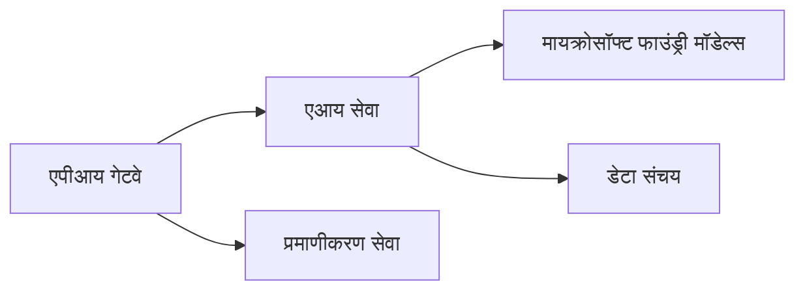
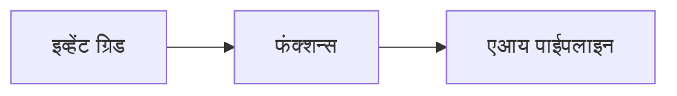

# Chapter 8: उत्पादन आणि एंटरप्राइज पॅटर्न्स

**📚 कोर्स**: [AZD Beginners साठी](../../README.md) | **⏱️ कालावधी**: 2-3 तास | **⭐ जटिलता**: प्रगत

---

## आढावा

हा प्रकरण एंटरप्राइज-तयार तैनाती पॅटर्न्स, सुरक्षा कडक करणे, मॉनिटरिंग, आणि उत्पादन AI वर्कलोडसाठी खर्च ऑप्टिमायझेशन यावर कव्हर करते.

> `azd 1.25.6` विरुद्ध तपासले गेले, जून 2026 मध्ये.

## शिका उद्दिष्टे

हे प्रकरण पूर्ण केल्यावर, तुम्ही:
- बहु-प्रदेश टिकाऊ अनुप्रयोग तैनात कराल
- एंटरप्राइज सुरक्षा पॅटर्न्स अंमलात आणाल
- सर्वसमावेशक मॉनिटरिंग कॉन्फिगर कराल
- स्केलवर खर्च ऑप्टिमाइझ कराल
- AZD सोबत CI/CD पाइपलाईन्स सेट कराल

---

## 📚 धडे

| # | धडा | वर्णन | वेळ |
|---|--------|-------------|------|
| 1 | [उत्पादन AI प्रॅक्टिसेस](production-ai-practices.md) | एंटरप्राइज तैनाती पॅटर्न्स | 90 मिनिटे |

---

## 🚀 उत्पादन तपासणी यादी

- [ ] टिकाऊपणासाठी बहु-प्रदेश तैनाती
- [ ] प्रमाणीकरणासाठी व्यवस्थापित ओळख (कीज नाही)
- [ ] मॉनिटरिंगसाठी अनुप्रयोग अंतर्दृष्टी
- [ ] खर्च बजेट्स आणि सूचना कॉन्फिगर केल्या
- [ ] सुरक्षा स्कॅनिंग सक्षम केले
- [ ] CI/CD पाइपलाईन समाकलन
- [ ] आपत्ती पुनर्प्राप्ती योजना

---

## 🏗️ आर्किटेक्चर पॅटर्न्स

### पॅटर्न 1: मायक्रोसर्व्हिसेस AI



### पॅटर्न 2: इव्हेंट-चालित AI



---

## 🔐 सुरक्षा सर्वोत्तम प्रॅक्टिसेस

```bicep
// Use managed identity
identity: {
  type: 'SystemAssigned'
}

// Private endpoints for AI services
properties: {
  publicNetworkAccess: 'Disabled'
  networkAcls: {
    defaultAction: 'Deny'
  }
}
```

---

## 💰 खर्च ऑप्टिमायझेशन

| धोरण | बचत |
|----------|---------|
| शून्यावर स्केल करा (कंटेनर अनुप्रयोग) | 60-80% |
| विकासासाठी वापर टियर वापरा | 50-70% |
| कार्यक्रमबद्ध स्केलिंग | 30-50% |
| राखीव क्षमता | 20-40% |

```bash
# बजेट सत्रांचे सेट करा
az consumption budget create \
  --budget-name "AI-Budget" \
  --amount 500 \
  --category Cost \
  --time-grain Monthly
```

---

## 📊 मॉनिटरिंग सेटअप

```bash
# प्रवाह लॉग्ज
azd monitor --logs

# अॅप्लिकेशन इनसाइट्स तपासा
azd monitor --overview

# मेट्रिक्स पहा
az monitor metrics list --resource <resource-id>
```

---

## 🔗 नेव्हिगेशन

| दिशा | प्रकरण |
|-----------|---------|
| **मागील** | [प्रकरण 7: समस्या निवारण](../chapter-07-troubleshooting/README.md) |
| **कोर्स पूर्ण** | [कोर्स मुख्यपृष्ठ](../../README.md) |

---

## 📖 संबंधित स्रोत

- [AI एजंट्स मार्गदर्शक](../chapter-02-ai-development/agents.md)
- [अनुप्रयोग अंतर्दृष्टी](../chapter-06-pre-deployment/application-insights.md)
- [बहु-एजंट सोल्युशन्स](../chapter-05-multi-agent/README.md)
- [मायक्रोसर्व्हिसेस उदाहरण](../../examples/microservices/README.md)

---

<!-- CO-OP TRANSLATOR DISCLAIMER START -->
**अस्वीकरण**:
हा दस्तऐवज AI भाषांतर सेवा [Co-op Translator](https://github.com/Azure/co-op-translator) चा वापर करून अनुवादित केला आहे. जरी आम्ही अचूकतेसाठी प्रयत्न करतो, तरी कृपया लक्षात घ्या की स्वयंचलित भाषांतरांमध्ये त्रुटी किंवा अचूकतेची कमतरता असू शकते. मूळ दस्तऐवज त्याच्या मूळ भाषेत अधिकृत स्रोत मानला पाहिजे. महत्त्वाची माहिती असल्यास, व्यावसायिक मानवी भाषांतराची शिफारस केली जाते. या भाषांतराच्या वापरामुळे उद्भवणाऱ्या कोणत्याही गैरसमज किंवा चुकीच्या अर्थलावणीसाठी आम्ही जबाबदार नाही.
<!-- CO-OP TRANSLATOR DISCLAIMER END -->