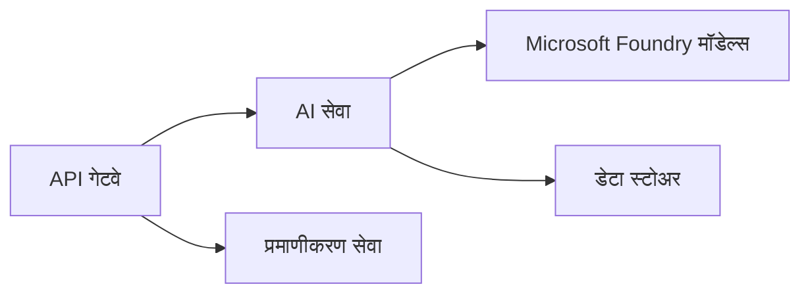
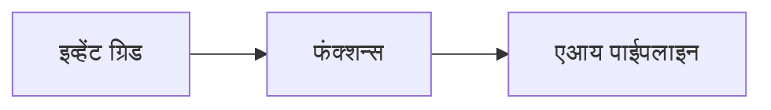

# अध्याय 8: उत्पादन आणि एंटरप्राइज पॅटर्न

**📚 कोर्स**: [AZD For Beginners](../../README.md) | **⏱️ कालावधी**: 2-3 तास | **⭐ गुंतागुंत**: प्रगत

---

## आढावा

हा अध्याय एंटरप्राइज-तयार वितरण पॅटर्न, सुरक्षा कडक करणे, निरीक्षण आणि उत्पादन AI कार्यभारांसाठी खर्च ऑप्टिमायझेशन यांचा समावेश करतो.

> जुलै 2026 मध्ये `azd 1.27.1` विरुद्ध मान्यताप्राप्त.

## शिकण्याची उद्दिष्टे

या अध्यायाला पूर्ण करून, तुम्ही:
- बहु-प्रदेशीय सक्षम अनुप्रयोग तैनात कराल
- एंटरप्राइज सुरक्षा पॅटर्न लागू कराल
- संपूर्ण निरीक्षण कॉन्फिगर कराल
- मोठ्या प्रमाणावर खर्च ऑप्टिमाइझ कराल
- AZD सह CI/CD पाईपलाईन सेट कराल

---

## 📚 धडे

| # | धडा | वर्णन | वेळ |
|---|--------|-------------|------|
| 1 | [उत्पादन AI पद्धती](production-ai-practices.md) | एंटरप्राइज वितरण पॅटर्न | 90 मिनिटे |

---

## 🚀 उत्पादन तपासणी यादी

- [ ] सक्षमतेसाठी बहु-प्रदेशीय वितरण
- [ ] प्रमाणीकरणासाठी व्यवस्थापित ओळख (की नाहीत)
- [ ] निरीक्षणासाठी Application Insights
- [ ] खर्च बजेट्स आणि अलर्ट कॉन्फिगर
- [ ] सुरक्षा स्कॅनिंग सक्षम
- [ ] CI/CD पाईपलाइन एकत्रीकरण
- [ ] आपत्ती पुनर्प्राप्ती योजना

---

## 🏗️ आर्किटेक्चर पॅटर्न

### पॅटर्न 1: मायक्रोसर्व्हिसेस AI



### पॅटर्न 2: इव्हेंट-चालित AI



---

## 🔐 सुरक्षा सर्वोत्तम पद्धती

```bicep
// Use managed identity
identity: {
  type: 'SystemAssigned'
}

// Private endpoints for AI services
properties: {
  publicNetworkAccess: 'Disabled'
  networkAcls: {
    defaultAction: 'Deny'
  }
}
```

---

## 💰 खर्च ऑप्टिमायझेशन

| धोरण | बचत |
|----------|---------|
| शून्यावर स्केल करा (कंटेनर अ‍ॅप्स) | 60-80% |
| विकासासाठी वापर ताटा | 50-70% |
| नियोजित स्केलिंग | 30-50% |
| राखीव क्षमता | 20-40% |

```bash
# बजेट सूचना सेट करा
az consumption budget create \
  --budget-name "AI-Budget" \
  --amount 500 \
  --category Cost \
  --time-grain Monthly
```

---

## 📊 निरीक्षण सेटअप

```bash
# लॉग प्रवाहित करा
azd monitor --logs

# अनुप्रयोग अंतर्दृष्टी तपासा
azd monitor --overview

# मेट्रिक्स पहा
az monitor metrics list --resource <resource-id>
```

---

## 🔗 नेव्हिगेशन

| दिशा | अध्याय |
|-----------|---------|
| **मागील** | [अध्याय 7: समस्या निवारण](../chapter-07-troubleshooting/README.md) |
| **कोर्स पूर्ण** | [कोर्स होम](../../README.md) |

---

## 📖 संबंधित साधने

- [AI एजंट मार्गदर्शक](../chapter-02-ai-development/agents.md)
- [Application Insights](../chapter-06-pre-deployment/application-insights.md)
- [मल्टी-एजंट सोल्यूशन्स](../chapter-05-multi-agent/README.md)
- [मायक्रोसर्व्हिसेस उदाहरण](../../examples/microservices/README.md)

---

<!-- CO-OP TRANSLATOR DISCLAIMER START -->
**अस्वीकरण**:
हा दस्तऐवज AI भाषांतर सेवा [Co-op Translator](https://github.com/Azure/co-op-translator) चा वापर करून अनुवादित केला आहे. जरी आम्ही अचूकतेसाठी प्रयत्न करतो, तरी कृपया लक्षात घ्या की स्वयंचलित भाषांतरांमध्ये त्रुटी किंवा अचूकतेची कमतरता असू शकते. मूळ दस्तऐवज त्याच्या मूळ भाषेत अधिकृत स्रोत मानला पाहिजे. महत्त्वाची माहिती असल्यास, व्यावसायिक मानवी भाषांतराची शिफारस केली जाते. या भाषांतराच्या वापरामुळे उद्भवणाऱ्या कोणत्याही गैरसमज किंवा चुकीच्या अर्थलावणीसाठी आम्ही जबाबदार नाही.
<!-- CO-OP TRANSLATOR DISCLAIMER END -->