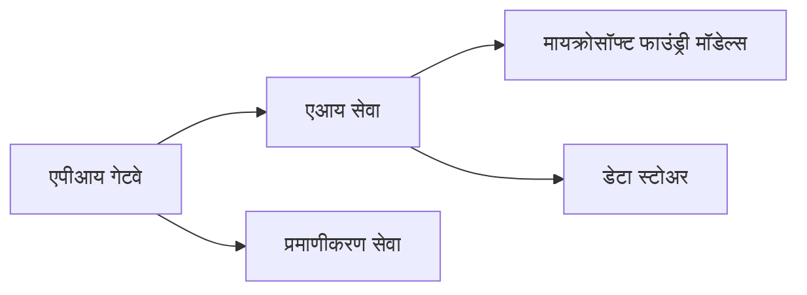
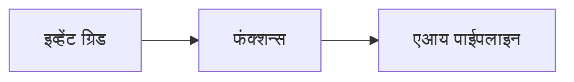

# Chapter 8: उत्पादन आणि एंटरप्राइझ पॅटर्न्स

**📚 कोर्स**: [AZD नवशिक्यांसाठी](../../README.md) | **⏱️ कालावधी**: 2-3 तास | **⭐ कठीणता**: उन्नत

---

## आढावा

हे प्रकरण उत्पादनातील AI वर्कलोडसाठी एंटरप्राइझ-तयार डिप्लॉयमेंट पॅटर्न, सुरक्षा कडक करणे, मॉनिटरिंग आणि खर्च अनुकूलन यांचा आढावा घेते.

> मार्च 2026 मध्ये `azd 1.23.12` विरुद्ध सत्यापित.

## शिकण्याचे उद्दिष्टे

हे प्रकरण पूर्ण केल्यावर, आपण:
- बहु-क्षेत्र प्रतिकारक्षम अनुप्रयोग तैनात करणे
- एंटरप्राइझ सुरक्षा पॅटर्न अमलात आणणे
- व्यापक मॉनिटरिंग कॉन्फिगर करणे
- प्रमाणात खर्च अनुकूल करणे
- AZD सह CI/CD पाईपलाइन्स सेट करणे

---

## 📚 धडे

| # | धडा | वर्णन | वेळ |
|---|--------|-------------|------|
| 1 | [उत्पादन AI पद्धती](production-ai-practices.md) | एंटरप्राइझ तैनाती पॅटर्न | 90 मिनिटे |

---

## 🚀 प्रॉडक्शन तपासणी यादी

- [ ] प्रतिकारक्षमतेसाठी बहु-क्षेत्रीय तैनाती
- [ ] प्रमाणीकरणासाठी Managed identity (कीज नाहीत)
- [ ] मॉनिटरिंगसाठी Application Insights
- [ ] खर्च बजेट आणि अलर्ट कॉन्फिगर करणे
- [ ] सुरक्षा स्कॅनिंग सक्षम करणे
- [ ] CI/CD पाईपलाइन एकत्रीकरण
- [ ] आपत्ती पुनर्प्राप्ती योजना

---

## 🏗️ आर्किटेक्चर पॅटर्न

### पॅटर्न 1: Microservices AI


### पॅटर्न 2: इव्हेंट-ड्रिव्हन AI


---

## 🔐 सुरक्षा सर्वोत्तम सराव

```bicep
// Use managed identity
identity: {
  type: 'SystemAssigned'
}

// Private endpoints for AI services
properties: {
  publicNetworkAccess: 'Disabled'
  networkAcls: {
    defaultAction: 'Deny'
  }
}
```

---

## 💰 खर्च अनुकूलन

| रणनीती | बचत |
|----------|---------|
| शून्यावर स्केल (Container Apps) | 60-80% |
| विकासासाठी consumption टियर्स वापरा | 50-70% |
| नियोजित स्केलिंग | 30-50% |
| आरक्षित क्षमता | 20-40% |

```bash
# बजेट चेतावण्या सेट करा
az consumption budget create \
  --budget-name "AI-Budget" \
  --amount 500 \
  --category Cost \
  --time-grain Monthly
```

---

## 📊 मॉनिटरिंग सेटअप

```bash
# लॉग प्रवाहित करा
azd monitor --logs

# Application Insights तपासा
azd monitor --overview

# मेट्रिक्स पहा
az monitor metrics list --resource <resource-id>
```

---

## 🔗 नेव्हिगेशन

| दिशा | अध्याय |
|-----------|---------|
| **मागील** | [प्रकरण 7: समस्या निवारण](../chapter-07-troubleshooting/README.md) |
| **कोर्स पूर्ण** | [कोर्स मुख्यपृष्ठ](../../README.md) |

---

## 📖 संबंधित संसाधने

- [AI एजंट्स मार्गदर्शक](../chapter-02-ai-development/agents.md)
- [Application Insights](../chapter-06-pre-deployment/application-insights.md)
- [मल्टी-एजंट सोल्यूशन्स](../chapter-05-multi-agent/README.md)
- [Microservices उदाहरण](../../examples/microservices/README.md)

---

<!-- CO-OP TRANSLATOR DISCLAIMER START -->
**अस्वीकरण**:
हा दस्तऐवज AI अनुवाद सेवा [Co-op Translator](https://github.com/Azure/co-op-translator) वापरून अनुवादित केला आहे. आम्ही अचूकतेसाठी प्रयत्न करतो, तरी कृपया लक्षात ठेवा की स्वयंचलित अनुवादांमध्ये त्रुटी किंवा अचूक नसलेली माहिती असू शकते. मूळ दस्तऐवज त्याच्या मूळ भाषेत अधिकारप्राप्त स्रोत म्हणून गणला जावा. महत्वाच्या माहितीच्या बाबतीत व्यावसायिक मानवी अनुवादाची शिफारस केली जाते. या अनुवादाच्या वापरामुळे उद्भवलेल्या कोणत्याही गैरसमज किंवा चुकीच्या अर्थापणाबद्दल आम्ही जबाबदार नाहीत.
<!-- CO-OP TRANSLATOR DISCLAIMER END -->