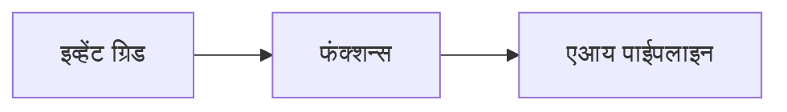

# अध्याय 8: उत्पादन आणि एंटरप्राइझ नमुने

**📚 कोर्स**: [AZD For Beginners](../../README.md) | **⏱️ कालावधी**: 2-3 तास | **⭐ जटिलता**: प्रगत

---

## आढावा

हा अध्याय उत्पादनासाठी तयार एंटरप्राइझ तैनाती नमुने, सुरक्षा कडक करणे, निरीक्षण, आणि उत्पादन AI कामाच्या भारांसाठी खर्च सुधारणा यावर चर्चा करतो.

## शिक्षण उद्दिष्टे

हा अध्याय पूर्ण केल्यावर, तुम्ही:
- बहुआयामी क्षेत्रातील टिकाऊ अनुप्रयोग तैनात कराल
- एंटरप्राइझ सुरक्षा नमुने लागू कराल
- सर्वसमावेशक निरीक्षण कॉन्फिगर कराल
- प्रमाणात खर्च सुधारणा कराल
- AZD सोबत CI/CD पाइपलाईन्स सेट कराल

---

## 📚 धडे

| # | धडा | वर्णन | वेळ |
|---|--------|-------------|------|
| 1 | [उत्पादन AI प्रॅक्टिसेस](production-ai-practices.md) | एंटरप्राइझ तैनाती नमुने | 90 मिनिटे |

---

## 🚀 उत्पादन तपासणी सूची

- [ ] टिकाऊपणासाठी बहुआयामी क्षेत्रीय तैनाती
- [ ] प्रमाणीकरणासाठी व्यवस्थापित ओळख (की नाही)
- [ ] निरीक्षणासाठी अप्लिकेशन इनसाइट्स
- [ ] खर्च सुविधा आणि अलर्ट कॉन्फिगर केलेले
- [ ] सुरक्षा तपासणी सक्षम
- [ ] CI/CD पाइपलाईन इंटिग्रेशन
- [ ] आपत्ती पुनर्प्राप्ती योजना

---

## 🏗️ आर्किटेक्चर नमुने

### नमुना 1: मायक्रोसर्व्हिसेस AI


### नमुना 2: इव्हेंट-चालित AI


---

## 🔐 सुरक्षा उत्तम प्रॅक्टिसेस

```bicep
// Use managed identity
identity: {
  type: 'SystemAssigned'
}

// Private endpoints for AI services
properties: {
  publicNetworkAccess: 'Disabled'
  networkAcls: {
    defaultAction: 'Deny'
  }
}
```

---

## 💰 खर्च सुधारणा

| धोरण | बचत |
|----------|---------|
| शून्यावर प्रमाण देणे (कंटेनर ऍप्स) | 60-80% |
| विकासासाठी उपभोग स्तर वापरणे | 50-70% |
| नियोजित प्रमाण वाढ | 30-50% |
| राखीव क्षमतेचा वापर | 20-40% |

```bash
# बजेट अलर्ट सेट करा
az consumption budget create \
  --budget-name "AI-Budget" \
  --amount 500 \
  --category Cost \
  --time-grain Monthly
```

---

## 📊 निरीक्षण सेटअप

```bash
# सागरी नोंदी प्रवाहित करा
azd monitor --logs

# अनुप्रयोग अंतर्दृष्टी तपासा
azd monitor

# मेट्रिक्स पाहा
az monitor metrics list --resource <resource-id>
```

---

## 🔗 नेव्हिगेशन

| दिशा | अध्याय |
|-----------|---------|
| **मागील** | [अध्याय 7: त्रुटी निवारण](../chapter-07-troubleshooting/README.md) |
| **कोर्स पूर्ण** | [कोर्स होम](../../README.md) |

---

## 📖 संबंधित संसाधने

- [AI एजंट्स मार्गदर्शक](../chapter-02-ai-development/agents.md)
- [अ‍ॅप्लिकेशन इनसाइट्स](../chapter-06-pre-deployment/application-insights.md)
- [मल्टी-एजंट सोल्यूशन्स](../chapter-05-multi-agent/README.md)
- [मायक्रोसर्व्हिसेस उदाहरण](../../examples/microservices/README.md)

---

<!-- CO-OP TRANSLATOR DISCLAIMER START -->
**अस्वीकरण**:
हा दस्तऐवज AI अनुवाद सेवा [Co-op Translator](https://github.com/Azure/co-op-translator) चा वापर करून अनुवादित केला आहे. आम्ही अचूकतेसाठी प्रयत्नशील आहोत, पण कृपया लक्षात घ्या की स्वयंचलित अनुवादांमध्ये चुका किंवा अचूकतेची कमतरता असू शकते. मूळ दस्तऐवज त्याच्या स्थानिक भाषेत अधिकृत स्रोत म्हणून मानला जावा. महत्त्वाच्या माहितींसाठी व्यावसायिक मानव अनुवादाची शिफारस केली जाते. या अनुवादाच्या वापरामुळे होणाऱ्या कोणत्याही गैरसमजुती किंवा चूका यासाठी आम्ही जबाबदार नाही.
<!-- CO-OP TRANSLATOR DISCLAIMER END -->