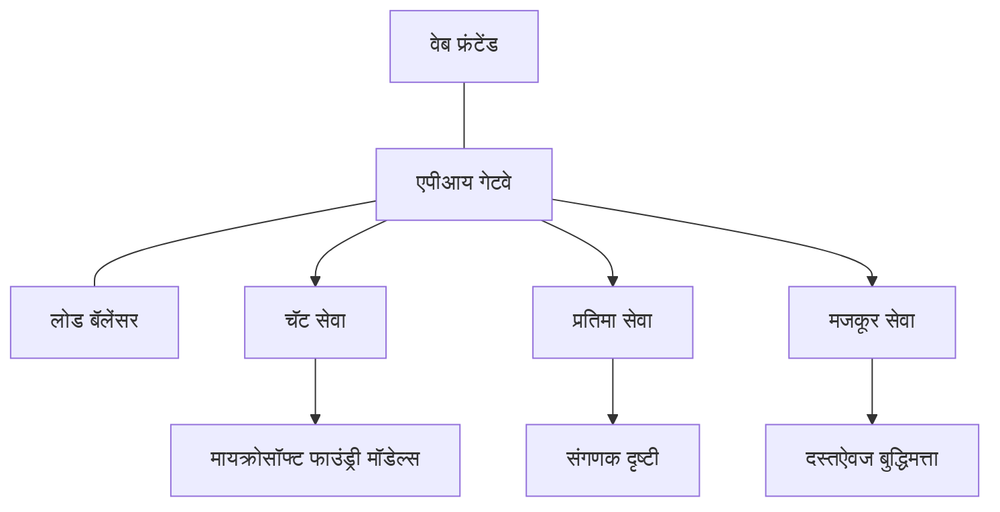

# उत्पादन AI वर्कलोड सर्वोत्तम पद्धती AZD सह

**अध्याय नेव्हिगेशन:**
- **📚 कोर्स होम**: [AZD For Beginners](../../README.md)
- **📖 सध्याचा अध्याय**: अध्याय 8 - उत्पादन आणि एंटरप्राइझ पॅटर्न्स
- **⬅️ मागील अध्याय**: [अध्याय 7: त्रुटी निवारण](../chapter-07-troubleshooting/debugging.md)
- **⬅️ संबंधित**: [AI कार्यशाळा प्रयोगशाळा](ai-workshop-lab.md)
- **🎯 कोर्स पूर्ण**: [AZD For Beginners](../../README.md)

## आढावा

हा मार्गदर्शक Azure Developer CLI (AZD) वापरून उत्पादन-तयार AI वर्कलोड डिप्लॉय करण्यासाठी सर्वसमावेशक सर्वोत्तम पद्धती प्रदान करतो. Microsoft Foundry Discord समुदाय आणि प्रत्यक्ष ग्राहकांच्या डायप्लॉयमेंटवर आधारित, हे तंत्र सर्वात सामान्य अडचणींना हाताळतात.

## प्रमुख अडचणी

आमच्या समुदायाचा मतदान निकालानुसार, विकसकांना खालील शीर्ष अडचणींचा सामना करावा लागतो:

- **45%** अनेक सेवा AI डिप्लॉयमेंटसाठी संघर्ष करतात
- **38%** क्रिडेन्शियल आणि सीक्रेट व्यवस्थापनात अडचणीत आहेत  
- **35%** उत्पादन सुसज्जता आणि प्रमाण वाढविणे अवघड वाटते
- **32%** खर्च ऑप्टिमायझेशन धोरणांसाठी आवश्यकता आहे
- **29%** सुधारित मॉनिटरिंग आणि समस्या शोधण्याची गरज आहे

## उत्पादन AI साठी आर्किटेक्चर पॅटर्न्स

### पॅटर्न 1: मायक्रोसेवा AI आर्किटेक्चर

**कधी वापरायचे**: अनेक क्षमता असलेल्या जटिल AI अनुप्रयोगांसाठी


**AZD राबवणीची पद्धत**:

```yaml
# azure.yaml
name: enterprise-ai-platform
services:
  web:
    project: ./web
    host: staticwebapp
  api-gateway:
    project: ./api-gateway
    host: containerapp
  chat-service:
    project: ./services/chat
    host: containerapp
  vision-service:
    project: ./services/vision
    host: containerapp
  text-service:
    project: ./services/text
    host: containerapp
```

### पॅटर्न 2: घटना-चालित AI प्रक्रिया

**कधी वापरायचे**: बॅच प्रक्रिया, कागदपत्र विश्लेषण, असिंक वर्कफ्लोज

```bicep
// Event Hub for AI processing pipeline
resource eventHub 'Microsoft.EventHub/namespaces@2023-01-01-preview' = {
  name: eventHubNamespaceName
  location: location
  sku: {
    name: 'Standard'
    tier: 'Standard'
    capacity: 1
  }
}

// Service Bus for reliable message processing
resource serviceBus 'Microsoft.ServiceBus/namespaces@2022-10-01-preview' = {
  name: serviceBusNamespaceName
  location: location
  sku: {
    name: 'Premium'
    tier: 'Premium'
    capacity: 1
  }
}

// Function App for processing
resource functionApp 'Microsoft.Web/sites@2023-01-01' = {
  name: functionAppName
  location: location
  kind: 'functionapp,linux'
  properties: {
    siteConfig: {
      appSettings: [
        {
          name: 'FUNCTIONS_EXTENSION_VERSION'
          value: '~4'
        }
        {
          name: 'AZURE_OPENAI_ENDPOINT'
          value: '@Microsoft.KeyVault(VaultName=${keyVault.name};SecretName=openai-endpoint)'
        }
      ]
    }
  }
}
```

## AI एजंट आरोग्याबद्दल विचार

जेव्हा पारंपरिक वेब अॅप ब्रेक होते, त्यावेळी लक्षणे परिचित असतात: पृष्ठ लोड होत नाही, API त्रुटी परत करतो, किंवा डिप्लॉयमेंट अयशस्वी होते. AI-संकल्पित अनुप्रयोग तसंच तुटू शकतात—परंतु ते सूक्ष्म मार्गांनी वागू शकतात ज्यामध्ये स्पष्ट त्रुटी संदेश दिसत नाहीत.

हा विभाग तुम्हाला AI वर्कलोडच्या मॉनिटरिंगसाठी मानसिक मॉडेल तयार करण्यात मदत करतो जेणेकरून जेव्हा काही बरोबर नसल्यास तुम्हाला शोधायला कुठे पाहायचे ते माहित असेल.

### एजंट आरोग्य पारंपरिक अ‍ॅप आरोग्यापेक्षा कसे वेगळे आहे

पारंपरिक अ‍ॅप कार्य करते किंवा नाही. AI एजंट कार्यरत दिसू शकतो पण खराब निकाल देतो. एजंट आरोग्य दोन स्तरांमध्ये विचार करा:

| स्तर | काय पाहायचे | कुठे पाहायचे |
|-------|--------------|---------------|
| **इन्फ्रास्ट्रक्चर आरोग्य** | सेवा चालू आहे का? संसाधने उपलब्ध आहेत का? एंडपॉइंट्स पोहोचता येतात का? | `azd monitor`, Azure पोर्टल संसाधन आरोग्य, कंटेनर/अ‍ॅप लॉग्स |
| **वर्तन आरोग्य** | एजंट अचूक प्रतिसाद देतो आहे का? प्रतिसाद वेळेवर आहेत का? मॉडेल योग्यरित्या कॉल होत आहे का? | एप्लिकेशन इनसाइट्स ट्रेसेस, मॉडेल कॉल लेटन्सी मेट्रिक्स, प्रतिसाद गुणवत्ता लॉग्स |

इन्फ्रास्ट्रक्चर आरोग्य परिचित आहे—हे कोणत्याही azd अ‍ॅपसाठी सारखे आहे. वर्तन आरोग्य हा AI वर्कलोडने आणलेला नवीन स्तर आहे.

### जेव्हा AI अ‍ॅप अपेक्षेनुसार वागत नाही तेव्हा कुठे पाहायचे

जर तुमचा AI अ‍ॅप अपेक्षित निकाल प्रदान करत नसेल, तर येथे संकल्पनात्मक चेकलिस्ट आहे:

1. **मुलभूत बाबींनी सुरुवात करा.** अॅप चालू आहे का? त्याच्या अवलंबित्वांवर पोहोचू शकतो का? `azd monitor` आणि संसाधन आरोग्य तपासा जसे तुम्ही कोणत्याही अ‍ॅपसाठी करता.
2. **मॉडेल कनेक्शन तपासा.** तुमचा अनुप्रयोग AI मॉडेल यशस्वीरित्या कॉल करतो का? अपयशी किंवा टाइमआउट झालेल्या कॉल्स हे AI अ‍ॅप समस्या निर्माण करणारे सर्वात सामान्य कारण आहे आणि तूमच्या अनुप्रयोग लॉगमध्ये दिसतील.
3. **मॉडेलने काय प्राप्त केले ते पाहा.** AI प्रतिसाद इनपुटवर (प्रॉम्प्ट आणि प्राप्त केलेल्या संदर्भावर) अवलंबून असतात. जर आउटपुट चुकीचा असेल, तर इनपुट सामान्यतः चुकीचा असतो. तुमचे अ‍ॅप मॉडेलला योग्य डेटा पाठवत आहे का ते तपासा.
4. **प्रतिक्रिया विलंब तपासा.** AI मॉडेल कॉल्स सामान्य API कॉल पेक्षा मंद असतात. जर तुमचा अ‍ॅप स्लuggish वाटत असेल, तर तपासा की मॉडेल प्रतिसाद वेळ वाढले आहे का—हे थ्रॉटलिंग, क्षमता मर्यादा किंवा प्रादेशिक गर्दी सूचित करू शकते.
5. **खर्च संकेत पहा.** टोकन वापर किंवा API कॉल्स मध्ये अनपेक्षित वाढ लूप, चुकीच्या प्रॉम्प्ट किंवा अत्यधिक पुन: प्रयत्न दर्शवू शकते.

तुम्हाला लगेचच निरीक्षण उपकरणांमध्ये प्रावीण्य मिळवण्याची गरज नाही. मुख्य विचार असा आहे की AI अनुप्रयोगांमध्ये वर्तनाचा अतिरिक्त स्तर असतो ज्याचे निरीक्षण करणे आवश्यक असते, आणि azd मध्ये अंतर्भूत मॉनिटरिंग (`azd monitor`) तुम्हाला दोन्ही स्तर तपासण्यासाठी सुरुवात देतो.

---

## सुरक्षा सर्वोत्तम पद्धती

### 1. झिरो-ट्रस्ट सुरक्षा मॉडेल

**अमलबजावणी धोरण**:
- प्रमाणीकरणाशिवाय कोणत्याही सेवा-सेवा संवाद नाही
- सर्व API कॉल मॅनेज्ड ओळख वापरतात
- खासगी एंडपॉइंटसह नेटवर्क अलगाव
- न्यूनतम विशेषाधिकार प्रवेश नियंत्रण

```bicep
// Managed Identity for each service
resource chatServiceIdentity 'Microsoft.ManagedIdentity/userAssignedIdentities@2023-01-31' = {
  name: 'chat-service-identity'
  location: location
}

// Role assignments with minimal permissions
resource openAIUserRole 'Microsoft.Authorization/roleAssignments@2022-04-01' = {
  scope: openAIAccount
  name: guid(openAIAccount.id, chatServiceIdentity.id, openAIUserRoleDefinitionId)
  properties: {
    roleDefinitionId: subscriptionResourceId('Microsoft.Authorization/roleDefinitions', '5e0bd9bd-7b93-4f28-af87-19fc36ad61bd')
    principalId: chatServiceIdentity.properties.principalId
    principalType: 'ServicePrincipal'
  }
}
```

### 2. सुरक्षित सीक्रेट व्यवस्थापन

**की वॉल्ट एकत्रीकरण पॅटर्न**:

```bicep
// Key Vault with proper access policies
resource keyVault 'Microsoft.KeyVault/vaults@2023-02-01' = {
  name: keyVaultName
  location: location
  properties: {
    tenantId: tenant().tenantId
    sku: {
      family: 'A'
      name: 'premium'  // Use premium for production
    }
    enableRbacAuthorization: true  // Use RBAC instead of access policies
    enablePurgeProtection: true    // Prevent accidental deletion
    enableSoftDelete: true
    softDeleteRetentionInDays: 90
  }
}

// Store all AI service credentials
resource openAIKeySecret 'Microsoft.KeyVault/vaults/secrets@2023-02-01' = {
  parent: keyVault
  name: 'openai-api-key'
  properties: {
    value: openAIAccount.listKeys().key1
    attributes: {
      enabled: true
    }
  }
}
```

### 3. नेटवर्क सुरक्षा

**खासगी एंडपॉइंट कॉन्फिगरेशन**:

```bicep
// Virtual Network for AI services
resource virtualNetwork 'Microsoft.Network/virtualNetworks@2023-04-01' = {
  name: vnetName
  location: location
  properties: {
    addressSpace: {
      addressPrefixes: ['10.0.0.0/16']
    }
    subnets: [
      {
        name: 'ai-services-subnet'
        properties: {
          addressPrefix: '10.0.1.0/24'
          privateEndpointNetworkPolicies: 'Disabled'
        }
      }
      {
        name: 'app-services-subnet'
        properties: {
          addressPrefix: '10.0.2.0/24'
          delegations: [
            {
              name: 'Microsoft.Web/serverFarms'
              properties: {
                serviceName: 'Microsoft.Web/serverFarms'
              }
            }
          ]
        }
      }
    ]
  }
}

// Private endpoints for all AI services
resource openAIPrivateEndpoint 'Microsoft.Network/privateEndpoints@2023-04-01' = {
  name: '${openAIAccountName}-pe'
  location: location
  properties: {
    subnet: {
      id: virtualNetwork.properties.subnets[0].id
    }
    privateLinkServiceConnections: [
      {
        name: 'openai-connection'
        properties: {
          privateLinkServiceId: openAIAccount.id
          groupIds: ['account']
        }
      }
    ]
  }
}
```

## कार्यक्षमता आणि प्रमाण वाढविणे

### 1. ऑटो-स्केलिंग धोरणे

**कंटेनर अ‍ॅप्स ऑटो-स्केलिंग**:

```bicep
resource containerApp 'Microsoft.App/containerApps@2023-05-01' = {
  name: containerAppName
  location: location
  properties: {
    configuration: {
      ingress: {
        external: true
        targetPort: 8000
        transport: 'http'
      }
    }
    template: {
      scale: {
        minReplicas: 2  // Always have 2 instances minimum
        maxReplicas: 50 // Scale up to 50 for high load
        rules: [
          {
            name: 'http-scaling'
            http: {
              metadata: {
                concurrentRequests: '20'  // Scale when >20 concurrent requests
              }
            }
          }
          {
            name: 'cpu-scaling'
            custom: {
              type: 'cpu'
              metadata: {
                type: 'Utilization'
                value: '70'  // Scale when CPU >70%
              }
            }
          }
        ]
      }
    }
  }
}
```

### 2. कॅशिंग धोरणे

**AI प्रतिसादांसाठी Redis कॅश**:

```bicep
// Redis Premium for production workloads
resource redisCache 'Microsoft.Cache/redis@2023-04-01' = {
  name: redisCacheName
  location: location
  properties: {
    sku: {
      name: 'Premium'
      family: 'P'
      capacity: 1
    }
    enableNonSslPort: false
    minimumTlsVersion: '1.2'
    redisConfiguration: {
      'maxmemory-policy': 'allkeys-lru'
    }
    // Enable clustering for high availability
    redisVersion: '6.0'
    shardCount: 2
  }
}

// Cache configuration in application
var cacheConnectionString = '${redisCache.properties.hostName}:6380,password=${redisCache.listKeys().primaryKey},ssl=True,abortConnect=False'
```

### 3. लोड संतुलन आणि ट्रॅफिक व्यवस्थापन

**WAF सह अ‍ॅप्लिकेशन गेटवे**:

```bicep
// Application Gateway with Web Application Firewall
resource applicationGateway 'Microsoft.Network/applicationGateways@2023-04-01' = {
  name: appGatewayName
  location: location
  properties: {
    sku: {
      name: 'WAF_v2'
      tier: 'WAF_v2'
      capacity: 2
    }
    webApplicationFirewallConfiguration: {
      enabled: true
      firewallMode: 'Prevention'
      ruleSetType: 'OWASP'
      ruleSetVersion: '3.2'
    }
    // Backend pools for AI services
    backendAddressPools: [
      {
        name: 'ai-services-pool'
        properties: {
          backendAddresses: [
            {
              fqdn: '${containerApp.properties.configuration.ingress.fqdn}'
            }
          ]
        }
      }
    ]
  }
}
```

## 💰 खर्चाचे ऑप्टिमायझेशन

### 1. संसाधने योग्य आकार देणे

**पर्यावरण-विशिष्ट कॉन्फिगरेशन्स**:

```bash
# विकास वातावरण
azd env new development
azd env set AZURE_OPENAI_SKU "S0"
azd env set AZURE_OPENAI_CAPACITY 10
azd env set AZURE_SEARCH_SKU "basic"
azd env set CONTAINER_CPU 0.5
azd env set CONTAINER_MEMORY 1.0

# उत्पादन वातावरण
azd env new production
azd env set AZURE_OPENAI_SKU "S0"
azd env set AZURE_OPENAI_CAPACITY 100
azd env set AZURE_SEARCH_SKU "standard"
azd env set CONTAINER_CPU 2.0
azd env set CONTAINER_MEMORY 4.0
```

### 2. खर्च मॉनिटरिंग आणि बजेट

```bicep
// Cost management and budgets
resource budget 'Microsoft.Consumption/budgets@2023-05-01' = {
  name: 'ai-workload-budget'
  properties: {
    timePeriod: {
      startDate: '2024-01-01'
      endDate: '2024-12-31'
    }
    timeGrain: 'Monthly'
    amount: 2000  // $2000 monthly budget
    category: 'Cost'
    notifications: {
      warning: {
        enabled: true
        operator: 'GreaterThan'
        threshold: 80
        contactEmails: [
          'finance@company.com'
          'engineering@company.com'
        ]
        contactRoles: [
          'Owner'
          'Contributor'
        ]
      }
      critical: {
        enabled: true
        operator: 'GreaterThan'
        threshold: 95
        contactEmails: [
          'cto@company.com'
        ]
      }
    }
  }
}
```

### 3. टोकन वापर ऑप्टिमायझेशन

**OpenAI खर्च व्यवस्थापन**:

```typescript
// अॅप्लिकेशन-स्तरीय टोकन ऑप्टिमायझेशन
class TokenOptimizer {
  private readonly maxTokens = 4000;
  private readonly reserveTokens = 500;
  
  optimizePrompt(userInput: string, context: string): string {
    const availableTokens = this.maxTokens - this.reserveTokens;
    const estimatedTokens = this.estimateTokens(userInput + context);
    
    if (estimatedTokens > availableTokens) {
      // संदर्भ कमी करा, वापरकर्त्याचा इनपुट नाही
      context = this.truncateContext(context, availableTokens - this.estimateTokens(userInput));
    }
    
    return `${context}\n\nUser: ${userInput}`;
  }
  
  private estimateTokens(text: string): number {
    // साधारण अंदाज: १ टोकन ≈ ४ अक्षरे
    return Math.ceil(text.length / 4);
  }
}
```

## मॉनिटरिंग आणि निरीक्षण

### 1. सर्वसमावेशक एप्लिकेशन इनसाइट्स

```bicep
// Application Insights with advanced features
resource applicationInsights 'Microsoft.Insights/components@2020-02-02' = {
  name: applicationInsightsName
  location: location
  kind: 'web'
  properties: {
    Application_Type: 'web'
    WorkspaceResourceId: logAnalyticsWorkspace.id
    SamplingPercentage: 100  // Full sampling for AI apps
    DisableIpMasking: false  // Enable for security
  }
}

// Custom metrics for AI operations
resource aiMetricAlerts 'Microsoft.Insights/metricAlerts@2018-03-01' = {
  name: 'ai-high-error-rate'
  location: 'global'
  properties: {
    description: 'Alert when AI service error rate is high'
    severity: 2
    enabled: true
    scopes: [
      applicationInsights.id
    ]
    evaluationFrequency: 'PT1M'
    windowSize: 'PT5M'
    criteria: {
      'odata.type': 'Microsoft.Azure.Monitor.SingleResourceMultipleMetricCriteria'
      allOf: [
        {
          name: 'high-error-rate'
          metricName: 'requests/failed'
          operator: 'GreaterThan'
          threshold: 10
          timeAggregation: 'Count'
        }
      ]
    }
  }
}
```

### 2. AI-विशिष्ट मॉनिटरिंग

**AI मेट्रिक्ससाठी सानुकूल डॅशबोर्ड**:

```json
// Dashboard configuration for AI workloads
{
  "dashboard": {
    "name": "AI Application Monitoring",
    "tiles": [
      {
        "name": "OpenAI Request Volume",
        "query": "requests | where name contains 'openai' | summarize count() by bin(timestamp, 5m)"
      },
      {
        "name": "AI Response Latency",
        "query": "requests | where name contains 'openai' | summarize avg(duration) by bin(timestamp, 5m)"
      },
      {
        "name": "Token Usage",
        "query": "customMetrics | where name == 'openai_tokens_used' | summarize sum(value) by bin(timestamp, 1h)"
      },
      {
        "name": "Cost per Hour",
        "query": "customMetrics | where name == 'openai_cost' | summarize sum(value) by bin(timestamp, 1h)"
      }
    ]
  }
}
```

### 3. आरोग्य तपासण्या आणि अपटाइम मॉनिटरिंग

```bicep
// Application Insights availability tests
resource availabilityTest 'Microsoft.Insights/webtests@2022-06-15' = {
  name: 'ai-app-availability-test'
  location: location
  tags: {
    'hidden-link:${applicationInsights.id}': 'Resource'
  }
  properties: {
    SyntheticMonitorId: 'ai-app-availability-test'
    Name: 'AI Application Availability Test'
    Description: 'Tests AI application endpoints'
    Enabled: true
    Frequency: 300  // 5 minutes
    Timeout: 120    // 2 minutes
    Kind: 'ping'
    Locations: [
      {
        Id: 'us-east-2-azr'
      }
      {
        Id: 'us-west-2-azr'
      }
    ]
    Configuration: {
      WebTest: '''
        <WebTest Name="AI Health Check" 
                 Id="8d2de8d2-a2b0-4c2e-9a0d-8f9c9a0b8c8d" 
                 Enabled="True" 
                 CssProjectStructure="" 
                 CssIteration="" 
                 Timeout="120" 
                 WorkItemIds="" 
                 xmlns="http://microsoft.com/schemas/VisualStudio/TeamTest/2010" 
                 Description="" 
                 CredentialUserName="" 
                 CredentialPassword="" 
                 PreAuthenticate="True" 
                 Proxy="default" 
                 StopOnError="False" 
                 RecordedResultFile="" 
                 ResultsLocale="">
          <Items>
            <Request Method="GET" 
                     Guid="a5f10126-e4cd-570d-961c-cea43999a200" 
                     Version="1.1" 
                     Url="${webApp.properties.defaultHostName}/health" 
                     ThinkTime="0" 
                     Timeout="120" 
                     ParseDependentRequests="True" 
                     FollowRedirects="True" 
                     RecordResult="True" 
                     Cache="False" 
                     ResponseTimeGoal="0" 
                     Encoding="utf-8" 
                     ExpectedHttpStatusCode="200" 
                     ExpectedResponseUrl="" 
                     ReportingName="" 
                     IgnoreHttpStatusCode="False" />
          </Items>
        </WebTest>
      '''
    }
  }
}
```

## आपत्ती पुनर्प्राप्ती आणि उच्च उपलब्धता

### 1. बहु-प्रदेशीय डिप्लॉयमेंट

```yaml
# azure.yaml - Multi-region configuration
name: ai-app-multiregion
services:
  api-primary:
    project: ./api
    host: containerapp
    env:
      - AZURE_REGION=eastus
  api-secondary:
    project: ./api
    host: containerapp
    env:
      - AZURE_REGION=westus2
```

```bicep
// Traffic Manager for global load balancing
resource trafficManager 'Microsoft.Network/trafficManagerProfiles@2022-04-01' = {
  name: trafficManagerProfileName
  location: 'global'
  properties: {
    profileStatus: 'Enabled'
    trafficRoutingMethod: 'Priority'
    dnsConfig: {
      relativeName: trafficManagerProfileName
      ttl: 30
    }
    monitorConfig: {
      protocol: 'HTTPS'
      port: 443
      path: '/health'
      intervalInSeconds: 30
      toleratedNumberOfFailures: 3
      timeoutInSeconds: 10
    }
    endpoints: [
      {
        name: 'primary-endpoint'
        type: 'Microsoft.Network/trafficManagerProfiles/azureEndpoints'
        properties: {
          targetResourceId: primaryAppService.id
          endpointStatus: 'Enabled'
          priority: 1
        }
      }
      {
        name: 'secondary-endpoint'
        type: 'Microsoft.Network/trafficManagerProfiles/azureEndpoints'
        properties: {
          targetResourceId: secondaryAppService.id
          endpointStatus: 'Enabled'
          priority: 2
        }
      }
    ]
  }
}
```

### 2. डेटा बॅकअप आणि पुनर्प्राप्ती

```bicep
// Backup configuration for critical data
resource backupVault 'Microsoft.DataProtection/backupVaults@2023-05-01' = {
  name: backupVaultName
  location: location
  identity: {
    type: 'SystemAssigned'
  }
  properties: {
    storageSettings: [
      {
        datastoreType: 'VaultStore'
        type: 'LocallyRedundant'
      }
    ]
  }
}

// Backup policy for AI models and data
resource backupPolicy 'Microsoft.DataProtection/backupVaults/backupPolicies@2023-05-01' = {
  parent: backupVault
  name: 'ai-data-backup-policy'
  properties: {
    policyRules: [
      {
        backupParameters: {
          backupType: 'Full'
          objectType: 'AzureBackupParams'
        }
        trigger: {
          schedule: {
            repeatingTimeIntervals: [
              'R/2024-01-01T02:00:00+00:00/P1D'  // Daily at 2 AM
            ]
          }
          objectType: 'ScheduleBasedTriggerContext'
        }
        dataStore: {
          datastoreType: 'VaultStore'
          objectType: 'DataStoreInfoBase'
        }
        name: 'BackupDaily'
        objectType: 'AzureBackupRule'
      }
    ]
  }
}
```

## DevOps आणि CI/CD एकत्रीकरण

### 1. GitHub अ‍ॅक्शन्स वर्कफ्लो

```yaml
# .github/workflows/deploy-ai-app.yml
name: Deploy AI Application

on:
  push:
    branches: [main]
  pull_request:
    branches: [main]

jobs:
  test:
    runs-on: ubuntu-latest
    steps:
      - uses: actions/checkout@v4
      
      - name: Setup Python
        uses: actions/setup-python@v4
        with:
          python-version: '3.11'
          
      - name: Install dependencies
        run: |
          pip install -r requirements.txt
          pip install pytest
          
      - name: Run tests
        run: pytest tests/
        
      - name: AI Safety Tests
        run: |
          python scripts/test_ai_safety.py
          python scripts/validate_prompts.py

  deploy-staging:
    needs: test
    if: github.event_name == 'pull_request'
    runs-on: ubuntu-latest
    steps:
      - uses: actions/checkout@v4
      
      - name: Setup AZD
        uses: Azure/setup-azd@v1.0.0
        
      - name: Login to Azure
        uses: azure/login@v1
        with:
          creds: ${{ secrets.AZURE_CREDENTIALS }}
          
      - name: Deploy to Staging
        run: |
          azd env select staging
          azd deploy

  deploy-production:
    needs: test
    if: github.ref == 'refs/heads/main'
    runs-on: ubuntu-latest
    steps:
      - uses: actions/checkout@v4
      
      - name: Setup AZD
        uses: Azure/setup-azd@v1.0.0
        
      - name: Login to Azure
        uses: azure/login@v1
        with:
          creds: ${{ secrets.AZURE_CREDENTIALS }}
          
      - name: Deploy to Production
        run: |
          azd env select production
          azd deploy
          
      - name: Run Production Health Checks
        run: |
          python scripts/health_check.py --env production
```

### 2. इन्फ्रास्ट्रक्चर मान्यता

```bash
# scripts/validate_infrastructure.sh
#!/bin/bash

echo "Validating AI infrastructure deployment..."

# सर्व आवश्यक सेवा चालू असल्याची तपासणी करा
services=("openai" "search" "storage" "keyvault")
for service in "${services[@]}"; do
    echo "Checking $service..."
    if ! az resource list --resource-type "Microsoft.CognitiveServices/accounts" --query "[?contains(name, '$service')]" -o tsv; then
        echo "ERROR: $service not found"
        exit 1
    fi
done

# OpenAI मॉडेल तैनातीची पडताळणी करा
echo "Validating OpenAI model deployments..."
models=$(az cognitiveservices account deployment list --name $AZURE_OPENAI_NAME --resource-group $AZURE_RESOURCE_GROUP --query "[].name" -o tsv)
if [[ ! $models == *"gpt-35-turbo"* ]]; then
    echo "ERROR: Required model gpt-35-turbo not deployed"
    exit 1
fi

# AI सेवा कनेक्टिव्हिटीची चाचणी करा
echo "Testing AI service connectivity..."
python scripts/test_connectivity.py

echo "Infrastructure validation completed successfully!"
```

## उत्पादन सुसज्जता चेकलिस्ट

### सुरक्षा ✅
- [ ] सर्व सेवा मॅनेज्ड ओळख वापरतात
- [ ] सीक्रेट्स की वॉल्ट मध्ये साठवलेले आहेत
- [ ] खासगी एंडपॉइंट कॉन्फिगर केले आहेत
- [ ] नेटवर्क सुरक्षा समूह लागू केले आहेत
- [ ] न्यूनतम विशेषाधिकारांसह RBAC
- [ ] सार्वजनिक एंडपॉइंटसाठी WAF सक्षम

### कार्यक्षमता ✅
- [ ] ऑटो-स्केलिंग कॉन्फिगर केले आहे
- [ ] कॅशिंग लागू केले आहे
- [ ] लोड संतुलन सेटअप केले आहे
- [ ] स्थिर सामग्रीसाठी CDN
- [ ] डेटाबेस कनेक्शन पूलिंग
- [ ] टोकन वापर ऑप्टिमायझेशन

### मॉनिटरिंग ✅
- [ ] एप्लिकेशन इनसाइट्स कॉन्फिगर केले
- [ ] सानुकूल मेट्रिक्स परिभाषित केले
- [ ] अलर्ट नियम सेट केले
- [ ] डॅशबोर्ड तयार केले
- [ ] आरोग्य तपासण्या अमलात
- [ ] लॉग राखणी धोरणे

### विश्वासार्हता ✅
- [ ] बहु-प्रदेशीय डिप्लॉयमेंट
- [ ] बॅकअप आणि पुनर्प्राप्ती योजना
- [ ] सर्किट ब्रेकर्स अंमलात
- [ ] पुनःप्रयत्न धोरणे कॉन्फिगर केली
- [ ] सौम्य घट
- [ ] आरोग्य तपासणी एंडपॉइंटस

### खर्च व्यवस्थापन ✅
- [ ] बजेट अलर्ट कॉन्फिगर केले
- [ ] संसाधने योग्य आकार दिले
- [ ] विकास/चाचणी सवलती लागू केल्या
- [ ] आरक्षित इंस्टन्स खरेदी केले
- [ ] खर्च मॉनिटरिंग डॅशबोर्ड
- [ ] नियमित खर्च पुनरावलोकने

### अनुपालन ✅
- [ ] डेटा रहिवासी आवश्यकता पूर्ण
- [ ] ऑडिट लॉगिंग सक्षम
- [ ] अनुपालन धोरणे लागू केल्या
- [ ] सुरक्षा बेसलाइन अंमलात
- [ ] नियमित सुरक्षा मूल्यांकन
- [ ] अपघात प्रतिसाद योजना

## कार्यप्रदर्शन बेंचमार्क्स

### सामान्य उत्पादन मेट्रिक्स

| मेट्रिक | लक्ष्य | निरीक्षण |
|--------|--------|------------|
| **प्रतिक्रिया वेळ** | < 2 सेकंद | एप्लिकेशन इनसाइट्स |
| **उपलब्धता** | 99.9% | अपटाइम मॉनिटरिंग |
| **त्रुटी दर** | < 0.1% | अनुप्रयोग लॉग्स |
| **टोकन वापर** | < $500/महिना | खर्च व्यवस्थापन |
| **समकालीन वापरकर्ते** | 1000+ | लोड चाचणी |
| **पुनर्प्राप्ती वेळ** | < 1 तास | आपत्ती पुनर्प्राप्ती चाचण्या |

### लोड टेस्टिंग

```bash
# एआय अनुप्रयोगांसाठी लोड चाचणी स्क्रिप्ट
python scripts/load_test.py \
  --endpoint https://your-ai-app.azurewebsites.net \
  --concurrent-users 100 \
  --duration 300 \
  --ramp-up 60
```

## 🤝 समुदाय सर्वोत्तम पद्धती

Microsoft Foundry Discord समुदायाच्या प्रतिक्रियेवर आधारित:

### समुदायाकडून मुख्य शिफारसी:

1. **लहान पासून सुरुवात करा, हळूहळू प्रमाण वाढवा**: मूलभूत SKU पासून प्रारंभ करा आणि प्रत्यक्ष वापरावर आधारित प्रमाण वाढवा
2. **सर्वकाही मॉनिटर करा**: पहिल्या दिवसापासून सर्वसमावेशक मॉनिटरिंग सेट करा
3. **सुरक्षा स्वयंचलित करा**: सुरक्षेसाठी इंफ्रास्ट्रक्चर एज कोड वापरा
4. **सखोल चाचणी करा**: तुमच्या पाइपलाइनमध्ये AI-विशिष्ट चाचण्या समाविष्ट करा
5. **खर्चासाठी योजना करा**: टोकन वापर तपासा आणि लवकर बजेट अलर्ट सेट करा

### सामान्य चुका टाळा:

- ❌ कोडमध्ये API की हार्डकोड करणे
- ❌ योग्य मॉनिटरिंग न करणे
- ❌ खर्च ऑप्टिमायझेशन दुर्लक्षित करणे
- ❌ अयशस्वी परिस्थिती चाचणी न करणे
- ❌ आरोग्य तपासण्या न करता डिप्लॉय करणे

## AZD AI CLI आदेश आणि विस्तार

AZD मध्ये उत्पादन AI वर्कफ्लोज अधिक सुलभ करणारे AI-विशिष्ट आदेश आणि विस्तार आहेत. हे उपकरणे स्थानिक विकास आणि उत्पादन डिप्लॉयमेंटमधील दुवा तयार करतात.

### AI साठी AZD विस्तार

AZD ला AI-विशिष्ट क्षमता जोडण्यासाठी विस्तार प्रणाली वापरतो. विस्तार स्थापित व व्यवस्थापित करा:

```bash
# सर्व उपलब्ध एक्सटेंशन्सची यादी करा (AI सह)
azd extension list

# Foundry एजंट्स एक्सटेंशन स्थापित करा
azd extension install azure.ai.agents

# फायन-ट्यूनिंग एक्सटेंशन स्थापित करा
azd extension install azure.ai.finetune

# कस्टम मॉडेल्स एक्सटेंशन स्थापित करा
azd extension install azure.ai.models

# सर्व स्थापित एक्सटेंशन्स अपग्रेड करा
azd extension upgrade --all
```

**उपलब्ध AI विस्तार:**

| विस्तार | उद्देश | स्थिती |
|-----------|---------|--------|
| `azure.ai.agents` | Foundry Agent सेवा व्यवस्थापन | पूर्वावलोकन |
| `azure.ai.finetune` | Foundry मॉडेल फाइन-ट्यूनिंग | पूर्वावलोकन |
| `azure.ai.models` | Foundry सानुकूल मॉडेल्स | पूर्वावलोकन |
| `azure.coding-agent` | कोडिंग एजंट कॉन्फिगरेशन | उपलब्ध |

### `azd ai agent init` सह एजंट प्रकल्प प्रारंभ करणे

`azd ai agent init` कमांड Microsoft Foundry Agent सेवा सह एक उत्पादन-तयार AI एजंट प्रकल्प तयार करते:

```bash
# एजंट मॅनिफेस्टवरून नवीन एजंट प्रोजेक्ट सुरू करा
azd ai agent init -m <manifest-path-or-uri>

# विशिष्ट फाऊंड्री प्रोजेक्ट सुरू करा आणि लक्ष केंद्रित करा
azd ai agent init -m agent-manifest.yaml --project-id <foundry-project-id>

# कस्टम स्त्रोत निर्देशिकेसह प्रारंभ करा
azd ai agent init -m agent-manifest.yaml --src ./agents/my-agent

# होस्ट म्हणून कंटेनर अ‍ॅप्स लक्ष केन्द्रित करा
azd ai agent init -m agent-manifest.yaml --host containerapp
```

**महत्वाचे ध्वज:**

| ध्वज | वर्णन |
|------|-------------|
| `-m, --manifest` | एजंट मॅनिफेस्टचा प्रकल्पात समावेश करण्यासाठी मार्ग किंवा URI |
| `-p, --project-id` | तुमच्या azd पर्यावरणासाठी विद्यमान Microsoft Foundry प्रोजेक्ट आयडी |
| `-s, --src` | एजंट व्याख्या डाउनलोड करण्यासाठी निर्देशिका (डिफॉल्ट `src/<agent-id>`) |
| `--host` | डिफॉल्ट होस्ट ओव्हरराईड करा (उदा. `containerapp`) |
| `-e, --environment` | वापरण्याचे azd पर्यावरण |

**उत्पादन टीप**: `--project-id` वापरा जेणेकरून तुम्ही थेट अस्तित्वात असलेल्या Foundry प्रोजेक्टशी कनेक्ट करू शकता, यामुळे तुमचा एजंट कोड आणि क्लाउड साधने सुरुवातीपासून जोडलेले राहतात.

### `azd mcp` सह मॉडेल संदर्भ प्रोटोकॉल (MCP)

AZD मध्ये अंतर्भूत MCP सर्व्हर सपोर्ट (अल्फा) आहे, जे AI एजंट आणि साधने तुमच्या Azure संसाधनांशी मानकीकृत प्रोटोकॉलद्वारे संवाद साधण्यासाठी सक्षम करते:

```bash
# आपल्या प्रकल्पासाठी MCP सर्व्हर सुरू करा
azd mcp start

# MCP ऑपरेशन्ससाठी साधन संमती व्यवस्थापित करा
azd mcp consent
```

MCP सर्व्हर तुमचा azd प्रोजेक्ट संदर्भ—पर्यावरण, सेवा, Azure संसाधने—AI-संचालित विकास साधनांना उपलब्ध करून देतो. यात समाविष्ट:

- **AI सहाय्यक डिप्लॉयमेंट**: कोडिंग एजंटना तुमच्या प्रोजेक्ट स्थितीची चौकशी आणि डिप्लॉयमेंट सुरू करणे
- **संसाधन शोध**: AI साधने तुमचा प्रोजेक्ट कोणती Azure संसाधने वापरतात हे शोधू शकतात
- **पर्यावरण व्यवस्थापन**: एजंट्स डेव्ह/स्टेजिंग/उत्पादन पर्यावरणांमधील स्विच करू शकतात

### `azd infra generate` सह इन्फ्रास्ट्रक्चर निर्मिती

तुमच्या उत्पादन AI वर्कलोडसाठी, तुम्ही स्वयंचलित प्रदायनाऐवजी इन्फ्रास्ट्रक्चर एज कोड निर्माण व सानुकूलित करू शकता:

```bash
# आपली प्रकल्प व्याख्या वापरून Bicep/Terraform फाईल्स तयार करा
azd infra generate
```

हे IaC डिस्कवर लिहिते ज्यामुळे तुम्ही करू शकता:
- इन्फ्रास्ट्रक्चर डिप्लॉय करण्यापूर्वी पुनरावलोकन व ऑडिट
- सानुकूल सुरक्षा धोरणे जोडा (नेटवर्क नियम, खासगी एंडपॉइंटस)
- विद्यमान IaC पुनरावलोकन प्रक्रियांसह एकत्रीकरण
- अनुप्रयोग कोडपासून स्वतंत्रपणे इन्फ्रास्ट्रक्चर बदलांचे व्हर्शन कंट्रोल

### उत्पादन जीवनचक्र हुक्स

AZD हुक्स डिप्लॉयमेंटच्या प्रत्येक टप्प्यावर सानुकूल लॉजिक इंजेक्ट करतात—उत्पादन AI वर्कफ्लोजसाठी महत्त्वपूर्ण:

```yaml
# azure.yaml - Production hooks example
name: ai-production-app
hooks:
  preprovision:
    shell: sh
    run: scripts/validate-quotas.sh    # Check AI model quota before provisioning
  postprovision:
    shell: sh
    run: scripts/configure-networking.sh  # Set up private endpoints
  predeploy:
    shell: sh
    run: scripts/run-ai-safety-tests.sh  # Run prompt safety checks
  postdeploy:
    shell: sh
    run: scripts/smoke-test.sh           # Verify agent responses post-deploy
services:
  agent-api:
    project: ./src/agent
    host: containerapp
    hooks:
      predeploy:
        shell: sh
        run: scripts/validate-model-access.sh  # Per-service hook
```

```bash
# विकासादरम्यान विशिष्ट हुक मनापासून चालवा
azd hooks run predeploy
```

**AI वर्कलोडसाठी शिफारस केलेले उत्पादन हुक्स:**

| हुक | वापर केस |
|------|----------|
| `preprovision` | AI मॉडेल क्षमतेसाठी सबस्क्रिप्शन कोटा पडताळणी |
| `postprovision` | खासगी एंडपॉइंट कॉन्फिगर करा, मॉडेल वेट्स डिप्लॉय करा |
| `predeploy` | AI सुरक्षा चाचणी चालवा, प्रॉम्प्ट टेम्पलेट्स सत्यापित करा |
| `postdeploy` | एजंट प्रतिसादांची स्मोक चाचणी करा, मॉडेल कनेक्टिव्हिटी तपासा |

### CI/CD पाइपलाइन कॉन्फिगरेशन

`azd pipeline config` वापरून तुमचा प्रोजेक्ट GitHub अ‍ॅक्शन्स किंवा Azure पाइपलाइनशी सुरक्षित Azure प्रमाणीकरणासह जोडता येतो:

```bash
# CI/CD पाइपलाइन कॉन्फिगर करा (इंटरएक्टिव्ह)
azd pipeline config

# विशिष्ट प्रदात्यासह कॉन्फिगर करा
azd pipeline config --provider github
```

हा आदेश:
- कमी विशेषाधिकारांसह सेवा प्रिन्सिपल तयार करतो
- फेडरेटेड क्रेडेन्शियल कॉन्फिगर करतो (कोणतेही साठवलेले सीक्रेट नाहीत)
- तुमच्या पाइपलाइन व्याख्या फाइल तयार किंवा अद्ययावत करतो
- CI/CD प्रणालीमध्ये आवश्यक पर्यावरण चल सेट करतो

**पाइपलाइन कॉन्फिगसह उत्पादन कार्यप्रवाह:**

```bash
# 1. उत्पादन वातावरण सेट करा
azd env new production
azd env set AZURE_OPENAI_CAPACITY 100

# 2. पाईपलाइन कॉन्फिगर करा
azd pipeline config --provider github

# 3. मुख्य हाती प्रत्येक पुशवर पाईपलाइन azd deploy चालवते
```

### `azd add` सह घटक जोडा

अस्तित्वात असलेल्या प्रोजेक्टमध्ये हळूहळू Azure सेवा जोडा:

```bash
# नवीन सेवा घटक संवादात्मकपणे जोडा
azd add
```

हे उत्पादन AI अनुप्रयोग विस्तारित करण्यासाठी विशेष उपयुक्त आहे—उदाहरणार्थ, वेक्टर सर्च सेवा जोडणे, नवीन एजंट एंडपॉइंट, किंवा मॉनिटरिंग घटक विद्यमान डायप्लॉयमेंटमध्ये.

## अतिरिक्त स्रोत
- **अझूर वेल-आर्किटेक्टेड फ्रेमवर्क**: [एआय वर्कलोड मार्गदर्शन](https://learn.microsoft.com/azure/well-architected/ai/)
- **मायक्रोसॉफ्ट फाउंड्री दस्तऐवज**: [अधिकृत दस्तऐवज](https://learn.microsoft.com/azure/ai-studio/)
- **समुदाय टेम्पलेट्स**: [अझूर सॅम्पल्स](https://github.com/Azure-Samples)
- **डिस्कॉर्ड समुदाय**: [#अझूर चॅनेल](https://discord.gg/microsoft-azure)
- **अझूरसाठी एजंट कौशल्ये**: [microsoft/github-copilot-for-azure on skills.sh](https://skills.sh/microsoft/github-copilot-for-azure) - अझूर एआय, फाउंड्री, तैनाती, खर्च कमीकरण, आणि निदानासाठी 37 उघडी एजंट कौशल्ये. आपल्या संपादकात स्थापित करा:
  ```bash
  npx skills add microsoft/github-copilot-for-azure
  ```

---

**अध्याय नेव्हिगेशन:**
- **📚 अभ्यासक्रम गृहपृष्ठ**: [AZD नवशिक्यांसाठी](../../README.md)
- **📖 चालू अध्याय**: अध्याय 8 - उत्पादन आणि एंटरप्राइझ पॅटर्न्स
- **⬅️ मागील अध्याय**: [अध्याय 7: समस्या निवारण](../chapter-07-troubleshooting/debugging.md)
- **⬅️ संबंधित देखील**: [एआय वर्कशॉप लॅब](ai-workshop-lab.md)
- **� अभ्यासक्रम पूर्ण**: [AZD नवशिक्यांसाठी](../../README.md)

**लक्षात ठेवा**: उत्पादन एआय वर्कलोडसाठी काळजीपूर्वक नियोजन, देखरेख, आणि सातत्यपूर्ण ऑप्टिमायझेशन आवश्यक आहे. या पॅटर्नसह सुरू करा आणि आपल्या विशिष्ट गरजांनुसार त्यांना अनुकूल करा.

---

<!-- CO-OP TRANSLATOR DISCLAIMER START -->
**अस्वीकरण**:  
हा दस्तऐवज AI भाषांतर सेवा [Co-op Translator](https://github.com/Azure/co-op-translator) वापरून भाषांतरित करण्यात आला आहे. आम्ही अचूकतेसाठी प्रयत्न करतो, तरी कृपया लक्षात घ्या की स्वयंचलित भाषांतरांमध्ये चुका किंवा विसंगती असू शकतात. मूळ दस्तऐवज त्याच्या स्थानिक भाषेत अधिकृत स्रोत मानला पाहिजे. महत्त्वाची माहिती असल्यास, व्यावसायिक मानवी भाषांतर करण्याचा सल्ला दिला जातो. या भाषांतराच्या वापरामुळे झालेल्या कोणत्याही गैरसमजुती किंवा चुकीच्या अर्थ लावण्याबद्दल आम्ही जबाबदार नाही.
<!-- CO-OP TRANSLATOR DISCLAIMER END -->