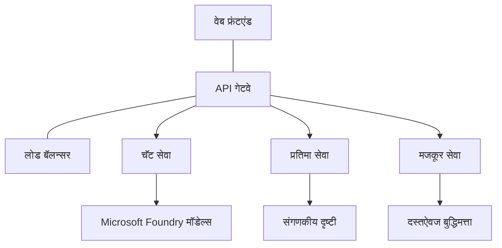

# Production AI Workload Best Practices with AZD

**Chapter Navigation:**
- **📚 Course Home**: [AZD For Beginners](../../README.md)
- **📖 Current Chapter**: Chapter 8 - Production & Enterprise Patterns
- **⬅️ Previous Chapter**: [Chapter 7: Troubleshooting](../chapter-07-troubleshooting/debugging.md)
- **⬅️ Also Related**: [AI Workshop Lab](ai-workshop-lab.md)
- **🎯 Course Complete**: [AZD For Beginners](../../README.md)

## Overview

हा मार्गदर्शक Azure Developer CLI (AZD) वापरताना production-योग्य AI वर्कलोड तैनात करण्याच्या सर्वसमावेशक सर्वोत्तम पद्धती देतो. Microsoft Foundry Discord समुदायाच्या अभिप्राय आणि वास्तविक ग्राहकांच्या तैनातीवर आधारित, हे मार्गदर्शक production AI प्रणालींमध्ये सर्वात सामान्य आव्हानांना संबोधित करतात.

## Key Challenges Addressed

आमच्या समुदायाच्या मतदानाच्या निकालांनुसार, विकसकांना खालील प्रमुख आव्हानांचा सामना करावा लागतो:

- **45%** बहु-सेवा AI तैनातींसोबत अडचणीत असतात
- **38%** क्रेडेन्शियल आणि सीक्रेट व्यवस्थापनात समस्या आहेत  
- **35%** production-तयारी आणि स्केलिंग कठीण वाटते
- **32%** खर्च-अनुकूलन धोरणांची गरज आहे
- **29%** मॉनिटरिंग आणि ट्रबलशुटिंग सुधारण्याची आवश्यकता आहे

## Architecture Patterns for Production AI

### Pattern 1: Microservices AI Architecture

**When to use**: अनेक क्षमतांसह जटिल AI अनुप्रयोगांसाठी


**AZD Implementation**:

```yaml
# azure.yaml
name: enterprise-ai-platform
services:
  web:
    project: ./web
    host: staticwebapp
  api-gateway:
    project: ./api-gateway
    host: containerapp
  chat-service:
    project: ./services/chat
    host: containerapp
  vision-service:
    project: ./services/vision
    host: containerapp
  text-service:
    project: ./services/text
    host: containerapp
```

### Pattern 2: Event-Driven AI Processing

**When to use**: बॅच प्रोसेसिंग, दस्तऐवज विश्लेषण, असिंक्रोनस वर्कफ्लोस

```bicep
// Event Hub for AI processing pipeline
resource eventHub 'Microsoft.EventHub/namespaces@2023-01-01-preview' = {
  name: eventHubNamespaceName
  location: location
  sku: {
    name: 'Standard'
    tier: 'Standard'
    capacity: 1
  }
}

// Service Bus for reliable message processing
resource serviceBus 'Microsoft.ServiceBus/namespaces@2022-10-01-preview' = {
  name: serviceBusNamespaceName
  location: location
  sku: {
    name: 'Premium'
    tier: 'Premium'
    capacity: 1
  }
}

// Function App for processing
resource functionApp 'Microsoft.Web/sites@2023-01-01' = {
  name: functionAppName
  location: location
  kind: 'functionapp,linux'
  properties: {
    siteConfig: {
      appSettings: [
        {
          name: 'FUNCTIONS_EXTENSION_VERSION'
          value: '~4'
        }
        {
          name: 'AZURE_OPENAI_ENDPOINT'
          value: '@Microsoft.KeyVault(VaultName=${keyVault.name};SecretName=openai-endpoint)'
        }
      ]
    }
  }
}
```

## Thinking About AI Agent Health

जेव्हा पारंपरिक वेब अॅप्लिकेशन बिघडते, तेव्हा लक्षणे ओळखीची असतात: एखादी पृष्ठ लोड होत नाही, एपीआय त्रुटी देते, किंवा तैनात करणे अयशस्वी होते. AI-शक्तीमान अनुप्रयोग हे सर्व मार्गांनी खराब होऊ शकतात—परंतु ते सूक्ष्म पद्धतींनी चुकीचे काम करू शकतात ज्यामुळे स्पष्ट त्रुटी संदेश दिसत नाहीत.

हा विभाग तुम्हाला AI वर्कलोडसाठी मॉनिटरिंग करण्याचा मानसिक मॉडेल तयार करण्यात मदत करतो जेणेकरून काही चुकीचे दिसल्यास तुम्हाला कुठे पाहायचे हे कळेल.

### How Agent Health Differs from Traditional App Health

एक पारंपरिक अॅप कार्य करते किंवा नाही. एखादा AI एजंट कार्यरत दिसू शकतो परंतु चांगले निकाल देत नाही. एजंटची आरोग्यस्थिती दोन स्तरांमध्ये विचार करा:

| Layer | What to Watch | Where to Look |
|-------|--------------|---------------|
| **Infrastructure health** | सेवा चालू आहे का? संसाधने provision झाली आहेत का? एन्डपॉइंट पोहोचनीय आहेत का? | `azd monitor`, Azure Portal resource health, container/app logs |
| **Behavior health** | एजंट अचूकपणे प्रतिसाद देतो का? प्रतिसाद वेळेवर येतात का? मॉडेल योग्यरित्या कॉल केले जात आहे का? | Application Insights traces, model call latency metrics, response quality logs |

Infrastructure health ओळखीची आहे—हे कोणत्याही azd अॅपसाठी एकसारखे आहे. Behavior health हा AI वर्कलोड्सद्वारे परिचित झालेला नवीन स्तर आहे.

### Where to Look When AI Apps Don't Behave as Expected

जर तुमचे AI अनुप्रयोग अपेक्षित निकाल देत नसतील, तर इथे एक संकल्पनात्मक तपासणी यादी आहे:

1. **तत्त्वांपासून सुरुवात करा.** अॅप चालू आहे का? ते आपल्या अवलंबित्वांपर्यंत पोहोचू शकते का? `azd monitor` आणि resource health तपासा जसे तुम्ही कोणत्याही अॅपसाठी कराल.
2. **मॉडेल कनेक्शन तपासा.** तुमचे अॅप मॉडेलला यशस्वीरित्या कॉल करत आहे का? अयशस्वी किंवा टाइमआउट झालेले मॉडेल कॉल्स हे AI अॅपच्या समस्यांचे सर्वात सामान्य कारण असतात आणि तुमच्या application logs मध्ये दिसून येतील.
3. **मॉडेलने काय प्राप्त केले ते पहा.** AI प्रतिसाद इनपुटवर (प्रॉम्प्ट आणि कोणत्याही प्राप्त संदर्भावर) अवलंबून असतात. जर आउटपुट चुकीचा असेल, तर इनपुट सहसा चुकीचा असतो. तपासा की तुमचे अॅप मॉडेलला योग्य डेटा पाठवत आहे का.
4. **प्रतिक्रिया विलंब तपासा.** AI मॉडेल कॉल्स हे सामान्य API कॉल्सपेक्षा जास्त मंद असतात. जर तुमचे अॅप सुस्त वाटत असेल, तर तपासा की मॉडेल प्रतिसाद वेळ वाढले आहेत का—हे थ्रॉटलिंग, क्षमतेच्या मर्यादा, किंवा प्रदेश-स्तरीय कंजेशन सूचित करू शकते.
5. **खर्च संकेतांसाठी पहा.** टोकन वापर किंवा API कॉल्समध्ये अनपेक्षित वाढ लूप, चुकिचे कॉन्फिगर केलेले प्रॉम्प्ट, किंवा अत्यधिक रीट्राय सूचित करू शकते.

तुम्हाला लगेचच ऑब्झर्वेबिलिटी साधने mastery करण्याची गरज नाही. मुख्य धडा असा आहे की AI अनुप्रयोगांना निरीक्षण करण्यासाठी एक अतिरिक्त व्यवहारिक स्तर असतो, आणि azd चे बिल्ट-इन मॉनिटरिंग (`azd monitor`) तुम्हाला दोन्ही स्तरांची तपासणी करण्यासाठी एक प्रारंभबिंदू देते.

---

## Security Best Practices

### 1. Zero-Trust Security Model

**Implementation Strategy**:
- प्रमाणीकरणाशिवाय कोणतीही सेवा-ते-सेवा संवाद नको
- सर्व API कॉल्स managed identities वापरतात
- प्रायव्हेट एन्डपॉइंटसह नेटवर्क आयसोलेशन
- Least privilege प्रवेश नियंत्रणे

```bicep
// Managed Identity for each service
resource chatServiceIdentity 'Microsoft.ManagedIdentity/userAssignedIdentities@2023-01-31' = {
  name: 'chat-service-identity'
  location: location
}

// Role assignments with minimal permissions
resource openAIUserRole 'Microsoft.Authorization/roleAssignments@2022-04-01' = {
  scope: openAIAccount
  name: guid(openAIAccount.id, chatServiceIdentity.id, openAIUserRoleDefinitionId)
  properties: {
    roleDefinitionId: subscriptionResourceId('Microsoft.Authorization/roleDefinitions', '5e0bd9bd-7b93-4f28-af87-19fc36ad61bd')
    principalId: chatServiceIdentity.properties.principalId
    principalType: 'ServicePrincipal'
  }
}
```

### 2. Secure Secret Management

**Key Vault Integration Pattern**:

```bicep
// Key Vault with proper access policies
resource keyVault 'Microsoft.KeyVault/vaults@2023-02-01' = {
  name: keyVaultName
  location: location
  properties: {
    tenantId: tenant().tenantId
    sku: {
      family: 'A'
      name: 'premium'  // Use premium for production
    }
    enableRbacAuthorization: true  // Use RBAC instead of access policies
    enablePurgeProtection: true    // Prevent accidental deletion
    enableSoftDelete: true
    softDeleteRetentionInDays: 90
  }
}

// Store all AI service credentials
resource openAIKeySecret 'Microsoft.KeyVault/vaults/secrets@2023-02-01' = {
  parent: keyVault
  name: 'openai-api-key'
  properties: {
    value: openAIAccount.listKeys().key1
    attributes: {
      enabled: true
    }
  }
}
```

### 3. Network Security

**Private Endpoint Configuration**:

```bicep
// Virtual Network for AI services
resource virtualNetwork 'Microsoft.Network/virtualNetworks@2023-04-01' = {
  name: vnetName
  location: location
  properties: {
    addressSpace: {
      addressPrefixes: ['10.0.0.0/16']
    }
    subnets: [
      {
        name: 'ai-services-subnet'
        properties: {
          addressPrefix: '10.0.1.0/24'
          privateEndpointNetworkPolicies: 'Disabled'
        }
      }
      {
        name: 'app-services-subnet'
        properties: {
          addressPrefix: '10.0.2.0/24'
          delegations: [
            {
              name: 'Microsoft.Web/serverFarms'
              properties: {
                serviceName: 'Microsoft.Web/serverFarms'
              }
            }
          ]
        }
      }
    ]
  }
}

// Private endpoints for all AI services
resource openAIPrivateEndpoint 'Microsoft.Network/privateEndpoints@2023-04-01' = {
  name: '${openAIAccountName}-pe'
  location: location
  properties: {
    subnet: {
      id: virtualNetwork.properties.subnets[0].id
    }
    privateLinkServiceConnections: [
      {
        name: 'openai-connection'
        properties: {
          privateLinkServiceId: openAIAccount.id
          groupIds: ['account']
        }
      }
    ]
  }
}
```

## Performance and Scaling

### 1. Auto-Scaling Strategies

**Container Apps Auto-scaling**:

```bicep
resource containerApp 'Microsoft.App/containerApps@2023-05-01' = {
  name: containerAppName
  location: location
  properties: {
    configuration: {
      ingress: {
        external: true
        targetPort: 8000
        transport: 'http'
      }
    }
    template: {
      scale: {
        minReplicas: 2  // Always have 2 instances minimum
        maxReplicas: 50 // Scale up to 50 for high load
        rules: [
          {
            name: 'http-scaling'
            http: {
              metadata: {
                concurrentRequests: '20'  // Scale when >20 concurrent requests
              }
            }
          }
          {
            name: 'cpu-scaling'
            custom: {
              type: 'cpu'
              metadata: {
                type: 'Utilization'
                value: '70'  // Scale when CPU >70%
              }
            }
          }
        ]
      }
    }
  }
}
```

### 2. Caching Strategies

**Redis Cache for AI Responses**:

```bicep
// Redis Premium for production workloads
resource redisCache 'Microsoft.Cache/redis@2023-04-01' = {
  name: redisCacheName
  location: location
  properties: {
    sku: {
      name: 'Premium'
      family: 'P'
      capacity: 1
    }
    enableNonSslPort: false
    minimumTlsVersion: '1.2'
    redisConfiguration: {
      'maxmemory-policy': 'allkeys-lru'
    }
    // Enable clustering for high availability
    redisVersion: '6.0'
    shardCount: 2
  }
}

// Cache configuration in application
var cacheConnectionString = '${redisCache.properties.hostName}:6380,password=${redisCache.listKeys().primaryKey},ssl=True,abortConnect=False'
```

### 3. Load Balancing and Traffic Management

**Application Gateway with WAF**:

```bicep
// Application Gateway with Web Application Firewall
resource applicationGateway 'Microsoft.Network/applicationGateways@2023-04-01' = {
  name: appGatewayName
  location: location
  properties: {
    sku: {
      name: 'WAF_v2'
      tier: 'WAF_v2'
      capacity: 2
    }
    webApplicationFirewallConfiguration: {
      enabled: true
      firewallMode: 'Prevention'
      ruleSetType: 'OWASP'
      ruleSetVersion: '3.2'
    }
    // Backend pools for AI services
    backendAddressPools: [
      {
        name: 'ai-services-pool'
        properties: {
          backendAddresses: [
            {
              fqdn: '${containerApp.properties.configuration.ingress.fqdn}'
            }
          ]
        }
      }
    ]
  }
}
```

## 💰 Cost Optimization

### 1. Resource Right-Sizing

**Environment-Specific Configurations**:

```bash
# विकास वातावरण
azd env new development
azd env set AZURE_OPENAI_SKU "S0"
azd env set AZURE_OPENAI_CAPACITY 10
azd env set AZURE_SEARCH_SKU "basic"
azd env set CONTAINER_CPU 0.5
azd env set CONTAINER_MEMORY 1.0

# उत्पादन वातावरण
azd env new production
azd env set AZURE_OPENAI_SKU "S0"
azd env set AZURE_OPENAI_CAPACITY 100
azd env set AZURE_SEARCH_SKU "standard"
azd env set CONTAINER_CPU 2.0
azd env set CONTAINER_MEMORY 4.0
```

### 2. Cost Monitoring and Budgets

```bicep
// Cost management and budgets
resource budget 'Microsoft.Consumption/budgets@2023-05-01' = {
  name: 'ai-workload-budget'
  properties: {
    timePeriod: {
      startDate: '2024-01-01'
      endDate: '2024-12-31'
    }
    timeGrain: 'Monthly'
    amount: 2000  // $2000 monthly budget
    category: 'Cost'
    notifications: {
      warning: {
        enabled: true
        operator: 'GreaterThan'
        threshold: 80
        contactEmails: [
          'finance@company.com'
          'engineering@company.com'
        ]
        contactRoles: [
          'Owner'
          'Contributor'
        ]
      }
      critical: {
        enabled: true
        operator: 'GreaterThan'
        threshold: 95
        contactEmails: [
          'cto@company.com'
        ]
      }
    }
  }
}
```

### 3. Token Usage Optimization

**OpenAI Cost Management**:

```typescript
// अॅप्लिकेशन-स्तरीय टोकन अनुकूलन
class TokenOptimizer {
  private readonly maxTokens = 4000;
  private readonly reserveTokens = 500;
  
  optimizePrompt(userInput: string, context: string): string {
    const availableTokens = this.maxTokens - this.reserveTokens;
    const estimatedTokens = this.estimateTokens(userInput + context);
    
    if (estimatedTokens > availableTokens) {
      // संदर्भ छाटा, वापरकर्त्याचे इनपुट नाही
      context = this.truncateContext(context, availableTokens - this.estimateTokens(userInput));
    }
    
    return `${context}\n\nUser: ${userInput}`;
  }
  
  private estimateTokens(text: string): number {
    // अंदाजे: 1 टोकन ≈ 4 अक्षरे
    return Math.ceil(text.length / 4);
  }
}
```

## Monitoring and Observability

### 1. Comprehensive Application Insights

```bicep
// Application Insights with advanced features
resource applicationInsights 'Microsoft.Insights/components@2020-02-02' = {
  name: applicationInsightsName
  location: location
  kind: 'web'
  properties: {
    Application_Type: 'web'
    WorkspaceResourceId: logAnalyticsWorkspace.id
    SamplingPercentage: 100  // Full sampling for AI apps
    DisableIpMasking: false  // Enable for security
  }
}

// Custom metrics for AI operations
resource aiMetricAlerts 'Microsoft.Insights/metricAlerts@2018-03-01' = {
  name: 'ai-high-error-rate'
  location: 'global'
  properties: {
    description: 'Alert when AI service error rate is high'
    severity: 2
    enabled: true
    scopes: [
      applicationInsights.id
    ]
    evaluationFrequency: 'PT1M'
    windowSize: 'PT5M'
    criteria: {
      'odata.type': 'Microsoft.Azure.Monitor.SingleResourceMultipleMetricCriteria'
      allOf: [
        {
          name: 'high-error-rate'
          metricName: 'requests/failed'
          operator: 'GreaterThan'
          threshold: 10
          timeAggregation: 'Count'
        }
      ]
    }
  }
}
```

### 2. AI-Specific Monitoring

**Custom Dashboards for AI Metrics**:

```json
// Dashboard configuration for AI workloads
{
  "dashboard": {
    "name": "AI Application Monitoring",
    "tiles": [
      {
        "name": "OpenAI Request Volume",
        "query": "requests | where name contains 'openai' | summarize count() by bin(timestamp, 5m)"
      },
      {
        "name": "AI Response Latency",
        "query": "requests | where name contains 'openai' | summarize avg(duration) by bin(timestamp, 5m)"
      },
      {
        "name": "Token Usage",
        "query": "customMetrics | where name == 'openai_tokens_used' | summarize sum(value) by bin(timestamp, 1h)"
      },
      {
        "name": "Cost per Hour",
        "query": "customMetrics | where name == 'openai_cost' | summarize sum(value) by bin(timestamp, 1h)"
      }
    ]
  }
}
```

### 3. Health Checks and Uptime Monitoring

```bicep
// Application Insights availability tests
resource availabilityTest 'Microsoft.Insights/webtests@2022-06-15' = {
  name: 'ai-app-availability-test'
  location: location
  tags: {
    'hidden-link:${applicationInsights.id}': 'Resource'
  }
  properties: {
    SyntheticMonitorId: 'ai-app-availability-test'
    Name: 'AI Application Availability Test'
    Description: 'Tests AI application endpoints'
    Enabled: true
    Frequency: 300  // 5 minutes
    Timeout: 120    // 2 minutes
    Kind: 'ping'
    Locations: [
      {
        Id: 'us-east-2-azr'
      }
      {
        Id: 'us-west-2-azr'
      }
    ]
    Configuration: {
      WebTest: '''
        <WebTest Name="AI Health Check" 
                 Id="8d2de8d2-a2b0-4c2e-9a0d-8f9c9a0b8c8d" 
                 Enabled="True" 
                 CssProjectStructure="" 
                 CssIteration="" 
                 Timeout="120" 
                 WorkItemIds="" 
                 xmlns="http://microsoft.com/schemas/VisualStudio/TeamTest/2010" 
                 Description="" 
                 CredentialUserName="" 
                 CredentialPassword="" 
                 PreAuthenticate="True" 
                 Proxy="default" 
                 StopOnError="False" 
                 RecordedResultFile="" 
                 ResultsLocale="">
          <Items>
            <Request Method="GET" 
                     Guid="a5f10126-e4cd-570d-961c-cea43999a200" 
                     Version="1.1" 
                     Url="${webApp.properties.defaultHostName}/health" 
                     ThinkTime="0" 
                     Timeout="120" 
                     ParseDependentRequests="True" 
                     FollowRedirects="True" 
                     RecordResult="True" 
                     Cache="False" 
                     ResponseTimeGoal="0" 
                     Encoding="utf-8" 
                     ExpectedHttpStatusCode="200" 
                     ExpectedResponseUrl="" 
                     ReportingName="" 
                     IgnoreHttpStatusCode="False" />
          </Items>
        </WebTest>
      '''
    }
  }
}
```

## Disaster Recovery and High Availability

### 1. Multi-Region Deployment

```yaml
# azure.yaml - Multi-region configuration
name: ai-app-multiregion
services:
  api-primary:
    project: ./api
    host: containerapp
    env:
      - AZURE_REGION=eastus
  api-secondary:
    project: ./api
    host: containerapp
    env:
      - AZURE_REGION=westus2
```

```bicep
// Traffic Manager for global load balancing
resource trafficManager 'Microsoft.Network/trafficManagerProfiles@2022-04-01' = {
  name: trafficManagerProfileName
  location: 'global'
  properties: {
    profileStatus: 'Enabled'
    trafficRoutingMethod: 'Priority'
    dnsConfig: {
      relativeName: trafficManagerProfileName
      ttl: 30
    }
    monitorConfig: {
      protocol: 'HTTPS'
      port: 443
      path: '/health'
      intervalInSeconds: 30
      toleratedNumberOfFailures: 3
      timeoutInSeconds: 10
    }
    endpoints: [
      {
        name: 'primary-endpoint'
        type: 'Microsoft.Network/trafficManagerProfiles/azureEndpoints'
        properties: {
          targetResourceId: primaryAppService.id
          endpointStatus: 'Enabled'
          priority: 1
        }
      }
      {
        name: 'secondary-endpoint'
        type: 'Microsoft.Network/trafficManagerProfiles/azureEndpoints'
        properties: {
          targetResourceId: secondaryAppService.id
          endpointStatus: 'Enabled'
          priority: 2
        }
      }
    ]
  }
}
```

### 2. Data Backup and Recovery

```bicep
// Backup configuration for critical data
resource backupVault 'Microsoft.DataProtection/backupVaults@2023-05-01' = {
  name: backupVaultName
  location: location
  identity: {
    type: 'SystemAssigned'
  }
  properties: {
    storageSettings: [
      {
        datastoreType: 'VaultStore'
        type: 'LocallyRedundant'
      }
    ]
  }
}

// Backup policy for AI models and data
resource backupPolicy 'Microsoft.DataProtection/backupVaults/backupPolicies@2023-05-01' = {
  parent: backupVault
  name: 'ai-data-backup-policy'
  properties: {
    policyRules: [
      {
        backupParameters: {
          backupType: 'Full'
          objectType: 'AzureBackupParams'
        }
        trigger: {
          schedule: {
            repeatingTimeIntervals: [
              'R/2024-01-01T02:00:00+00:00/P1D'  // Daily at 2 AM
            ]
          }
          objectType: 'ScheduleBasedTriggerContext'
        }
        dataStore: {
          datastoreType: 'VaultStore'
          objectType: 'DataStoreInfoBase'
        }
        name: 'BackupDaily'
        objectType: 'AzureBackupRule'
      }
    ]
  }
}
```

## DevOps and CI/CD Integration

### 1. GitHub Actions Workflow

```yaml
# .github/workflows/deploy-ai-app.yml
name: Deploy AI Application

on:
  push:
    branches: [main]
  pull_request:
    branches: [main]

jobs:
  test:
    runs-on: ubuntu-latest
    steps:
      - uses: actions/checkout@v4
      
      - name: Setup Python
        uses: actions/setup-python@v4
        with:
          python-version: '3.11'
          
      - name: Install dependencies
        run: |
          pip install -r requirements.txt
          pip install pytest
          
      - name: Run tests
        run: pytest tests/
        
      - name: AI Safety Tests
        run: |
          python scripts/test_ai_safety.py
          python scripts/validate_prompts.py

  deploy-staging:
    needs: test
    if: github.event_name == 'pull_request'
    runs-on: ubuntu-latest
    steps:
      - uses: actions/checkout@v4
      
      - name: Setup AZD
        uses: Azure/setup-azd@v2
        
      - name: Login to Azure
        uses: azure/login@v1
        with:
          creds: ${{ secrets.AZURE_CREDENTIALS }}
          
      - name: Deploy to Staging
        run: |
          azd env select staging
          azd deploy

  deploy-production:
    needs: test
    if: github.ref == 'refs/heads/main'
    runs-on: ubuntu-latest
    steps:
      - uses: actions/checkout@v4
      
      - name: Setup AZD
        uses: Azure/setup-azd@v2
        
      - name: Login to Azure
        uses: azure/login@v1
        with:
          creds: ${{ secrets.AZURE_CREDENTIALS }}
          
      - name: Deploy to Production
        run: |
          azd env select production
          azd deploy
          
      - name: Run Production Health Checks
        run: |
          python scripts/health_check.py --env production
```

### 2. Infrastructure Validation

```bash
# scripts/validate_infrastructure.sh
#!/bin/bash

echo "Validating AI infrastructure deployment..."

# सर्व आवश्यक सेवा चालू आहेत का ते तपासा
services=("openai" "search" "storage" "keyvault")
for service in "${services[@]}"; do
    echo "Checking $service..."
    if ! az resource list --resource-type "Microsoft.CognitiveServices/accounts" --query "[?contains(name, '$service')]" -o tsv; then
        echo "ERROR: $service not found"
        exit 1
    fi
done

# OpenAI मॉडेल डिप्लॉयमेंटची पडताळणी करा
echo "Validating OpenAI model deployments..."
models=$(az cognitiveservices account deployment list --name $AZURE_OPENAI_NAME --resource-group $AZURE_RESOURCE_GROUP --query "[].name" -o tsv)
if [[ ! $models == *"gpt-4.1-mini"* ]]; then
  echo "ERROR: Required model gpt-4.1-mini not deployed"
    exit 1
fi

# AI सेवांची कनेक्टिव्हिटीची चाचणी करा
echo "Testing AI service connectivity..."
python scripts/test_connectivity.py

echo "Infrastructure validation completed successfully!"
```

## Production Readiness Checklist

### Security ✅
- [ ] सर्व सेवा managed identities वापरतात
- [ ] सिक्रेट्स Key Vault मध्ये संग्रहित केलेले आहेत
- [ ] प्रायव्हेट एन्डपॉइंट कॉन्फिगर केलेले आहेत
- [ ] Network security groups लागू केलेले आहेत
- [ ] RBAC least privilege सह
- [ ] सार्वजनिक एन्डपॉइंटवर WAF सक्षम

### Performance ✅
- [ ] Auto-scaling कॉन्फिगर केलेले आहे
- [ ] Caching अंमलात आणलेले आहे
- [ ] Load balancing सेटअप केलेले आहे
- [ ] स्टॅटिक कंटेंटसाठी CDN
- [ ] डेटाबेस कनेक्शन पूलिंग
- [ ] टोकन वापर अनुकूलित

### Monitoring ✅
- [ ] Application Insights कॉन्फिगर केलेले आहे
- [ ] कस्टम मेट्रिक्स परिभाषित
- [ ] अलर्टिंग नियम सेटअप
- [ ] डॅशबोर्ड तयार केलेले आहे
- [ ] हेल्थ चेक्स अमलात आणलेले आहेत
- [ ] लॉग रिटेन्शन पॉलिसी

### Reliability ✅
- [ ] मल्टी-रीजन तैनाती
- [ ] बॅकअप आणि रिकव्हरी योजना
- [ ] सर्किट ब्रेकर्स लागू केलेले आहेत
- [ ] रीट्राय पॉलिसीज कॉन्फिगर केलेले आहेत
- [ ] अनुकूली डाउनग्रेड (Graceful degradation)
- [ ] हेल्थ चेक एन्डपॉइंट्स

### Cost Management ✅
- [ ] बजेट अलर्ट कॉन्फिगर केलेले आहेत
- [ ] रिसोर्स राइट-सायझिंग
- [ ] Dev/test सवलती लागू
- [ ] Reserved instances खरेदी केलेले
- [ ] खर्च मॉनिटरिंग डॅशबोर्ड
- [ ] नियमित खर्च आढावे

### Compliance ✅
- [ ] डेटा निवासीपणाच्या आवश्यकता पूर्ण
- [ ] ऑडिट लॉगिंग सक्षम
- [ ] अनुपालन धोरणे लागू
- [ ] सुरक्षा बेसलाइन अंमलात आणलेले
- [ ] नियमित सुरक्षा मूल्यमापन
- [ ] इन्सिडेंट रिस्पॉन्स योजना

## Performance Benchmarks

### Typical Production Metrics

| Metric | Target | Monitoring |
|--------|--------|------------|
| **Response Time** | < 2 seconds | Application Insights |
| **Availability** | 99.9% | Uptime monitoring |
| **Error Rate** | < 0.1% | Application logs |
| **Token Usage** | < $500/month | Cost management |
| **Concurrent Users** | 1000+ | Load testing |
| **Recovery Time** | < 1 hour | Disaster recovery tests |

### Load Testing

```bash
# एआय अनुप्रयोगांसाठी लोड चाचणी स्क्रिप्ट
python scripts/load_test.py \
  --endpoint https://your-ai-app.azurewebsites.net \
  --concurrent-users 100 \
  --duration 300 \
  --ramp-up 60
```

## 🤝 Community Best Practices

Microsoft Foundry Discord समुदायाच्या अभिप्रायावर आधारित:

### Top Recommendations from the Community:

1. **लहानपासून सुरू करा, हळूहळू स्केल करा**: मूलभूत SKUs ने सुरू करा आणि प्रत्यक्ष वापरावर आधारित स्केल करा
2. **सर्वकाही मॉनिटर करा**: पहिल्या दिवसापासून सर्वसमावेशक मॉनिटरिंग सेट करा
3. **सुरक्षा ऑटोमेट करा**: सातत्यपूर्ण सुरक्षेसाठी infrastructure as code वापरा
4. **पूर्णपणे टेस्ट करा**: तुमच्या पाइपलाइनमध्ये AI-विशिष्ट चाचण्या समाविष्ट करा
5. **खर्चांसाठी योजना करा**: टोकन वापर मॉनिटर करा आणि लवकरच बजेट अलर्ट सेट करा

### Common Pitfalls to Avoid:

- ❌ कोडमध्ये API की हार्डकोड करणे
- ❌ योग्य मॉनिटरिंग सेट न करणे
- ❌ खर्च-अनुकूलन दुर्लक्षित करणे
- ❌ फेल्युअर परिस्थितींची चाचणी न करणे
- ❌ हेल्थ चेकशिवाय तैनात करणे

## AZD AI CLI Commands and Extensions

AZD मध्ये AI-विशिष्ट कमांड्स आणि एक्सटेन्शन्सची वाढती संच आहे जी production AI कार्यप्रवाह सुलभ करतात. हे साधने स्थानिक विकास आणि production तैनाती यांच्यातील अंतर कमी करतात.

### AZD Extensions for AI

AZD AI-विशिष्ट क्षमता जोडण्यासाठी एक एक्सटेन्शन सिस्टम वापरते. एक्सटेन्शन्स इंस्टॉल आणि व्यवस्थापित करण्यासाठी:

```bash
# सर्व उपलब्ध विस्तार सूचीबद्ध करा (AI समाविष्ट)
azd extension list

# स्थापित विस्तारांचे तपशील तपासा
azd extension show azure.ai.agents

# Foundry Agents विस्तार स्थापित करा
azd extension install azure.ai.agents

# फाईन-ट्युनिंग विस्तार स्थापित करा
azd extension install azure.ai.finetune

# सानुकूल मॉडेल्स विस्तार स्थापित करा
azd extension install azure.ai.models

# सर्व स्थापित विस्तार अद्यतनित करा
azd extension upgrade --all
```

**Available AI extensions:**

| Extension | Purpose | Status |
|-----------|---------|--------|
| `azure.ai.agents` | Foundry Agent Service management | Preview |
| `azure.ai.finetune` | Foundry model fine-tuning | Preview |
| `azure.ai.models` | Foundry custom models | Preview |
| `azure.coding-agent` | Coding agent configuration | Available |

### Initializing Agent Projects with `azd ai agent init`

`azd ai agent init` कमांड Microsoft Foundry Agent Service सह समाकलित production-तयार AI एजंट प्रोजेक्ट स्कॅफोल्ड करते:

```bash
# एजंट मॅनिफेस्टमधून नवीन एजंट प्रकल्प प्रारंभ करा
azd ai agent init -m <manifest-path-or-uri>

# प्रारंभ करा व विशिष्ट Foundry प्रकल्प लक्ष्य म्हणून निवडा
azd ai agent init -m agent-manifest.yaml --project-id <foundry-project-id>

# सानुकूल स्रोत निर्देशिकेसह प्रारंभ करा
azd ai agent init -m agent-manifest.yaml --src ./agents/my-agent

# Container Apps ला होस्ट म्हणून लक्ष्य करा
azd ai agent init -m agent-manifest.yaml --host containerapp
```

**Key flags:**

| Flag | Description |
|------|-------------|
| `-m, --manifest` | प्रोजेक्टमध्ये जोडण्यासाठी एजंट मॅनिफेस्टचा पथ किंवा URI |
| `-p, --project-id` | तुमच्या azd एन्व्हायर्नमेंटसाठी विद्यमान Microsoft Foundry Project ID |
| `-s, --src` | एजंट परिभाषा डाउनलोड करायची निर्देशिका (मूलभूतपणे `src/<agent-id>` ला डिफॉल्ट) |
| `--host` | डिफॉल्ट होस्ट ओव्हरराईड करा (उदा., `containerapp`) |
| `-e, --environment` | वापरायचे azd एन्व्हायर्नमेंट |

**Production tip**: सुरूवातीपासूनच तुमचा एजंट कोड आणि क्लाउड रिसोर्सेस लिंक ठेवण्यासाठी विद्यमान Foundry प्रोजेक्टशी थेट कनेक्ट करण्यासाठी `--project-id` वापरा.

### Model Context Protocol (MCP) with `azd mcp`

AZD मध्ये बिल्ट-इन MCP सर्व्हर समर्थन (Alpha) समाविष्ट आहे, जे AI एजंट आणि साधनांना तुमच्या Azure रिसोर्सेसशी प्रमाणीकृत प्रोटोकॉलद्वारे संवाद साधण्यास सक्षम करते:

```bash
# आपल्या प्रकल्पासाठी MCP सर्व्हर सुरू करा
azd mcp start

# साधनांच्या अंमलबजावणीसाठी सध्याच्या Copilot संमती नियमांचे पुनरावलोकन करा
azd copilot consent list
```

MCP सर्व्हर तुमच्या azd प्रोजेक्ट संदर्भ—एन्व्हायर्नमेंट्स, सेवा, आणि Azure रिसोर्सेस—AI-शक्तीमान विकास साधनांना एक्स्पोज करतो. यामुळे सक्षम होते:

- **AI-लादलेले तैनाती सहाय्य**: कोडिंग एजंटना तुमच्या प्रोजेक्ट स्टेटची चौकशी करण्यास आणि तैनाती सुरू करण्यास परवानगी द्या
- **रिसोर्स शोध**: AI साधने शोधू शकतात की तुमचा प्रोजेक्ट कोणती Azure रिसोर्सेस वापरतो
- **एन्व्हायर्नमेंट व्यवस्थापन**: एजंट डेव्ह/स्टेजिंग/प्रॉडक्शन एन्व्हायर्नमेंट्स बदला शकतात

### Infrastructure Generation with `azd infra generate`

production AI वर्कलोडसाठी, तुम्ही स्वतः Infrastructure as Code जनरेट आणि सानुकूलित करू शकता, स्वयंचलित provisioning वर अवलंबून न राहता:

```bash
# आपल्या प्रकल्पाच्या परिभाषेमधून Bicep/Terraform फायली तयार करा
azd infra generate
```

हे IaC डिस्कवर लिहिते जेणेकरून तुम्ही करू शकता:
- तैनातीपूर्वी इन्फ्रास्ट्रक्चर पुनरावलोकन आणि ऑडिट करा
- सानुकूल सुरक्षा धोरणे जोडा (नेटवर्क नियम, प्रायव्हेट एन्डपॉइंट्स)
- विद्यमान IaC पुनरावलोकन प्रक्रियांशी एकत्र करा
- अॅप्लिकेशन कोडपासून स्वतंत्रपणे इन्फ्रास्ट्रक्चर बदलांची व्हर्शन कंट्रोल करा

### Production Lifecycle Hooks

AZD hooks तुम्हाला तैनाती जीवनचक्राच्या प्रत्येक टप्प्यात कस्टम लॉजिक इंजेक्ट करण्यास अनुमती देतात—production AI कार्यप्रवाहांसाठी महत्त्वाचे:

```yaml
# azure.yaml - Production hooks example
name: ai-production-app
hooks:
  preprovision:
    shell: sh
    run: scripts/validate-quotas.sh    # Check AI model quota before provisioning
  postprovision:
    shell: sh
    run: scripts/configure-networking.sh  # Set up private endpoints
  predeploy:
    shell: sh
    run: scripts/run-ai-safety-tests.sh  # Run prompt safety checks
  postdeploy:
    shell: sh
    run: scripts/smoke-test.sh           # Verify agent responses post-deploy
services:
  agent-api:
    project: ./src/agent
    host: containerapp
    hooks:
      predeploy:
        shell: sh
        run: scripts/validate-model-access.sh  # Per-service hook
```

```bash
# विकासादरम्यान एखादा विशिष्ट हुक हाताने चालवा
azd hooks run predeploy
```

**Recommended production hooks for AI workloads:**

| Hook | Use Case |
|------|----------|
| `preprovision` | AI मॉडेल क्षमतेसाठी सदस्यत्व कोटा पडताळा |
| `postprovision` | प्रायव्हेट एन्डपॉइंट कॉन्फिगर करा, मॉडेल वेट्स तैनात करा |
| `predeploy` | AI सुरक्षा चाचण्या चालवा, प्रॉम्प्ट टेम्पलेट्स वैध करा |
| `postdeploy` | एजंट प्रतिसादांसाठी स्मोक टेस्ट करा, मॉडेल कनेक्टिव्हिटी सत्यापित करा |

### CI/CD Pipeline Configuration

सुरक्षित Azure प्रमाणीकरणासह तुमच्या प्रोजेक्टला GitHub Actions किंवा Azure Pipelines शी कनेक्ट करण्यासाठी `azd pipeline config` वापरा:

```bash
# CI/CD पाइपलाइन कॉन्फिगर करा (परस्परसंवादी)
azd pipeline config

# विशिष्ट पुरवठादारासह कॉन्फिगर करा
azd pipeline config --provider github
```

ही कमांड:
- Least-privilege प्रवेश असलेले एक service principal तयार करते
- फेडरेटेड क्रेडेन्शियल्स कॉन्फिगर करते (कोणतेही संग्रहित सिक्रेट्स नाहीत)
- तुमचे पाइपलाइन डेफिनिशन फाइल तयार किंवा अद्ययावत करते
- तुमच्या CI/CD सिस्टममध्ये आवश्यक एन्व्हायर्नमेंट व्हेरिएबल्स सेट करते

**Production workflow with pipeline config:**

```bash
# 1. उत्पादन पर्यावरण तैयार करा
azd env new production
azd env set AZURE_OPENAI_CAPACITY 100

# 2. पाइपलाइन कॉन्फिगर करा
azd pipeline config --provider github

# 3. प्रत्येक main शाखेवर पुश झाल्यावर पाइपलाइन azd deploy चालवते
```

### Adding Components with `azd add`

विद्यमान प्रोजेक्टमध्ये हळूहळू Azure सेवा जोडा:

```bash
# नवीन सेवा घटक संवादात्मकपणे जोडा
azd add
```

हे विशेषतः production AI अनुप्रयोग वाढवण्यासाठी उपयुक्त आहे—उदाहरणार्थ, व्हेक्टर सर्च सेवा, नवीन एजंट एन्डपॉइंट, किंवा मॉनिटरिंग घटक विद्यमान तैनातीमध्ये जोडणे.

## Additional Resources
- **Azure Well-Architected Framework**: [AI workload guidance](https://learn.microsoft.com/azure/well-architected/ai/)
- **Microsoft Foundry Documentation**: [Official docs](https://learn.microsoft.com/azure/ai-studio/)
- **Community Templates**: [Azure Samples](https://github.com/Azure-Samples)
- **Discord Community**: [#Azure channel](https://discord.gg/microsoft-azure)
- **Agent Skills for Azure**: [microsoft/github-copilot-for-azure वर skills.sh](https://skills.sh/microsoft/github-copilot-for-azure) - 37 उपलब्ध एजंट कौशल्ये Azure AI, Foundry, तैनाती, खर्च अनुकूलन, आणि डायग्नोस्टिक्ससाठी. आपल्या संपादकात स्थापित करा:
  ```bash
  npx skills add microsoft/github-copilot-for-azure
  ```

---

**Chapter Navigation:**
- **📚 Course Home**: [AZD For Beginners](../../README.md)
- **📖 Current Chapter**: अध्याय 8 - उत्पादन आणि उद्योजकीय नमुने
- **⬅️ Previous Chapter**: [अध्याय 7: समस्या निवारण](../chapter-07-troubleshooting/debugging.md)
- **⬅️ Also Related**: [AI कार्यशाळा लॅब](ai-workshop-lab.md)
- **� कोर्स पूर्ण**: [AZD For Beginners](../../README.md)

**लक्षात ठेवा**: उत्पादन AI वर्कलोडसाठी काळजीपूर्वक नियोजन, मॉनिटरिंग आणि सातत्यपूर्ण सुधारणा आवश्यक आहे. या नमुन्यांपासून सुरू करा आणि आपल्या विशिष्ट आवश्यकता लक्षात घेऊन त्यांना अनुकूल करा.

---

<!-- CO-OP TRANSLATOR DISCLAIMER START -->
**अस्वीकरण**:
हा दस्तऐवज AI अनुवाद सेवा [Co-op Translator](https://github.com/Azure/co-op-translator) वापरून अनुवादित केला आहे. जरी आम्ही अचूकतेसाठी प्रयत्न करत असलो, तरी कृपया लक्षात घ्या की स्वयंचलित अनुवादांमध्ये चूका किंवा गैरअचूकता असू शकते. मूळ दस्तऐवज त्याच्या मूळ भाषेत अधिकृत स्रोत मानला जावा. महत्त्वाच्या माहितीसाठी व्यावसायिक मानवी अनुवादाची शिफारस केली जाते. या अनुवादाच्या वापरामुळे उद्भवलेल्या कोणत्याही गैरसमजुती किंवा चुकीच्या अर्थलागीसाठी आम्ही जबाबदार नाही.
<!-- CO-OP TRANSLATOR DISCLAIMER END -->