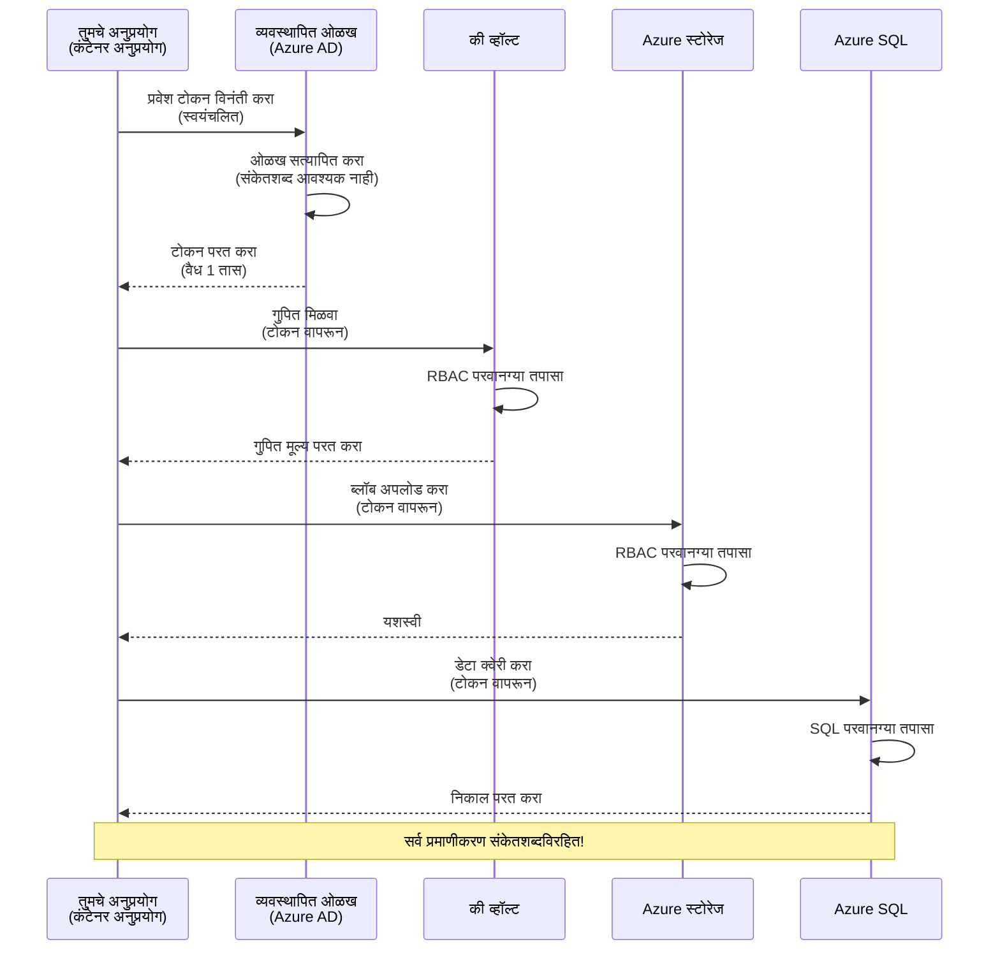
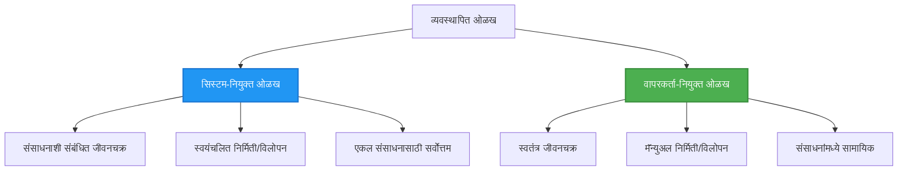

<!--
CO_OP_TRANSLATOR_METADATA:
{
  "original_hash": "e13ff6e1197e0a7462ed0aede7df9f23",
  "translation_date": "2025-11-20T16:17:38+00:00",
  "source_file": "docs/getting-started/authsecurity.md",
  "language_code": "mr"
}
-->
# प्रमाणीकरण पद्धती आणि व्यवस्थापित ओळख

⏱️ **अनुमानित वेळ**: 45-60 मिनिटे | 💰 **खर्च परिणाम**: मोफत (अतिरिक्त शुल्क नाही) | ⭐ **जटिलता**: मध्यम

**📚 शिकण्याचा मार्ग:**
- ← मागील: [कॉन्फिगरेशन व्यवस्थापन](configuration.md) - पर्यावरणीय व्हेरिएबल्स आणि गुपिते व्यवस्थापित करणे
- 🎯 **तुम्ही येथे आहात**: प्रमाणीकरण आणि सुरक्षा (व्यवस्थापित ओळख, की व्हॉल्ट, सुरक्षित पद्धती)
- → पुढे: [पहिला प्रकल्प](first-project.md) - तुमचे पहिले AZD अॅप्लिकेशन तयार करा
- 🏠 [कोर्स होम](../../README.md)

---

## तुम्ही काय शिकाल

हे धडे पूर्ण करून, तुम्ही:
- Azure प्रमाणीकरण पद्धती (की, कनेक्शन स्ट्रिंग्स, व्यवस्थापित ओळख) समजून घ्याल
- **व्यवस्थापित ओळख** पासवर्डशिवाय प्रमाणीकरणासाठी अंमलात आणाल
- **Azure Key Vault** एकत्रीकरणासह गुपिते सुरक्षित कराल
- AZD डिप्लॉयमेंटसाठी **भूमिका-आधारित प्रवेश नियंत्रण (RBAC)** कॉन्फिगर कराल
- कंटेनर अॅप्स आणि Azure सेवांमध्ये सुरक्षा सर्वोत्तम पद्धती लागू कराल
- की-आधारित प्रमाणीकरणातून ओळख-आधारित प्रमाणीकरणाकडे स्थलांतर कराल

## व्यवस्थापित ओळख का महत्त्वाची आहे

### समस्या: पारंपरिक प्रमाणीकरण

**व्यवस्थापित ओळख आधी:**
```javascript
// ❌ सुरक्षा धोका: कोडमध्ये हार्डकोडेड रहस्ये
const connectionString = "Server=mydb.database.windows.net;User=admin;Password=P@ssw0rd123";
const storageKey = "xK7mN9pQ2wR5tY8uI0oP3aS6dF1gH4jK...";
const cosmosKey = "C2x7B9n4M1p8Q5w3E6r0T2y5U8i1O4p7...";
```

**समस्या:**
- 🔴 **कोड, कॉन्फिग फाइल्स, पर्यावरणीय व्हेरिएबल्समध्ये उघड गुपिते**
- 🔴 **क्रेडेन्शियल रोटेशन** साठी कोड बदल आणि पुन्हा डिप्लॉयमेंट आवश्यक
- 🔴 **ऑडिट समस्या** - कोण, कधी, काय प्रवेश केला?
- 🔴 **विस्तार** - गुपिते अनेक प्रणालींमध्ये विखुरलेली
- 🔴 **अनुपालन जोखीम** - सुरक्षा ऑडिटमध्ये अपयशी

### उपाय: व्यवस्थापित ओळख

**व्यवस्थापित ओळख नंतर:**
```javascript
// ✅ सुरक्षित: कोडमध्ये कोणतेही गुपित नाही
const credential = new DefaultAzureCredential();
const client = new BlobServiceClient(
  "https://mystorageaccount.blob.core.windows.net",
  credential  // Azure स्वयंचलितपणे प्रमाणीकरण हाताळते
);
```

**फायदे:**
- ✅ **कोड किंवा कॉन्फिगरेशनमध्ये गुपिते नाहीत**
- ✅ **स्वयंचलित रोटेशन** - Azure हे हाताळते
- ✅ **पूर्ण ऑडिट ट्रेल** Azure AD लॉगमध्ये
- ✅ **केंद्रीकृत सुरक्षा** - Azure पोर्टलमध्ये व्यवस्थापित करा
- ✅ **अनुपालन तयार** - सुरक्षा मानकांचे पालन करते

**उदाहरण**: पारंपरिक प्रमाणीकरण म्हणजे वेगवेगळ्या दरवाजांसाठी अनेक भौतिक किल्ल्या बाळगण्यासारखे आहे. व्यवस्थापित ओळख म्हणजे सुरक्षा बॅजसारखे आहे जे तुम्ही कोण आहात यावर आधारित स्वयंचलितपणे प्रवेश प्रदान करते—गमावण्यास, कॉपी करण्यास किंवा फिरवण्यास किल्ल्या नाहीत.

---

## आर्किटेक्चर विहंगावलोकन

### व्यवस्थापित ओळखासह प्रमाणीकरण प्रवाह


### व्यवस्थापित ओळखांचे प्रकार


| वैशिष्ट्य | प्रणाली-नियुक्त | वापरकर्ता-नियुक्त |
|-----------|----------------|-------------------|
| **आयुष्यचक्र** | संसाधनाशी जोडलेले | स्वतंत्र |
| **निर्मिती** | संसाधनासह स्वयंचलित | मॅन्युअल निर्मिती |
| **हटवणे** | संसाधनासह हटवले | संसाधन हटवल्यानंतर टिकून राहते |
| **शेअरिंग** | फक्त एक संसाधन | अनेक संसाधने |
| **वापर प्रकरण** | सोपी परिस्थिती | जटिल बहु-संसाधन परिस्थिती |
| **AZD डीफॉल्ट** | ✅ शिफारस केलेले | पर्यायी |

---

## पूर्वअट

### आवश्यक साधने

तुमच्याकडे आधीच्या धड्यांमधून हे आधीच स्थापित असले पाहिजे:

```bash
# Azure Developer CLI सत्यापित करा
azd version
# ✅ अपेक्षित: azd आवृत्ती 1.0.0 किंवा उच्च

# Azure CLI सत्यापित करा
az --version
# ✅ अपेक्षित: azure-cli 2.50.0 किंवा उच्च
```

### Azure आवश्यकता

- सक्रिय Azure सदस्यता
- परवानग्या:
  - व्यवस्थापित ओळखी तयार करणे
  - RBAC भूमिका नियुक्त करणे
  - की व्हॉल्ट संसाधने तयार करणे
  - कंटेनर अॅप्स डिप्लॉय करणे

### ज्ञान पूर्वअट

तुम्ही पूर्ण केले पाहिजे:
- [स्थापना मार्गदर्शक](installation.md) - AZD सेटअप
- [AZD मूलभूत गोष्टी](azd-basics.md) - मुख्य संकल्पना
- [कॉन्फिगरेशन व्यवस्थापन](configuration.md) - पर्यावरणीय व्हेरिएबल्स

---

## धडा 1: प्रमाणीकरण पद्धती समजून घेणे

### पद्धत 1: कनेक्शन स्ट्रिंग्स (जुनी - टाळा)

**हे कसे कार्य करते:**
```bash
# कनेक्शन स्ट्रिंगमध्ये क्रेडेन्शियल्स आहेत
STORAGE_CONNECTION_STRING="DefaultEndpointsProtocol=https;AccountName=myaccount;AccountKey=xK7mN9pQ2wR5..."
COSMOS_CONNECTION_STRING="AccountEndpoint=https://myaccount.documents.azure.com:443/;AccountKey=C2x7..."
SQL_CONNECTION_STRING="Server=myserver.database.windows.net;User=admin;Password=P@ssw0rd..."
```

**समस्या:**
- ❌ पर्यावरणीय व्हेरिएबल्समध्ये गुपिते दृश्यमान
- ❌ डिप्लॉयमेंट सिस्टममध्ये लॉग केलेले
- ❌ फिरवणे कठीण
- ❌ प्रवेशाचा ऑडिट ट्रेल नाही

**कधी वापरायचे:** फक्त स्थानिक विकासासाठी, उत्पादनासाठी कधीही नाही.

---

### पद्धत 2: की व्हॉल्ट संदर्भ (चांगले)

**हे कसे कार्य करते:**
```bicep
// Store secret in Key Vault
resource keyVault 'Microsoft.KeyVault/vaults@2023-02-01' = {
  name: 'mykv'
  properties: {
    enableRbacAuthorization: true
  }
}

// Reference in Container App
env: [
  {
    name: 'STORAGE_KEY'
    secretRef: 'storage-key'  // References Key Vault
  }
]
```

**फायदे:**
- ✅ गुपिते की व्हॉल्टमध्ये सुरक्षितपणे संग्रहित
- ✅ केंद्रीकृत गुपित व्यवस्थापन
- ✅ कोड बदलांशिवाय रोटेशन

**मर्यादा:**
- ⚠️ अजूनही की/पासवर्ड वापरणे
- ⚠️ की व्हॉल्ट प्रवेश व्यवस्थापित करणे आवश्यक

**कधी वापरायचे:** कनेक्शन स्ट्रिंग्सपासून व्यवस्थापित ओळखीकडे संक्रमण टप्पा.

---

### पद्धत 3: व्यवस्थापित ओळख (सर्वोत्तम पद्धत)

**हे कसे कार्य करते:**
```bicep
// Enable managed identity
resource containerApp 'Microsoft.App/containerApps@2023-05-01' = {
  name: 'myapp'
  identity: {
    type: 'SystemAssigned'  // Automatically creates identity
  }
}

// Grant permissions
resource roleAssignment 'Microsoft.Authorization/roleAssignments@2022-04-01' = {
  scope: storageAccount
  properties: {
    roleDefinitionId: storageBlobDataContributorRole
    principalId: containerApp.identity.principalId
  }
}
```

**अॅप्लिकेशन कोड:**
```javascript
// कोणतेही रहस्य आवश्यक नाही!
const { DefaultAzureCredential } = require('@azure/identity');
const { BlobServiceClient } = require('@azure/storage-blob');

const credential = new DefaultAzureCredential();
const blobServiceClient = new BlobServiceClient(
  'https://mystorageaccount.blob.core.windows.net',
  credential
);
```

**फायदे:**
- ✅ कोड/कॉन्फिगमध्ये गुपिते नाहीत
- ✅ स्वयंचलित क्रेडेन्शियल रोटेशन
- ✅ पूर्ण ऑडिट ट्रेल
- ✅ RBAC-आधारित परवानग्या
- ✅ अनुपालन तयार

**कधी वापरायचे:** नेहमी, उत्पादन अॅप्लिकेशनसाठी.

---

## धडा 2: AZD सह व्यवस्थापित ओळख अंमलात आणणे

### चरण-दर-चरण अंमलबजावणी

चला एक सुरक्षित कंटेनर अॅप तयार करूया जे व्यवस्थापित ओळख वापरून Azure स्टोरेज आणि की व्हॉल्टमध्ये प्रवेश करते.

### प्रकल्प संरचना

```
secure-app/
├── azure.yaml                 # AZD configuration
├── infra/
│   ├── main.bicep            # Main infrastructure
│   ├── core/
│   │   ├── identity.bicep    # Managed identity setup
│   │   ├── keyvault.bicep    # Key Vault configuration
│   │   └── storage.bicep     # Storage with RBAC
│   └── app/
│       └── container-app.bicep
└── src/
    ├── app.js                # Application code
    ├── package.json
    └── Dockerfile
```

### 1. AZD कॉन्फिगर करा (azure.yaml)

```yaml
name: secure-app
metadata:
  template: secure-app@1.0.0

services:
  api:
    project: ./src
    language: js
    host: containerapp

# Enable managed identity (AZD handles this automatically)
```

### 2. पायाभूत सुविधा: व्यवस्थापित ओळख सक्षम करा

**फाइल: `infra/main.bicep`**

```bicep
targetScope = 'subscription'

param environmentName string
param location string = 'eastus'

var tags = { 'azd-env-name': environmentName }

// Resource group
resource rg 'Microsoft.Resources/resourceGroups@2021-04-01' = {
  name: 'rg-${environmentName}'
  location: location
  tags: tags
}

// Storage Account
module storage './core/storage.bicep' = {
  name: 'storage'
  scope: rg
  params: {
    name: 'st${uniqueString(rg.id)}'
    location: location
    tags: tags
  }
}

// Key Vault
module keyVault './core/keyvault.bicep' = {
  name: 'keyvault'
  scope: rg
  params: {
    name: 'kv-${uniqueString(rg.id)}'
    location: location
    tags: tags
  }
}

// Container App with Managed Identity
module containerApp './app/container-app.bicep' = {
  name: 'container-app'
  scope: rg
  params: {
    name: 'ca-${environmentName}'
    location: location
    tags: tags
    storageAccountName: storage.outputs.name
    keyVaultName: keyVault.outputs.name
  }
}

// Grant Container App access to Storage
module storageRoleAssignment './core/role-assignment.bicep' = {
  name: 'storage-role'
  scope: rg
  params: {
    principalId: containerApp.outputs.identityPrincipalId
    roleDefinitionId: 'ba92f5b4-2d11-453d-a403-e96b0029c9fe'  // Storage Blob Data Contributor
    targetResourceId: storage.outputs.id
  }
}

// Grant Container App access to Key Vault
module kvRoleAssignment './core/role-assignment.bicep' = {
  name: 'kv-role'
  scope: rg
  params: {
    principalId: containerApp.outputs.identityPrincipalId
    roleDefinitionId: '4633458b-17de-408a-b874-0445c86b69e6'  // Key Vault Secrets User
    targetResourceId: keyVault.outputs.id
  }
}

// Outputs
output AZURE_STORAGE_ACCOUNT_NAME string = storage.outputs.name
output AZURE_KEY_VAULT_NAME string = keyVault.outputs.name
output APP_URL string = containerApp.outputs.url
```

### 3. प्रणाली-नियुक्त ओळख असलेले कंटेनर अॅप

**फाइल: `infra/app/container-app.bicep`**

```bicep
param name string
param location string
param tags object = {}
param storageAccountName string
param keyVaultName string

resource containerApp 'Microsoft.App/containerApps@2023-05-01' = {
  name: name
  location: location
  tags: tags
  identity: {
    type: 'SystemAssigned'  // 🔑 Enable managed identity
  }
  properties: {
    configuration: {
      ingress: {
        external: true
        targetPort: 3000
      }
    }
    template: {
      containers: [
        {
          name: 'api'
          image: 'myregistry.azurecr.io/api:latest'
          resources: {
            cpu: json('0.5')
            memory: '1Gi'
          }
          env: [
            {
              name: 'AZURE_STORAGE_ACCOUNT_NAME'
              value: storageAccountName
            }
            {
              name: 'AZURE_KEY_VAULT_NAME'
              value: keyVaultName
            }
            // 🔑 No secrets - managed identity handles authentication!
          ]
        }
      ]
    }
  }
}

// Output the identity for RBAC assignments
output identityPrincipalId string = containerApp.identity.principalId
output id string = containerApp.id
output url string = 'https://${containerApp.properties.configuration.ingress.fqdn}'
```

### 4. RBAC भूमिका नियुक्ती मॉड्यूल

**फाइल: `infra/core/role-assignment.bicep`**

```bicep
param principalId string
param roleDefinitionId string  // Azure built-in role ID
param targetResourceId string

resource roleAssignment 'Microsoft.Authorization/roleAssignments@2022-04-01' = {
  name: guid(principalId, roleDefinitionId, targetResourceId)
  scope: resourceId('Microsoft.Resources/resourceGroups', resourceGroup().name)
  properties: {
    roleDefinitionId: subscriptionResourceId('Microsoft.Authorization/roleDefinitions', roleDefinitionId)
    principalId: principalId
    principalType: 'ServicePrincipal'
  }
}

output id string = roleAssignment.id
```

### 5. व्यवस्थापित ओळख असलेला अॅप्लिकेशन कोड

**फाइल: `src/app.js`**

```javascript
const express = require('express');
const { DefaultAzureCredential } = require('@azure/identity');
const { BlobServiceClient } = require('@azure/storage-blob');
const { SecretClient } = require('@azure/keyvault-secrets');

const app = express();
const PORT = process.env.PORT || 3000;

// 🔑 क्रेडेन्शियल प्रारंभ करा (व्यवस्थापित ओळखीसह स्वयंचलितपणे कार्य करते)
const credential = new DefaultAzureCredential();

// Azure स्टोरेज सेटअप
const storageAccountName = process.env.AZURE_STORAGE_ACCOUNT_NAME;
const blobServiceClient = new BlobServiceClient(
  `https://${storageAccountName}.blob.core.windows.net`,
  credential  // कोणत्याही किल्लीची आवश्यकता नाही!
);

// की व्हॉल्ट सेटअप
const keyVaultName = process.env.AZURE_KEY_VAULT_NAME;
const secretClient = new SecretClient(
  `https://${keyVaultName}.vault.azure.net`,
  credential  // कोणत्याही किल्लीची आवश्यकता नाही!
);

// आरोग्य तपासणी
app.get('/health', (req, res) => {
  res.json({ status: 'healthy', authentication: 'managed-identity' });
});

// ब्लॉब स्टोरेजमध्ये फाइल अपलोड करा
app.post('/upload', async (req, res) => {
  try {
    const containerClient = blobServiceClient.getContainerClient('uploads');
    await containerClient.createIfNotExists();
    
    const blobName = `file-${Date.now()}.txt`;
    const blockBlobClient = containerClient.getBlockBlobClient(blobName);
    
    await blockBlobClient.upload('Hello from managed identity!', 30);
    
    res.json({
      success: true,
      blobName: blobName,
      message: 'File uploaded using managed identity!'
    });
  } catch (error) {
    console.error('Upload error:', error);
    res.status(500).json({ error: error.message });
  }
});

// की व्हॉल्टमधून गुपित मिळवा
app.get('/secret/:name', async (req, res) => {
  try {
    const secretName = req.params.name;
    const secret = await secretClient.getSecret(secretName);
    
    res.json({
      name: secretName,
      value: secret.value,
      message: 'Secret retrieved using managed identity!'
    });
  } catch (error) {
    console.error('Secret error:', error);
    res.status(500).json({ error: error.message });
  }
});

// ब्लॉब कंटेनर्सची यादी करा (वाचन प्रवेशाचे प्रदर्शन करते)
app.get('/containers', async (req, res) => {
  try {
    const containers = [];
    for await (const container of blobServiceClient.listContainers()) {
      containers.push(container.name);
    }
    
    res.json({
      containers: containers,
      count: containers.length,
      message: 'Containers listed using managed identity!'
    });
  } catch (error) {
    console.error('List error:', error);
    res.status(500).json({ error: error.message });
  }
});

app.listen(PORT, () => {
  console.log(`Secure API listening on port ${PORT}`);
  console.log('Authentication: Managed Identity (passwordless)');
});
```

**फाइल: `src/package.json`**

```json
{
  "name": "secure-app",
  "version": "1.0.0",
  "dependencies": {
    "express": "^4.18.2",
    "@azure/identity": "^4.0.0",
    "@azure/storage-blob": "^12.17.0",
    "@azure/keyvault-secrets": "^4.7.0"
  },
  "scripts": {
    "start": "node app.js"
  }
}
```

### 6. डिप्लॉय करा आणि चाचणी करा

```bash
# AZD वातावरण प्रारंभ करा
azd init

# पायाभूत सुविधा आणि अनुप्रयोग तैनात करा
azd up

# अॅप URL मिळवा
APP_URL=$(azd env get-values | grep APP_URL | cut -d '=' -f2 | tr -d '"')

# आरोग्य तपासणी चाचणी करा
curl $APP_URL/health
```

**✅ अपेक्षित आउटपुट:**
```json
{
  "status": "healthy",
  "authentication": "managed-identity"
}
```

**ब्लॉब अपलोड चाचणी:**
```bash
curl -X POST $APP_URL/upload
```

**✅ अपेक्षित आउटपुट:**
```json
{
  "success": true,
  "blobName": "file-1700404800000.txt",
  "message": "File uploaded using managed identity!"
}
```

**कंटेनर सूचीबद्ध चाचणी:**
```bash
curl $APP_URL/containers
```

**✅ अपेक्षित आउटपुट:**
```json
{
  "containers": ["uploads"],
  "count": 1,
  "message": "Containers listed using managed identity!"
}
```

---

## सामान्य Azure RBAC भूमिका

### व्यवस्थापित ओळखीसाठी अंगभूत भूमिका आयडी

| सेवा | भूमिका नाव | भूमिका आयडी | परवानग्या |
|------|------------|-------------|------------|
| **स्टोरेज** | स्टोरेज ब्लॉब डेटा वाचक | `2a2b9908-6b94-4a3d-8e5a-a7d8f8cc8a12` | ब्लॉब्स आणि कंटेनर वाचा |
| **स्टोरेज** | स्टोरेज ब्लॉब डेटा योगदानकर्ता | `ba92f5b4-2d11-453d-a403-e96b0029c9fe` | ब्लॉब्स वाचा, लिहा, हटवा |
| **स्टोरेज** | स्टोरेज क्यू डेटा योगदानकर्ता | `974c5e8b-45b9-4653-ba55-5f855dd0fb88` | क्यू संदेश वाचा, लिहा, हटवा |
| **की व्हॉल्ट** | की व्हॉल्ट गुपित वापरकर्ता | `4633458b-17de-408a-b874-0445c86b69e6` | गुपिते वाचा |
| **की व्हॉल्ट** | की व्हॉल्ट गुपित अधिकारी | `b86a8fe4-44ce-4948-aee5-eccb2c155cd7` | गुपिते वाचा, लिहा, हटवा |
| **कॉसमॉस DB** | कॉसमॉस DB अंगभूत डेटा वाचक | `00000000-0000-0000-0000-000000000001` | कॉसमॉस DB डेटा वाचा |
| **कॉसमॉस DB** | कॉसमॉस DB अंगभूत डेटा योगदानकर्ता | `00000000-0000-0000-0000-000000000002` | कॉसमॉस DB डेटा वाचा, लिहा |
| **SQL डेटाबेस** | SQL DB योगदानकर्ता | `9b7fa17d-e63e-47b0-bb0a-15c516ac86ec` | SQL डेटाबेस व्यवस्थापित करा |
| **सर्व्हिस बस** | Azure सर्व्हिस बस डेटा मालक | `090c5cfd-751d-490a-894a-3ce6f1109419` | संदेश पाठवा, प्राप्त करा, व्यवस्थापित करा |

### भूमिका आयडी कसे शोधायचे

```bash
# सर्व अंतर्गत भूमिका सूचीबद्ध करा
az role definition list --query "[].{Name:roleName, ID:name}" --output table

# विशिष्ट भूमिकेसाठी शोधा
az role definition list --query "[?contains(roleName, 'Storage Blob')].{Name:roleName, ID:name}" --output table

# भूमिकेचे तपशील मिळवा
az role definition list --name "Storage Blob Data Contributor"
```

---

## व्यावहारिक सराव

### सराव 1: विद्यमान अॅपसाठी व्यवस्थापित ओळख सक्षम करा ⭐⭐ (मध्यम)

**उद्दिष्ट**: विद्यमान कंटेनर अॅप डिप्लॉयमेंटमध्ये व्यवस्थापित ओळख जोडा

**परिस्थिती**: तुमच्याकडे कनेक्शन स्ट्रिंग्स वापरणारे कंटेनर अॅप आहे. त्याला व्यवस्थापित ओळखीत रूपांतरित करा.

**प्रारंभिक बिंदू**: या कॉन्फिगरेशनसह कंटेनर अॅप:

```bicep
// ❌ Current: Using connection string
env: [
  {
    name: 'STORAGE_CONNECTION_STRING'
    secretRef: 'storage-connection'
  }
]
```

**चरणे**:

1. **Bicep मध्ये व्यवस्थापित ओळख सक्षम करा:**

```bicep
resource containerApp 'Microsoft.App/containerApps@2023-05-01' = {
  name: 'myapp'
  identity: {
    type: 'SystemAssigned'  // Add this
  }
  // ... rest of configuration
}
```

2. **स्टोरेज प्रवेश प्रदान करा:**

```bicep
// Get storage account reference
resource storageAccount 'Microsoft.Storage/storageAccounts@2023-01-01' existing = {
  name: storageAccountName
}

// Assign role
resource roleAssignment 'Microsoft.Authorization/roleAssignments@2022-04-01' = {
  name: guid(containerApp.id, 'ba92f5b4-2d11-453d-a403-e96b0029c9fe', storageAccount.id)
  scope: storageAccount
  properties: {
    roleDefinitionId: subscriptionResourceId('Microsoft.Authorization/roleDefinitions', 'ba92f5b4-2d11-453d-a403-e96b0029c9fe')
    principalId: containerApp.identity.principalId
    principalType: 'ServicePrincipal'
  }
}
```

3. **अॅप्लिकेशन कोड अपडेट करा:**

**पूर्वी (कनेक्शन स्ट्रिंग):**
```javascript
const { BlobServiceClient } = require('@azure/storage-blob');

const blobServiceClient = BlobServiceClient.fromConnectionString(
  process.env.STORAGE_CONNECTION_STRING
);
```

**नंतर (व्यवस्थापित ओळख):**
```javascript
const { DefaultAzureCredential } = require('@azure/identity');
const { BlobServiceClient } = require('@azure/storage-blob');

const credential = new DefaultAzureCredential();
const blobServiceClient = new BlobServiceClient(
  `https://${process.env.STORAGE_ACCOUNT_NAME}.blob.core.windows.net`,
  credential
);
```

4. **पर्यावरणीय व्हेरिएबल्स अपडेट करा:**

```bicep
env: [
  {
    name: 'STORAGE_ACCOUNT_NAME'
    value: storageAccountName  // Just the name, no secrets!
  }
  // Remove STORAGE_CONNECTION_STRING
]
```

5. **डिप्लॉय करा आणि चाचणी करा:**

```bash
# पुन्हा तैनात करा
azd up

# तपासा की ते अजूनही कार्य करते
curl https://myapp.azurecontainerapps.io/upload
```

**✅ यश निकष:**
- ✅ अॅप्लिकेशन त्रुटीशिवाय डिप्लॉय होते
- ✅ स्टोरेज ऑपरेशन्स कार्य करतात (अपलोड, सूचीबद्ध, डाउनलोड)
- ✅ पर्यावरणीय व्हेरिएबल्समध्ये कनेक्शन स्ट्रिंग्स नाहीत
- ✅ "ओळख" ब्लेड अंतर्गत Azure पोर्टलमध्ये ओळख दृश्यमान

**पडताळणी:**

```bash
# व्यवस्थापित ओळख सक्षम आहे का ते तपासा
az containerapp show \
  --name myapp \
  --resource-group rg-myapp \
  --query "identity.type"
# ✅ अपेक्षित: "SystemAssigned"

# भूमिका नियुक्ती तपासा
az role assignment list \
  --assignee $(az containerapp show --name myapp --resource-group rg-myapp --query "identity.principalId" -o tsv) \
  --scope /subscriptions/{sub-id}/resourceGroups/rg-myapp/providers/Microsoft.Storage/storageAccounts/mystorageaccount
# ✅ अपेक्षित: "Storage Blob Data Contributor" भूमिका दर्शवते
```

**वेळ**: 20-30 मिनिटे

---

### सराव 2: वापरकर्ता-नियुक्त ओळखीसह बहु-सेवा प्रवेश ⭐⭐⭐ (प्रगत)

**उद्दिष्ट**: अनेक कंटेनर अॅप्समध्ये सामायिक वापरकर्ता-नियुक्त ओळख तयार करा

**परिस्थिती**: तुमच्याकडे 3 मायक्रोसर्व्हिसेस आहेत ज्यांना समान स्टोरेज खाते आणि की व्हॉल्टमध्ये प्रवेश आवश्यक आहे.

**चरणे**:

1. **वापरकर्ता-नियुक्त ओळख तयार करा:**

**फाइल: `infra/core/identity.bicep`**

```bicep
param name string
param location string
param tags object = {}

resource userAssignedIdentity 'Microsoft.ManagedIdentity/userAssignedIdentities@2023-01-31' = {
  name: name
  location: location
  tags: tags
}

output id string = userAssignedIdentity.id
output principalId string = userAssignedIdentity.properties.principalId
output clientId string = userAssignedIdentity.properties.clientId
```

2. **वापरकर्ता-नियुक्त ओळखीसाठी भूमिका नियुक्त करा:**

```bicep
// In main.bicep
module userIdentity './core/identity.bicep' = {
  name: 'user-identity'
  scope: rg
  params: {
    name: 'id-${environmentName}'
    location: location
    tags: tags
  }
}

// Grant Storage access
resource storageRoleAssignment 'Microsoft.Authorization/roleAssignments@2022-04-01' = {
  name: guid(userIdentity.outputs.principalId, 'storage-contributor')
  scope: storageAccount
  properties: {
    roleDefinitionId: subscriptionResourceId('Microsoft.Authorization/roleDefinitions', 'ba92f5b4-2d11-453d-a403-e96b0029c9fe')
    principalId: userIdentity.outputs.principalId
    principalType: 'ServicePrincipal'
  }
}

// Grant Key Vault access
resource kvRoleAssignment 'Microsoft.Authorization/roleAssignments@2022-04-01' = {
  name: guid(userIdentity.outputs.principalId, 'kv-secrets-user')
  scope: keyVault
  properties: {
    roleDefinitionId: subscriptionResourceId('Microsoft.Authorization/roleDefinitions', '4633458b-17de-408a-b874-0445c86b69e6')
    principalId: userIdentity.outputs.principalId
    principalType: 'ServicePrincipal'
  }
}
```

3. **अनेक कंटेनर अॅप्सना ओळख नियुक्त करा:**

```bicep
resource apiGateway 'Microsoft.App/containerApps@2023-05-01' = {
  name: 'api-gateway'
  identity: {
    type: 'UserAssigned'
    userAssignedIdentities: {
      '${userIdentity.outputs.id}': {}
    }
  }
  // ... rest of config
}

resource productService 'Microsoft.App/containerApps@2023-05-01' = {
  name: 'product-service'
  identity: {
    type: 'UserAssigned'
    userAssignedIdentities: {
      '${userIdentity.outputs.id}': {}
    }
  }
  // ... rest of config
}

resource orderService 'Microsoft.App/containerApps@2023-05-01' = {
  name: 'order-service'
  identity: {
    type: 'UserAssigned'
    userAssignedIdentities: {
      '${userIdentity.outputs.id}': {}
    }
  }
  // ... rest of config
}
```

4. **अॅप्लिकेशन कोड (सर्व सेवा समान पद्धत वापरतात):**

```javascript
const { DefaultAzureCredential, ManagedIdentityCredential } = require('@azure/identity');

// वापरकर्ता-नियुक्त ओळखीसाठी, क्लायंट आयडी निर्दिष्ट करा
const credential = new ManagedIdentityCredential(
  process.env.AZURE_CLIENT_ID  // वापरकर्ता-नियुक्त ओळख क्लायंट आयडी
);

// किंवा DefaultAzureCredential वापरा (स्वयंचलित शोध)
const credential = new DefaultAzureCredential();

const blobServiceClient = new BlobServiceClient(
  `https://${process.env.STORAGE_ACCOUNT_NAME}.blob.core.windows.net`,
  credential
);
```

5. **डिप्लॉय करा आणि पडताळणी करा:**

```bash
azd up

# सर्व सेवा संग्रहणामध्ये प्रवेश करू शकतात का ते तपासा
curl https://api-gateway.azurecontainerapps.io/upload
curl https://product-service.azurecontainerapps.io/upload
curl https://order-service.azurecontainerapps.io/upload
```

**✅ यश निकष:**
- ✅ 3 सेवांमध्ये एक ओळख सामायिक
- ✅ सर्व सेवा स्टोरेज आणि की व्हॉल्टमध्ये प्रवेश करू शकतात
- ✅ एक सेवा हटवल्यास ओळख टिकून राहते
- ✅ केंद्रीकृत परवानगी व्यवस्थापन

**वापरकर्ता-नियुक्त ओळखीचे फायदे:**
- व्यवस्थापित करण्यासाठी एकच ओळख
- सेवांमध्ये सुसंगत परवानग्या
- सेवा हटवल्यास टिकून राहते
- जटिल आर्किटेक्चरसाठी चांगले

**वेळ**: 30-40 मिनिटे

---

### सराव 3: की व्हॉल्ट गुपित रोटेशन अंमलात आणा ⭐⭐⭐ (प्रगत)

**उद्दिष्ट**: की व्हॉल्टमध्ये तृतीय-पक्ष API की संग्रहित करा आणि व्यवस्थापित ओळख वापरून त्यांना प्रवेश करा

**परिस्थिती**: तुमच्या अॅपला API की आवश्यक असलेल्या बाह्य API (OpenAI, Stripe, SendGrid) ला कॉल करणे आवश्यक आहे.

**चरणे**:

1. **RBAC सह की व्हॉल्ट तयार करा:**

**फाइल: `infra/core/keyvault.bicep`**

```bicep
param name string
param location string
param tags object = {}

resource keyVault 'Microsoft.KeyVault/vaults@2023-02-01' = {
  name: name
  location: location
  tags: tags
  properties: {
    enableRbacAuthorization: true  // Use RBAC instead of access policies
    sku: {
      family: 'A'
      name: 'standard'
    }
    tenantId: subscription().tenantId
    enableSoftDelete: true
    softDeleteRetentionInDays: 90
  }
}

// Allow Container App to read secrets
output id string = keyVault.id
output name string = keyVault.name
output uri string = keyVault.properties.vaultUri
```

2. **की व्हॉल्टमध्ये गुपिते संग्रहित करा:**

```bash
# की व्हॉल्टचे नाव मिळवा
KV_NAME=$(azd env get-values | grep AZURE_KEY_VAULT_NAME | cut -d '=' -f2 | tr -d '"')

# तृतीय-पक्ष API की साठवा
az keyvault secret set \
  --vault-name $KV_NAME \
  --name "OpenAI-ApiKey" \
  --value "sk-proj-xxxxxxxxxxxxx"

az keyvault secret set \
  --vault-name $KV_NAME \
  --name "Stripe-ApiKey" \
  --value "sk_live_xxxxxxxxxxxxx"

az keyvault secret set \
  --vault-name $KV_NAME \
  --name "SendGrid-ApiKey" \
  --value "SG.xxxxxxxxxxxxx"
```

3. **गुपिते पुनर्प्राप्त करण्यासाठी अॅप्लिकेशन कोड:**

**फाइल: `src/config.js`**

```javascript
const { DefaultAzureCredential } = require('@azure/identity');
const { SecretClient } = require('@azure/keyvault-secrets');

class Config {
  constructor() {
    this.credential = new DefaultAzureCredential();
    this.secretClient = new SecretClient(
      `https://${process.env.AZURE_KEY_VAULT_NAME}.vault.azure.net`,
      this.credential
    );
    this.cache = {};
  }

  async getSecret(secretName) {
    // प्रथम कॅश तपासा
    if (this.cache[secretName]) {
      return this.cache[secretName];
    }

    try {
      const secret = await this.secretClient.getSecret(secretName);
      this.cache[secretName] = secret.value;
      console.log(`✅ Retrieved secret: ${secretName}`);
      return secret.value;
    } catch (error) {
      console.error(`❌ Failed to get secret ${secretName}:`, error.message);
      throw error;
    }
  }

  async getOpenAIKey() {
    return this.getSecret('OpenAI-ApiKey');
  }

  async getStripeKey() {
    return this.getSecret('Stripe-ApiKey');
  }

  async getSendGridKey() {
    return this.getSecret('SendGrid-ApiKey');
  }
}

module.exports = new Config();
```

4. **अॅप्लिकेशनमध्ये गुपिते वापरा:**

**फाइल: `src/app.js`**

```javascript
const express = require('express');
const config = require('./config');
const { OpenAI } = require('openai');

const app = express();

// की व्हॉल्टमधून कीसह ओपनएआय प्रारंभ करा
let openaiClient;

async function initializeServices() {
  const openaiKey = await config.getOpenAIKey();
  openaiClient = new OpenAI({ apiKey: openaiKey });
  console.log('✅ Services initialized with secrets from Key Vault');
}

// प्रारंभावर कॉल करा
initializeServices().catch(console.error);

app.post('/chat', async (req, res) => {
  try {
    const completion = await openaiClient.chat.completions.create({
      model: 'gpt-4',
      messages: [{ role: 'user', content: 'Hello!' }]
    });
    
    res.json({
      response: completion.choices[0].message.content,
      authentication: 'Key from Key Vault via Managed Identity'
    });
  } catch (error) {
    res.status(500).json({ error: error.message });
  }
});

app.listen(3000, () => {
  console.log('Secure API with Key Vault integration running');
});
```

5. **डिप्लॉय करा आणि चाचणी करा:**

```bash
azd up

# API कीज कार्य करतात याची चाचणी करा
curl -X POST https://myapp.azurecontainerapps.io/chat \
  -H "Content-Type: application/json" \
  -d '{"message":"Hello AI"}'
```

**✅ यश निकष:**
- ✅ कोड किंवा पर्यावरणीय व्हेरिएबल्समध्ये API की नाहीत
- ✅ अॅप्लिकेशन की व्हॉल्टमधून की पुनर्प्राप्त करते
- ✅ तृतीय-पक्ष API योग्यरित्या कार्य करतात
- ✅ कोड बदलांशिवाय की फिरवू शकता

**गुपित फिरवा:**

```bash
# की व्हॉल्टमध्ये गुपित अद्यतनित करा
az keyvault secret set \
  --vault-name $KV_NAME \
  --name "OpenAI-ApiKey" \
  --value "sk-proj-NEW_KEY_HERE"

# नवीन की घेण्यासाठी अॅप रीस्टार्ट करा
az containerapp revision restart \
  --name myapp \
  --resource-group rg-myapp
```

**वेळ**: 25-35 मिनिटे

---

## ज्ञान तपासणी

### 1. प्रमाणीकरण पद्धती ✓

तुमचे ज्ञान तपासा:

- [ ] **प्रश्न 1**: तीन मुख्य प्रमाणीकरण पद्धती कोणत्या आहेत? 
  - **उत्तर**: कनेक्शन स्ट्रिंग्स (जुनी), की व्हॉल्ट संदर्भ (संक्रमण), व्यवस्थापित ओळख (सर्वोत्तम)

- [ ] **प्रश्न 2**: व्यवस्थापित ओळख कनेक्शन स्ट्रिंग्सपेक्षा चांगली का आहे?
  - **उत्तर**: कोडमध्ये गुपिते नाहीत, स्वयंचलित रोटेशन, पूर्ण ऑडिट ट्रेल, RBAC परवानग्या

- [ ] **प्रश्न 3**: प्रणाली-नियुक्त ओळखीऐवजी वापरकर्ता-नियुक्त ओळख कधी वापराल?
  - **उत्तर**: जेव्हा अनेक संसाधनांमध्ये ओळख सामायिक करायची असेल किंवा ओळखीचे आयुष्यचक्र संसाधनाच्या आयुष्यचक्रापेक्षा स्वतंत्र असेल

**हँड्स-ऑन पडताळणी:**
```bash
# तुमचा अॅप कोणत्या प्रकारची ओळख वापरतो ते तपासा
az containerapp show \
  --name myapp \
  --resource-group rg-myapp \
  --query "identity.type"

# ओळखीच्या सर्व भूमिका असाइनमेंट्स सूचीबद्ध करा
az role assignment list \
  --assignee $(az containerapp show --name myapp --resource-group rg-myapp --query "identity.principalId" -o tsv)
```

---

### 2. RBAC आणि परवानग्या ✓

तुमचे ज्ञान तपासा:

- [ ] **प्रश्न 1**: "स्टोरेज ब्लॉब डेटा योगदानकर्ता" साठी भूमिका आयडी काय आहे?
  - **उत्तर**: `ba92
- [ ] **प्रश्न 1**: Key Vault साठी access policies ऐवजी RBAC कसे सक्षम करावे?
  - **उत्तर**: Bicep मध्ये `enableRbacAuthorization: true` सेट करा

- [ ] **प्रश्न 2**: कोणते Azure SDK लायब्ररी managed identity authentication हाताळते?
  - **उत्तर**: `@azure/identity` आणि `DefaultAzureCredential` वर्ग

- [ ] **प्रश्न 3**: Key Vault गुपिते कॅशेमध्ये किती काळ राहतात?
  - **उत्तर**: अनुप्रयोगावर अवलंबून; तुमची स्वतःची कॅशिंग रणनीती अंमलात आणा

**प्रॅक्टिकल पडताळणी:**
```bash
# की व्हॉल्ट प्रवेशाची चाचणी करा
az keyvault secret show \
  --vault-name $KV_NAME \
  --name "OpenAI-ApiKey" \
  --query "value"

# तपासा की RBAC सक्षम आहे
az keyvault show \
  --name $KV_NAME \
  --query "properties.enableRbacAuthorization"
# ✅ अपेक्षित: खरे
```

---

## सुरक्षा सर्वोत्तम पद्धती

### ✅ करावे:

1. **उत्पादनात नेहमी managed identity वापरा**
   ```bicep
   identity: {
     type: 'SystemAssigned'
   }
   ```

2. **कमीतकमी-प्राधान्य RBAC भूमिका वापरा**
   - शक्य असल्यास "Reader" भूमिका वापरा
   - "Owner" किंवा "Contributor" टाळा, जोपर्यंत आवश्यक नसेल

3. **तृतीय-पक्षाच्या कळा Key Vault मध्ये साठवा**
   ```javascript
   const apiKey = await secretClient.getSecret('ThirdPartyApiKey');
   ```

4. **ऑडिट लॉगिंग सक्षम करा**
   ```bicep
   diagnosticSettings: {
     logs: [{ category: 'AuditEvent', enabled: true }]
   }
   ```

5. **डेव्ह/स्टेजिंग/प्रॉडक्शनसाठी वेगवेगळ्या ओळखी वापरा**
   ```bash
   azd env new dev
   azd env new staging
   azd env new prod
   ```

6. **गुपिते नियमितपणे फिरवा**
   - Key Vault गुपितांवर समाप्ती तारीख सेट करा
   - Azure Functions सह रोटेशन स्वयंचलित करा

### ❌ करू नका:

1. **गुपिते कधीही हार्डकोड करू नका**
   ```javascript
   // ❌ वाईट
   const apiKey = "sk-proj-xxxxxxxxxxxxx";
   ```

2. **उत्पादनात कनेक्शन स्ट्रिंग्स वापरू नका**
   ```javascript
   // ❌ वाईट
   BlobServiceClient.fromConnectionString(process.env.STORAGE_CONNECTION_STRING)
   ```

3. **अत्यधिक परवानग्या देऊ नका**
   ```bicep
   // ❌ BAD - too much access
   roleDefinitionId: 'Owner'
   
   // ✅ GOOD - least privilege
   roleDefinitionId: 'Storage Blob Data Reader'
   ```

4. **गुपिते लॉग करू नका**
   ```javascript
   // ❌ वाईट
   console.log('API Key:', apiKey);
   
   // ✅ चांगले
   console.log('API Key retrieved successfully');
   ```

5. **उत्पादन ओळखी वेगवेगळ्या वातावरणांमध्ये सामायिक करू नका**
   ```bicep
   // ❌ BAD - same identity for dev and prod
   // ✅ GOOD - separate identities per environment
   ```

---

## समस्या निराकरण मार्गदर्शक

### समस्या: Azure Storage वर प्रवेश करताना "Unauthorized"

**लक्षणे:**
```
Error: Unauthorized (403)
AuthorizationPermissionMismatch: This request is not authorized to perform this operation
```

**निदान:**

```bash
# व्यवस्थापित ओळख सक्षम आहे का ते तपासा
az containerapp show \
  --name myapp \
  --resource-group rg-myapp \
  --query "identity.type"
# ✅ अपेक्षित: "SystemAssigned" किंवा "UserAssigned"

# भूमिका असाइनमेंट तपासा
PRINCIPAL_ID=$(az containerapp show --name myapp --resource-group rg-myapp --query "identity.principalId" -o tsv)
az role assignment list --assignee $PRINCIPAL_ID

# अपेक्षित: "Storage Blob Data Contributor" किंवा तत्सम भूमिका दिसायला हवी
```

**उपाय:**

1. **योग्य RBAC भूमिका प्रदान करा:**
```bash
STORAGE_ID=$(az storage account show --name mystorageaccount --resource-group rg-myapp --query "id" -o tsv)
az role assignment create \
  --assignee $PRINCIPAL_ID \
  --role "Storage Blob Data Contributor" \
  --scope $STORAGE_ID
```

2. **प्रसारासाठी प्रतीक्षा करा (5-10 मिनिटे लागू शकतात):**
```bash
# भूमिका नियुक्ती स्थिती तपासा
az role assignment list --assignee $PRINCIPAL_ID --scope $STORAGE_ID
```

3. **अनुप्रयोग कोड योग्य credential वापरत आहे याची खात्री करा:**
```javascript
// खात्री करा की तुम्ही DefaultAzureCredential वापरत आहात
const credential = new DefaultAzureCredential();
```

---

### समस्या: Key Vault प्रवेश नाकारला

**लक्षणे:**
```
Error: Forbidden (403)
The user, group or application does not have secrets get permission
```

**निदान:**

```bash
# की व्हॉल्ट RBAC सक्षम आहे का ते तपासा
az keyvault show \
  --name $KV_NAME \
  --query "properties.enableRbacAuthorization"
# ✅ अपेक्षित: खरे

# भूमिका असाइनमेंट तपासा
az role assignment list \
  --assignee $PRINCIPAL_ID \
  --scope /subscriptions/{sub-id}/resourceGroups/rg-myapp/providers/Microsoft.KeyVault/vaults/$KV_NAME
```

**उपाय:**

1. **Key Vault वर RBAC सक्षम करा:**
```bash
az keyvault update \
  --name $KV_NAME \
  --enable-rbac-authorization true
```

2. **Key Vault Secrets User भूमिका प्रदान करा:**
```bash
KV_ID=$(az keyvault show --name $KV_NAME --query "id" -o tsv)
az role assignment create \
  --assignee $PRINCIPAL_ID \
  --role "Key Vault Secrets User" \
  --scope $KV_ID
```

---

### समस्या: DefaultAzureCredential स्थानिक पातळीवर अयशस्वी

**लक्षणे:**
```
Error: DefaultAzureCredential failed to retrieve a token
CredentialUnavailableError: No credential available
```

**निदान:**

```bash
# तपासा की तुम्ही लॉग इन आहात
az account show

# Azure CLI प्रमाणीकरण तपासा
az ad signed-in-user show
```

**उपाय:**

1. **Azure CLI मध्ये लॉगिन करा:**
```bash
az login
```

2. **Azure सदस्यता सेट करा:**
```bash
az account set --subscription "Your Subscription Name"
```

3. **स्थानिक विकासासाठी, पर्यावरणीय चल वापरा:**
```bash
export AZURE_TENANT_ID="your-tenant-id"
export AZURE_CLIENT_ID="your-client-id"
export AZURE_CLIENT_SECRET="your-client-secret"
```

4. **किंवा स्थानिक पातळीवर वेगळे credential वापरा:**
```javascript
const { DefaultAzureCredential, AzureCliCredential } = require('@azure/identity');

// स्थानिक विकासासाठी AzureCliCredential वापरा
const credential = process.env.NODE_ENV === 'production' 
  ? new DefaultAzureCredential()
  : new AzureCliCredential();
```

---

### समस्या: भूमिका असाइनमेंटसाठी प्रसार खूप वेळ घेतो

**लक्षणे:**
- भूमिका यशस्वीरित्या असाइन केली
- तरीही 403 त्रुटी येत आहेत
- अधूनमधून प्रवेश (कधी कधी कार्य करते, कधी कधी नाही)

**स्पष्टीकरण:**
Azure RBAC बदल जागतिक स्तरावर प्रसारित होण्यासाठी 5-10 मिनिटे लागू शकतात.

**उपाय:**

```bash
# थांबा आणि पुन्हा प्रयत्न करा
echo "Waiting for RBAC propagation..."
sleep 300  # ५ मिनिटे थांबा

# प्रवेशाची चाचणी करा
curl https://myapp.azurecontainerapps.io/upload

# अजूनही अयशस्वी असल्यास, अॅप पुन्हा सुरू करा
az containerapp revision restart \
  --name myapp \
  --resource-group rg-myapp
```

---

## खर्च विचार

### Managed Identity खर्च

| संसाधन | खर्च |
|--------|------|
| **Managed Identity** | 🆓 **फ्री** - कोणतेही शुल्क नाही |
| **RBAC भूमिका असाइनमेंट्स** | 🆓 **फ्री** - कोणतेही शुल्क नाही |
| **Azure AD टोकन विनंत्या** | 🆓 **फ्री** - समाविष्ट |
| **Key Vault ऑपरेशन्स** | $0.03 प्रति 10,000 ऑपरेशन्स |
| **Key Vault स्टोरेज** | $0.024 प्रति गुपित प्रति महिना |

**Managed identity पैसे वाचवते:**
- ✅ सेवा-ते-सेवा प्रमाणीकरणासाठी Key Vault ऑपरेशन्स काढून टाकणे
- ✅ सुरक्षा घटना कमी करणे (गुपिते लीक होणार नाहीत)
- ✅ ऑपरेशनल ओव्हरहेड कमी करणे (मॅन्युअल रोटेशन नाही)

**उदाहरण खर्च तुलना (मासिक):**

| परिस्थिती | कनेक्शन स्ट्रिंग्स | Managed Identity | बचत |
|-----------|-------------------|-----------------|------|
| लहान अॅप (1M विनंत्या) | ~$50 (Key Vault + ऑपरेशन्स) | ~$0 | $50/महिना |
| मध्यम अॅप (10M विनंत्या) | ~$200 | ~$0 | $200/महिना |
| मोठे अॅप (100M विनंत्या) | ~$1,500 | ~$0 | $1,500/महिना |

---

## अधिक जाणून घ्या

### अधिकृत दस्तऐवज
- [Azure Managed Identity](https://learn.microsoft.com/entra/identity/managed-identities-azure-resources/overview)
- [Azure RBAC](https://learn.microsoft.com/azure/role-based-access-control/overview)
- [Azure Key Vault](https://learn.microsoft.com/azure/key-vault/general/overview)
- [DefaultAzureCredential](https://learn.microsoft.com/dotnet/api/azure.identity.defaultazurecredential)

### SDK दस्तऐवज
- [@azure/identity (Node.js)](https://www.npmjs.com/package/@azure/identity)
- [Azure.Identity (C#)](https://www.nuget.org/packages/Azure.Identity/)
- [azure-identity (Python)](https://pypi.org/project/azure-identity/)

### या कोर्समधील पुढील पायऱ्या
- ← मागील: [Configuration Management](configuration.md)
- → पुढील: [First Project](first-project.md)
- 🏠 [कोर्स होम](../../README.md)

### संबंधित उदाहरणे
- [Azure OpenAI Chat Example](../../../../examples/azure-openai-chat) - Azure OpenAI साठी managed identity वापरते
- [Microservices Example](../../../../examples/microservices) - मल्टी-सर्व्हिस प्रमाणीकरण पद्धती

---

## सारांश

**तुम्ही शिकलात:**
- ✅ तीन प्रमाणीकरण पद्धती (कनेक्शन स्ट्रिंग्स, Key Vault, managed identity)
- ✅ AZD मध्ये managed identity सक्षम आणि कॉन्फिगर कसे करावे
- ✅ Azure सेवांसाठी RBAC भूमिका असाइनमेंट्स
- ✅ तृतीय-पक्ष गुपितांसाठी Key Vault एकत्रीकरण
- ✅ User-assigned आणि system-assigned ओळखी
- ✅ सुरक्षा सर्वोत्तम पद्धती आणि समस्या निराकरण

**महत्त्वाचे मुद्दे:**
1. **उत्पादनात नेहमी managed identity वापरा** - गुपिते नाहीत, स्वयंचलित रोटेशन
2. **कमीतकमी-प्राधान्य RBAC भूमिका वापरा** - फक्त आवश्यक परवानग्या द्या
3. **तृतीय-पक्षाच्या कळा Key Vault मध्ये साठवा** - केंद्रीकृत गुपित व्यवस्थापन
4. **प्रत्येक वातावरणासाठी वेगळ्या ओळखी ठेवा** - डेव्ह, स्टेजिंग, प्रॉडक्शन वेगळे
5. **ऑडिट लॉगिंग सक्षम करा** - कोणाला काय प्रवेश मिळाला हे ट्रॅक करा

**पुढील पायऱ्या:**
1. वरील प्रॅक्टिकल व्यायाम पूर्ण करा
2. कनेक्शन स्ट्रिंग्सवरून managed identity कडे विद्यमान अॅपचे स्थलांतर करा
3. सुरुवातीपासूनच सुरक्षिततेसह तुमचा पहिला AZD प्रकल्प तयार करा: [First Project](first-project.md)

---

<!-- CO-OP TRANSLATOR DISCLAIMER START -->
**अस्वीकरण**:  
हा दस्तऐवज AI भाषांतर सेवा [Co-op Translator](https://github.com/Azure/co-op-translator) वापरून भाषांतरित करण्यात आला आहे. आम्ही अचूकतेसाठी प्रयत्नशील असलो तरी, कृपयास लक्षात ठेवा की स्वयंचलित भाषांतरे त्रुटी किंवा अचूकतेच्या अभावाने युक्त असू शकतात. मूळ भाषेतील दस्तऐवज अधिकृत स्रोत मानला जावा. महत्त्वाच्या माहितीसाठी, व्यावसायिक मानवी भाषांतराची शिफारस केली जाते. या भाषांतराचा वापर करून उद्भवलेल्या कोणत्याही गैरसमज किंवा चुकीच्या अर्थासाठी आम्ही जबाबदार नाही.
<!-- CO-OP TRANSLATOR DISCLAIMER END -->