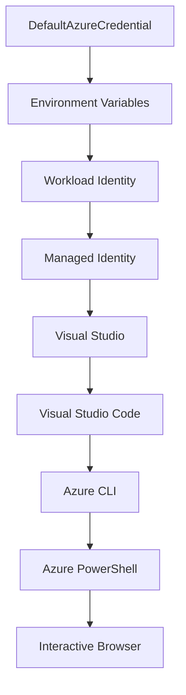

<!--
CO_OP_TRANSLATOR_METADATA:
{
  "original_hash": "4dc26ed8004b58a51875efd07203340f",
  "translation_date": "2025-09-26T18:32:01+00:00",
  "source_file": "docs/getting-started/azd-basics.md",
  "language_code": "mr"
}
-->
# AZD मूलभूत गोष्टी - Azure Developer CLI समजून घेणे

# AZD मूलभूत गोष्टी - मुख्य संकल्पना आणि मूलभूत गोष्टी

**अध्याय नेव्हिगेशन:**
- **📚 कोर्स होम**: [AZD For Beginners](../../README.md)
- **📖 चालू अध्याय**: अध्याय 1 - पायाभूत आणि जलद सुरुवात
- **⬅️ मागील**: [कोर्स विहंगावलोकन](../../README.md#-chapter-1-foundation--quick-start)
- **➡️ पुढील**: [स्थापना आणि सेटअप](installation.md)
- **🚀 पुढील अध्याय**: [अध्याय 2: AI-प्रथम विकास](../ai-foundry/azure-ai-foundry-integration.md)

## परिचय

या धड्यात Azure Developer CLI (azd) ची ओळख करून दिली आहे, जो एक शक्तिशाली कमांड-लाइन टूल आहे जो स्थानिक विकासापासून Azure वर तैनातीपर्यंतचा प्रवास वेगवान करतो. तुम्ही मूलभूत संकल्पना, मुख्य वैशिष्ट्ये शिकाल आणि azd कसे क्लाउड-नेटिव्ह अनुप्रयोग तैनाती सुलभ करते हे समजून घ्याल.

## शिकण्याची उद्दिष्टे

या धड्याच्या शेवटी, तुम्ही:
- Azure Developer CLI म्हणजे काय आणि त्याचा मुख्य उद्देश समजून घ्याल
- टेम्पलेट्स, वातावरण आणि सेवांच्या मुख्य संकल्पना शिकाल
- टेम्पलेट-चालित विकास आणि Infrastructure as Code यासह प्रमुख वैशिष्ट्ये एक्सप्लोर कराल
- azd प्रकल्प संरचना आणि कार्यप्रवाह समजून घ्याल
- तुमच्या विकासाच्या वातावरणासाठी azd स्थापित आणि कॉन्फिगर करण्यासाठी तयार असाल

## शिकण्याचे परिणाम

हा धडा पूर्ण केल्यानंतर, तुम्ही:
- आधुनिक क्लाउड विकास कार्यप्रवाहांमध्ये azd ची भूमिका स्पष्ट करू शकता
- azd प्रकल्प संरचनेचे घटक ओळखू शकता
- टेम्पलेट्स, वातावरण आणि सेवा एकत्र कसे कार्य करतात हे वर्णन करू शकता
- azd सह Infrastructure as Code चे फायदे समजून घेऊ शकता
- विविध azd कमांड्स आणि त्यांचे उद्देश ओळखू शकता

## Azure Developer CLI (azd) म्हणजे काय?

Azure Developer CLI (azd) हे एक कमांड-लाइन टूल आहे जे स्थानिक विकासापासून Azure वर तैनातीपर्यंतचा प्रवास वेगवान करण्यासाठी डिझाइन केले आहे. Azure वर क्लाउड-नेटिव्ह अनुप्रयोग तयार करणे, तैनात करणे आणि व्यवस्थापित करणे याची प्रक्रिया सोपी करते.

## मुख्य संकल्पना

### टेम्पलेट्स
टेम्पलेट्स हे azd चे आधार आहेत. त्यामध्ये समाविष्ट आहे:
- **अनुप्रयोग कोड** - तुमचा स्रोत कोड आणि अवलंबित्वे
- **इन्फ्रास्ट्रक्चर परिभाषा** - Bicep किंवा Terraform मध्ये परिभाषित Azure संसाधने
- **कॉन्फिगरेशन फाइल्स** - सेटिंग्ज आणि पर्यावरणीय व्हेरिएबल्स
- **तैनाती स्क्रिप्ट्स** - स्वयंचलित तैनाती कार्यप्रवाह

### वातावरण
वातावरणे वेगवेगळ्या तैनाती लक्ष्यांचे प्रतिनिधित्व करतात:
- **विकास** - चाचणी आणि विकासासाठी
- **स्टेजिंग** - प्री-प्रॉडक्शन वातावरण
- **प्रॉडक्शन** - लाइव्ह प्रॉडक्शन वातावरण

प्रत्येक वातावरण स्वतःचे राखते:
- Azure संसाधन गट
- कॉन्फिगरेशन सेटिंग्ज
- तैनाती स्थिती

### सेवा
सेवा तुमच्या अनुप्रयोगाचे बांधकाम आहेत:
- **फ्रंटएंड** - वेब अनुप्रयोग, SPAs
- **बॅकएंड** - APIs, मायक्रोसर्व्हिसेस
- **डेटाबेस** - डेटा स्टोरेज सोल्यूशन्स
- **स्टोरेज** - फाइल आणि ब्लॉब स्टोरेज

## मुख्य वैशिष्ट्ये

### 1. टेम्पलेट-चालित विकास
```bash
# Browse available templates
azd template list

# Initialize from a template
azd init --template <template-name>
```

### 2. Infrastructure as Code
- **Bicep** - Azure चे डोमेन-विशिष्ट भाषा
- **Terraform** - मल्टी-क्लाउड इन्फ्रास्ट्रक्चर टूल
- **ARM Templates** - Azure Resource Manager टेम्पलेट्स

### 3. एकात्मिक कार्यप्रवाह
```bash
# Complete deployment workflow
azd up            # Provision + Deploy this is hands off for first time setup
azd provision     # Create Azure resources if you update the infrastructure use this
azd deploy        # Deploy application code or redeploy application code once update
azd down          # Clean up resources
```

### 4. वातावरण व्यवस्थापन
```bash
# Create and manage environments
azd env new <environment-name>
azd env select <environment-name>
azd env list
```

## 📁 प्रकल्प संरचना

एक सामान्य azd प्रकल्प संरचना:
```
my-app/
├── .azd/                    # azd configuration
│   └── config.json
├── .azure/                  # Azure deployment artifacts
├── .devcontainer/          # Development container config
├── .github/workflows/      # GitHub Actions
├── .vscode/               # VS Code settings
├── infra/                 # Infrastructure code
│   ├── main.bicep        # Main infrastructure template
│   ├── main.parameters.json
│   └── modules/          # Reusable modules
├── src/                  # Application source code
│   ├── api/             # Backend services
│   └── web/             # Frontend application
├── azure.yaml           # azd project configuration
└── README.md
```

## 🔧 कॉन्फिगरेशन फाइल्स

### azure.yaml
मुख्य प्रकल्प कॉन्फिगरेशन फाइल:
```yaml
name: my-awesome-app
metadata:
  template: my-template@1.0.0

services:
  web:
    project: ./src/web
    language: js
    host: appservice
  api:
    project: ./src/api
    language: js
    host: appservice

hooks:
  preprovision:
    shell: pwsh
    run: echo "Preparing to provision..."
```

### .azure/config.json
वातावरण-विशिष्ट कॉन्फिगरेशन:
```json
{
  "version": 1,
  "defaultEnvironment": "dev",
  "environments": {
    "dev": {
      "subscriptionId": "your-subscription-id",
      "location": "eastus"
    }
  }
}
```

## 🎪 सामान्य कार्यप्रवाह

### नवीन प्रकल्प सुरू करणे
```bash
# Method 1: Use existing template
azd init --template todo-nodejs-mongo

# Method 2: Start from scratch
azd init

# Method 3: Use current directory
azd init .
```

### विकास चक्र
```bash
# Set up development environment
azd auth login
azd env new dev
azd env select dev

# Deploy everything
azd up

# Make changes and redeploy
azd deploy

# Clean up when done
azd down --force --purge # command in the Azure Developer CLI is a **hard reset** for your environment—especially useful when you're troubleshooting failed deployments, cleaning up orphaned resources, or prepping for a fresh redeploy.
```

## `azd down --force --purge` समजून घेणे
`azd down --force --purge` कमांड तुमचे azd वातावरण आणि संबंधित सर्व संसाधने पूर्णपणे हटवण्याचा एक शक्तिशाली मार्ग आहे. प्रत्येक फ्लॅग काय करतो याचे विश्लेषण येथे आहे:
```
--force
```
- पुष्टीकरण प्रॉम्प्ट्स वगळतो.
- स्वयंचलित किंवा स्क्रिप्टिंगसाठी उपयुक्त जिथे मॅन्युअल इनपुट शक्य नाही.
- CLI विसंगती आढळल्यासही, हटवणे अडथळ्याशिवाय सुरू राहते याची खात्री करते.

```
--purge
```
**सर्व संबंधित मेटाडेटा** हटवते, ज्यामध्ये समाविष्ट आहे:
वातावरण स्थिती
स्थानिक `.azure` फोल्डर
कॅश केलेली तैनाती माहिती
azd ला मागील तैनाती "आठवणे" टाळते, ज्यामुळे संसाधन गट जुळत नाहीत किंवा जुने रजिस्ट्रेशन संदर्भ यासारख्या समस्या उद्भवू शकतात.

### दोन्ही एकत्र का वापरावे?
जर तुम्हाला `azd up` च्या स्थिती किंवा अपूर्ण तैनातींमुळे अडचण आली असेल, तर ही जोडणी **स्वच्छ सुरुवात** सुनिश्चित करते.

हे विशेषतः Azure पोर्टलमध्ये मॅन्युअल संसाधन हटविल्यानंतर किंवा टेम्पलेट्स, वातावरण किंवा संसाधन गट नामकरण पद्धती बदलताना उपयुक्त आहे.

### एकाधिक वातावरण व्यवस्थापन
```bash
# Create staging environment
azd env new staging
azd env select staging
azd up

# Switch back to dev
azd env select dev

# Compare environments
azd env list
```

## 🔐 प्रमाणीकरण आणि क्रेडेन्शियल्स

यशस्वी azd तैनातीसाठी प्रमाणीकरण समजून घेणे महत्त्वाचे आहे. Azure अनेक प्रमाणीकरण पद्धती वापरते आणि azd इतर Azure टूल्सद्वारे वापरल्या जाणाऱ्या समान क्रेडेन्शियल चेनचा लाभ घेतो.

### Azure CLI प्रमाणीकरण (`az login`)

azd वापरण्यापूर्वी तुम्हाला Azure सह प्रमाणीकरण करणे आवश्यक आहे. सर्वात सामान्य पद्धत Azure CLI वापरणे आहे:

```bash
# Interactive login (opens browser)
az login

# Login with specific tenant
az login --tenant <tenant-id>

# Login with service principal
az login --service-principal -u <app-id> -p <password> --tenant <tenant-id>

# Check current login status
az account show

# List available subscriptions
az account list --output table

# Set default subscription
az account set --subscription <subscription-id>
```

### प्रमाणीकरण प्रवाह
1. **इंटरॅक्टिव्ह लॉगिन**: प्रमाणीकरणासाठी तुमचा डिफॉल्ट ब्राउझर उघडतो
2. **डिव्हाइस कोड प्रवाह**: ब्राउझर प्रवेशाशिवाय वातावरणासाठी
3. **सेवा प्रमुख**: स्वयंचलित आणि CI/CD परिस्थितीसाठी
4. **व्यवस्थापित ओळख**: Azure-होस्ट केलेल्या अनुप्रयोगांसाठी

### DefaultAzureCredential चेन

`DefaultAzureCredential` हा एक क्रेडेन्शियल प्रकार आहे जो अनेक क्रेडेन्शियल स्रोत विशिष्ट क्रमाने स्वयंचलितपणे वापरण्याचा सरलीकृत प्रमाणीकरण अनुभव प्रदान करतो:

#### क्रेडेन्शियल चेन क्रम


#### 1. पर्यावरणीय व्हेरिएबल्स
```bash
# Set environment variables for service principal
export AZURE_CLIENT_ID="<app-id>"
export AZURE_CLIENT_SECRET="<password>"
export AZURE_TENANT_ID="<tenant-id>"
```

#### 2. वर्कलोड ओळख (Kubernetes/GitHub Actions)
स्वयंचलितपणे वापरले जाते:
- Azure Kubernetes Service (AKS) सह वर्कलोड ओळख
- GitHub Actions सह OIDC फेडरेशन
- इतर फेडरेटेड ओळख परिस्थिती

#### 3. व्यवस्थापित ओळख
Azure संसाधनांसाठी जसे की:
- व्हर्च्युअल मशीन
- अॅप सेवा
- Azure फंक्शन्स
- कंटेनर इन्स्टन्सेस

```bash
# Check if running on Azure resource with managed identity
az account show --query "user.type" --output tsv
# Returns: "servicePrincipal" if using managed identity
```

#### 4. विकसक टूल्स एकत्रीकरण
- **Visual Studio**: स्वयंचलितपणे साइन-इन केलेले खाते वापरते
- **VS Code**: Azure Account विस्तार क्रेडेन्शियल्स वापरते
- **Azure CLI**: `az login` क्रेडेन्शियल्स वापरते (स्थानिक विकासासाठी सर्वात सामान्य)

### AZD प्रमाणीकरण सेटअप

```bash
# Method 1: Use Azure CLI (Recommended for development)
az login
azd auth login  # Uses existing Azure CLI credentials

# Method 2: Direct azd authentication
azd auth login --use-device-code  # For headless environments

# Method 3: Check authentication status
azd auth login --check-status

# Method 4: Logout and re-authenticate
azd auth logout
azd auth login
```

### प्रमाणीकरण सर्वोत्तम पद्धती

#### स्थानिक विकासासाठी
```bash
# 1. Login with Azure CLI
az login

# 2. Verify correct subscription
az account show
az account set --subscription "Your Subscription Name"

# 3. Use azd with existing credentials
azd auth login
```

#### CI/CD पाइपलाइन्ससाठी
```yaml
# GitHub Actions example
- name: Azure Login
  uses: azure/login@v1
  with:
    creds: ${{ secrets.AZURE_CREDENTIALS }}

- name: Deploy with azd
  run: |
    azd auth login --client-id ${{ secrets.AZURE_CLIENT_ID }} \
                    --client-secret ${{ secrets.AZURE_CLIENT_SECRET }} \
                    --tenant-id ${{ secrets.AZURE_TENANT_ID }}
    azd up --no-prompt
```

#### उत्पादन वातावरणासाठी
- Azure संसाधनांवर चालताना **व्यवस्थापित ओळख** वापरा
- स्वयंचलित परिस्थितीसाठी **सेवा प्रमुख** वापरा
- कोड किंवा कॉन्फिगरेशन फाइल्समध्ये क्रेडेन्शियल्स संग्रहित करणे टाळा
- संवेदनशील कॉन्फिगरेशनसाठी **Azure Key Vault** वापरा

### सामान्य प्रमाणीकरण समस्या आणि उपाय

#### समस्या: "कोणतीही सदस्यता सापडली नाही"
```bash
# Solution: Set default subscription
az account list --output table
az account set --subscription "<subscription-id>"
azd env set AZURE_SUBSCRIPTION_ID "<subscription-id>"
```

#### समस्या: "अपुरे परवानग्या"
```bash
# Solution: Check and assign required roles
az role assignment list --assignee $(az account show --query user.name --output tsv)

# Common required roles:
# - Contributor (for resource management)
# - User Access Administrator (for role assignments)
```

#### समस्या: "टोकन कालबाह्य झाले"
```bash
# Solution: Re-authenticate
az logout
az login
azd auth logout
azd auth login
```

### विविध परिस्थितींमध्ये प्रमाणीकरण

#### स्थानिक विकास
```bash
# Personal development account
az login
azd auth login
```

#### टीम विकास
```bash
# Use specific tenant for organization
az login --tenant contoso.onmicrosoft.com
azd auth login
```

#### मल्टी-टेनंट परिस्थिती
```bash
# Switch between tenants
az login --tenant tenant1.onmicrosoft.com
# Deploy to tenant 1
azd up

az login --tenant tenant2.onmicrosoft.com  
# Deploy to tenant 2
azd up
```

### सुरक्षा विचार

1. **क्रेडेन्शियल संग्रह**: क्रेडेन्शियल्स कधीही स्रोत कोडमध्ये संग्रहित करू नका
2. **स्कोप मर्यादा**: सेवा प्रमुखांसाठी कमीतकमी विशेषाधिकार तत्त्व वापरा
3. **टोकन रोटेशन**: सेवा प्रमुख गुपिते नियमितपणे फिरवा
4. **ऑडिट ट्रेल**: प्रमाणीकरण आणि तैनाती क्रियाकलापांचे निरीक्षण करा
5. **नेटवर्क सुरक्षा**: शक्य असल्यास खाजगी एंडपॉइंट्स वापरा

### प्रमाणीकरण समस्या सोडवणे

```bash
# Debug authentication issues
azd auth login --check-status
az account show
az account get-access-token

# Common diagnostic commands
whoami                          # Current user context
az ad signed-in-user show      # Azure AD user details
az group list                  # Test resource access
```

## `azd down --force --purge` समजून घेणे

### शोध
```bash
azd template list              # Browse templates
azd template show <template>   # Template details
azd init --help               # Initialization options
```

### प्रकल्प व्यवस्थापन
```bash
azd show                     # Project overview
azd env show                 # Current environment
azd config list             # Configuration settings
```

### निरीक्षण
```bash
azd monitor                  # Open Azure portal
azd pipeline config          # Set up CI/CD
azd logs                     # View application logs
```

## सर्वोत्तम पद्धती

### 1. अर्थपूर्ण नावे वापरा
```bash
# Good
azd env new production-east
azd init --template web-app-secure

# Avoid
azd env new env1
azd init --template template1
```

### 2. टेम्पलेट्सचा लाभ घ्या
- विद्यमान टेम्पलेट्ससह प्रारंभ करा
- तुमच्या गरजांसाठी सानुकूलित करा
- तुमच्या संस्थेसाठी पुनर्वापरयोग्य टेम्पलेट्स तयार करा

### 3. वातावरण वेगळे करा
- विकास/स्टेजिंग/प्रॉडक्शनसाठी स्वतंत्र वातावरण वापरा
- स्थानिक मशीनवरून थेट उत्पादनात तैनात करू नका
- उत्पादन तैनातीसाठी CI/CD पाइपलाइन्स वापरा

### 4. कॉन्फिगरेशन व्यवस्थापन
- संवेदनशील डेटासाठी पर्यावरणीय व्हेरिएबल्स वापरा
- कॉन्फिगरेशन आवृत्ती नियंत्रणात ठेवा
- वातावरण-विशिष्ट सेटिंग्ज दस्तऐवजीकरण करा

## शिकण्याची प्रगती

### नवशिक्या (आठवडा 1-2)
1. azd स्थापित करा आणि प्रमाणीकरण करा
2. एक साधा टेम्पलेट तैनात करा
3. प्रकल्प संरचना समजून घ्या
4. मूलभूत कमांड्स (up, down, deploy) शिका

### मध्यम स्तर (आठवडा 3-4)
1. टेम्पलेट्स सानुकूलित करा
2. एकाधिक वातावरण व्यवस्थापित करा
3. इन्फ्रास्ट्रक्चर कोड समजून घ्या
4. CI/CD पाइपलाइन्स सेट करा

### प्रगत (आठवडा 5+)
1. सानुकूल टेम्पलेट्स तयार करा
2. प्रगत इन्फ्रास्ट्रक्चर नमुने
3. मल्टी-रीजन तैनाती
4. एंटरप्राइझ-ग्रेड कॉन्फिगरेशन

## पुढील पायऱ्या

**📖 अध्याय 1 शिकणे सुरू ठेवा:**
- [स्थापना आणि सेटअप](installation.md) - azd स्थापित आणि कॉन्फिगर करा
- [तुमचा पहिला प्रकल्प](first-project.md) - हाताळणी ट्यूटोरियल पूर्ण करा
- [कॉन्फिगरेशन मार्गदर्शक](configuration.md) - प्रगत कॉन्फिगरेशन पर्याय

**🎯 पुढील अध्यायासाठी तयार?**
- [अध्याय 2: AI-प्रथम विकास](../ai-foundry/azure-ai-foundry-integration.md) - AI अनुप्रयोग तयार करणे सुरू करा

## अतिरिक्त संसाधने

- [Azure Developer CLI विहंगावलोकन](https://learn.microsoft.com/en-us/azure/developer/azure-developer-cli/)
- [टेम्पलेट गॅलरी](https://azure.github.io/awesome-azd/)
- [कम्युनिटी नमुने](https://github.com/Azure-Samples)

---

**अध्याय नेव्हिगेशन:**
- **📚 कोर्स होम**: [AZD For Beginners](../../README.md)
- **📖 चालू अध्याय**: अध्याय 1 - पायाभूत आणि जलद सुरुवात  
- **⬅️ मागील**: [कोर्स विहंगावलोकन](../../README.md#-chapter-1-foundation--quick-start)
- **➡️ पुढील**: [स्थापना आणि सेटअप](installation.md)
- **🚀 पुढील अध्याय**: [अध्याय 2: AI-प्रथम विकास](../ai-foundry/azure-ai-foundry-integration.md)

---

