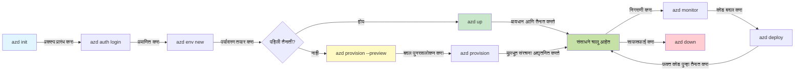
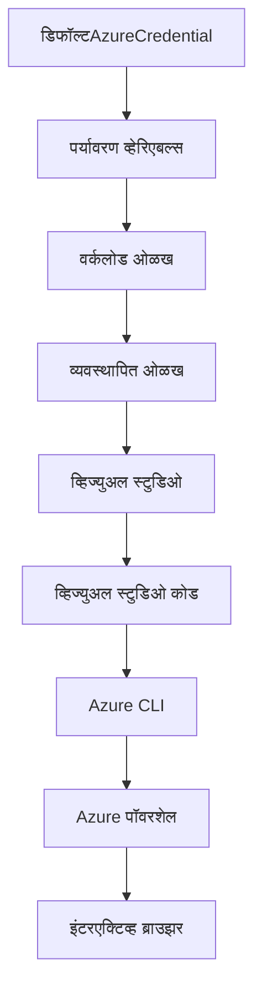

# AZD मूलभूत गोष्टी - Azure Developer CLI समजून घेणे

# AZD मूलभूत गोष्टी - मुख्य संकल्पना आणि तत्त्वे

**अध्याय नेव्हिगेशन:**
- **📚 कोर्स होम**: [AZD नवशिक्यांसाठी](../../README.md)
- **📖 चालू अध्याय**: अध्याय 1 - पाया आणि जलद सुरुवात
- **⬅️ मागील**: [कोर्स विहंगावलोकन](../../README.md#-chapter-1-foundation--quick-start)
- **➡️ पुढील**: [इंस्टॉलेशन आणि सेटअप](installation.md)
- **🚀 पुढील अध्याय**: [अध्याय 2: AI-प्रथम विकास](../microsoft-foundry/microsoft-foundry-integration.md)

## परिचय

या धड्यात तुम्हाला Azure Developer CLI (azd) ची ओळख करून दिली जाईल, जो एक शक्तिशाली कमांड-लाइन टूल आहे जो स्थानिक विकासापासून Azure वर तैनातीपर्यंतचा प्रवास वेगवान करतो. तुम्ही मूलभूत संकल्पना, मुख्य वैशिष्ट्ये शिकाल आणि azd कसे क्लाउड-नेटिव्ह अनुप्रयोग तैनाती सुलभ करते हे समजून घ्याल.

## शिकण्याची उद्दिष्टे

या धड्याच्या शेवटी, तुम्ही:
- Azure Developer CLI म्हणजे काय आणि त्याचा मुख्य उद्देश समजून घ्याल
- टेम्पलेट्स, वातावरण आणि सेवांच्या मुख्य संकल्पना शिकाल
- टेम्पलेट-चालित विकास आणि Infrastructure as Code यासह प्रमुख वैशिष्ट्ये एक्सप्लोर कराल
- azd प्रकल्प संरचना आणि कार्यप्रवाह समजून घ्याल
- तुमच्या विकासाच्या वातावरणासाठी azd स्थापित आणि कॉन्फिगर करण्यासाठी तयार असाल

## शिकण्याचे परिणाम

हा धडा पूर्ण केल्यानंतर, तुम्ही:
- आधुनिक क्लाउड विकास कार्यप्रवाहांमध्ये azd ची भूमिका स्पष्ट करू शकता
- azd प्रकल्प संरचनेचे घटक ओळखू शकता
- टेम्पलेट्स, वातावरण आणि सेवा एकत्र कसे कार्य करतात हे वर्णन करू शकता
- azd सह Infrastructure as Code चे फायदे समजून घेऊ शकता
- विविध azd कमांड्स आणि त्यांचे उद्देश ओळखू शकता

## Azure Developer CLI (azd) म्हणजे काय?

Azure Developer CLI (azd) हे एक कमांड-लाइन टूल आहे जे स्थानिक विकासापासून Azure वर तैनातीपर्यंतचा प्रवास वेगवान करण्यासाठी डिझाइन केले आहे. Azure वर क्लाउड-नेटिव्ह अनुप्रयोग तयार करणे, तैनात करणे आणि व्यवस्थापित करणे याची प्रक्रिया सोपी करते.

### 🎯 AZD का वापरावे? वास्तविक जगातील तुलना

चला डेटाबेससह एक साधा वेब अॅप तैनात करण्याची तुलना करूया:

#### ❌ AZD शिवाय: मॅन्युअल Azure तैनाती (30+ मिनिटे)

```bash
# चरण 1: संसाधन गट तयार करा
az group create --name myapp-rg --location eastus

# चरण 2: अ‍ॅप सर्व्हिस योजना तयार करा
az appservice plan create --name myapp-plan \
  --resource-group myapp-rg \
  --sku B1 --is-linux

# चरण 3: वेब अ‍ॅप तयार करा
az webapp create --name myapp-web-unique123 \
  --resource-group myapp-rg \
  --plan myapp-plan \
  --runtime "NODE:18-lts"

# चरण 4: कॉसमॉस DB खाते तयार करा (10-15 मिनिटे)
az cosmosdb create --name myapp-cosmos-unique123 \
  --resource-group myapp-rg \
  --kind MongoDB

# चरण 5: डेटाबेस तयार करा
az cosmosdb mongodb database create \
  --account-name myapp-cosmos-unique123 \
  --resource-group myapp-rg \
  --name tododb

# चरण 6: संग्रह तयार करा
az cosmosdb mongodb collection create \
  --account-name myapp-cosmos-unique123 \
  --resource-group myapp-rg \
  --database-name tododb \
  --name todos

# चरण 7: कनेक्शन स्ट्रिंग मिळवा
CONN_STR=$(az cosmosdb keys list \
  --name myapp-cosmos-unique123 \
  --resource-group myapp-rg \
  --type connection-strings \
  --query "connectionStrings[0].connectionString" -o tsv)

# चरण 8: अ‍ॅप सेटिंग्ज कॉन्फिगर करा
az webapp config appsettings set \
  --name myapp-web-unique123 \
  --resource-group myapp-rg \
  --settings MONGODB_URI="$CONN_STR"

# चरण 9: लॉगिंग सक्षम करा
az webapp log config --name myapp-web-unique123 \
  --resource-group myapp-rg \
  --application-logging filesystem \
  --detailed-error-messages true

# चरण 10: अ‍ॅप्लिकेशन इनसाइट्स सेट करा
az monitor app-insights component create \
  --app myapp-insights \
  --location eastus \
  --resource-group myapp-rg

# चरण 11: अ‍ॅप इनसाइट्स वेब अ‍ॅपशी लिंक करा
INSTRUMENTATION_KEY=$(az monitor app-insights component show \
  --app myapp-insights \
  --resource-group myapp-rg \
  --query "instrumentationKey" -o tsv)

az webapp config appsettings set \
  --name myapp-web-unique123 \
  --resource-group myapp-rg \
  --settings APPINSIGHTS_INSTRUMENTATIONKEY="$INSTRUMENTATION_KEY"

# चरण 12: अ‍ॅप्लिकेशन स्थानिक स्तरावर तयार करा
npm install
npm run build

# चरण 13: डिप्लॉयमेंट पॅकेज तयार करा
zip -r app.zip . -x "*.git*" "node_modules/*"

# चरण 14: अ‍ॅप्लिकेशन डिप्लॉय करा
az webapp deployment source config-zip \
  --resource-group myapp-rg \
  --name myapp-web-unique123 \
  --src app.zip

# चरण 15: थांबा आणि प्रार्थना करा की ते कार्य करेल 🙏
# (कोणतीही स्वयंचलित पडताळणी नाही, मॅन्युअल चाचणी आवश्यक आहे)
```

**समस्या:**
- ❌ 15+ कमांड्स लक्षात ठेवणे आणि योग्य क्रमाने अंमलात आणणे
- ❌ 30-45 मिनिटे मॅन्युअल काम
- ❌ चुका करणे सोपे (टायपो, चुकीचे पॅरामीटर्स)
- ❌ टर्मिनल इतिहासात कनेक्शन स्ट्रिंग्स उघड
- ❌ काहीतरी अयशस्वी झाल्यास स्वयंचलित रोलबॅक नाही
- ❌ टीम सदस्यांसाठी पुनरुत्पादित करणे कठीण
- ❌ प्रत्येक वेळी वेगळे (पुनरुत्पादित नाही)

#### ✅ AZD सह: स्वयंचलित तैनाती (5 कमांड्स, 10-15 मिनिटे)

```bash
# चरण 1: टेम्पलेटमधून प्रारंभ करा
azd init --template todo-nodejs-mongo

# चरण 2: प्रमाणीकरण करा
azd auth login

# चरण 3: वातावरण तयार करा
azd env new dev

# चरण 4: बदलांची पूर्वावलोकन करा (पर्यायी पण शिफारस केलेले)
azd provision --preview

# चरण 5: सर्वकाही तैनात करा
azd up

# ✨ पूर्ण! सर्वकाही तैनात, संरचीत आणि निरीक्षण केले आहे
```

**फायदे:**
- ✅ **5 कमांड्स** vs. 15+ मॅन्युअल स्टेप्स
- ✅ **10-15 मिनिटे** एकूण वेळ (मुख्यतः Azure साठी प्रतीक्षा)
- ✅ **शून्य त्रुटी** - स्वयंचलित आणि चाचणी केलेले
- ✅ **गुपिते सुरक्षितपणे व्यवस्थापित** Key Vault च्या माध्यमातून
- ✅ **स्वयंचलित रोलबॅक** अयशस्वी झाल्यास
- ✅ **पूर्णपणे पुनरुत्पादित** - प्रत्येक वेळी समान परिणाम
- ✅ **टीम-रेडी** - कोणीही समान कमांड्ससह तैनात करू शकतो
- ✅ **Infrastructure as Code** - आवृत्ती नियंत्रित Bicep टेम्पलेट्स
- ✅ **अंतर्गत मॉनिटरिंग** - Application Insights स्वयंचलितपणे कॉन्फिगर केलेले

### 📊 वेळ आणि त्रुटी कमी करणे

| मेट्रिक | मॅन्युअल तैनाती | AZD तैनाती | सुधारणा |
|:-------|:------------------|:---------------|:------------|
| **कमांड्स** | 15+ | 5 | 67% कमी |
| **वेळ** | 30-45 मिनिटे | 10-15 मिनिटे | 60% जलद |
| **त्रुटी दर** | ~40% | <5% | 88% कमी |
| **सुसंगतता** | कमी (मॅन्युअल) | 100% (स्वयंचलित) | परिपूर्ण |
| **टीम ऑनबोर्डिंग** | 2-4 तास | 30 मिनिटे | 75% जलद |
| **रोलबॅक वेळ** | 30+ मिनिटे (मॅन्युअल) | 2 मिनिटे (स्वयंचलित) | 93% जलद |

## मुख्य संकल्पना

### टेम्पलेट्स
टेम्पलेट्स हे azd चे आधार आहेत. ते समाविष्ट करतात:
- **अनुप्रयोग कोड** - तुमचा सोर्स कोड आणि अवलंबित्वे
- **इन्फ्रास्ट्रक्चर परिभाषा** - Bicep किंवा Terraform मध्ये परिभाषित Azure संसाधने
- **कॉन्फिगरेशन फाइल्स** - सेटिंग्ज आणि पर्यावरणीय व्हेरिएबल्स
- **तैनाती स्क्रिप्ट्स** - स्वयंचलित तैनाती कार्यप्रवाह

### वातावरणे
वातावरणे वेगवेगळ्या तैनाती लक्ष्यांचे प्रतिनिधित्व करतात:
- **विकास** - चाचणी आणि विकासासाठी
- **स्टेजिंग** - प्री-प्रॉडक्शन वातावरण
- **प्रॉडक्शन** - लाइव्ह प्रॉडक्शन वातावरण

प्रत्येक वातावरण स्वतःचे राखते:
- Azure संसाधन गट
- कॉन्फिगरेशन सेटिंग्ज
- तैनाती स्थिती

### सेवा
सेवा तुमच्या अनुप्रयोगाचे बांधकाम आहेत:
- **फ्रंटएंड** - वेब अनुप्रयोग, SPAs
- **बॅकएंड** - APIs, मायक्रोसर्व्हिसेस
- **डेटाबेस** - डेटा स्टोरेज सोल्यूशन्स
- **स्टोरेज** - फाइल आणि ब्लॉब स्टोरेज

## मुख्य वैशिष्ट्ये

### 1. टेम्पलेट-चालित विकास
```bash
# उपलब्ध टेम्पलेट्स ब्राउज करा
azd template list

# टेम्पलेटमधून प्रारंभ करा
azd init --template <template-name>
```

### 2. Infrastructure as Code
- **Bicep** - Azure चे डोमेन-विशिष्ट भाषा
- **Terraform** - मल्टी-क्लाउड इन्फ्रास्ट्रक्चर टूल
- **ARM टेम्पलेट्स** - Azure Resource Manager टेम्पलेट्स

### 3. एकत्रित कार्यप्रवाह
```bash
# पूर्ण उपयोजन कार्यप्रवाह
azd up            # प्रोव्हिजन + उपयोजन हे प्रथम सेटअपसाठी स्वयंचलित आहे

# 🧪 नवीन: उपयोजनापूर्वी पायाभूत सुविधा बदलांची पूर्वदृश्य पहा (सुरक्षित)
azd provision --preview    # पायाभूत सुविधा उपयोजनाचे अनुकरण करा, बदल न करता

azd provision     # Azure संसाधने तयार करा जर तुम्ही पायाभूत सुविधा अद्यतनित केली असेल तर हे वापरा
azd deploy        # अनुप्रयोग कोड उपयोजित करा किंवा अद्यतनानंतर अनुप्रयोग कोड पुन्हा उपयोजित करा
azd down          # संसाधने साफ करा
```

#### 🛡️ सुरक्षित इन्फ्रास्ट्रक्चर नियोजन प्रीव्ह्यूसह
`azd provision --preview` कमांड सुरक्षित तैनातीसाठी गेम-चेंजर आहे:
- **ड्राय-रन विश्लेषण** - काय तयार केले जाईल, बदलले जाईल किंवा हटवले जाईल हे दर्शवते
- **शून्य जोखीम** - तुमच्या Azure वातावरणात कोणतेही वास्तविक बदल केले जात नाहीत
- **टीम सहयोग** - तैनातीपूर्वी प्रीव्ह्यू परिणाम शेअर करा
- **खर्च अंदाज** - वचनबद्धतेपूर्वी संसाधन खर्च समजून घ्या

```bash
# उदाहरण पूर्वावलोकन कार्यप्रवाह
azd provision --preview           # काय बदल होईल ते पहा
# आउटपुट पुनरावलोकन करा, टीमसोबत चर्चा करा
azd provision                     # आत्मविश्वासाने बदल लागू करा
```

### 📊 दृश्य: AZD विकास कार्यप्रवाह


**कार्यप्रवाह स्पष्टीकरण:**
1. **Init** - टेम्पलेट किंवा नवीन प्रकल्पासह प्रारंभ करा
2. **Auth** - Azure सह प्रमाणीकरण करा
3. **Environment** - वेगळे तैनाती वातावरण तयार करा
4. **Preview** - 🆕 नेहमी इन्फ्रास्ट्रक्चर बदलांचे प्रीव्ह्यू पहा (सुरक्षित सराव)
5. **Provision** - Azure संसाधने तयार/अपडेट करा
6. **Deploy** - तुमचा अनुप्रयोग कोड पुश करा
7. **Monitor** - अनुप्रयोग कार्यप्रदर्शन निरीक्षण करा
8. **Iterate** - बदल करा आणि कोड पुन्हा तैनात करा
9. **Cleanup** - काम पूर्ण झाल्यावर संसाधने काढा

### 4. वातावरण व्यवस्थापन
```bash
# वातावरणे तयार करा आणि व्यवस्थापित करा
azd env new <environment-name>
azd env select <environment-name>
azd env list
```

## 📁 प्रकल्प संरचना

एक सामान्य azd प्रकल्प संरचना:
```
my-app/
├── .azd/                    # azd configuration
│   └── config.json
├── .azure/                  # Azure deployment artifacts
├── .devcontainer/          # Development container config
├── .github/workflows/      # GitHub Actions
├── .vscode/               # VS Code settings
├── infra/                 # Infrastructure code
│   ├── main.bicep        # Main infrastructure template
│   ├── main.parameters.json
│   └── modules/          # Reusable modules
├── src/                  # Application source code
│   ├── api/             # Backend services
│   └── web/             # Frontend application
├── azure.yaml           # azd project configuration
└── README.md
```

## 🔧 कॉन्फिगरेशन फाइल्स

### azure.yaml
मुख्य प्रकल्प कॉन्फिगरेशन फाइल:
```yaml
name: my-awesome-app
metadata:
  template: my-template@1.0.0

services:
  web:
    project: ./src/web
    language: js
    host: appservice
  api:
    project: ./src/api
    language: js
    host: appservice

hooks:
  preprovision:
    shell: pwsh
    run: echo "Preparing to provision..."
```

### .azure/config.json
वातावरण-विशिष्ट कॉन्फिगरेशन:
```json
{
  "version": 1,
  "defaultEnvironment": "dev",
  "environments": {
    "dev": {
      "subscriptionId": "your-subscription-id",
      "location": "eastus"
    }
  }
}
```

## 🎪 सामान्य कार्यप्रवाह व्यावहारिक सरावांसह

> **💡 शिकण्याचा सल्ला:** AZD कौशल्ये प्रगतपणे तयार करण्यासाठी या सरावांचे क्रमाने अनुसरण करा.

### 🎯 सराव 1: तुमचा पहिला प्रकल्प प्रारंभ करा

**उद्दिष्ट:** AZD प्रकल्प तयार करा आणि त्याची संरचना एक्सप्लोर करा

**पायऱ्या:**
```bash
# सिद्ध टेम्पलेट वापरा
azd init --template todo-nodejs-mongo

# निर्माण केलेल्या फाइल्स एक्सप्लोर करा
ls -la  # सर्व फाइल्स पहा, लपवलेल्या फाइल्ससह

# तयार केलेल्या मुख्य फाइल्स:
# - azure.yaml (मुख्य कॉन्फिगरेशन)
# - infra/ (इन्फ्रास्ट्रक्चर कोड)
# - src/ (अर्ज कोड)
```

**✅ यश:** तुम्हाला azure.yaml, infra/, आणि src/ डिरेक्टरीज मिळाल्या आहेत

---

### 🎯 सराव 2: Azure वर तैनात करा

**उद्दिष्ट:** एंड-टू-एंड तैनाती पूर्ण करा

**पायऱ्या:**
```bash
# 1. प्रमाणीकरण करा
az login && azd auth login

# 2. वातावरण तयार करा
azd env new dev
azd env set AZURE_LOCATION eastus

# 3. बदलांची पूर्वावलोकन करा (शिफारस केलेले)
azd provision --preview

# 4. सर्वकाही तैनात करा
azd up

# 5. तैनाती सत्यापित करा
azd show    # तुमच्या अॅपचा URL पहा
```

**अपेक्षित वेळ:** 10-15 मिनिटे  
**✅ यश:** अनुप्रयोग URL ब्राउझरमध्ये उघडतो

---

### 🎯 सराव 3: एकाधिक वातावरणे

**उद्दिष्ट:** dev आणि staging वर तैनात करा

**पायऱ्या:**
```bash
# आधीच dev आहे, staging तयार करा
azd env new staging
azd env set AZURE_LOCATION westus2
azd up

# त्यांच्यामध्ये स्विच करा
azd env list
azd env select dev
```

**✅ यश:** Azure पोर्टलमध्ये दोन वेगळे संसाधन गट

---

### 🛡️ स्वच्छ सुरुवात: `azd down --force --purge`

जेव्हा तुम्हाला पूर्णपणे रीसेट करायचे असेल:

```bash
azd down --force --purge
```

**ते काय करते:**
- `--force`: पुष्टीकरण प्रॉम्प्ट्स नाहीत
- `--purge`: सर्व स्थानिक स्थिती आणि Azure संसाधने हटवते

**कधी वापरावे:**
- तैनाती अर्धवट अयशस्वी झाली
- प्रकल्प बदलत आहेत
- नवीन सुरुवात आवश्यक आहे

---

## 🎪 मूळ कार्यप्रवाह संदर्भ

### नवीन प्रकल्प सुरू करणे
```bash
# पद्धत 1: विद्यमान टेम्पलेट वापरा
azd init --template todo-nodejs-mongo

# पद्धत 2: सुरुवातीपासून सुरू करा
azd init

# पद्धत 3: वर्तमान निर्देशिका वापरा
azd init .
```

### विकास चक्र
```bash
# विकास वातावरण सेट करा
azd auth login
azd env new dev
azd env select dev

# सर्वकाही तैनात करा
azd up

# बदल करा आणि पुन्हा तैनात करा
azd deploy

# पूर्ण झाल्यावर साफ करा
azd down --force --purge # Azure Developer CLI मधील कमांड तुमच्या वातावरणासाठी **हार्ड रीसेट** आहे—विशेषतः उपयुक्त जेव्हा तुम्ही अयशस्वी तैनातींचे निराकरण करत असता, अनाथ संसाधने साफ करत असता, किंवा नवीन तैनातीसाठी तयारी करत असता.
```

## `azd down --force --purge` समजून घेणे
`azd down --force --purge` कमांड तुमचे azd वातावरण आणि संबंधित सर्व संसाधने पूर्णपणे काढून टाकण्याचा एक शक्तिशाली मार्ग आहे. प्रत्येक फ्लॅग काय करतो याचे विश्लेषण येथे आहे:
```
--force
```
- पुष्टीकरण प्रॉम्प्ट्स वगळतो.
- स्वयंचलितता किंवा स्क्रिप्टिंगसाठी उपयुक्त जिथे मॅन्युअल इनपुट शक्य नाही.
- CLI विसंगती आढळल्यासही, टियरडाउन अडथळ्याशिवाय सुरू राहतो.

```
--purge
```
संबंधित **सर्व मेटाडेटा** हटवते, ज्यामध्ये:
वातावरण स्थिती
स्थानिक `.azure` फोल्डर
कॅश्ड तैनाती माहिती
पूर्वीच्या तैनातींचे "स्मरण" azd ला रोखते, ज्यामुळे संसाधन गट जुळत नाहीत किंवा जुने रजिस्ट्रेशन संदर्भ यासारख्या समस्या उद्भवू शकतात.

### दोन्ही का वापरावे?
जेव्हा तुम्ही `azd up` सह अडचणीत असता कारण उर्वरित स्थिती किंवा अर्धवट तैनाती, हे संयोजन **स्वच्छ सुरुवात** सुनिश्चित करते.

हे विशेषतः Azure पोर्टलमध्ये मॅन्युअल संसाधन हटविल्यानंतर किंवा टेम्पलेट्स, वातावरण किंवा संसाधन गट नामकरण पद्धती बदलताना उपयुक्त आहे.

### एकाधिक वातावरणे व्यवस्थापित करणे
```bash
# स्टेजिंग वातावरण तयार करा
azd env new staging
azd env select staging
azd up

# डेव्ह वर परत स्विच करा
azd env select dev

# वातावरणांची तुलना करा
azd env list
```

## 🔐 प्रमाणीकरण आणि क्रेडेन्शियल्स

यशस्वी azd तैनातीसाठी प्रमाणीकरण समजून घेणे महत्त्वाचे आहे. Azure अनेक प्रमाणीकरण पद्धती वापरते आणि azd इतर Azure टूल्सद्वारे वापरल्या जाणाऱ्या समान क्रेडेन्शियल चेनचा लाभ घेतो.

### Azure CLI प्रमाणीकरण (`az login`)

azd वापरण्यापूर्वी तुम्हाला Azure सह प्रमाणीकरण करणे आवश्यक आहे. सर्वात सामान्य पद्धत म्हणजे Azure CLI वापरणे:

```bash
# परस्पर संवादात्मक लॉगिन (ब्राउझर उघडतो)
az login

# विशिष्ट भाडेकरूसह लॉगिन करा
az login --tenant <tenant-id>

# सेवा प्रमुखासह लॉगिन करा
az login --service-principal -u <app-id> -p <password> --tenant <tenant-id>

# वर्तमान लॉगिन स्थिती तपासा
az account show

# उपलब्ध सदस्यता सूचीबद्ध करा
az account list --output table

# डिफॉल्ट सदस्यता सेट करा
az account set --subscription <subscription-id>
```

### प्रमाणीकरण प्रवाह
1. **इंटरॅक्टिव्ह लॉगिन**: प्रमाणीकरणासाठी तुमचा डिफॉल्ट ब्राउझर उघडतो
2. **डिव्हाइस कोड प्रवाह**: ब्राउझर प्रवेशाशिवाय वातावरणासाठी
3. **सर्व्हिस प्रिन्सिपल**: ऑटोमेशन आणि CI/CD परिस्थितीसाठी
4. **मॅनेज्ड आयडेंटिटी**: Azure-होस्ट केलेल्या अनुप्रयोगांसाठी

### DefaultAzureCredential चेन

`DefaultAzureCredential` हा एक क्रेडेन्शियल प्रकार आहे जो विशिष्ट क्रमाने अनेक क्रेडेन्शियल स्रोत स्वयंचलितपणे वापरण्याचा सरलीकृत प्रमाणीकरण अनुभव प्रदान करतो:

#### क्रेडेन्शियल चेन क्रम

#### 1. पर्यावरणीय व्हेरिएबल्स
```bash
# सेवा प्रमुखासाठी पर्यावरणीय चल बदल सेट करा
export AZURE_CLIENT_ID="<app-id>"
export AZURE_CLIENT_SECRET="<password>"
export AZURE_TENANT_ID="<tenant-id>"
```

#### 2. वर्कलोड आयडेंटिटी (Kubernetes/GitHub Actions)
स्वयंचलितपणे वापरले जाते:
- Azure Kubernetes Service (AKS) वर्कलोड आयडेंटिटीसह
- GitHub Actions OIDC फेडरेशनसह
- इतर फेडरेटेड आयडेंटिटी परिस्थिती

#### 3. मॅनेज्ड आयडेंटिटी
Azure संसाधनांसाठी जसे की:
- व्हर्च्युअल मशीन
- अॅप सर्व्हिस
- Azure फंक्शन्स
- कंटेनर इन्स्टन्सेस

```bash
# व्यवस्थापित ओळख असलेल्या Azure संसाधनावर चालत असल्याचे तपासा
az account show --query "user.type" --output tsv
# परतावा: "servicePrincipal" जर व्यवस्थापित ओळख वापरत असेल
```

#### 4. डेव्हलपर टूल्स इंटिग्रेशन
- **Visual Studio**: स्वयंचलितपणे साइन-इन केलेले खाते वापरते
- **VS Code**: Azure Account एक्सटेंशन क्रेडेन्शियल्स वापरते
- **Azure CLI**: `az login` क्रेडेन्शियल्स वापरते (स्थानिक विकासासाठी सर्वात सामान्य)

### AZD प्रमाणीकरण सेटअप

```bash
# पद्धत 1: Azure CLI वापरा (विकसनासाठी शिफारस केलेले)
az login
azd auth login  # विद्यमान Azure CLI क्रेडेन्शियल्स वापरते

# पद्धत 2: थेट azd प्रमाणीकरण
azd auth login --use-device-code  # हेडलेस वातावरणासाठी

# पद्धत 3: प्रमाणीकरण स्थिती तपासा
azd auth login --check-status

# पद्धत 4: लॉगआउट करा आणि पुन्हा प्रमाणीकरण करा
azd auth logout
azd auth login
```

### प्रमाणीकरण सर्वोत्तम पद्धती

#### स्थानिक विकासासाठी
```bash
# 1. Azure CLI सह लॉगिन करा
az login

# 2. योग्य सबस्क्रिप्शन सत्यापित करा
az account show
az account set --subscription "Your Subscription Name"

# 3. विद्यमान क्रेडेन्शियल्ससह azd वापरा
azd auth login
```

#### CI/CD पाइपलाइन्ससाठी
```yaml
# GitHub Actions example
- name: Azure Login
  uses: azure/login@v1
  with:
    creds: ${{ secrets.AZURE_CREDENTIALS }}

- name: Deploy with azd
  run: |
    azd auth login --client-id ${{ secrets.AZURE_CLIENT_ID }} \
                    --client-secret ${{ secrets.AZURE_CLIENT_SECRET }} \
                    --tenant-id ${{ secrets.AZURE_TENANT_ID }}
    azd up --no-prompt
```

#### उत्पादन वातावरणासाठी
- Azure संसाधनांवर चालताना **मॅनेज्ड आयडेंटिटी** वापरा
- ऑटोमेशन परिस्थितीसाठी **सर्व्हिस प्रिन्सिपल** वापरा
- कोड किंवा कॉन्फिगरेशन फाइल्समध्ये क्रेडेन्शियल्स संग्रहित करणे टाळा
- संवेदनशील कॉन्फिगरेशनसाठी **Azure Key Vault** वापरा

### सामान्य प्रमाणीकरण समस्या आणि उपाय

#### समस्या: "कोणतीही सबस्क्रिप्शन सापडली नाही"
```bash
# उपाय: डीफॉल्ट सदस्यता सेट करा
az account list --output table
az account set --subscription "<subscription-id>"
azd env set AZURE_SUBSCRIPTION_ID "<subscription-id>"
```

#### समस्या: "अपुरे परवानग्या"
```bash
# उपाय: आवश्यक भूमिका तपासा आणि नियुक्त करा
az role assignment list --assignee $(az account show --query user.name --output tsv)

# सामान्य आवश्यक भूमिका:
# - योगदानकर्ता (संसाधन व्यवस्थापनासाठी)
# - वापरकर्ता प्रवेश प्रशासक (भूमिका नियुक्तीसाठी)
```

#### समस्या: "टोकन कालबाह्य झाले"
```bash
# उपाय: पुन्हा प्रमाणीकरण करा
az logout
az login
azd auth logout
azd auth login
```

### विविध परिस्थितींमध्ये प्रमाणीकरण

#### स्थानिक विकास
```bash
# वैयक्तिक विकास खाते
az login
azd auth login
```

#### टीम विकास
```bash
# संघटनेसाठी विशिष्ट भाडेकरू वापरा
az login --tenant contoso.onmicrosoft.com
azd auth login
```

#### मल्टी-टेनंट परिस्थिती
```bash
# भाडेकरूंच्या दरम्यान स्विच करा
az login --tenant tenant1.onmicrosoft.com
# भाडेकरू 1 वर तैनात करा
azd up

az login --tenant tenant2.onmicrosoft.com  
# भाडेकरू 2 वर तैनात करा
azd up
```

### सुरक्षा विचार

1. **क्रेडेन्शियल स्टोरेज**: क्रेडेन्शियल्स कधीही सोर्स कोडमध्ये संग्रहित करू नका
2. **स्कोप मर्यादा**: सर्व्हिस प्रिन्सिपलसाठी कमीतकमी-प्रिव्हिलेज तत्त्व वापरा
3. **टोकन रोटेशन**: सर्व्हिस प्रिन्सिपल गुपिते नियमितपणे फिरवा
4. **ऑडिट ट्रेल**: प्रमाणीकरण आणि तैनाती क्रियाकलापांचे निरीक्षण करा
5. **नेटवर्क सुरक्षा**: शक्य असल्यास खाजगी एंडपॉइंट्स वापरा

### प्रमाणीकरण समस्या सोडवणे

```bash
# प्रमाणीकरण समस्यांचे डीबग करा
azd auth login --check-status
az account show
az account get-access-token

# सामान्य निदान आदेश
whoami                          # वर्तमान वापरकर्ता संदर्भ
az ad signed-in-user show      # Azure AD वापरकर्ता तपशील
az group list                  # संसाधन प्रवेशाची चाचणी करा
```

## `azd down --force --purge` समजून घेणे

### शोध
```bash
azd template list              # टेम्पलेट्स ब्राउज करा
azd template show <template>   # टेम्पलेट तपशील
azd init --help               # प्रारंभिक पर्याय
```

### प्र
- [स्थापना आणि सेटअप](installation.md) - azd स्थापित करा आणि कॉन्फिगर करा
- [तुमचा पहिला प्रकल्प](first-project.md) - पूर्ण हाताळणी ट्युटोरियल
- [कॉन्फिगरेशन मार्गदर्शक](configuration.md) - प्रगत कॉन्फिगरेशन पर्याय

**🎯 पुढील अध्यायासाठी तयार आहात का?**
- [अध्याय 2: AI-प्रथम विकास](../microsoft-foundry/microsoft-foundry-integration.md) - AI अनुप्रयोग तयार करण्यास सुरुवात करा

## अतिरिक्त संसाधने

- [Azure Developer CLI विहंगावलोकन](https://learn.microsoft.com/en-us/azure/developer/azure-developer-cli/)
- [टेम्पलेट गॅलरी](https://azure.github.io/awesome-azd/)
- [समुदाय नमुने](https://github.com/Azure-Samples)

---

## 🙋 वारंवार विचारले जाणारे प्रश्न

### सामान्य प्रश्न

**प्रश्न: AZD आणि Azure CLI यामध्ये काय फरक आहे?**

उत्तर: Azure CLI (`az`) वैयक्तिक Azure संसाधनांचे व्यवस्थापन करण्यासाठी आहे. AZD (`azd`) संपूर्ण अनुप्रयोगांचे व्यवस्थापन करण्यासाठी आहे:

```bash
# Azure CLI - कमी-स्तरीय संसाधन व्यवस्थापन
az webapp create --name myapp --resource-group rg
az sql server create --name myserver --resource-group rg
# ...अधिक आदेशांची आवश्यकता आहे

# AZD - अनुप्रयोग-स्तरीय व्यवस्थापन
azd up  # संपूर्ण अॅप सर्व संसाधनांसह तैनात करते
```

**याप्रमाणे विचार करा:**
- `az` = वैयक्तिक लेगो विटांवर काम करणे
- `azd` = संपूर्ण लेगो सेट्ससह काम करणे

---

**प्रश्न: AZD वापरण्यासाठी मला Bicep किंवा Terraform माहित असणे आवश्यक आहे का?**

उत्तर: नाही! टेम्पलेट्ससह प्रारंभ करा:
```bash
# विद्यमान टेम्पलेट वापरा - IaC ज्ञानाची आवश्यकता नाही
azd init --template todo-nodejs-mongo
azd up
```

तुम्ही नंतर Bicep शिकून पायाभूत सुविधा सानुकूलित करू शकता. टेम्पलेट्स शिकण्यासाठी कार्यरत उदाहरणे प्रदान करतात.

---

**प्रश्न: AZD टेम्पलेट्स चालविण्याचा खर्च किती आहे?**

उत्तर: खर्च टेम्पलेटनुसार बदलतो. बहुतेक विकास टेम्पलेट्सचा खर्च $50-150/महिना आहे:

```bash
# तैनात करण्यापूर्वी खर्चांची पूर्वदृश्य पहा
azd provision --preview

# वापरत नसताना नेहमी साफसफाई करा
azd down --force --purge  # सर्व संसाधने काढून टाकते
```

**प्रो टिप:** जिथे शक्य असेल तिथे मोफत स्तर वापरा:
- अॅप सर्व्हिस: F1 (फ्री) स्तर
- Azure OpenAI: 50,000 टोकन्स/महिना मोफत
- Cosmos DB: 1000 RU/s फ्री स्तर

---

**प्रश्न: मी विद्यमान Azure संसाधनांसह AZD वापरू शकतो का?**

उत्तर: होय, परंतु नवीन सुरुवात करणे सोपे आहे. AZD संपूर्ण जीवनचक्र व्यवस्थापित करताना सर्वोत्तम कार्य करते. विद्यमान संसाधनांसाठी:

```bash
# पर्याय 1: विद्यमान संसाधने आयात करा (प्रगत)
azd init
# नंतर infra/ मध्ये विद्यमान संसाधनांचा संदर्भ द्या

# पर्याय 2: नवीन सुरुवात करा (शिफारस केलेले)
azd init --template matching-your-stack
azd up  # नवीन वातावरण तयार करते
```

---

**प्रश्न: मी माझा प्रकल्प सहकाऱ्यांसोबत कसा शेअर करू शकतो?**

उत्तर: AZD प्रकल्प Git मध्ये कमिट करा (पण .azure फोल्डर नाही):

```bash
# आधीच .gitignore मध्ये डीफॉल्टने आहे
.azure/        # रहस्ये आणि पर्यावरण डेटा समाविष्ट आहे
*.env          # पर्यावरण व्हेरिएबल्स

# नंतर टीम सदस्य:
git clone <your-repo>
azd auth login
azd env new <their-name>-dev
azd up
```

सर्वांना समान टेम्पलेट्समधून समान पायाभूत सुविधा मिळतात.

---

### समस्या निराकरण प्रश्न

**प्रश्न: "azd up" अर्ध्यावर अयशस्वी झाले. मी काय करू?**

उत्तर: त्रुटी तपासा, ती दुरुस्त करा आणि पुन्हा प्रयत्न करा:

```bash
# तपशीलवार लॉग्स पहा
azd show

# सामान्य दुरुस्त्या:

# 1. कोटा ओलांडल्यास:
azd env set AZURE_LOCATION "westus2"  # वेगळा प्रदेश वापरून पहा

# 2. संसाधन नावाचा संघर्ष असल्यास:
azd down --force --purge  # स्वच्छ सुरुवात करा
azd up  # पुन्हा प्रयत्न करा

# 3. प्रमाणीकरण कालबाह्य झाल्यास:
az login
azd auth login
azd up
```

**सर्वात सामान्य समस्या:** चुकीची Azure सदस्यता निवडली
```bash
az account list --output table
az account set --subscription "<correct-subscription>"
```

---

**प्रश्न: पुनःप्रावधान न करता फक्त कोड बदल कसे तैनात करायचे?**

उत्तर: `azd up` ऐवजी `azd deploy` वापरा:

```bash
azd up          # प्रथम वेळ: तरतूद + तैनात (मंद)

# कोड बदल करा...

azd deploy      # नंतरच्या वेळा: फक्त तैनात (जलद)
```

गती तुलना:
- `azd up`: 10-15 मिनिटे (पायाभूत सुविधा प्रदान करते)
- `azd deploy`: 2-5 मिनिटे (फक्त कोड)

---

**प्रश्न: मी पायाभूत सुविधा टेम्पलेट्स सानुकूलित करू शकतो का?**

उत्तर: होय! `infra/` मधील Bicep फाइल्स संपादित करा:

```bash
# azd प्रारंभ केल्यानंतर
cd infra/
code main.bicep  # VS कोडमध्ये संपादित करा

# बदलांची पूर्वदृश्य पहा
azd provision --preview

# बदल लागू करा
azd provision
```

**टीप:** लहान सुरुवात करा - प्रथम SKUs बदला:
```bicep
// infra/main.bicep
sku: {
  name: 'B1'  // Change to 'P1V2' for production
}
```

---

**प्रश्न: AZD ने तयार केलेले सर्व काही मी कसे हटवू शकतो?**

उत्तर: एक आदेश सर्व संसाधने काढून टाकतो:

```bash
azd down --force --purge

# हे हटवते:
# - सर्व Azure संसाधने
# - संसाधन गट
# - स्थानिक वातावरण स्थिती
# - कॅश केलेला उपयोजन डेटा
```

**नेहमी हे चालवा जेव्हा:**
- टेम्पलेट चाचणी पूर्ण केली
- वेगळ्या प्रकल्पावर स्विच करत आहे
- नवीन सुरुवात करायची आहे

**खर्च बचत:** न वापरलेली संसाधने हटवणे = $0 शुल्क

---

**प्रश्न: मी चुकून Azure पोर्टलमधील संसाधने हटवली तर काय?**

उत्तर: AZD स्थिती विसंगत होऊ शकते. स्वच्छ सुरुवात दृष्टिकोन:

```bash
# 1. स्थानिक स्थिती काढा
azd down --force --purge

# 2. नवीन सुरुवात करा
azd up

# पर्याय: AZD शोधू दे आणि दुरुस्त करू दे
azd provision  # हरवलेले संसाधने तयार केली जातील
```

---

### प्रगत प्रश्न

**प्रश्न: मी AZD CI/CD पाइपलाइन्समध्ये वापरू शकतो का?**

उत्तर: होय! GitHub Actions उदाहरण:

```yaml
# .github/workflows/deploy.yml
name: Deploy with AZD

on:
  push:
    branches: [main]

jobs:
  deploy:
    runs-on: ubuntu-latest
    steps:
      - uses: actions/checkout@v2
      
      - name: Install azd
        run: curl -fsSL https://aka.ms/install-azd.sh | bash
      
      - name: Azure Login
        run: |
          azd auth login \
            --client-id ${{ secrets.AZURE_CLIENT_ID }} \
            --client-secret ${{ secrets.AZURE_CLIENT_SECRET }} \
            --tenant-id ${{ secrets.AZURE_TENANT_ID }}
      
      - name: Deploy
        run: azd up --no-prompt
```

---

**प्रश्न: गुपिते आणि संवेदनशील डेटा कसा हाताळायचा?**

उत्तर: AZD स्वयंचलितपणे Azure Key Vault सह एकत्रित होते:

```bash
# रहस्ये कोडमध्ये नाही तर की व्हॉल्टमध्ये संग्रहित केली जातात
azd env set DATABASE_PASSWORD "$(openssl rand -base64 32)"

# AZD स्वयंचलितपणे:
# 1. की व्हॉल्ट तयार करते
# 2. रहस्य संग्रहित करते
# 3. व्यवस्थापित ओळखीद्वारे अॅपला प्रवेश प्रदान करते
# 4. रनटाइमवर इंजेक्ट करते
```

**कधीही कमिट करू नका:**
- `.azure/` फोल्डर (पर्यावरण डेटा समाविष्ट आहे)
- `.env` फाइल्स (स्थानिक गुपिते)
- कनेक्शन स्ट्रिंग्ज

---

**प्रश्न: मी एकाच वेळी एकाधिक प्रदेशांमध्ये तैनात करू शकतो का?**

उत्तर: होय, प्रत्येक प्रदेशासाठी पर्यावरण तयार करा:

```bash
# पूर्व यूएस वातावरण
azd env new prod-eastus
azd env set AZURE_LOCATION eastus
azd up

# पश्चिम युरोप वातावरण
azd env new prod-westeurope
azd env set AZURE_LOCATION westeurope
azd up

# प्रत्येक वातावरण स्वतंत्र आहे
azd env list
```

खऱ्या मल्टी-रीजन अॅप्ससाठी, एकाच वेळी एकाधिक प्रदेशांमध्ये तैनात करण्यासाठी Bicep टेम्पलेट्स सानुकूलित करा.

---

**प्रश्न: जर मी अडकलो तर मला मदत कोठे मिळेल?**

1. **AZD दस्तऐवज:** https://learn.microsoft.com/azure/developer/azure-developer-cli/
2. **GitHub समस्या:** https://github.com/Azure/azure-dev/issues
3. **Discord:** [Azure Discord](https://discord.gg/microsoft-azure) - #azure-developer-cli चॅनेल
4. **Stack Overflow:** टॅग `azure-developer-cli`
5. **हा कोर्स:** [समस्या निराकरण मार्गदर्शक](../troubleshooting/common-issues.md)

**प्रो टिप:** विचारण्यापूर्वी, चालवा:
```bash
azd show       # वर्तमान स्थिती दर्शवते
azd version    # तुमचा आवृत्ती दर्शवते
```
तुमच्या प्रश्नात ही माहिती समाविष्ट करा जेणेकरून जलद मदत मिळेल.

---

## 🎓 पुढे काय?

आता तुम्हाला AZD मूलभूत गोष्टी समजल्या आहेत. तुमचा मार्ग निवडा:

### 🎯 नवशिक्यांसाठी:
1. **पुढे:** [स्थापना आणि सेटअप](installation.md) - तुमच्या मशीनवर AZD स्थापित करा
2. **मग:** [तुमचा पहिला प्रकल्प](first-project.md) - तुमचा पहिला अॅप तैनात करा
3. **सराव:** या धड्यांमधील सर्व 3 सराव पूर्ण करा

### 🚀 AI विकसकांसाठी:
1. **थेट जा:** [अध्याय 2: AI-प्रथम विकास](../microsoft-foundry/microsoft-foundry-integration.md)
2. **तैनात करा:** `azd init --template get-started-with-ai-chat` सह प्रारंभ करा
3. **शिका:** तैनात करताना तयार करा

### 🏗️ अनुभवी विकसकांसाठी:
1. **पुनरावलोकन:** [कॉन्फिगरेशन मार्गदर्शक](configuration.md) - प्रगत सेटिंग्ज
2. **अन्वेषण करा:** [पायाभूत सुविधा कोड म्हणून](../deployment/provisioning.md) - Bicep सखोल अभ्यास
3. **तयार करा:** तुमच्या स्टॅकसाठी सानुकूल टेम्पलेट्स तयार करा

---

**अध्याय नेव्हिगेशन:**
- **📚 कोर्स होम**: [AZD नवशिक्यांसाठी](../../README.md)
- **📖 चालू अध्याय**: अध्याय 1 - पाया आणि जलद प्रारंभ  
- **⬅️ मागील**: [कोर्स विहंगावलोकन](../../README.md#-chapter-1-foundation--quick-start)
- **➡️ पुढील**: [स्थापना आणि सेटअप](installation.md)
- **🚀 पुढील अध्याय**: [अध्याय 2: AI-प्रथम विकास](../microsoft-foundry/microsoft-foundry-integration.md)

---

<!-- CO-OP TRANSLATOR DISCLAIMER START -->
**अस्वीकरण**:  
हा दस्तऐवज AI भाषांतर सेवा [Co-op Translator](https://github.com/Azure/co-op-translator) वापरून भाषांतरित करण्यात आला आहे. आम्ही अचूकतेसाठी प्रयत्नशील असलो तरी, कृपया लक्षात ठेवा की स्वयंचलित भाषांतरांमध्ये त्रुटी किंवा अचूकतेचा अभाव असू शकतो. मूळ भाषेतील दस्तऐवज हा अधिकृत स्रोत मानला जावा. महत्त्वाच्या माहितीसाठी व्यावसायिक मानवी भाषांतराची शिफारस केली जाते. या भाषांतराचा वापर करून निर्माण झालेल्या कोणत्याही गैरसमज किंवा चुकीच्या अर्थासाठी आम्ही जबाबदार राहणार नाही.
<!-- CO-OP TRANSLATOR DISCLAIMER END -->