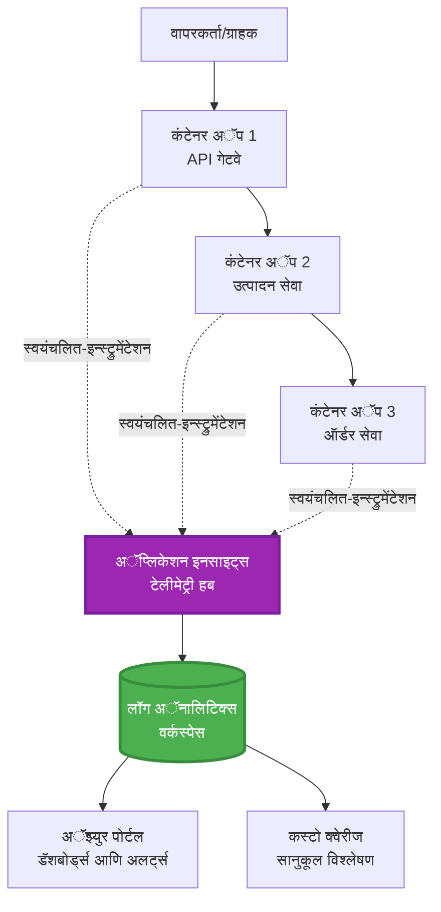
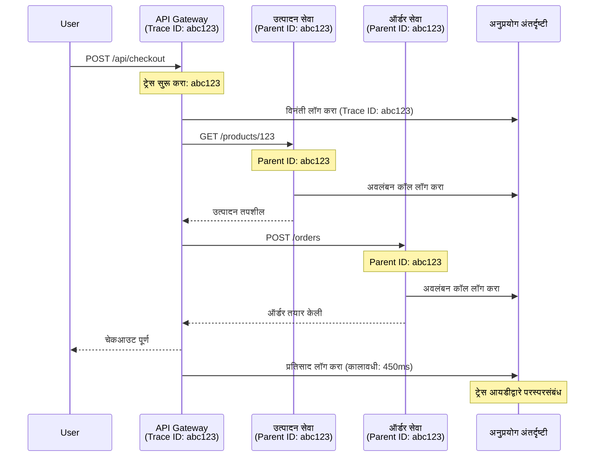

# AZD सह Application Insights एकत्रीकरण

⏱️ **अंदाजे वेळ**: 40-50 मिनिटे | 💰 **खर्चाचा परिणाम**: ~$5-15/महिना | ⭐ **जटिलता**: मध्यम

**📚 शिकण्याचा मार्ग:**
- ← मागील: [Preflight Checks](preflight-checks.md) - प्री-डिप्लॉयमेंट पडताळणी
- 🎯 **तुम्ही येथे आहात**: Application Insights एकत्रीकरण (मॉनिटरिंग, टेलीमेट्री, डीबगिंग)
- → पुढे: [Deployment Guide](../deployment/deployment-guide.md) - Azure वर डिप्लॉय करा
- 🏠 [कोर्स होम](../../README.md)

---

## तुम्ही काय शिकाल

हे धडे पूर्ण करून, तुम्ही:
- AZD प्रकल्पांमध्ये **Application Insights** आपोआप एकत्रित कराल
- मायक्रोसर्व्हिसेससाठी **distributed tracing** कॉन्फिगर कराल
- **कस्टम टेलीमेट्री** (मेट्रिक्स, इव्हेंट्स, डिपेंडन्सीज) लागू कराल
- **लाइव्ह मेट्रिक्स** रिअल-टाइम मॉनिटरिंगसाठी सेट कराल
- AZD डिप्लॉयमेंटमधून **अलर्ट्स आणि डॅशबोर्ड्स** तयार कराल
- **टेलीमेट्री क्वेरीज**सह उत्पादनातील समस्या डीबग कराल
- **खर्च आणि सॅम्पलिंग** धोरणे ऑप्टिमाइझ कराल
- **AI/LLM अॅप्लिकेशन्स** (टोकन्स, लेटन्सी, खर्च) मॉनिटर कराल

## AZD सह Application Insights का महत्त्वाचे आहे

### आव्हान: उत्पादन निरीक्षण

**Application Insights शिवाय:**
```
❌ No visibility into production behavior
❌ Manual log aggregation across services
❌ Reactive debugging (wait for customer complaints)
❌ No performance metrics
❌ Cannot trace requests across services
❌ Unknown failure rates and bottlenecks
```

**Application Insights + AZD सह:**
```
✅ Automatic telemetry collection
✅ Centralized logs from all services
✅ Proactive issue detection
✅ End-to-end request tracing
✅ Performance metrics and insights
✅ Real-time dashboards
✅ AZD provisions everything automatically
```

**उदाहरण**: Application Insights म्हणजे तुमच्या अॅप्लिकेशनसाठी "ब्लॅक बॉक्स" फ्लाइट रेकॉर्डर + कॉकपिट डॅशबोर्डसारखे आहे. तुम्हाला रिअल-टाइममध्ये सर्व काही दिसते आणि कोणतीही घटना पुन्हा प्ले करता येते.

---

## आर्किटेक्चर विहंगावलोकन

### AZD आर्किटेक्चरमधील Application Insights


### आपोआप काय मॉनिटर केले जाते

| टेलीमेट्री प्रकार | काय कॅप्चर करते | उपयोग |
|------------------|------------------|-------|
| **Requests** | HTTP विनंत्या, स्टेटस कोड्स, कालावधी | API कार्यक्षमता मॉनिटरिंग |
| **Dependencies** | बाह्य कॉल्स (DB, APIs, स्टोरेज) | अडथळे ओळखणे |
| **Exceptions** | स्टॅक ट्रेससह न सावरलेले त्रुटी | अपयश डीबग करणे |
| **Custom Events** | व्यवसाय इव्हेंट्स (साइनअप, खरेदी) | विश्लेषण आणि फनेल्स |
| **Metrics** | कार्यक्षमता काउंटर, कस्टम मेट्रिक्स | क्षमता नियोजन |
| **Traces** | गंभीरतेसह लॉग संदेश | डीबगिंग आणि ऑडिटिंग |
| **Availability** | अपटाइम आणि प्रतिसाद वेळ चाचण्या | SLA मॉनिटरिंग |

---

## पूर्वअट

### आवश्यक साधने

```bash
# Azure Developer CLI सत्यापित करा
azd version
# ✅ अपेक्षित: azd आवृत्ती 1.0.0 किंवा उच्च

# Azure CLI सत्यापित करा
az --version
# ✅ अपेक्षित: azure-cli 2.50.0 किंवा उच्च
```

### Azure आवश्यकता

- सक्रिय Azure सदस्यता
- खालील तयार करण्यासाठी परवानग्या:
  - Application Insights संसाधने
  - Log Analytics कार्यक्षेत्रे
  - Container Apps
  - Resource groups

### ज्ञान पूर्वअट

तुम्ही पूर्ण केले पाहिजे:
- [AZD Basics](../getting-started/azd-basics.md) - AZD चे मुख्य संकल्पना
- [Configuration](../getting-started/configuration.md) - वातावरण सेटअप
- [First Project](../getting-started/first-project.md) - मूलभूत डिप्लॉयमेंट

---

## धडा 1: AZD सह Application Insights आपोआप

### AZD Application Insights कसे तयार करते

AZD डिप्लॉय केल्यावर Application Insights आपोआप तयार आणि कॉन्फिगर करते. चला पाहूया कसे.

### प्रकल्प संरचना

```
monitored-app/
├── azure.yaml                     # AZD configuration
├── infra/
│   ├── main.bicep                # Main infrastructure
│   ├── core/
│   │   └── monitoring.bicep      # Application Insights + Log Analytics
│   └── app/
│       └── api.bicep             # Container App with monitoring
└── src/
    ├── app.py                    # Application with telemetry
    ├── requirements.txt
    └── Dockerfile
```

---

### पाऊल 1: AZD कॉन्फिगर करा (azure.yaml)

**फाईल: `azure.yaml`**

```yaml
name: monitored-app
metadata:
  template: monitored-app@1.0.0

services:
  api:
    project: ./src
    language: python
    host: containerapp

# AZD automatically provisions monitoring!
```

**झाले!** AZD Application Insights डिफॉल्टने तयार करेल. मूलभूत मॉनिटरिंगसाठी अतिरिक्त कॉन्फिगरेशनची गरज नाही.

---

### पाऊल 2: मॉनिटरिंग इन्फ्रास्ट्रक्चर (Bicep)

**फाईल: `infra/core/monitoring.bicep`**

```bicep
param logAnalyticsName string
param applicationInsightsName string
param location string = resourceGroup().location
param tags object = {}

// Log Analytics Workspace (required for Application Insights)
resource logAnalytics 'Microsoft.OperationalInsights/workspaces@2022-10-01' = {
  name: logAnalyticsName
  location: location
  tags: tags
  properties: {
    sku: {
      name: 'PerGB2018'  // Pay-as-you-go pricing
    }
    retentionInDays: 30  // Keep logs for 30 days
    features: {
      enableLogAccessUsingOnlyResourcePermissions: true
    }
  }
}

// Application Insights
resource applicationInsights 'Microsoft.Insights/components@2020-02-02' = {
  name: applicationInsightsName
  location: location
  tags: tags
  kind: 'web'
  properties: {
    Application_Type: 'web'
    WorkspaceResourceId: logAnalytics.id
    IngestionMode: 'LogAnalytics'
    publicNetworkAccessForIngestion: 'Enabled'
    publicNetworkAccessForQuery: 'Enabled'
  }
}

// Outputs for Container Apps
output logAnalyticsWorkspaceId string = logAnalytics.id
output logAnalyticsWorkspaceName string = logAnalytics.name
output applicationInsightsConnectionString string = applicationInsights.properties.ConnectionString
output applicationInsightsInstrumentationKey string = applicationInsights.properties.InstrumentationKey
output applicationInsightsName string = applicationInsights.name
```

---

### पाऊल 3: Application Insights शी Container App कनेक्ट करा

**फाईल: `infra/app/api.bicep`**

```bicep
param name string
param location string
param tags object = {}
param containerAppsEnvironmentName string
param applicationInsightsConnectionString string

resource containerApp 'Microsoft.App/containerApps@2023-05-01' = {
  name: name
  location: location
  tags: tags
  properties: {
    configuration: {
      ingress: {
        external: true
        targetPort: 8000
      }
      secrets: [
        {
          name: 'appinsights-connection-string'
          value: applicationInsightsConnectionString
        }
      ]
    }
    template: {
      containers: [
        {
          name: 'api'
          image: 'myregistry.azurecr.io/api:latest'
          resources: {
            cpu: json('0.5')
            memory: '1Gi'
          }
          env: [
            {
              name: 'APPLICATIONINSIGHTS_CONNECTION_STRING'
              secretRef: 'appinsights-connection-string'
            }
            {
              name: 'APPLICATIONINSIGHTS_ENABLED'
              value: 'true'
            }
          ]
        }
      ]
    }
  }
}

output uri string = 'https://${containerApp.properties.configuration.ingress.fqdn}'
```

---

### पाऊल 4: टेलीमेट्रीसह अॅप्लिकेशन कोड

**फाईल: `src/app.py`**

```python
from flask import Flask, request, jsonify
from opencensus.ext.azure.log_exporter import AzureLogHandler
from opencensus.ext.azure.trace_exporter import AzureExporter
from opencensus.ext.flask.flask_middleware import FlaskMiddleware
from opencensus.trace.samplers import ProbabilitySampler
import logging
import os

app = Flask(__name__)

# ऍप्लिकेशन इनसाइट्स कनेक्शन स्ट्रिंग मिळवा
connection_string = os.environ.get('APPLICATIONINSIGHTS_CONNECTION_STRING')

if connection_string:
    # वितरित ट्रेसिंग कॉन्फिगर करा
    middleware = FlaskMiddleware(
        app,
        exporter=AzureExporter(connection_string=connection_string),
        sampler=ProbabilitySampler(rate=1.0)  # विकासासाठी 100% सॅम्पलिंग
    )
    
    # लॉगिंग कॉन्फिगर करा
    logger = logging.getLogger(__name__)
    logger.addHandler(AzureLogHandler(connection_string=connection_string))
    logger.setLevel(logging.INFO)
    
    print("✅ Application Insights enabled")
else:
    logger = logging.getLogger(__name__)
    logger.setLevel(logging.INFO)
    print("⚠️ Application Insights not configured")

@app.route('/health')
def health():
    logger.info('Health check endpoint called')
    return jsonify({'status': 'healthy', 'monitoring': 'enabled'})

@app.route('/api/products')
def get_products():
    logger.info('Fetching products')
    
    # डेटाबेस कॉलचे अनुकरण करा (स्वयंचलितपणे अवलंबित्व म्हणून ट्रॅक केले जाते)
    products = [
        {'id': 1, 'name': 'Laptop', 'price': 999.99},
        {'id': 2, 'name': 'Mouse', 'price': 29.99},
        {'id': 3, 'name': 'Keyboard', 'price': 79.99}
    ]
    
    logger.info(f'Returned {len(products)} products')
    return jsonify(products)

@app.route('/api/error-test')
def error_test():
    """Test error tracking"""
    logger.error('Testing error tracking')
    try:
        raise ValueError('This is a test exception')
    except Exception as e:
        logger.exception('Exception occurred in error-test endpoint')
        return jsonify({'error': str(e)}), 500

@app.route('/api/slow')
def slow_endpoint():
    """Test performance tracking"""
    import time
    logger.info('Slow endpoint called')
    time.sleep(3)  # धीम्या ऑपरेशनचे अनुकरण करा
    logger.warning('Endpoint took 3 seconds to respond')
    return jsonify({'message': 'Slow operation completed'})

if __name__ == '__main__':
    app.run(host='0.0.0.0', port=8000)
```

**फाईल: `src/requirements.txt`**

```txt
Flask==3.0.0
opencensus-ext-azure==1.1.13
opencensus-ext-flask==0.8.1
gunicorn==21.2.0
```

---

### पाऊल 5: डिप्लॉय करा आणि पडताळा करा

```bash
# AZD प्रारंभ करा
azd init

# तैनात करा (स्वयंचलितपणे Application Insights प्रदान करते)
azd up

# अॅप URL मिळवा
APP_URL=$(azd env get-values | grep API_URL | cut -d '=' -f2 | tr -d '"')

# टेलिमेट्री तयार करा
curl $APP_URL/health
curl $APP_URL/api/products
curl $APP_URL/api/error-test
curl $APP_URL/api/slow
```

**✅ अपेक्षित आउटपुट:**
```json
{
  "status": "healthy",
  "monitoring": "enabled"
}
```

---

### पाऊल 6: Azure पोर्टलमध्ये टेलीमेट्री पहा

```bash
# ऍप्लिकेशन इनसाइट्स तपशील मिळवा
azd env get-values | grep APPLICATIONINSIGHTS

# Azure पोर्टलमध्ये उघडा
az monitor app-insights component show \
  --app $(azd env get-values | grep APPLICATIONINSIGHTS_NAME | cut -d '=' -f2 | tr -d '"') \
  --resource-group $(azd env get-values | grep AZURE_RESOURCE_GROUP | cut -d '=' -f2 | tr -d '"') \
  --query "appId" -o tsv
```

**Azure पोर्टल → Application Insights → Transaction Search वर जा**

तुम्हाला दिसेल:
- ✅ HTTP विनंत्या स्टेटस कोडसह
- ✅ विनंती कालावधी (`/api/slow` साठी 3+ सेकंद)
- ✅ `/api/error-test` मधील अपवाद तपशील
- ✅ कस्टम लॉग संदेश

---

## धडा 2: कस्टम टेलीमेट्री आणि इव्हेंट्स

### व्यवसाय इव्हेंट्स ट्रॅक करा

व्यवसायासाठी महत्त्वाच्या इव्हेंट्ससाठी कस्टम टेलीमेट्री जोडा.

**फाईल: `src/telemetry.py`**

```python
from opencensus.ext.azure import metrics_exporter
from opencensus.stats import aggregation as aggregation_module
from opencensus.stats import measure as measure_module
from opencensus.stats import stats as stats_module
from opencensus.stats import view as view_module
from opencensus.tags import tag_map as tag_map_module
from opencensus.ext.azure.log_exporter import AzureLogHandler
from opencensus.ext.azure.trace_exporter import AzureExporter
from opencensus.trace import tracer as tracer_module
import logging
import os

class TelemetryClient:
    """Custom telemetry client for Application Insights"""
    
    def __init__(self, connection_string=None):
        self.connection_string = connection_string or os.environ.get('APPLICATIONINSIGHTS_CONNECTION_STRING')
        
        if not self.connection_string:
            print("⚠️ Application Insights connection string not found")
            return
        
        # लॉगर सेटअप करा
        self.logger = logging.getLogger(__name__)
        self.logger.addHandler(AzureLogHandler(connection_string=self.connection_string))
        self.logger.setLevel(logging.INFO)
        
        # मेट्रिक्स निर्यातक सेटअप करा
        self.stats = stats_module.stats
        self.view_manager = self.stats.view_manager
        self.stats_recorder = self.stats.stats_recorder
        
        exporter = metrics_exporter.new_metrics_exporter(
            connection_string=self.connection_string
        )
        self.view_manager.register_exporter(exporter)
        
        # ट्रेसर सेटअप करा
        self.tracer = tracer_module.Tracer(
            exporter=AzureExporter(connection_string=self.connection_string)
        )
        
        print("✅ Custom telemetry client initialized")
    
    def track_event(self, event_name: str, properties: dict = None):
        """Track custom business event"""
        properties = properties or {}
        self.logger.info(
            f"CustomEvent: {event_name}",
            extra={
                'custom_dimensions': {
                    'event_name': event_name,
                    **properties
                }
            }
        )
    
    def track_metric(self, metric_name: str, value: float, properties: dict = None):
        """Track custom metric"""
        properties = properties or {}
        self.logger.info(
            f"CustomMetric: {metric_name} = {value}",
            extra={
                'custom_dimensions': {
                    'metric_name': metric_name,
                    'value': value,
                    **properties
                }
            }
        )
    
    def track_dependency(self, name: str, dependency_type: str, duration: float, success: bool):
        """Track external dependency call"""
        with self.tracer.span(name=name) as span:
            span.add_attribute('dependency.type', dependency_type)
            span.add_attribute('duration', duration)
            span.add_attribute('success', success)

# ग्लोबल टेलीमेट्री क्लायंट
telemetry = TelemetryClient()
```

### कस्टम इव्हेंट्ससह अॅप्लिकेशन अपडेट करा

**फाईल: `src/app.py` (वाढवलेले)**

```python
from flask import Flask, request, jsonify
from telemetry import telemetry
import time
import random

app = Flask(__name__)

@app.route('/api/purchase', methods=['POST'])
def purchase():
    """Track purchase event with custom telemetry"""
    data = request.json
    product_id = data.get('product_id')
    quantity = data.get('quantity', 1)
    price = data.get('price', 0)
    
    # व्यवसाय इव्हेंट ट्रॅक करा
    telemetry.track_event('Purchase', {
        'product_id': product_id,
        'quantity': quantity,
        'total_amount': price * quantity,
        'user_id': request.headers.get('X-User-Id', 'anonymous')
    })
    
    # महसूल मेट्रिक ट्रॅक करा
    telemetry.track_metric('Revenue', price * quantity, {
        'product_id': product_id,
        'currency': 'USD'
    })
    
    return jsonify({
        'order_id': f'ORD-{random.randint(1000, 9999)}',
        'status': 'confirmed',
        'total': price * quantity
    })

@app.route('/api/search')
def search():
    """Track search queries"""
    query = request.args.get('q', '')
    
    start_time = time.time()
    
    # शोधाची अनुकरण करा (खरी डेटाबेस क्वेरी असेल)
    results = [{'id': 1, 'name': f'Result for {query}'}]
    
    duration = (time.time() - start_time) * 1000  # मिलिसेकंदांमध्ये रूपांतर करा
    
    # शोध इव्हेंट ट्रॅक करा
    telemetry.track_event('Search', {
        'query': query,
        'results_count': len(results),
        'duration_ms': duration
    })
    
    # शोध कार्यक्षमता मेट्रिक ट्रॅक करा
    telemetry.track_metric('SearchDuration', duration, {
        'query_length': len(query)
    })
    
    return jsonify({'results': results, 'count': len(results)})

@app.route('/api/external-call')
def external_call():
    """Track external API dependency"""
    import requests
    
    start_time = time.time()
    success = True
    
    try:
        # बाह्य API कॉलचे अनुकरण करा
        response = requests.get('https://api.example.com/data', timeout=5)
        result = response.json()
    except Exception as e:
        success = False
        result = {'error': str(e)}
    
    duration = (time.time() - start_time) * 1000
    
    # अवलंबित्व ट्रॅक करा
    telemetry.track_dependency(
        name='ExternalAPI',
        dependency_type='HTTP',
        duration=duration,
        success=success
    )
    
    return jsonify(result)

if __name__ == '__main__':
    app.run(host='0.0.0.0', port=8000)
```

### कस्टम टेलीमेट्री चाचणी

```bash
# खरेदी इव्हेंट ट्रॅक करा
curl -X POST $APP_URL/api/purchase \
  -H "Content-Type: application/json" \
  -H "X-User-Id: user123" \
  -d '{"product_id": 1, "quantity": 2, "price": 29.99}'

# शोध इव्हेंट ट्रॅक करा
curl "$APP_URL/api/search?q=laptop"

# बाह्य अवलंबित्व ट्रॅक करा
curl $APP_URL/api/external-call
```

**Azure पोर्टलमध्ये पहा:**

Application Insights → Logs वर जा, नंतर चालवा:

```kusto
// View purchase events
traces
| where customDimensions.event_name == "Purchase"
| project 
    timestamp,
    product_id = tostring(customDimensions.product_id),
    total_amount = todouble(customDimensions.total_amount),
    user_id = tostring(customDimensions.user_id)
| order by timestamp desc

// View revenue metrics
traces
| where customDimensions.metric_name == "Revenue"
| summarize TotalRevenue = sum(todouble(customDimensions.value)) by bin(timestamp, 1h)
| render timechart

// View search performance
traces
| where customDimensions.event_name == "Search"
| summarize 
    AvgDuration = avg(todouble(customDimensions.duration_ms)),
    SearchCount = count()
  by bin(timestamp, 5m)
| render timechart
```

---

## धडा 3: मायक्रोसर्व्हिसेससाठी Distributed Tracing

### क्रॉस-सर्व्हिस ट्रेसिंग सक्षम करा

मायक्रोसर्व्हिसेससाठी, Application Insights विनंत्या आपोआप सेवांमध्ये जोडते.

**फाईल: `infra/main.bicep`**

```bicep
targetScope = 'subscription'

param environmentName string
param location string = 'eastus'

var tags = { 'azd-env-name': environmentName }

resource rg 'Microsoft.Resources/resourceGroups@2021-04-01' = {
  name: 'rg-${environmentName}'
  location: location
  tags: tags
}

// Monitoring (shared by all services)
module monitoring './core/monitoring.bicep' = {
  name: 'monitoring'
  scope: rg
  params: {
    logAnalyticsName: 'log-${environmentName}'
    applicationInsightsName: 'appi-${environmentName}'
    location: location
    tags: tags
  }
}

// API Gateway
module apiGateway './app/api-gateway.bicep' = {
  name: 'api-gateway'
  scope: rg
  params: {
    name: 'ca-gateway-${environmentName}'
    location: location
    tags: union(tags, { 'azd-service-name': 'gateway' })
    applicationInsightsConnectionString: monitoring.outputs.applicationInsightsConnectionString
  }
}

// Product Service
module productService './app/product-service.bicep' = {
  name: 'product-service'
  scope: rg
  params: {
    name: 'ca-products-${environmentName}'
    location: location
    tags: union(tags, { 'azd-service-name': 'products' })
    applicationInsightsConnectionString: monitoring.outputs.applicationInsightsConnectionString
  }
}

// Order Service
module orderService './app/order-service.bicep' = {
  name: 'order-service'
  scope: rg
  params: {
    name: 'ca-orders-${environmentName}'
    location: location
    tags: union(tags, { 'azd-service-name': 'orders' })
    applicationInsightsConnectionString: monitoring.outputs.applicationInsightsConnectionString
  }
}

output APPLICATIONINSIGHTS_CONNECTION_STRING string = monitoring.outputs.applicationInsightsConnectionString
output GATEWAY_URL string = apiGateway.outputs.uri
```

### एंड-टू-एंड व्यवहार पहा


**एंड-टू-एंड ट्रेस क्वेरी करा:**

```kusto
// Find complete request flow
let traceId = "abc123...";  // Get from response header
dependencies
| union requests
| where operation_Id == traceId
| project 
    timestamp,
    type = itemType,
    name,
    duration,
    success,
    cloud_RoleName
| order by timestamp asc
```

---

## धडा 4: लाइव्ह मेट्रिक्स आणि रिअल-टाइम मॉनिटरिंग

### लाइव्ह मेट्रिक्स स्ट्रीम सक्षम करा

लाइव्ह मेट्रिक्स <1 सेकंद विलंबासह रिअल-टाइम टेलीमेट्री प्रदान करते.

**लाइव्ह मेट्रिक्स प्रवेश:**

```bash
# ऍप्लिकेशन इनसाइट्स संसाधन मिळवा
APPI_NAME=$(azd env get-values | grep APPLICATIONINSIGHTS_NAME | cut -d '=' -f2 | tr -d '"')

# संसाधन गट मिळवा
RG_NAME=$(azd env get-values | grep AZURE_RESOURCE_GROUP | cut -d '=' -f2 | tr -d '"')

echo "Navigate to: Azure Portal → Resource Groups → $RG_NAME → $APPI_NAME → Live Metrics"
```

**तुम्हाला रिअल-टाइममध्ये दिसेल:**
- ✅ येणाऱ्या विनंत्यांचा दर (requests/sec)
- ✅ बाहेर जाणारे डिपेंडन्सी कॉल्स
- ✅ अपवाद संख्या
- ✅ CPU आणि मेमरी वापर
- ✅ सक्रिय सर्व्हर संख्या
- ✅ नमुना टेलीमेट्री

### चाचणीसाठी लोड तयार करा

```bash
# लाइव्ह मेट्रिक्स पाहण्यासाठी लोड तयार करा
for i in {1..100}; do
  curl $APP_URL/api/products &
  curl $APP_URL/api/search?q=test$i &
done

# Azure पोर्टलमध्ये लाइव्ह मेट्रिक्स पहा
# तुम्हाला विनंती दर वाढताना दिसेल
```

---

## व्यावहारिक सराव

### सराव 1: अलर्ट्स सेट करा ⭐⭐ (मध्यम)

**उद्दिष्ट**: उच्च त्रुटी दर आणि धीमे प्रतिसादांसाठी अलर्ट तयार करा.

**पावले:**

1. **त्रुटी दरासाठी अलर्ट तयार करा:**

```bash
# अनुप्रयोग अंतर्दृष्टी संसाधन आयडी मिळवा
APPI_ID=$(az monitor app-insights component show \
  --app $APPI_NAME \
  --resource-group $RG_NAME \
  --query "id" -o tsv)

# अयशस्वी विनंत्यांसाठी मेट्रिक अलर्ट तयार करा
az monitor metrics alert create \
  --name "High-Error-Rate" \
  --resource-group $RG_NAME \
  --scopes $APPI_ID \
  --condition "count requests/failed > 10" \
  --window-size 5m \
  --evaluation-frequency 1m \
  --description "Alert when error rate exceeds 10 per 5 minutes"
```

2. **धीमे प्रतिसादांसाठी अलर्ट तयार करा:**

```bash
az monitor metrics alert create \
  --name "Slow-Responses" \
  --resource-group $RG_NAME \
  --scopes $APPI_ID \
  --condition "avg requests/duration > 3000" \
  --window-size 5m \
  --evaluation-frequency 1m \
  --description "Alert when average response time exceeds 3 seconds"
```

3. **Bicep द्वारे अलर्ट तयार करा (AZD साठी प्राधान्य):**

**फाईल: `infra/core/alerts.bicep`**

```bicep
param applicationInsightsId string
param actionGroupId string = ''
param location string = resourceGroup().location

// High error rate alert
resource errorRateAlert 'Microsoft.Insights/metricAlerts@2018-03-01' = {
  name: 'high-error-rate'
  location: 'global'
  properties: {
    description: 'Alert when error rate exceeds threshold'
    severity: 2
    enabled: true
    scopes: [
      applicationInsightsId
    ]
    evaluationFrequency: 'PT1M'
    windowSize: 'PT5M'
    criteria: {
      'odata.type': 'Microsoft.Azure.Monitor.SingleResourceMultipleMetricCriteria'
      allOf: [
        {
          name: 'Error rate'
          metricName: 'requests/failed'
          operator: 'GreaterThan'
          threshold: 10
          timeAggregation: 'Count'
        }
      ]
    }
    actions: actionGroupId != '' ? [
      {
        actionGroupId: actionGroupId
      }
    ] : []
  }
}

// Slow response alert
resource slowResponseAlert 'Microsoft.Insights/metricAlerts@2018-03-01' = {
  name: 'slow-responses'
  location: 'global'
  properties: {
    description: 'Alert when response time is too high'
    severity: 3
    enabled: true
    scopes: [
      applicationInsightsId
    ]
    evaluationFrequency: 'PT1M'
    windowSize: 'PT5M'
    criteria: {
      'odata.type': 'Microsoft.Azure.Monitor.SingleResourceMultipleMetricCriteria'
      allOf: [
        {
          name: 'Response duration'
          metricName: 'requests/duration'
          operator: 'GreaterThan'
          threshold: 3000
          timeAggregation: 'Average'
        }
      ]
    }
  }
}

output errorAlertId string = errorRateAlert.id
output slowResponseAlertId string = slowResponseAlert.id
```

4. **अलर्ट्स चाचणी करा:**

```bash
# त्रुटी निर्माण करा
for i in {1..20}; do
  curl $APP_URL/api/error-test
done

# मंद प्रतिसाद निर्माण करा
for i in {1..10}; do
  curl $APP_URL/api/slow
done

# अलर्ट स्थिती तपासा (५-१० मिनिटे प्रतीक्षा करा)
az monitor metrics alert list \
  --resource-group $RG_NAME \
  --query "[].{Name:name, Enabled:enabled, State:properties.enabled}" \
  --output table
```

**✅ यश निकष:**
- ✅ अलर्ट्स यशस्वीरित्या तयार झाले
- ✅ थ्रेशोल्ड ओलांडल्यावर अलर्ट्स फायर होतात
- ✅ Azure पोर्टलमध्ये अलर्ट इतिहास पाहता येतो
- ✅ AZD डिप्लॉयमेंटसह एकत्रित

**वेळ**: 20-25 मिनिटे

---

### सराव 2: कस्टम डॅशबोर्ड तयार करा ⭐⭐ (मध्यम)

**उद्दिष्ट**: मुख्य अॅप्लिकेशन मेट्रिक्स दर्शविणारा डॅशबोर्ड तयार करा.

**पावले:**

1. **Azure पोर्टलद्वारे डॅशबोर्ड तयार करा:**

Azure पोर्टल → Dashboards → New Dashboard वर जा

2. **मुख्य मेट्रिक्ससाठी टाइल्स जोडा:**

- मागील 24 तासांतील विनंती संख्या
- सरासरी प्रतिसाद वेळ
- त्रुटी दर
- टॉप 5 धीमे ऑपरेशन्स
- वापरकर्त्यांचे भौगोलिक वितरण

3. **Bicep द्वारे डॅशबोर्ड तयार करा:**

**फाईल: `infra/core/dashboard.bicep`**

```bicep
param dashboardName string
param applicationInsightsId string
param location string = resourceGroup().location

resource dashboard 'Microsoft.Portal/dashboards@2020-09-01-preview' = {
  name: dashboardName
  location: location
  properties: {
    lenses: [
      {
        order: 0
        parts: [
          // Request count
          {
            position: { x: 0, y: 0, rowSpan: 4, colSpan: 6 }
            metadata: {
              type: 'Extension/Microsoft_OperationsManagementSuite_Workspace/PartType/LogsDashboardPart'
              inputs: [
                {
                  name: 'resourceId'
                  value: applicationInsightsId
                }
                {
                  name: 'query'
                  value: '''
                    requests
                    | summarize RequestCount = count() by bin(timestamp, 1h)
                    | render timechart
                  '''
                }
              ]
            }
          }
          // Error rate
          {
            position: { x: 6, y: 0, rowSpan: 4, colSpan: 6 }
            metadata: {
              type: 'Extension/Microsoft_OperationsManagementSuite_Workspace/PartType/LogsDashboardPart'
              inputs: [
                {
                  name: 'resourceId'
                  value: applicationInsightsId
                }
                {
                  name: 'query'
                  value: '''
                    requests
                    | summarize 
                        Total = count(),
                        Failed = countif(success == false)
                    | extend ErrorRate = (Failed * 100.0) / Total
                    | project ErrorRate
                  '''
                }
              ]
            }
          }
        ]
      }
    ]
  }
}

output dashboardId string = dashboard.id
```

4. **डॅशबोर्ड डिप्लॉय करा:**

```bash
# मुख्य.bicep मध्ये जोडा
module dashboard './core/dashboard.bicep' = {
  name: 'dashboard'
  scope: rg
  params: {
    dashboardName: 'dashboard-${environmentName}'
    applicationInsightsId: monitoring.outputs.applicationInsightsId
    location: location
  }
}

# तैनात करा
azd up
```

**✅ यश निकष:**
- ✅ डॅशबोर्ड मुख्य मेट्रिक्स दर्शवतो
- ✅ Azure पोर्टल होमवर पिन करता येतो
- ✅ रिअल-टाइममध्ये अपडेट होतो
- ✅ AZD द्वारे डिप्लॉय करण्यायोग्य

**वेळ**: 25-30 मिनिटे

---

### सराव 3: AI/LLM अॅप्लिकेशन मॉनिटर करा ⭐⭐⭐ (प्रगत)

**उद्दिष्ट**: Azure OpenAI वापर (टोकन्स, खर्च, लेटन्सी) ट्रॅक करा.

**पावले:**

1. **AI मॉनिटरिंग रॅपर तयार करा:**

**फाईल: `src/ai_telemetry.py`**

```python
from telemetry import telemetry
from openai import AzureOpenAI
import time

class MonitoredAzureOpenAI:
    """Azure OpenAI client with automatic telemetry"""
    
    def __init__(self, api_key, endpoint, api_version="2024-02-01"):
        self.client = AzureOpenAI(
            api_key=api_key,
            api_version=api_version,
            azure_endpoint=endpoint
        )
    
    def chat_completion(self, model: str, messages: list, **kwargs):
        """Track chat completion with telemetry"""
        start_time = time.time()
        
        try:
            # Azure OpenAI ला कॉल करा
            response = self.client.chat.completions.create(
                model=model,
                messages=messages,
                **kwargs
            )
            
            duration = (time.time() - start_time) * 1000  # एमएस
            
            # वापर काढा
            usage = response.usage
            prompt_tokens = usage.prompt_tokens
            completion_tokens = usage.completion_tokens
            total_tokens = usage.total_tokens
            
            # खर्चाची गणना करा (GPT-4 किंमत)
            prompt_cost = (prompt_tokens / 1000) * 0.03  # $0.03 प्रति 1K टोकन्स
            completion_cost = (completion_tokens / 1000) * 0.06  # $0.06 प्रति 1K टोकन्स
            total_cost = prompt_cost + completion_cost
            
            # सानुकूल इव्हेंट ट्रॅक करा
            telemetry.track_event('OpenAI_Request', {
                'model': model,
                'prompt_tokens': prompt_tokens,
                'completion_tokens': completion_tokens,
                'total_tokens': total_tokens,
                'duration_ms': duration,
                'cost_usd': total_cost,
                'success': True
            })
            
            # मेट्रिक्स ट्रॅक करा
            telemetry.track_metric('OpenAI_Tokens', total_tokens, {
                'model': model,
                'type': 'total'
            })
            
            telemetry.track_metric('OpenAI_Cost', total_cost, {
                'model': model,
                'currency': 'USD'
            })
            
            telemetry.track_metric('OpenAI_Duration', duration, {
                'model': model
            })
            
            return response
            
        except Exception as e:
            duration = (time.time() - start_time) * 1000
            
            telemetry.track_event('OpenAI_Request', {
                'model': model,
                'duration_ms': duration,
                'success': False,
                'error': str(e)
            })
            
            raise
```

2. **मॉनिटर केलेला क्लायंट वापरा:**

```python
from flask import Flask, request, jsonify
from ai_telemetry import MonitoredAzureOpenAI
import os

app = Flask(__name__)

# मॉनिटर केलेला OpenAI क्लायंट प्रारंभ करा
openai_client = MonitoredAzureOpenAI(
    api_key=os.environ['AZURE_OPENAI_API_KEY'],
    endpoint=os.environ['AZURE_OPENAI_ENDPOINT']
)

@app.route('/api/chat', methods=['POST'])
def chat():
    data = request.json
    user_message = data.get('message')
    
    # स्वयंचलित मॉनिटरिंगसह कॉल करा
    response = openai_client.chat_completion(
        model='gpt-4',
        messages=[
            {'role': 'user', 'content': user_message}
        ]
    )
    
    return jsonify({
        'response': response.choices[0].message.content,
        'tokens': response.usage.total_tokens
    })
```

3. **AI मेट्रिक्स क्वेरी करा:**

```kusto
// Total AI spend over time
traces
| where customDimensions.event_name == "OpenAI_Request"
| where customDimensions.success == "True"
| summarize TotalCost = sum(todouble(customDimensions.cost_usd)) by bin(timestamp, 1h)
| render timechart

// Token usage by model
traces
| where customDimensions.event_name == "OpenAI_Request"
| summarize 
    TotalTokens = sum(toint(customDimensions.total_tokens)),
    RequestCount = count()
  by Model = tostring(customDimensions.model)

// Average latency
traces
| where customDimensions.event_name == "OpenAI_Request"
| summarize AvgDuration = avg(todouble(customDimensions.duration_ms))
| project AvgDurationSeconds = AvgDuration / 1000

// Cost per request
traces
| where customDimensions.event_name == "OpenAI_Request"
| extend Cost = todouble(customDimensions.cost_usd)
| summarize 
    TotalCost = sum(Cost),
    RequestCount = count(),
    AvgCostPerRequest = avg(Cost)
```

**✅ यश निकष:**
- ✅ प्रत्येक OpenAI कॉल आपोआप ट्रॅक होतो
- ✅ टोकन वापर आणि खर्च दिसतो
- ✅ लेटन्सी मॉनिटर होते
- ✅ बजेट अलर्ट्स सेट करता येतात

**वेळ**: 35-45 मिनिटे

---

## खर्च ऑप्टिमायझेशन

### सॅम्पलिंग धोरणे

टेलीमेट्रीचे सॅम्पलिंग करून खर्च नियंत्रित करा:

```python
from opencensus.trace.samplers import ProbabilitySampler

# विकास: 100% नमुना
sampler = ProbabilitySampler(rate=1.0)

# उत्पादन: 10% नमुना (खर्च 90% कमी करा)
sampler = ProbabilitySampler(rate=0.1)

# अनुकूली नमुना (स्वतःहून समायोजित होते)
from opencensus.trace.samplers import AdaptiveSampler
sampler = AdaptiveSampler()
```

**Bicep मध्ये:**

```bicep
resource applicationInsights 'Microsoft.Insights/components@2020-02-02' = {
  name: applicationInsightsName
  properties: {
    SamplingPercentage: 10  // 10% sampling
  }
}
```

### डेटा धारणा

```bicep
resource logAnalytics 'Microsoft.OperationalInsights/workspaces@2022-10-01' = {
  name: logAnalyticsName
  properties: {
    retentionInDays: 30  // Minimum (cheapest)
    // Options: 30, 31, 60, 90, 120, 180, 270, 365, 550, 730
  }
}
```

### मासिक खर्च अंदाज

| डेटा खंड | धारणा | मासिक खर्च |
|----------|-------|------------|
| 1 GB/महिना | 30 दिवस | ~$2-5 |
| 5 GB/महिना | 30 दिवस | ~$10-15 |
| 10 GB/महिना | 90 दिवस | ~$25-40 |
| 50 GB/महिना | 90 दिवस | ~$100-150 |

**फ्री टियर**: 5 GB/महिना समाविष्ट

---

## ज्ञान तपासणी

### 1. मूलभूत एकत्रीकरण ✓

तुमचे ज्ञान तपासा:

- [ ] **प्रश्न 1**: AZD Application Insights कसे तयार करते?
  - **उत्तर**: `infra/core/monitoring.bicep` मधील Bicep टेम्पलेट्सद्वारे आपोआप

- [ ] **प्रश्न 2**: कोणता पर्यावरणीय व्हेरिएबल Application Insights सक्षम करतो?
  - **उत्तर**: `APPLICATIONINSIGHTS_CONNECTION_STRING`

- [ ] **प्रश्न 3**: तीन मुख्य टेलीमेट्री प्रकार कोणते आहेत?
  - **उत्तर**: Requests (HTTP कॉल्स), Dependencies (बाह्य कॉल्स), Exceptions (त्रुटी)

**हँड्स-ऑन पडताळणी:**
```bash
# तपासा की Application Insights कॉन्फिगर केले आहे
azd env get-values | grep APPLICATIONINSIGHTS

# तपासा की टेलीमेट्री प्रवाहित होत आहे
az monitor app-insights metrics show \
  --app $APPI_NAME \
  --resource-group $RG_NAME \
  --metric "requests/count"
```

---

### 2. कस्टम टेलीमेट्री ✓

तुमचे ज्ञान तपासा:

- [ ] **प्रश्न 1**: तुम्ही कस्टम व्यवसाय इव्हेंट्स कसे ट्रॅक करता?
  - **उत्तर**: `custom_dimensions` किंवा `TelemetryClient.track_event()` सह लॉगर वापरा

- [ ] **प्रश्न 2**: इव्हेंट्स आणि मेट्रिक्समध्ये काय फरक आहे?
  - **उत्तर**: इव्हेंट्स म्हणजे विशिष्ट घटना, मेट्रिक्स म्हणजे संख्यात्मक मोजमाप

- [ ] **प्रश्न 3**: तुम्ही सेवांमध्ये टेलीमेट्री कसे जोडता?
  - **उत्तर**: Application Insights आपोआप `operation_Id` वापरते

**हँड्स-ऑन पडताळणी:**
```kusto
// Verify custom events
traces
| where customDimensions.event_name != ""
| summarize count() by tostring(customDimensions.event_name)
```

---

### 3. उत्पादन मॉनिटरिंग ✓

तुमचे ज्ञान तपासा:

- [ ] **प्रश्न 1**: सॅम्पलिंग म्हणजे काय आणि ते का वापरावे?
  - **उत्तर**: सॅम्पलिंग डेटा खंड (आणि खर्च) कमी करते फक्त टक्केवारी टेलीमेट्री कॅप्चर करून

- [ ] **प्रश्न 2**: तुम्ही अलर्ट्स कसे सेट करता?
  - **उत्तर**: Application Insights मेट्रिक्सवर आधारित Bicep किंवा Azure पोर्टलमध्ये मेट्रिक अलर्ट्स वापरा

- [ ] **प्रश्न 3**: Log Analytics आणि Application Insights यामध्ये काय फरक आहे?
  - **उत्तर**: Application Insights डेटा Log Analytics कार्यक्षेत्रात साठवते; App Insights अॅप्लिकेशन-विशिष्ट दृश्ये प्रदान करते

**हँड्स-ऑन पडताळणी:**
```bash
# नमुना कॉन्फिगरेशन तपासा
az monitor app-insights component show \
  --app $APPI_NAME \
  --resource-group $RG_NAME \
  --query "properties.SamplingPercentage"
```

---

## सर्वोत्तम पद्धती

### ✅ करा:

1. **संबंध आयडी वापरा**
   ```python
   logger.info('Processing order', extra={
       'custom_dimensions': {
           'order_id': order_id,
           'user_id': user_id
       }
   })
   ```

2. **महत्त्वाच्या मेट्रिक्ससाठी अलर्ट्स सेट करा**
   ```bicep
   // Error rate, slow responses, availability
   ```

3. **संरचित लॉगिंग वापरा**
   ```python
   # ✅ चांगले: संरचित
   logger.info('User signup', extra={'custom_dimensions': {'user_id': 123}})
   
   # ❌ वाईट: असंरचित
   logger.info(f'User 123 signed up')
   ```

4. **डिपेंडन्सीज मॉनिटर करा**
   ```python
   # स्वयंचलितपणे डेटाबेस कॉल्स, HTTP विनंत्या इत्यादींचा मागोवा घ्या.
   ```

5. **डिप्लॉयमेंट दरम्यान लाइव्ह मेट्रिक्स वापरा**

### ❌ करू नका:

1. **संवेदनशील डेटा लॉग करू नका**
   ```python
   # ❌ वाईट
   logger.info(f'Login: {username}:{password}')
   
   # ✅ चांगले
   logger.info('Login attempt', extra={'custom_dimensions': {'username': username}})
   ```

2. **उत्पादनात 100% सॅम्पलिंग वापरू नका**
   ```python
   # ❌ महाग
   sampler = ProbabilitySampler(rate=1.0)
   
   # ✅ खर्च-प्रभावी
   sampler = ProbabilitySampler(rate=0.1)
   ```

3. **डेड लेटर क्यूज दुर्लक्ष करू नका**

4. **डेटा धारणा मर्यादा सेट करायला विसरू नका**

---

## समस्या निवारण

### समस्या: टेलीमेट्री दिसत नाही

**निदान:**
```bash
# कनेक्शन स्ट्रिंग सेट आहे का ते तपासा
azd env get-values | grep APPLICATIONINSIGHTS

# अनुप्रयोग लॉग्स तपासा
azd logs api --tail 50
```

**उपाय:**
```bash
# कंटेनर अ‍ॅपमध्ये कनेक्शन स्ट्रिंग सत्यापित करा
az containerapp show \
  --name $APP_NAME \
  --resource-group $RG_NAME \
  --query "properties.template.containers[0].env" \
  | grep -i applicationinsights
```

---

### समस्या: उच्च खर्च

**निदान:**
```bash
# डेटा इनजेशन तपासा
az monitor app-insights metrics show \
  --app $APPI_NAME \
  --resource-group $RG_NAME \
  --metric "availabilityResults/count"
```

**उपाय:**
- सॅम्पलिंग दर कमी करा
- धारणा कालावधी कमी करा
- विस्तृत लॉगिंग काढा

---

## अधिक जाणून घ्या

### अधिकृत दस्तऐवज
- [Application Insights Overview](https://learn.microsoft.com/azure/azure-monitor/app/app-insights-overview)
- [Application Insights for Python](https://learn.microsoft.com/azure/azure-monitor/app/opencensus-python)
- [Kusto Query Language](https://learn.microsoft.com/azure/data-explorer/kusto/query/)
- [AZD Monitoring](https://learn.microsoft.com/azure/developer/azure-developer-cli/monitor-your-app)

### या कोर्समधील पुढील पावले
- ← मागील: [Preflight Checks](preflight-checks.md)
- → पुढे: [Deployment Guide](../deployment/deployment-guide.md)
- 🏠 [कोर्स होम](../../README.md)

### संबंधित उदाहरणे
- [Azure OpenAI Example](../../../../examples/azure-openai-chat) - AI टेलीमेट्री
- [Microservices Example](../../../../examples/microservices) - Distributed tracing

---

## सारांश

**तुम्ही शिकलात:**
- ✅ AZD सह Application Insights आपोआप तयार करणे
- ✅ कस्टम टेलीमेट्री (इव्हेंट्स, मेट्रिक्स, डिपेंडन्सीज)
- ✅ मायक्रोसर्व्हिसेसमध्ये Distributed tracing
- ✅ लाइव्ह मेट्रिक्स आणि रिअल-टाइम मॉनिटरिंग
- ✅ अलर्ट्स आणि डॅशबोर्ड्स
- ✅ AI/LLM अनुप्रयोग मॉनिटरिंग
- ✅ खर्च कमी करण्याच्या रणनीती

**महत्वाचे मुद्दे:**
1. **AZD स्वयंचलितपणे मॉनिटरिंग प्रदान करते** - कोणत्याही प्रकारच्या मॅन्युअल सेटअपची गरज नाही
2. **संरचित लॉगिंग वापरा** - क्वेरी करणे सोपे होते
3. **व्यवसाय घटना ट्रॅक करा** - फक्त तांत्रिक मेट्रिक्स नाही
4. **AI खर्च मॉनिटर करा** - टोकन्स आणि खर्च ट्रॅक करा
5. **अलर्ट सेट करा** - प्रतिक्रियात्मक होण्याऐवजी सक्रिय व्हा
6. **खर्च कमी करा** - सॅम्पलिंग आणि रिटेन्शन मर्यादा वापरा

**पुढील पावले:**
1. व्यावहारिक सराव पूर्ण करा
2. तुमच्या AZD प्रकल्पांमध्ये Application Insights जोडा
3. तुमच्या टीमसाठी सानुकूल डॅशबोर्ड तयार करा
4. [Deployment Guide](../deployment/deployment-guide.md) शिकून घ्या

---

<!-- CO-OP TRANSLATOR DISCLAIMER START -->
**अस्वीकरण**:  
हा दस्तऐवज AI भाषांतर सेवा [Co-op Translator](https://github.com/Azure/co-op-translator) वापरून भाषांतरित करण्यात आला आहे. आम्ही अचूकतेसाठी प्रयत्नशील असलो तरी, कृपया लक्षात ठेवा की स्वयंचलित भाषांतरांमध्ये त्रुटी किंवा अचूकतेचा अभाव असू शकतो. मूळ भाषेतील दस्तऐवज हा अधिकृत स्रोत मानला जावा. महत्त्वाच्या माहितीसाठी व्यावसायिक मानवी भाषांतराची शिफारस केली जाते. या भाषांतराचा वापर करून उद्भवलेल्या कोणत्याही गैरसमज किंवा चुकीच्या अर्थासाठी आम्ही जबाबदार राहणार नाही.
<!-- CO-OP TRANSLATOR DISCLAIMER END -->