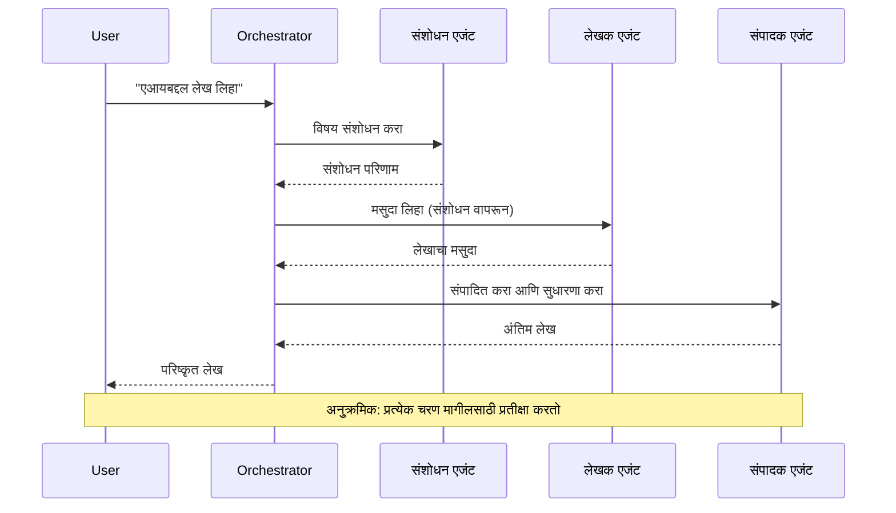
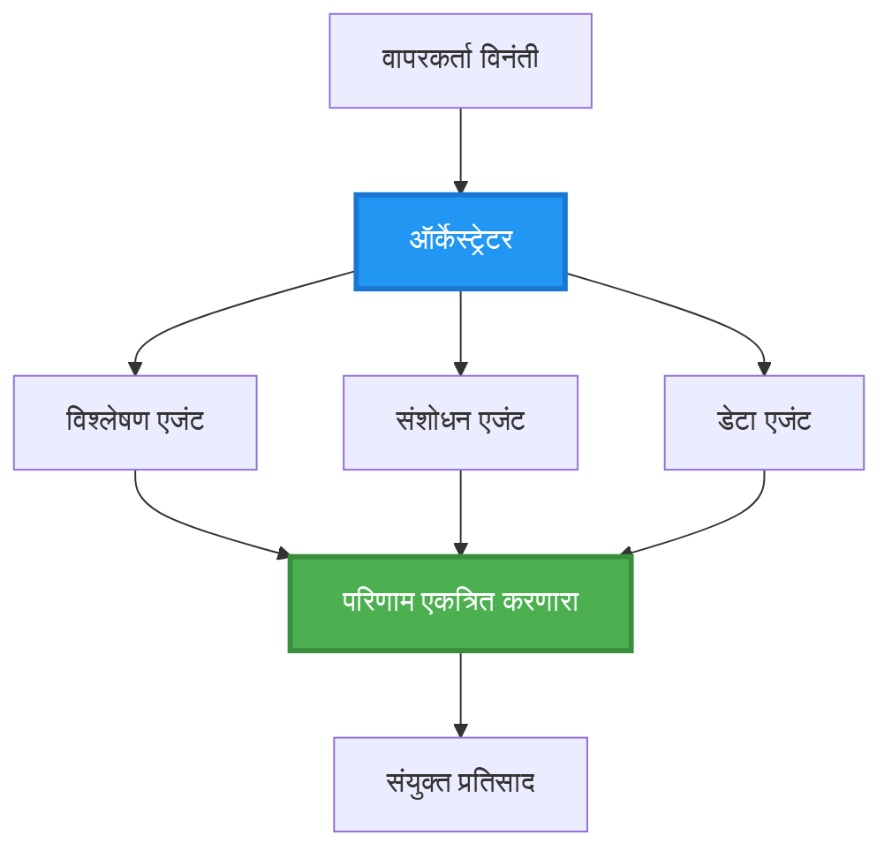
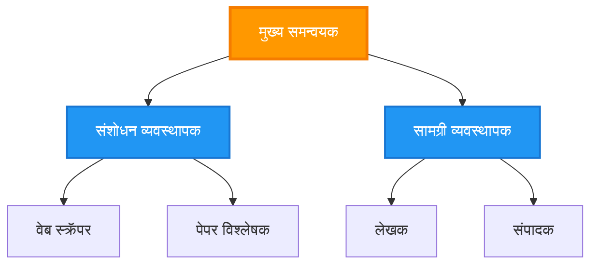
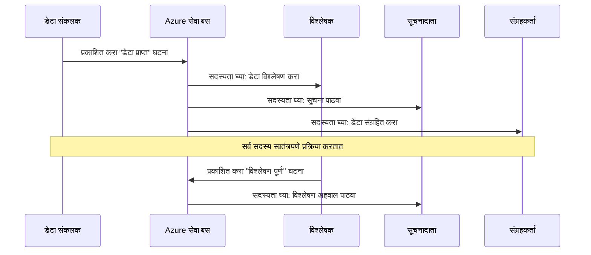
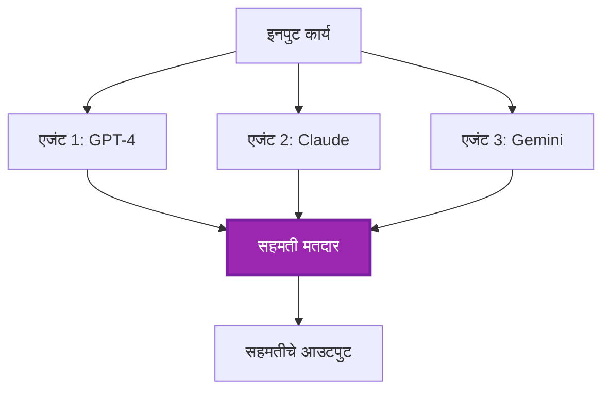
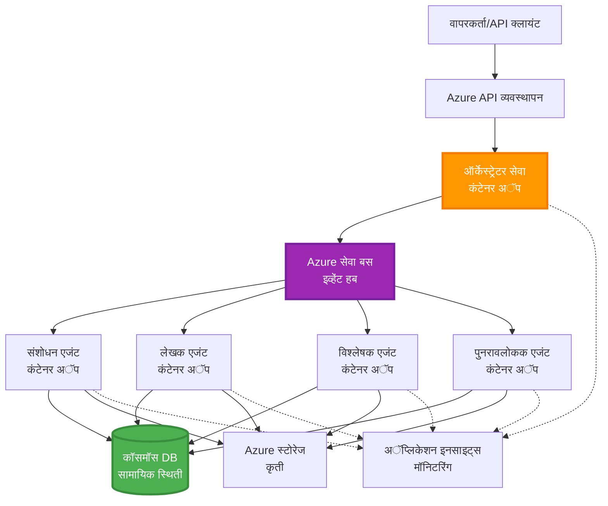

# मल्टी-एजंट समन्वय पद्धती

⏱️ **अनुमानित वेळ**: 60-75 मिनिटे | 💰 **अनुमानित खर्च**: ~$100-300/महिना | ⭐ **जटिलता**: प्रगत

**📚 शिकण्याचा मार्ग:**
- ← मागील: [क्षमता नियोजन](capacity-planning.md) - संसाधन आकार आणि स्केलिंग धोरणे
- 🎯 **तुम्ही येथे आहात**: मल्टी-एजंट समन्वय पद्धती (ऑर्केस्ट्रेशन, संवाद, स्थिती व्यवस्थापन)
- → पुढे: [SKU निवड](sku-selection.md) - योग्य Azure सेवा निवडणे
- 🏠 [कोर्स होम](../../README.md)

---

## तुम्ही काय शिकाल

या धड्याचे पूर्ण केल्यावर, तुम्ही:
- **मल्टी-एजंट आर्किटेक्चर** पद्धती समजून घ्याल आणि त्यांचा वापर कधी करायचा ते शिकाल
- **ऑर्केस्ट्रेशन पद्धती** (केंद्रीकृत, विकेंद्रित, श्रेणीबद्ध) अंमलात आणाल
- **एजंट संवाद** धोरणे डिझाइन कराल (समकालीन, असमकालीन, इव्हेंट-ड्रिव्हन)
- वितरित एजंट्समध्ये **सामायिक स्थिती** व्यवस्थापित कराल
- AZD सह Azure वर **मल्टी-एजंट सिस्टम्स** तैनात कराल
- वास्तविक जगातील AI परिस्थितीसाठी **समन्वय पद्धती** लागू कराल
- वितरित एजंट सिस्टम्सचे निरीक्षण आणि डीबग कराल

## मल्टी-एजंट समन्वय का महत्त्वाचा आहे

### उत्क्रांती: सिंगल एजंटपासून मल्टी-एजंटपर्यंत

**सिंगल एजंट (सोपे):**
```
User → Agent → Response
```
- ✅ समजायला आणि अंमलात आणायला सोपे
- ✅ साध्या कामांसाठी जलद
- ❌ एका मॉडेलच्या क्षमतेपुरते मर्यादित
- ❌ जटिल कामे समांतरित करू शकत नाही
- ❌ कोणतीही विशेषता नाही

**मल्टी-एजंट सिस्टम (प्रगत):**
```
           ┌─────────────┐
           │ Orchestrator│
           └──────┬──────┘
        ┌─────────┼─────────┐
        │         │         │
    ┌───▼──┐  ┌──▼───┐  ┌──▼────┐
    │Agent1│  │Agent2│  │Agent3 │
    │(Plan)│  │(Code)│  │(Review)│
    └──────┘  └──────┘  └───────┘
```
- ✅ विशिष्ट कामांसाठी विशेष एजंट्स
- ✅ गतीसाठी समांतर अंमलबजावणी
- ✅ मॉड्यूलर आणि देखभाल करण्यायोग्य
- ✅ जटिल कार्यप्रवाहांमध्ये चांगले
- ⚠️ समन्वय लॉजिक आवश्यक

**उदाहरण**: सिंगल एजंट म्हणजे एक व्यक्ती सर्व कामे करत आहे. मल्टी-एजंट म्हणजे एक टीम जिथे प्रत्येक सदस्याकडे विशिष्ट कौशल्ये आहेत (संशोधक, कोडर, पुनरावलोकक, लेखक) आणि ते एकत्र काम करतात.

---

## मुख्य समन्वय पद्धती

### पद्धत 1: अनुक्रमिक समन्वय (चेन ऑफ रिस्पॉन्सिबिलिटी)

**कधी वापरायचे**: कामे विशिष्ट क्रमाने पूर्ण करणे आवश्यक आहे, प्रत्येक एजंट मागील आउटपुटवर आधारित असतो.


**फायदे:**
- ✅ स्पष्ट डेटा प्रवाह
- ✅ डीबग करायला सोपे
- ✅ अंमलबजावणी क्रम अंदाजे

**मर्यादा:**
- ❌ हळू (कोणतेही समांतरता नाही)
- ❌ एक अपयश संपूर्ण साखळी अडवते
- ❌ परस्पर अवलंबित्व असलेल्या कामांना हाताळू शकत नाही

**उदाहरण वापर प्रकरणे:**
- सामग्री निर्मिती पाइपलाइन (संशोधन → लेखन → संपादन → प्रकाशन)
- कोड निर्मिती (योजना → अंमलबजावणी → चाचणी → तैनात)
- अहवाल निर्मिती (डेटा संकलन → विश्लेषण → व्हिज्युअलायझेशन → सारांश)

---

### पद्धत 2: समांतर समन्वय (फॅन-आउट/फॅन-इन)

**कधी वापरायचे**: स्वतंत्र कामे एकाच वेळी चालवता येतात, शेवटी निकाल एकत्र केले जातात.


**फायदे:**
- ✅ जलद (समांतर अंमलबजावणी)
- ✅ दोष-सहनशील (आंशिक निकाल स्वीकार्य)
- ✅ आडव्या प्रमाणात स्केल होते

**मर्यादा:**
- ⚠️ निकाल क्रमाबाहेर येऊ शकतात
- ⚠️ एकत्रीकरण लॉजिक आवश्यक
- ⚠️ जटिल स्थिती व्यवस्थापन

**उदाहरण वापर प्रकरणे:**
- मल्टी-सोर्स डेटा गोळा करणे (API + डेटाबेस + वेब स्क्रॅपिंग)
- स्पर्धात्मक विश्लेषण (अनेक मॉडेल्स सोल्यूशन्स तयार करतात, सर्वोत्तम निवडले जाते)
- भाषांतर सेवा (एकाच वेळी अनेक भाषांमध्ये भाषांतर)

---

### पद्धत 3: श्रेणीबद्ध समन्वय (मॅनेजर-वर्कर)

**कधी वापरायचे**: उप-कामांसह जटिल कार्यप्रवाह, प्रतिनिधी आवश्यक.


**फायदे:**
- ✅ जटिल कार्यप्रवाह हाताळतो
- ✅ मॉड्यूलर आणि देखभाल करण्यायोग्य
- ✅ स्पष्ट जबाबदारीची सीमा

**मर्यादा:**
- ⚠️ अधिक जटिल आर्किटेक्चर
- ⚠️ उच्च विलंबता (अनेक समन्वय स्तर)
- ⚠️ प्रगत ऑर्केस्ट्रेशन आवश्यक

**उदाहरण वापर प्रकरणे:**
- एंटरप्राइझ दस्तऐवज प्रक्रिया (वर्गीकृत करा → मार्ग → प्रक्रिया → संग्रहित करा)
- मल्टी-स्टेज डेटा पाइपलाइन (आयएनजेस्ट → स्वच्छ → रूपांतरित करा → विश्लेषण करा → अहवाल)
- जटिल ऑटोमेशन कार्यप्रवाह (योजना → संसाधन वाटप → अंमलबजावणी → निरीक्षण)

---

### पद्धत 4: इव्हेंट-ड्रिव्हन समन्वय (पब्लिश-सबस्क्राइब)

**कधी वापरायचे**: एजंट्सना इव्हेंट्सवर प्रतिक्रिया द्यायची असते, सैल कपलिंग हवे असते.


**फायदे:**
- ✅ एजंट्समधील सैल कपलिंग
- ✅ नवीन एजंट्स सहज जोडता येतात (फक्त सबस्क्राइब करा)
- ✅ असमकालीन प्रक्रिया
- ✅ लवचिक (संदेश टिकवून ठेवणे)

**मर्यादा:**
- ⚠️ शेवटी सुसंगतता
- ⚠️ जटिल डीबगिंग
- ⚠️ संदेश क्रमबद्धतेची आव्हाने

**उदाहरण वापर प्रकरणे:**
- रिअल-टाइम मॉनिटरिंग सिस्टम्स (अलर्ट्स, डॅशबोर्ड्स, लॉग्स)
- मल्टी-चॅनेल सूचना (ईमेल, एसएमएस, पुश, स्लॅक)
- डेटा प्रक्रिया पाइपलाइन (समान डेटाचे अनेक ग्राहक)

---

### पद्धत 5: सहमती-आधारित समन्वय (व्होटिंग/क्वोरम)

**कधी वापरायचे**: पुढे जाण्यापूर्वी अनेक एजंट्सकडून सहमती आवश्यक असते.


**फायदे:**
- ✅ उच्च अचूकता (अनेक मते)
- ✅ दोष-सहनशील (अल्पसंख्याक अपयश स्वीकार्य)
- ✅ गुणवत्ता हमी अंगभूत

**मर्यादा:**
- ❌ महाग (अनेक मॉडेल कॉल्स)
- ❌ हळू (सर्व एजंट्सची वाट पाहणे)
- ⚠️ संघर्ष निराकरण आवश्यक

**उदाहरण वापर प्रकरणे:**
- सामग्री मॉडरेशन (अनेक मॉडेल्स सामग्री पुनरावलोकन करतात)
- कोड पुनरावलोकन (अनेक लिंटर्स/विश्लेषक)
- वैद्यकीय निदान (अनेक AI मॉडेल्स, तज्ञ पडताळणी)

---

## आर्किटेक्चर विहंगावलोकन

### Azure वर पूर्ण मल्टी-एजंट सिस्टम


**मुख्य घटक:**

| घटक | उद्देश | Azure सेवा |
|------|--------|------------|
| **API गेटवे** | प्रवेश बिंदू, दर मर्यादा, प्रमाणीकरण | API व्यवस्थापन |
| **ऑर्केस्ट्रेटर** | एजंट कार्यप्रवाह समन्वयित करतो | कंटेनर अॅप्स |
| **संदेश रांग** | असमकालीन संवाद | सर्व्हिस बस / इव्हेंट हब्स |
| **एजंट्स** | विशेष AI कामगार | कंटेनर अॅप्स / फंक्शन्स |
| **स्थिती स्टोअर** | सामायिक स्थिती, कार्य ट्रॅकिंग | कॉसमॉस DB |
| **आर्टिफॅक्ट स्टोरेज** | दस्तऐवज, निकाल, लॉग्स | ब्लॉब स्टोरेज |
| **मॉनिटरिंग** | वितरित ट्रेसिंग, लॉग्स | अॅप्लिकेशन इनसाइट्स |

---

## पूर्वअट

### आवश्यक साधने

```bash
# Azure Developer CLI सत्यापित करा
azd version
# ✅ अपेक्षित: azd आवृत्ती 1.0.0 किंवा उच्च

# Azure CLI सत्यापित करा
az --version
# ✅ अपेक्षित: azure-cli 2.50.0 किंवा उच्च

# Docker सत्यापित करा (स्थानिक चाचणीसाठी)
docker --version
# ✅ अपेक्षित: Docker आवृत्ती 20.10 किंवा उच्च
```

### Azure आवश्यकता

- सक्रिय Azure सदस्यता
- तयार करण्यासाठी परवानग्या:
  - कंटेनर अॅप्स
  - सर्व्हिस बस नेमस्पेस
  - कॉसमॉस DB खाती
  - स्टोरेज खाती
  - अॅप्लिकेशन इनसाइट्स

### ज्ञान पूर्वअट

तुम्ही पूर्ण केले पाहिजे:
- [कॉन्फिगरेशन व्यवस्थापन](../getting-started/configuration.md)
- [प्रमाणीकरण आणि सुरक्षा](../getting-started/authsecurity.md)
- [मायक्रोसर्व्हिसेस उदाहरण](../../../../examples/microservices)

---

## अंमलबजावणी मार्गदर्शक

### प्रकल्प संरचना

```
multi-agent-system/
├── azure.yaml                    # AZD configuration
├── infra/
│   ├── main.bicep               # Main infrastructure
│   ├── core/
│   │   ├── servicebus.bicep     # Message queue
│   │   ├── cosmos.bicep         # State store
│   │   ├── storage.bicep        # Artifact storage
│   │   └── monitoring.bicep     # Application Insights
│   └── app/
│       ├── orchestrator.bicep   # Orchestrator service
│       └── agent.bicep          # Agent template
└── src/
    ├── orchestrator/            # Orchestration logic
    │   ├── app.py
    │   ├── workflows.py
    │   └── Dockerfile
    ├── agents/
    │   ├── research/            # Research agent
    │   ├── writer/              # Writer agent
    │   ├── analyst/             # Analyst agent
    │   └── reviewer/            # Reviewer agent
    └── shared/
        ├── state_manager.py     # Shared state logic
        └── message_handler.py   # Message handling
```

---

## धडा 1: अनुक्रमिक समन्वय पद्धत

### अंमलबजावणी: सामग्री निर्मिती पाइपलाइन

चला एक अनुक्रमिक पाइपलाइन तयार करूया: संशोधन → लेखन → संपादन → प्रकाशन

### 1. AZD कॉन्फिगरेशन

**फाइल: `azure.yaml`**

```yaml
name: content-pipeline
metadata:
  template: multi-agent-sequential@1.0.0

services:
  orchestrator:
    project: ./src/orchestrator
    language: python
    host: containerapp
  
  research-agent:
    project: ./src/agents/research
    language: python
    host: containerapp
  
  writer-agent:
    project: ./src/agents/writer
    language: python
    host: containerapp
  
  editor-agent:
    project: ./src/agents/editor
    language: python
    host: containerapp
```

### 2. पायाभूत सुविधा: समन्वयासाठी सर्व्हिस बस

**फाइल: `infra/core/servicebus.bicep`**

```bicep
param name string
param location string
param tags object = {}

resource serviceBusNamespace 'Microsoft.ServiceBus/namespaces@2022-10-01-preview' = {
  name: name
  location: location
  tags: tags
  sku: {
    name: 'Standard'
    tier: 'Standard'
  }
  properties: {
    minimumTlsVersion: '1.2'
  }
}

// Queue for orchestrator → research agent
resource researchQueue 'Microsoft.ServiceBus/namespaces/queues@2022-10-01-preview' = {
  parent: serviceBusNamespace
  name: 'research-tasks'
  properties: {
    maxDeliveryCount: 3
    lockDuration: 'PT5M'
    deadLetteringOnMessageExpiration: true
  }
}

// Queue for research agent → writer agent
resource writerQueue 'Microsoft.ServiceBus/namespaces/queues@2022-10-01-preview' = {
  parent: serviceBusNamespace
  name: 'writer-tasks'
  properties: {
    maxDeliveryCount: 3
    lockDuration: 'PT5M'
  }
}

// Queue for writer agent → editor agent
resource editorQueue 'Microsoft.ServiceBus/namespaces/queues@2022-10-01-preview' = {
  parent: serviceBusNamespace
  name: 'editor-tasks'
  properties: {
    maxDeliveryCount: 3
    lockDuration: 'PT5M'
  }
}

output namespace string = serviceBusNamespace.name
output connectionString string = listKeys('${serviceBusNamespace.id}/AuthorizationRules/RootManageSharedAccessKey', serviceBusNamespace.apiVersion).primaryConnectionString
```

### 3. सामायिक स्थिती व्यवस्थापक

**फाइल: `src/shared/state_manager.py`**

```python
from azure.cosmos import CosmosClient, PartitionKey
from datetime import datetime
import os

class StateManager:
    """Manages shared state across agents using Cosmos DB"""
    
    def __init__(self):
        endpoint = os.environ['COSMOS_ENDPOINT']
        key = os.environ['COSMOS_KEY']
        
        self.client = CosmosClient(endpoint, key)
        self.database = self.client.get_database_client('agent-state')
        self.container = self.database.get_container_client('tasks')
    
    def create_task(self, task_id: str, task_type: str, input_data: dict):
        """Create a new task"""
        task = {
            'id': task_id,
            'type': task_type,
            'status': 'pending',
            'input': input_data,
            'created_at': datetime.utcnow().isoformat(),
            'steps': []
        }
        self.container.create_item(task)
        return task
    
    def update_task_step(self, task_id: str, step_name: str, result: dict):
        """Update task with completed step"""
        task = self.container.read_item(task_id, partition_key=task_id)
        
        task['steps'].append({
            'name': step_name,
            'completed_at': datetime.utcnow().isoformat(),
            'result': result
        })
        
        self.container.replace_item(task_id, task)
        return task
    
    def complete_task(self, task_id: str, final_result: dict):
        """Mark task as complete"""
        task = self.container.read_item(task_id, partition_key=task_id)
        task['status'] = 'completed'
        task['result'] = final_result
        task['completed_at'] = datetime.utcnow().isoformat()
        self.container.replace_item(task_id, task)
        return task
    
    def get_task(self, task_id: str):
        """Retrieve task state"""
        return self.container.read_item(task_id, partition_key=task_id)
```

### 4. ऑर्केस्ट्रेटर सेवा

**फाइल: `src/orchestrator/app.py`**

```python
from flask import Flask, request, jsonify
from azure.servicebus import ServiceBusClient, ServiceBusMessage
import json
import uuid
import os
from shared.state_manager import StateManager

app = Flask(__name__)
state_manager = StateManager()

# सेवा बस कनेक्शन
servicebus_connection_str = os.environ['SERVICEBUS_CONNECTION_STRING']
servicebus_client = ServiceBusClient.from_connection_string(servicebus_connection_str)

@app.route('/health', methods=['GET'])
def health():
    return jsonify({'status': 'healthy', 'service': 'orchestrator'})

@app.route('/create-content', methods=['POST'])
def create_content():
    """
    Sequential workflow: Research → Write → Edit → Publish
    """
    data = request.json
    topic = data.get('topic')
    
    if not topic:
        return jsonify({'error': 'Topic required'}), 400
    
    # राज्य स्टोअरमध्ये कार्य तयार करा
    task_id = str(uuid.uuid4())
    task = state_manager.create_task(
        task_id=task_id,
        task_type='content_creation',
        input_data={'topic': topic}
    )
    
    # संशोधन एजंटला संदेश पाठवा (पहिला टप्पा)
    sender = servicebus_client.get_queue_sender('research-tasks')
    message = ServiceBusMessage(
        body=json.dumps({
            'task_id': task_id,
            'topic': topic,
            'next_queue': 'writer-tasks'  # परिणाम कुठे पाठवायचे
        }),
        content_type='application/json'
    )
    
    with sender:
        sender.send_messages(message)
    
    return jsonify({
        'task_id': task_id,
        'status': 'started',
        'workflow': 'sequential',
        'steps': ['research', 'write', 'edit', 'publish'],
        'message': 'Content creation pipeline initiated'
    }), 202

@app.route('/task/<task_id>', methods=['GET'])
def get_task_status(task_id):
    """Check task status"""
    try:
        task = state_manager.get_task(task_id)
        return jsonify(task)
    except Exception as e:
        return jsonify({'error': str(e)}), 404

if __name__ == '__main__':
    app.run(host='0.0.0.0', port=8080)
```

### 5. संशोधन एजंट

**फाइल: `src/agents/research/app.py`**

```python
from azure.servicebus import ServiceBusClient, ServiceBusMessage
from openai import AzureOpenAI
import json
import os
import time
from shared.state_manager import StateManager

# क्लायंट्स प्रारंभ करा
state_manager = StateManager()
servicebus_client = ServiceBusClient.from_connection_string(
    os.environ['SERVICEBUS_CONNECTION_STRING']
)

openai_client = AzureOpenAI(
    api_key=os.environ['AZURE_OPENAI_API_KEY'],
    api_version="2024-02-01",
    azure_endpoint=os.environ['AZURE_OPENAI_ENDPOINT']
)

def process_research_task(message_data):
    """Process research request and pass to writer"""
    task_id = message_data['task_id']
    topic = message_data['topic']
    next_queue = message_data['next_queue']
    
    print(f"🔬 Researching: {topic}")
    
    # संशोधनासाठी Azure OpenAI ला कॉल करा
    response = openai_client.chat.completions.create(
        model="gpt-4",
        messages=[
            {"role": "system", "content": "You are a research assistant. Provide comprehensive research on the given topic."},
            {"role": "user", "content": f"Research this topic thoroughly: {topic}"}
        ],
        max_tokens=1500
    )
    
    research_results = response.choices[0].message.content
    
    # स्थिती अद्यतनित करा
    state_manager.update_task_step(
        task_id=task_id,
        step_name='research',
        result={'research': research_results}
    )
    
    # पुढील एजंट (लेखक) कडे पाठवा
    sender = servicebus_client.get_queue_sender(next_queue)
    message = ServiceBusMessage(
        body=json.dumps({
            'task_id': task_id,
            'topic': topic,
            'research': research_results,
            'next_queue': 'editor-tasks'
        }),
        content_type='application/json'
    )
    
    with sender:
        sender.send_messages(message)
    
    print(f"✅ Research complete for task {task_id}")

def main():
    """Listen to research queue"""
    receiver = servicebus_client.get_queue_receiver('research-tasks')
    
    print("🔬 Research Agent started, listening for tasks...")
    
    with receiver:
        while True:
            messages = receiver.receive_messages(max_wait_time=5)
            for message in messages:
                try:
                    message_data = json.loads(str(message))
                    process_research_task(message_data)
                    receiver.complete_message(message)
                except Exception as e:
                    print(f"❌ Error processing message: {e}")
                    receiver.abandon_message(message)

if __name__ == '__main__':
    main()
```

### 6. लेखक एजंट

**फाइल: `src/agents/writer/app.py`**

```python
from azure.servicebus import ServiceBusClient, ServiceBusMessage
from openai import AzureOpenAI
import json
import os
from shared.state_manager import StateManager

state_manager = StateManager()
servicebus_client = ServiceBusClient.from_connection_string(
    os.environ['SERVICEBUS_CONNECTION_STRING']
)

openai_client = AzureOpenAI(
    api_key=os.environ['AZURE_OPENAI_API_KEY'],
    api_version="2024-02-01",
    azure_endpoint=os.environ['AZURE_OPENAI_ENDPOINT']
)

def process_writing_task(message_data):
    """Write article based on research"""
    task_id = message_data['task_id']
    topic = message_data['topic']
    research = message_data['research']
    next_queue = message_data['next_queue']
    
    print(f"✍️ Writing article: {topic}")
    
    # Azure OpenAI ला कॉल करा लेख लिहिण्यासाठी
    response = openai_client.chat.completions.create(
        model="gpt-4",
        messages=[
            {"role": "system", "content": "You are a professional writer. Write engaging, well-structured articles."},
            {"role": "user", "content": f"Based on this research:\n\n{research}\n\nWrite a comprehensive article about: {topic}"}
        ],
        max_tokens=2000
    )
    
    article_draft = response.choices[0].message.content
    
    # स्थिती अद्यतनित करा
    state_manager.update_task_step(
        task_id=task_id,
        step_name='writing',
        result={'draft': article_draft}
    )
    
    # संपादकाकडे पाठवा
    sender = servicebus_client.get_queue_sender(next_queue)
    message = ServiceBusMessage(
        body=json.dumps({
            'task_id': task_id,
            'topic': topic,
            'draft': article_draft
        }),
        content_type='application/json'
    )
    
    with sender:
        sender.send_messages(message)
    
    print(f"✅ Article draft complete for task {task_id}")

def main():
    """Listen to writer queue"""
    receiver = servicebus_client.get_queue_receiver('writer-tasks')
    
    print("✍️ Writer Agent started, listening for tasks...")
    
    with receiver:
        while True:
            messages = receiver.receive_messages(max_wait_time=5)
            for message in messages:
                try:
                    message_data = json.loads(str(message))
                    process_writing_task(message_data)
                    receiver.complete_message(message)
                except Exception as e:
                    print(f"❌ Error: {e}")
                    receiver.abandon_message(message)

if __name__ == '__main__':
    main()
```

### 7. संपादक एजंट

**फाइल: `src/agents/editor/app.py`**

```python
from azure.servicebus import ServiceBusClient
from openai import AzureOpenAI
import json
import os
from shared.state_manager import StateManager

state_manager = StateManager()
servicebus_client = ServiceBusClient.from_connection_string(
    os.environ['SERVICEBUS_CONNECTION_STRING']
)

openai_client = AzureOpenAI(
    api_key=os.environ['AZURE_OPENAI_API_KEY'],
    api_version="2024-02-01",
    azure_endpoint=os.environ['AZURE_OPENAI_ENDPOINT']
)

def process_editing_task(message_data):
    """Edit and finalize article"""
    task_id = message_data['task_id']
    topic = message_data['topic']
    draft = message_data['draft']
    
    print(f"📝 Editing article: {topic}")
    
    # Azure OpenAI ला संपादित करण्यासाठी कॉल करा
    response = openai_client.chat.completions.create(
        model="gpt-4",
        messages=[
            {"role": "system", "content": "You are an expert editor. Improve grammar, clarity, and structure."},
            {"role": "user", "content": f"Edit and improve this article:\n\n{draft}"}
        ],
        max_tokens=2000
    )
    
    final_article = response.choices[0].message.content
    
    # कार्य पूर्ण म्हणून चिन्हांकित करा
    state_manager.complete_task(
        task_id=task_id,
        final_result={
            'topic': topic,
            'final_article': final_article,
            'word_count': len(final_article.split())
        }
    )
    
    print(f"✅ Article finalized for task {task_id}")

def main():
    """Listen to editor queue"""
    receiver = servicebus_client.get_queue_receiver('editor-tasks')
    
    print("📝 Editor Agent started, listening for tasks...")
    
    with receiver:
        while True:
            messages = receiver.receive_messages(max_wait_time=5)
            for message in messages:
                try:
                    message_data = json.loads(str(message))
                    process_editing_task(message_data)
                    receiver.complete_message(message)
                except Exception as e:
                    print(f"❌ Error: {e}")
                    receiver.abandon_message(message)

if __name__ == '__main__':
    main()
```

### 8. तैनात करा आणि चाचणी करा

```bash
# प्रारंभ करा आणि तैनात करा
azd init
azd up

# ऑर्केस्ट्रेटर URL मिळवा
ORCHESTRATOR_URL=$(azd env get-values | grep ORCHESTRATOR_URL | cut -d '=' -f2 | tr -d '"')

# सामग्री तयार करा
curl -X POST $ORCHESTRATOR_URL/create-content \
  -H "Content-Type: application/json" \
  -d '{"topic": "The Future of AI in Healthcare"}'
```

**✅ अपेक्षित आउटपुट:**
```json
{
  "task_id": "a1b2c3d4-e5f6-7890-abcd-ef1234567890",
  "status": "started",
  "workflow": "sequential",
  "steps": ["research", "write", "edit", "publish"],
  "message": "Content creation pipeline initiated"
}
```

**कार्य प्रगती तपासा:**
```bash
TASK_ID="a1b2c3d4-e5f6-7890-abcd-ef1234567890"
curl $ORCHESTRATOR_URL/task/$TASK_ID
```

**✅ अपेक्षित आउटपुट (पूर्ण झाले):**
```json
{
  "id": "a1b2c3d4-e5f6-7890-abcd-ef1234567890",
  "type": "content_creation",
  "status": "completed",
  "steps": [
    {
      "name": "research",
      "completed_at": "2025-11-19T10:30:00Z",
      "result": {"research": "..."}
    },
    {
      "name": "writing",
      "completed_at": "2025-11-19T10:32:00Z",
      "result": {"draft": "..."}
    }
  ],
  "result": {
    "topic": "The Future of AI in Healthcare",
    "final_article": "...",
    "word_count": 1500
  }
}
```

---

## धडा 2: समांतर समन्वय पद्धत

### अंमलबजावणी: मल्टी-सोर्स रिसर्च अॅग्रीगेटर

चला एक समांतर प्रणाली तयार करूया जी एकाच वेळी अनेक स्रोतांकडून माहिती गोळा करते.

### समांतर ऑर्केस्ट्रेटर

**फाइल: `src/orchestrator/parallel_workflow.py`**

```python
from flask import Flask, request, jsonify
from azure.servicebus import ServiceBusClient, ServiceBusMessage
import json
import uuid
import os
from shared.state_manager import StateManager

app = Flask(__name__)
state_manager = StateManager()

servicebus_client = ServiceBusClient.from_connection_string(
    os.environ['SERVICEBUS_CONNECTION_STRING']
)

@app.route('/research-parallel', methods=['POST'])
def research_parallel():
    """
    Parallel workflow: Multiple agents work simultaneously
    """
    data = request.json
    query = data.get('query')
    
    task_id = str(uuid.uuid4())
    task = state_manager.create_task(
        task_id=task_id,
        task_type='parallel_research',
        input_data={
            'query': query,
            'agents': ['web', 'academic', 'news', 'social']
        }
    )
    
    # फॅन-आउट: सर्व एजंट्सना एकाच वेळी पाठवा
    agents = [
        ('web-research-queue', 'web'),
        ('academic-research-queue', 'academic'),
        ('news-research-queue', 'news'),
        ('social-research-queue', 'social')
    ]
    
    for queue_name, agent_type in agents:
        sender = servicebus_client.get_queue_sender(queue_name)
        message = ServiceBusMessage(
            body=json.dumps({
                'task_id': task_id,
                'query': query,
                'agent_type': agent_type,
                'result_queue': 'aggregation-queue'
            }),
            content_type='application/json'
        )
        
        with sender:
            sender.send_messages(message)
    
    return jsonify({
        'task_id': task_id,
        'status': 'started',
        'workflow': 'parallel',
        'agents_dispatched': 4,
        'message': 'Parallel research initiated'
    }), 202

if __name__ == '__main__':
    app.run(host='0.0.0.0', port=8080)
```

### एकत्रीकरण लॉजिक

**फाइल: `src/agents/aggregator/app.py`**

```python
from azure.servicebus import ServiceBusClient
import json
import os
from collections import defaultdict
from shared.state_manager import StateManager

state_manager = StateManager()
servicebus_client = ServiceBusClient.from_connection_string(
    os.environ['SERVICEBUS_CONNECTION_STRING']
)

# प्रत्येक कार्यासाठी परिणाम ट्रॅक करा
task_results = defaultdict(list)
expected_agents = 4  # वेब, शैक्षणिक, बातम्या, सामाजिक

def process_result(message_data):
    """Aggregate results from parallel agents"""
    task_id = message_data['task_id']
    agent_type = message_data['agent_type']
    result = message_data['result']
    
    # परिणाम साठवा
    task_results[task_id].append({
        'agent': agent_type,
        'data': result
    })
    
    print(f"📊 Received result from {agent_type} agent ({len(task_results[task_id])}/{expected_agents})")
    
    # सर्व एजंट पूर्ण झाले आहेत का ते तपासा (फॅन-इन)
    if len(task_results[task_id]) == expected_agents:
        print(f"✅ All agents completed for task {task_id}. Aggregating...")
        
        # परिणाम एकत्र करा
        aggregated = {
            'query': message_data['query'],
            'sources': task_results[task_id],
            'summary': generate_summary(task_results[task_id])
        }
        
        # पूर्ण म्हणून चिन्हांकित करा
        state_manager.complete_task(task_id, aggregated)
        
        # साफ करा
        del task_results[task_id]
        
        print(f"✅ Aggregation complete for task {task_id}")

def generate_summary(results):
    """Generate summary from all sources"""
    summaries = [r['data'].get('summary', '') for r in results]
    return '\n\n'.join(summaries)

def main():
    """Listen to aggregation queue"""
    receiver = servicebus_client.get_queue_receiver('aggregation-queue')
    
    print("📊 Aggregator started, listening for results...")
    
    with receiver:
        while True:
            messages = receiver.receive_messages(max_wait_time=5)
            for message in messages:
                try:
                    message_data = json.loads(str(message))
                    process_result(message_data)
                    receiver.complete_message(message)
                except Exception as e:
                    print(f"❌ Error: {e}")
                    receiver.abandon_message(message)

if __name__ == '__main__':
    main()
```

**समांतर पद्धतीचे फायदे:**
- ⚡ **4x जलद** (एजंट्स एकाच वेळी चालतात)
- 🔄 **दोष-सहनशील** (आंशिक निकाल स्वीकार्य)
- 📈 **स्केलेबल** (सहजपणे अधिक एजंट्स जोडा)

---

## व्यावहारिक सराव

### सराव 1: टाइमआउट हाताळणी जोडा ⭐⭐ (मध्यम)

**उद्दिष्ट**: टाइमआउट लॉजिक अंमलात आणा जेणेकरून अॅग्रीगेटर हळू एजंट्सची अनंत काळ वाट पाहणार नाही.

**पायऱ्या**:

1. **अॅग्रीगेटरमध्ये टाइमआउट ट्रॅकिंग जोडा:**

```python
from datetime import datetime, timedelta

task_timeouts = {}  # task_id -> समाप्ती वेळ

def process_result(message_data):
    task_id = message_data['task_id']
    
    # पहिल्या परिणामावर टाइमआउट सेट करा
    if task_id not in task_timeouts:
        task_timeouts[task_id] = datetime.utcnow() + timedelta(seconds=30)
    
    task_results[task_id].append({
        'agent': message_data['agent_type'],
        'data': message_data['result']
    })
    
    # पूर्ण झाले आहे किंवा टाइमआउट झाला आहे का ते तपासा
    if len(task_results[task_id]) == expected_agents or \
       datetime.utcnow() > task_timeouts[task_id]:
        
        print(f"📊 Aggregating with {len(task_results[task_id])}/{expected_agents} results")
        
        aggregated = {
            'query': message_data['query'],
            'sources': task_results[task_id],
            'completed_agents': len(task_results[task_id]),
            'timed_out': len(task_results[task_id]) < expected_agents
        }
        
        state_manager.complete_task(task_id, aggregated)
        
        # साफसफाई
        del task_results[task_id]
        del task_timeouts[task_id]
```

2. **कृत्रिम विलंबांसह चाचणी करा:**

```python
# एका एजंटमध्ये, धीम्या प्रक्रिया अनुकरण करण्यासाठी विलंब जोडा
import time
time.sleep(35)  # 30-सेकंदांचा टाइमआउट ओलांडतो
```

3. **तैनात करा आणि सत्यापित करा:**

```bash
azd deploy aggregator

# कार्य सबमिट करा
curl -X POST $ORCHESTRATOR_URL/research-parallel \
  -H "Content-Type: application/json" \
  -d '{"query": "AI safety research"}'

# ३० सेकंदांनंतर परिणाम तपासा
curl $ORCHESTRATOR_URL/task/$TASK_ID
```

**✅ यश निकष:**
- ✅ कार्य 30 सेकंदांनंतर पूर्ण होते जरी एजंट्स अपूर्ण असले तरी
- ✅ प्रतिसाद आंशिक निकाल दर्शवतो (`"timed_out": true`)
- ✅ उपलब्ध निकाल परत केले जातात (4 पैकी 3 एजंट्स)

**वेळ**: 20-25 मिनिटे

---

### सराव 2: रिट्राय लॉजिक अंमलात आणा ⭐⭐⭐ (प्रगत)

**उद्दिष्ट**: अपयशी एजंट कार्ये आपोआप पुन्हा प्रयत्न करा.

**पायऱ्या**:

1. **ऑर्केस्ट्रेटरमध्ये रिट्राय ट्रॅकिंग जोडा:**

```python
from dataclasses import dataclass
from typing import Dict

@dataclass
class RetryConfig:
    max_retries: int = 3
    backoff_seconds: int = 5

retry_counts: Dict[str, int] = {}  # संदेश_आयडी -> पुनर्प्रयत्न_गणना

def send_with_retry(queue_name: str, message_data: dict, retry_config: RetryConfig):
    """Send message with retry metadata"""
    message_id = message_data.get('message_id', str(uuid.uuid4()))
    message_data['message_id'] = message_id
    message_data['retry_count'] = retry_counts.get(message_id, 0)
    message_data['max_retries'] = retry_config.max_retries
    
    sender = servicebus_client.get_queue_sender(queue_name)
    message = ServiceBusMessage(
        body=json.dumps(message_data),
        content_type='application/json',
        message_id=message_id
    )
    
    with sender:
        sender.send_messages(message)
```

2. **एजंट्समध्ये रिट्राय हँडलर जोडा:**

```python
def process_with_retry(message, receiver, process_func):
    """Process message with automatic retry on failure"""
    try:
        message_data = json.loads(str(message))
        
        # संदेश प्रक्रिया करा
        process_func(message_data)
        
        # यशस्वी - पूर्ण
        receiver.complete_message(message)
        
    except Exception as e:
        message_id = message.message_id
        retry_count = message_data.get('retry_count', 0)
        max_retries = message_data.get('max_retries', 3)
        
        if retry_count < max_retries:
            # पुन्हा प्रयत्न: सोडून द्या आणि वाढलेल्या गणनेसह पुन्हा रांगेत लावा
            print(f"⚠️ Retry {retry_count + 1}/{max_retries} for message {message_id}")
            
            message_data['retry_count'] = retry_count + 1
            
            # विलंबासह त्याच रांगेत परत पाठवा
            time.sleep(5 * (retry_count + 1))  # घातांकीय बॅकऑफ
            send_with_retry(queue_name, message_data, RetryConfig())
            
            receiver.complete_message(message)  # मूळ काढा
        else:
            # जास्तीत जास्त पुनर्प्रयत्न ओलांडले - मृत पत्र रांगेत हलवा
            print(f"❌ Max retries exceeded for message {message_id}")
            receiver.dead_letter_message(
                message,
                reason="MaxRetriesExceeded",
                error_description=str(e)
            )
```

3. **डेड लेटर रांग मॉनिटर करा:**

```python
def monitor_dead_letters():
    """Check dead letter queue for failed messages"""
    receiver = servicebus_client.get_queue_receiver(
        'research-queue',
        sub_queue='deadletter'
    )
    
    with receiver:
        messages = receiver.receive_messages(max_wait_time=5)
        for message in messages:
            print(f"☠️ Dead letter: {message.message_id}")
            print(f"Reason: {message.dead_letter_reason}")
            print(f"Description: {message.dead_letter_error_description}")
```

**✅ यश निकष:**
- ✅ अपयशी कार्ये आपोआप पुन्हा प्रयत्न करतात (3 वेळा पर्यंत)
- ✅ रिट्राय दरम्यान घसरणीचा कालावधी (5s, 10s, 15s)
- ✅ जास्तीत जास्त रिट्रायनंतर, संदेश डेड लेटर रांगेत जातात
- ✅ डेड लेटर रांग मॉनिटर केली जाऊ शकते आणि पुन्हा प्ले केली जाऊ शकते

**वेळ**: 30-40 मिनिटे

---

### सराव 3: सर्किट ब्रेकर अंमलात आणा ⭐⭐⭐ (प्रगत)

**उद्दिष्ट**: अपयशी एजंट्सकडे विनंत्या थांबवून कॅस्केडिंग अपयश टाळा.

**पायऱ्या**:

1. **सर्किट ब्रेकर क्लास तयार करा:**

```python
from enum import Enum
from datetime import datetime, timedelta

class CircuitState(Enum):
    CLOSED = "closed"      # सामान्य ऑपरेशन
    OPEN = "open"          # अयशस्वी, विनंत्या नाकार
    HALF_OPEN = "half_open"  # पुनर्प्राप्त झाले आहे का तपासत आहे

class CircuitBreaker:
    def __init__(self, failure_threshold=5, timeout_seconds=60):
        self.failure_threshold = failure_threshold
        self.timeout_seconds = timeout_seconds
        self.failure_count = 0
        self.last_failure_time = None
        self.state = CircuitState.CLOSED
    
    def call(self, func):
        """Execute function with circuit breaker protection"""
        if self.state == CircuitState.OPEN:
            # टाइमआउट संपला आहे का तपासा
            if datetime.utcnow() - self.last_failure_time > timedelta(seconds=self.timeout_seconds):
                self.state = CircuitState.HALF_OPEN
                print("🔄 Circuit breaker: HALF_OPEN (testing)")
            else:
                raise Exception(f"Circuit breaker OPEN for agent. Try again in {self.timeout_seconds}s")
        
        try:
            result = func()
            
            # यश
            if self.state == CircuitState.HALF_OPEN:
                self.state = CircuitState.CLOSED
                self.failure_count = 0
                print("✅ Circuit breaker: CLOSED (recovered)")
            
            return result
            
        except Exception as e:
            self.failure_count += 1
            self.last_failure_time = datetime.utcnow()
            
            if self.failure_count >= self.failure_threshold:
                self.state = CircuitState.OPEN
                print(f"🔴 Circuit breaker: OPEN (too many failures)")
            
            raise e
```

2. **एजंट कॉल्सवर लागू करा:**

```python
# ऑर्केस्ट्रेटरमध्ये
agent_circuits = {
    'web': CircuitBreaker(failure_threshold=5, timeout_seconds=60),
    'academic': CircuitBreaker(failure_threshold=5, timeout_seconds=60),
    'news': CircuitBreaker(failure_threshold=5, timeout_seconds=60),
    'social': CircuitBreaker(failure_threshold=5, timeout_seconds=60)
}

def send_to_agent(agent_type, message_data):
    """Send with circuit breaker protection"""
    circuit = agent_circuits[agent_type]
    
    try:
        circuit.call(lambda: send_message(agent_type, message_data))
    except Exception as e:
        print(f"⚠️ Skipping {agent_type} agent: {e}")
        # इतर एजंट्ससह पुढे जा
```

3. **सर्किट ब्रेकर चाचणी करा:**

```bash
# वारंवार अपयशांचे अनुकरण करा (एक एजंट थांबवा)
az containerapp stop --name web-research-agent --resource-group rg-agents

# अनेक विनंत्या पाठवा
for i in {1..10}; do
  curl -X POST $ORCHESTRATOR_URL/research-parallel \
    -H "Content-Type: application/json" \
    -d '{"query": "test query '$i'"}'
  sleep 2
done

# लॉग्स तपासा - 5 अपयशांनंतर सर्किट उघडलेले दिसले पाहिजे
azd logs orchestrator --tail 50
```

**✅ यश निकष:**
- ✅ 5 अपयशांनंतर, सर्किट उघडते (विनंत्या नाकारते)
- ✅ 60 सेकंदांनंतर, सर्किट अर्धवट उघडते (पुनर्प्राप्ती चाचणी करते)
- ✅ इतर एजंट्स सामान्यपणे काम करत राहतात
- ✅ एजंट पुनर्प्राप्त झाल्यावर सर्किट आपोआप बंद होते

**वेळ**: 40-50 मिनिटे

---

## निरीक्षण आणि डीबगिंग

### अॅप्लिकेशन इनसाइट्ससह वितरित ट्रेसिंग

**फाइल: `src/shared/tracing.py`**

```python
from opencensus.ext.azure.log_exporter import AzureLogHandler
from opencensus.ext.azure.trace_exporter import AzureExporter
from opencensus.trace import config_integration
from opencensus.trace.tracer import Tracer
from opencensus.trace.samplers import AlwaysOnSampler
import logging
import os

# ट्रेसिंग कॉन्फिगर करा
config_integration.trace_integrations(['requests', 'logging'])

connection_string = os.environ.get('APPLICATIONINSIGHTS_CONNECTION_STRING')

# ट्रेसर तयार करा
tracer = Tracer(
    exporter=AzureExporter(connection_string=connection_string),
    sampler=AlwaysOnSampler()
)

# लॉगिंग कॉन्फिगर करा
logger = logging.getLogger(__name__)
logger.addHandler(AzureLogHandler(connection_string=connection_string))
logger.setLevel(logging.INFO)

def trace_agent_call(agent_name, task_id, operation):
    """Trace agent operations"""
    with tracer.span(name=f'{agent_name}.{operation}') as span:
        span.add_attribute('agent', agent_name)
        span.add_attribute('task_id', task_id)
        span.add_attribute('operation', operation)
        
        try:
            result = operation()
            span.add_attribute('status', 'success')
            return result
        except Exception as e:
            span.add_attribute('status', 'error')
            span.add_attribute('error', str(e))
            raise
```

### अॅप्लिकेशन इनसाइट्स क्वेरीज

**मल्टी-एजंट कार्यप्रवाह ट्रॅक करा:**

```kusto
// Trace complete workflow for a task
traces
| where customDimensions.task_id == "a1b2c3d4-..."
| project timestamp, message, customDimensions.agent, customDimensions.operation
| order by timestamp asc
```

**एजंट कार्यक्षमता तुलना:**

```kusto
// Compare agent execution times
dependencies
| where name contains "agent"
| summarize 
    avg_duration = avg(duration),
    p95_duration = percentile(duration, 95),
    count = count()
  by agent = tostring(customDimensions.agent)
| order by avg_duration desc
```

**अपयश विश्लेषण:**

```kusto
// Find which agents fail most
exceptions
| where customDimensions.agent != ""
| summarize 
    failure_count = count(),
    unique_errors = dcount(outerMessage)
  by agent = tostring(customDimensions.agent)
| order by failure_count desc
```

---

## खर्च विश्लेषण

### मल्टी-एजंट सिस्टम खर्च (मासिक अंदाज)

| घटक | कॉन्फिगरेशन | खर्च |
|------|-------------|------|
| **ऑर्केस्ट्रेटर** | 1 कंटेनर अॅप (1 vCPU, 2GB) | $30-50 |
| **4 एजंट्स** | 4 कंटेनर अॅप्स (0.5 vCPU, 1GB प्रत्येक) | $60-120 |
| **सर्व्हिस बस** | स्टँडर्ड टियर, 10M संदेश | $10-20 |
| **कॉसमॉस DB** | सर्व्हरलेस, 5GB स्टोरेज, 1M RUs | $25-50 |
| **ब्लॉब स्टोरेज** | 10GB स्टोरेज, 100K ऑपरेशन्स | $5-10 |
| **अॅप्लिकेशन इनसाइट्स** | 5GB इनजेक्शन | $10-15 |
| **Azure OpenAI** | GPT-4, 10M टोकन्स | $100-300 |
| **एकूण** | | **$240-565/महिना** |

### खर्च ऑप्टिमायझेशन धोरण
## समस्या निवारण मार्गदर्शक

### समस्या: संदेश रांगेत अडकले आहेत

**लक्षणे:**
- संदेश रांगेत साचत आहेत
- एजंट प्रक्रिया करत नाहीत
- कार्य स्थिती "प्रलंबित" वर अडकलेली आहे

**निदान:**
```bash
# रांगेची खोली तपासा
az servicebus queue show \
  --namespace-name mybus \
  --name research-tasks \
  --query "countDetails"

# एजंटची प्रकृती तपासा
azd logs research-agent --tail 50
```

**उपाय:**

1. **एजंट प्रतिकृती वाढवा:**
   ```bash
   az containerapp update \
     --name research-agent \
     --min-replicas 3 \
     --max-replicas 10
   ```

2. **डेड लेटर रांग तपासा:**
   ```bash
   az servicebus queue show \
     --namespace-name mybus \
     --name research-tasks \
     --query "countDetails.deadLetterMessageCount"
   ```

---

### समस्या: कार्य वेळ संपणे/कधीच पूर्ण होत नाही

**लक्षणे:**
- कार्य स्थिती "प्रगतीत" राहते
- काही एजंट पूर्ण करतात, काही नाहीत
- कोणतेही त्रुटी संदेश नाहीत

**निदान:**
```bash
# कार्याची स्थिती तपासा
curl $ORCHESTRATOR_URL/task/$TASK_ID

# अनुप्रयोग अंतर्दृष्टी तपासा
# क्वेरी चालवा: traces | where customDimensions.task_id == "..."
```

**उपाय:**

1. **एग्रीगेटरमध्ये वेळ मर्यादा लागू करा (व्यायाम 1)**

2. **एजंट अपयश तपासा:**
   ```bash
   azd logs --follow | grep "ERROR\|FAIL"
   ```

3. **सर्व एजंट चालू आहेत याची खात्री करा:**
   ```bash
   az containerapp list \
     --resource-group rg-agents \
     --query "[].{name:name, status:properties.runningStatus}"
   ```

---

## अधिक जाणून घ्या

### अधिकृत दस्तऐवज
- [Azure Service Bus](https://learn.microsoft.com/azure/service-bus-messaging/service-bus-messaging-overview)
- [Cosmos DB](https://learn.microsoft.com/azure/cosmos-db/introduction)
- [Container Apps DAPR](https://learn.microsoft.com/azure/container-apps/dapr-overview)
- [Multi-Agent Design Patterns](https://learn.microsoft.com/azure/architecture/guide/ai/multi-agent-systems)

### या कोर्समधील पुढील चरण
- ← मागील: [क्षमता नियोजन](capacity-planning.md)
- → पुढील: [SKU निवड](sku-selection.md)
- 🏠 [कोर्स मुख्यपृष्ठ](../../README.md)

### संबंधित उदाहरणे
- [मायक्रोसर्व्हिसेस उदाहरण](../../../../examples/microservices) - सेवा संवाद नमुने
- [Azure OpenAI उदाहरण](../../../../examples/azure-openai-chat) - AI एकत्रीकरण

---

## सारांश

**तुम्ही शिकले:**
- ✅ पाच समन्वय नमुने (क्रमिक, समांतर, श्रेणीबद्ध, इव्हेंट-ड्रिव्हन, सहमती)
- ✅ Azure वर मल्टी-एजंट आर्किटेक्चर (Service Bus, Cosmos DB, Container Apps)
- ✅ वितरित एजंट्समध्ये स्थिती व्यवस्थापन
- ✅ वेळ मर्यादा हाताळणे, पुनर्प्रयत्न, आणि सर्किट ब्रेकर्स
- ✅ वितरित प्रणालींचे निरीक्षण आणि डीबगिंग
- ✅ खर्च अनुकूलन धोरणे

**महत्त्वाचे मुद्दे:**
1. **योग्य नमुना निवडा** - क्रमिक कार्यांसाठी, गतीसाठी समांतर, लवचिकतेसाठी इव्हेंट-ड्रिव्हन
2. **स्थिती काळजीपूर्वक व्यवस्थापित करा** - सामायिक स्थितीसाठी Cosmos DB किंवा तत्सम वापरा
3. **अपयश व्यवस्थित हाताळा** - वेळ मर्यादा, पुनर्प्रयत्न, सर्किट ब्रेकर्स, डेड लेटर रांगा
4. **सर्वकाही निरीक्षण करा** - डीबगिंगसाठी वितरित ट्रेसिंग आवश्यक आहे
5. **खर्च अनुकूलित करा** - शून्यापर्यंत स्केल करा, सर्व्हरलेस वापरा, कॅशिंग लागू करा

**पुढील चरण:**
1. व्यावहारिक व्यायाम पूर्ण करा
2. तुमच्या उपयोग प्रकरणासाठी मल्टी-एजंट प्रणाली तयार करा
3. [SKU निवड](sku-selection.md) अभ्यास करा, कार्यक्षमता आणि खर्च अनुकूलित करण्यासाठी

---

<!-- CO-OP TRANSLATOR DISCLAIMER START -->
**अस्वीकरण**:  
हा दस्तऐवज AI भाषांतर सेवा [Co-op Translator](https://github.com/Azure/co-op-translator) वापरून भाषांतरित करण्यात आला आहे. आम्ही अचूकतेसाठी प्रयत्नशील असलो तरी, कृपयास लक्षात ठेवा की स्वयंचलित भाषांतरे त्रुटी किंवा अचूकतेच्या अभावाने युक्त असू शकतात. मूळ भाषेतील दस्तऐवज अधिकृत स्रोत मानला जावा. महत्त्वाच्या माहितीसाठी, व्यावसायिक मानवी भाषांतराची शिफारस केली जाते. या भाषांतराचा वापर करून उद्भवलेल्या कोणत्याही गैरसमज किंवा चुकीच्या अर्थासाठी आम्ही जबाबदार नाही.
<!-- CO-OP TRANSLATOR DISCLAIMER END -->