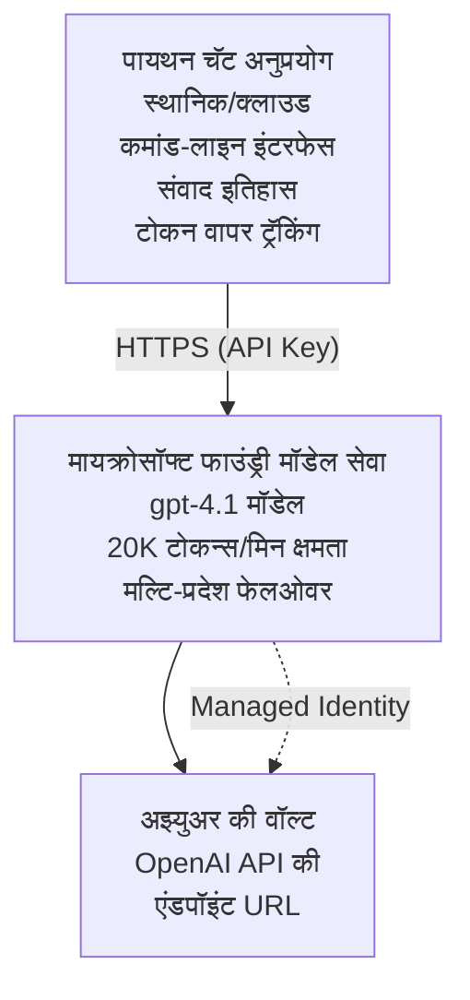

# Microsoft Foundry Models चॅट अनुप्रयोग

**शिकण्याचा मार्ग:** मध्यम ⭐⭐ | **वेळ:** 35-45 मिनिटे | **खर्च:** $50-200/महिना

Azure Developer CLI (azd) वापरून तैनात केलेला पूर्ण Microsoft Foundry Models चॅट अनुप्रयोग. हे उदाहरण gpt-4.1 तैनाती, सुरक्षित API प्रवेश, आणि साधा चॅट इंटरफेस दाखवते.

## 🎯 तुम्हाला काय शिकायला मिळेल

- gpt-4.1 मॉडेलसह Microsoft Foundry Models सेवा तैनात करा
- Key Vault मदतीने OpenAI API की सुरक्षित करा
- Python वापरून साधा चॅट इंटरफेस तयार करा
- टोकन वापर आणि खर्चाचे निरीक्षण करा
- दरमर्यादा आणि त्रुटी हाताळणी लागू करा

## 📦 काय समाविष्ट आहे

✅ **Microsoft Foundry Models सेवा** - gpt-4.1 मॉडेल तैनात करणे  
✅ **Python चॅट अ‍ॅप** - साधा कमांड-लाइन चॅट इंटरफेस  
✅ **Key Vault समाकलन** - API की सुरक्षित साठवणूक  
✅ **ARM टेम्पलेट्स** - संपूर्ण संरचना कोडच्या रूपात  
✅ **खर्च निरीक्षण** - टोकन वापर ट्रॅकिंग  
✅ **दरमर्यादा** - कोटा झपाट्याने संपण्यापासून प्रतिबंधित करणे  

## आर्किटेक्चर



## पूर्वअट

### आवश्यक

- **Azure Developer CLI (azd)** - [इंस्टॉलेशन मार्गदर्शिका](https://learn.microsoft.com/azure/developer/azure-developer-cli/install-azd)
- **OpenAI प्रवेशासह Azure सदस्यता** - [प्रवेश विनंती करा](https://aka.ms/oai/access)
- **Python 3.9+** - [Python इंस्टॉल करा](https://www.python.org/downloads/)

### पूर्वअट तपासा

```bash
# azd आवृत्ती तपासा (1.5.0 किंवा त्यापेक्षा जास्त आवश्यक आहे)
azd version

# Azure लॉगिन सत्यापित करा
azd auth login

# Python आवृत्ती तपासा
python --version  # किंवा python3 --version

# OpenAI प्रवेश सत्यापित करा (Azure पोर्टलमध्ये तपासा)
az cognitiveservices account list-skus \
  --kind OpenAI \
  --location eastus
```

> **⚠️ महत्त्वाचे:** Microsoft Foundry Models साठी अनुप्रयोग मंजुरी आवश्यक आहे. आपण अर्ज केला नसेल तर [aka.ms/oai/access](https://aka.ms/oai/access) या ठिकाणी भेट द्या. मंजुरी सहसा 1-2 व्यावसायिक दिवस लागते.

## ⏱️ तैनातीचा कालावधी

| टप्पा | कालावधी | काय होते |
|-------|----------|--------------|
| पूर्वअट तपासणी | 2-3 मिनिटे | OpenAI कोटा उपलब्धता तपासा |
| संरचना तैनात करा | 8-12 मिनिटे | OpenAI, Key Vault, मॉडेल तैनाती तयार करा |
| अनुप्रयोग सेटअप करा | 2-3 मिनिटे | पर्यावरण आणि अवलंबित्वे सेट करा |
| **एकूण** | **12-18 मिनिटे** | gpt-4.1 सह चॅटसाठी तयार |

**टीप:** प्रथम OpenAI तैनातीमध्ये मॉडेल प्रोव्हिजनिंगमुळे जास्त वेळ लागू शकतो.

## जलद प्रारंभ

```bash
# उदाहरणाकडे जा
cd examples/azure-openai-chat

# पर्यावरण प्रारंभ करा
azd env new myopenai

# सर्वकाही तैनात करा (पायाभूत सुविधा + संरचना)
azd up
# आपल्याला विचारले जाईल:
# 1. Azure सब्सक्रिप्शन निवडा
# 2. OpenAI उपलब्धतेसह स्थान निवडा (उदा. eastus, eastus2, westus)
# 3. तैनातीसाठी 12-18 मिनिटे थांबा

# Python अवलंबन स्थापित करा
pip install -r requirements.txt

# चॅटिंग सुरू करा!
python chat.py
```

**अपेक्षित आउटपुट:**
```
🤖 Microsoft Foundry Models Chat Application
Connected to: gpt-4.1 (eastus)
Type your message (or 'quit' to exit)

You: Hello! Tell me about Microsoft Foundry Models.
Assistant: Microsoft Foundry Models Service provides REST API access to OpenAI's powerful language models including gpt-4.1, GPT-3.5-Turbo, and Embeddings...

[Tokens used: 145 | Estimated cost: $0.0044]
```

## ✅ तैनातीची पडताळणी करा

### स्टेप 1: Azure संसाधने तपासा

```bash
# तैनात केलेले संसाधने पहा
azd show

# अपेक्षित आउटपुट दर्शविते:
# - OpenAI सेवा: (संसाधन नाव)
# - की वॉल्ट: (संसाधन नाव)
# - तैनाती: gpt-4.1
# - स्थान: eastus (किंवा आपला निवडलेला प्रदेश)
```

### स्टेप 2: OpenAI API चाचणी करा

```bash
# OpenAI एंडपॉइंट आणि की मिळवा
OPENAI_ENDPOINT=$(azd env get-value AZURE_OPENAI_ENDPOINT)
OPENAI_KEY=$(azd env get-value AZURE_OPENAI_API_KEY)

# API कॉल चाचणी करा
curl "$OPENAI_ENDPOINT/openai/deployments/gpt-4.1/chat/completions?api-version=2024-08-01-preview" \
  -H "Content-Type: application/json" \
  -H "api-key: $OPENAI_KEY" \
  -d '{
    "messages": [{"role": "user", "content": "Say hello!"}],
    "max_tokens": 50
  }'
```

**अपेक्षित प्रतिसाद:**
```json
{
  "choices": [
    {
      "message": {
        "role": "assistant",
        "content": "Hello! How can I assist you today?"
      }
    }
  ],
  "usage": {
    "prompt_tokens": 8,
    "completion_tokens": 9,
    "total_tokens": 17
  }
}
```

### स्टेप 3: Key Vault प्रवेश तपासा

```bash
# Key Vault मधील रहस्ये यादी करा
KV_NAME=$(azd env get-value AZURE_KEY_VAULT_NAME)

az keyvault secret list \
  --vault-name $KV_NAME \
  --query "[].name" \
  --output table
```

**अपेक्षित सीक्रेट्स:**
- `openai-api-key`
- `openai-endpoint`

**यशस्वी निकष:**
- ✅ gpt-4.1 सह OpenAI सेवा तैनात झाली आहे
- ✅ API कॉल वैध पूर्णता परत करतो
- ✅ Key Vault मध्ये सीक्रेट्स संग्रहित आहेत
- ✅ टोकन वापर ट्रॅकिंग कार्यान्वित आहे

## प्रकल्प संरचना

```
azure-openai-chat/
├── README.md                   ✅ This guide
├── azure.yaml                  ✅ AZD configuration
├── infra/                      ✅ Infrastructure as Code
│   ├── main.bicep             ✅ Main Bicep template
│   ├── main.parameters.json   ✅ Parameters
│   └── openai.bicep           ✅ OpenAI resource definition
├── src/                        ✅ Application code
│   ├── chat.py                ✅ Chat interface
│   ├── config.py              ✅ Configuration loader
│   └── requirements.txt       ✅ Python dependencies
└── .gitignore                  ✅ Git ignore rules
```

## अनुप्रयोग वैशिष्ट्ये

### चॅट इंटरफेस (`chat.py`)

चॅट अनुप्रयोगात समाविष्ट आहे:

- **संवाद इतिहास** - संदेशांमध्ये संदर्भ राखतो
- **टोकन मोजणी** - वापर ट्रॅक आणि खर्चाचा अंदाज लावतो
- **त्रुटी हाताळणी** - दरमर्यादांचे आणि API त्रुटींचे सौम्य व्यवस्थापन
- **खर्च अंदाज** - प्रत्येक संदेशासाठी वास्तविक वेळेत खर्च गणना
- **स्ट्रीमिंग समर्थन** - ऐच्छिक स्ट्रीमिंग प्रतिसाद

### आज्ञा

चॅट करताना तुम्ही वापरू शकता:
- `quit` किंवा `exit` - सत्र समाप्त करा
- `clear` - संवाद इतिहास साफ करा
- `tokens` - एकूण टोकन वापर दाखवा
- `cost` - अंदाजित एकूण खर्च दाखवा

### कॉन्फिगरेशन (`config.py`)

पर्यावरण चलातून कॉन्फिगरेशन लोड करते:
```python
AZURE_OPENAI_ENDPOINT  # की वॉल्ट मधून
AZURE_OPENAI_API_KEY   # की वॉल्ट मधून
AZURE_OPENAI_MODEL     # डीफॉल्ट: gpt-4.1
AZURE_OPENAI_MAX_TOKENS # डीफॉल्ट: 800
```

## वापर उदाहरणे

### मूलभूत चॅट

```bash
python chat.py
```

### कस्टम मॉडेलसह चॅट

```bash
export AZURE_OPENAI_MODEL=gpt-35-turbo
python chat.py
```

### स्ट्रीमिंगसह चॅट

```bash
python chat.py --stream
```

### उदाहरण संवाद

```
You: Explain Microsoft Foundry Models Service in 3 sentences.
Assistant: Microsoft Foundry Models Service is Microsoft Azure's cloud platform offering 
that provides access to OpenAI's powerful language models. It enables developers 
to integrate capabilities like gpt-4.1 into their applications with enterprise-grade 
security and compliance. The service includes features for content filtering, 
abuse monitoring, and responsible AI practices.

[Tokens used: 89 | Estimated cost: $0.0027]

You: What models are available?
Assistant: Microsoft Foundry Models Service offers several model families including gpt-4.1 
(most capable), GPT-3.5-Turbo (faster and cost-effective), and Embeddings models 
for vector search. Each model has different capabilities, pricing, and token limits.

[Tokens used: 67 | Estimated cost: $0.0020]

Total session: 156 tokens | $0.0047
```

## खर्च व्यवस्थापन

### टोकन किंमत (gpt-4.1)

| मॉडेल | इन्पुट (प्रति 1K टोकन) | आउटपुट (प्रति 1K टोकन) |
|-------|----------------------|------------------------|
| gpt-4.1 | $0.03 | $0.06 |
| GPT-3.5-Turbo | $0.0015 | $0.002 |

### अंदाजित मासिक खर्च

वापराच्या पद्धतींवर आधारित:

| वापर स्तर | संदेश/दिवस | टोकन/दिवस | मासिक खर्च |
|-------------|--------------|------------|--------------|
| **हलका** | 20 संदेश | 3,000 टोकन | $3-5 |
| **मध्यम** | 100 संदेश | 15,000 टोकन | $15-25 |
| **जास्त** | 500 संदेश | 75,000 टोकन | $75-125 |

**मूलभूत इन्फ्रास्ट्रक्चर खर्च:** $1-2/महिना (Key Vault + कमी संगणन क्षमता)

### खर्च कमी करण्याच्या टिपा

```bash
# 1. सोप्या कामांसाठी GPT-3.5-Turbo वापरा (20 पट स्वस्त)
export AZURE_OPENAI_MODEL=gpt-35-turbo

# 2. लहान उत्तरांसाठी जास्तीत जास्त टोकन कमी करा
export AZURE_OPENAI_MAX_TOKENS=400

# 3. टोकन वापरावर लक्ष ठेवा
python chat.py --show-tokens

# 4. बजेट अलर्ट सेट करा
az consumption budget create \
  --budget-name "openai-budget" \
  --amount 50 \
  --time-grain Monthly
```

## निरीक्षण

### टोकन वापर पहा

```bash
# Azure पोर्टलमध्ये:
# OpenAI संसाधन → मेट्रिक्स → "टोकन व्यवहार" निवडा

# किंवा Azure CLI द्वारे:
az monitor metrics list \
  --resource $(azd env get-value AZURE_OPENAI_RESOURCE_ID) \
  --metric "TokenTransaction" \
  --start-time $(date -u -d '1 hour ago' '+%Y-%m-%dT%H:%M:%S') \
  --interval PT1M
```

### API लॉग पहा

```bash
# डायग्नोस्टिक लॉग्स प्रवाहित करा
az monitor diagnostic-settings create \
  --resource $(azd env get-value AZURE_OPENAI_RESOURCE_ID) \
  --name openai-logs \
  --logs '[{"category": "Audit", "enabled": true}]' \
  --workspace $(azd env get-value LOG_ANALYTICS_WORKSPACE_ID)

# क्वेरी लॉग्स
az monitor log-analytics query \
  --workspace $(azd env get-value LOG_ANALYTICS_WORKSPACE_ID) \
  --analytics-query "AzureDiagnostics | where Category == 'Audit' | top 10 by TimeGenerated"
```

## समस्या निवारण

### समस्या: "Access Denied" त्रुटी

**लक्षणे:** API कॉल करताना 403 Forbidden मिळणे

**उपाय:**
```bash
# 1. ओपनएआय प्रवेश मंजूर आहे का ते तपासा
az cognitiveservices account show \
  --name $(azd env get-value AZURE_OPENAI_NAME) \
  --resource-group $(azd env get-value AZURE_RESOURCE_GROUP)

# 2. API की बरोबर आहे का ते तपासा
azd env get-value AZURE_OPENAI_API_KEY

# 3. एंडपॉइंट URL स्वरूप योग्य आहे का तपासा
azd env get-value AZURE_OPENAI_ENDPOINT
# हे असले पाहिजे: https://[name].openai.azure.com/
```

### समस्या: "Rate Limit Exceeded"

**लक्षणे:** 429 खूप विनंत्या

**उपाय:**
```bash
# 1. सध्याचा कोटा तपासा
az cognitiveservices account deployment show \
  --name $(azd env get-value AZURE_OPENAI_NAME) \
  --resource-group $(azd env get-value AZURE_RESOURCE_GROUP) \
  --deployment-name gpt-4.1

# 2. कोटा वाढीची विनंती करा (जर गरज असेल तर)
# Azure पोर्टल वर जा → OpenAI रिसोर्स → कोटा → वाढीची विनंती करा

# 3. पुनःप्रयास लॉजिक अंमलात आणा (आधीच chat.py मध्ये आहे)
# अनुप्रयोग स्वयंचलितपणे गुणोत्तर बॅकऑफसह पुनःप्रयास करतो
```

### समस्या: "Model Not Found"

**लक्षणे:** तैनातीसाठी 404 त्रुटी

**उपाय:**
```bash
# 1. उपलब्ध डिप्लॉयमेंट्सची यादी करा
az cognitiveservices account deployment list \
  --name $(azd env get-value AZURE_OPENAI_NAME) \
  --resource-group $(azd env get-value AZURE_RESOURCE_GROUP)

# 2. वातावरणातील मॉडेल नाव तपासा
echo $AZURE_OPENAI_MODEL

# 3. योग्य डिप्लॉयमेंट नावावर अद्यतन करा
export AZURE_OPENAI_MODEL=gpt-4.1  # किंवा gpt-35-turbo
```

### समस्या: उच्च विलंब

**लक्षणे:** प्रतिसाद वेळ स्लो (>5 सेकंद)

**उपाय:**
```bash
# 1. प्रादेशिक विलंब तपासा
# वापरकर्त्यांजवळील प्रदेशात तैनात करा

# 2. जलद प्रतिसादांसाठी max_tokens कमी करा
export AZURE_OPENAI_MAX_TOKENS=400

# 3. उत्तम वापरकर्ता अनुभवासाठी स्ट्रीमिंग वापरा
python chat.py --stream
```

## सुरक्षा सर्वोत्तम पद्धती

### 1. API की सुरक्षित करा

```bash
# कधीही कीज स्त्रोत नियंत्रित प्रणालीमध्ये कमिट करू नका
# की व्हॉल्ट वापरा (आधीच कॉन्फिगर केलेले)

# कीज नियमितपणे फिरवत रहा
az cognitiveservices account keys regenerate \
  --name $(azd env get-value AZURE_OPENAI_NAME) \
  --resource-group $(azd env get-value AZURE_RESOURCE_GROUP) \
  --key-name key1
```

### 2. सामग्री फिल्टरिंग लागू करा

```python
# Microsoft Foundry मॉडेल्समध्ये अंगभूत सामग्री फिल्टरिंग समाविष्ट आहे
# Azure पोर्टलमध्ये कॉन्फिगर करा:
# OpenAI संसाधन → सामग्री फिल्टर्स → कस्टम फिल्टर तयार करा

# वर्ग: द्वेष, लैंगिक, हिंसा, आत्महानी
# स्तर: कमी, मध्यम, उच्च फिल्टरिंग
```

### 3. व्यवस्थापित ओळख वापरा (उत्पादनासाठी)

```bash
# उत्पादन वितरणासाठी, API कीजच्या ऐवजी व्यवस्थापित ओळख वापरा
# (Azure वर अॅप होस्टिंग आवश्यक आहे)

# infra/openai.bicep मध्ये अद्यतन करा:
# identity: { प्रकार: 'SystemAssigned' }
```

## विकास

### स्थानिकरित्या चालवा

```bash
# अवलंबित्वे स्थापित करा
pip install -r src/requirements.txt

# पर्यावरण变量 सेट करा
export AZURE_OPENAI_ENDPOINT="https://[name].openai.azure.com/"
export AZURE_OPENAI_API_KEY="your-api-key"
export AZURE_OPENAI_MODEL="gpt-4.1"

# अनुप्रयोग चालवा
python src/chat.py
```

### चाचण्या चालवा

```bash
# चाचणी अवलंबन स्थापित करा
pip install pytest pytest-cov

# चाचण्या चालवा
pytest tests/ -v

# कव्हरेज सह
pytest tests/ --cov=src --cov-report=html
```

### मॉडेल तैनाती अद्यतनित करा

```bash
# वेगळ्या मॉडेल आवृत्तीची अंमलबजावणी करा
az cognitiveservices account deployment create \
  --name $(azd env get-value AZURE_OPENAI_NAME) \
  --resource-group $(azd env get-value AZURE_RESOURCE_GROUP) \
  --deployment-name gpt-35-turbo \
  --model-name gpt-35-turbo \
  --model-version "0613" \
  --model-format OpenAI \
  --sku-capacity 20 \
  --sku-name "Standard"
```

## सफाई करा

```bash
# सर्व Azure संसाधने हटवा
azd down --force --purge

# हे काढून टाकते:
# - OpenAI सेवा
# - की वॉल्ट (90 दिवसांची सॉफ्ट डिलीटसह)
# - संसाधन गट
# - सर्व तैनाती आणि संरचना
```

## पुढील पायऱ्या

### हे उदाहरण वाढवा

1. **वेब इंटरफेस जोडा** - React/Vue फ्रंटेंड तयार करा  
   ```bash
   # azure.yaml मध्ये फ्रंटएंड सेवा जोडा
   # Azure स्थिर वेब अ‍ॅप्सवर तैनात करा
   ```

2. **RAG लागू करा** - Azure AI Search सह दस्तऐवज शोध जोडा  
   ```python
   # Azure AI शोध एकत्रित करा
   # दस्तऐवज अपलोड करा आणि व्हेक्टर निर्देशांक तयार करा
   ```

3. **फंक्शन कॉलिंग जोडा** - टूल वापर सक्षम करा  
   ```python
   # chat.py मध्ये फंक्शन्स परिभाषित करा
   # gpt-4.1 ला बाह्य API कॉल करण्याची परवानगी द्या
   ```

4. **मल्टी-मॉडेल समर्थन** - एकाधिक मॉडेल तैनात करा  
   ```bash
   # gpt-35-turbo, embeddings मॉडेल्स जोडा
   # मॉडेल राऊटिंग लॉजिक अंमलात आणा
   ```

### संबंधित उदाहरणे

- **[Retail Multi-Agent](../retail-scenario.md)** - प्रगत मल्टी-एजंट आर्किटेक्चर  
- **[Database App](../../../../examples/database-app)** - कायमस्वरूपी साठवणूक जोडा  
- **[Container Apps](../../../../examples/container-app)** - कंटेनर सेवा म्हणून तैनात करा  

### शिकण्याचे स्त्रोत

- 📚 [AZD For Beginners Course](../../README.md) - मुख्य कोर्स होम  
- 📚 [Microsoft Foundry Models Documentation](https://learn.microsoft.com/azure/ai-services/openai/) - अधिकृत दस्तऐवज  
- 📚 [OpenAI API Reference](https://platform.openai.com/docs/api-reference) - API तपशील  
- 📚 [Responsible AI](https://www.microsoft.com/ai/responsible-ai) - सर्वोत्तम पद्धती  

## अतिरिक्त स्त्रोत

### दस्तऐवज
- **[Microsoft Foundry Models सेवा](https://learn.microsoft.com/azure/ai-services/openai/)** - संपूर्ण मार्गदर्शिका  
- **[gpt-4.1 मॉडेल्स](https://learn.microsoft.com/azure/ai-services/openai/concepts/models)** - मॉडेल क्षमता  
- **[सामग्री फिल्टरिंग](https://learn.microsoft.com/azure/ai-services/openai/concepts/content-filter)** - सुरक्षा वैशिष्ट्ये  
- **[Azure Developer CLI](https://learn.microsoft.com/azure/developer/azure-developer-cli/)** - azd संदर्भ  

### ट्यूटोरियल
- **[OpenAI Quickstart](https://learn.microsoft.com/azure/ai-services/openai/quickstart)** - प्रथम तैनाती  
- **[Chat Completions](https://learn.microsoft.com/azure/ai-services/openai/how-to/chatgpt)** - चॅट अ‍ॅप तयार करणे  
- **[Function Calling](https://learn.microsoft.com/azure/ai-services/openai/how-to/function-calling)** - प्रगत वैशिष्ट्ये  

### उपकरणे
- **[Microsoft Foundry Models Studio](https://oai.azure.com/)** - वेब-आधारित प्लेग्राउंड  
- **[Prompt Engineering Guide](https://platform.openai.com/docs/guides/prompt-engineering)** - चांगले प्रॉम्प्ट लिहिणे  
- **[Token Calculator](https://platform.openai.com/tokenizer)** - टोकन वापर अंदाज  

### समुदाय
- **[Azure AI Discord](https://discord.gg/azure)** - समुदायाकडून मदत मिळवा  
- **[GitHub Discussions](https://github.com/Azure-Samples/openai/discussions)** - प्रश्नोत्तर मंच  
- **[Azure Blog](https://azure.microsoft.com/blog/tag/azure-openai-service/)** - ताज्या अद्यतने  

---

**🎉 यशस्वी!** तुम्ही Microsoft Foundry Models तैनात केले आहे आणि कार्यरत चॅट अनुप्रयोग तयार केला आहे. gpt-4.1 च्या क्षमता अन्वेषित करा आणि विविध प्रॉम्प्ट्स व वापर प्रकरणांसह प्रयोग करा.

**प्रश्न आहेत का?** [इश्यू उघडा](https://github.com/microsoft/AZD-for-beginners/issues) किंवा [FAQ](../../resources/faq.md) पहा

**खर्च सूचना:** चाचणी पूर्ण झाल्यावर `azd down` चालवा जेणेकरून चालू शुल्क टाळता येईल (~सक्रिय वापरासाठी $50-100/महिना).

---

<!-- CO-OP TRANSLATOR DISCLAIMER START -->
**अस्वीकरण**:
हा दस्तऐवज AI भाषांतर सेवा [Co-op Translator](https://github.com/Azure/co-op-translator) चा वापर करून अनुवादित केला आहे. जरी आम्ही अचूकतेसाठी प्रयत्न करतो, तरी कृपया लक्षात घ्या की स्वयंचलित भाषांतरांमध्ये त्रुटी किंवा अचूकतेची कमतरता असू शकते. मूळ दस्तऐवज त्याच्या मूळ भाषेत अधिकृत स्रोत मानला पाहिजे. महत्त्वाची माहिती असल्यास, व्यावसायिक मानवी भाषांतराची शिफारस केली जाते. या भाषांतराच्या वापरामुळे उद्भवणाऱ्या कोणत्याही गैरसमज किंवा चुकीच्या अर्थलावणीसाठी आम्ही जबाबदार नाही.
<!-- CO-OP TRANSLATOR DISCLAIMER END -->