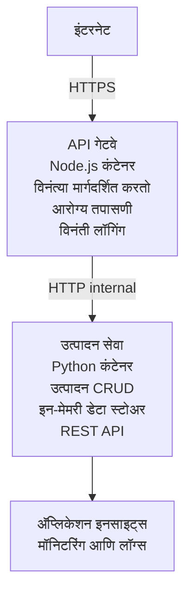

# मायक्रोसर्व्हिसेस आर्किटेक्चर - कंटेनर अ‍ॅप उदाहरण

⏱️ **अनुमानित वेळ**: २५-३५ मिनिटे | 💰 **अनुमानित खर्च**: ~$५०-१००/महिना | ⭐ **कॉम्प्लेक्सिटी**: प्रगत

एझर कंटेनर अ‍ॅप्ससाठी AZD CLI वापरून परिनियोजित केलेला एक **सोप्या पण कार्यक्षम** मायक्रोसर्व्हिसेस आर्किटेक्चर. हे उदाहरण सेवा-ते-सेवा संवाद, कंटेनर ऑर्केस्ट्रेशन, आणि मॉनिटरिंगसह व्यावहारिक २-सेवा सेटअप दाखवते.

> **📚 शिकण्याचा दृष्टिकोन**: हे उदाहरण एका किमान २-सेवा आर्किटेक्चर (API Gateway + Backend Service) पासून सुरू होते जे आपण प्रत्यक्षात परिनियोजित करू शकता आणि शिकू शकता. या मूलभूत गोष्टीत निपुण झाल्यानंतर, संपूर्ण मायक्रोसर्व्हिसेस इकोसिस्टमसाठी मार्गदर्शन दिले जाते.

## तुम्हाला काय शिकायला मिळेल

हे उदाहरण पूर्ण करून, तुम्ही:
- अनेक कंटेनर Azure Container Apps मध्ये परिनियोजित कराल
- अंतर्गत नेटवर्किंगसह सेवा-ते-सेवा संवाद अंमलात आणाल
- पर्यावरण-आधारित स्केलिंग आणि हेल्थ चेक्स कॉन्फिगर कराल
- Application Insights सह वितरित अनुप्रयोगांचे मॉनिटरिंग कराल
- मायक्रोसर्व्हिसेस परिनियोजन नमुन्यांचा आणि सर्वोत्तम पद्धतींचा आढावा घ्याल
- सोप्या पासून गहन आर्किटेक्चरसाठी प्रगत विस्तार शिकाल

## आर्किटेक्चर

### टप्पा १: आपण काय तयार करत आहोत (या उदाहरणात समाविष्ट)


**सोप्या पासून का सुरूवात करायची?**
- ✅ लवकर परिनियोजन आणि समजणे (२५-३५ मिनिटे)
- ✅ कॉम्प्लेक्सिटीशिवाय मूलभूत मायक्रोसर्व्हिसेस नमुने शिकणे
- ✅ कार्यरत कोड जो तुम्ही सुधारू तसे प्रयोग करू शकता
- ✅ शिकण्यासाठी कमी खर्च (~$५०-१००/महिना विरुद्ध $३००-१४००/महिना)
- ✅ डेटाबेसेस आणि मेसेज क्यूज जोडण्यापूर्वी आत्मविश्वास वाढवा

**तुलना**: हे वाहन चालवायला शिकण्यासारखे आहे. तुम्ही रिकाम्या पार्किंग लॉटपासून (२ सेवा) सुरुवात करता, मूलभूत गोष्टी आत्मसात करता, नंतर शहरातील ट्राफिकमध्ये (५+ सेवा आणि डेटाबेससह) प्रगती करता.

### टप्पा २: भविष्यातील विस्तार (संदर्भ आर्किटेक्चर)

एकदा तुम्ही २-सेवा आर्किटेक्चरमध्ये प्रावीण्य मिळवले, तेव्हा तुम्ही पुढीलप्रमाणे विस्तार करू शकता:

```
Full Architecture (Not Included - For Reference)
├── API Gateway (✅ Included)
├── Product Service (✅ Included)
├── Order Service (🔜 Add next)
├── User Service (🔜 Add next)
├── Notification Service (🔜 Add last)
├── Azure Service Bus (🔜 For async communication)
├── Cosmos DB (🔜 For product persistence)
├── Azure SQL (🔜 For order management)
└── Azure Storage (🔜 For file storage)
```

संपूर्ण सूचना आणि मार्गदर्शनासाठी शेवटच्या "Expansion Guide" विभागात पहा.

## समाविष्ट वैशिष्ट्ये

✅ **सेवा शोध**: कंटेनरमधील DNS आधारित आपोआप शोध  
✅ **लोड बॅलेन्सिंग**: रेप्लिका दरम्यान अंगभूत लोड बॅलेन्सिंग  
✅ **ऑटो-स्केलिंग**: HTTP विनंत्यांनुसार स्वतंत्र स्केलिंग  
✅ **हेल्थ मॉनिटरिंग**: दोन्ही सेवांसाठी लाइव्हनेस आणि रेडीनेस प्रोब्स  
✅ **वितरित लॉगिंग**: Application Insights बरोबर केंद्रीकृत लॉगिंग  
✅ **आतील नेटवर्किंग**: सुरक्षित सेवा-सेवा संवाद  
✅ **कंटेनर ऑर्केस्ट्रेशन**: आपोआप परिनियोजन आणि स्केलिंग  
✅ **झिरो-डाऊनटाईम अपडेट्स**: रिव्हिजन व्यवस्थापनासह रोलिंग अपडेट्स  

## पूर्वशर्त

### आवश्यक साधने

सुरू करण्यापूर्वी, तपासा की तुमच्याकडे खालील साधने स्थापित आहेत:

1. **[Azure Developer CLI (azd)](https://learn.microsoft.com/azure/developer/azure-developer-cli/install-azd)** (आवृत्ती 1.0.0 किंवा त्याहून वर)
   ```bash
   azd version
   # अपेक्षित आउटपुट: azd आवृत्ती 1.0.0 किंवा त्यापुढील
   ```

2. **[Azure CLI](https://learn.microsoft.com/cli/azure/install-azure-cli)** (आवृत्ती 2.50.0 किंवा त्याहून वर)
   ```bash
   az --version
   # अपेक्षित आउटपुट: azure-cli 2.50.0 किंवा त्याहून अधिक
   ```

3. **[Docker](https://www.docker.com/get-started)** (स्थानिक विकास/चाचणीसाठी - ऐच्छिक)
   ```bash
   docker --version
   # अपेक्षित आऊटपुट: डॉकर आवृत्ती 20.10 किंवा त्याहून उच्च
   ```

### Azure गरजा

- सक्रिय **Azure सदस्यता** ([फ्री अकाउंट तयार करा](https://azure.microsoft.com/free/))
- आपल्या सदस्यतेमध्ये संसाधने तयार करण्याची परवानगी
- **Contributor** भूमिका सदस्यता किंवा संसाधन गटावर

### ज्ञान पूर्वशर्त

हे एक **प्रगत स्तराचे** उदाहरण आहे. तुम्ही:
- [Simple Flask API उदाहरण](../../../../../examples/container-app/simple-flask-api) पूर्ण केलेले असावे  
- मायक्रोसर्व्हिसेस आर्किटेक्चरचे मूलभूत ज्ञान  
- REST API आणि HTTP ची ओळख  
- कंटेनर संकल्पना समजावून घेतलेली असावी

**Container Apps मध्ये नवीन?** सोप्या Flask API उदाहरणापासून सुरुवात करा आणि मूलभूत गोष्टी शिका.

## जलद प्रारंभ (पायरी-दर-पायरी)

### पायरी १: क्लोन करा आणि नेव्हिगेट करा

```bash
git clone https://github.com/microsoft/AZD-for-beginners.git
cd AZD-for-beginners/examples/container-app/microservices
```

**✓ यशस्वी तपासणी**: तुम्हाला `azure.yaml` दिसावे:
```bash
ls
# अपेक्षित: README.md, azure.yaml, infra/, src/
```

### पायरी २: Azure सह प्रमाणीकरण करा

```bash
azd auth login
```

Azure प्रमाणीकरणासाठी तुमचा ब्राउझर उघडेल. तुमच्या Azure क्रेडेंशियलने साइन इन करा.

**✓ यशस्वी तपासणी**: तुम्हाला हे दिसावे:
```
Logged in to Azure.
```

### पायरी ३: पर्यावरण सुरू करा

```bash
azd init
```

**प्रॉम्प्ट्स जे तुम्हाला दिसतील**:
- **पर्यावरण नाव**: लहान नाव द्या (उदा. `microservices-dev`)
- **Azure सदस्यता**: तुमची सदस्यता निवडा
- **Azure स्थान**: क्षेत्र निवडा (उदा. `eastus`, `westeurope`)

**✓ यशस्वी तपासणी**: खालील दिसावे:
```
SUCCESS: New project initialized!
```

### पायरी ४: इन्फ्रास्ट्रक्चर आणि सेवा परिनियोजित करा

```bash
azd up
```

**होणारे कार्य** (८-१२ मिनिटे लागतात):
1. कंटेनर अ‍ॅप्स पर्यावरण तयार करते
2. मॉनिटरिंगसाठी Application Insights तयार करते
3. API Gateway कंटेनर तयार करते (Node.js)
4. Product Service कंटेनर तयार करते (Python)
5. दोन्ही कंटेनर Azure वर परिनियोजित करते
6. नेटवर्किंग आणि हेल्थ चेक्स कॉन्फिगर करते
7. मॉनिटरिंग आणि लॉगिंग सेटअप करते

**✓ यशस्वी तपासणी**: खालील दिसावे:
```
SUCCESS: Your application was deployed to Azure in X minutes Y seconds.
Endpoint: https://api-gateway-<unique-id>.azurecontainerapps.io
```

**⏱️ वेळ**: ८-१२ मिनिटे

### पायरी ५: परिनियोजन तपासा

```bash
# गेटवे एंडपॉइंट मिळवा
GATEWAY_URL=$(azd env get-values | grep API_GATEWAY_URL | cut -d '=' -f2 | tr -d '"')

# API गेटवेची तब्येत तपासा
curl $GATEWAY_URL/health

# अपेक्षित output:
# {"status":"healthy","service":"api-gateway","timestamp":"2025-11-19T10:30:00Z"}
```

**गेव्हे द्वारे प्रॉडक्ट सेवा तपासा**:
```bash
# उत्पादने यादी करा
curl $GATEWAY_URL/api/products

# अपेक्षित आउटपुट:
# [
#   {"id":1,"name":"लॅपटॉप","price":999.99,"stock":50},
#   {"id":2,"name":"माउस","price":29.99,"stock":200},
#   {"id":3,"name":"कीबोर्ड","price":79.99,"stock":150}
# ]
```

**✓ यशस्वी तपासणी**: दोन्ही एंडपॉइंट्स त्रुटीशिवाय JSON डेटा परत करतात.

---

**🎉 अभिनंदन!** आपण मायक्रोसर्व्हिसेस आर्किटेक्चर Azure मध्ये परिनियोजित केले आहे!

## प्रोजेक्ट संरचना

सर्व अंमलबजावणी फाइल्स समाविष्ट आहेत—हे एक पूर्ण, कार्यरत उदाहरण आहे:

```
microservices/
│
├── README.md                         # This file
├── azure.yaml                        # AZD configuration
├── .gitignore                        # Git ignore patterns
│
├── infra/                           # Infrastructure as Code (Bicep)
│   ├── main.bicep                   # Main orchestration
│   ├── abbreviations.json           # Naming conventions
│   ├── core/                        # Shared infrastructure
│   │   ├── container-apps-environment.bicep  # Container environment + registry
│   │   └── monitor.bicep            # Application Insights + Log Analytics
│   └── app/                         # Service definitions
│       ├── api-gateway.bicep        # API Gateway container app
│       └── product-service.bicep    # Product Service container app
│
└── src/                             # Application source code
    ├── api-gateway/                 # Node.js API Gateway
    │   ├── app.js                   # Express server with routing
    │   ├── package.json             # Node dependencies
    │   └── Dockerfile               # Container definition
    └── product-service/             # Python Product Service
        ├── main.py                  # Flask API with product data
        ├── requirements.txt         # Python dependencies
        └── Dockerfile               # Container definition
```

**प्रत्येक घटक काय करतो:**

**इन्फ्रास्ट्रक्चर (infra/)**:
- `main.bicep`: सर्व Azure साधने व त्यांचे अवलंबित्वे व्यवस्थापित करते
- `core/container-apps-environment.bicep`: कंटेनर अ‍ॅप्स पर्यावरण व Azure कंटेनर रजिस्ट्री तयार करते
- `core/monitor.bicep`: वितरित लॉगिंगसाठी Application Insights सेटअप करते
- `app/*.bicep`: स्वतंत्र कंटेनर अ‍ॅप्सची व्याख्या, स्केलिंग व हेल्थ चेक्ससह

**API Gateway (src/api-gateway/)**:
- सार्वजनिक सेवा जी मागील सेवांकडे विनंत्या मार्गदर्शित करते
- लॉगिंग, त्रुटी हाताळणी, विनंती पुढे पाठवणे कार्यान्वित करते
- सेवा-ते-सेवा HTTP संवाद दर्शवते

**Product Service (src/product-service/)**:
- अंतर्गत सेवा ज्यात उत्पादन कॅटलॉग (सोप्या हेतूसाठी मेमरीमध्ये)
- REST API ज्यात हेल्थ चेक्स आहेत
- बॅकएंड मायक्रोसर्व्हिस नमुन्याचे उदाहरण

## सेवा आढावा

### API Gateway (Node.js/Express)

**पोर्ट**: 8080  
**अॅक्सेस**: सार्वजनिक (बाह्य प्रवेश)  
**उद्दिष्ट**: येणाऱ्या विनंत्या योग्य बॅकएंड सेवांकडे मार्गदर्शित करणे

**एंडपॉइंट्स**:
- `GET /` - सेवा माहिती
- `GET /health` - हेल्थ चेक एंडपॉइंट
- `GET /api/products` - प्रॉडक्ट सेवा कडे पुढे करा (सर्व सूचीबद्ध करा)
- `GET /api/products/:id` - प्रॉडक्ट सेवा कडे पुढे करा (ID नुसार प्राप्त करा)

**मुख्य वैशिष्ट्ये**:
- विनंती मार्गदर्शन axios वापरून
- केंद्रीकृत लॉगिंग
- त्रुटी हाताळणी व टाइमआउट व्यवस्थापन
- पर्यावरण चलांद्वारे सेवा शोध
- Application Insights समाकलन

**कोड हायलाइट** (`src/api-gateway/app.js`):
```javascript
// अंतर्गत सेवा संवाद
app.get('/api/products', async (req, res) => {
  const response = await axios.get(`${PRODUCT_SERVICE_URL}/products`);
  res.json(response.data);
});
```

### Product Service (Python/Flask)

**पोर्ट**: 8000  
**अॅक्सेस**: फक्त अंतर्गत (बाह्य प्रवेश नाही)  
**उद्दिष्ट**: उत्पादन कॅटलॉगची मेमरी-आधारित व्यवस्था करते

**एंडपॉइंट्स**:
- `GET /` - सेवा माहिती
- `GET /health` - हेल्थ चेक एंडपॉइंट
- `GET /products` - सर्व उत्पादने सूचीबद्ध करा
- `GET /products/<id>` - ID नुसार उत्पादन प्राप्त करा

**मुख्य वैशिष्ट्ये**:
- Flask सह RESTful API
- मेमरीमधील उत्पादन संचय (सोपे, डेटाबेसची गरज नाही)
- हेल्थ मॉनिटरिंग साठी प्रोब्स
- संरचित लॉगिंग
- Application Insights समाकलन

**डेटा मॉडेल**:
```python
{
  "id": 1,
  "name": "Laptop",
  "description": "High-performance laptop",
  "price": 999.99,
  "stock": 50
}
```

**फक्त अंतर्गत का?**
प्रॉडक्ट सेवा सार्वजनिकरित्या उघडलेली नाही. सर्व विनंत्या API Gateway द्वारे जातात, जे देते:
- सुरक्षा: नियंत्रित प्रवेश बिंदू
- लवचिकता: बॅकएंड बदलता येतो क्लाएंटला परिणाम नाही
- मॉनिटरिंग: केंद्रीकृत विनंती लॉगिंग

## सेवा संवाद समजून घेणे

### सेवा एकमेकांशी कशा संवाद करतात

या उदाहरणात, API Gateway प्रॉडक्ट सेवेशी **अंतर्गत HTTP कॉल्स** वापरून बोलतो:

```javascript
// API गेटवे (src/api-gateway/app.js)
const PRODUCT_SERVICE_URL = process.env.PRODUCT_SERVICE_URL;

// अंतर्गत HTTP विनंती करा
const response = await axios.get(`${PRODUCT_SERVICE_URL}/products`);
```

**महत्त्वाचे मुद्दे**:

1. **DNS-आधारित शोध**: कंटेनर अ‍ॅप्स अंतर्गत सेवांसाठी DNS आपोआप पुरवतात
   - प्रॉडक्ट सेवा FQDN: `product-service.internal.<environment>.azurecontainerapps.io`
   - सुलभ रूपी: `http://product-service` (Container Apps हे निराकरण करते)

2. **कोणताही सार्वजनिक उघड**: प्रॉडक्ट सेवेचे Bicep मध्ये `external: false` आहे
   - फक्त कंटेनर अ‍ॅप्स पर्यावरणाच्या आत प्रवेशयोग्य
   - इंटरनेटवरून प्रवेश नाही

3. **पर्यावरण चल**: सेवा URL परिनियोजन वेळी इंजेक्ट केले जातात
   - Bicep द्वारे अंतर्गत FQDN गेटवे ला दिले जातात
   - अ‍ॅप्लिकेशन कोडमध्ये हार्डकोडेड URL नाहीत

**तुलना**: हा ऑफिसच्या खोल्यांसारखा आहे. API Gateway हा स्वागत डेस्क (सार्वजनिक) आहे आणि प्रॉडक्ट सेवा एक ऑफिसचा खोली (फक्त अंतर्गत). पाहुण्यांनी ऑफिसमध्ये जाण्यासाठी स्वागतावरून जावे लागते.

## परिनियोजन पर्याय

### पूर्ण परिनियोजन (शिफारस केलेले)

```bash
# पायाभूत सुविधा आणि दोन्ही सेवा तैनात करा
azd up
```

हे परिनियोजित करते:
1. कंटेनर अ‍ॅप्स पर्यावरण
2. Application Insights
3. कंटेनर रजिस्ट्री
4. API Gateway कंटेनर
5. Product Service कंटेनर

**वेळ**: ८-१२ मिनिटे

### स्वतंत्र सेवा परिनियोजित करा

```bash
# फक्त एक सेवा तैनात करा (प्रारंभिक azd up नंतर)
azd deploy api-gateway

# किंवा उत्पादन सेवा तैनात करा
azd deploy product-service
```

**वापर केस**: एखाद्या सेवेतील कोड बदलल्यानंतर फक्त ती सेवा पुन्हा परिनियोजित करणे.

### संरचना अपडेट करा

```bash
# स्केलिंग पॅरामीटर्स बदला
azd env set GATEWAY_MAX_REPLICAS 30

# नवीन कॉन्फिगरेशनसह पुन्हा तैनात करा
azd up
```

## संरचना

### स्केलिंग संरचना

दोन्ही सेवांना त्यांच्या Bicep फाइल्समध्ये HTTP-आधारित ऑटोस्केलिंगसाठी कॉन्फिगर केले आहे:

**API Gateway**:
- किमान रेप्लिका: २ (किंवा त्याहून अधिक अस्तित्त्वासाठी)
- कमाल रेप्लिका: २०
- स्केल ट्रिगर: दर रेप्लिकावर ५० समांतर विनंती

**Product Service**:
- किमान रेप्लिका: १ (गरज असल्यास शून्य पर्यंत स्केल करू शकते)
- कमाल रेप्लिका: १०
- स्केल ट्रिगर: दर रेप्लिकावर १०० समांतर विनंती

**स्केलिंग सानुकूल करा** (`infra/app/*.bicep` मध्ये):
```bicep
scale: {
  minReplicas: 1
  maxReplicas: 10
  rules: [
    {
      name: 'http-scale-rule'
      http: {
        metadata: {
          concurrentRequests: '100'  // Adjust this
        }
      }
    }
  ]
}
```

### संसाधन वाटप

**API Gateway**:
- CPU: 1.0 vCPU  
- मेमरी: 2 GiB  
- कारण: सर्व बाह्य ट्रॅफिक हाताळतो

**Product Service**:
- CPU: 0.5 vCPU  
- मेमरी: 1 GiB  
- कारण: हलके मेमरी आधारित ऑपरेशन्स

### हेल्थ चेक्स

दोन्ही सेवांमध्ये लाइव्हनेस आणि रेडीनेस प्रोब्स आहेत:

```bicep
probes: [
  {
    type: 'Liveness'
    httpGet: {
      path: '/health'
      port: 8080
    }
    initialDelaySeconds: 10
    periodSeconds: 30
  }
  {
    type: 'Readiness'
    httpGet: {
      path: '/health'
      port: 8080
    }
    initialDelaySeconds: 5
    periodSeconds: 10
  }
]
```

**याचा अर्थ**:
- **लाइवनेस**: हेल्थ चेक फेल झाल्यास, कंटेनर अ‍ॅप्स कंटेनर पुनःप्रारंभ करतात
- **रेडीनेस**: रेडी नसल्यास, कंटेनर अ‍ॅप्स त्या रेप्लिकाकडे ट्रॅफिक मार्गदर्शन थांबवतो


## मॉनिटरिंग आणि दृश्यता

### सेवा लॉग पहा

```bash
# azd monitor वापरून लॉग पहा
azd monitor --logs

# किव्हा विशिष्ट कंटेनर अ‍ॅप्ससाठी Azure CLI वापरा:
# API गेटवे कडून लॉग प्रवाहित करा
az containerapp logs show --name api-gateway --resource-group $RG_NAME --follow

# अलीकडील उत्पादन सेवा लॉग पहा
az containerapp logs show --name product-service --resource-group $RG_NAME --tail 100
```

**अपेक्षित आउटपुट**:
```
[api-gateway] API Gateway listening on port 8080
[api-gateway] Product Service URL: http://product-service
[api-gateway] GET /api/products 200 - 45ms
[product-service] Retrieved 5 products
```

### Application Insights प्रश्न

Azure पोर्टलमधील Application Insights मध्ये प्रवेश करा आणि नंतर हे प्रश्न चालवा:

**मंद विनंत्या शोधा**:
```kusto
requests
| where timestamp > ago(1h)
| where duration > 1000  // Requests taking >1 second
| summarize count() by name, cloud_RoleName
| order by count_ desc
```

**सेवा-सेवा कॉल ट्रॅक करा**:
```kusto
dependencies
| where timestamp > ago(1h)
| where type == "Http"
| project timestamp, name, target, duration, success
| order by timestamp desc
```

**सेवा द्वारे त्रुटी दर**:
```kusto
exceptions
| where timestamp > ago(24h)
| summarize errorCount = count() by cloud_RoleName, type
| order by errorCount desc
```

**काळानुसार विनंतीचे प्रमाण**:
```kusto
requests
| where timestamp > ago(1h)
| summarize requestCount = count() by bin(timestamp, 5m), cloud_RoleName
| render timechart
```

### मॉनिटरिंग डॅशबोर्डमध्ये प्रवेश करा

```bash
# ऍप्लिकेशन इनसाइट्स तपशील मिळवा
azd env get-values | grep APPLICATIONINSIGHTS

# Azure पोर्टल मॉनिटरिंग उघडा
az monitor app-insights component show \
  --app $(azd env get-values | grep APPLICATIONINSIGHTS_CONNECTION_STRING | cut -d '=' -f2) \
  --resource-group $(azd env get-values | grep AZURE_RESOURCE_GROUP | cut -d '=' -f2) \
  --query "appId" -o tsv
```

### थेट मेट्रिक्स

1. Azure पोर्टलमधील Application Insights मध्ये जा
2. "Live Metrics" वर क्लिक करा
3. रिअल-टाइम विनंत्या, अपयश, आणि कार्यक्षमता पहा
4. हे करून पहा: `curl $(azd env get-values | grep API_GATEWAY_URL | cut -d '=' -f2 | tr -d '"')/api/products`

## व्यावहारिक सराव

[टीप: तपशीलवार पायरी-दर-पायरी सरावांसाठी वरील "Practical Exercises" विभाग पहा ज्यामध्ये परिनियोजन तपासणी, डेटा सुधारणा, ऑटोस्केलिंग चाचण्या, त्रुटी हाताळणी, आणि तिसरी सेवा जोडणे यांचा समावेश आहे.]

## खर्च विश्लेषण

### अंदाजित मासिक खर्च (या २-सेवा उदाहरणासाठी)

| संसाधन | संरचना | अंदाजित खर्च |
|----------|--------------|----------------|
| API Gateway | 2-20 रेप्लिका, 1 vCPU, 2GB RAM | $30-150 |
| Product Service | 1-10 रेप्लिका, 0.5 vCPU, 1GB RAM | $15-75 |
| कंटेनर रजिस्ट्री | बेसिक टियर | $5 |
| Application Insights | 1-2 GB/महिना | $5-10 |
| लॉग अ‍ॅनालिटिक्स | 1 GB/महिना | $3 |
| **एकूण** | | **$58-243/महिना** |

**वापरानुसार खर्चाचे विखंडन**:
- **हलका ट्रॅफिक** (चाचणी/अभ्यास): ~$60/महिना
- **मध्यम ट्रॅफिक** (लहान उत्पादन): ~$120/महिना
- **जास्त ट्रॅफिक** (गडद काळ): ~$240/महिना

### खर्च कमी करण्यासाठी टिप्स

1. **विकासासाठी शून्य स्केलिंग वापरा**:
   ```bicep
   scale: {
     minReplicas: 0  // Save $30-40/month when not in use
     maxReplicas: 10
   }
   ```

2. **Cosmos DB साठी कंजम्प्शन प्लॅन वापरा** (तुम्ही जोडल्यावर):
   - फक्त वापरलेल्या प्रमाणात पैसे द्या
   - किमान शुल्क नाही

3. **Application Insights साठी सॅम्पलिंग सेट करा**:
   ```javascript
   appInsights.defaultClient.config.samplingPercentage = 50; // विनंत्यांपैकी ५०% नमुना घ्या
   ```

4. **गरज नसल्यास संसाधने क्लीनअप करा**:
   ```bash
   azd down
   ```

### फ्री टियर विकल्प

अभ्यास/चाचणीसाठी विचार करा:
- Azure विनामूल्य क्रेडिट वापरा (पहिले ३० दिवस)
- किमान प्रतिकृती ठेवा
- चाचणी नंतर हटवा (सतत शुल्क नाही)

---

## साफसफाई

सतत शुल्क टाळण्यासाठी, सर्व संसाधने हटवा:

```bash
azd down --force --purge
```

**पुष्टीकरण विनंती**:
```
? Total resources to delete: 6, are you sure you want to continue? (y/N)
```

पुष्टीकरणासाठी `y` टाइप करा.

**काय हटवले जाईल**:
- कंटेनर अ‍ॅप्स एन्व्हायर्नमेंट
- दोन्ही कंटेनर अ‍ॅप्स (गेटवे & उत्पादन सेवा)
- कंटेनर रजिस्ट्री
- अ‍ॅप्लिकेशन इन्साइट्स
- लॉग अ‍ॅनालिटिक्स वर्कस्पेस
- रिसोर्स ग्रुप

**✓ साफसफाई तपासा**:
```bash
az group list --query "[?starts_with(name,'rg-microservices')]" --output table
```

रिक्त परिणाम यायला हवा.

---

## विस्तार मार्गदर्शक: २ ते ५+ सेवा

तुम्ही ही २-सेवा वास्तुकला आत्मसात केल्यानंतर, पुढे कशी वाढवायची याचे मार्गदर्शन येथे आहे:

### टप्पा १: डेटाबेस सुसंगतता जोडा (पुढील पाऊल)

**प्रोडक्ट सेवेकरिता Cosmos DB जोडा**:

१. `infra/core/cosmos.bicep` तयार करा:
   ```bicep
   resource cosmosAccount 'Microsoft.DocumentDB/databaseAccounts@2023-04-15' = {
     name: name
     location: location
     kind: 'GlobalDocumentDB'
     properties: {
       databaseAccountOfferType: 'Standard'
       locations: [{ locationName: location, failoverPriority: 0 }]
     }
   }
   ```

२. उत्पादन सेवा सुधारित करा जेणेकरून ती मेमरीमधील डेटा ऐवजी Cosmos DB वापरेल

३. अंदाजे अतिरिक्त खर्च: ~$२५/महिना (सर्व्हरलेस)

### टप्पा २: तिसरी सेवा जोडा (आर्डर व्यवस्थापन)

**ऑर्डर सेवा तयार करा**:

१. नवीन फोल्डर: `src/order-service/` (Python/Node.js/C#)
२. नवीन Bicep: `infra/app/order-service.bicep`
३. API गेटवे अपडेट करा `/api/orders` मार्गक्रमण करण्यासाठी
४. ऑर्डर साठवणुकीसाठी Azure SQL डेटाबेस जोडा

**आर्किटेक्चर असे होईल**:
```
API Gateway → Product Service (Cosmos DB)
           → Order Service (Azure SQL)
```

### टप्पा ३: असिंक्रोनस संवाद जोडा (सर्व्हिस बस)

**घटना-आधारित आर्किटेक्चर अमलात आणा**:

१. Azure Service Bus जोडा: `infra/core/servicebus.bicep`
२. प्रोडक्ट सेवा "ProductCreated" घटना प्रकाशित करते
३. ऑर्डर सेवा प्रोडक्ट घटनांना सदस्यत्व घेते
४. नोटिफिकेशन सेवा घटना प्रक्रिया करण्यासाठी जोडा

**पॅटर्न**: विनंती/प्रतिक्रिया (HTTP) + घटना-आधारित (सर्व्हिस बस)

### टप्पा ४: वापरकर्ता प्रमाणीकरण जोडा

**वापरकर्ता सेवा तयार करा**:

१. `src/user-service/` तयार करा (Go/Node.js)
२. Azure AD B2C किंवा सानुकूल JWT प्रमाणीकरण जोडा
३. API गेटवे टोकन वैध करणारे ठेवा
४. सेवा वापरकर्ता परवाने तपासतात

### टप्पा ५: उत्पादनासाठी तयार

**ही घटक जोडा**:
- Azure Front Door (जागतिक लोड संतुलन)
- Azure Key Vault (गोपनीयता व्यवस्थापन)
- Azure Monitor Workbooks (सानुकूल डॅशबोर्ड)
- CI/CD पाइपलाइन (GitHub Actions)
- ब्लू-ग्रीन तैनाती
- सर्व सेवांसाठी व्यवस्थापित आयडेंटिटी

**पूर्ण उत्पादन आर्किटेक्चर खर्च**: ~$३००-१,४००/महिना

---

## अधिक जाणून घ्या

### संबंधित दस्तऐवज
- [Azure Container Apps Documentation](https://learn.microsoft.com/azure/container-apps/)
- [Microservices Architecture Guide](https://learn.microsoft.com/azure/architecture/guide/architecture-styles/microservices)
- [Application Insights for Distributed Tracing](https://learn.microsoft.com/azure/azure-monitor/app/distributed-tracing)
- [Azure Developer CLI Documentation](https://learn.microsoft.com/azure/developer/azure-developer-cli/)

### या कोर्समधील पुढील पाऊल
- ← मागील: [Simple Flask API](../../../../../examples/container-app/simple-flask-api) - सोपी सिंगल-कंटेनर उदाहरण
- → पुढील: [AI Integration Guide](../../../../../examples/docs/ai-foundry) - AI क्षमता जोडा
- 🏠 [कोर्स गृहपृष्ठ](../../README.md)

### तुलना: काय कधी वापरावे

**सिंगल कंटेनर अ‍ॅप** (सिंपल Flask API उदाहरण):
- ✅ सोपे अनुप्रयोग
- ✅ मोनोलिथिक आर्किटेक्चर
- ✅ जलद तैनात
- ❌ मर्यादित स्केलेबिलिटी
- **खर्च**: ~$१५-५०/महिना

**मायक्रोसर्व्हिसेस** (हे उदाहरण):
- ✅ गुंतागुंतीचे अनुप्रयोग
- ✅ प्रत्येक सेवेस स्वतंत्र प्रमाणन
- ✅ संघ autonomy (भिन्न सेवा, भिन्न संघ)
- ❌ व्यवस्थापन अधिक क्लिष्ट
- **खर्च**: ~$६०-२५०/महिना

**कुबेरनेट्स (AKS)**:
- ✅ जास्तीत जास्त नियंत्रण आणि लवचीकता
- ✅ मल्टी-क्लाउड पोर्टेबिलिटी
- ✅ प्रगत नेटवर्किंग
- ❌ कुबेरनेट्स तज्ञतेची गरज
- **खर्च**: ~$१५०-५००/महिना किमान

**शिफारस**: कंटेनर अ‍ॅप्सपासून (हे उदाहरण) सुरुवात करा, केवळ कुबेरनेट्स-विशिष्ट वैशिष्ट्यांसाठी AKS कडे जा.

---

## वारंवार विचारले जाणारे प्रश्न

**प्र: ५+ सेवांऐवजी फक्त २ सेवा का?**  
उ: शैक्षणिक प्रगतीसाठी. सोप्या उदाहरणाने सेवा संवाद, मॉनिटरींग, स्केलिंग यांचे मूलतत्त्व समजून घ्या, त्यानंतर जास्त क्लिष्टता जोडा. येथे शिकलेले पॅटर्न १००-सेवा आर्किटेक्चरसाठीही लागू होतात.

**प्र: मी स्वतः अधिक सेवा जोडू शकतो का?**  
उ: नक्कीच! वरील विस्तार मार्गदर्शक पाळा. प्रत्येक नवीन सेवा याच पद्धतीने तयार होते: src फोल्डर तयार करा, Bicep फाइल तयार करा, azure.yaml अपडेट करा, आणि तैनात करा.

**प्र: हे उत्पादनासाठी तयार आहे का?**  
उ: हा एक मजबूत पाया आहे. उत्पादनासाठी: व्यवस्थापित आयडेंटिटी, Key Vault, कायमस्वरूपी डेटाबेस, CI/CD पाइपलाइन, मॉनिटरिंग अलर्ट आणि बॅकअप धोरण जोडा.

**प्र: Dapr किंवा इतर सेवा मेष का वापरू नये?**  
उ: शिकण्यासाठी सोपे ठेवा. कंटेनर अ‍ॅप्स नेटववर्किंग नॅटीव्ह समजल्यावरच, तुम्ही प्रगत परिस्थितीसाठी Dapr जोडू शकता.

**प्र: मी स्थानिकपणे कसे डिबग करू?**  
उ: सेवांना लोकलमध्ये Docker सह चालवा:
```bash
cd src/api-gateway
docker build -t local-gateway .
docker run -p 8080:8080 -e PRODUCT_SERVICE_URL=http://localhost:8000 local-gateway
```

**प्र: वेगवेगळ्या प्रोग्रामिंग भाषांचा वापर करू शकतो का?**  
उ: होय! हे उदाहरण Node.js (गेटवे) + Python (उत्पादन सेवा) दाखवते. कोणतीही कंटेनरमध्ये चालणारी भाषा वापरू शकता.

**प्र: माझ्याकडे Azure क्रेडिट्स नाहीत तर काय?**  
उ: Azure फ्री टियर वापरा (नवीन खात्यांसाठी पहिले ३० दिवस) किंवा लघुकाळ चाचणीसाठी तैनात करा आणि लगेच हटवा.

---

> **🎓 शिक्षणाचा सारांश**: तुम्ही बहु-सेवा आर्किटेक्चर स्थापणे शिकले ज्यात स्वयंचलित स्केलिंग, अंतर्गत नेटवर्किंग, केंद्रीकृत मॉनिटरिंग, आणि उत्पादन-तयार पॅटर्न आहेत. हा पाया तुम्हाला क्लिष्ट वितरित प्रणाली आणि एंटरप्राइज मायक्रोसर्व्हिसेस आर्किटेक्चरकरिता सज्ज करतो.

**📚 कोर्स नेव्हिगेशन:**
- ← मागील: [Simple Flask API](../../../../../examples/container-app/simple-flask-api)
- → पुढील: [Database Integration Example](../../../../../examples/database-app)
- 🏠 [कोर्स गृहपृष्ठ](../../../README.md)
- 📖 [Container Apps उत्तम पद्धती](../../../docs/chapter-04-infrastructure/deployment-guide.md)

---

<!-- CO-OP TRANSLATOR DISCLAIMER START -->
**सूचना**:
हा दस्तऐवज AI भाषांतर सेवा [Co-op Translator](https://github.com/Azure/co-op-translator) वापरून भाषांतरित करण्यात आला आहे. आम्ही अचूकतेसाठी प्रयत्नशील असलो तरी, कृपया जाणून घ्या की स्वयंचलित भाषांतरात चुका किंवा अचूकतेच्या अपुरत्या बाबी असू शकतात. मूळ दस्तऐवज त्याच्या मूळ भाषेत अधिकृत स्रोत मानला जावा. महत्त्वाची माहिती असल्यास, व्यावसायिक मानवी भाषांतर करण्याचा सल्ला दिला जातो. या भाषांतराच्या वापरामुळे झालेल्या कोणत्याही गैरसमजुती किंवा चुकीच्या अर्थलागीसाठी आम्ही जबाबदार नाही.
<!-- CO-OP TRANSLATOR DISCLAIMER END -->