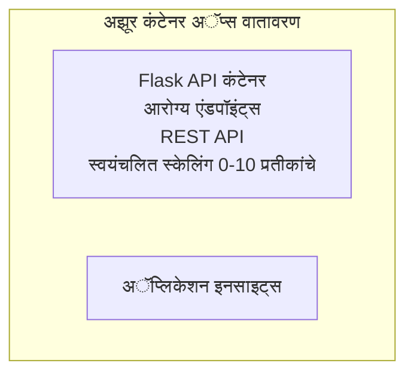

# सोपा Flask API - कंटेनर अ‍ॅप उदाहरण

**शिकण्याचा मार्ग:** नवशिक्या ⭐ | **वेळ:** २५-३५ मिनिटे | **खर्च:** $0-15/महिना

पूर्ण, कार्यान्वित Python Flask REST API ज्याला Azure Container Apps मध्ये Azure Developer CLI (azd) वापरून तैनात करण्यात आले आहे. हे उदाहरण कंटेनर तैनाती, ऑटो-स्केलिंग, आणि मॉनिटरिंग मूलभूत गोष्टी दाखवते.

## 🎯 तुम्ही काय शिकाल

- कंटेनरयुक्त Python अ‍ॅप्लिकेशन Azure वर तैनात करणे
- scale-to-zero सह ऑटो-स्केलिंग कॉन्फिगर करणे
- हेल्थ प्रोब आणि रेडीनेस चेक लागू करणे
- अ‍ॅप्लिकेशनचे लॉग्स आणि मेट्रिक्स मॉनिटर करणे
- Azure Developer CLI वापरून जलद तैनाती करणे

## 📦 यामध्ये काय समाविष्ट आहे

✅ **Flask अ‍ॅप्लिकेशन** - CRUD ऑपरेशन्ससह पूर्ण REST API (`src/app.py`)  
✅ **Dockerfile** - उत्पादनासाठी तयार कंटेनर कॉन्फिगरेशन  
✅ **Bicep इन्फ्रास्ट्रक्चर** - कंटेनर अ‍ॅप्स वातावरण आणि API तैनाती  
✅ **AZD कॉन्फिगरेशन** - एक-कमान तैनात सेटअप  
✅ **हेल्थ प्रोब्स** - लाइव्हनेस आणि रेडीनेस चेक कॉन्फिगर केलेले  
✅ **ऑटो-स्केलिंग** - HTTP लोडवर आधारित 0-10 प्रतिकृती  

## आर्किटेक्चर



## आवश्यक पूर्वअट

### आवश्यक
- **Azure Developer CLI (azd)** - [इंस्टॉल मार्गदर्शक](https://learn.microsoft.com/azure/developer/azure-developer-cli/install-azd)
- **Azure सदस्यता** - [मुफ्त खाते](https://azure.microsoft.com/free/)
- **Docker Desktop** - [Docker इंस्टॉल करा](https://www.docker.com/products/docker-desktop/) (स्थानिक चाचणीसाठी)

### पूर्वअटींची पुष्टी करा

```bash
# azd आवृत्ती तपासा (1.5.0 किंवा त्याहून अधिक आवश्यक आहे)
azd version

# Azure लॉगिन सत्यापित करा
azd auth login

# Docker तपासा (ऐच्छिक, स्थानिक चाचणीसाठी)
docker --version
```

## ⏱️ तैनाती कालावधी

| टप्पा | कालावधी | काय होते |
|-------|----------|--------------||
| पर्यावरण सेटअप | ३० सेकंद | azd चा पर्यावरण तयार करा |
| कंटेनर तयार करा | २-३ मिनिटे | Docker वापरून Flask अ‍ॅप बिल्ड करा |
| इन्फ्रास्ट्रक्चर पुरवठा | ३-५ मिनिटे | कंटेनर अ‍ॅप्स, रजिस्ट्री, मॉनिटरिंग तयार करा |
| अ‍ॅप्लिकेशन तैनात करा | २-३ मिनिटे | इमेज पुश करा आणि कंटेनर अ‍ॅप्स मध्ये डिप्लॉय करा |
| **एकूण** | **८-१२ मिनिटे** | पूर्ण तैनाती तयार |

## जलद प्रारंभ

```bash
# उदाहरणासाठी नेव्हिगेट करा
cd examples/container-app/simple-flask-api

# पर्यावरण प्रारंभ करा (अद्वितीय नाव निवडा)
azd env new myflaskapi

# सर्व काही तैनात करा (पायाभूत सुविधा + अनुप्रयोग)
azd up
# आपल्याला विचारले जाईल:
# 1. Azure सदस्यता निवडा
# 2. स्थान निवडा (उदा., eastus2)
# 3. तैनातीसाठी 8-12 मिनिटे प्रतीक्षा करा

# आपल्या API एन्डपॉइंट मिळवा
azd env get-values

# API चाचणी करा
curl $(azd env get-value API_ENDPOINT)/health
```

**अपेक्षित आउटपुट:**
```json
{
  "status": "healthy",
  "timestamp": "2025-11-19T10:30:00Z",
  "service": "simple-flask-api",
  "version": "1.0.0"
}
```

## ✅ तैनातीची पुष्टी करा

### टप्पा 1: तैनाती स्थिती तपासा

```bash
# तैनात सेवा पहा
azd show

# अपेक्षित आउटपुट दाखवतो:
# - सेवा: api
# - पूर्णांक: https://ca-api-[env].xxx.azurecontainerapps.io
# - स्थिती: चालू आहे
```

### टप्पा 2: API एंडपॉइंट्स तपासा

```bash
# API एंडपॉइंट मिळवा
API_URL=$(azd env get-value API_ENDPOINT)

# आरोग्य तपासा
curl $API_URL/health

# रूट एंडपॉइंट तपासा
curl $API_URL/

# एक आयटम तयार करा
curl -X POST $API_URL/api/items \
  -H "Content-Type: application/json" \
  -d '{"name": "Test Item", "description": "My first item"}'

# सर्व आयटम मिळवा
curl $API_URL/api/items
```

**यशस्वी निकष:**
- ✅ हेल्थ एंडपॉइंट HTTP 200 परत करतो
- ✅ मूळ एंडपॉइंट API माहिती दाखवतो
- ✅ POST मध्ये वस्तू तयार होते आणि HTTP 201 परत करते
- ✅ GET तयार केलेल्या वस्तू परत करते

### टप्पा 3: लॉग्स बघा

```bash
# azd monitor वापरून थेट लॉग प्रवाहित करा
azd monitor --logs

# किंवा Azure CLI वापरा:
az containerapp logs show --name api --resource-group $RG_NAME --follow

# तुम्हाला हे दिसावे लागेल:
# - Gunicorn सुरू होण्याचे संदेश
# - HTTP विनंती लॉग
# - अनुप्रयोग माहिती लॉग
```

## प्रोजेक्ट रचना

```
simple-flask-api/
├── azure.yaml              # AZD configuration
├── infra/
│   ├── main.bicep         # Main infrastructure
│   ├── main.parameters.json
│   └── app/
│       ├── container-env.bicep
│       └── api.bicep
└── src/
    ├── app.py             # Flask application
    ├── requirements.txt
    └── Dockerfile
```

## API एंडपॉइंट्स

| एंडपॉइंट | पद्धत | वर्णन |
|----------|--------|-------------|
| `/health` | GET | हेल्थ तपासणी |
| `/api/items` | GET | सर्व वस्तूंची यादी |
| `/api/items` | POST | नवीन वस्तू तयार करा |
| `/api/items/{id}` | GET | विशिष्ट वस्तू मिळवा |
| `/api/items/{id}` | PUT | वस्तू अपडेट करा |
| `/api/items/{id}` | DELETE | वस्तू हटवा |

## कॉन्फिगरेशन

### पर्यावरण चल (Environment Variables)

```bash
# सानुकूल कॉन्फिगरेशन सेट करा
azd env set PORT 8000
azd env set LOG_LEVEL info
azd env set MAX_REPLICAS 20
```

### स्केलिंग कॉन्फिगरेशन

API HTTP ट्रॅफिकच्या आधारावर आपोआप स्केल होते:
- **कमी प्रतिनिधी:** 0 (idle असताना शून्यावर स्केल होते)
- **कमाल प्रतिनिधी:** 10
- **प्रतिकृतींवर एकाचवेळी विनंत्या:** 50

## विकास

### स्थानिक चालवा

```bash
# अवलंबित्वे स्थापित करा
cd src
pip install -r requirements.txt

# अॅप चालवा
python app.py

# स्थानिकरित्या चाचणी करा
curl http://localhost:8000/health
```

### कंटेनर तयार करा आणि तपासा

```bash
# डॉकटर इमेज तयार करा
docker build -t flask-api:local ./src

# कंटेनर स्थानिकरित्या चालवा
docker run -p 8000:8000 flask-api:local

# कंटेनरची चाचणी करा
curl http://localhost:8000/health
```

## तैनाती

### पूर्ण तैनाती

```bash
# पायाभूत सुविधा आणि अनुप्रयोग तैनात करा
azd up
```

### फक्त कोड तैनात करा

```bash
# फक्त अनुप्रयोग कोड तैनात करा (पायाभूत सुविधा अपरिवर्तित)
azd deploy api
```

### कॉन्फिगरेशन अपडेट करा

```bash
# पर्यावरण चल बदलवा
azd env set API_KEY "new-api-key"

# नवीन संरचनेसह पुनःवितरण करा
azd deploy api
```

## मॉनिटरिंग

### लॉग्स बघा

```bash
# azd monitor वापरून लाइव्ह लॉग्स प्रवाहित करा
azd monitor --logs

# किंवा कंटेनर अ‍ॅपसाठी Azure CLI वापरा:
az containerapp logs show --name api --resource-group $RG_NAME --follow

# शेवटचे १०० ओळी पाहा
az containerapp logs show --name api --resource-group $RG_NAME --tail 100
```

### मेट्रिक्स मॉनिटर करा

```bash
# Azure Monitor डॅशबोर्ड उघडा
azd monitor --overview

# विशिष्ट मेट्रिक्स पहा
az monitor metrics list \
  --resource $(azd show --output json | jq -r '.services.api.resourceId') \
  --metric "Requests,ResponseTime"
```

## चाचणी

### हेल्थ तपासणी

```bash
curl $(azd show --output json | jq -r '.services.api.endpoint')/health
```

अपेक्षित प्रतिसाद:
```json
{
  "status": "healthy",
  "timestamp": "2025-11-19T10:30:00Z"
}
```

### वस्तू तयार करा

```bash
curl -X POST $(azd show --output json | jq -r '.services.api.endpoint')/api/items \
  -H "Content-Type: application/json" \
  -d '{"name": "Test Item", "description": "A test item"}'
```

### सर्व वस्तू मिळवा

```bash
curl $(azd show --output json | jq -r '.services.api.endpoint')/api/items
```

## खर्चात बचत

ही तैनाती scale-to-zero वापरते, म्हणजे API विनंत्या प्रक्रिया करत असतानाच तुम्हाला शुल्क भरावे लागते:

- **आळशी काळाचा खर्च**: ~$0/महिना (शून्यावर स्केल)
- **सक्रिय खर्च**: ~$0.000024/सेकंद प्रति प्रतिकृती
- **अपेक्षित मासिक खर्च** (हलकी वापर): $5-15

### खर्च आणखी कमी करा

```bash
# विकासासाठी कमाल प्रतिकृती कमी करा
azd env set MAX_REPLICAS 3

# कमी निष्क्रिय वेळ मर्यादा वापरा
azd env set SCALE_TO_ZERO_TIMEOUT 300  # ५ मिनिटे
```

## समस्या निवारण

### कंटेनर सुरू होत नाही

```bash
# Azure CLI वापरून कंटेनर लॉग्स तपासा
az containerapp logs show --name api --resource-group $RG_NAME --tail 100

# स्थानिकरित्या Docker इमेज बिल्ड तपासा
docker build -t test ./src
```

### API प्रवेशयोग्य नाही

```bash
# इनग्रीस बाह्य आहे का हे तपासा
az containerapp show --name api --resource-group rg-simple-flask-api \
  --query properties.configuration.ingress.external
```

### प्रतिक्रिया वेळ जास्त आहे

```bash
# CPU/मेमरी वापर तपासा
az monitor metrics list \
  --resource $(azd show --output json | jq -r '.services.api.resourceId') \
  --metric "CPUPercentage,MemoryPercentage"

# आवश्यक असल्यास संसाधने वाढवा
az containerapp update --name api --resource-group rg-simple-flask-api \
  --cpu 1.0 --memory 2Gi
```

## साफसफाई

```bash
# सर्व संसाधने हटवा
azd down --force --purge
```

## पुढील पावले

### हा उदाहरण वाढवा

1. **डेटाबेस जोडा** - Azure Cosmos DB किंवा SQL Database समाकलित करा  
   ```bash
   # infra/main.bicep मध्ये Cosmos DB मॉड्यूल जोडा
   # database कनेक्शनसह app.py अपडेट करा
   ```

2. **प्रमाणीकरण जोडा** - Microsoft Entra ID किंवा API कीज़ लागू करा  
   ```python
   # app.py मध्ये प्रमाणीकरण मिडलवेअर जोडा
   from functools import wraps
   ```

3. **CI/CD सेटअप करा** - GitHub Actions वर्कफ्लो  
   ```yaml
   # Create .github/workflows/deploy.yml
   name: Deploy to Azure
   on: [push]
   ```

4. **मॅनेज्ड आयडेंटिटी जोडा** - Azure सेवा सुरक्षित प्रवेशासाठी  
   ```bicep
   # Update infra/app/api.bicep
   identity: { type: 'SystemAssigned' }
   ```

### संबंधित उदाहरणे

- **[डेटाबेस अ‍ॅप](../../../../../examples/database-app)** - SQL Database सह पूर्ण उदाहरण  
- **[मायक्रोसर्व्हिसेस](../../../../../examples/container-app/microservices)** - बहु-सेवा आर्किटेक्चर  
- **[कंटेनर अ‍ॅप्स मास्टर गाइड](../README.md)** - सर्व कंटेनर नमुने  

### शिक्षण संसाधने

- 📚 [AZD नवशिक्यांसाठी कोर्स](../../../README.md) - मुख्य कोर्स घर  
- 📚 [कंटेनर अ‍ॅप्स नमुने](../README.md) - अधिक तैनात नमुने  
- 📚 [AZD टेम्प्लेट्स गॅलरी](https://azure.github.io/awesome-azd/) - समुदाय टेम्प्लेट्स  

## अतिरिक्त संसाधने

### दस्तऐवज
- **[Flask दस्तऐवज](https://flask.palletsprojects.com/)** - Flask फ्रेमवर्क मार्गदर्शक  
- **[Azure कंटेनर अ‍ॅप्स](https://learn.microsoft.com/azure/container-apps/)** - अधिकृत Azure डॉक्स  
- **[Azure Developer CLI](https://learn.microsoft.com/azure/developer/azure-developer-cli/)** - azd आदेश संदर्भ  

### मार्गदर्शिका
- **[कंटेनर अ‍ॅप्स क्विकस्टार्ट](https://learn.microsoft.com/azure/container-apps/quickstart-portal)** - तुमची पहिली अ‍ॅप तैनात करा  
- **[Azure वर Python](https://learn.microsoft.com/azure/developer/python/)** - Python विकास मार्गदर्शक  
- **[Bicep भाषा](https://learn.microsoft.com/azure/azure-resource-manager/bicep/)** - कोड म्हणून इन्फ्रास्ट्रक्चर  

### साधने
- **[Azure पोर्टल](https://portal.azure.com)** - दृश्यात्मक संसाधन व्यवस्थापन  
- **[VS Code Azure विस्तार](https://marketplace.visualstudio.com/items?itemName=ms-azuretools.vscode-azurecontainerapps)** - IDE एकत्रीकरण  

---

**🎉 अभिनंदन!** तुम्ही ऑटो-स्केलिंग आणि मॉनिटरिंगसह Azure कंटेनर अ‍ॅप्समध्ये उत्पादनासाठी तयार Flask API तैनात केला आहे.

**प्रश्न आहेत का?** [इश्यू उघडा](https://github.com/microsoft/AZD-for-beginners/issues) किंवा [FAQ तपासा](../../../resources/faq.md)

---

<!-- CO-OP TRANSLATOR DISCLAIMER START -->
**अस्वीकरण**:
हा दस्तऐवज AI भाषांतर सेवा [Co-op Translator](https://github.com/Azure/co-op-translator) चा वापर करून अनुवादित केला आहे. जरी आम्ही अचूकतेसाठी प्रयत्न करतो, तरी कृपया लक्षात घ्या की स्वयंचलित भाषांतरांमध्ये त्रुटी किंवा अचूकतेची कमतरता असू शकते. मूळ दस्तऐवज त्याच्या मूळ भाषेत अधिकृत स्रोत मानला पाहिजे. महत्त्वाची माहिती असल्यास, व्यावसायिक मानवी भाषांतराची शिफारस केली जाते. या भाषांतराच्या वापरामुळे उद्भवणाऱ्या कोणत्याही गैरसमज किंवा चुकीच्या अर्थलावणीसाठी आम्ही जबाबदार नाही.
<!-- CO-OP TRANSLATOR DISCLAIMER END -->