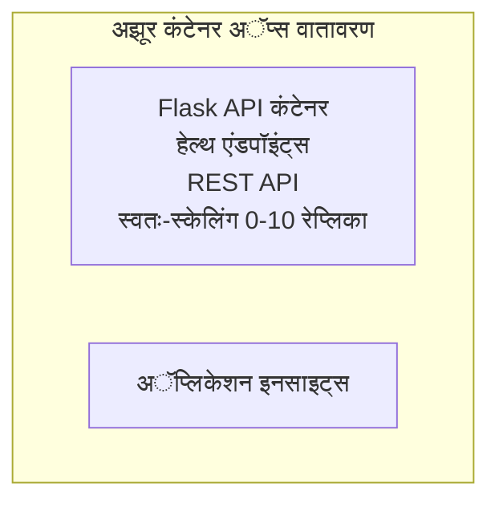

# सोपी Flask API - कंटेनर अॅप उदाहरण

**अभ्यासाचा मार्ग:** प्रारंभीचा ⭐ | **वेळ:** २५-३५ मिनिटे | **खर्च:** $0-15/महिना

एक संपूर्ण, कार्यरत Python Flask REST API जी Azure Container Apps वर Azure Developer CLI (azd) वापरून तैनात केली आहे. हे उदाहरण कंटेनर तैनाती, स्वयंचलित प्रमाण वाढवणे आणि निरीक्षण मूलतत्त्वे दर्शविते.

## 🎯 तुम्ही काय शिकाल

- कंटेनरयुक्त Python अॅप्लिकेशन Azure वर तैनात करणे
- scale-to-zero सह स्वयंचलित प्रमाण वाढवणे कॉन्फिगर करणे
- हेल्थ प्रोब आणि रेडीनेस तपासणी अंमलात आणणे
- अॅप्लिकेशन लॉग्स आणि मेट्रिक्सवर देखरेख ठेवणे
- जलद तैनातीसाठी Azure Developer CLI वापरणे

## 📦 यात काय समाविष्ट आहे

✅ **Flask अॅप्लिकेशन** - CRUD ऑपरेशन्ससह संपूर्ण REST API (`src/app.py`)  
✅ **Dockerfile** - उत्पादनासाठी तयार कंटेनर कॉन्फिगरेशन  
✅ **Bicep इन्फ्रास्ट्रक्चर** - कंटेनर अॅप्स पर्यावरण आणि API तैनाती  
✅ **AZD कॉन्फिगरेशन** - एक-कमांड तैनाती सेटअप  
✅ **हेल्थ प्रोब्स** - लिव्हनेस आणि रेडीनेस तपासण्या कॉन्फिगर केल्या  
✅ **स्वयंचलित प्रमाण वाढवणे** - HTTP लोडवर आधारित 0-10 रेप्लिका  

## आर्किटेक्चर


## पूर्वअट

### आवश्यक
- **Azure Developer CLI (azd)** - [इंस्टॉलेशन मार्गदर्शक](https://learn.microsoft.com/azure/developer/azure-developer-cli/install-azd)
- **Azure सदस्यता** - [मोफत खाते](https://azure.microsoft.com/free/)
- **Docker Desktop** - [डॉकर इंस्टॉल करा](https://www.docker.com/products/docker-desktop/) (स्थानिक चाचणीसाठी)

### पूर्वअटी तपासा

```bash
# azd आवृत्ती तपासा (1.5.0 किंवा त्याहून अधिक आवश्यक)
azd version

# Azure लॉगिनची पडताळणी करा
azd auth login

# Docker तपासा (पर्यायी, स्थानिक चाचणीसाठी)
docker --version
```

## ⏱️ तैनाती वेळापत्रक

| टप्पा | कालावधी | काय होते |
|-------|----------|--------------||
| पर्यावरण सेटअप | ३० सेकंद | azd पर्यावरण तयार करा |
| कंटेनर बिल्ड करा | २-३ मिनिटे | Docker build Flask अॅप |
| इन्फ्रास्ट्रक्चर प्रदान करा | ३-५ मिनिटे | कंटेनर अॅप्स, रजिस्ट्री, मॉनिटरिंग तयार करा |
| अॅप्लिकेशन तैनात करा | २-३ मिनिटे | इमेज पुश करा आणि कंटेनर अॅप्स मध्ये तैनात करा |
| **एकूण** | **८-१२ मिनिटे** | पूर्ण तैनात तयार |

## जलद प्रारंभ

```bash
# उदाहरणाकडे जा
cd examples/container-app/simple-flask-api

# वातावरण प्रारंभ करा (अद्वितीय नाव निवडा)
azd env new myflaskapi

# सर्व गोष्टी तैनात करा (इन्फ्रास्ट्रक्चर + अनुप्रयोग)
azd up
# तुम्हाला विचारले जाईल:
# 1. Azure सदस्यता निवडा
# 2. स्थान निवडा (उदा., eastus2)
# 3. तैनातीसाठी 8-12 मिनिटे थांबा

# तुमचा API एंडपॉइंट मिळवा
azd env get-values

# API चाचणी करा
curl $(azd env get-value API_ENDPOINT)/health
```

**अपेक्षित आउटपुट:**
```json
{
  "status": "healthy",
  "timestamp": "2025-11-19T10:30:00Z",
  "service": "simple-flask-api",
  "version": "1.0.0"
}
```

## ✅ तैनाती तपासा

### पाऊल १: तैनातीची स्थिती तपासा

```bash
# तैनात सेवांचे दर्शन घ्या
azd show

# अपेक्षित आउटपुट दाखवते:
# - सेवा: api
# - एंडपॉइंट: https://ca-api-[env].xxx.azurecontainerapps.io
# - स्थिती: चालू आहे
```

### पाऊल २: API एंडपॉइंट तपासा

```bash
# API एंडपॉइंट मिळवा
API_URL=$(azd env get-value API_ENDPOINT)

# आरोग्य तपासा
curl $API_URL/health

# मूळ एंडपॉइंट तपासा
curl $API_URL/

# एक आयटम तयार करा
curl -X POST $API_URL/api/items \
  -H "Content-Type: application/json" \
  -d '{"name": "Test Item", "description": "My first item"}'

# सर्व आयटम मिळवा
curl $API_URL/api/items
```

**यशाचे निकष:**
- ✅ हेल्थ एंडपॉइंट HTTP 200 परत करतो
- ✅ रूट एंडपॉइंट API माहिती दर्शवितो
- ✅ POST आयटम तयार करतो आणि HTTP 201 परत करतो
- ✅ GET तयार केलेले आयटम परत करते

### पाऊल ३: लॉग्स पहा

```bash
# azd monitor वापरून थेट लॉग प्रवाह करा
azd monitor --logs

# किंवा Azure CLI वापरा:
az containerapp logs show --name api --resource-group $RG_NAME --follow

# आपल्याला दिसावे:
# - Gunicorn सुरूवातीचे संदेश
# - HTTP विनंती लॉग
# - अनुप्रयोग माहिती लॉग्स
```

## प्रकल्प रचना

```
simple-flask-api/
├── azure.yaml              # AZD configuration
├── infra/
│   ├── main.bicep         # Main infrastructure
│   ├── main.parameters.json
│   └── app/
│       ├── container-env.bicep
│       └── api.bicep
└── src/
    ├── app.py             # Flask application
    ├── requirements.txt
    └── Dockerfile
```

## API एंडपॉइंट्स

| एंडपॉइंट | पद्धत | वर्णन |
|----------|--------|-------------|
| `/health` | GET | हेल्थ तपासणी |
| `/api/items` | GET | सर्व आयटम्सची यादी |
| `/api/items` | POST | नवीन आयटम तयार करा |
| `/api/items/{id}` | GET | विशिष्ट आयटम प्राप्त करा |
| `/api/items/{id}` | PUT | आयटम अपडेट करा |
| `/api/items/{id}` | DELETE | आयटम हटवा |

## कॉन्फिगरेशन

### पर्यावरण बदल

```bash
# सानुकूल संरचना सेट करा
azd env set PORT 8000
azd env set LOG_LEVEL info
azd env set MAX_REPLICAS 20
```

### प्रमाण वाढवण्याचे कॉन्फिगरेशन

API HTTP ट्रॅफिकवर आधारित स्वयंचलितपणे प्रमाण वाढवते:
- **किमान रेप्लिका**: 0 (अ‍ॅक्टिव्ह नसल्यास प्रमाण शून्यावर येते)
- **कमाल रेप्लिका**: 10
- **प्रत्येक रेप्लिकावर प्रतिस्पर्धा विनंत्या**: 50

## विकास

### स्थानिक पॅनेलवर चालवा

```bash
# अवलंबित्वे स्थापित करा
cd src
pip install -r requirements.txt

# अॅप चालवा
python app.py

# स्थानिकपणे चाचणी करा
curl http://localhost:8000/health
```

### कंटेनर बिल्ड आणि चाचणी

```bash
# डॉकर इमेज तयार करा
docker build -t flask-api:local ./src

# कंटेनर स्थानिकपणे चालवा
docker run -p 8000:8000 flask-api:local

# कंटेनर चाचणी करा
curl http://localhost:8000/health
```

## तैनाती

### पूर्ण तैनाती

```bash
# पायाभरणी आणि अनुप्रयोग तैनात करा
azd up
```

### केवळ कोड तैनाती

```bash
# फक्त अनुप्रयोग कोड तैनात करा (इन्फ्रास्ट्रक्चर अपरिवर्तित)
azd deploy api
```

### कॉन्फिगरेशन अपडेट करा

```bash
# वातावरणातील चल बदल करा
azd env set API_KEY "new-api-key"

# नवीन संरचनेसह पुन्हा तैनात करा
azd deploy api
```

## निरीक्षण

### लॉग पाहा

```bash
# azd monitor वापरून थेट लॉग प्रवाहित करा
azd monitor --logs

# किंवा कंटेनर अ‍ॅप्ससाठी Azure CLI वापरा:
az containerapp logs show --name api --resource-group $RG_NAME --follow

# शेवटच्या १०० ओळी पहा
az containerapp logs show --name api --resource-group $RG_NAME --tail 100
```

### मेट्रिक्स पाहणी

```bash
# Azure Monitor डॅशबोर्ड उघडा
azd monitor --overview

# विशिष्ट मेट्रिक्स पहा
az monitor metrics list \
  --resource $(azd show --output json | jq -r '.services.api.resourceId') \
  --metric "Requests,ResponseTime"
```

## चाचणी

### हेल्थ तपासणी

```bash
curl $(azd show --output json | jq -r '.services.api.endpoint')/health
```

अपेक्षित प्रतिसाद:
```json
{
  "status": "healthy",
  "timestamp": "2025-11-19T10:30:00Z"
}
```

### आयटम तयार करा

```bash
curl -X POST $(azd show --output json | jq -r '.services.api.endpoint')/api/items \
  -H "Content-Type: application/json" \
  -d '{"name": "Test Item", "description": "A test item"}'
```

### सर्व आयटम प्राप्त करा

```bash
curl $(azd show --output json | jq -r '.services.api.endpoint')/api/items
```

## खर्च कमी करणे

ही तैनाती scale-to-zero वापरते, म्हणून API विनंती प्रक्रिया करत असतानाच तुम्हाला शुल्क भरावा लागतो:

- **निष्क्रिय खर्च**: ~$0/महिना (शून्यावर प्रमाण वाढल्याने)
- **सक्रिय खर्च**: ~$0.000024/सेकंद प्रति रेप्लिका
- **अपेक्षित मासिक खर्च** (हलकी वापर): $5-15

### अधिक खर्च कमी करा

```bash
# विकासासाठी कमाल प्रतिकृती कमी करा
azd env set MAX_REPLICAS 3

# लहान निष्क्रिय वेळमर्यादा वापरा
azd env set SCALE_TO_ZERO_TIMEOUT 300  # ५ मिनिटे
```

## समस्या निवारण

### कंटेनर सुरू होत नाही

```bash
# Azure CLI वापरून कंटेनर लॉग तपासा
az containerapp logs show --name api --resource-group $RG_NAME --tail 100

# स्थानिकपणे Docker इमेज बिल्ड तपासा
docker build -t test ./src
```

### API उपलब्ध नाही

```bash
# प्रवेश बाह्य आहे का तपासा
az containerapp show --name api --resource-group rg-simple-flask-api \
  --query properties.configuration.ingress.external
```

### प्रतिसाद वेळ जास्त आहे

```bash
# CPU/मेमरी वापर तपासा
az monitor metrics list \
  --resource $(azd show --output json | jq -r '.services.api.resourceId') \
  --metric "CPUPercentage,MemoryPercentage"

# आवश्यक असल्यास संसाधने वाढवा
az containerapp update --name api --resource-group rg-simple-flask-api \
  --cpu 1.0 --memory 2Gi
```

## साफसफाई

```bash
# सर्व स्रोतं हटवा
azd down --force --purge
```

## पुढील पावले

### हे उदाहरण विस्तृत करा

1. **डेटाबेस जोडा** - Azure Cosmos DB किंवा SQL डेटाबेस समाकलित करा
   ```bash
   # infra/main.bicep मध्ये Cosmos DB मॉड्यूल जोडा
   # app.py मध्ये डेटाबेस कनेक्शन अद्ययावत करा
   ```

2. **प्रमाणीकरण जोडा** - Azure AD किंवा API कीज लागू करा
   ```python
   # app.py मध्ये प्रमाणीकरण मिडलवेअर जोडा
   from functools import wraps
   ```

3. **CI/CD सेटअप करा** - GitHub Actions वर्कफ्लो
   ```yaml
   # Create .github/workflows/deploy.yml
   name: Deploy to Azure
   on: [push]
   ```

4. **व्यवस्थापित ओळख जोडा** - Azure सेवांसाठी सुरक्षित प्रवेश
   ```bicep
   # Update infra/app/api.bicep
   identity: { type: 'SystemAssigned' }
   ```

### संबंधित उदाहरणे

- **[डेटाबेस अॅप](../../../../../examples/database-app)** - SQL डेटाबेससह संपूर्ण उदाहरण
- **[मायक्रोसर्व्हिसेस](../../../../../examples/container-app/microservices)** - बहु-सेवा आर्किटेक्चर
- **[कंटेनर अॅप्स मास्टर मार्गदर्शक](../README.md)** - सर्व कंटेनर पॅटर्न

### अधिगम संसाधने

- 📚 [AZD प्रारंभिकांसाठी कोर्स](../../../README.md) - मुख्य कोर्स होम
- 📚 [कंटेनर अॅप्स पॅटर्न्स](../README.md) - अधिक तैनाती पॅटर्न्स
- 📚 [AZD टेम्प्लेट्स गॅलरी](https://azure.github.io/awesome-azd/) - समुदायाचे टेम्प्लेट्स

## अतिरिक्त संसाधने

### दस्तऐवजीकरण
- **[Flask दस्तऐवज](https://flask.palletsprojects.com/)** - Flask फ्रेमवर्क मार्गदर्शक
- **[Azure कंटेनर अॅप्स](https://learn.microsoft.com/azure/container-apps/)** - अधिकृत Azure दस्तऐवज
- **[Azure Developer CLI](https://learn.microsoft.com/azure/developer/azure-developer-cli/)** - azd कमांड संदर्भ

### ट्यूटोरियल्स
- **[कंटेनर अॅप्स त्वरित प्रारंभ](https://learn.microsoft.com/azure/container-apps/quickstart-portal)** - तुमचे पहिले अॅप तैनात करा
- **[Azure वर Python](https://learn.microsoft.com/azure/developer/python/)** - Python विकास मार्गदर्शक
- **[Bicep भाषा](https://learn.microsoft.com/azure/azure-resource-manager/bicep/)** - कोड स्वरूपात इन्फ्रास्ट्रक्चर

### साधने
- **[Azure Portal](https://portal.azure.com)** - संसाधने दृश्यमानपणे व्यवस्थापित करा
- **[VS Code Azure विस्तार](https://marketplace.visualstudio.com/items?itemName=ms-azuretools.vscode-azurecontainerapps)** - IDE समाकलन

---

**🎉 अभिनंदन!** तुम्ही Azure Container Apps मध्ये स्वयंचलित प्रमाण वाढवणे आणि निरीक्षणासह उत्पादनासाठी तयार Flask API तैनात केले आहे.

**प्रश्न आहेत का?** [इश्यू उघडा](https://github.com/microsoft/AZD-for-beginners/issues) किंवा [FAQ](../../../resources/faq.md) पहा।

---

<!-- CO-OP TRANSLATOR DISCLAIMER START -->
**संकल्पना सूचना**:
हा दस्तऐवज AI अनुवाद सेवा [Co-op Translator](https://github.com/Azure/co-op-translator) चा वापर करून अनुवादित करण्यात आला आहे. आम्ही अचूकतेसाठी प्रयत्नशील असतो, तरी कृपया लक्षात घ्या की स्वयंचलित अनुवादांमध्ये चुका किंवा अचूकतेत कमीपणा असू शकतो. मूळ दस्तऐवज त्याच्या मूळ भाषेतच अधिकृत स्रोत मानला जावा. महत्त्वाची माहिती असल्यास व्यावसायिक मानवी अनुवाद घेण्याची शिफारस केली जाते. या अनुवादाच्या वापरामुळे झालेल्या कोणत्याही गैरसमज किंवा चुकीच्या अर्थलागी आम्ही जबाबदार नाही.
<!-- CO-OP TRANSLATOR DISCLAIMER END -->