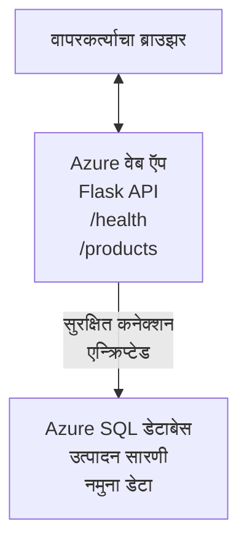

# AZD सह Microsoft SQL डेटाबेस आणि वेब ऍप तैनात करणे

⏱️ **अनुमानित वेळ**: 20-30 मिनिटे | 💰 **अनुमानित किंमत**: ~$15-25/महिना | ⭐ **कठीणपणा**: मध्यम

ही **पूर्ण, कार्यरत उदाहरणे** दर्शवते की [Azure Developer CLI (azd)](https://learn.microsoft.com/azure/developer/azure-developer-cli/) कसे वापरून Microsoft SQL डेटाबेससह Python Flask वेब अनुप्रयोग Azure वर तैनात करायचा. सर्व कोड समाविष्ट आणि तपासलेला आहे—कोणत्याही बाहेरील अवलंबित्वाची गरज नाही.

## तुम्हाला काय शिकायला मिळेल

या उदाहरणाच्या पूर्णतेनंतर, तुम्ही:
- इन्फ्रास्ट्रक्चर-एज-कोड वापरून बहु-स्तरीय अनुप्रयोग (वेब ऍप + डेटाबेस) तैनात कराल
- सीक्रेट्स हार्डकोड न करता सुरक्षित डेटाबेस कनेक्शन कॉंफिगर करणे शिकाल
- Application Insights सह अनुप्रयोगाचे आरोग्य मॉनिटर कराल
- AZD CLI ने Azure संसाधने प्रभावीपणे व्यवस्थापित कराल
- सुरक्षा, खर्च अनुकूलन आणि निरीक्षणासाठी Azure च्या सर्वोत्तम पद्धतींचे पालन कराल

## परिदृश्य अवलोकन
- **वेब ऍप**: डेटाबेस कनेक्टिव्हिटी असलेले Python Flask REST API
- **डेटाबेस**: नमुना डेटासह Azure SQL Database
- **इन्फ्रास्ट्रक्चर**: Bicep वापरून प्रोव्हिजन (मॉड्युलर, पुनर्वापरयोग्य टेम्पलेट्स)
- **तैनाती**: `azd` कमांड्ससह पूर्णपणे स्वयंचलित
- **मॉनिटरिंग**: लॉग आणि टेलिमेट्रीसाठी Application Insights

## पूर्वअट

### आवश्यक साधने

सुरू करण्यापूर्वी, पुढील साधने इन्स्टॉल असल्याची खात्री करा:

1. **[Azure CLI](https://learn.microsoft.com/cli/azure/install-azure-cli)** (आवृत्ती 2.50.0 किंवा त्याहून नवीन)
   ```sh
   az --version
   # अपेक्षित आउटपुट: azure-cli 2.50.0 किंवा त्याहून अधिक
   ```

2. **[Azure Developer CLI (azd)](https://learn.microsoft.com/azure/developer/azure-developer-cli/install-azd)** (आवृत्ती 1.0.0 किंवा त्याहून नवीन)
   ```sh
   azd version
   # अपेक्षित आउटपुट: azd आवृत्ती 1.0.0 किंवा त्यापेक्षा अधिक
   ```

3. **[Python 3.8+](https://www.python.org/downloads/)** (लोकल विकासासाठी)
   ```sh
   python --version
   # अपेक्षित आउटपुट: Python 3.8 किंवा त्यापेक्षा नवीन
   ```

4. **[Docker](https://www.docker.com/get-started)** (ऐच्छिक, लोकल कंटेनरायझ्ड विकासासाठी)
   ```sh
   docker --version
   # अपेक्षित आउटपुट: Docker आवृत्ती 20.10 किंवा त्याहून अधिक
   ```

### Azure आवश्यकता

- सक्रिय **Azure subscription** ([एक विनामूल्य खाते तयार करा](https://azure.microsoft.com/free/))
- तुमच्या subscription मध्ये संसाधने तयार करण्याची परवानगी
- subscription किंवा resource group वर **Owner** किंवा **Contributor** भूमिका

### ज्ञानाच्या पूर्वअटी

हे एक **मध्यम-स्तरीय** उदाहरण आहे. तुम्हाला खालील गोष्टींची ओळख असावी:
- मूलभूत कमांड-लाइन ऑपरेशन्स
- क्लाउडच्या प्राथमिक संकल्पना (resources, resource groups)
- वेब अनुप्रयोग आणि डेटाबेसची मूलभूत समज

**AZD मध्ये नवीन आहात?** प्रथम [Getting Started guide](../../docs/chapter-01-foundation/azd-basics.md) वरून सुरू करा.

## आर्किटेक्चर

हे उदाहरण वेब अनुप्रयोग आणि SQL डेटाबेस असलेल्या दोन-स्तरीय आर्किटेक्चरची तैनाती करते:


**Resource Deployment:**
- **Resource Group**: सर्व संसाधनांसाठी कंटेनर
- **App Service Plan**: Linux-आधारित होस्टिंग (खर्च बचतीसाठी B1 tier)
- **Web App**: Flask अनुप्रयोगासह Python 3.11 runtime
- **SQL Server**: TLS 1.2 किमान असलेला व्यवस्थापित डेटाबेस सर्व्हर
- **SQL Database**: Basic tier (2GB, विकास/टेस्टिंगसाठी योग्य)
- **Application Insights**: मॉनिटरिंग आणि लॉगिंग
- **Log Analytics Workspace**: केंद्रीकृत लॉग स्टोरेज

**उपमा**: हे एका रेस्टॉरंटसारखे विचार करा (वेब ऍप) ज्यात वॉक-इन फ्रीझर (डेटाबेस) आहे. ग्राहक मेनूवरून ऑर्डर करतात (API endpoints), आणि किचन (Flask अॅप) फ्रीझरमधून घटक (डेटा) आणते. रेस्टॉरंट व्यवस्थापक (Application Insights) घडणाऱ्या सर्व गोष्टींचे ट्रॅक ठेवतो.

## फोल्डर संरचना

या उदाहरणात सर्व फायली समाविष्ट आहेत—कोणत्याही बाहेरील अवलंबित्वाची गरज नाही:

```
examples/database-app/
│
├── README.md                    # This file
├── azure.yaml                   # AZD configuration file
├── .env.sample                  # Sample environment variables
├── .gitignore                   # Git ignore patterns
│
├── infra/                       # Infrastructure as Code (Bicep)
│   ├── main.bicep              # Main orchestration template
│   ├── abbreviations.json      # Azure naming conventions
│   └── resources/              # Modular resource templates
│       ├── sql-server.bicep    # SQL Server configuration
│       ├── sql-database.bicep  # Database configuration
│       ├── app-service-plan.bicep  # Hosting plan
│       ├── app-insights.bicep  # Monitoring setup
│       └── web-app.bicep       # Web application
│
└── src/
    └── web/                    # Application source code
        ├── app.py              # Flask REST API
        ├── requirements.txt    # Python dependencies
        └── Dockerfile          # Container definition
```

**प्रत्येक फाइलचे कार्य:**
- **azure.yaml**: AZD ला काय तैनात करायचे आणि कोठे हे सांगते
- **infra/main.bicep**: सर्व Azure संसाधने एकत्र समन्वयित करते
- **infra/resources/*.bicep**: वैयक्तिक संसाधन परिभाषा (पुनर्वापरासाठी मॉड्युलर)
- **src/web/app.py**: डेटाबेस लॉजिकसह Flask अनुप्रयोग
- **requirements.txt**: Python पॅकेज अवलंबित्व
- **Dockerfile**: तैनातीसाठी कंटेनरायझेशन सूचनां

## जलद प्रारंभ (स्टेप-बाय-स्टेप)

### Step 1: क्लोन व नॅव्हिगेट करा

```sh
git clone https://github.com/microsoft/AZD-for-beginners.git
cd AZD-for-beginners/examples/database-app
```

**✓ यश तपासणी**: तुम्हाला `azure.yaml` आणि `infra/` फोल्डर दिसत असल्याची खात्री करा:
```sh
ls
# अपेक्षित: README.md, azure.yaml, infra/, src/
```

### Step 2: Azure प्रमाणीकृत करा

```sh
azd auth login
```

हे तुमचा ब्राउझर Azure प्रमाणिकरणासाठी उघडते. तुमच्या Azure क्रेडेन्शियल्सने साइन इन करा.

**✓ यश तपासणी**: तुम्हाला हे पाहायला हवे:
```
Logged in to Azure.
```

### Step 3: वातावरण प्रारंभिक करा

```sh
azd init
```

**काय होते**: AZD तुमच्या तैनातीसाठी स्थानिक कॉन्फिगरेशन तयार करते.

**प्रॉम्प्ट जे तुम्हाला दिसतील**:
- **Environment name**: एक छोटा नाव प्रविष्ट करा (उदा., `dev`, `myapp`)
- **Azure subscription**: सूचीमधून तुमचा subscription निवडा
- **Azure location**: प्रदेश निवडा (उदा., `eastus`, `westeurope`)

**✓ यश तपासणी**: तुम्हाला हे पाहायला हवे:
```
SUCCESS: New project initialized!
```

### Step 4: Azure संसाधने प्रोव्हिजन करा

```sh
azd provision
```

**काय होते**: AZD सर्व इन्फ्रास्ट्रक्चर तैनात करते (5-8 मिनिटे लागतात):
1. Resource group तयार करते
2. SQL Server आणि Database तयार करते
3. App Service Plan तयार करते
4. Web App तयार करते
5. Application Insights तयार करते
6. नेटवर्किंग आणि सुरक्षा कॉन्फिगर करते

**तुम्हाला प्रॉम्प्ट केले जाईल**:
- **SQL admin username**: एक वापरकर्तानाव प्रविष्ट करा (उदा., `sqladmin`)
- **SQL admin password**: मजबूत पासवर्ड प्रविष्ट करा (हे जतन करा!)

**✓ यश तपासणी**: तुम्हाला हे पाहायला हवे:
```
SUCCESS: Your application was provisioned in Azure in X minutes Y seconds.
You can view the resources created under the resource group rg-<env-name> in Azure Portal:
https://portal.azure.com/#@/resource/subscriptions/.../resourceGroups/rg-<env-name>
```

**⏱️ वेळ**: 5-8 मिनिटे

### Step 5: अनुप्रयोग तैनात करा

```sh
azd deploy
```

**काय होते**: AZD तुमचा Flask अनुप्रयोग बिल्ड आणि तैनात करते:
1. Python अनुप्रयोग पॅकेज करते
2. Docker कंटेनर तयार करते
3. Azure Web App वर पुश करते
4. नमुना डेटासह डेटाबेस प्रारंभ करते
5. अनुप्रयोग सुरू करते

**✓ यश तपासणी**: तुम्हाला हे पाहायला हवे:
```
SUCCESS: Your application was deployed to Azure in X minutes Y seconds.
You can view the resources created under the resource group rg-<env-name> in Azure Portal:
https://portal.azure.com/#@/resource/subscriptions/.../resourceGroups/rg-<env-name>
```

**⏱️ वेळ**: 3-5 मिनिटे

### Step 6: अनुप्रयोग ब्राउझ करा

```sh
azd browse
```

हे `https://app-<unique-id>.azurewebsites.net` येथे तुमचे तैनात वेब अॅप ब्राउझरमध्ये उघडते

**✓ यश तपासणी**: तुम्हाला JSON आउटपुट दिसायला हवे:
```json
{
  "message": "Welcome to the Database App API",
  "endpoints": {
    "/": "This help message",
    "/health": "Health check endpoint",
    "/products": "List all products",
    "/products/<id>": "Get product by ID"
  }
}
```

### Step 7: API Endpoints ची चाचणी करा

**Health Check** (डेटाबेस कनेक्शन सत्यापित करा):
```sh
curl https://app-<your-id>.azurewebsites.net/health
```

**अपेक्षित प्रतिसाद**:
```json
{
  "status": "healthy",
  "database": "connected"
}
```

**List Products** (नमुना डेटा):
```sh
curl https://app-<your-id>.azurewebsites.net/products
```

**अपेक्षित प्रतिसाद**:
```json
[
  {
    "id": 1,
    "name": "Laptop",
    "description": "High-performance laptop",
    "price": 1299.99,
    "created_at": "2025-11-19T10:30:00"
  },
  ...
]
```

**Get Single Product**:
```sh
curl https://app-<your-id>.azurewebsites.net/products/1
```

**✓ यश तपासणी**: सर्व endpoints त्रुटीांशिवाय JSON डेटा परत करतात.

---

**🎉 अभिनंदन!** तुम्ही AZD वापरून Azure वर यशस्वीरित्या डेटाबेससह वेब अनुप्रयोग तैनात केला आहे.

## कॉन्फिगरेशन सखोल-पडताळणी

### पर्यावरण बदलयोग्य (Environment Variables)

सीक्रेट्स Azure App Service कॉन्फिगरेशनद्वारे सुरक्षितरित्या व्यवस्थापित केले जातात—**स्रोत कोडमध्ये कधीही हार्डकोड करू नका**.

**AZD ने स्वयंचलितरित्या कॉन्फिगर केलेले**:
- `SQL_CONNECTION_STRING`: एनक्रिप्टेड क्रेडेन्शियलसह डेटाबेस कनेक्शन
- `APPLICATIONINSIGHTS_CONNECTION_STRING`: मॉनिटरिंग टेलिमेट्री एंडपॉइंट
- `SCM_DO_BUILD_DURING_DEPLOYMENT`: स्वयंचलित अवलंबित्व स्थापनेस सक्षम करते

**सीक्रेट्स कुठे साठवले जातात**:
1. `azd provision` दरम्यान, तुम्ही SQL क्रेडेन्शियल सुरक्षित प्रॉम्प्टद्वारे प्रदान करता
2. AZD हे तुमच्या स्थानिक `.azure/<env-name>/.env` फाइलमध्ये साठवते (git-ignored)
3. AZD ते Azure App Service कॉन्फिगमध्ये इंजेक्ट करते (रेस्टमध्ये एनक्रिप्ट केलेले)
4. अनुप्रयोग रनटाइममध्ये `os.getenv()` द्वारे ते वाचतो

### लोकल विकास

लोकल चाचणीसाठी, नमुन्यापासून `.env` फाइल तयार करा:

```sh
cp .env.sample .env
# तुमच्या स्थानिक डेटाबेस कनेक्शनसह .env संपादित करा
```

**लोकल विकास वर्कफ्लो**:
```sh
# आवश्यक अवलंबने स्थापित करा
cd src/web
pip install -r requirements.txt

# पर्यावरणीय चल सेट करा
export SQL_CONNECTION_STRING="your-local-connection-string"

# अनुप्रयोग चालवा
python app.py
```

**लोकलवर चाचणी करा**:
```sh
curl http://localhost:8000/health
# अपेक्षित: {"status": "healthy", "database": "connected"}
```

### इन्फ्रास्ट्रक्चर एज कोड

सर्व Azure संसाधने **Bicep templates** (`infra/` फोल्डर) मध्ये परिभाषित आहेत:

- **मॉड्युलर डिझाइन**: प्रत्येक संसाधन प्रकारासाठी स्वतःची फाइल आहे, ज्यामुळे पुनर्वापर शक्य होते
- **पॅरामीटराइझड**: SKUs, प्रदेश, नावे सानुकूलित करा
- **सर्वोत्तम पद्धती**: Azure नामकरण मानके आणि सुरक्षा डीफॉल्टचे पालन करते
- **व्हर्जन कंट्रोल**: इन्फ्रास्ट्रक्चर बदल Git मध्ये ट्रॅक केले जातात

**सानुकूलन उदाहरण**:
डेटाबेस tier बदलण्यासाठी, `infra/resources/sql-database.bicep` संपादित करा:
```bicep
sku: {
  name: 'Standard'  // Changed from 'Basic'
  tier: 'Standard'
  capacity: 10
}
```

## सुरक्षा सर्वोत्तम पद्धती

हे उदाहरण Azure सुरक्षा सर्वोत्तम पद्धतींचे पालन करते:

### 1. **स्रोत कोडमध्ये कोणतेही सीक्रेट्स नाहीत**
- ✅ क्रेडेन्शियल्स Azure App Service कॉन्फिगमध्ये संग्रहित (एनक्रिप्टेड)
- ✅ `.env` फाइल्स `.gitignore` द्वारे Git मध्ये वगळलेले
- ✅ प्रोव्हिजनिंगदरम्यान सुरक्षित पॅरामीटर्सद्वारे सीक्रेट्स पास केले जातात

### 2. **एन्क्रिप्टेड कनेक्शन्स**
- ✅ SQL Server साठी किमान TLS 1.2
- ✅ Web App साठी फक्त HTTPS लागू
- ✅ डेटाबेस कनेक्शन्स एन्क्रिप्टेड चॅनेल वापरतात

### 3. **नेटवर्क सुरक्षा**
- ✅ SQL Server फायरवॉल फक्त Azure सेवांना परवानगी देण्यासाठी कॉन्फिगर केले
- ✅ सार्वजनिक नेटवर्क प्रवेश मर्यादित (खासगी एंडपॉइंटसह आणखी कडक केला जाऊ शकतो)
- ✅ Web App वर FTPS अक्षम

### 4. **प्रमाणीकरण व प्राधिकरण**
- ⚠️ **सध्याचे**: SQL प्रमाणीकरण (username/password)
- ✅ **उत्पादनासाठी शिफारस**: पासवर्ड-रहित प्रमाणीकरणासाठी Azure Managed Identity वापरा

**Managed Identity कडे अपग्रेड करण्यासाठी** (उत्पादनासाठी):
1. Web App वर managed identity सक्षम करा
2. ओळखीस SQL परवानग्या द्या
3. कनेक्शन स्ट्रिंग managed identity वापरण्यासाठी अपडेट करा
4. पासवर्ड-आधारित प्रमाणीकरण काढून टाका

### 5. **ऑडिटिंग व अनुपालन**
- ✅ Application Insights सर्व विनंत्या आणि त्रुटी लॉग करते
- ✅ SQL Database auditing सक्षम (अनुपालनासाठी कॉन्फिगर केले जाऊ शकते)
- ✅ सर्व संसाधने शासनासाठी टॅग केल्या जातात

**उत्पादनापूर्वी सुरक्षा चेकलिस्ट**:
- [ ] SQL साठी Azure Defender सक्षम करा
- [ ] SQL Database साठी Private Endpoints कॉन्फिगर करा
- [ ] Web Application Firewall (WAF) सक्षम करा
- [ ] सीक्रेट रोटेशनसाठी Azure Key Vault अंमलात आणा
- [ ] Azure AD प्रमाणीकरण कॉन्फिगर करा
- [ ] सर्व संसाधनांसाठी डायग्नोस्टिक लॉगिंग सक्षम करा

## खर्च अनुकूलन

**अनुमानित मासिक खर्च** (नोव्हेंबर 2025 नुसार):

| Resource | SKU/Tier | Estimated Cost |
|----------|----------|----------------|
| App Service Plan | B1 (Basic) | ~$13/month |
| SQL Database | Basic (2GB) | ~$5/month |
| Application Insights | Pay-as-you-go | ~$2/month (कमी ट्रॅफिक) |
| **Total** | | **~$20/month** |

**💡 खर्च-बचत टिप्स**:

1. **अभ्यासासाठी फ्री टियर वापरा**:
   - App Service: F1 tier (मुफ्त, मर्यादित तास)
   - SQL Database: Azure SQL Database serverless वापरा
   - Application Insights: 5GB/महिना मोफत ingestion

2. **न वापरत असलेल्या वेळी संसाधने थांबवा**:
   ```sh
   # वेब अॅप थांबवा (डेटाबेससाठी अजूनही शुल्क लागेल)
   az webapp stop --name <app-name> --resource-group <rg-name>
   
   # गरज पडल्यास पुन्हा सुरू करा
   az webapp start --name <app-name> --resource-group <rg-name>
   ```

3. **टेस्ट केल्यावर सर्व काही हटवा**:
   ```sh
   azd down
   ```
   यामुळे सर्व संसाधने काढून टाकली जातील आणि शुल्क थांबेल.

4. **विकास विरुद्ध उत्पादन SKUs**:
   - **विकास**: Basic tier (या उदाहरणात वापरलेले)
   - **उत्पादन**: redundancy सह Standard/Premium tier

**खर्च मॉनिटरिंग**:
- [Azure Cost Management](https://portal.azure.com/#view/Microsoft_Azure_CostManagement) मध्ये खर्च पहा
- अनपेक्षित खर्च टाळण्यासाठी खर्च अलर्ट सेट करा
- ट्रॅकिंगसाठी सर्व संसाधने `azd-env-name` ने टॅग करा

**फ्री टियर पर्याय**:
अभ्यासाच्या उद्देशासाठी, तुम्ही `infra/resources/app-service-plan.bicep` मध्ये बदल करू शकता:
```bicep
sku: {
  name: 'F1'  // Free tier
  tier: 'Free'
}
```
**नोट**: फ्री टियरमध्ये मर्यादा आहेत (60 मिनिटे/दिवस CPU, नेहमी-ऑन नाही).

## मॉनिटरिंग व निरीक्षणक्षमता

### Application Insights एकत्रीकरण

हे उदाहरण सर्वसमावेशक मॉनिटरिंगसाठी **Application Insights** समाविष्ट करते:

**काय मॉनिटर केले जाते**:
- ✅ HTTP विनंत्या (लेटन्सी, स्टेटस कोड, endpoints)
- ✅ अनुप्रयोग त्रुटी आणि अपवादे
- ✅ Flask अॅपमधून कस्टम लॉगिंग
- ✅ डेटाबेस कनेक्शन आरोग्य
- ✅ परफॉर्मन्स मेट्रिक्स (CPU, मेमरी)

**Application Insights ऍक्सेस करा**:
1. [Azure Portal](https://portal.azure.com) उघडा
2. तुमच्या resource group (`rg-<env-name>`) कडे जा
3. Application Insights रिसोर्स (`appi-<unique-id>`) वर क्लिक करा

**उपयुक्त क्वेरीज** (Application Insights → Logs):

**सर्व विनंत्या पहा**:
```kusto
requests
| where timestamp > ago(1h)
| order by timestamp desc
| project timestamp, name, url, resultCode, duration
```

**त्रुट्या शोधा**:
```kusto
exceptions
| where timestamp > ago(24h)
| order by timestamp desc
| project timestamp, type, outerMessage, operation_Name
```

**Health Endpoint तपासा**:
```kusto
requests
| where name contains "health"
| summarize count() by resultCode, bin(timestamp, 1h)
```

### SQL Database ऑडिटिंग

**SQL Database ऑडिटिंग सक्षम आहे** जे खालील गोष्टी ट्रॅक करते:
- डेटाबेस प्रवेश पॅटर्न
- अयशस्वी लॉगिन प्रयत्न
- स्कीमा बदल
- डेटा प्रवेश (अनुपालनासाठी)

**ऑडिट लॉग्स ऍक्सेस करा**:
1. Azure Portal → SQL Database → Auditing
2. Log Analytics workspace मध्ये लॉग्स पहा

### रिअल-टाइम मॉनिटरिंग

**लाइव्ह मेट्रिक्स पाहा**:
1. Application Insights → Live Metrics
2. रिअल-टाइममध्ये विनंत्या, अपयश आणि परफॉर्मन्स बघा

**अलर्ट्स सेट करा**:
महत्त्वाच्या घटना साठी अलर्ट तयार करा:
- HTTP 500 त्रुट्या > 5 दर 5 मिनिटांत
- डेटाबेस कनेक्शन फेल्युअर
- उच्च प्रतिसाद वेळ (>2 सेकंद)

**अलर्ट तयार करण्याचे उदाहरण**:
```sh
az monitor metrics alert create \
  --name "High-Response-Time" \
  --resource-group <rg-name> \
  --scopes <app-insights-resource-id> \
  --condition "avg requests/duration > 2000" \
  --description "Alert when response time exceeds 2 seconds"
```

## समस्या निवारण
### सामान्य समस्या आणि उपाय

#### 1. `azd provision` "Location not available" त्रुटीमुळे अयशस्वी

**लक्षण**:
```
Error: The subscription is not registered for the resource type 'components' in the location 'centralus'.
```

**उपाय**:
वेगळा Azure प्रदेश निवडा किंवा रिसोर्स प्रोव्हायडर नोंदणी करा:
```sh
az provider register --namespace Microsoft.Insights
```

#### 2. तैनात करताना SQL कनेक्शन अयशस्वी होते

**लक्षण**:
```
pyodbc.OperationalError: ('08001', '[08001] [Microsoft][ODBC Driver 18 for SQL Server]TCP Provider...')
```

**उपाय**:
- SQL Server चा फायरवॉल Azure सेवांना परवानगी देतो का ते तपासा (स्वतःच कॉन्फिगर केले जाते)
- तपासा की `azd provision` दरम्यान SQL admin पासवर्ड बरोबर प्रविष्ट केला गेला आहे का
- SQL Server पूर्णपणे प्राव्हिजन झाला आहे याची खात्री करा (2-3 मिनिटांचा वेळ लागू शकतो)

**कनेक्शन सत्यापित करा**:
```sh
# Azure पोर्टलवरून, SQL Database → क्वेरी संपादक येथे जा
# तुमच्या प्रवेश तपशीलांसह कनेक्ट करण्याचा प्रयत्न करा
```

#### 3. वेब अॅप "Application Error" दाखवते

**लक्षण**:
ब्राउझर सामान्य त्रुटी पृष्ठ दाखवते.

**उपाय**:
अ‍ॅप्लिकेशन लॉग तपासा:
```sh
# अलीकडील नोंदी पहा
az webapp log tail --name <app-name> --resource-group <rg-name>
```

**सामान्य कारणे**:
- पर्यावरण चल (environment variables) गहाळ आहेत (App Service → Configuration तपासा)
- Python पॅकेज इंस्टॉलेशन अयशस्वी झाले (deployment लॉग तपासा)
- डेटाबेस प्रारंभिकरण त्रुटी (SQL कनेक्टिव्हिटी तपासा)

#### 4. `azd deploy` "Build Error" सह अयशस्वी

**लक्षण**:
```
Error: Failed to build project
```

**उपाय**:
- सुनिश्चित करा की `requirements.txt` मध्ये वाक्यरचना त्रुटी नाहीत
- तपासा की `infra/resources/web-app.bicep` मध्ये Python 3.11 निर्दिष्ट आहे
- Dockerfile मध्ये योग्य बेस इमेज आहे का ते सत्यापित करा

**स्थानिकरीत्या डीबग करा**:
```sh
cd src/web
docker build -t test-app .
docker run -p 8000:8000 test-app
```

#### 5. AZD कमांड्स चालवताना "Unauthorized"

**लक्षण**:
```
ERROR: (Unauthorized) The client '<id>' with object id '<id>' does not have authorization
```

**उपाय**:
Azure सोबत पुन्हा प्रमाणीकृत करा:
```sh
# AZD वर्कफ्लोंसाठी आवश्यक
azd auth login

# जर आपण Azure CLI आदेश थेटही वापरत असाल तर हा वैकल्पिक आहे
az login
```

तपासा की तुमच्याकडे सबस्क्रिप्शनवर योग्य परवानग्या (Contributor भूमिका) आहेत का.

#### 6. डेटाबेसचा उच्च खर्च

**लक्षण**:
अनपेक्षित Azure बिल.

**उपाय**:
- चाचणी नंतर `azd down` चालवायला विसरलात का ते तपासा
- तपासा की SQL Database Basic tier वापरत आहे का (Premium नाही)
- Azure Cost Management मध्ये खर्चांची तपासणी करा
- खर्च अलर्ट सेट करा

### मदत मिळवा

**सर्व AZD पर्यावरण चल पहा**:
```sh
azd env get-values
```

**तैनाती स्थिती तपासा**:
```sh
az webapp show --name <app-name> --resource-group <rg-name> --query state
```

**अ‍ॅप्लिकेशन लॉग्स प्रवेश करा**:
```sh
az webapp log download --name <app-name> --resource-group <rg-name> --log-file app-logs.zip
```

**अधिक मदतीची गरज आहे का?**
- [AZD समस्या निवारण मार्गदर्शक](../../docs/chapter-07-troubleshooting/common-issues.md)
- [Azure App Service त्रुटी निवारण](https://learn.microsoft.com/azure/app-service/troubleshoot-diagnostic-logs)
- [Azure SQL त्रुटी निवारण](https://learn.microsoft.com/azure/azure-sql/database/troubleshoot-common-errors-issues)

## व्यावहारिक सराव

### व्यायाम 1: तुमचे तैनातकरण सत्यापित करा (प्रारंभिक)

**लक्ष्य**: सर्व संसाधने तैनात आहेत आणि अनुप्रयोग कार्यरत आहे हे पुष्टी करा.

**पायऱ्या**:
1. तुमच्या रिसोर्स ग्रुपमधील सर्व संसाधने सूची करा:
   ```sh
   az resource list --resource-group rg-<env-name> --output table
   ```
   **अपेक्षित**: 6-7 संसाधने (Web App, SQL Server, SQL Database, App Service Plan, Application Insights, Log Analytics)

2. सर्व API endpoints ची चाचणी करा:
   ```sh
   curl https://app-<your-id>.azurewebsites.net/
   curl https://app-<your-id>.azurewebsites.net/health
   curl https://app-<your-id>.azurewebsites.net/products
   curl https://app-<your-id>.azurewebsites.net/products/1
   ```
   **अपेक्षित**: सर्व वैध JSON परत करतात, त्रुटीशिवाय

3. Application Insights तपासा:
   - Azure पोर्टलमध्ये Application Insights वर जा
   - "Live Metrics" वर जा
   - वेब अ‍ॅपवर तुमचा ब्राउझर रिफ्रेश करा
   **अपेक्षित**: रिअल-टाइममध्ये विनंत्या दिसत आहेत

**यश निकष**: सर्व 6-7 संसाधने अस्तित्वात आहेत, सर्व endpoints डेटा परत करतात, Live Metrics मध्ये क्रियाकलाप दिसतात.

---

### व्यायाम 2: नवीन API एन्डपॉइंट जोडा (मध्यम)

**लक्ष्य**: Flask अ‍ॅप्लिकेशनमध्ये नवीन endpoint जोडा.

**प्रारंभिक कोड**: सध्याचे endpoints `src/web/app.py` मध्ये

**पायऱ्या**:
1. `src/web/app.py` संपादित करा आणि `get_product()` फंक्शन नंतर नवीन endpoint जोडा:
   ```python
   @app.route('/products/search/<keyword>')
   def search_products(keyword):
       """Search products by name or description."""
       try:
           conn = get_db_connection()
           cursor = conn.cursor()
           cursor.execute(
               "SELECT id, name, description, price, created_at FROM products WHERE name LIKE ? OR description LIKE ?",
               (f'%{keyword}%', f'%{keyword}%')
           )
           
           products = []
           for row in cursor.fetchall():
               products.append({
                   'id': row[0],
                   'name': row[1],
                   'description': row[2],
                   'price': float(row[3]) if row[3] else None,
                   'created_at': row[4].isoformat() if row[4] else None
               })
           
           cursor.close()
           conn.close()
           
           logger.info(f"Search for '{keyword}' returned {len(products)} results")
           return jsonify(products), 200
           
       except Exception as e:
           logger.error(f"Error searching products: {str(e)}")
           return jsonify({'error': str(e)}), 500
   ```

2. अपडेट केलेले अनुप्रयोग तैनात करा:
   ```sh
   azd deploy
   ```

3. नवीन endpoint ची चाचणी करा:
   ```sh
   curl https://app-<your-id>.azurewebsites.net/products/search/laptop
   ```
   **अपेक्षित**: "laptop" शी जुळणारे उत्पादने परत करतात

**यश निकष**: नवीन endpoint कार्य करते, फिल्टर केलेले परिणाम परत करते, Application Insights लॉगमध्ये दिसते.

---

### व्यायाम 3: मॉनिटरिंग आणि अलर्ट जोडा (उन्नत)

**लक्ष्य**: अलर्टसह सक्रिय मॉनिटरिंग सेट करा.

**पायऱ्या**:
1. HTTP 500 त्रुटींसाठी अलर्ट तयार करा:
   ```sh
   # Application Insights संसाधन ID मिळवा
   AI_ID=$(az monitor app-insights component show \
     --app appi-<your-id> \
     --resource-group rg-<env-name> \
     --query id -o tsv)
   
   # अलर्ट तयार करा
   az monitor metrics alert create \
     --name "High-Error-Rate" \
     --resource-group rg-<env-name> \
     --scopes $AI_ID \
     --condition "count requests/failed > 5" \
     --window-size 5m \
     --evaluation-frequency 1m \
     --description "Alert when >5 failed requests in 5 minutes"
   ```

2. त्रुटी घडवून अलर्ट ट्रिगर करा:
   ```sh
   # अस्तित्वात नसलेले उत्पादन मागवा
   for i in {1..10}; do curl https://app-<your-id>.azurewebsites.net/products/999; done
   ```

3. अलर्ट फायर झाला का ते तपासा:
   - Azure पोर्टल → Alerts → Alert Rules
   - तुमचे ईमेल तपासा (जर कॉन्फिगर केले असेल तर)

**यश निकष**: अलर्ट नियम तयार आहे, त्रुटींवर ट्रिगर होतो, सूचन्या प्राप्त होतात.

---

### व्यायाम 4: डेटाबेस स्कीमा बदल (उन्नत)

**लक्ष्य**: नवीन टेबल जोडा आणि अनुप्रयोग त्याचा उपयोग करण्यासाठी बदल करा.

**पायऱ्या**:
1. Azure पोर्टल Query Editor द्वारे SQL Database शी कनेक्ट करा

2. नवीन `categories` टेबल तयार करा:
   ```sql
   CREATE TABLE categories (
       id INT PRIMARY KEY IDENTITY(1,1),
       name NVARCHAR(50) NOT NULL,
       description NVARCHAR(200)
   );
   
   INSERT INTO categories (name, description) VALUES
   ('Electronics', 'Electronic devices and accessories'),
   ('Office Supplies', 'Office equipment and supplies');
   
   -- Add category to products table
   ALTER TABLE products ADD category_id INT;
   UPDATE products SET category_id = 1; -- Set all to Electronics
   ```

3. `src/web/app.py` मध्ये बदल करा जेणेकरून प्रतिसादांमध्ये category माहिती समाविष्ट होईल

4. तैनात करा आणि चाचणी करा

**यश निकष**: नवीन टेबल अस्तित्वात आहे, उत्पादनांमध्ये category माहिती दिसते, अनुप्रयोग अजूनही कार्यरत आहे.

---

### व्यायाम 5: कॅशिंग अंमलात आणा (तज्ञ)

**लक्ष्य**: कार्यक्षमता सुधारण्यासाठी Azure Redis Cache जोडा.

**पायऱ्या**:
1. `infra/main.bicep` मध्ये Redis Cache जोडा
2. `src/web/app.py` अपडेट करा जेणेकरून product क्वेरीज कॅश होतात
3. Application Insights वापरून कार्यक्षमता सुधारणा मोजा
4. कॅशिंगच्या आधी/नंतर प्रतिसाद वेळांची तुलना करा

**यश निकष**: Redis तैनात आहे, कॅशिंग कार्य करते, प्रतिसाद वेळेतील सुधारणा >50%.

**टीप**: [Azure Cache for Redis documentation](https://learn.microsoft.com/azure/azure-cache-for-redis/) पासून सुरू करा.

---

## क्लीनअप

सतत होणारे शुल्क टाळण्यासाठी, पूर्ण केल्यानंतर सर्व संसाधने हटवा:

```sh
azd down
```

**पुष्टी विचारणा**:
```
? Total resources to delete: 7, are you sure you want to continue? (y/N)
```

`y` टाइप करा पुष्टी करण्यासाठी.

**✓ यश तपासणी**: 
- Azure पोर्टलवरून सर्व संसाधने हटवण्यात आली आहेत
- कोणतेही सतत चालू शुल्क नाहीत
- लोकल `.azure/<env-name>` फोल्डर हटवू शकता

**वैकल्पिक** (इन्फ्रास्ट्रक्चर ठेवा, डेटा हटवा): ```sh
# फक्त संसाधन गट हटवा (AZD कॉन्फिग ठेवा)
az group delete --name rg-<env-name> --yes
```
## अधिक माहिती

### संबंधित दस्तऐवजीकरण
- [Azure Developer CLI दस्तऐवजीकरण](https://learn.microsoft.com/azure/developer/azure-developer-cli/)
- [Azure SQL Database दस्तऐवजीकरण](https://learn.microsoft.com/azure/azure-sql/database/)
- [Azure App Service दस्तऐवजीकरण](https://learn.microsoft.com/azure/app-service/)
- [Application Insights दस्तऐवजीकरण](https://learn.microsoft.com/azure/azure-monitor/app/app-insights-overview)
- [Bicep भाषा संदर्भ](https://learn.microsoft.com/azure/azure-resource-manager/bicep/)

### या कोर्समधील पुढील पावले
- **[Container Apps उदाहरण](../../../../examples/container-app)**: Azure Container Apps सह मायक्रोसर्व्हिसेस तैनात करा
- **[AI एकत्रीकरण मार्गदर्शक](../../../../docs/ai-foundry)**: तुमच्या अॅपमध्ये AI क्षमता जोडा
- **[तैनाती उत्तम पद्धती](../../docs/chapter-04-infrastructure/deployment-guide.md)**: प्रोडक्शन तैनाती पॅटर्न

### उन्नत विषय
- **Managed Identity**: पासवर्ड काढून टाका आणि Azure AD प्रमाणीकृत वापरा
- **Private Endpoints**: वर्च्युअल नेटवर्कमध्ये डेटाबेस कनेक्शन सुरक्षित करा
- **CI/CD एकत्रीकरण**: GitHub Actions किंवा Azure DevOps सह तैनाती ऑटोमेट करा
- **अनेक-पर्यावरण**: dev, staging, आणि production वातावरण सेट करा
- **Database Migrations**: स्कीमा व्हर्शनिंगसाठी Alembic किंवा Entity Framework वापरा

### इतर पध्दतींशी तुलना

**AZD vs. ARM Templates**:
- ✅ AZD: उच्च-स्तरीय अमूर्तता, सोपे आदेश
- ⚠️ ARM: अधिक तपशीलवार, सूक्ष्म नियंत्रण

**AZD vs. Terraform**:
- ✅ AZD: Azure-नैसर्गिक, Azure सेवांसह एकत्रित
- ⚠️ Terraform: मल्टी-क्लाउड समर्थन, मोठे पारिस्थितिकी तंत्र

**AZD vs. Azure Portal**:
- ✅ AZD: पुन्हा वापरण्यायोग्य, आवृत्ती-नियंत्रित, स्वयंचलित करण्यायोग्य
- ⚠️ पोर्टल: मॅन्युअल क्लिक, पुन्हा तयार करणे कठीण

**AZD बद्दल विचार करा**: Azure साठी Docker Compose—गुंतागुंतीच्या तैनातींसाठी सुलभ केलेली संरचना.

---

## वारंवार विचारले जाणारे प्रश्न

**प्रश्न: मी वेगळ्या प्रोग्रामिंग भाषेचा वापर करू शकतो का?**  
**उत्तर:** होय! `src/web/` बदला Node.js, C#, Go, किंवा कोणतीही भाषा वापरा. `azure.yaml` आणि Bicep नुसार अपडेट करा.

**प्रश्न: मी अधिक डेटाबेस कसे जोडू?**  
**उत्तर:** `infra/main.bicep` मध्ये आणखी एक SQL Database मॉड्यूल जोडा किंवा Azure Database सेवांमधून PostgreSQL/MySQL वापरा.

**प्रश्न: मी हे उत्पादनासाठी वापरू शकतो का?**  
**उत्तर:** हे एक प्रारंभिक बिंदू आहे. उत्पादनासाठी, यामध्ये जोडा: managed identity, private endpoints, redundancy, backup strategy, WAF, आणि सुधारित मॉनिटरिंग.

**प्रश्न: जर मी कोड तैनातीऐवजी कंटेनर वापरू इच्छितो तर?**  
**उत्तर:** [Container Apps उदाहरण](../../../../examples/container-app) पहा ज्यात संपूर्णपणे Docker कंटेनर वापरले जातात.

**प्रश्न: मी स्थानिक मशीनवरून डेटाबेसशी कसे कनेक्ट करतो?**  
**उत्तर:** SQL Server च्या फायरवॉलमध्ये तुमचा IP जोडा:
```sh
az sql server firewall-rule create \
  --resource-group rg-<env-name> \
  --server sql-<unique-id> \
  --name AllowMyIP \
  --start-ip-address <your-ip> \
  --end-ip-address <your-ip>
```

**प्रश्न: नवीन बनवण्याऐवजी माझ्याकडे असलेला डेटाबेस वापरू शकतो का?**  
**उत्तर:** होय, `infra/main.bicep` बदला जेणेकरून विद्यमान SQL Server चा संदर्भ घेतो आणि connection string पॅरामीटर्स अपडेट करा.

---

> **टीप:** हे उदाहरण AZD वापरून डेटाबेससह वेब अॅप तैनात करण्याच्या सर्वोत्तम पद्धती दाखवते. यात कार्यरत कोड, सविस्तर दस्तऐवजीकरण, आणि शिकण्यास मदत करणारे व्यावहारिक सराव समाविष्ट आहेत. उत्पादन तैनातींसाठी, तुमच्या संस्थेसाठी सुरक्षितता, स्केलिंग, अनुपालन, आणि खर्चाच्या गरजा पुनरावलोकन करा.

**📚 कोर्स नेव्हिगेशन:**  
- ← मागील: [Container Apps उदाहरण](../../../../examples/container-app)  
- → पुढील: [AI एकत्रीकरण मार्गदर्शक](../../../../docs/ai-foundry)  
- 🏠 [कोर्स होम](../../README.md)

---

<!-- CO-OP TRANSLATOR DISCLAIMER START -->
**अस्वीकरण**:
हा दस्तऐवज AI अनुवाद सेवा [Co-op Translator](https://github.com/Azure/co-op-translator) वापरून अनुवादित केला गेला आहे. आम्ही अचूकतेसाठी प्रयत्न करतो, परंतु कृपया लक्षात ठेवा की स्वयंचलित अनुवादांमध्ये चुका किंवा अचूकतेच्या त्रुटी असू शकतात. मूळ दस्तऐवज त्याच्या मूळ भाषेत अधिकृत स्रोत म्हणून मानला पाहिजे. महत्त्वाच्या माहितीसाठी व्यावसायिक मानवी अनुवादाची शिफारस केली जाते. या अनुवादाच्या वापरामुळे उद्भवणाऱ्या कोणत्याही गैरसमजुतीं किंवा चुकीच्या अर्थघटनांसाठी आम्ही जबाबदार नाही.
<!-- CO-OP TRANSLATOR DISCLAIMER END -->