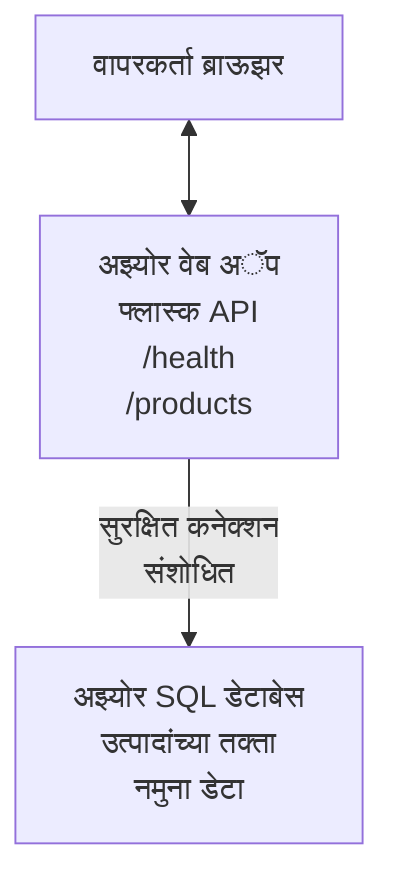

# AZD सह Microsoft SQL डेटाबेस आणि वेब अॅप तैनात करणे

⏱️ **अनुमानित वेळ**: 20-30 मिनीटं | 💰 **अनुमानित खर्च**: ~$15-25/महिना | ⭐ **संकुलता**: मध्यम

ही **पूर्ण, कार्यरत उदाहरण** [Azure Developer CLI (azd)](https://learn.microsoft.com/azure/developer/azure-developer-cli/) वापरून Microsoft SQL डेटाबेससह Python Flask वेब अॅप्लिकेशन Azure वर कसे तैनात करायचे हे दाखवते. सर्व कोड समाविष्ट आणि तपासलेला आहे—कोणत्याही बाह्य अवलंबित्वांचे आवश्यकता नाही.

## तुम्ही काय शिकणार आहात

हे उदाहरण पूर्ण केल्यावर, तुम्ही:
- मल्टी-टियर अॅप्लिकेशन (वेब अॅप + डेटाबेस) इन्फ्रास्ट्रक्चर-अस-कोड वापरून तैनात कराल
- हार्डकोड न करता सुरक्षित डेटाबेस कनेक्शन्स कॉन्फिगर कराल
- Application Insights सह अॅप्लिकेशनची तब्येत मॉनिटर कराल
- AZD CLI वापरून Azure संसाधने प्रभावी पद्धतीने व्यवस्थापित कराल
- Azure ची सुरक्षा, खर्च ऑप्टिमायझेशन, आणि निरीक्षणासाठी उत्तम पद्धतींचा अवलंब कराल

## परिदृश्याचे सारांश
- **वेब अॅप**: डेटाबेस कनेक्टिव्हिटीसह Python Flask REST API
- **डेटाबेस**: नमुना डेटासह Azure SQL डेटाबेस
- **इन्फ्रास्ट्रक्चर**: Bicep वापरून प्राव्हिजन केले (मॉड्युलर, पुनर्वापर करण्यायोग्य टेम्पलेट्स)
- **तैनाती**: `azd` आदेशांद्वारे पूर्णपणे स्वयंचलित
- **मॉनिटरिंग**: लॉग्स आणि टेलीमेट्रीसाठी Application Insights

## पूर्वअट

### आवश्यक साधने

सुरू करण्यापूर्वी, हे साधने स्थापित आहेत का ते तपासा:

1. **[Azure CLI](https://learn.microsoft.com/cli/azure/install-azure-cli)** (आवृत्ती 2.50.0 किंवा त्याहून वर)
   ```sh
   az --version
   # अपेक्षित आउटपुट: azure-cli 2.50.0 किंवा त्याहून उच्चतर
   ```

2. **[Azure Developer CLI (azd)](https://learn.microsoft.com/azure/developer/azure-developer-cli/install-azd)** (आवृत्ती 1.0.0 किंवा त्याहून वर)
   ```sh
   azd version
   # अपेक्षित आउटपुट: azd आवृत्ती 1.0.0 किंवा त्याहून अधिक
   ```

3. **[Python 3.8+](https://www.python.org/downloads/)** (स्थानिक विकासासाठी)
   ```sh
   python --version
   # अपेक्षित उत्पादन: Python 3.8 किंवा त्यापेक्षा अधिक
   ```

4. **[Docker](https://www.docker.com/get-started)** (ऐच्छिक, स्थानिक कंटेनर स्वरूपातील विकासासाठी)
   ```sh
   docker --version
   # अपेक्षित आउटपुट: Docker आवृत्ती 20.10 किंवा higher
   ```

### Azure आवश्यकता

- सक्रिय **Azure सदस्यता** ([मुफ्त खाते तयार करा](https://azure.microsoft.com/free/))
- सदस्यतेमध्ये संसाधने तयार करण्याचा अधिकृत प्रवेश
- सदस्यता किंवा संसाधन समूहावरील **Owner** किंवा **Contributor** भूमिका

### ज्ञानाची पूर्वअट

हे एक **मध्यम स्तराचे** उदाहरण आहे. तुम्हाला ओळखीचे असावे:
- मुलभूत कमांड-लाइन ऑपरेशन्स
- मूलभूत क्लाऊड संकल्पना (संसाधने, संसाधन गट)
- वेब अॅप्लिकेशन्स आणि डेटाबेसचे मूलभूत ज्ञान

**AZD मध्ये नवीन आहात?** प्रथम [Getting Started guide](../../docs/chapter-01-foundation/azd-basics.md) वाचा.

## आर्किटेक्चर

हे उदाहरण वेब अॅप्लिकेशन आणि SQL डेटाबेससह दोन-स्तरीय आर्किटेक्चर तैनात करते:


**संसाधन तैनाती:**
- **Resource Group**: सर्व संसाधनांसाठी कंटेनर
- **App Service Plan**: Linux-आधारित होस्टिंग (खर्च बचतीसाठी B1 टियर)
- **Web App**: Python 3.11 रनटाइमसह Flask अॅप्लिकेशन
- **SQL Server**: TLS 1.2 किमान असलेला व्यवस्थापित डेटाबेस सर्व्हर
- **SQL Database**: बेसिक टियर (2GB, विकास/तपासणीसाठी योग्य)
- **Application Insights**: मॉनिटरिंग आणि लॉगिंग
- **Log Analytics Workspace**: केंद्रीकृत लॉग साठवण

**तुलना**: याला एका रेस्तराँटसारखे समजा (वेब अॅप) ज्यात एक वॉक-इन फ्रीजर (डेटाबेस) आहे. ग्राहक मेन्यूवरून (API endpoints) ऑर्डर करतात, आणि स्वयंपाकघर (Flask अॅप) फ्रीजरमधून (डेटा) साहित्य आणते. रेस्तराँट व्यवस्थापक (Application Insights) सर्व घटनांवर लक्ष ठेवतो.

## फोल्डर रचना

सर्व फाइल्स या उदाहरणात समाविष्ट आहेत—कोणतेही बाहेरील अवलंबित्व नाही:

```
examples/database-app/
│
├── README.md                    # This file
├── azure.yaml                   # AZD configuration file
├── .env.sample                  # Sample environment variables
├── .gitignore                   # Git ignore patterns
│
├── infra/                       # Infrastructure as Code (Bicep)
│   ├── main.bicep              # Main orchestration template
│   ├── abbreviations.json      # Azure naming conventions
│   └── resources/              # Modular resource templates
│       ├── sql-server.bicep    # SQL Server configuration
│       ├── sql-database.bicep  # Database configuration
│       ├── app-service-plan.bicep  # Hosting plan
│       ├── app-insights.bicep  # Monitoring setup
│       └── web-app.bicep       # Web application
│
└── src/
    └── web/                    # Application source code
        ├── app.py              # Flask REST API
        ├── requirements.txt    # Python dependencies
        └── Dockerfile          # Container definition
```

**प्रत्येक फाइलचे कार्य:**
- **azure.yaml**: AZD ला काय आणि कुठे तैनात करायचे ते सांगते
- **infra/main.bicep**: सर्व Azure संसाधने आयोजित करते
- **infra/resources/*.bicep**: वैयक्तिक संसाधन परिभाषा (पुनर्वापरासाठी मॉड्युलर)
- **src/web/app.py**: डेटाबेस लॉजिकसह Flask अॅप्लिकेशन
- **requirements.txt**: Python पॅकेज अवलंबित्व
- **Dockerfile**: तैनातीसाठी कंटेनराइजेशन सूचनाएं

## जलद सुरुवात (पायर्‍या-दर-पायर्‍या)

### पायर्‍या 1: क्लोन करा आणि फाईल सिस्टममध्ये जा

```sh
git clone https://github.com/microsoft/AZD-for-beginners.git
cd AZD-for-beginners/examples/database-app
```

**✓ यश तपासा**: `azure.yaml` आणि `infra/` फोल्डर दिसत आहेत की नाही ते सत्यापित करा:
```sh
ls
# अपेक्षित: README.md, azure.yaml, infra/, src/
```

### पायर्‍या 2: Azure सह प्रमाणीकरण करा

```sh
azd auth login
```

हे तुमचा ब्राउझर उघडू लागेल Azure प्रमाणीकरणासाठी. तुमच्या Azure क्रेडेन्शियल्सने साइन इन करा.

**✓ यश तपासा**: तुमच्याकडे हे दिसायला पाहिजे:
```
Logged in to Azure.
```

### पायर्‍या 3: पर्यावरण प्रारंभ करा

```sh
azd init
```

**काय होते**: AZD तुमच्या तैनातील स्थानिक कॉन्फिगरेशन तयार करतो.

**तुम्हाला जे विचारले जाईल**:
- **Environment name**: लहान नाव द्या (उदा., `dev`, `myapp`)
- **Azure subscription**: सदस्यता निवडा
- **Azure location**: प्रदेश निवडा (उदा., `eastus`, `westeurope`)

**✓ यश तपासा**: तुम्हाला हे दिसेल:
```
SUCCESS: New project initialized!
```

### पायर्‍या 4: Azure संसाधने प्राव्हिजन करा

```sh
azd provision
```

**काय होते**: AZD सर्व इन्फ्रास्ट्रक्चर तैनात करतो (5-8 मिनिटे लागतात):
1. संसाधन समूह तयार करतो
2. SQL Server आणि डेटाबेस तयार करतो
3. App Service Plan तयार करतो
4. वेब अॅप तयार करतो
5. Application Insights तयार करतो
6. नेटवर्किंग आणि सुरक्षा कॉन्फिगर करतो

**तुम्हाला विचारले जाईल**:
- **SQL admin username**: वापरकर्तानाव द्या (उदा., `sqladmin`)
- **SQL admin password**: मजबूत पासवर्ड द्या (साठवा!)

**✓ यश तपासा**: तुम्हाला हे दिसावे:
```
SUCCESS: Your application was provisioned in Azure in X minutes Y seconds.
You can view the resources created under the resource group rg-<env-name> in Azure Portal:
https://portal.azure.com/#@/resource/subscriptions/.../resourceGroups/rg-<env-name>
```

**⏱️ वेळ**: 5-8 मिनिटे

### पायर्‍या 5: अॅप्लिकेशन तैनात करा

```sh
azd deploy
```

**काय होते**: AZD तुमचे Flask अॅप्लिकेशन बांधतो आणि तैनात करतो:
1. Python अॅप्लिकेशन पॅकेज करतो
2. Docker कंटेनर तयार करतो
3. Azure Web App ला पुश करतो
4. डेटाबेसमध्ये नमुना डेटा इंस्टॉल करतो
5. अॅप्लिकेशन सुरू करतो

**✓ यश तपासा**: खालीलप्रमाणे दिसावे:
```
SUCCESS: Your application was deployed to Azure in X minutes Y seconds.
You can view the resources created under the resource group rg-<env-name> in Azure Portal:
https://portal.azure.com/#@/resource/subscriptions/.../resourceGroups/rg-<env-name>
```

**⏱️ वेळ**: 3-5 मिनिटे

### पायर्‍या 6: अॅप्लिकेशन ब्राउझ करा

```sh
azd browse
```

हे तुमचा तैनात केलेला वेब अॅप ब्राउझरमध्ये उघडते `https://app-<unique-id>.azurewebsites.net` येथे

**✓ यश तपासा**: तुम्हाला JSON आउटपुट दिसेल:
```json
{
  "message": "Welcome to the Database App API",
  "endpoints": {
    "/": "This help message",
    "/health": "Health check endpoint",
    "/products": "List all products",
    "/products/<id>": "Get product by ID"
  }
}
```

### पायर्‍या 7: API Endpoints चाचणी करा

**Health Check** (डेटाबेस कनेक्शन तपासा):
```sh
curl https://app-<your-id>.azurewebsites.net/health
```

**अपेक्षित प्रतिसाद**:
```json
{
  "status": "healthy",
  "database": "connected"
}
```

**List Products** (नमुना डेटा):
```sh
curl https://app-<your-id>.azurewebsites.net/products
```

**अपेक्षित प्रतिसाद**:
```json
[
  {
    "id": 1,
    "name": "Laptop",
    "description": "High-performance laptop",
    "price": 1299.99,
    "created_at": "2025-11-19T10:30:00"
  },
  ...
]
```

**Get Single Product**:
```sh
curl https://app-<your-id>.azurewebsites.net/products/1
```

**✓ यश तपासा**: सर्व endpoints JSON डेटा त्रुटीशिवाय परत करतात.

---

**🎉 अभिनंदन!** तुम्ही AZD वापरून Azure वर वेब अॅप्लिकेशनसह डेटाबेस यशस्वीपणे तैनात केला आहे.

## कॉन्फिगरेशन डीप-डाईव्ह

### पर्यावरण चल

गुपित सुरक्षितपणे Azure App Service कॉन्फिगरेशनद्वारे व्यवस्थापित केले जाते—**स्रोत कोडमध्ये कधीही हार्डकोड केले जात नाहीत**.

**AZD द्वारे स्वयंचलित कॉन्फिगर:**
- `SQL_CONNECTION_STRING`: एन्क्रिप्टेड क्रेडेन्शियलसह डेटाबेस कनेक्शन
- `APPLICATIONINSIGHTS_CONNECTION_STRING`: मॉनिटरिंग टेलीमेट्री एंडपॉइंट
- `SCM_DO_BUILD_DURING_DEPLOYMENT`: स्वयंचलित अवलंबित्व स्थापना सक्षम करते

**गुपित कुठे साठवले जातात**:
1. `azd provision` दरम्यान तुम्ही SQL क्रेडेन्शियल सुरक्षित प्रम्पट्सद्वारे देता
2. AZD हे स्थानिक `.azure/<env-name>/.env` फाइलमध्ये साठवते (git-ignored)
3. AZD त्यांना Azure App Service कॉन्फिगरेशनमध्ये इंजेक्ट करते (विश्रांतीत एन्क्रिप्टेड)
4. अॅप्लिकेशन त्यांना `os.getenv()` द्वारे रनटाइममध्ये वाचते

### स्थानिक विकास

स्थानिक चाचणीसाठी, नमुन्यातून `.env` फाइल तयार करा:

```sh
cp .env.sample .env
# आपल्या स्थानिक डेटाबेस कनेक्शनसह .env संपादित करा
```

**स्थानिक विकास कार्यप्रवाह**:
```sh
# अवलंबित्व स्थापित करा
cd src/web
pip install -r requirements.txt

# पर्यावरणीय चल सेट करा
export SQL_CONNECTION_STRING="your-local-connection-string"

# अनुप्रयोग चालवा
python app.py
```

**स्थानिक चाचणी करा**:
```sh
curl http://localhost:8000/health
# अपेक्षित: {"स्थिती": "सुदृढ", "डेटाबेस": "जोडलेले"}
```

### इन्फ्रास्ट्रक्चर अ‍ॅज कोड

सर्व Azure संसाधने **Bicep टेम्पलेट्स** (`infra/` फोल्डर) मध्ये परिभाषित आहेत:

- **मॉड्युलर डिझाइन**: प्रत्येक संसाधन प्रकाराची स्वतंत्र फाइल पुनर्वापरासाठी
- **पॅरामीट्राईज्ड**: SKU, प्रदेश, नामकरण पद्धती सानुकूल करा
- **उत्तम पद्धती**: Azure नामकरण नियम व सुरक्षा ह्या प्रमाणे
- **संस्करण नियंत्रित**: Git मध्ये इन्फ्रास्ट्रक्चर बदल

**सानुकूलन उदाहरण**:
डेटाबेस टिअर बदलण्यासाठी `infra/resources/sql-database.bicep` संपादित करा:
```bicep
sku: {
  name: 'Standard'  // Changed from 'Basic'
  tier: 'Standard'
  capacity: 10
}
```

## सुरक्षा उत्तम पद्धती

हे उदाहरण Azure सुरक्षा उत्तम पद्धतींचे पालन करते:

### 1. **स्रोत कोडमध्ये कोणतेही गुपित नाहीत**
- ✅ क्रेडेन्शियल Azure App Service कॉन्फिगरेशनमध्ये संग्रहित (एन्क्रिप्टेड)
- ✅ `.env` फाइल्स `.gitignore` मध्ये असतात
- ✅ प्राव्हिजन दरम्यान सुरक्षित पॅरामीटर्सद्वारे गुपित दिले जातात

### 2. **एन्क्रिप्टेड कनेक्शन्स**
- ✅ SQL Server साठी किमान TLS 1.2
- ✅ Web App साठी HTTPS-चं फोर्स
- ✅ डेटाबेस कनेक्शन्स एन्क्रिप्टेड चॅनेल वापरतात

### 3. **नेटवर्क सुरक्षा**
- ✅ SQL Server फायरवॉल Azure सेवा केवळ परवानगी देते
- ✅ सार्वजनिक नेटवर्क प्रवेश प्रतिबंधित (खाजगी एंडपॉइंट वापरून आणखी कडक करू शकता)
- ✅ Web App वर FTPS बंद

### 4. **प्रमाणीकरण आणि अधिकृतता**
- ⚠️ **प्रचलित**: SQL प्रमाणीकरण (वापरकर्तानाव/पासवर्ड)
- ✅ **उत्पादन शिफारस**: पासवर्डशिवाय प्रमाणीकरणासाठी Azure Managed Identity वापरा

**मॅनेज्ड आयडेंटिटीसाठी अपग्रेड करा** (उत्पादनासाठी):
1. वेब अॅपवर मॅनेज्ड आयडेंटिटी सक्षम करा
2. SQL परवानग्या त्या आयडेंटिटीला द्या
3. कनेक्शन स्ट्रिंग मॅनेज्ड आयडेंटिटीसाठी अपडेट करा
4. पासवर्ड-आधारित प्रमाणीकरण काढून टाका

### 5. **ऑडिटिंग आणि अनुपालन**
- ✅ Application Insights सर्व विनंत्या आणि त्रुटी लॉग करतो
- ✅ SQL डेटाबेस ऑडिटिंग सक्षम (अनुपालनासाठी कॉन्फिगर करता येते)
- ✅ सर्व संसाधने शासनासाठी टॅग केलेले आहेत

**उत्पादनापूर्वी सुरक्षा तपासणी यादी**:
- [ ] SQL साठी Azure Defender सक्षम करा
- [ ] SQL डेटाबेससाठी खाजगी एंडपॉइंट कॉन्फिगर करा
- [ ] वेब अॅप्लिकेशन फायरवॉल (WAF) सक्षम करा
- [ ] गुपित रोटेशनसाठी Azure Key Vault वापरा
- [ ] Azure AD प्रमाणीकरण कॉन्फिगर करा
- [ ] सर्व संसाधनांसाठी डायग्नोस्टिक लॉगिंग सक्षम करा

## खर्च ऑप्टिमायझेशन

**अनुमानित मासिक खर्च** (नोव्हेंबर 2025 पर्यंत):

| संसाधन | SKU/टियर | अंदाजे खर्च |
|----------|----------|----------------|
| App Service Plan | B1 (बेसिक) | ~$13/महिना |
| SQL Database | बेसिक (2GB) | ~$5/महिना |
| Application Insights | वापरानुसार आकारणी | ~$2/महिना (कमी ट्रॅफिक) |
| **एकूण** | | **~$20/महिना** |

**💡 खर्च बचतीसाठी टिपा**:

1. **शिकण्यासाठी फ्री टियर वापरा**:
   - App Service: F1 टियर (मोफत, मर्यादित तास)
   - SQL Database: Azure SQL Database सर्व्हरलेस वापरा
   - Application Insights: 5GB/महिना मोफत इन्जेस्टेशन

2. **वापरात नसताना संसाधने थांबवा**:
   ```sh
   # वेब अॅप थांबवा (डेटाबेस अजूनही शुल्क आकारतो)
   az webapp stop --name <app-name> --resource-group <rg-name>
   
   # गरजेनुसार पुन्हा सुरू करा
   az webapp start --name <app-name> --resource-group <rg-name>
   ```

3. **तपासणी नंतर सर्व काही हटवा**:
   ```sh
   azd down
   ```
   यामुळे सर्व संसाधने हटतात आणि शुल्क थांबते.

4. **विकास विरुद्ध उत्पादन SKU**:
   - **विकासासाठी**: बेसिक टियर (या उदाहरणात वापरलेले)
   - **उत्पादनासाठी**: स्टँडर्ड/प्रिमियम टियर पुनरावृत्तींसह

**खर्चावर देखरेख**:
- [Azure Cost Management](https://portal.azure.com/#view/Microsoft_Azure_CostManagement) मध्ये खर्च पहा
- आश्चर्य टाळण्यासाठी खर्च अलर्ट सेट करा
- ट्रॅकिंगसाठी सर्व संसाधने `azd-env-name` टॅग करा

**फ्री टियर पर्याय**:
शिकण्यासाठी, तुम्ही `infra/resources/app-service-plan.bicep` बदला:
```bicep
sku: {
  name: 'F1'  // Free tier
  tier: 'Free'
}
```
**टीप**: फ्री टियरमध्ये मर्यादा आहेत (दिवसातून 60 मिनिटे CPU, सर्ववेळी चालू नाही).

## मॉनिटरिंग आणि निरीक्षण

### Application Insights समाकलन

हे उदाहरण **Application Insights** समाविष्ट करते सर्वसमावेशक मॉनिटरिंगसाठी:

**काय मॉनिटर केले जाते**:
- ✅ HTTP विनंत्या (विलंब, स्थिती कोड, endpoints)
- ✅ अॅप्लिकेशन त्रुटी आणि अपवाद
- ✅ Flask अॅप मधील सानुकूल लॉगिंग
- ✅ डेटाबेस कनेक्शनची तब्येत
- ✅ कार्यक्षमता मेट्रिक्स (CPU, मेमरी)

**Application Insights पर्यंत पोहोच**:
1. [Azure Portal](https://portal.azure.com) उघडा
2. तुमच्या संसाधन समूहात जा (`rg-<env-name>`)
3. Application Insights संसाधनावर क्लिक करा (`appi-<unique-id>`)

**उपयुक्त क्वेरीज** (Application Insights → Logs):

**सर्व विनंत्या पहा**:
```kusto
requests
| where timestamp > ago(1h)
| order by timestamp desc
| project timestamp, name, url, resultCode, duration
```

**त्रुटी शोधा**:
```kusto
exceptions
| where timestamp > ago(24h)
| order by timestamp desc
| project timestamp, type, outerMessage, operation_Name
```

**Health Endpoint तपासा**:
```kusto
requests
| where name contains "health"
| summarize count() by resultCode, bin(timestamp, 1h)
```

### SQL डेटाबेस ऑडिटिंग

**SQL डेटाबेस ऑडिटिंग सक्षम आहे** जे ट्रॅक करते:
- डेटाबेस प्रवेश पॅटर्न
- अयशस्वी लॉगिन प्रयत्न
- योजना बदल
- डेटा प्रवेश (अनुपालनासाठी)

**ऑडिट लॉग्स बघा**:
1. Azure Portal → SQL डेटाबेस → ऑडिटिंग
2. Log Analytics कार्यक्षेत्रात लॉग पहा

### रिअल-टाइम मॉनिटरिंग

**लाइव्ह मेट्रिक्स बघा**:
1. Application Insights → Live Metrics
2. विनंत्या, अयशस्वी आणि कार्यक्षमता रिअल-टाइममध्ये पहा

**अलर्ट सेट करा**:
महत्त्वाच्या घटनांसाठी अलर्ट तयार करा:
- HTTP 500 त्रुटी > 5 पाच मिनिटांत
- डेटाबेस कनेक्शन अयशस्वी
- उच्च प्रतिसाद वेळ (>2 सेकंद)

**अलर्ट तयार करण्याचे उदाहरण**:
```sh
az monitor metrics alert create \
  --name "High-Response-Time" \
  --resource-group <rg-name> \
  --scopes <app-insights-resource-id> \
  --condition "avg requests/duration > 2000" \
  --description "Alert when response time exceeds 2 seconds"
```

## समस्या निवारण
### सामान्य समस्या आणि उपाय

#### 1. `azd provision` "Location not available" त्रुटीसह अयशस्वी

**लक्षण**:
```
Error: The subscription is not registered for the resource type 'components' in the location 'centralus'.
```

**उपाय**:
कृपया वेगळा Azure प्रदेश निवडा किंवा रिसोर्स प्रोव्हायडर नोंदणी करा:
```sh
az provider register --namespace Microsoft.Insights
```

#### 2. SQL कनेक्शन डिप्लॉयमेंट दरम्यान अयशस्वी

**लक्षण**:
```
pyodbc.OperationalError: ('08001', '[08001] [Microsoft][ODBC Driver 18 for SQL Server]TCP Provider...')
```

**उपाय**:
- SQL Server फायरवॉल Azure सेवा परवानगी देते का तपासा (आपोआप कॉन्फिगर केले जाते)
- `azd provision` दरम्यान SQL प्रशासक पासवर्ड बरोबर टाकला आहे का तपासा
- SQL Server पूर्णपणे प्राव्हिजन झाला आहे की नाही हे खात्री करा (2-3 मिनिटे लागू शकतात)

**कनेक्शन तपासा**:
```sh
# Azure Portal वरून, SQL Database → Query editor वर जा
# तुमच्या प्रवेश माहितीने कनेक्ट होण्याचा प्रयत्न करा
```

#### 3. वेब अॅप "Application Error" दर्शवित आहे

**लक्षण**:
ब्राउझर सामान्य त्रुटी पृष्ठ दर्शवित आहे.

**उपाय**:
अॅप्लिकेशन लॉग तपासा:
```sh
# अलीकडील नोंदी पहा
az webapp log tail --name <app-name> --resource-group <rg-name>
```

**सामान्य कारणे**:
- पर्यावरणीय बदल(variables) चुकलेले (App Service → Configuration तपासा)
- Python पॅकेज इंस्टॉलेशन अयशस्वी (डिप्लॉयमेंट लॉग तपासा)
- डेटाबेस प्रारंभिकरण त्रुटी (SQL कनेक्टिव्हिटी तपासा)

#### 4. `azd deploy` "Build Error" त्रुटीसह अयशस्वी

**लक्षण**:
```
Error: Failed to build project
```

**उपाय**:
- `requirements.txt` मध्ये कोणतीही सिंटॅक्स त्रुटी नाही याची खात्री करा
- `infra/resources/web-app.bicep` मध्ये Python 3.11 स्पष्टपणे दिलेले आहे का तपासा
- Dockerfile मध्ये बरोबर बेस इमेज आहे का तपासा

**स्थानिक डीबग करा**:
```sh
cd src/web
docker build -t test-app .
docker run -p 8000:8000 test-app
```

#### 5. AZD कमांड्स चालवताना "Unauthorized" त्रुटी

**लक्षण**:
```
ERROR: (Unauthorized) The client '<id>' with object id '<id>' does not have authorization
```

**उपाय**:
Azure मध्ये पुन्हा प्रमाणीकरण करा:
```sh
azd auth login
az login
```

सदस्यत्वावर योग्य परवानग्या (Contributor भूमिका) आहेत का तपासा.

#### 6. उच्च डेटाबेस खर्च

**लक्षण**:
अप्रत्याशित Azure बिल.

**उपाय**:
- चाचणी नंतर `azd down` चालवायला विसरलेत का तपासा
- SQL डेटाबेस Basic टियर वापरत आहे का तपासा (Premium नाही)
- Azure Cost Management मध्ये खर्चांची समीक्षा करा
- खर्च अलर्ट सेट करा

### मदत कशी मिळवाल

**सर्व AZD पर्यावरणीय बदल पहा**:
```sh
azd env get-values
```

**डिप्लॉयमेंट स्थिती तपासा**:
```sh
az webapp show --name <app-name> --resource-group <rg-name> --query state
```

**अॅप्लिकेशन लॉग ऍक्सेस करा**:
```sh
az webapp log download --name <app-name> --resource-group <rg-name> --log-file app-logs.zip
```

**अधिक मदतीची गरज आहे?**
- [AZD Troubleshooting Guide](../../docs/chapter-07-troubleshooting/common-issues.md)
- [Azure App Service Troubleshooting](https://learn.microsoft.com/azure/app-service/troubleshoot-diagnostic-logs)
- [Azure SQL Troubleshooting](https://learn.microsoft.com/azure/azure-sql/database/troubleshoot-common-errors-issues)

## व्यावहारिक व्यायाम

### व्यायाम 1: तुमचे डिप्लॉयमेंट तपासा (सुरुवातीसाठी)

**उद्दिष्ट**: सर्व संसाधने डिप्लॉय झाली आहेत आणि अॅप्लिकेशन काम करत आहे याची पुष्टी करा.

**टप्पे**:
1. तुमच्या संसाधन समूहातील सर्व संसाधने यादी करा:
   ```sh
   az resource list --resource-group rg-<env-name> --output table
   ```
   **अपेक्षित**: 6-7 संसाधने (Web App, SQL Server, SQL Database, App Service Plan, Application Insights, Log Analytics)

2. सर्व API endpoints चाचणी करा:
   ```sh
   curl https://app-<your-id>.azurewebsites.net/
   curl https://app-<your-id>.azurewebsites.net/health
   curl https://app-<your-id>.azurewebsites.net/products
   curl https://app-<your-id>.azurewebsites.net/products/1
   ```
   **अपेक्षित**: सर्व वैध JSON परत करतात, कोणतीही त्रुटी नाही

3. Application Insights तपासा:
   - Azure Portal मध्ये Application Insights वर जा
   - "Live Metrics" वर जा
   - वेब अॅपवर ब्राउझर रीफ्रेश करा
   **अपेक्षित**: वास्तविक वेळेत विनंत्या दिसतील

**यशस्वी निकष**: सर्व 6-7 संसाधने अस्तित्वात आहेत, सर्व endpoints डेटा परत करतात, Live Metrics मध्ये सक्रियता दिसते.

---

### व्यायाम 2: नवीन API Endpoint जोडा (मध्यम)

**उद्दिष्ट**: Flask अॅप्लिकेशनमध्ये नवीन endpoint जोडा.

**प्रारंभिक कोड**: सध्या `src/web/app.py` मधील endpoints

**टप्पे**:
1. `src/web/app.py` संपादित करा आणि `get_product()` फंक्शन नंतर नवीन endpoint जोडा:
   ```python
   @app.route('/products/search/<keyword>')
   def search_products(keyword):
       """Search products by name or description."""
       try:
           conn = get_db_connection()
           cursor = conn.cursor()
           cursor.execute(
               "SELECT id, name, description, price, created_at FROM products WHERE name LIKE ? OR description LIKE ?",
               (f'%{keyword}%', f'%{keyword}%')
           )
           
           products = []
           for row in cursor.fetchall():
               products.append({
                   'id': row[0],
                   'name': row[1],
                   'description': row[2],
                   'price': float(row[3]) if row[3] else None,
                   'created_at': row[4].isoformat() if row[4] else None
               })
           
           cursor.close()
           conn.close()
           
           logger.info(f"Search for '{keyword}' returned {len(products)} results")
           return jsonify(products), 200
           
       except Exception as e:
           logger.error(f"Error searching products: {str(e)}")
           return jsonify({'error': str(e)}), 500
   ```

2. अपडेट केलेले अॅप्लिकेशन डिप्लॉय करा:
   ```sh
   azd deploy
   ```

3. नवीन endpoint ची चाचणी करा:
   ```sh
   curl https://app-<your-id>.azurewebsites.net/products/search/laptop
   ```
   **अपेक्षित**: "laptop" शी जुळणारे उत्पादने परत करतो

**यशस्वी निकष**: नवीन endpoint कार्यरत आहे, फिल्टर केलेले निकाल परत देतो, Application Insights लॉगमध्ये दिसतो.

---

### व्यायाम 3: मॉनिटरींग आणि अलर्ट्स जोडा (प्रगत)

**उद्दिष्ट**: सक्रिय मॉनिटरींगसाठी अलर्ट्स तयार करा.

**टप्पे**:
1. HTTP 500 त्रुटींसाठी अलर्ट तयार करा:
   ```sh
   # अनुप्रयोग अंतर्दृष्टी संसाधन आयडी मिळवा
   AI_ID=$(az monitor app-insights component show \
     --app appi-<your-id> \
     --resource-group rg-<env-name> \
     --query id -o tsv)
   
   # सूचना तयार करा
   az monitor metrics alert create \
     --name "High-Error-Rate" \
     --resource-group rg-<env-name> \
     --scopes $AI_ID \
     --condition "count requests/failed > 5" \
     --window-size 5m \
     --evaluation-frequency 1m \
     --description "Alert when >5 failed requests in 5 minutes"
   ```

2. त्रुटी निर्माण करून अलर्ट ट्रिगर करा:
   ```sh
   # अस्तित्वात नसलेला उत्पादन अनुरोध करा
   for i in {1..10}; do curl https://app-<your-id>.azurewebsites.net/products/999; done
   ```

3. अलर्ट लागू झाला आहे का तपासा:
   - Azure Portal → Alerts → Alert Rules
   - तुमचा ईमेल तपासा (जर कॉन्फिगर केले असेल तर)

**यशस्वी निकष**: अलर्ट नियम तयार झाला आहे, त्रुटींच्या वेळी ट्रिगर होतो, नोटिफिकेशन प्राप्त होतात.

---

### व्यायाम 4: डेटाबेस स्कीमा बदल (प्रगत)

**उद्दिष्ट**: नवीन तक्ती तयार करा आणि अॅप्लिकेशनमध्ये त्याचा वापर करा.

**टप्पे**:
1. Azure Portal Query Editor द्वारे SQL डेटाबेसशी कनेक्ट करा

2. नवीन `categories` तक्ती तयार करा:
   ```sql
   CREATE TABLE categories (
       id INT PRIMARY KEY IDENTITY(1,1),
       name NVARCHAR(50) NOT NULL,
       description NVARCHAR(200)
   );
   
   INSERT INTO categories (name, description) VALUES
   ('Electronics', 'Electronic devices and accessories'),
   ('Office Supplies', 'Office equipment and supplies');
   
   -- Add category to products table
   ALTER TABLE products ADD category_id INT;
   UPDATE products SET category_id = 1; -- Set all to Electronics
   ```

3. `src/web/app.py` मध्ये प्रतिसादांमध्ये category माहिती समाविष्ट करा

4. डिप्लॉय आणि चाचणी करा

**यशस्वी निकष**: नवीन तक्ता अस्तित्वात आहे, उत्पादने category माहितीशी दाखवतात, अॅप्लिकेशन अजूनही कार्यरत आहे.

---

### व्यायाम 5: कॅशिंग अंमलात आणा (तज्ञ)

**उद्दिष्ट**: Azure Redis Cache वापरून कार्यक्षमता सुधारित करा.

**टप्पे**:
1. `infra/main.bicep` मध्ये Redis Cache जोडा
2. `src/web/app.py` मध्ये उत्पादन क्वेरी कॅश करण्यासाठी अपडेट करा
3. Application Insights ने कार्यक्षमता सुधारणा मापा
4. कॅशिंगपूर्वी व नंतर प्रतिसाद वेळांची तुलना करा

**यशस्वी निकष**: Redis डिप्लॉय झाला आहे, कॅशिंग कार्यरत आहे, प्रतिसाद वेळ >50% सुधारली आहे.

**सूचना**: सुरू करण्यासाठी [Azure Cache for Redis documentation](https://learn.microsoft.com/azure/azure-cache-for-redis/) पहा.

---

## साफसफाई

सतत चार्ज होण्यापासून टाळण्यासाठी, पूर्ण झाले की सर्व संसाधने काढा:

```sh
azd down
```

**पुष्टीकरण प्रॉम्प्ट**:
```
? Total resources to delete: 7, are you sure you want to continue? (y/N)
```

पुष्टीसाठी `y` टाइप करा.

**✓ यशस्वी तपासणी**: 
- Azure Portal मधून सर्व संसाधने हटवली गेली आहेत
- कोणतेही चालू शुल्क नाहीत
- स्थानिक `.azure/<env-name>` फोल्डर हटवता येईल

**पर्याय** (इन्फ्रास्ट्रक्चर ठेवा, फक्त डेटा हटवा):
```sh
# फक्त रिसोर्स ग्रुप हटवा (AZD कॉन्फिग ठेवा)
az group delete --name rg-<env-name> --yes
```
## अधिक जाणून घ्या

### संबंधित दस्तऐवजीकरण
- [Azure Developer CLI Documentation](https://learn.microsoft.com/azure/developer/azure-developer-cli/)
- [Azure SQL Database Documentation](https://learn.microsoft.com/azure/azure-sql/database/)
- [Azure App Service Documentation](https://learn.microsoft.com/azure/app-service/)
- [Application Insights Documentation](https://learn.microsoft.com/azure/azure-monitor/app/app-insights-overview)
- [Bicep Language Reference](https://learn.microsoft.com/azure/azure-resource-manager/bicep/)

### या कोर्समधील पुढील टप्पे
- **[Container Apps Example](../../../../examples/container-app)**: Azure Container Apps सह मायक्रोसर्व्हिसेस डिप्लॉय करा
- **[AI Integration Guide](../../../../docs/ai-foundry)**: तुमच्या अॅपमध्ये AI क्षमतांचा समावेश करा
- **[Deployment Best Practices](../../docs/chapter-04-infrastructure/deployment-guide.md)**: उत्पादनासाठी डिप्लॉयमेंट नमुने

### प्रगत विषय
- **Managed Identity**: पासवर्ड काढून टाका आणि Azure AD प्रमाणीकरण वापरा
- **Private Endpoints**: वर्च्युअल नेटवर्कमध्ये डेटाबेस कनेक्शन सुरक्षित करा
- **CI/CD Integration**: GitHub Actions किंवा Azure DevOps द्वारे डिप्लॉयमेंट स्वयंचलित करा
- **Multi-Environment**: dev, staging, production वातावरण ठेवा
- **Database Migrations**: Alembic किंवा Entity Framework वापरून स्कीमा आवृत्ती व्यवस्थापन करा

### इतर पद्धतीशी तुलना

**AZD विरुद्ध ARM टेम्पलेट्स**:
- ✅ AZD: उच्चस्तरीय सारांश, सोपे कमांड
- ⚠️ ARM: अधिक तपशीलवार, सूक्ष्म नियंत्रण

**AZD विरुद्ध Terraform**:
- ✅ AZD: Azure-नेटिव्ह, Azure सेवा सह एकत्रित
- ⚠️ Terraform: बहु-क्लाउड सपोर्ट, मोठा इकोसिस्टम

**AZD विरुद्ध Azure Portal**:
- ✅ AZD: पुनरावृत्तीयोग्य, आवृत्तीवर नियंत्रण, स्वचालित
- ⚠️ Portal: मॅन्युअल क्लिक, पुनरुत्पादन कठीण

**AZD सोबत तुलना करा**: Azure साठी Docker Compose—सर्वसाधारण डिप्लॉयमेंटसाठी सुलभ कॉन्फिगरेशन.

---

## वारंवार विचारले जाणारे प्रश्न

**प्र: मी वेगळे प्रोग्रामिंग भाषा वापरू शकतो का?**  
उ: होय! `src/web/` बदलून Node.js, C#, Go किंवा कोणतीही भाषा वापरू शकता. `azure.yaml` आणि Bicep नुसार अपडेट करा.

**प्र: मी अधिक डेटाबेस कसे जोडू?**  
उ: `infra/main.bicep` मध्ये आणखी SQL Database मॉड्यूल जोडा किंवा Azure Database सेवा मधील PostgreSQL/MySQL वापरा.

**प्र: मी हे प्रॉडक्शनसाठी वापरू शकतो का?**  
उ: हा एक सुरुवातीचा बिंदू आहे. प्रॉडक्शनसाठी, managed identity, private endpoints, redundancy, बॅकअप धोरण, WAF, आणि सुधारित मॉनिटरींग जोडा.

**प्र: मला कोड डिप्लॉयमेंटऐवजी कंटेनर्स वापरायचे असतील तर?**  
उ: संपूर्णपणे Docker कंटेनर्स वापरणारे [Container Apps Example](../../../../examples/container-app) पाहा.

**प्र: माझ्या स्थानिक मशीनवरून डेटाबेसशी कसे कनेक्ट करू?**  
उ: तुमचा IP SQL Server फायरवॉलमध्ये जोडा:
```sh
az sql server firewall-rule create \
  --resource-group rg-<env-name> \
  --server sql-<unique-id> \
  --name AllowMyIP \
  --start-ip-address <your-ip> \
  --end-ip-address <your-ip>
```

**प्र: नवीन डेटाबेस तयार न करता आधीच्या डेटाबेसचा वापर करु शकतो का?**  
उ: होय, `infra/main.bicep` मध्ये पूर्वीचा SQL Server संदर्भ द्या आणि कनेक्शन स्ट्रिंगचे घटक अपडेट करा.

---

> **टीप:** या उदाहरणात AZD वापरून डेटाबेससह वेब अॅप डिप्लॉय करण्याच्या सर्वोत्तम सरावांचे प्रदर्शन केले आहे. यात कार्यशील कोड, सविस्तर दस्तऐवजीकरण, आणि शिकण्यासाठी व्यावहारिक व्यायामांचा समावेश आहे. उत्पादनासाठी डिप्लॉयमेंट करताना तुमच्या संस्थेच्या सुरक्षा, स्केलिंग, अनुपालन, आणि खर्चाच्या गरजांचा आढावा घ्या.

**📚 कोर्स नेव्हिगेशन:**
- ← मागील: [Container Apps Example](../../../../examples/container-app)
- → पुढील: [AI Integration Guide](../../../../docs/ai-foundry)
- 🏠 [कोर्स मुख्यपृष्ठ](../../README.md)

---

<!-- CO-OP TRANSLATOR DISCLAIMER START -->
**सूचना**:
हा दस्तऐवज AI अनुवाद सेवा [Co-op Translator](https://github.com/Azure/co-op-translator) वापरून अनुवादित करण्यात आला आहे. आम्ही अचूकतेसाठी प्रयत्न करतो, तरी कृपया लक्षात ठेवा की स्वयंचलित अनुवादांमध्ये चुका किंवा अपूर्णता असू शकते. मूळ दस्तऐवज त्याच्या स्थानिक भाषेत अधिकृत स्रोत मानला जातो. महत्त्वाची माहिती असलेल्या बाबतीत व्यावसायिक मानवी अनुवादाची शिफारस केली जाते. या अनुवादाच्या वापरामुळे झालेल्या कोणत्याही गैरसमज किंवा चुकीच्या अर्थव्यक्तीबद्दल आम्ही जबाबदार नाही.
<!-- CO-OP TRANSLATOR DISCLAIMER END -->